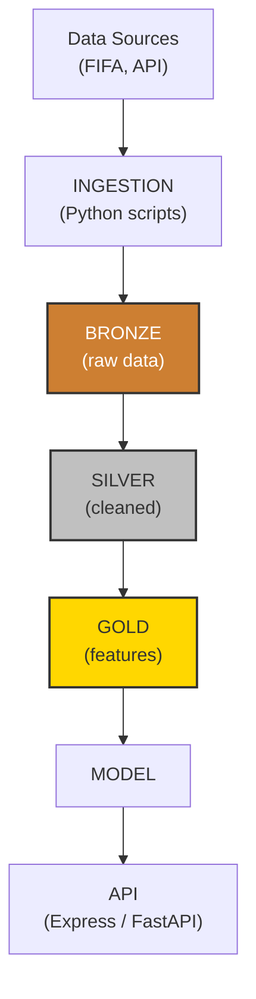

## Endurecimiento de la arquitectura de datos

El flujo Bronze → Silver → Gold es útil si cada transición tiene un contrato verificable. **Bronze** conserva el dato de origen inmutable y metadatos de ingesta; **Silver** normaliza, deduplica y valida esquema; **Gold** expone conjuntos versionados orientados al consumo analítico o a *features*. No deben reutilizarse datos Gold sin registrar su versión, ventana temporal y regla de cálculo.

### Contratos de calidad y evaluación

- Define para cada fuente: propietario, frecuencia, clave de deduplicación, zona horaria, esquema esperado y política de datos tardíos.
- Haz la ingesta idempotente con una clave natural o un identificador de evento; una reejecución no debe duplicar observaciones.
- Separa datos de entrenamiento, validación y prueba temporalmente cuando el objetivo sea predecir eventos futuros; evita que información posterior al partido entre en las *features*.
- Para una clasificación probabilística, calibra y registra tanto discriminación como calibración. La pérdida logarítmica binaria es:

$$
\mathcal{L}_{\mathrm{BCE}} = -\frac{1}{n}\sum_{i=1}^{n}\left[y_i\log(\hat{p}_i) + (1-y_i)\log(1-\hat{p}_i)\right].
$$

La decisión de producto no debe usar solo la métrica global: fija umbrales según coste de falsos positivos y falsos negativos, revisa el rendimiento por competición/temporada y monitoriza *drift* después del despliegue.

<!-- self-study-knowledge-context -->
## Contexto de estudio
- Dominio: [[MOC-Self-Study#Data Science & Engineering|Ciencia e ingeniería de datos]].
- Criterio de producción: Preserva linaje, esquemas y calidad de datos; separa datos crudos, validados y listos para consumo antes de modelar o publicar.
