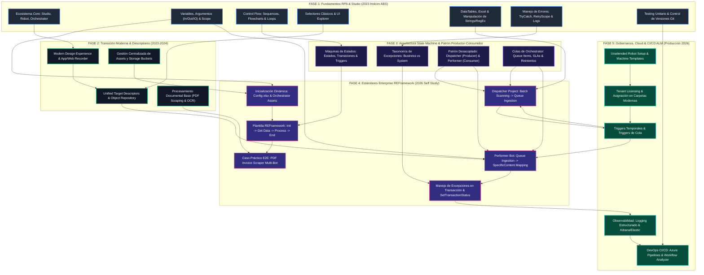

# Master Map of Content (MOC): UiPath RPA Architecture & Knowledge Graph

> **Knowledge Engineering Note**: Este repositorio consolida la base de conocimientos unificada de RPA en UiPath, fusionando los **Fundamentos Sólidos (2023 - Holcim ABS)** con los **Estándares Enterprise y REFramework Avanzado (2026 - Self Study)**. 
> Cada documento cuenta con metadata Frontmatter estandarizada y enlaces bidireccionales `[[...]]` para habilitar navegación semántica en Obsidian.

---

## 1. Diagrama de Flujo Arquitectónico: Del Fundamento al Estándar Enterprise

El siguiente diagrama Mermaid visualiza la transición arquitectónica y la integración metodológica entre los fundamentos de 2023 y la arquitectura productiva desacoplada de 2026:

---

## 2. Índice Maestro de Contenidos por Pilar Arquitectónico

### Pilar I: Ecosistema de Plataforma y Aprovisionamiento
* **Fundamentos 2023**:
  * [[1. UiPath Platform Overview]]: Arquitectura integral del ecosistema.
  * [[2. Introducing the Studio-Robot-Orchestrator Ecosystem]]: Interconexión de componentes principales.
  * [[3. First Run with UiPath]]: Configuración y primera ejecución.
  * [[4. Glosary and Terms Abbreviations]]: Glosario técnico y nomenclatura oficial.
  * [[1. Exploring UiPath Studio Interface]]: Paneles y ribbons de diseño.
  * [[4. A Day in the Life of an RPA Developer]]: Metodología y ciclo de vida de desarrollo RPA.
* **Estándares Enterprise 2026**:
  * [[9. Overview of Process Automation with UiPath]]: Visión estratégica de automatización en la empresa.
  * [[3. Unattended Robot Setup]]: Configuración de robots desatendidos en máquinas dedicadas.
  * [[3. Allocate Unattended Licence to Tenant]]: Aprovisionamiento y asignación de licencias en tenants de Orchestrator.
  * [[4. Installing UiPath Robot on Your Machine]]: Instalación del runtime en modo servicio vs modo usuario.
  * [[5. Signing In to License the UiPath Robot]]: Autenticación interactiva y vinculación de máquinas.
  * [[6. Creating a New Process in UiPath Studio]]: Creación de soluciones bajo estándares de gobernanza y Git.

---

### Pilar II: Variables, Argumentos y Manipulación de Datos
* **Fundamentos 2023**:
  * [[5. Variables and Arguments in Studio]]: Nomenclatura (`In_`, `Out_`, `IO_`), Scope, GenericValue y Tipos .NET.
  * [[1. DataTables and Excel]]: Operaciones con hojas de cálculo y DataTables en memoria.
  * [[2. Workbooks and Common Activities]]: Acceso directo sin interoperabilidad COM (Fast Workbook).
  * [[3. Modern Design Excel Activities]]: Integración moderna con Excel Application Scope / Excel Process Scope.
  * [[1. Introduction]]: Fundamentos de manipulación de datos textuales.
  * [[2. String Methods and Properties]]: Métodos .NET de Strings (`Split`, `Substring`, `Contains`, `Replace`).
  * [[3. RegEX Builder]]: Expresiones regulares y validación de patrones en Studio.
  * [[4. Data Manipulation With Lists and Dictionaries]]: Colecciones dinámicas y pares clave-valor `Dictionary(Of String, Object)`.
* **Estándares Enterprise 2026**:
  * [[18. Using SpecificContent]]: Protocolo de extracción fuertemente tipada desde payloads de Queue Items.
  * [[16. Update Config File in UiPath]]: Inicialización e inyección del diccionario global `Config` (`Config.xlsx`).
  * [[13. Practice Activity - For Each File in Input Folder]]: Procesamiento por lotes de archivos mediante `System.IO.FileInfo`.

---

### Pilar III: Selectores, Descriptores y UI Automation
* **Fundamentos 2023**:
  * [[7. Introduction to User Interface (UI) Automation]]: Fundamentos de detección de elementos en pantalla.
  * [[8. Cómo funciona UI Automation]]: Mecanismo de capas de hardware, API de accesibilidad y drivers.
  * [[10. UI Automation with the Classic Experience]]: Actividades clásicas (Click, Type Into, Attach Window).
  * [[9. UI Automation With the Modern Experience]]: Experiencia moderna con App/Web Recorder.
  * [[1. Introducing Selectors]]: Estructura XML de selectores en UiPath.
  * [[2. The UI Explorer]]: Inspección visual profunda del árbol de la interfaz de usuario.
  * [[3. Types of Selectors]]: Selectores completos, parciales, dinámicos con variables y wildcards.
  * [[1. Advanced Options of Selection]]: Opciones avanzadas y anclajes (Anchor Base / Modern Anchors).
  * [[2. Introducing Descriptors]]: Descriptores unificados (Unified Target: Selector + Fuzzy + Image + Anchor).
  * [[3. Validating Descriptors]]: Validación y porcentaje de confiabilidad de descriptores.
  * [[4. Fine Tuning Descriptors]]: Ajuste fino de selectores y filtrado de atributos volátiles.
  * [[5. Object Repository]]: Repositorio centralizado de UI y librerías de componentes reutilizables.
* **Estándares Enterprise 2026**:
  * [[20. Open Each PDF in Microsoft Edge-Chrome-Etc]]: Automatización de visualizadores modernos de documentos en navegadores Web.
  * [[21. Structured vs Semi-structured vs Unstructured Documents]]: Taxonomía de extracción documental para Document Understanding.

---

### Pilar IV: Control de Flujo, Modularidad y Organización de Proyectos
* **Fundamentos 2023**:
  * [[6. Control Flow in Studio]]: Estructuras de decisión (If, Switch, While, Do While, For Each).
  * [[1. Choosing the Workflow Layout]]: Criterios para elegir Sequence, Flowchart o State Machine.
  * [[2. Organizando Proyectos en los Workflows]]: Principio de responsabilidad única (Single Responsibility Principle).
  * [[3. Librerías]]: Creación y consumo de paquetes NuGet reutilizables (`.nupkg`).
  * [[1. Introduction to Version Control Systems]]: Gestión de código fuente con Git en Studio.
  * [[2. Closer Look at Git]]: Ramas, commits, push y resolución de conflictos en equipos.
* **Estándares Enterprise 2026**:
  * [[2. Using the REFramework Template]]: Desglose modular de la solución REFramework (`Framework/` folder).
  * [[12. Create Dispatcher Project]]: Estructuración desacoplada del proyecto Productor.

---

### Pilar V: Máquinas de Estados y Robotic Enterprise Framework (REFramework)
* **Fundamentos 2023**:
  * [[1. Workflow Design - Overview]]: Patrones arquitectónicos para procesos de misión crítica.
  * [[2. Understanding State Machines]]: Anatomía de State Machines: States, Initial State, Final State, Transitions y Triggers.
  * [[1. State Machines]]: Implementación práctica de diagramas de estado.
  * [[1. Recap - Transactions and Types of Processes]]: Clasificación de procesos: Lineales, Iterativos y Transaccionales.
  * [[2. Introduction to Robotic Enterprise Framework]]: Filosofía y estructura del framework estándar de UiPath.
  * [[2. The Dispatcher and Perfomer (Producer and Consumer) Model]]: Patrón desacoplado de colas Productor-Consumidor.
  * [[3. Introducing the REFramework Template]]: Desglose de `Main.xaml`, estados nativos y variables globales.
  * [[1. The REFramwork without Queue Items Development Checklist]]: Adaptación de REFramework para fuentes de datos tabulares (DataRow / Excel / DB).
  * [[2. Whiteboard the Automation Project Workflows]]: Diseño visual previo y especificación de flujos invocados.
  * [[3. Build a REFramework Project With Tabular Data]]: Implementación completa de REFramework basada en DataTable.
  * [[Quiz]]: Validación de conocimientos sobre REFramework y State Machines.
* **Estándares Enterprise 2026**:
  * [[10. Overview of REFramework]]: Análisis exhaustivo de los 4 estados principales (`Init`, `Get Transaction Data`, `Process Transaction`, `End Process`).
  * [[1. PDF Invoice Scraper Demo]]: Caso de estudio productivo: Extracción automatizada de facturas PDF multi-bot.
  * [[12. Create Dispatcher Project]]: Creación del bot Dispatcher que itera el directorio de facturas y publica en colas.
  * [[17. Running the Performer Bot in UiPath]]: Ejecución y orquestación del bot Performer consumiendo la cola en tiempo real.

---

### Pilar VI: Manejo de Excepciones, Resiliencia y Observabilidad
* **Fundamentos 2023**:
  * [[1. System Business Exceptions]]: Taxonomía fundamental: `BusinessRuleException` (regla de negocio) vs `SystemException` (fallo de infraestructura/aplicación).
  * [[2. TryCatch, Throw and Rethrow]]: Captura jerárquica de excepciones y propagación de errores.
  * [[3. Retry Scope]]: Reintentos atómicos y acotados para pasos con alta latencia o volatilidad de UI.
  * [[4. ContinueOnError Property]]: Casos válidos y riesgos del uso de `ContinueOnError`.
  * [[5. Global Exception Handler]]: Mecanismo global de intercepción y recuperación ante fallos imprevistos.
  * [[1. Debugging Features Overview]]: Técnicas de diagnóstico en Studio: Breakpoints, Step Into, Watch e Immediate Panel.
  * [[1. Types of Logs in UiPath]]: Niveles de registro: `Trace`, `Info`, `Warn`, `Error`, `Fatal`.
  * [[2. Acceso y lectura de registros de ejecución de robots]]: Consulta de registros locales y logs en Orchestrator / Elasticsearch.
  * [[3. Logging Recommendations]]: Puntos de control (Checkpoints) obligatorios en entrada y salida de subprocesos.
* **Estándares Enterprise 2026**:
  * [[15. Using Try Catch for Exception Handling in UiPath]]: Integración de bloques TryCatch dentro de la capa `Process.xaml` en REFramework.
  * [[19. Logging the Current Invoice Name in UiPath]]: Trazabilidad granular registrando metadatos del ítem procesado para auditoría.

---

### Pilar VII: Orquestación, Colas, Triggers y Testing
* **Fundamentos 2023**:
  * [[1. Introducing UiPath Orchestrator]]: Portal web para administración centralizada de la fuerza de trabajo digital.
  * [[2. Orchestrator Entities, Tenants, and Folders]]: Jerarquía multi-tenant, carpetas clásicas vs carpetas modernas.
  * [[3. Robot Provisioning and License Distribution]]: Gestión de licencias attended, unattended y testing.
  * [[4. Unattended Automation With Folders]]: Ejecución en segundo plano gobernada por carpetas y permisos.
  * [[1. Orchestrator Resources in Studio]]: Vinculación de recursos en tiempo de diseño desde el panel Data Manager.
  * [[2. Libraries and Templates in Orchestrator]]: Feeds de paquetes NuGet y distribución de plantillas corporativas.
  * [[3. Storage Buckets]]: Almacenamiento seguro de archivos no estructurados en la nube.
  * [[4. Queues]]: Definición de colas, tipos de datos, prioridades y políticas de auto-reintento.
  * [[5. Transactions and Types of Processes]]: Estados de una transacción (`New`, `InProgress`, `Successful`, `Failed`, `Retried`, `Abandoned`).
  * [[1. Introduction to RPA Testing]]: Introducción a UiPath Test Suite y Testing Automatizado.
  * [[2. Creating Test Cases]]: Diseño de casos de prueba con estructura BDD Given-When-Then.
* **Estándares Enterprise 2026**:
  * [[13. Creating a New Queue in UiPath Orchestrator]]: Creación de la cola `Scraped_Invoices_Queue` con retries automáticos.
  * [[14. Adding Queue Items in UiPath]]: Ingesta de ítems con `Add Queue Item` asignando `Reference` para trazabilidad única.
  * [[7. Running a Job in Orchestrator]]: Despacho manual y monitorización de jobs no atendidos.
  * [[8. Creating a Time Trigger in UiPath Orchestrator]]: Programación cronológica (Time Trigger) para la ejecución periódica del Dispatcher.

---

## 3. Matriz de Mapeo Cruzado: Fundamentos (2023) vs Arquitectura Enterprise (2026)

| Concepto Arquitectónico | Fundamentos 2023 (Holcim ABS) | Estándares Enterprise 2026 (Self Study) | Impacto en Producción |
| :--- | :--- | :--- | :--- |
| **Paso de Datos entre Módulos** | [[5. Variables and Arguments in Studio\|Variables y Argumentos con prefijos In_/Out_]] | [[18. Using SpecificContent\|SpecificContent Dictionary & Config Protocol]] | Contratos de interfaz estrictos sin acoplamiento |
| **Estructura del Proceso** | [[6. Control Flow in Studio\|Secuencias y Flowcharts anidados]] | [[10. Overview of REFramework\|REFramework State Machine Template]] | Tolerancia a fallos, recuperación automática y escalabilidad |
| **Separación de Responsabilidades** | [[1. Exploring UiPath Studio Interface\|Monolito en Main.xaml]] | [[12. Create Dispatcher Project\|Dispatcher]] / [[17. Running the Performer Bot in UiPath\|Performer]] | Ejecución paralela multi-robot y desacoplamiento de ingesta |
| **Manejo de Transacciones** | [[1. The REFramwork without Queue Items Development Checklist\|Iteración secuencial sobre DataTables]] | [[13. Creating a New Queue in UiPath Orchestrator\|Colas de Orchestrator con SLAs]] | Reprocesamiento nativo, balanceo de carga y trazabilidad |
| **Gestión de Errores** | [[2. TryCatch, Throw and Rethrow\|TryCatch clásico y Stop en error]] | [[15. Using Try Catch for Exception Handling in UiPath\|Clasificación BRE vs SE en REFramework]] | Continuidad operativa: si un ítem falla, el bot pasa al siguiente |
| **Parametrización y Secretos** | [[1. Orchestrator Resources in Studio\|Hardcoding / Variables locales]] | [[16. Update Config File in UiPath\|Config.xlsx + Assets en Orchestrator]] | Despliegue agnóstico del entorno (Dev/Test/Prod) |
| **Identificación de UI** | [[1. Introducing Selectors\|Selectores Clásicos estáticos]] | [[20. Open Each PDF in Microsoft Edge-Chrome-Etc\|Modern Unified Target & Fuzzy Selectors]] | Resistencia ante actualizaciones y cambios de UI |
| **Gobernanza de Infraestructura** | [[3. Robot Provisioning and License Distribution\|Aprovisionamiento local en Studio]] | [[3. Unattended Robot Setup\|Robots No Atendidos + Triggers en Orchestrator]] | Automatización enterprise 24/7 sin interacción humana |

---

## 4. Estándares y Convenciones del Senior RPA Architect

1. **Convención de Argumentos y Variables**:
   - Variables: `strCustomerName`, `intRetryCount`, `dtInvoiceData`, `dictConfig`.
   - Argumentos: Dirección en mayúscula `In_QueueName`, `Out_TransactionItem`, `IO_RetryNumber`.
2. **Arquitectura Config.xlsx**:
   - `Settings`: Parámetros operativos (URL de portales, nombres de carpetas).
   - `Constants`: Umbrales técnicos y timeouts (`TimeoutShort = 5000`, `MaxRetryNumber = 3`).
   - `Assets`: Referencias a nombres de Assets en Orchestrator (credenciales, connection strings). Nunca valores en texto plano.
3. **Puntos de Control en Logging**:
   - Log en nivel `Info` al entrar y salir de cada subproceso (`[Start] Extracting Invoices...`, `[End] Invoices extracted successfully`).
   - Log en nivel `Warn` ante desvíos no críticos.
   - Log en nivel `Error` en bloques Catch de excepciones del sistema.
4. **Análisis Estático con Workflow Analyzer**:
   - Cero tolerancia a `Message Box` en procesos unattended.
   - Cero credenciales hardcodeadas en propiedades de actividades.
   - Todo bloque `Catch` debe contener lógica activa de registro y recuperación.

---

> **Mantenimiento**: Este índice centralizado (MOC) debe ser actualizado cada vez que se incorporen nuevos módulos o proyectos de automatización al vault.
