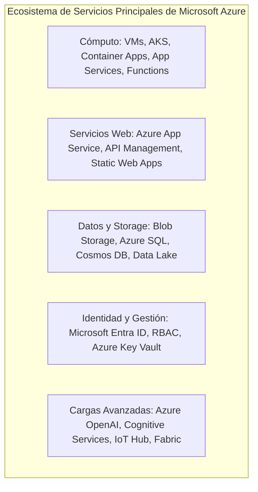
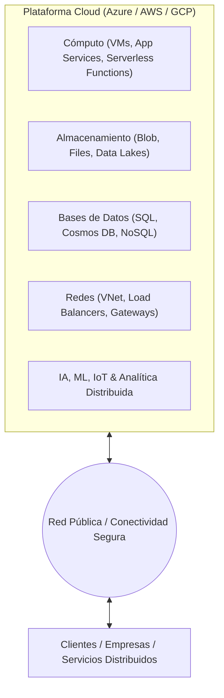
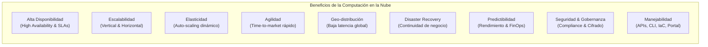
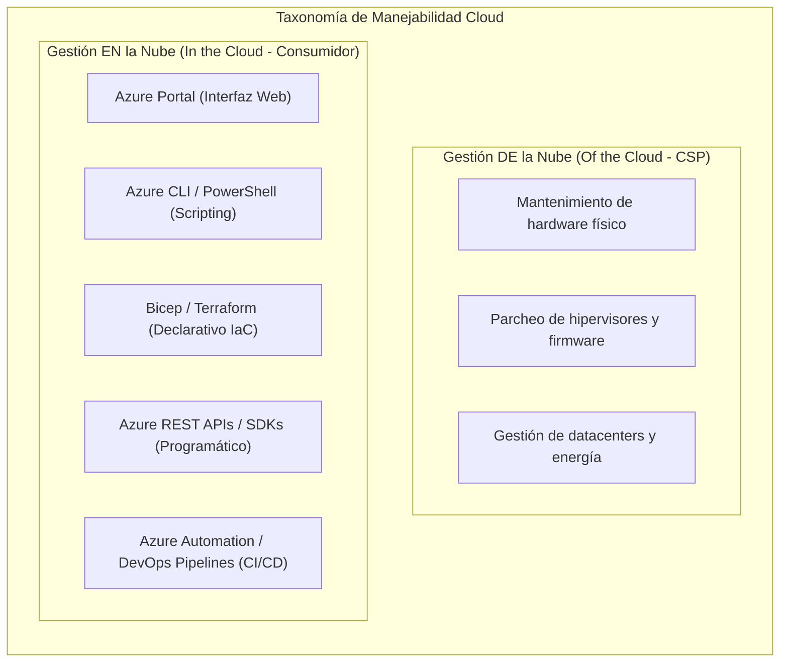
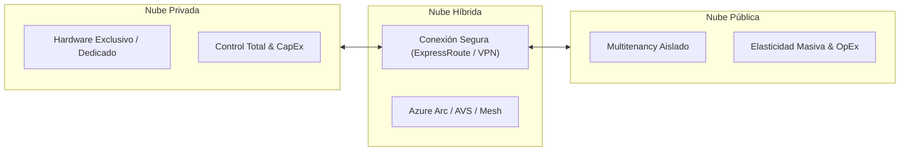
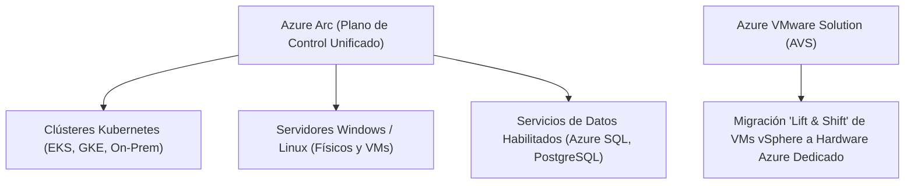
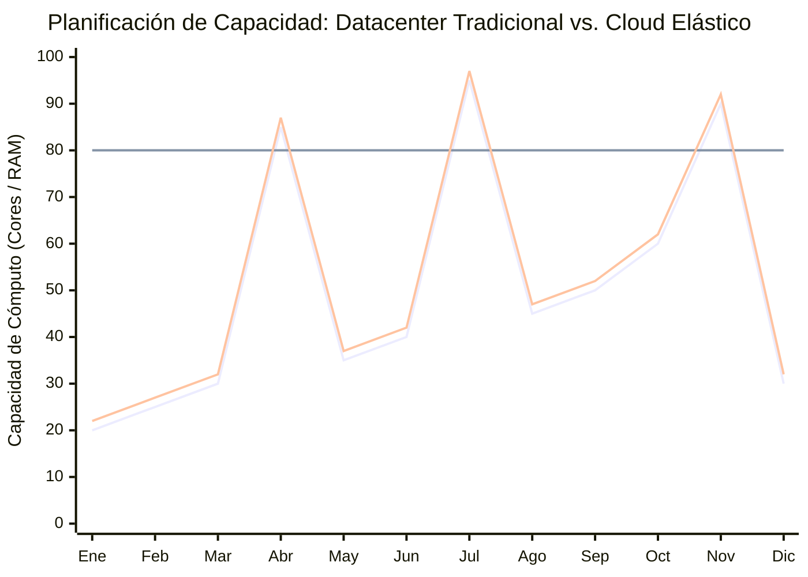

# Fundamentos de Cloud Computing, Beneficios, Responsabilidad Compartida y Modelos

> [!NOTE] Resumen Ejecutivo
> Este módulo proporciona la base conceptual y arquitectónica de la computación en la nube. Examina la visión global de la infraestructura cloud, la plataforma **Microsoft Azure**, los **beneficios arquitectónicos y operacionales** de los servicios en la nube, el análisis formal del **Modelo de Responsabilidad Compartida**, la taxonomía de los **Modelos de Despliegue** (Público, Privado, Híbrido, Multicloud), las herramientas de control cross-environment (*Azure Arc*, *Azure VMware Solution*) y la ingeniería económica orientada al **Modelo Basado en Consumo (OpEx vs. CapEx)** junto con la planificación elástica de capacidad.

![[Pasted image - Introduction to Cloud Infrastructure.png]]

---

## Objetivos de Aprendizaje

Al finalizar este módulo, el ingeniero será capaz de:
- **Definir** con precisión la computación en la nube y su diferenciación técnica frente a centros de datos tradicionales on-premises.
- **Analizar y contrastar** los beneficios clave de la computación en la nube: alta disponibilidad, escalabilidad, elasticidad, agilidad, geo-distribución, recuperación ante desastres, confiabilidad, predictibilidad y gobernanza.
- **Describir y aplicar** el modelo de responsabilidad compartida en arquitecturas IaaS, PaaS y SaaS, identificando riesgos de control y límites regulatorios.
- **Evaluar y seleccionar** los modelos de despliegue cloud (público, privado, híbrido y multicloud) según requisitos de gobernanza, latencia, soberanía de datos y resiliencia.
- **Implementar** estrategias de gestión cross-environment mediante herramientas híbridas (*Azure Arc*, *Azure VMware Solution*).
- **Describir y optimizar** la economía cloud bajo el modelo basado en consumo (Pay-As-You-Go), gestionando la transición de CapEx a OpEx y la elasticidad de carga.

---

## 1. Microsoft Azure: Fundamentos Arquitectónicos y Visión General de la Plataforma

### 1.1 Definición y Alcance de la Plataforma
- **Microsoft Azure:** Plataforma de computación en la nube a hiper-escala (*hyper-scale*) que proporciona un ecosistema extensivo de servicios integrados diseñados para construir, desplegar y escalar soluciones técnicas de nivel empresarial.
- **Versatilidad de Cargas de Trabajo (*Workload Versatility*):** Soporta desde arquitecturas ligeras de aplicaciones web y microservicios serverless hasta infraestructura informática distribuida de misión crítica y clústeres de computación de alto rendimiento (HPC).

![[Pasted image - Azure Platform Overview.png]]

### 1.2 Ecosistema de Servicios Principales (*Core Service Ecosystem*)

- **Cómputo (*Compute*):** Aprovisionamiento de máquinas virtuales totalmente virtualizadas y entornos contenerizados escalables (AKS, Container Apps, Functions) para soluciones de software a medida.
- **Servicios Web (*Web Services*):** Mecanismos de hospedaje ligero, administrados y de alta disponibilidad para aplicaciones web expuestas a Internet y APIs empresariales.
- **Datos y Almacenamiento (*Data & Storage*):** Almacenamiento remoto duradero y altamente disponible (Azure Blob Storage, Azure Files) y hospedaje de bases de datos relacionales y no relacionales administradas (Azure SQL Database, Azure Cosmos DB).
- **Identidad y Administración (*Identity & Management*):** Infraestructura centralizada de administración de cuentas, servicios de directorio, control de acceso basado en roles (RBAC) y bóvedas de claves criptográficas (*Azure Key Vault*).
- **Cargas Avanzadas (*Advanced Workloads*):** Servicios administrados integrados para pipelines de Inteligencia Artificial (Azure OpenAI, Azure AI Search, Azure Machine Learning) e Internet de las Cosas (Azure IoT Hub, IoT Edge).

### 1.3 Alcance Curricular y Ejes Estratégicos
1. **Fundamentos de Cloud Computing:** Modelos de entrega fundacionales (IaaS, PaaS, SaaS) y principios arquitectónicos de resiliencia y desacoplamiento.
2. **Servicios Nucleares de Azure:** Mapeo exhaustivo de componentes de infraestructura, redes virtuales (VNet), almacenamiento y plataformas de aplicación.
3. **Gobernanza, Seguridad y Cumplimiento:** Aplicación de directivas empresariales (*Azure Policy*), gestión de la postura de seguridad (*Microsoft Defender for Cloud*) y marcos de cumplimiento normativo.

---

## 2. ¿Qué es Cloud Computing?

La **computación en la nube** (*Cloud Computing*) es la entrega bajo demanda de servicios informáticos —incluyendo capacidad de cómputo, almacenamiento, bases de datos, redes, analítica, inteligencia artificial (AI), aprendizaje automático (ML) e Internet de las Cosas (IoT)— a través de Internet (*la nube*), con tarificación basada en el uso.

### Características Técnicas Clave
1. **Superación de Restricciones Físicas:** A diferencia de un centro de datos tradicional, el aprovisionamiento de capacidad no está condicionado por tiempos de compra de hardware físico, suministro eléctrico, climatización ni espacio en racks.
2. **Elasticidad y Expansión Rápida del Footprint:** Permite expandir o contraer la infraestructura de forma programática en minutos en más de 60 regiones globales interconectadas mediante la red troncal de fibra óptica del proveedor.
3. **Catálogo de Servicios Gestionados:** Permite consumir bases de datos, colas de mensajería y modelos de aprendizaje automático como servicios gestionados sin operar sistemas operativos subyacentes.

![[Pasted image - What is Cloud Computing.png]]

---

## 3. Beneficios Arquitectónicos de Usar Servicios Cloud (*Benefits of Cloud Services*)

La adopción de servicios cloud proporciona un conjunto de ventajas operacionales y arquitectónicas estructuradas que transforman la forma en que se diseñan, operan y escalan los sistemas de software:

### 3.1 Alta Disponibilidad (*High Availability - HA*)
- **Definición:** Capacidad de un sistema de mantenerse operativo y accesible sin interrupciones perceptibles durante fallos de hardware o mantenimiento programado.
- **Implementación en Azure:** Garantizada mediante Acuerdos de Nivel de Servicio (**SLAs**) que alcanzan el 99.9% hasta el 99.999% ("cinco nueves"). Se sustenta en componentes redundantes, dominios de actualización (*Update Domains*), dominios de fallo (*Fault Domains*) y **Zonas de Disponibilidad (*Availability Zones*)**.

### 3.2 Escalabilidad (*Scalability: Vertical vs. Horizontal*)
- **Escalabilidad Vertical (*Scale-Up / Scale-Down*):** Incremento o decremento de la capacidad computacional de una instancia individual (añadir más núcleos de CPU, memoria RAM o ancho de banda de red a una VM o App Service Plan).
- **Escalabilidad Horizontal (*Scale-Out / Scale-In*):** Adición o eliminación de múltiples instancias idénticas de recursos informáticos en paralelo (añadir más nodos a un clúster AKS o más instancias a un conjunto de escalado de máquinas virtuales *VMSS*).

### 3.3 Elasticidad (*Elasticity*)
- **Definición:** Habilidad arquitectónica de adaptar automáticamente y en tiempo real la capacidad aprovisionada en respuesta directa a las fluctuaciones de la demanda.
- **Diferencia frente a Escalabilidad:** La escalabilidad representa la *capacidad técnica de crecer*, mientras que la elasticidad es la *automatización dinámica* de ese crecimiento y contracción (*auto-scaling* reactivo ante picos y valles de carga).

### 3.4 Agilidad (*Agility*)
- **Definición:** Velocidad y flexibilidad con la que los equipos de ingeniería pueden aprovisionar, configurar, probar e iterar componentes de software e infraestructura.
- **Impacto Operativo:** Reduce el ciclo de aprovisionamiento de meses (proceso tradicional de adquisición de servidores) a segundos o minutos mediante plantillas de Infraestructura como Código (**IaC** con Terraform, Bicep o ARM), acelerando el *time-to-market*.

### 3.5 Geo-Distribución (*Geo-Distribution & Data Proximity*)
- **Definición:** Despliegue de aplicaciones, microservicios y datos en regiones geográficamente distribuidas alrededor del mundo.
- **Ventajas:** 
  - **Latencia Mínima:** Acerca el cómputo y el almacenamiento a los usuarios finales (apoyado en Redes de Entrega de Contenido - *Azure Front Door / CDN*).
  - **Cumplimiento y Soberanía:** Permite garantizar que los datos residan estrictamente dentro de fronteras geopolíticas específicas para cumplir normativas locales.

### 3.6 Recuperación ante Desastres (*Disaster Recovery - DR*) y Continuidad de Negocio
- **Definición:** Capacidad de recuperar sistemas, datos y operaciones tras eventos catastróficos (fallos regionales de red, desastres naturales o cortes eléctricos mayores).
- **Mecanismos:** Replicación geográfica de almacenamiento (GRS/GZRS), copias de seguridad automatizadas con *Azure Backup* y failover automatizado de sitios mediante *Azure Site Recovery (ASR)* con objetivos estrictos de **RTO (Recovery Time Objective)** y **RPO (Recovery Point Objective)**.

### 3.7 Confiabilidad (*Reliability & Fault Tolerance*)
- **Definición:** Habilidad de un sistema para recuperarse de fallos de componentes individuales de manera transparente y continuar funcionando correctamente.
- **Patrones:** Arquitecturas desacopladas mediante colas, *circuit breakers*, sondas de salud (*health probes*) y conmutación automática por error.

### 3.8 Predictibilidad (*Predictability: Performance & Cost*)
- **Predictibilidad de Rendimiento:** Asignación garantizada de rendimiento, IOPS, latencia de red y capacidad computacional dedicada sin degradación por "vecinos ruidosos" (*noisy neighbors*).
- **Predictibilidad de Costes (FinOps):** Uso de calculadoras de precios de Azure, *Total Cost of Ownership (TCO)*, análisis de tendencias y alertas presupuestarias automatizadas (*Azure Cost Management & Budgets*).

### 3.9 Seguridad y Gobernanza Integradas (*Security & Governance*)
- **Cifrado Universal:** Cifrado automático de datos en tránsito (TLS 1.3) y en reposo (AES-256 gestionado por la plataforma o con claves administradas por el cliente - CMK).
- **Defensa en Profundidad:** Protección perimetral contra ataques DDoS, cortafuegos de aplicaciones web (WAF) y detección de amenazas en tiempo real.
- **Cumplimiento Normativo:** Certificaciones globales independientes (ISO/IEC 27001, SOC 1/2/3, HIPAA, FedRAMP, GDPR).

### 3.10 Manejabilidad (*Manageability: In the Cloud vs. Of the Cloud*)

- **Gestión DE la nube (*Management OF the Cloud*):** Responsabilidad exclusiva del proveedor cloud; incluye la sustitución preventiva de discos defectuosos, mantenimiento de servidores físicos, climatización y actualización del software de red troncal.
- **Gestión EN la nube (*Management IN the Cloud*):** Herramientas provistas para que el consumidor administre sus recursos:
  - **Azure Portal:** Interfaz gráfica web centralizada para configuración visual y monitoreo.
  - **Azure CLI & Azure PowerShell:** Herramientas de terminal multiplataforma para automatización y scripting de tareas administrativas.
  - **Infraestructura como Código (IaC):** Despliegue repetible y versionado mediante *Azure Bicep* y *Terraform*.
  - **Azure Resource Manager (ARM) REST APIs:** Control programático completo de todos los recursos mediante llamadas HTTP seguras.

![[Pasted image - Benefits of Cloud Computing.png]]

---

## 4. El Modelo de Responsabilidad Compartida (*Shared Responsibility Model*)

El **Modelo de Responsabilidad Compartida** define la delimitación contractual y técnica de obligaciones de seguridad, mantenimiento, cumplimiento y operación entre el **Proveedor Cloud (Cloud Service Provider - CSP)** y el **Consumidor (Cliente)**.

```mermaid
flowchart TB
    subgraph SaaS["SaaS (Software as a Service)"]
        direction TB
        SaaS_Data["Datos e Identidad: Consumidor"]
        SaaS_App["Aplicación & OS: Proveedor"]
        SaaS_Infra["Infraestructura & Físico: Proveedor"]
    end

    subgraph PaaS["PaaS (Platform as a Service)"]
        direction TB
        PaaS_Data["Datos e Identidad: Consumidor"]
        PaaS_App["Aplicación: Consumidor | Runtime/OS: Proveedor"]
        PaaS_Infra["Infraestructura & Físico: Proveedor"]
    end

    subgraph IaaS["IaaS (Infrastructure as a Service)"]
        direction TB
        IaaS_Data["Datos, Identidad & Apps: Consumidor"]
        IaaS_OS["Sistema Operativo & Red Virtual: Consumidor"]
        IaaS_Infra["Hipervisor & Físico: Proveedor"]
    end

    subgraph OnPrem["On-Premises (Tradicional)"]
        direction TB
        OnPrem_All["Control Total (Físico a Aplicación): Consumidor 100%"]
    end
```

![[Pasted image - Shared Responsibility Model.png]]

### Análisis de Fallas Comunes y Matices Operativos Críticos

> [!WARNING] La Falacia de Identidad en SaaS (The SaaS Identity Fallacy)
> Un error de diseño extendido consiste en asumir que adoptar un servicio SaaS (como Microsoft 365, Salesforce o Databricks SaaS) transfiere toda la seguridad al proveedor. **En realidad, el cliente retiene el 100% de la responsabilidad sobre Identity and Access Management (IAM), autenticación multifactor (MFA), políticas de acceso condicional y clasificación/gobernanza del dato.** Si una credencial es vulnerada o no tiene MFA, el proveedor cloud no asume ninguna responsabilidad.

> [!IMPORTANT] La Difuminación del Plano de Control en PaaS (The PaaS Control Plane Blur)
> En PaaS (como Azure App Services, Azure Functions o Azure SQL), el proveedor gestiona el parcheo del sistema operativo, el hardware y la virtualización subyacente. Sin embargo, el cliente sigue siendo 100% responsable de:
> - Reglas de firewall y aislamiento de red (Private Endpoints / Service Endpoints).
> - Seguridad en cadenas de conexión y secretos (uso mandatorio de Azure Key Vault y Managed Identities).
> - Vulnerabilidades lógicas y de inyección en el código fuente de la aplicación (OWASP Top 10).

> [!CAUTION] Titularidad de Residencia de Datos y Cumplimiento Regulatorio
> Independientemente del modelo utilizado (IaaS, PaaS o SaaS), **la responsabilidad legal, la soberanía del dato y el cumplimiento normativo (GDPR, HIPAA, SOC 2, ISO 27001) nunca se transfieren al proveedor cloud**. La organización propietaria del dato es la única responsable ante los entes reguladores.

---

### Matriz Detallada de Responsabilidades

| Componente / Recurso | Responsabilidad Primaria | Detalle por Modelo de Servicio (IaaS, PaaS, SaaS) |
| :--- | :--- | :--- |
| **Red Física y Servidores Físicos** | **Proveedor Cloud** | Responsabilidad universal off-premises; el proveedor opera los datacenters, hardware de cómputo, energía, climatización y conectividad de red física nuclear. |
| **Infraestructura de Virtualización** | **Proveedor Cloud** | El hipervisor, aprovisionamiento de clústeres físicos y tejido de virtualización (*Azure Fabric Controller*) es administrado 100% por el proveedor. |
| **Sistemas Operativos (OS)** | **Variable** | **IaaS:** Administrado por el Consumidor (parches de seguridad, hardening, configuración del kernel). **PaaS / SaaS:** Administrado por el Proveedor (mantenimiento y actualización transparente). |
| **Controles de Red (Network Controls)** | **Variable** | **IaaS:** El Consumidor diseña y gestiona subredes, tablas de ruteo, NSGs y Firewalls virtuales. **PaaS / SaaS:** El alcance se traslada a endpoints de servicio, firewalls de aplicación web (WAF) y private links. |
| **Aplicaciones y Runtimes** | **Variable** | **IaaS / PaaS:** El Consumidor desarrolla, despliega, audita y mantiene el código de la aplicación y dependencias. **SaaS:** El Proveedor entrega la aplicación terminada como servicio gestionado. |
| **Identidad y Control de Acceso (IAM)** | **Compartido / Consumidor** | **Consumidor:** Define usuarios, roles (RBAC), grupos, políticas de mínimos privilegios y autenticación multifactor. **Proveedor:** Mantiene y asegura la plataforma nuclear de identidad (ej. Microsoft Entra ID). |
| **Datos, Clasificación y Gobierno** | **Consumidor (100%)** | El consumidor mantiene siempre la propiedad y responsabilidad exclusiva sobre el cifrado de datos (en tránsito y en reposo), backups lógicos y clasificación de información. |

---

## 5. Modelos de Despliegue Cloud (*Cloud Deployment Models*)

Los modelos de nube definen la topología arquitectónica, el aislamiento de tenencia (*tenancy*) y la gobernanza física y lógica donde residen los recursos informáticos.

![[Pasted image - Cloud Deployment Models.png]]

### 5.1 Nube Privada (*Private Cloud*)
- **Definición:** Entorno cloud aprovisionado y operado exclusivamente para una única organización.
- **Características:** Evolución de datacenters tradicionales virtualizados; alojado on-premises o en datacenters de colocation dedicados.
- **Trade-offs:** Proporciona máximo control administrativo, cumplimiento de restricciones de soberanía y aislamiento físico sin multitenancy, a cambio de un elevado gasto de capital (**CapEx**) y costo operativo continuo de mantenimiento de hardware.

### 5.2 Nube Pública (*Public Cloud*)
- **Definición:** Infraestructura informática global construida, asegurada y operada por proveedores externos (Microsoft Azure, AWS, GCP) y accesible a múltiples organizaciones mediante multitenancy con particionamiento lógico estricto.
- **Características:** Modelo de gasto operativo (**OpEx / Pay-as-you-go**); aprovisionamiento instantáneo, escalabilidad elástica masiva y catálogo continuo de servicios avanzados.
- **Trade-offs:** No permite control sobre la capa física ni el hipervisor nuclear subyacente.

### 5.3 Nube Híbrida (*Hybrid Cloud*)
- **Definición:** Entorno integrado que conecta e interoperabiliza infraestructura de nube pública y nube privada mediante túneles seguros (VPN IPsec, Azure ExpressRoute).
- **Casos de Uso:**
  - *Cloud Bursting:* Desbordamiento elástico de capacidad de cómputo hacia la nube pública durante picos transaccionales, manteniendo datos sensibles en la nube privada.
  - *Cumplimiento Normativo / Datos Críticos:* Almacenamiento de bases de datos altamente reguladas on-premises mientras las capas web y analíticas escalan en la nube pública.

### 5.4 Multicloud
- **Definición:** Arquitectura empresarial que utiliza de manera simultánea dos o más proveedores de nube pública independientes (ej. Azure + AWS + OCI).
- **Drivers:** Selección de las mejores herramientas de cada plataforma (*best-of-breed*), mitigación de dependencia de proveedor (*vendor lock-in*), redundancia geográfica y migraciones progresivas. Requiere capas homogéneas de gobernanza e infraestructura como código (Terraform, Pulumi).

---

### Matriz Comparativa de Modelos de Despliegue

| Dimensión Arquitectónica | Nube Pública | Nube Privada | Nube Híbrida |
| :--- | :--- | :--- | :--- |
| **Modelo Financiero y Provisión** | Cero CapEx inicial; tarificación 100% por uso (OpEx); aprovisionamiento y desaprovisionamiento en segundos. | Requiere inversión intensiva en hardware (CapEx), amortización y costes operativos continuos. | Combina agilidad operativa y escalabilidad elástica con amortización de infraestructura existente. |
| **Control, Seguridad y Cumplimiento** | Control delegado en hardware; gobernanza lógica mediante RBAC, políticas y cifrado. | Control total y granular sobre hardware, firmware, red física y aislamiento estricto. | Flexibilidad máxima para determinar la ubicación de cada carga según su criticidad regulatoria. |
| **Responsabilidad Operativa** | Mantenimiento de infraestructura física delegado al proveedor cloud. | La organización es 100% responsable del ciclo de vida del hardware, red y refrigeración. | Responsabilidad compartida y dividida en las fronteras de integración. |
| **Agilidad y Elasticidad** | Máxima elasticidad y despliegue global instantáneo. | Limitada por los ciclos de compra e instalación física de servidores y almacenamiento. | **Ofrece la máxima flexibilidad operativa** al tender puentes entre entornos dispares. |

---

### Herramientas de Integración y Gestión Híbrida / Multicloud

- **Azure Arc:**
  - **Función:** Extiende el plano de control de *Azure Resource Manager (ARM)* a servidores físicos/virtuales, clústeres de Kubernetes y bases de datos que residen fuera de Azure (on-premises, AWS, GCP). Permite aplicar políticas de seguridad (*Azure Policy*), control RBAC, parches y telemetría de forma centralizada.
- **Azure VMware Solution (AVS):**
  - **Función:** Solución certificada por VMware que ejecuta entornos de virtualización *VMware vSphere, vSAN y NSX-T* de forma nativa sobre infraestructura *bare-metal* dedicada en centros de datos de Azure. Permite migrar cargas empresariales sin reescribir código ni reconfigurar hipervisores.

---

## 6. Economía Cloud: Modelo Basado en Consumo y Planificación de Capacidad

![[Pasted image - Cloud Capacity Planning vs Datacenter.png]]

### 6.1 CapEx frente a OpEx

- **Gasto de Capital (*Capital Expenditure - CapEx*):**
  - Inversión inicial significativa en activos fijos tangibles (adquisición de servidores físicos, switches de red, almacenamiento SAN/NAS, generadores diésel, licencias perpetuas y contratos de construcción de centros de datos).
  - Requiere depreciación contable a lo largo de varios años y ata capital líquido que no puede ser redirigido a iniciativas de negocio.
- **Gasto Operativo (*Operational Expenditure - OpEx*):**
  - Costo recurrente derivado de la operación y el consumo continuo de servicios.
  - El modelo cloud es un **modelo estrictamente OpEx**: los recursos de cómputo y almacenamiento se alquilan y se liberan según la necesidad exacta del negocio, deduciéndose contablemente en el período operativo corriente.

---

### 6.2 Ventajas Arquitectónicas del Modelo Basado en Consumo

1. **Cero Costes Iniciales:** Elimina las barreras de entrada para nuevos proyectos o empresas, permitiendo prototipar e innovar sin requerir presupuestos millonarios de infraestructura previa.
2. **Eliminación del Desperdicio por Capacidad Ociosa (*Zero Idle Waste*):** En datacenters tradicionales, los servidores comprados para picos de tráfico permanecen inactivos al 10-15% de utilización el resto del año. En cloud, se desaprovisionan de inmediato al cesar la demanda.
3. **Elasticidad Dinámica y Escalabilidad Bidireccional:** Capacidad de escalar hacia afuera (*scale-out*) durante eventos de alto tráfico (Black Friday, cierres contables) y contraerse automáticamente (*scale-in*) cuando el tráfico normaliza.

---

### 6.3 Matriz de Planificación de Capacidad: Datacenter Tradicional vs. Nube

| Dimensión Arquitectónica | Datacenter Tradicional (CapEx Fijo) | Modelo Cloud Basado en Consumo (OpEx Elástico) |
| :--- | :--- | :--- |
| **Predicción de Recursos** | Requiere proyectar necesidades de hardware a 3-5 años. Una sobreestimación genera millones en capital inmovilizado y depreciado; una subestimación satura los sistemas y causa caídas de servicio. | La capacidad se ajusta dinámicamente a la demanda real en tiempo de ejecución mediante auto-scaling basado en métricas (CPU, cola de mensajes, solicitudes HTTP). |
| **Adaptabilidad y Velocidad de Escalado** | Rígida; mitigar un déficit de capacidad demanda meses de procesos de compras (*procurement*), envío, instalación en racks, cableado y configuración física. | Altamente elástica; permite aprovisionar clústeres de cientos de instancias o servicios serverless en segundos/minutos vía API o IaC. |
| **Carga Financiera** | Alto CapEx inicial con costos fijos de electricidad, refrigeración, mantenimiento y soporte físico con independencia de la utilización real. | Modelo Pay-As-You-Go; se factura por segundo/milisegundo o por gigabyte consumido. Cero costo para servicios apagados o desaprovisionados. |

---

### 6.4 Tarificación Cloud y Delegación Operativa

- **Pay-As-You-Go:** Permite a los arquitectos de software y líderes de ingeniería presupuestar con precisión granular el coste por transacción o por usuario activo, asignando centros de costo específicos mediante etiquetas (*Tags*) en Azure.
- **Delegación del Mantenimiento de Infraestructura:** Al transferir la gestión de la capa física, climatización, seguridad perimetral y redundancia de hardware al proveedor cloud, los equipos de ingeniería pueden reorientar el 100% de su esfuerzo hacia la lógica de negocio, pipelines de datos y entrega de valor.

---

## 7. Criterio de Producción y Buenas Prácticas

1. **Gobernanza de Costes y Presupuestos (*FinOps*):**
   - Implementa *Azure Cost Management & Budgets* con alertas automáticas al alcanzar el 75%, 90% y 100% del umbral mensual.
   - Aplica etiquetas (*Tags*) obligatorias para imputación de costes (`Environment`, `CostCenter`, `Owner`, `Project`).
2. **Seguridad y Mínimo Privilegio:**
   - No delegues la seguridad en la creencia de que el proveedor la asume. Habilita MFA, RBAC estricto y políticas de *Azure Policy* para impedir la creación de recursos no autorizados o IPs públicas directas.
3. **Resiliencia Basada en SLAs:**
   - Diseña para el fallo: utiliza *Availability Zones (Zonas de Disponibilidad)* y planes de recuperación ante desastres (*Azure Site Recovery*) adaptados al RTO y RPO exigidos por el negocio.

---

<!-- self-study-knowledge-context -->
## Contexto de estudio
- Dominio: [[MOC-Self-Study#Cloud & Infrastructure|Cloud e infraestructura]].
- Notas relacionadas: [[4. Azure Storage y Compute|Azure Storage y Compute]], [[1. Introducción a Azure|Introducción a Azure]], [[3. Comprender la Infraestructura de Azure|Infraestructura de Azure]], [[3. Azure Functions|Azure Functions (Serverless Compute)]].
- Criterio de producción: Trata la infraestructura como código: audita permisos IAM, segmenta redes con mínimos privilegios y optimiza el consumo cloud bajo métricas reales.
