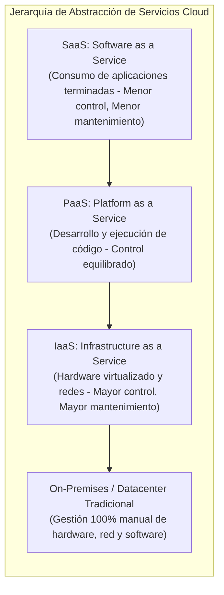
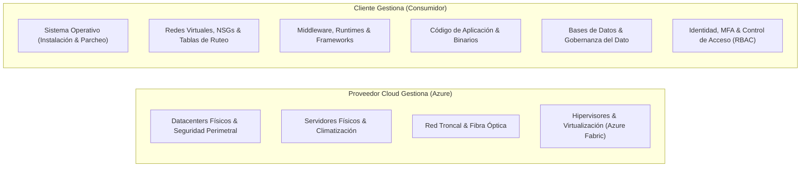
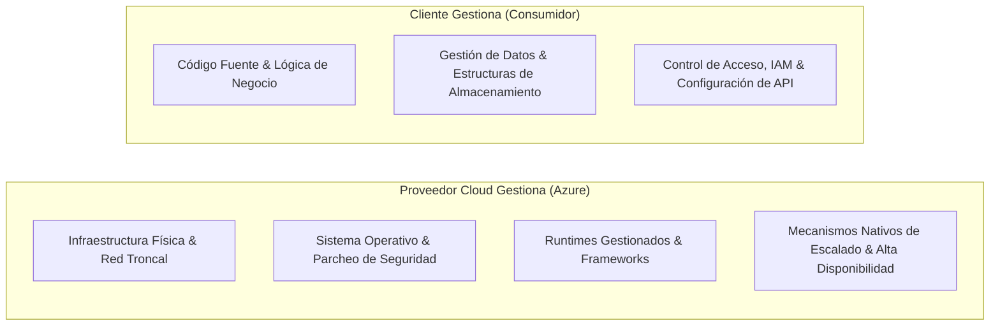
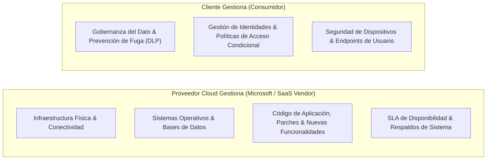
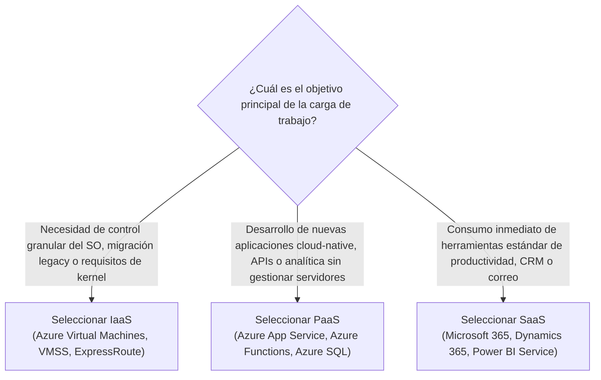

# Tipos de Servicios Cloud: IaaS, PaaS y SaaS

> [!NOTE] Resumen Ejecutivo
> Los modelos de servicio cloud determinan el grado de abstracción, flexibilidad arquitectónica, control operacional y sobrecarga de mantenimiento que una organización retiene sobre su infraestructura informática. Este módulo desglosa en profundidad los tres paradigmas fundamentales del cloud computing: **Infrastructure as a Service (IaaS)**, **Platform as a Service (PaaS)** y **Software as a Service (SaaS)**, analizando la delimitación exacta de responsabilidades, casos de uso empresariales y criterios de decisión técnica.

> [!TIP] Ubicación de Imagen — Comparativa General de Modelos de Servicio
> Inserte aquí la infografía general de comparación entre IaaS, PaaS y SaaS:
> `![[Pasted image - Cloud Service Types Comparison.png]]`

---

## Objetivos de Aprendizaje

Al finalizar este módulo, el ingeniero será capaz de:
- **Diferenciar** los niveles de abstracción y control entre IaaS, PaaS y SaaS.
- **Describir** la arquitectura, división de responsabilidades y casos de uso de *Infrastructure as a Service (IaaS)*.
- **Describir** el entorno gestionado, aceleradores de desarrollo y casos de uso de *Platform as a Service (PaaS)*.
- **Describir** el modelo de producto completo, gobernanza de identidades y casos de uso de *Software as a Service (SaaS)*.
- **Evaluar y seleccionar** el modelo de servicio óptimo según requerimientos de personalización, velocidad de despliegue, cumplimiento normativo y presupuesto operativo.

---

## 1. Visión General de los Tipos de Servicios Cloud

El ecosistema cloud opera bajo una jerarquía de capas de abstracción. A medida que se asciende desde la infraestructura física hacia las aplicaciones finales, el proveedor de servicios en la nube (*Cloud Service Provider - CSP*) asume un mayor volumen de administración operativa, reduciendo la carga de mantenimiento del cliente a cambio de una menor personalización del entorno subyacente.

---

## 2. Infrastructure as a Service (IaaS)

### 2.1 Definición y Alcance Arquitectónico
- **Definición:** **IaaS** es la categoría más flexible y de menor abstracción de los servicios en la nube. Proporciona el máximo nivel de control sobre los recursos informáticos.
- **Mecánica Operativa:** Equivale a alquilar capacidad de hardware virtualizado (servidores de cómputo, almacenamiento en bloque y componentes de red) dentro de los datacenters del proveedor cloud. Lo que se instala, configura y ejecuta sobre dicho hardware es responsabilidad total del cliente.

> [!TIP] Ubicación de Imagen — Pila de Responsabilidad y Escenarios IaaS
> Inserte aquí el diagrama de la pila IaaS y sus escenarios:
> `![[Pasted image - IaaS Responsibility Stack & Scenarios.png]]`

### 2.2 Desglose de Responsabilidad Compartida en IaaS

- **El Proveedor Cloud Gestiona:**
  - Infraestructura física, racks, energía eléctrica, refrigeración y seguridad de las instalaciones.
  - Servidores físicos de cómputo, matrices de almacenamiento y conectividad a Internet de alta velocidad.
  - Capa de hipervisor y aislamiento de hardware multi-inquilino (*multi-tenancy*).
- **El Cliente Gestiona:**
  - Instalación, configuración, actualización de seguridad y parcheo del **Sistema Operativo (SO)** (Windows Server, Linux Ubuntu, RedHat, etc.).
  - Configuración granular de redes virtuales (Azure VNets, subredes, tablas de rutas personalizadas, grupos de seguridad de red - NSG y firewalls virtuales).
  - Middleware, entornos de ejecución (Python, Java, .NET, Node.js) y contenedores.
  - Despliegue, mantenimiento y monitoreo de las aplicaciones.
  - Almacenamiento y gobierno de datos confidenciales.

### 2.3 Casos de Uso y Escenarios Principales en IaaS

1. **Migraciones Lift-and-Shift (Rehosting):**
   - Transferencia directa de máquinas virtuales y cargas de trabajo existentes desde datacenters locales hacia Azure Virtual Machines sin necesidad de reescribir o rediseñar la arquitectura del software.
   - Ideal para aplicaciones heredadas (*legacy*) que dependen de versiones de kernel o configuraciones de sistema operativo específicas.
2. **Entornos de Desarrollo y Pruebas (Dev/Test):**
   - Aprovisionamiento y destrucción automatizada de entornos completos de prueba mediante scripts e Infraestructura como Código (IaC).
   - Permite replicar configuraciones exactas de producción para realizar pruebas de estrés y compatibilidad con control absoluto sobre librerías y dependencias del sistema operativo.
3. **Cómputo de Alto Rendimiento (HPC):**
   - Cargas intensivas de simulación financiera, renderizado 3D, dinámica de fluidos y modelado genómico que requieren instancias con GPUs dedicadas o clústeres InfiniBand interconectados.

---

## 3. Platform as a Service (PaaS)

### 3.1 Definición y Alcance Arquitectónico
- **Definición:** **PaaS** representa un punto de equilibrio estratégico entre el alquiler de infraestructura pura (IaaS) y el consumo de software empaquetado (SaaS).
- **Ventaja Central:** Proporciona un **entorno de desarrollo y ejecución completamente administrado**, eliminando la complejidad de licenciamiento del sistema operativo, aprovisionamiento de servidores, gestión de parches y configuración de almacenamiento físico.

> [!TIP] Ubicación de Imagen — Pila de Responsabilidad y Escenarios PaaS
> Inserte aquí el diagrama de la pila PaaS (`image_75a4f3.png`):
> `![[Pasted image - PaaS Responsibility Stack & Scenarios.png]]`

### 3.2 Desglose de Responsabilidad Compartida en PaaS

- **El Proveedor Cloud Gestiona:**
  - Toda la infraestructura física, virtualización y servidores de cómputo.
  - Sistemas operativos base, parches críticos de seguridad y actualizaciones de middleware.
  - Runtimes gestionados (ej. .NET Core, Python, Java, Node.js, PHP) y plataformas de bases de datos administradas (*Azure SQL Database*, *Cosmos DB*).
  - Escalado automático (*auto-scaling*), balanceo de carga integrado y conmutación por error (*high availability* nativa).
- **El Cliente Gestiona:**
  - Código fuente de la aplicación, endpoints y lógica de negocio.
  - Configuración de la base de datos, optimización de consultas e indexación.
  - Gobernanza de datos y clasificación de seguridad.
  - Políticas de autenticación y autorización de usuarios (*Microsoft Entra ID*, tokens JWT, roles RBAC).
  - *(Nota: Las directivas de red como Azure Private Endpoints se configuran conjuntamente según el diseño de seguridad).*

### 3.3 Casos de Uso y Escenarios Principales en PaaS

1. **Marco de Desarrollo Ágil (*Development Framework*):**
   - Proporciona un marco integrado sobre el cual los ingenieros pueden construir, probar y desplegar aplicaciones cloud-native utilizando componentes preconstruidos (Azure App Service, Azure Functions, Azure API Management).
   - Hereda capacidades nativas de la nube (alta disponibilidad geográfica, escalado elástico, multitenancy seguro), reduciendo drásticamente el código repetitivo (*boilerplate*) y el tiempo de comercialización (*time-to-market*).
2. **Analítica Avanzada e Inteligencia de Negocios (Analytics & BI):**
   - Servicios de análisis de datos a gran escala (Azure Synapse Analytics, Azure Databricks, Power BI Embedded) ofrecidos como plataformas gestionadas.
   - Permite a los equipos de datos ingerir, transformar, modelar y visualizar macrodatos sin diseñar ni administrar clústeres de almacenamiento o servidores de cómputo distribuidos.

> [!TIP] Ubicación de Imagen — Analítica y Plataformas de Datos PaaS
> Inserte aquí la captura de analítica y casos PaaS:
> `![[Pasted image - PaaS Analytics & Scenarios.png]]`

---

## 4. Software as a Service (SaaS)

### 4.1 Definición y Alcance Arquitectónico
- **Definición:** **SaaS** es el modelo de servicio cloud más completo desde la perspectiva de producto final. En este modelo, las organizaciones consumen una aplicación de software completamente desarrollada, alojada y gestionada por el proveedor.
- **Facilidad de Adopción:** Aunque presenta la menor flexibilidad de personalización profunda a nivel de infraestructura, es el modelo más rápido de desplegar y el que menor conocimiento técnico de infraestructura demanda.
- **Principio Clave:** *"Usted utiliza la aplicación — el proveedor gestiona absolutamente todo lo demás."*

> [!TIP] Ubicación de Imagen — Visión General de Software as a Service (SaaS)
> Inserte aquí el diagrama de la visión general de SaaS:
> `![[Pasted image - Software as a Service (SaaS) Overview.png]]`

### 4.2 Desglose de Responsabilidad Compartida en SaaS

- **El Proveedor Cloud Gestiona:**
  - La totalidad de la pila tecnológica: infraestructura física, virtualización, sistemas operativos, bases de datos y la propia aplicación.
  - Mantenimiento preventivo, corrección de errores de software, actualización de versiones y cumplimiento de SLAs de disponibilidad.
- **El Cliente Gestiona:**
  - Gobernanza, clasificación y auditoría de la información almacenada en el servicio.
  - Administración de identidades: aprovisionamiento y desaprovisionamiento de usuarios, grupos, asignación de licencias y autenticación multifactor (MFA).
  - Postura de seguridad de los dispositivos clientes (endpoints corporativos, políticas de acceso condicional con Microsoft Intune).
- **Sobrecarga Operacional:** SaaS impone la menor sobrecarga de mantenimiento operativo sobre los equipos internos de TI.

### 4.3 Casos de Uso y Escenarios Principales en SaaS

1. **Comunicaciones y Colaboración Empresarial:**
   - Plataformas globales de correo y colaboración alojadas en la nube como Microsoft 365 (Exchange Online, Microsoft Teams, SharePoint, Outlook).
2. **Aplicaciones de Productividad de Oficina:**
   - Suites ofimáticas en la nube accesibles vía navegador y aplicaciones sincronizadas (Word, Excel, PowerPoint Online, Google Workspace).
3. **Gestión Financiera, Contabilidad y CRM:**
   - Software empresarial especializado para seguimiento financiero, facturación, contabilidad y gestión de clientes (Dynamics 365, Salesforce, SAP Cloud ERP).

---

## 5. Matriz Comparativa: IaaS vs. PaaS vs. SaaS vs. On-Premises

| Dimensión Técnica | On-Premises | IaaS | PaaS | SaaS |
| :--- | :--- | :--- | :--- | :--- |
| **Nivel de Abstracción** | Nulo (Hardware físico directo) | Bajo (Hardware virtualizado) | Medio (Plataforma y runtime administrados) | Alto (Aplicación lista para uso) |
| **Flexibilidad y Control** | Control absoluto sobre hardware y software. | Control total sobre SO, redes y aplicaciones. | Control sobre el código de aplicación y datos. | Configuración funcional y control de acceso. |
| **Velocidad de Despliegue** | Meses (Proceso de compras e instalación). | Minutos (Aprovisionamiento de VMs vía IaC). | Segundos / Minutos (Despliegue de paquetes de código). | Instantáneo (Activación de licencias de usuario). |
| **Sobrecarga Operacional** | Muy alta (Mantenimiento físico y lógico 100%). | Alta (Parcheo de SO, firewalls y middleware). | Baja (Solo gestión del código y la BD). | Mínima (Solo gobernanza de usuarios y datos). |
| **Modelo Financiero** | CapEx intensivo + costos fijos. | OpEx (Pago por hora/segundo de VM y disco). | OpEx (Pago por recursos de cómputo/transacción). | OpEx (Suscripción por usuario/mes). |
| **Responsabilidad de Backup** | Consumidor 100% (Cintas, SAN, offsite). | Consumidor (Configuración de Azure Backup). | Compartida (Backups automatizados por la plataforma). | Proveedor (Protección contra fallos de plataforma). |

---

## 6. Marco de Decisión Arquitectónica: ¿Qué Modelo Seleccionar?

---

<!-- self-study-knowledge-context -->
## Contexto de estudio
- Dominio: [[MOC-Self-Study#Cloud & Infrastructure|Cloud e infraestructura]].
- Notas relacionadas: [[0. Fundamentos de Cloud Computing y Responsabilidad Compartida|Fundamentos Cloud & Responsabilidad Compartida]], [[1. Introducción a Azure|Introducción a Azure]], [[3. Comprender la Infraestructura de Azure|Infraestructura de Azure]], [[4. Azure Storage y Compute|Azure Storage y Compute]], [[3. Azure Functions|Azure Functions (Serverless)]].
- Criterio de producción: Selecciona el modelo de servicio que minimice la sobrecarga operativa sin comprometer el aislamiento de red ni las políticas de gobernanza de identidad y datos.
