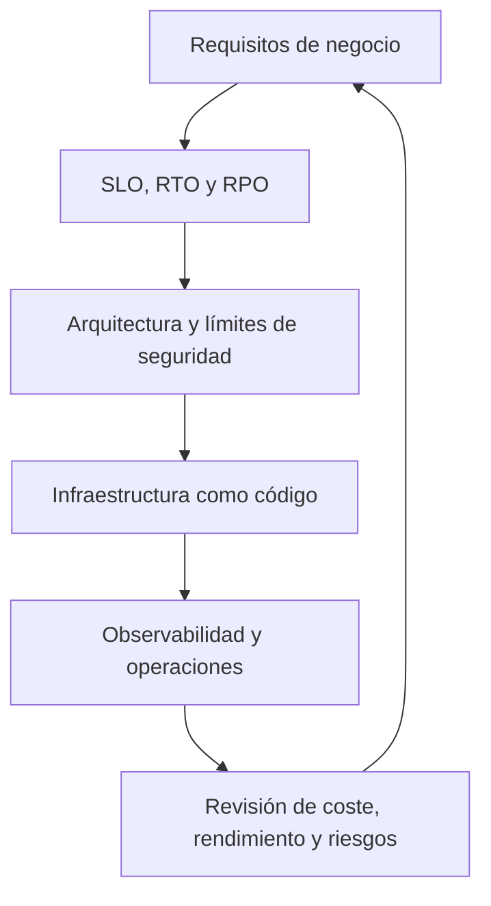

# 1. ¿Qué es Azure?

 Es la plataforma en la nube de Microsoft. Una caja de herramientas que ofrece servicios para:
- Ejecutar aplicaciones
- Almacenar datos
- Aprovechar la IA
- Mucho más

![[Pasted image 20260529143932.png]]

Es usado por una amplia variedad de compañías

![[Pasted image 20260529143946.png]]

Las skills en cloud son críticas e importantes en muchos roles:

- Data Scientists
- DevOps Engineers
- Software Engineers
- Data Engineers
- Y muchos más

![[Pasted image 20260529144139.png]]

# Why Azure?

![[Pasted image 20260529144345.png]]

Su mayor fortaleza, es su red global de Data Centers, abarcando más de 60 regiones mundialmente

Esto significa que se puede:
- Desplegar aplicaciones y almacenar datos más cerca de sus clientes
- Reduce latencia, mejora el rendimiento y asegura cumplimiento con regulaciones locales

## Criterio arquitectónico: Azure Well-Architected

Azure debe seleccionarse desde los requisitos de carga, datos y operación, no desde un catálogo aislado de servicios. Azure Well-Architected articula cinco pilares: fiabilidad, seguridad, optimización de costes, excelencia operativa y eficiencia de rendimiento. Cada decisión debe justificar el equilibrio entre esos atributos, en vez de maximizar uno de forma aislada. [Microsoft Learn: pilares Well-Architected](https://learn.microsoft.com/en-us/azure/well-architected/pillars)

- Diseña identidad y red bajo mínimo privilegio y segmentación; los secretos deben estar fuera de código y de los artefactos de despliegue.
- Usa telemetría para convertir objetivos de fiabilidad y rendimiento en alertas accionables; una métrica sin umbral ni responsable no es una señal operativa.
- Presupuesta desde el principio: redundancia, retención de datos, egreso y observabilidad son costes arquitectónicos, no efectos secundarios.

<!-- self-study-knowledge-context -->
## Contexto de estudio
- Dominio: [[MOC-Self-Study#Cloud & Infrastructure|Cloud e infraestructura]].
- Criterio de producción: Trata la infraestructura como código: revisa el plan, controla versiones, evita secretos en el estado y usa ejecución reproducible.
