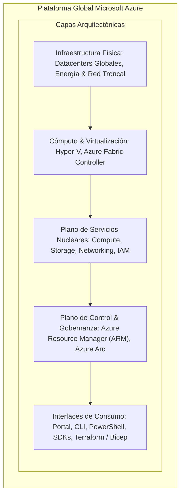
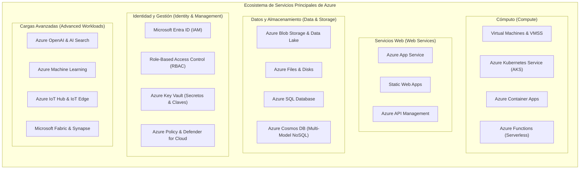
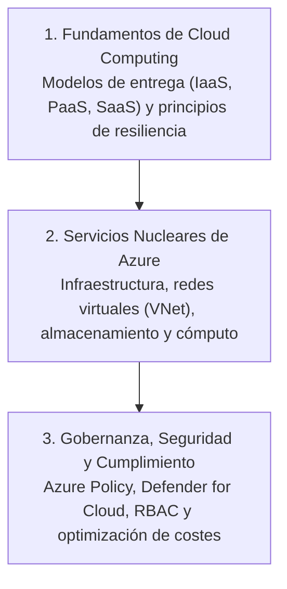
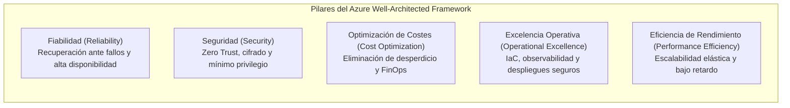

# Microsoft Azure: Architectural Fundamentals & Platform Overview

> [!NOTE] Resumen Ejecutivo
> Microsoft Azure es una plataforma de computación en la nube a hiper-escala (*hyper-scale*) que proporciona un catálogo masivo de servicios integrados para diseñar, aprovisionar, operar y escalar soluciones de software de nivel empresarial. Este documento establece la visión fundamental de la plataforma, el mapa de su ecosistema nuclear de servicios y los principios de diseño que rigen la ingeniería cloud en Azure.

> [!TIP] Ubicación de Imagen — Visión General de la Plataforma Azure
> Inserte aquí el diagrama conceptual de la plataforma Microsoft Azure:
> `![[Pasted image - Azure Platform Architecture Overview.png]]`

---

## 1. Definición y Alcance de la Plataforma (*Platform Definition & Scope*)

- **Microsoft Azure:** Ecosistema global de infraestructura como servicio (IaaS), plataforma como servicio (PaaS) y software como servicio (SaaS) diseñado para respaldar desde microservicios contenerizados y pipelines analíticos hasta arquitecturas de misión crítica distribuidas globalmente.
- **Versatilidad de Cargas de Trabajo (*Workload Versatility*):** Soporta escalado elástico multidimensional para aplicaciones web ligeras, clústeres de computación de alto rendimiento (HPC), backends de procesamiento en tiempo real y modelos masivos de inteligencia artificial (LLMs / Generative AI).

---

## 2. Ecosistema de Servicios Nucleares (*Core Service Ecosystem*)

El catálogo de Azure agrupa cientos de servicios especializados en pilares funcionales de ingeniería:

### 2.1 Cómputo (*Compute*)
- **Aprovisionamiento Virtualizado y Contenedores:** Provisión de máquinas virtuales totalmente configurables (*Azure VMs*), conjuntos de escalado (*Virtual Machine Scale Sets - VMSS*), orquestación de contenedores empresariales (*AKS*), contenedores serverless (*Azure Container Apps*) y ejecución dirigida por eventos sin servidor (*Azure Functions*).

### 2.2 Servicios Web (*Web Services*)
- **Alojamiento Ligero y Gestión de APIs:** Hospedaje administrado para aplicaciones web y backends REST/GraphQL mediante *Azure App Service*, distribución de frontend moderno con *Azure Static Web Apps* y gobernanza, autenticación y limitación de tasa (*rate limiting*) mediante *Azure API Management (APIM)*.

### 2.3 Datos y Almacenamiento (*Data & Storage*)
- **Persistencia Duradera y Bases de Datos:**
  - **Almacenamiento de Objetos y Archivos:** *Azure Blob Storage* con soporte de datos masivos (Data Lake Storage Gen2) y carpetas compartidas SMB/NFS mediante *Azure Files*.
  - **Bases de Datos Relacionales:** *Azure SQL Database*, *Azure Database for PostgreSQL/MySQL* administrados con alta disponibilidad nativa.
  - **Bases de Datos NoSQL Distribuidas:** *Azure Cosmos DB* con latencias de un solo dígito de milisegundo y replicación multirregión con consistencia configurable.

### 2.4 Identidad y Administración (*Identity & Management*)
- **Control de Acceso y Directorio Central:** Autenticación unificada mediante *Microsoft Entra ID*, políticas de mínimos privilegios vía *Azure RBAC*, auditoría continua con *Azure Monitor/Log Analytics* y custodia segura de secretos y certificados criptográficos en *Azure Key Vault*.

### 2.5 Cargas Avanzadas (*Advanced Workloads: AI, ML & IoT*)
- **Inteligencia Artificial e Internet de las Cosas:** Integración directa con modelos fundacionales de última generación (*Azure OpenAI Service*), búsqueda semántica y vectorial (*Azure AI Search*), entrenamiento y MLOps con *Azure Machine Learning* e ingesta masiva de telemetría de dispositivos con *Azure IoT Hub*.

---

## 3. Alcance Curricular y Objetivos Estratégicos

El dominio de Azure se fundamenta en tres ejes formativos y de ejecución técnica:

1. **Fundamentos de Cloud Computing:** Comprensión rigurosa de los modelos de servicio, responsabilidad compartida y economía cloud (CapEx vs. OpEx).
2. **Servicios Nucleares de Azure:** Implementación y arquitectura de recursos de cómputo, redes definidas por software (SDN), almacenamiento distribuido y plataformas de aplicación.
3. **Gobernanza, Seguridad y Cumplimiento:** Aplicación de políticas empresariales automatizadas, segmentación de redes, posturas de seguridad *Zero Trust* y cumplimiento regulatorio internacional (ISO, SOC, HIPAA, GDPR).

---

## 4. Infraestructura Global de Azure (*Global Infrastructure Footprint*)

La infraestructura global de Microsoft Azure es una de las más extensas del mundo:

- **Regiones Globales (60+ Regiones):** Áreas geográficas delimitadas que contienen conjuntos de datacenters interconectados mediante una red de fibra óptica privada de baja latencia.
- **Zonas de Disponibilidad (*Availability Zones - AZ*):** Ubicaciones físicas aisladas dentro de una región de Azure (mínimo tres datacenters independientes con suministro eléctrico, climatización y red separados), proporcionando tolerancia a fallos ante desastres locales.
- **Regiones Emparejadas (*Region Pairs*):** Cada región de Azure está emparejada con otra región dentro de la misma geografía a cientos de kilómetros de distancia para replicación geográfica y recuperación ante desastres (*Disaster Recovery*).

> [!TIP] Ubicación de Imagen — Mapa de Infraestructura Global y Regiones
> Inserte aquí el mapa de la infraestructura global de Azure:
> `![[Pasted image 20260529144345.png]]`

---

## 5. Criterio Arquitectónico: Azure Well-Architected Framework

El diseño de soluciones en Azure debe alinearse estrictamente con los cinco pilares del **Azure Well-Architected Framework**:

- **Fiabilidad (*Reliability*):** Diseña sistemas tolerantes a fallos utilizando redundancia geográfica, Zonas de Disponibilidad y conmutación automática por error.
- **Seguridad (*Security*):** Aplica el principio de *Zero Trust*, aísla redes con *Private Endpoints*, rota credenciales y utiliza *Managed Identities* para evitar almacenar secretos en código.
- **Optimización de Costes (*Cost Optimization*):** Supervisa el consumo en tiempo real mediante *Azure Cost Management*, apaga entornos ociosos y aprovecha instancias reservadas.
- **Excelencia Operativa (*Operational Excellence*):** Adopta Infraestructura como Código (Bicep / Terraform), pipelines CI/CD automatizados y observabilidad con *Azure Monitor & Application Insights*.
- **Eficiencia de Rendimiento (*Performance Efficiency*):** Implementa escalado automático (*auto-scaling*), balanceo de carga y cachés distribuidas (*Azure Redis Cache*).

---

<!-- self-study-knowledge-context -->
## Contexto de estudio
- Dominio: [[MOC-Self-Study#Cloud & Infrastructure|Cloud e infraestructura]].
- Notas relacionadas: [[0. Fundamentos de Cloud Computing y Responsabilidad Compartida|Fundamentos Cloud & Responsabilidad Compartida]], [[0.1. Tipos de Servicios Cloud - IaaS, PaaS y SaaS|Tipos de Servicios Cloud (IaaS, PaaS, SaaS)]], [[2. Entorno|Entorno de Azure]], [[3. Comprender la Infraestructura de Azure|Infraestructura de Azure]], [[4. Azure Storage y Compute|Azure Storage y Compute]].
- Criterio de producción: Trata la infraestructura como código: revisa el plan de recursos, controla versiones, aísla secretos con Azure Key Vault y basa las decisiones en los pilares Well-Architected.
