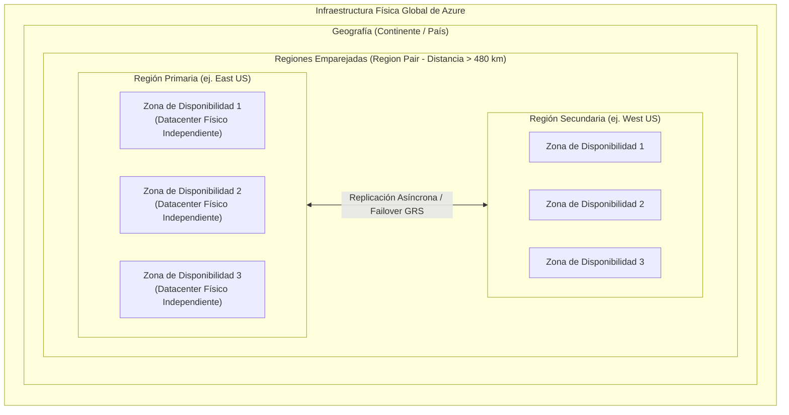
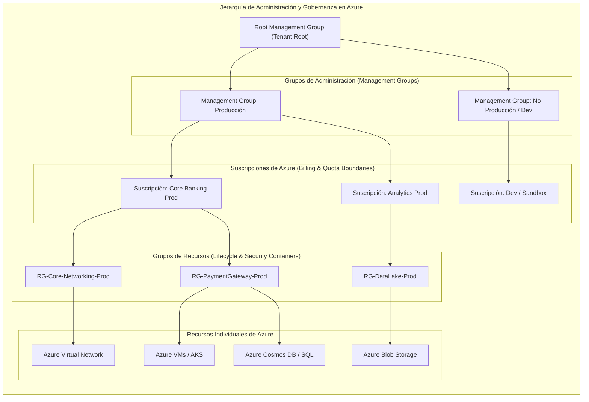
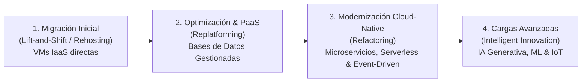
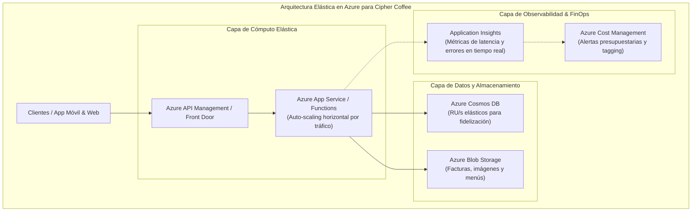

# Microsoft Azure: Infraestructura Global y Jerarquía de Administración

> [!NOTE] Resumen Arquitectónico
> La infraestructura de Microsoft Azure se estructura sobre dos dimensiones fundamentales: la **disposición física global** (datacenters, zonas de disponibilidad, regiones y regiones emparejadas) y la **jerarquía lógica de gestión y gobernanza** (grupos de administración, suscripciones, grupos de recursos y recursos individuales). Este módulo examina en profundidad ambas dimensiones, junto con los caminos de modernización de cargas empresariales y el ciclo de vida de los recursos en Azure.

> [!TIP] Ubicación de Imagen — Categorías de Servicios y Arquitectura Azure
> Inserte aquí el diagrama general de servicios y arquitectura de Azure:
> `![[Pasted image - Microsoft Azure Service Categories.png]]`

---

## Objetivos de Aprendizaje

Al finalizar este módulo, el ingeniero será capaz de:
- **Describir y diferenciar** datacenters, Zonas de Disponibilidad (*Availability Zones*), Regiones, Regiones Emparejadas (*Region Pairs*) y Regiones Soberanas (*Sovereign Regions*).
- **Diseñar y aplicar** la jerarquía lógica de gobernanza en Azure: *Management Groups $\rightarrow$ Subscriptions $\rightarrow$ Resource Groups $\rightarrow$ Resources*.
- **Gestionar el ciclo de vida** de los Grupos de Recursos (*Resource Groups*), control de accesos (RBAC), bloqueos de recursos (*Resource Locks*) y directivas de cumplimiento (*Azure Policy*).
- **Trazar la ruta de modernización** (*Cloud Adoption Journey*) desde migraciones *Lift-and-Shift* hasta arquitecturas elásticas y microservicios serverless.

---

## 1. Disposición Física Global de Azure (*Physical Layout*)

La red global de Azure es una de las mayores infraestructuras hiper-escala del planeta, diseñada para ofrecer resiliencia extrema, baja latencia y soberanía de datos.

### 1.1 Centros de Datos (*Datacenters*)
- Edificios físicos dedicados que contienen miles de racks de servidores blade, conmutadores de red de alta velocidad, matrices de almacenamiento, suministro de energía redundante (generadores diésel y UPS) y climatización avanzada.
- Los datacenters individuales no son directamente direccionables por el cliente; se agrupan en **Zonas de Disponibilidad** o **Regiones**.

### 1.2 Zonas de Disponibilidad (*Availability Zones - AZ*)
- **Definición:** Ubicaciones físicas únicas y aisladas dentro de una misma región de Azure.
- **Tolerancia a Fallos:** Cada Zona de Disponibilidad está compuesta por uno o varios datacenters dotados de infraestructura de energía, refrigeración y redes independientes.
- **SLA de Alta Disponibilidad:** El despliegue de cargas en múltiples AZ dentro de una misma región garantiza un **SLA del 99.99%** para máquinas virtuales.
- **Conectividad:** Están interconectadas mediante una red troncal de fibra óptica privada con latencias de ida y vuelta inferiores a 2 milisegundos.

### 1.3 Regiones de Azure (*Azure Regions*)
- **Definición:** Conjunto de datacenters desplegados dentro de un perímetro definido por latencia e interconectados a través de una red dedicada de fibra óptica.
- **Distribución:** Más de 60 regiones distribuidas mundialmente, permitiendo ubicar las aplicaciones y los datos cerca de los usuarios finales para minimizar la latencia y garantizar el cumplimiento regulatorio local.

### 1.4 Regiones Emparejadas (*Region Pairs*)
- Cada región de Azure está emparejada permanentemente con otra región dentro de la misma geografía (a una distancia mínima recomendada de al menos 480 km).
- **Beneficios Operativos:**
  - **Actualizaciones Secuenciales:** Microsoft aplica parches y actualizaciones de plataforma a una sola región del par a la vez para evitar caídas globales.
  - **Prioridad de Recuperación:** En caso de un desastre a gran escala que afecte a múltiples regiones, se prioriza la restauración de al menos una región de cada par.
  - **Replicación Geográfica de Datos:** Servicios como Azure Storage (*Geo-Redundant Storage - GRS*) replican automáticamente los datos a la región secundaria emparejada.

### 1.5 Regiones Soberanas y Especializadas (*Sovereign Regions*)
- **Azure Government (US Gov):** Instancias físicas y lógicas completamente aisladas de la nube pública, dedicadas exclusivamente a agencias federales, estatales y contratistas de defensa de los Estados Unidos (cumplimiento estricto con FedRAMP High, ITAR y DoD Impact Level 5).
- **Azure China 21Vianet:** Instancia de nube independiente ubicada físicamente en China, operada por *21Vianet* conforme a las regulaciones de telecomunicaciones y soberanía digital de la República Popular China.

---

## 2. Jerarquía Lógica de Administración y Gobernanza

La organización de recursos en Azure se estructura en un modelo jerárquico de cuatro niveles. Las directivas de gobernanza (*Azure Policy*), el control de acceso (*Azure RBAC*) y los presupuestos de costos (*Cost Management*) se heredan hacia abajo en la jerarquía:

### 2.1 Grupos de Administración (*Management Groups*)
- **Función:** Contenedores de gobernanza que permiten gestionar el acceso, las políticas y el cumplimiento normativo para **múltiples suscripciones** simultáneamente.
- **Herencia de Políticas:** Las políticas de *Azure Policy* y asignaciones de roles RBAC aplicadas en un grupo de administración se heredan automáticamente a todas las suscripciones hijas.
- **Escala:** Un inquilino (*tenant*) de Microsoft Entra ID puede estructurar hasta 10,000 grupos de administración en un árbol de hasta 6 niveles de profundidad.

### 2.2 Suscripciones de Azure (*Subscriptions*)
- **Función:** Unidad fundamental de facturación, asignación de cuotas de recursos y límite de aislamiento administrativo en Azure.
- **Límites Operativos:** Cada suscripción tiene límites y cuotas independientes (número máximo de vCPUs, almacenamiento, etc.).
- **Estrategia Empresarial:** Las organizaciones separan suscripciones por entornos (`Producción`, `Staging`, `Desarrollo`), por unidades de negocio (`Finanzas`, `Logística`) o por cumplimiento regulatorio.

### 2.3 Grupos de Recursos (*Resource Groups - RG*)
- **Función:** Contenedores lógicos que agrupan recursos relacionados para gestionar su **ciclo de vida conjunto**, seguridad y costes.
- **Reglas Arquitectónicas Clave:**
  1. **Unicidad de Pertenencia:** Todo recurso de Azure debe pertenecer a **exactamente un** grupo de recursos. No puede existir un recurso sin grupo ni pertenecer a múltiples grupos a la vez.
  2. **Independencia de Ubicación:** El grupo de recursos tiene una región de metadatos propia, pero los recursos contenidos dentro de él pueden residir en regiones geográficas distintas.
  3. **Ciclo de Vida Unificado:** Si se elimina un grupo de recursos, **todos los recursos contenidos en él se eliminan de forma atómica e irreversible**.
  4. **Ámbito de Seguridad (RBAC Scope):** Asignar un rol de lector o colaborador a nivel de grupo de recursos otorga permisos sobre todos los recursos actuales y futuros de ese grupo.

### 2.4 Recursos Individuales de Azure (*Resources*)
- La instancia específica y manipulable de un servicio en la nube: una máquina virtual (`Microsoft.Compute/virtualMachines`), una cuenta de almacenamiento (`Microsoft.Storage/storageAccounts`), una base de datos SQL (`Microsoft.Sql/servers/databases`) o una red virtual (`Microsoft.Network/virtualNetworks`).

---

## 3. Comparativa: Recursos vs. Grupos de Recursos

| Dimensión | Recurso Individual (*Resource*) | Grupo de Recursos (*Resource Group*) |
| :--- | :--- | :--- |
| **Definición** | Instancia de servicio individual que ejecuta una carga (VM, BD, Storage, VNet). | Contenedor lógico que administra y organiza un conjunto de recursos relacionados. |
| **Facturación** | Genera consumo y costo directo basado en uso y SKU. | No genera costo directo; es una entidad lógica de organización y metadatos. |
| **Ciclo de Vida** | Se crea, actualiza, escala o destruye individualmente. | Al destruirse, elimina en cascada todos los recursos hijos que alberga. |
| **Control de Acceso** | Permite permisos RBAC a nivel granular por recurso. | Permite herencia masiva de permisos RBAC para todo el grupo. |

---

## 4. El Viaje de Adopción Cloud: De la Migración a la Modernización

La transición hacia la nube se ejecuta en fases iterativas que aumentan la madurez operativa y la eficiencia de costes:

1. **Fase 1: Migración Inicial (*Lift-and-Shift / IaaS*):**
   - Reubicación de servidores físicos y máquinas virtuales locales directamente en *Azure Virtual Machines* sin modificar el código de la aplicación.
   - Reduce el riesgo de migración rápida y evita renovaciones costosas de hardware en datacenters propios.
2. **Fase 2: Optimización y Transición a PaaS (*Replatforming*):**
   - Reemplazo de servidores de bases de datos autogestionados por *Azure SQL Database* o *Azure Cosmos DB*.
   - Alojamiento de capas web en *Azure App Service* con escalado automático nativo.
3. **Fase 3: Modernización Cloud-Native (*Refactoring*):**
   - Descomposición de monolitos en microservicios desacoplados sobre *Azure Kubernetes Service (AKS)* o *Azure Container Apps*.
   - Implementación de arquitecturas sin servidor (*Azure Functions*) guiadas por eventos con colas de mensajería (*Azure Service Bus* / *Event Grid*).
4. **Fase 4: Cargas Avanzadas e Inteligencia Artificial (*Innovation*):**
   - Integración de pipelines de analítica masiva y modelos fundacionales (*Azure OpenAI*, *Azure AI Search*, *Azure Machine Learning*).

---

## 5. Caso Arquitectónico de Cargas Elásticas: Cipher Coffee

### Contexto y Desafío Operativo
**Cipher Coffee** cuenta con tiendas físicas y una plataforma digital de pedidos y recompensas. Experimenta picos masivos de tráfico entre las 7:00 AM y 9:30 AM (desayuno) y valles de actividad nula durante la madrugada.

### Solución Arquitectónica Integrada
- **Cómputo:** Despliegue en *Azure App Service* y *Azure Functions* con reglas de *autoscale* (añade instancias en picos de demanda y se desescala en valles).
- **Capa de Datos:** *Azure Cosmos DB* con rendimiento auto-escalable (*Autoscale Throughput RU/s*) para absorber picos transaccionales sin degradación de latencia.
- **Observabilidad:** *Azure Application Insights* y *Azure Monitor* para supervisar tiempos de respuesta de APIs, trazas distribuidas y detección de anomalías.
- **Optimización de Costes:** Organización mediante grupos de recursos dedicados (`RG-CipherCoffee-Production`, `RG-CipherCoffee-Staging`) con etiquetas (*Tags*) para imputar costes por sucursal.

---

<!-- self-study-knowledge-context -->
## Contexto de estudio
- Dominio: [[MOC-Self-Study#Cloud & Infrastructure|Cloud e infraestructura]].
- Notas relacionadas: [[0. Fundamentos de Cloud Computing y Responsabilidad Compartida|Fundamentos Cloud & Responsabilidad Compartida]], [[0.1. Tipos de Servicios Cloud - IaaS, PaaS y SaaS|Tipos de Servicios Cloud]], [[1. Introducción a Azure|Introducción a Azure]], [[4. Azure Storage y Compute|Azure Storage y Compute]], [[3. Azure Functions|Azure Functions (Serverless)]].
- Criterio de producción: Agrupa recursos por ciclo de vida compartido, aplica directivas de Azure Policy a nivel de Management Group para forzar cifrado y etiquetado, y diseña pensando en Zonas de Disponibilidad para cumplir SLAs empresariales.
