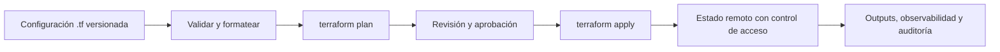

Es una herramienta para **automatizar** la creación, gestión y configuración de infraestructura de manera declarativa

![[DiagramaTerraform.png]]

## ¿Cómo así que de manera declarativa?
- Significa que **Terraform** funciona con `archivos/files` que tienen código.
- Ese código puede estar **versionado**, por lo cual, va a estar almacenado en un Repositorio

> En DevOps es crucial tener todo **automatizado** (desde la **creación, gestión y configuración**)

### Explicación gráfico

1. **Practitioner:** Es la persona que va a ejecutar una estructura de código
2. **Infrastructure as Code:** Es código que representa o crea infraestructura
3. **Plan - Apply:** Planificación de lo que se está creando y Aplicar la infraestructura
4. **Múltiples Proveedores:** variedad para elegir desde AWS, Azure, GCP, etc... y da facilidad de migración de proveedor

## Demo

### Escenario

![[Captura de pantalla 2026-04-08 a la(s) 2.54.23 p.m..png]]

#terraform 
#DevOps

## Terraform como contrato de infraestructura

Terraform describe el **estado deseado** de infraestructura y usa proveedores para traducir la configuración a llamadas contra APIs. El ciclo fiable no es simplemente “crear”: es `init` → `fmt`/`validate` → `plan` revisado → `apply` aprobado → observación y auditoría. El plan es una previsualización, no una garantía absoluta: la infraestructura puede cambiar entre la planificación y la aplicación.

### Estado, módulos y colaboración

- El archivo de estado establece la correspondencia entre recursos declarados y objetos reales. Puede incluir valores sensibles; **no** debe versionarse en Git ni editarse a mano. Para equipos, usa un *backend* remoto con control de acceso, cifrado y bloqueo de estado. [HashiCorp: estado de Terraform](https://developer.hashicorp.com/terraform/language/state)
- Un módulo agrupa recursos que se administran juntos. Versiona módulos reutilizables, documenta entradas/salidas y evita árboles demasiado profundos; la composición suele ser más mantenible. [HashiCorp: módulos](https://developer.hashicorp.com/terraform/language/modules)
- Fija versiones de proveedores y módulos, aplica el principio de mínimo privilegio a las credenciales de despliegue y ejecuta cambios desde CI/CD con aprobación explícita para entornos críticos.

| Patrón | Cuándo usarlo | Trade-off |
| --- | --- | --- |
| Módulo reutilizable | Topologías repetidas con interfaz estable | Requiere versionado y contrato de entradas/salidas. |
| Configuración directa | Prototipo o recurso único y simple | Puede duplicar decisiones y dificultar la gobernanza. |
| Estado local | Laboratorio individual efímero | Sin bloqueo ni colaboración segura. |
| Estado remoto | Equipo, entorno compartido o producción | Añade configuración y controles operativos. |

<!-- self-study-knowledge-context -->
## Contexto de estudio
- Dominio: [[MOC-Self-Study#Cloud & Infrastructure|Cloud e infraestructura]].
- Criterio de producción: Trata la infraestructura como código: revisa el plan, controla versiones, evita secretos en el estado y usa ejecución reproducible.
