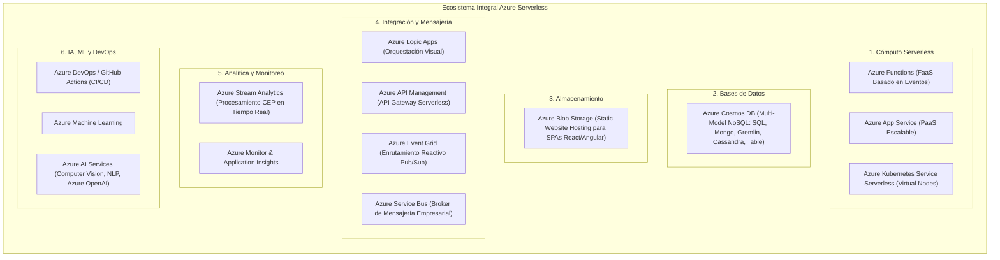
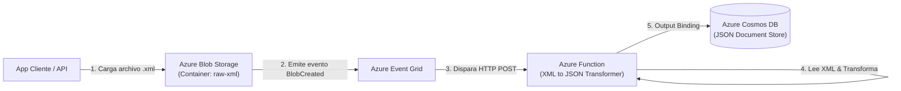
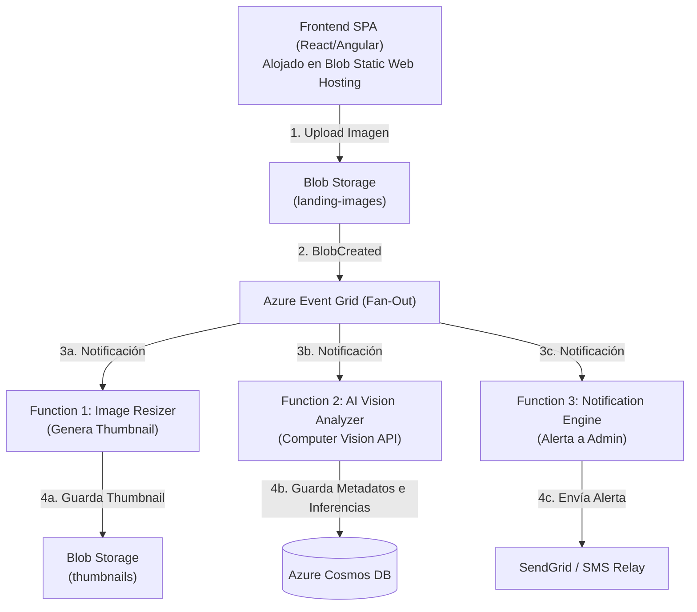
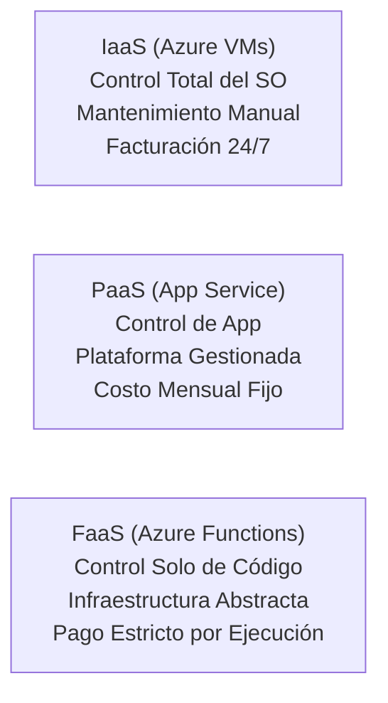
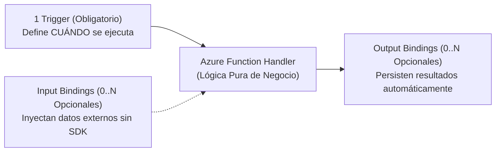
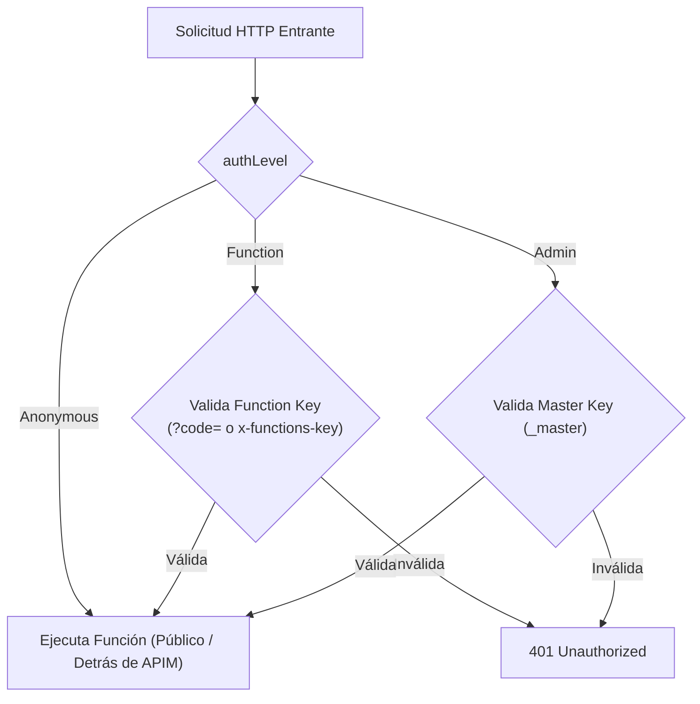

# Azure Functions & Serverless Masterclass: Arquitectura, Modelos de Ejecución y Producción

> [!NOTE] Resumen Arquitectónico Ejecutivo
> **Azure Functions** es la plataforma de computación sin servidor (*Function-as-a-Service - FaaS*) de nivel empresarial de Microsoft Azure. Permite ejecutar piezas atómicas de código activadas por eventos (*event-driven*), escalando de cero a miles de instancias bajo demanda y facturando estrictamente por milisegundos de ejecución activa. Este documento consolida la arquitectura completa del ecosistema serverless de Azure, modelos de programación (Node.js v4 Code-First y Python v2), mecanismos de enlaces (*Triggers & Bindings*), seguridad y gestión de claves, observabilidad con Application Insights (KQL), patrones de integración empresarial y pipelines CI/CD.

> [!TIP] Ubicación de Imagen — Portada / Resumen Azure Functions Masterclass
> Inserte aquí el banner o infografía general del curso:
> `![[Pasted image - Azure Functions Masterclass Overview.png]]`

---

## 1. El Paradigma Serverless: Desafíos Tradicionales vs. Solución Azure

### 1.1 Desafíos de la Infraestructura Tradicional Basada en Servidores
- **Gestión de Capacidad:** Riesgo constante de sobreaprovisionamiento (desperdicio de capital) o subaprovisionamiento (saturación y caída del sistema ante picos inesperados).
- **Sobrecarga Operativa:** Configuración manual de servidores web, proxies inversos (Nginx/Apache), enrutamiento de red y balanceadores de carga.
- **Mantenimiento y Parcheo:** Aplicación manual de parches de seguridad del sistema operativo y resolución de conflictos de dependencias en caliente.
- **Coste de Inactividad (*Idle Waste*):** Facturación 24/7 de máquinas virtuales e infraestructura fija incluso con tráfico nulo.

> [!TIP] Ubicación de Imagen — Desafíos Tradicionales vs. Nube Serverless
> Inserte aquí la comparativa visual de infraestructura tradicional vs serverless:
> `![[Pasted image - Serverless vs Server-Based Infrastructure.png]]`

### 1.2 ¿Cómo resuelve Azure Serverless estos desafíos?
- **Cero Administración de Servidores:** Azure gestiona el hardware, aprovisionamiento de clústeres, aislamiento de procesos y parcheo del sistema operativo.
- **Ejecución Bajo Demanda (*On-Demand*):** El código solo se activa cuando ocurre un evento específico (solicitud HTTP, mensaje en cola, archivo en blob, temporizador).
- **Escalado Automático Elástico (0 a N):** Escala de forma transparente de cero solicitudes hasta millones de ejecuciones concurrentes en segundos.
- **Micro-Facturación Real (*Pay-As-You-Go*):** Se factura únicamente por los milisegundos exactos de cómputo y la memoria asignada (GB-s). Coste cero durante períodos de inactividad.
- **Runtimes Políglotas:** Soporte oficial para C# (.NET), JavaScript/TypeScript (Node.js), Python, Java, PowerShell y contenedores personalizados.

---

## 2. El Ecosistema Serverless de Microsoft Azure

El catálogo serverless de Azure trasciende el cómputo y conforma un ecosistema integral dividido en **nueve categorías operacionales**:



> [!TIP] Ubicación de Imagen — Categorías del Ecosistema Azure Serverless
> Inserte aquí el diagrama de servicios serverless de Azure:
> `![[Pasted image - Azure Serverless Ecosystem Categories.png]]`

### 2.1 Comparativa Arquitectónica de Servicios de Mensajería e Integración

| Componente | Patrón de Comunicación Primario | Caso de Uso Objetivo | Mecanismo Técnico |
| :--- | :--- | :--- | :--- |
| **Azure Event Grid** | **Reactivo (Event-driven)** | Automatización reactiva inmediata (ej. disparar una función al crear un nuevo Blob). | Modelo Push Publish/Subscribe que enruta cargas ligeras de notificación de eventos. |
| **Azure Service Bus** | **Empresarial (Data-driven)** | Desacoplamiento de sistemas críticos que requieren procesamiento transaccional asíncrono y seguro. | Colas y Tópicos con modelo Pull, garantizando ordenamiento (*FIFO*), transacciones y reintentos. |
| **Azure Logic Apps** | **Orquestación de Flujos** | Integración visual de procesos empresariales y conexión de APIs y sistemas SaaS de terceros. | Motor de máquinas de estado con más de 400 conectores empresariales integrados. |

---

## 3. Patrones Arquitectónicos Serverless en Producción

### 3.1 Pipeline ETL Serverless Basado en Eventos (XML a JSON)
Transforma la ingesta de archivos rígida tradicional (servidores FTP dedicados y cron jobs) en un flujo dinámico que se auto-escala con el volumen de entrada y se apaga al finalizar la tarea.



> [!TIP] Ubicación de Imagen — Pipeline ETL Serverless XML a JSON
> Inserte aquí el diagrama del pipeline ETL serverless:
> `![[Pasted image - Serverless XML to JSON ETL Pipeline.png]]`

### 3.2 Pipeline Inteligente de Procesamiento de Imágenes (Patrón Fan-Out)
Un usuario carga una imagen en una interfaz web estática (SPA alojada en Azure Blob Storage). La subida desencadena simultáneamente tres microservicios serverless independientes mediante **Event Grid Fan-Out**:



> [!TIP] Ubicación de Imagen — Pipeline de Análisis de Imágenes Fan-Out
> Inserte aquí el diagrama de la arquitectura Fan-Out con IA:
> `![[Pasted image - Image Analysis Fan-Out Architecture.png]]`

#### Ventajas Arquitectónicas Clave:
- **Frontend Sin Servidor (*Zero-Server Frontend*):** Alojamiento directo de HTML/JS/CSS en Azure Blob Storage sin costes de servidor web.
- **Patrón Fan-Out Desacoplado:** Múltiples microservicios consumen el mismo evento sin modificar el cargador original.
- **Dominios de Fallo Aislados:** Si el servicio de notificaciones por correo falla, el redimensionamiento y el análisis cognitivo continúan sin afectación.

---

## 4. Clasificación Arquitectónica: FaaS vs. IaaS vs. PaaS



> [!TIP] Ubicación de Imagen — Comparativa de Cómputo IaaS vs PaaS vs FaaS
> Inserte aquí la comparativa de modelos de cómputo:
> `![[Pasted image - Compute Offerings IaaS PaaS FaaS.png]]`

| Dimensión | Infrastructure-as-a-Service (IaaS) | Platform-as-a-Service (PaaS) | Function-as-a-Service (FaaS) |
| :--- | :--- | :--- | :--- |
| **Nivel de Control** | Control administrativo total sobre SO, red y configuración de hardware. | Control a nivel de aplicación; SO y servidores web administrados por Azure. | Máxima abstracción; solo se administra el código de la lógica de negocio. |
| **Mantenimiento** | Parcheo manual del SO, librerías y gestión de seguridad física/lógica. | Actualizaciones automáticas del SO y del framework subyacente. | Totalmente abstracto; cero visibilidad ni mantenimiento de hosts. |
| **Escalabilidad** | Reglas manuales o automáticas de adición/eliminación de VMs. | Escalado automático basado en umbrales de CPU/Memoria del plan. | Escalado horizontal ultra-rápido, automático y elástico instantáneo. |
| **Modelo de Cobro** | Facturación horaria fija 24/7 con independencia del uso real. | Costo mensual recurrente según el SKU del App Service Plan asignado. | Pago por consumo estricto: milisegundos de ejecución y memoria asignada. |
| **Ciclo de Vida** | Continuo (permanente hasta desaprovisionamiento explícito). | Continuo (procesos web residentes en memoria). | **Efímero** (se activa por evento, procesa y libera recursos de inmediato). |

---

## 5. Arquitectura Nuclear: Triggers (Desencadenadores) y Bindings (Enlaces)

El modelo de programación de Azure Functions se sustenta en dos principios de diseño:

> [!IMPORTANT] Las Dos Reglas de Oro de Azure Functions
> 1. **La Regla de Cardinalidad:** Toda Azure Function **debe tener exactamente un Trigger**. Una función no puede existir sin desencadenador, ni puede poseer múltiples desencadenadores simultáneos.
> 2. **La Regla de Opcionalidad:** Los **Bindings** son completamente **opcionales**. Una función puede tener cero, uno o múltiples bindings de entrada y salida simultáneamente.



> [!TIP] Ubicación de Imagen — Desencadenadores y Enlaces de Azure Functions
> Inserte aquí el diagrama de Triggers & Bindings:
> `![[Pasted image - Triggers and Bindings Architecture.png]]`

### 5.1 Desglose de Triggers Principales

| Tipo de Trigger | Mecanismo Técnico | Caso Práctico Común | Parámetro Crítico de Configuración |
| :--- | :--- | :--- | :--- |
| **HTTP Trigger** | Invocación mediante llamadas REST (GET, POST, PUT, DELETE). | APIs públicas/privadas, webhooks, microservicios. | Nivel de Autorización (`Anonymous`, `Function`, `Admin`). |
| **Timer Trigger** | Invocación programada en un reloj automatizado. | Mantenimiento nocturno de BD, rotación de logs. | **Expresión CRON de 6 campos** (`{s} {m} {h} {d} {m} {w}`). |
| **Blob Storage Trigger** | Invocación al detectar creación o modificación de archivos. | Validación de archivos, procesamiento OCR, redimensionamiento. | Ruta del contenedor (ej. `image-input/{name}`). |
| **Queue Storage Trigger** | Invocación tan pronto entra un mensaje a la cola. | Desacoplamiento asíncrono y absorción de picos. | Nombre de cola y variable de conexión (`Connection`). |
| **Cosmos DB Trigger** | Invocación ante inserciones o cambios en la BD (*Change Feed*). | Sincronización de datos, auditoría, replicación reactiva. | Base de datos, contenedor y colección de *leases*. |

### 5.2 Matriz de Soporte de Bindings en Servicios de Azure

```
┌─────────────────────────┬─────────────────┬──────────────────┬──────────────────┐
│ Servicio de Azure       │ Soporta Trigger │ Soporta Entrada  │ Soporta Salida   │
├─────────────────────────┼─────────────────┼──────────────────┼──────────────────┤
│ Azure Cosmos DB         │       SÍ        │        SÍ        │        SÍ        │
│ Azure Blob Storage      │       SÍ        │        SÍ        │        SÍ        │
│ Azure Service Bus       │       SÍ        │        NO        │        SÍ        │
│ Azure Queue / Table     │       SÍ        │        SÍ        │        SÍ        │
│ SendGrid (Email)        │       NO        │        NO        │        SÍ        │
│ Twilio (SMS)            │       NO        │        NO        │        SÍ        │
│ Microsoft Graph Events  │       SÍ        │        SÍ        │        SÍ        │
│ SignalR Service         │       NO        │        SÍ        │        SÍ        │
└─────────────────────────┴─────────────────┴──────────────────┴──────────────────┘
```

---

## 6. Selección de Lenguajes, Runtimes y Criterios Arquitectónicos

### 6.1 Estados de Disponibilidad
- **Generally Available (GA):** Aprobado para entornos de producción, respaldado por SLAs oficiales y soporte técnico completo.
- **Preview / Experimental:** Exclusivamente para pruebas y laboratorios. **Bajo ninguna circunstancia debe desplegarse en producción**.

### 6.2 Criterios de Selección por Carga
- **Node.js (TypeScript / JavaScript):** Óptimo para backends de APIs I/O intensivas, arquitecturas asíncronas y transformaciones ligeras.
- **Python:** Mandatorio para pipelines de ingeniería de datos, Inteligencia Artificial, visión computacional y modelos de Machine Learning (Pandas, PyTorch, Scikit-learn).
- **C# (.NET 8/9 Isolated Worker):** Máximo rendimiento computacional, integración con librerías empresariales y arranque optimizado.

> [!WARNING] Restricción Técnica de Aplicación Políglota
> Una única instancia de **Function App** solo puede ejecutar un único runtime worker a la vez (ej. Node.js o Python). Si se requiere una arquitectura políglota, es obligatorio aprovisionar **múltiples Function Apps independientes**.

### 6.3 Anti-Patrones Arquitectónicos (Cuándo NO usar Azure Functions)

| Escenario / Requisito | Por qué Azure Functions Falla | Alternativa Recomendada |
| :--- | :--- | :--- |
| **ETL Masivo Empresarial** | Alto consumo de memoria y límites de tiempo de ejecución. | **Azure Data Factory / Azure Databricks** |
| **Cargas de Larga Duración (>10 min)** | Timeouts estrictos en planes de consumo (5 min defecto, 10 min máx). | **Azure Container Apps / Azure Batch** |
| **Orquestación con Estado** | Las funciones estándar son sin estado (*stateless*). | **Azure Durable Functions** |
| **Monolitos en Código** | Funciones sobrecargadas sufren de altos tiempos de *Cold Start*. | **Azure App Service / AKS** |

---

## 7. Modelos de Programación: Node.js v3 vs. Moderno Node.js v4 Code-First

> [!IMPORTANT] Evolución Arquitectónica
> El modelo histórico **v3** dependía de archivos de configuración paralelos `function.json` y del patrón `module.exports`. El estándar de producción actual es el **Node.js v4 Programming Model**, que adopta una arquitectura **Code-First** mediante el paquete `@azure/functions` con soporte nativo de TypeScript y la API estándar Fetch (`HttpRequest` / `HttpResponseInit`).

### 7.1 Comparativa de Modelos Node.js

| Característica | Modelo Legado (Node.js v3) | Modelo Moderno de Producción (Node.js v4) |
| :--- | :--- | :--- |
| **Configuración** | Archivo complementario obligatorio `function.json`. | **Code-First:** Declarado directamente en código con `@azure/functions`. |
| **Estructura de Carpetas** | Una subcarpeta por función con `index.js` + `function.json`. | **Flexible:** Estructura modular estándar de Node.js con puntos de entrada centralizados. |
| **Modelo HTTP** | Wrapper propietario `req` / `context.res`. | Estándar **Fetch API** (`HttpRequest` / `HttpResponseInit`). |
| **Soporte TypeScript** | Requiere compilación y configuración de tipos por función. | Integración nativa de TypeScript de primera clase. |

### 7.2 Implementación de Producción en Node.js v4 (TypeScript)

```typescript
import { app, HttpRequest, HttpResponseInit, InvocationContext } from "@azure/functions";

export async function processGreeting(request: HttpRequest, context: InvocationContext): Promise<HttpResponseInit> {
    context.log(`[TRACE] Procesando solicitud HTTP para URL: ${request.url}`);

    // Extracción de parámetros desde query string o payload JSON
    const name = request.query.get("name") || (await request.json().catch(() => ({})) as { name?: string })?.name;

    if (name) {
        return {
            status: 200,
            jsonBody: {
                success: true,
                message: `Hola, ${name}. Ejecución exitosa en Azure Functions v4.`,
                timestamp: new Date().toISOString()
            }
        };
    }

    return {
        status: 400,
        jsonBody: {
            success: false,
            error: "Parámetro obligatorio 'name' ausente en el query o body."
        }
    };
}

// Registro Code-First del endpoint HTTP sin function.json
app.http("GreetingFunction", {
    methods: ["GET", "POST"],
    authLevel: "function",
    handler: processGreeting
});
```

---

## 8. Seguridad, Jerarquía de Claves y Niveles de Autorización

### 8.1 Niveles de Autorización para Triggers HTTP



> [!TIP] Ubicación de Imagen — Niveles de Autorización y Seguridad
> Inserte aquí el diagrama de niveles de autenticación de funciones:
> `![[Pasted image - Azure Function Authorization Levels.png]]`

| Nivel de Autorización | Clave Requerida | Alcance y Perfil de Seguridad | Mejor Práctica de Producción |
| :--- | :--- | :--- | :--- |
| **`Anonymous`** | Ninguna | Acceso público no autenticado. | Proteger obligatoriamente detrás de **Azure API Management (APIM)** o Front Door con validación JWT/OAuth2. |
| **`Function`** | *Function Key* o *Host Key* | La clave de función solo accede a esa función específica; la Host Key accede a todas las funciones de la app. | Adecuado para pruebas o llamadas internas entre microservicios. |
| **`Admin`** | *Master Key* (`_master`) | Acceso administrativo total a todos los endpoints y APIs `/admin/*`. | Restringido estrictamente a gestión del sistema. **Nunca exponer en clientes ni versionar en Git**. |

### 8.2 Estándar de Invocación Segura

- ❌ **Método Inseguro (Query Parameter):**
  `GET https://app.azurewebsites.net/api/fn?code=secretKey`
  *Vulnerabilidad:* La clave queda expuesta en logs de proxies, historial de navegadores y herramientas de telemetría.
- ✅ **Método Seguro de Producción (HTTP Header):**
  ```http
  GET /api/fn HTTP/1.1
  Host: app.azurewebsites.net
  x-functions-key: d3vS3cr3tKey...
  ```

---

## 9. Observabilidad, Telemetría y Dependencias de Almacenamiento

### 9.1 Integración con Azure Application Insights

Application Insights captura automáticamente la telemetría distribuida de todas las invocaciones:

```kusto
// 1. Resumen de ejecuciones, tasa de fallos y latencia P95 por función
requests
| where timestamp > ago(24h)
| summarize 
    TotalInvocations = count(),
    SuccessfulInvocations = countif(success == true),
    FailedInvocations = countif(success == false),
    AvgDurationMs = avg(duration),
    P95DurationMs = percentiles(duration, 95)
  by operation_Name
| order by FailedInvocations desc
```

```kusto
// 2. Extracción de excepciones y trazas de error en tiempo de ejecución
exceptions
| where timestamp > ago(12h)
| project timestamp, operation_Name, type, outerMessage, details
| order by timestamp desc
```

### 9.2 Dependencia Crítica de Almacenamiento (`AzureWebJobsStorage`)

Toda Function App requiere una cuenta de almacenamiento vinculada para operar:
- **Blob Storage:** Almacena los paquetes de despliegue (.zip), claves de host y artefactos de ejecución.
- **File Shares:** Hospeda el árbol de código (`site/wwwroot`) en planes de consumo sobre Windows.
- **Queues & Tables:** Gestiona los bloqueos distribuidos de temporizadores (*Timer leases*) y el estado de orquestaciones de **Durable Functions**.

> [!TIP] Buenas Prácticas de Producción para Almacenamiento
> 1. **Eliminar Cadenas de Conexión:** Utiliza **Managed Identities** con roles RBAC (`Storage Blob Data Owner`, `Storage Queue Data Contributor`) configurando `AzureWebJobsStorage__accountName = <nombre_cuenta>`.
> 2. **Despliegues Inmutables (`WEBSITE_RUN_FROM_PACKAGE = 1`):** Monta el paquete ZIP directamente en memoria, reduciendo drásticamente el *Cold Start* y protegiendo el directorio de código contra modificaciones accidentales.

---

## 10. Casos Prácticos Completos con Código de Producción

### Caso 1: Pipeline de Análisis de Imágenes con Azure AI Vision y Cosmos DB

El pipeline recibe una imagen binaria en Blob Storage, invoca la API de **Azure AI Vision** para clasificar etiquetas y objetos, y persiste el resultado en **Azure Cosmos DB** mediante un *Output Binding* en Node.js v4.

```javascript
const { app, output } = require('@azure/functions');
const axios = require('axios');

// Definición del binding de salida para Cosmos DB en Node.js v4
const cosmosOutput = output.cosmosDB({
    databaseName: 'visionDB',
    containerName: 'imageAnalysis',
    connection: 'CosmosDBConnection',
    createIfNotExists: false
});

app.storageBlob('analyzeImageBlobTriggerCosmosOut', {
    path: 'image-input/{name}',
    connection: 'AzureWebJobsStorage',
    return: cosmosOutput,
    handler: async (blob, context) => {
        context.log(`[BLOB TRIGGER] Procesando imagen: "${context.triggerMetadata.name}", Tamaño: ${blob.length} bytes`);

        const visionEndpoint = process.env.VISION_API_ENDPOINT;
        const apiKey = process.env.VISION_API_KEY;
        const requestUrl = `${visionEndpoint}/vision/v3.2/analyze?visualFeatures=Tags,Objects,Description`;

        try {
            // Llamada HTTP con flujo binario octet-stream a Azure AI Vision
            const response = await axios.post(requestUrl, blob, {
                headers: {
                    'Ocp-Apim-Subscription-Key': apiKey,
                    'Content-Type': 'application/octet-stream'
                }
            });

            const analysisResult = response.data;
            context.log(`[AI SUCCESS] Análisis completado. RequestId: ${analysisResult.requestId}`);

            // Estructura del documento persistido en Cosmos DB con clave de partición /requestId
            const cosmosDocument = {
                id: analysisResult.requestId,
                requestId: analysisResult.requestId,
                blobName: context.triggerMetadata.name,
                processedTimestamp: new Date().toISOString(),
                analysis: analysisResult
            };

            // El retorno de la función es escrito automáticamente en Cosmos DB por el binding
            return cosmosDocument;
        } catch (error) {
            context.log.error('[ERROR AI VISION]', error.response?.data || error.message);
            throw error;
        }
    }
});
```

---

### Caso 2: API RESTful Serverless Completa con Cosmos DB y Validación Zod

Construcción de un backend de gestión de recursos (`Books`) con validación de esquemas tipados mediante **Zod**, consultas SQL nativas con *Input Bindings* y eliminación programática con el SDK `@azure/cosmos`.

> [!TIP] Ubicación de Imagen — Arquitectura REST API con Cosmos DB
> Inserte aquí el plano arquitectónico de la API REST:
> `![[Pasted image - Serverless REST API Architecture.png]]`

#### A. Creación con Validación Zod (`createBook.js`)

```javascript
const { app, output } = require('@azure/functions');
const { randomUUID } = require('crypto');
const { z } = require('zod');

// Contrato de validación estricto con Zod
const bookSchema = z.object({
    title: z.string().min(1, 'El título es obligatorio'),
    author: z.string().min(1, 'El autor es obligatorio'),
    datePublished: z.string().datetime().optional()
});

const cosmosOutput = output.cosmosDB({
    databaseName: 'bookDB',
    containerName: 'bookcontainer',
    connection: 'CosmosDBConnection',
    createIfNotExists: false
});

app.http('createBook', {
    methods: ['POST'],
    authLevel: 'anonymous', // En producción se protege con APIM
    extraOutputs: [cosmosOutput],
    return: output.generic({ type: 'http' }),
    handler: async (request, context) => {
        let body;
        try {
            body = await request.json();
        } catch {
            return { status: 400, jsonBody: { error: 'Payload JSON inválido' } };
        }

        const validation = bookSchema.safeParse(body);
        if (!validation.success) {
            return { status: 400, jsonBody: { errors: validation.error.format() } };
        }

        const newBook = {
            id: randomUUID(),
            ...validation.data,
            createdAt: new Date().toISOString()
        };

        // Persistir en Cosmos DB vía Output Binding
        context.extraOutputs.set(cosmosOutput, newBook);

        return {
            status: 201,
            jsonBody: {
                success: true,
                message: 'Libro creado exitosamente',
                data: newBook
            }
        };
    }
});
```

#### B. Eliminación mediante SDK `@azure/cosmos` (`deleteBookById.js`)

```javascript
const { app } = require('@azure/functions');
const { CosmosClient } = require('@azure/cosmos');

const client = new CosmosClient(process.env.CosmosDBConnection);
const container = client.database('bookDB').container('bookcontainer');

app.http('deleteBookById', {
    methods: ['DELETE'],
    authLevel: 'anonymous',
    handler: async (request, context) => {
        const id = request.query.get('id');
        const author = request.query.get('author'); // Clave de partición obligatoria

        if (!id || !author) {
            return {
                status: 400,
                jsonBody: { error: 'Parámetros obligatorios ausentes: id y author' }
            };
        }

        try {
            await container.item(id, author).delete();
            return {
                status: 200,
                jsonBody: { success: true, message: `Libro ${id} eliminado exitosamente` }
            };
        } catch (error) {
            if (error.code === 404) {
                return { status: 404, jsonBody: { error: 'Libro no encontrado' } };
            }
            context.log.error('[COSMOS DELETE ERROR]', error.message);
            return { status: 500, jsonBody: { error: 'Error interno del servidor' } };
        }
    }
});
```

---

## 11. Estrategias de Despliegue Empresarial y CI/CD

```
┌─────────────────────────────────────────────────────────────────────────┐
│                    FLUJO DE DESPLIEGUE CI/CD EN PRODUCCIÓN              │
│                                                                         │
│  ┌──────────────────────┐     git push     ┌─────────────────────────┐  │
│  │ Repositorio Local    │ ───────────────> │ GitHub Actions /        │  │
│  │ (VS Code / Core CLI) │                  │ Azure DevOps Pipelines  │  │
│  └──────────────────────┘                  └────────────┬────────────┘  │
│                                                         │ Build & Test  │
│                                                         v               │
│                                            ┌─────────────────────────┐  │
│                                            │ Staging Slot (Pruebas)  │  │
│                                            └────────────┬────────────┘  │
│                                                         │ Slot Swap     │
│                                                         v               │
│                                            ┌─────────────────────────┐  │
│                                            │ Production Slot (En Vivo│  │
│                                            └─────────────────────────┘  │
└─────────────────────────────────────────────────────────────────────────┘
```

### 11.1 Comparativa de Métodos de Despliegue

| Método de Despliegue | Caso de Uso Objetivo | Nivel de Automatización | Impacto en la Infraestructura |
| :--- | :--- | :--- | :--- |
| **Extensión IDE (VS Code / Visual Studio)** | Prototipado rápido y pruebas locales. | **Manual** (iniciado desde el IDE). | Publica código mediante despliegue ZIP directo. |
| **Repositorio Git Local** | Despliegue sin servidor de repositorios gestionado. | **Semi-automatizado**. | El App Service actúa como servidor de compilación. |
| **Integración Git Remota (CI/CD)** | **Estándar de Producción** (GitHub Actions / Azure DevOps). | **Totalmente Automatizado** al realizar `git push`. | Compilación, pruebas unitarias y despliegue inmutable gestionado. |
| **Azure Functions Core Tools (`func`)** | Scripts de despliegue en servidores CI propios. | **Automatizado vía CLI** (`func azure functionapp publish`). | Carga el paquete binario precompilado directamente. |

### 11.2 Mejores Prácticas para Producción
1. **Bloqueo del Editor en el Portal (*Portal Lockout*):** Al conectar un pipeline CI/CD o usar `WEBSITE_RUN_FROM_PACKAGE`, el editor del portal pasa a ser de solo lectura para evitar desincronizaciones de configuración (*configuration drift*).
2. **Ranuras de Despliegue (*Deployment Slots*):** Despliega siempre en un slot de **Staging**, ejecuta pruebas de integración y realiza un **Slot Swap** hacia producción con cero tiempo de inactividad (*Zero-Downtime Deployment*).
3. **Infraestructura como Código (IaC):** Aprovisiona la Function App, cuentas de almacenamiento y Application Insights usando **Bicep** o **Terraform** versionados en Git.

---

<!-- self-study-knowledge-context -->
## Contexto de estudio
- Dominio: [[MOC-Self-Study#Cloud & Infrastructure|Cloud e infraestructura]].
- Notas relacionadas: [[0. Fundamentos de Cloud Computing y Responsabilidad Compartida|Fundamentos Cloud & Responsabilidad Compartida]], [[0.1. Tipos de Servicios Cloud - IaaS, PaaS y SaaS|Tipos de Servicios Cloud (IaaS, PaaS, SaaS)]], [[1. Introducción a Azure|Introducción a Azure]], [[3. Comprender la Infraestructura de Azure|Infraestructura y Jerarquía de Azure]], [[4. Azure Storage y Compute|Azure Storage y Compute]].
- Criterio de producción: Implementa funciones idempotentes, desacopla con colas para amortiguar picos de carga, asegura endpoints con Azure API Management y Managed Identities, y automatiza los despliegues con CI/CD y Deployment Slots.
