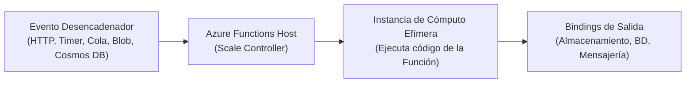
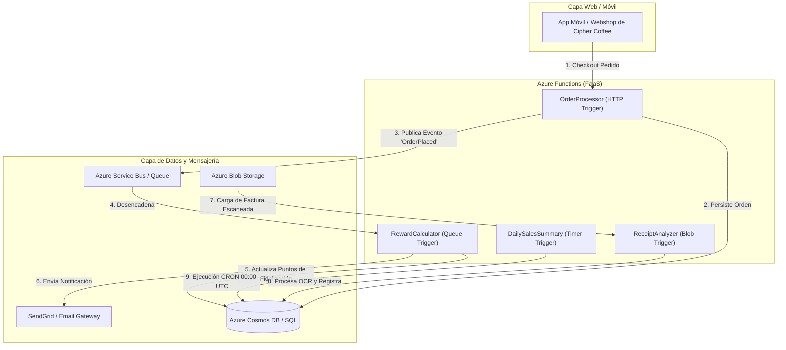
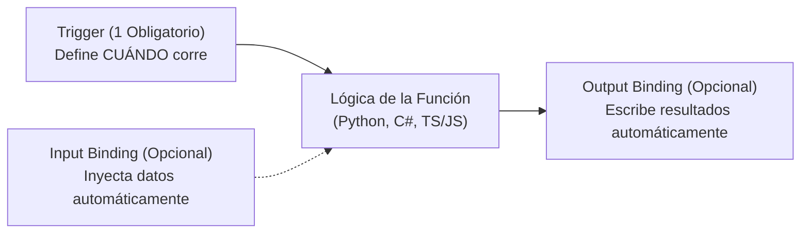
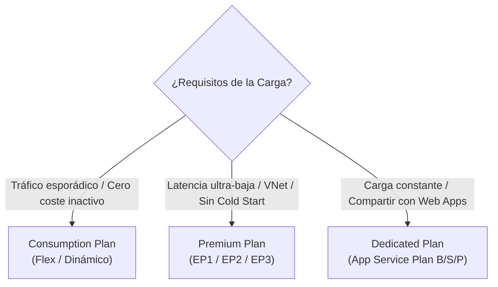
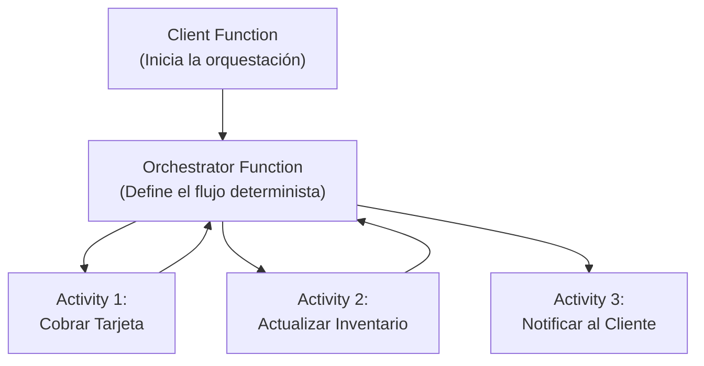

# Azure Functions: Arquitectura Serverless y Cómputo Basado en Eventos

> [!NOTE] Resumen Arquitectónico
> **Azure Functions** es la plataforma de computación sin servidor (*Serverless Function-as-a-Service - FaaS*) de nivel empresarial de Microsoft Azure. Permite ejecutar pequeños bloques de código ("funciones") dirigidos por eventos (*event-driven*), escalando de cero a miles de instancias automáticamente bajo demanda y facturando exclusivamente por los recursos consumidos durante la ejecución exacta.

---

## 1. Fundamentos de Azure Functions y Cómputo Serverless

En la arquitectura cloud moderna, la computación sin servidor (*Serverless*) no implica la ausencia de servidores físicos, sino la **abstracción total del aprovisionamiento, mantenimiento, parcheo y escalado de la infraestructura subyacente**.



### Principios Fundamentales
1. **Abstracción de Servidores:** Los desarrolladores se concentran únicamente en la lógica de negocio; el tejido de Azure gestiona la disponibilidad del sistema operativo y los runtimes.
2. **Escalabilidad Elástica Dinámica (0 a N):** La infraestructura escala instantáneamente en respuesta al volumen de eventos entrantes y se desescala a cero (*Scale-to-Zero*) cuando cesa la actividad.
3. **Micro-Facturación por Consumo:** En los planes de consumo, no se abona nada cuando el servicio está inactivo. El costo se calcula a partir de las invocaciones totales y los Gigabyte-segundos (GB-s) de memoria consumidos.
4. **Acoplamiento Declarativo mediante Triggers y Bindings:** Integración nativa con el ecosistema de Azure sin requerir código *boilerplate* de SDKs para conectar orígenes o destinos de datos.

![[Pasted image - Azure Functions Architecture.png]]

---

## 2. Caso Arquitectónico: Cipher Coffee

Para el ecosistema de comercio digital de **Cipher Coffee**, Azure Functions resuelve casos de uso desacoplados y reactivos:



- **Procesamiento de Pedidos (`OrderProcessor`):** Recibe transacciones HTTP POST, valida el payload y publica en cola para procesamiento asíncrono.
- **Cálculo de Recompensas (`RewardCalculator`):** Consume eventos de la cola de fidelización, acumula puntos en la cuenta del cliente y emite correos transaccionales.
- **Consolidación Diaria (`DailySalesSummary`):** Tarea programada vía CRON que calcula los agregados financieros nocturnos de las sucursales.
- **Procesamiento de Facturas (`ReceiptAnalyzer`):** Desencadenada cuando un usuario sube un archivo al *Blob Storage*, extrayendo metadatos mediante servicios cognitivos.

---

## 3. Modelo de Programación: Triggers y Bindings

El diferencial arquitectónico de Azure Functions es el sistema de **Triggers (Desencadenadores)** y **Bindings (Enlaces de Entrada y Salida)**.



### Taxonomía de Componentes

| Tipo | Función Arquitectónica | Ejemplos Soportados |
| :--- | :--- | :--- |
| **Trigger (Desencadenador)** | Define el evento que inicia la ejecución. Toda función tiene **exactamente un** trigger. | `HttpTrigger`, `TimerTrigger` (CRON), `BlobTrigger`, `QueueTrigger`, `ServiceBusTrigger`, `EventGridTrigger`, `CosmosDBTrigger`. |
| **Input Binding (Entrada)** | Proporciona datos adicionales a la función de manera declarativa sin inicializar clientes SDK. | Lectura de documentos de `CosmosDB`, descarga de archivo de `BlobStorage`, consulta de registros en `SQL`. |
| **Output Binding (Salida)** | Permite enviar datos o mensajes a destinos externos simplemente retornando un valor desde la función. | Inserción en `QueueStorage`, guardado en `BlobStorage`, escritura en `CosmosDB`, envío de correos vía `SendGrid`. |

---

## 4. Planes de Hospedaje y Análisis de Escalado

Elegir el plan de hospedaje adecuado es crítico para balancear costos, latencia y requerimientos de red privada:



### Matriz Comparativa de Planes de Alojamiento

| Característica | Plan de Consumo (*Consumption*) | Plan Premium (*Elastic Premium*) | Plan Dedicado (*App Service Plan*) |
| :--- | :--- | :--- | :--- |
| **Modelo de Facturación** | 100% basado en consumo (por invocación y GB-segundo). Cero coste en reposo. | Tarifa por vCPU y memoria por segundo reservado para instancias base + elástico. | Coste fijo mensual por la máquina virtual del App Service Plan asignado. |
| **Escalado Automático** | Instantáneo y masivo (hasta cientos de instancias concurrentes). | Escalado predictivo y elástico con instancias precalentadas (*pre-warmed*). | Escalado basado en métricas de CPU/Memoria del App Service Plan. |
| **Arranque en Frío (*Cold Start*)** | **Sí** (las instancias pueden tardar 1-5 segundos en inicializarse tras inactividad). | **No** (mantiene instancias calientes siempre disponibles). | **No** (las instancias se mantienen ejecutando permanentemente si *Always On* está activo). |
| **Duración Máxima de Ejecución** | Por defecto 5 minutos (configurable hasta 10 minutos). | Ilimitada / 60 minutos garantizados por defecto. | Ilimitada (siempre encendido). |
| **Integración con Red Virtual (VNet)** | Limitada (disponible en nueva versión Flex Consumption). | **Soporte Completo Nativo** para VNet Injection y Private Endpoints. | **Soporte Completo Nativo** para VNet Injection y Private Endpoints. |
| **Casos de Uso Ideales** | Procesamiento por lotes, microservicios asíncronos, APIs de tráfico variable. | APIs críticas de baja latencia, integraciones empresariales seguras con DBs privadas. | Cargas continuas de alta utilización donde el coste de consumo superaría un servidor dedicado. |

---

## 5. Implementación de Producción: Python v2 Programming Model

El modelo de programación **Python v2** de Azure Functions utiliza decoradores nativos en lugar del archivo histórico `function.json`, ofreciendo un código más limpio, tipado y testeable.

### Estructura de Proyecto en Python v2

```
cipher-coffee-functions/
│
├── function_app.py          # Definición de funciones con decoradores
├── host.json                # Configuración global del Functions Host
├── local.settings.json      # Variables de entorno locales (NO versionar)
├── requirements.txt         # Dependencias Python (azure-functions, pydantic)
└── tests/                   # Pruebas unitarias con mocks
    └── test_order_flow.py
```

### Código Fuente de Producción (`function_app.py`)

```python
"""
Cipher Coffee - Azure Functions Microservices Pipeline
Python v2 Programming Model with Type Hints and Structured Handling.
"""

import json
import logging
from typing import Any, Dict
import azure.functions as func
from pydantic import BaseModel, Field, ValidationError

# Inicialización de la aplicación de funciones de Azure
app = func.FunctionApp(http_auth_level=func.AuthLevel.FUNCTION)
logger = logging.getLogger("cipher_coffee_functions")


class OrderItem(BaseModel):
    item_id: str = Field(..., description="Identificador único del producto")
    quantity: int = Field(..., gt=0, description="Cantidad solicitada")
    unit_price: float = Field(..., gt=0.0, description="Precio unitario")


class OrderPayload(BaseModel):
    order_id: str = Field(..., description="UUID del pedido")
    customer_id: str = Field(..., description="ID del cliente en Cipher Coffee")
    items: list[OrderItem] = Field(..., min_length=1)
    total_amount: float = Field(..., gt=0.0)


@app.route(route="v1/orders", methods=["POST"])
@app.queue_output(
    arg_name="orderQueue",
    queue_name="orders-to-process",
    connection="AzureWebJobsStorage",
)
def process_order_http(req: func.HttpRequest, orderQueue: func.Out[str]) -> func.HttpResponse:
    """
    Procesa un pedido HTTP, valida el contrato con Pydantic y encola el mensaje.

    Args:
        req: Solicitud HTTP entrante con el payload JSON del pedido.
        orderQueue: Binding de salida hacia la cola de Azure Storage.

    Returns:
        func.HttpResponse: Confirmación 202 Accepted o error 400 Bad Request.
    """
    logger.info("Recibida solicitud de pedido HTTP POST.")

    try:
        req_body = req.get_json()
        order = OrderPayload.model_validate(req_body)

        # Enviar mensaje serializado a la cola de salida mediante el binding
        orderQueue.set(order.model_dump_json())

        logger.info(f"Pedido {order.order_id} validado y encolado exitosamente.")
        return func.HttpResponse(
            body=json.dumps({"status": "Accepted", "order_id": order.order_id}),
            mimetype="application/json",
            status_code=202,
        )

    except (ValueError, ValidationError) as err:
        logger.error(f"Fallo de validación en el pedido: {err}")
        return func.HttpResponse(
            body=json.dumps({"error": "Payload inválido", "details": str(err)}),
            mimetype="application/json",
            status_code=400,
        )
    except Exception as exc:
        logger.critical(f"Error no controlado en process_order_http: {exc}", exc_info=True)
        return func.HttpResponse(
            body=json.dumps({"error": "Internal Server Error"}),
            mimetype="application/json",
            status_code=500,
        )


@app.queue_trigger(
    arg_name="msg",
    queue_name="orders-to-process",
    connection="AzureWebJobsStorage",
)
def calculate_rewards_queue(msg: func.QueueMessage) -> None:
    """
    Desencadenada por la cola de pedidos para calcular puntos de recompensa.

    Args:
        msg: Mensaje desencadenador recibido de la cola de almacenamiento.
    """
    msg_body = msg.get_body().decode("utf-8")
    data: Dict[str, Any] = json.loads(msg_body)
    
    order_id = data.get("order_id")
    customer_id = data.get("customer_id")
    total_amount = float(data.get("total_amount", 0.0))

    # Regla de negocio de Cipher Coffee: 10 puntos por cada dólar
    earned_points = int(total_amount * 10)
    logger.info(
        f"Procesando recompensa para pedido {order_id}: Cliente {customer_id} ganó {earned_points} puntos."
    )
    # Lógica de actualización a base de datos persistente (Cosmos DB / SQL)
```

---

## 6. Durable Functions: Orquestación Serverless con Estado

Las funciones serverless estándar son inherentemente **sin estado (*stateless*)**. Cuando se requiere coordinar flujos de trabajo complejos de larga duración, Azure ofrece **Durable Functions**.



### Patrones Arquitectónicos de Durable Functions

1. **Encadenamiento de Funciones (*Function Chaining*):** Ejecuta una secuencia de funciones en un orden estricto, pasando la salida de una como entrada de la siguiente.
2. **Abanico de Salida / Abanico de Entrada (*Fan-Out / Fan-In*):** Ejecuta múltiples funciones en paralelo y espera a que todas terminen para consolidar el resultado.
3. **API HTTP Asíncrona (*Async HTTP APIs*):** Resuelve el problema de operaciones que superan los timeouts de HTTP exponiendo endpoints de sondeo (*polling*) automáticos de estado (`GET /status`).
4. **Monitor (*Monitoring Pattern*):** Sondeo recurrente y flexible que espera hasta que se cumpla una condición externa antes de continuar.
5. **Interacción Humana (*Human Interaction / Approval*):** Pausa la ejecución de la orquestación esperando un evento externo (ej. aprobación de un gerente vía correo con token) con un tiempo de expiración definido.

---

## 7. Seguridad, Redes y Observabilidad en Producción

### 1. Seguridad e Identidad Gestionada (Zero Hardcoded Secrets)
- **Managed Identities:** Se elimina el uso de credenciales en cadenas de conexión. La Function App se autentica contra *Azure SQL*, *Cosmos DB* o *Blob Storage* usando un token emitido por Microsoft Entra ID.
- **Key Vault References:** Si se requieren secretos de terceros, se inyectan en las variables de entorno usando la sintaxis nativa:
  ```env
  SENDGRID_API_KEY=@Microsoft.KeyVault(SecretUri=https://kv-cipher.vault.azure.net/secrets/SendGridKey/)
  ```

### 2. Aislamiento de Red (Private Networking)
- **VNet Integration:** Permite que la Function App acceda a bases de datos y APIs alojadas en redes privadas de Azure sin exponer tráfico por Internet público.
- **Private Endpoints:** Bloquea la URL pública de la Function App (`*.azurewebsites.net`), permitiendo invocaciones únicamente desde dentro de la VNet corporativa.

### 3. Observabilidad con Azure Application Insights
- Telemetría automática de latencia, tasa de éxito, dependencias y tiempos de invocación.
- **Consulta KQL de Diagnóstico de Errores:**
  ```kusto
  requests
  | where timestamp > ago(24h)
  | where success == false
  | summarize FailureCount = count() by resultCode, operation_Name
  | order by FailureCount desc
  ```

---

## 8. Matriz de Decisión: ¿Cuándo usar Azure Functions?

| Necesidad de la Carga | Servicio Recomendado | Justificación Arquitectónica |
| :--- | :--- | :--- |
| **Eventos esporádicos, APIs ligeras, tareas programadas, ETL por lotes** | **Azure Functions** | Máxima eficiencia de costo (escala a cero), despliegue ultra-rápido y bindings nativos. |
| **Sitios web corporativos, aplicaciones web monolíticas o APIs REST pesadas continuas** | **Azure App Services (Web Apps)** | Servidores dedicados, soporte para despliegues complejos, slots de prueba y recursos continuos. |
| **Microservicios en contenedores con comunicación gRPC, Dapr o mTLS** | **Azure Container Apps (ACA)** | Orquestación serverless de contenedores sobre Kubernetes sin la sobrecarga de gestionar AKS. |
| **Control total sobre el sistema operativo, software heredado o kernels específicos** | **Azure Virtual Machines (IaaS)** | Máximo control sobre dependencias y configuración a nivel de máquina. |

---

<!-- self-study-knowledge-context -->
## Contexto de estudio
- Dominio: [[MOC-Self-Study#Cloud & Infrastructure|Cloud e infraestructura]].
- Notas relacionadas: [[0. Fundamentos de Cloud Computing y Responsabilidad Compartida|Fundamentos de Cloud y Economía]], [[1. Introduciton to Azure App Service|Introducción a App Service]], [[2. Azure App Services|Azure Web Apps]], [[1. Introduction to Compute|Azure Compute Overview]].
- Criterio de producción: Diseña funciones idempotentes, desacopla con colas para amortiguar picos, evita dependencias pesadas en el inicio para reducir el cold start y externaliza secretos en Azure Key Vault.
