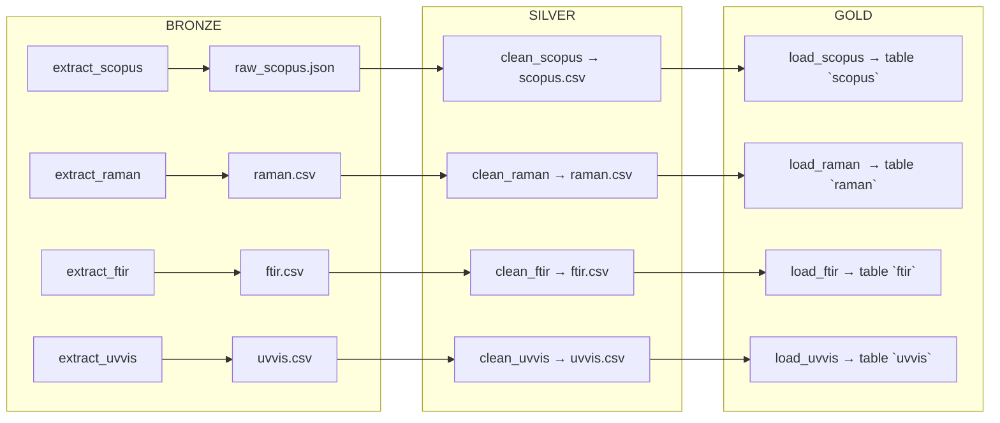
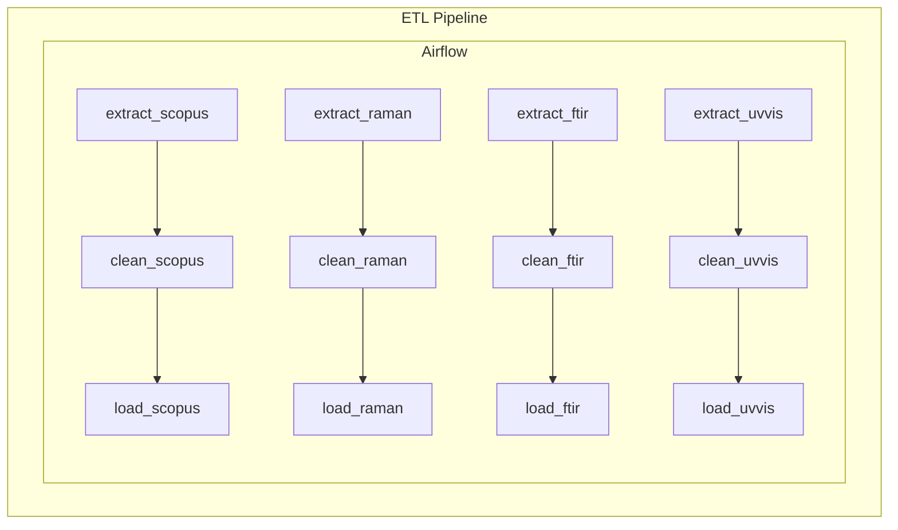

# Informe de Avance del Proyecto OMICAS

**Fecha:** 2025-07-31

---

## 1. Resumen Ejecutivo

- **Objetivo**: Montar un pipeline ETL en Airflow que extraiga datos de Scopus, espectros Raman, FTIR y UV-Vis, los limpie, y los cargue en PostgreSQL; además de preparar el entorno Docker con MinIO.
- **Estado actual**:  
  - ✅ Contenedores Docker levantados (Postgres, PgAdmin, MinIO, Airflow).  
  - ✅ `requirements.txt` actualizado con librerías adicionales (modelado, XAI, MinIO).  
  - ✅ DAG `omicas_pipeline` configurado y sin errores de importación.  
  - ⚠️ Tareas de limpieza (`clean_*`) y extracción de FTIR/UV-Vis fallan por ausencia de datos de muestra.  

---

## 2. Arquitectura y Herramientas

| Componente   | Imagen / Versión       | Puerto  | Volumen       |
|-------------:|:-----------------------|:--------|:--------------|
| PostgreSQL   | `postgres:15`          | 5432    | `pg_data`     |
| PgAdmin      | `dpage/pgadmin4`       | 80      | —             |
| MinIO Server | `minio/minio:latest`   | 9000    | `minio_data`  |
| Airflow      | custom `Dockerfile.airflow` (2.10.3) | 8081→8080 | Proyecto + DAGs + Logs |

**Stack de librerías principales**  
- ETL & DB: `requests`, `pandas`, `sqlalchemy`, `psycopg2`  
- Orquestación: `apache-airflow==2.10.3`, `apache-airflow-providers-postgres`  
- Modelado & XAI: `numpy`, `scikit-learn`, `xgboost`, `shap`, `lime`  
- Almacenamiento objetos: `minio`

---

## 3. Pipeline ETL en Airflow

