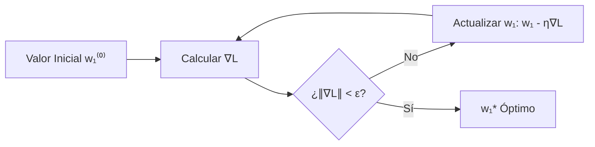
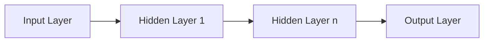
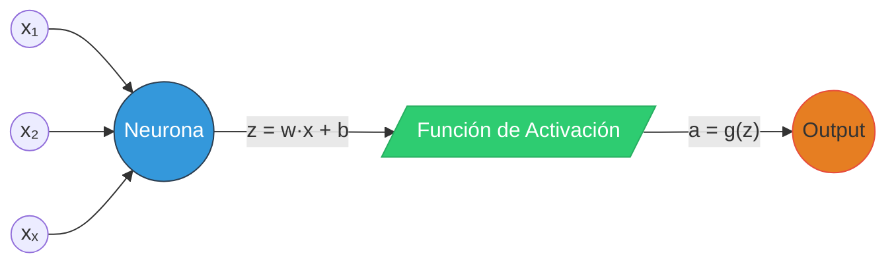

# 1. Introducción
## Componentes fundamentales  de las redes neuronales
---
### Introducción
En esta primera unidad se estudiarán la definición, las componentes y principales aplicaciones de una red neuronal profunda. Al finalizar esta unidad estaremos en la capacidad de **construir, entrenar y aplicar una red neuronal en su forma más básica,** a decir, una red neuronal totalmente conectada (fully connected).

### Objetivo
Comprender los conceptos básicos del aprendizaje profundo aplicado al aprendizaje supervisado a través del estudio de su definición, componentes y principales aplicaciones para construir, entrenar y aplicar una red neuronal en su forma más básica.


---

# 2. Contexto

## Éxito del aprendizaje profundo

En la actualidad, el aprendizaje profundo es **una de las técnicas más exitosas en el área de la inteligencia artificial** que ha revolucionado diversos sectores. Dicho éxito se debe en gran medida a su **capacidad de resolver diferentes tareas usando grandes cantidades de datos**, lo cual le ha permitido, en muchos casos, **superar el rendimiento de modelos de aprendizaje automático clásicos.**  
  
El aprendizaje profundo ha **impactado de forma positiva diversos sectores** como el ***cuidado de la salud, la agricultura, el transporte, entre otros***. 

Con el fin de entender a profundidad las razones del éxito del Deep Learning, los invito a que realicemos la lectura del **capítulo 1** del libro: “**Deep learning with python**” del autor Francois Chollet.

[Deep learning with python](https://search.ebscohost.com/login.aspx?direct=true&AuthType=sso&db=nlebk&AN=2948810&lang=es&site=ehost-live&scope=site&custid=s9496075&ebv=EK&ppid=Page-__-35)

## Algunas de las aplicaciones del aprendizaje profundo

Además, observaremos el siguiente video en el cual se listan algunas de las aplicaciones del aprendizaje profundo:

<iframe width="800" height="550" src="https://www.youtube.com/embed/FcD7JHnMZ5o" title="5 Real World Applications of Deep Learning | Learn Machine Learning" frameborder="0" allow="accelerometer; autoplay; clipboard-write; encrypted-media; gyroscope; picture-in-picture; web-share" referrerpolicy="strict-origin-when-cross-origin" allowfullscreen></iframe>

El video presenta cinco aplicaciones prácticas del aprendizaje profundo, mostrando cómo esta tecnología ha permitido resolver problemas complejos y optimizar procesos en diversas industrias. Se destacan tanto los avances tecnológicos como el impacto real en sectores clave.


<table style="width:95%; margin:auto; border-collapse:collapse; font-family:'Segoe UI',sans-serif; font-size:0.9em; line-height:1.4;">
  <thead>
    <tr style="border-bottom:1px solid #e0e0e0;">
      <th style="padding:8px; text-align:left; width:20%;">Categoría</th>
      <th style="padding:8px; text-align:left; width:55%;">Descripción y Ejemplos</th>
      <th style="padding:8px; text-align:left; width:25%;">Beneficios</th>
    </tr>
  </thead>
  <tbody>
    <tr style="border-bottom:1px solid #f0f0f0;">
      <td style="padding:8px; vertical-align:middle;"><strong style="color:#2c3e50;">1. Salud</strong></td>
      <td style="padding:8px;">
        <div style="margin-bottom:4px;"><strong>Diagnóstico Personalizado:</strong> Algoritmos analizan datos médicos para detección precisa de enfermedades.</div>
        <em style="color:#6c757d; font-size:0.95em;">Ej: Detección temprana de cáncer con imágenes</em>
      </td>
      <td style="padding:8px;">
        <div style="margin-bottom:4px;">• Diagnósticos precisos</div>
        <div>• Tratamientos personalizados</div>
      </td>
    </tr>

    <tr style="border-bottom:1px solid #f0f0f0;">
      <td style="padding:8px; vertical-align:middle;"><strong style="color:#2c3e50;">2. Conducción Autónoma</strong></td>
      <td style="padding:8px;">
        <div style="margin-bottom:4px;"><strong>Interpretación en tiempo real:</strong> Redes neuronales procesan datos de sensores y cámaras.</div>
      </td>
      <td style="padding:8px;">
        <div>• Seguridad vial</div>
        <div>• Decisiones en tiempo real</div>
      </td>
    </tr>

    <tr style="border-bottom:1px solid #f0f0f0;">
      <td style="padding:8px; vertical-align:middle;"><strong style="color:#2c3e50;">3. PLN</strong></td>
      <td style="padding:8px;">
        <div style="margin-bottom:4px;"><strong>Procesamiento de lenguaje:</strong> Modelos para chatbots y asistentes virtuales.</div>
      </td>
      <td style="padding:8px;">
        <div>• Interacciones naturales</div>
        <div>• Mejor comprensión</div>
      </td>
    </tr>

    <tr style="border-bottom:1px solid #f0f0f0;">
      <td style="padding:8px; vertical-align:middle;"><strong style="color:#2c3e50;">4. Visión Artificial</strong></td>
      <td style="padding:8px;">
        <div style="margin-bottom:4px;"><strong>Clasificación de objetos:</strong> CNNs para identificación en imágenes.</div>
        <em style="color:#6c757d; font-size:0.95em;">Aplicación: Sistemas de seguridad</em>
      </td>
      <td style="padding:8px;">
        <div>• Precisión visual</div>
        <div>• Monitoreo eficiente</div>
      </td>
    </tr>

    <tr>
      <td style="padding:8px; vertical-align:middle;"><strong style="color:#2c3e50;">5. Finanzas</strong></td>
      <td style="padding:8px;">
        <div style="margin-bottom:4px;"><strong>Detección de fraude:</strong> Análisis de patrones en transacciones.</div>
        <em style="color:#6c757d; font-size:0.95em;">Ej: Inversiones con big data</em>
      </td>
      <td style="padding:8px;">
        <div>• Seguridad financiera</div>
        <div>• Gestión de riesgos</div>
      </td>
    </tr>
  </tbody>
</table>


---
# 3. Experiencia

## Acercamiento al concepto central de la unidad

Luego de haber tenido un primer acercamiento al concepto central de la unidad, es necesario recordar algunos conceptos relacionados con el aprendizaje de máquina, los cuales son de utilidad para entender el funcionamiento de las redes neuronales profundas. En este sentido, vamos a estudiar la siguiente presentación interactiva en la cual, a partir de un ejemplo de **regresión lineal,** recordamos los **conceptos de función de costo, parámetros, derivada y el algoritmo de gradiente descendente.**

### Contenido

![[Pasted image 20250404194636.png]]

#### 🔹 Modelo

##### Modelo I: Regresión Lineal (Una Dimensión - 1D)

En un problema de regresión lineal simple (una sola variable independiente), se busca modelar la relación lineal entre:
- Variable independiente: $x$
- Variable dependiente: $y$

**Ecuación general del modelo:**

$$ 
y = w_0 + w_1 \cdot x 
$$

**Parámetros:**
- $w_0$: Intercepto (valor de $y$ cuando $x = 0$)
- $w_1$: Pendiente (cambio en $y$ por unidad de cambio en $x$)

**Supuestos Fundamentales**
El modelo asume que:
1. La relación entre $x$ y $y$ es aproximadamente lineal
2. Los residuos ($\epsilon = y - \hat{y}$) siguen distribución normal
3. Homocedasticidad (varianza constante de los errores)

<div align="center" style="padding: 10px; background: #f0f0f0; border-radius: 8px;">

<br>
<small>🖼 Fig. 1 - Modelo 1  𝑦 = 𝑤₀ + 𝑤₁ × 𝑥</small>
</div>


---

##### Modelo II: Variabilidad en los parámetros

Los parámetros $w_0$ y $w_1$ **son valores reales ajustables.** La modificación de estos parámetros genera diferentes rectas con propiedades geométricas distintas:

**Efecto de los parámetros:**  
- **Variación de $w_0$:** Desplazamiento vertical de la recta  
- **Variación de $w_1$:** Cambio en la inclinación de la recta

**Ejemplo numérico:**
Cuando $w_0 = 1$ y $w_1 = -0.5$:  
$$ y = 1 - 0.5x $$

**Esta configuración produce:**  
- Intersección en eje $y$: 1  
- Tasa de cambio: -0.5 unidades de $y$ por unidad de $x$

<div align="center" style="padding: 15px; background: #f8f9fa; border-radius: 10px; margin: 20px 0; border: 1px solid #dee2e6;">

<br>
<small style="font-size: 0.95em; display: block; margin-top: 10px;">
<span style="font-family: 'Cambria Math', sans-serif;">
𝑤₀ = 1 │ 𝑤₁ = −0.5 ⇒ 𝑦 = 1 − 0.5 × 𝑥
</span>
</small>
</div>

#### 🔹 Función de costo

##### Objetivo
Dada una nube de puntos $\{(x_i, y_i)\}_{i=1}^N$, el objetivo es encontrar los parámetros $w_0$ y $w_1$ del modelo lineal que mejor se ajusten a los datos mediante la minimización de una **función de costo** $L(w_0, w_1)$.

<div align="center" style="padding: 15px; background: #f8f9fa; border-radius: 10px; margin: 20px 0;">

<br>
<small style="font-size: 0.9em;">🖼 <b>Fig. 1</b> - Superficie de costo 𝐿(𝑤₀, 𝑤₁)</small>
</div>

**Evaluación del Modelo**
1. **Propuesta de parámetros:**  
   Se prueban distintas combinaciones de $w_0$ y $w_1$ → rectas diferentes
2. **Cálculo de costo:**  
   Cada combinación genera una recta diferente con valor 
$$
L(w_0, w_1) = \frac{1}{N} \sum_{i=1}^{N} \left( \hat{y}_i - y_i \right)^2
$$

	**Donde:**  
	- $\hat{y}_i = w_0 + w_1x_i$ (Predicción del modelo)  
	- $y_i$: Valor real observado  
	- $N$: Número total de observaciones  
	- $w_0, w_1$: Parámetros del modelo


3. **Selección óptima:**  
   La recta con menor valor de $L$ se considera mejor ajuste

**Simplificación del Problema**

<div align="center" style="padding: 15px; background: #f8f9fa; border-radius: 10px; margin: 20px 0;">

<br>
<small style="font-size: 0.9em;">🖼 <b>Fig. 2</b> - Derivación: ∂𝐿/∂𝑤₁ = 2/𝑁 Σ(𝑤₁𝑥ᵢ − 𝑦ᵢ)𝑥ᵢ</small>
</div>

Asumiendo $w_0$ conocido y constante, reducimos a problema unidimensional:  

$$ L(w_1) = \frac{1}{N} \sum_{i=1}^N (w_1 x_i - y_i)^2 $$


**Error Cuadrático Medio (ECM)**
Función de costo más utilizada:  
$$ L(w_1) = \frac{1}{N} \sum_{i=1}^N (\hat{y}_i - y_i)^2 $$  
Donde $\hat{y}_i = w_1 x_i$ (predicción del modelo)


##### Minimización de la Función de Costo

<div align="center" style="padding: 15px; background: #f8f9fa; border-radius: 10px; margin: 20px 0;">  <br> <small style="font-size: 0.9em;">🖼 <b>Fig. 3</b> - Mínimo global en parábola del ECM</small> </div>


**Proceso de Optimización**
1. **Derivación:**  
   $$ \frac{dL}{dw_1} = \frac{2}{N} \sum_{i=1}^N (w_1 x_i - y_i)x_i $$
   
2. **Igualación a cero:**  
   $$ \sum_{i=1}^N (w_1 x_i - y_i)x_i = 0 $$

3. **Solución óptima:**  
   $$ w_1 = \frac{\sum_{i=1}^N y_i x_i}{\sum_{i=1}^N x_i^2} $$


##### **Tabla de Pasos Clave**
| Paso | Operación           | Resultado               |
| ---- | ------------------- | ----------------------- |
| 1    | Calcular derivada   | Expresión del gradiente |
| 2    | Igualar a cero      | Ecuación normal         |
| 3    | Resolver para $w_1$ | Solución analítica      |

**Interpretación Geométrica**
- **Mínimo global:** La solución $w_1$ garantiza el punto mínimo en la parábola del ECM
- **Mejor ajuste:** Corresponde a la recta que minimiza la suma de distancias verticales al cuadrado entre puntos y predicciones

#### 🔹Gradiente descendente

<div align="center" style="padding: 20px; background: #f8f9fa; border-radius: 10px; margin: 25px 0;">
  
  <br>
  <small style="font-size: 0.95em;">🖼 <b>Fig. 1</b> - Trayectoria de optimización en superficie de costo</small>
</div>
##### Definición
Algoritmo iterativo para minimizar la función de costo $L(w_1)$ (Error Cuadrático Medio) en modelos lineales:

$$
L(w_1) = \frac{1}{N} \sum_{i=1}^N (\hat{y}_i - y_i)^2
$$
##### Ecuación de Actualización
$$
\begin{align*}
w_1^{(t)} &= w_1^{(t-1)} - \eta \cdot \frac{dL}{dw_1} \\
\frac{dL}{dw_1} &= \frac{2}{N} \sum_{i=1}^N (w_1 x_i - y_i)x_i
\end{align*}
$$

**Símbolos:**
- $w_1^{(t)}$: Parámetro en iteración $t$
- $\eta$: Tasa de aprendizaje (0 < η < 1)
- $\frac{dL}{dw_1}$: Gradiente de la función de costo

##### Intuición del Algoritmo
1. **Dirección de descenso:**  
   Movimiento en dirección contraria al gradiente $(-\nabla L)$
2. **Tamaño de paso:**  
   Controlado por η (learning rate)
3. **Condición de parada:**  
   Cuando $\|\nabla L\| < \epsilon$ (umbral pequeño)

##### Comportamiento según η
| Tasa de Aprendizaje | Ventajas | Riesgos |
|----------------------|----------|---------|
| **η pequeña** (ej: 0.01) | Convergencia estable | Lenta |
| **η grande** (ej: 0.5) | Rápida convergencia | Oscilaciones/Divergencia |

##### Elementos Visuales Clave


<div align="center" style="padding: 20px; background: #f8f9fa; border-radius: 10px; margin: 25px 0;">
  
  <br>
  <small style="font-size: 0.95em;">🖼 <b>Fig. 2</b> - Componentes clave: ◈ 𝓛(𝒘₁)  |  ✦ 𝒘₁*  |  ↝ 𝒘₁⁽ᵗ⁾</small>
</div>

**Componentes del gráfico:**

- **𝓛(𝒘₁)**: Curva de error convexa (forma de parábola)  
- **𝒘₁***: Mínimo global de la función (punto más bajo)  
- **𝒘₁⁽ᵗ⁾**: Valor del parámetro en el paso de tiempo *t*

➠ La flecha de optimización muestra cómo w₁⁽ᵗ⁾ se mueve hacia w₁***.


#### 🔹Regresión Lineal Multivariada

La regresión lineal multivariada es una extensión del modelo lineal simple para múltiples variables predictoras. Modela la relación entre:
- **Variable objetivo**: $y \in \mathbb{R}$
- **Atributos**: $\mathbf{x} = [x_1, x_2, \dots, x_m]^T \in \mathbb{R}^m$


<div align="center" style="padding: 10px; background: #f8f9fa; border-radius: 6px; margin: 15px 0;">
  
  
  <div style="margin: 8px 0; font-size: 0.85em; color: #555; line-height: 1.3;">
    <small>🟣 <b>Fig. 3</b> - Geometría multivariada<br>
    ℍ: Hiperplano | 𝕩ⱼ: Features | 𝕨*: Óptimo</small>
  </div>
</div>

##### Formulación del Modelo
**Ecuación del Modelo**

$$
\hat{y} = w_0 + \sum_{j=1}^m w_jx_j
$$

**Notación Vectorial Extendida**
$$
\hat{y} = \boldsymbol{w}^T\boldsymbol{\tilde{x}} = \underbrace{w_0}_{\text{bias}} + \sum_{j=1}^m w_jx_j
$$
**Donde:**
- $\boldsymbol{\tilde{x}} = [1, x_1, x_2, \dots, x_m]^T$ (vector aumentado)
- $\boldsymbol{w} = [w_0, w_1, \dots, w_m]^T \in \mathbb{R}^{m+1}$ (vector de parámetros)

##### Estimación de Parámetros
###### **Función de Costo (ECM)**
$$
\mathcal{L}(\boldsymbol{w}) = \frac{1}{2N} \sum_{i=1}^N \left(\boldsymbol{w}^T\boldsymbol{\tilde{x}}^{(i)} - y^{(i)}\right)^2
$$

###### **Optimización**
**Ecuación Normal (Solución Cerrada):**
$$
\boldsymbol{w}^* = (\boldsymbol{X}^T\boldsymbol{X})^{-1}\boldsymbol{X}^T\boldsymbol{y}
$$

**Gradiente Descendente:**
$$
\boldsymbol{w}^{(t+1)} = \boldsymbol{w}^{(t)} - \eta \nabla_{\boldsymbol{w}}\mathcal{L}
$$
**Gradiente:**
$$
\nabla_{\boldsymbol{w}}\mathcal{L} = \frac{1}{N}\boldsymbol{X}^T(\boldsymbol{X}\boldsymbol{w} - \boldsymbol{y})
$$


##### Ejemplo: Caso Bivariado
**Modelo:**
$$
\hat{y} = w_0 + w_1x_1 + w_2x_2
$$

**Componentes**

| Componente | Rol                           | Tipo    | Impacto                 |
| ---------- | ----------------------------- | ------- | ----------------------- |
| **$w_0$**  | 🎯 Intercepto (baseline)      | Escalar | Desplazamiento vertical |
| **$w_1$**  | 📐 Pendiente para $x_1$       | Escalar | Tasa cambio lineal      |
| **$w_2$**  | 🌀 Coef. curvatura para $x_2$ | Escalar | Aceleración no-lineal   |


##### Consideraciones Clave
###### Supuestos
1. Linealidad en parámetros: $y = \boldsymbol{w}^T\boldsymbol{\tilde{x}} + \epsilon$
2. $\epsilon \sim \mathcal{N}(0, \sigma^2)$ (ruido gaussiano)

##### Limitaciones y Extensiones
| Escenario            | Solución                                           |
| -------------------- | -------------------------------------------------- |
| No linealidad        | • Transformación polinomial<br>• Kernel methods    |
| Multicolinealidad    | • Regularización (Ridge/Lasso)<br>• PCA            |
| Alta dimensionalidad | • Selección de características<br>• Regularización |

Ahora, una vez hemos recordado estos conceptos fundamentales del aprendizaje de máquina, es hora de que analicemos la representación de una **red neural básica** y que establezcamos su notación. **En el siguiente video encontraremos una definición detallada sobre estos apartes.**

## 📚 Representación de Redes Neuronales Básicas

<iframe width="800" height="550" src="https://www.youtube.com/embed/EbeC4Q6wYLI" title="[M1U1] Representación de una red neuronal" frameborder="0" allow="accelerometer; autoplay; clipboard-write; encrypted-media; gyroscope; picture-in-picture; web-share" referrerpolicy="strict-origin-when-cross-origin" allowfullscreen></iframe>
En el video anterior se puede observar que la función de activación es un concepto cuyo entendimiento es fundamental en la construcción de las **redes neuronales profundas**. En la siguiente presentación interactiva se dan detalles de cuál es su utilidad y se muestran ejemplos de las **funciones de activación más comunes.**

#### 🧠 Componentes Fundamentales  
##### 1. Estructura Básica




<div align="center" style="padding: 15px; background: #f8f9fa; border-radius: 10px; margin: 20px 0;">
  
  <br>
  <small style="font-size: 0.9em; color: #666;">
    🏗️ <b>Fig. 3</b> - Representación de una red neuronal
  </small>
</div>


- **Capa de Entrada (Input):** Recibe los datos brutos (*features - atributos*). Está relacionada con los atributos de entrada del conjunto de entrenamiento.
- **Capas Ocultas (Hidden):** Transformaciones no lineales (≥1 capa). Se denomina oculta, ya que en el conjunto de entrenamiento no se tiene conocimiento acerca de los valores exactos que toman sus unidades.
- **Capa de Salida (Output):** Produce la predicción final. Normalmente se tiene una unica neurona, pero puede tener varios dependiendo del problema que se esté resolviendo.

**Nota:** en la literatura se conoce la red como una *Red de dos capas* porque la capa de entrada no suele contarse para estos efectos.

<div align="center" style="padding: 15px; background: #f8f9fa; border-radius: 10px; margin: 20px 0;">
  
  <br>
  <small style="font-size: 0.9em; color: #666;">
    🕸️ <b>Fig. 2</b> - Red de dos capas
  </small>
</div>
##### 2. 🧠 Neurona Artificial (Unidad de Procesamiento)




##### 3.🧮 Componentes Matemáticos de una Neurona
###### 🔵 **Entradas**  
**Vector de características**
$$
\begin{align}
\mathbf{x} = \begin{bmatrix} x_1 \\ x_2 \\ \vdots \\ x_n \end{bmatrix} \in \mathbb{R}^n \tag{1}
\end{align}
$$

###### ⚖️ **Pesos**  
**Vector de parámetros:**
$$
\begin{align}
\mathbf{w} &= \begin{bmatrix} w_1 \\ w_2 \\ \vdots \\ w_n \end{bmatrix} \in \mathbb{R}^n \tag{2} \\
\end{align}
$$

###### 🎯 **Sesgo (Bias)**  
**Término de ajuste:**
$$
\begin{align}
b ∈ \mathbb{R}
\end{align}
$$

###### ⚡ **Función de Activación**  
 
$$
\begin{align}
g &\colon \mathbb{R} \to \mathbb{R} \tag{3} \\
z &\mapsto g(z) \nonumber
\end{align}
$$

**Donde:**  
$$
z = \underbrace{\mathbf{w}^\top \mathbf{x}}_{\text{Producto punto}} + b = \underbrace{\sum_{i=1}^n w_i x_i}_{\text{Sumatoria ponderada}} + b \tag{4}
$$

La función de activación introduce no linealidades en el modelo, permitiendo que la red neuronal aprenda representaciones más complejas.

##### 4.📝 Notación Matemática

###### Ecuación de una Neurona

**Cálculo de pre-activación:**
$$
\begin{align}
z = w_1x_1 + w_2x_2 + \cdots + w_nx_n + b \tag{1}
\end{align}
$$

**Salida de la neurona (activación):**
$$
\begin{align}
a = g(z) \tag{2}
\end{align}
$$

###### Notación Vectorizada
**Para una capa completa (eficiencia computacional):**
$$
\begin{align}
z^{[l]} = W^{[l]} \cdot a^{[l-1]} + b^{[l]} \tag{3}
\end{align}
$$

**Activación de la capa:**
$$
\begin{align}
a^{[l]} = g(z^{[l]}) \tag{4}
\end{align}
$$

- $l$ = Número de capa
- $W$ = Matriz de pesos
- $a$ = Activaciones

###### 🔄 Forward Propagation
**Proceso de cálculo secuencial:**
1. Entrada → Capa Oculta 1  
2. Capa Oculta 1 → Capa Oculta 2  
3. Capa Oculta $n$ → Capa Oculta ...    
4. Última Capa Oculta → Salida  

**Ejemplo para 3 capas:**
$$
\begin{align}
a^{[1]} &= g(W^{[1]}X + b^{[1]}) \tag{5} \\
a^{[2]} &= g(W^{[2]}a^{[1]} + b^{[2]}) \tag{6}
\end{align}
$$

##### 5.💡 Funciones de Activación Clave
| Función      | Fórmula                                          | Uso Típico            |
| ------------ | ------------------------------------------------ | --------------------- |
| **Sigmoide** | $$\sigma(z) = \frac{1}{1+e^{-z}}$$               | Clasificación binaria |
| **ReLU**     | $$\text{ReLU}(z) = \max(0,z)$$                   | Capas ocultas         |
| **Tanh**     | $$\tanh(z) = \frac{e^z - e^{-z}}{e^z + e^{-z}}$$ | Rango [-1,1]          |

**Nota:** La elección de la función de activación adecuada es crucial **para el rendimiento de la red neuronal**, ya que **afecta la capacidad de aprendizaje y la velocidad de convergencia.**

##### 6. ✅ Takeaways Principales

1. **Composición de funciones no lineales**  
   Las redes neuronales son combinaciones jerárquicas de transformaciones no lineales.
2. **Implementación eficiente con matrices**  
   La notación matricial permite optimizar cálculos usando operaciones vectorizadas:

```python
   # Ejemplo en NumPy
   Z = np.dot(W, A_prev) + b  # Producto matricial + bias
   A = relu(Z)                 # Función de activación
```

3. **Importancia del sesgo (bias)**  
    El término `b` permite ajustar el modelo para aprender patrones complejos, incluso cuando todas las entradas son cero.
4. **Capacidad de aprendizaje por profundidad**  
    Mayor número de capas ocultas → Mayor capacidad para modelar relaciones complejas (deep learning).

---
## Estudio para calcular la salida de la red.

Estos cálculos son muy similares a la *regresión lineal* y la *regresión logística*
Para ello, omitiremos su salida


**PASOS*
1. Determinar el valor de las 3 unidades $h_1$, $h_2$ y $h_3$ 

<div align="center" style="padding: 15px; background: #f8f9fa; border-radius: 10px; margin: 20px 0;">
  
  <br>
  <small style="font-size: 0.9em; color: #666;">
    🛠️ <b>Fig. 4</b> - Cálculo de h1, h2 y h3
  </small>
</div>

2. Al igual que con la regresión lineal o logística, **el cálculo del valor de la capa oculta**, empieza con una **combinación lineal de los atributos de entrada**
3. El resultado de esa combinación lineal pasa a través de una función $g$ que se conoce como la **función de activación**
---

<div align="center" style="padding: 15px; background: #f8f9fa; border-radius: 10px; margin: 20px 0;">
  
  <br>
  <small style="font-size: 0.9em; color: #666;">
    🖥️ <b>Fig. 5</b> - Capas de Entrada y Oculta
  </small>
</div>

El mismo procedimiento se emplea para estas unidades que tienen nuestra capa oculta. Ahí es que está la única diferencia entre el cálculo de una unidad y otra, siendo **los parámetros empleados** al momento de calcular la combinación lineal.

**Nota:** 
1. notemos el Superíndice `[1]` el cual asocia los parámetros a la **capa 1**
2. Para calcular los valores de la capa oculta, necesitamos **tantas combinaciones lineales como unidades tenga la capa**. *En nuestro ejemplo, la capa oculta solo tiene 3 unidades, por lo que solo debemos realizar tres operaciones de este tipo*
3. Cada combinación lineal requiere de una **cantidad de parámetros igual al número de atributos en la capa de entrada, más uno adicional para el término independiente**. *En nuestro caso necesitamos 5 parámetros para calcular la combinación de cada unidad*

Para calcular todos los valores de la capa oculta, necesitamos un total de 15 parámetros

$$
n_{\text{parámetros}} = n_{\text{entrada}} + 1 = 4 + 1 = 5
$$
$$
n_{\text{total}} = \text{unidades ocultas} \times (n_{\text{entrada}} + 1) = 3 \times (4 + 1) = 15
$$

##### Valores Capa Salida
Una vez hemos calculado los valores de la capa oculta, procedemos a calcular la salida normal

**Nota**: omitimos la capa de entrada, porque la salida no depende de los valores de entrada

<div align="center" style="padding: 15px; background: #f8f9fa; border-radius: 10px; margin: 20px 0;">
  
  <br>
  <small style="font-size: 0.9em; color: #666;">
    ⚙️ <b>Fig. 6</b> - Cálculo Valores Capa de Salida
  </small>
</div>

1. La capa de salida depende de los parámetros con superíndice `[2]`, **indicando que pertenecen a la capa 2 de la red neuronal**
2. El procedimiento de cálculo es muy similar a los cálculos de los parámetros de la capa oculta, la ***diferencia es que la combinación en la capa de salida no depende de los atributos de entrada, sino de los valores de la capa oculta***

<div align="center" style="padding: 15px; background: #f8f9fa; border-radius: 10px; margin: 20px 0;">
  
  <br>
  <small style="font-size: 0.9em; color: #666;">
    📊 <b>Fig. 7</b> - Cálculo Valores Capa de Salida
  </small>
</div>****
---

## Funciones de activación
#### 1. **Utilidad de las funciones de activación**

> [!NOTE] **Leyenda de Pesos**
>
> **Formato:**  
> $$w_{(destino,origen)}^{[capa]}$$
>
> **Ejemplos:**
> 
> $$\begin{align*}
> w_{1,0}^{[1]} &= \text{Sesgo de } h_1 \\
> w_{2,3}^{[1]} &= \text{Peso de } x_3 \text{ a } h_2
> \end{align*}$$
>
> **Función:**
>$$g\left(\sum w_{i,j}x_j + b_i\right)$$

- **Característica principal**:  
  Introducen **no-linealidad** en las redes neuronales, permitiendo modelar relaciones complejas entre entradas y salidas.  
- **Red neuronal sin funciones de activación**:  
  Equivaldría a un **modelo lineal** (sin importar el número de capas).  
- **Ubicación**:  
  - Aplicables en **cualquier capa**  
  - Recomendaciones:  
    - *Capas ocultas*: ReLU, tanh  
    - *Capas de salida*: Sigmoide (binaria), Softmax (multiclase)  

- **Definición formal**:  
  $$ a^{(l)} = g\left(\mathbf{w}^{(l)} \cdot \mathbf{a}^{(l-1)} + b^{(l)}\right) $$  
  **Donde**:  
  - $a^{(l)}$: Activación capa $l$  
  - $\mathbf{w}^{(l)}$: Vector de pesos  
  - $b^{(l)}$: Sesgo de la capa  

###### Importancia de la No-Linealidad  
Una red profunda **sin funciones de activación no lineales** sería equivalente matemáticamente a:  
$$ \hat{y} = \mathbf{W}_{\text{total}} \cdot \mathbf{x} + \mathbf{b}_{\text{total}} $$  
Perdiendo su capacidad para:  
1. Aprender representaciones jerárquicas  
2. Modelar relaciones complejas  
3. Aproximar funciones no lineales  
<div style="overflow-x: auto; margin: 1.5rem 0; border-radius: 8px; box-shadow: 0 2px 4px rgba(0,0,0,0.1);">
  <table style="width: 100%; border-collapse: collapse; font-family: 'Segoe UI', sans-serif; font-size: 0.95em;">
    <thead>
      <tr style="background-color: #f8f9fa;">
        <th style="padding: 12px; text-align: left; border-bottom: 2px solid #e9ecef; color: #2c3e50;">Con Activación 🟢</th>
        <th style="padding: 12px; text-align: left; border-bottom: 2px solid #e9ecef; color: #2c3e50;">Sin Activación 🔴</th>
      </tr>
    </thead>
    <tbody>
      <tr style="transition: background 0.3s ease;">
        <td style="padding: 12px; border-bottom: 1px solid #e9ecef;">Modelos no lineales</td>
        <td style="padding: 12px; border-bottom: 1px solid #e9ecef;">Modelo lineal único</td>
      </tr>
      <tr style="transition: background 0.3s ease;">
        <td style="padding: 12px; border-bottom: 1px solid #e9ecef;">Jerarquía de características</td>
        <td style="padding: 12px; border-bottom: 1px solid #e9ecef;">Pérdida de profundidad</td>
      </tr>
      <tr>
        <td style="padding: 12px;">Universal function approximators</td>
        <td style="padding: 12px;">Limitado a transformaciones lineales</td>
      </tr>
    </tbody>
  </table>
</div>

#### 2. **Funciones de activación más usadas**

Las funciones de activación introducen no-linealidad en las redes neuronales, permitiendo modelar relaciones complejas. A continuación se detallan las más relevantes:
##### a) Función Identidad  
**Ecuación**:  
$$ g(z) = z $$  
**Características**:  
- **Rango de salida**: $(−∞,∞)$
- **Ventaja**:  
  - Útil en **capas de salida** para regresión (Ej: predecir valores continuos).  
- **Desventaja**:  
  - Si se usa en todas las capas, convierte la red en un modelo lineal.  

**Caso de uso**:  
- Regresión lineal en la capa final.

##### b) Función Sigmóide  
**Ecuación**:  
$$ \sigma(z) = \frac{1}{1 + e^{-z}} $$  

**Características**:  
- **Rango de salida**: $(0, 1)$
- **Ventajas**:  
  - Interpretación probabilística (ideal para **clasificación binaria**).  
- **Desventajas**:  
  - Gradientes cercanos a cero en valores extremos (*vanishing gradient*).  
  - Lenta convergencia en capas ocultas.  

**Caso de uso**:  
- Capa de salida en clasificación binaria.


##### c) Tangente Hiperbólica (tanh)  
**Ecuación**:  
$$ \tanh(z) = \frac{e^z - e^{-z}}{e^z + e^{-z}} $$  
**Características**:  
- **Rango de salida**: (-1, 1)
- **Ventajas**:  
  - Salidas centradas en 0, útil para normalizar datos.  
  - Mejor rendimiento que sigmóide en capas ocultas.  
- **Desventajas**:  
  - Gradientes que se desvanecen en valores extremos.  

**Caso de uso**:  
- Capas ocultas en redes recurrentes (RNN) o arquitecturas antiguas.
##### d) ReLU (Rectified Linear Unit)  
**Ecuación**:  
$$ \text{ReLU}(z) = \max(0, z) $$  
**Características**:  
- **Rango de salida**: $[0, ∞)$
- **Ventajas**:  
  - Evita el *vanishing gradient* para entradas positivas.  
  - Cómputo eficiente y acelera el entrenamiento.  
- **Desventajas**:  
  - *Neuronas muertas* cuando $z \leq 0$

#### 3. **Otras funciones de activación**

##### **Leaky ReLU**:  
  $$
  \text{LeakyReLU}(z) = \begin{cases} 
  z & \text{si } z > 0, \\[6pt]
  0.01z & \text{si } z \leq 0 
  \end{cases}
  $$  
**Característica**: Mitiga el problema de *neuronas muertas* al permitir un pequeño gradiente para $z \leq 0$.  

##### **Parametric ReLU (PReLU)**:  
  $$
  \text{PReLU}(z) = \begin{cases} 
  z & \text{si } z > 0, \\[6pt]
  \beta z & \text{si } z \leq 0 
  \end{cases}
  $$  
  - **Característica**: El parámetro $\beta$) se aprende durante el entrenamiento (no es fijo como en Leaky ReLU).  

##### **SELU (Scaled Exponential Linear Unit)**:  
  $$
  \text{SELU}(z) = 1.0507 \begin{cases} 
  z & \text{si } z > 0, \\[6pt]
  1.6733(e^z - 1) & \text{si } z \leq 0 
  \end{cases}
  $$  
  - **Característica**: Auto-normaliza las activaciones en redes profundas (*self-normalizing*).  
  - **Requisito**: Inicialización específica de pesos (ej: LeCun normal).  

##### **ELU (Exponential Linear Unit)**:  
  $$
  \text{ELU}(z) = \begin{cases} 
  z & \text{si } z > 0, \\[6pt]
  \alpha(e^z - 1) & \text{si } z \leq 0 
  \end{cases}
  $$  
  - **Característica**: Reduce el *bias shift* y mejora la convergencia frente a ReLU $\alpha$ suele ser 1.0).

###### Casos de Uso
<table class="activation-table">
  <thead>
    <tr>
      <th>Función</th>
      <th>Ventaja Clave</th>
      <th>Desventaja</th>
    </tr>
  </thead>
  <tbody>
    <tr>
      <td><strong>Leaky ReLU</strong></td>
      <td>✔️ Evita neuronas muertas<br><small>(parámetro α fijo: 0.01)</small></td>
      <td>❌ α no se optimiza automáticamente</td>
    </tr>
    <tr>
      <td><strong>PReLU</strong></td>
      <td>✔️ Parámetro β adaptable<br><small>(aprendido durante el entrenamiento)</small></td>
      <td>❌ Mayor costo computacional</td>
    </tr>
    <tr>
      <td><strong>SELU</strong></td>
      <td>✔️ Auto-normalización<br><small>(actividades estables en redes profundas)</small></td>
      <td>❌ Requiere inicialización específica<br><small>(ej: LeCun normal)</small></td>
    </tr>
    <tr>
      <td><strong>ELU</strong></td>
      <td>✔️ Manejo mejorado de valores negativos<br><small>(vs ReLU clásica)</small></td>
      <td>❌ Cálculo exponencial costoso<br><small>(en zona negativa)</small></td>
    </tr>
  </tbody>
</table>


## Parámetros e Hiperparámetros

### 3. Optimización y Regularización  

#### a) **Optimización**  
- **Definición**: Proceso iterativo para ajustar parámetros (\( W, b \)) y minimizar la función de costo \( \mathcal{L} \).  

##### Algoritmos de Optimización  
1. **Gradiente Descendente Estocástico (SGD)**:  
   $$ W^{(t)} = W^{(t-1)} - \eta \cdot \frac{\partial \mathcal{L}}{\partial W} $$  
   - **Actualización**: Dirección opuesta al gradiente de $L$.  
   - **Tasa de aprendizaje $\eta$**:  
     - $\eta$ grande → Riesgo de divergencia.  
     - $\eta$ pequeño → Convergencia lenta.  

2. **Variantes Avanzadas**:  
   - **Adam**: Combina momentum y adaptación de tasas por parámetro.  
   - **RMSProp**: Ajusta $\eta$basado en promedio móvil de gradientes.  
   - **Adagrad**: Adapta  $\eta$ según frecuencia de parámetros.  

##### Concepto Clave  
- **Convergencia**: Movimiento iterativo hacia el mínimo de \( \mathcal{L}(W) \).  

---

#### b) **Regularización**  
- **Objetivo**: Evitar *overfitting* y mejorar generalización.  

##### Técnicas Principales  
1. **Dropout**:  
   - **Mecanismo**: Desactiva neuronas aleatoriamente durante el entrenamiento.  
   - **Efecto**: Reduce dependencia de conexiones específicas.  

2. **Regularización L2 (Weight Decay)**:  
   $$ \mathcal{L}_{\text{total}} = \mathcal{L} + \lambda \sum_j W_j^2 $$  
   - $\lambda$: Controla la penalización (hiperparámetro crítico).  

3. **Early Stopping**:  
   - Detiene el entrenamiento cuando el error en validación aumenta.  

##### Ajuste de Hiperparámetros  
| **Hiperparámetro** | **Impacto**                                                                 |  
|---------------------|-----------------------------------------------------------------------------|  
| \( \eta \)          | Alta → Oscilaciones. Baja → Lentitud.                                       |  
| \( \lambda \)       | Alta → Subajuste. Baja → Sobrentrenamiento.                                 |  

---

#### c) **Visualización del Proceso**  
- **Gráfico de \( \mathcal{L}(W) \)**:  
  - Muestra el mínimo global (\( W^* \)) y el camino del gradiente descendente.  
- **Iteraciones**:  
  - Parámetros se acercan a \( W^* \) en pasos controlados por \( \eta \).  

---

### 4. Resumen Integrado  
| **Componente**       | **Descripción**                                                                 |  
|-----------------------|---------------------------------------------------------------------------------|  
| **Optimización**      | Ajuste de \( W \) usando algoritmos como Adam/SGD para minimizar \( \mathcal{L} \). |  
| **Regularización**    | Técnicas (Dropout, L2) para evitar sobreajuste.                                  |  
| **Hiperparámetros**   | \( \eta \), \( \lambda \), y arquitectura requieren ajuste empírico (ej: búsqueda aleatoria). |  

---

**Notas Clave**:  
- **Adam > SGD**: Mejor rendimiento en problemas complejos gracias a adaptación dinámica.  
- **Dropout vs L2**:  
  - Dropout es no paramétrico; L2 afecta directamente a los pesos.  
- **Validación**: Única fuente confiable para evaluar hiperparámetros *antes* de la prueba final.


Finalmente, vamos a usar el siguiente recurso, en el cual podremos entrenar diferentes configuraciones de redes neuronales y aplicarlas a diferentes problemas de clasificación y regresión, con el fin de que analicemos de forma interactiva el efecto de las diferentes componentes de las redes neuronales.

[🧠 **Simulador Interactivo de Red Neuronal**](https://playground.tensorflow.org/#activation=tanh&batchSize=10&dataset=circle&regDataset=reg-plane&learningRate=0.03&regularizationRate=0&noise=0&networkShape=4,2&seed=0.21693&showTestData=false&discretize=false&percTrainData=50&x=true&y=true&xTimesY=false&xSquared=false&ySquared=false&cosX=false&sinX=false&cosY=false&sinY=false&collectStats=false&problem=classification&initZero=false&hideText=false)  
*Explora cómo funcionan las capas ocultas, tasas de aprendizaje y funciones de activación (usando Tanh en este ejemplo).*


# 4. Reflexión

**Preguntas de profundización**

Ahora que hemos revisado el contenido presentado en el momento anterior y tenemos una claridad conceptual más amplia sobre las redes neuronales, debemos resolver, de forma individual, los siguientes ítems:

1. ¿Cuáles son las causas del éxito del aprendizaje profundo?
2. Mencione al menos 3 aplicaciones del aprendizaje profundo, diferentes a las listadas en el video presentado en el momento de contexto.
3. ¿Por qué las redes neuronales necesitan funciones de activación no lineal?

**Solución**
1. El éxito del aprendizaje profundo se debe a varios factores clave:

- **Procesamiento eficiente de datos no estructurados**: Los modelos de aprendizaje profundo pueden comprender y procesar datos no estructurados, como texto e imágenes, sin necesidad de una extracción manual de características. Esto les permite identificar patrones complejos en grandes volúmenes de datos. ​[Amazon Web Services, Inc.](https://aws.amazon.com/es/what-is/deep-learning/?utm_source=chatgpt.com)
    
- **Capacidad para detectar relaciones ocultas y patrones complejos**: Estas redes pueden analizar grandes cantidades de datos y revelar información que podría no ser evidente, lo que las hace útiles en aplicaciones como el reconocimiento de voz y la visión por computadora. ​
- **Mayor precisión y rendimiento**: Al aprender patrones intrincados a partir de los datos, las redes de aprendizaje profundo logran predicciones más precisas y un rendimiento superior en comparación con métodos tradicionales de aprendizaje automático. ​[Mailchimp](https://mailchimp.com/es/resources/deep-learning/?utm_source=chatgpt.com)

2. El aprendizaje profundo tiene una amplia gama de aplicaciones, entre las cuales se incluyen:

- **Procesamiento del lenguaje natural**: Se utiliza para comprender y generar lenguaje humano, lo que impulsa herramientas como asistentes virtuales y sistemas de traducción automática. ​[Cesuma+1Tableau+1](https://www.cesuma.mx/blog/avances-y-aplicaciones-del-aprendizaje-profundo.html?utm_source=chatgpt.com)
    
- **Reconocimiento facial**: Permite identificar características específicas en rostros, facilitando aplicaciones en seguridad y etiquetado automático en plataformas de redes sociales. ​[Cadena SER+2Tableau+2FP JE - UOC+2](https://www.tableau.com/es-mx/data-insights/ai/ml-deep-learning-in-ai?utm_source=chatgpt.com)
    
- **Vehículos autónomos**: Ayuda a los vehículos a interpretar señales de tráfico, reconocer peatones y tomar decisiones en tiempo real para una conducción segura.

3. Las funciones de activación no lineal son esenciales en las redes neuronales porque introducen la capacidad de modelar relaciones complejas y no lineales en los datos. Sin estas funciones, una red neuronal, independientemente de su profundidad, se comportaría como un modelo lineal simple, limitando su capacidad para resolver problemas complejos. Las funciones de activación no lineales permiten que la red aprenda y represente patrones intrincados, lo que es fundamental para tareas como el reconocimiento de imágenes y el procesamiento del lenguaje natural.


Fuentes:
- [¿Qué es la inteligencia artificial (IA)? - AWS](https://aws.amazon.com/es/what-is/artificial-intelligence/)
- [Aprendizaje profundo: los mecanismos de la magia - ISO](https://www.iso.org/es/inteligencia-artificial/aprendizaje-profundo-deep-learning)
- [Aprendizaje automático y aprendizaje profundo en la IA - Tableau](https://www.tableau.com/es-mx/data-insights/ai/ml-deep-learning-in-ai)
- [Redes neuronales: Funciones de activación | Machine Learning - Google Developers](https://developers.google.com/machine-learning/crash-course/neural-networks/activation-functions?hl=es-419)
- [Redes neuronales: Entrenamiento con propagación inversa - Google Developers](https://developers.google.com/machine-learning/crash-course/neural-networks/backpropagation?hl=es-419)
- [Aprendizaje automático (AA): todo lo que hay que saber - ISO](https://www.iso.org/es/inteligencia-artificial/aprendizaje-autom%C3%A1tico)
- [Glosario de aprendizaje automático: Conceptos básicos del AA - Google Developers](https://developers.google.com/machine-learning/glossary/fundamentals?hl=es-419)


---
# 5. Acción

En este momento ejecutaremos, de forma individual, el script que encontraremos a continuación. Podemos utilizar **jupyter notebook o Google colaboratory**; sin embargo, debido a que en próximas unidades necesitaremos usar GPU’s (no todos los equipos cuentan con una; además, la instalación de los drivers necesarios no es trivial), se recomienda el uso de Google colaboratory.

[Red Neuronal Inicial](https://auladigital.javerianacali.edu.co/content/enforced/255029-GRAD;400ITA019;A;20251/2024/Script1M1U1.ipynb?ou=255029)

Este script construye y entrena una red neuronal de 3 capas utilizando la librería Keras. Posterior a la ejecución, efectuaremos las siguientes modificaciones:

1. Diseñar una red con más capas de tal forma que en el conjunto de prueba alcancemos un accuracy por encima del 90%.
2. Graficar las curvas correspondientes a la función de costo y el accuracy tanto para el conjunto de entrenamiento como el de prueba.

En el debate “**Consolidación del aprendizaje**” de este momento de aprendizaje podremos compartir preguntas y comentarios, así como recibir retroalimentación del profesor.  
  
Para acceder a este debate, haz clic [aquí.](https://auladigital.javerianacali.edu.co/d2l/common/dialogs/quickLink/quickLink.d2l?ou=255029&type=discuss&rcode=3DD214ED-5CEF-4D53-8AAA-879627930DB4-953551)

**Nota**: Usaremos la librería **Keras** sobre **TensorFlow** con el fin de diseñar, entrenar y evaluar las redes neuronales profundas. En caso de requerir información sobre estas librerías podemos consultar los siguientes enlaces.

[TensorFlow](https://www.tensorflow.org/api_docs/python/tf/all_symbols) [Keras](https://keras.io/getting_started/)


---
# 6. Evaluación

## Definición de una red neuronal multicapa

Finalmente, de manera individual tomaremos como base el script que encontraremos a continuación:

[Actividad: Redes Neuronales](https://auladigital.javerianacali.edu.co/content/enforced/255029-GRAD;400ITA019;A;20251/2024/Script2M1U1.ipynb?ou=255029)

El script debe cumplir los siguientes criterios:

1. Construir una red neuronal utilizando la API funcional de Keras. para acceder al enlace, haz clic [aquí.](https://www.tensorflow.org/guide/keras/functional?hl=es-419)
2. El parámetro batch_size se debe fijar como el número de instancias en el conjunto de entrenamiento.
3. Debe realizarse una búsqueda de algunos hiperparámetros, número de capas, número de unidades por cada y funciones de activación, de tal forma que se maximice el accuracy sobre el conjunto de prueba (el accuracy debe ser superior al 78%).
4. Luego de completar el numeral anterior, añada una nueva sección en el código, allí se debe tomar el mejor modelo del numeral 3 y entrenarlo con diferentes valores para el parámetro “learning rate”, específicamente analizar el comportamiento del modelo para los siguientes valores: 0.0001, 0.01, 0.1, 1, 10. Para cada uno de los experimentos obtenga las gráficas de la función de costo y del accuracy para los conjuntos de entrenamiento y prueba (no realizar búsqueda de hiperparámetros). Con base en las gráficas concluya acerca del efecto del learning rate en el entrenamiento de una red neuronal.

Para acceder a la actividad y realizar tu entrega, haz clic [aquí.](https://auladigital.javerianacali.edu.co/d2l/common/dialogs/quickLink/quickLink.d2l?ou=255029&type=dropbox&rcode=3DD214ED-5CEF-4D53-8AAA-879627930DB4-953567)

### Entregable

- Implementación de lo requerido en el momento de evaluación - **100%**  

Para visualizar la lista de chequeo, haz clic [aquí.](https://auladigital.javerianacali.edu.co/d2l/common/dialogs/quickLink/quickLink.d2l?ou=255029&type=rubric&rCode=3DD214ED-5CEF-4D53-8AAA-879627930DB4-953604)

# Previsualizar rúbrica  
M1U1 - Lista de chequeo - Definición de una red neuronal multicapa

Imprimir

|Criterios|sí<br><br>1 punto|No<br><br>0 puntos|Puntuación del criterio|
|---|---|---|---|
|El programa está escrito en Python|||Puntuación de El programa está escrito en Python,<br><br>/1|
|El programa presentado por el estudiante está realizado en un archivo .ipynb|||Puntuación de El programa presentado por el estudiante está realizado en un archivo .ipynb,<br><br>/1|
|Define una red neuronal fully-connected usando la API funcional de Keras.|||Puntuación de Define una red neuronal fully-connected usando la API funcional de Keras.,<br><br>/1|
|Fija el batch_size igual a la cantidad de datos en el entrenamiento.|||Puntuación de Fija el batch_size igual a la cantidad de datos en el entrenamiento.,<br><br>/1|
|Utiliza una estrategia de búsqueda de hiperparámetros con el fin de maximizar el rendimiento del modelo.|||Puntuación de Utiliza una estrategia de búsqueda de hiperparámetros con el fin de maximizar el rendimiento del modelo.,<br><br>/1|
|El modelo diseñado alcanza un accuracy superior al 78%|||Puntuación de El modelo diseñado alcanza un accuracy superior al 78%,<br><br>/1|
|Analiza el comportamiento del modelo cuando se modifica el valor del learning rate.|||Puntuación de Analiza el comportamiento del modelo cuando se modifica el valor del learning rate.,<br><br>/1|

# Nota: 
**Una Red Neuronal Fully Connected recibe solamente vectores. No recibe una matriz.** 

```python
d1, d2, d3 = x_train.shape

x_train_flat = x_train.reshape((d1, d2*d3))/255

d1, d2, d3 = x_test.shape

x_test_flat = x_test.reshape((d1, d2*d3))/255

d1, d2, d3 = x_val.shape

x_val_flat = x_val.reshape((d1, d2 * d3)) / 255

print(x_train_flat.shape, x_test_flat.shape, x_val_flat.shape)
```

```bash
Output:
(54000, 784) (10000, 784) (6000, 784)
```


Necesito ayuda, porque hay algo que no me convence del script final que tenemos. Mira lo que nos pide la actividad: # **Actividad de aprendizaje profundo** --- Finalmente, de manera individual tomaremos como base el script que encontraremos a continuación: [Actividad: Redes Neuronales](https://auladigital.javerianacali.edu.co/content/enforced/255029-GRAD;400ITA019;A;20251/2024/Script2M1U1.ipynb?ou=255029) El script debe cumplir los siguientes criterios: 1. Construir una red neuronal utilizando la API funcional de Keras. para acceder al enlace, haz clic [aquí.](https://www.tensorflow.org/guide/keras/functional?hl=es-419) 2. El parámetro batch_size se debe fijar como el número de instancias en el conjunto de entrenamiento. 3. Debe realizarse una búsqueda de algunos hiperparámetros, número de capas, número de unidades por cada y funciones de activación, de tal forma que se maximice el accuracy sobre el conjunto de prueba (el accuracy debe ser superior al 78%). 4. Luego de completar el numeral anterior, añada una nueva sección en el código, allí se debe tomar el mejor modelo del numeral 3 y entrenarlo con diferentes valores para el parámetro “learning rate”, específicamente analizar el comportamiento del modelo para los siguientes valores: 0.0001, 0.01, 0.1, 1, 10. Para cada uno de los experimentos obtenga las gráficas de la función de costo y del accuracy para los conjuntos de entrenamiento y prueba (no realizar búsqueda de hiperparámetros). Con base en las gráficas concluya acerca del efecto del learning rate en el entrenamiento de una red neuronal. Mira bien el punto 3 y 4. Nosotros hacemos bien la busqueda de los hiperparametros? Lo hacemos de forma correcta? Y ademas, obtenemos el mejor modelo resultante? Y ademas de eso, dicho mejor modelo final, se utiliza para llevar a cabo el punto 4, donde manipulamos el Learning Rate con diferentes valores? Por favor, revisalo todo ese notebook, cada linea de codigo y hagamos que se cumpla al 100% lo que se nos pide en la actividad

| ⏭️ **SEGUIR**                                |
| -------------------------------------------- |
| • [[Parámetros vs Hiperparametros]]          |
| • [[Época y Tam Batch]]                      |
| • [[Es lineal o no lineal la base de datos]] |
| • [[Notas Script 1 M1U1]]                    |
| • [[Notas y Conclusiones Actividad 1]]       |
| • [[🧠 Principio de Manifold Learning]]      |
| [[Certificaciones]]                          |
