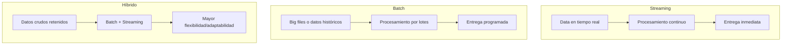

# 1. ¿Qué es un _Data Pipeline_?
- Cadena de procesos desde un sitio objetivo hasta un lago (`Data Lake`) o `“data pool” `que alimenta decisiones o modelos de IA:
    1. **Collection**
    2. **Ingestion**
    3. **Preparation**
    4. **Computation**
    5. **Presentation**

- Etapas pueden ocurrir simultáneamente, con múltiples orígenes/destinos; algunos pipelines pueden ser parciales (ej. solo etapas 1-3).

- Estas fases pueden ejecutarse simultáneamente, con orígenes/destinos múltiples y flujos parciales (ej. solo etapas 1–3)

# 2. ¿Qué distingue a un _Big Data Pipeline_?

- Diseñado para **manejo a gran escala**: **captura masiva de datos** mejora precisión y reduce margen de error en decisiones estratégicas.
- Aplicaciones principales:
    - **Analítica predictiva** (p. ej., demanda o mercados)
    - **Captura de mercado en tiempo real** mediante correlación de datos desde redes sociales, e‑commerce, anuncios, etc.
- Requisitos:
    - **Escalabilidad**: activar/desactivar recursos según volumen.
    - **Fluidez**: procesar múltiples formatos (JSON, CSV, HTML) limpiándolos, unificándolos y estructurándolos.
    - **Gestión concurrente de peticiones**: simultaneidad rápida y eficiente.

# 3. Beneficios para las empresas

1. **Consolidación de datos**: múltiples fuentes convergen a un solo depósito centralizado.
2. **Reducción de fricción / time‑to‑insight**: disminuye el esfuerzo en limpieza y preparación inicial. 
3. **Compartimentación**: sólo stakeholders relevantes acceden a datos específicos según roles. 
4. **Uniformidad**: estandariza formatos y facilita movimiento entre sistemas/depositarios.

# 4. Tipos de arquitectura de Data Pipeline

| Tipo de Pipeline | Características clave                                              | Ejemplo de uso                                                                      |
| ---------------- | ------------------------------------------------------------------ | ----------------------------------------------------------------------------------- |
| **Streaming**    | Procesamiento en tiempo real; baja latencia, respuesta inmediata   | OTA repricing dinámico (vuelos, hotelería)                                          |
| **Batch-based**  | Procesos periódicos de grandes volúmenes; mayor latencia aceptable | Institución financiera analizando datos de mercado Nasdaq                           |
| **Híbrido**      | Combina batch y streaming para flexibilidad y escalabilidad        | Corporaciones grandes que retienen datos en formato bruto para futura adaptabilidad |

# 5. _Data Pipeline_ vs. _ETL Pipeline_

- **ETL**: extracción, transformación y carga; enfocado en preparación de datos para almacén y análisis rápido. Ideal para datasets pequeños a medianos.    
- **Data Pipeline**: protocolo integral o framework que orquesta todo el flujo de datos (recolección, ingesta, procesamiento y presentación) asegurando funcionamiento sistemático. 
## Ventajas del ETL:

- Consolida datos desde múltiples fuentes/formato.
- Disminuye el tiempo para insights.
- Libera recursos (hasta 80 % del tiempo en limpieza es automatizado).
## Automatización ETL:

- Plataformas como Bright Data automatizan extracción y entrega en JSON, CSV, Excel o HTML vía webhooks, API, S3, etc.
- Incluso eliminan la necesidad de pipelines propios al usar datasets listos para usar.

# 6. Conclusión
- La arquitectura del pipeline (streaming, batch, híbrido) debe ajustarse a tus volúmenes, fuentes y requerimientos de procesamiento.
- Elegir bien permite automatización, adaptabilidad y reducción de fricción.
- La selección apropiada sustenta decisiones de mercado más rápidas e informadas.

