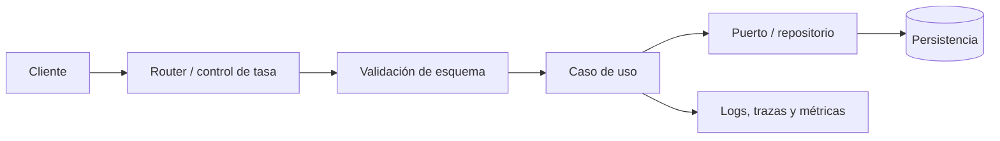

tags: #NodeJs 

# 📚 Curso de NodeJs desde Cero: Introducción y Primeros Pasos  
**🎥 Video:** [CURSO DE NODE.JS DESDE CERO](https://www.youtube.com/watch?v=yB4n_K7dZV8)  

## 🕒 Resumen por Tiempos  

### ⏱ 00:00 - Introducción al Curso  
- Curso práctico desde cero sobre **Node.js**.  
- Temas a tratar:  
  - ¿Qué es Node.js y por qué aprenderlo?  
  - ¿Qué se puede y qué no se puede hacer con Node.js?  
  - Módulos en Node.js: `fileSystem`, `path`, `http`.  
  - Creación de un servidor web básico.  
- **Node.js usa el motor V8** de Google Chrome para ejecutar JavaScript de manera eficiente.  

### ⏱ 03:47 - Historia y Evolución de Node.js  
- JavaScript era lento, pero con V8 se volvió más rápido.  
- **Node.js se basa en V8** y aprovecha su rendimiento.  
- En 2015, Node.js se unió a otro proyecto y se convirtió en parte de la **Open Source Foundation**.  

### ⏱ 06:59 - Razones para Aprender Node.js  
- **Alta demanda laboral** y uso en el stack tecnológico moderno.  
- Permite **reutilizar conocimientos de JavaScript** en el backend.  
- Soporte y comunidad en constante crecimiento.  

### ⏱ 10:45 - Instalación de Node.js  
- Instalación simple con el instalador oficial.  
- **Problema:** Solo instala una versión de Node.js, lo que puede ser un inconveniente si se trabaja en múltiples proyectos.  
- **Solución:** Usar la versión **LTS** (Long-Term Support) para mayor estabilidad.  

### ⏱ 17:22 - Uso de Node.js en la Terminal  
- Se puede ejecutar código JavaScript en la terminal con **REPL (Read-Eval-Print Loop)**.  
- Similar a la consola del navegador, pero no tiene acceso al objeto `window`.  
- En Node.js, el objeto global es **`global`**, no `window`.  

### ⏱ 23:49 - Diferencias entre Node.js y el Navegador  
- **Node.js NO es un navegador**, es un entorno de ejecución de JavaScript.  
- No existen los objetos del DOM (`window`, `document`), pero sí objetos como `global`.  
- Algunos métodos como `fetch` pueden no estar disponibles sin importar módulos adicionales.  

### ⏱ 27:44 - Uso de Módulos en Node.js  
- Node.js permite exportar e importar módulos usando:
```javascript
  module.exports = { suma };
  const suma = require('./suma');
```

**ECMAScript Modules (ESM)** también se pueden usar con `import/export`.
```javascript
import { suma } from './suma.mjs';
```


## Inicializar un proyecto
```bash
npm init -y
```
## Instalar paquetes:
```bash
# No se ponen comillas
npm install 'package'

# instalar como developer para motivos de "desarrrollo" y no producción
npm install 'package' -D

# instalar version exacta de un paquete
npm install 'package' -E
```
```json
{
	"name": "clase-3",
	"version": "1.0.0",
	"description": "",
	"main": "app.js",
	"scripts": {
		"test": "echo \"Error: no test specified\" && exit 1"
	},
	"keywords": [],
	"author": "",
	"license": "ISC",
	"dependencies": {
		"express": "^4.21.2"
	}
}
// Caret (^) en `package.json`: indica que -permite actualizaciones de la dependencia **compatibles con la versión especificada**

//`^3.4.1` → acepta desde `3.4.1` hasta `<4.0.0`
```


# Siguiente

|   Seguir a ⏭️    |
| :--------------: |
| [[2. Callbacks]] |

## Actualización técnica: runtime, concurrencia y módulos

Node.js es un *runtime* de JavaScript basado en V8 que combina un hilo principal para ejecutar JavaScript con E/S no bloqueante y un *event loop*. Esto lo hace muy apropiado para APIs, *streaming* y aplicaciones I/O-bound; no convierte automáticamente operaciones intensivas de CPU en paralelas. Para cálculos pesados, aísla el trabajo mediante `worker_threads`, colas de tareas o servicios especializados, y mide antes de escalar.

| Aspecto | CommonJS | ECMAScript Modules (ESM) |
| --- | --- | --- |
| Sintaxis | `require()` / `module.exports` | `import` / `export` |
| Activación | Predeterminado histórico de `.cjs` | `.mjs` o `"type": "module"` en `package.json` |
| Recomendación | Mantener compatibilidad de un proyecto existente | Elegir para proyectos nuevos y mantener una convención única |

- En versiones actuales de Node, `fetch` está disponible como API web global; confirma la versión LTS objetivo antes de asumir una API concreta. La documentación oficial diferencia con precisión los mecanismos de módulos y sus reglas de resolución. [Node.js: módulos ECMAScript](https://nodejs.org/api/esm.html)
- `npm install package` es la sintaxis correcta; las comillas son una elección del *shell*, no un requisito de npm. El archivo de bloqueo debe versionarse para instalaciones reproducibles.
- Para una API de producción, valida las entradas en el límite HTTP, establece límites de tamaño y *timeouts*, evita secretos en el repositorio, usa logging estructurado y no devuelvas internamente errores sin sanitizar.

### Arquitectura de referencia para una API



<!-- self-study-knowledge-context -->
## Contexto de estudio
- Dominio: [[MOC-Self-Study#Development & Architecture|Desarrollo y arquitectura]].
- Criterio de producción: Conecta el concepto con contratos explícitos, validación de entrada, pruebas automatizadas, observabilidad y despliegues reversibles.
