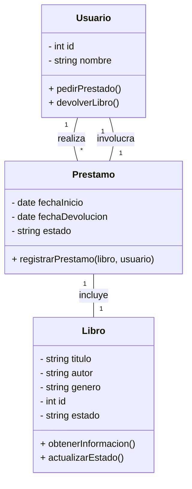
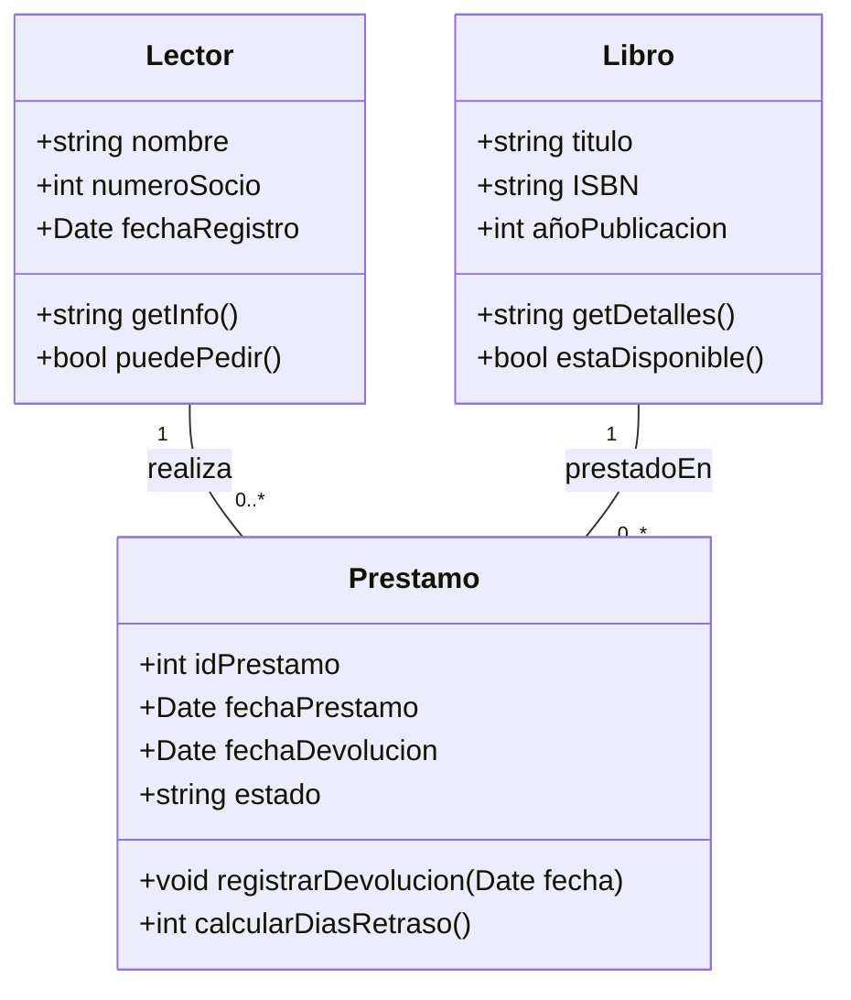
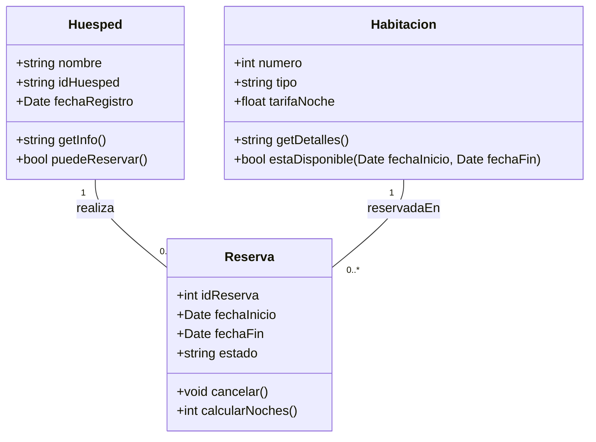
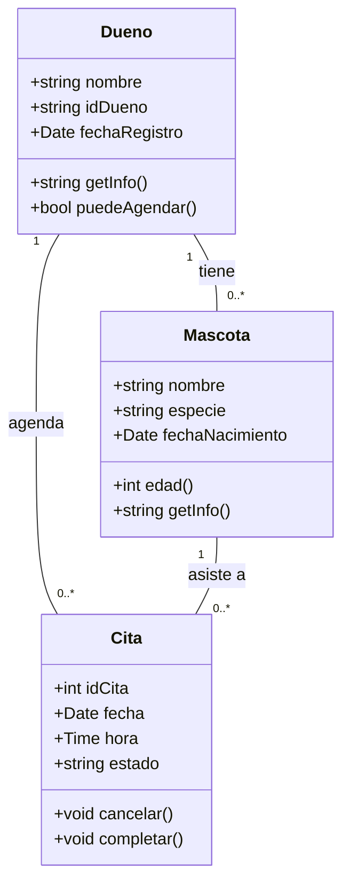
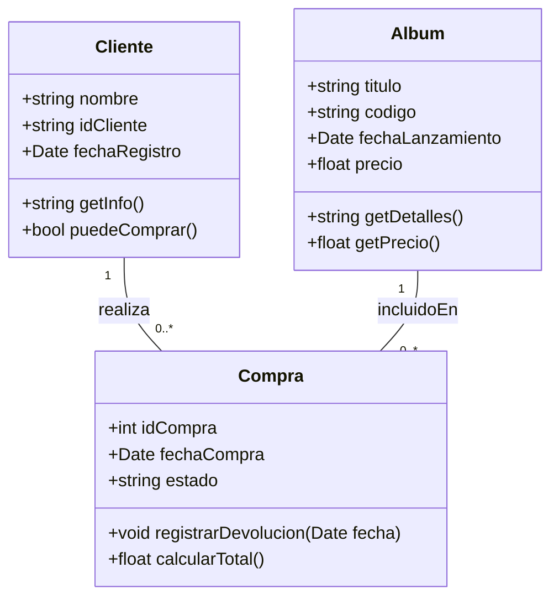
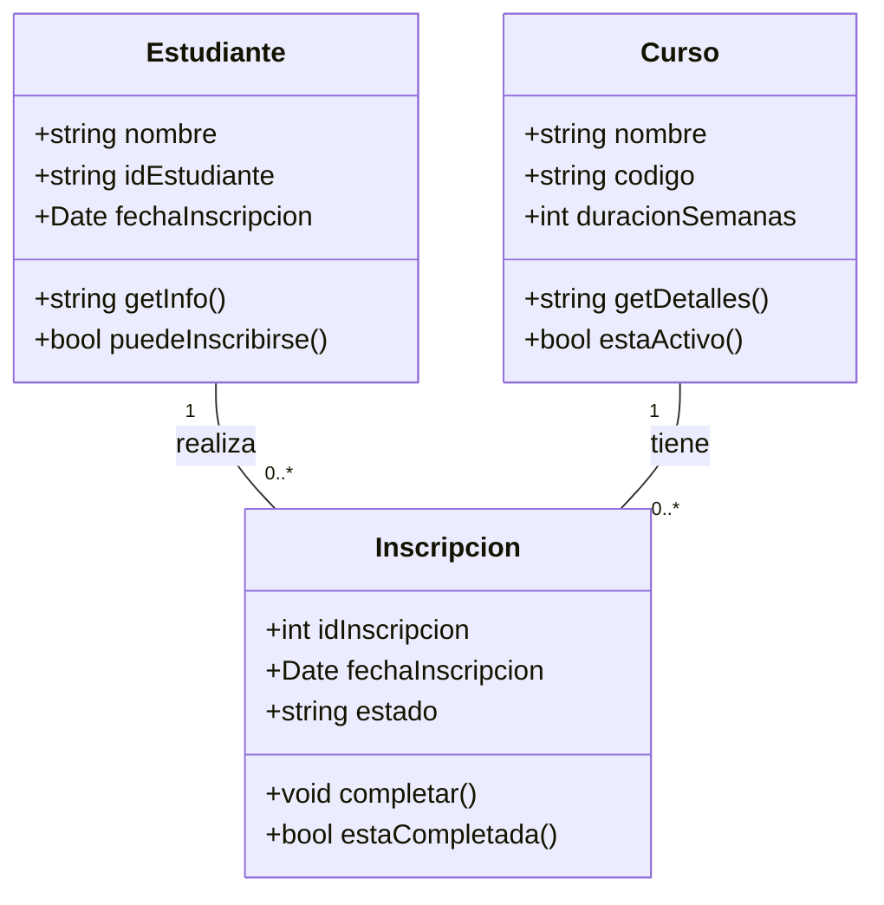
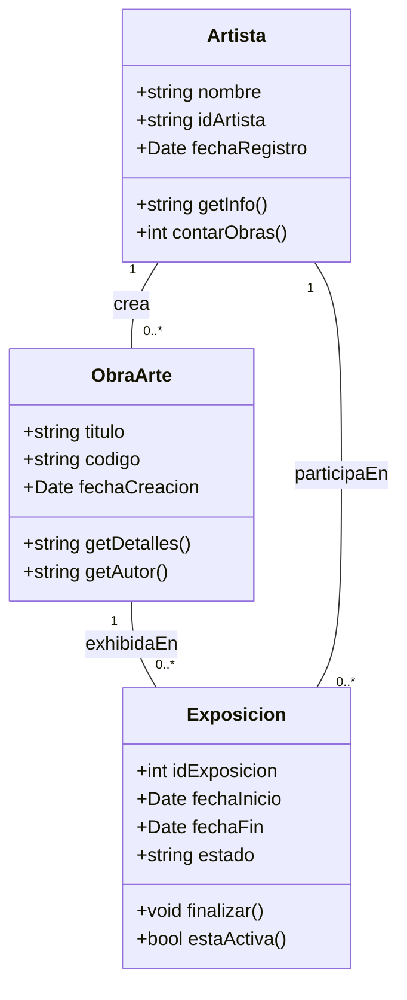

# Ejercicio 1: Biblioteca
A continuación, resolveremos el ejercicio de gestión de biblioteca identificando clases, atributos, métodos y relaciones, y finalmente representándolo en un diagrama UML.

## Paso 1: Identificación de Clases que forman parte del sistema.

Para definir las clases, analizamos los sustantivos clave en la descripción del problema. En este caso, podemos identificar las siguientes clases:

- Libro
- Usuario
- Prestamo

## Paso 2:  Definir Atributos.

Cada clase debe contener atributos que representen sus características esenciales:

- `Libro`: titulo, autor, genero, id, estado
- `Usuario`: id, nombre
- `Prestamo`: fechaInicio, fechaDevolucion, estado, libro, usuario

## Paso 3: Definir Metodos

Los métodos representan acciones que las clases pueden realizar:
- **Libro:** obtenerInformacion(), actualizarEstado()
- **Usuario:** pedirPrestado(), devolverLibro()
- **Prestamo:** registrarPrestamo(libro, usuario)

## Paso 4: Definir Relaciones:

- Un **Usuario** puede pedir prestados varios **Libros**
- Un **Libro** solo puede estar en posesión de un único **Usuario**
- Un **Prestamo** conecta un **Usuario** con un **Libro** y almacena la información sobre la fecha de préstamo y devolución

## Paso 5: Diagrama UML

📌 **Diagrama UML del sistema:**

---
# Ejercicio 2: Pedidos Restaurante

Desarrollar un **Sistema de Gestión de Pedidos** para un restaurante que permita registrar clientes, generar y controlar el estado de sus pedidos, y detallar los platos incluidos en cada pedido con su precio. El sistema debe facilitar:

1. **Registrar Clientes** con su nombre y teléfono.
2. **Crear Pedidos**, asignarles un número único y un estado (p. ej. “Pendiente”, “En preparación”, “Servido”).
3. **Asociar cada Pedido** a un Cliente existente.
4. **Detallar los Platos** de cada Pedido, indicando nombre y precio de cada uno.
5. **Visualizar el Total** del pedido (sumando precios de platos) y actualizar el estado conforme avanza su preparación.

---
# Ejercicio 3: 

### Símbolos Relaciones BBDD & EDR

[[2. EDR RELACIONES]]

![[Pasted image 20250702173124.png]]

![[EDR Symbols.png]]

---

# Tarea

## 1. Biblioteca
Enunciado: [[2.DiseñoOrientadoObjetos#1. Caso Biblioteca]]

**Clases principales**
1. `Libro`
2. `Lector`
3. `Prestamo`

Clase `Libro`
- **Atributos**
    - `string titulo`    // título único
    - `string ISBN`    // identifica la obra
    - `int añoPublicacion`
- **Métodos sugeridos**
    - `string getDetalles()`   // devuelve “Título (ISBN) – Año”
    - `bool estaDisponible()`   // indica si puede prestarse (a implementar según estado)

 Clase `Lector`
- **Atributos**
    - `string nombre`
    - `int numeroSocio`   // clave única
    - `Date fechaRegistro`
- **Métodos sugeridos**
    - `string getInfo()`  // nombre + número de socio
    - `bool puedePedir()` // por ejemplo, si no supera límite de préstamos

Clase `Prestamo`
- **Atributos**
    - `int idPrestamo`  // identificador único
    - `Date fechaPrestamo`
    - `Date fechaDevolucion` // `null` si aún no se devolvió
    - `string estado`   // (“Activo”, “Devuelto”, “Retrasado”)
- **Relaciones (atributos referenciales)**
    - `Libro libro`
    - `Lector lector`
- **Métodos sugeridos**
    - `void registrarDevolucion(Date fecha)`
    - `int calcularDiasRetraso()`

#### Relaciones y Cardinalidades

| Origen   | Tipo de Relación       | Destino  | Cardinalidad              | Descripción                                                                            |
| -------- | ---------------------- | -------- | ------------------------- | -------------------------------------------------------------------------------------- |
| Lector   | 1 — _realiza_ — *      | Préstamo | 1 Lector ↔ 0..* Préstamos | Un lector puede tener varios préstamos a lo largo del tiempo.                          |
| Libro    | 1 — _esPrestadoEn_ — * | Préstamo | 1 Libro ↔ 0..* Préstamos  | Un libro puede prestarse múltiples veces (no simultáneamente en este modelo sencillo). |
| Préstamo | _asocia_               | Lector   | * Préstamo ↔ 1 Lector     | Cada préstamo corresponde a un único lector.                                           |
| Préstamo | _asocia_               | Libro    | * Préstamo ↔ 1 Libro      | Cada préstamo corresponde a un único libro.                                            |

#### Diagrama de Clases – Sistema de Biblioteca

## 2. Hotel
Enunciado: [[2.DiseñoOrientadoObjetos#2. Caso Hotel]]
**Clases principales**
1. `Habitación`
2. `Huésped`
3. `Reserva`

Clase `Habitación`
- **Atributos**
    - `int numero`     // número único de habitación
    - `string tipo`   // “Individual”, “Doble”, “Suite”
    - `float tarifaNoche` // precio por noche
- **Métodos sugeridos**
    - `string getDetalles()`   // “Hab. 101 (Suite) – $150.00”
    - `bool estaDisponible(Date inicio, Date fin)` // comprueba ocupación

 Clase `Huésped`
- **Atributos**
    - `string nombre`
    - `string idHuesped` // cédula o pasaporte
    - `Date fechaRegistro`
- **Métodos sugeridos**
    - `string getInfo()`  // muestra nombre e ID
    - `bool puedeReservar()` // verifica estado de cuenta

 Clase `Reserva`
- **Atributos**
    - `int idReserva`
    - `Date fechaInicio`
    - `Date fechaFin`
    - `string estado` // “Activa”, “Completada”, “Cancelada”
- **Relaciones**
    - `Habitación habitación`
    - `Huésped huesped`
- **Métodos sugeridos**
    - `void cancelar()`
    - `int calcularNoches()`

#### Relaciones y Cardinalidades

| Origen     | Relación    | Destino    | Cardinalidad                 | Descripción                                                       |
| ---------- | ----------- | ---------- | ---------------------------- | ----------------------------------------------------------------- |
| Huésped    | realiza     | Reserva    | 1 Huésped ↔ 0..* Reservas    | Un huésped puede tener muchas reservas.                           |
| Habitación | reservadaEn | Reserva    | 1 Habitación ↔ 0..* Reservas | Una habitación puede reservarse varias veces en fechas distintas. |
| Reserva    | asocia      | Huésped    | * Reserva ↔ 1 Huésped        | Cada reserva corresponde a un único huésped.                      |
| Reserva    | asocia      | Habitación | * Reserva ↔ 1 Habitación     | Cada reserva es para una sola habitación.                         |
|            |             |            |                              |                                                                   |

#### Diagrama UML en Mermaid

## 3. Clínica veterinaria (Tienda Mascotas)
Enunciado: [[2.DiseñoOrientadoObjetos#3. Caso Tienda de Mascotas]]

**Clases principales**
1. `Mascota`
2. `Dueño`
3. `Cita`

Clase `Mascota`
- **Atributos**
    - `string nombre`        
    - `string especie`  // “Perro”, “Gato”, etc.
    - `Date fechaNacimiento`
- **Métodos sugeridos**
    - `int edad()`    // calcula años a partir de `fechaNacimiento`
    - `string getInfo()` // “Rex (Perro), nacido 2020-05-01”

Clase `Duenio`
- **Atributos**
    - `string nombre`
    - `string idDueno` // cédula o identificación única
    - `Date fechaRegistro`
- **Métodos sugeridos**
    - `string getInfo()` // “Ana Pérez (ID: 12345)”
    - `bool puedeAgendar()` // verifica restricciones de citas

1.3. Clase `Cita`
- **Atributos**
    - `int idCita`
    - `Date fecha`
    - `Time hora`
    - `string estado` // “Agendada”, “Completada”, “Cancelada”
- **Relaciones**
    - `Mascota mascota`
    - `Dueno dueno`
- **Métodos sugeridos**
    - `void cancelar()`
    - `void completar()`

##### Relaciones y Cardinalidades
|Origen|Relación|Destino|Cardinalidad|Descripción|
|---|---|---|---|---|
|Dueño|tiene|Mascota|1 Dueno ↔ 0..* Mascotas|Un dueño puede registrar varias mascotas.|
|Dueño|agenda|Cita|1 Dueno ↔ 0..* Citas|Un dueño puede llevar sus mascotas a múltiples citas.|
|Mascota|asiste a|Cita|1 Mascota ↔ 0..* Citas|Cada mascota puede tener varias citas a lo largo del tiempo.|
|Cita|pertenece a|Dueno|* Cita ↔ 1 Dueno|Cada cita corresponde a un único dueño.|
|Cita|para|Mascota|* Cita ↔ 1 Mascota|Cada cita es para una sola mascota en fecha y hora específicas.|

##### Diagrama UML en Mermaid

## 4. Tienda de música
Enunciado: [[2.DiseñoOrientadoObjetos#4. Caso Tienda de Música]]

**Clases principales**
1. `Album`
2. `Cliente`
3. `Compra`

Clase `Album`
- **Atributos**
    - `string titulo`   // título único
    - `string codigo`  // identificador exclusivo
    - `Date fechaLanzamiento`
- **Métodos sugeridos**
    - `string getDetalles()` // “Título (Código) – Lanzado 2020-05-01”
    - `float getPrecio()`   // retorna precio (podrías agregar atributo `precio`)

> 🔧 _Nota:_ añadimos `float precio` como atributo para poder registrar el monto de la compra.

Clase `Cliente`
- **Atributos**
    - `string nombre`
    - `string idCliente` // identificación única
    - `Date fechaRegistro`
- **Métodos sugeridos**
    - `string getInfo()`  // nombre + ID
    - `bool puedeComprar()` // p.ej. verifica saldo o estado de cuenta

Clase `Compra`
- **Atributos**
    - `int idCompra`
    - `Date fechaCompra`
    - `string estado`  // “Activa”, “Devuelta”
- **Relaciones**
    - `Album album`
    - `Cliente cliente`
- **Métodos sugeridos**
    - `void registrarDevolucion(Date fecha)`
    - `float calcularTotal()` // normalmente retorna `album.getPrecio()`

##### Relaciones y Cardinalidades
|Origen|Relación|Destino|Cardinalidad|Descripción|
|---|---|---|---|---|
|Cliente|realiza|Compra|1 Cliente ↔ 0..* Compras|Un cliente puede hacer varias compras.|
|Album|incluidoEn|Compra|1 Álbum ↔ 0..* Compras|Un álbum puede venderse múltiples veces.|
|Compra|asocia|Cliente|* Compra ↔ 1 Cliente|Cada compra corresponde a un único cliente.|
|Compra|asocia|Album|* Compra ↔ 1 Álbum|Cada compra es de un solo álbum.|

##### Diagrama UML en Mermaid

## 5. Escuela de música
Enunciado: [[2.DiseñoOrientadoObjetos#5. Caso Escuela de Música]]

**Clases principales**
1. `Curso`
2. `Estudiante`
3. `Inscripción`

Clase `Curso`
- **Atributos**
    - `string nombre`   // nombre único del curso        
    - `string codigo`   // identificador exclusivo
    - `int duracionSemanas` // duración en semanas
- **Métodos sugeridos**
    - `string getDetalles()` // “Guitarra Básica (GIT101) – 8 semanas”    
    - `bool estáActivo()`   // true si aún no ha terminado

Clase `Estudiante`
- **Atributos**
    - `string nombre`
    - `string idEstudiante` // número único de inscripción
    - `Date fechaInscripcion`
- **Métodos sugeridos**
    - `string getInfo()`  // “Ana Pérez (ID: 2025001)”
    - `bool puedeInscribirse()` // verifica si cumple prerequisitos
    
Clase `Inscripcion`
- **Atributos**
    - `int idInscripcion`
    - `Date fechaInscripcion`
    - `string estado`  // “Activa”, “Completada”
- **Relaciones**
    - `Curso curso`
    - `Estudiante estudiante`
- **Métodos sugeridos**
    - `void completar()`
    - `bool estáCompletada()`

##### Relaciones y Cardinalidades
|Origen|Relación|Destino|Cardinalidad|Descripción|
|---|---|---|---|---|
|Estudiante|realiza|Inscripcion|1 Estudiante ↔ 0..* Inscripciones|Un estudiante puede inscribirse en varios cursos.|
|Curso|tiene|Inscripcion|1 Curso ↔ 0..* Inscripciones|Un curso puede tener múltiples inscripciones de diferentes estudiantes.|
|Inscripcion|asocia|Estudiante|* Inscripcion ↔ 1 Estudiante|Cada inscripción pertenece a un solo estudiante.|
|Inscripcion|asocia|Curso|* Inscripcion ↔ 1 Curso|Cada inscripción corresponde a un solo curso.|

##### Diagrama UML en Mermaid

## 6. Galería de arte
[[2.DiseñoOrientadoObjetos#6. Caso Galería de Arte]]

**Clases principales**
1. `ObraArte`
2. `Artista`
3. `Exposicion`

Clase `ObraArte`
- **Atributos**
    - `string titulo`
    - `string codigo`   // identificador exclusivo
    - `Date fechaCreacion`
- **Métodos sugeridos**
    - `string getDetalles()`  // “Mona Lisa (ML-1503) – Creada 1503”
    - `string getAutor()`  // retorna nombre del artista asociado (opcional)

Clase `Artista`
- **Atributos**
    - `string nombre`
    - `string idArtista`  // identificación único
    - `Date fechaRegistro`
- **Métodos sugeridos**
    - `string getInfo()`  // “Leonardo da Vinci (ID: A001)”
    - `int contarObras()`  // devuelve número de obras registradas

Clase `Exposicion`
- **Atributos**
    - `int idExposicion`
    - `Date fechaInicio`
    - `Date fechaFin`
    - `string estado`  // “Activa”, “Finalizada”
- **Relaciones**
    - `ObraArte obra`
    - `Artista artista`
- **Métodos sugeridos**
    - `void finalizar()`
    - `bool estaActiva()`

##### Relaciones y Cardinalidades

|Origen|Relación|Destino|Cardinalidad|Descripción|
|---|---|---|---|---|
|Artista|crea|ObraArte|1 Artista ↔ 0..* ObraArte|Un artista puede tener varias obras.|
|ObraArte|exhibidaEn|Exposicion|1 ObraArte ↔ 0..* Exposicion|Una obra puede exhibirse en múltiples exposiciones a lo largo del tiempo.|
|Artista|participaEn|Exposicion|1 Artista ↔ 0..* Exposicion|Un artista puede presentar varias exposiciones.|
|Exposicion|asocia|ObraArte|* Exposicion ↔ 1 ObraArte|Cada exposición corresponde a una sola obra en este modelo sencillo.|
|Exposicion|asocia|Artista|* Exposicion ↔ 1 Artista|Cada exposición está vinculada a un único artista creador.|

##### Diagrama UML en Mermaid

# Siguiente

<!-- self-study-knowledge-context -->
## Contexto de estudio
- Dominio: [[MOC-Self-Study#Development & Architecture|Desarrollo y arquitectura]].
- Criterio de producción: Conecta el concepto con contratos explícitos, validación de entrada, pruebas automatizadas, observabilidad y despliegues reversibles.
