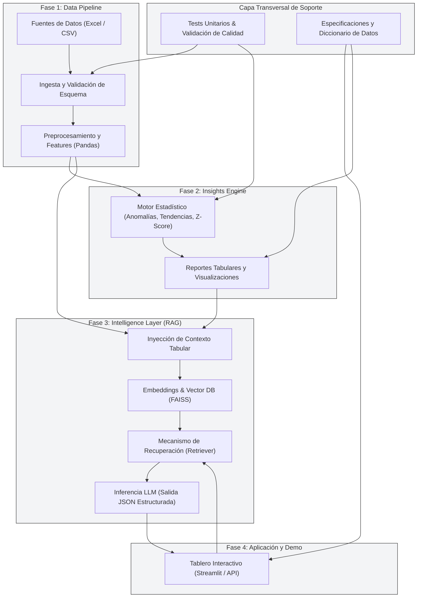

# 🏗️ Diagrama de Arquitectura Técnica — Opción A

Pipeline modular desacoplado en cuatro fases principales más una capa transversal de soporte para pruebas y documentación.

---

## 🔄 Flujo de Arquitectura General

---

## 🧠 Validación Técnica por Fase

| Fase | Propósito Técnico | Qué Demuestra ante el Jurado |
| :--- | :--- | :--- |
| **Fase 1: Data Pipeline** | Ingesta, tipado estricto y normalización de datos. | Dominio de **Data Engineering** (manejo de esquemas, control de calidad y tratamiento de nulos). |
| **Fase 2: Insights Engine** | Generación determinista de KPIs, deltas y anomalías. | **Pensamiento Analítico Riguroso** y capacidad de transformar datos brutos en métricas operativas. |
| **Fase 3: Intelligence Layer (RAG)** | Enriquecimiento contextual e inferencia estructurada. | Dominio de **IA Aplicada**, arquitecturas RAG, vectorización y mitigación de alucinaciones. |
| **Fase 4: App Demo** | Tablero interactivo para exploración de consultas. | **Visión de Producto** y capacidad de entregar interfaces útiles para toma de decisiones. |
| **Capa de Soporte** | Pruebas unitarias (`pytest`) y documentación. | **Estándar de Ingeniería Senior**: reproducibilidad, modularidad y trazabilidad. |

---

## 💬 Guion de Sustentación del Diagrama (60–90 Segundos)

> *"Esta es la arquitectura general del sistema. En la **Fase 1**, realizamos la ingesta y validación de las métricas históricas de Rappi, transformándolas en DataFrames limpios y enriquecidos con variables de tendencia. En la **Fase 2**, el motor analítico identifica anomalías estadísticas y calcula deltas porcentuales. En la **Fase 3**, integramos una capa RAG con indexación semántica en FAISS, permitiendo que el LLM responda consultas de negocio bajo un contrato JSON estricto y respaldado en evidencias numéricas. Finalmente, la **Fase 4** expone estos resultados en una aplicación interactiva en Streamlit. Todo el pipeline cuenta con pruebas automatizadas y documentación para garantizar total reproducibilidad."*