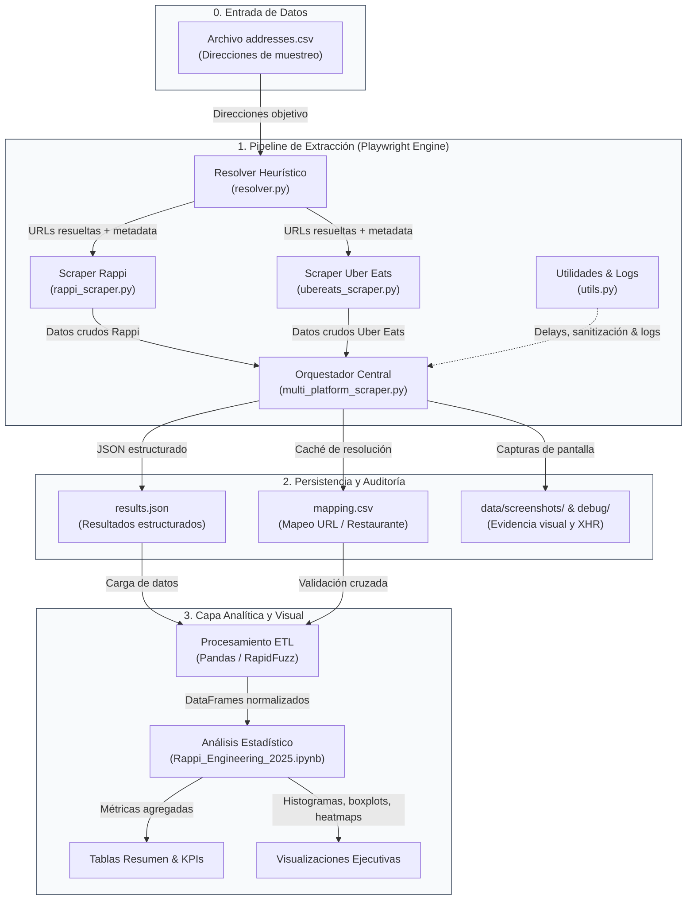

# 🏗️ Arquitectura del Pipeline de Competitive Intelligence — Opción B

Sistema modular y desacoplado diseñado para la extracción, validación, normalización y análisis comparativo de precios y tarifas entre plataformas de entrega a domicilio.

---

## 🔄 Diagrama de Flujo de Datos

---

## 🧩 Desglose Módulo a Módulo

### 1. Entradas del Sistema (S0)
- **`data/addresses.csv`**: Archivo de configuración geoespacial que define las ubicaciones representativas a muestrear (`addressLabel`, `searchQuery`, `restaurantUrl` opcional). Cada fila representa una unidad de muestreo independiente.

---

### 2. Motor de Extracción y Submódulos (S1)
1. **Orquestador Principal (`multi_platform_scraper.py`):**
   - Coordina la sesión única de Playwright Chromium.
   - Instala listeners para intercepción de eventos de red (`page.on("response", ...)`).
   - Genera el `selector_hash` para trazabilidad de versiones.
2. **Resolver de URLs (`resolver.py`):**
   - Construye consultas de búsqueda dinámicas en Rappi (`https://www.rappi.com.mx/buscar?query=...`).
   - Evalúa enlaces candidatos mediante un algoritmo de puntuación ponderada (+50 por coincidencia de marca, +10 por coincidencia textual).
   - Retorna la URL seleccionada junto con el objeto de metadata (`resolution_meta`) y nivel de confianza (`high`, `medium`, `low`).
3. **Scraper Específico de Rappi (`rappi_scraper.py`):**
   - Ejecuta la **cascada de extracción en 4 niveles**:
     1. Parseo de `window.__NEXT_DATA__` (fuente JSON primaria).
     2. Interceptación y filtrado de respuestas XHR/Fetch de red.
     3. Análisis de texto visible en el DOM.
     4. Simulación de usuario *Add-to-Cart* para revelar tarifas calculadas en el carrito.
4. **Módulo de Utilidades (`utils.py`):**
   - Funciones transversales de sanitización de cadenas numéricas (`sanitize_number`), pausas estocásticas anti-bloqueo (`random_delay`), persistencia JSON (`dump_json_to`) y políticas de reintento (`retry`).

---

### 3. Persistencia, Auditoría y Reportes (S2 y S3)
- **`results.json`**: Dataset estructurado con campos normalizados (`priceValue`, `deliveryFeeValue`, `serviceFeeValue`, `finalPriceValue`, `feeSource`, `scrapeStatus`).
- **`mapping.csv`**: Caché persistente que mapea etiquetas de dirección con las URLs resueltas para optimizar ejecuciones subsecuentes.
- **`data/screenshots/`**: Evidencia visual inmutable de cada captura para auditoría ante inconsistencias.
- **`Rappi_Engineering_2025.ipynb`**: Entorno analítico donde se calculan estadísticas descriptivas, pruebas de hipótesis y visualizaciones ejecutivas.

---

## 🎙️ Guion de Sustentación del Diagrama en Diapositivas

> *"Esta arquitectura opera como un pipeline de ingeniería de datos continuo: partimos de un conjunto de direcciones de muestreo que representan distintos niveles socioeconómicos y geografías de la ciudad. El módulo **Resolver** identifica de forma heurística la sucursal de restaurante más relevante asignando un puntaje de confianza. Luego, los **Scrapers Modulares** extraen precios y tarifas mediante una cascada resiliente que combina inspección de JSONs internos de Next.js, intercepción de respuestas de red y simulación de interacción en el carrito. Toda la metadata, junto con capturas visuales de auditoría, se consolida en estructuras JSON estandarizadas que alimentan nuestro entorno de análisis estadístico en Pandas."*