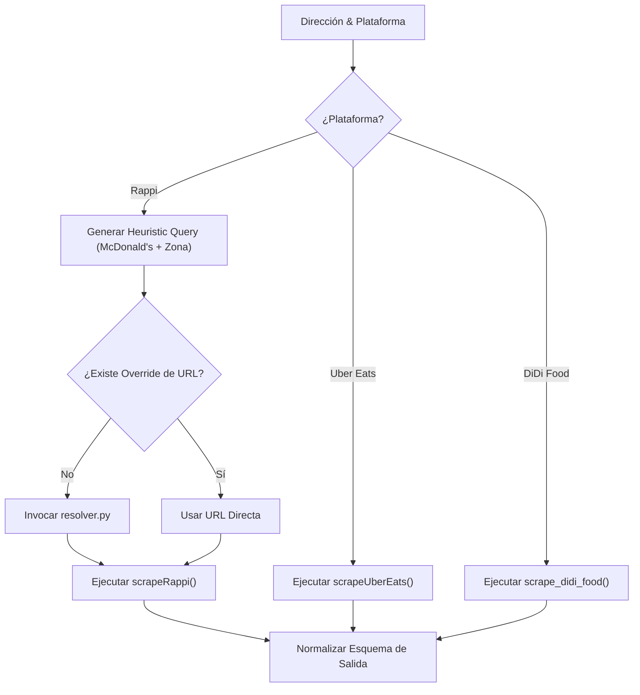

# 🧠 Documentación Técnica: `multi_platform_scraper.py`

Análisis exhaustivo del módulo central que orquesta el ciclo de vida de la sesión de Playwright, gestiona las direcciones de muestreo y compila los resultados multi-plataforma.

---

## 🎯 Propósito del Orquestador

`multi_platform_scraper.py` actúa como la **capa de control y coordinación** del sistema:
- Inicializa una única instancia de navegador Playwright Chromium para maximizar la eficiencia y reducir el consumo de memoria.
- Itera sobre el conjunto de direcciones objetivo definidas en `addresses.csv`.
- Invoca la heurística de resolución de URLs (`resolver.py`) si no existe una URL parametrizada.
- Ejecuta los scrapers modulares de cada plataforma (`rappi_scraper.py`, `ubereats_scraper.py`).
- Intercepta el tráfico de red mediante manejadores de eventos asincrónicos para capturar respuestas XHR.
- Normaliza y consolida los registros en `results.json` y actualiza la caché `mapping.csv`.

---

## 🧩 Desglose Estructural del Código

### 1. Inicialización y Configuración de Entorno
El script configura rutas dinámicas en `sys.path`, carga variables de entorno mediante `dotenv` y define constantes operativas.

```python
# Inicialización de dependencias y constantes operativas
import argparse
import csv
import hashlib
import json
import os
import sys
from datetime import datetime, timezone
from pathlib import Path
from typing import Any, Dict, List

from dotenv import load_dotenv
from playwright.sync_api import sync_playwright

load_dotenv()
REQUEST_TIMEOUT: int = int(os.getenv("REQUEST_TIMEOUT", "25"))
DELAY_MIN: float = float(os.getenv("DELAY_MIN", "1.2"))
DELAY_MAX: float = float(os.getenv("DELAY_MAX", "3.5"))
SCREENSHOT_DIR: str = os.getenv("SCREENSHOT_DIR", "data/screenshots")
```

---

### 2. Carga y Normalización de Direcciones (`load_addresses`)
Lee el archivo CSV de entrada y estandariza los campos esenciales por registro (`addressLabel`, `searchQuery`, `restaurantUrl`).

```python
def load_addresses(csv_path: str) -> List[Dict[str, str]]:
    """Carga y normaliza el listado de direcciones de muestreo geográfico."""
    rows: List[Dict[str, str]] = []
    with open(csv_path, newline="", encoding="utf-8-sig") as f:
        reader = csv.DictReader(f)
        for r in reader:
            rows.append({
                "addressLabel": r.get("addressLabel") or r.get("address") or "",
                "searchQuery": (r.get("searchQuery") or r.get("addressLabel") or "").strip(),
                "restaurantUrl": (r.get("restaurantUrl") or "").strip()
            })
    return rows
```

---

### 3. Ejecución por Plataforma (`scrape_platform`)
Maneja la lógica de derivación según la plataforma objetivo, aplicando heurísticas de búsqueda y capturando excepciones locales sin interrumpir el lote.



---

### 4. Orquestación del Ciclo de Vida (`main`)
Maneja la sesión del navegador, el listener de red y la exportación de métricas consolidadas.

```python
with sync_playwright() as pw:
    browser = pw.chromium.launch(headless=bool(headless))
    context = browser.new_context()
    page = context.new_page()

    for address_entry in addresses:
        for platform in platforms:
            responses_captured: List[Any] = []

            # Interceptación de respuestas de red
            def _on_response(response: Any) -> None:
                responses_captured.append(response)

            page.on("response", _on_response)

            # Extracción modular
            results = scrape_platform(platform, page, address_entry, product_targets, selector_hash)
            for r in results:
                r.setdefault("timestampUtc", datetime.now(timezone.utc).isoformat())
                r.setdefault("platform", platform)
                all_results.append(r)

            page.off("response", _on_response)
            random_delay(DELAY_MIN, DELAY_MAX)

    browser.close()
```

---

## 📊 Conceptos Clave de la Arquitectura Web

| Concepto Técnico | Definición en el Contexto del Proyecto | Aplicación en el Pipeline |
| :--- | :--- | :--- |
| **DOM (Document Object Model)** | Representación en árbol de los elementos HTML renderizados por el navegador. | Se utiliza como tercer nivel de fallback mediante `page.inner_text()` para capturar textos de precios visibles. |
| **Interceptación XHR / Fetch** | Captura programática de las peticiones asincrónicas de red que la SPA realiza hacia su API interna. | Permite acceder a payloads JSON crudos donde las tarifas de envío viajan de forma no ofuscada. |
| **`window.__NEXT_DATA__`** | Objeto JSON inyectado por el servidor en aplicaciones desarrolladas con Next.js/React. | Constituye la fuente primaria de datos deterministas más confiable, evitando parseos frágiles de selectores CSS. |
| **Puntaje de Confianza (`resolution_meta`)** | Ponderación numérica asignada a los candidatos de URL resueltos en el buscador. | Asigna etiquetas de confiabilidad (`high` $\ge 35$, `medium` $\ge 20$, `low` $< 20$) para auditar emparejamientos. |

---

## 🎙️ Puntos Clave para la Defensa del Orquestador

1. **Eficiencia Operativa:** Uso de una única página y contexto de navegador por lote de direcciones, minimizando el consumo de CPU y memoria.
2. **Trazabilidad Inmutable:** Inclusión de `selector_hash`, `timestampUtc` y `feeSource` en cada fila de datos para garantizar la auditoría de cada cifra reportada.
3. **Resiliencia ante Errores:** Las excepciones ocurridas en una sucursal o plataforma específica no abortan el pipeline global; se registran bajo el estado `error_platform` para posterior análisis forense.
