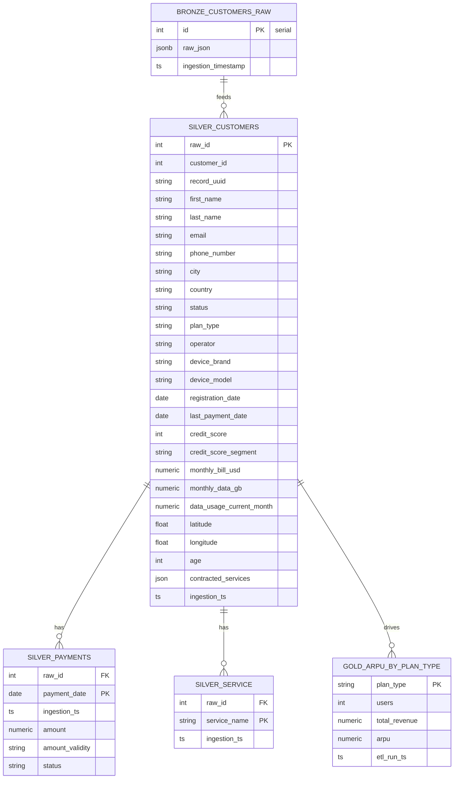

# Qversity ELT Data Model (Bronze → Silver → Gold)

A continuación se presenta un boceto en texto plano para guiar la creación de un diagrama ERD en draw.io. Incluye todas las tablas de las tres capas, sus claves primarias (PK), foráneas (FK), columnas relevantes y relaciones.

---

## 🟤 Bronze Layer

### ⁠ bronze.customers_raw ⁠  
•⁠  ⁠*PK*:  
  - ⁠ record_uuid ⁠ (UUID)  
•⁠  ⁠*Otras columnas clave*:  
  - ⁠ customer_id ⁠ (integer)  
  - ⁠ first_name ⁠, ⁠ last_name ⁠, ⁠ email ⁠, ⁠ phone_number ⁠  
  - ⁠ age ⁠, ⁠ country ⁠, ⁠ city ⁠, ⁠ operator ⁠, ⁠ plan_type ⁠  
  - ⁠ registration_date ⁠, ⁠ status ⁠  
  - ⁠ device_brand ⁠, ⁠ device_model ⁠  
  - ⁠ contracted_services ⁠ (array / raw)  
  - ⁠ payment_history ⁠ (array / raw)  
  - ⁠ latitude ⁠, ⁠ longitude ⁠  

<sup>Aquí se ingesta el JSON sin transformar.</sup>

---

## 🔵 Silver Layer

### ⁠ silver.silver_customers ⁠  
•⁠  ⁠*PK*:  
  - ⁠ raw_id ⁠ (UUID) → corresponde a ⁠ bronze.customers_raw.record_uuid ⁠  
•⁠  ⁠*Columns*:  
  - ⁠ customer_id ⁠ (integer)  
  - ⁠ first_name ⁠, ⁠ last_name ⁠, ⁠ email ⁠, ⁠ phone_number ⁠  
  - ⁠ age ⁠, ⁠ country ⁠, ⁠ city ⁠, ⁠ operator ⁠, ⁠ plan_type ⁠  
  - ⁠ monthly_data_gb ⁠, ⁠ monthly_bill_usd ⁠  
  - ⁠ registration_date ⁠, ⁠ status ⁠  
  - ⁠ device_brand ⁠, ⁠ device_model ⁠  
  - ⁠ last_payment_date ⁠, ⁠ credit_limit ⁠, ⁠ credit_score ⁠  
  - ⁠ latitude ⁠, ⁠ longitude ⁠  

### ⁠ silver.silver_payments ⁠  
•⁠  ⁠*PK*:  
  - (⁠ raw_id ⁠, ⁠ payment_date ⁠, ⁠ sequence ⁠) — secuencia única por pago  
•⁠  ⁠*FK*:  
  - ⁠ raw_id ⁠ → ⁠ silver.silver_customers.raw_id ⁠  
•⁠  ⁠*Columns*:  
  - ⁠ payment_date ⁠, ⁠ status ⁠, ⁠ amount ⁠  

### ⁠ silver.silver_service ⁠  
•⁠  ⁠*PK*:  
  - (⁠ raw_id ⁠, ⁠ service_name ⁠)  
•⁠  ⁠*FK*:  
  - ⁠ raw_id ⁠ → ⁠ silver.silver_customers.raw_id ⁠  
•⁠  ⁠*Columns*:  
  - ⁠ service_name ⁠  

<sup>Aquí se normalizan los arrays y se aplanan los JSON nested.</sup>

---

## 🟡 Gold Layer

Cada tabla Gold se alimenta de una o más tablas Silver, pero no tienen FKs declaradas explícitamente. Se considera la relación «consume»:

| *Gold Model*                                | *Consume de*                  |
|-----------------------------------------------|---------------------------------|
| ⁠ gold_arpu_by_plan_type ⁠                      | ⁠ silver.silver_customers ⁠       |
| ⁠ gold_revenue_distribution_by_geo ⁠            | ⁠ silver.silver_customers ⁠       |
| ⁠ gold_top_customer_segments ⁠                  | ⁠ silver.silver_customers ⁠       |
| ⁠ gold_customer_distribution_by_city ⁠          | ⁠ silver.silver_customers ⁠       |
| ⁠ gold_customer_distribution_by_country ⁠       | ⁠ silver.silver_customers ⁠       |
| ⁠ gold_customer_distribution_by_operator ⁠      | ⁠ silver.silver_customers ⁠       |
| ⁠ gold_age_distribution_by_plan ⁠               | ⁠ silver.silver_customers ⁠       |
| ⁠ gold_age_distribution_by_country_operator ⁠   | ⁠ silver.silver_customers ⁠       |
| ⁠ gold_operator_distribution ⁠                  | ⁠ silver.silver_customers ⁠       |
| ⁠ gold_operator_summary ⁠                       | ⁠ silver.silver_customers ⁠       |
| ⁠ gold_credit_score_segments ⁠                  | ⁠ silver.silver_customers ⁠       |
| ⁠ gold_credit_vs_payment_behavior ⁠             | ⁠ silver.silver_customers ⁠, ⁠ silver.silver_payments ⁠ |
| ⁠ gold_payment_issues ⁠                         | ⁠ silver.silver_customers ⁠, ⁠ silver.silver_payments ⁠ |
| ⁠ gold_pending_payments ⁠                       | ⁠ silver.silver_customers ⁠, ⁠ silver.silver_payments ⁠ |
| ⁠ gold_customer_status_distribution ⁠           | ⁠ silver.silver_customers ⁠       |
| ⁠ gold_device_brand_popularity ⁠                | ⁠ silver.silver_customers ⁠       |
| ⁠ gold_device_brand_by_plan ⁠                   | ⁠ silver.silver_customers ⁠       |
| ⁠ gold_device_brand_by_country_operator ⁠       | ⁠ silver.silver_customers ⁠       |
| ⁠ gold_service_popularity ⁠                     | ⁠ silver.silver_service ⁠         |
| ⁠ gold_service_combinations ⁠                   | ⁠ silver.silver_service ⁠         |
| ⁠ gold_high_revenue_service_combinations ⁠      | ⁠ silver.silver_customers ⁠, ⁠ silver.silver_service ⁠ |
| ⁠ gold_revenue_stats_by_plan_and_operator ⁠     | ⁠ silver.silver_customers ⁠       |
| ⁠ gold_new_customer_trends_by_operator ⁠        | ⁠ silver.silver_customers ⁠       |
| ⁠ gold_acquisition_trends_by_operator ⁠         | ⁠ silver.silver_customers ⁠       |
| ⁠ gold_revenue_stats_by_plan_and_operator ⁠     | ⁠ silver.silver_customers ⁠       |
| ⁠ gold_top_customer_segments ⁠                  | ⁠ silver.silver_customers ⁠       |

---

## 🔗 Relaciones y Flujo de Datos

```text
bronze.customers_raw (record_uuid PK)
             │
             │  (1:N) raw_id
             ▼
silver.silver_customers (raw_id PK, customer_id, ...)
      ├───<silver_payments> (raw_id FK → silver_customers.raw_id)
      └───<silver_service>  (raw_id FK → silver_customers.raw_id)

silver.silver_customers ──► gold.*  (consume datos para agregar métricas)
silver.silver_payments  ──► gold_credit_vs_payment_behavior, gold_payment_issues, gold_pending_payments
silver.silver_service   ──► gold_service_popularity, gold_service_combinations, gold_high_revenue_service_combinations
```


## EDR Final

```mermaid
erDiagram

%% Bronze Layer

BRONZE_CUSTOMERS_RAW {

int id PK

jsonb raw_json

datetime ingestion_timestamp

}

  

%% Silver Layer

SILVER_CUSTOMERS {

int raw_id PK

int customer_id

string record_uuid

string first_name

string last_name

string email

string phone_number

string city

string country

string status

string plan_type

string operator

string device_brand

string device_model

date registration_date

date last_payment_date

int credit_score

string credit_score_segment

numeric credit_limit

numeric monthly_bill_usd

numeric monthly_data_gb

numeric data_usage_current_month

float latitude

float longitude

int age

json contracted_services

datetime ingestion_ts

}

  

SILVER_PAYMENTS {

int raw_id FK

date payment_date PK

datetime ingestion_ts

numeric amount

string amount_validity

string status

}

  

SILVER_SERVICE {

int raw_id FK

string service_name PK

datetime ingestion_ts

}

  

%% Gold Layer

GOLD_ARPU_BY_PLAN_TYPE {

string plan_type PK

int users

numeric total_revenue

numeric arpu

datetime etl_run_ts

}

  

GOLD_AGE_DISTRIBUTION_BY_PLAN {

string plan_type PK

string age_bucket PK

int cnt

datetime etl_run_ts

}

  

GOLD_AGE_DISTRIBUTION_BY_COUNTRY_OPERATOR {

string country PK

string operator PK

string age_bucket PK

int customer_count

datetime execution_ts

}

  

GOLD_ACQUISITION_TRENDS_BY_OPERATOR {

string operator PK

datetime execution_ts PK

int total_new_customers

}

  

GOLD_CREDIT_SCORE_SEGMENTS {

string credit_segment PK

int cnt

numeric avg_score

datetime etl_run_ts

}

  

GOLD_CREDIT_VS_PAYMENT_BEHAVIOR {

string credit_score_segment PK

string payment_status PK

int cnt

datetime etl_run_ts

}

  

GOLD_CUSTOMER_DISTRIBUTION_BY_CITY {

string city PK

int customer_count

datetime etl_run_ts

}

  

GOLD_CUSTOMER_DISTRIBUTION_BY_COUNTRY {

string country PK

int customer_count

datetime etl_run_ts

}

  

GOLD_CUSTOMER_DISTRIBUTION_BY_OPERATOR {

string operator PK

int customer_count

datetime etl_run_ts

}

  

GOLD_CUSTOMER_STATUS_DISTRIBUTION {

string status PK

int num_customers

numeric pct_customers

datetime execution_ts

}

  

GOLD_DEVICE_BRAND_POPULARITY {

string device_brand PK

int customer_count

datetime etl_run_ts

}

  

GOLD_DEVICE_BRAND_BY_PLAN {

string plan_type PK

string device_brand PK

int customer_count

datetime etl_run_ts

}

  

GOLD_DEVICE_BRAND_BY_COUNTRY_OPERATOR {

string country PK

string operator PK

string device_brand PK

int customer_count

datetime etl_run_ts

}

  

GOLD_SERVICE_POPULARITY {

string service_name PK

int num_customers

datetime etl_run_ts

}

  

GOLD_SERVICE_COMBINATIONS {

string services_combination PK

int cnt

datetime etl_run_ts

}

  

GOLD_HIGH_REVENUE_SERVICE_COMBINATIONS {

string services_combination PK

int num_customers

numeric sum_revenue

numeric avg_revenue

datetime etl_run_ts

}

  

GOLD_NEW_CUSTOMER_TRENDS_BY_OPERATOR {

date month PK

string operator PK

int new_customers

datetime etl_run_ts

}

  

GOLD_OPERATOR_DISTRIBUTION {

string operator PK

int customer_count

datetime etl_run_ts

}

  

GOLD_OPERATOR_SUMMARY {

string operator PK

int total_customers

numeric avg_revenue

numeric total_revenue

numeric pct_active_customers

numeric pct_payment_issues

datetime etl_run_ts

}

  

GOLD_PAYMENT_ISSUES {

int customer_id PK

date payment_date PK

numeric amount

string payment_status

datetime etl_run_ts

}

  

GOLD_PENDING_PAYMENTS {

int customer_id PK

date payment_date PK

numeric amount

datetime etl_run_ts

}

  

GOLD_REVENUE_DISTRIBUTION_BY_GEO {

string country PK

string city PK

numeric revenue

int unique_customers

datetime etl_run_ts

}

  

GOLD_REVENUE_STATS_BY_PLAN_AND_OPERATOR {

string plan_type PK

string operator PK

numeric avg_revenue

numeric median_revenue

datetime etl_run_ts

}

  

GOLD_TOP_CUSTOMER_SEGMENTS {

int segment_rank PK

int num_customers

numeric avg_spent

numeric min_spent

numeric max_spent

datetime etl_run_ts

}

  

%% Relationships Bronze → Silver

BRONZE_CUSTOMERS_RAW ||--o{ SILVER_CUSTOMERS : "feeds"

%% Relationships within Silver

SILVER_CUSTOMERS ||--o{ SILVER_PAYMENTS : "has"

SILVER_CUSTOMERS ||--o{ SILVER_SERVICE : "has"

%% Silver → Gold

SILVER_CUSTOMERS ||--o{ GOLD_ARPU_BY_PLAN_TYPE : "drives"

SILVER_CUSTOMERS ||--o{ GOLD_AGE_DISTRIBUTION_BY_PLAN : "drives"

SILVER_CUSTOMERS ||--o{ GOLD_AGE_DISTRIBUTION_BY_COUNTRY_OPERATOR : "drives"

SILVER_CUSTOMERS ||--o{ GOLD_ACQUISITION_TRENDS_BY_OPERATOR : "drives"

SILVER_CUSTOMERS ||--o{ GOLD_CREDIT_SCORE_SEGMENTS : "drives"

SILVER_CUSTOMERS ||--o{ GOLD_CREDIT_VS_PAYMENT_BEHAVIOR : "drives"

SILVER_CUSTOMERS ||--o{ GOLD_CUSTOMER_DISTRIBUTION_BY_CITY : "drives"

SILVER_CUSTOMERS ||--o{ GOLD_CUSTOMER_DISTRIBUTION_BY_COUNTRY : "drives"

SILVER_CUSTOMERS ||--o{ GOLD_CUSTOMER_DISTRIBUTION_BY_OPERATOR : "drives"

SILVER_CUSTOMERS ||--o{ GOLD_CUSTOMER_STATUS_DISTRIBUTION : "drives"

SILVER_CUSTOMERS ||--o{ GOLD_DEVICE_BRAND_POPULARITY : "drives"

SILVER_CUSTOMERS ||--o{ GOLD_DEVICE_BRAND_BY_PLAN : "drives"

SILVER_CUSTOMERS ||--o{ GOLD_DEVICE_BRAND_BY_COUNTRY_OPERATOR : "drives"

SILVER_CUSTOMERS ||--o{ GOLD_SERVICE_POPULARITY : "drives"

SILVER_SERVICE ||--o{ GOLD_SERVICE_COMBINATIONS : "drives"

SILVER_CUSTOMERS ||--o{ GOLD_HIGH_REVENUE_SERVICE_COMBINATIONS : "drives"

SILVER_CUSTOMERS ||--o{ GOLD_NEW_CUSTOMER_TRENDS_BY_OPERATOR : "drives"

SILVER_CUSTOMERS ||--o{ GOLD_OPERATOR_DISTRIBUTION : "drives"

SILVER_CUSTOMERS ||--o{ GOLD_OPERATOR_SUMMARY : "drives"

SILVER_PAYMENTS ||--o{ GOLD_PAYMENT_ISSUES : "drives"

SILVER_PAYMENTS ||--o{ GOLD_PENDING_PAYMENTS : "drives"

SILVER_CUSTOMERS ||--o{ GOLD_REVENUE_DISTRIBUTION_BY_GEO : "drives"

SILVER_CUSTOMERS ||--o{ GOLD_REVENUE_STATS_BY_PLAN_AND_OPERATOR : "drives"

SILVER_CUSTOMERS ||--o{ GOLD_TOP_CUSTOMER_SEGMENTS : "drives"
```







# DIAGRAM FROM CHAT GPT


```text


BRONZE LAYER
────────────
┌───────────────────────┐
│  bronze.customers_raw │
│-----------------------│
│ raw_id (PK)           │
│ json_column           │
└───────────────────────┘

          │
          ▼

SILVER LAYER
────────────
┌──────────────────────┐
│  silver_customers    │
│----------------------│
│ raw_id (PK)          │
│ customer_id          │
│ name, email, age     │
│ plan_type, country   │
│ operator, credit     │
│ registration_date    │
│ monthly_bill_usd     │
└───────┬──────────────┘
        │
        │ (1:N)
        │
┌───────▼────────┐       ┌──────────────────────┐
│ silver_payments│       │   silver_service     │
│----------------│       │----------------------│
│ raw_id (FK)    │       │ raw_id (FK)          │
│ payment_date   │       │ service_name         │
│ amount         │       │ service_type         │
│ status         │       │ ...                  │
└────────────────┘       └──────────────────────┘

          │
          ▼

GOLD LAYER (Analytical Models)
──────────────────────────────

Modelos demográficos y de distribución:
───────────────────────────────────────
┌────────────────────────────────────────────┐
│ gold_customer_distribution_by_city         │◄─ from silver_customers.city
│ gold_customer_distribution_by_country      │◄─ from silver_customers.country
│ gold_customer_distribution_by_operator     │◄─ from silver_customers.operator
│ gold_customer_status_distribution          │◄─ from silver_customers.status
└────────────────────────────────────────────┘

Modelos por edad:
─────────────────
┌────────────────────────────────────────────┐
│ gold_age_distribution_by_plan              │◄─ from silver_customers.plan_type + age
│ gold_age_distribution_by_country_operator  │◄─ from silver_customers.country + operator + age
└────────────────────────────────────────────┘

Modelos de ingresos:
────────────────────
┌────────────────────────────────────────────┐
│ gold_arpu_by_plan_type                     │◄─ from silver_customers.plan_type + monthly_bill_usd
│ gold_revenue_distribution_by_geo           │◄─ from silver_customers.country, region, monthly_bill_usd
│ gold_revenue_stats_by_plan_and_operator    │◄─ from silver_customers.plan_type + operator + monthly_bill_usd
└────────────────────────────────────────────┘

Modelos de dispositivos:
────────────────────────
┌────────────────────────────────────────────┐
│ gold_device_brand_popularity               │◄─ from silver_customers.device_brand
│ gold_device_brand_by_plan                  │◄─ from silver_customers.plan_type + device_brand
│ gold_device_brand_by_country_operator      │◄─ from silver_customers.country + operator + device_brand
└────────────────────────────────────────────┘

Modelos de score crediticio:
────────────────────────────
┌────────────────────────────────────────────┐
│ gold_credit_score_segments                 │◄─ from silver_customers.credit_score_segment
│ gold_credit_vs_payment_behavior            │◄─ join silver_customers + silver_payments by raw_id
└────────────────────────────────────────────┘

Modelos de pagos:
─────────────────
┌────────────────────────────────────────────┐
│ gold_payment_issues                        │◄─ from silver_payments.status
│ gold_pending_payments                      │◄─ from silver_payments.status = 'PENDING'
└────────────────────────────────────────────┘

Modelos de adquisición y crecimiento:
─────────────────────────────────────
┌────────────────────────────────────────────┐
│ gold_new_customer_trends_by_operator       │◄─ from silver_customers.registration_date + operator
│ gold_acquisition_trends_by_operator        │◄─ same as above + % del total mensual
└────────────────────────────────────────────┘

Modelos de participación por operador:
──────────────────────────────────────
┌────────────────────────────────────────────┐
│ gold_operator_distribution                 │◄─ from silver_customers.operator
│ gold_operator_summary                      │◄─ aggregate over operator: revenue, active %, payment issues %
└────────────────────────────────────────────┘

Modelos de servicios:
─────────────────────
┌────────────────────────────────────────────┐
│ gold_service_popularity                    │◄─ from silver_service.service_name
│ gold_service_combinations                  │◄─ from silver_service grouped by raw_id
│ gold_high_revenue_service_combinations     │◄─ join silver_service + silver_customers → ARPU por combinación
└────────────────────────────────────────────┘

Modelos de segmentos de alto valor:
───────────────────────────────────
┌────────────────────────────────────────────┐
│ gold_top_customer_segments                 │◄─ from silver_customers.credit_score_segment + plan_type + ARPU
└────────────────────────────────────────────┘

```


## Bronze Layer

| Table                   | Description              |
|------------------------|--------------------------|
| bronze.customers_raw   | Raw data from JSON file  |

## Silver Layer

| Table               | Description                                   |
|--------------------|-----------------------------------------------|
| silver_customers    | Main cleaned customer data                    |
| silver_payments     | Payment records, FK to `silver_customers`     |
| silver_service      | Contracted services, FK to `silver_customers` |

## Gold Layer (Sample)

| Model Name                               | Derived From                          | Purpose                                |
|-----------------------------------------|---------------------------------------|----------------------------------------|
| gold_arpu_by_plan_type                  | silver_customers                      | ARPU by plan                           |
| gold_service_combinations              | silver_service                        | Most frequent service bundles          |
| gold_credit_vs_payment_behavior        | silver_customers + silver_payments    | Credit score impact on payment issues  |
