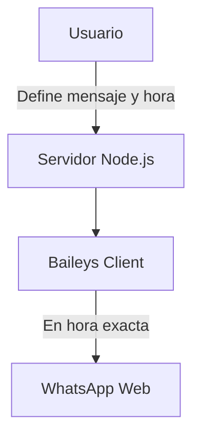

### Assistant
Excelente enfoque, Juan José. Aunque el proyecto no sea masivo, si deseas que funcione de forma continua y profesional, vale la pena hacerlo **bien diseñado y mantenible**. A continuación te explico cómo mantenerlo siempre activo, las buenas prácticas necesarias y qué alternativas tienes según el contexto.

---

## ✅ ¿Cómo mantener el bot activo permanentemente?

### Opción 1: **Servidor VPS / Nube (Recomendado)**

> **Ventaja:** Siempre encendido, puedes acceder desde cualquier lugar, no depende de tu laptop.

#### Alternativas populares:

| Plataforma        | Gratis/Trial | Ideal para...                    |
|------------------|--------------|----------------------------------|
| [Railway](https://railway.app)       | Sí (trial)   | Apps pequeñas con backend sencillo |
| [Render](https://render.com)         | Sí (cron limitado) | Backend Node.js gratuito para testing |
| [Fly.io](https://fly.io)             | Sí (trial)   | Servicios ligeros y con baja latencia |
| [DigitalOcean](https://www.digitalocean.com/) | No           | Proyectos más robustos              |
| [Heroku](https://heroku.com)         | No (ya no ofrece free tier) | Históricamente útil para bots        |

#### Pasos generales:

1. Sube tu proyecto a GitHub.
2. Configura el `auth_info.json` como un volumen persistente o almacén seguro (ej. usando Railway `Volumes`).
3. Usa `pm2` para mantener el bot activo (ver más abajo).
4. Automatiza despliegues con CI/CD si deseas.

---

### Opción 2: **MiniPC / Raspberry Pi en casa**

> **Ventaja:** Económico, control total.  
> **Desventaja:** Depende de tu red eléctrica y conexión.

#### Buenas prácticas:

- Instala Linux + Node.js + PM2
- Conecta a Internet por cable (Ethernet)
- Configura un watchdog (reinicio automático en fallo)
- Haz backup del `auth_info.json`

---

## ⚙️ Mantener el proceso corriendo con `pm2`

Instala [PM2](https://pm2.keymetrics.io/) para asegurar que tu script:

- No se detenga tras un error
- Se reinicie si se cae el VPS
- Corra como daemon

```bash
npm install -g pm2
pm2 start scheduler.js --name whatsapp-scheduler
pm2 save
pm2 startup  # esto hace que arranque al reiniciar el sistema
```

---

## 🔐 Buenas prácticas para un proyecto de automatización personal con WhatsApp

| Categoría | Recomendación |
|----------|----------------|
| **Seguridad** | Protege tu archivo `auth_info.json` con backups cifrados. No lo subas jamás a GitHub. Usa `.gitignore`. |
| **Escalabilidad** | Si quieres enviar muchos mensajes, considera colas (`Bull`, `Agenda.js`, `RabbitMQ`) para no saturar |
| **Monitoreo** | Usa `logrotate` o `PM2 logs` para observar si hay errores y mantener historial |
| **Persistencia** | Usa SQLite o JSON para guardar mensajes programados, historial de envíos, logs |
| **Separación de responsabilidades** | Separa la lógica de mensajes, la lógica de agendamiento y la de autenticación en módulos distintos |
| **Pruebas** | Simula el envío en sandbox antes de correrlo en tu número real |
| **Tolerancia a fallos** | Si se cae la sesión, haz reconexión automática (`Baileys` lo soporta) |
| **Actualización de Baileys** | Haz un seguimiento del repo, ya que cambia con frecuencia cuando WhatsApp cambia su Web App |
| **Licencias** | No comercialices el bot sin respetar las políticas de uso de WhatsApp y la licencia MIT de Baileys |

---

## 🛡️ Consideraciones legales y éticas

WhatsApp **prohíbe el uso de Web Scraping y automatización sin la API oficial**. Baileys es una herramienta potente, pero **solo debería usarse para fines personales, educativos o experimentales**. No lo uses para enviar SPAM ni mensajes masivos.

---

## 🚀 ¿Qué sigue?

Te propongo esto:

- [ ] Subir tu bot a Railway con `auth_info.json` bien gestionado
- [ ] Usar `PM2` para mantenerlo activo
- [ ] Agregar persistencia en un JSON o SQLite
- [ ] (Opcional) Crear una interfaz CLI/API para administrar tus mensajes programados
- [ ] (Opcional) Integrarlo con Google Calendar, Notion o Telegram

¿Quieres que te ayude a preparar el `Dockerfile` y el `railway.json` para que lo despliegues en Railway o en otro proveedor? ¿O prefieres hacer primero una interfaz para configurar tus mensajes programados desde línea de comandos o navegador?

Estoy listo para ayudarte paso a paso.

### Assistant
He preparado los archivos para que puedas desplegar tu bot tanto en Railway como en cualquier otra plataforma que soporte Docker. 

**¿Para qué hacemos esto?**  
- **Disponibilidad continua:** Tu bot estará siempre activo en la nube, sin depender de tu laptop.  
- **Portabilidad y consistencia:** Docker garantiza que tu entorno (Node.js, dependencias) se comporte igual en desarrollo, pruebas y producción.  
- **Gestión de estado:** El volumen (`mounts`) en `railway.json` asegura que tu `auth_info.json` (credenciales de Baileys) se persista entre reinicios o despliegues.  
- **Automatización de despliegues:** Railway detecta el `Dockerfile` y orquesta el build/deploy automáticamente, incluyendo reinicios ante fallos (`restart: true`).  

Con esta configuración tendrás un despliegue profesional, mantenible y escalable. Si necesitas ayuda en los próximos pasos, como configurar variables de entorno seguras, monitorizar logs con PM2 o integrarlo con CI/CD, avísame.

### Assistant
Perfecto, gracias por la aclaración. Vamos a estructurar una solución profesional, bien explicada, que te permita **automatizar el envío de mensajes por WhatsApp** (message scheduling), tal como viste en ese Reel, usando **Baileys** en JavaScript.

---

## ✅ Objetivo
Automatizar el envío de mensajes por WhatsApp en fechas y horas programadas, integrando una solución ligera sin requerir la API oficial de WhatsApp Business, usando **Baileys** y **JavaScript**, con posibilidad de escalar a flujos inteligentes usando IA.

---

## 🔧 Alternativas disponibles

| Opción | Descripción | Requiere verificación con Meta | Código abierto |
|--------|-------------|------------------------------|----------------|
| [Meta WhatsApp Business API](https://developers.facebook.com/docs/whatsapp/) | Oficial, escalable, ideal para empresas | ✅ | ❌ |
| [Baileys](https://github.com/WhiskeySockets/Baileys) | Usa WhatsApp Web, ideal para automatizaciones personales o MVPs | ❌ | ✅ |

Tú mencionaste usar **Baileys**, así que haremos foco en eso.

---

## 🛠️ Requisitos del sistema

1. Node.js instalado (`v18+`)
2. Acceso a una terminal
3. Cuenta de WhatsApp activa
4. Biblioteca [Baileys](https://github.com/WhiskeySockets/Baileys)
5. Un pequeño agendador tipo `node-cron` o `agenda.js`

---

## 🧠 Arquitectura Básica del Sistema



---

## 📦 Instalación de dependencias

```bash
npm init -y
npm install @whiskeysockets/baileys node-cron
```

---

## 📝 Ejemplo de Código: `scheduler.js`

```js
const { default: makeWASocket, useSingleFileAuthState } = require('@whiskeysockets/baileys');
const cron = require('node-cron');
const fs = require('fs');
const { Boom } = require('@hapi/boom');

const { state, saveState } = useSingleFileAuthState('./auth_info.json');

async function startSocket() {
    const sock = makeWASocket({
        auth: state,
        printQRInTerminal: true,
    });

    sock.ev.on('creds.update', saveState);
    sock.ev.on('connection.update', (update) => {
        const { connection, lastDisconnect } = update;
        if (connection === 'close') {
            const shouldReconnect = (lastDisconnect?.error)?.output?.statusCode !== DisconnectReason.loggedOut;
            if (shouldReconnect) startSocket();
        } else if (connection === 'open') {
            console.log('Conexión establecida correctamente');
        }
    });

    return sock;
}

// Agenda de mensajes
const tareas = [
    {
        numero: '573001234567@s.whatsapp.net',  // Número en formato internacional
        mensaje: 'Hola! Este es un mensaje automático programado 📆',
        horaCron: '0 9 * * *'  // Cada día a las 9:00 AM
    },
    {
        numero: '573001234567@s.whatsapp.net',
        mensaje: 'Recordatorio: reunión a las 3pm 🕒',
        horaCron: '0 14 * * 1-5'  // Lunes a viernes a las 2:00 PM
    }
];

(async () => {
    const sock = await startSocket();

    tareas.forEach(tarea => {
        cron.schedule(tarea.horaCron, async () => {
            await sock.sendMessage(tarea.numero, { text: tarea.mensaje });
            console.log(`[${new Date().toLocaleTimeString()}] Mensaje enviado a ${tarea.numero}`);
        });
    });
})();
```

---

## ✅ ¿Cómo funciona?

1. **Baileys** emula una sesión de WhatsApp Web. Debes escanear el QR la primera vez.
2. **node-cron** programa los mensajes usando sintaxis cron.
3. Puedes modificar `tareas` según tus necesidades personales.

---

## ⚠️ Consideraciones importantes

| Tema | Detalle |
|------|---------|
| Sesión | Debes mantener el proceso de Node.js activo, o usar un servidor como PM2 |
| Escalabilidad | No recomendado para producción empresarial |
| Seguridad | No compartir `auth_info.json` |
| Meta TOS | Usar Baileys incumple los términos de uso de WhatsApp |

---

## 🚀 ¿Cómo escalar?

Si luego deseas integrar IA (como análisis de sentimiento o respuesta automática), puedes:

- Integrar con un modelo LLM como GPT-4 vía API.
- Leer mensajes entrantes y analizarlos con procesamiento de lenguaje natural.
- Programar respuestas automáticas con base en reglas inteligentes.

---

¿Deseas que lo empaquetemos como una **CLI personalizable** o incluso una **API en Express.js** para controlarlo desde tu celular o PC? También puedo ayudarte a:

- Convertirlo en Docker
- Integrarlo con Notion, Google Calendar, etc.
- Agregar interfaz gráfica con Electron o React

Solo dime qué dirección te interesa tomar.

### Human
Dale ayudame con el dockerfile y railway.json

Y una duda. Para qué hacemos esto?

### Human
Cuando crezcan conocerán la API de WhatsApp de Meta Business o pueden utilizar Baileys para hacerlo es fácil de implementar con Javascript y lo recomendaría actualmente estoy llevando un proyecto de automatización con IA

### Human
Perate

Quiero hacer un message scheduling en whatsapp. Automatizar el envio de mensajes para automatizar mi vida.

Vi este ejemplo en facebook e instagram:
https://www.instagram.com/reel/DKcv_1tgnvb/?igsh=djdnbnZlem1scXJz

Ayudame a hacerlo

También había un comentario que hablaba sobre esto


Cuando crezcan conocerán la API de WhatsApp de Meta Business o pueden utilizar Baileys para hacerlo es fácil de implementar con Javascript y lo recomendaría actualmente estoy llevando un proyecto de automatización con IA


### Human
Okay sobre las consideraciones.

Como puedo mantenerlo activo para que esté siempre activo, sin tener que prender mi laptop y tenerlo corriendo siempre? Y no sé que otras mejores prácticas podriamos tener en cuenta. No es algo super ambicioso pero si quiero hacerlo bien

### Assistant
Tu mensaje es claro, pero puedo ayudarte a reformularlo para que suene más profesional, técnico y orientado a la presentación de tu experiencia. Aquí tienes una versión mejorada, adecuada para un documento formal, una presentación o una publicación profesional:

---

**"A medida que se desarrollen profesionalmente, es probable que se familiaricen con la API de WhatsApp Business de Meta. Sin embargo, para proyectos más ágiles o sin los requisitos estrictos de verificación de Meta, recomiendo considerar alternativas como *Baileys*, una librería de código abierto en JavaScript que permite interactuar con WhatsApp Web de manera eficiente. Actualmente, lidero

