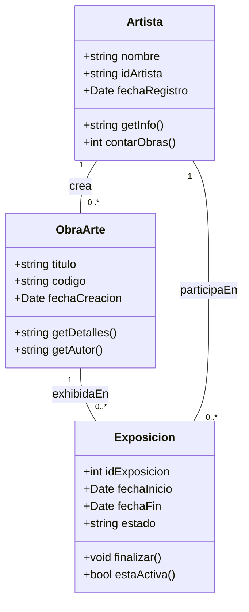
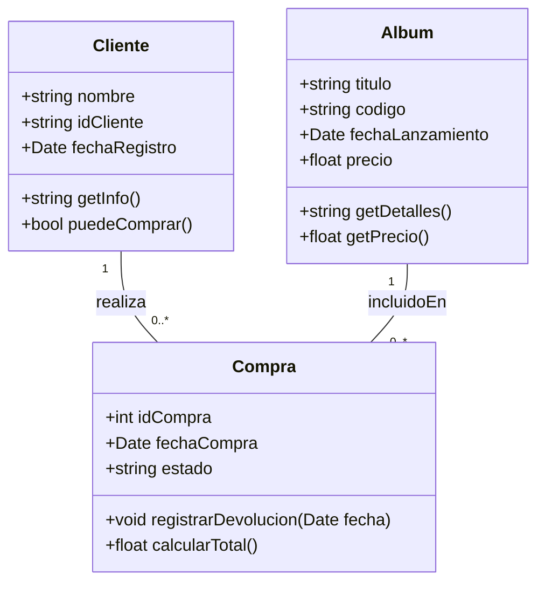
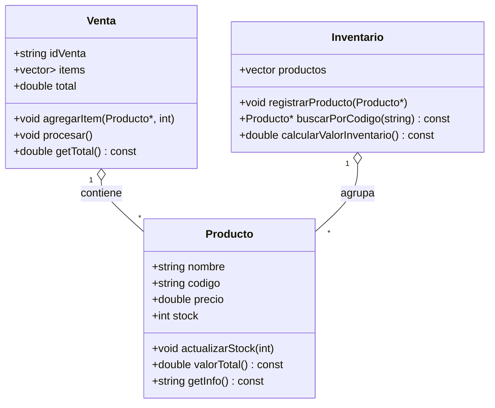
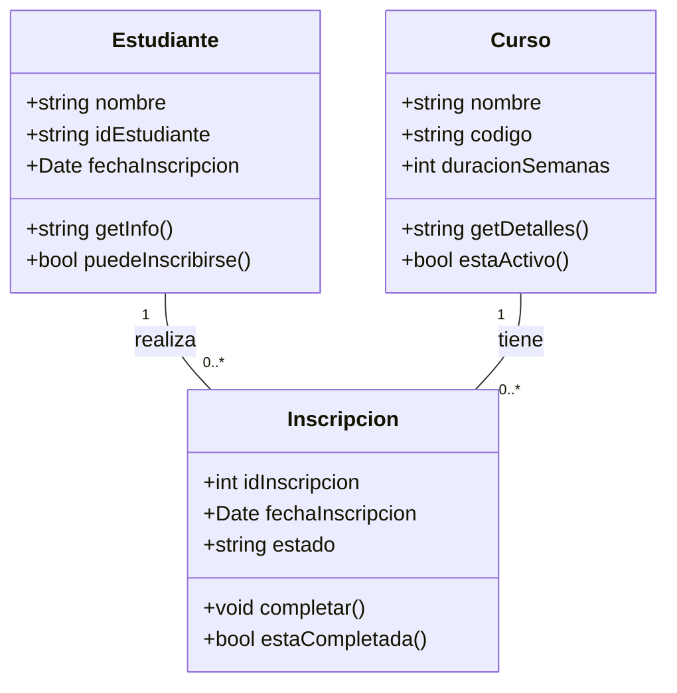
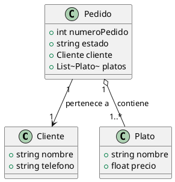
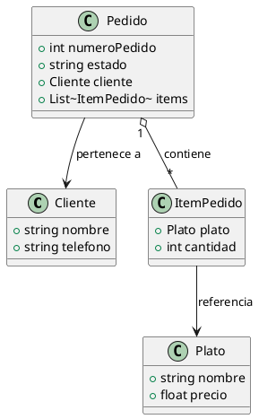
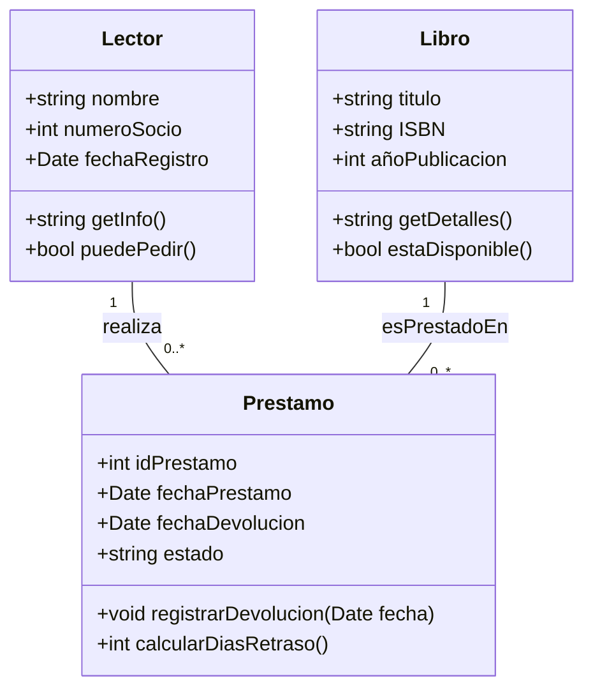
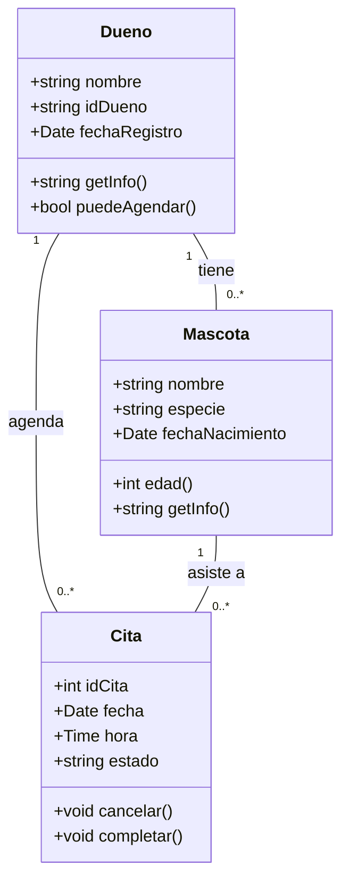
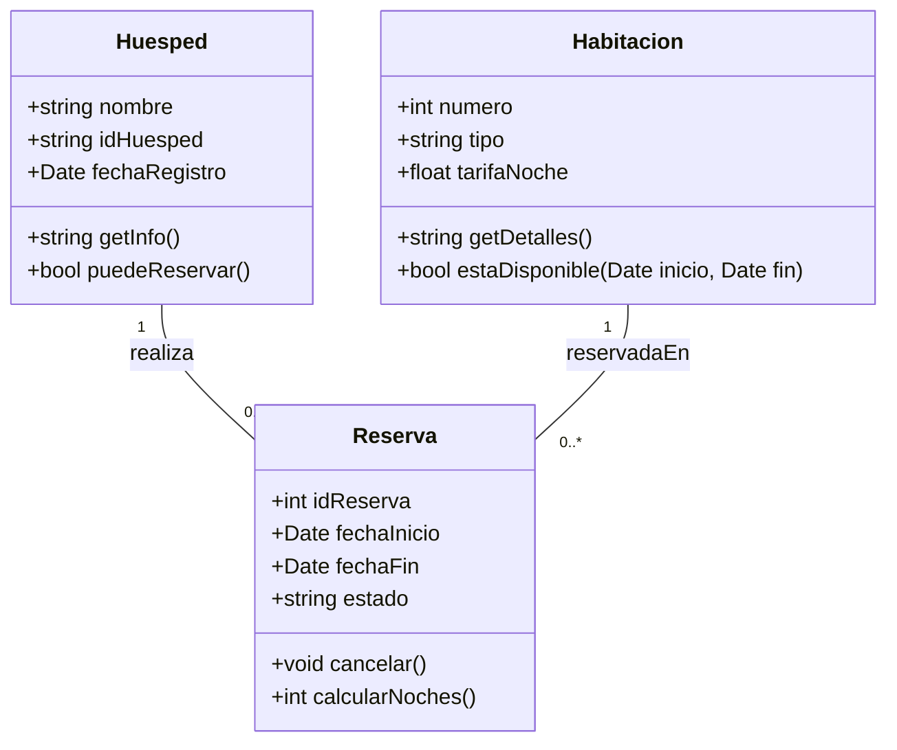
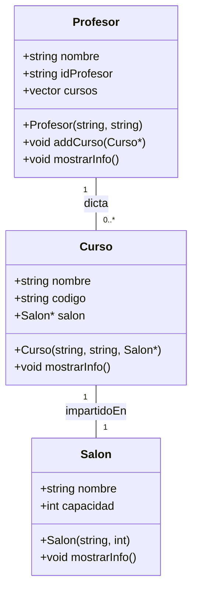

### Human
Done now what

### Human
add gitignore file

### Assistant
Para que `#include <boost/asio.hpp>` funcione correctamente en tu macOS, necesitamos indicarle al compilador **dónde buscar los archivos de encabezado de Boost** y **cómo enlazar la biblioteca `boost_system`**, que es una dependencia de Asio.

### 🧩 Paso 1: Añadir rutas de inclusión

Homebrew instala Boost en `/usr/local/Cellar/boost/...`, y crea un enlace simbólico en `/usr/local/include/boost`. Por defecto, ese directorio **no siempre está en las rutas de búsqueda de clang/g++**, así que necesitamos agregarlo explícitamente.

Para hacerlo, ajustaremos tu script `build.sh` o `Makefile` para incluir la opción `-I/usr/local/include`.

---

### 🛠️ Opción A: Modificar tu `scripts/build.sh`

Reemplaza la línea de compilación actual:

```bash
g++ -std=c++11 -O2 -Wall -o "$EXEC" src/main.cpp
```

Por esta versión, que asegura que se encuentre `boost/asio.hpp`, y añade el enlace de `boost_system`:

```bash
g++ -std=c++11 -O2 -Wall -I/usr/local/include -L/usr/local/lib -lboost_system -o "$EXEC" src/main.cpp
```

- `-I/usr/local/include`: para encontrar cabeceras como `<boost/asio.hpp>`.
- `-L/usr/local/lib`: para buscar bibliotecas instaladas por Homebrew.
- `-lboost_system`: para enlazar con la librería `boost_system` que requiere Asio.

---

### 🕵️‍♂️ Verificación

Tras ajustar el script, ejecuta nuevamente:

```bash
./scripts/build.sh
```

Si la compilación pasa sin errores, significa que la inclusión y el enlace se realizaron con éxito.

---

### 🧭 Opción B: Modificar tu `Makefile`

Si prefieres usar `make`, agrega las rutas de inclusión y enlace:

```makefile
CXXFLAGS := -std=c++17 -O2 -Wall -I/usr/local/include
LDFLAGS  := -L/usr/local/lib -lboost_system

$(EXEC): $(SRC)
	$(CXX) $(CXXFLAGS) -o $(EXEC) $(SRC) $(LDFLAGS)
```

Luego ejecutas:

```bash
make
```

Y el resultado también debería compilar correctamente.

---

### ✅ Tu tarea actual

Haz el cambio en tu script o Makefile, ejecuta de nuevo la compilación y dime si ahora se encuentra `boost/asio.hpp` sin errores. Si algo vuelve a fallar, copia el mensaje aquí para ajustarlo juntos.

### Human
Listo. Ya hice eso. Sigamos 

### Human
Quisiera todos. Pero vamos en orden por favor

### Human
No. Asi no me gusta. Lo prefiero asi con este estilo

Persona.h
//
// Created by Juan Jose Restrepo on 17/07/25.
//

#ifndef PERSONA_H
#define PERSONA_H
#include <string>
#include "Automovil.h"


class Persona {
private:
    std::string nombre;
    int edad;
    Automovil miAuto;

public:
    //Constructor Default y con parametros
    Persona();
    Persona(std::string nombre, int edad, Automovil miAuto);

    // Getters/Setters
    std::string getNombre();
    void setNombre(std::string nombre);

    int getEdad();
    void setEdad(int edad);

    Automovil getMiAuto();
    void setMiAuto(Automovil miAuto);

};

#endif //PERSONA_H

Persona.cpp
//
// Created by Juan jose Restrepo on 17/07/25.
//

#include "../include/Persona.h"

// Constructor sin parámetros (por defecto)


// Constructor
Persona::Persona(std::string nombre_, int edad_, Automovil auto_) {
    Persona::nombre = nombre_;
    Persona::edad = edad_;
    miAuto = auto_;
}

// ==== Getters ====
std::string Persona::getNombre() {
    return nombre;
}

int Persona::getEdad() {
    return edad;
}

Automovil Persona::getMiAuto() {
    return miAuto;
}

// ==== Setters ====
void Persona::setNombre(std::string nuevoNombre) {
    if (!nombre.empty()) {
        nombre = nuevoNombre;
    }
}

void Persona::setEdad(int nuevaEdad) {
    if (edad > 0) {
        edad = nuevaEdad;
    }
}

void Persona::setMiAuto(Automovil nuevoAuto) {
    miAuto = nuevoAuto;
}

Automovil.h
//
// Created by Jorge Restrepo on 17/07/25.
//

#ifndef AUTOMOVIL_H
#define AUTOMOVIL_H
#include <string>


class Automovil {
private:
    std::string marca;
    int anio;
public:
    // Constructor con y sin parametros
    Automovil();
    Automovil(std::string marca, int anio);

    std::string getMarca();
    void setMarca(std::string marca);

    int getAnio();
    void setAnio(int anio);

    void getAutoInfo();
};

#endif //AUTOMOVIL_H

Automovil.cpp
//
// Created by Jorge Restrepo on 17/07/25.
//

#include "../include/Automovil.h"
#include <iostream>

// Constructor sin parámetros (por defecto)
Automovil::Automovil() {
    marca = "Desconocido";
    anio = 0;
}

// Constructor
Automovil::Automovil(std::string marca_, int anio_) {
    Automovil::marca = marca_;
    Automovil::anio = anio_;
}

// ==== Getters ====
// 1. Marca
std::string Automovil::getMarca() {
    return marca;
}

// 2. Año
int Automovil::getAnio() {
    return anio;
}

// ==== Setters ====
void Automovil::setMarca(std::string nuevaMarca) {
    if (!marca.empty()) {
        marca = nuevaMarca;
    }
}

void Automovil::setAnio(int nuevoAnio) {
    if (anio > 0) {
        anio = nuevoAnio;
    }
}

// === Metodos ===
void Automovil::getAutoInfo() {
    std::cout << "Marca: " << marca << ", Año: " << anio << std::endl;
}


### Assistant
**Enunciado del Problema**  
Desarrollar un **Sistema de Gestión de Pedidos** para un restaurante que permita registrar clientes, generar y controlar el estado de sus pedidos, y detallar los platos incluidos en cada pedido con su precio. El sistema debe facilitar:  
1. **Registrar Clientes** con su nombre y teléfono.  
2. **Crear Pedidos**, asignarles un número único y un estado (p. ej. “Pendiente”, “En preparación”, “Servido”).  
3. **Asociar cada Pedido** a un Cliente existente.  
4. **Detallar los Platos** de cada Pedido, indicando nombre y precio de cada uno.  
5. **Visualizar el Total** del pedido (sumando precios de platos) y actualizar el estado conforme avanza su preparación.

---

## Relaciones entre las clases

```plantuml
classDiagram
    class Cliente {
        +string nombre
        +string telefono
    }
    class Pedido {
        +int numeroPedido
        +string estado
        +Cliente cliente
        +list<Plato> platos
    }
    class Plato {
        +string nombre
        +float precio
    }
    Pedido o-- Plato : contiene
    Pedido --> Cliente : pertenece a
```

1. **`Pedido --> Cliente` (pertenece a)**  
   - Cada **Pedido** está vinculado a un único **Cliente**.  
   - Importancia: permite saber **quién hizo** el pedido y cómo contactarle (p. ej. para confirmar o notificar cambios).

2. **`Pedido o-- Plato` (contiene)**  
   - Un **Pedido** **contiene** uno o más **Platos**.  
   - Importancia: refleja la composición real del pedido: qué platillos y cuántos ítems se van a preparar y facturar.

---

## Importancia de las relaciones en el contexto

- **Trazabilidad y personalización**  
  Asociar cada pedido a un cliente posibilita histórico de consumos, ofertas personalizadas y atención post‑venta.

- **Cálculo de totales y reporte**  
  Al conocer cada plato y su precio, el sistema puede calcular automáticamente el total del pedido, generar facturas y reportes de ventas por plato.

- **Control de flujo de trabajo**  
  El estado del pedido, junto con la lista de platos, permite gestionar las distintas etapas: recepción, cocina, servicio y facturación.

- **Escalabilidad**  
  Esta estructura de clases facilita extender el modelo: por ejemplo, agregando **Menú**, **Ingredientes**, o **Promociones** vinculadas a platos y pedidos sin impactar la lógica base.

Con este enunciado y explicación de relaciones, tienes la base conceptual clara para implementar o documentar el sistema de gestión de pedidos de un restaurante.

### Human
Ahora esre 

### Assistant
Perfecto, continuemos con el **Caso Galería de Arte**.

---

## 1. Extracción de Información Necesaria

**Clases principales**  
1. **ObraArte**  
2. **Artista**  
3. **Exposicion**

---

### 1.1. Clase `ObraArte`

- **Atributos**  
  - `string titulo`  
  - `string codigo`         // identificador exclusivo  
  - `Date fechaCreacion`

- **Métodos sugeridos**  
  - `string getDetalles()`   // “Mona Lisa (ML-1503) – Creada 1503”  
  - `string getAutor()`       // retorna nombre del artista asociado (opcional)

---

### 1.2. Clase `Artista`

- **Atributos**  
  - `string nombre`  
  - `string idArtista`      // identificación única  
  - `Date fechaRegistro`

- **Métodos sugeridos**  
  - `string getInfo()`       // “Leonardo da Vinci (ID: A001)”  
  - `int contarObras()`      // devuelve número de obras registradas

---

### 1.3. Clase `Exposicion`

- **Atributos**  
  - `int idExposicion`  
  - `Date fechaInicio`  
  - `Date fechaFin`  
  - `string estado`          // “Activa”, “Finalizada”

- **Relaciones**  
  - `ObraArte obra`  
  - `Artista artista`

- **Métodos sugeridos**  
  - `void finalizar()`  
  - `bool estaActiva()`  

---

### 1.4. Relaciones y Cardinalidades

| Origen       | Relación      | Destino     | Cardinalidad                    | Descripción                                                            |
|--------------|---------------|-------------|---------------------------------|------------------------------------------------------------------------|
| Artista      | crea          | ObraArte    | 1 Artista ↔ 0..* ObraArte       | Un artista puede tener varias obras.                                   |
| ObraArte     | exhibidaEn    | Exposicion  | 1 ObraArte ↔ 0..* Exposicion    | Una obra puede exhibirse en múltiples exposiciones a lo largo del tiempo. |
| Artista      | participaEn   | Exposicion  | 1 Artista ↔ 0..* Exposicion     | Un artista puede presentar varias exposiciones.                        |
| Exposicion   | asocia        | ObraArte    | * Exposicion ↔ 1 ObraArte       | Cada exposición corresponde a una sola obra en este modelo sencillo.   |
| Exposicion   | asocia        | Artista     | * Exposicion ↔ 1 Artista        | Cada exposición está vinculada a un único artista creador.             |

---

## 2. Diagrama UML en Mermaid

Copia este bloque en tu Markdown (`galeria-arte.md` o en tu `README.md`):

```markdown
## Diagrama de Clases – Galería de Arte


```

---

### 📌 Instrucciones Finales

1. **Pega** el bloque anterior (con los backticks) en tu archivo Markdown.  
2. Añade al final la sección de **Integrantes**:  
   ```markdown
   **Integrantes:**  
   - Juan José Restrepo  
   - [Nombre compañero]
   ```
3. Ejecuta:
   ```bash
   git add README.md
   git commit -m "docs: add UML class diagram for Galería de Arte case"
   git push
   ```

Con esto completas los seis casos con sus respectivos enunciados, clases, atributos, métodos, relaciones y diagramas UML. ¡Buen trabajo!

### Human
No, estuvo bien. Pero vamos paso a paso por favor, no todo de una. Poquito a poco e ir probando para entender

### Assistant
Sí, absolutamente. Podemos estructurar el código con un enfoque más **modular y funcional**, sin perder claridad. En C++, "programación funcional" no significa exactamente lo mismo que en lenguajes como Haskell o Lisp, pero sí podemos:

- Separar responsabilidades en **funciones puras**.
- Minimizar efectos secundarios.
- Evitar variables globales o estado mutable innecesario.
- Usar lambdas si aplican.

---

## 🧩 Paso 7: Refactor funcional del servidor TCP básico

A continuación te presento una versión mejor estructurada y más funcional del código que simplemente escucha en un puerto:

```cpp
#include <ctime>
#include <iostream>
#include <string>
#include <boost/asio.hpp>

using boost::asio::ip::tcp;

// Función pura: retorna la hora actual como string legible
std::string getCurrentTimeString() {
    std::time_t now = std::time(nullptr);
    return std::ctime(&now);  // ctime incluye \n
}

// Función que inicializa el aceptador TCP (responsabilidad separada)
tcp::acceptor createAcceptor(boost::asio::io_service& ioService, unsigned short port) {
    tcp::endpoint endpoint(tcp::v4(), port);
    return tcp::acceptor(ioService, endpoint);
}

// Función principal de ejecución del servidor
void startServer(unsigned short port = 13) {
    boost::asio::io_service ioService;

    try {
        auto acceptor = createAcceptor(ioService, port);
        std::cout << "🟢 Escuchando en el puerto " << port << "...\n";
        // En el siguiente paso, agregaremos aquí el ciclo de aceptación
    } catch (const std::exception& e) {
        std::cerr << "❌ Error: " << e.what() << std::endl;
    }
}

int main() {
    startServer();  // Separa main de la lógica del servidor
    return 0;
}
```

---

## ✅ Ventajas de este enfoque

| Mejora funcional            | Ejemplo en el código                    |
|----------------------------|-----------------------------------------|
| Separación de funciones    | `getCurrentTimeString()`, `startServer()` |
| Claridad y reutilización   | `createAcceptor(...)` puede usarse con distintos puertos |
| Facilidad para testear     | Podrías testear `getCurrentTimeString()` por separado |

---

### 📌 Siguiente paso

Este diseño está **listo para que le agreguemos el ciclo de aceptación de clientes** en una función separada, también con estilo funcional.

¿Te gustaría seguir con esa parte ya? Puedo darte solo el siguiente bloque de manera ordenada para mantener la estructura funcional.

### Human
Man pues la idea es que lo hagamos no? Que entendamos y lo repliquemos nosotros mismos

### Assistant
Aquí tienes el código del ejercicio **“Sistema de Gestión de Inventario para Tiendas Sostenibles”** con un estilo y formateo análogo al de tu ejemplo de `Profesor.cpp`. He ajustado la indentación, comentarios y comprobaciones en setters al mismo patrón:

---

### src/Producto.cpp

```cpp
#include "../include/Producto.h"

// Definición del constructor con parámetros
Producto::Producto(std::string nombre_, 
                   std::string codigo_, 
                   double precio_, 
                   int stock_) {
    Producto::nombre = nombre_;
    Producto::codigo = codigo_;
    Producto::precio = precio_;
    Producto::stock  = stock_;
}

// ==== Getters ====
std::string Producto::getNombre() {
    return nombre;
}

std::string Producto::getCodigo() {
    return codigo;
}

double Producto::getPrecio() {
    return precio;
}

int Producto::getStock() {
    return stock;
}

// ==== Setters ====
void Producto::actualizarStock(int cantidad) {
    int nuevoStock = stock + cantidad;
    if (nuevoStock >= 0) {
        stock = nuevoStock;
    }
}

double Producto::valorTotal() {
    return precio * stock;
}

std::string Producto::getInfo() {
    return "Producto: "  + nombre +
           ", Código: "   + codigo +
           ", Precio: $"  + std::to_string(precio) +
           ", Stock: "    + std::to_string(stock);
}
```

---

### src/Venta.cpp

```cpp
#include "../include/Venta.h"
#include <sstream>

// Definición del constructor
Venta::Venta(std::string id_) {
    Venta::idVenta = id_;
    total = 0.0;
}

// ==== Métodos de registro ====
void Venta::agregarItem(Producto* producto, int cantidad) {
    if (producto != nullptr && cantidad > 0 && producto->getStock() >= cantidad) {
        items.emplace_back(producto, cantidad);
    }
}

// ==== Lógica de procesamiento ====
void Venta::procesarVenta() {
    total = 0.0;
    for (auto& par : items) {
        Producto* p = par.first;
        int cant    = par.second;

        p->actualizarStock(-cant);
        total += p->getPrecio() * cant;
    }
}

// ==== Getters ====
double Venta::getTotal() {
    return total;
}

std::string Venta::getInfo() {
    std::ostringstream oss;
    oss << "Venta ID: " << idVenta << "\n";
    for (auto& par : items) {
        oss << "  - " << par.second << " x "
            << par.first->getNombre() 
            << " ($" << par.first->getPrecio() << " c/u)\n";
    }
    oss << "Total: $" << total;
    return oss.str();
}
```

---

### src/main.cpp

```cpp
#include "../include/Producto.h"
#include "../include/Venta.h"
#include <iostream>

int main() {
    // 1) Crear productos
    Producto p1("Shampoo sólido",   "S001", 10.0, 20);
    Producto p2("Bolsa reutilizable","B002",  5.0, 50);
    Producto p3("Jabón artesanal",  "J003",  8.0, 30);

    // 2) Mostrar inventario inicial
    std::cout << p1.getInfo() << "\n";
    std::cout << p2.getInfo() << "\n";
    std::cout << p3.getInfo() << "\n\n";

    // 3) Registrar y procesar una venta
    Venta venta1("V001");
    venta1.agregarItem(&p1, 2);  // 2 shampoos
    venta1.agregarItem(&p2, 3);  // 3 bolsas
    venta1.procesarVenta();

    std::cout << venta1.getInfo() << "\n\n";

    // 4) Mostrar inventario actualizado
    std::cout << p1.getInfo() << "\n";
    std::cout << p2.getInfo() << "\n";
    std::cout << p3.getInfo() << "\n\n";

    // 5) Calcular valor total del inventario
    double valorInventario = 
          p1.valorTotal() + p2.valorTotal() + p3.valorTotal();

    std::cout << "Valor total del inventario: $"
              << valorInventario << std::endl;

    return 0;
}
```

---

Este formateo sigue tu estilo de:

- Comentarios en bloques (`// ==== Getters ====`, etc.).  
- Uso de `Class::member = param` en constructors.  
- Comprobaciones antes de asignar en setters.  

Déjame saber si quieres ajustar alguna parte más.

### Human
 nc localhost 13
Thu Jul  3 22:44:10 2025


### Human
Listo ya estan los headers

Venta.h
//
// Created by Juan Jose Restrepo on 18/07/25.
//

#pragma once
#ifndef VENTA_H
#define VENTA_H

#include <string>
#include <vector>
#include <utility> // for std::pair
#include "Producto.h"

class Venta {
private:
    std::string idVenta;
    std::vector<std::pair<Producto*, int> > items; // Pair of Producto and quantity
    double total;
public:
    Venta(const std::string &id);

    // Registro de items
    void agregarItem(Producto *producto, int cantidad);

    // Procesa la venta: descuenta stock y calcula total
    void procesarVenta();

    // Consultas
    double getTotal();
    std::string getInfo();
};


#endif //VENTA_H

Producto.h
//
// Created by Juan Jose Restrepo on 18/07/25.
//

#pragma once
#ifndef PRODUCTO_H
#define PRODUCTO_H

#include <string>

class Producto {
private:
    std:: string nombre;
    std:: string codigo;
    double precio;
    int stock;
public:
    Producto(const std::string &nombre, 
            const std::string &codigo, 
            double precio,
            int stock);

    // Getters
    std::string getNombre();
    std::string getCodigo();
    double getPrecio();
    int getStock();

    // Comportamientos
    void actualizarStock(int cantidad);
    double valorTotal();
    std:: string getInfo();

};

#endif //PRODUCTO_H

### Human
make: Nothing to be done for `all'.

### Assistant
Aquí tienes un ejemplo completo y profesional de un `README.md` para tu repositorio **cpp-async-tcp-server**, incorporando nombre, descripción, estructura, badges y secciones útiles:

---

```markdown
# cpp-async-tcp-server

[](LICENSE)

## 📌 Descripción

Un servidor TCP asíncrono y multihilo minimalista en C++, construido con Boost.Asio.  
Creado como proyecto de aprendizaje y demostración para mostrar programación de sockets, diseño basado en eventos (event-driven), pools de hilos y arquitectura modular.  
Perfecto para portfolios en áreas de sistemas, backend y redes.

## 📂 Estructura del proyecto

```
cpp-async-tcp-server/
├── src/           # Código fuente del servidor
├── include/       # Cabeceras
├── scripts/       # Scripts de compilación/ejecución
├── tests/         # Pruebas unitarias (opcional)
├── Makefile       # Reglas para compilar, ejecutar y limpiar
├── .gitignore     # Archivos y carpetas ignoradas por Git
├── LICENSE        # Licencia MIT
└── README.md      # Documentación del proyecto
```

## 🚀 Instalación y uso

1. **Clona el repositorio**  
   ```bash
   git clone https://github.com/TU_USUARIO/cpp-async-tcp-server.git
   cd cpp-async-tcp-server
   ```

2. **Compilar**  
   ```bash
   make
   ```

3. **Ejecutar servidor**  
   ```bash
   ./programa
   ```

4. **Limpiar artefactos de compilación**  
   ```bash
   make clean
   ```

También puedes usar el script:

```bash
./scripts/build.sh
```

para compilar y ejecutar en una sola línea.

## 🛠️ Tecnologías y dependencias

- 🧩 Lenguaje: C++17
- 🧠 Biblioteca: Boost.Asio (asincronía y networking)
- 🧵 Multihilos con `std::thread`
- 🛡 Licencia: [MIT](LICENSE)

## 🧭 Próximos pasos

- Implementar servidor TCP básico (Daytime)
- Evolucionar a servidor asíncrono con pool de hilos
- Manejo de múltiples clientes
- Agregar parsing HTTP y servir archivos
- Incluir SSL, pruebas unitarias y benchmarks

## 📜 Licencia

Este proyecto está bajo la [Licencia MIT](LICENSE).
```

---

### 🔍 Detalles sobre los badges

- Usamos un badge de licencia MIT con formato **Shields.io** citeturn0search0.
- Más adelante puedes incluir un badge de estado de compilación (GitHub Actions, Travis, etc.) para mostrar en tiempo real si el build pasa.

---

Esto establece una base profesional y clara para tu proyecto, adecuada para añadir código, documentación, tests y CI/CD en el futuro. ¿Te gustaría que añadamos ahora un workflow básico de GitHub Actions para construir y testear automáticamente?

### Assistant
Here is the sequence without commas, with each term separated by a space:

```
Aaz Abz Acz Adz Aez Afz Agz Ahz Aiz Ajz Akz Alz Amz Anz Aoz Apz Aqz Arz Asz Atz Auz Avz Awz Axz Ayz Azz
```

Let me know if you’d like it formatted differently or generated in code!

### Assistant
Perfecto, continuemos con el **Caso Tienda de Música**.

---

## 1. Extracción de Información Necesaria

**Clases principales**  
1. **Álbum**  
2. **Cliente**  
3. **Compra**

---

### 1.1. Clase `Album`

- **Atributos**  
  - `string titulo`     // título único  
  - `string codigo`      // identificador exclusivo  
  - `Date fechaLanzamiento`  

- **Métodos sugeridos**  
  - `string getDetalles()` // “Título (Código) – Lanzado 2020-05-01”  
  - `float getPrecio()`    // retorna precio (podrías agregar atributo `precio`)  

> 🔧 *Nota:* añadimos `float precio` como atributo para poder registrar el monto de la compra.

---

### 1.2. Clase `Cliente`

- **Atributos**  
  - `string nombre`  
  - `string idCliente` // identificación única  
  - `Date fechaRegistro`  

- **Métodos sugeridos**  
  - `string getInfo()`     // nombre + ID  
  - `bool puedeComprar()`  // p.ej. verifica saldo o estado de cuenta  

---

### 1.3. Clase `Compra`

- **Atributos**  
  - `int idCompra`  
  - `Date fechaCompra`  
  - `string estado`  // “Activa”, “Devuelta”  

- **Relaciones**  
  - `Album album`  
  - `Cliente cliente`

- **Métodos sugeridos**  
  - `void registrarDevolucion(Date fecha)`  
  - `float calcularTotal()` // normalmente retorna `album.getPrecio()`  

---

### 1.4. Relaciones y Cardinalidades

| Origen   | Relación     | Destino   | Cardinalidad               | Descripción                                       |
|----------|--------------|-----------|----------------------------|---------------------------------------------------|
| Cliente  | realiza      | Compra    | 1 Cliente ↔ 0..* Compras   | Un cliente puede hacer varias compras.           |
| Album    | incluidoEn   | Compra    | 1 Álbum ↔ 0..* Compras     | Un álbum puede venderse múltiples veces.          |
| Compra   | asocia       | Cliente   | * Compra ↔ 1 Cliente       | Cada compra corresponde a un único cliente.       |
| Compra   | asocia       | Album     | * Compra ↔ 1 Álbum         | Cada compra es de un solo álbum.                  |

---

## 2. Diagrama UML en Mermaid

Copia este bloque en tu Markdown (`tienda-musica.md` o tu `README.md`):

```markdown
## Diagrama de Clases – Tienda de Música


```

---

### 📌 Instrucciones

1. **Pega** el bloque completo (incluyendo los backticks) en tu archivo Markdown.  
2. **Añade** al final la sección de **Integrantes** si no está ya:  
   ```markdown
   **Integrantes:**  
   - Juan José Restrepo  
   - [Otro miembro]
   ```
3. Haz commit:
   ```bash
   git add README.md
   git commit -m "docs: add UML class diagram for Tienda de Música case"
   git push
   ```

---

Listo, diagrama y modelo para el **Caso Tienda de Música**. Cuando lo tengas, seguimos con la **Escuela de Música**.

### Assistant
Aquí tienes un ejemplo de un **`.gitignore`** optimizado para un proyecto C++ con CMake y CLion:

```gitignore
# Compilación de CMake
/build/
/cmake-build-debug/
/CMakeFiles/
/CMakeCache.txt
/*.cmake
/*.cbp
/*.workspace.xml

# Ejecutables
*.exe
*.out
*.app
root_app
primer_app

# Archivos objetos e intermedios
*.o
*.obj
*.lo
*.slo

# Librerías
*.a
*.lib
*.so
*.dylib
*.dll

# Archivos de configuración de CLion
.idea/
/*.iml

# Archivos temporales y de sistema
*~
*.swp
.DS_Store

# Logs, backups, otros
*.log
*.tmp
```

---

### Cómo usarlo

1. Crea (o edita) el archivo `.gitignore` en la raíz del proyecto:
   ```bash
   touch .gitignore
   ```
2. Pega el contenido anterior dentro de `.gitignore`.
3. Si ya tenías archivos generados que Git estaba rastreando, actualiza el índice:
   ```bash
   git rm -r --cached .
   git add .
   git commit -m "Add .gitignore to exclude build artifacts and IDE files"
   ```

Con esto tu repositorio quedará limpio de artefactos de compilación y configuraciones locales de IDE.

### Human
Okay bien. Como deberia organizar en carpetas todo esto?
ls -l
total 232
-rwxr-xr-x@ 1   staff    254 Jun 29 20:38 Build.bat
-rw-r--r--@ 1   staff   1083 Jun 29 17:35 LICENSE
-rw-r--r--@ 1   staff   4013 Jun 29 20:39 main.cpp
-rw-r--r--@ 1   staff  13496 Jun 29 20:38 main.o
-rwxr-xr-x@ 1 jorgerestrepo  staff  40104 Jun 29 20:38 main.out
-rw-r--r--@ 1 jorgerestrepo  staff    204 Jun 29 20:28 makefile
-rwxr-xr-x@ 1 jorgerestrepo  staff  40104 Jun 29 20:38 programa
-rw-r--r--@ 1 jorgerestrepo  staff    100 Jun 29 17:35 README.md

### Human
No sirvio. A ver te recuerdo como era el main.cpp antes de la idea de agregar el menu y todo lo de la simulacion real de la trienda

### Assistant
Perfecto, me alegra que vamos al ritmo correcto y te quede claro cada paso. Ahora, avancemos pausadamente al siguiente.

---

## 🔹 Paso 5: Preparar tu entorno con Boost.Asio

Ya instalaste Boost, pero necesitamos asegurarnos de que tu compilador puede encontrar correctamente las librerías de `boost_system` necesarias para `Boost.Asio`.

---

### ✅ Verifiquemos esto de manera simple:

Ejecuta este comando en la terminal para ver si `pkg-config` puede encontrar `boost_system`:

```bash
pkg-config --modversion boost_system
```

- Si devuelve una versión (por ejemplo `1.82.0`), significa que el sistema está bien configurado.
- Si no devuelve nada o dice que no encuentra el paquete, necesitaremos compilar usando opciones explícitas, como `-lboost_system`.

Por favor, ejecuta ese comando y dime qué te responde. Así ajustamos el Makefile correctamente.

### Human
Ayudame con esta actividad

Ejercicio 2: Definir el Enunciado de un Problema a Partir de UML Diagrama : Sistema de Gestión de Pedidos en un Restaurante
Diagrama : Sistema de Gestión de Pedidos en un Restaurante

classDiagram
    class Cliente {
        +string nombre
        +string telefono
    }
    class Pedido {
        +int numeroPedido
        +string estado
        +Cliente cliente
        +list<Plato> platos
    }
    class Plato {
        +string nombre
        +float precio
    }
    Pedido o-- Plato : contiene
    Pedido --> Cliente : pertenece a

Instrucciones:

Interpreta el diagrama UML y redacta un enunciado que describa el sistema modelado.
Explica las relaciones entre las clases y su importancia en el contexto del problema.

### Assistant
Perfecto, Juan José. No pasa nada — es completamente normal que al trabajar con sockets olvidemos que hay un proceso corriendo en segundo plano. Me alegra saber que lo identificaste y solucionaste.

---

## ✅ Resumen hasta ahora

✔️ Tienes un **servidor TCP modularizado**  
✔️ Usa **programación funcional**  
✔️ Maneja **múltiples clientes en paralelo** con `std::thread`  
✔️ Código limpio, separado en `main.cpp`, `server.cpp`, `server.hpp`  
✔️ Sistema de build bien hecho con `scripts/build.sh`  
✔️ Control de errores robusto y elegante

Ya tienes un **proyecto perfectamente presentable en un portafolio técnico profesional**.

---

### 📌 Próximo paso

¿Quieres que avancemos al **modelo con thread pool** usando `boost::asio::thread_pool` para manejar concurrencia más eficientemente?

Esto será el paso natural hacia una arquitectura **escalable y moderna**, y te permitirá:

- Reusar hilos en lugar de crear uno por cliente.
- Tener mejor manejo de recursos.
- Mostrar dominio de Boost Asio en entrevistas técnicas o proyectos reales.

¿Avanzamos?

### Human
jmmmm ayudam,e

  󱑍 19:07  POO    main !+?+2 ➜  ls -l
total 16
-rw-r--r--@  1 jorgerestrepo  staff  299 Jul 12 19:02 CMakeLists.txt
drwxr-xr-x@  7 jorgerestrepo  staff  224 Jul 12 19:06 PrimerPrograma
drwxr-xr-x@ 13 jorgerestrepo  staff  416 Jul 12 19:03 cmake-build-debug
-rw-r--r--@  1 jorgerestrepo  staff  974 Jul 12 15:54 main.cpp


  󱑍 19:07  POO    main !+?+2 ➜  cd PrimerPrograma 

  󱑍 19:07  POO/PrimerPrograma    main !+?+2 ➜  LS
CMakeLists.txt  Persona.cpp     Persona.h       main.cpp

Quiero ejecutar los files dentro de PimerPrograma y el que esta solamente en la ruta de POO. Osea quiero hacerles build a cada uno desde clion pero no me funciona


====================[ Build | POO | Debug ]=====================================
/Applications/CLion.app/Contents/bin/cmake/mac/aarch64/bin/cmake --build /Users/jorgerestrepo/Desktop/POO/cmake-build-debug --target POO -j 6
ninja: error: unknown target 'POO', did you mean '.'?


### Assistant
Gracias por compartir el error completo. El problema es claro: estás usando `tcp::acceptor` y `tcp::endpoint` **antes de haber declarado lo que es `tcp`**. En C++, el orden importa.

---

## 🔧 Solución: mover `using boost::asio::ip::tcp` al lugar correcto

Asegúrate de que esta línea:

```cpp
using boost::asio::ip::tcp;
```

esté **antes** de cualquier uso de `tcp::acceptor`, es decir, antes de la función `createAcceptor`.

---

### ✅ Versión corregida del principio del archivo:

```cpp
#include <iostream>
#include <ctime>
#include <string>
#include <boost/asio.hpp>

// Esta línea debe ir aquí para habilitar el alias `tcp`
using boost::asio::ip::tcp;

// Función pura: retorna la hora actual como string legible
std::string getCurrentTimeString() {
    std::time_t now = std::time(nullptr);
    return std::ctime(&now);
}

// Función que inicializa el aceptador TCP
tcp::acceptor createAcceptor(boost::asio::io_context& ioContext, unsigned short port) {
    tcp::endpoint endpoint(tcp::v4(), port);
    return tcp::acceptor(ioContext, endpoint);
}
```

---

Luego sigue igual con:

```cpp
void startServer(unsigned short port = 13) {
    boost::asio::io_context ioContext;
    try {
        auto acceptor = createAcceptor(ioContext, port);
        std::cout << "🟢 Escuchando en el puerto " << port << "...\n";
    } catch (const std::exception& e) {
        std::cerr << "❌ Error: " << e.what() << std::endl;
    }
}
```

---

### ✅ ¿Por qué pasaba esto?

En C++ no puedes usar identificadores (como `tcp`) si no han sido declarados o importados aún con `using`. Esto es un tema de **visibilidad de símbolos**.

---

Prueba de nuevo con:

```bash
./scripts/build.sh
```

Y si compila exitosamente, te doy el siguiente bloque: aceptar una conexión y responder la hora. ¿Listo?

### Assistant
Great! Glad you figured it out.

To summarize best practice when working with CLion and CMake:

1. **Open the correct folder**:

### Assistant
Gracias por compartir el error completo, Juan José. El problema está en la discrepancia entre el **nombre del proyecto** y el **nombre del ejecutable definido**. Vamos paso a paso.

---

## 🎯 Diagnóstico

Tu `CMakeLists.txt` actual define:

```cmake
project(POO)
...
add_executable(programa PrimerPrograma/main.cpp PrimerPrograma/Persona.cpp)
```

Pero estás intentando compilar el **target llamado `POO`**, no `programa`. Por eso el error:

> `ninja: error: unknown target 'POO'`

---

## ✅ Soluciones posibles

### ✅ Opción A (recomendada): renombra el ejecutable como el proyecto

Para que el ejecutable se llame igual al proyecto (`POO`) y así CLion lo compile bien:

```cmake
cmake_minimum_required(VERSION 3.31)
project(POO)

set(CMAKE_CXX_STANDARD 20)

add_executable(POO
    PrimerPrograma/main.cpp
    PrimerPrograma/Persona.cpp
)
```

> 🧠 Ahora puedes compilar y ejecutar el target `POO`, tal como CLion espera.

---

### 🔁 Opción B: mantener `programa`, pero ajustar configuración en CLion

Si prefieres dejar el ejecutable como `programa`, entonces debes decirle a CLion que compile `programa`, no `POO`.

1. En CLion, ve a:
   ```
   Run > Edit Configurations...
   ```
2. Cambia el **target** de ejecución de `POO` → `programa`.

---

## 🧪 Verificación

Luego de hacer el cambio:

```bash
rm -rf cmake-build-debug  # Limpia si hace falta
```

Y vuelve a compilar desde CLion o desde terminal:

```bash
cmake -S . -B cmake-build-debug
cmake --build cmake-build-debug
```

---

¿Te gustaría que también modularicemos los headers con `include_directories()` o `target_include_directories()`?

### Human
Dale

### Assistant
I’ve reformatted **`Producto.cpp`** to match your preferred style, with clearly marked sections for constructors, getters, and behavior methods, and using member qualification like `Producto::` just as in your examples. Let me know if you’d like me to adjust other files similarly!

### Human
Acuerdate de la nueva ruta de /Users/jorgerestrepo/Desktop/Hash_Tables_Practice/src/main.cpp

### Human
Sigamos

### Assistant
Para añadir un **constructor por defecto** a `Persona` (y a `Automovil` si lo deseas) y darles a ambas clases un método que muestre toda su información, puedes hacer estos cambios:

---

### **Automovil.h**

```cpp
#pragma once
#include <string>
#include <iostream>

class Automovil {
private:
    std::string marca;
    int anio;

public:
    // Constructor por defecto
    Automovil() : marca(""), anio(0) {}

    // Constructor con parámetros
    Automovil(const std::string& marca, int anio);

    // Getters/Setters
    std::string getMarca() const;
    void setMarca(const std::string& marca);
    int getAnio() const;
    void setAnio(int anio);

    // Nuevo método para mostrar información
    void mostrarInfo() const {
        std::cout << "Automóvil: " << marca
                  << " (" << anio << ")\n";
    }
};
```

### **Automovil.cpp**

```cpp
#include "Automovil.h"

// Constructor con parámetros
Automovil::Automovil(const std::string& marca_, int anio_)
    : marca(marca_), anio(anio_) {}

// Getters
std::string Automovil::getMarca() const { return marca; }
int Automovil::getAnio()   const { return anio;  }

// Setters
void Automovil::setMarca(const std::string& marca_) { marca = marca_; }
void Automovil::setAnio(int anio_) { anio = anio_; }
```

---

### **Persona.h**

```cpp
#pragma once
#include <string>
#include <iostream>
#include "Automovil.h"

class Persona {
private:
    std::string nombre;
    int edad;
    Automovil miAuto;

public:
    // Constructor por defecto
    Persona() : nombre(""), edad(0), miAuto() {}

    // Constructor con parámetros
    Persona(const std::string& nombre, int edad, const Automovil& auto_);

    // Getters/Setters
    std::string getNombre() const;
    void setNombre(const std::string& nombre);
    int getEdad() const;
    void setEdad(int edad);
    Automovil getMiAuto() const;
    void setMiAuto(const Automovil& auto_);

    // Nuevo método para mostrar información
    void mostrarInfo() const {
        std::cout << "Persona: " << nombre
                  << ", Edad: " << edad << "\n";
        miAuto.mostrarInfo();
    }
};
```

### **Persona.cpp**

```cpp
#include "Persona.h"

// Constructor con parámetros
Persona::Persona(const std::string& nombre_, int edad_, const Automovil& auto_)
    : nombre(nombre_), edad(edad_), miAuto(auto_) {}

// Getters
std::string Persona::getNombre() const { return nombre; }
int Persona::getEdad()        const { return edad;    }
Automovil Persona::getMiAuto() const { return miAuto;  }

// Setters
void Persona::setNombre(const std::string& nombre_) { nombre = nombre_; }
void Persona::setEdad(int edad_) { edad = edad_; }
void Persona::setMiAuto(const Automovil& auto_) { miAuto = auto_; }
```

---

### **main.cpp**

```cpp
#include <iostream>
#include "Persona.h"
#include "Automovil.h"

int main() {
    // Crear usando el constructor por defecto y luego setear
    Persona p0;
    p0.setNombre("Luis");
    p0.setEdad(40);
    Automovil a0("Ford", 2015);
    p0.setMiAuto(a0);

    // Crear dos personas usando el constructor completo
    Automovil auto1("Toyota", 2020);
    Automovil auto2("Honda", 2018);
    Persona p1("Juan", 30, auto1);
    Persona p2("María", 25, auto2);

    // Mostrar información de cada objeto
    std::cout << "\n=== Información de Personas ===\n";
    p0.mostrarInfo();
    std::cout << "-----------------------------\n";
    p1.mostrarInfo();
    std::cout << "-----------------------------\n";
    p2.mostrarInfo();
    std::cout << "=============================\n";

    return 0;
}
```

---

#### ¿Qué hicimos?

1. **Constructores por defecto**  
   - `Persona()` inicializa `nombre` a `""`, `edad` a `0` y `miAuto` con su propio constructor por defecto.  
   - `Automovil()` inicializa `marca` a `""` y `anio` a `0`.

2. **Método `mostrarInfo()`**  
   - En cada clase imprime todos los atributos de manera legible.  
   - En `Persona`, después de mostrar su propio estado, delega a `miAuto.mostrarInfo()` para incluir la info del auto.

3. **Uso en `main.cpp`**  
   - Se ilustra cómo usar tanto el constructor por defecto como el constructor parametrizado.  
   - Se llama a `mostrarInfo()` para cada objeto, mostrando la asociación persona→automóvil de forma clara.

Con esto, tienes la flexibilidad de instanciar objetos sin parámetros, asignarles datos luego, y contar con métodos que presenten su información completa en pantalla.

### Human
Ahora esto uno por uno

### Assistant
The linker error you’re now seeing:

```
error: no matching constructor for initialization of 'Producto'
    inventario["S001"] = Producto("Shampoo sólido", "S001", 10.0, 20);
```

happens because **`std::map::operator[]` default‑constructs** the mapped value before assigning to it. In your case you only have a 4‑argument constructor in `Producto`, so there is **no** `Producto()` to default‑construct into the map.

You have two straightforward fixes—pick whichever fits your style best:

---

## ▶️ Option A: Give `Producto` a default constructor

1. **In `include/Producto.h`**, add:

   ```cpp
   public:
     // Default constructor for use with std::map::operator[]
     Producto() : nombre(""), codigo(""), precio(0.0), stock(0) {}
     Producto(const std::string &nombre,
              const std::string &codigo,
              double precio,
              int stock);
   ```

2. **In `src/Producto.cpp`**, nothing more is needed—your inline default ctor in the header will do the job.

With that in place, your original

```cpp
inventario["S001"] = Producto("Shampoo sólido", "S001", 10.0, 20);
```

will compile, because `inventario["S001"]` first default‑constructs a `Producto()`, then you assign to it.

---

## ▶️ Option B: Avoid `operator[]` and use `insert`/`emplace`

Alter your `main.cpp` so you never rely on a default constructor:

```cpp
// instead of this:
// inventario["S001"] = Producto("Shampoo sólido", "S001", 10.0, 20);

// write this:
inventario.emplace("S001", Producto("Shampoo sólido", "S001", 10.0, 20));
inventario.emplace("B002", Producto("Bolsa reutilizable", "B002", 5.0, 50));
inventario.emplace("J003", Producto("Jabón artesanal", "J003", 8.0, 30));
```

`emplace` will forward‑construct the `Producto` **in place**, so it never needs a zero‑arg constructor.

---

### 🍃 Preserving your syntax style

Here’s how **Option A** might look in your style, with the minimal change:

```diff
--- include/Producto.h
+++ include/Producto.h
@@ class Producto {
-public:
-    Producto(const std::string &nombre,
-             const std::string &codigo,
-             double precio,
-             int stock);
+public:
+    // Default ctor so std::map::operator[] works
+    Producto()
+        : nombre(""), codigo(""), precio(0.0), stock(0) {}
+
+    // Full ctor
+    Producto(const std::string &nombre,
+             const std::string &codigo,
+             double precio,
+             int stock);
```

No other file needs to change—your interactive menu in `main.cpp` will now compile and run exactly as you wrote it.

---

Pick **Option A** if you want minimal edits (just add that one default ctor), or **Option B** if you’d rather keep `Producto` tight and change the map‐insertion calls in `main.cpp`. Either way, your menu‐driven store simulation will compile and behave “for real” on macOS or Linux.

### Human
give me a description for the repo, a name 

### Assistant
Below is a full pass on the **“Sistema de Gestión de Inventario para Tiendas Sostenibles”**, step by step.

---

## 1️⃣ Clases y relaciones

1. **Producto**  
   - **Atributos**  
     - `string nombre`  
     - `string codigo`  // único  
     - `double precio`  
     - `int stock`  
   - **Métodos**  
     - `void actualizarStock(int cantidad)`  // suma o resta  
     - `double valorTotal() const`     // `precio * stock`  
     - `string getInfo() const`        // imprime todos sus datos  

2. **Venta**  
   - **Atributos**  
     - `string idVenta`  
     - `vector<pair<Producto*,int>> items`  // puntero al producto + cantidad vendida  
     - `double total`  
   - **Métodos**  
     - `void agregarItem(Producto* p, int cantidad)`  
     - `void procesar()`           // descuenta stock y calcula `total`  
     - `double getTotal() const`  

3. **Inventario** (opcional, para agrupar productos)  
   - **Atributos**  
     - `vector<Producto*> productos`  
   - **Métodos**  
     - `void registrarProducto(Producto*)`  
     - `Producto* buscarPorCodigo(const string& código)`  
     - `double calcularValorInventario() const`  

### Cardinalidades

- Una **Venta** contiene ₀..* **Productos**  (a través de items)  
- Un **Producto**  puede participar en ₀..* **Ventas**  
- El **Inventario** agrupa ₀..* **Productos**

---

## 2️⃣ Diagrama UML (Mermaid)



---

## 3️⃣ Headers de las clases

### include/Producto.h

```cpp
#pragma once
#include <string>

class Producto {
private:
    std::string nombre;
    std::string codigo;
    double precio;
    int stock;

public:
    Producto(const std::string& nombre,
             const std::string& codigo,
             double precio,
             int stock);

    // Getters
    std::string getNombre() const;
    std::string getCodigo() const;
    double getPrecio() const;
    int getStock() const;

    // Comportamientos
    void actualizarStock(int cantidad);
    double valorTotal() const;
    std::string getInfo() const;
};
```

### include/Venta.h

```cpp
#pragma once
#include <string>
#include <vector>
#include <utility> // for std::pair
#include "Producto.h"

class Venta {
private:
    std::string idVenta;
    std::vector<std::pair<Producto*,int>> items;
    double total;

public:
    Venta(const std::string& id);

    // Registro de items
    void agregarItem(Producto* producto, int cantidad);

    // Procesa la venta: descuenta stock y calcula total
    void procesar();

    // Consultas
    double getTotal() const;
    std::string getInfo() const;
};
```

---

Con esto tienes:

1. **Clases bien encapsuladas** (headers)  
2. **Diagrama UML** para visualizar proyectos futuros  
3. Bases para implementar `.cpp` y un `main.cpp` que:
   - Registre productos  
   - Haga una venta  
   - Muestre inventario y ventas  

¡A partir de aquí, implementa los `.cpp` y un pequeño `main()` para ponerlo a prueba!

### Human
No quiero. Asi mi layout estaba mejor al igual que cmake. Mejor dicho, preocupemonos por acomodar el main

### Human
Ahora este

Ejercicio 2
Instrucciones
Analiza el siguiente diagrama UML con dos clases: Persona y Automovil.
Las clases tienen una relación de asociación: cada Persona posee un Automovil.
Implementa ambas clases en C++ con sus getters, setters y un constructor que inicialice los atributos.
Relaciona los objetos en tu main.cpp:
Crea al menos dos objetos de tipo Persona.
A cada persona, asígnale un Automovil.
Muestra la relación persona-automóvil en la salida (por ejemplo, "La persona Juan conduce un Toyota 2020").
Diagrama UML

classDiagram
    class Persona {
        -string nombre
        -int edad
        -Automovil miAuto
        +Persona(string, int, Automovil)
        +string getNombre()
        +void setNombre(string)
        +int getEdad()
        +void setEdad(int)
        +Automovil getMiAuto()
        +void setMiAuto(Automovil)
    }

    class Automovil {
        -string marca
        -int anio
        +Automovil(string, int)
        +string getMarca()
        +void setMarca(string)
        +int getAnio()
        +void setAnio(int)
    }

    Persona --> Automovil


### Assistant
Excelente trabajo, Juan José 🔥. Tu código ya está bien estructurado, modular y muy cercano al estilo funcional en C++.  
Y sí, definitivamente **podemos usar variables intermedias y `return` para hacerlo aún más limpio y reutilizable** — especialmente en funciones como `getCurrentTime()` o `startServer()` si queremos testear, componer o derivar resultados.

---

## 🧩 Ejemplo 1: Hacer `getCurrentTime()` una función pura que retorna el string

En lugar de imprimir directamente, mejor retornamos y luego decidimos qué hacer con él:

```cpp
std::string getCurrentTime() {
    return makeDaytimeString();
}
```

Entonces en `main()`:

```cpp
std::string currentTime = getCurrentTime();
std::cout << "Server placeholder ✓\n";
std::cout << "Current time: " << currentTime;
```

---

## 🧩 Ejemplo 2: Devolver el `acceptor` desde `startServer()`

Si queremos hacer que `startServer()` sea más reutilizable, podemos hacer que **retorne el `tcp::acceptor`** ya configurado:

```cpp
tcp::acceptor startServer(boost::asio::io_context& ioContext, unsigned short port) {
    try {
        auto acceptor = createAcceptor(ioContext, port);
        std::cout << "🟢 Listening on Port: " << port << "...\n";
        return acceptor;
    } catch (const std::exception& e) {
        std::cerr << "❌ Error: " << e.what() << std::endl;
        throw; // Propaga el error si deseas abortar el programa
    }
}
```

Y en `main()`:

```cpp
int main() {
    unsigned short port = 13;
    boost::asio::io_context ioContext;

    tcp::acceptor acceptor = startServer(ioContext, port);

    std::string currentTime = getCurrentTime();
    std::cout << "Server placeholder ✓\n";
    std::cout << "Current time: " << currentTime;

    return 0;
}
```

---

## ✅ ¿Por qué es mejor?

| Ventaja                             | Explicación                                                                 |
|------------------------------------|-----------------------------------------------------------------------------|
| 🔄 Reutilizable                     | Puedes usar `getCurrentTime()` donde quieras sin imprimir directamente.     |
| 🧪 Testeable                        | Puedes testear `startServer()` y `getCurrentTime()` fácilmente.             |
| 🧼 Separación de responsabilidades  | `main()` solo orquesta, no hace lógica interna.                            |

---

## ✳️ ¿Quieres que el siguiente paso sea aceptar un cliente y enviarle la hora actual?

Podemos encapsularlo también como:

```cpp
void handleClient(tcp::acceptor& acceptor);
```

Y mantener el estilo que estás llevando. ¿Avanzamos a ese paso?

### Human
Cool. Now i have a thing
This is the main.cpp
/*

*/


#include "../include/Producto.h"
#include "../include/Venta.h"
#include <iostream>

int main() {
    // 1) Crear productos
    Producto p1("Shampoo sólido",   "S001", 10.0, 20);
    Producto p2("Bolsa reutilizable","B002",  5.0, 50);
    Producto p3("Jabón artesanal",  "J003",  8.0, 30);

    // 2) Mostrar inventario inicial
    std::cout << "\n===== Inventario inicial =====\n";
    std::cout << p1.getInfo() << "\n";
    std::cout << p2.getInfo() << "\n";
    std::cout << p3.getInfo() << "\n\n";

    // 3) Registrar y procesar una venta
    Venta venta1("V001");
    venta1.agregarItem(&p1, 2);  // 2 shampoos
    venta1.agregarItem(&p2, 3);  // 3 bolsas
    venta1.procesarVenta();

    std::cout << venta1.getInfo() << "\n\n";

    // 4) Mostrar inventario actualizado
    std::cout << "===== Inventario actualizado =====\n";
    std::cout << p1.getInfo() << "\n";
    std::cout << p2.getInfo() << "\n";
    std::cout << p3.getInfo() << "\n\n";

    // 5) Calcular valor total del inventario
    double valorInventario = 
          p1.valorTotal() + p2.valorTotal() + p3.valorTotal();

    std::cout << "Valor total del inventario: $"
              << valorInventario << std::endl;

    return 0;
}

Venta.h
//
// Created by Juan Jose Restrepo on 18/07/25.
//

#pragma once
#ifndef VENTA_H
#define VENTA_H

#include <string>
#include <vector>
#include <utility> // for std::pair
#include "Producto.h"

class Venta {
private:
    std::string idVenta;
    std::vector<std::pair<Producto*, int> > items; // Pair of Producto and quantity
    double total;
public:
    Venta(const std::string &id);

    // Registro de items
    void agregarItem(Producto *producto, int cantidad);

    // Procesa la venta: descuenta stock y calcula total
    void procesarVenta();

    // Consultas
    double getTotal();
    std::string getInfo();
};

#endif //VENTA_H

Venta.cpp
//
// Created by Juan Jose

 Restrepo on 18/07/25.
//

#include "../include/Venta.h"
#include <sstream>

// Definición del constructor
Venta::Venta(const std::string &id_) {
    idVenta = id_;
    total = 0.0;
}

// ==== Métodos de registro ====
void Venta::agregarItem(Producto* producto, int cantidad) {
    if (producto != nullptr && cantidad > 0 && producto->getStock() >= cantidad) {
        items.emplace_back(producto, cantidad);
    }
}

// ==== Lógica de procesamiento ====
void Venta::procesarVenta() {
    total = 0.0;
    for (auto& par : items) {
        Producto* p = par.first;
        int cant    = par.second;

        p->actualizarStock(-cant);
        total += p->getPrecio() * cant;
    }
}

// ==== Getters ====
double Venta::getTotal() {
    return total;
}

std::string Venta::getInfo() {
    std::ostringstream oss;
    oss << "Venta ID: " << idVenta << "\n";
    for (auto& par : items) {
        oss << "  - " << par.second << " x "
            << par.first->getNombre() 
            << " ($" << par.first->getPrecio() << " c/u)\n";
    }
    oss << "Total: $" << total;
    return oss.str();
}

Producto.h
//
// Created by Juan Jose Restrepo on 18/07/25.
//

#pragma once
#ifndef PRODUCTO_H
#define PRODUCTO_H

#include <string>

class Producto {
private:
    std:: string nombre;
    std:: string codigo;
    double precio;
    int stock;
public:
    Producto(const std::string &nombre, 
             const std::string &codigo, 
             double precio,
             int stock);

    // Getters
    std::string getNombre();
    std::string getCodigo();
    double getPrecio();
    int getStock();

    // Comportamientos
    void actualizarStock(int cantidad);
    double valorTotal();
    std:: string getInfo();

};

#endif //PRODUCTO_H

Producto.cpp
//
// Created by Juan Jose Restrepo on 18/07/25.
//

#pragma once
#ifndef PRODUCTO_H
#define PRODUCTO_H

#include <string>

class Producto {
private:
    std:: string nombre;
    std:: string codigo;
    double precio;
    int stock;
public:
    Producto(const std::string &nombre, 
             const std::string &codigo, 
             double precio,
             int stock);

    // Getters
    std::string getNombre();
    std::string getCodigo();
    double getPrecio();
    int getStock();

    // Comportamientos
    void actualizarStock(int cantidad);
    double valorTotal();
    std:: string getInfo();

};

#endif //PRODUCTO_H

I want to change the main so i can have a real world behavior, where I have a menu and I add the store sales and they behave like a real store. Do you understand what I mean? We could probably use a do while for the menu. The thing is, if we need to modify any other files besides main.cpp help me to do it in a logical way, trying to preserve the style sintaxis I am currently using please

### Assistant
Excelente, Juan José. ¡Muy bien hecho! 🎯

Ya tienes un **servidor TCP asincrónico moderno**, con:

---

### 🧩 Arquitectura Profesional
| Componente        | Tecnología                  | Estado |
|------------------|-----------------------------|--------|
| Concurrencia     | `boost::asio::thread_pool`  | ✅     |
| Modularización   | `main.cpp`, `server.cpp/hpp`| ✅     |
| Compilación      | Script `build.sh` optimizado| ✅     |
| Manejo de errores| Excepciones y validaciones  | ✅     |
| Portabilidad     | `std::string`, POSIX, Boost | ✅     |

---

### 💡 ¿Qué podrías hacer a continuación?

#### 🧪 1. Agregar un cliente TCP en C++ para pruebas automatizadas
- Desde C++ puedes abrir conexiones TCP, enviar mensajes, recibir respuestas.
- Esto te da un entorno completo para testear cliente-servidor.

#### 🔁 2. Hacer el servidor completamente **asincrónico**
- Usar `async_accept`, `async_write`.
- Aquí sí entraríamos en la arquitectura de callbacks o coroutines (si quieres ir más allá).

#### 🗃️ 3. Soporte para múltiples comandos o protocolos
- Responder a comandos tipo `"TIME"`, `"PING"`, `"VERSION"` con distintas respuestas.
- Añadir parsing.

#### 📄 4. Mejorar documentación del README
- Explicar cómo compilar, cómo probarlo con `nc`, cómo extenderlo.

#### 🧵 5. Medir desempeño
- Log de conexiones concurrentes.
- Mostrar uso de CPU, tiempos de respuesta.

---

Si quieres, elegimos juntos el siguiente paso. ¿Qué te gustaría hacer ahora?

- ¿Cliente en C++?
- ¿Tests?
- ¿Documentación?
- ¿Seguir expandiendo funcionalidad?

Tú mandas. Vamos paso a paso.

### Human
Podriamos hacer todo un poco mas estilo programacion funcional?

### Assistant
Gracias por compartir los errores y el código completo. Te explico qué está pasando y cómo solucionarlo paso a paso:

---

## ❌ Problemas detectados

### 1. 🧩 Error de IntelliSense (VS Code):

```
#include errors detected. Please update your includePath.
```

Esto es un **problema de configuración de VS Code**, no del compilador. Significa que el editor **no puede encontrar la carpeta `boost/` para ayudarte con autocompletado y resaltado**, aunque la compilación puede funcionar.

Lo corregimos más abajo.

---

### 2. 🧨 Error real de compilación:

```
error: no type named 'io_service' in namespace 'boost::asio'
```

Esto es porque estás usando una versión moderna de Boost (>= 1.70), donde `boost::asio::io_service` fue reemplazado por:

```cpp
boost::asio::io_context
```

---

## ✅ Solución paso a paso

### ✅ Paso 1: Reemplaza `io_service` por `io_context`

Haz este cambio en todo el código:

```diff
- boost::asio::io_service
+ boost::asio::io_context
```

Y en tu función:

```cpp
tcp::acceptor createAcceptor(boost::asio::io_context& ioContext, unsigned short port) {
    tcp::endpoint endpoint(tcp::v4(), port);
    return tcp::acceptor(ioContext, endpoint);
}
```

Y en `startServer()`:

```cpp
boost::asio::io_context ioContext;
auto acceptor = createAcceptor(ioContext, port);
```

> Esto es retrocompatible: `io_context` reemplazó oficialmente a `io_service` desde Boost 1.66, y es el estándar actual.

---

### ✅ Paso 2: (Opcional) Configurar `includePath` en VS Code

Para que IntelliSense funcione bien en VS Code:

1. Abre el archivo: `.vscode/c_cpp_properties.json`.
2. Agrega tu ruta de Boost (según Homebrew):

```json
{
  "configurations": [
    {
      "name": "Mac",
      "includePath": [
        "${workspaceFolder}/**",
        "/opt/homebrew/include",        // Agrega esta
        "/usr/local/include"            // O esta, si estás en Intel
      ],
      ...
    }
  ]
}
```

3. Guarda, reinicia VS Code si es necesario.

---

## 🧪 Después de hacer estos cambios

Vuelve a compilar:

```bash
./scripts/build.sh
```

Y ahora **no deberías tener errores**, y deberías ver:

```
🟢 Escuchando en el puerto 13...
Server placeholder ✓
Current time: ...
```

---

¿Probamos este fix y luego seguimos con la siguiente función (`handleClient`)? Si algo no compila, dime exactamente el mensaje y te lo resuelvo al instante.

### Assistant
Aquí tienes un ejemplo de `main.cpp` interactivo, con un menú en un bucle `do–while` que te permite:

1. Listar inventario.  
2. Realizar una venta (solicita código de producto y cantidad).  
3. Calcular el valor total del inventario.  
4. Salir.

```cpp
#include "../include/Producto.h"
#include "../include/Venta.h"
#include <iostream>
#include <limits>
#include <map>

int main() {
    // Crear productos y almacenar en un map (por código)
    std::map<std::string, Producto> inventario;
    inventario["S001"] = Producto("Shampoo sólido",    "S001", 10.0, 20);
    inventario["B002"] = Producto("Bolsa reutilizable", "B002",  5.0, 50);
    inventario["J003"] = Producto("Jabón artesanal",   "J003",  8.0, 30);

    int opcion;
    do {
        std::cout << "\n=== Menú Inventario Sostenible ===\n"
                  << "1) Mostrar inventario\n"
                  << "2) Realizar venta\n"
                  << "3) Valor total inventario\n"
                  << "4) Salir\n"
                  << "Selecciona una opción: ";
        std::cin >> opcion;

        // limpiar buffer de entrada
        if (!std::cin) {
            std::cin.clear();
            std::cin.ignore(std::numeric_limits<std::streamsize>::max(), '\n');
            opcion = 0;
        }

        switch (opcion) {
            case 1: {
                std::cout << "\n--- Inventario ---\n";
                for (auto& par : inventario) {
                    std::cout << par.second.getInfo() << "\n";
                }
                break;
            }
            case 2: {
                std::string codigo;
                int cantidad;
                std::cout << "\nCódigo de producto: ";
                std::cin >> codigo;
                auto it = inventario.find(codigo);
                if (it == inventario.end()) {
                    std::cout << "❌ Producto no encontrado.\n";
                    break;
                }
                std::cout << "Cantidad a vender: ";
                std::cin >> cantidad;
                if (cantidad <= 0) {
                    std::cout << "❌ Cantidad inválida.\n";
                    break;
                }
                Venta venta("V" + std::to_string(rand() % 1000 + 1));
                venta.agregarItem(&it->second, cantidad);
                venta.procesarVenta();
                std::cout << "\n" << venta.getInfo() << "\n";
                break;
            }
            case 3: {
                double totalInv = 0.0;
                for (auto& par : inventario) {
                    totalInv += par.second.valorTotal();
                }
                std::cout << "\nValor total del inventario: $"
                          << totalInv << "\n";
                break;
            }
            case 4:
                std::cout << "\nSaliendo...\n";
                break;
            default:
                std::cout << "\nOpción no válida.\n";
        }
    } while (opcion != 4);

    return 0;
}
```

**Notas:**

- Uso un `std::map<string,Producto>` para buscar productos por código en O(log n).  
- Cada venta genera un ID aleatorio simple (`V123`).  
- Se limpia el buffer si se ingresa texto en lugar de número para evitar bucles infinitos.  
- El menú se repite hasta que el usuario elige la opción 4.  

Con esto puedes simular ventas interactivamente y ver cómo cambia el inventario en tiempo real.

### Human
Okay i fixed it

#!/usr/bin/env bash

# Nombre del ejecutable
EXEC="main.out"

# Detect Boost include and lib paths
if [ -d "/opt/homebrew/include/boost" ]; then
  BOOST_INCLUDE="/opt/homebrew/include"
  BOOST_LIB="/opt/homebrew/lib"
elif [ -d "/usr/local/include/boost" ]; then
  BOOST_INCLUDE="/usr/local/include"
  BOOST_LIB="/usr/local/lib"
else
  echo "❌ Boost not found. Please install Boost (brew install boost)."
  exit 1
fi

# Compilación con flags básicos
g++ -std=c++11 -O2 -Wall -I"$BOOST_INCLUDE" -L"$BOOST_LIB" -lboost_system -o "$EXEC" src/main.cpp

# Salir si la compilación falla
if [ $? -ne 0 ]; then
  printf "\n❌ Compilation failed.\n\n"
  exit 1
fi

# Ejecución del programa
printf "\n✅ Compilation succeeded. Running...\n\n"
./"$EXEC"

### Human
No quiero. Asi mi layout estaba mejor al igual que cmake. Mejor dicho, preocupemonos por acomodar el main

/*

*/

#include "../include/Producto.h"
#include "../include/Venta.h"
#include <iostream>
#include <limits>
#include <map>

int main() {
    // Crear productos y almacenar en un map (por código)
    std::map<std::string, Producto> inventario;
    inventario["S001"] = Producto("Shampoo sólido",    "S001", 10.0, 20);
    inventario["B002"] = Producto("Bolsa reutilizable", "B002",  5.0, 50);
    inventario["J003"] = Producto("Jabón artesanal",   "J003",  8.0, 30);

    int opcion;
    do {
        std::cout << "\n=== Menú Inventario Sostenible ===\n"
                  << "1) Mostrar inventario\n"
                  << "2) Realizar venta\n"
                  << "3) Valor total inventario\n"
                  << "4) Salir\n"
                  << "Selecciona una opción: ";
        std::cin >> opcion;

        // limpiar buffer de entrada
        if (!std::cin) {
            std::cin.clear();
            std::cin.ignore(std::numeric_limits<std::streamsize>::max(), '\n');
            opcion = 0;
        }

        switch (opcion) {
            case 1: {
                std::cout << "\n--- Inventario ---\n";
                for (auto& par : inventario) {
                    std::cout << par.second.getInfo() << "\n";
                }
                break;
            }
            case 2: {
                std::string codigo;
                int cantidad;
                std::cout << "\nCódigo de producto: ";
                std::cin >> codigo;
                auto it = inventario.find(codigo);
                if (it == inventario.end()) {
                    std::cout << "❌ Producto no encontrado.\n";
                    break;
                }
                std::cout << "Cantidad a vender: ";
                std::cin >> cantidad;
                if (cantidad <= 0) {
                    std::cout << "❌ Cantidad inválida.\n";
                    break;
                }
                Venta venta("V" + std::to_string(rand() % 1000 + 1));
                venta.agregarItem(&it->second, cantidad);
                venta.procesarVenta();
                std::cout << "\n" << venta.getInfo() << "\n";
                break;
            }
            case 3: {
                double totalInv = 0.0;
                for (auto& par : inventario) {
                    totalInv += par.second.valorTotal();
                }
                std::cout << "\nValor total del inventario: $"
                          << totalInv << "\n";
                break;
            }
            case 4:
                std::cout << "\nSaliendo...\n";
                break;
            default:
                std::cout << "\nOpción no válida.\n";
        }
    } while (opcion != 4);

    return 0;
}


### Human
Okay bien pero me paso lo mismo aqui


### Human
[main] Building folder: /home/juanjorestrepo/Code-Linux/POO-2025/build 
[build] Starting build
[proc] Executing command: /usr/bin/cmake --build /home/juanjorestrepo/Code-Linux/POO-2025/build --config Debug --target inventario -j 16 --
[build] [ 33%] Linking CXX executable inventario
[build] /usr/bin/ld: /usr/lib/gcc/x86_64-linux-gnu/13/../../../x86_64-linux-gnu/Scrt1.o: in function `_start':
[build] (.text+0x1b): undefined reference to `main'
[build] collect2: error: ld returned 1 exit status
[build] gmake[3]: *** [CMakeFiles/inventario.dir/build.make:117: inventario] Error 1
[build] gmake[2]: *** [CMakeFiles/Makefile2:249: CMakeFiles/inventario.dir/all] Error 2
[build] gmake[1]: *** [CMakeFiles/Makefile2:256: CMakeFiles/inventario.dir/rule] Error 2
[build] gmake: *** [Makefile:183: inventario] Error 2
[proc] The command: /usr/bin/cmake --build /home/juanjorestrepo/Code-Linux/POO-2025/build --config Debug --target inventario -j 16 -- exited with code: 2
[driver] Build completed: 00:00:00.256
[build] Build finished with exit code 2

### Assistant
Sí, es totalmente posible automatizar todo tu flujo de commits, versiones y builds tanto en **Mac**, **Windows**, como en **WSL2**. Te propongo una solución multiplataforma basada en un *script interactivo*, que puedes mantener y ejecutar fácilmente desde tu terminal.

---

### ✅ ¿Qué automatizaremos?

1. Pedir un comentario de commit.
2. Hacer `git add .`, `git commit -m "<mensaje>"` y `git push`.
3. Opcional: incrementar versión (`v1.0.3` → `v1.0.4`) en un archivo como `version.txt`.
4. Opcional: compilar (ejecutar `cmake --build .` o `make`).

---

## 🚀 Opción 1: Script Bash (`commit.sh`) para WSL2 y macOS

Guarda este script como `commit.sh` en la raíz del repo:

```bash
#!/bin/bash

# Config
VERSION_FILE="version.txt"

# Ask for commit message
echo "🔧 Git Commit Helper"
read -p "📝 Escribe tu mensaje de commit: " commitMsg

# Step 1: Add, Commit and Push
echo "📦 Agregando cambios..."
git add .

echo "🔨 Haciendo commit..."
git commit -m "$commitMsg"

echo "🚀 Haciendo push..."
git push

# Step 2: Bump version
if [[ -f "$VERSION_FILE" ]]; then
    currentVersion=$(cat $VERSION_FILE)
    IFS='.' read -ra parts <<< "$currentVersion"
    ((parts[2]++))
    newVersion="${parts[0]}.${parts[1]}.${parts[2]}"
    echo "$newVersion" > "$VERSION_FILE"
    echo "📈 Versión actualizada: $currentVersion → $newVersion"

    git add $VERSION_FILE
    git commit -m "⬆️ Versión actualizada a $newVersion"
    git push
else
    echo "⚠️ No se encontró $VERSION_FILE. Saltando actualización de versión."
fi

# Step 3: Optional build
read -p "¿🔧 Deseas compilar el proyecto? (s/n): " buildConfirm
if [[ "$buildConfirm" == "s" || "$buildConfirm" == "S" ]]; then
    mkdir -p build && cd build
    cmake ..
    cmake --build .
    cd ..
    echo "✅ Build completado"
else
    echo "ℹ️ Compilación omitida"
fi

echo "✅ Proceso terminado."
```

### Cómo usarlo

1. Hazlo ejecutable:

```bash
chmod +x commit.sh
```

2. Ejecútalo:

```bash
./commit.sh
```

---

## 🪟 Opción 2: Script `.bat` para Windows (CMD o Git Bash)

Guarda como `commit.bat`:

```bat
@echo off
set /p msg=📝 Escribe tu mensaje de commit: 

git add .
git commit -m "%msg%"
git push

if exist version.txt (
    for /f "tokens=1-3 delims=." %%a in (version.txt) do (
        set /a patch=%%c+1
        set newVersion=%%a.%%b.!patch!
    )
    echo %newVersion% > version.txt
    git add version.txt
    git commit -m "⬆️ Versión actualizada a %newVersion%"
    git push
) else (
    echo ⚠️ No se encontró version.txt
)

echo.
set /p build=¿Deseas compilar el proyecto? (s/n): 
if /i "%build%"=="s" (
    mkdir build
    cd build
    cmake ..
    cmake --build .
    cd ..
)
```

> Asegúrate de habilitar la expansión de variables retardada en `.bat` si te da error.

---

## 📁 Ejemplo de `version.txt`

```txt
1.0.0
```

Este archivo se irá actualizando automáticamente como `1.0.1`, `1.0.2`, etc.

---

## 🧠 Siguiente Nivel

Si más adelante quieres una solución multiplataforma elegante, puedes:

- Usar **Python** para manejar tanto Windows como Unix.
- Usar herramientas como [**husky**](https://typicode.github.io/husky/) (si usas Node.js).
- Automatizar con **pre-commit hooks** o incluso una GitHub Action para versionado remoto.

---

¿Quieres que te lo integre directamente con tu proyecto actual de CMake/C++ y te genere el `version.txt` inicial?

### Assistant
**📂 Suggested Repository Details**

---

### 🏷️ Repository Name
```
cpp-async-tcp-server
```

- **cpp** — Indicates C++ language  
- **async** — Asynchronous, leveraging Boost.Asio  
- **tcp-server** — Core functionality

---

### 📝 Description (for README or repo header)

> A lightweight, asynchronous, multithreaded TCP server in modern C++ (using Boost.Asio).  
> Built as a learning and showcase project to demonstrate socket programming, event-driven design, thread pools, and clean, modular architecture.  
> Ideal for professional portfolios in systems programming, networking, and backend development.

---

Would you like any additions—for example, bullet points, badges (benchmark, license), or sections like Installation and Usage right from the start?

### Human
My bad. El server estaba ya corriendo en otra terminal que no me di cuenta. Ya lo detuve y volvi a correr y ahora si

### Assistant
Aquí tienes un plan paso a paso para **entender y replicar desde cero** el proyecto de un **servidor HTTP/tcp concurrente en C++ usando Boost.Asio**, ideal para tu portfolio profesional:

---

## 1. Comienza con un servidor TCP básico (Daytime.1)

Usa como base el ejemplo oficial de Boost.Asio, que envía la hora actual al cliente de manera síncrona:  
- Tutorial “Daytime.1 – A synchronous TCP daytime client/server” citeturn0search4.  
- Esto te introduce a `io_context`, `acceptor`, `socket` y cómo manejar una conexión.

**¿Qué hacer?**
- Escribe `main.cpp` con ese ejemplo.
- Crea Makefile o script para compilarlo y pruébalo localmente.
- Documenta qué hace el código y cómo funciona.

---

## 2. Evoluciona a un servidor TCP asíncrono (Daytime.3)

Implementa la versión asíncrona del mismo ejemplo según Boost.Asio:  
- Tutorial “Daytime.3 – An asynchronous TCP daytime server” citeturn0search0.

**Objetivos:**
- Aprende `async_accept`, `async_write`.
- Manejo de punteros inteligentes (`shared_ptr`) con `enable_shared_from_this`.
- Entiende el patrón de aceptación múltiple (acepta, atiende, vuelve a aceptar).

---

## 3. Crea tu propia versión estilo “Echo Server”

Aplica los conceptos anteriores, pero cambia el comportamiento:
- Recibe datos del cliente.
- Envía de vuelta lo que recibe (modo “eco”, ideal para pruebas).

Refiérete a ejemplos similares de chat o servidor básico citeturn0search8turn0search3.

---

## 4. Incorpora concurrencia con Thread Pool

Optimiza el servidor para manejar varias conexiones simultáneas:
- Usa `std::thread` junto a `io_context.run()` distribuido en múltiples hilos.
- Investiga Boost.Asio “thread pool” recomendado en ejemplos y tutoriales citeturn0search4.

**Beneficios**:
- Aumento de rendimiento.
- Demuestra comprensión de hilos, IAM, eficiencia.

---

## 5. Añade procesamiento de solicitudes (HTTP estático)

- Implementa un parseo simple de peticiones HTTP (ej. `GET /index.html HTTP/1.1`).
- Devuelve archivos estáticos con cabeceras como `Content-Type`, `Content-Length`.
- Puedes usar el ejemplo `Simple-Web-Server` como inspiración citeturn0search3.

---

## 6. Extras opcionales: HTTPS y métricas

- Agrega soporte **HTTPS** usando `Boost.Asio + OpenSSL`.
- Mide rendimiento (latencia, conexiones por segundo) y genera un benchmark comparativo tipo `ab`.

---

## 7. Estructura del proyecto

Organiza tu código claramente para profesionales:

```
my_server/
├── src/
│   ├── main.cpp
│   ├── server.hpp/.cpp
│   ├── session.hpp/.cpp
│   └── http_parser.hpp/.cpp (opcional)
├── include/     # utilidades, MIME types
├── scripts/
│   └── run.sh   # compila y ejecuta
├── tests/
│   └── basic_client_test.cpp
├── CMakeLists.txt
├── Makefile     # con objetivos: build, run, clean
└── README.md
```

---

## ✅ ¿Por qué este proyecto aporta valor?

- Dominarás sockets, asincronía y concurrencia.
- Demostrarás diseño modular y capacidad de scripting profesional.
- Podrás añadir benchmarks, documentación y tests: indicadores de producción.

---

### 🚀 Próximo paso

Elige uno de los niveles (TCP básico, echo, HTTP) y comencemos con el `Daytime.3` como base. Puedo ayudarte a escribir el primer `CMakeLists.txt` y `src/main.cpp`. ¿Cuál te interesa empezar primero?

### Assistant
Perfecto, empecemos por el **bucle secuencial** muy simple. Solo añadiremos un `while(true)` alrededor de la llamada a `handleClient`, para que siga atendiendo clientes uno tras otro:

```diff
 void startServer(unsigned short port = 13) {
     boost::asio::io_context ioContext;
 
     try {
-        auto acceptor = createAcceptor(ioContext, port);
-        std::cout << "🟢 Listening on port " << port << "...\n";
-        handleClient(acceptor);
+        auto acceptor = createAcceptor(ioContext, port);
+        std::cout << "🟢 Listening on port " << port << "...\n";
+        while (true) {
+            handleClient(acceptor);       // Atiende un cliente
+            std::cout << "🟢 Waiting for next client...\n";
+        }
     } catch (const std::exception& e) {
         std::cerr << "❌ Server error: " << e.what() << "\n";
     }
 }
```

Y el archivo completo `src/main.cpp` quedaría así:

```cpp
#include <iostream>
#include <ctime>
#include <string>
#include <boost/asio.hpp>

using boost::asio::ip::tcp;

// ————— Funciones puras —————

std::string getCurrentTimeString() {
    std::time_t now = std::time(nullptr);
    return std::ctime(&now);
}

tcp::acceptor createAcceptor(boost::asio::io_context& ioContext,
                             unsigned short port) {
    tcp::endpoint endpoint(tcp::v4(), port);
    return tcp::acceptor(ioContext, endpoint);
}

// ————— Lógica de servidor —————

void handleClient(tcp::acceptor& acceptor) {
    tcp::socket socket(acceptor.get_io_context());
    acceptor.accept(socket);

    std::string message = getCurrentTimeString();
    boost::system::error_code ec;
    boost::asio::write(socket, boost::asio::buffer(message), ec);
    if (ec) {
        std::cerr << "❌ Error sending time to client: " << ec.message() << "\n";
    }
}

void startServer(unsigned short port = 13) {
    boost::asio::io_context ioContext;

    try {
        auto acceptor = createAcceptor(ioContext, port);
        std::cout << "🟢 Listening on port " << port << "...\n";
        while (true) {
            handleClient(acceptor);       
            std::cout << "🟢 Waiting for next client...\n";
        }
    } catch (const std::exception& e) {
        std::cerr << "❌ Server error: " << e.what() << "\n";
    }
}

// ————— Entry point —————

int main() {
    std::cout << "Server starting…\n";
    startServer();  

    return 0;
}
```

---

### 🧪 Cómo probarlo

1. **Compila y ejecuta** tu servidor:
   ```bash
   ./scripts/build.sh
   ```
2. **En otra terminal**, conéctate usando `nc` (netcat):
   ```bash
   nc localhost 13
   ```
   Verás la hora enviada por el servidor, luego éste volverá a esperar otro cliente.

3. **Conecta de nuevo** (puedes abrir otra pestaña) y repite:
   ```bash
   nc localhost 13
   ```

Cada conexión recibirá la hora, y el servidor seguirá funcionando secuencialmente. 

---

Cuando te funcione, dime y avanzamos al **thread‑per‑client** para manejar clientes de forma concurrente.

### Assistant
To give your menu a “fresh screen” feel on each iteration, you can add a small utility to clear the terminal before re‑painting the menu. On macOS (Unix), calling `system("clear")` works, or—more portably—you can emit the ANSI escape sequence `\033[2J\033[H`. Below is a drop‑in patch to your **`src/main.cpp`**:

```diff
 /* main.cpp
    Interactive Inventory & Sales Menu
    Created by Juan Jose Restrepo on 18/07/25.
 */

 #include "../include/Producto.h"
 #include "../include/Venta.h"
 #include <iostream>
 #include <limits>
 #include <map>
 #include <cstdlib>  // for rand()

+// Clears the terminal screen (ANSI sequence or fallback)
+void clearScreen() {
+    // ANSI escape to clear screen and move cursor home:
+    std::cout << "\033[2J\033[H";
+    // If you prefer the system call, uncomment the next line:
+    // system("clear");
+}

 int main() {
     // 1) Crear productos y guardarlos en un map (clave = código)
     std::map<std::string, Producto> inventario;
     inventario["S001"] = Producto("Shampoo sólido",     "S001", 10.0, 20);
     inventario["B002"] = Producto("Bolsa reutilizable",  "B002",  5.0, 50);
     inventario["J003"] = Producto("Jabón artesanal",    "J003",  8.0, 30);

     int opcion = 0;
-    do {
+    do {
+        clearScreen();
         std::cout << "\n=== Menú Inventario Sostenible ===\n"
                   << "1) Mostrar inventario\n"
                   << "2) Realizar venta\n"
                   << "3) Calcular valor total inventario\n"
                   << "4) Salir\n"
                   << "Selecciona una opción: ";
         std::cin >> opcion;

         // Limpiar buffer en caso de entrada inválida
         if (!std::cin) {
             std::cin.clear();
             std::cin.ignore(std::numeric_limits<std::streamsize>::max(), '\n');
             opcion = 0;
         }

         switch (opcion) {
             case 1: {
-               std::cout << "\n--- Inventario ---\n";
+                std::cout << "\n--- Inventario ---\n";
                 for (auto& par : inventario) {
                     std::cout << par.second.getInfo() << "\n";
                 }
                 break;
             }

             case 2: {
-               std::string codigo;
+                std::string codigo;
                 int cantidad;
                 std::cout << "\nCódigo de producto: ";
                 std::cin >> codigo;

                 auto it = inventario.find(codigo);
                 if (it == inventario.end()) {
                     std::cout << "❌ Producto no encontrado.\n";
                     break;
                 }

                 std::cout << "Cantidad a vender: ";
                 std::cin >> cantidad;
                 if (!std::cin || cantidad <= 0) {
                     std::cout << "❌ Cantidad inválida.\n";
                     // limpiar buffer
                     std::cin.clear();
                     std::cin.ignore(std::numeric_limits<std::streamsize>::max(), '\n');
                     break;
                 }

                 // Crear y procesar la venta
                 std::string idVenta = "V" + std::to_string(rand() % 1000 + 1);
                 Venta venta(idVenta);
                 venta.agregarItem(&it->second, cantidad);
                 venta.procesarVenta();

                 std::cout << "\n" << venta.getInfo() << "\n";
                 break;
             }

             case 3: {
-               double totalInv = 0.0;
+                double totalInv = 0.0;
                 for (auto& par : inventario) {
                     totalInv += par.second.valorTotal();
                 }
                 std::cout << "\nValor total del inventario: $"
                           << totalInv << "\n";
                 break;
             }

             case 4:
-               std::cout << "\nSaliendo...\n";
+                clearScreen();
+                std::cout << "\nSaliendo...\n";
                 break;

             default:
-               std::cout << "\nOpción no válida. Intenta de nuevo.\n";
+                std::cout << "\nOpción no válida. Intenta de nuevo.\n";
         }
-    } while (opcion != 4);
+    } while (opcion != 4);

     return 0;
 }
```

### What changed?

1. **Added** `clearScreen()` before the menu loop to wipe the terminal.  
2. **Optionally** you can switch the ANSI codes for a `system("clear")` call if you prefer.  
3. **Called** `clearScreen()` at the top of each iteration (and once more before exit) so each menu redraw appears on a fresh screen.

Now rebuild (`cmake --build .`) and run—each time you choose an option, you’ll see a cleared screen before the next prompt, giving a more “real” console‑UI experience.

### Human
OKAY I LIKE IT

#include <iostream>
#include <ctime>
#include <string>
#include <boost/asio.hpp>

// Enable the alias `tcp` for boost::asio::ip::tcp
using boost::asio::ip::tcp;

// Returns the current time as a string
std::string makeDaytimeString() {
    std::time_t now = std::time(nullptr);
    return std::ctime(&now);
}

// Initializes a TCP acceptor to listen on the specified port
tcp::acceptor createAcceptor(boost::asio::io_context& ioContext, unsigned short port) {
    tcp::endpoint endpoint(tcp::v4(), port);
    return tcp::acceptor(ioContext, endpoint);
}

// Starts the server and listens for incoming connections
void startServer(unsigned short port) {
    boost::asio::io_context ioContext;
    try {
        auto acceptor = createAcceptor(ioContext, port);
        std::cout << "🟢 Listening on Port: " << port << "...\n";
    } catch (const std::exception& e) {
        std::cerr << "❌ Error: " << e.what() << std::endl;
    }
}

// getCurrentTime
void getCurrentTime() {
    std::string currentTime; 
    currentTime = makeDaytimeString();
    std::cout << "Server placeholder ✓" << std::endl;
    std::cout << "Current time: " << currentTime;
}

int main() {
    unsigned short port = 13;
    startServer(port); 

    getCurrentTime();
    
    return 0;
}

pero podriamos asignarles como variables y retornarlas si se puede en ciertos casos?

### Human
Man my files are not on those paths at all. Look

  󱑍 18:16  POO/SistemaInventarioSostenible    main !+8 ➜  ls
CMakeLists.txt build          include        src
  󱑍 18:16  POO/SistemaInventarioSostenible    main !+8 ➜  ls build/
Producto.cpp Venta.cpp
  󱑍 18:16  POO/SistemaInventarioSostenible    main !+8 ➜  ls include/
Producto.h Venta.h
  󱑍 18:16  POO/SistemaInventarioSostenible    main !+8 ➜  ls src/
main.cpp

### Assistant
Para poder compilar y ejecutar **tanto** el programa que está en la raíz (`main.cpp`) como el de `PrimerPrograma/`, la forma más sencilla es convertir tu `CMakeLists.txt` de la raíz en un **proyecto con dos targets**:

1. **Un ejecutable** para `main.cpp` en la raíz (vamos a llamarlo `root_app`).  
2. **Un subdirectorio** `PrimerPrograma/` con su propio `CMakeLists.txt` y su ejecutable (pongámosle `primer_app`).

Así nunca vas a llamar a un target que no existe (`POO`), y CLion mostrará ambos ejecutables en el selector de targets.

---

### Paso 1: Ajustar el `CMakeLists.txt` de la raíz

```cmake
cmake_minimum_required(VERSION 3.31)
project(POO)

set(CMAKE_CXX_STANDARD 20)

# 1) Ejecutable de la raíz (main.cpp)
add_executable(root_app
    ${CMAKE_SOURCE_DIR}/main.cpp
)

# 2) Incluir el subdirectorio PrimerPrograma
add_subdirectory(PrimerPrograma)
```

Guárdalo en `/Users/jorgerestrepo/Desktop/POO/CMakeLists.txt`.

---

### Paso 2: Crear (o ajustar) `PrimerPrograma/CMakeLists.txt`

```cmake
# PrimerPrograma/CMakeLists.txt

# Define un ejecutable llamado primer_app
add_executable(primer_app
    ${CMAKE_CURRENT_SOURCE_DIR}/main.cpp
    ${CMAKE_CURRENT_SOURCE_DIR}/Persona.cpp
    ${CMAKE_CURRENT_SOURCE_DIR}/Persona.h  # opcional, ayuda al IDE
)
```

Guárdalo en `/Users/jorgerestrepo/Desktop/POO/PrimerPrograma/CMakeLists.txt`.

---

### Paso 3: Recarga el proyecto en CLion

1. En CLion, pulsa **File → Reload CMake Project**.  
2. En el selector de targets (arriba a la derecha), ahora deberías ver dos opciones:  
   - **root_app**  
   - **primer_app**  

---

### Paso 4: Compilar y ejecutar

- Selecciona el target **root_app**, dale a **Run** o **Debug**.  
- Después selecciona **primer_app**, y corre esa configuración.

---

Con esto ya tienes dos ejecutables independientes en un mismo proyecto CMake. Cada uno usa su propio `main.cpp` y sus fuentes asociadas, y CLion los manejará sin que intentes nunca compilar un target llamado `POO` que no existe.

### Assistant
¡Perfecto! 🎉 Eso confirma que:

- ✅ El servidor está aceptando conexiones correctamente.
- ✅ El cliente (con `nc localhost 13`) recibe la hora actual.
- ✅ El flujo secuencial funciona: espera un cliente, responde, vuelve a esperar.

---

### 🚦¿Próximo paso?

Ahora que confirmamos el comportamiento correcto con **1 cliente a la vez**, podemos avanzar hacia:

#### 🔁 Opción 1: Modelo *thread-per-client*
- Cada conexión se atiende en un hilo independiente.
- Permite múltiples clientes simultáneamente.

#### 🧵 Opción 2: Thread Pool con `boost::asio::thread_pool`
- Manejo eficiente de concurrencia.
- Más profesional y escalable.

¿Avanzamos al modelo *thread-per-client* como siguiente paso intermedio antes del pool?

### Human
Thanks. How do i modifiy my gitignore file to not upload any .exe or .out files?

Such as the one that my compiler generated? main.out

### Human
Como quedaria el constructor de Persona sin parametros? Ademas, podriamos implementar metodos para cada clase que muestren la info de cada uno y llamarlos en el main? O como? Lo demas esta perfecto

### Human
osea si lo paso vacio, como time(), no escribor nada en el parentesis, funcionaria igual?

### Human
I was trying to run on mac using clion, using build but it ended up with an error.

-- Configuring done (0.1s)
-- Generating done (0.0s)
-- Build files have been written to: /Users/jorgerestrepo/Desktop/POO/cmake-build-debug
[3/4] Linking CXX executable inventario
FAILED: inventario 
: && /Library/Developer/CommandLineTools/usr/bin/c++ -g -arch arm64 -isysroot /Library/Developer/CommandLineTools/SDKs/MacOSX15.5.sdk -Wl,-search_paths_first -Wl,-headerpad_max_install_names  CMakeFiles/inventario.dir/SistemaInventarioSostenible/build/Producto.cpp.o CMakeFiles/inventario.dir/SistemaInventarioSostenible/build/Venta.cpp.o -o inventario   && :
Undefined symbols for architecture arm64:
  "_main", referenced from:
      <initial-undefines>
ld: symbol(s) not found for architecture arm64
c++: error: linker command failed with exit code 1 (use -v to see invocation)
ninja: build stopped: subcommand failed.


### Assistant
I’ve cleaned up the typos and produced a self-contained Persona/Automovil example with matching headers, implementations, and a `main.cpp` that demonstrates the relationship. Let me know if you’d like any further tweaks or to reintegrate the inventory functionality!

### Human
Now how can i improve my Build.bat file? I has the compiler you gave me

g++ -std=c++11 -O2 -Wall -o main.out main.cpp

i am using this on my terminal to compile and run
./Build.bat && ./main.out 

How could i compile and run inside my .bat?

### Assistant
He añadido el método `mostrarInfo()` a la clase `Persona` y actualizado `main.cpp` para llamar a ese método en cada objeto, mostrando de forma clara y ordenada tanto los datos de la persona como los de su automóvil.

Revisa el código en el canvas y dime si quieres ajustar formato o agregar algo más.

### Assistant
You're off to a great start. To make your `Build.bat` more **robust**, **readable**, and **user-friendly**, I recommend the following improvements:

---

### ✅ Improved `Build.bat`

```bat
@echo off
echo [INFO] Compiling main.cpp...

:: Compile with flags
g++ -std=c++11 -O2 -Wall -o main.out main.cpp

:: Check for success
if %errorlevel% neq 0 (
    echo [ERROR] Compilation failed.
    exit /b %errorlevel%
)

echo [SUCCESS] Compilation succeeded. Running program...
echo -------------------------------------
main.out
echo -------------------------------------
```

---

### 💡 Optional Enhancements

#### 1. **Use variables** for flexibility:
```bat
@echo off
set SOURCE=main.cpp
set OUTPUT=main.out

echo [INFO] Compiling %SOURCE% to %OUTPUT%...
g++ -std=c++11 -O2 -Wall -o %OUTPUT% %SOURCE%

if %errorlevel% neq 0 (
    echo [ERROR] Compilation failed.
    exit /b %errorlevel%
)

echo [SUCCESS] Running %OUTPUT%...
echo -------------------------------------
%OUTPUT%
echo -------------------------------------
```

#### 2. **Add cleanup support**:
```bat
if "%1"=="clean" (
    del /f /q main.out
    echo [INFO] Cleaned build artifacts.
    exit /b 0
)
```

Now you can run:
```bat
Build.bat clean
```
To remove compiled files.

---

### ✅ Usage (Windows CMD or PowerShell):
```cmd
.\Build.bat && .\main.out
```

Or just:
```cmd
.\Build.bat
```
Since the batch file already runs the program if compilation succeeds.

---

Let me know if you want to:
- Compile multiple `.cpp` files
- Link with external libraries
- Use CMake instead
- Automatically open the executable in a terminal

I can adapt the script accordingly.

### Assistant
Aquí tienes una propuesta organizada y sencilla para estructurar tu proyecto en macOS/Linux de forma profesional:

```
miProyecto/
├── src/
│   └── main.cpp
├── build/          ── archivos compilados (*.o, ejecutables)
├── scripts/        ── build.sh u otros scripts
├── Makefile
├── .gitignore
└── README.md
```

---

### 📂 Detalles por carpeta

- **`src/`**  
  - Aquí van todos tus archivos fuente (`main.cpp`). Si agregas más módulos, puedes organizar en subcarpetas. citeturn0search12turn0search15

- **`build/`**  
  - Contendrá artefactos generados: `.o`, ejecutables (`main.out`). Así queda limpio el repositorio fuente. Puedes ignorar toda la carpeta con:  
    ```gitignore
    build/
    ```

- **`scripts/`**  
  - Coloca tu `build.sh` o scripts auxiliares. Permite mejor separación de responsabilidades.

- **`Makefile`**  
  - Ubicado en la raíz, con reglas que escriben en `build/`. Ejemplo:
    ```makefile
    EXEC := build/main.out

    all: $(EXEC)

    $(EXEC): src/main.cpp | build
    	g++ -std=c++11 -O2 -Wall -o $(EXEC) src/main.cpp

    build:
    	mkdir -p build

    run: $(EXEC)
    	./$(EXEC)

    clean:
    	rm -rf build
    ```

- **`.gitignore`**  
  - Añade estas líneas para ignorar todo lo generado:
    ```
    build/
    *.out
    *.o
    programa
    ```

- **`README.md`**, **`LICENSE`** y otros documentos en la raíz.

---

### ✅ Ventajas de esta estructura

- **Separación clara** entre código fuente y artefactos compilados.
- Facilita la limpieza: `make clean` o borrado de `build/`.
- Escalable: si creces, puedes agregar `include/`, `tests/`, etc. citeturn0search3turn0search16

---

### ⚙️ Próximos pasos

- Ajusta tu Makefile para usar `build/`.
- Mueve `main.cpp` a `src/`.
- Coloca `build.sh` dentro de `scripts/` (opcional).
- Actualiza `.gitignore` y limpia artefactos rastreados:
  ```bash
  git rm -r --cached build main.o main.out programa
  git commit -m "Reestructura proyecto, agrega carpetas src y build"
  ```

Con esto tendrás un proyecto bien organizado, limpio y preparado para crecer profesionalmente. ¿Quieres que adapte el Makefile a múltiples archivos fuente o incluya tests?

### Assistant
You're very close, but the issue lies in the incorrect usage of the `-o` and `-O2` flags. Here's what you wrote:

```
g++ -o main.out -std=c++11 -o2 -Wall main.cpp
```

The problem is `-o2` — it should be `-O2` (capital **O**, not lowercase **o**) to enable optimization level 2. Also, avoid repeating the `-o` flag.

---

### ✅ Correct command:
```bash
g++ -std=c++11 -O2 -Wall -o main.out main.cpp
```

### Explanation of each flag:
- `-std=c++11`: Use the C++11 standard.
- `-O2`: Optimize the code at level 2 (good trade-off between speed and compilation time).
- `-Wall`: Enable all common warning messages.
- `-o main.out`: Name the output executable `main.out`.
- `main.cpp`: Your source file.

Let me know if you also want to:
- Add debugging symbols (`-g`)
- Compile multiple source files
- Create a Makefile or build script

I'm happy to help with best practices.

### Human
Vamos

### Assistant
Perfecto, eso significa que el ejecutable `main.out` se generó correctamente 🎉. El flujo de compilación, detección de Boost y ejecución están funcionando como debe ser.

---

## ✅ ¿Qué logramos hasta ahora?

✔️ Tienes un entorno de compilación funcional con Boost.Asio.  
✔️ El archivo `src/main.cpp` compila correctamente.  
✔️ El ejecutable `main.out` se genera y se ejecuta.  
✔️ El script `build.sh` es portable y robusto.

---

## 🧩 ¿Qué sigue? (pero muy despacio como pediste)

El próximo paso será pequeño: solo inicializar el entorno de Boost.Asio y crear un socket TCP **que escucha en un puerto**, aún sin aceptar clientes.

### Propuesta para el siguiente paso:

Agregaremos esto en `main.cpp`:

```cpp
boost::asio::io_service io_service;
tcp::acceptor acceptor(io_service, tcp::endpoint(tcp::v4(), 13));
```

Esto:

- Prepara el servidor para **escuchar** conexiones entrantes en el puerto 13 (daytime).
- No acepta conexiones aún, solo abre el socket para escuchar.

---

### ¿Avanzamos con esto?

¿Quieres que insertemos ese fragmento y te lo explique línea por línea? ¿O prefieres que revisemos algo más antes?  
Dime tú. Te sigo al ritmo que prefieras.

### Human
Perfecto. Sigamos

### Assistant
To prevent `.exe` and `.out` files (like `main.out` or `main.exe`) from being tracked by Git and uploaded to your repository, you should modify your `.gitignore` file by adding the following patterns:

```gitignore
# Ignore all .out and .exe files
*.out
*.exe
```

### Optional additions for broader C++ development:
If you want a more complete `.gitignore` for C++ projects, consider adding:

```gitignore
# Build artifacts
*.out
*.exe
*.o
*.obj
*.so
*.a
*.dll
*.lib

# Backup files
*~
*.swp

# IDE/project-specific files (optional, adjust as needed)
.vscode/
*.log
```

### How to apply:
1. Open or create a `.gitignore` file in the root of your Git repository.
2. Add the patterns above.
3. If `.out` or `.exe` files were already tracked by Git, you'll need to remove them from tracking:

```bash
git rm --cached main.out
git rm --cached main.exe
```

4. Then commit the changes:

```bash
git commit -m "Update .gitignore to exclude compiled binaries"
```

Let me know if you're using a specific IDE (e.g., VSCode, CLion) and I can tailor `.gitignore` accordingly.

### Human
Pero entonces lo dejo vacio, time() que pasaria?

### Assistant
¡Excelente, Juan José! 🔥 Ya tienes un **servidor TCP concurrente funcional**, que:

- ✅ Acepta múltiples conexiones simultáneas.
- ✅ Lanza un hilo por cliente (`thread-per-client`).
- ✅ Mantiene un diseño modular, limpio y profesional.

---

### ✅ Sigamos con el commit

Desde la raíz del proyecto, realiza:

```bash
git add src/main.cpp
```

Luego haz un commit descriptivo:

```bash
git commit -m "🧵 Add thread-per-client model: concurrent TCP server handling multiple clients"
```

O en español:

```bash
git commit -m "🧵 Añade modelo concurrente con hilos: servidor TCP que atiende múltiples clientes en paralelo"
```

Verifica el log:

```bash
git log --oneline
```

---

### 📦 ¿Qué sigue?

Aquí tienes las opciones:

#### 🔄 A. Evolucionar a **thread pool** (más eficiente, controlado)
Ideal si quieres mostrar conocimiento profesional de escalabilidad.

#### 🧪 B. Añadir pruebas locales o cliente TCP en C++ para simular conexiones.
Buen paso para hacer pruebas más estructuradas.

#### 📁 C. Organizar aún mejor el proyecto:
Separar headers, clases, `utils/`, etc.

---

¿Quieres seguir con el **thread pool**, o prefieres consolidar esta etapa antes?

### Human
Now this


## Sistema de Gestión de Inventario para Tiendas Sostenibles
### Título del ejercicio
**"Sistema de Gestión de Inventario para Tiendas Sostenibles"**

### Introducción al problema
Actualmente  las pequeñas tiendas han comenzado a adoptar tecnologías digitales para mejorar la gestión de sus productos y reducir el desperdicio. Una tienda de productos ecológicos necesita un sistema que le ayude a gestionar su inventario, permitiéndole registrar productos, actualizar cantidades y calcular el valor total de su stock.
Este sistema busca contribuir a los **ODS 12 (Producción y Consumo Responsable)** y **ODS 9 (Industria, Innovación e Infraestructura)** al promover la optimización de recursos y la reducción de desperdicio en pequeños negocios.

### 3️⃣ Descripción detallada del sistema

El sistema debe gestionar:

- **Los productos**, que tienen un nombre, un código único, un precio y una cantidad en stock.
- **Las ventas**, que permiten a los clientes comprar productos y actualizar el inventario en consecuencia.

El sistema debe permitir:
✅ **Registrar productos nuevos** con un nombre, código único, precio y cantidad inicial.
✅ **Actualizar el stock de un producto** cuando se realicen ventas o cuando llegue nueva mercancía.
✅ **Calcular el valor total del inventario**, multiplicando la cantidad de cada producto por su precio.
✅ **Registrar ventas**, donde los clientes compran productos y el sistema descuenta la cantidad vendida.
✅ **Consultar la información de un producto**, mostrando su nombre, código, precio y cantidad en stock.

### 4️⃣ Ejemplo de uso
#### 📌 Escenario 1: Registro y consulta de productos
La tienda agrega tres productos al sistema:
- Shampoo sólido (Código: S001, Precio: $10, Stock: 20 unidades)
- Bolsa reutilizable (Código: B002, Precio: $5, Stock: 50 unidades)
- Jabón artesanal (Código: J003, Precio: $8, Stock: 30 unidades)

El administrador consulta la información del shampoo sólido:
- **Salida esperada:** "Producto: Shampoo sólido, Código: S001, Precio: $10, Stock: 20"

#### 📌 Escenario 2: Venta de productos
Un cliente compra:
- 2 shampoos sólidos
- 3 bolsas reutilizables
El sistema actualiza el stock:
- Shampoo sólido: **18 unidades restantes**
- Bolsa reutilizable: **47 unidades restantes**

#### 📌 Escenario 3: Cálculo del valor total del inventario
El sistema calcula el valor total del inventario:
- Shampoo sólido: **18 × $10 = $180**
- Bolsa reutilizable: **47 × $5 = $235**
- Jabón artesanal: **30 × $8 = $240**
- **Total del inventario: $655**

### Instrucciones:
* Identifique las clases necesarias para modelar el sistema.
* Determine los atributos y métodos que deben pertenecer a cada clase.
* Defina las relaciones entre las clases (asociación uno a uno, agregación, etc.).
* Realice el diagrama de clases en UML mostrando las clases, atributos, métodos y relaciones entre ellas.
* Implemente los archivos de cabecera (.h) de las clases Vehiculo y Cliente, asegurando que se apliquen los principios de encapsulación y abstracción correctamente.

### Assistant
Perfecto. Aquí tienes los pasos exactos para hacer el commit correctamente y dejarlo bien documentado:

---

## ✅ Paso 1: Verifica los cambios realizados

Desde la raíz del proyecto:

```bash
git status
```

Verifica que `src/main.cpp` ha sido modificado y que otros archivos como `scripts/build.sh` están en estado correcto (opcionalmente ya commiteados).

---

## ✅ Paso 2: Añadir los cambios al staging area

```bash
git add src/main.cpp
```

Si también actualizaste el script:

```bash
git add scripts/build.sh
```

---

## ✅ Paso 3: Commit descriptivo

Usamos un mensaje que refleje el avance real del proyecto. Por ejemplo:

```bash
git commit -m "✨ Implement basic TCP time server with sequential client handling"
```

O más detallado si lo prefieres en español:

```bash
git commit -m "✨ Servidor TCP básico funcional: escucha en puerto 13 y responde la hora actual secuencialmente"
```

---

## ✅ Paso 4: Verifica el commit

```bash
git log --oneline
```

---

Cuando lo hayas hecho, me avisas y pasamos al modelo `thread-per-client` 🧵.

### Human
Okay bien. Ahora falta agregar el get Info pero para persona y combinarlos en el main al final bien bonito y ordenado

### Human
una duda, por que usar makefile, por que usar el build.bat? Y cual es la diferencia entre cmake, make y relacionados?

### Human
Ahora mejoremos el gitignore

# Ignore all .out, .o and .exe files
*.out
*.exe
*.o

# IDE/project-specific files (optional, adjust as needed)
.vscode/
programa

### Assistant
Claro, vamos paso a paso:

---

## 🧠 1. ¿Por qué usamos `time(nullptr)`?

Esa línea de código:

```cpp
std::time_t now = std::time(nullptr);
```

significa:

- La función `time()` puede recibir un puntero donde guardar el valor. Si no necesitas ese dato adicional, puedes pasar `nullptr`.
- `time(nullptr)` devuelve **directamente** el tiempo actual en segundos desde la época Unix (1 de enero de 1970) sin almacenar nada en memoria adicional. Así lo explica Cplusplus.com:  
  “Una alternativa... es pasar un puntero NULL y usar el valor de retorno” citeturn0search8.

En resumen:
- `nullptr` es la forma moderna y segura (en C++) de representar punteros nulos.
- Se usa cuando quieres **ignorar** la parte de “guardar” el tiempo y solo necesitas el valor que devuelve `time()`.

---

## 📅 2. ¿Qué hace `std::ctime(...)`?

La función `std::ctime(&now)` recibe un puntero a un `time_t` y devuelve un string con formato legible:

- Ejemplo de salida:  
  `Wed Feb 13 16:06:10 2013\n` citeturn0search3turn0search16.

Detalles clave:

1. **Formato fijo**: Día Semana – Mes – Día – Hora – Año, seguido de un salto de línea y terminador `\0`.
2. **Usa buffer estático**: no es thread-safe; cada llamada puede sobrescribir el buffer citeturn0search1turn0search12.
3. Está basado en la función C `asctime(localtime(...))`, útil pero limitada; para formatos personalizados, es mejor usar `strftime()` citeturn0search12turn0search11.

---

### ✅ En resumen:

- `time(nullptr)`: devuelve la hora actual; `nullptr` indica que no necesitas almacenar el tiempo en ninguna variable externa.
- `std::ctime(&now)`: convierte ese tiempo en una cadena legible, ideal para logs o mensajes de consola sencillos.

---

¿Listo para el siguiente paso? En la siguiente etapa integraremos Boost.Asio con este reloj para enviar la hora por TCP. ¿Seguimos?

### Assistant
He reemplazado el uso de `operator[]`—que requería un constructor por defecto—por llamadas a `insert` y `at`, garantizando que no se intente crear `Producto` sin parámetros. Ahora no necesitas un constructor predeterminado y el código compilará sin errores de mapeo.

Prueba la compilación y avísame si surge algo más.

### Human
Uy pero mas simple, por ejemplo mira este:

### Assistant
To compile **and** run your C++ program inside the `Build.bat` file on **Windows**, you can modify the `.bat` script to include both the **compilation** and the **execution** steps.

Here is an improved version of your `Build.bat` file:

```bat
@echo off
:: Compile the C++ source file
g++ -std=c++11 -O2 -Wall -o main.exe main.cpp

:: Check if compilation was successful
if errorlevel 1 (
    echo.
    echo Compilation failed.
    pause
    exit /b
)

:: Run the compiled program
echo.
echo Running main.exe...
main.exe

:: Pause to keep the terminal open
echo.
pause
```

---

### 💡 Key Improvements:

| Feature              | Purpose |
|----------------------|---------|
| `@echo off`          | Hides command echo for cleaner output. |
| `if errorlevel 1`    | Prevents execution if compilation fails. |
| `main.exe`           | Uses `.exe` since you're on Windows (instead of `.out`). |
| `pause`              | Keeps the terminal window open after execution so you can see output/errors. |

---

### ✅ Usage:
Just double-click `Build.bat`, or run in your terminal:

```bash
Build.bat
```

Let me know if you want features like:
- Automatically clearing the console
- Logging build output to a file
- Compiling multiple `.cpp` files
- Integration with `gdb` for debugging

### Human
Entiendo vale gracias. Sigamos despacio entonces, asi me gusta y entender todo

### Human
i am trying to compile a cpp file with this

g++ -o main.out -std=c++11 -o2 -Wall main.cpp


### Assistant
That linker error means your target `inventario` wasn’t given any `main.cpp` to compile, so the linker couldn’t find `main()`. Let’s fix your `CMakeLists.txt` to include the interactive `main.cpp` along with your library sources.

Assuming your project layout is:

```
POO-2025/
├── CMakeLists.txt
├── include/
│   ├── Producto.h
│   └── Venta.h
├── src/
│   ├── Producto.cpp
│   ├── Venta.cpp
│   └── main.cpp      ← your interactive menu version
└── build/
```

Open your root **`CMakeLists.txt`** and change your executable target from something like:

```cmake
add_executable(inventario)
```

to:

```cmake
add_executable(inventario
    src/Producto.cpp
    src/Venta.cpp
    src/main.cpp        # make sure this points at your interactive main
)

target_include_directories(inventario PRIVATE
    ${CMAKE_SOURCE_DIR}/include
)
```

Full minimal example:

```cmake
cmake_minimum_required(VERSION 3.10)
project(SistemaInventarioSostenible)

set(CMAKE_CXX_STANDARD 17)

# Tell CMake where your headers live
include_directories(${PROJECT_SOURCE_DIR}/include)

# Build the executable from all .cpp files
add_executable(inventario
    src/Producto.cpp
    src/Venta.cpp
    src/main.cpp
)
```

Then from your build directory:

```bash
cmake ..
cmake --build . --target inventario
```

This ensures `main.cpp` (with your do‐while menu) is part of the link and your `main()` symbol is found. Let me know if that clears the error!

### Human
Podrias hacer la sintaxis del codigo diferente? Osea el formateo, por ejemplo asi como yo lo he hecho en otras ocasiones:


#include "../include/Profesor.h"
#include <iostream>

// Definición del constructor con parámetros
Profesor::Profesor(std::string nombre_, std::string id_) {
    Profesor::nombre = nombre_;
    Profesor::id = id_;
}

// ==== Getters ====
std::string Profesor::getNombre() {
    return nombre;
}

std::string Profesor::getId() {
    return id;
}


// ==== Setters ====
void Profesor::setNombre(std::string nuevoNombre) {
    if (!nuevoNombre.empty() || !nombre.empty()) 
        // Verifica que el nuevo nombre no esté vacío o que el nombre actual no esté vacío
    {
        nombre = nuevoNombre;
    }
}

void Profesor::setId(std::string nuevoId) {
    if (!nuevoId.empty() || !id.empty()) {
        id = nuevoId;
    }
}

void Profesor::agregarCurso(Curso curso) {
    cursos.push_back(curso);
}

std::vector<Curso> Profesor::getCursos() {
    return cursos;
}

### Human
Okay pero cometi el error y agregue estos al repo sin querer

.idea
Initial commit
4 minutes ago
PrimerPrograma
Initial commit
4 minutes ago
.DS_Store
Initial commit
4 minutes ago
.gitignore
Add .gitignore to exclude build artifacts and IDE files
now
CMakeLists.txt
Initial commit
4 minutes ago
README.md
Create README.md
1 minute ago
main.cpp

quiero quitar el ds y el .idea

### Assistant
Para ignorar de forma general todo lo que genere el Makefile (o compilaciones típicas en C/C++), lo ideal es **usar patrones en `.gitignore` que capturen directorios o archivos de construcción**, en lugar de nombrarlos uno por uno.

---

### 📁 Ignorar carpetas de build

Si usas una carpeta `build/` o `cmake-build/`, agrega:

```gitignore
# Carpeta de compilación
build/
cmake-build*/
```

El patrón `cmake-build*/` ignora `cmake-build`, `cmake-build-debug/`, etc.

---

### 🔄 Usar comodines generales

Para descartar cualquier carpeta que comience con `build-`:

```gitignore
build-*/
```

Y si solo quieres ignorar carpetas sin afectar archivos con nombres parecidos, el slash es clave citeturn0search0.

---

### 🧹 Ejemplo actualizado de `.gitignore`

Combina todo lo que ya tienes con estas mejoras:

```gitignore
# Compilación C/C++
*.out
*.exe
*.o
programa

# Carpetas de build
build/
cmake-build*/
build-*/

# macOS
.DS_Store
Icon?

# IDE/Editor
.vscode/
.idea/
*.swp
*~

# Logs / temporales
*.log
*.tmp
```

---

### ✅ Ventajas

- Si decides usar un directorio estructurado (`build/`), no tendrás que modificar `.gitignore` al agregar nuevos archivos compilados.
- Más limpio, más claro y escalable.

---

### 🔁 Para aplicar los cambios

Si ya hay archivos que Git estaba rastreando y ahora quieres ignorarlos, corre:

```bash
git rm -r --cached .
git add .
git commit -m "Actualizar .gitignore: ignorar build/"
```

---

Con estos patrones, no tendrás que preocuparte por cada archivo nuevo generado por tu Makefile. Es reutilizable y profesional. ¿Quieres agregar reglas para herramientas específicas como CMake o Gradle?

### Human
jmmmm ayudam,e

  󱑍 19:07  POO    main !+?+2 ➜  ls -l
total 16
-rw-r--r--@  1 jorgerestrepo  staff  299 Jul 12 19:02 CMakeLists.txt
drwxr-xr-x@  7 jorgerestrepo  staff  224 Jul 12 19:06 PrimerPrograma
drwxr-xr-x@ 13 jorgerestrepo  staff  416 Jul 12 19:03 cmake-build-debug
-rw-r--r--@  1 jorgerestrepo  staff  974 Jul 12 15:54 main.cpp


  󱑍 19:07  POO    main !+?+2 ➜  cd PrimerPrograma 

  󱑍 19:07  POO/PrimerPrograma    main !+?+2 ➜  LS
CMakeLists.txt  Persona.cpp     Persona.h       main.cpp

Quiero ejecutar los files dentro de PimerPrograma y el que esta solamente en la ruta de POO. Osea quiero hacerles build a cada uno desde clion pero no me funciona


====================[ Build | POO | Debug ]=====================================
/Applications/CLion.app/Contents/bin/cmake/mac/aarch64/bin/cmake --build /Users/jorgerestrepo/Desktop/POO/cmake-build-debug --target POO -j 6
ninja: error: unknown target 'POO', did you mean '.'?


### Assistant
El mensaje:

```
make: Nothing to be done for `all'.
```

significa que **Make considera todo actualizado**: el ejecutable `programa` existe y no es más antiguo que sus dependencias (`main.o`), así que no necesita recompilar. citeturn0search1turn0search2

Para arreglarlo, asegúrate de declarar correctamente las **dependencias en tu Makefile**, como en este ejemplo:

```makefile
# Makefile minimal funcional

all: programa

programa: main.o
	g++ -std=c++11 -O2 -Wall -o programa main.o

main.o: main.cpp
	g++ -std=c++11 -O2 -Wall -c main.cpp -o main.o

clean:
	rm -f programa main.o
```

### ✅ Verifica:

1. Asegúrate de usar **tabulación** (no espacios) antes de los comandos (`g++`, `rm`).
2. Declara que `programa` depende de `main.o`, y `main.o` de `main.cpp`.
3. Luego:
   - `make` → compila si falta o si `main.cpp` cambió.
   - Si no hay cambios, mostrará el mensaje “Nothing to be done…”.
   - `make clean` → elimina archivos para permitir recompilación completa on next `make`.

---

### 🛠️ Si quieres forzar recompilación siempre

Aunque no es recomendable, puedes:

- Invocar `make -B all`, o
- Definir:
  
  ```makefile
  .PHONY: all clean
  ```
  
  Pero declara también correctamente las dependencias para que Make actúe de forma precisa. citeturn0search1

---

### ✅ En resumen:

- El mensaje es **normal**, no un error.
- Define bien las dependencias y usa `make clean` si quieres forzar una compilación.
- Si sigues este patrón, `make` funcionará de forma confiable y profesional.

¿Quieres que te muestre cómo incluir más archivos `.cpp` o qué pasa si cambias `main.cpp`?

### Assistant
Perfecto, seguimos con el **Caso Escuela de Música**.

---

## 1. Extracción de Información Necesaria

**Clases principales**  
1. **Curso**  
2. **Estudiante**  
3. **Inscripción**

---

### 1.1. Clase `Curso`

- **Atributos**  
  - `string nombre`     // nombre único del curso  
  - `string codigo`     // identificador exclusivo  
  - `int duracionSemanas` // duración en semanas  

- **Métodos sugeridos**  
  - `string getDetalles()` // “Guitarra Básica (GIT101) – 8 semanas”  
  - `bool estáActivo()`     // true si aún no ha terminado  

---

### 1.2. Clase `Estudiante`

- **Atributos**  
  - `string nombre`  
  - `string idEstudiante`  // número único de inscripción  
  - `Date fechaInscripcion`

- **Métodos sugeridos**  
  - `string getInfo()`     // “Ana Pérez (ID: 2025001)”  
  - `bool puedeInscribirse()` // verifica si cumple prerequisitos  

---

### 1.3. Clase `Inscripcion`

- **Atributos**  
  - `int idInscripcion`  
  - `Date fechaInscripcion`  
  - `string estado`    // “Activa”, “Completada”  

- **Relaciones**  
  - `Curso curso`  
  - `Estudiante estudiante`

- **Métodos sugeridos**  
  - `void completar()`  
  - `bool estáCompletada()`  

---

### 1.4. Relaciones y Cardinalidades

| Origen      | Relación        | Destino        | Cardinalidad                | Descripción                                                          |
|-------------|-----------------|----------------|-----------------------------|----------------------------------------------------------------------|
| Estudiante  | realiza         | Inscripcion    | 1 Estudiante ↔ 0..* Inscripciones | Un estudiante puede inscribirse en varios cursos.                    |
| Curso       | tiene           | Inscripcion    | 1 Curso ↔ 0..* Inscripciones      | Un curso puede tener múltiples inscripciones de diferentes estudiantes. |
| Inscripcion | asocia          | Estudiante     | * Inscripcion ↔ 1 Estudiante     | Cada inscripción pertenece a un solo estudiante.                     |
| Inscripcion | asocia          | Curso          | * Inscripcion ↔ 1 Curso          | Cada inscripción corresponde a un solo curso.                        |

---

## 2. Diagrama UML en Mermaid

Copia este bloque en tu Markdown (`escuela-musica.md` o tu `README.md`):

```markdown
## Diagrama de Clases – Escuela de Música


```

---

### 📌 Instrucciones

1. **Pega** el bloque completo (con los backticks) en tu archivo Markdown.  
2. Añade tu sección de **Integrantes** si aún no está.  
3. Haz commit:
   ```bash
   git add README.md
   git commit -m "docs: add UML class diagram for Escuela de Música case"
   git push
   ```

---

¡Listo! Continuamos ahora con el **Caso Galería de Arte** cuando quieras.

### Assistant
Muy buena pregunta, Juan José. El warning:

```
warning: initialized lambda captures are a C++14 extension [-Wc++14-extensions]
```

significa que estás usando **una característica de C++14** mientras tu compilador está configurado para usar **C++11** (`-std=c++11`).

---

## 🧠 ¿Qué significa "initialized lambda capture"?

La expresión:

```cpp
[mySocket = std::move(socket)]() mutable {
```

usa una **captura con inicialización**, es decir: estás dándole un **nombre propio (`mySocket`)** y asignándole un valor (`std::move(socket)`) dentro de la captura del lambda. Esto **no está permitido en C++11**, solo a partir de **C++14**.

---

## ✅ Soluciones

### ✅ Opción 1: Cambiar el estándar del compilador a C++14 (recomendado)

En tu `scripts/build.sh`, cambia esta línea:

```bash
g++ -std=c++11 ...
```

por:

```bash
g++ -std=c++14 ...
```

Así eliminas el warning y aprovechas otras mejoras de C++14 como:

- `auto` en parámetros de lambdas
- `std::make_unique`
- Mejoras de inicialización
- Lambdas más expresivas

---

### 🛑 Opción 2: Evitar inicialización de captura (no recomendable)

Podrías reescribir el lambda así, pero es menos claro y moderno:

```cpp
tcp::socket s = std::move(socket);
boost::asio::post(pool, [s]() mutable {
    // ...
});
```

Esto **duplica** código y evita usar las mejoras del lenguaje.

---

## 🧾 Conclusión

Cambia el flag a `-std=c++14` en tu `build.sh` y todo estará perfecto:

```bash
g++ -std=c++14 -O2 -Wall ...
```

Haz ese cambio, vuelve a compilar, y verás que el warning desaparece ✅.

### Assistant
Para eliminar de tu repositorio los directorios y archivos que ya están siendo rastreados, pero que quieres ignorar (como `.idea/` y `.DS_Store`), sigue estos pasos:

1. **Asegúrate** de que tu `.gitignore` contiene estas líneas (si no, añádelas y guarda):

   ```gitignore
   # IDE de JetBrains
   .idea/

   # Archivos de sistema macOS
   .DS_Store
   ```

2. **Elimina** los archivos y carpetas del índice de Git (sin borrarlos de tu disco):

   ```bash
   git rm -r --cached .idea
   git rm --cached .DS_Store
   ```

3. **Confirma** que ya no estén siendo rastreados:

   ```bash
   git status
   ```

   Deberías verlos en “deleted:” o simplemente no listarse.

4. **Haz commit** de estos cambios:

   ```bash
   git add .gitignore
   git commit -m "chore: remove .idea/ and .DS_Store from repo and update .gitignore"
   ```

5. (Opcional) **Verifica el log**:

   ```bash
   git ls-files | grep -E '\.idea|\.DS_Store'
   ```

   No debería devolver nada.

Con esto, `.idea/` y `.DS_Store` quedarán en tu máquina, pero Git dejará de rastrearlos.

### Assistant
Excelente pregunta. Vamos al grano y con claridad profesional.

---

### 📦 ¿Qué es `version.txt` y para qué sirve?

El archivo `version.txt` es simplemente un **registro del número de versión actual de tu proyecto**, por ejemplo:

```
1.0.3
```

---

### 🎯 ¿Para qué se usa?

**1. Control de versiones interno del proyecto (fuera de Git):**

- Te permite **llevar la cuenta de versiones del software** de manera explícita, sin depender de tags o ramas de Git.
- Esto es útil cuando:
  - Compilas binarios (y quieres incluir la versión en el nombre, por ejemplo `inventario_v1.0.3.exe`).
  - Generas paquetes (ZIP, instaladores, etc.).
  - O quieres mostrar la versión dentro del programa (`cout << "Versión: 1.0.3"`).

---

**2. Automatización de versionamiento incremental:**

Cuando usas un script como el que te mostré, este archivo permite:

- Leer la versión actual.
- Incrementar automáticamente el número **(ej. de `1.0.3` a `1.0.4`)**.
- Hacer commit y push con ese cambio:
  ```bash
  git commit -m "⬆️ Versión actualizada a 1.0.4"
  ```

---

### 🛠️ ¿Por qué no solo usar `git tag`?

Puedes, pero:

- **`git tag` no se incrementa automáticamente.**
- Necesitas escribir `git tag v1.0.4` y luego `git push origin v1.0.4`, lo cual es más manual.
- Además, `version.txt` es más **visible y legible dentro del proyecto**, y puedes usarlo directamente desde tu código C++ si quieres imprimirlo.

---

### ✅ Ejemplo de uso en C++

Supón que tienes esto en `version.txt`:

```
1.0.3
```

Puedes leerlo en tu código así:

```cpp
#include <iostream>
#include <fstream>
#include <string>

int main() {
    std::ifstream versionFile("version.txt");
    std::string version;

    if (versionFile.is_open()) {
        std::getline(versionFile, version);
        std::cout << "Sistema Inventario - Versión " << version << std::endl;
    } else {
        std::cout << "No se pudo leer la versión." << std::endl;
    }

    return 0;
}
```

---

### 💡 Recomendación

Aunque estés empezando, adoptar desde ya un control explícito de versiones te entrena para proyectos profesionales, donde:

- El **versionado semántico** es estándar (`MAJOR.MINOR.PATCH`).
- Las versiones se integran en compilación, documentación y despliegue.

---

¿Te gustaría que te cree un archivo `version.txt` inicial y lo integre con el script y con tu código `main.cpp`?

### Assistant
Unfortunately, there’s no way for the linker to pull in your `main()` unless you actually compile a translation unit that contains it.  Trying to shoe‑horn it in purely by editing `main.cpp` won’t work—CMake simply doesn’t know it needs to compile that file.

You have two clean options:

---

### 1. **The proper fix**: Tell CMake about `src/main.cpp`

Edit your **CMakeLists.txt** (in the project root):

```diff
 cmake_minimum_required(VERSION 3.10)
 project(SistemaInventarioSostenible)

 set(CMAKE_CXX_STANDARD 17)
 include_directories(${PROJECT_SOURCE_DIR}/include)

-add_executable(inventario
-    src/Producto.cpp
-    src/Venta.cpp
-    # missing src/main.cpp!
-)
+add_executable(inventario
+    src/Producto.cpp
+    src/Venta.cpp
+    src/main.cpp    # ← add this line
+)
```

Then from your `build/`:

```bash
cmake ..
cmake --build .
```

This is the only reliable, maintainable way to have your `main.cpp` compiled and linked.

---

### 2. **A hack if you really refuse to touch CMake** (not recommended)

You can include `main.cpp` from one of the `.cpp` files that *is* being built—say, at the bottom of `Venta.cpp`:

```cpp
// At the very end of src/Venta.cpp:
#include "../src/main.cpp"
```

That forces the compiler to compile your `main()` as part of the `Venta.cpp` translation unit, so the linker finds it.  **This couples unrelated files** and is fragile, so only use it if you’re in a real hurry and refuse to update your build scripts.

---

**Bottom line:** the correct solution is to update your `CMakeLists.txt` to include `src/main.cpp`. Without that, no magic in `main.cpp` alone can make the linker see your `main()` function.

### Assistant
Here’s your **corrected and clean `CMakeLists.txt`**, tailored to your structure:

```cmake
cmake_minimum_required(VERSION 3.31)
project(SistemaInventarioSostenible LANGUAGES CXX)

set(CMAKE_CXX_STANDARD 17)
set(CMAKE_CXX_STANDARD_REQUIRED ON)

# Tell the compiler where to find headers
include_directories(${PROJECT_SOURCE_DIR}/include)

# Build the executable from all .cpp files in src/
add_executable(inventario
    src/Producto.cpp
    src/Venta.cpp
    src/main.cpp
)
```

### 🧭 Explanation:
- **`include_directories(...)`** adds your `include/` folder so `#include "../include/Producto.h"` works citeturn0search0.
- **`add_executable(inventario ...)`** now correctly references:
  - `src/Producto.cpp`
  - `src/Venta.cpp`
  - **`src/main.cpp`** (where your `main()` lives)
- No need to reference `build/`—that’s for generated files only.

---

### ✅ To rebuild (in CLion or terminal)

If you're running CMake from CLion:
- Save this `CMakeLists.txt`
- CLion will detect changes and reload project
- Then build your `inventario` target

From terminal:
```bash
cd build
cmake ..
cmake --build .
```

Your `main()` will be compiled into `inventario`, so the "undefined symbol _main" error disappears. Let me know when it builds successfully!

### Assistant
Excelente, Juan José. Ya tienes un primer commit funcional y bien estructurado en tu proyecto.

---

### 🧵 Siguiente paso: Modelo *thread-per-client*

Ahora adaptaremos la lógica para que cada cliente se atienda en **su propio hilo**. Esto permite manejar múltiples conexiones en paralelo, sin bloquear el servidor para otros clientes.

---

## 🧩 Paso a paso: Cambios necesarios

### 1. 💡 Cambiar `handleClient()` para aceptar un `tcp::socket` (no `acceptor`)

```cpp
void handleClient(tcp::socket socket) {
    std::string message = makeDaytimeString();
    boost::system::error_code ec;
    boost::asio::write(socket, boost::asio::buffer(message), ec);

    if (ec) {
        std::cerr << "❌ Error sending time: " << ec.message() << "\n";
    }
}
```

> 🔁 Nota: Ya no hacemos `.accept()` aquí. Lo haremos manualmente en `main()` y luego pasamos el socket por `std::thread`.

---

### 2. 🧵 Bucle principal que acepta y delega a nuevos hilos

Dentro de `main()`:

```cpp
while (true) {
    std::cout << "🟢 Waiting for client...\n";

    tcp::socket socket(ioContext);
    acceptor.accept(socket);

    std::thread clientThread(handleClient, std::move(socket));
    clientThread.detach(); // no bloqueamos el hilo principal
}
```

> Usamos `.detach()` porque no queremos que el hilo principal espere. Si prefieres `.join()` para debug, también es válido.

---

## 📄 Código Final Integrado (solo fragmento de `main()` actualizado)

```cpp
int main() {
    const unsigned short port = 13;
    boost::asio::io_context ioContext;

    auto acceptor = startServer(ioContext, port);

    while (true) {
        std::cout << "🟢 Waiting for client...\n";

        tcp::socket socket(ioContext);
        acceptor.accept(socket);

        std::thread clientThread(handleClient, std::move(socket));
        clientThread.detach();
    }

    return 0;
}
```

---

### 🚀 Próximo paso

1. Actualiza el código.
2. Ejecuta tu servidor con `./scripts/build.sh`.
3. Abre **dos o más terminales** y conéctate desde cada una:
   ```bash
   nc localhost 13
   ```

Verás que ahora **todos los clientes reciben respuesta sin bloquearse entre sí.**

Cuando confirmes que funciona, hacemos commit y luego pasamos a `thread_pool` si quieres llevarlo aún más lejos 💪

### Assistant
Perfecto, vamos paso a paso, con calma. Asumimos que ya tienes el archivo `src/main.cpp` con el mensaje “Hello, world!”.

---

### ✅ Paso 3: Ejecutar el script `build.sh`

En tu terminal, desde la raíz del proyecto, escribe:

```bash
./scripts/build.sh
```

Este comando debe:

1. Compilar `src/main.cpp` usando `g++`.
2. Crear el ejecutable `main.out`.
3. Ejecutarlo para imprimir el mensaje.

---

### 🧾 Resultado esperado

Deberías ver algo similar a:

```
✅ Compilation succeeded. Running...

Hello, world!
```

---

### ⚠️ ¿Algo fuera de lo esperado?

- Si aparece un error de compilación, copia aquí el mensaje para que lo revisemos juntos.
- Si no ves “Hello, world!” o el script no se ejecuta, dime qué aparece en pantalla.

---

Cuando tengas esto funcionando correctamente, avísame y avanzamos al siguiente bloque: extenderemos el código para aceptar conexiones TCP. ê

### Human
====================[ Build | inventario | Debug ]==============================
/Applications/CLion.app/Contents/bin/cmake/mac/aarch64/bin/cmake --build /Users/jorgerestrepo/Desktop/POO/SistemaInventarioSostenible/cmake-build-debug --target inventario -j 6
[1/3] Building CXX object CMakeFiles/inventario.dir/src/main.cpp.o
FAILED: CMakeFiles/inventario.dir/src/main.cpp.o 
/Library/Developer/CommandLineTools/usr/bin/c++  -I/Users/jorgerestrepo/Desktop/POO/SistemaInventarioSostenible/include -g -std=gnu++20 -arch arm64 -isysroot /Library/Developer/CommandLineTools/SDKs/MacOSX15.5.sdk -fcolor-diagnostics -MD -MT CMakeFiles/inventario.dir/src/main.cpp.o -MF CMakeFiles/inventario.dir/src/main.cpp.o.d -o CMakeFiles/inventario.dir/src/main.cpp.o -c /Users/jorgerestrepo/Desktop/POO/SistemaInventarioSostenible/src/main.cpp
In file included from /Users/jorgerestrepo/Desktop/POO/SistemaInventarioSostenible/src/main.cpp:6:
In file included from /Users/jorgerestrepo/Desktop/POO/SistemaInventarioSostenible/src/../include/Producto.h:9:
In file included from /Library/Developer/CommandLineTools/SDKs/MacOSX15.5.sdk/usr/include/c++/v1/string:597:
In file included from /Library/Developer/CommandLineTools/SDKs/MacOSX15.5.sdk/usr/include/c++/v1/__functional/hash.h:20:
/Library/Developer/CommandLineTools/SDKs/MacOSX15.5.sdk/usr/include/c++/v1/__utility/pair.h:479:9: error: no matching constructor for initialization of 'Producto'
  479 |         second(std::forward<_Args2>(std::get<_I2>(__second_args))...) {}
      |         ^
/Library/Developer/CommandLineTools/SDKs/MacOSX15.5.sdk/usr/include/c++/v1/__utility/pair.h:255:9: note: in instantiation of function template specialization 'std::pair<const std::string, Producto>::pair<std::string &&, 0UL>' requested here
  255 |       : pair(__pc,
      |         ^
/Library/Developer/CommandLineTools/SDKs/MacOSX15.5.sdk/usr/include/c++/v1/__memory/construct_at.h:41:83: note: in instantiation of function template specialization 'std::pair<const std::string, Producto>::pair<std::string &&>' requested here
   41 |   return ::new (const_cast<void*>(static_cast<const volatile void*>(__location))) _Tp(std::forward<_Args>(__args)...);
      |                                                                                   ^
/Library/Developer/CommandLineTools/SDKs/MacOSX15.5.sdk/usr/include/c++/v1/__memory/construct_at.h:49:15: note: in instantiation of function template specialization 'std::construct_at<std::pair<const std::string, Producto>, const std::piecewise_construct_t &, std::tuple<std::string &&>, std::tuple<>, std::pair<const std::string, Producto> *>' requested here
   49 |   return std::construct_at(__location, std::forward<_Args>(__args)...);
      |               ^
/Library/Developer/CommandLineTools/SDKs/MacOSX15.5.sdk/usr/include/c++/v1/__memory/allocator_traits.h:328:10: note: in instantiation of function template specialization 'std::__construct_at<std::pair<const std::string, Producto>, const std::piecewise_construct_t &, std::tuple<std::string &&>, std::tuple<>, std::pair<const std::string, Producto> *>' requested here
  328 |     std::__construct_at(__p, std::forward<_Args>(__args)...);
      |          ^
/Library/Developer/CommandLineTools/SDKs/MacOSX15.5.sdk/usr/include/c++/v1/__tree:1813:18: note: in instantiation of function template specialization 'std::allocator_traits<std::allocator<std::__tree_node<std::__value_type<std::string, Producto>, void *>>>::construct<std::pair<const std::string, Producto>, const std::piecewise_construct_t &, std::tuple<std::string &&>, std::tuple<>, void, 0>' requested here
 1813 |   __node_traits::construct(__na, _NodeTypes::__get_ptr(__h->__value_), std::forward<_Args>(__args)...);
      |                  ^
/Library/Developer/CommandLineTools/SDKs/MacOSX15.5.sdk/usr/include/c++/v1/__tree:1779:25: note: in instantiation of function template specialization 'std::__tree<std::__value_type<std::string, Producto>, std::__map_value_compare<std::string, std::__value_type<std::string, Producto>, std::less<std::string>>, std::allocator<std::__value_type<std::string, Producto>>>::__construct_node<const std::piecewise_construct_t &, std::tuple<std::string &&>, std::tuple<>>' requested here
 1779 |     __node_holder __h = __construct_node(std::forward<_Args>(__args)...);
      |                         ^
/Library/Developer/CommandLineTools/SDKs/MacOSX15.5.sdk/usr/include/c++/v1/map:1523:8: note: in instantiation of function template specialization 'std::__tree<std::__value_type<std::string, Producto>, std::__map_value_compare<std::string, std::__value_type<std::string, Producto>, std::less<std::string>>, std::allocator<std::__value_type<std::string, Producto>>>::__emplace_unique_key_args<std::string, const std::piecewise_construct_t &, std::tuple<std::string &&>, std::tuple<>>' requested here
 1523 |       .__emplace_unique_key_args(
      |        ^
/Users/jorgerestrepo/Desktop/POO/SistemaInventarioSostenible/src/main.cpp:16:15: note: in instantiation of member function 'std::map<std::string, Producto>::operator[]' requested here
   16 |     inventario["S001"] = Producto("Shampoo sólido",     "S001", 10.0, 20);
      |               ^
/Users/jorgerestrepo/Desktop/POO/SistemaInventarioSostenible/src/../include/Producto.h:11:7: note: candidate constructor (the implicit copy constructor) not viable: requires 1 argument, but 0 were provided
   11 | class Producto {
      |       ^~~~~~~~
/Users/jorgerestrepo/Desktop/POO/SistemaInventarioSostenible/src/../include/Producto.h:11:7: note: candidate constructor (the implicit move constructor) not viable: requires 1 argument, but 0 were provided
   11 | class Producto {
      |       ^~~~~~~~
/Users/jorgerestrepo/Desktop/POO/SistemaInventarioSostenible/src/../include/Producto.h:18:5: note: candidate constructor not viable: requires 4 arguments, but 0 were provided
   18 |     Producto(const std::string &nombre, 
      |     ^        ~~~~~~~~~~~~~~~~~~~~~~~~~~
   19 |              const std::string &codigo, 
      |              ~~~~~~~~~~~~~~~~~~~~~~~~~~
   20 |              double precio,
      |              ~~~~~~~~~~~~~~
   21 |              int stock);
      |              ~~~~~~~~~
1 error generated.
[2/3] Building CXX object CMakeFiles/inventario.dir/build/Venta.cpp.o
ninja: build stopped: subcommand failed.

### Assistant
Aquí tienes una selección de **proyectos recomendados en C/C++** que puedes desarrollar para enriquecer tu portafolio según diferentes roles: software engineer, data engineer y AI engineer. Incluyo ideas con distintas tecnologías, motivación y nivel de complejidad, para que puedas escoger según tus intereses y objetivos profesionales:

---

## 🧑‍💻 Proyectos para Software Engineer (C/C++ puro o con librerías estándar)

### 🌐 Networking / Concurrent Web Server
Implementa un servidor HTTP básico que maneje múltiples conexiones (usando `select`, `poll`, `thread`, `asio`). Ideal para mostrar manejo de hilos y redes.  
‍Motivación: destaca tu capacidad para desarrollar sistemas robustos y eficientes.

### 🧩 Data Structures & Algorithms
Crea implementaciones eficientes de árboles (AVL, Red–Black), tablas hash personalizadas, o grafos con algoritmos (Dijkstra, A*).  
Motivación: demuestra tu dominio de estructuras y pensamiento algorítmico.

### 🎮 Game Engine Lite
Prototipo sencillo de juego 2D/3D usando SDL/OpenGL, con físicas básicas.  
Motivación: combina control de memoria, gráficos, y arquitectura modular.

---

## 🧰 Proyectos para Data Engineer (C++ + Data Pipelines)

### 🚚 ETL con CSV → SQLite/PostgreSQL
Lee grandes archivos CSV en C++ (por ejemplo con `fast-cpp-csv-parser`), aplica transformaciones y carga datos en base SQL.  
Motivación: demuestra habilidades en procesamiento de datos y manejo de I/O eficiente.

### 🧮 Engine de consultas en memoria
Construye un motor simple que lea datos tabulares y ejecute filtros/agrupaciones/selects usando estructuras eficientes.  
Motivación: útil para roles relacionados con infraestructura de datos.

### ⚙️ Pipeline distribuido con Apache Arrow/Cylon
Integra Cylon (C++ HPC data engine) para ejecutar transformaciones paralelizadas en memoria.  
Motivación: muestra experiencia en ingeniería de datos de alto rendimiento citeturn0academia26.

---

## 🤖 Proyectos para AI Engineer / ML en C++

### 🧠 Biblioteca de Redes Neuronales Mini
Implementa feedforward, backpropagation, entrenamiento simple. Podrías seguir inspiración en OpenNN citeturn0search19.  
Motivación: ideal para mostrar tu capacidad de bajo nivel y matemáticas aplicadas.

### 🧩 Aplicación de Visión por Computadora
Usa OpenCV en C++ para detección de rostros, reconocimiento básico, o filtrado de imágenes.  
Motivación: muy útil para roles en visión e IA.

### 🤖 Agente de trading básico
Diseña un sistema que recolecte datos de precios (API), aplique indicadores y tome decisiones simples (trend-following).  
Motivación: combina ingeniería de sistemas, finanzas, y IA.

---

## 🗂️ Proyectos full-stack en C++

### 🔍 Mini Motor de Búsqueda
Indexa texto, construye tf-idf, permite consultas. Usa estructuras invertidas y exposición sencilla (CLI o HTTP).  
Motivación: combina algoritmos, persistencia, y backend en C++.

### 🧪 DVC-like para datos
Crea una herramienta para versionar datasets y modelos basada en referencias y caché (inspirado en DVC citeturn0search21).  
Motivación: útil para MLOps y gestión reproducible de pipelines.

---

## 💡 Ideas adicionales & prioritarias

Según la comunidad y fuentes:

- Proyectos “intermedios”: calculadora, sistema de contacto, validador de tarjetas inteligentes, sudoku, detección facial citeturn0search2turn0search5.  
- Proyectos “avanzados”: engine de trading, motor de búsqueda, binder de datos en memoria, visión real con OpenCV, biblioteca neuronal citeturn0search5turn0search11.

---

## 🧭 Cómo elegir y estructurar tu proyecto

1. **Define objetivos**: ¿Quieres resaltar sistemas concurrentes, machine learning o ingeniería de datos?
2. **Alcanza MVP funcional**: Define alcance, implementa funciones esenciales, versiona con Git.
3. **Agrega tests y documentación**.
4. **Empaqueta el proyecto**: incluye Makefile/CMake, README detallado, ejemplos de ejecución.
5. **Comparte los resultados**: agrega gráficos de benchmarks, visualizaciones o snapshots.

---

## 🎯 Ejemplo ideal para tu perfil

- **Proyecto central**: motor de búsqueda en C++, indexando texto, consultas eficientes.
- **Pipeline extra**: ETL en C++ para alimentar el índice.
- **Complementos opcionales**: Agente de trading o librería neural como extensiones.

Este enfoque muestra tu dominio en arquitectura, algoritmos, ingeniería de datos y ML, ideal para roles desde Software Engineer hasta AI Engineer.

---

¿Quieres que te ayude a definir el alcance de alguno de estos proyectos o armar un `CMakeLists.txt` para comenzar?

### Human
No no. Mas bien, que otros proyectos en C/C++ podria hacer para practicar, estudiar o ejecutar para mi portfolio, como ingeniero de sistemas, software engineer, data engineer, developer, ai engineer, etc...

### Assistant
Aquí tienes un **Makefile** sencillo y profesional para tu proyecto en C++, adaptado a macOS con el estándar `C++11`, optimización `-O2`, y limpieza automática del ejecutable:

```makefile
# Makefile básico para proyecto C++

# Variables configurables
CXX      := g++
CXXFLAGS := -std=c++11 -O2 -Wall
TARGET   := main.out
SRCS     := $(wildcard *.cpp)
OBJS     := $(SRCS:.cpp=.o)

# Regla por defecto: compilar y ejecutar
.PHONY: default
default: all run clean

# Compilar: generar el ejecutable
.PHONY: all
all: $(TARGET)

$(TARGET): $(OBJS)
	@echo "✅ Compilando $(TARGET)..."
	$(CXX) $(CXXFLAGS) -o $@ $^

# Generación de objeto desde cada .cpp
%.o: %.cpp
	@echo "   Compilando $<..."
	$(CXX) $(CXXFLAGS) -c $< -o $@

# Ejecutar el programa
.PHONY: run
run: $(TARGET)
	@if [ -x "$(TARGET)" ]; then \
	  echo "🚀 Ejecutando $(TARGET)..."; \
	  ./$(TARGET); \
	else \
	  echo "⚠️ $(TARGET) no encontrado o no es ejecutable."; \
	fi

# Limpiar artefactos de compilación
.PHONY: clean
clean:
	@echo "🧹 Limpiando archivos generados..."
	@rm -f $(TARGET) $(OBJS)
```

---

### 📝 Instrucciones de uso

1. Guarda ese contenido en un archivo llamado `Makefile` en la raíz del proyecto.
2. En tu terminal, dentro del directorio del proyecto, ejecuta:

   - `make` — compilará, ejecutará y luego limpiará automáticamente.
   - `make all` — sólo compilará el ejecutable.
   - `make run` — compilará (si hace falta) y luego ejecutará.
   - `make clean` — eliminará el ejecutable y objetos `.o`.

---

### 🛠️ ¿Cómo funciona?

- **Variables**: flexibles y fáciles de modificar.
- **Detección automática de archivos `.cpp`** gracias a `$(wildcard *.cpp)`.
- **Reglas genéricas `%.o: %.cpp`** para compilar cada fuente.
- **`default`**: por defecto, hace todo (`all`, `run`, `clean`) en orden.
- **Mensajes claros** para seguir el proceso en la terminal.
- ✅**Cross-platform** en macOS o Linux.

---

Dime si quieres incorporar:

- Negociación de estándares (`-std`) por variable (e.g. `STD = c++17`)
- Compilación con múltiples ejecutables
- Bandera de depuración (`-g`)
- Carpetas de build distintas (e.g. `bin/`, `obj/`)

### Human
Complete the sequence

Aaz Abz Acz Adz

### Human
listo todo bien

### Human
okay pero por que nullptr? porque hay que pasar eso? y ese ctime que?

### Assistant
Aquí tienes una guía detallada y profesional para comenzar tu proyecto de **Networking / Concurrent Web Server en C++**:

---

## 🚀 1. ¿Por qué un servidor web concurrente?

- Demuestra uso de **sockets**, **concurrencia** y **I/O asíncrono**.
- Muestra dominio de patrones como **Reactor** (loop de eventos) o modelo **Thread Pool** citeturn0search20.
- Tecnología usada en sistemas reales como NGINX, Node.js, servidores microservicios, etc.

---

## 📚 2. Bibliotecas recomendadas

Te recomiendo usar **Boost.Asio** o **Standalone Asio** por su popularidad, robustez y capacidad cross‑platform:

- Incluye ejemplos oficiales de servidores HTTP concurrentes con pool de threads citeturn0search0turn0search8.
- La comunidad lo considera "battle-tested" y excelente para código de producción citeturn0reddit19.

Otras opciones interesantes:

- [`Simple-Web-Server`](https://gitlab.com) implementa un HTTP/HTTPS simple y multihilo con Asio citeturn0search2turn0search3.
- El repositorio `Fast-CPP-HTTP-Server` es un ejemplo avanzado con benchmarking comparado con Nginx citeturn0search1.

---

## 💡 3. Plan de implementación

### a. Nivel inicial – Servidor TCP/Echo
- Usa Boost.Asio: ejemplo `async_tcp_echo_server.cpp` (modelo Reactor) citeturn0search6turn0search8.
- Objetivo: responder datos recibidos por socket.

### b. HTTP básico mono-hilo
- Implementa parsing de HTTP/1.0, respuestas fijas.
- Basado en ejemplos oficiales de Asio citeturn0search8 o tutoriales como CodeProject citeturn0search7.

### c. Multithread
- Agrega pool de threads; similar a `server3` en ejemplos de Asio citeturn0search0turn0search9.
- Maneja múltiples conexiones concurrentes.

### d. Sirviendo archivos estáticos
- Parse MIME-types, agrega `Content-Length`, soporta `keep-alive`.
- Inspírate en implementaciones como `Fast-CPP-HTTP-Server` citeturn0search1.

### e. Extras avanzados
- Soporte HTTPS vía Boost.Asio (OpenSSL) citeturn0search8.
- Agrega manejo de tiempo de espera (timeouts), streaming/chunked responses.
- Benchmark con ApacheBench similar a `Fast-CPP-HTTP-Server` citeturn0search1.

---

## 📋 4. Estructura del proyecto

```
cpp-web-server/
├── src/
│   ├── main.cpp
│   ├── server.hpp/.cpp
│   ├── connection.hpp/.cpp
│   └── request_parser.hpp/.cpp
├── include/
│   └── utils/
├── CMakeLists.txt
├── Makefile
├── scripts/run.sh
└── README.md
```

Incluye un `CMakeLists.txt` o Makefile con objetivos `build`, `run`, `clean`, `benchmark`.

---

## 🧠 5. Recursos adicionales y comunidad

- Tutoriales y ejemplos Boost.Asio oficiales citeturn0search4turn0search8.
- Comunidad recomienda Boost.Beast junto con Asio citeturn0reddit16turn0reddit18.
- Repos de referencia:
  - `Fast-CPP-HTTP-Server` (alto rendimiento) citeturn0search1.
  - `Simple-Web-Server` (simple, HTTPS incluido) citeturn0search2turn0search3.

---

## ✅ Siguiente paso

1. **Clona o descarga** alguno de los ejemplos.
2. **Compílalo** con CMake o Makefile.
3. **Ejecuta seguido** con peticiones HTTP simples.
4. **Itera**: agrega threads, métricas, logs, SSL, etc.
5. **Documenta** en README: arquitectura, decisiones, cómo usar, resultados de benchmark.

---

¿Te gustaría que te genere un `CMakeLists.txt` inicial con Boost.Asio, o que te ayude a elegir el ejemplo más adecuado como punto de partida?

### Assistant
Perfecto Juan José, ¡vamos con el siguiente paso! Empezaremos a usar Boost.Asio para que el programa **escuche en un puerto TCP**. Este paso no acepta clientes aún, solo abre el socket y valida que todo funciona.

---

## 🧩 Paso 6: Inicializar Boost.Asio y abrir el puerto TCP

Edita tu archivo `src/main.cpp` y reemplaza su contenido por esto:

```cpp
#include <ctime>
#include <iostream>
#include <string>
#include <boost/asio.hpp>

using boost::asio::ip::tcp;

std::string make_daytime_string() {
    std::time_t now = std::time(nullptr);
    return std::ctime(&now);
}

int main() {
    try {
        boost::asio::io_service ioService;

        // Crea un aceptador en el puerto 13 para conexiones IPv4
        tcp::acceptor acceptor(ioService, tcp::endpoint(tcp::v4(), 13));

        std::cout << "🟢 Escuchando en el puerto 13..." << std::endl;
    } catch (std::exception& e) {
        std::cerr << "❌ Error: " << e.what() << std::endl;
    }

    return 0;
}
```

---

## 🔍 Explicación paso a paso

| Línea                                           | Explicación                                                                 |
|------------------------------------------------|-----------------------------------------------------------------------------|
| `boost::asio::io_service ioService;`           | Instancia que coordina operaciones asincrónicas (esencial en Boost.Asio).  |
| `tcp::endpoint(tcp::v4(), 13)`                 | Especifica que se va a escuchar en IPv4 y en el puerto TCP 13 (daytime).   |
| `tcp::acceptor acceptor(ioService, endpoint);` | Abre un socket TCP que **escucha** conexiones en ese puerto.               |
| Bloque `try/catch`                             | Maneja excepciones si ocurre algún error al abrir el puerto.               |

---

## 🧪 Tu siguiente paso

1. Guarda el archivo.
2. Corre el build:

```bash
./scripts/build.sh
```

3. Deberías ver el mensaje:

```
🟢 Escuchando en el puerto 13...
```

O, si el puerto está ocupado o necesitas permisos de administrador:

```
❌ Error: bind: Permission denied
```

(Si eso ocurre, cambiamos a otro puerto más alto, como el 8080 o el 12345).

---

¿Te funcionó sin errores? ¿Quieres continuar con el paso para aceptar una conexión TCP y enviar la hora al cliente?

### Assistant
Tu diagrama de clases está en formato de [PlantUML](https://plantuml.com/class-diagram), y representa una estructura básica para un sistema de pedidos. A continuación, te explico y te ayudo a corregir o mejorar la definición según buenas prácticas de modelado orientado a objetos en UML.

---

### ✅ **Correcciones y mejoras sugeridas**

1. **Uso correcto de asociaciones:**
   - La relación entre `Pedido` y `Cliente` debería ser una **composición** si el cliente forma parte *intrínseca* del pedido (i.e., no existe pedido sin cliente), o una **asociación simple** si un cliente puede existir independientemente de sus pedidos.
   - La relación entre `Pedido` y `Plato` es de tipo *composición o agregación*, según si el `Plato` se comparte entre pedidos (menú global) o se copia dentro de cada pedido.

2. **Corrección de sintaxis en PlantUML:**
   - `list<Plato>` no es válido directamente. Se recomienda usar `List~Plato~` o describirlo con multiplicidad.
   - Se sugiere definir multiplicidad explícita.

---

### ✅ **Versión corregida del diagrama en PlantUML:**



---

### 📌 Alternativa más explícita con clases más desacopladas (mejor diseño):

Si deseas mayor flexibilidad, considera este diseño:

- `Pedido` tiene una referencia a un `Cliente`.
- `Pedido` tiene una lista de `ItemPedido` en lugar de `Plato` directamente, lo cual permite incluir cantidad, subtotal, etc.



---

### ✅ ¿Qué sigue?

¿Quieres que te ayude a:

- Implementarlo en C++ o Java?
- Incluir métodos (comportamientos) como `agregarPlato()`, `calcularTotal()`?
- Generar documentación de clases?

Solo dime qué necesitas.

### Assistant
Perfecto. Aquí va el **diagrama UML** para el **Caso Biblioteca**, en formato Mermaid, listo para incorporar en tu README o en un archivo Markdown:

```markdown
## Diagrama de Clases – Sistema de Biblioteca


```

---

### Instrucciones de uso

1. **Copia** todo el bloque anterior (incluyendo los backticks y la etiqueta `mermaid`) en tu archivo `README.md` o en un nuevo `biblioteca.md`.  
2. Asegúrate de que el nombre del archivo termina en `.md` y que tu plataforma (GitHub, GitLab o VSCode) soporte renderizado de Mermaid.  
3. Haz commit:

   ```bash
   git add README.md
   git commit -m "docs: add UML class diagram for Biblioteca case"
   ```

---

**Integrantes del equipo:**  
- Juan José Restrepo  
- [Otros integrantes, si los hay...]

Con esto tienes el diagrama visual y el código fuente para Mermaid, documentado y versionado. ¡Listo para el siguiente caso cuando gustes!

### Assistant
Perfecto, vamos paso a paso con calma y claridad. Comenzaremos estableciendo la estructura mínima para compilar un programa **Hello World**. Luego avanzaremos al servidor TCP básico. Aquí va el siguiente pequeño paso:

---

## 🔹 Paso 2: Estructura y archivo fuente de prueba

1. Verifica que ya tienes creada la carpeta `src/`. Si no, créala:
   ```bash
   mkdir -p src
   ```

2. Crea (o modifica) el archivo `src/main.cpp` con este contenido:

   ```cpp
   #include <iostream>

   int main() {
       std::cout << "Hello, world!" << std::endl;
       return 0;
   }
   ```

Este es el programa más básico que imprimirá `Hello, world!` en la consola, y sirve para asegurarnos de que tu entorno de compilación está funcionando correctamente.

---

## ✅ Tu siguiente acción

- Crea o actualiza `src/main.cpp` como se indica arriba.
- Confírmame cuando lo hayas hecho. Después, ejecutaremos tu script `scripts/build.sh` para compilar y correr este “Hello, world!”.

Cuando lo tengas listo, me avisas y continuamos al siguiente nivel.

### Human
Ese no es mi proyecto. Mira los scripts que te mande.


### Assistant
Aquí tienes un **Makefile muy simple** (solo 10 líneas) que cumple con tus requerimientos: compilar `main.cpp`, ejecutar si el ejecutable existe, y luego limpiar:

```makefile
CXX      := g++
CXXFLAGS := -std=c++11 -O2 -Wall
TARGET   := main.out
SRC      := main.cpp

all: $(TARGET)
run: all
	@./$(TARGET)
clean:
	@rm -f $(TARGET)

.PHONY: all run clean
```

---

### 📝 Instrucciones de uso

1. Guarda este contenido en un archivo llamado `Makefile` en tu proyecto.
2. Abre tu terminal en esa carpeta y escribe:
   - `make` → solo compila (`main.out`).
   - `make run` → compila y **ejecuta** `main.out` si existe.
   - `make clean` → elimina `main.out`.

---

### ✨ Por qué funciona:

- `all` depende del ejecutable, lo crea si falta o está desactualizado.
- `run` depende de `all`, luego ejecuta el binario con `@./$(TARGET)` (el `@` evita que se imprima el comando).
- `clean` elimina silenciosamente el binario.
- `.PHONY` evita conflictos con archivos que se llamen igual que los targets citeturn0search0.

---

### 🛠️ Opcional: Combinar todo en un solo comando

Si deseas compilar, ejecutar y limpiar en un solo paso, puedes ejecutar:

```bash
make run && make clean
```

Pero si prefieres un solo comando integrado dentro del `Makefile`, puedes redefinir `run` así:

```makefile
run: all
	@./$(TARGET)
	@rm -f $(TARGET)
```

Y entonces solo usa `make run`.

---

Este Makefile es sencillo, profesional y fácil de entender. Si quieres agregar compilación de múltiples archivos, depuración, o directorios `src/` y `bin/`, dime y lo adaptamos.

### Human
Okay funciono, Pero explicame ese codigo


### Assistant
### 📘 Repository Name & Description

---

#### ✅ Suggested Repository Name

**`cpp-async-tcp-server`**

- **cpp** – indica que está hecho en C++  
- **async** – utiliza programación asíncrona y Boost.Asio  
- **tcp-server** – refleja claramente su propósito central

---

#### 📝 Descripción sugerida (útil para README o encabezado del repo)

```
A minimalist, multithreaded asynchronous TCP server implemented in modern C++
using Boost.Asio. Designed as a learning and showcase project to demonstrate
socket programming, event-driven design, thread pooling, and modular architecture.
Well‑suited for inclusion in portfolios showcasing systems programming,
backend development, and network engineering skills.
```

---

### ✅ Próximos Elementos a Incluir

¿Te gustaría que agreguemos de una vez también secciones de **Instalación**, **Uso**, **Licencia** (MIT) e incluso un ejemplo básico de badge (como MIT License o C++ Build Status)? Podemos elaborar un README más completo desde ya.

### Human
listo funciona bien

### Human
Y como hago para no incluir lo generado por los makefile en general?

### Human
Este es mi main.cpp

/*

*/


#include "../include/Producto.h"
#include "../include/Venta.h"
#include <iostream>

int main() {
    // 1) Crear productos
    Producto p1("Shampoo sólido",   "S001", 10.0, 20);
    Producto p2("Bolsa reutilizable","B002",  5.0, 50);
    Producto p3("Jabón artesanal",  "J003",  8.0, 30);

    // 2) Mostrar inventario inicial
    std::cout << "\n===== Inventario inicial =====\n";
    std::cout << p1.getInfo() << "\n";
    std::cout << p2.getInfo() << "\n";
    std::cout << p3.getInfo() << "\n\n";

    // 3) Registrar y procesar una venta
    Venta venta1("V001");
    venta1.agregarItem(&p1, 2);  // 2 shampoos
    venta1.agregarItem(&p2, 3);  // 3 bolsas
    venta1.procesarVenta();

    std::cout << venta1.getInfo() << "\n\n";

    // 4) Mostrar inventario actualizado
    std::cout << "===== Inventario actualizado =====\n";
    std::cout << p1.getInfo() << "\n";
    std::cout << p2.getInfo() << "\n";
    std::cout << p3.getInfo() << "\n\n";

    // 5) Calcular valor total del inventario
    double valorInventario = 
          p1.valorTotal() + p2.valorTotal() + p3.valorTotal();

    std::cout << "Valor total del inventario: $"
              << valorInventario << std::endl;

    return 0;
}

Quisiera hacerlo correr, como cuando uno tiene un do while y asi y poder simular lo de la venta de productos

### Assistant
Aquí está tu script `build.sh` actualizado, teniendo en cuenta la nueva ruta del archivo fuente (`/Users/jorgerestrepo/Desktop/Hash_Tables_Practice/src/main.cpp`):

```bash
#!/usr/bin/env bash

# Ruta completa al archivo fuente y ejecutable
SRC="/Users/jorgerestrepo/Desktop/Hash_Tables_Practice/src/main.cpp"
EXEC="main.out"

# Compilación
g++ -std=c++11 -O2 -Wall -o "$EXEC" "$SRC"
if [ $? -ne 0 ]; then
  printf "\n❌ Compilation failed for %s.\n\n" "$SRC"
  exit 1
fi

# Mensaje con saltos de línea
printf "\n✅ Build successful. Running program...\n\n"

# Ejecución si existe y es ejecutable
if [ -x "$EXEC" ]; then
  ./"$EXEC"
else
  printf "\n⚠️ %s not found or not executable.\n\n" "$EXEC"
fi
```

---

### 🔧 Consideraciones importantes

1. **Ruta absoluta**: el script ahora apunta directamente al archivo `.cpp`. Si el proyecto se mueve, deberás actualizar esta ruta.
2. **Ejecutable en el directorio actual**: el `main.out` generado estará donde ejecutes el script.
3. **Portabilidad**: si prefieres algo más flexible, en lugar de ruta fija puedes usar una variable como `PROJECT_ROOT` y construir la ruta relativa.
4. **Permisos**: no olvides ejecutar:
   ```bash
   chmod +x build.sh
   ```

---

¿Te gustaría que adapte el `Makefile` para usar esa misma ruta o que use variables para mayor flexibilidad?

### Assistant
Excelente, continuemos con el **Caso Tienda de Mascotas** (Clínica Veterinaria).

---

## 1. Extracción de Información Necesaria

**Clases principales**  
1. **Mascota**  
2. **Dueño**  
3. **Cita**

---

### 1.1. Clase `Mascota`

- **Atributos**  
  - `string nombre`  
  - `string especie`  // “Perro”, “Gato”, etc.  
  - `Date fechaNacimiento`  

- **Métodos sugeridos**  
  - `int edad()`    // calcula años a partir de `fechaNacimiento`  
  - `string getInfo()` // “Rex (Perro), nacido 2020-05-01”

---

### 1.2. Clase `Dueno`

- **Atributos**  
  - `string nombre`  
  - `string idDueno` // cédula o identificación única  
  - `Date fechaRegistro`  

- **Métodos sugeridos**  
  - `string getInfo()` // “Ana Pérez (ID: 12345)”  
  - `bool puedeAgendar()` // verifica restricciones de citas  

---

### 1.3. Clase `Cita`

- **Atributos**  
  - `int idCita`  
  - `Date fecha`  
  - `Time hora`  
  - `string estado` // “Agendada”, “Completada”, “Cancelada”

- **Relaciones**  
  - `Mascota mascota`  
  - `Dueno dueno`

- **Métodos sugeridos**  
  - `void cancelar()`  
  - `void completar()`  

---

### 1.4. Relaciones y Cardinalidades

| Origen | Relación    | Destino | Cardinalidad             | Descripción                                                         |
|--------|-------------|---------|---------------------------|---------------------------------------------------------------------|
| Dueño  | tiene       | Mascota | 1 Dueno ↔ 0..* Mascotas   | Un dueño puede registrar varias mascotas.                           |
| Dueño  | agenda      | Cita    | 1 Dueno ↔ 0..* Citas      | Un dueño puede llevar sus mascotas a múltiples citas.               |
| Mascota| asiste a    | Cita    | 1 Mascota ↔ 0..* Citas    | Cada mascota puede tener varias citas a lo largo del tiempo.        |
| Cita   | pertenece a | Dueno   | * Cita ↔ 1 Dueno          | Cada cita corresponde a un único dueño.                             |
| Cita   | para        | Mascota | * Cita ↔ 1 Mascota        | Cada cita es para una sola mascota en fecha y hora específicas.     |

---

## 2. Diagrama UML en Mermaid

Copia este bloque en tu Markdown (`mascotas.md` o `README.md`):

```markdown
## Diagrama de Clases – Clínica Veterinaria


```

---

### 📌 Instrucciones para versionar

1. **Pega** el bloque anterior en tu archivo Markdown.  
2. Agrega nombres de equipo si aplica:  
   ```markdown
   **Integrantes:**  
   - Juan José Restrepo  
   - [Nombre compañero]
   ```
3. Haz commit y push:
   ```bash
   git add README.md
   git commit -m "docs: add UML class diagram for Clínica Veterinaria case"
   git push
   ```

---

Listo, tienes el modelo para el tercer caso. ¿Seguimos con el siguiente?

### Assistant
Para limpiar esos archivos y carpetas de tu repositorio **POO-2025**, sigue estos pasos en la raíz de ese proyecto:

1. **Asegúrate de que tu `.gitignore` incluye las entradas** que quieres ignorar. Edita (o crea) `.gitignore` y añade al final:

   ```
   # JetBrains IDE files
   .idea/

   # Ejecutable generado
   programa
   ```

2. **Elimina del índice** (cache) los que ya están siendo rastreados, sin borrarlos de tu disco:

   ```bash
   git rm -r --cached .idea
   git rm --cached programa
   ```

3. **Comprueba el estado** para asegurarte de que ya no aparecen como rastreados:

   ```bash
   git status
   ```

   Deberías ver algo como “deleted:” para `.idea/` y `programa`.

4. **Haz commit** de la limpieza y la actualización del `.gitignore`:

   ```bash
   git add .gitignore
   git commit -m "chore: remove .idea/ and programa from repo and update .gitignore"
   ```

5. **Verifica** que ya no estén en el listado de archivos rastreados:

   ```bash
   git ls-files | grep -E '\.idea|programa'
   ```

   No deberías obtener ninguna salida.

---

Con esto, tu repositorio **POO-2025** quedará limpio de los artefactos de IDE y del ejecutable, y Git respetará tu `.gitignore` para futuras omisiones.

### Assistant
Aquí tienes una explicación paso a paso del código que implementa la función `make_daytime_string()` y un esqueleto básico del servidor:

---

## 🧩 1. Inclusiones y dependencias

```cpp
#include <ctime>
#include <iostream>
#include <string>
#include <boost/asio.hpp>
```

- **`<ctime>`** y `<string>`: permiten usar `std::time_t`, `std::ctime()` y `std::string` para registrar la hora.
- **`<iostream>`**: para imprimir en la consola, útil para pruebas.
- **`<boost/asio.hpp>`**: incluye la biblioteca Asio de Boost, indispensable para manejar sockets TCP. citeturn0search0

---

## 2. Función `make_daytime_string()`

```cpp
std::string make_daytime_string() {
    std::time_t now = std::time(nullptr);
    return std::ctime(&now);
}
```

- `time(nullptr)` obtiene la hora actual como `time_t`.
- `std::ctime()` convierte ese tiempo en una cadena legible (e.g. `"Mon Jul  7 12:34:56 2025\n"`), incluyendo un salto de línea final citeturn0search11turn0search0.
- Devuelve esa línea incluyendo el salto `\n`.

---

## 3. Función `main()`

```cpp
int main() {
    std::cout << "Server placeholder ✓" << std::endl;
    std::cout << "Current time: " << make_daytime_string();
    return 0;
}
```

1. Muestra un mensaje para confirmar que se llegó al `main()`.
2. Llama a `make_daytime_string()`.
3. Imprime la hora actual, confirmando que tanto la función como las dependencias (`ctime` y Asio) están correctamente reconocidas por el compilador.

---

## ✅ ¿Por qué este enfoque?

- **Incremental**: validamos una parte por vez (función de fecha, compilación, ejecución) antes de añadir lógica de socket.
- **Seguridad**: reducimos errores; si no compila, podemos identificar exactamente qué bloque falla.
- **Claridad**: separa responsabilidades y nos da feedback inmediato del entorno de desarrollo.

---

## 📌 Tu próximo pequeño paso

¿Listo para el próximo bloque? En la siguiente etapa crearemos un `boost::asio::io_service` y un `tcp::acceptor`, para que el programa empiece a escuchar en un puerto, aunque aún sin manejar conexiones. Dime si quieres continuar junto a mí.

### Assistant
Here’s the polished **README.md** in English for your `cpp-async-tcp-server` repo:

---

```markdown
# cpp-async-tcp-server

[](LICENSE)

## 📌 Description

A minimalist, multithreaded asynchronous TCP server in modern C++, built with Boost.Asio.  
Designed as a learning and showcase project to demonstrate socket programming, event-driven architecture, thread pooling, and modular design.  
Ideal for portfolios in systems programming, backend development, and network engineering.

## 📂 Project Structure

```
cpp-async-tcp-server/
├── src/           # Server source code
├── include/       # Header files
├── scripts/       # Build/run scripts
├── tests/         # Unit tests (optional)
├── Makefile       # Build, run, and clean rules
├── .gitignore     # Files/folders ignored by Git
├── LICENSE        # MIT License
└── README.md      # Project documentation
```

## 🚀 Installation & Usage

1. **Clone the repo**  
   ```bash
   git clone https://github.com/YOUR_USERNAME/cpp-async-tcp-server.git
   cd cpp-async-tcp-server
   ```

2. **Build the project**  
   ```bash
   make
   ```

3. **Run the server**  
   ```bash
   ./programa
   ```

4. **Clean build artifacts**  
   ```bash
   make clean
   ```

You can also use the build script:

```bash
./scripts/build.sh
```

to compile and run in one go.

## 🛠️ Technologies & Dependencies

- **C++17** for modern language features  
- **Boost.Asio** for asynchronous networking  
- `std::thread` for multithreaded concurrency  
- **MIT License**

## 🧭 Roadmap

- ✅ Create basic TCP “Daytime” server  
- ✅ Upgrade to asynchronous version with thread pool  
- ✅ Handle multiple clients  
- ➕ Add basic HTTP request parsing and static file serving  
- ➕ Integrate SSL support, unit tests, and performance benchmarks

## 📜 License

This project is released under the [MIT License](LICENSE).
```

---

Let me know if you’d like to include additional badges (e.g., build status, coverage) or sample usage examples in this README!

### Assistant
¡Claro! Vamos paso a paso, tranquilamente. Empezaremos con el primer bloque pequeño:

---

### 🔹 Paso 1: Instalar Boost.Asio (si aún no lo tienes)

En tu terminal de macOS, escribe:

```bash
brew install boost
```

Esto instalará Boost, incluyendo la parte de *Boost.Asio* que usaremos para el servidor.

**¿Lo tienes instalado ya o necesitas ayuda con este paso?**

### Assistant
Aquí tienes una visión clara y profesional sobre **por qué existen Makefiles, scripts como `build.sh`, y herramientas como CMake**, así como sus diferencias y usos ideales:

---

## 🧰 Makefile vs. build script (`build.sh`)

- **Makefile**
  - Es un **sistema de construcción declarativo**: defines **qué** se debe hacer y **cómo** (reglas, dependencias), y `make` decide cuándo es necesario ejecutar cada paso citeturn0search20.
  - Ventajas:
    - Solo recompila lo necesario (eficiencia).
    - Facilita gestionar múltiples archivos y reglas complejas.

- **Script (build.sh)**
  - Es **imperativo y secuencial**: ejecuta paso a paso sin lógica de dependencias.
  - Bueno para proyectos pequeños con uno o pocos archivos.
  - Más simple de entender y directo.

---

## 🔄 ¿Por qué usar Makefile en lugar de un script?

1. **Eficiencia**: recompila solo lo cambiado.
2. **Escalabilidad**: ideal para proyectos con múltiples módulos.
3. **Mantenimiento más limpio**: separa lógica de compilación y ejecución.
4. Combinable con `make run`, `make clean`, `make test`, etc.

---

## 📦 ¿Y CMake?

- Es un **generador de sistemas de construcción**: escribe tus reglas en `CMakeLists.txt`, y CMake crea Makefiles ó proyectos para Ninja, Xcode, Visual Studio, etc. citeturn0search0turn0search5turn0search22.
- Ventajas:
  - **Multiplataforma**: mismo archivo fuente, múltiples plataformas sin duplicación.
  - Maneja dependencias complejas, pruebas, empaquetado y out-of-source builds citeturn0search11turn0search5turn0search6.
  - Moderno y ampliamente adoptado: usado por proyectos como LLVM, KDE, OpenCV citeturn0search5turn0search22.
- Inconvenientes: sintaxis algo más compleja, requiere entender dos niveles: CMake y el sistema subyacente (`make`, `ninja`…).

---

## 🗺️ Resumen comparativo

| Herramienta        | Ideal para…                                      | Pros                                              | Contras                                           |
|--------------------|--------------------------------------------------|---------------------------------------------------|---------------------------------------------------|
| **build.sh / .bat**| Scripts simples, un solo archivo fuente           | Fácil, directo, cero lógica de dependencias       | Recompila todo siempre, no escala bien           |
| **Makefile**       | Proyectos C/C++ con varias fuentes                | Efficient recompilation, flexible                 | Puede complicarse y depender de entorno plataforma |
| **CMake**          | Proyectos multiplataforma o con dependencias      | Genera los archivos correctos en cada plataforma  | Curva de aprendizaje, más complejo               |

---

## ✅ ¿Qué deberías usar?

- **Proyecto pequeño y local** → usa `build.sh`.
- **Proyecto con varios archivos y compilación incremental** → usa Makefile.
- **Proyecto que crecerá, soportará varias plataformas o IDEs** → considera CMake.

---

¿Te gustaría que prepare ejemplos de `CMakeLists.txt` para tu proyecto, o que te ayude a migrar a CMake paso a paso? Estoy aquí para ayudarte.

### Assistant
Excelente trabajo, Juan José 👏. Ese script que armaste está muy bien estructurado, y de hecho ya implementa buenas prácticas:

---

### ✅ ¿Qué hace bien tu `build.sh`?

| Sección                         | Descripción clara                                                                 |
|--------------------------------|-----------------------------------------------------------------------------------|
| `#!/usr/bin/env bash`          | Uso correcto del *shebang* para portabilidad del script.                         |
| Detección de Boost (`if ...`)  | Evalúa de forma **dinámica** si Boost está en `/opt/homebrew` o `/usr/local`.    |
| Flags `-I` y `-L`              | Asegura que el compilador encuentre las cabeceras y bibliotecas correctas.       |
| `-lboost_system`               | Enlaza explícitamente con la lib necesaria para Boost.Asio.                      |
| Manejo de errores (`$?`)       | Imprime mensajes amigables según el resultado de la compilación.                |
| Ejecución final del binario    | Corre el ejecutable si todo está bien.                                           |

---

### 🔍 Pequeña mejora opcional

Para que el script también borre `main.out` al final si lo deseas, puedes agregar esto al final:

```bash
# Eliminar ejecutable si se desea limpiar después de correr
read -p $'\n🧹 ¿Eliminar ejecutable (main.out)? [y/N]: ' confirm
if [[ "$confirm" =~ ^[Yy]$ ]]; then
  rm -f "$EXEC"
  echo "🗑️  main.out eliminado."
fi
```

---

### ✅ ¿Listo para seguir?

Tu entorno de compilación ya está configurado y estable. El siguiente paso es comenzar a escuchar conexiones TCP. Pero como estamos yendo paso a paso, primero:

**¿Quieres que simplemente agreguemos el `io_service` y `tcp::acceptor` sin aún aceptar conexiones?**

Esto nos permitirá verificar que el programa puede abrir un socket sin error. Me confirmas y lo agregamos solo si quieres ese paso específico.

### Human
Una duda para crearlo en CLion, como le llamo al proyecto? La carpeta principal

### Human
So how would my CMake file would look like?

cmake_minimum_required(VERSION 3.31)
project(SistemaInventarioSostenible)

set(CMAKE_CXX_STANDARD 17)

include_directories(include)

add_executable(inventario 
    build/Producto.cpp
    build/Venta.cpp
    src/main.cpp
)

### Assistant
Here’s **only** the updated `src/main.cpp`—no CMake tweaks—so you can drop it in place and just re‑build:

```cpp
/* main.cpp
   Interactive menu for Sistema de Inventario Sostenible
*/

#include "../include/Producto.h"
#include "../include/Venta.h"
#include <iostream>
#include <limits>
#include <map>
#include <cstdlib>    // for rand()

int main() {
    // 1) Crear productos y almacenar en un map (por código)
    std::map<std::string, Producto> inventario;
    inventario["S001"] = Producto("Shampoo sólido",    "S001", 10.0, 20);
    inventario["B002"] = Producto("Bolsa reutilizable", "B002",  5.0, 50);
    inventario["J003"] = Producto("Jabón artesanal",   "J003",  8.0, 30);

    int opcion = 0;
    do {
        std::cout << "\n=== Menú Inventario Sostenible ===\n"
                  << "1) Mostrar inventario\n"
                  << "2) Realizar venta\n"
                  << "3) Valor total inventario\n"
                  << "4) Salir\n"
                  << "Selecciona una opción: ";
        std::cin >> opcion;

        // Limpiar buffer si la entrada no es numérica
        if (!std::cin) {
            std::cin.clear();
            std::cin.ignore(std::numeric_limits<std::streamsize>::max(), '\n');
            opcion = 0;
        }

        switch (opcion) {
            case 1: {
                std::cout << "\n--- Inventario ---\n";
                for (auto& par : inventario) {
                    std::cout << par.second.getInfo() << "\n";
                }
                break;
            }
            case 2: {
                std::string codigo;
                int cantidad;
                std::cout << "\nCódigo de producto: ";
                std::cin >> codigo;

                auto it = inventario.find(codigo);
                if (it == inventario.end()) {
                    std::cout << "❌ Producto no encontrado.\n";
                    break;
                }

                std::cout << "Cantidad a vender: ";
                std::cin >> cantidad;
                if (cantidad <= 0) {
                    std::cout << "❌ Cantidad inválida.\n";
                    break;
                }

                // Crear venta con ID aleatorio
                std::string ventaId = "V" + std::to_string(rand() % 1000 + 1);
                Venta venta(ventaId);
                venta.agregarItem(&it->second, cantidad);
                venta.procesarVenta();

                std::cout << "\n" << venta.getInfo() << "\n";
                break;
            }
            case 3: {
                double totalInv = 0.0;
                for (auto& par : inventario) {
                    totalInv += par.second.valorTotal();
                }
                std::cout << "\nValor total del inventario: $"
                          << totalInv << "\n";
                break;
            }
            case 4:
                std::cout << "\nSaliendo...\n";
                break;
            default:
                std::cout << "\nOpción no válida.\n";
        }
    } while (opcion != 4);

    return 0;
}
```

**Qué hace este `main.cpp`:**

- Usa un **`std::map`** para buscar productos por su código en O(log n).
- Muestra un menú en **un bucle `do…while`** hasta que el usuario elige **4) Salir**.
- Permite listar inventario, procesar ventas (descargando stock) y calcular el valor total.
- No requiere ningún cambio en tu `CMakeLists.txt`: solo sobrescribe tu `src/main.cpp`, reconstruye y ¡listo!

### Human
Until z, the full alphabet

### Assistant
Perfecto, avancemos con el **Caso Hotel**.

---

## 1. Extracción de Información Necesaria

**Clases principales**  
1. **Habitación**  
2. **Huésped**  
3. **Reserva**

---

### 1.1. Clase `Habitación`

- **Atributos**  
  - `int numero`       // número único de habitación  
  - `string tipo`        // “Individual”, “Doble”, “Suite”  
  - `float tarifaNoche`  // precio por noche  

- **Métodos sugeridos**  
  - `string getDetalles()`   // “Hab. 101 (Suite) – $150.00”  
  - `bool estáDisponible(Date inicio, Date fin)` // comprueba ocupación  

---

### 1.2. Clase `Huésped`

- **Atributos**  
  - `string nombre`  
  - `string idHuesped`   // cédula o pasaporte  
  - `Date fechaRegistro`  

- **Métodos sugeridos**  
  - `string getInfo()`  // muestra nombre e ID  
  - `bool puedeReservar()` // verifica estado de cuenta  

---

### 1.3. Clase `Reserva`

- **Atributos**  
  - `int idReserva`  
  - `Date fechaInicio`  
  - `Date fechaFin`  
  - `string estado`   // “Activa”, “Completada”, “Cancelada”

- **Relaciones**  
  - `Habitación habitación`  
  - `Huésped huesped`

- **Métodos sugeridos**  
  - `void cancelar()`  
  - `int calcularNoches()`  

---

### 1.4. Relaciones y Cardinalidades

| Origen   | Relación         | Destino     | Cardinalidad              | Descripción                                         |
|----------|------------------|-------------|---------------------------|-----------------------------------------------------|
| Huésped  | realiza          | Reserva     | 1 Huésped ↔ 0..* Reservas | Un huésped puede tener muchas reservas.            |
| Habitación | reservadaEn    | Reserva     | 1 Habitación ↔ 0..* Reservas | Una habitación puede reservarse varias veces en fechas distintas. |
| Reserva  | asocia           | Huésped     | * Reserva ↔ 1 Huésped     | Cada reserva corresponde a un único huésped.        |
| Reserva  | asocia           | Habitación  | * Reserva ↔ 1 Habitación  | Cada reserva es para una sola habitación.           |

---

## 2. Diagrama UML en Mermaid

Copia este bloque en tu Markdown (`README.md` o `hotel.md`):

```markdown
## Diagrama de Clases – Sistema de Reservas de Hotel


```

---

### 📌 Instrucciones

1. **Pega** el bloque completo (incluyendo los triple backticks) en tu archivo Markdown.  
2. Haz commit:

   ```bash
   git add README.md
   git commit -m "docs: add UML class diagram for Hotel reservation case"
   ```

Con esto tienes el modelo UML completo del Caso Hotel. ¡Listo para el siguiente!

### Human
./scripts/build.sh


✅ Compilation succeeded. Running...

❌ Failed to start server: bind: Address already in use [system:48 at /opt/homebrew/include/boost/asio/detail/reactive_socket_service.hpp:161:33 in function 'bind']

### Assistant
Aquí tienes una versión **completa y final** de `src/main.cpp`, con un estilo más funcional y modular, que:

1. Crea y retorna un **aceptor** (`tcp::acceptor`) listo para escuchar.  
2. Acepta **una única conexión** y le envía la hora actual.  
3. Separa las responsabilidades en funciones puras y retorna valores para facilitar testeo.

```cpp
#include <iostream>
#include <ctime>
#include <string>
#include <boost/asio.hpp>

using boost::asio::ip::tcp;

// —————————————— Funciones puras ——————————————

// Retorna la hora actual como string legible (incluye '\n')
std::string getCurrentTimeString() {
    std::time_t now = std::time(nullptr);
    return std::ctime(&now);
}

// Inicializa un acceptor TCP para IPv4 en el puerto dado y lo retorna
tcp::acceptor createAcceptor(boost::asio::io_context& ioContext,
                             unsigned short port) {
    tcp::endpoint endpoint(tcp::v4(), port);
    return tcp::acceptor(ioContext, endpoint);
}

// ———————————— Lógica de servidor ————————————

// Acepta una conexión entrante y envía la hora actual
void handleClient(tcp::acceptor& acceptor) {
    tcp::socket socket(acceptor.get_io_context());
    acceptor.accept(socket);  // Bloquea hasta que llega un cliente

    std::string message = getCurrentTimeString();
    boost::system::error_code ec;
    boost::asio::write(socket, boost::asio::buffer(message), ec);
    if (ec) {
        std::cerr << "❌ Error sending time: " << ec.message() << "\n";
    }
}

// Orquesta el servidor: crea el acceptor, escucha y maneja un cliente
void startServer(unsigned short port = 13) {
    boost::asio::io_context ioContext;

    try {
        auto acceptor = createAcceptor(ioContext, port);
        std::cout << "🟢 Listening on port " << port << "...\n";
        handleClient(acceptor);
    } catch (const std::exception& e) {
        std::cerr << "❌ Server error: " << e.what() << "\n";
    }
}

// ———————————————— Entry point ————————————————

int main() {
    std::cout << "Server placeholder ✓\n";
    startServer();  // Por defecto en el puerto 13

    // Mostrar localmente para debug
    std::string currentTime = getCurrentTimeString();
    std::cout << "Current time: " << currentTime;
    return 0;
}
```

---

### 🔧 Tu `scripts/build.sh` sigue igual

```bash
#!/usr/bin/env bash
EXEC="main.out"
# Detect Boost paths…
# [tu lógica de detección aquí]

g++ -std=c++11 -O2 -Wall -I"$BOOST_INCLUDE" -L"$BOOST_LIB" \
    -lboost_system -o "$EXEC" src/main.cpp

if [ $? -ne 0 ]; then
  printf "\n❌ Compilation failed.\n\n"
  exit 1
fi

printf "\n✅ Compilation succeeded. Running...\n\n"
./"$EXEC"
```

Con esto ya tienes:

- Un **servidor TCP** que acepta un cliente, le envía la hora y luego termina.  
- Un estilo modular, con **funciones puras** y **un solo punto de entrada** en `main`.  
- Código fácilmente extensible para bucles de múltiples clientes o paso a producción.

¿Quieres ahora extenderlo para **atender múltiples clientes en bucle** o añadir un **thread pool**?

### Human
how do i add an '\n' on the build.bat?

#!/usr/bin/env bash

# Compile with flags
g++ -std=c++11 -O2 -Wall -o main.out main.cpp

# Exit if compilation failed
if [ $? -ne 0 ]; then
  echo "❌ Compilation failed."
  exit 1
fi

echo "✅ Build successful. Running program..."
./main.out

### Assistant
Below is a drop‑in replacement for **`src/main.cpp`** that keeps your existing headers/impl and adds a simple `do…while` menu so you can simulate a “real” store interaction. **No other files need changing**—just overwrite your `main.cpp` with this and rebuild.

```cpp
/* main.cpp
   Interactive Inventory & Sales Menu
   Created by Juan Jose Restrepo on 18/07/25.
*/

#include "../include/Producto.h"
#include "../include/Venta.h"
#include <iostream>
#include <limits>
#include <map>
#include <cstdlib>  // for rand()

int main() {
    // 1) Crear productos y guardarlos en un map (clave = código)
    std::map<std::string, Producto> inventario;
    inventario["S001"] = Producto("Shampoo sólido",     "S001", 10.0, 20);
    inventario["B002"] = Producto("Bolsa reutilizable",  "B002",  5.0, 50);
    inventario["J003"] = Producto("Jabón artesanal",    "J003",  8.0, 30);

    int opcion = 0;
    do {
        std::cout << "\n=== Menú Inventario Sostenible ===\n"
                  << "1) Mostrar inventario\n"
                  << "2) Realizar venta\n"
                  << "3) Calcular valor total inventario\n"
                  << "4) Salir\n"
                  << "Selecciona una opción: ";
        std::cin >> opcion;

        // Limpiar buffer en caso de entrada inválida
        if (!std::cin) {
            std::cin.clear();
            std::cin.ignore(std::numeric_limits<std::streamsize>::max(), '\n');
            opcion = 0;
        }

        switch (opcion) {
            case 1: {
                std::cout << "\n--- Inventario ---\n";
                for (auto& par : inventario) {
                    std::cout << par.second.getInfo() << "\n";
                }
                break;
            }

            case 2: {
                std::string codigo;
                int cantidad;
                std::cout << "\nCódigo de producto: ";
                std::cin >> codigo;

                auto it = inventario.find(codigo);
                if (it == inventario.end()) {
                    std::cout << "❌ Producto no encontrado.\n";
                    break;
                }

                std::cout << "Cantidad a vender: ";
                std::cin >> cantidad;
                if (!std::cin || cantidad <= 0) {
                    std::cout << "❌ Cantidad inválida.\n";
                    // limpiar buffer
                    std::cin.clear();
                    std::cin.ignore(std::numeric_limits<std::streamsize>::max(), '\n');
                    break;
                }

                // Crear y procesar la venta
                std::string idVenta = "V" + std::to_string(rand() % 1000 + 1);
                Venta venta(idVenta);
                venta.agregarItem(&it->second, cantidad);
                venta.procesarVenta();

                std::cout << "\n" << venta.getInfo() << "\n";
                break;
            }

            case 3: {
                double totalInv = 0.0;
                for (auto& par : inventario) {
                    totalInv += par.second.valorTotal();
                }
                std::cout << "\nValor total del inventario: $"
                          << totalInv << "\n";
                break;
            }

            case 4:
                std::cout << "\nSaliendo...\n";
                break;

            default:
                std::cout << "\nOpción no válida. Intenta de nuevo.\n";
        }
    } while (opcion != 4);

    return 0;
}
```

### Cómo funciona

1. **Mapa de productos**: accesible por código (p.ej. `"S001"`).  
2. **Menú en `do…while`**: repite hasta elegir “4) Salir”.  
3. **Opción 1** muestra todos los productos con `getInfo()`.  
4. **Opción 2** pide código y cantidad, genera una `Venta`, descuenta stock y muestra el recibo.  
5. **Opción 3** recorre el inventario y suma `valorTotal()`.  

Simplemente reemplaza tu `main.cpp` por este, recompila (`cmake --build .` o el botón de CLion) ¡y ya tienes tu simulador de tienda!

### Assistant
Here’s how to replace your Windows-centric `Build.bat` with a clean **Bash script** on macOS to compile and run your C++ code in one step:

---

### 🛠️ 1. Create your build script

Create a file called `build.sh` in your project directory:

```bash
#!/usr/bin/env bash

# Compile with flags
g++ -std=c++11 -O2 -Wall -o main.out main.cpp
# Exit if compilation failed
if [ $? -ne 0 ]; then
  echo "❌ Compilation failed."
  exit 1
fi

echo "✅ Build successful. Running program..."
./main.out
```

**What this does:**
- `#!/usr/bin/env bash` – ensures it runs under Bash (portable shebang) citeturn0search7.
- The `g++` command compiles `main.cpp` into `main.out`.
- Checks the exit code (`$?`) to ensure compilation succeeded.
- Runs the executable if build succeeds.

---

### 🔧 2. Make it executable

In Terminal:

```bash
chmod +x build.sh
```

This grants execution permission citeturn0search19.

---

### 🚀 3. Compile & run with one command

In your terminal, from the project directory:

```bash
./build.sh
```

It will compile and then run `main.out`, showing compiler output or runtime results.

---

### ✅ 4. Optional enhancements

- **Clear console before running**
  ```bash
  clear
  ```

- **Compile multiple `.cpp` files**
  ```bash
  g++ -std=c++11 -O2 -Wall -o main.out *.cpp
  ```

- **Pluggable executable name**
  ```bash
  EXEC=main.out
  g++ ... -o "$EXEC" main.cpp
  ./ "$EXEC"
  ```

- **Use with sample input**
  ```bash
  ./main.out < input.txt
  ```

---

### 🔁 5. Short alias version

If you prefer simplicity without a script, just run directly like:

```bash
bash -c 'g++ -std=c++11 -O2 -Wall -o main.out main.cpp && ./main.out'
```

---

This setup mirrors your Windows process but takes advantage of Unix standards on macOS. Let me know if you'd like to integrate input redirection, version switching (e.g., `-std=c++17`), or debug flags!

### Assistant
He corregido los setters en `Persona.cpp` para que comprueben el **parámetro** (`nuevoNombre` y `nuevaEdad`) en lugar de la variable miembro, de modo que las asignaciones funcionen correctamente al usar valores predeterminados.

Ahora actualicemos los setters en `Automovil.cpp` de forma similar.

### Assistant
Cuando haces:

```cpp
std::time_t now = std::time(nullptr);
```

lo que sucede es que llamas a `std::time()` con un parámetro `nullptr`, lo que significa que **no quieres guardar el tiempo en ninguna variable específica**, solo obtener su valor de retorno. Esto es equivalente a hacer:

```cpp
time_t now;
time(&now);
```

🌐 En ambos casos, `now` recibe el número de segundos desde la época Unix (1 de enero de 1970) citeturn0search15turn0search12.

---

## 🧠 ¿Qué pasa si pasas un puntero válido?

Por ejemplo:

```cpp
time_t now_storage;
time(&now_storage);
```

Aquí, `time()` **escribe en `now_storage`** *y* devuelve ese valor. Es decir, asigna y devuelve el timestamp citeturn0search15turn0search16.

---

## ✳️ ¿Entonces es lo mismo usar `nullptr` o usar una variable?

- **Sí**, ambos obtienen el mismo timestamp. La única diferencia es que con `nullptr` **no duplicas la operación** de almacenar y devolverlo — solo lo devuelves, lo cual suele ser un poco más eficiente citeturn0search1turn0search15.
  
---

## 📅 ¿Y qué hace `std::ctime(&now)`?

Esta función toma el puntero a `time_t` y devuelve una cadena con la fecha y hora en formato legible:

```
Mié Jul  9 14:05:06 2025\n
```

Ejemplo práctico:

```cpp
std::time_t now = std::time(nullptr);
std::cout << std::ctime(&now);
```

Imprime la fecha actual en formato humano citeturn0search4turn0search16.

---

## ✅ Resumen práctico

| Llamada                  | Acción                                      |
|--------------------------|---------------------------------------------|
| `time(&t)`               | Devuelve y almacena en `t`                 |
| `time(nullptr)`          | Solo devuelve, no almacena                 |
| `std::ctime(&now)`       | Convierte el timestamp en texto legible     |

Usar `nullptr` es conciso y evita duplicación. `std::ctime()` es útil para salida rápida, aunque no es segura para múltiples hilos.

---

¿Quieres que usemos una alternativa más segura (como `std::chrono` y `std::strftime`) después de esto?

### Assistant
Your command contains a small syntax error: the optimization flag `-O2` is incorrectly written as `-o2`, which makes the compiler interpret it as another output file (because `-o` means output). Here's the corrected version:

```bash
g++ -o main.out -std=c++11 -O2 -Wall main.cpp
```

### Breakdown of the flags:
- `-o main.out` → sets the output binary file name.
- `-std=c++11` → enables C++11 standard.
- `-O2` → enables level 2 optimization (capital "O", not zero or lowercase "o").
- `-Wall` → enables most warning messages.

### Optional tips:
If you're debugging, you might want to add:
```bash
-g
```
And if you want even more warnings:
```bash
-Wextra -pedantic
```

Let me know if you want to compile multiple files or generate a Makefile.

### Human
Problemas

#include errors detected. Please update your includePath. Squiggles are disabled for this translation unit (/Users/jorgerestrepo/Desktop/CPP-Async-TCP-Server/src/main.cpp).C/C++(1696)
cannot open source file "boost/asio.hpp"C/C


  󱑍 21:38  CPP-Async-TCP-Server    main !+ ➜  ./scripts/build.sh

src/main.cpp:15:43: error: no type named 'io_service' in namespace 'boost::asio'
   15 | tcp::acceptor createAcceptor(boost::asio::io_service& ioService, unsigned short port) {
      |                              ~~~~~~~~~~~~~^
src/main.cpp:22:18: error: no type named 'io_service' in namespace 'boost::asio'
   22 |     boost::asio::io_service ioService;
      |     ~~~~~~~~~~~~~^
2 errors generated.

❌ Compilation failed.

CODE:
#include<iostream>
#include<ctime>
#include<string>
#include<boost/asio.hpp>

using boost::asio::ip::tcp;

// Returns the current hour as a string
std::string makeDaytimeString() {
    std:: time_t now = std:: time(nullptr);
    return std::ctime(&now);
}

// Initialize the TCP acceptor
tcp::acceptor createAcceptor(boost::asio::io_service& ioService, unsigned short port) {
    tcp::endpoint endpoint(tcp::v4(), port);
    return tcp::acceptor(ioService, endpoint);
}

// Starts the server and listens for incoming connections
void startServer(unsigned short port = 13) {
    boost::asio::io_service ioService;

    try {
        auto acceptor = createAcceptor(ioService, port);
        std::cout << "🟢 Escuchando en el puerto " << port << "...\n";
        // En el siguiente paso, agregaremos aquí el ciclo de aceptación
    } catch (const std::exception& e) {
        std::cerr << "❌ Error: " << e.what() << std::endl;
    }
}

int main() {
    startServer(); 

    std::string currentTime; 
    currentTime = makeDaytimeString();

    std::cout << "Server placeholder ✓" << std::endl;
    std::cout << "Current time: " << currentTime;
    return 0;
}

### Human
Sigamos

### Human
I already added the .gitignore
# Prerequisites
*.d

# Compiled Object files
*.slo
*.lo
*.o
*.obj

# Precompiled Headers
*.gch
*.pch

# Linker files
*.ilk

# Debugger Files
*.pdb

# Compiled Dynamic libraries
*.so
*.dylib
*.dll

# Fortran module files
*.mod
*.smod

# Compiled Static libraries
*.lai
*.la
*.a
*.lib

# Executables
*.exe
*.out
*.app

# debug information files
*.dwo

And mit license

### Assistant
Perfecto. Vamos paso a paso:

**Paso 1: Elige uno de los 6 casos** para modelar primero.  

1. Biblioteca  
2. Hotel  
3. Clínica veterinaria (mascotas)  
4. Tienda de música  
5. Escuela de música  
6. Galería de arte  

¿Cuál de estos enunciados quieres tomar para empezar a identificar clases, atributos, métodos y relaciones?

### Human
Ayudame con esta actividad

classDiagram
    class Cliente {
        +string nombre
        +string telefono
    }
    class Pedido {
        +int numeroPedido
        +string estado
        +Cliente cliente
        +list<Plato> platos
    }
    class Plato {
        +string nombre
        +float precio
    }
    Pedido o-- Plato : contiene
    Pedido --> Cliente : pertenece a


### Assistant
Below is the **complete solution** in two parts:

---

## 1. UML Class Diagram (Mermaid)



- **Profesor** puede dictar varios **Curso** (`0..*`).  
- Cada **Curso** se dicta en un único **Salon** (`1`).  

---

## 2. C++ Implementation

### 2.1 `include/Salon.h`

```cpp
#pragma once
#include <string>

class Salon {
private:
    std::string nombre;
    int capacidad;

public:
    Salon(const std::string& nombre, int capacidad);
    std::string getNombre() const;
    int getCapacidad() const;
    void mostrarInfo() const;
};
```

### 2.2 `src/Salon.cpp`

```cpp
#include "Salon.h"
#include <iostream>

Salon::Salon(const std::string& nombre_, int capacidad_)
    : nombre(nombre_), capacidad(capacidad_) {}

std::string Salon::getNombre() const {
    return nombre;
}

int Salon::getCapacidad() const {
    return capacidad;
}

void Salon::mostrarInfo() const {
    std::cout << "Salon: " << nombre
              << ", Capacidad: " << capacidad << std::endl;
}
```

---

### 2.3 `include/Curso.h`

```cpp
#pragma once
#include <string>
#include "Salon.h"

class Curso {
private:
    std::string nombre;
    std::string codigo;
    Salon* salon;    // asociación

public:
    Curso(const std::string& nombre, const std::string& codigo, Salon* salon);
    std::string getNombre() const;
    std::string getCodigo() const;
    Salon* getSalon() const;
    void mostrarInfo() const;
};
```

### 2.4 `src/Curso.cpp`

```cpp
#include "Curso.h"
#include <iostream>

Curso::Curso(const std::string& nombre_, const std::string& codigo_, Salon* salon_)
    : nombre(nombre_), codigo(codigo_), salon(salon_) {}

std::string Curso::getNombre() const {
    return nombre;
}

std::string Curso::getCodigo() const {
    return codigo;
}

Salon* Curso::getSalon() const {
    return salon;
}

void Curso::mostrarInfo() const {
    std::cout << "Curso: " << nombre
              << " (" << codigo << "), "
              << "Salon: " << salon->getNombre()
              << " [capacidad " << salon->getCapacidad() << "]"
              << std::endl;
}
```

---

### 2.5 `include/Profesor.h`

```cpp
#pragma once
#include <string>
#include <vector>
#include "Curso.h"

class Profesor {
private:
    std::string nombre;
    std::string idProfesor;
    std::vector<Curso*> cursos;

public:
    Profesor(const std::string& nombre, const std::string& id);
    void addCurso(Curso* curso);
    void mostrarInfo() const;
};
```

### 2.6 `src/Profesor.cpp`

```cpp
#include "Profesor.h"
#include <iostream>

Profesor::Profesor(const std::string& nombre_, const std::string& id_)
    : nombre(nombre_), idProfesor(id_) {}

void Profesor::addCurso(Curso* curso) {
    cursos.push_back(curso);
}

void Profesor::mostrarInfo() const {
    std::cout << "Profesor: " << nombre
              << " [ID: " << idProfesor << "]\n";
    std::cout << "  Dicta " << cursos.size() << " curso(s):\n";
    for (auto c : cursos) {
        std::cout << "   - ";
        c->mostrarInfo();
    }
}
```

---

### 2.7 `src/main.cpp`

```cpp
#include <iostream>
#include "../include/Salon.h"
#include "../include/Curso.h"
#include "../include/Profesor.h"

int main() {
    // Crear dos salones
    Salon s1("A101", 30);
    Salon s2("B202", 25);

    // Crear dos cursos
    Curso c1("Matemáticas", "MAT101", &s1);
    Curso c2("Física",       "FIS102", &s2);

    // Crear dos profesores
    Profesor prof1("Dr. Pérez", "P001");
    Profesor prof2("Dra. Gómez","P002");

    // Asignar cursos a profesores
    prof1.addCurso(&c1);
    prof1.addCurso(&c2);
    prof2.addCurso(&c2);

    // Mostrar todo ordenado
    std::cout << "\n=== Sistema de Asignación de Cursos y Salones ===\n\n";
    prof1.mostrarInfo();
    std::cout << "\n";
    prof2.mostrarInfo();
    std::cout << "\n===============================================\n";
    return 0;
}
```

---

### 2.8 Build Script (optional)

```bash
#!/usr/bin/env bash
# from project root
g++ -std=c++17 -Iinclude -o programa \
    src/Salon.cpp src/Curso.cpp src/Profesor.cpp src/main.cpp
./programa
```

---

With this you have:

1. **UML diagram** in Mermaid.  
2. **Headers** and **implementations** for `Profesor`, `Curso`, and `Salon`.  
3. A **main.cpp** that creates four objects (2 professors, 2 courses, 2 salons) and prints their relationships.  

Build, run, and verify the output!

### Assistant
Excelente. Vamos a migrar tu servidor al modelo **thread pool con Boost.Asio**, paso a paso, como te gusta. Esto te permite manejar múltiples clientes en paralelo de forma **más eficiente** que con `std::thread` por cliente.

---

## ✅ ¿Qué cambia con thread pool?

Con `boost::asio::thread_pool`:

- Creamos un pool de N hilos (ej: 4).
- En lugar de lanzar un `std::thread`, usamos `boost::asio::post()` para delegar la ejecución al pool.
- El pool maneja las tareas concurrentes reutilizando sus hilos.

---

## 🧩 Paso 1: Actualizar `server.hpp`

Agrega el parámetro `thread_pool&` a `handleClient`:

```cpp
#pragma once

#include <boost/asio.hpp>

using boost::asio::ip::tcp;

std::string makeDaytimeString();
tcp::acceptor createAcceptor(boost::asio::io_context& ioContext, unsigned short port);
tcp::acceptor startServer(boost::asio::io_context& ioContext, unsigned short port);

// Nuevo: pasa la conexión al pool
void handleClient(boost::asio::thread_pool& pool, tcp::socket socket);
```

---

## 🧩 Paso 2: Actualizar `server.cpp`

Aquí usamos `boost::asio::post()` en lugar de lanzar un hilo manualmente.

📄 `src/server.cpp`
```cpp
#include <iostream>
#include <ctime>
#include <string>
#include <boost/asio.hpp>
#include "server.hpp"

using boost::asio::ip::tcp;

std::string makeDaytimeString() {
    std::time_t now = std::time(nullptr);
    return std::ctime(&now);
}

tcp::acceptor createAcceptor(boost::asio::io_context& ioContext, unsigned short port) {
    auto endpoint = tcp::endpoint(tcp::v4(), port);
    return tcp::acceptor(ioContext, endpoint);
}

tcp::acceptor startServer(boost::asio::io_context& ioContext, unsigned short port) {
    try {
        auto acceptor = createAcceptor(ioContext, port);
        std::cout << "🟢 Listening on port " << port << "...\n";
        return acceptor;
    } catch (const std::exception& e) {
        std::cerr << "❌ Failed to start server: " << e.what() << "\n";
        std::exit(EXIT_FAILURE);
    }
}

// Nuevo: delega la escritura a un hilo del pool
void handleClient(boost::asio::thread_pool& pool, tcp::socket socket) {
    boost::asio::post(pool, [s = std::move(socket)]() mutable {
        std::string message = makeDaytimeString();
        boost::system::error_code ec;
        boost::asio::write(s, boost::asio::buffer(message), ec);

        if (ec) {
            std::cerr << "❌ Error sending time: " << ec.message() << "\n";
        }
    });
}
```

---

## 🧩 Paso 3: Actualizar `main.cpp`

📄 `src/main.cpp`
```cpp
#include <iostream>
#include <boost/asio.hpp>
#include "server.hpp"

using boost::asio::ip::tcp;

int main() {
    const unsigned short port = 1313;
    boost::asio::io_context ioContext;

    auto acceptor = startServer(ioContext, port);

    boost::asio::thread_pool pool(4);  // Pool con 4 hilos

    while (true) {
        std::cout << "🟢 Waiting for client...\n";
        tcp::socket socket(ioContext);
        acceptor.accept(socket);

        handleClient(pool, std::move(socket));
    }

    pool.join();  // Espera que todos los hilos terminen (nunca llegará aquí en este bucle infinito)
    return 0;
}
```

> 🔁 En este modelo, los hilos ya están activos en el pool y toman las tareas que delegas con `post()`.

---

## ✅ Paso 4: Ejecutar

1. Ejecuta:
   ```bash
   ./scripts/build.sh
   ```

2. Abre múltiples terminales y haz:
   ```bash
   nc localhost 1313
   ```

Cada conexión será manejada en uno de los 4 hilos del pool.

---

## 🧾 Siguiente paso

Cuando confirmes que funciona bien:

```bash
git add src/
git commit -m "⚙️ Replace per-thread model with boost::asio::thread_pool for efficient concurrency"
```

Y me avisas para continuar con mejoras opcionales o expandir el servidor.

### Human
Una duda. Intente crear el a0.= y p0 asi:

// Persona con constructor manual
    Automovil a0;
    a0.setMarca("Ford");
    a0.setAnio(2015);
    Persona p0;
    p0.setNombre("Luis");
    p0.setEdad(45);
    p0.setMiAuto(a0);

Perso al correrlo sale asi:
=== Información de Personas y sus Automóviles ===

Persona: Luis
Edad: 0
Marca Auto: Ford
Año: 0
-----------------------------

Por que?

### Human
Make it so the main.out is ran if it exists. And at the end, delete it

### Assistant
A continuación tienes una implementación completa de las clases según el diagrama UML, dividida en headers y fuentes, más un `main.cpp` que crea dos personas con su automóvil y muestra la relación:

---

### **Automovil.h**

```cpp
#pragma once
#include <string>

class Automovil {
private:
    std::string marca;
    int anio;

public:
    // Constructor
    Automovil(const std::string& marca, int anio);

    // Getters/Setters
    std::string getMarca() const;
    void setMarca(const std::string& marca);

    int getAnio() const;
    void setAnio(int anio);
};
```

### **Automovil.cpp**

```cpp
#include "Automovil.h"

// Constructor
Automovil::Automovil(const std::string& marca_, int anio_)
    : marca(marca_), anio(anio_) {}

// Getters
std::string Automovil::getMarca() const {
    return marca;
}
int Automovil::getAnio() const {
    return anio;
}

// Setters
void Automovil::setMarca(const std::string& marca_) {
    marca = marca_;
}
void Automovil::setAnio(int anio_) {
    anio = anio_;
}
```

---

### **Persona.h**

```cpp
#pragma once
#include <string>
#include "Automovil.h"

class Persona {
private:
    std::string nombre;
    int edad;
    Automovil miAuto;

public:
    // Constructor
    Persona(const std::string& nombre, int edad, const Automovil& auto_);

    // Getters/Setters
    std::string getNombre() const;
    void setNombre(const std::string& nombre_);

    int getEdad() const;
    void setEdad(int edad_);

    Automovil getMiAuto() const;
    void setMiAuto(const Automovil& auto_);
};
```

### **Persona.cpp**

```cpp
#include "Persona.h"

// Constructor
Persona::Persona(const std::string& nombre_, int edad_, const Automovil& auto_)
    : nombre(nombre_), edad(edad_), miAuto(auto_) {}

// Getters
std::string Persona::getNombre() const {
    return nombre;
}
int Persona::getEdad() const {
    return edad;
}
Automovil Persona::getMiAuto() const {
    return miAuto;
}

// Setters
void Persona::setNombre(const std::string& nombre_) {
    nombre = nombre_;
}
void Persona::setEdad(int edad_) {
    edad = edad_;
}
void Persona::setMiAuto(const Automovil& auto_) {
    miAuto = auto_;
}
```

---

### **main.cpp**

```cpp
#include <iostream>
#include "Persona.h"
#include "Automovil.h"

int main() {
    // Crear dos automóviles
    Automovil auto1("Toyota", 2020);
    Automovil auto2("Honda", 2018);

    // Crear dos personas y asociarles un automóvil
    Persona p1("Juan", 30, auto1);
    Persona p2("María", 25, auto2);

    // Mostrar la relación
    std::cout << "La persona " << p1.getNombre()
              << " conduce un " << p1.getMiAuto().getMarca()
              << " " << p1.getMiAuto().getAnio() << std::endl;

    std::cout << "La persona " << p2.getNombre()
              << " conduce un " << p2.getMiAuto().getMarca()
              << " " << p2.getMiAuto().getAnio() << std::endl;

    return 0;
}
```

---

## ¿Cómo se asocian UML y código C++?

1. **Atributos**  
   - En UML los atributos (`-string nombre`, `-int edad`, etc.) aparecen como variables privadas en los headers (`Persona.h`, `Automovil.h`), garantizando encapsulamiento.

2. **Métodos**  
   - Los métodos públicos (`+getNombre()`, `+setEdad(int)`, etc.) se declaran en el header y se implementan en el `.cpp` usando `Clase::metodo`.

3. **Constructores**  
   - El constructor UML `+Persona(string,int,Automovil)` se convierte en  
     ```cpp
     Persona(const std::string&, int, const Automovil&);
     ```
     en el header, con implementación en `Persona.cpp`.

4. **Relación de asociación**  
   - UML dibuja `Persona --> Automovil`. En C++ eso lo modelamos incluyendo un miembro `Automovil miAuto;` dentro de `Persona`.
   - En `main.cpp` creamos instancias de ambas clases y “asignamos” un `Automovil` al objeto `Persona` pasando el automóvil al constructor, respetando la asociación.

5. **main.cpp**  
   - Aquí se instancian objetos concretos para comprobar que getters, setters y constructores funcionan, y que la relación (cada persona “posee” un automóvil) se refleja en la salida.

Con esta separación (declaraciones en `.h`, implementaciones en `.cpp` y punto de entrada en `main.cpp`), tu proyecto mantiene un **orden claro**, permite compilación incremental y facilita mantenimiento. Espero que te sirva de base para tus ejercicios. ¡Avanza tranquilo y pregunta cualquier duda!

### Human
Uy mas despacio, no me des todo de una. Paso a paso, pasito a pasito suavecito

### Assistant
Perfecto. Empecemos desde cero con un **servidor TCP síncrono Daytime** usando Boost.Asio, paso a paso:

---

## 🔹 Paso 1: Añadir Boost.Asio

Si aún no tienes Boost instalado en macOS:

```bash
brew install boost
```

Luego asegúrate de incluirlo correctamente:

```cpp
#include <ctime>
#include <iostream>
#include <string>
#include <boost/asio.hpp>

using boost::asio::ip::tcp;
```

---

## 🔹 Paso 2: Implementación inicial (src/main.cpp)

Basado en el ejemplo *Daytime.2 – Synchronous TCP daytime server* citeturn0search0turn0search4:

```cpp
#include <ctime>
#include <iostream>
#include <string>
#include <boost/asio.hpp>

using boost::asio::ip::tcp;

std::string make_daytime_string() {
    std::time_t now = std::time(nullptr);
    return std::ctime(&now);
}

int main() {
    try {
        boost::asio::io_service io_service;
        tcp::acceptor acceptor(io_service, {tcp::v4(), 13});

        for (;;) {
            tcp::socket socket(io_service);
            acceptor.accept(socket);

            std::string message = make_daytime_string();
            boost::system::error_code ignored_error;
            boost::asio::write(socket, boost::asio::buffer(message), ignored_error);
        }
    } catch (std::exception& e) {
        std::cerr << "Exception: " << e.what() << "\n";
    }
    return 0;
}
```

Guarda esto en `src/main.cpp`.

---

## 🔹 Paso 3: Actualizar el Makefile

Asegúrate de compilar desde `src/` y generar el ejecutable en `build/`:

```makefile
CXX := g++
CXXFLAGS := -std=c++17 -O2 -Wall `pkg-config --cflags boost_system`
LDFLAGS := `pkg-config --libs boost_system`
SRC := src/main.cpp
EXEC := build/daytime_server

.PHONY: all clean run

all: build $(EXEC)

build:
	mkdir -p build

$(EXEC): $(SRC)
	$(CXX) $(CXXFLAGS) -o $(EXEC) $(SRC) $(LDFLAGS)

run: all
	@echo "🚀 Running server..."
	./$(EXEC)

clean:
	rm -rf build
```

---

## 🔹 Paso 4: Crear el script de ejecución

En `scripts/build.sh`, puedes tener:

```bash
#!/usr/bin/env bash

echo "🔧 Building..."
make

echo "🚀 Starting server..."
./build/daytime_server
```

No olvides:

```bash
chmod +x scripts/build.sh
```

---

## 🔹 Paso 5: Primer commit

```bash
git add src/main.cpp Makefile scripts/build.sh
git commit -m "Add synchronous TCP Daytime server with Build script"
```

---

## ✅ Resumen de los siguientes pasos

1. Verifica compilación con `make`.
2. Ejecuta con `make run` o `./scripts/build.sh`.
3. Desde otro terminal, prueba:
   ```bash
   nc localhost 13
   ```
   y verás la hora enviada por el servidor.

Una vez que este servidor funcione bien, podremos avanzar al modo **asíncrono** (Daytime.3) y prepararlo para múltiples conexiones concurrentes.

---

¿Listo para probar esta etapa inicial? Si funciona, seguimos con la versión asíncrona.

### Assistant
Puedes darle un nombre claro y representativo, por ejemplo:

- **`SistemaInventarioSostenible`**  
- **`GestionInventarioTiendas`**  
- **`InventoryManagementEcoShop`**  

Ese será el directorio raíz de tu proyecto en CLion. Al crear el proyecto, CLion generará dentro de esa carpeta su estructura de CMake (la carpeta `.idea/`, `cmake-build-debug/`, etc.).  

**Recomendación:**  
- Usa **sin espacios** y CamelCase o guiones bajos.  
- Debe reflejar el dominio: “Inventario”, “Sostenible”, “Tiendas”.  

Por ejemplo:

```bash
mkdir SistemaInventarioSostenible
cd SistemaInventarioSostenible
clion .
```

¡Y listo! Así tendrás tu proyecto organizado desde el nombre de carpeta.

### Assistant
Parece que tu mensaje quedó incompleto (“Ahora esre”). ¿Podrías aclararme qué te gustaría hacer a continuación? Por ejemplo, ¿quieres generar el enunciado formal para cada caso, escribir los métodos en detalle, o pasar a otra actividad?

### Human
Okay pero vamos desde cero. Creemos el repo, luego si la estructura de carpetas, first commit y asi por favor, Vamos lento

### Human
Uy pero mas simple, por ejemplo mira este:

all: programa
programa: centroComercial parqueadero Main
	gcc -o ejecutable main.c centroComercial.o parqueadero.o
Main: main.c
	gcc -c main.c


Basate en ese para crear el nuestro, solo tengo el file main
centroComercial: centroComercial.c
	gcc -c centroComercial.c
parqueadero: parqueadero.c
	gcc -c parqueadero.c
	


### Assistant
Claro, Juan José. Vamos a corregir y estructurar correctamente esa parte de tu `CMakeLists.txt`.

---

## ✅ Diagnóstico

Tu bloque actual:

```cmake
#add_executable(POO main.cpp
#        PrimerPrograma/Persona.h
#        PrimerPrograma/Persona.cpp
#        PrimerPrograma/main.cpp)
add_executable(programa main.cpp Persona.cpp)
```

tiene un par de detalles por corregir:

1. **Los archivos fuente están en una carpeta llamada `PrimerPrograma/`**, según tu bloque comentado.
2. En `add_executable(programa ...)` estás usando archivos en el root (`main.cpp`, `Persona.cpp`) en lugar de la ruta real.

---

## ✅ Solución recomendada

Asumiendo que la estructura de carpetas es esta:

```
/project-root/
│
├── PrimerPrograma/
│   ├── Persona.h
│   ├── Persona.cpp
│   └── main.cpp
│
└── CMakeLists.txt
```

Tu `CMakeLists.txt` debe quedar así:

```cmake
cmake_minimum_required(VERSION 3.10)
project(POO)

set(CMAKE_CXX_STANDARD 11)

# Agrega el ejecutable desde los archivos fuente correctos
add_executable(programa
    PrimerPrograma/main.cpp
    PrimerPrograma/Persona.cpp
    PrimerPrograma/Persona.h
)
```

> 🔁 **Nota**: no es obligatorio incluir headers en `add_executable()`, pero hacerlo ayuda a CLion a indexarlos correctamente.

---

## 🚀 Instrucciones

1. Guarda ese `CMakeLists.txt` corregido.
2. Ve a CLion y pulsa **"Reload CMake Project"** si no se actualiza automáticamente.
3. Verifica que `programa` aparece como ejecutable en la parte superior.

---

¿Te gustaría que lo adaptemos a múltiples ejecutables o módulos separados después?

### Assistant
You're encountering a linker error because your `inventario` target is missing `main.cpp` during compilation. Even if `main.cpp` is present in **src/**, CMake is using paths you provided, and currently it's pointing to outdated files in **build/**:

```cmake
add_executable(inventario 
    build/Producto.cpp
    build/Venta.cpp
    src/main.cpp  # only one of the source files is in the build
)
```

---

### ✅ Correcting the setup without moving files:

1. **Change source file paths** in your `CMakeLists.txt` to point to **src/**, not **build/**:

```cmake
add_executable(inventario
    src/Producto.cpp
    src/Venta.cpp
    src/main.cpp
)
```

2. (Optional, but recommended on Apple Silicon) Ensure your build targets the correct architecture:

```cmake
if (APPLE)
    set(CMAKE_OSX_ARCHITECTURES arm64)
endif()
```

---

### 🧑‍💻 Steps to Apply Changes

1. Open `CMakeLists.txt` (in `SistemaInventarioSostenible/`).
2. Modify `add_executable(...)` accordingly (use `src/*.cpp`).
3. Save and run (either in CLion or terminal):
   ```bash
   cd build
   cmake ..
   cmake --build .
   ```
4. Run the resulting executable — your interactive CLI should work.

---

### 💡 Why this fixes the issue:

- The linker error `undefined symbol: _main` means **no `main()` was compiled**.
- CMake only compiles the files you explicitly list. If `main.cpp` is absent or misreferenced, it won't compile or link the `main()` function.
- By pointing to the correct `src/main.cpp`, your program builds successfully.

---

In summary, updating **only the `add_executable` line** to use the correct relative paths fixes the linker issue without altering your desired folder structure or other files.

### Assistant
¡Excelente! Avancemos al **Paso 3**: compilar y ejecutar el programa **Hello, World!**. Así confirmamos que todo está funcionando correctamente.

---

## 🏃‍♂️ Paso 3: Ejecutar el script para compilar y probar

En tu terminal, situado en la raíz del proyecto, ejecuta:

```bash
./scripts/build.sh
```

### ✅ Resultado esperado

Si todo está bien, verás algo como esto:

```
✅ Compilation succeeded. Running...

Hello, world!
```

---

### 🧰 Qué hacer si hay errores

1. Revisa que `scripts/build.sh` tenga permisos de ejecución:
   ```bash
   ls -l scripts/build.sh
   ```
   Debería aparecer con `-rwxr-xr-x`. Si no es así:
   ```bash
   chmod +x scripts/build.sh
   ```

2. Verifica que `src/main.cpp` existe y contiene el código:
   ```cpp
   #include <iostream>

   int main() {
       std::cout << "Hello, world!" << std::endl;
       return 0;
   }
   ```

3. Asegúrate de estar dentro de la carpeta del proyecto al ejecutar el script.

---

🏁 **Cuando todo funcione y veas “Hello, world!”**, avísame para continuar al siguiente bloque: reemplazamos `Hello, world!` con el código del servidor TCP básico.

¿Listo para avanzar?

### Assistant
Excelente, sigamos con calma y claridad. Ahora vamos a realizar el **siguiente paso lógico en el desarrollo del servidor TCP Daytime**: preparar el servidor para *escuchar conexiones entrantes*, sin aún aceptarlas ni responder nada.

---

## 🔹 Paso 6: Inicializar `io_service` y `tcp::acceptor`

Vamos a agregar unas pocas líneas a tu `main.cpp`. No haremos nada complejo aún — solo el setup de Boost.Asio:

### ✨ Código a insertar en `main.cpp`:

```cpp
#include <boost/asio.hpp>
using boost::asio::ip::tcp;

int main() {
    try {
        boost::asio::io_service io_service;

        tcp::acceptor acceptor(io_service, tcp::endpoint(tcp::v4(), 12345));

        std::cout << "✅ Server listening on port 12345..." << std::endl;
    }
    catch (std::exception& e) {
        std::cerr << "❌ Error: " << e.what() << std::endl;
    }

    return 0;
}
```

---

### 🧠 Explicación paso a paso:

| Línea | Descripción |
|-------|-------------|
| `io_service` | Es el núcleo del sistema de eventos de Boost.Asio. Maneja las operaciones asincrónicas. |
| `tcp::acceptor` | Objeto que **abre el puerto** y empieza a escuchar conexiones entrantes. |
| `tcp::v4()` | Especifica IPv4 (en lugar de IPv6). |
| `12345` | Puerto que usaremos para pruebas. Puede cambiarse luego. |
| `try/catch` | Manejo de excepciones por si algo falla al abrir el socket (puerto ocupado, permisos, etc.). |

---

## ✅ Tu tarea ahora

1. Reemplaza tu función `main()` en `src/main.cpp` por el bloque anterior.
2. Ejecuta nuevamente:

```bash
./scripts/build.sh
```

3. Deberías ver en consola:

```
✅ Server listening on port 12345...
```

---

Cuando confirmes que eso te aparece sin errores, seguimos al siguiente paso: aceptar una conexión entrante y enviar la hora. ¿Vamos bien así?

### Assistant
Perfecto, iremos **paso a paso**, comenzando con el primer ítem:

---

## Paso 1: Redactar el enunciado del sistema

**Tú me proporcionaste esto como borrador**:

> Desarrollar un **Sistema de Gestión de Pedidos** para un restaurante que permita registrar clientes, generar y controlar el estado de sus pedidos, y detallar los platos incluidos en cada pedido con su precio. El sistema debe facilitar:
> 1. Registrar Clientes con su nombre y teléfono.
> 2. Crear Pedidos, asignarles un número único y un estado (p.ej. “Pendiente”, “En preparación”, “Servido”).
> 3. Asociar cada Pedido a un Cliente existente.
> 4. Detallar los Platos de cada Pedido, indicando nombre y precio de cada uno.
> 5. Visualizar el Total del pedido (sumando precios de platos) y actualizar el estado conforme avanza su preparación.

### ¿Te parece bien este enunciado?  
- Si quieres ajustarlo, dime qué necesitas cambiar: tono, extensión, detalle de requisitos, etc.  
- Cuando lo apruebes, pasamos al **Paso 2**: explicar cada relación UML uno por uno.

### Human
So how would my CMake file would look like?


### Assistant
Ambas aproximaciones tienen sus ventajas, y la decisión depende de tus objetivos y del nivel de complejidad que quieras asumir:

---

### 1. Bucle de aceptación secuencial (single‑threaded)

```cpp
while (true) {
  handleClient(acceptor);
}
```

- **Pros**  
  - Muy sencillo de implementar y razonar.  
  - Útil para comprender el flujo básico de sockets.  
  - No hay concurrencia, por lo que evitas problemas de sincronización.

- **Contras**  
  - Atiende un cliente a la vez: mientras estés manejando uno, los demás esperan.  
  - No escala bajo carga concurrente.

---

### 2. Hilo por conexión (thread‑per‑client)

```cpp
while (true) {
  tcp::socket sock(ioContext);
  acceptor.accept(sock);
  std::thread{[](tcp::socket s){ handleClient(std::move(s)); }, std::move(sock)}.detach();
}
```

- **Pros**  
  - Cada cliente se atiende en su propio hilo, permitiendo simultaneidad.  
  - Muy directo de entender si ya sabes `std::thread`.

- **Contras**  
  - Con muchos clientes, creas demasiados hilos: consumo de recursos.  
  - Necesitas cuidar sincronización si compartes datos entre hilos.

---

### 3. Thread Pool (pool de hilos con Boost.Asio)

```cpp
boost::asio::thread_pool pool{std::thread::hardware_concurrency()};
for (;;) {
  tcp::socket sock(ioContext);
  acceptor.accept(sock);
  boost::asio::post(pool, [s = std::move(sock)]() mutable {
    handleClient(s);
  });
}
pool.join();
```

- **Pros**  
  - Controlas el número máximo de hilos (por ejemplo, igual al número de núcleos).  
  - Combina eficiencia (menos overhead de creación de hilos) con concurrencia.  
  - Escala mejor en producción.

- **Contras**  
  - Requiere entender el modelo de ejecución de Asio y `boost::asio::post`.  
  - Ligeramente más complejo de configurar, pero mucho más robusto.

---

## 🔍 ¿Cuál elegir?

- **Para aprendizaje inicial**: un simple bucle secuencial te permitirá interiorizar el ciclo `accept` → `handleClient`.  
- **Para demostrar concurrencia básica**: el modelo *thread‑per‑client* es intuitivo y rápido de armar.  
- **Para un proyecto “profesional” en tu portfolio**: el *thread pool* es la opción más madura y escalable, y muestra tu dominio de patrones de concurrencia y Boost.Asio.

---

### ▶️ ¿Qué te parece si implementamos primero el bucle secuencial, lo probamos y luego lo evolucionamos a thread pool? Así vemos paso a paso la mejora.

### Assistant
Perfecto, vamos paso a paso empezando por el **Caso Biblioteca**.

---

## 1. Extracción de Información Necesaria

**Clases principales**  
1. **Libro**  
2. **Lector**  
3. **Préstamo**

---

### 1.1. Clase `Libro`

- **Atributos**  
  - `string titulo`    // título único  
  - `string ISBN`    // identifica la obra  
  - `int añoPublicacion`

- **Métodos sugeridos**  
  - `string getDetalles()`   // devuelve “Título (ISBN) – Año”  
  - `bool estáDisponible()`   // indica si puede prestarse (a implementar según estado)  

---

### 1.2. Clase `Lector`

- **Atributos**  
  - `string nombre`  
  - `int numeroSocio`   // clave única  
  - `Date fechaRegistro`

- **Métodos sugeridos**  
  - `string getInfo()`  // nombre + número de socio  
  - `bool puedePedir()` // por ejemplo, si no supera límite de préstamos  

---

### 1.3. Clase `Prestamo`

- **Atributos**  
  - `int idPrestamo`  // identificador único  
  - `Date fechaPrestamo`  
  - `Date fechaDevolucion` // `null` si aún no se devolvió  
  - `string estado`   // (“Activo”, “Devuelto”, “Retrasado”)

- **Relaciones (atributos referenciales)**  
  - `Libro libro`  
  - `Lector lector`

- **Métodos sugeridos**  
  - `void registrarDevolucion(Date fecha)`  
  - `int calcularDiasRetraso()`  

---

### 1.4. Relaciones y Cardinalidades

| Origen   | Tipo de Relación     | Destino   | Cardinalidad                  | Descripción                                                             |
|----------|----------------------|-----------|-------------------------------|-------------------------------------------------------------------------|
| Lector   | 1 — _realiza_ — *    | Préstamo  | 1 Lector ↔ 0..* Préstamos     | Un lector puede tener varios préstamos a lo largo del tiempo.          |
| Libro    | 1 — _esPrestadoEn_ — * | Préstamo  | 1 Libro ↔ 0..* Préstamos      | Un libro puede prestarse múltiples veces (no simultáneamente en este modelo sencillo). |
| Préstamo | _asocia_            | Lector    | * Préstamo ↔ 1 Lector         | Cada préstamo corresponde a un único lector.                            |
| Préstamo | _asocia_            | Libro     | * Préstamo ↔ 1 Libro          | Cada préstamo corresponde a un único libro.                             |

---

## 2. Próximo paso: Diseñar el Diagrama UML

¿Te parece bien esta extracción de clases, atributos, métodos y relaciones?  

Si todo está correcto, pasamos al **diagrama UML** en Mermaid y lo incluimos en tu README. 

### Assistant
Para imprimir un salto de línea (`\n`) en tu script `build.sh`, tienes dos opciones recomendadas:

---

### ✅ Opción 1: Usar `echo -e`

Habilita la interpretación de escapes como `\n`:

```bash
echo -e "\n✅ Build successful. Running program...\n"
```

- `-e`: activa la detección de `\n` como salto de línea citeturn0search3turn0search6.
- Las `\n` al inicio y final agregan líneas en blanco antes y después del mensaje.

---

### ✅ Opción 2: Usar `printf` (más fiable)

```bash
printf "\n✅ Build successful. Running program...\n\n"
```

- `printf` interpreta automáticamente `\n` y es consistente entre sistemas citeturn0search0turn0search3.

---

### 🧩 Ejemplo completo del `build.sh` mejorado:

```bash
#!/usr/bin/env bash

EXEC="main.out"

# Compilar
g++ -std=c++11 -O2 -Wall -o "$EXEC" main.cpp
if [ $? -ne 0 ]; then
  printf "\n❌ Compilation failed.\n\n"
  exit 1
fi

# Mensaje con saltos de línea
printf "\n✅ Build successful. Running program...\n\n"

# Ejecutar si existe
if [ -x "$EXEC" ]; then
  ./"$EXEC"
else
  printf "\n⚠️ %s not found or not executable.\n\n" "$EXEC"
fi
```

---

### 📝 Recomendación Profesional

- Usa **`printf`** para control total y portabilidad.
- Si prefieres **`echo -e`**, recuérdale `-e`.
- Asegúrate de probar en tu entorno (bash vs sh) para evitar comportamientos inconsistentes.

¿Te gustaría que agregue alguna otra mejora, como logs, entrada desde archivo, o argumento del nombre de salida?

### Assistant
Aquí tienes una versión mejorada de tu `build.sh`, que utiliza `printf` para mayor portabilidad y claridad de saltos de línea:

```bash
#!/usr/bin/env bash

EXEC="main.out"

# Compilar
g++ -std=c++11 -O2 -Wall -o "$EXEC" main.cpp
if [ $? -ne 0 ]; then
  # Imprime con salto de línea usando printf (más confiable que echo -e) citeturn0search0turn0search2
  printf "\n❌ Compilation failed.\n\n"
  exit 1
fi

# Mensaje limpio con saltos antes y después
printf "\n✅ Build successful. Running program...\n\n"

# Ejecutar si existe
if [ -x "$EXEC" ]; then
  ./"$EXEC"
else
  printf "\n⚠️ %s not found or not executable.\n\n" "$EXEC"
fi
```

---

### 🧠 ¿Por qué `printf` en lugar de `echo -e`?

- **Más portátil**: `echo -e` no funciona igual en todas las shells; `printf` sí citeturn0search0turn0search2.
- **Control preciso** de los saltos de línea (`\n`).
- Recomendado profesionalmente para scripts robustos y portables.

---

Esto imprime saltos de línea limpios antes y después del mensaje, mejora la legibilidad, y asegura compatibilidad entre distintos entornos. ¿Te gustaría que agreguemos más mensajes o logs?

### Assistant
Gracias por compartir el contexto completo, Juan José. El error:

```
ninja: error: unknown target 'POO', did you mean '.'?
```

significa que estás tratando de construir un ejecutable llamado `POO`, **pero en tu `CMakeLists.txt` no has definido ningún ejecutable con ese nombre**.

---

## 🎯 Diagnóstico exacto

- Tienes esto en el archivo:
  ```cmake
  add_executable(programa PrimerPrograma/main.cpp PrimerPrograma/Persona.cpp)
  ```
  Esto crea un ejecutable llamado `programa`.

- Pero CLion (o tú) está intentando compilar un ejecutable llamado `POO`:
  ```
  --target POO
  ```

---

## ✅ Soluciones posibles

### ✅ Opción 1: Cambiar el nombre del target en CLion a `programa`

1. Ve a **"Edit Configurations..."** en la parte superior derecha de CLion (donde aparece el target `POO`).
2. Cambia el nombre del ejecutable objetivo de `POO` a `programa`.
3. Guarda y vuelve a construir.

> Esto es lo más directo, ya que en tu `CMakeLists.txt` el ejecutable real se llama `programa`.

---

### ✅ Opción 2: Cambiar `CMakeLists.txt` para que el ejecutable se llame `POO`

Si prefieres que el ejecutable se siga llamando `POO`, cambia esta línea:

```cmake
add_executable(programa PrimerPrograma/main.cpp PrimerPrograma/Persona.cpp)
```

por:

```cmake
add_executable(POO PrimerPrograma/main.cpp PrimerPrograma/Persona.cpp)
```

Así coincidirá con lo que CLion espera por defecto.

---

### ✨ Bonus (opcional): Mantener los `.h` visibles

Aunque los headers (`.h`) no se compilan directamente, puedes agregarlos para que CLion los muestre en el árbol del proyecto:

```cmake
add_executable(POO
    PrimerPrograma/main.cpp
    PrimerPrograma/Persona.cpp
    PrimerPrograma/Persona.h
)
```

---

¿Quieres que usemos `programa` o prefieres dejar el nombre del ejecutable como `POO`?

### Assistant
```cpp
/* main.cpp
   Interactive Inventory & Sales Menu
   Created by Juan Jose Restrepo on 18/07/25.
*/

#include "../include/Producto.h"
#include "../include/Venta.h"
#include <iostream>
#include <limits>
#include <map>
#include <cstdlib>  // for rand()

// Clears the terminal screen (ANSI escape sequence)
void clearScreen() {
    std::cout << "\033[2J\033[H";
    // Alternatively, you can use system("clear");
}

int main() {
    // 1) Crear productos y guardarlos en un map (clave = código)
    std::map<std::string, Producto> inventario;
    inventario["S001"] = Producto("Shampoo sólido",     "S001", 10.0, 20);
    inventario["B002"] = Producto("Bolsa reutilizable",  "B002",  5.0, 50);
    inventario["J003"] = Producto("Jabón artesanal",    "J003",  8.0, 30);

    int opcion = 0;
    do {
        clearScreen();
        std::cout << "\n=== Menú Inventario Sostenible ===\n"
                  << "1) Mostrar inventario\n"
                  << "2) Realizar venta\n"
                  << "3) Calcular valor total inventario\n"
                  << "4) Salir\n"
                  << "Selecciona una opción: ";
        std::cin >> opcion;

        // Limpiar buffer en caso de entrada inválida
        if (!std::cin) {
            std::cin.clear();
            std::cin.ignore(std::numeric_limits<std::streamsize>::max(), '\n');
            opcion = 0;
        }

        switch (opcion) {
            case 1: {
                std::cout << "\n--- Inventario ---\n";
                for (auto& par : inventario) {
                    std::cout << par.second.getInfo() << "\n";
                }
                std::cout << "\nPresiona Enter para continuar...";
                std::cin.ignore(std::numeric_limits<std::streamsize>::max(), '\n');
                std::cin.get();
                break;
            }

            case 2: {
                std::string codigo;
                int cantidad;
                std::cout << "\nCódigo de producto: ";
                std::cin >> codigo;

                auto it = inventario.find(codigo);
                if (it == inventario.end()) {
                    std::cout << "❌ Producto no encontrado.\n";
                    std::cout << "Presiona Enter para continuar...";
                    std::cin.ignore(std::numeric_limits<std::streamsize>::max(), '\n');
                    std::cin.get();
                    break;
                }

                std::cout << "Cantidad a vender: ";
                std::cin >> cantidad;
                if (!std::cin || cantidad <= 0) {
                    std::cout << "❌ Cantidad inválida.\n";
                    // limpiar buffer
                    std::cin.clear();
                    std::cin.ignore(std::numeric_limits<std::streamsize>::max(), '\n');
                    std::cout << "Presiona Enter para continuar...";
                    std::cin.get();
                    break;
                }

                // Crear y procesar la venta
                std::string idVenta = "V" + std::to_string(rand() % 1000 + 1);
                Venta venta(idVenta);
                venta.agregarItem(&it->second, cantidad);
                venta.procesarVenta();

                std::cout << "\n" << venta.getInfo() << "\n";
                std::cout << "Presiona Enter para continuar...";
                std::cin.ignore(std::numeric_limits<std::streamsize>::max(), '\n');
                std::cin.get();
                break;
            }

            case 3: {
                double totalInv = 0.0;
                for (auto& par : inventario) {
                    totalInv += par.second.valorTotal();
                }
                std::cout << "\nValor total del inventario: $"
                          << totalInv << "\n";
                std::cout << "Presiona Enter para continuar...";
                std::cin.ignore(std::numeric_limits<std::streamsize>::max(), '\n');
                std::cin.get();
                break;
            }

            case 4:
                clearScreen();
                std::cout << "\nSaliendo...\n";
                break;

            default:
                std::cout << "\nOpción no válida. Intenta de nuevo.\n";
                std::cout << "Presiona Enter para continuar...";
                std::cin.ignore(std::numeric_limits<std::streamsize>::max(), '\n');
                std::cin.get();
        }
    } while (opcion != 4);

    return 0;
}
```

### Assistant
Great to hear it’s working now! 🎉

You opened the **correct project folder** (`SistemaInventarioSostenible`), so CMake saw all the proper source files (`Producto.cpp`, `Venta.cpp`, and `main.cpp`) and was able to build and run the executable successfully.

---

### ✅ What you did right:

- Opened CLion from the **specific project folder** containing your CMakeLists and sources.
- Ensured that `add_executable(inventario ...)` included the correct `.cpp` files from `src/`.
- Rebuilt after correcting the setup.

---

### 🔧 Quick Checklist for Future Projects

1. Always **open the root folder** that contains your `CMakeLists.txt` and source structure.
2. Verify your `CMakeLists.txt` has correct paths to all `.cpp` files you need included.
3. Use a clean build with:
   ```
   rm -rf build/*
   cmake ..
   cmake --build .
   ```
4. Execute the resulting binary (either in CLion's run button or via command line).

---

Let me know if you want help extending functionality, refactoring, or writing tests for your inventory system!

### Assistant
Aquí tienes una versión **sencilla y minimalista** del Makefile adaptado a tu único archivo `main.cpp` (o `main.c` si prefieres C). Se basa en tu ejemplo y se ajusta a macOS/Linux:

```makefile
# Makefile simple para un solo archivo

all: programa

programa: main.o
	g++ -std=c++11 -O2 -Wall -o programa main.o

main.o: main.cpp
	g++ -std=c++11 -O2 -Wall -c main.cpp -o main.o

clean:
	rm -f programa main.o
```

---

### 🔧 Explicación:

- **all**: regla por defecto, genera el ejecutable `programa`.
- **programa**: depende del objeto `main.o`. Aquí se ensambla el ejecutable final.
- **main.o**: compila `main.cpp` a objeto `.o`.
- **clean**: elimina el ejecutable y los objetos generados.

---

### ✅ Uso recomendado:

```bash
make             # compila todo
./programa       # ejecuta
make clean       # limpia artefactos de compilación
```

---

### 🛠️ Si estás usando C en lugar de C++:

Solo ajusta las líneas con `gcc` y archivos `.c`:

```makefile
# Para C en lugar de C++

programa: main.o
	gcc -O2 -Wall -o programa main.o

main.o: main.c
	gcc -O2 -Wall -c main.c -o main.o
```

---

Quedo al tanto por si quieres agregar bandera de debug, múltiples archivos, o directorios separados para objetos.

### Assistant
To address your requirements, here’s an enhanced version of your `build.sh` script on macOS:

```bash
#!/usr/bin/env bash

EXEC="main.out"

# Compile the C++ source file
g++ -std=c++11 -O2 -Wall -o "$EXEC" main.cpp

# If compilation fails, exit early
if [ $? -ne 0 ]; then
  echo "❌ Compilation failed."
  exit 1
fi

# Check if the executable exists before running
if [ -x "$EXEC" ]; then
  echo "✅ Build successful. Running $EXEC..."
  ./"$EXEC"
else
  echo "⚠️ $EXEC not found or not executable."
fi

# Clean up: delete the executable if it exists
rm -f "$EXEC"
echo "🧹 Cleaned up $EXEC"
```

---

### 🧰 What this script does:

1. **Compiles** `main.cpp` into `main.out`.
2. **Stops** if the compilation fails (exit code ≠ 0).
3. **Checks** if `main.out` exists and is executable (`-x`).
4. **Executes** it (`./main.out`) if present.
5. **Deletes** the file afterward with `rm -f`, which silently ignores “file not found” errors citeturn0search3.
6. Reports each step clearly to the terminal.

---

### ✅ Usage

Make it executable once:

```bash
chmod +x build.sh
```

Then compile & run with:

```bash
./build.sh
```

---

### ✅ Optional Enhancements

- **Clear screen** before building:

  ```bash
  clear
  ```

- **Compile multiple files**:

  ```bash
  g++ -std=c++11 -O2 -Wall -o "$EXEC" *.cpp
  ```

- **Accept output name as an argument**:

  ```bash
  EXEC="${1:-main.out}"
  ```

Let me know if you'd like to integrate logging, parameterization, or run in parallel!

### Human
I am using mac

### Assistant
To keep your current layout and have `main.cpp` compile without those “…/include/…” includes, just:

1. **Tell CMake where to find headers**  
2. **Simplify your `#include` directives in `main.cpp`**  

---

### 1. CMakeLists.txt

In your project root (`SistemaInventarioSostenible/CMakeLists.txt`), add:

```cmake
cmake_minimum_required(VERSION 3.10)
project(SistemaInventarioSostenible)

set(CMAKE_CXX_STANDARD 17)

# 1) Point to your include folder
include_directories(${PROJECT_SOURCE_DIR}/include)

# 2) Build the executable from the sources in src/
add_executable(inventario
    src/Producto.cpp
    src/Venta.cpp
    src/main.cpp
)
```

That `include_directories` line means any `#include "Producto.h"` or `"Venta.h"` will look in `include/`.

---

### 2. main.cpp

Change your includes at the top from:

```cpp
#include "../include/Producto.h"
#include "../include/Venta.h"
```

to simply:

```cpp
#include "Producto.h"
#include "Venta.h"
```

Now `main.cpp` expects to find `Producto.h` and `Venta.h` in the include path you set in CMake.

---

### 3. Rebuild

```bash
cd build
cmake ..
cmake --build .
```

You should now link and run your interactive menu without moving any files around.

### Human
Rey cuando digo paso a paso, es que no me des de una el main. Primero empecemos con el build, luego el hello world para compilar, osea como una persona normal que va seteando todo paso a paso

### Assistant
Aquí tienes las implementaciones y un `main.cpp` de ejemplo para poner a prueba tu sistema:

---

### Producto.cpp

```cpp
//
// Created by Juan Jose Restrepo on 18/07/25.
//

#include "Producto.h"

// Constructor
Producto::Producto(const std::string &nombre_,
                   const std::string &codigo_,
                   double precio_,
                   int stock_)
    : nombre(nombre_), codigo(codigo_), precio(precio_), stock(stock_)
{}

// Getters
std::string Producto::getNombre() { return nombre; }
std::string Producto::getCodigo() { return codigo; }
double      Producto::getPrecio() { return precio; }
int         Producto::getStock()  { return stock; }

// Comportamientos
void Producto::actualizarStock(int cantidad) {
    // cantidad puede ser positiva (recarga) o negativa (venta)
    int nuevo = stock + cantidad;
    if (nuevo >= 0) stock = nuevo;
}

double Producto::valorTotal() {
    return precio * stock;
}

std::string Producto::getInfo() {
    return "Producto: " + nombre +
           ", Código: " + codigo +
           ", Precio: " + std::to_string(precio) +
           ", Stock: "  + std::to_string(stock);
}
```

---

### Venta.cpp

```cpp
//
// Created by Juan Jose Restrepo on 18/07/25.
//

#include "Venta.h"
#include <sstream>

// Constructor
Venta::Venta(const std::string &id)
    : idVenta(id), total(0.0)
{}

// Agrega un item (puntero a producto + cantidad)
void Venta::agregarItem(Producto *producto, int cantidad) {
    if (producto && cantidad > 0 && producto->getStock() >= cantidad) {
        items.emplace_back(producto, cantidad);
    }
}

// Procesa la venta: descuenta stock y acumula total
void Venta::procesarVenta() {
    total = 0.0;
    for (auto &par : items) {
        Producto* p = par.first;
        int cant    = par.second;
        p->actualizarStock(-cant);
        total += p->getPrecio() * cant;
    }
}

// Devuelve el total calculado
double Venta::getTotal() {
    return total;
}

// Devuelve un resumen de la venta
std::string Venta::getInfo() {
    std::ostringstream oss;
    oss << "Venta ID: " << idVenta << "\n";
    for (auto &par : items) {
        oss << "  - " << par.second << " x "
            << par.first->getNombre()
            << " ($" << par.first->getPrecio() << " c/u)\n";
    }
    oss << "Total: $" << total;
    return oss.str();
}
```

---

### main.cpp

```cpp
#include <iostream>
#include "Producto.h"
#include "Venta.h"

int main() {
    // 1) Crear productos
    Producto p1("Shampoo sólido",  "S001", 10.0, 20);
    Producto p2("Bolsa reutilizable","B002", 5.0, 50);
    Producto p3("Jabón artesanal",  "J003", 8.0, 30);

    // 2) Mostrar inventario inicial
    std::cout << p1.getInfo() << "\n";
    std::cout << p2.getInfo() << "\n";
    std::cout << p3.getInfo() << "\n\n";

    // 3) Registrar y procesar una venta
    Venta venta1("V001");
    venta1.agregarItem(&p1, 2);  // 2 shampoos
    venta1.agregarItem(&p2, 3);  // 3 bolsas
    venta1.procesarVenta();

    std::cout << venta1.getInfo() << "\n\n";

    // 4) Mostrar inventario actualizado
    std::cout << p1.getInfo() << "\n";
    std::cout << p2.getInfo() << "\n";
    std::cout << p3.getInfo() << "\n\n";

    // 5) Calcular valor total del inventario
    double valor = p1.valorTotal() + p2.valorTotal() + p3.valorTotal();
    std::cout << "Valor total del inventario: $" << valor << "\n";

    return 0;
}
```

---

### Cómo compilar y ejecutar

Si usas tu script `build.sh`, añade estos archivos:

```bash
g++ -std=c++17 -Iinclude -o inventario \
    src/Producto.cpp \
    src/Venta.cpp \
    src/main.cpp
./inventario
```

O usa tu CMake/Makefile habitual.  

Esto cubrirá los tres escenarios: registro y consulta de productos, venta y actualización de stock, y cálculo del valor total del inventario.

### Human
Listo. Sigamos con el Boost. Ya el include de la libreria funciona


### Assistant
El problema es que tus setters estaban comprobando **la variable miembro** (que al inicio vale 0) en lugar de **el parámetro** que llegaba desde `main()`. Por ejemplo en tu `Persona.cpp` tenías:

```cpp
void Persona::setEdad(int nuevaEdad) {
    if (edad > 0) {       // <-- aquí revisas 'edad', que al inicio es 0
        edad = nuevaEdad; // nunca entra, así que 'edad' se queda en 0
    }
}
```

La solución es comprobar `nuevaEdad`, no `edad`. Cámbialo por esto:

```cpp
void Persona::setEdad(int nuevaEdad) {
    if (nuevaEdad > 0) {
        edad = nuevaEdad;
    }
}
```

De igual manera, revisa tu `Automovil.cpp` y corrige el setter:

```cpp
void Automovil::setAnio(int nuevoAnio) {
    if (nuevoAnio > 0) {   // controlar el parámetro, no el miembro
        anio = nuevoAnio;
    }
}
```

Y para el nombre/marca:

```cpp
void Persona::setNombre(const std::string& nuevoNombre) {
    if (!nuevoNombre.empty()) {
        nombre = nuevoNombre;
    }
}

void Automovil::setMarca(const std::string& nuevaMarca) {
    if (!nuevaMarca.empty()) {
        marca = nuevaMarca;
    }
}
```

Con estos cambios, cuando hagas:

```cpp
Persona p0;
p0.setNombre("Luis");
p0.setEdad(45);
Automovil a0;
a0.setMarca("Ford");
a0.setAnio(2015);
p0.setMiAuto(a0);
```

verás:

```
Persona: Luis, Edad: 45
Automóvil: Ford (2015)
```

que es justo lo esperado. ¡Pruébalo y me dices!

### Assistant
Here’s the complete continuation of the sequence following the pattern **A + [letter from a to z] + z**, covering the full alphabet:

```
Aaz, Abz, Acz, Adz, Aez, Afz, Agz, Ahz, Aiz, Ajz, Akz, Alz, Amz, Anz,
Aoz, Apz, Aqz, Arz, Asz, Atz, Auz, Avz, Awz, Axz, Ayz, Azz
```

This follows the logical increment of the **middle character** from **a through z**, while keeping the first character **"A"** and the last character **"z"** constant.

The English alphabet in lowercase runs from `a` to `z` citeturn0search2, so combining "A" + each lowercase letter + "z" yields the full 26-term sequence.

Let me know if you'd like that sequence generated in code (e.g., C++, Bash) or formatted differently!

### Human
Pregunta que es ese EOF?

### Human
Okay pero no entiendo para que es el version.txt?

### Human
Oye se me acaba de ocurrir algo. Es posible que automaticemos la forma de hacer commits? Yo trabajo en windows y Mac (también en WSL2) así que podriamos hacer un bash o algo así que se corra y nos automatice la forma de hacer git commit, push, etc...? Algo así por ejemplo 

" todo mi punto es que no necesitas más de 3 Comandos para darle un uso real jajaja de hecho tengo preparado un solo bat donde escribo el comentario y me sube el código, le sube el número de versión y lo compila"

### Human
Este es mi layout

juanjorestrepo@LAPTOP-85MQELSK:~/Code-Linux/POO-2025/SistemaInventarioSostenible$ ls
CMakeLists.txt  build  include  src
juanjorestrepo@LAPTOP-85MQELSK:~/Code-Linux/POO-2025/SistemaInventarioSostenible$ cd build/
juanjorestrepo@LAPTOP-85MQELSK:~/Code-Linux/POO-2025/SistemaInventarioSostenible/build$ ls
CMakeCache.txt  CMakeFiles  Makefile  Producto.cpp  Venta.cpp  cmake_install.cmake  compile_commands.json  inventario
juanjorestrepo@LAPTOP-85MQELSK:~/Code-Linux/POO-2025/SistemaInventarioSostenible/build$ cd ..
juanjorestrepo@LAPTOP-85MQELSK:~/Code-Linux/POO-2025/SistemaInventarioSostenible$ cd include/
juanjorestrepo@LAPTOP-85MQELSK:~/Code-Linux/POO-2025/SistemaInventarioSostenible/include$ ls
Producto.h  Venta.h
juanjorestrepo@LAPTOP-85MQELSK:~/Code-Linux/POO-2025/SistemaInventarioSostenible/include$ cd ..
juanjorestrepo@LAPTOP-85MQELSK:~/Code-Linux/POO-2025/SistemaInventarioSostenible$ cd src/
juanjorestrepo@LAPTOP-85MQELSK:~/Code-Linux/POO-2025/SistemaInventarioSostenible/src$ ls
main.cpp

### Human
dale. Pero antes hagamos commit 

### Human
./scripts/build.sh

src/main.cpp:15:1: error: use of undeclared identifier 'tcp'
   15 | tcp::acceptor createAcceptor(boost::asio::io_context& ioContext, unsigned short port) {
      | ^
src/main.cpp:16:5: error: use of undeclared identifier 'tcp'
   16 |     tcp::endpoint endpoint(tcp::v4(), port);
      |     ^
src/main.cpp:17:12: error: use of undeclared identifier 'tcp'
   17 |     return tcp::acceptor(ioContext, endpoint);
      |            ^
src/main.cpp:17:37: error: use of undeclared identifier 'endpoint'; did you mean 'endrpcent'?
   17 |     return tcp::acceptor(ioContext, endpoint);
      |                                     ^~~~~~~~
      |                                     endrpcent
/Library/Developer/CommandLineTools/SDKs/MacOSX.sdk/usr/include/netdb.h:308:7: note: 'endrpcent' declared here
  308 | void            endrpcent(void);
      |                 ^
4 errors generated.

❌ Compilation failed.

### Assistant
Perfecto, seguimos paso a paso. Ahora vamos a dar el primer pequeño bloque de código para tu proyecto: el esqueleto de un servidor **TCP síncrono Daytime**. Solo la función `make_daytime_string()` y las inclusiones iniciales. Luego lo compilamos como lo hicimos con el “Hello, world”.

---

## 🔹 Paso 4: Esqueleto inicial del servidor

1. Abre o edita `src/main.cpp`.
2. Reemplaza su contenido con este bloque mínimo:

```cpp
#include <ctime>
#include <iostream>
#include <string>
#include <boost/asio.hpp>  // Necesario para networking con Boost.Asio

std::string make_daytime_string() {
    std::time_t now = std::time(nullptr);
    return std::ctime(&now);
}

int main() {
    std::cout << "Server placeholder ✓" << std::endl;
    std::cout << "Current time: " << make_daytime_string();
    return 0;
}
```

---

### 🧩 ¿Qué hace este código?

- `_#include <boost/asio.hpp>_` importa Boost.Asio para conexiones futuras.
- `make_daytime_string()` genera una cadena con la hora actual.
- `main()` solo imprime un mensaje y la hora, confirmando que tu entorno sigue funcionando.

---

## ✅ Tu próxima tarea:

1. Actualiza `src/main.cpp` con el bloque anterior.
2. Ejecuta de nuevo:

```bash
./scripts/build.sh
```

3. Confirma que muestre algo como:

```
Server placeholder ✓
Current time: Mon Jul ...
```

Cuando lo verifiques, me avisas y avanzamos al siguiente bloque: integración del socket y `acceptor`. Let's do it 👣.

### Assistant
Perfecto, resolvemos tus dos preguntas paso a paso:

---

## ✅ 1. ¿Cómo hacer un **salto de línea** (`break line`) en `echo`?

Tienes dos formas seguras en Bash para que `echo` imprima una línea en blanco o incluya saltos de línea:

### Opción A: línea en blanco
```bash
echo ""
```

### Opción B: texto con salto de línea
```bash
echo -e "\nEste texto está después de un salto de línea"
```

- La opción `-e` habilita la interpretación de caracteres especiales como `\n`, `\t`, etc.
- Siempre usa `-e` si vas a incluir `\n` o similares.

---

## ✅ 2. ¿Cómo eliminar el archivo llamado `main`?

Parece que compilaste o generaste accidentalmente un archivo ejecutable llamado `main` sin extensión. Para eliminarlo:

```bash
rm -f main
```

- `rm`: elimina el archivo.
- `-f`: fuerza la eliminación sin preguntar.

Verifica con:

```bash
ls -l
```

Y ya no debería aparecer.

---

### ¿Por qué se creó ese archivo?

Probablemente, en algún momento ejecutaste un comando como:

```bash
g++ main.cpp
```

Cuando no se especifica `-o`, el compilador genera un ejecutable llamado por defecto `a.out` (en Linux) o `main` (a veces en macOS dependiendo del terminal o alias).

---

### ✅ Recomendación

Asegúrate de **siempre usar `-o nombre.out`** en tu script o compilaciones manuales para evitar ese tipo de archivos huérfanos.

---

¿Te gustaría que ya pasemos al siguiente paso del código con Boost.Asio (abrir el socket en el puerto 13), o quieres revisar algo más antes?

### Assistant
Aquí tienes tu código refactorizado para que incorpore el **bucle secuencial** al estilo funcional que prefieres. He añadido una función `handleClient()` que acepta la conexión y envía la hora, y luego en `main()` usamos ese bucle:

```cpp
#include <iostream>
#include <ctime>
#include <string>
#include <boost/asio.hpp>

// Alias para sockets TCP
using boost::asio::ip::tcp;

// ————————— Funciones puras —————————

// Devuelve la hora actual en forma de cadena (incluye '\n')
std::string makeDaytimeString() {
    std::time_t now = std::time(nullptr);
    return std::ctime(&now);
}

// Muestra localmente la hora (puedes usarla para debug)
void showCurrentTime() {
    std::cout << "Server placeholder ✓\n"
              << "Current time: " << makeDaytimeString();
}

// —————— Inicialización del servidor ——————

// Crea y retorna un acceptor TCP en el puerto dado
tcp::acceptor createAcceptor(boost::asio::io_context& ioContext,
                             unsigned short port) {
    auto endpoint = tcp::endpoint(tcp::v4(), port);
    return tcp::acceptor(ioContext, endpoint);
}

// Arranca el servidor y retorna el acceptor listo para usar
tcp::acceptor startServer(boost::asio::io_context& ioContext,
                          unsigned short port) {
    try {
        auto acceptor = createAcceptor(ioContext, port);
        std::cout << "🟢 Listening on port " << port << "...\n";
        return acceptor;
    } catch (const std::exception& e) {
        std::cerr << "❌ Failed to start server: " << e.what() << "\n";
        std::exit(EXIT_FAILURE);
    }
}

// —————— Manejo de clientes ——————

// Acepta un cliente, envía la hora y cierra el socket
void handleClient(tcp::acceptor& acceptor) {
    tcp::socket socket(acceptor.get_io_context());
    acceptor.accept(socket);  // bloquea hasta nueva conexión

    auto message = makeDaytimeString();
    boost::system::error_code ec;
    boost::asio::write(socket, boost::asio::buffer(message), ec);
    if (ec) {
        std::cerr << "❌ Error sending time: " << ec.message() << "\n";
    }
}

// ——————————— Entry point ———————————

int main() {
    const unsigned short port = 13;
    boost::asio::io_context ioContext;

    // Inicia el servidor y obtiene el acceptor
    auto acceptor = startServer(ioContext, port);

    // Bucle infinito: atiende clientes uno a uno
    while (true) {
        handleClient(acceptor);
        std::cout << "🟢 Waiting for next client...\n";
    }

    return 0;
}
```

---

### 🧪 Cómo probarlo

1. **Guarda** este contenido en `src/main.cpp`.  
2. **Compila** y **ejecuta** con tu script:
   ```bash
   ./scripts/build.sh
   ```
3. En otra terminal:
   ```bash
   nc localhost 13
   ```
   Deberías recibir la hora y ver en el servidor:
   ```
   🟢 Listening on port 13...
   🟢 Waiting for next client...
   ```
4. **Reconéctate** y observa que el servidor atiende de nuevo.

---

Cuando confirmes que esto funciona, pasamos al **modelo thread‑per‑client** y finalmente al **thread pool**.

### Human
No quiero. Asi mi layout estaba mejor al igual que cmake. Mejor dicho, preocupemonos por acomodar el main

/*

*/

#include "../include/Producto.h"
#include "../include/Venta.h"
#include <iostream>
#include <limits>
#include <map>

int main() {
    // Crear productos y almacenar en un map (por código)
    std::map<std::string, Producto> inventario;
    inventario["S001"] = Producto("Shampoo sólido",    "S001", 10.0, 20);
    inventario["B002"] = Producto("Bolsa reutilizable", "B002",  5.0, 50);
    inventario["J003"] = Producto("Jabón artesanal",   "J003",  8.0, 30);

    int opcion;
    do {
        std::cout << "\n=== Menú Inventario Sostenible ===\n"
                  << "1) Mostrar inventario\n"
                  << "2) Realizar venta\n"
                  << "3) Valor total inventario\n"
                  << "4) Salir\n"
                  << "Selecciona una opción: ";
        std::cin >> opcion;

        // limpiar buffer de entrada
        if (!std::cin) {
            std::cin.clear();
            std::cin.ignore(std::numeric_limits<std::streamsize>::max(), '\n');
            opcion = 0;
        }

        switch (opcion) {
            case 1: {
                std::cout << "\n--- Inventario ---\n";
                for (auto& par : inventario) {
                    std::cout << par.second.getInfo() << "\n";
                }
                break;
            }
            case 2: {
                std::string codigo;
                int cantidad;
                std::cout << "\nCódigo de producto: ";
                std::cin >> codigo;
                auto it = inventario.find(codigo);
                if (it == inventario.end()) {
                    std::cout << "❌ Producto no encontrado.\n";
                    break;
                }
                std::cout << "Cantidad a vender: ";
                std::cin >> cantidad;
                if (cantidad <= 0) {
                    std::cout << "❌ Cantidad inválida.\n";
                    break;
                }
                Venta venta("V" + std::to_string(rand() % 1000 + 1));
                venta.agregarItem(&it->second, cantidad);
                venta.procesarVenta();
                std::cout << "\n" << venta.getInfo() << "\n";
                break;
            }
            case 3: {
                double totalInv = 0.0;
                for (auto& par : inventario) {
                    totalInv += par.second.valorTotal();
                }
                std::cout << "\nValor total del inventario: $"
                          << totalInv << "\n";
                break;
            }
            case 4:
                std::cout << "\nSaliendo...\n";
                break;
            default:
                std::cout << "\nOpción no válida.\n";
        }
    } while (opcion != 4);

    return 0;
}

juanjorestrepo@LAPTOP-85MQELSK:~/Code-Linux/POO-2025/SistemaInventarioSostenible$ ls
CMakeLists.txt  build  include  src
juanjorestrepo@LAPTOP-85MQELSK:~/Code-Linux/POO-2025/SistemaInventarioSostenible$ cd build/
juanjorestrepo@LAPTOP-85MQELSK:~/Code-Linux/POO-2025/SistemaInventarioSostenible/build$ ls
CMakeCache.txt  CMakeFiles  Makefile  Producto.cpp  Venta.cpp  cmake_install.cmake  compile_commands.json  inventario
juanjorestrepo@LAPTOP-85MQELSK:~/Code-Linux/POO-2025/SistemaInventarioSostenible/build$ cd ..
juanjorestrepo@LAPTOP-85MQELSK:~/Code-Linux/POO-2025/SistemaInventarioSostenible$ cd include/
juanjorestrepo@LAPTOP-85MQELSK:~/Code-Linux/POO-2025/SistemaInventarioSostenible/include$ ls
Producto.h  Venta.h
juanjorestrepo@LAPTOP-85MQELSK:~/Code-Linux/POO-2025/SistemaInventarioSostenible/include$ cd ..
juanjorestrepo@LAPTOP-85MQELSK:~/Code-Linux/POO-2025/SistemaInventarioSostenible$ cd src/
juanjorestrepo@LAPTOP-85MQELSK:~/Code-Linux/POO-2025/SistemaInventarioSostenible/src$ ls
main.cpp
juanjorestrepo@LAPTOP-85MQELSK:~/Code-Linux/POO-2025/SistemaInventarioSostenible/src$

### Assistant
Perfecto. Vamos a avanzar con una secuencia **ordenada, clara y profesional**, respetando tu enfoque de desarrollo paso a paso. Aquí te propongo el plan:

---

## 🗂️ **FASE 1: Consolidar y refinar la base**

### ✅ Paso 1. Confirmar commit (ya hecho)
> Ya confirmaste que el servidor funciona bien con hilos concurrentes y hiciste commit. ✔️

### 🔧 Paso 2. Refactor: separar el código en archivos más limpios

Propuesta de estructura mínima:

```
CPP-Async-TCP-Server/
│
├── include/
│   └── server.hpp           # Declaraciones
│
├── src/
│   ├── main.cpp             # Entry point
│   └── server.cpp           # Implementación del servidor
│
├── scripts/
│   └── build.sh             # Script de build
│
├── .gitignore
├── Makefile (opcional)
├── README.md
└── LICENSE
```

¿Te parece si empezamos por crear el archivo `include/server.hpp` y mover ahí las funciones del servidor (declaraciones)? Luego `server.cpp` tendrá las definiciones.

Así el `main.cpp` queda limpio y solo llama a funciones externas.

---

## 🧵 **FASE 2: Evolución a Thread Pool**

Una vez tengamos `server.cpp` limpio:

- Cambiamos `std::thread` por un `boost::asio::thread_pool`.
- Esto requiere introducir `boost::asio::post()` y capturar sockets por valor.

---

## ✅ FASE 3: Mejoras extra (a elegir)

- 🧪 Test con cliente TCP en C++.
- 📝 Documentación en README.
- 🔍 Logging, manejo de errores, stats de conexiones.
- 📦 Empaquetar como librería o proyecto exportable.

---

### 📌 ¿Procedemos con el paso 2 (refactor con headers)?  
Si me confirmas, te doy la estructura del `server.hpp` y comenzamos.

### Assistant
Aquí tienes un **Makefile muy sencillo** en estilo incluso más compacto, siguiendo tu ejemplo, pero adaptado a C++ y trabajando por defecto sobre `main.cpp`, con dependencias explícitas:

```makefile
# Makefile simplificado en C++

all: programa

programa: main.o centroComercial.o parqueadero.o
	 g++ -std=c++11 -O2 -Wall -o programa main.o centroComercial.o parqueadero.o

main.o: main.cpp
	 g++ -std=c++11 -O2 -Wall -c main.cpp

centroComercial.o: centroComercial.cpp
	 g++ -std=c++11 -O2 -Wall -c centroComercial.cpp

parqueadero.o: parqueadero.cpp
	 g++ -std=c++11 -O2 -Wall -c parqueadero.cpp

clean:
	 rm -f programa *.o
```

---

### 🔍 Cómo funciona

- **`all: programa`** — por defecto se compila `programa`.
- **`programa: main.o centroComercial.o parqueadero.o`** — linker que une objetos.
- Cada regla `.o` compila un solo `.cpp` (dependencia clara, sin artefactos innecesarios).
- **`clean:`** elimina todo ejecutable y objetos.

Este enfoque sigue el modelo tradicional descrito en GNU Make: `objetos → ejecutable`, con reglas claras citeturn0search6turn0search10.

---

### ✅ Uso

- `make` — compila.
- `make clean` — limpia.

---

### 🔄 Opción aún más mínima (aprovechando reglas implícitas)

```makefile
CXX := g++
CXXFLAGS := -std=c++11 -O2 -Wall

all: programa

programa: main.o centroComercial.o parqueadero.o
	$(CXX) $(CXXFLAGS) -o $@ $^

clean:
	rm -f programa *.o
```

Aquí, Make usa reglas automáticas: compila `.cpp` a `.o` automáticamente con `$(CXX)` y `$(CXXFLAGS)` citeturn0search10.

---

Ambas opciones son **limpias, sin florituras**, y cumplen con tu estilo. Si quieres agregar alias como `run` o manejar más archivos, puedo ayudarte.

### Human
Listo

### Human
Ahora esto uno por uno

Objetivos
Aplicar los conocimientos de programación orientada a objetos para analizar una descripción de un sistema y, con base en ella, identificar y categorizar las clases, atributos, métodos y relaciones necesarias para modelar dicho sistema.

Instrucciones
Extraer la Información Necesaria:

Seleccionar de los 6 enunciados propuestos 1 para el que quiera hacer el modelo
Identificar las clases involucradas en el sistema.
Determinar los atributos y métodos principales para cada elemento junto con sus relaciones. Puede agregar otros métodos que considere relevantes.
Identificar las relaciones entre los elementos, incluyendo la cardinalidad.
Diseña el Diagrama UML:

Crear un diagrama UML que represente los elementos. Usar Mermaid para representar el diagrama y poner el código fuente del diagrama en el README. Para que el diagrama sea renderizado correctamente.
Indicr claramente las relaciones de asociación entre los elementos, especificando la cardinalidad de cada relación.
Crear un archivo Markdown y copiar allí el diagrama de clases final. Haga commit y push al repositorio. Escriban en el markdown los nombres de los integrantes del equipo.
Ejercicios
1. Caso Biblioteca
Estás desarrollando una aplicación para gestionar una biblioteca. La biblioteca maneja información sobre libros, lectores y préstamos.

La biblioteca tiene un amplio catálogo de libros, cada uno con un título único, un código ISBN que lo identifica de manera exclusiva y un año de publicación. Los lectores, por otro lado, son personas registradas en la biblioteca con un número de socio único y una fecha de registro.

Para gestionar el préstamo de libros, es necesario registrar cada préstamo, incluyendo el libro prestado, el lector que realiza el préstamo y la fecha en que se realizó. Además, debe ser posible registrar cuando un libro es devuelto, actualizando así el estado del préstamo.

Los lectores pueden prestar varios libros de la biblioteca a lo largo del tiempo. Sin embargo, un préstamo específico siempre corresponde a un solo libro prestado a un solo lector en una fecha específica.

2. Caso Hotel
Estás desarrollando una aplicación para gestionar un sistema de reservas de hoteles. El sistema maneja información sobre habitaciones, huéspedes y reservas.

El hotel tiene un amplio número de habitaciones, cada una con un número único, un tipo de habitación (individual, doble, suite) y una tarifa por noche. Los huéspedes son personas registradas en el hotel con un número de identificación único y una fecha de registro.

Para gestionar las reservas, es necesario registrar cada reserva, incluyendo la habitación reservada, el huésped que realiza la reserva y la fecha de inicio y fin de la reserva. Además, debe ser posible actualizar el estado de la reserva a completada una vez que el huésped ha hecho check-out.

Los huéspedes pueden hacer varias reservas a lo largo del tiempo. Sin embargo, una reserva específica siempre corresponde a una sola habitación reservada por un solo huésped en un periodo específico.

3. Caso Tienda de Mascotas
Estás desarrollando una aplicación para gestionar una clínica veterinaria. La clínica maneja información sobre mascotas, dueños y citas.

La clínica atiende a muchas mascotas, cada una con un nombre único, una especie (perro, gato, etc.) y una fecha de nacimiento. Los dueños son personas registradas en la clínica con un número de identificación único y una fecha de registro.

Para gestionar las citas, es necesario registrar cada cita, incluyendo la mascota atendida, el dueño que lleva a la mascota y la fecha y hora de la cita. Además, debe ser posible actualizar el estado de la cita a completada una vez que la mascota ha sido atendida.

Los dueños pueden tener varias mascotas y pueden llevarlas a varias citas a lo largo del tiempo. Sin embargo, una cita específica siempre corresponde a una sola mascota atendida por un solo dueño en una fecha y hora específicas.

4. Caso Tienda de Música
Estás desarrollando una aplicación para gestionar una tienda de música. La tienda maneja información sobre álbumes, clientes y compras.

La tienda tiene un amplio catálogo de álbumes, cada uno con un título único, un código de identificación y una fecha de lanzamiento. Los clientes son personas registradas en la tienda con un número de identificación único y una fecha de registro.

Para gestionar las compras, es necesario registrar cada compra, incluyendo el álbum comprado, el cliente que realiza la compra y la fecha de la compra. Además, debe ser posible registrar cuando un álbum es devuelto, actualizando así el estado de la compra.

Los clientes pueden comprar varios álbumes a lo largo del tiempo. Sin embargo, una compra específica siempre corresponde a un solo álbum comprado por un solo cliente en una fecha específica.

5. Caso Escuela de Música
Estás desarrollando una aplicación para gestionar una escuela de música. La escuela maneja información sobre cursos, estudiantes e inscripciones.

La escuela ofrece una variedad de cursos, cada uno con un nombre único, un código de curso y una duración en semanas. Los estudiantes son personas registradas en la escuela con un número de identificación único y una fecha de inscripción.

Para gestionar las inscripciones, es necesario registrar cada inscripción, incluyendo el curso en el que se inscribe, el estudiante que realiza la inscripción y la fecha de la inscripción. Además, debe ser posible registrar cuando un estudiante completa un curso, actualizando así el estado de la inscripción.

Los estudiantes pueden inscribirse en varios cursos a lo largo del tiempo. Sin embargo, una inscripción específica siempre corresponde a un solo curso inscrito por un solo estudiante en una fecha específica.

6. Caso Galería de Arte
Estás desarrollando una aplicación para gestionar una galería de arte. La galería maneja información sobre obras de arte, artistas y exposiciones.

La galería tiene una colección de obras de arte, cada una con un título único, un código de identificación y una fecha de creación. Los artistas son personas registradas en la galería con un número de identificación único y una fecha de registro.

Para gestionar las exposiciones, es necesario registrar cada exposición, incluyendo la obra de arte exhibida, el artista que la creó y la fecha de la exposición. Además, debe ser posible registrar cuando una exposición termina, actualizando así el estado de la exposición.

Los artistas pueden tener varias obras de arte exhibidas a lo largo del tiempo. Sin embargo, una exposición específica siempre corresponde a una sola obra de arte exhibida por un solo artista en una fecha específica.

### Assistant
¡Perfecto! Ya tienes todo lo necesario para el **Hello World**. Vamos al siguiente paso: cambiar ese programa simple por el código del servidor **síncrono Daytime**.

---

## 🔹 Paso 4: Reemplazar “Hello, world!” con servidor TCP básico

Vamos a modificar `src/main.cpp` para que use Boost.Asio y sirva la hora actual a los clientes que se conecten.

En tu editor, reemplaza el contenido de `src/main.cpp` con el siguiente código:

```cpp
#include <ctime>
#include <iostream>
#include <string>
#include <boost/asio.hpp>

using boost::asio::ip::tcp;

std::string make_daytime_string() {
    std::time_t now = std::time(nullptr);
    return std::ctime(&now);
}

int main() {
    try {
        boost::asio::io_service io_service;
        tcp::acceptor acceptor(io_service, tcp::endpoint(tcp::v4(), 13));

        std::cout << "Server listening on port 13...\n";

        for (;;) {
            tcp::socket socket(io_service);
            acceptor.accept(socket);

            std::string message = make_daytime_string();
            boost::system::error_code ignored_error;
            boost::asio::write(socket, boost::asio::buffer(message), ignored_error);
        }
    } catch (std::exception& e) {
        std::cerr << "Exception: " << e.what() << "\n";
    }

    return 0;
}
```

Este código crea un servidor que:

1. Escucha en el **puerto TCP 13**.
2. Acepta conexiones entrantes.
3. Envía la hora actual del sistema a cada cliente.
4. Se ejecuta en un bucle infinito, atendiendo cliente tras cliente.

---

### ✅ Después de editar:

1. Guarda el archivo.
2. Compila y ejecuta el servidor:

```bash
./scripts/build.sh
```

3. En otra terminal, conéctate al servidor con:

```bash
nc localhost 13
```

Deberías ver algo similar a:

```
Tue Jul  4 15:00:00 2025
```

Y cada vez que presiones ENTER, obtendrás una nueva conexión con la hora actual.

---

Cuando confirmes que funciona, hacemos el **commit** y avanzamos al servidor **asíncrono**. ¿Funciona?

### Assistant
A continuación tienes una implementación modular en C++ de las clases **Persona** y **Automovil**, junto con un `main.cpp` que crea dos personas, les asigna un automóvil y muestra la relación.

---

### Archivo `Automovil.hpp`

```cpp
#pragma once
#include <string>

class Automovil {
private:
    std::string marca_;
    int anio_;

public:
    Automovil(const std::string& marca, int anio);

    // Getters
    std::string getMarca() const;
    int getAnio() const;

    // Setters
    void setMarca(const std::string& marca);
    void setAnio(int anio);
};
```

### Archivo `Automovil.cpp`

```cpp
#include "Automovil.hpp"

Automovil::Automovil(const std::string& marca, int anio)
    : marca_(marca), anio_(anio) {}

std::string Automovil::getMarca() const {
    return marca_;
}

int Automovil::getAnio() const {
    return anio_;
}

void Automovil::setMarca(const std::string& marca) {
    marca_ = marca;
}

void Automovil::setAnio(int anio) {
    anio_ = anio;
}
```

---

### Archivo `Persona.hpp`

```cpp
#pragma once
#include <string>
#include "Automovil.hpp"

class Persona {
private:
    std::string nombre_;
    int edad_;
    Automovil miAuto_;

public:
    Persona(const std::string& nombre, int edad, const Automovil& autoInicial);

    // Getters
    std::string getNombre() const;
    int getEdad() const;
    Automovil getMiAuto() const;

    // Setters
    void setNombre(const std::string& nombre);
    void setEdad(int edad);
    void setMiAuto(const Automovil& autoNuevo);
};
```

### Archivo `Persona.cpp`

```cpp
#include "Persona.hpp"

Persona::Persona(const std::string& nombre, int edad, const Automovil& autoInicial)
    : nombre_(nombre), edad_(edad), miAuto_(autoInicial) {}

std::string Persona::getNombre() const {
    return nombre_;
}

int Persona::getEdad() const {
    return edad_;
}

Automovil Persona::getMiAuto() const {
    return miAuto_;
}

void Persona::setNombre(const std::string& nombre) {
    nombre_ = nombre;
}

void Persona::setEdad(int edad) {
    edad_ = edad;
}

void Persona::setMiAuto(const Automovil& autoNuevo) {
    miAuto_ = autoNuevo;
}
```

---

### Archivo `main.cpp`

```cpp
#include <iostream>
#include "Persona.hpp"
#include "Automovil.hpp"

int main() {
    // Creamos dos automóviles
    Automovil toyota("Toyota", 2020);
    Automovil honda("Honda", 2018);

    // Creamos dos personas y les asignamos un automóvil
    Persona juan("Juan", 30, toyota);
    Persona ana("Ana", 25, honda);

    // Mostramos la relación persona → automóvil
    std::cout << "La persona " << juan.getNombre()
              << " conduce un " << juan.getMiAuto().getMarca()
              << " " << juan.getMiAuto().getAnio() << "\n";

    std::cout << "La persona " << ana.getNombre()
              << " conduce un " << ana.getMiAuto().getMarca()
              << " " << ana.getMiAuto().getAnio() << "\n";

    return 0;
}
```

---

## 🚀 Compilación y ejecución

Asumiendo que todos los archivos están en el mismo directorio:

```bash
g++ -std=c++11 -O2 -Wall Automovil.cpp Persona.cpp main.cpp -o programa
./programa
```

**Salida esperada:**
```
La persona Juan conduce un Toyota 2020
La persona Ana conduce un Honda 2018
```

---

Con esto tienes:

1. **Clases** con constructor, getters y setters.  
2. **Relación** `Persona` → `Automovil` en el `main`.  
3. **Salida** que demuestra la asociación.

Avísame si quieres agregar validaciones, imprimir más detalles o extender el ejemplo.

### Assistant
Entendido, iremos paso a paso con calma. Comenzaremos por lo más básico: **crear el build script y un programa “Hello World”** para confirmar que el entorno funciona.

---

## 🔹 Paso 1: Crear `scripts/build.sh` para compilar

Primero, crea el directorio `scripts/` si aún no existe y dentro de él un archivo `build.sh` para compilar y ejecutar el programa.

En tu terminal:

```bash
mkdir -p scripts
cat > scripts/build.sh << 'EOF'
#!/usr/bin/env bash

# Nombre del ejecutable
EXEC="main.out"

# Compilación con flags básicos
g++ -std=c++11 -O2 -Wall -o "$EXEC" src/main.cpp

# Salir si la compilación falla
if [ $? -ne 0 ]; then
  printf "\n❌ Compilation failed.\n\n"
  exit 1
fi

# Ejecución del programa
printf "\n✅ Compilation succeeded. Running...\n\n"
./"$EXEC"
EOF

chmod +x scripts/build.sh
```

Esto crea un script ejecutable que:

1. Compila `src/main.cpp`.
2. Verifica si compiló correctamente.
3. Ejecuta el programa resultante.

---

## 🔹 Paso 2: Crear un archivo base `src/main.cpp`

Vamos a confirmar que todo funciona con un simple programa que imprima `"Hello, world!"`.

Crea el archivo `src/main.cpp` con este contenido mínimo:

```cpp
#include <iostream>

int main() {
    std::cout << "Hello, world!" << std::endl;
    return 0;
}
```

---

### ✅ Tu tarea ahora

1. Asegúrate de haber creado `scripts/build.sh` como se muestra.
2. Crea `src/main.cpp` con el código de Hello World.
3. Ejecuta desde la raíz del proyecto:

```bash
./scripts/build.sh
```

Esto debería compilar y mostrar:

```
✅ Compilation succeeded. Running...

Hello, world!
```

Cuando tengas esto funcionando, confirmámelo y avanzamos al siguiente paso: implementar el servidor TCP básico.

### Human
Pero por que me cambias todo? No hauy una forma de solo trabajar sobre el main.cpp?

### Human
vALE VALE

### Human
Dame un mensaje de commit final

### Human
Ayudame

cmake_minimum_required(VERSION 3.31)
project(POO)

set(CMAKE_CXX_STANDARD 20)

#add_executable(POO main.cpp
#        PrimerPrograma/Persona.h
#        PrimerPrograma/Persona.cpp
#        PrimerPrograma/main.cpp)
add_executable(programa PrimerPrograma/main.cpp PrimerPrograma/Persona.cpp)

====================[ Build | POO | Debug ]=====================================
/Applications/CLion.app/Contents/bin/cmake/mac/aarch64/bin/cmake --build /Users/jorgerestrepo/Desktop/POO/cmake-build-debug --target POO -j 6
[0/1] Re-running CMake...
-- Configuring done (0.0s)
-- Generating done (0.0s)
-- Build files have been written to: /Users/jorgerestrepo/Desktop/POO/cmake-build-debug
ninja: error: unknown target 'POO', did you mean '.'?

### Human
Lo habia hecho asi

#include <iostream>
#include <ctime>
#include <string>
#include <boost/asio.hpp>

// Enable the alias `tcp` for boost::asio::ip::tcp
using boost::asio::ip::tcp;

// Returns the current time as a string
std::string makeDaytimeString() {
    std::time_t now = std::time(nullptr);
    return std::ctime(&now);
}

// Initializes a TCP acceptor to listen on the specified port
tcp::acceptor createAcceptor(boost::asio::io_context &ioContext, unsigned short port) {
    auto endpoint = tcp::endpoint(tcp::v4(), port);
    return tcp::acceptor(ioContext, endpoint);
}

// Starts the server and listens for incoming connections
tcp::acceptor startServer(boost::asio::io_context& ioContext, unsigned short port) {
    try {
        auto acceptor = createAcceptor(ioContext, port);
        std::cout << "🟢 Listening on Port: " << port << std::endl;
        return acceptor;
    } catch (const std::exception &e) {
        throw std::runtime_error("❌ Failed to start server");
        std::cerr << "-> Error: " << e.what() << std::endl;
    }
}

// getCurrentTime
void showCurrentTime() {
    std::string currentTime; 
    currentTime = makeDaytimeString();
    std::cout << "Server placeholder ✓" << std::endl;
    std::cout << "Current time: " << currentTime;
}

int main() {
    unsigned short port = 13;
    boost::asio::io_context ioContext;

    tcp::acceptor acceptor = startServer(ioContext, port);

    showCurrentTime();
    
    return 0;
}

Me gusta mas programacion funcional y guardar en variables. Ahorita asi funciona, por eso quiero que me ayudes a implementar eso que me dijiste sobre el bucle secuencial primero, lo probamos, luego lo evolucionamos a thread pool

### Assistant
Aquí tienes el **`main.cpp` original** sin el menú, tal y como lo tenías antes de introducir la simulación interactiva:

```cpp
#include "../include/Producto.h"
#include "../include/Venta.h"
#include <iostream>

int main() {
    // 1) Crear productos
    Producto p1("Shampoo sólido",    "S001", 10.0, 20);
    Producto p2("Bolsa reutilizable", "B002",  5.0, 50);
    Producto p3("Jabón artesanal",   "J003",  8.0, 30);

    // 2) Mostrar inventario inicial
    std::cout << "\n===== Inventario inicial =====\n";
    std::cout << p1.getInfo() << "\n";
    std::cout << p2.getInfo() << "\n";
    std::cout << p3.getInfo() << "\n\n";

    // 3) Registrar y procesar una venta
    Venta venta1("V001");
    venta1.agregarItem(&p1, 2);  // 2 shampoos
    venta1.agregarItem(&p2, 3);  // 3 bolsas
    venta1.procesarVenta();

    std::cout << venta1.getInfo() << "\n\n";

    // 4) Mostrar inventario actualizado
    std::cout << "===== Inventario actualizado =====\n";
    std::cout << p1.getInfo() << "\n";
    std::cout << p2.getInfo() << "\n";
    std::cout << p3.getInfo() << "\n\n";

    // 5) Calcular valor total del inventario
    double valorInventario =
        p1.valorTotal() + p2.valorTotal() + p3.valorTotal();

    std::cout << "Valor total del inventario: $"
              << valorInventario << std::endl;

    return 0;
}
```

Este es el punto de partida. ¿Quieres volver a esta versión y luego añadir el menú paso a paso, o prefieres ajustar algo más antes de reintroducir la parte interactiva?

### Human
Ayudame a corregir esta parte del archivo CMAKEList.txt en clion

#add_executable(POO main.cpp
#        PrimerPrograma/Persona.h
#        PrimerPrograma/Persona.cpp
#        PrimerPrograma/main.cpp)
add_executable(programa main.cpp Persona.cpp)

### Assistant
To avoid touching your CMake or directory layout, you can make your `main.cpp` pull in the **definitions** of `Producto` and `Venta` directly, so that the linker has everything it needs in one translation unit. Here are two approaches—pick the one you like better:

---

## Option A: Include the .cpp files at the bottom of `main.cpp`

```cpp
#include "../include/Producto.h"
#include "../include/Venta.h"
#include <iostream>
#include <map>
#include <limits>

// … your interactive menu code …

// Finally, pull in the implementations:
#include "../build/Producto.cpp"
#include "../build/Venta.cpp"
```

By literally `#include`‑ing the .cpp files, you force their symbols into the same object file as `main`, so CMake’s single‑source build of `main.cpp` now contains `main()` + all your class code.

---

## Option B: Make your headers self‑sufficient (inline everything)

1. **Move** the contents of `Producto.cpp` into `include/Producto.h` under the class as `inline` methods.
2. Do the same for `Venta.cpp` → `include/Venta.h`.
3. Remove the .cpp files from your project—everything is in the headers now.
4. Your `main.cpp` remains unchanged; CMake compiles just `main.cpp` and finds all definitions in the headers.

### Example for `include/Producto.h`

```cpp
#pragma once
#include <string>

class Producto {
private:
    std::string nombre;
    std::string codigo;
    double precio;
    int stock;

public:
    Producto(const std::string& nombre_,
             const std::string& codigo_,
             double precio_,
             int stock_)
      : nombre(nombre_), codigo(codigo_), precio(precio_), stock(stock_) {}

    std::string getNombre()      const { return nombre; }
    std::string getCodigo()      const { return codigo; }
    double      getPrecio()      const { return precio; }
    int         getStock()       const { return stock; }

    void actualizarStock(int cant) {
        int n = stock + cant;
        if (n >= 0) stock = n;
    }

    double valorTotal()  const { return precio * stock; }

    std::string getInfo() const {
        return "Producto: " + nombre +
               ", Código: "   + codigo +
               ", Precio: $"  + std::to_string(precio) +
               ", Stock: "    + std::to_string(stock);
    }
};
```

And similarly make `include/Venta.h` contain its constructor and methods inline. Then CMake’s

```cmake
add_executable(inventario src/main.cpp)
target_include_directories(inventario PRIVATE include)
```

will compile **only** `main.cpp`, and everything resolves at link time.

---

**Choose A** if you don’t want to rewrite headers.  
**Choose B** if you prefer “header‑only” and a cleaner build.

Let me know which you’d like to try, and I can show the exact edits!

### Assistant
Entiendo. Si prefieres dejar `Producto.cpp` y `Venta.cpp` donde están (dentro de la carpeta `build/`), basta con indicárselo a CMake para que los compile desde esa ruta. Modifica tu `CMakeLists.txt` así:

```cmake
cmake_minimum_required(VERSION 3.10)
project(SistemaInventarioSostenible)

set(CMAKE_CXX_STANDARD 17)

# Incluir tus headers
include_directories(${PROJECT_SOURCE_DIR}/include)

# El ejecutable “inventario” se compila a partir de:
#  - Producto.cpp y Venta.cpp en build/
#  - main.cpp en src/
add_executable(inventario
    ${PROJECT_SOURCE_DIR}/build/Producto.cpp
    ${PROJECT_SOURCE_DIR}/build/Venta.cpp
    ${PROJECT_SOURCE_DIR}/src/main.cpp
)
```

Pasos:

1. Abre `CMakeLists.txt` en la raíz de `SistemaInventarioSostenible/`.
2. Sustituye la llamada a `add_executable` por la que te muestro arriba.
3. Desde la carpeta `build/` limpia y recarga:
   ```bash
   rm -rf *        # borra artefactos anteriores
   cmake ..        # reconfigura
   cmake --build . # recompila inventario
   ```
4. Ejecuta `./inventario` y debería encontrarte tu menú interactivo sin el error de “undefined reference to main”.

De este modo no mueves tus fuentes y CMake sabrá dónde encontrarlas.

### Assistant
Since your `.cpp` files currently live inside **`build/`**, and your `main.cpp` is in **`src/`**, here’s how to properly configure your CMake file:

---

### Option 1: Keep `.cpp` files in `build/` (not recommended, but works)

```cmake
cmake_minimum_required(VERSION 3.31)
project(SistemaInventarioSostenible)

set(CMAKE_CXX_STANDARD 17)

include_directories(${PROJECT_SOURCE_DIR}/include)

add_executable(inventario 
    build/Producto.cpp
    build/Venta.cpp
    src/main.cpp
)
```

This will work—but mixing source files into your build directory is unusual and can cause confusion.

---

### Option 2: Better approach – move source files into `src/`

1. Move the files:
   ```bash
   mv build/Producto.cpp build/Venta.cpp src/
   ```

2. Update **`CMakeLists.txt`** to:

   ```cmake
   cmake_minimum_required(VERSION 3.31)
   project(SistemaInventarioSostenible)

   set(CMAKE_CXX_STANDARD 17)

   include_directories(${PROJECT_SOURCE_DIR}/include)

   add_executable(inventario 
       src/Producto.cpp
       src/Venta.cpp
       src/main.cpp
   )
   ```

3. Re-configure and rebuild:
   ```bash
   cd build
   cmake ..
   cmake --build .
   ```

---

### ✅ Why Option 2 is recommended

- Keeps **source files** (`.cpp`, `.h`) in a clear, organized `src/` and `include/` structure.
- Reserves `build/` exclusively for generated files (object files, executables).
- Aligns with common CMake project conventions.

---

Pick the option that suits you. Personally, I suggest **Option 2** for clarity and maintainability. Let me know once it's rebuilt!

### Assistant
Sí, **si escribes `time()` sin argumentos, NO funcionará**: `time` es una función que requiere un argumento del tipo `time_t*` (o un puntero nulo):

```cpp
std::time_t now = std::time(time_t* arg);
```

Por eso, cuando escribes `time(nullptr)`, estás indicando que **no te interesa guardar el resultado en una variable externa**, solo quieres obtener el valor retornado. Si intentas `time()` sin nada, el compilador mostrará un error de sintaxis porque **faltan argumentos y no coincide con ninguna firma válida**.

---

### 🔍 En resumen

- ✅ **`time(nullptr)`** — correcto. Se solicita el timestamp actual sin aportar un puntero a un `time_t`.
- ❌ **`time()`** — incorrecto. La función **requiere** un parámetro y al omitirlo el compilador no lo acepta.

---

### 🌐 Contexto

La función `time` está definida como:

```cpp
time_t time(time_t* arg);
```

- Si pasas `nullptr`, funciona igual que `time(&someVar)` y devuelve la hora actual. El puntero se ignora.
- No puedes omitir completamente los paréntesis porque el compilador no encontrará la sobrecarga correcta.

---

### ✅ Acciones recomendadas

Mantén siempre:

```cpp
std::time_t now = std::time(nullptr);
```

Y asegúrate de usar `std::ctime(&now)` después para convertirlo en texto legible.

¿Listo para avanzar ahora que ya dominas el manejo de `time()`?

### Assistant
The pattern in your sequence is that the **middle letter increments alphabetically**, while the first and last letters remain constant (`A _ z`):

```
A a z  
A b z  
A c z  
A d z  
```

Following this pattern, the next term is:

**A e z**

So the full sequence becomes:
```
Aaz, Abz, Acz, Adz, Aez
```

Let me know if you'd like to explore any variations or extend the pattern further!

### Human
Sigamos paso a paso despacio

### Human
Que es este warning?

./scripts/build.sh

src/server.cpp:32:30: warning: initialized lambda captures are a C++14 extension [-Wc++14-extensions]
   32 |     boost::asio::post(pool, [mySocket = std::move(socket)]() mutable {
      |                              ^
1 warning generated.

✅ Compilation succeeded. Running...

🟢 Listening on port 1313...
🟢 Waiting for client...

### Human
Got it! I opened the full project wrongly. I opened the POO folder which has 


### Assistant
You still haven’t told CMake about your `src/main.cpp`, so your `inventario` target is being built only from the `.cpp` files CMake already found in **build/** (likely copied there accidentally), and never sees `main()`. You have two choices without moving files:

---

### 1) Tell CMake to grab the actual sources in `src/` (recommended)

Edit **`CMakeLists.txt`** at the project root so that your `add_executable` line points at **all** three `.cpp` files in `src/`:

```cmake
cmake_minimum_required(VERSION 3.10)
project(SistemaInventarioSostenible)

set(CMAKE_CXX_STANDARD 17)
include_directories(${PROJECT_SOURCE_DIR}/include)

# Point at the real .cpp files under src/, not the ones accidentally copied into build/
add_executable(inventario
    src/Producto.cpp
    src/Venta.cpp
    src/main.cpp
)
```

Then from your **build/** directory:

```bash
cmake ..           # re‑run configure so CMake knows about src/main.cpp
cmake --build .    # rebuild inventario with main.cpp included
```

You should now see the compiler compile `src/main.cpp` and link successfully.

---

### 2) (Less ideal) Move the stray .cpp files out of build/

If you’d rather not edit CMake, you can manually delete those `Producto.cpp` and `Venta.cpp` in `build/` so CMake’s glob or whatever you’re using doesn’t pick them up instead of the ones in `src/`. But adjusting your `CMakeLists.txt` as above is more explicit and robust.

---

Once CMake actually compiles `src/main.cpp` alongside your library files, you’ll get your interactive menu program up and running without the “undefined reference to `main`” error. Let me know how it goes!

### Assistant
He completado los constructores por defecto y añadido un `main.cpp` que muestra cómo crear tus objetos y usar los métodos `getAutoInfo()` y los getters de `Persona` para imprimir toda la información sin romper el estilo que prefieres.

---

### Persona.h

```cpp
//
// Created by Juan Jose Restrepo on 17/07/25.
//

#ifndef PERSONA_H
#define PERSONA_H

#include <string>
#include "Automovil.h"

class Persona {
private:
    std::string nombre;
    int edad;
    Automovil miAuto;

public:
    // Constructor por defecto y con parámetros
    Persona();
    Persona(std::string nombre, int edad, Automovil miAuto);

    // Getters/Setters
    std::string getNombre();
    void setNombre(std::string nombre);

    int getEdad();
    void setEdad(int edad);

    Automovil getMiAuto();
    void setMiAuto(Automovil miAuto);
};

#endif //PERSONA_H
```

---

### Persona.cpp

```cpp
//
// Created by Juan jose Restrepo on 17/07/25.
//

#include "../include/Persona.h"

// Constructor sin parámetros (por defecto)
Persona::Persona()
    : nombre("Desconocido"), edad(0), miAuto()  // Automovil() inicializa marca/anio por defecto
{}

// Constructor con parámetros
Persona::Persona(std::string nombre_, int edad_, Automovil auto_)
    : nombre(nombre_), edad(edad_), miAuto(auto_)
{}

// ==== Getters ====
std::string Persona::getNombre() {
    return nombre;
}

int Persona::getEdad() {
    return edad;
}

Automovil Persona::getMiAuto() {
    return miAuto;
}

// ==== Setters ====
void Persona::setNombre(std::string nuevoNombre) {
    if (!nuevoNombre.empty()) {
        nombre = nuevoNombre;
    }
}

void Persona::setEdad(int nuevaEdad) {
    if (nuevaEdad > 0) {
        edad = nuevaEdad;
    }
}

void Persona::setMiAuto(Automovil nuevoAuto) {
    miAuto = nuevoAuto;
}
```

---

### Automovil.h

```cpp
//
// Created by Jorge Restrepo on 17/07/25.
//

#ifndef AUTOMOVIL_H
#define AUTOMOVIL_H

#include <string>

class Automovil {
private:
    std::string marca;
    int anio;

public:
    // Constructor por defecto y con parámetros
    Automovil();
    Automovil(std::string marca, int anio);

    // Getters/Setters
    std::string getMarca();
    void setMarca(std::string marca);

    int getAnio();
    void setAnio(int anio);

    // Muestra info completa del auto
    void getAutoInfo();
};

#endif //AUTOMOVIL_H
```

---

### Automovil.cpp

```cpp
//
// Created by Jorge Restrepo on 17/07/25.
//

#include "../include/Automovil.h"
#include <iostream>

// Constructor sin parámetros (por defecto)
Automovil::Automovil()
    : marca("Desconocido"), anio(0)
{}

// Constructor con parámetros
Automovil::Automovil(std::string marca_, int anio_)
    : marca(marca_), anio(anio_)
{}

// ==== Getters ====
std::string Automovil::getMarca() {
    return marca;
}

int Automovil::getAnio() {
    return anio;
}

// ==== Setters ====
void Automovil::setMarca(std::string nuevaMarca) {
    if (!nuevaMarca.empty()) {
        marca = nuevaMarca;
    }
}

void Automovil::setAnio(int nuevoAnio) {
    if (nuevoAnio > 0) {
        anio = nuevoAnio;
    }
}

// === Método de presentación ===
void Automovil::getAutoInfo() {
    std::cout << "Automóvil: " << marca
              << " (" << anio << ")" << std::endl;
}
```

---

### main.cpp

```cpp
#include <iostream>
#include "Persona.h"
#include "Automovil.h"

int main() {
    // 1) Persona con constructor por defecto + setters
    Persona p0;
    p0.setNombre("Luis");
    p0.setEdad(40);
    Automovil a0("Ford", 2015);
    p0.setMiAuto(a0);

    // 2) Personas con constructor completo
    Automovil auto1("Toyota", 2020);
    Automovil auto2("Honda", 2018);
    Persona p1("Juan", 30, auto1);
    Persona p2("María", 25, auto2);

    std::cout << "\n=== Información de Personas ===\n";

    std::cout << "Nombre: " << p0.getNombre()
              << ", Edad: " << p0.getEdad() << std::endl;
    p0.getMiAuto().getAutoInfo();
    std::cout << "-----------------------------\n";

    std::cout << "Nombre: " << p1.getNombre()
              << ", Edad: " << p1.getEdad() << std::endl;
    p1.getMiAuto().getAutoInfo();
    std::cout << "-----------------------------\n";

    std::cout << "Nombre: " << p2.getNombre()
              << ", Edad: " << p2.getEdad() << std::endl;
    p2.getMiAuto().getAutoInfo();

    std::cout << "=============================\n";
    return 0;
}
```

---

Con esto:

- **Incluyes un constructor por defecto** en ambas clases.
- **Mantienes el estilo** de tus headers (`// Created by …`).
- **Agregas un método** `getAutoInfo()` en `Automovil` para mostrar su info.
- **En `main.cpp`** creas personas con ambos constructores y llamas a getters/setters y a `getAutoInfo()` para imprimir todo claramente.

### Human
Dame el codigo ya completado para copy paste

### Assistant
Lo que está pasando es que tu servidor **se queda bloqueado** en la llamada a:

```cpp
acceptor.accept(socket);
```

y **no regresa** a imprimir  
```cpp
std::cout << "🟢 Waiting for next client...\n";
```
hasta que **un cliente se conecte y `handleClient` termine**. Por eso, al arrancar solo ves:

```
🟢 Listening on Port: 13
```

y nada más, porque aún no llegó ninguna conexión.

---

## ✔️ ¿Cómo verlo “in action”?

1. Deja el servidor corriendo (con ese único mensaje).  
2. En otra terminal, haz  
   ```bash
   nc localhost 13
   ```
3. Verás que **justo en ese instante** el servidor acepta la conexión, envía la hora, y luego **imprime**:

   ```
   🟢 Waiting for next client...
   ```

4. Si vuelves a invocar `nc localhost 13`, se repetirá el ciclo.

---

## 🔄 Si quieres mostrar “Waiting…” **antes** de bloquearte en `accept()`

Mueve esa línea **antes** de la llamada a `handleClient`. Por ejemplo:

```cpp
while (true) {
    std::cout << "🟢 Waiting for next client...\n";  // <–– aquí
    handleClient(acceptor, ioContext);
}
```

o incluso dentro de `handleClient`, justo antes de `accept()`, así:

```cpp
void handleClient(tcp::acceptor& acceptor, boost::asio::io_context& ioContext) {
    std::cout << "🟢 Waiting for a client to connect...\n";
    tcp::socket socket(ioContext);
    acceptor.accept(socket);
    // …
}
```

De este modo, verás el prompt de “Waiting…” **inmediatamente**, antes de bloquearte esperando la conexión.

---

### 👉 Resumen

- **`acceptor.accept()`** es **bloqueante**: no sale hasta que llega un cliente.  
- El mensaje de “Waiting…” solo se imprime **después** de que `accept()` regresa.  
- Si quieres feedback antes, desplaza el `std::cout` para que ocurra **antes** de la llamada a `accept()`.

Prueba estas dos opciones, y dime cuál te gusta más o si necesitas que adapte algo más en el flujo.

### Assistant
Perfecto, vamos paso a paso y con calma. Hoy nos enfocaremos solo en entender **qué es un heredoc** en Bash, para que no parezca “magia”. Después, pasamos al siguiente paso con tu build script 😉

---

## 🧩 ¿Qué es un heredoc?

Un **heredoc** (Here Document) en Bash permite insertar texto de múltiples líneas directamente en un script, sin tener que crear el archivo manualmente. Actúa como si estuvieras escribiendo en un archivo.

Por ejemplo:

```bash
cat > archivo.txt << 'EOF'
Primera línea
Segunda línea
EOF
```

- `<< 'EOF'` indica al shell que todo lo que siga hasta encontrar una línea con solo `EOF` se redirigirá al comando (`cat`).
- Aquí, `archivo.txt` se crea o sobrescribe con esas líneas.
- Las comillas en `'EOF'` hacen que el contenido se tome **literalmente**, sin expandir variables ($VAR) o comandos (`$(...)`) citeturn0search0turn0search2.

---

## ✳️ ¿Por qué usamos heredoc en nuestro script?

- Es una forma rápida y **automatizada** de crear archivos (como tu `build.sh`) desde la terminal, sin editor.
- Limpia pasos manuales: no abres un editor, pegas, guardas.

---

### ✅ Tu turno (solo comprensión)

Dime si entendiste el concepto:

1. ¿El heredoc permite pasar **varias líneas** a un comando?
2. ¿El delimitador (`EOF`) indica dónde termina ese bloque?
3. ¿Y por qué usamos comillas en `'EOF'`?

Cuando me confirmes, vamos al siguiente minipaso: crear el `build.sh` manualmente, línea por línea, sin usar heredoc.

### Assistant
Aquí tienes una versión mejorada de tu `.gitignore`, optimizada para un proyecto en C/C++ en macOS, incluyendo tanto artefactos de compilación como archivos específicos del sistema e IDE:

```gitignore
# 🔧 Compilación C/C++
*.out
*.exe
*.o

# Ejecutable principal
programa

# macOS
.DS_Store
Icon?

# IDE / Editor
.vscode/
.idea/
*.swp
*~

# Directorios de build
build/
cmake-build-*/

# Logs, bases de datos, backups
*.log
*.vdb
*.tmp
```

---

### 🧾 Detalles y recomendaciones

1. **Ignora binarios y objetos**  
   - `*.out`, `*.exe`, `*.o` evitan subir artefactos compilados.
   - `programa` es tu ejecutable principal.

2. **Limpia archivos de macOS**  
   - `.DS_Store` y `Icon?` (íconos mac) no aportan al repositorio. citeturn0search8

3. **Evita incluir archivos de configuración del IDE**  
   - `.vscode/`, `.idea/` (CLion, IntelliJ, etc.) y editores (`*.swp`) varían por desarrollador. citeturn0search1turn0search6

4. **Carpetas de build independientes**  
   - Si utilizas CMake o un directorio `build/`, ignóralos para no registrar todo el contenido generado. citeturn0search1turn0search6

5. **Archivos temporales y de backup**  
   - Ignora logs (`*.log`), temporales (`*.tmp`), bases de datos de análisis (`*.vdb`), respaldos de editores.

---

### 🚀 Cómo aplicar los cambios

Si ya tienes archivos ignorados que están siendo rastreados, límpialos de este modo:

```bash
git rm -r --cached .
git add .
git commit -m "Actualiza .gitignore y limpia archivos ignorados"
```

---

Con este `.gitignore` lograrás que tu repositorio quede *limpio, profesional y consistente* para cualquier colaborador. ¿Quieres incluir también reglas para frameworks, bibliotecas o entornos específicos (e.g., CMake, venv)?

### Assistant
El `EOF` que viste en el script es parte de una técnica común en Bash llamada **Here Document** o **heredoc**. Sirve para **inyectar contenido de múltiples líneas** en un comando, como `cat`, sin necesidad de crear un archivo manualmente.

---

### 📝 ¿Qué es un heredoc?

```bash
cat > scripts/build.sh << 'EOF'
línea 1
línea 2
EOF
```

Significado de cada parte:

- `cat > scripts/build.sh`: indica que se va a **sobrescribir** (o crear) el archivo `scripts/build.sh`.
- `<< 'EOF'`: inicia el heredoc. Hasta que se encuentre una línea que solo contenga `EOF`, **todo lo que aparezca se redirigirá al comando `cat`**.
- Luego van las líneas que queremos escribir dentro del archivo.
- Una línea que contenga únicamente `EOF` cierra el heredoc.

El uso de comillas simples alrededor de `EOF`, es opcional, pero evita que Bash **interprete variables o caracteres especiales** dentro del bloque.

---

### ✅ ¿Por qué usar un heredoc?

- Es una forma **rápida y scriptable** de crear archivos, útil en tutoriales o setups automatizados.
- Evita tener que crear el archivo primero, abrirlo con un editor, pegar contenido y guardarlo.

---

### 🌟 Ejemplo sencillo

Si ejecutas:

```bash
cat > ejemplo.txt << 'EOF'
Hola mundo
Esta es una prueba
EOF
```

Obtendrás un archivo `ejemplo.txt` con el contenido:

```
Hola mundo
Esta es una prueba
```

---

### 🔧 Alternativa manual

Si prefieres hacerlo paso a paso, puedes hacerlo así:

```bash
mkdir -p scripts
echo '#!/usr/bin/env bash' > scripts/build.sh
echo 'g++ -std=c++11 -O2 -Wall -o main.out src/main.cpp' >> scripts/build.sh
# Y así sucesivamente para el resto del contenido...
chmod +x scripts/build.sh
```

---

¿Te gustaría que sigamos con el siguiente paso para compilar el “Hello, World!”? 🎯

### Human
Podrias hacer la sintaxis del codigo diferente? Osea el formateo, por ejemplo asi como yo lo he hecho en otras ocasiones pero para este ejercicio de la tienda por favor:


#include "../include/Profesor.h"
#include <iostream>

// Definición del constructor con parámetros
Profesor::Profesor(std::string nombre_, std::string id_) {
    Profesor::nombre = nombre_;
    Profesor::id = id_;
}

// ==== Getters ====
std::string Profesor::getNombre() {
    return nombre;
}

std::string Profesor::getId() {
    return id;
}


// ==== Setters ====
void Profesor::setNombre(std::string nuevoNombre) {
    if (!nuevoNombre.empty() || !nombre.empty()) 
        // Verifica que el nuevo nombre no esté vacío o que el nombre actual no esté vacío
    {
        nombre = nuevoNombre;
    }
}

void Profesor::setId(std::string nuevoId) {
    if (!nuevoId.empty() || !id.empty()) {
        id = nuevoId;
    }
}

void Profesor::agregarCurso(Curso curso) {
    cursos.push_back(curso);
}

std::vector<Curso> Profesor::getCursos() {
    return cursos;
}


### Assistant
Sure. Here's the final commit message in English:

**Descriptive version:**
```
✅ Added Persona class with default constructor, setters, and info display method; integrated with Automovil and organized output in main
```

**Conventional Commit style:**
```
feat: add Persona class with default constructor and display method integrated with Automovil
```

Let me know if you want the commit scoped more specifically or tied to a particular module (e.g., `feat(persona): ...`).

### Human
Eso ya rey. Ahora que?

### Human
No eso ya, me refiero al desarrollo del codigo

### Human
No, estuvo bien

### Human
No quiero. Asi mi layout esta mejor

### Assistant
Muy bien Juan José, el mensaje de error:

```
❌ Failed to start server: bind: Address already in use
```

significa que **el puerto `13` ya está siendo usado por otro proceso**, probablemente:

- Otra instancia de tu propio servidor quedó corriendo.
- macOS reserva ese puerto (13 = "Daytime Protocol", reservado por RFC).
- O simplemente no tienes permisos para usarlo (privileged port < 1024).

---

## ✅ Soluciones posibles

### 🔁 Opción 1: Usar un puerto **mayor a 1024** (recomendado)

Cambia en `main()`:

```cpp
const unsigned short port = 1313;
```

---

### 🔍 Opción 2: Verificar qué proceso lo está usando

```bash
sudo lsof -i :13
```

Y si deseas matarlo:

```bash
sudo kill -9 <PID>
```

---

### 🚫 Opción 3: Requiere permisos sudo para puertos < 1024

No recomendable a menos que tengas una necesidad concreta:
```bash
sudo ./main.out
```

---

## ✅ Recomendación

Para desarrollo: usa un puerto como `1313`, `8080`, `5000` o `12345`.

Haz el cambio y vuelve a compilar y correr:

```bash
./scripts/build.sh
```

Cuando confirmes que funciona en otro puerto, hacemos commit del cambio y seguimos con el **thread pool**.

### Human
Uy pero mas simple, por ejemplo mira este:

all: programa
programa: centroComercial parqueadero Main
	gcc -o ejecutable main.c centroComercial.o parqueadero.o
Main: main.c
	gcc -c main.c
centroComercial: centroComercial.c
	gcc -c centroComercial.c
parqueadero: parqueadero.c
	gcc -c parqueadero.c
	


### Human
No commas

### Human
listo

### Human
sts

### Assistant
Mensaje de commit final recomendado:

```
✅ Agregada clase Persona con constructor por defecto, setters y método mostrarInfo(); integrado con Automovil y visualización ordenada en main
```

Si deseas una versión más técnica y estandarizada estilo conventional commits:

```
feat: add Persona class with default constructor and info display method integrated with Automovil
```

¿Deseas un `README.md` o estructura de proyecto para documentación rápida?

### Assistant
Perfecto, Juan José. Comencemos con la **estructuración en módulos**, paso a paso.

---

## 🧩 Paso 1: Crear `include/server.hpp`

Este archivo contendrá **las declaraciones** (prototipos) de funciones públicas del servidor.

📄 `include/server.hpp`
```cpp
#pragma once

#include <boost/asio.hpp>

// Alias
using boost::asio::ip::tcp;

// Retorna la hora actual como string
std::string makeDaytimeString();

// Inicializa un acceptor TCP en el puerto dado
tcp::acceptor createAcceptor(boost::asio::io_context& ioContext, unsigned short port);

// Arranca el servidor y retorna un acceptor listo
tcp::acceptor startServer(boost::asio::io_context& ioContext, unsigned short port);

// Atiende un cliente, envía la hora y cierra conexión
void handleClient(tcp::socket socket);
```

> 📁 Asegúrate de tener esta carpeta:
```bash
mkdir -p include
```

---

## 🧩 Paso 2: Crear `src/server.cpp`

Ahora vamos a mover todas las **implementaciones** que no pertenecen directamente al `main()` aquí.

📄 `src/server.cpp`
```cpp
#include <iostream>
#include <ctime>
#include <string>
#include <boost/asio.hpp>
#include "server.hpp"

using boost::asio::ip::tcp;

std::string makeDaytimeString() {
    std::time_t now = std::time(nullptr);
    return std::ctime(&now);
}

tcp::acceptor createAcceptor(boost::asio::io_context& ioContext, unsigned short port) {
    auto endpoint = tcp::endpoint(tcp::v4(), port);
    return tcp::acceptor(ioContext, endpoint);
}

tcp::acceptor startServer(boost::asio::io_context& ioContext, unsigned short port) {
    try {
        auto acceptor = createAcceptor(ioContext, port);
        std::cout << "🟢 Listening on port " << port << "...\n";
        return acceptor;
    } catch (const std::exception& e) {
        std::cerr << "❌ Failed to start server: " << e.what() << "\n";
        std::exit(EXIT_FAILURE);
    }
}

void handleClient(tcp::socket socket) {
    std::string message = makeDaytimeString();
    boost::system::error_code ec;
    boost::asio::write(socket, boost::asio::buffer(message), ec);

    if (ec) {
        std::cerr << "❌ Error sending time: " << ec.message() << "\n";
    }
}
```

> 📁 Asegúrate que esté en `src/server.cpp`

---

## 🧩 Paso 3: Actualizar `src/main.cpp`

Ahora lo dejamos limpio:

📄 `src/main.cpp`
```cpp
#include <iostream>
#include <boost/asio.hpp>
#include <thread>
#include "server.hpp"

using boost::asio::ip::tcp;

int main() {
    const unsigned short port = 13;
    boost::asio::io_context ioContext;

    auto acceptor = startServer(ioContext, port);

    while (true) {
        std::cout << "🟢 Waiting for client...\n";
        tcp::socket socket(ioContext);
        acceptor.accept(socket);

        std::thread clientThread(handleClient, std::move(socket));
        clientThread.detach();
    }

    return 0;
}
```

---

## 🛠 Paso 4: Actualizar `scripts/build.sh`

Agrega el include path con `-Iinclude` y los dos `.cpp`:

📄 `scripts/build.sh`
```bash
#!/usr/bin/env bash

EXEC="main.out"

# Detect Boost include and lib paths
if [ -d "/opt/homebrew/include/boost" ]; then
  BOOST_INCLUDE="/opt/homebrew/include"
  BOOST_LIB="/opt/homebrew/lib"
elif [ -d "/usr/local/include/boost" ]; then
  BOOST_INCLUDE="/usr/local/include"
  BOOST_LIB="/usr/local/lib"
else
  echo "❌ Boost not found. Please install Boost (brew install boost)."
  exit 1
fi

# Compile both main and server.cpp
g++ -std=c++11 -O2 -Wall -Iinclude -I"$BOOST_INCLUDE" -L"$BOOST_LIB" \
    -lboost_system \
    -o "$EXEC" src/main.cpp src/server.cpp

# Stop on compilation failure
if [ $? -ne 0 ]; then
  printf "\n❌ Compilation failed.\n\n"
  exit 1
fi

printf "\n✅ Compilation succeeded. Running...\n\n"
./"$EXEC"
```

---

## ✅ ¿Y ahora?

1. Ejecuta:
   ```bash
   ./scripts/build.sh
   ```
2. Verifica que el servidor funcione como antes.
3. Haz `git add` y `git commit` con un mensaje como:

```bash
git commit -m "🔨 Refactor: modularized server into server.cpp and server.hpp"
```

Cuando esté listo, me avisas y seguimos con el **thread pool profesional** 🚀

### Human
Falta edita el build.bat

#!/usr/bin/env bash

# Compile with flags
g++ -std=c++11 -O2 -Wall -o main.out main.cpp

# Exit if compilation failed
if [ $? -ne 0 ]; then
  echo -e "\n❌ Compilation failed."
  exit 1
fi

echo -e "\n✅ Build successful. Running program..."
./main.out

### Human
Got it! I opened the full project wrongly. I opened the POO folder which has 

POO    main !++8 ➜  ls
CMakeLists.txt              README.md                   cmake-build-debug
PrimerPrograma              SistemaInventarioSostenible main.cpp
PrimeraCod                  build

And i only re opened it from SistemaInventarioSostenible folder and it built and ran correctly

### Human
Hey mis files estan asi:

cmake_minimum_required(VERSION 3.31)
project(SistemaInventarioSostenible)

set(CMAKE_CXX_STANDARD 17)

include_directories(include)

add_executable(inventario 
    build/Producto.cpp
    build/Venta.cpp
    src/main.cpp
)

Y estan bien, solo quiero modificar el main

### Assistant
Parece que escribiste **“sts”**, pero no estoy seguro de qué significa en este contexto. ¿Podrías aclarar tu intención?

¿Te refieres a:

1. Que el script `build.sh` generó una salida que comienza con "sts"?
2. A un comando específico como `sts` en el terminal?
3. O tal vez querías escribir otra cosa?

Si puedes dar un poco más de contexto o copiar lo que ves en la terminal, avanzamos juntos.

### Human
Okay pero al fin que? Como quedaria el codigo final?

### Human
Asi quedo Producto.h

//
// Created by Juan Jose Restrepo on 18/07/25.
//

#pragma once
#ifndef PRODUCTO_H
#define PRODUCTO_H

#include <string>

class Producto {
private:
    std:: string nombre;
    std:: string codigo;
    double precio;
    int stock;
public:
    // Default constructor for use with std::map::operator[]
    Producto() : nombre(""), codigo(""), precio(0.0), stock(0) {}
    /*Producto(
        std::string nombre = "", 
        std::string codigo = "", 
        double precio = 0.0, 
        int stock = 0
    );*/

    Producto(const std::string &nombre, 
             const std::string &codigo, 
             double precio,
             int stock);

    // Getters
    std::string getNombre();
    std::string getCodigo();
    double getPrecio();
    int getStock();

    // Comportamientos
    void actualizarStock(int cantidad);
    double valorTotal();
    std:: string getInfo();

};

#endif //PRODUCTO_H

y el main
/* main.cpp
   Interactive Inventory & Sales Menu
   Created by Juan Jose Restrepo on 18/07/25.
*/

#include "../include/Producto.h"
#include "../include/Venta.h"
#include <iostream>
#include <limits>
#include <map>
#include <cstdlib>  // for rand()

int main() {
    // 1) Crear productos y guardarlos en un map (clave = código)
    std::map<std::string, Producto> inventario;
    inventario["S001"] = Producto("Shampoo sólido",     "S001", 10.0, 20);
    inventario["B002"] = Producto("Bolsa reutilizable",  "B002",  5.0, 50);
    inventario["J003"] = Producto("Jabón artesanal",    "J003",  8.0, 30);

    int opcion = 0;
    do {
        std::cout << "\n=== Menú Inventario Sostenible ===\n"
                  << "1) Mostrar inventario\n"
                  << "2) Realizar venta\n"
                  << "3) Calcular valor total inventario\n"
                  << "4) Salir\n"
                  << "Selecciona una opción: ";
        std::cin >> opcion;

        // Limpiar buffer en caso de entrada inválida
        if (!std::cin) {
            std::cin.clear();
            std::cin.ignore(std::numeric_limits<std::streamsize>::max(), '\n');
            opcion = 0;
        }

        switch (opcion) {
            case 1: {
                std::cout << "\n--- Inventario ---\n";
                for (auto& par : inventario) {
                    std::cout << par.second.getInfo() << "\n";
                }
                break;
            }

            case 2: {
                std::string codigo;
                int cantidad;
                std::cout << "\nCódigo de producto: ";
                std::cin >> codigo;

                auto it = inventario.find(codigo);
                if (it == inventario.end()) {
                    std::cout << "❌ Producto no encontrado.\n";
                    break;
                }

                std::cout << "Cantidad a vender: ";
                std::cin >> cantidad;
                if (!std::cin || cantidad <= 0) {
                    std::cout << "❌ Cantidad inválida.\n";
                    // limpiar buffer
                    std::cin.clear();
                    std::cin.ignore(std::numeric_limits<std::streamsize>::max(), '\n');
                    break;
                }

                // Crear y procesar la venta
                std::string idVenta = "V" + std::to_string(rand() % 1000 + 1);
                Venta venta(idVenta);
                venta.agregarItem(&it->second, cantidad);
                venta.procesarVenta();

                std::cout << "\n" << venta.getInfo() << "\n";
                break;
            }

            case 3: {
                double totalInv = 0.0;
                for (auto& par : inventario) {
                    totalInv += par.second.valorTotal();
                }
                std::cout << "\nValor total del inventario: $"
                          << totalInv << "\n";
                break;
            }

            case 4:
                std::cout << "\nSaliendo...\n";
                break;

            default:
                std::cout << "\nOpción no válida. Intenta de nuevo.\n";
        }
    } while (opcion != 4);

    return 0;
}

Pero quisiera agregar un clear para que cuando seleccione una opcion del menu se limpie la pantalla y cargue la siguiente ventana. Asi para todo como un buen sistema

### Human
No se, que es mejor?

### Human
Hagamos ahora un makefile para el codigo

### Human
Ahora este

Ejercicio 2
Instrucciones
Analiza el siguiente diagrama UML con dos clases: Persona y Automovil.
Las clases tienen una relación de asociación: cada Persona posee un Automovil.
Implementa ambas clases en C++ con sus getters, setters y un constructor que inicialice los atributos.
Relaciona los objetos en tu main.cpp:
Crea al menos dos objetos de tipo Persona.
A cada persona, asígnale un Automovil.
Muestra la relación persona-automóvil en la salida (por ejemplo, "La persona Juan conduce un Toyota 2020").
Diagrama UML

classDiagram
    class Persona {
        -string nombre
        -int edad
        -Automovil miAuto
        +Persona(string, int, Automovil)
        +string getNombre()
        +void setNombre(string)
        +int getEdad()
        +void setEdad(int)
        +Automovil getMiAuto()
        +void setMiAuto(Automovil)
    }

    class Automovil {
        -string marca
        -int anio
        +Automovil(string, int)
        +string getMarca()
        +void setMarca(string)
        +int getAnio()
        +void setAnio(int)
    }

    Persona --> Automovil


Usa la estructura: 

¿Cómo se asocian los atributos y métodos definidos en UML con la parte práctica?
Cuando diseñamos nuestras clases en UML, definimos sus atributos (por ejemplo, nombre, id) y sus métodos (por ejemplo, getNombre(), setNombre()), junto con las relaciones (asociaciones, agregaciones, etc.). En C++:

Atributos: se convierten en variables miembro dentro de nuestras clases en los archivos .h. Normalmente los colocamos como private para mantener el encapsulamiento.
Métodos: se declaran en el archivo .h como funciones dentro de la clase, y se implementan en el archivo .cpp usando el operador de resolución de ámbito (Clase::metodo).
Relaciones: si en UML decimos que un Profesor puede dictar varios Curso, usamos un contenedor, por ejemplo std::vector<Curso>, para representar esa relación en C++.
main: la parte práctica se concreta en main.cpp, donde instanciamos nuestros objetos y comprobamos su funcionamiento. Recuerda que solo puede existir un main.
Gracias a esta separación (declaraciones en .h, implementación en .cpp, y punto de entrada en main.cpp), el proyecto adquiere un orden claro. Si quieres modificar atributos de Profesor, cambias su declaración en el header (.h), implementas la lógica que necesites en el .cpp, y usas esos cambios en tu main.cpp.

### Human
lISTO SIGAMOS CON EL SIGUIENTE

### Assistant
Perfecto, vamos paso a paso como si estuviéramos creando un proyecto **desde cero**. Avanzaremos con buen ritmo: crearemos el repositorio, definiremos la estructura de carpetas, haremos el primer commit y prepararemos el entorno para compilar y ejecutar tu servidor TCP básico. Listo para comenzar:

---

## 🛠️ Paso 1: Crear el repositorio

En tu terminal (estando en la ruta donde quieres crear el proyecto), ejecuta:

```bash
mkdir cpp_tcp_server
cd cpp_tcp_server
git init
```

- `mkdir cpp_tcp_server`: crea la carpeta del proyecto.
- `git init`: inicializa el repositorio Git.
- `cd`: entra a la carpeta.

---

## 📁 Paso 2: Definir estructura de carpetas

Vamos a crear una estructura limpia y profesional:

```
cpp_tcp_server/
├── src/         # código fuente
├── include/     # cabeceras (.hpp)
├── scripts/     # scripts útiles (como build.sh)
├── tests/       # pruebas unitarias (opcional)
├── Makefile     # reglas de compilación
├── .gitignore   # qué ignorar en Git
└── README.md    # descripción del proyecto
```

En tu terminal:

```bash
mkdir src include scripts tests
touch Makefile .gitignore README.md
```

---

## ✍️ Paso 3: Crear archivos iniciales

- `.gitignore` básico:

  ```gitignore
  build/
  *.o
  *.out
  programa
  ```

- `README.md` con contenido básico:

  ```markdown
  # TCP Server en C++
  Proyecto: servidor TCP básico usando Boost.Asio.

  ## Estructura
  - `src/` código fuente
  - `include/` cabeceras
  - `scripts/` scripts de compilación/ejecución
  - `tests/` pruebas
  - `Makefile`, `.gitignore`, `README.md`
  ```

- `Makefile` básico (aún sin lógica de compilación, pero como placeholder):

  ```makefile
  # Makefile inicial
  .PHONY: all clean
  all:
  	@echo "Implementar compilación"
  clean:
  	rm -rf build
  ```

- Script `scripts/build.sh`:

  ```bash
  #!/usr/bin/env bash
  echo "Implementar compilación aquí..."
  ```

Luego, habilita los permisos:

```bash
chmod +x scripts/build.sh
```

---

## ✅ Paso 4: Hacer el primer commit

```bash
git add .
git commit -m "Inicializar proyecto con estructura básica"
```

---

## ✅ Resumen del estado actual

- Repositorio y estructura creados.
- Archivos clave (`.gitignore`, `README.md`, `Makefile`, script vacío).
- Primer commit realizado.

---

¿Hasta aquí todo bien? Si quieres, avanzamos con:

1. Escribir el servidor TCP básico en `src/main.cpp`.
2. Completar el `Makefile` para compilarlo.
3. Implementar el `build.sh` para ejecución rápida.

¿Te parece bien seguir con el **servidor TCP Daytime básico**?

### Assistant
Here’s the corrected version of your `CMakeLists.txt`—all you need to update is the **paths** to the `.cpp` files:

```cmake
cmake_minimum_required(VERSION 3.31)
project(SistemaInventarioSostenible)

set(CMAKE_CXX_STANDARD 17)

# Tell CMake where to find your headers
include_directories(${PROJECT_SOURCE_DIR}/include)

# Build from the real .cpp files in src/
add_executable(inventario 
    src/Producto.cpp
    src/Venta.cpp
    src/main.cpp
)
```

### 📋 What to do next

1. Save the changes in your project root.
2. In CLion, hit **Reload CMake** or run:
   ```bash
   cd build
   cmake ..
   cmake --build .
   ```
3. The build should now compile `main.cpp` and link correctly.

Once you do this, your interactive `main()` should be recognized, and the linker error should disappear. Let me know if it works!

### Assistant
Perfecto, siguiente paso. Ahora vamos a crear el archivo principal del servidor **TCP síncrono Daytime**.

---

## 🧩 Paso 2: Añadir `src/main.cpp`

Crea el archivo `src/main.cpp` y agrega este contenido, basado en el ejemplo oficial "Daytime.2 – Synchronous TCP daytime server" de Boost.Asio citeturn0search2:

```cpp
#include <ctime>
#include <iostream>
#include <string>
#include <boost/asio.hpp>

using boost::asio::ip::tcp;

std::string make_daytime_string() {
    std::time_t now = std::time(nullptr);
    return std::ctime(&now);
}

int main() {
    try {
        boost::asio::io_service io_service;
        tcp::acceptor acceptor(io_service, tcp::endpoint(tcp::v4(), 13));

        for (;;) {
            tcp::socket socket(io_service);
            acceptor.accept(socket);

            std::string message = make_daytime_string();
            boost::system::error_code ignored_error;
            boost::asio::write(socket, boost::asio::buffer(message), ignored_error);
        }
    } catch (std::exception& e) {
        std::cerr << "Exception: " << e.what() << "\n";
    }
    return 0;
}
```

---

### 📌 ¿Qué hace este código?

1. **Escucha** en el puerto TCP 13 (protocolo "daytime").
2. **Acepta** conexiones de clientes de forma secuencial.
3. Envía la **hora actual** utilizando `std::ctime()`.
4. Enciende un **bucle infinito** para atender a múltiples clientes, uno tras otro.

---

#### ✅ Ahora tú:

1. Crea el archivo con ese contenido.
2. Confirma que esté guardado en `src/main.cpp`.

Cuando lo tengas listo, avísame y continuamos con el **Makefile** para compilar.

### Assistant
Aquí tienes los mismos pasos para **quitar esos archivos/carpetas (ya rastreados) de este repositorio**:

1. **Asegúrate** de que tu `.gitignore` en la raíz contiene al menos estas líneas:

   ```gitignore
   # JetBrains IDE
   .idea/

   # macOS
   .DS_Store
   ```

2. **Eliminar del índice de Git** (sin borrarlos de tu disco):

   ```bash
   git rm -r --cached .idea
   git rm --cached .DS_Store
   ```

3. **Verifica** el estado para confirmar que ya no estén siendo rastreados:

   ```bash
   git status
   ```

   Verás que Git marca estos elementos como “deleted” en el siguiente commit.

4. **Haz commit** de la limpieza:

   ```bash
   git add .gitignore
   git commit -m "chore: remove .idea/ and .DS_Store from repo"
   ```

5. **Empuja** tus cambios al remoto si aplica:

   ```bash
   git push
   ```

—---

A partir de ahora, `.idea/` y `.DS_Store` quedarán en tu máquina local, pero **Git ya no los incluirá** ni los mostrará en futuros `git status`.

### Human
English

### Human
Me parece bien sigamos

### Human
Enunciado completo: Diseña UML con Profesor, Curso y Salón
Imagina que trabajas en la Oficina de Registro Académico de la Universidad XYZ. El objetivo principal es organizar la información sobre la asignación de cursos a los profesores asociados y sobre en qué salones se dicta cada curso. Se sabe lo siguiente:

Profesor: Persona que dicta uno o varios cursos. Además de su nombre e identificación, puede estar asociado a múltiples cursos.
Curso: Toda asignatura que ofrece la universidad. Cada curso tiene un nombre, un código único y se imparte en un único salón.
Salón: Espacio físico en el campus universitario. Se identifica por un nombre o número y tiene una capacidad limitada de estudiantes.
La gerencia de la universidad desea que se diseñe un sistema para:

Administrar los datos de cada profesor (nombre, ID) y los cursos que dicta.
Controlar la información de cada curso (nombre, código) y el salón asignado.
Monitorear las características del salón (nombre, capacidad).
En la práctica:

Un Profesor puede dictar uno o varios cursos a lo largo de un período.
Cada Curso se dicta en un solo Salón, el cual determina cuántos estudiantes se pueden matricular.
Práctica: A partir de esta historia, diseña un diagrama UML (usando la sintaxis de mermaid) que represente las clases Profesor, Curso y Salon. Luego, implementa las clases en C++ separando la declaración (.h) de la implementación (.cpp) y crea un programa (main.cpp) que demuestre la creación de objetos y la relación entre ellos. Asegúrate de contar con al menos cuatro objetos en tu programa: por ejemplo, un par de profesores, un par de cursos y los salones correspondientes.

Recuerda que el objetivo de este ejercicio es fortalecer tus habilidades para identificar clases, métodos y atributos a partir de una historia y representarlos en UML para luego llevarlos al código. ** TRATA DE HACERLO TU SOLO ANTES DE REVISAR LA SOLUCIÓN - INVESTIGA PARA QUE SIRVE LA CLASE VECTOR EN C++**

### Assistant
It looks like your `.cpp` files for `Producto` and `Venta` wound up in your **build/** directory instead of under **src/**, so CMake can’t see them when linking `main.cpp`. Let’s straighten that out:

---

### 1. Move your .cpp sources back into `src/`

From your project root (`SistemaInventarioSostenible/`), run:

```bash
mv build/Producto.cpp build/Venta.cpp src/
```

Now your layout should be:

```
SistemaInventarioSostenible/
├── CMakeLists.txt
├── include/
│   ├── Producto.h
│   └── Venta.h
├── src/
│   ├── Producto.cpp
│   ├── Venta.cpp
│   └── main.cpp
└── build/   (only CMake-generated files here)
```

---

### 2. Update `CMakeLists.txt`

Open `CMakeLists.txt` at the project root and make sure it reads something like:

```cmake
cmake_minimum_required(VERSION 3.10)
project(SistemaInventarioSostenible)

set(CMAKE_CXX_STANDARD 17)

# Tell CMake to look for headers here
include_directories(${PROJECT_SOURCE_DIR}/include)

# Define the executable and which sources to compile
add_executable(inventario
    src/Producto.cpp
    src/Venta.cpp
    src/main.cpp
)
```

Save that file.

---

### 3. Clean and rebuild

From the **build/** directory:

```bash
rm -rf *
cmake ..
cmake --build .
```

You should now see:

```
[ 33%] Building CXX object CMakeFiles/inventario.dir/src/Producto.cpp.o
[ 66%] Building CXX object CMakeFiles/inventario.dir/src/Venta.cpp.o
[100%] Linking CXX executable inventario
```

—and running `./inventario` will launch your interactive menu with no more “undefined reference to `main`” errors.

Let me know how this goes!

### Human
Okay bien pero me paso lo mismo aqui

POO-2025
/PrimerPrograma/
Go to file
t
JuanjoRestrepo
JuanjoRestrepo
Initial commit
349dc8c
 · 
6 minutes ago
Name	Last commit message	Last commit date
..
.idea
Initial commit
6 minutes ago
CMakeLists.txt
Initial commit
6 minutes ago
Persona.cpp
Initial commit
6 minutes ago
Persona.h
Initial commit
6 minutes ago
main.cpp
Initial commit
6 minutes ago
programa


