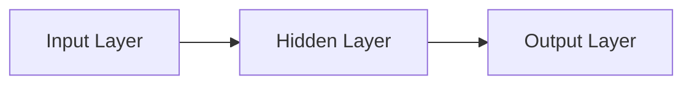
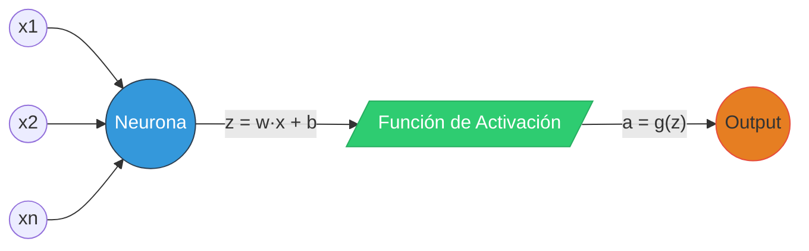
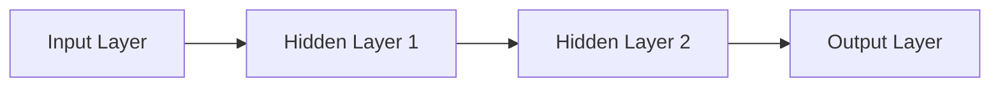
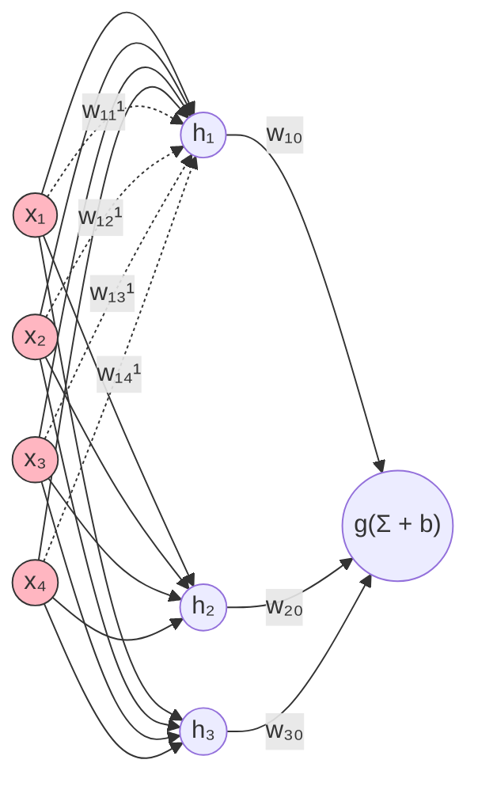

### Human
Notas

### Assistant
Para personalizar el enlace y mostrar un alias, puedes usar la sintaxis de "alias" de Obsidian, de la siguiente manera:

```
[[Ing Electronica/Semestre 9 2023-1/IA/Corte 2/CLASE 6 Máquinas de vectores de soporte  (SVM) (marzo 10 2023)|SVMs Pregrado]]
```

Esto mostrará "SVMs Pregrado" en lugar del nombre completo del archivo.

### Human
Haz lo que te pido. 

Okay. Estoy tomando notas de mi Master en Ciencia de Datos. Tengo un Vault de Obsidian donde las estoy tomando. Necesito que la informacion que te pase, me ayudes a organizarla de manera que mis notas sean efectivas para estudiar, quiero que sean notas claras, concisas, detalladas, bien explicadas, muy bien ordenadas para que yo pueda leerlas y estudiar de manera efectiva. Cabe aclarar que el formato de los Vault de Obsidian se utiliza formato Markdown, para que busques la mejor manera de que se vean ordenadas, claras, bonitas, bien explicadas, detalladas y concisas. Si es necesario hacer tablas, graficos que sean bonitos, organizados y bien explicados como todo lo demas. Las imagenes las necesito bien colocadas, ordenadas. Todo muy bien ordenado, claro, bonito, bien explicado, detallado y conciso por favor. Guarda esto para que lo tengas en mente. Solo recuerdalo


### Assistant
Aquí tienes unas notas en Obsidian organizadas, claras, detalladas y concisas para la Unidad 1: Técnicas Supervisadas. Puedes copiarlas en tu archivo de Obsidian y ajustarlas según lo requieras:

---

```markdown
---
title: "Unidad 1: Técnicas Supervisadas"
date: 2025-03-11
tags: [MachineLearning, Supervisado, Clasificación, Regresión, TelcoChurn]
---

# Unidad 1: Técnicas Supervisadas

## Introducción al Aprendizaje Supervisado

El aprendizaje supervisado es una rama del machine learning en la que se entrena un modelo a partir de un conjunto de datos que incluye tanto **atributos de entrada** (X₁, X₂, ..., Xₙ) como **atributos de salida** (Y₁, Y₂, ..., Yₘ). El objetivo es aprender una función f que permita predecir los valores de salida para nuevas entradas:

  **Ŷ = f(X₁, X₂, ..., Xₙ)**

Este enfoque es útil para resolver problemas de **clasificación** (predicción de categorías) y **regresión** (predicción de valores continuos). En el contexto del proyecto, se aplicará para predecir la probabilidad de que un cliente de telecomunicaciones presente **churn** (cancelación del servicio) o **no churn**.

---

## Técnicas Supervisadas Más Conocidas

A continuación, se presenta una visión general de algunas de las técnicas más utilizadas en aprendizaje supervisado:

### 1. K-Vecinos Más Cercanos (KNN)
- **Concepto:**  
  No construye un modelo explícito; clasifica un nuevo ejemplo buscando los K ejemplos más similares (vecinos) en el conjunto de entrenamiento y asignando la etiqueta mediante la moda (para clasificación) o la media (para regresión).
- **Parámetro Clave:**  
  El valor de K (usualmente un entero impar y pequeño) se determina experimentalmente.
- **Medidas de Similitud:**  
  Distancia euclidiana, Manhattan, Minkowski, similitud del coseno, etc.

---

### 2. Árbol de Decisión
- **Concepto:**  
  Construye un árbol en el que cada nodo interno representa una pregunta sobre un atributo y cada hoja una predicción.  
- **Proceso:**  
  Se selecciona el orden de las preguntas (usando métricas como ganancia de información o índice GINI) para maximizar la diferenciación de las clases.
- **Ejemplo:**  
  Un nodo puede preguntar "¿El estado civil es soltero?" con ramas correspondientes a las posibles respuestas.

---

### 3. Bosque Aleatorio (Random Forest)
- **Concepto:**  
  Es un método de ensamble que entrena múltiples árboles de decisión sobre subconjuntos aleatorios del conjunto de datos y de atributos.  
- **Ventajas:**  
  Mejora la robustez y reduce el sobreajuste, proporcionando además un ranking de importancia de las variables.
- **Parámetros:**  
  Número de árboles, número de atributos a considerar en cada árbol, etc.

---

### 4. Máquina de Vectores de Soporte (SVM)
- **Concepto:**  
  Busca trazar una frontera de decisión que maximice el margen entre dos clases.  
- **Aspectos Clave:**  
  Solo se utilizan los datos cercanos a la frontera (vectores de soporte) para definirla.  
- **Optimización:**  
  Se resuelve un problema de optimización cuadrática; el kernel (por ejemplo, el radial) permite tratar problemas no lineales.
- **Parámetros:**  
  C (regularización) y gamma, que deben optimizarse mediante grid search o validación cruzada.

---

### 5. Perceptrones Multicapa (MLP)
- **Concepto:**  
  Inspirados en la estructura de las neuronas, los MLP se componen de capas de unidades (neuronas) conectadas entre sí mediante pesos.  
- **Proceso de Aprendizaje:**  
  Utiliza la técnica del gradiente descendente y el algoritmo de backpropagation para ajustar los pesos y minimizar el error.
- **Aplicación:**  
  Son capaces de aprender relaciones no lineales y complejas entre los atributos.

---

### 6. Redes Profundas
- **Concepto:**  
  Evolución de los perceptrones multicapa con arquitecturas más complejas, múltiples capas y diversidad en las funciones de activación.
- **Modelos Destacados:**  
  Redes convolucionales (para procesamiento de imágenes) y redes recurrentes LSTM (para secuencias de datos).
- **Aspectos Importantes:**  
  La inicialización de la red y el ajuste de hiperparámetros son críticos para el éxito del entrenamiento.

---

## Recomendaciones para Profundizar

Para proponer hipótesis fundamentadas, se recomienda revisar el siguiente material:
- **Material Complementario:**  
  [Introducción al Aprendizaje Supervisado (PDF)](https://auladigital.javerianacali.edu.co/content/enforced/255010-GRAD;400ITA010;A;20251/recursos/M2U1-introduccion-aprendizaje_supervisado.pdf?ou=255010)  
  Se sugiere ver primero el video introductorio y luego utilizar la lectura para profundizar en la aplicación de cada técnica.

---

*Estas notas ofrecen un panorama general sobre las técnicas supervisadas que se estudiarán en esta unidad. Sirven como base para formular hipótesis que luego serán evaluadas en el desarrollo de modelos para predecir el churn en clientes de telecomunicaciones.*

```

---

Esta estructura te permite tener un documento claro y ordenado en Obsidian, facilitando el estudio y la generación de hipótesis para la solución del problema. ¿Deseas realizar algún ajuste o agregar información adicional?

### Assistant
Gracias por probarlo. El motivo por el que esa opción no te funcionó es que **Obsidian no interpreta `id` de `span` como anclas navegables por defecto**, porque su motor de Markdown no procesa HTML como lo haría un navegador completo. Pero ¡hay formas funcionales y elegantes de simular referencias internas tipo LaTeX dentro de Obsidian!

---

## ✅ Alternativa funcional y bonita en Obsidian

### 1. **Usa bloques de referencia nombrados manualmente**

Puedes crear una **referencia con etiqueta explícita** usando un bloque de anotación (o cualquier bloque) seguido de un `^etiqueta`.

```markdown
> ![[Error De Bayes.png#invert_B]]  
> **Figura 1.** Regresión con ajuste adecuado.  
^fig-ajuste-adecuado
```

### 2. **Luego enlaza así desde otro lugar del documento:**

```markdown
Ver [esta figura](#fig-ajuste-adecuado) para un ejemplo de regresión con ajuste adecuado.
```

🟢 Esto **sí funciona** en Obsidian porque estás apuntando al ID del bloque (`^fig-ajuste-adecuado`).

---

## 🧪 Resultado visual

### En tu nota tendrás algo así:

```markdown
Ver [esta figura](#fig-ajuste-adecuado) para un ejemplo de regresión con ajuste adecuado.

...

> ![[Error De Bayes.png#invert_B]]  
> **Figura 1.** Regresión con ajuste adecuado.  
^fig-ajuste-adecuado
```

Y Obsidian lo va a enlazar perfectamente como si fuese una cita de figura con hipertexto interno.

---

## 🎁 Tip extra (para múltiples figuras)

Usa un prefijo consistente como `^fig-*`, `^tbl-*`, `^eq-*` para organizar mejor tus referencias internas:

- `^fig-error-bayes`
- `^fig-resnet-arquitectura`
- `^tbl-rendimiento-modelos`
- `^eq-loss-function`

¿Deseas una pequeña plantilla para gestionar figuras, tablas y ecuaciones con referencias internas en Obsidian?

### Assistant
Aquí tienes las notas en formato Markdown, siguiendo el estilo de tus apuntes actuales en Obsidian, integrando la información importante del video (https://youtu.be/lPOGKHedbVY). He estructurado el contenido de forma clara, detallada y concisa, utilizando la notación matemática en LaTeX para los aspectos relevantes.

---

## 7. Optimización y Regularización en Deep Learning

El video explica aspectos avanzados relacionados con la optimización y regularización en redes neuronales profundas, fundamentales para mejorar la capacidad de generalización y evitar el sobreentrenamiento.

### 7.1 Optimización

- **Definición:**
  El proceso de optimización busca ajustar los parámetros del modelo (pesos y sesgo) para minimizar la función de costo.  
- **Algoritmos de Optimización:**
  - **Gradiente Descendente:**  
    La actualización de un parámetro \( w \) se realiza según:
    \[
    w^{(t)} = w^{(t-1)} - \eta \cdot \frac{\partial L}{\partial w}
    \]
    donde \( \eta \) es la tasa de aprendizaje y \( L \) es la función de costo.
  - **Variantes Avanzadas:**  
    Se discuten algoritmos como Adam, RMSProp y otros, que ajustan dinámicamente la tasa de aprendizaje y ayudan a una convergencia más rápida y estable.

- **Concepto Clave:**  
  El gradiente descendente actualiza los parámetros en la dirección opuesta al gradiente de la función de costo, moviéndose así hacia el mínimo.

### 7.2 Regularización

- **Objetivo:**
  Prevenir el sobreentrenamiento (overfitting) y mejorar la capacidad de generalización del modelo.
  
- **Técnicas de Regularización:**
  - **Dropout:**  
    Durante el entrenamiento, se desactivan de forma aleatoria algunas neuronas para evitar que la red dependa excesivamente de ciertas conexiones.
  - **Regularización L2 (Weight Decay):**  
    Se añade un término de penalización al costo proporcional al cuadrado de los pesos:
    \[
    L_{\text{total}} = L + \lambda \sum_{j} w_j^2
    \]
    donde \( \lambda \) controla la intensidad de la penalización.
  - **Early Stopping:**  
    Se detiene el entrenamiento cuando el error en el conjunto de validación empieza a aumentar, evitando el sobreajuste.

- **Nota Importante:**  
  La elección de la tasa de aprendizaje \( \eta \) y el hiperparámetro de regularización \( \lambda \) son críticos:
  - Un \( \eta \) demasiado grande puede provocar oscilaciones o divergencia.
  - Un \( \eta \) muy pequeño ralentiza la convergencia.
  - Un \( \lambda \) inadecuado puede llevar a un modelo subajustado o sobreajustado.

### 7.3 Consideraciones Gráficas

En el video se ilustra un gráfico donde se muestra:
- La **función de costo** \( L(w) \) en función de los parámetros.
- El **valor óptimo** \( w^* \) que minimiza \( L(w) \).
- El **proceso iterativo** del gradiente descendente, en el que el parámetro se va actualizando gradualmente hacia el mínimo.

---

### 7.4 Resumen

- **Optimización:**  
  Es el proceso iterativo de ajustar los parámetros de la red para minimizar la función de costo. Se utilizan técnicas como el gradiente descendente y sus variantes (p. ej., Adam).
  
- **Regularización:**  
  Se aplican técnicas como dropout, regularización L2 y early stopping para evitar el sobreajuste y mejorar la generalización del modelo.
  
- **Ajuste de Hiperparámetros:**  
  La selección adecuada de la tasa de aprendizaje \( \eta \) y del coeficiente de regularización \( \lambda \) es fundamental para lograr un entrenamiento eficiente y un modelo robusto.

---

Estas notas complementan tus apuntes previos sobre componentes y notación matemática de las redes neuronales, proporcionando una visión clara de los métodos de optimización y regularización. ¿Deseas agregar algún detalle adicional o modificar algún aspecto?

### Human
Que haces que esto???

# Códigos de Estado HTTP

A continuación se presenta una lista de los códigos de estado HTTP, categorizados según su clase:

## 1xx - Respuestas Informativas

| Código | Nombre               | Descripción                               | Impacto/Notas                               |
|-------:|----------------------|-------------------------------------------|---------------------------------------------|
|    100 | Continue             | El servidor permite continuar la solicitud.| Usado en solicitudes largas (ej: POST).     |
|    101 | Switching Protocols  | Cambio de protocolo (ej: HTTP → WebSocket).|                                             |

## 2xx - Éxito

| Código | Nombre    | Descripción                                 | Impacto/Notas                       |
|-------:|-----------|---------------------------------------------|-------------------------------------|
|    200 | OK        | Respuesta estándar para solicitudes exitosas.| ✅ SEO: Indica contenido válido.    |
|    201 | Created   | Recurso creado exitosamente (ej: POST).      |                                     |
|    204 | No Content| Respuesta sin cuerpo (ej: DELETE exitoso).   |                                     |

## 3xx - Redirecciones

| Código | Nombre             | Descripción                                                         | Impacto/Notas                      |
|-------:|--------------------|---------------------------------------------------------------------|------------------------------------|
|    301 | Moved Permanently  | URL cambiada **para siempre** (transfiere autoridad SEO).           | 🔄 SEO: Priorizar en migraciones.  |
|    302 | Found              | Redirección temporal (no transfiere autoridad SEO).                 |                                    |
|    304 | Not Modified       | Recurso sin cambios desde la última solicitud (caché válido).       | ⚡ Mejora rendimiento.             |

## 4xx - Errores del Cliente

| Código | Nombre        | Descripción                                        | Impacto/Notas                      |
|-------:|---------------|----------------------------------------------------|------------------------------------|
|    400 | Bad Request   | Sintaxis inválida o solicitud malformada.           | ❌ UX: Revisar formularios/APIs.   |
|    401 | Unauthorized  | Falta autenticación (ej: login requerido).          | 🔒 Usar con páginas privadas.      |
|    403 | Forbidden     | Acceso prohibido (solicitud válida, pero rechazada).|                                    |
|    404 | Not Found     | Recurso no existe en el servidor.                   | 🌐 UX: Personalizar página 404.    |

## 5xx - Errores del Servidor

| Código | Nombre                  | Descripción                                      | Impacto/Notas                          |
|-------:|-------------------------|--------------------------------------------------|----------------------------------------|
|    500 | Internal Server Error   | Error genérico del servidor (ej: fallo en código).| 🔧 Debuggear logs del servidor.        |
|    502 | Bad Gateway             | Respuesta inválida de un servidor proxy/upstream.|                                    |
|    503 | Service Unavailable     | Servidor sobrecargado o en mantenimiento.        | ⏳ UX: Mostrar mensaje de "Volver pronto".|
|    504 | Gateway Timeout         | Tiempo de espera agotado entre servidores.       |                                    |

## Otros - Curiosidades

| Código | Nombre                 | Descripción                                        | Impacto/Notas                      |
|-------:|------------------------|----------------------------------------------------|------------------------------------|
|    418 | I'm a Teapot           | Código no oficial de RFC 2324 (referencia a teteras).| 🫖 Uso experimental/divertido.     |
|    451 | Unavailable For Legal Reasons | Bloqueo por razones legales (ej: DMCA).       | ⚖️ Ejemplo: Contenido censurado.   |

### Human
Sacame las notas en base a este video
https://youtu.be/lPOGKHedbVY

Recuerda usar obisidna markdown y el formato de markdown math

### Human
{'asset_pointer': 'file-service://file-KRa7c8YPsW3poW6hHhohEZ', 'content_type': 'image_asset_pointer', 'fovea': None, 'height': 518, 'metadata': {'asset_pointer_link': None, 'container_pixel_height': None, 'container_pixel_width': None, 'dalle': None, 'emu_omit_glimpse_image': None, 'emu_patches_override': None, 'generation': None, 'gizmo': None, 'is_no_auth_placeholder': None, 'lpe_delta_encoding_channel': None, 'lpe_keep_patch_ijhw': None, 'sanitized': True, 'segmentation': None, 'watermarked_asset_pointer': None}, 'size_bytes': 127132, 'width': 591}

### Assistant
```markdown
## 1. Perceptrón Multicapa Parte 2: Back Propagation

<iframe width="400" height="200" src="https://www.youtube.com/embed/9RaeLyLLvG4" title="Perceptrón Multicapa Parte 2" frameborder="0" allow="accelerometer; autoplay; clipboard-write; encrypted-media; gyroscope; picture-in-picture; web-share" referrerpolicy="strict-origin-when-cross-origin" allowfullscreen></iframe>

Esta nota se centra en la segunda parte del video sobre perceptrones multicapa, en el que se profundiza en el método de **Back Propagation**. Se presenta una transcripción ordenada y detallada para facilitar su integración en Obsidian y su consulta en formato Markdown.

---

## 2. Introducción

- **Contexto:**  
  En este video, Gloria Álvarez continúa explicando el funcionamiento de los perceptrones multicapa, enfocándose en cómo se ajustan los pesos de las conexiones de la red mediante el método de Back Propagation.  
- **Objetivo:**  
  Comprender el proceso de entrenamiento de redes neuronales, que incluye la propagación hacia adelante, el cálculo del error y la retropropagación para actualizar los pesos y minimizar el error.

---

## 3. Proceso de Propagación

### 3.1 Propagación Hacia Adelante
- **Descripción:**  
  La red neuronal recibe un vector de entrada, que se propaga a través de las capas:
  - **Capa de Entrada:** Se introducen los valores de los atributos.
  - **Capas Ocultas:** Cada neurona calcula una suma ponderada de sus entradas, añade un sesgo y aplica una función de activación.
  - **Capa de Salida:** Se produce la predicción final.
- **Cómputo en una Neurona:**  
  La entrada neta se calcula como:
  $$
  net = \sum_{i=1}^{n} w_i x_i + b,
  $$
  y la salida se obtiene mediante la función de activación:
  $$
  y = f(net).
  $$

### 3.2 Cálculo del Error
- **Función de Error:**  
  Se define una función de error para medir la discrepancia entre la salida deseada y la salida obtenida. Por ejemplo, el error cuadrático medio se expresa como:
  $$
  E = \frac{1}{2}\sum_{j}(y_j - \hat{y}_j)^2,
  $$
  donde $y_j$ es la salida esperada y $\hat{y}_j$ es la salida real de la red.

---

## 4. Back Propagation

### 4.1 Concepto y Objetivo
- **Definición:**  
  El método de Back Propagation utiliza la regla de la cadena para calcular la derivada del error con respecto a cada peso en la red. El objetivo es ajustar los pesos de manera iterativa para minimizar el error.
  
- **Proceso General:**  
  - Se calcula el error en la capa de salida.
  - Se retropropaga este error a través de las capas ocultas.
  - Se actualizan los pesos basándose en las derivadas del error.

### 4.2 Cálculo del Incremento en los Pesos
- **Fórmula de Actualización:**  
  Para una conexión específica entre la neurona $i$ de la capa anterior y la neurona $j$ de la capa actual, el incremento del peso se calcula como:
  $$
  \Delta w_{ji} = -\eta \frac{\partial E}{\partial w_{ji}},
  $$
  donde $\eta$ es la tasa de aprendizaje.
  
- **Derivada del Error:**  
  Utilizando la regla de la cadena, la derivada del error con respecto a $w_{ji}$ se expresa como:
  $$
  \frac{\partial E}{\partial w_{ji}} = \delta_j \, x_i,
  $$
  donde $\delta_j$ es el error local de la neurona $j$, y $x_i$ es la salida de la neurona $i$.

### 4.3 Cálculo del Error Local ($\delta_j$)
- **Para la Capa de Salida:**
  $$
  \delta_j = (y_j - \hat{y}_j) \, f'(net_j),
  $$
  donde $f'(net_j)$ es la derivada de la función de activación evaluada en la entrada neta.
  
- **Para las Capas Ocultas:**
  $$
  \delta_j = f'(net_j) \sum_{k} \delta_k \, w_{kj},
  $$
  donde la suma se realiza sobre las neuronas $k$ de la capa siguiente conectadas a la neurona $j$.

---

## 5. Ejemplo Práctico del Proceso

- **Paso 1: Propagación Hacia Adelante:**  
  Se introduce un patrón de entrada y se calcula la salida en cada capa.
  
- **Paso 2: Cálculo del Error:**  
  Se compara la salida de la red con la salida deseada y se calcula el error para cada patrón.
  
- **Paso 3: Retropropagación:**  
  El error se propaga desde la capa de salida hacia las capas ocultas, calculando $\delta_j$ para cada neurona.
  
- **Paso 4: Actualización de Pesos:**  
  Se actualizan los pesos utilizando la fórmula de ajuste:
  $$
  w_{ji}^{(t+1)} = w_{ji}^{(t)} + \Delta w_{ji}.
  $$

- **Iteración:**  
  Se repite el proceso para múltiples patrones hasta que el error promedio se minimice.

---

## 6. Consideraciones y Desafíos

- **Tasa de Aprendizaje ($\eta$):**  
  Debe ser seleccionada cuidadosamente para evitar oscilaciones o una convergencia demasiado lenta.
  
- **Mínimos Locales:**  
  Existe el riesgo de que el algoritmo se quede atrapado en un mínimo local del error.
  
- **Diseño de la Red:**  
  La cantidad de capas ocultas y neuronas por capa no tiene una regla fija, requiriendo experimentación para evitar el sobreentrenamiento.

- **Error de Validación:**  
  Es crucial monitorear el error en datos no vistos para evitar el overfitting.

---

## 7. Conclusiones

- **Iteratividad:**  
  El método de Back Propagation es iterativo y permite ajustar los pesos de la red de manera progresiva, reduciendo el error con cada iteración.
  
- **Fundamento Matemático:**  
  El uso de derivadas y la regla de la cadena proporcionan una base sólida para actualizar los pesos.
  
- **Impacto en el Rendimiento:**  
  Un correcto ajuste de la tasa de aprendizaje y la arquitectura de la red es esencial para lograr una buena generalización y minimizar el error.
  
- **Aplicabilidad:**  
  Este método es la base del entrenamiento de redes neuronales en aplicaciones modernas de clasificación y reconocimiento, siendo un pilar fundamental del aprendizaje profundo.

*Método Back Propagation explicado en detalle, integrando los conceptos teóricos y prácticos para entender su funcionamiento en el entrenamiento de perceptrones multicapa.*
```

¿Necesitas algún ajuste adicional o agregar más secciones?

### Assistant
En Markdown estándar, no es posible que una celda abarque múltiples columnas (colspan) o filas (rowspan). Sin embargo, puedes lograr este efecto utilizando HTML directamente dentro de tu documento Markdown, ya que muchos procesadores de Markdown, incluido Obsidian, permiten la inserción de código HTML.

A continuación, te muestro cómo podrías reestructurar tu tabla utilizando etiquetas HTML para que los títulos **1xx**, **2xx**, **3xx**, etc., abarquen todas las columnas en una sola fila:

```html
<table>
  <thead>
    <tr>
      <th>Código</th>
      <th>Nombre</th>
      <th>Categoría</th>
      <th>Descripción</th>
      <th>Impacto/Notas</th>
    </tr>
  </thead>
  <tbody>
    <tr>
      <td colspan="5"><strong>1xx - Respuestas Informativas</strong></td>
    </tr>
    <tr>
      <td>100</td>
      <td>Continue</td>
      <td>Información</td>
      <td>El servidor permite continuar la solicitud.</td>
      <td>Usado en solicitudes largas (ej: POST).</td>
    </tr>
    <tr>
      <td>101</td>
      <td>Switching Protocols</td>
      <td>Información</td>
      <td>Cambio de protocolo (ej: HTTP → WebSocket).</td>
      <td></td>
    </tr>
    <tr>
      <td colspan="5"><strong>2xx - Éxito</strong></td>
    </tr>
    <tr>
      <td>200</td>
      <td>OK</td>
      <td>Éxito</td>
      <td>Respuesta estándar para solicitudes exitosas.</td>
      <td>✅ SEO: Indica contenido válido.</td>
    </tr>
    <tr>
      <td>201</td>
      <td>Created</td>
      <td>Éxito</td>
      <td>Recurso creado exitosamente (ej: POST).</td>
      <td></td>
    </tr>
    <tr>
      <td>204</td>
      <td>No Content</td>
      <td>Éxito</td>
      <td>Respuesta sin cuerpo (ej: DELETE exitoso).</td>
      <td></td>
    </tr>
    <tr>
      <td colspan="5"><strong>3xx - Redirecciones</strong></td>
    </tr>
    <tr>
      <td>301</td>
      <td>Moved Permanently</td>
      <td>Redirección</td>
      <td>URL cambiada <strong>para siempre</strong> (transfiere autoridad SEO).</td>
      <td>🔄 SEO: Priorizar en migraciones.</td>
    </tr>
    <tr>
      <td>302</td>
      <td>Found</td>
      <td>Redirección</td>
      <td>Redirección temporal (no transfiere autoridad SEO).</td>
      <td></td>
    </tr>
    <tr>
      <td>304</td>
      <td>Not Modified</td>
      <td>Redirección</td>
      <td>Recurso sin cambios desde la última solicitud (caché válido).</td>
      <td>⚡ Mejora rendimiento.</td>
    </tr>
    <tr>
      <td colspan="5"><strong>4xx - Errores del Cliente</strong></td>
    </tr>
    <tr>
      <td>400</td>
      <td>Bad Request</td>
      <td>Error del Cliente</td>
      <td>Sintaxis inválida o solicitud malformada.</td>
      <td>❌ UX: Revisar formularios/APIs.</td>
    </tr>
    <tr>
      <td>401</td>
      <td>Unauthorized</td>
      <td>Error del Cliente</td>
      <td>Falta autenticación (ej: login requerido).</td>
      <td>🔒 Usar con páginas privadas.</td>
    </tr>
    <tr>
      <td>403</td>
      <td>Forbidden</td>
      <td>Error del Cliente</td>
      <td>Acceso prohibido (solicitud válida, pero el servidor la rechaza).</td>
      <td></td>
    </tr>
    <tr>
      <td>404</td>
      <td>Not Found</td>
      <td>Error del Cliente</td>
      <td>Recurso no existe en el servidor.</td>
      <td>🌐 UX: Personalizar página 404.</td>
    </tr>
    <tr>
      <td colspan="5"><strong>5xx - Errores del Servidor</strong></td>
    </tr>
    <tr>
      <td>500</td>
      <td>Internal Server Error</td>
      <td>Error del Servidor</td>
      <td>Error genérico del servidor (ej: fallo en código).</td>
      <td>🔧 Debuggear logs del servidor.</td>
    </tr>
    <tr>
      <td>502</td>
      <td>Bad Gateway</td>
      <td>Error del Servidor</td>
      <td>Respuesta inválida de un servidor proxy/upstream.</td>
      <td></td>
    </tr>
    <tr>
      <td>503</td>
      <td>Service Unavailable</td>
      <td>Error del Servidor</td>
      <td>Servidor sobrecargado o en mantenimiento.</td>
      <td>⏳ UX: Mostrar mensaje de "Volver pronto".</td>
    </tr>
    <tr>
      <td>504</td>
      <td>Gateway Timeout</td>
      <td>Error del Servidor</td>
      <td>Tiempo de espera agotado entre servidores.</td>
      <td></td>
    </tr>
    <tr>
      <td colspan="5"><strong>Otros - Curiosidades</strong></td>
    </tr>
    <tr>
      <td>418</td>
      <td>I'm a Teapot</td>
      <td>Humor</td>
      <td>Código no oficial de RFC 2324 (referencia a teteras).</td>
      <td>🫖 Uso experimental/divertido.</td>
    </tr>
    <tr>
      <td>451</td>
      <td>Unavailable For Legal Reasons</td>
      <td>Legal</td>
      <td>Bloqueo por razones legales (ej: DMCA).</td>
      <td>⚖️ Ejemplo: Contenido censurado.</td>
    </tr>
  </tbody>
</table>
```


Este código HTML crea una tabla donde las filas que contienen los títulos (**1xx 

### Human
Dame las notas en obsidian de manera clara, detallada, concisa y bien organizadas

### Human
Ahora dame excelentes notas sobre el Principio de Manifold Learning

Este link me gusta: https://scikit-learn.org/stable/modules/manifold.html

Para obisidian

### Human
Como linkeo estos dos archivos, estas dos paginas? Intente asi y no me deja

[SVM Pregrado](CLASE 6 Máquinas de vectores de soporte  (SVM) (marzo 10 2023).md)

### Assistant
Para mejorar la representación de la expresión matemática en Markdown, puedes utilizar la sintaxis de LaTeX para subíndices y superíndices. A continuación, se muestra cómo hacerlo:

```markdown
$w_{destino,origen}^{[capa]}$
```


Esta expresión utiliza la sintaxis de LaTeX para formatear correctamente los subíndices y superíndices. Sin embargo, es importante tener en cuenta que la compatibilidad con LaTeX en Markdown depende de la plataforma que estés utilizando. Algunas plataformas, como GitHub, admiten la inclusión de expresiones matemáticas en LaTeX dentro de Markdown. Por ejemplo, en GitHub puedes escribir expresiones matemáticas en línea utilizando signos de dólar simples `$...$` o bloques de expresiones matemáticas con signos de dólar dobles `$$...$$`. citeturn0search1

Si la plataforma que estás utilizando no admite LaTeX en Markdown, puedes recurrir a etiquetas HTML para representar superíndices y subíndices:

```markdown
w<sub>destino,origen</sub><sup>[capa]</sup>
```


Esta alternativa utiliza las etiquetas `<sub>` y `<sup>` para subíndices y superíndices, respectivamente. Sin embargo, ten en cuenta que no todas las plataformas de Markdown admiten la inclusión de HTML en el contenido. citeturn0search2

En resumen, la mejor opción es utilizar la sintaxis de LaTeX si la plataforma lo permite. De lo contrario, puedes optar por las etiquetas HTML, siempre y cuando sean compatibles con la plataforma que estés utilizando. 

### Assistant
Aquí tienes el código HTML que puedes pegar en tus notas de Obsidian para mostrar la tabla con los títulos centrados:

```html
<table>
  <thead>
    <tr>
      <th style="text-align: center;">Categoría</th>
      <th style="text-align: center;">Descripción y Ejemplos</th>
      <th style="text-align: center;">Beneficios / Impacto</th>
    </tr>
  </thead>
  <tbody>
    <tr>
      <td><strong>1. Salud</strong></td>
      <td>
        <strong>Diagnóstico y Tratamiento Personalizado:</strong><br>
        Los algoritmos de deep learning analizan grandes volúmenes de datos médicos para detectar enfermedades con alta precisión.<br>
        <em>Ejemplo:</em> Detección temprana de cáncer mediante el análisis de imágenes médicas.
      </td>
      <td>
        - Diagnósticos más precisos.<br>
        - Desarrollo de tratamientos personalizados basados en datos.
      </td>
    </tr>
    <tr>
      <td><strong>2. Conducción Autónoma</strong></td>
      <td>
        <strong>Interpretación en Tiempo Real:</strong><br>
        Las redes neuronales profundas procesan datos de sensores y cámaras para identificar señales de tráfico, peatones y otros objetos.
      </td>
      <td>
        - Mejoran la seguridad y eficiencia en la conducción.<br>
        - Permiten la toma de decisiones en tiempo real en vehículos autónomos.
      </td>
    </tr>
    <tr>
      <td><strong>3. Procesamiento de Lenguaje Natural (PLN)</strong></td>
      <td>
        <strong>Comprensión y Generación de Lenguaje:</strong><br>
        Los modelos de deep learning se aplican en asistentes virtuales y chatbots para interpretar comandos de voz y generar respuestas coherentes.
      </td>
      <td>
        - Interacciones más naturales y precisas entre humanos y máquinas.<br>
        - Mejora en la comprensión del lenguaje en aplicaciones de voz.
      </td>
    </tr>
    <tr>
      <td><strong>4. Reconocimiento de Imágenes</strong></td>
      <td>
        <strong>Clasificación y Detección de Objetos:</strong><br>
        Las redes neuronales convolucionales (CNN) permiten identificar y clasificar objetos en imágenes.<br>
        <em>Aplicación:</em> Vigilancia y seguridad para identificar personas o actividades sospechosas.
      </td>
      <td>
        - Alta precisión en la detección de patrones visuales.<br>
        - Mejora en la eficiencia de sistemas de monitoreo.
      </td>
    </tr>
    <tr>
      <td><strong>5. Finanzas</strong></td>
      <td>
        <strong>Detección de Fraude y Evaluación de Riesgos:</strong><br>
        El aprendizaje profundo se utiliza para analizar transacciones y detectar patrones que indiquen actividades fraudulentas.<br>
        <em>Ejemplo:</em> Toma de decisiones de inversión basadas en el análisis de grandes volúmenes de datos del mercado.
      </td>
      <td>
        - Mayor seguridad en las transacciones financieras.<br>
        - Mejor evaluación y gestión de riesgos.
      </td>
    </tr>
  </tbody>
</table>
```

Este código HTML crea una tabla en la que los encabezados "Categoría", "Descripción y Ejemplos" y "Beneficios / Impacto" se muestran centrados, y cada fila contiene la información correspondiente a cada aplicación del aprendizaje profundo. Puedes copiar y pegar este bloque en tu nota Markdown de Obsidian y se renderizará correctamente.

¿Necesitas realizar algún otro ajuste?

### Human
Dale

### Human
Okay, pero damelo en formato markdown. Estas son mis notas de obsidian


#### 🧠 Componentes Fundamentales  
##### 1. Estructura Básica



- **Capa de Entrada (Input):** Recibe los datos brutos (*features*)  
- **Capas Ocultas (Hidden):** Transformaciones no lineales (≥1 capa)  
- **Capa de Salida (Output):** Produce la predicción final  

#### 2. 🧠 Neurona Artificial (Unidad de Procesamiento)



##### 🧮 Componentes Matemáticos de una Neurona

###### 🔵 **Entradas**  
**Vector de características**
$$
\begin{align}
\mathbf{x} = \begin{bmatrix} x_1 \\ x_2 \\ \vdots \\ x_n \end{bmatrix} \in \mathbb{R}^n \tag{1}
\end{align}
$$


###### ⚖️ **Pesos**  
**Vector de parámetros:**
$$
\begin{align}
\mathbf{w} &= \begin{bmatrix} w_1 \\ w_2 \\ \vdots \\ w_n \end{bmatrix} \in \mathbb{R}^n \tag{2} \\
\end{align}
$$

###### 🎯 **Sesgo (Bias)**  
**Término de ajuste:**
$$
\begin{align}
b ∈ \mathbb{R}
\end{align}
$$

###### ⚡ **Función de Activación**  
 
$$
\begin{align}
g &\colon \mathbb{R} \to \mathbb{R} \tag{3} \\
z &\mapsto g(z) \nonumber
\end{align}
$$

**Donde:**  
$$
z = \underbrace{\mathbf{w}^\top \mathbf{x}}_{\text{Producto punto}} + b = \underbrace{\sum_{i=1}^n w_i x_i}_{\text{Sumatoria ponderada}} + b \tag{4}
$$

#### 3.📝 Notación Matemática

##### Ecuación de una Neurona

**Cálculo de pre-activación:**
$$
\begin{align}
z = w_1x_1 + w_2x_2 + \cdots + w_nx_n + b \tag{1}
\end{align}
$$

**Salida de la neurona (activación):**
$$
\begin{align}
a = g(z) \tag{2}
\end{align}
$$


##### Notación Vectorizada
**Para una capa completa (eficiencia computacional):**
$$
\begin{align}
z^{[l]} = W^{[l]} \cdot a^{[l-1]} + b^{[l]} \tag{3}
\end{align}
$$

**Activación de la capa:**
$$
\begin{align}
a^{[l]} = g(z^{[l]}) \tag{4}
\end{align}
$$

- $l$ = Número de capa
- $W$ = Matriz de pesos
- $a$ = Activaciones

##### 🔄 Forward Propagation
**Proceso de cálculo secuencial:**
1. Entrada → Capa Oculta 1  
2. Capa Oculta 1 → Capa Oculta 2  
3. Capa Oculta $n$ → Capa Oculta ...    
4. Última Capa Oculta → Salida  

**Ejemplo para 3 capas:**
$$
\begin{align}
a^{[1]} &= g(W^{[1]}X + b^{[1]}) \tag{5} \\
a^{[2]} &= g(W^{[2]}a^{[1]} + b^{[2]}) \tag{6}
\end{align}
$$

##### 💡 Funciones de Activación Clave
| Función          | Fórmula                          | Uso Típico              |
|------------------|----------------------------------|-------------------------|
| **Sigmoide**     | $$\sigma(z) = \frac{1}{1+e^{-z}}$$ | Clasificación binaria   |
| **ReLU**         | $$\text{ReLU}(z) = \max(0,z)$$    | Capas ocultas           |
| **Tanh**         | $$\tanh(z) = \frac{e^z - e^{-z}}{e^z + e^{-z}}$$ | Rango [-1,1] |

##### ✅ Takeaways Principales

1. **Composición de funciones no lineales**  
   Las redes neuronales son combinaciones jerárquicas de transformaciones no lineales.
2. **Implementación eficiente con matrices**  
   La notación matricial permite optimizar cálculos usando operaciones vectorizadas:

```python
   # Ejemplo en NumPy
   Z = np.dot(W, A_prev) + b  # Producto matricial + bias
   A = relu(Z)                 # Función de activación
```

3. **Importancia del sesgo (bias)**  
    El término `b` permite ajustar el modelo para aprender patrones complejos, incluso cuando todas las entradas son cero.
4. **Capacidad de aprendizaje por profundidad**  
    Mayor número de capas ocultas → Mayor capacidad para modelar relaciones complejas (deep learning).


Por favor, complementalas y de manera que se mantenga el orden y estructura de las notas existentes

### Human
Mas informacion para continuar con las notas eficientes y ordenadas en obsidian

Momento de formulación de las hipótesis: https://auladigital.javerianacali.edu.co/content/enforced/255010-GRAD;400ITA010;A;20251/recursos/M2U1-introduccion-aprendizaje_supervisado.pdf?ou=255010

Habiendo entendido con claridad el problema a resolver, es importante familiarizarnos con las técnicas de aprendizaje supervisado que podrían aplicarse a este problema, de modo que tengamos criterios para proponer hipótesis para la solución del mismo.

A continuación se propone un documento general, que introduce de manera breve algunas de las técnicas de aprendizaje supervisado más conocidas, esto proporciona una visión de conjunto sobre las posibilidades que tenemos para solucionar el problema.

Introducción al aprendizaje supervisado


Con el fin de profundizar en el estudio de los métodos que pueden usarse para proponer las hipótesis, los invitamos a revisar los siguientes materiales (Se recomienda primero ver el video y luego utilizar la lectura para complementar o profundizar en la aplicación de cada técnica):


### Human
Hay otra forma sin usar ^sobreajuste>

### Assistant
A continuación te presento una propuesta de nota en Obsidian que integra la transcripción del video con explicaciones y comentarios complementarios para que la información sea clara, ordenada y fácilmente navegable:

```markdown
---
title: "Unidad 2: Técnicas No Supervisadas - Algoritmo de Bescan (DBSCAN)"
date: 2025-03-11
tags: [MachineLearning, NoSupervisado, Clustering, DBSCAN, Segmentación]
---

# Algoritmo de Bescan (DBSCAN)

Esta nota se centra en el **algoritmo de Bescan** (similar al DBSCAN) explicado en el video de Gloria Álvarez. Se integra la transcripción del video junto con explicaciones complementarias para facilitar su comprensión y aplicación práctica en la segmentación de clientes en ventas en línea.

---

## 1. Introducción

- **Contexto:**  
  El algoritmo de Bescan es una técnica de **aprendizaje no supervisado** que se utiliza para detectar **conglomerados (clusters)** basados en la densidad de los datos.  
- **Aplicación en el curso:**  
  Se estudia en el contexto de Métodos de Aprendizaje Automático para la Toma de Decisiones, aplicándolo en problemas de segmentación de clientes en ventas en línea.

---

## 2. Conceptos Clave

### 2.1 Clasificación de Puntos

El algoritmo distingue tres tipos de puntos en el dataset:

- **Punto Núcleo:**  
  Un punto que se encuentra en una zona de alta densidad. Se define como núcleo cuando, al trazar un círculo a su alrededor, se encuentran _más puntos que un umbral predefinido_.

- **Punto Borde:**  
  No cumple el criterio de núcleo pero se ubica en la vecindad de un punto núcleo.  
 
- **Punto Ruido:**  
  Puntos que, al encontrarse en zonas de baja densidad (pocos vecinos y sin puntos núcleo cercanos), se descartan y no se asignan a ningún cluster.

### 2.2 Cálculo de Parámetros

- **Parámetro Umbral (mínimo de puntos):**  
  Define cuántos puntos deben encontrarse dentro de la circunferencia de un punto para considerarlo núcleo.  
- **Radio (ε):**  
  Determinado a partir del cálculo del enésimo vecino más cercano para cada punto.  
  - Se ordenan las distancias del enésimo vecino.
  - Se identifica un "quiebre" en la gráfica de distancias: antes del quiebre, los puntos están en zonas de alta densidad; después, en zonas de baja densidad.
  - Este quiebre define el valor del radio para la vecindad.

---

## 3. Procedimiento del Algoritmo

El algoritmo de Bescan se ejecuta en los siguientes pasos:

1. **Etiquetado Inicial:**  
   Cada punto se clasifica como núcleo, borde o ruido, según la densidad en su entorno.

2. **Eliminación del Ruido:**  
   Se descartan los puntos identificados como ruido.

3. **Conexión de Puntos Núcleo:**  
   Se establecen conexiones entre los puntos núcleo que están a una distancia menor que el radio ε, propagando la pertenencia a un mismo cluster.

4. **Asignación de Puntos Borde:**  
   Los puntos borde se asignan al cluster al que pertenece el punto núcleo que se encuentra dentro de su vecindad.  
   - En situaciones donde un punto borde se encuentre en la vecindad de núcleos de diferentes clusters, se decide su asignación basándose en criterios propios del algoritmo.

---

## 4. Ejemplo Visual y Flujo del Algoritmo

- **Visualización en 2D:**  
  Imagina que los datos se grafican en un plano.  
  - **Núcleos:** Representados con círculos.
  - **Bordes:** Representados con otros símbolos (por ejemplo, signos).
  - **Ruido:** Marcado con una "x".
  
- **Flujo de Conexión:**  
  - El algoritmo comienza en un punto núcleo y se conecta con todos los núcleos alcanzables dentro de su radio.
  - Cuando ya no se encuentran más puntos núcleo conectados, se recorren los puntos borde para asignarlos al cluster.
  - El proceso se repite hasta que todos los puntos que puedan conectarse a un cluster se hayan agrupado.

---

## 5. Fortalezas y Debilidades

### 5.1 Fortalezas

- **Resistencia al Ruido:**  
  Al descartar los puntos considerados ruido, el algoritmo es robusto frente a outliers.
  
- **Flexibilidad en la Forma de los Clusters:**  
  No impone restricciones geométricas fijas (como los clusters globulares en k-means), lo que permite detectar conglomerados de formas arbitrarias.

### 5.2 Debilidades

- **Selección de Parámetros:**  
  Requiere determinar de forma adecuada el umbral de puntos y el radio ε; una mala elección puede afectar la calidad de la segmentación.
  
- **Limitaciones en Altas Dimensiones:**  
  El cálculo de distancias y la representación geométrica pueden no ser tan efectivos en espacios de alta dimensionalidad.

- **Costo Computacional:**  
  Puede ser costoso en términos de tiempo de cómputo cuando se trabaja con conjuntos de datos muy grandes.

---

## 6. Extractos Clave de la Transcripción del Video

A continuación se destacan algunos fragmentos importantes extraídos de la transcripción:

- **Introducción del Algoritmo:**  
  > "Hola soy Gloria Álvarez... el algoritmo de bescan es una técnica de aprendizaje no supervisado..."

- **Detección de Densidad:**  
  > "vamos a identificar si el punto a está en una zona densa o en una zona poco densa ubicando ese punto a en el centro de un círculo..."

- **Clasificación de Puntos:**  
  > "los tres tipos de puntos son los puntos núcleo, los puntos borde y los puntos ruido..."

- **Construcción de Clusters:**  
  > "el algoritmo va a construir los clusters a partir de los puntos núcleo... y complementa asignando cada punto borde..."

- **Fortalezas y Limitaciones:**  
  > "es resistente al ruido... los clusters pueden tener formas y tamaños arbitrarios... sin embargo, puede confundirse con clusters menos densos y presenta limitaciones en alta dimensionalidad..."

*Nota:* La transcripción se ha resumido y organizado para extraer los conceptos más relevantes del algoritmo.

---

## 7. Reflexiones y Consideraciones Prácticas

- **Ajuste de Parámetros:**  
  Experimenta con diferentes valores de umbral y radio para encontrar la configuración que mejor capture la estructura natural de tus datos.

- **Aplicación en Segmentación de Clientes:**  
  La capacidad de detectar clusters de forma arbitraria es especialmente útil para segmentar clientes en el sector de ventas en línea, permitiendo identificar grupos con comportamientos similares.

- **Implementación y Visualización:**  
  Se recomienda practicar implementando el algoritmo en Python (por ejemplo, utilizando la librería scikit-learn) y visualizar los clusters para validar la calidad de la segmentación.

---

Esta estructura en Obsidian te permitirá no solo tener la transcripción del video como referencia, sino también integrar un marco teórico y práctico que facilite la comprensión y la aplicación del algoritmo en proyectos reales. ¿Te gustaría agregar alguna sección adicional o modificar algún detalle para adaptarlo mejor a tus necesidades?

### Human
Ahora este video: https://youtu.be/fiLQvOie7bo

[Música] Hola soy Gloria Álvarez en el día de hoy vamos a hablar acerca de los algoritmos jerárquicos para hacer clustering o aprendizaje No supervisado estas técnicas nos van a ofrecer una visión mucho más detallada de la estructura natural de los datos y por eso pues son de mucho interés ahora que estamos estudiando los métodos de aprendizaje No supervisado dentro del curso de métodos para aprendizaje automático para la toma de decisiones en la técnica jerárquica consiste en construir un árbol de grupos Y subgrupos a partir de un datasette hay dos maneras para hacerlo una manera que se llama aglomerativa y la otra se llama divisiva y básicamente se diferencian en el orden en que empiezan a construir esa estructura de grupos y subgrupos en la estrategia aglomerativa lo que vamos a tener al inicio son grupos unitarios Es decir cada dato dentro del conjunto va a ser un grupo que contiene un único elemento y durante el proceso lo que vamos a hacer es ir agrupando estos pequeños grupos para construir grupos de un tamaño un poco mayor por el contrario la técnica divisiva trabaja en el sentido contrario es decir empieza con un único grupo que tiene todos los datos y empieza a separar ese gran grupo en los grupos más representativos que Lo componen hasta llegar al final a tener cada dato en un grupo diferente en este momento nosotros vamos a estudiar la técnica aglomerativa vamos a ver cómo funciona el algoritmo aglomerativo y el algoritmo divisivo lo podrán ustedes consultar en alguna de las lecturas recomendadas sin embargo consideramos que con que estudiemos una de las dos estrategias Pues la otra será fácilmente entendida de forma independiente por ustedes bien Entonces qué necesitamos para poder construir esa estructura de grupos y subgrupos dentro de los datos necesitamos una medida de distancia por medio de la cual nosotros podamos identificar datos que están cercanos entre sí que va a ser un reflejo de que son datos similares o muy relacionados La idea es que en la medida en que avanzamos en el agrupamiento Nosotros siempre vamos a preferir agrupar estos datos o estos subgrupos que son más similares entre sí y así vamos a ir construyendo cada vez grupos más grandes pero siempre tratando de mantener juntos los datos que tienen una más alta similitud cuando nosotros construimos el árbol es muy útil poderlo visualizar y al diagrama que construimos para ilustrar Cómo se fueron conformando estos grupos y subgrupos se lo llama dendrograma en la Gráfica podemos ver un dendrograma construido a partir de cuatro objetos o de cuatro datos de los cuales el p2 y el p3 eran los más similares entre Sí por eso se agruparon primero luego el grupo formado por los puntos 2 y 3 se agrupó con el punto 4 porque Aparentemente eran más similares entre sí que con el punto 1 y finalmente el punto 1 También entra al grupo porque como les explicaba la estrategia finaliza cuando todos los datos pertenecen al mismo grupo bien Cuál es el algoritmo que nos va a permitir construir este árbol del dendrograma pues todo se basa como ya lo decíamos en una medida de proximidad o de distancia Entonces nosotros vamos a calcular una matriz en la cual vamos a tener ya disponible la distancia que hay entre cada dato y cada uno de los demás datos para nuestro ejemplo de los cuatro datos pues tendríamos la distancia entre de p1 y p2 p1 y p3 p1 y p4 p2 y p3 b2 y p4 p3 y p4 y eso pues para comodidad lo almacenamos en una matriz que se conoce como la matriz de proximidad luego la estrategia que sigue el algoritmo es bastante sencilla primero combinamos o mezclamos los dos clusters que sean más cercanos entre sí es decir a través de esta matriz identificamos aquellos grupos que están a una menor distancia y los unimos en un solo Grupo una vez hacemos esa Unión debemos refrescar la matriz porque hay que eliminar de ella una fila una columna y hay que recalcular las distancias entre el nuevo grupo y cada uno de los grupos o datos restantes una vez actualizamos la matriz de proximidad entonces volvemos a mezclar los dos clusters que están o los dos grupos que son más cercanos y así sucesivamente hasta que nos quede un único grupo hay varias maneras de establecer la proximidad entre grupos si ustedes lo piensan si cuando tenemos los datos únicos al inicio que cada grupo está formado por un solo dato pues es muy clara la distancia entre dos grupos es la distancia entre esos dos datos Pero a medida avanzamos Entonces ya los grupos contienen más de un dato Y entonces ya no es tan trivial definir Cuál es la distancia entre un grupo y otro de hecho hay varias maneras de hacerlo de calcularlo aquí voy a ilustrar algunas de ellas Ahí va hay más una posibilidad que se a veces se conoce como single link o el min consiste en definir que la distancia entre un cluster y otro está dada por la distancia más corta que haya entre un elemento de un cluster y un elemento del otro la otra forma de verlo que se llama complete link o a veces se llama Max pues es justo lo contrario vamos a considerar que la distancia entre dos clusters se establece o se mide con la distancia más larga que haya entre un elemento de un cluster y un elemento del otro como se estarán imaginando pues para poder calcular Cuál es la distancia mínima Cuál es la distancia Max Pues básicamente hay que calcular todas las distancias entre todos los datos de un grupo y todos los datos del otro lo cual Pues tiene un costo que puede ser significativo una forma intermedia es efectivamente calcular todas las distancias entre cada uno de los datos de un grupo y cada uno de los datos del otro y calcular un promedio de esas distancias y usar ese promedio como la distancia entre los grupos que va a ir a reflejarse a la matriz de proximidad entonces cada una de estas medidas tiene como unas fortalezas que queremos a continuación destacar la distancia min o enlace simple es buena para conglomerados de forma no elíptica pero es sensible al ruido y a los datos atípicos la forma Max o enlace completo tolera El ruido también tolera mejor los datos atípicos Pero puede dividir conglomerados grandes y favorece las formas globulares usar el promedio del grupo es un enfoque intermedio entre el minimal Max y existe otra manera que también es bastante conocida que se llama el método de ward que calcula la proximidad entre dos grupos o conglomerados como el error cuadrático resultante cuando esos dos grupos se mezclan Bueno entonces uno debe elegir una de formas de medir la proximidad no podemos utilizar varias simultáneamente entonces de acuerdo a las características podemos escoger la forma que consideremos más útil y con una única medida vamos a calcular la matriz de proximidad y a empezar a iterar Ajustando la manteniendo siempre el mismo la misma estrategia para medir la distancia entre los grupos algunas características y comentarios generales sobre los métodos jerárquicos particularmente sobre el aglomerativo Pues es que estas son técnicas voraces tanto en la aglomerativo como el divisivo eso significa que vamos a producir resultados su óptimos en algunos casos porque hacemos decisiones óptimas a nivel local es una técnica costosa computacionalmente ya lo decíamos hay que calcular cada vez la distancia entre todos los datos de un grupo y todos los datos del otro es cuadrático tanto en tiempo como en espacio con respecto a el número de datos disponibles se debe decidir si vamos a ponderar el tamaño relativo de los clusters al calcular la proximidad pues esto afecta las cuentas para las medidas que incluyen sumas sobre los elementos como la técnica del promedio o la técnica de Word finalmente Hay que decir que para datos de alta dimensionalidad este método tampoco es muy recomendado por lo que está basado en medidas de distancia y ya lo hemos dicho en otras ocasiones los las intuiciones geométricas no suelen conservarse cuando nos movemos a espacios de alta dimensionalidad lo que nos lleva a obtener resultados que no podemos interpretar muy bien Bueno eso es todo con respecto al método jerárquico aglomerativo técnica de clustering que nos sirve para conocer la estructura natural de los datos de un conjunto y que forma parte de las técnicas que estamos estudiando en el en la unidad correspondiente a los métodos no supervisados de aprendizaje automático Eso es todo por hoy Gracias 

### Assistant
Lamento que estés experimentando dificultades con tu código Mermaid. El error que mencionas suele deberse a problemas de sintaxis relacionados con el uso de caracteres especiales y la estructura de los nodos. A continuación, te señalo algunos aspectos a revisar y corregir:

1. **Uso de caracteres especiales en etiquetas de nodos**:
   - Mermaid puede presentar errores al interpretar caracteres especiales como subíndices o superíndices directamente en las etiquetas de los nodos. Para evitar esto, es recomendable utilizar comillas dobles para encerrar las etiquetas que contienen estos caracteres. Por ejemplo:
     ```mermaid
     H1(("h₁"))
     ```
     Sin embargo, si los caracteres especiales continúan causando problemas, considera reemplazarlos por versiones sin formato especial, como "h1" en lugar de "h₁".

2. **Conexiones entre nodos**:
   - Asegúrate de que los nodos de origen y destino estén definidos correctamente antes de establecer conexiones entre ellos. Por ejemplo:
     ```mermaid
     X1((x₁)) --> H1
     ```
     Aquí, "X1" y "H1" deben estar definidos previamente en el diagrama.

3. **Estructura de la capa oculta y las conexiones**:
   - Verifica que todos los nodos en la capa oculta ("H1", "H2", "H3") estén definidos y que las conexiones hacia "B1", "B2" y "B3" sean coherentes y estén correctamente especificadas.

4. **Uso de estilos y anotaciones**:
   - Al aplicar estilos, asegúrate de que los nodos a los que se refieren existan en el diagrama. Por ejemplo:
     ```mermaid
     style X1 fill:#f9f,stroke:#333
     ```
     Aquí, "X1" debe estar definido en el diagrama.

5. **Comentarios en el código**:
   - Aunque los comentarios pueden ayudar en la organización del código, asegúrate de que no interfieran con la sintaxis de Mermaid. Utiliza el formato adecuado para comentarios:
     ```mermaid
     %% Este es un comentario
     ```

Si, después de revisar y ajustar estos aspectos, el problema persiste, te recomiendo probar el código en el [editor en línea de Mermaid](https://mermaid.live/) para identificar y corregir errores adicionales.

Espero que estas sugerencias te ayuden a resolver el problema con tu diagrama Mermaid. 

### Human
okay. Dame las notas del video que te acabo de pasar. Transcribelo de manera ordenada, detallada y bien organizado para ponerlo en markdown en mi obsidian

https://www.youtube.com/watch?v=yB4n_K7dZV8&list=PLb-xGbAkgGDPB9a5Dt2DLyHukF0UntAWc

### Human
Dame de nuevo las imagenes por favor. Todas ya no se pueden descargar

### Human
Ahora vamos con Gradiente descendente

Gradiente descendente

Para encontrar el mínimo de la función de costo 
L
L, se utiliza el algoritmo del gradiente descendente (o alguna de sus variantes).

Es un proceso iterativo donde el valor actual del parámetro 
w
1
w 
1
​
  depende de su valor en la iteración anterior y de la derivada de la función de costo. La ecuación de actualización es:

w
1
(
t
)
=
w
1
(
t
−
1
)
−
η
⋅
d
L
(
w
1
)
d
w
1
,
w 
1
(t)
​
 =w 
1
(t−1)
​
 −η⋅ 
dw 
1
​
 
dL(w 
1
​
 )
​
 ,
donde:

η
η: factor de aprendizaje (tasa que controla la magnitud del ajuste en cada iteración).

Elementos del gráfico:

Color:

L
(
w
1
)
L(w 
1
​
 ): función de costo en función de 
w
1
w 
1
​
 .

w
1
∗
w 
1
∗
​
 : valor óptimo de 
w
1
w 
1
​
  que minimiza 
L
L.

w
1
w 
1
​
 : parámetro ajustado durante el proceso.

Valor inicial (aleatorio): punto de partida del algoritmo, elegido aleatoriamente para iniciar la búsqueda del mínimo.

Nota clave:
El gradiente descendente ajusta 
w
1
w 
1
​
  en dirección opuesta al gradiente (derivada), acercándose progresivamente al mínimo de 
L
L. La elección de 
η
η es crítica: un valor muy pequeño ralentiza la convergencia, mientras que uno muy grande puede causar inestabilidad.

Gradiente descendente

La derivada 
d
L
(
w
1
)
d
w
1
dw 
1
​
 
dL(w 
1
​
 )
​
  representa la tasa máxima de aumento de la función de costo 
L
(
w
1
)
L(w 
1
​
 ).

Por lo tanto, 
−
d
L
(
w
1
)
d
w
1
− 
dw 
1
​
 
dL(w 
1
​
 )
​
  indica la dirección en la que 
L
(
w
1
)
L(w 
1
​
 ) disminuye más rápidamente.

El parámetro 
η
η (tasa de aprendizaje) controla la magnitud del paso en cada iteración. Una elección inadecuada de 
η
η puede hacer que el algoritmo diverja, como se ilustra en la figura.

Elementos del gráfico:

Valor inicial (Aleatorio): punto de partida del algoritmo, seleccionado al azar.

w
1
∗
w 
1
∗
​
 : valor óptimo de 
w
1
w 
1
​
  que minimiza 
L
L.

w
1
w 
1
​
 : parámetro actual durante el proceso de optimización.

Nota clave:
El gradiente descendente ajusta 
w
1
w 
1
​
  siguiendo la dirección opuesta al gradiente, acercándose al mínimo de 
L
L. La elección de 
η
η es crucial:

η
η pequeño: convergencia lenta pero estable.

η
η grande: riesgo de oscilaciones o divergencia.

### Assistant
Tras analizar el video proporcionado, se pueden extraer los siguientes puntos clave que complementan las notas previas sobre regresión lineal multivariada y gradiente descendente:

### 1. **Arquitectura de una Red Neuronal**

- **Capas de la Red:**
  - **Capa de Entrada:** Recibe las variables independientes o características del modelo.
  - **Capas Ocultas:** Procesan las entradas mediante combinaciones lineales seguidas de funciones de activación no lineales.
  - **Capa de Salida:** Genera la predicción o resultado final del modelo.

- **Neurona Artificial:**
  - **Entradas (x₁, x₂, ..., xₙ):** Características del modelo.
  - **Pesos (w₁, w₂, ..., wₙ):** Coeficientes que ponderan la importancia de cada entrada.
  - **Sesgo (b):** Permite ajustes adicionales en la combinación lineal.
  - **Función de Activación (g):** Introduce no linealidad, permitiendo que la red aprenda relaciones complejas.

### 2. **Relación con la Regresión Lineal Multivariada**

La regresión lineal multivariada es un caso particular de una red neuronal sin capas ocultas y sin funciones de activación no lineales. En este contexto:

- **Ecuación del Modelo:**
  \[ y = w_0 + w_1 \cdot x_1 + w_2 \cdot x_2 + \dots + w_m \cdot x_m \]
  Donde \( w_0 \) es el sesgo y \( w_j \) son los pesos asociados a cada característica \( x_j \).

- **Diferencias Clave:**
  - Las redes neuronales introducen capas ocultas y funciones de activación, permitiendo modelar relaciones no lineales.
  - La regresión lineal multivariada asume una relación lineal entre las variables independientes y la dependiente.

### 3. **Entrenamiento mediante Gradiente Descendente**

El proceso de ajuste de los pesos en una red neuronal utiliza el algoritmo de gradiente descendente, similar al proceso en regresión lineal:

- **Cálculo del Gradiente:**
  Se calcula la derivada de la función de costo respecto a cada peso para determinar la dirección de mayor incremento.

- **Actualización de Pesos:**
  Los pesos se actualizan en la dirección opuesta al gradiente, escalados por una tasa de aprendizaje \( \eta \):
  \[ w_j = w_j - \eta \cdot \frac{\partial L}{\partial w_j} \]

- **Consideraciones:**
  - Una \( \eta \) demasiado grande puede provocar oscilaciones o divergencia.
  - Una \( \eta \) demasiado pequeña puede resultar en una convergencia lenta.

### 4. **Funciones de Activación Comunes**

Las funciones de activación introducen no linealidad en la red, permitiendo modelar relaciones complejas:

- **ReLU (Rectified Linear Unit):**
  \[ \text{ReLU}(z) = \max(0, z) \]
  Se utiliza comúnmente en capas ocultas debido a su simplicidad y eficacia.

- **Sigmoide:**
  \[ \sigma(z) = \frac{1}{1 + e^{-z}} \]
  Adecuada para problemas de clasificación binaria.

- **Tanh (Tangente Hiperbólica):**
  \[ \tanh(z) = \frac{e^z - e^{-z}}{e^z + e^{-z}} \]
  Proporciona salidas en el rango [-1, 1], centradas en cero.

Al integrar estos conceptos, se observa cómo las redes neuronales amplían las capacidades de la regresión lineal multivariada al incorporar estructuras y procesos que permiten modelar relaciones más complejas y no lineales en los datos. 

### Assistant
Parece que ya has proporcionado una lista detallada de los códigos de estado HTTP en formato Markdown para tus notas en Obsidian. Si necesitas ayuda adicional o deseas agregar más información, por favor, indícame cómo puedo asistirte. 

### Assistant
Para poder ayudarte de manera precisa, necesito un poco más de información sobre tus necesidades y el formato del curso. Por ejemplo:

- ¿Tienes un temario o esquema con los temas principales del curso?
- ¿Prefieres tomar notas de manera digital o en papel?
- ¿Te interesan métodos específicos de organización, como el método Cornell, mapas mentales o resúmenes estructurados?
- ¿Buscas herramientas o técnicas para sintetizar la información y relacionarla con la toma de decisiones en aprendizaje automático?

Con estos detalles podré orientarte mejor y sugerir un sistema de toma de notas eficiente para tu curso. ¿Qué te parece?

### Human
Somos el Grupo 10. Por favor no hagas copia ni pagio de las hipotesis de los demas compañeros, usalas como referencia para que mi Grupo, el 10, pueda desarrollar sus propias hipótesis, de acuerdoa la base de datos que vamos a trabajar

### Assistant
Aquí tienes el documento con los títulos para cada hipótesis parafraseados, manteniendo la estructura general del informe:

------------------------------------------------------------------

**Análisis de Modelos de Machine Learning para la Segmentación de Clientes en Online Retail**  
**Integrantes:**  
[Nombre de los integrantes del Grupo 10]

---

**Introducción**  
La base de datos *Online Retail*, disponible en el UCI Machine Learning Repository (https://archive.ics.uci.edu/dataset/352/online+retail), contiene información detallada de transacciones realizadas por una tienda en línea del Reino Unido entre 2010 y 2011. Este conjunto de datos permite analizar los patrones de compra y segmentar a los clientes, lo cual es fundamental para optimizar estrategias de marketing y gestión de inventario. En este documento se plantean tres propuestas de solución al problema de segmentación, cada una basada en un enfoque distinto:  
1. Agrupación de clientes mediante K-Means (método de centroides).  
2. Clasificación jerárquica de clientes.  
3. Segmentación basada en densidad con DBSCAN.  

El objetivo es evaluar la viabilidad de cada método y definir estrategias que permitan identificar perfiles de clientes de forma precisa y robusta.

---

**Propuesta 1: Agrupación de Clientes mediante K-Means (Método de Centroides)**

**Propuesta:**  
Utilizar el algoritmo K-Means para segmentar a los clientes en grupos homogéneos a partir de variables derivadas del comportamiento de compra, tales como:  
- **Recency:** Tiempo transcurrido desde la última compra.  
- **Frequency:** Número total de compras realizadas.  
- **Monetary Value:** Monto total gastado.  
- **AvgBasketValue:** Valor promedio por transacción.

**Razonamiento y Detalles:**  
- **Eficiencia y Escalabilidad:**  
  K-Means es un algoritmo rápido y escalable, adecuado para manejar grandes volúmenes de datos como los de la base Online Retail.  
- **Perfilado de Clientes:**  
  Al agrupar las variables mencionadas, se espera identificar segmentos diferenciados (por ejemplo, clientes leales, compradores esporádicos, clientes de alto gasto, etc.).  
- **Validación del Modelo:**  
  Se utilizarán técnicas de validación, como el método del codo y el índice de silueta, para determinar el número óptimo de clusters (valor de K).

**Posibles Desafíos:**  
- Sensibilidad a la escala de las variables, lo que requerirá un preprocesamiento adecuado (normalización o estandarización).  
- La necesidad de definir previamente el valor de K, lo que podría limitar la capacidad de capturar toda la diversidad del comportamiento de los clientes.

---

**Propuesta 2: Clasificación Jerárquica de Clientes**

**Propuesta:**  
Aplicar un enfoque jerárquico aglomerativo para construir un dendrograma que revele la estructura y las relaciones entre los clientes. Se considerarán variables como:  
- **Recency, Frequency, Monetary Value**  
- Posibles variables adicionales, como aspectos demográficos o geográficos (por ejemplo, el país de origen).

**Razonamiento y Detalles:**  
- **Visualización e Interpretabilidad:**  
  La representación mediante un dendrograma permite visualizar la estructura jerárquica de los datos, facilitando la identificación de grupos a diferentes niveles de granularidad sin la necesidad de fijar un número de clusters de antemano.  
- **Flexibilidad en la Segmentación:**  
  Al no requerir una definición previa del número de grupos, el método permite identificar agrupaciones de forma natural.  
- **Optimización del Modelo:**  
  En caso de trabajar con un conjunto amplio de variables, se podrán aplicar técnicas de reducción de dimensionalidad (por ejemplo, PCA) para mejorar la eficiencia y claridad del modelo.

**Posibles Desafíos:**  
- Alto costo computacional al aplicar el método a conjuntos de datos muy grandes, lo que puede requerir el uso de muestras representativas.  
- La elección del método de enlace (single, complete, promedio o Ward) influirá significativamente en la conformación y coherencia de los clusters.

---

**Propuesta 3: Segmentación Basada en Densidad con DBSCAN**

**Propuesta:**  
Implementar el algoritmo DBSCAN para identificar clusters de clientes basados en la densidad de sus características de compra y, además, detectar clientes con comportamientos atípicos (outliers).

**Razonamiento y Detalles:**  
- **Detección de Outliers:**  
  DBSCAN es eficaz para separar puntos que no se agrupan (ruido) del resto de la población, lo que puede ser crucial para identificar clientes con comportamientos inusuales o de alto riesgo.  
- **Adaptabilidad en la Forma de los Clusters:**  
  A diferencia de K-Means, DBSCAN no asume que los clusters tengan una forma esférica, permitiendo detectar agrupaciones de formas y tamaños variados.  
- **No Requiere la Definición Previa de K:**  
  El algoritmo se basa en la densidad de los datos para formar clusters, lo que facilita la exploración de la estructura subyacente sin imponer un número fijo de grupos.

**Posibles Desafíos:**  
- La elección adecuada de los parámetros "eps" (radio de vecindad) y "min_samples" (mínimo de puntos para formar un cluster) es crítica y puede requerir un análisis exploratorio detallado.  
- En escenarios donde existan variaciones significativas en la densidad, DBSCAN podría clasificar en exceso puntos como ruido, afectando la representatividad de los clusters.

---

**Conclusiones**  
Cada una de las propuestas presentadas aborda la segmentación de clientes desde una perspectiva distinta y ofrece ventajas particulares según las características de la base de datos Online Retail.  
- **Propuesta 1 (K-Means):** Se destaca por su eficiencia y capacidad para procesar grandes volúmenes de datos, permitiendo un perfilado claro basado en variables cuantitativas, aunque requiere definir previamente el número de clusters.  
- **Propuesta 2 (Clasificación Jerárquica):** Ofrece una visualización detallada de la estructura de los datos a través de dendrogramas y no impone una cantidad fija de clusters, siendo ideal para explorar relaciones jerárquicas.  
- **Propuesta 3 (DBSCAN):** Es especialmente útil para identificar clusters de formas arbitrarias y detectar outliers, aunque depende críticamente de la correcta elección de sus parámetros.

El análisis posterior incluirá la implementación de cada uno de estos enfoques, su validación mediante técnicas estadísticas y la comparación de sus rendimientos para determinar la estrategia más adecuada que se ajuste a los objetivos del negocio.

------------------------------------------------------------------

Este formato se adapta a la estructura del informe de referencia, pero con títulos parafraseados para distinguir claramente cada propuesta. ¿Necesitas realizar algún ajuste adicional o agregar información complementaria?

### Human
Si quieres usa html para centrar los titulos Categoría, Descripción y Ejemplos  y Beneficios / Impacto  .

### Assistant
Aquí tienes una propuesta de nota para Obsidian, organizada y detallada, que abarca el "Momento de Formulación de Hipótesis" para las técnicas supervisadas. Puedes copiar y pegar este contenido en tu archivo de Obsidian y ajustarlo según tus necesidades:

---

```
---
title: "Momento de Formulación de Hipótesis - Técnicas Supervisadas"
date: 2025-03-11
tags: [MachineLearning, Supervisado, Hipótesis, Formulación]
---

# Momento de Formulación de Hipótesis

## Contexto  
Habiendo comprendido claramente el problema de retención de clientes en el sector de telecomunicaciones (Telco Customer Churn), es fundamental familiarizarnos con las técnicas de aprendizaje supervisado que pueden aplicarse. Esto nos permitirá establecer criterios sólidos para proponer hipótesis de solución que se adapten a la naturaleza de los datos y a las necesidades del negocio.

## Visión General de las Técnicas Supervisadas  
A continuación, se presenta una introducción breve a algunas de las técnicas supervisadas más conocidas, que ofrecen un panorama de las opciones disponibles para abordar el problema:

- **Clasificación:**  
  Se utiliza cuando la salida es una categoría (por ejemplo, Churn vs. No Churn).  
  *Ejemplos:* Regresión logística, árboles de decisión, Random Forest, SVM, etc.

- **Regresión:**  
  Se utiliza cuando se necesita predecir un valor numérico continuo.  
  *Ejemplos:* Regresión lineal, regresión polinómica, etc.

## Recomendaciones para Profundizar  
Para explorar en detalle cada técnica y fundamentar nuestras hipótesis, se recomienda lo siguiente:
1. **Visualizar el Material Introductorio:**  
   Ver el video introductorio sobre aprendizaje supervisado para obtener una visión general de los métodos.
2. **Lecturas Complementarias:**  
   Revisar el documento complementario que profundiza en la aplicación de cada técnica, sus ventajas, desventajas y consideraciones prácticas.

*(Si tienes enlaces o referencias específicas a estos materiales, inclúyelos aquí, por ejemplo: [Video de Aprendizaje Supervisado](#) y [Documento Complementario](#).)*

## Criterios para la Formulación de Hipótesis  
Al proponer hipótesis para la solución del problema de clasificación en el contexto de Telco Customer Churn, se deben considerar aspectos clave como:

- **Adecuación del Método:**  
  Evaluar qué técnicas se adaptan mejor al tipo y tamaño del conjunto de datos.

- **Interpretabilidad:**  
  Considerar la capacidad del modelo para ofrecer resultados comprensibles que faciliten la toma de decisiones.

- **Eficiencia Computacional:**  
  Valorar la rapidez y capacidad del modelo para manejar datos voluminosos y variables mixtas.

- **Validación y Comparación:**  
  Diseñar estrategias para evaluar y comparar el rendimiento de los modelos, utilizando métodos de validación cruzada, índices de precisión y otros criterios de evaluación.

---

# Recursos Adicionales

Para profundizar en el aprendizaje supervisado y en la formulación de hipótesis, se recomienda revisar los siguientes materiales:
- **Video Introductorio sobre Aprendizaje Supervisado:**  
  *Se sugiere ver primero este video para obtener una visión general.*  
- **Documento Complementario sobre Técnicas Supervisadas:**  
  *Este documento aporta detalles sobre la aplicación, ventajas y desafíos de cada técnica.*

---

*Estas notas servirán como base para la generación de hipótesis, las cuales serán evaluadas y comparadas en las siguientes etapas del proyecto, permitiéndonos diseñar estrategias efectivas para la retención de clientes en el sector de telecomunicaciones.*
```

---

Esta estructura te ayudará a organizar tus ideas de forma clara y a tener un panorama completo sobre las técnicas supervisadas, facilitando la formulación de hipótesis para la solución del problema. ¿Te gustaría realizar algún ajuste o agregar información adicional?

### Assistant
Perfecto — te preparé un **bloque de Markdown listo para copiar/pegar** que amplía desde la sección de *Mapas de colores* en adelante, e incluye **las imágenes extraídas del PDF justo donde el texto dice "Tomado de:"**.

Abajo verás:

1. El código Markdown completo (dentro de un bloque de código para que lo copies).
2. Los enlaces de descarga a los archivos de imagen que extraje (para que los uses si los necesitas).

---

### Código Markdown (cópialo entero)

```markdown
# Mapas de color y visualización (sección ampliada)

En esta sección ampliamos la discusión sobre **mapas de colores** y cómo elegirlos según el tipo de dato y el propósito de la visualización. Incluyo ejemplos visuales (tomados directamente de las referencias señaladas en el material).

---

## 1. Tipos de mapas de color — resumen y buenas prácticas

Los mapas de color sirven para codificar información visualmente. Hay tres familias principales:

### 1.1. Mapas de colores **categóricos**
- Uso: variables **no ordenadas** (p. ej., tipo de género, nombre de categoría).
- Canal: ton/o saturación — útil para distinguir categorías, pero **no** para representar orden o magnitud.
- Buenas prácticas:
  - Usar **pocas** categorías distinguibles (idealmente 2–7).
  - Evitar mezclar colores muy saturados en áreas grandes (cansan la vista).
  - Si necesitas que personas con daltonismo distingan categorías, usar paletas diseñadas para accesibilidad.

**Ejemplo (categóricos — saturación y tamaño de área):**  
  
*Tomado de: Visualization Analysis and Design, Tamara Muzner. Capítulo 10.*

---

### 1.2. Mapas de colores **secuenciales**
- Uso: datos cuantitativos que van **de menor a mayor** (p. ej., densidad, intensidad).
- Canal: **luminancia** monotónica es crucial (si sólo usas luminancia, obtienes escala de grises).
- Si añades tono y saturación, debes mantener la perceptualidad (que la percepción del cambio sea lineal).
- Recomendación: para la mayoría de mapas secuenciales cuantitativos, prioriza mapas con variación continua de luminancia (evitar saltos perceptuales inesperados).

**Ejemplo (mapa secuencial / divergente en la comparación de tonos):**  
  
*Tomado de: Visualization Analysis and Design, Tamara Muzner. Capítulo 10.*

---

### 1.3. Mapas de colores **divergentes**
- Uso: cuando hay un punto medio (p. ej., cero) y quieres mostrar desviaciones positivas y negativas.
- Estructura: color A ↔ color neutro (medio) ↔ color B.
- Importante: el color neutro medio (blanco/gris/amarillo brillante) debe ser verdaderamente intermedio en **luminancia** para que la simetría perceptual sea fácil de interpretar.

**Nota:** Los mapas divergentes son muy útiles para diferencias con un punto de referencia (p. ej. anomalías respecto a la media).

---

### 1.4. Limitaciones generales de los mapas de color
- El ojo humano no percibe la **linealidad** del color como la de un número: las diferencias visuales entre pasos no siempre son uniformes.
- Detalles finos suelen necesitar soporte del canal de **luminancia** (no sólo el tono).
- Evita paletas con muchos colores saturados en áreas grandes: dificultan la lectura y aumentan carga cognitiva.

**Lectura recomendada:** *Visualization Analysis and Design* — Tamara Muzner, Cap. 10.4 (páginas 236–240).

---

## 2. Visualización según tipo de dato

A continuación se discute cómo elegir marcas/canales visuales según el tipo de dato (cuantitativos, categóricos, temporales, espaciales, etc.) con ejemplos.

### 2.1. Datos cuantitativos — *Scatterplots* (gráficos de dispersión)
- Uso: relacionar dos variables numéricas (ejes X e Y).
- Complementos útiles: color (categorías), tamaño (magnitud relacionada).
- Buen truco: probar transformaciones (log) para linearizar relaciones no lineales.

**Ejemplo (mortalidad infantil vs PIB per cápita — color = categoría, tamaño = población):**  
  
*Tomado de: ourworldindata.org (ejemplo del material).*

**Ejemplo — relación precio vs quilates (escala log):**  
  
*Tomado de: Tamara Muzner, Capítulo 7.*

---

### 2.2. Valores categóricos — tablas, barras y apilados
- Para datos categóricos (sin orden), el enfoque normal es **regiones** o agrupaciones:
  - Separación de regiones (una región por categoría).
  - Ordenamiento (p. ej., ordenar barras por valor).
  - Alineación (lista vertical u horizontal).
- Gráficos de barras (y barras apiladas) son ideales; ojo con demasiados *levels* (muchas categorías) porque la paleta se vuelve difícil de distinguir.

**Ejemplo (barras apiladas — transición forestal global):**  
  
*Tomado de: ourworldindata.org.*

---

### 2.3. Series temporales y *streamgraphs*
- Para datos continuos en el tiempo: líneas o streamgraphs (capas continuas) muestran la evolución y la continuidad.
- Streamgraphs funcionan bien para enfatizar continuidad de series múltiples en el tiempo, pero requieren un uso cuidadoso del color (pocos niveles, contraste suficiente).

**Ejemplo (streamgraph — artistas por tiempo):**  
  
*Tomado de: Tamara Muzner, Capítulo 7.*

---

### 2.4. Gráficos de puntos y líneas (series individuales)
- Puntos = valores en instantes, líneas = tendencia.
- Usa líneas cuando exista un **orden** natural (tiempo). Para comparaciones sin orden, mejor puntos o barras.

**Ejemplo (puntos y líneas — evolución de peso de un gato):**  
  
*Tomado del material.*

---

### 2.5. Matriz de alineación — Mapas de calor (heatmaps)
- Uso: datos matriciales (dos llaves), cada celda codifica un valor con color.
- Permiten ver densidades y patrones con muchas celdas en poco espacio.
- Recomendación: paleta secuencial perceptual para cuantitativos; cuidado con comparaciones entre regiones no contiguas (el color puede engañar).

**Ejemplo (mapa de calor COVID-19 — Bogotá):**  
  
*Tomado de: saludata.saludcapital.gov.co (ejemplo del material).*

---

### 2.6. Gráficos en 3D — *cuidado*
- Evítalos si la información puede mostrarse en 2D (la proyección tridimensional sesga la percepción).
- Si se usan, acompañar con labels y números claros; nunca confiar solo en la forma 3D para comparaciones exactas.

**Ejemplo (mal uso de 3D que engaña percepción):**  
  
*Tomado de: Data Storytelling, Cole Nussbaumer (ejemplo del material).*

---

### 2.7. Coordenadas paralelas (para datos multidimensionales)
- Útiles para ver correlaciones entre múltiples variables numéricas.
- Si las líneas entre ejes son mayormente paralelas → correlación positiva; si se cruzan mucho → correlación negativa.
- Escalan a muchas dimensiones, pero se vuelven densas y difíciles de leer sin filtrado.

**Ejemplo (coordenadas paralelas — múltiples variables):**  
  
*Tomado de: Tamara Muzner, Cap. 7.*

---

### 2.8. Diseño radial (coordenadas polares)
- Convertir ejes rectilíneos a polares para mostrar patrones periódicos.
- Sin embargo, el canal de **ángulo** es menos preciso perceptualmente que las posiciones rectilíneas; usar con cuidado.

**Ejemplo (gráficos radiales / barras radiales):**  
  
*Tomado de: Tamara Muzner, Cap. 7.*

---

### 2.9. Mapas y datos espaciales
- Para datos geográficos, usar agregaciones por regiones y color (o tamaños) para indicar magnitudes.
- Mapas topográficos usan curvas de nivel: distancias entre curvas ↔ gradiente de cambio.

**Ejemplo (mapa topográfico):**  
  
*Tomado de: Tamara Muzner, Cap. 8.*

---

## 3. Recomendaciones prácticas rápidas
- Para **cuantitativos**: mapear a posición y/o luminancia; usar paletas secuenciales perceptuales (p. ej., Viridis/Cividis o paletas de ColorBrewer).
- Para **categóricos**: usar paletas con buen contraste y número limitado de categorías.
- Para **divergentes**: verificar que el medio sea neutro en luminancia.
- Siempre piensa en accesibilidad (daltonismo) y contraste para impresión BN.
- Cuando tengas dudas, haz tests rápidos: imprime en B/N, prueba con filtros de daltonismo (herramientas) y valida con audiencia.

---

## 4. Referencias (mencionadas en el material)
- *Visualization Analysis and Design* — Tamara Muzner. Cap. 7 y 10 (ejemplos usados).  
- Our World in Data — grapher examples (child mortality, forest transition).  
- Saludata (Ejemplo COVID-19 Bogotá) — ejemplo de mapas de calor.

---

### ¿Quieres que ajuste el estilo o exporte esto a HTML/PDF?
Puedo:
- Generarlo en HTML listo para ver en navegador (con las imágenes embebidas).
- Crear un PDF con las figuras y el Markdown formateado.
- Reducir / cambiar imágenes (recortarlas o mejorar contraste) si lo quieres.

```

---

### Enlaces de descarga (imágenes extraídas)
(Por si prefieres guardarlas manualmente o revisarlas)

- page7 (mapas categóricos): [Descargar imagen](sandbox:/mnt/data/extracted_images/page7_img1.png)  
- page8 (secuencial/divergente): [Descargar imagen](sandbox:/mnt/data/extracted_images/page8_img1.png)  
- page10 (child mortality vs GDP): [Descargar imagen](sandbox:/mnt/data/extracted_images/page10_img1.png)  
- page11 (precio vs quilates — log): [Descargar imagen](sandbox:/mnt/data/extracted_images/page11_img1.png)  
- page13 (barras apiladas — forest): [Descargar imagen](sandbox:/mnt/data/extracted_images/page13_img1.png)  
- page14 (streamgraph): [Descargar imagen](sandbox:/mnt/data/extracted_images/page14_img1.png)  
- page15 (puntos/lineas ejemplo): [Descargar imagen](sandbox:/mnt/data/extracted_images/page15_img1.png)  
- page16 (heatmap COVID Bogotá): [Descargar imagen](sandbox:/mnt/data/extracted_images/page16_img1.png)  
- page18 (ejemplo 3D / manipulación perceptual): [Descargar imagen](sandbox:/mnt/data/extracted_images/page18_img1.png)  
- page19 (coordenadas paralelas): [Descargar imagen](sandbox:/mnt/data/extracted_images/page19_img1.png)  
- page20 (diseño radial): [Descargar imagen](sandbox:/mnt/data/extracted_images/page20_img1.png)  
- page22 (mapa topográfico): [Descargar imagen](sandbox:/mnt/data/extracted_images/page22_img1.png)

---

¿Quieres que:
- (A) te genere un HTML ya listo con este Markdown y las imágenes embebidas, o
- (B) haga una versión en PDF, o
- (C) ajuste alguna de las secciones (más detalle técnico, ejemplos de paletas concretas, o tests de accesibilidad)?

Dime cuál y lo preparo.

### Human
Okay ayudame a poner eso en mis notas de obsidian de manera bonita, ordenada, concisa y bien explicada. Esto es lo que llevo:

# 1. Introducción
## Componentes fundamentales  de las redes neuronales
---
### Introducción
En esta primera unidad se estudiarán la definición, las componentes y principales aplicaciones de una red neuronal profunda. Al finalizar esta unidad estaremos en la capacidad de **construir, entrenar y aplicar una red neuronal en su forma más básica,** a decir, una red neuronal totalmente conectada (fully connected).

### Objetivo
Comprender los conceptos básicos del aprendizaje profundo aplicado al aprendizaje supervisado a través del estudio de su definición, componentes y principales aplicaciones para construir, entrenar y aplicar una red neuronal en su forma más básica.


---

# 2. Contexto

## Éxito del aprendizaje profundo

En la actualidad, el aprendizaje profundo es **una de las técnicas más exitosas en el área de la inteligencia artificial** que ha revolucionado diversos sectores. Dicho éxito se debe en gran medida a su **capacidad de resolver diferentes tareas usando grandes cantidades de datos**, lo cual le ha permitido, en muchos casos, **superar el rendimiento de modelos de aprendizaje automático clásicos.**  
  
El aprendizaje profundo ha **impactado de forma positiva diversos sectores** como el ***cuidado de la salud, la agricultura, el transporte, entre otros***. 

Con el fin de entender a profundidad las razones del éxito del Deep Learning, los invito a que realicemos la lectura del **capítulo 1** del libro: “**Deep learning with python**” del autor Francois Chollet.

[Deep learning with python](https://search.ebscohost.com/login.aspx?direct=true&AuthType=sso&db=nlebk&AN=2948810&lang=es&site=ehost-live&scope=site&custid=s9496075&ebv=EK&ppid=Page-__-35)

## Algunas de las aplicaciones del aprendizaje profundo

Además, observaremos el siguiente video en el cual se listan algunas de las aplicaciones del aprendizaje profundo:

<iframe width="800" height="550" src="https://www.youtube.com/embed/FcD7JHnMZ5o" title="5 Real World Applications of Deep Learning | Learn Machine Learning" frameborder="0" allow="accelerometer; autoplay; clipboard-write; encrypted-media; gyroscope; picture-in-picture; web-share" referrerpolicy="strict-origin-when-cross-origin" allowfullscreen></iframe>


---
# 3. Experiencia

## Acercamiento al concepto central de la unidad

Luego de haber tenido un primer acercamiento al concepto central de la unidad, es necesario recordar algunos conceptos relacionados con el aprendizaje de máquina, los cuales son de utilidad para entender el funcionamiento de las redes neuronales profundas. En este sentido, vamos a estudiar la siguiente presentación interactiva en la cual, a partir de un ejemplo de **regresión lineal,** recordamos los **conceptos de función de costo, parámetros, derivada y el algoritmo de gradiente descendente.**

### Funciones de activación
1. **Utilidad de las funciones de activación**

![[Pasted image 20250401194906.png|600]]]

2. **Funciones de activación más usadas**


3. **Otras funciones de activación**


Ahora, una vez hemos recordado estos conceptos fundamentales del aprendizaje de máquina, es hora de que analicemos la representación de una **red neural básica** y que establezcamos su notación. **En el siguiente video encontraremos una definición detallada sobre estos apartes.**

<iframe width="800" height="550" src="https://www.youtube.com/embed/EbeC4Q6wYLI" title="[M1U1] Representación de una red neuronal" frameborder="0" allow="accelerometer; autoplay; clipboard-write; encrypted-media; gyroscope; picture-in-picture; web-share" referrerpolicy="strict-origin-when-cross-origin" allowfullscreen></iframe>
En el video anterior se puede observar que la función de activación es un concepto cuyo entendimiento es fundamental en la construcción de las **redes neuronales profundas**. En la siguiente presentación interactiva se dan detalles de cuál es su utilidad y se muestran ejemplos de las **funciones de activación más comunes.**
# 4. Reflexión


# 5. Acción


# 6. Evaluación

## Definición de una red neuronal multicapa

Finalmente, de manera individual tomaremos como base el script que encontraremos a continuación:

[Actividad: Redes Neuronales](https://auladigital.javerianacali.edu.co/content/enforced/255029-GRAD;400ITA019;A;20251/2024/Script2M1U1.ipynb?ou=255029)

El script debe cumplir los siguientes criterios:

1. Construir una red neuronal utilizando la API funcional de Keras. para acceder al enlace, haz clic [aquí.](https://www.tensorflow.org/guide/keras/functional?hl=es-419)
2. El parámetro batch_size se debe fijar como el número de instancias en el conjunto de entrenamiento.
3. Debe realizarse una búsqueda de algunos hiperparámetros, número de capas, número de unidades por cada y funciones de activación, de tal forma que se maximice el accuracy sobre el conjunto de prueba (el accuracy debe ser superior al 78%).
4. Luego de completar el numeral anterior, añada una nueva sección en el código, allí se debe tomar el mejor modelo del numeral 3 y entrenarlo con diferentes valores para el parámetro “learning rate”, específicamente analizar el comportamiento del modelo para los siguientes valores: 0.0001, 0.01, 0.1, 1, 10. Para cada uno de los experimentos obtenga las gráficas de la función de costo y del accuracy para los conjuntos de entrenamiento y prueba (no realizar búsqueda de hiperparámetros). Con base en las gráficas concluya acerca del efecto del learning rate en el entrenamiento de una red neuronal.

Para acceder a la actividad y realizar tu entrega, haz clic [aquí.](https://auladigital.javerianacali.edu.co/d2l/common/dialogs/quickLink/quickLink.d2l?ou=255029&type=dropbox&rcode=3DD214ED-5CEF-4D53-8AAA-879627930DB4-953567)

### Entregable

- Implementación de lo requerido en el momento de evaluación - **100%**  

Para visualizar la lista de chequeo, haz clic [aquí.](https://auladigital.javerianacali.edu.co/d2l/common/dialogs/quickLink/quickLink.d2l?ou=255029&type=rubric&rCode=3DD214ED-5CEF-4D53-8AAA-879627930DB4-953604)


### Assistant
Aquí tienes una forma de representarlo en una sola ecuación en Markdown usando LaTeX:

```markdown
$$
n_{\text{parámetros}} = n_{\text{entrada}} + 1 = 5
$$
```

Esta ecuación indica que la cantidad de parámetros (para cada combinación lineal) es igual al número de atributos en la capa de entrada más uno (el término independiente), y en nuestro caso, ese total es 5.

### Assistant
Aquí tienes la notación en formato Markdown usando LaTeX para representar el intervalo:

\( [0, \infty) \)

Esta notación indica el intervalo desde 0 (incluido) hasta el infinito.

### Assistant
```markdown
## Algoritmos Jerárquicos para Clustering

<iframe width="400" height="200" src="https://www.youtube.com/embed/fiLQvOie7bo" title="M2U2 - Método jerárquico" frameborder="0" allow="accelerometer; autoplay; clipboard-write; encrypted-media; gyroscope; picture-in-picture; web-share" referrerpolicy="strict-origin-when-cross-origin" allowfullscreen></iframe>

### 1. Introducción y Contexto

- **Objetivo:**  
  Comprender cómo los algoritmos jerárquicos permiten construir un árbol de grupos (dendrograma) que refleja la estructura de los datos.
  
- **Aplicación en el Curso:**  
  Estos métodos se estudian dentro de los métodos de aprendizaje no supervisado para la toma de decisiones en problemas reales, como la segmentación de clientes en ventas en línea.

---

### 2. Enfoques Jerárquicos

Existen dos estrategias principales para construir el árbol de clusters:

- **Aglomerativa (Bottom-Up):**
  - **Inicio:** Cada dato es un grupo unitario.
  - **Proceso:** Se van combinando los grupos más cercanos de forma iterativa.
  - **Resultado:** Se construye un dendrograma que muestra cómo se agrupan los datos hasta formar un único cluster.
  
- **Divisiva (Top-Down):**
  - **Inicio:** Se comienza con un único grupo que contiene todos los datos.
  - **Proceso:** Se van separando sucesivamente los grupos hasta llegar a clusters unitarios.
  
> *Nota:* En este video se profundiza en la técnica **aglomerativa**; la divisiva se recomienda consultarla en lecturas complementarias.

---

### 3. Elementos Fundamentales

#### 3.1. Medida de Distancia y Matriz de Proximidad

- **Medida de Distancia:**  
  Es fundamental para identificar qué datos (o grupos de datos) son más similares. Se calcula una matriz de proximidad que contiene las distancias entre cada par de puntos.
  
- **Uso en el Algoritmo:**  
  - Inicialmente, se computan las distancias entre todos los datos (o grupos unitarios).
  - Conforme se van agrupando los datos, se actualiza la matriz eliminando filas y columnas correspondientes a los grupos fusionados y recalculando las distancias entre el nuevo grupo y los restantes.

#### 3.2. Métodos de Enlace (Linkage)

Al combinar grupos, la forma de medir la distancia entre clusters varía según el método de enlace empleado:

- **Single Link (Enlace Simple):**  
  - Utiliza la **distancia mínima** entre un elemento de un cluster y uno del otro.
  - *Fortaleza:* Bueno para detectar conglomerados de formas arbitrarias.  
  - *Debilidad:* Sensible al ruido y a datos atípicos.

- **Complete Link (Enlace Completo):**  
  - Considera la **distancia máxima** entre elementos de los clusters.
  - *Fortaleza:* Tolerante al ruido.
  - *Debilidad:* Puede fragmentar conglomerados grandes y favorecer formas globulares.

- **Enlace Promedio:**  
  - Se utiliza el **promedio** de todas las distancias entre elementos de ambos clusters.
  - Proporciona un enfoque intermedio entre el single y el complete link.

- **Método de Ward:**  
  - Mide la **variación interna** (error cuadrático) resultante al fusionar dos grupos.
  - Busca minimizar la suma de cuadrados de las distancias, produciendo clusters con baja variación interna.

---

### 4. Procedimiento del Algoritmo Aglomerativo

El algoritmo se ejecuta de la siguiente manera:

1. **Cálculo de la Matriz de Proximidad:**  
   Se computan las distancias entre cada par de datos (o grupos unitarios).

2. **Identificación de los Clusters Más Cercanos:**  
   Se seleccionan los dos clusters que presentan la menor distancia entre sí.

3. **Fusión de Clusters y Actualización:**  
   Se unen los dos clusters y se actualiza la matriz de proximidad eliminando las entradas correspondientes a los clusters fusionados y calculando la distancia entre el nuevo grupo y el resto.

4. **Iteración del Proceso:**  
   Se repite el proceso de fusión hasta que todos los datos se integran en un único cluster.

5. **Construcción del Dendrograma:**  
   El proceso de agrupamiento se visualiza en forma de árbol (dendrograma), que muestra el orden y la proximidad de las fusiones.

---

### 5. Ventajas y Desventajas de los Algoritmos Jerárquicos

#### 5.1. Ventajas

- **Visualización Detallada:**  
  El dendrograma permite observar la estructura jerárquica y la similitud entre grupos.

- **Flexibilidad en la Forma de los Clusters:**  
  No se asume ninguna forma predefinida para los clusters, lo que puede ser útil para datos con estructuras complejas.

- **Aplicabilidad en Diferentes Escenarios:**  
  Es especialmente útil para explorar la estructura natural de los datos.

#### 5.2. Desventajas

- **Costo Computacional:**  
  El cálculo y actualización de la matriz de proximidad es costoso en tiempo y espacio, especialmente con grandes conjuntos de datos (complejidad cuadrática).

- **Sensibilidad a la Dimensionalidad:**  
  En espacios de alta dimensionalidad, las medidas de distancia pueden volverse menos interpretables.

- **Decisiones Voraces (Greedy):**  
  La estrategia aglomerativa realiza decisiones óptimas a nivel local, lo que no garantiza una solución globalmente óptima.

---

### 6. Reflexiones y Aplicaciones Prácticas

- **Selección del Método de Enlace:**  
  La elección entre single link, complete link, enlace promedio o el método de Ward depende de las características de tus datos y del tipo de estructura que esperas detectar.

- **Visualización y Validación:**  
  Utiliza dendrogramas para validar la estructura de tus clusters y ajustar los parámetros si es necesario.

- **Aplicaciones:**  
  Estos algoritmos son muy útiles en tareas como la segmentación de clientes, análisis de patrones y exploración de la estructura interna de grandes conjuntos de datos.

---

### 7. Extractos Relevantes de la Transcripción

- **Estrategias Aglomerativa vs. Divisiva:**  
  > "En la estrategia aglomerativa cada dato es un grupo unitario que se va fusionando... mientras que la técnica divisiva parte de un único grupo y lo va separando."

- **Cálculo de la Matriz de Proximidad y Actualización:**  
  > "Calculamos la matriz de proximidad... combinamos los dos clusters que sean más cercanos y actualizamos la matriz eliminando la fila y columna correspondiente."

- **Métodos de Enlace:**  
  > "Single link define la distancia mínima, complete link utiliza la distancia máxima, y existen métodos intermedios como el promedio y el método de Ward."

- **Limitaciones:**  
  > "La técnica es costosa computacionalmente y en datos de alta dimensionalidad puede no funcionar muy bien."
```

### Assistant
Aquí tienes el código final en HTML (que puedes insertar en tu nota Markdown en Obsidian) para mostrar las aplicaciones del aprendizaje profundo en una tabla, con todo el contenido alineado a la izquierda:

```html
<table style="width: 100%; border-collapse: collapse;">
  <thead>
    <tr style="border-bottom: 2px solid #e9ecef;">
      <th style="padding: 8px; text-align: left; width: 20%;">Categoría</th>
      <th style="padding: 8px; text-align: left; width: 50%;">Descripción y Ejemplos</th>
      <th style="padding: 8px; text-align: left; width: 30%;">Beneficios / Impacto</th>
    </tr>
  </thead>
  <tbody>
    <tr style="border-bottom: 1px solid #e9ecef;">
      <td style="padding: 8px; vertical-align: top;"><strong>1. Salud</strong></td>
      <td style="padding: 8px; vertical-align: top;">
        <strong>Diagnóstico y Tratamiento Personalizado:</strong><br>
        Los algoritmos de deep learning analizan grandes volúmenes de datos médicos para detectar enfermedades con alta precisión.<br>
        <em>Ejemplo:</em> Detección temprana de cáncer mediante el análisis de imágenes médicas.
      </td>
      <td style="padding: 8px; vertical-align: top;">
        - Diagnósticos más precisos.<br>
        - Tratamientos personalizados basados en datos.
      </td>
    </tr>
    <tr style="border-bottom: 1px solid #e9ecef;">
      <td style="padding: 8px; vertical-align: top;"><strong>2. Conducción Autónoma</strong></td>
      <td style="padding: 8px; vertical-align: top;">
        <strong>Interpretación en Tiempo Real:</strong><br>
        Las redes neuronales profundas procesan datos de sensores y cámaras para identificar señales de tráfico, peatones y otros objetos.
      </

### Human
No tiene relacion con la transcripcion que te pase

ah ah hola en este vídeo se van a presentar los pasos que se siguen en la preparación de un conjunto de datos para hacer aprendizaje automático supervisado a partir de él el programa cuya ejecución se describe a continuación queda a su disposición en la página del curso para que lo puedan usar como base en futuros ejercicios antes de dar inicio en la descripción del código es importante recordar que el objetivo de la preparación de datos es eliminar del conjunto algunas características que pueden restar desempeño o incluso impedir el aprendizaje en el programa se ilustra la forma de eliminar algunas de estas características poco deseadas este programa nos va a ilustrar las diferentes etapas de el conocimiento de los datos la preparación y el modelado vamos a trabajar sobre un archivo específico que se llama adulto punto data y que está descargado de el repositorio de la universidad de california en irvine en la primera etapa que es la entendimiento de los datos tenemos varios propósitos el principal o el primero es saber cómo es nuestro data se cuanto registro saben cuántos atributos tiene cada registro y de qué tipo son esos atributos adicionalmente vamos a obtener una medida de centralidad para cada tributo una medida de dispersión o desviación también para cada tributo vamos a calcular la matriz de correlación entre los atributos de entrada para identificarse de atributos redundantes y finalmente vamos a buscar algunos posibles problemas en ese data sé que si no los identificamos y los reparamos a tiempo van a llevarnos a tener dificultades en etapas posteriores esas primeras características que queremos identificar si están presentes son la falta de datos es decir registros que están incompletos que no tienen valor en todos los atributos también queremos identificar si hay valores atípicos que puedan corresponder a errores y finalmente vamos a identificar si el conjunto de datos está balanceado con respecto a las clases qué quiere decir esto que tengamos suficientes ejemplos una de las categorías que queremos que nuestro sistema abren en el caso de nuestro archivo a un punto data tenemos dos clases nosotros queremos decir a partir de un conjunto de atributos de tipo socioeconómico si el ingreso anual de una persona es superior o no a 50 dólares entonces tenemos dos clases la clase de las personas que tienen un ingreso superior a 50.000 dólares y la otra la clase de las personas que tienen un ingreso anual inferior a esas cifras en la primera celda lo que observamos es que cargamos las vinerías de trabajo que tenemos la nivel ya no vi bandas que súper importantes la librería que nos permite almacenar los datos y trabajar sobre esa rectificación de los datos tenemos ese calero que es la librería que tiene toda la parte de los métodos de aprendizaje automático y en este caso usamos seabourn y matt los link que son librerías para la visualización de datos una vez cargamos el archivo desde el sitio web donde se encuentra y damos nombres a las diferentes columnas del data set para facilitar el para facilitar la identificación de los datos cuando veamos el datos entonces acá tenemos un pequeño ejemplo de las primeras filas estamos viendo cada uno de los atributos cuál es el valor para cada uno de estos primeros cinco ejemplos entonces como les decía para poder conocer este data hace de lo primero es saber cuál es su tamaño aquí que estamos dándonos cuenta que tenemos 32 mil 561 filas es decir 32 mil quinientos sesenta años ejemplos y que cada uno de ellos tiene quince atributos económicas esto que significa que tenemos treinta y dos mil quinientos y algo personas y cada una de esas personas está descrita a partir de catorce atributos de entrada aquí vemos algunos de ellos su edad a qué se dedican su nivel educativo su estado civil y al final tenemos un atributo especial y lo llamamos ce que es el atributo a predecir aquí nos indica que estas cinco personas que estamos visualizando todas tienen un ingreso menor o igual a 50.000 dólares ahora vamos a ver cuáles son las características específicas de esos atributos que nos provee el datación tenemos que la edad se define como un entero al igual que a nivel educativo este atributo difícil de pronunciar el pnl donde la gente es un indicativo que define el gobierno de eeuu para identificar personas que tienen características sociodemográficas similares y luego tenemos otros objetivos otros atributos que son de tipo objeto que corresponden a los atributos categorías los que tienen tipo 64 es porque son atributos numéricos como en las ganancias de la persona o sus pérdidas en un periodo de tiempo y otros atributos que ya iremos cuidando con más detalle una vez que sabemos cuál es el tamaño del tratarse y cuál es el tipo de los atributos podemos interesarnos por conocer un poco más el comportamiento de los valores dentro de esos atributos para los atributos numéricos él [Música] las librerías nos ofrecen instrucciones que ya nos dan bastante información como por ejemplo de skype que es esta función que nos indica para cada tributo numérico cuántos valores hay en esa columna cuál es la media la desviación estándar el valor niño el percentil 25 el percentil 50 y presentir 75 y el máximo valor posible fíjense que este control nos va a permitir identificar si de pronto hay alguna columna que tiene datos faltantes porque el hacer el conteo no nos van a dar todas las columnas del mismo valor como en este caso sino que nos van a aparecer columnas que tienen menos valores lo siguiente que vamos a hacer es mirar si hay datos atípicos dentro de cada uno de esos atributos numéricos aquí hemos hecho una sola visualización de cajas y bigotes para tratar de identificar qué tan frecuente es la ocurrencia de datos atípicos observamos que este atributo que está de segundo en la figura tiene gran cantidad de datos atípicos especialmente datos con valores muy altos con respecto a la media y a los percentiles al percentil 75 [Música] como hay tantos valores en la gráfica se ajusta y entonces los atributos 13 5 y 6 no salen colapsada de la gráfica cómo podemos resolver esto pues hacer una gráfica por cada tributo y así no nos sale colapsado sino que para cada tributo podemos ver la caja con los bigotes de una manera más clara igual aquí ya queda visto cómo se puede hacer la gráfica y sería un buen ejercicio ustedes generen las gráficas no de manera agrupada sino por atributos individuales otro elemento que nos puede ayudar a conocer el conjunto de datos es ver la moda de cada tributo la moda aplica no sólo a los atributos numéricos sino como ustedes lo saben también a los categóricos entonces buscando la moda encontramos que la edad más frecuente en el conjunto de datos son 36 años que el tipo de trabajo más frecuente es estar en el sector privado y así sucesivamente vemos el el valor más frecuente en moda para cada tributo porque no salen tres líneas porque en el caso específico de éste efe nl l donde un gente que ya les digo es un indicador que genera el gobierno de eeuu y que tiene valores similares para personas que tengan condiciones socioeconómicas similares pues ocurre que hay tres valores que tienen el mismo valor que el mismo número de ocurrencias y el número de ocurrencias del máximo de sheen tiene tres moles y por eso nos aparecen tres filas para indicar las tres modas de este atributo como los demás atributos no tienen sino una moda por eso no salen an en las casillas que corresponden a los demás atributos y a las modas 1 y 2 ya que todos tienen la moda en la fila 0 ahora vamos a observar qué tan correlacionados están entre sí los atributos de entrada numéricos en la correlación entre los atributos de entrada nos puede sugerir que hay algún atributo redundante es decir que tenemos dos atributos que básicamente nos están proporcionando la misma información con respecto a las categorías que queremos aprender entonces por supuesto que un atributo está correlacionado con una correlación uno consigo mismo esto es lo que nos muestra la diagonal principal y luego tenemos que la correlación que varía entre menos uno y uno va a indicar que una una posibilidad de redundancia si el valor está sobre 0.85 o por debajo de menos 0.85 si observamos los valores aquí ninguno de los valores de las correlaciones está en ese rango que les indicó por lo tanto de momento deberíamos concluir que no hay correlación es que que sugieran que hay atributos redundantes otro elemento importante es ver si hay registros a los que les falta demasiada información si están demasiado incompletos para saber eso nos preguntamos sobre el data sé cuál es el máximo número de datos que le faltan a un mismo registro y encontramos que es 3 es decir que de los 15 atributos que describen una persona en este contexto hay al menos un registro al que le faltan 3 datos 3 datos no es con respecto a 15 un número tan importante pero igual ya sabemos que los datos faltantes hay que corregirlos y un poquito más adelante hablaremos de cómo será pero de momento sabemos que el registro al que más datos le falta no falta nada ahora si seguimos hablando de los datos faltantes y nos preguntamos para cada tributo que tantos datos faltan que tantos registros no tienen el atributo por clase y vemos que hay mil 836 registros que no tienen un valor para este atributo que ya recuerden lo que es categoría el la ocupación que es otro atributo categórico también falta en 1843 registros y finalmente el país falta en 583 registros como última pregunta que los creamos que nos queremos responder en la etapa de conocimiento de los datos vamos a averiguar cómo está el balance o el número de ejemplos presentes en el data set entre las dos clases que vamos a aprender cuántas personas dentro del data set ganan menos de 50.000 dólares al año y cuántas ganan más de 50 y aquí está la instrucción para hacerlo y encontramos que hay 24 mil 720 personas que ganan menos de 50.000 y sólo 7 mil 841 que ganan más lo cual nos indica que el data ser efectivamente está desbalancea bien hasta aquí hemos llegado con las actividades que tienen que ver con el conocimiento de los datos del data set recuerden que hasta el momento no hemos hecho ni hemos tomado ninguna decisión para modificar el data 0 eso es lo que haremos en la etapa 2 que llamamos preparación de los datos agua vamos a comenzar la etapa 2 que es la preparación de los datos en la etapa 1 como recordarán ya identificamos algunas características importantes dentro de nuestro data se tengan en cuenta que lo que estamos es ilustrando algunas actividades que se recomienda hacer en cada una de estas etapas pero que este script no es exhaustivo es decir que hay otras actividades que eventualmente ustedes también van a querer hacer tanto en el conocimiento de los datos como en la preparación de los mismos y que acá lo que estamos buscando es ilustrar las actividades que más frecuentemente ustedes van a necesitar hacer y que luego ustedes irán aplicando otras y así lo consideran necesario bien entonces en la preparación de los datos nosotros tenemos unas metas ya muy establecidas que son completar los datos faltantes porque ya sabemos que nos faltan datos convertir los atributos categóricos a escala numérica porque como nos dimos cuenta hay la porción de los asuntos que son categóricos normalizar los valores de los atributos nuestro hablaremos un poquito más adelante y balancear las clases en este caso lo vamos a hacer eliminando registros de la clase mayor y acá entonces empezamos eliminando los datos faltantes entonces empezamos modificando los datos faltantes para completar esas casillas que están vacías la librería nos ofrece la función feel n a que lo que va a hacer es que llenar aquellas posiciones del atributo en este caso work las que estén vacías por el atributo con el valor del atributo prime porque lo vamos a llenar con este valor y no con otro porque recuerden que esta es la moda este es el valor más frecuente para ese atributo en los registros que sí tienen información entonces es una costumbre o una manera acostumbrada de llenar los datos faltantes hacerlo usando el valor más frecuente de la misma manera llenamos las casillas vacías en las en los atributos ocupación [Música] al hacerlo entonces nosotros podemos visualizar cómo quedaron esos algunos de esos registros que fueron [Música] modificados a través de revisar y visualizar el contenido del data set después de haber realizado las instrucciones el siguiente paso que vamos a hacer de acuerdo no esto a nuestro plan es transformar a una escala numérica los atributos categóricos aquí tenemos la forma como se hace en s khaled en la librería que estamos aprendiendo a manejar aquí tenemos que la función que se encarga de hacer esto es sweet transform nosotros le decimos cual es el atributo al cual le queremos cambiar los valores categóricos por numéricos y le igual en correr es que la función o el paquete de la librería que se encarga de hacer una vez hemos aplicado esta transformación y la hemos asignado nuevamente para reescribir el contenido de la columna lo que vamos a encontrar es que todas las columnas que corresponden a los atributos tienen ahora valores numéricos ustedes podrían preguntarse cómo con qué criterio la función fill transform le pone un número u otro a los diferentes valores de un atributo si el atributo es género y tenemos femenino y masculino como decidimos si femenino va a valer 10 y si masculino válido o 0 1 pues en realidad la función lo hace de manera autónoma y no tenemos realmente el criterios que le podamos dar a la función para determinar el orden en que queremos que asigne los números tengan en cuenta que eso es porque estamos usando una función a la que le pedimos que haga esa transformación de manera autónoma existen otras funciones en la librería en las cuales uno sí que puede darle un número específico a cada valor de la pregunta de manera que queden numerados como uno quiere o común no necesita esta función no lo hace simplemente le asigna un valor diferente a un número diferente a cada valor luego tenemos una siguiente actividad que es la normalización de los datos ustedes se pudieron dar cuenta desde el inicio que en este data set tenemos atributos que varían en rangos muy diferentes por ejemplo las ganancias o las pérdidas de una persona podrían estar en dos las decenas de miles en los cientos de miles o incluso en los millones de dólares en tanto que la edad pues es un valor numérico que difícilmente va a superar 100 entonces esas disparidades en los rangos de variación de los atributos a veces nos pueden traer dificultades al aplicar las técnicas de aprendizaje automático pueden dificultar el aprendizaje entonces una estrategia muy general muy recomendada que casi todo el mundo acusa es normalizar los datos para que varían en una misma escala entonces aquí tenemos la función skate que es la que se encarga de hacer este tipo de ajustes en los atributos dentro de la librería cecale así que hacemos el escalado de los atributos que observábamos que variaban en unos rangos más grandes el escalado básico lo que hace es poner la media del atributo en cero y le permite variar entre menos uno y uno ese rango digamos eventualmente puede variar usando otras otras funciones de la librería o usando otros métodos de escala este es simplemente un ejemplo finalmente para hacer el balanceo de los datos nosotros como les comentaba queremos disminuir el número de ejemplos de la clase mayoritaria para que quede más similar o en este caso para que quede exactamente igual al número de ejemplos que hay de la clase minoritaria tenemos en nuestro data set de 32 mil y tantos registros y 124 mil que son personas que ganan menos de 50 mil dólares al año y sólo tenemos 7 mil 800 un poquito personas que ganan más que eso entonces lo que vamos a hacer es construir una nueva versión del data 0 que tenga siete mil ochocientos y tantos personas que ganan más de cincuenta mil y la misma cantidad de personas que ganan menos aquí tenemos la línea que nos permite hacer eso lo que hacemos es construir un nuevo estado frame con el resultado de aplicarle esta función a las filas de el data set original y esta función que va a ser va a extraer un número de ejemplos que vamos a llamar x cuyo tamaño o el número de ejemplos que vamos a extraer corresponde al al tamaño de la clase más pequeña de las dos que estamos incluyendo que corresponden al datación entonces miró cuántas cuantos ejemplos hay de cada clase me quedo con el mínimo y ese número de ejemplos voy a extraer de la clase mayor ita de todas en realidad pero de la clase mayoritaria esto va a implicar que voy a dejar por fuera muchos ejemplos de la clase minoritaria significará que van a quedar todos los mismos el nuevo data frame que construyó aquí lo vamos a llamar data bar que deviene un poco de que es un data ser balanceado entonces aquí verificamos cuál fue el tamaño o el número de ejemplos por clase que nos quedaron en el nuevo data set y podemos darnos cuenta que efectivamente tenemos el mismo número de atributos en cada clase con esto hemos ilustrado las actividades principales que se recomienda realizar durante la etapa de preparación de los datos como les digo esta es una recomendación no es un listado exhaustivo de todas las cosas que se podrían hacer pero una vez nosotros realizamos las acciones necesarias nuestro data se queda listo para empezar con el proceso de entrenamiento ustedes podrían preguntarse qué otras cosas podría uno necesitar hacer o podría en algún momento ser parte de la preparación de los datos ustedes podrían eliminar duplicados podrían reducir la dimensionalidad del conjunto y hay una gran cantidad de acciones que se pueden realizar adicionalmente pero las que les estén las que les he mostrado como ya les he dicho son las más frecuentes ahora vamos a pasar a la etapa 3 esta etapa no la voy a describir en este momento con detalle pues esto lo abordaremos con mucho más detenimiento en las siguientes unidades del curso pero simplemente para que conozcan el script hasta el final decir que en la etapa 3 que es la de modelado lo que vamos a hacer es utilizar ese data set que ya hemos preparado para hacer una tarea de entrenamiento y prueba de una técnica de aprendizaje automático entonces en ese orden de ideas lo primero que vamos a hacer es partir nuestro data set en dos conjuntos que ustedes ya saben muy pronto van a tener claro que son importantísimos que son el conjunto de datos de entrenamiento y el conjunto de datos de prueba nuestro data set total se va a separar en dos partes una parte que vamos a usar para construir el modelo y otra parte que vamos a usar para evaluar la calidad del modelo que construimos es frecuente que uno asigne un porcentaje mayor de los ejemplos al entrenamiento y un porcentaje un poquito menor a la prueba en este caso estamos diciéndole que él porcentaje de ejemplos que vamos a usar para el test es del 30% así que por defecto sabemos que el 70% de los datos se van a llevar a el conjunto de entrenamiento esta función 30 es split hace esa selección de los datos de manera aleatoria para evitar pues introducir sesgos en tu entrenamiento acá estamos verificando de qué tamaño quedó cada una de las particiones que construimos fíjense que tenemos un conjunto que se llama x train que tiene los atributos de entrada para los ejemplos de entrenamiento y tenemos otro conjunto que se llama the train que tiene las etiquetas o los valores del atributo de salida para esos mismos en ejemplos que forman el conductor de entrenador es decir lo hemos dividido el conjunto tanto de manera horizontal como de manera vertical de manera horizontal lo hemos dividido d en proporción 70 30 dejando que el 70% de los datos para entrenar y el 30% para probar y de manera vertical lo hemos dividido dejando de un lado los atributos de entrada que en nuestro caso son 14 y del otro el atributo de salida que es solamente uno el conjunto de test en forma correspondiente pues tiene cuatro mil 705 ejemplos y también tenemos lo que corresponde al x test que sería este conjunto con cuatro mil 705 registros en 14 atributos y el 7 que corresponde a los 4 mil 705 etiquetas o valores de latitud de salida una vez más recordemos ese atributo de salida tiene dos valores posibles que la persona a nani más de 50 mil dólares al año o que gane menos de esa cantidad una vez tenemos nuestros conjuntos de entrenamiento y test preparados entonces en este script vamos a utilizar un clasificador de la inversión logística para aprender a distinguir las personas que ganan más de 50.000 de las personas que ganan menos a través del análisis de estas variables sociodemográficas entonces noten que invocar el método es supremamente sencillo tenemos algunos parámetros a los cuales debemos darle valor sobre esto profundizaremos mucho más en las siguientes unidades del curso pero de momento lo importante es que ustedes vean que uno construye el modelo el modelo en este caso además se llama logistic rec y luego ese modelo le pide uno que se adapte o que ese tren en fin es la función para hacer el entrenamiento usando los valores de los conjuntos x 3030 que son los atributos de entrada y las etiquetas de salida para nuestro 70% de los datos originales que son el conjunto entrenado una vez que realizamos esta función fit lo que tenemos es un modelo entrenado que podríamos usar para hacer predicciones a continuación vemos cómo se hacen las predicciones usamos invocamos la función predict para este modelo ya construido y le damos como entrada las los valores de los registros que vamos a usar para el test esos valores tienen sólo la información de los atributos de entrada es el conjunto x de aquí lo obtenemos como salida las predicciones es decir para cada una de estas personas que formaban el conjunto x test el modelo se ha pronunciado y nos ha dicho si esa persona gana más o menos de 50 metros después de haber hecho esta esta pregunta al modelo lo que nos queda es saber si lo que el modelo o predijo está bien o no y para hacer eso vamos a utilizar una función muy básica de evaluación que se llama accuracy dischord ya ustedes conocen que hay otras métricas que son mucho más específicas y que dan información mucho más completa pero para ilustrar simplemente y terminar aquí y cerrar el ciclo pues lo que vamos a mostrar es cuál fue la comparación que se puede hacer entre las predicciones que hizo el modelo y las categorías correctas a las que pertenecían todas estas personas del conjunto de test el resultado que obtenemos es una curación 0.76 55 un poco de dígitos más y digamos usted desde el punto de vista de la ciencia de datos pues ese es un valor estable pero no es un valor realmente muy bueno es decir este modelo tendría posibilidad de mejorarse más pero ya vemos con esta con el uso pues de esta técnicas y en su forma más básica ya que de cada 100 preguntas que se le hacen al modelo parece estar respondiendo correctamente alrededor del 75 por ciento un poquito más grueso como les digo esta etapa de modelamiento es a lo que nos vamos a dedicar en las siguientes unidades así que por ahora lo importante es que se vayan familiarizando con las instrucciones de la librería que permiten [Música] realizar la aplicación de los modelos de mole ahora mucho más importancia a la parte de la preparación de los datos que es lo que nos ocupa y que digamos esta etapa 3 ya presentada para que cuando la retomemos más adelante ustedes ya tengan como esta base de cómo se trabaja en la juve eso es todo por el momento espero que el programa les sea de utilidad revíselo con cuidado vayan familiarizando con los parámetros que se invocan en cada una de las funciones de interés y recuerden que siempre estaremos atenta a responder las preguntas que les puedan surgir al realizar este material muchas gracias 

### Assistant
```markdown
## Notas del Video: 5 Real World Applications of Deep Learning

### Resumen General
El video presenta cinco aplicaciones prácticas del aprendizaje profundo, mostrando cómo esta tecnología ha permitido resolver problemas complejos y optimizar procesos en diversas industrias. Se destacan tanto los avances tecnológicos como el impacto real en sectores clave.

### 1. Salud
- **Diagnóstico y Tratamiento Personalizado:**  
  Los algoritmos de deep learning analizan grandes volúmenes de datos médicos para detectar enfermedades con alta precisión.  
  - *Ejemplo:* Detección temprana de cáncer mediante el análisis de imágenes médicas.
- **Beneficios:**  
  - Diagnósticos más precisos.
  - Desarrollo de tratamientos personalizados basados en datos.

### 2. Conducción Autónoma
- **Interpretación en Tiempo Real:**  
  Las redes neuronales profundas procesan datos de sensores y cámaras para identificar señales de tráfico, peatones y otros objetos.  
- **Impacto:**  
  - Mejoran la seguridad y eficiencia en la conducción.
  - Permiten la toma de decisiones en tiempo real en vehículos autónomos.

### 3. Procesamiento de Lenguaje Natural (PLN)
- **Comprensión y Generación de Lenguaje:**  
  Los modelos de deep learning se aplican en asistentes virtuales y chatbots para interpretar comandos de voz y generar respuestas coherentes.  
- **Resultados:**  
  - Interacciones más naturales y precisas entre humanos y máquinas.
  - Mejora en la comprensión del lenguaje en aplicaciones de voz.

### 4. Reconocimiento de Imágenes
- **Clasificación y Detección de Objetos:**  
  Las redes neuronales convolucionales (CNN) permiten identificar y clasificar objetos en imágenes con alta precisión.  
  - *Aplicación:* Vigilancia y seguridad, donde se requiere identificar personas o actividades sospechosas.
- **Ventajas:**  
  - Alta precisión en la detección de patrones visuales.
  - Mejora en la eficiencia de sistemas de monitoreo.

### 5. Finanzas
- **Detección de Fraude y Evaluación de Riesgos:**  
  El aprendizaje profundo se utiliza para analizar transacciones y detectar patrones que indiquen actividades fraudulentas.  
  - También ayuda en la toma de decisiones de inversión mediante el análisis de grandes volúmenes de datos del mercado.
- **Beneficios:**  
  - Mayor seguridad en las transacciones financieras.
  - Mejor evaluación y gestión de riesgos.

### Conclusión
El video ilustra cómo el aprendizaje profundo ha impactado de manera significativa diversas industrias al:
- Mejorar la precisión en diagnósticos médicos y tratamientos personalizados.
- Habilitar sistemas de conducción autónoma más seguros y eficientes.
- Facilitar la comprensión del lenguaje humano a través de asistentes virtuales y chatbots.
- Incrementar la precisión en la detección y clasificación de imágenes.
- Optimizar la detección de fraude y la evaluación de riesgos en el sector financiero.

Estas aplicaciones demuestran el potencial del deep learning para transformar procesos y abrir nuevas oportunidades en tecnología e innovación.
```

Puedes pegar este bloque en la sección 2, debajo del video, en tus notas de Obsidian. ¿Te gustaría agregar o modificar algún detalle?

### Human
Olvidaste el Xn

### Assistant
Perfecto — aquí tienes **las notas completas, detalladas y ordenadas** exactamente siguiendo la organización del texto que pegaste (Módulo 2 — Unidad 1).  
He mantenido el orden, los conectores y añadí recomendaciones prácticas y advertencias tal como aparecen en el documento. Al final de cada bloque importante incluyo la cita al PDF que subiste. Si quieres puedo después convertir esto a una nota Obsidian preparada para copiar/pegar (con imágenes `![[...]]`) — dime.

---

# MÓDULO 2 — UNIDAD 1  
**Marcas, Canales y Uso de Color**  
*(Notas estructuradas y detalladas siguiendo el orden del material)*

---

## 1. Introducción y motivación
Es fundamental comprender **marcas** y **canales** cuando trabajamos visualizaciones porque constituyen los “bloques de construcción” (building blocks) con los que se codifican los datos visualmente. Descomponer una visualización compleja en sus marcas y en la estructura de sus canales permite analizar cada componente por separado, comprender por qué una visualización comunica bien (o mal) y diseñar codificaciones más eficaces. fileciteturn2file0

---

## 2. Definición de **Marca**
- **Marca (mark)** = elemento gráfico básico que representa observaciones o grupos de observaciones en la visualización.  
- Las marcas se clasifican por las **dimensiones espaciales** que ocupan:  
  - **0D — Punto:** la marca mínima; útil para representar un elemento puntual.  
  - **1D — Línea:** representa relaciones o trayectorias (p. ej. series temporales cuando se conectan puntos).  
  - **2D — Área:** superficies, barras, polígonos; representan colecciones, regiones o cantidades por área.  
  - **3D — Volumen:** representa volumen en espacio tridimensional; se suele **evitar** salvo que el dato realmente requiera 3D porque introduce ambigüedad perceptual.  
- Nota: pensar en marcas como la «materia prima» (qué se dibuja) antes de decidir cómo darle apariencia con los canales. fileciteturn2file0

---

## 3. Definición de **Canal visual**
- **Canal (visual channel)** = atributo visual que controla la apariencia de una marca (p. ej. posición, color, tamaño, forma, orientación, textura, transparencia, movimiento, curvatura).  
- Importante: **los canales son independientes** de la dimensión de la marca: un punto puede cambiar por color, tamaño o forma; una área puede cambiar por luminancia o textura.  
- Clasificación práctica de canales que el texto resalta:
  - **Posición:** ubicación en los ejes X/Y (más precisa y recomendable para cuantitativos).  
  - **Profundidad / Z:** cuando se trabaja en 3D (usar con cautela).  
  - **Color:** subdividido → tono (hue), saturación, luminancia.  
  - **Tamaño:** longitud/área/volumen (variable según dimensión de la marca).  
  - **Curvatura / ángulo / orientación:** útil para identificar orientaciones o direcciones.  
  - **Movimiento/animación:** patrón temporal; introduce consideraciones de atención y de lectura secuencial. fileciteturn2file0

---

## 4. Ejemplos que muestran marcas + canales (cómo combinar)
- **Gráfico de barras (ejemplo):**  
  - Marca: barra (área 2D).  
  - Canal principal: **posición/longitud** (alto de la barra codifica cantidad).  
  - Eje X: variable categórica (cada barra representa una categoría).  
  - Recomendación: usar posición/longitud para comparaciones precisas entre categorías. fileciteturn2file0

- **Gráfico de dispersión (scatter) — ejemplo 1:**  
  - Marca: punto.  
  - Canales: posición X e Y para dos cuantitativas; color para categorizar.  
  - Uso: identificar correlaciones, valores atípicos, patrones de agrupamiento. fileciteturn2file0

- **Scatter con 3 canales:**  
  - Marca: punto.  
  - Canales: X, Y (posición), color (categoría) y tamaño (magnitud adicional).  
  - Observación: **los canales no son mutuamente excluyentes**; es válido (y útil) combinar varios canales, pero tener cuidado con sobrecargar la percepción. fileciteturn2file0

- **Limitación práctica:** en mapas coropléticos u otras visualizaciones geográficas donde la “marca” (un país o provincia) ya tiene tamaño físico, no siempre es posible codificar tamaño de marca adicional—hay restricciones inherentes a la geometría del mapa. fileciteturn2file0

---

## 5. Uso del color — tríada esencial
El color se divide en tres dimensiones perceptuales que se usan como canales:

1. **Luminancia (brightness / value):** claro ↔ oscuro.  
   - Uso: **datos ordenados / cuantitativos**.  
   - Ventaja: resuelve detalles finos y define bordes con nitidez, mejor rendimiento en detección de contrastes que tono/saturación.  
   - Recomendación: usar pocos pasos (normalmente **< 5** niveles) cuando se codifica con luminancia para evitar confusión entre regiones no contiguas.  
   - Ratio de contraste: para texto, una relación de luminancia 10:1 es ideal; 3:1 es mínimo aceptable. fileciteturn2file0

2. **Saturación (chroma / intensity):** pálido ↔ vibrante.  
   - Uso: útil para resaltar y para datos con pocos niveles discriminables.  
   - Limitación: **pobre en distinguir regiones no contiguas** y difícil de percibir en áreas pequeñas; por eso no se recomienda para discriminaciones mayores a **≈3 niveles**.  
   - Observación: se percibe mejor en regiones grandes; en regiones pequeñas hay que aumentar saturación para que sean visibles. fileciteturn2file0

3. **Matiz / tono (hue):** rojo, verde, azul, etc.  
   - Uso: **excelente para datos categóricos** (no transmite orden).  
   - Recomendación práctica: limitar a **6–7 matices** para mantener distinción clara; más allá de eso la lectura se vuelve difícil.  
   - Nota: a diferencia de luminancia o saturación, el tono **no tiene orden intrínseco**; imponer orden sobre tonos puede ser arbitrario y confuso. fileciteturn2file0

---

## 6. Transparencia (opacidad) como canal
- La **transparencia** codifica información variando la opacidad de una marca (opaco ↔ transparente).  
- Interacción fuerte: la transparencia **interfiere con luminancia y saturación**; por ello no conviene combinarlas indiscriminadamente.  
- Uso recomendado: **pocos tonos** y **pocos niveles**; útil para capas superpuestas donde la primera capa debe distinguirse del fondo.  
- Riesgo: en combinaciones complejas la transparencia puede complicar la lectura y reducir la precisión perceptual. fileciteturn2file0

---

## 7. Mapas de color (ColorMaps) — tipos y recomendaciones
- **Definición:** un colormap asigna colores a valores de datos; aprovecha luminancia, saturación y tono. Los colormaps pueden ser **categóricos, secuenciales** o **divergentes**; pueden ser **continuos** (suave gradiente) o **discretizados en bins**. fileciteturn2file0

### Tipos principales
1. **Mapas de color categóricos (discretos):**  
   - Para **variables categóricas**.  
   - Se basan en tono/saturación/luminancia; máximo recomendado ~6–7 colores distinguibles.  
   - Ejemplo de uso: asignar un color por región o categoría. fileciteturn2file0

2. **Mapas secuenciales:**  
   - Un solo matiz con variaciones en luminancia/saturación (p. ej. claro → oscuro).  
   - Uso: **datos ordenados** que van de bajo a alto (p. ej. densidades, tasas).  
   - Si solo se usa luminancia, el resultado es una escala de grises. fileciteturn2file0

3. **Mapas divergentes:**  
   - Dos matices que divergen desde un punto medio neutro (ej. un color neutro en el centro y dos tonos para extremos).  
   - Ideal cuando los datos se interpretan en torno a un punto de referencia (0, promedio, diferencia). fileciteturn2file0

### Puntos críticos
- **Evitar el colormap “arcoíris” (rainbow):** no es perceptualmente uniforme (la luminancia varía de manera no lineal), crea “límites artificiales” y es problemático para daltonismo; preferir paletas perceptualmente uniformes (Viridis, Cividis, etc.).  
- **Detalle y bordes:** el tono por sí solo no resalta detalles finos; usar luminancia para ayuda en detección de bordes. fileciteturn2file0

---

## 8. Visualización según el tipo de dato (guía práctica)
El documento continúa con recomendaciones sobre tipos de datos y las visualizaciones más adecuadas.

### 8.1 Tablas y codificaciones para datos multi-llave
- Distinguir siempre **llave (key)** vs **valor (value)**:  
  - La llave identifica/indiza (categórica u ordinal).  
  - El valor es la magnitud dependiente (cualitativa/quantitativa).  
- Cuando hay dos llaves (matriz), es útil visualizar en forma tabular o con mapas de calor. fileciteturn2file0

### 8.2 Scatterplots — codificando cuantitativos
- Ideal para dos variables cuantitativas (X vs Y).  
- Los puntos permiten identificar correlación, outliers, y densidades.  
- Se puede añadir color (categoría) y tamaño (magnitud) para dimensiones adicionales.  
- Transformaciones (p. ej. escala log) pueden revelar relaciones más lineales entre variables (ej.: precio vs quilates en diamantes). fileciteturn2file0

### 8.3 Codificando categóricos — regiones y alineaciones
- Valores categóricos se organizan en **regiones** (áreas contiguas). Tres estrategias:  
  1. **Separación de regiones** (cada categoría su propia región).  
  2. **Ordenamiento** (definir secuencia de regiones).  
  3. **Alineación** (listar regiones en eje X o Y).  
- **Gráficos de barras**: la elección del orden importa (alfabético vs orden por valor); para comparaciones precisas usar barras no apiladas o bien ordenar las barras por valor. fileciteturn2file0

### 8.4 Barras apiladas — ventajas y limitaciones
- Útiles para mostrar proporciones dentro de una barra total.  
- Problema: cuando hay muchos subcomponentes pequeños, la distinción visual se vuelve difícil; la paleta de colores puede no ser suficiente para distinguir niveles muy finos. fileciteturn2file0

### 8.5 Streamgraphs (gráficos de flujo)
- Se usan para enfatizar la continuidad de series (capas) a lo largo del tiempo; se trabaja con siluetas en lugar de una sola línea de referencia.  
- Adecuados para visualizar múltiples series a lo largo del tiempo, pero requieren cuidado en el uso del color para distinguir capas. fileciteturn2file0

### 8.6 Gráficos de puntos y líneas
- **Puntos:** muestran valores discretos (bueno para eventos o observaciones individuales).  
- **Líneas:** conectan puntos para mostrar tendencias y patrones continuos; usarlas cuando la llave es **ordenada** (tiempo, posición). Evitar usar líneas para categorías sin orden. fileciteturn2file0

---

## 9. Matriz de alineación y heatmaps
- **Mapas de calor / heatmaps:** cada celda codifica un valor cuantitativo usando color (colormap).  
- Ventaja: compactan grandes volúmenes densos de información en una cuadrícula legible.  
- Limitación: el canal color impone restricciones entre regiones no contiguas (difícil distinguir pequeños cambios sin apoyo de luminancia).  
- Ejemplo práctico: mapa de casos de COVID por localidad (agregación espacial y densidad codificada por color). fileciteturn2file0

---

## 10. Datos con 3 dimensiones y peligros del 3D
- Los gráficos 3D (ej. gráficos de pastel 3D, superficies) tienden a generar **ilusión perceptual**: regiones que parecen mayores pueden no serlo si la proyección distorsiona la percepción.  
- Recomendación: **evitar 3D** si la información puede representarse en 2D de manera clara (regla de oro sugerida en el texto).  
- Ejemplo: un gráfico 3D puede sugerir que un supplier tiene mayor market share por su volumen aparente, cuando los números reales (labels) demuestran lo contrario. fileciteturn2file0

---

## 11. Diseño alternativo: coordenadas paralelas
- **Coordenadas paralelas** son una forma para visualizar múltiples variables cuantitativas a la vez: cada variable es un eje vertical paralelo; cada observación es una línea que cruza los ejes.  
- Interpretación de correlaciones: líneas aproximadamente paralelas entre dos ejes → correlación positiva; muchas líneas cruzadas → correlación negativa.  
- Uso: detección de patrones y correlaciones múltiples en datos multivariables. fileciteturn2file0

---

## 12. Diseño radial (coordenadas polares)
- Distribuye elementos en torno a un círculo usando el **ángulo** como canal y la distancia radial como otra dimensión.  
- Aplicaciones: patrones periódicos y transformaciones de gráficos rectilíneos a radiales (p. ej. convertir barras a barras radiales).  
- Limitación: la codificación por ángulo **es menos precisa** que la posición rectilínea; usar con cautela y preferir si hay una razón semántica para la circularidad. fileciteturn2file0

---

## 13. Visualizaciones espaciales y topográficas
- **Mapas coropléticos**: usan color para codificar métricas por región geográfica (p. ej. gasto militar como % del PIB).  
- **Mapas topográficos (curvas de nivel):** representan alturas mediante isolíneas; la separación de curvas indica gradiente: curvas cercanas → cambio rápido; curvas separadas → cambio lento.  
- En datos espaciales es crucial elegir la proyección y el tipo de agregación (por localidad, por cuadrícula) y considerar limitaciones de tamaño de marca y superposición. fileciteturn2file0

---

## 14. Resumen de recomendaciones prácticas (recapitulación)
- **Priorizar posición/longitud** para comparaciones cuantitativas precisas. fileciteturn2file0  
- **Color:** usar luminancia para ordenados, matiz para categóricos; evitar rainbow; preferir paletas perceptualmente uniformes. fileciteturn2file0  
- **Saturación y transparencia:** útiles en cantidades moderadas; saturación no buena para muchas categorías; transparencia interacciona y complica la lectura. fileciteturn2file0  
- **Evitar 3D** a menos que sea absolutamente necesario. fileciteturn2file0  
- **Limitar número de matices/categorías** (≈6–7) y pasos de luminancia (≲5) para mantener legibilidad. fileciteturn2file0

---

Si quieres que ahora convierta estas notas en un **documento Markdown listo** (con títulos, numeración y sugerencias de imágenes insertadas `![[...]]`) o que te **extraiga las figuras del PDF** y te entregue los PNG listos para incrustar en la nota, dímelo y procedo. ¿Cómo quieres que siga?

### Assistant
Sí, existen alternativas al uso de caracteres Unicode para representar variables matemáticas en Markdown:

1. **LaTeX en Markdown**: Puedes utilizar la sintaxis de LaTeX para escribir expresiones matemáticas dentro de Markdown. Esto es especialmente útil en plataformas que admiten la representación de LaTeX, como GitHub o Jupyter Notebooks. Por ejemplo:

   - **Para expresiones en línea**: Enciérralas entre símbolos de dólar `$`.

     ```markdown
     La variable \( x_n \) representa el término n-ésimo.
     ```

   - **Para expresiones en bloques**: Delimítalas con dobles símbolos de dólar `$$`.

     ```markdown
     $$
     x_n = x_{n-1} + x_{n-2}
     $$
     ```

2. **Código ASCII**: Aunque es más limitado, puedes utilizar caracteres ASCII estándar para representar variables y expresiones simples. Por ejemplo:

   ```markdown
   x1, x2, ..., xn representan los elementos de la secuencia.
   ```


   Sin embargo, esta notación puede ser menos clara para expresiones matemáticas más complejas.

Estas alternativas te permiten representar variables y expresiones matemáticas en Markdown sin depender de caracteres Unicode, facilitando la compatibilidad y legibilidad en diferentes plataformas y herramientas. 

### Assistant
Por supuesto, aquí están las notas basadas en el video proporcionado, utilizando la sintaxis de Markdown de Obsidian y MathJax para las expresiones matemáticas:

---

# Parámetros e Hiperparámetros en Redes Neuronales

## Introducción

En este video, se analiza la diferencia entre **parámetros** e **hiperparámetros** en una red neuronal y el procedimiento para calcularlos.

## Parámetros vs. Hiperparámetros

- **Parámetros**: Son los valores \( W \) que se utilizan para calcular el valor de las unidades en las capas ocultas y en la capa de salida de una red neuronal.

- **Hiperparámetros**: Son los valores que afectan el cálculo de los parámetros y, por lo tanto, la forma en que la red aprende a partir de los datos. Ejemplos incluyen:
  - Cantidad de capas (\( l \)): Por ejemplo, una red con \( l = 3 \) capas.
  - Cantidad de unidades por capa.
  - Factor de aprendizaje del algoritmo de gradiente descendente.

## Cálculo de Parámetros en una Red Neuronal

El cálculo de los parámetros en una red neuronal sigue un proceso similar al de modelos más básicos como la regresión lineal y logística. Este proceso se compone de dos conceptos clave:

1. **Función de Costo**: Debe elegirse cuidadosamente según el problema a resolver. Ejemplos:
   - **Regresión**: Error cuadrático medio.
   - **Clasificación binaria**: Entropía cruzada.
   - **Clasificación multiclase**: Entropía cruzada categórica.

2. **Algoritmo de Optimización**: La mayoría de las aplicaciones de redes neuronales utilizan el gradiente descendente o alguna de sus variantes debido a su eficacia y escalabilidad ante grandes cantidades de datos.

### Método de Gradiente Descendente

Es un proceso iterativo utilizado para encontrar los valores óptimos de los parámetros de una red neuronal. En cada iteración, el valor actual del parámetro se actualiza en función de su valor anterior y el cálculo de su derivada con respecto a la función de costo.

Por ejemplo, para determinar el parámetro \( W^{[1]}_{3,4} \) en la primera capa, se aplica el método de gradiente descendente de la siguiente manera:

$$
W^{[1]}_{3,4} = W^{[1]}_{3,4} - \eta \cdot \frac{\partial J}{\partial W^{[1]}_{3,4}}
$$

Donde:

- \( \eta \): Tasa de aprendizaje.
- \( J \): Función de costo.

La derivada de la función de costo con respecto al parámetro se calcula usando el algoritmo de propagación hacia atrás, propagándose desde la capa de salida hacia las capas ocultas más profundas hasta llegar a la capa requerida.

## Hiperparámetros en una Red Neuronal

### Cantidad de Capas (\( l \))

Este hiperparámetro, conocido como la **profundidad de la red**, influye en la capacidad de la red para modelar diferentes aplicaciones. Las redes profundas han demostrado éxito en reconocer patrones complejos. Las capas poco profundas suelen encargarse de reconocer patrones básicos (líneas, formas), mientras que las capas más profundas identifican características de alto nivel (como rostros en imágenes).

### Número de Unidades por Capa

La elección del número de neuronas en cada capa debe hacerse con cuidado:

- **Capa de Entrada**: Depende del número de atributos en los datos. Por ejemplo, si la base de datos tiene 23 atributos, la capa de entrada debe tener 23 unidades.

- **Capa de Salida**: Depende del tipo de problema:
  - **Regresión o Clasificación Binaria**: Una única unidad.
  - **Clasificación Multiclase**: Tantas unidades como clases existan.

- **Capas Ocultas**: No hay consenso sobre cómo definir este valor. Algunas estrategias incluyen:
  - Todas las capas ocultas con la misma cantidad de unidades.
  - Estructura piramidal: capas iniciales con más neuronas y disminuyendo en capas posteriores.

### Otros Hiperparámetros

- **Tasa de Aprendizaje (\( \eta \))**: Afecta la velocidad y convergencia del entrenamiento. Debe ajustarse cuidadosamente para evitar ralentizar el proceso o causar divergencia.

- **Funciones de Activación**: La función ReLU es común en capas ocultas, pero es un hiperparámetro que puede variar según la capa.

- **Otros**: Algoritmo de optimización, tamaño del lote, número de épocas, procedimientos de regularización, entre otros.

## Procedimiento para Determinar Hiperparámetros

El método más utilizado es empírico, experimentando con diferentes combinaciones para encontrar la que genera los mejores resultados. Para ello, se divide la base de datos en tres conjuntos:

1. **Entrenamiento**: Usado para estimar los parámetros del modelo.
2. **Desarrollo o Validación**: Evaluación de diferentes combinaciones de hiperparámetros.
3. **Prueba**: Evaluación final del modelo definitivo.

Los porcentajes de datos en cada conjunto dependen de la cantidad de muestras. Por ejemplo:

- **Bases de datos pequeñas**: 60% entrenamiento, 20% desarrollo, 20% prueba.
- **Bases de datos grandes**: Divisiones como 90% entrenamiento, 5% desarrollo, 5% prueba.

### Estrategias para la Búsqueda de Hiperparámetros

1. **Búsqueda por Grilla**: Exploración exhaustiva de combinaciones en una cuadrícula predefinida.
2. **Búsqueda Aleatoria**: Selección aleatoria de combinaciones dentro de un espacio de búsqueda.
3. **Optimización Bayesiana**: Modelado probabilístico para encontrar combinaciones óptimas basadas en resultados anteriores.

Entre estas, la búsqueda aleatoria es ampliamente utilizada en diversas aplicaciones de aprendizaje profundo.

---

**Nota**: Las expresiones matemáticas están formateadas utilizando la sintaxis de MathJax compatible con Obsidian. Para más información sobre cómo escribir ecuaciones matemáticas en Obsidian, puedes consultar este [enlace](https://help.obsidian.md/Advanced+topics/Math+guide).

--- 

### Human
No es en Markdown, es un archivo para word

### Assistant
A continuación te presento el contenido adaptado para Word, siguiendo la estructura y estilo del informe de referencia, pero con las hipótesis desarrolladas de manera original para el Grupo 10. Puedes copiar y pegar el siguiente texto en Word y luego aplicarle el formato deseado (tipos de letra, tamaños, negritas, etc.).

------------------------------------------------------------------

**Análisis de Modelos de Machine Learning para la Segmentación de Clientes en Online Retail**  
**Integrantes:**  
[Nombre de los integrantes del Grupo 10]

---

**Introducción**  
La base de datos *Online Retail*, disponible en el UCI Machine Learning Repository (https://archive.ics.uci.edu/dataset/352/online+retail), contiene información detallada de transacciones realizadas por una tienda en línea del Reino Unido entre 2010 y 2011. Este conjunto de datos permite analizar los patrones de compra y segmentar a los clientes, lo cual es fundamental para optimizar estrategias de marketing y gestión de inventario. En este documento se plantean tres hipótesis de solución al problema de segmentación, cada una basada en un enfoque distinto:  
1. Segmentación basada en centroides (K-Means).  
2. Segmentación mediante clustering jerárquico.  
3. Segmentación basada en densidad (DBSCAN).  

El objetivo es evaluar la viabilidad de cada método y definir estrategias que permitan identificar perfiles de clientes de forma precisa y robusta.

---

**Hipótesis 1: Segmentación con K-Means (Basado en Centroides)**

**Propuesta:**  
Utilizar el algoritmo K-Means para agrupar a los clientes en segmentos homogéneos basados en variables derivadas del comportamiento de compra, tales como:  
- **Recency:** Tiempo transcurrido desde la última compra.  
- **Frequency:** Número total de compras realizadas.  
- **Monetary Value:** Monto total gastado.  
- **AvgBasketValue:** Valor promedio por transacción.

**Razonamiento y Detalles:**  
- **Eficiencia y Escalabilidad:**  
  K-Means es un algoritmo rápido y escalable, adecuado para manejar grandes volúmenes de datos como los que contiene la base Online Retail.  
- **Perfilado de Clientes:**  
  Al agrupar las variables mencionadas, se espera identificar segmentos diferenciados (por ejemplo, clientes leales, compradores esporádicos, clientes de alto gasto, etc.).  
- **Validación del Modelo:**  
  Se utilizarán técnicas de validación, como el método del codo y el índice de silueta, para determinar el número óptimo de clusters (valor de K).

**Posibles Desafíos:**  
- Sensibilidad a la escala de las variables, lo que requerirá un preprocesamiento adecuado (normalización o estandarización).  
- La necesidad de definir el valor de K de forma previa, lo cual podría limitar la capacidad de capturar toda la diversidad del comportamiento de los clientes.

---

**Hipótesis 2: Segmentación con Clustering Jerárquico**

**Propuesta:**  
Aplicar un enfoque jerárquico aglomerativo para construir un dendrograma que revele la estructura y las relaciones entre los clientes. Se considerarán variables como:  
- **Recency, Frequency, Monetary Value**  
- Posibles variables adicionales, como aspectos demográficos o geográficos (por ejemplo, el país de origen).

**Razonamiento y Detalles:**  
- **Visualización e Interpretabilidad:**  
  La representación mediante un dendrograma permite visualizar la estructura jerárquica de los datos, facilitando la identificación de grupos a diferentes niveles de granularidad sin la necesidad de fijar un número de clusters de antemano.  
- **Flexibilidad en la Segmentación:**  
  Al no requerir una definición previa del número de grupos, el método permite identificar agrupaciones de forma natural.  
- **Optimización del Modelo:**  
  En caso de trabajar con un conjunto amplio de variables, se podrán aplicar técnicas de reducción de dimensionalidad (por ejemplo, PCA) para mejorar la eficiencia y claridad del modelo.

**Posibles Desafíos:**  
- Alto costo computacional al aplicar el método a conjuntos de datos muy grandes, lo que puede requerir el uso de muestras representativas.  
- La elección del método de enlace (single, complete, promedio o Ward) influirá significativamente en la conformación y coherencia de los clusters.

---

**Hipótesis 3: Segmentación con DBSCAN (Basado en Densidad)**

**Propuesta:**  
Implementar el algoritmo DBSCAN para identificar clusters de clientes basados en la densidad de sus características de compra, y, además, detectar clientes con comportamientos atípicos (outliers).

**Razonamiento y Detalles:**  
- **Detección de Outliers:**  
  DBSCAN es eficaz para separar puntos que no se agrupan (ruido) del resto de la población, lo que puede ser crucial para identificar clientes con comportamientos inusuales o de alto riesgo.  
- **Adaptabilidad en la Forma de los Clusters:**  
  A diferencia de K-Means, DBSCAN no asume que los clusters tengan una forma esférica, permitiendo detectar agrupaciones de formas y tamaños variados.  
- **No Requiere la Definición Previa de K:**  
  El algoritmo se basa en la densidad de los datos para formar clusters, lo que facilita la exploración de la estructura subyacente sin imponer un número fijo de grupos.

**Posibles Desafíos:**  
- La elección adecuada de los parámetros "eps" (radio de vecindad) y "min_samples" (mínimo de puntos para formar un cluster) es crítica y puede requerir un análisis exploratorio detallado.  
- En escenarios donde existan variaciones significativas en la densidad, DBSCAN podría clasificar en exceso puntos como ruido, lo que afectaría la representatividad de los clusters.

---

**Conclusiones**  
Cada una de las hipótesis presentadas aborda la segmentación de clientes desde una perspectiva distinta y ofrece ventajas particulares según las características de la base de datos Online Retail.  
- **Hipótesis 1 (K-Means):** Se destaca por su eficiencia y capacidad para procesar grandes volúmenes de datos, permitiendo un perfilado claro basado en variables cuantitativas, aunque requiere definir previamente el número de clusters.  
- **Hipótesis 2 (Clustering Jerárquico):** Ofrece una visualización detallada de la estructura de los datos a través de dendrogramas y no impone una cantidad fija de clusters, siendo ideal para explorar relaciones jerárquicas.  
- **Hipótesis 3 (DBSCAN):** Es especialmente útil para identificar clusters de formas arbitrarias y detectar outliers, aunque depende críticamente de la correcta elección de sus parámetros.

El análisis posterior incluirá la implementación de cada uno de estos enfoques, su validación mediante técnicas estadísticas y la comparación de sus rendimientos para determinar la estrategia más adecuada que se ajuste a los objetivos del negocio.

------------------------------------------------------------------

Este documento se ha estructurado de forma clara, detallada y concisa, siguiendo el estilo y la organización del informe de referencia para facilitar la comprensión y análisis de las hipótesis. ¿Necesitas realizar algún ajuste adicional o agregar información complementaria?

### Human
Y ahora las partes matematicas de esto

- **Leaky ReLU**: \( \text{LeakyReLU}(z) = \begin{cases} z & \text{si } z > 0, \\ 0.01z & \text{si } z \leq 0 \end{cases} \).  
- **Parametric ReLU (PReLU)**: Aprende el parámetro \( \alpha \) durante el entrenamiento.  

### Assistant
Aquí te propongo una versión mejorada y organizada de tus notas en Obsidian. He reestructurado el contenido utilizando encabezados, secciones claras y comentarios para facilitar la lectura y el estudio. Puedes copiar este contenido directamente en Obsidian:

---

# Resumen General de Aprendizaje de Máquina

![[Pasted image 20250125182504.png]]

## Alan Turing  
- **Enigma**  
- **Máquina de Turing**

![[Pasted image 20250125182614.png]]  
![[Pasted image 20250125183247.png]]

---

## ¿Qué es el Aprendizaje de Máquina?  
![[Pasted image 20250125182919.png]]

---

## Tipos de Aprendizaje - Parte I  
![[Pasted image 20250125183239.png]]

### Aprendizaje Supervisado  
1. Se cuenta con una **base de datos etiquetada**.  
2. Para desarrollar una aplicación es necesario tener acceso tanto a los datos como a las etiquetas, es decir, se requiere la intervención de expertos para confirmar que las salidas sean correctas.  
3. La calidad de los datos y de las etiquetas (proporcionadas por expertos) es fundamental.

### Aprendizaje No Supervisado  
1. Se utiliza cuando no se disponen de etiquetas o salidas deseadas.  
2. Es muy empleado en robótica, similar a entrenar a una mascota: se premia una acción cuando se ejecuta correctamente.

![[Pasted image 20250125184146.png]]

---

## Aprendizaje Supervisado:  
### Clasificación  
![[Pasted image 20250125184356.png]]

- **Definición:** Se predice una *categoría*.
- **Ejemplos:**  
  - Predicción de valores numéricos codificados (e.g., 0 y 1).
  - Clasificación de animales en categorías numéricas (por ejemplo, 1: caballo, 2: gato, 3: perro, …).
  - Detección de correos spam, donde se analiza el texto y se etiqueta como *spam* o *no spam*.

### Regresión  
![[Pasted image 20250125184701.png]]

- **Definición:** Se predice un *valor real*.
- **Ejemplos:**  
  - Predecir la temperatura de una ciudad.
  - Predecir el valor del dólar al día siguiente.
  - Estimar el precio de inmuebles basándose en características específicas.

---

## Aprendizaje No Supervisado:  
### Agrupamiento (Clustering)  
![[Pasted image 20250125185008.png]]

- **Concepto:**  
  No se cuenta con etiquetas; se agrupan los datos basándose en la similitud.  
- **Ejemplo:**  
  En una imagen, no hay indicación de qué objeto representa (por ejemplo, si es un balón de béisbol, baloncesto o fútbol), y se deben formar grupos según características visuales.

### Reducción de Dimensión / Clustering  
![[Pasted image 20250125191516.png]]

- **Objetivo:**  
  Agrupar objetos no etiquetados en subconjuntos (clusters) para facilitar el análisis.
- **Aspectos Clave:**  
  - Determinar el número de agrupaciones a realizar.
  - Establecer las formas de los grupos y definir un centro a partir del cual se inicia el agrupamiento.
  - Fijar un margen de error para definir los clusters.

### Detección de Anomalías  
![[Pasted image 20250125191444.png]]

---

## Aprendizaje por Refuerzo  
![[Pasted image 20250125192823.png]]

---

## Aprendizaje Semi-Supervisado  
![[Pasted image 20250125193100.png]]

- **Definición:**  
  Combina una parte de datos con *etiquetas* y otra parte sin etiquetas.

---

## Bases de Datos Estructuradas y No Estructuradas  
![[Pasted image 20250125195903.png]]  
![[Pasted image 20250125200502.png]]  
![[Pasted image 20250125200516.png]]  
![[Pasted image 20250125201213.png]]

---

## Metodología CRISP-DM  
![[Pasted image 20250125185914.png]]

**Cross Industry Standard Process for Data Mining (CRISP-DM):**

- **Propósito:**  
  Es el proceso más utilizado en Data Science para alinear los resultados analíticos con las necesidades del negocio.  
- **Descripción:**  
  Define las actividades comunes que los expertos en analítica y ciencia de datos realizan, y se mantiene vigente en la era del Big Data.

### 1. Comprensión del Negocio  
- Conocer los objetivos y necesidades de la empresa.  
- Definir los objetivos del proyecto y determinar los requerimientos en función del crecimiento y la complejidad de los datos.

### 2. Comprensión de los Datos  
- Recolección y análisis inicial de la Big Data empresarial.  
- Evaluación de la calidad y validez de los datos, y formulación de hipótesis preliminares.

### 3. Preparación de los Datos  
- Realizar actividades de selección, limpieza, transformación e integración de datos.  
- Crear diccionarios de datos y generar nuevos campos o variables que puedan enriquecer el análisis.

### 4. Evaluación  
- Validar los modelos construidos para asegurar que cumplen con los objetivos del proyecto.  
- Realizar una evaluación exhaustiva de los resultados y determinar el logro de los objetivos.

### 5. Revisión y Mejora  
- Revisar los procesos implementados y proponer mejoras para optimizar la solución.

### 6. Implementación  
- Desplegar el modelo en un entorno de producción, considerando que la creación del modelo es un proceso continuo y dinámico que puede requerir ajustes futuros.

---

Esta versión de las notas está organizada para facilitar la consulta y el estudio, integrando imágenes y secciones de manera coherente. ¿Te gustaría realizar algún ajuste adicional o profundizar en algún apartado?

### Human
Error parsing Mermaid diagram!

Parse error on line 14:
...h₁"] -->|w₁₀¹| B1[""]    H2["h₂"] -->|w
-----------------------^
Expecting 'TAGEND', 'STR', 'MD_STR', 'UNICODE_TEXT', 'TEXT', 'TAGSTART', got 'SQE'

### Human
Okay asi se compone esto:  

Contenido:
- Modelo
- Función de costo
- Gradiente descendente
- Regresión lineal multivariada
- Regresión logística

Vamos a empezar por modelo. Guarda esto por el momento en tu memoria. Ya te paso la informacion en un momento

### Human
PON SOLO ESTO EN MARKDOWN. SOLO ESTO

```mermaid
graph LR
A[Input Layer] --> B[Hidden Layer] --> C[Output Layer]
Capa de Entrada (Input): Recibe los datos brutos (features)

Capas Ocultas (Hidden): Transformaciones no lineales (≥1 capa)

Capa de Salida (Output): Produce predicción final

### Human
Puedes ver este video:

https://youtu.be/FcD7JHnMZ5o

### Assistant
Aquí tienes la ecuación en formato Markdown usando LaTeX, con los valores reemplazados según la red (4 atributos de entrada):

```markdown
$$
n_{\text{parámetros}} = n_{\text{entrada}} + 1 = 4 + 1 = 5
$$
```

Esta ecuación indica que cada combinación lineal requiere 5 parámetros: 4 correspondientes a los atributos de entrada y 1 adicional para el término independiente (bias).

### Assistant
En Unicode, los subíndices para los dígitos del 0 al 9 están disponibles, así como para algunas letras específicas. Para representar variables como x₁, x₂, ..., xₙ en Unicode, puedes utilizar:

- **x₁**: U+2081
- **x₂**: U+2082
- **x₃**: U+2083
- **x₄**: U+2084
- **x₅**: U+2085
- **x₆**: U+2086
- **x₇**: U+2087
- **x₈**: U+2088
- **x₉**: U+2089
- **x₀**: U+2080

Para la letra 'x' en subíndice, se utiliza **xₓ** (U+2093). Sin embargo, la representación de 'n' en subíndice no está directamente disponible en Unicode. En su lugar, puedes utilizar la letra 'n' normal y aplicar formato de subíndice en el entorno donde estés escribiendo, si es compatible.

Ten en cuenta que la disponibilidad y correcta visualización de estos caracteres dependen de la fuente y el entorno que estés utilizando. 

### Human
Mejor estos formatos 

\( (-\infty, \infty) \).  

### Assistant
Listo, puedo redactarte una versión final de tu participación para el foro, tomando como base todo el material y ejemplos que me diste, para que quede **coherente, argumentada, bien estructurada y adaptada al formato académico**, pero sin que se vea como un copy-paste de lo anterior.  

Te propongo dividirlo en: **introducción**, **análisis de mecanismos usados**, **ejemplos y valoración**, **propuestas de mejora**, y **cierre reflexivo**.

---

## 📄 Propuesta de respuesta para el foro

**Mecanismos de representación de información relacionados con la COVID-19 en Colombia**

Durante la pandemia de COVID-19 en Colombia, la comunicación de datos epidemiológicos fue esencial para orientar a la población y respaldar la toma de decisiones de política pública. Entidades como el Instituto Nacional de Salud (INS), el Ministerio de Salud y las secretarías locales emplearon tableros interactivos, gráficos de líneas, mapas de calor, histogramas y medidores para mostrar la evolución de casos, la ocupación hospitalaria y el avance del plan de vacunación.  

En términos de **claridad informativa**, el INS ofreció datos estructurados y filtrables por variables clave (departamento, municipio, grupo etario, género, tipo de caso), lo que permitía un seguimiento preciso. Sin embargo, en muchos casos los tableros acumulaban demasiados elementos visuales en un solo espacio —mapas, gráficas, tablas y medidores—, lo que podía generar sobrecarga cognitiva y dificultar la interpretación, especialmente para audiencias no especializadas.

**Ejemplo 1: Tablero oficial del INS**  
El tablero mostraba series temporales de casos diarios y acumulados, mapas segmentados por departamento y paneles de indicadores. Su principal acierto fue la centralización de datos y la interactividad para filtrar información. No obstante, se observaban mejoras posibles:  
- Falta de contexto temporal: no siempre se diferenciaba si la fecha correspondía a notificación, diagnóstico o inicio de síntomas.  
- Escalas no unificadas entre diferentes gráficas.  
- Uso de colores intensos en exceso, lo que podía generar distracción.  

**Ejemplo 2: Panel de SaluData Bogotá**  
Ofrecía una interfaz más limpia y focalizada, con mapas por localidad e indicadores clave visibles de inmediato. La fortaleza radicaba en su usabilidad y segmentación territorial. Aun así, se beneficiaría de incorporar tasas por 100 000 habitantes y líneas de tendencia que resuman los cambios diarios.

**Propuestas de mejora comunes**  
1. **Estandarización visual:** unificar paletas, escalas y formatos para facilitar la comparación entre fuentes y periodos.  
2. **Narrativa y contexto:** acompañar cada gráfico con una breve interpretación y explicar términos técnicos (por ejemplo, “letalidad” o “positividad”).  
3. **Contextualización per cápita:** presentar cifras normalizadas por población para evitar percepciones distorsionadas.  
4. **Interactividad ampliada:** filtros por edad, localidad, fecha y tipo de indicador, con opción de descarga de datos.  
5. **Accesibilidad:** mejorar contraste, tamaño de texto y uso de paletas aptas para personas con daltonismo, además de proveer texto alternativo.  

En conclusión, los mecanismos de representación de información oficiales fueron cruciales para el seguimiento ciudadano de la pandemia. No obstante, la efectividad comunicativa no depende solo de la precisión de los datos, sino también de cómo se presentan. Una visualización clara, estandarizada, contextualizada y accesible puede no solo mejorar la comprensión pública, sino también fortalecer la confianza en las instituciones.

---

Si quieres, también puedo dejarte una **versión corta y más directa** para que tu aporte no sea demasiado extenso en el foro, pero conserve los puntos clave.  

¿Quieres que te prepare también esa versión reducida?

### Assistant
iturn0image0turn0image4turn0image5turn0image8¡Por supuesto! He integrado tus notas originales con la información adicional que proporcionaste, manteniendo la estructura y las imágenes originales. Aquí tienes el documento consolidado:

---

## 📌 Concepto Clave

El ***Manifold Learning*** es una técnica de reducción de dimensionalidad no lineal que asume que los datos de alta dimensión residen en una variedad (***manifold***) de menor dimensión incrustada en el espacio original. El objetivo es descubrir y mapear esta estructura subyacente para facilitar la visualización y el análisis. citeturn0search0

## 🧭 Motivación

- Los conjuntos de datos de alta dimensión suelen ser difíciles de visualizar y analizar.
- Se busca una representación de menor dimensión que preserve las relaciones y estructuras importantes de los datos originales.

## 🛠️ Algoritmos Principales

### 1. Isomap

<div style="text-align: center; margin: 25px 0;">
  <div style="display: inline-block; 
              border: 1px solid #e0e0e0;
              border-radius: 10px;
              padding: 15px;
              background: #ffffff;
              box-shadow: 0 4px 12px rgba(0,0,0,0.08);
              max-width: 90%;
              transition: transform 0.2s ease;">
    
    
    
    <div style="margin-top: 15px;
                font-family: 'Segoe UI', sans-serif;
                color: #444;
                line-height: 1.4;">
      <div style="font-size: 1.1em;
                  color: #2c3e50;
                  margin-bottom: 8px;
                  font-weight: 500;">
        <span style="color: #3498db;">📊</span> Arquitectura del Modelo
      </div>
      <div style="font-size: 0.9em;">
        Capas: 128-64-10 | Función de pérdida: Cross-Entropy<br>
        Optimizador: Adam (lr=0.001) | Épocas: 50
      </div>
    </div>
  </div>
</div>

- Combina la reducción de dimensionalidad mediante escalado multidimensional clásico con la estimación de distancias geodésicas en el manifold.
- Preserva las distancias globales entre todos los puntos del conjunto de datos.

### 2. Locally Linear Embedding (LLE)

<div style="text-align: center; margin: 25px 0;">
  <div style="display: inline-block;
              border: 1px solid #e0e0e0;
              border-radius: 12px;
              padding: 20px;
              background: #ffffff;
              box-shadow: 0 4px 14px rgba(0,0,0,0.08);
              max-width: 95%;
              transition: all 0.3s cubic-bezier(0.4, 0, 0.2, 1);">
    
    
    
    <div style="margin-top: 18px;
                font-family: 'Segoe UI', system-ui, sans-serif;
                color: #2d3436;
                padding: 15px;
                background: #f8f9fa;
                border-radius: 6px;">
      <div style="font-size: 1.2em;
                  margin-bottom: 12px;
                  font-weight: 600;
                  color: #2980b9;">
        <span style="vertical-align: middle;">🧮</span> Especificaciones Técnicas
      </div>
      
      <div style="display: grid;
                  grid-template-columns: repeat(2, 1fr);
                  gap: 10px;
                  text-align: left;
                  font-size: 0.92em;">
        <div>
          <span style="color: #27ae60;">▸</span> <strong>Capas:</strong> 784-128-64-10<br>
          <span style="color: #27ae60;">▸</span> <strong>Dropout:</strong> 30%
        </div>
        <div>
          <span style="color: #27ae60;">▸</span> <strong>Optimizador:</strong> Adam<br>
          <span style="color: #27ae60;">▸</span> <strong>Épocas:</strong> 50
        </div>
      </div>
    </div>
  </div>
</div>

- Preserva las relaciones locales entre los puntos de datos.
- Asume que cada punto y sus vecinos cercanos se encuentran en una región lineal del manifold.

### 3. t-Distributed Stochastic Neighbor Embedding (t-SNE)

- Convierte las distancias entre puntos en probabilidades y minimiza la divergencia entre estas probabilidades en espacios de alta y baja dimensión.
- Es especialmente útil para visualizar estructuras complejas en datos de alta dimensión.

### 4. Modified Locally Linear Embedding (MLLE)

- Aborda problemas de regularización en LLE utilizando múltiples vectores de peso en cada vecindario, mejorando la representación de la geometría subyacente de la variedad.

### 5. Hessian Eigenmapping (HLLE)

- Utiliza una forma cuadrática basada en el hessiano en cada vecindario para recuperar la estructura lineal local, siendo eficaz en la preservación de la geometría local.

### 6. Spectral Embedding (Laplacian Eigenmaps)

- Utiliza una descomposición espectral del laplaciano del grafo generado por los datos para encontrar una representación de menor dimensión, preservando las distancias locales.

### 7. Local Tangent Space Alignment (LTSA)

- Caracteriza la geometría local en cada vecindario mediante su espacio tangente y realiza una optimización global para alinear estos espacios tangentes, aprendiendo la incrustación.

### 8. Multi-dimensional Scaling (MDS)

- Busca una representación de menor dimensión donde las distancias respeten las distancias en el espacio original de alta dimensión, modelando similitudes o disimilitudes como distancias en un espacio geométrico.

## 📊 Aplicaciones

- Visualización de datos complejos en 2D o 3D.
- Preprocesamiento para tareas de clasificación o clustering.
- Descubrimiento de estructuras intrínsec 

### Assistant
Aquí tienes tus notas en **markdown para Obsidian**, organizadas de manera clara, detallada y concisa sobre **La maldición de la dimensionalidad**:

---

# 📌 La maldición de la dimensionalidad

La "maldición de la dimensionalidad" es un fenómeno que complica o incluso imposibilita el aprendizaje automático cuando los datos tienen muchas dimensiones (muchos atributos).

---

## 🎯 Concepto clave

- Espacios de alta dimensionalidad requieren **muchísimas más muestras** para el mismo nivel de precisión.  
- Fue introducido por Bellman (1954):  
  > Las muestras necesarias para estimar una función con la precisión deseada crecen exponencialmente con la dimensionalidad.  
- Al aumentar el número de atributos, **aumenta el error del aprendizaje**, incluso con el mismo tamaño de datos. citeturn0search19

---

## 📈 Ejemplo ilustrativo

- Con 2 atributos binarios: 4 combinaciones posibles.  
- Con 10 atributos binarios: \(2^{10}=1024\) combinaciones.  
- Un salto de solo 8 atributos multiplica las combinaciones por 256.  
- Esto significa que el conjunto de entrenamiento debe crecer exponencialmente para cubrir suficientes combinaciones. citeturn0search19

---

## 📉 Efectos en el aprendizaje

1. **Se necesita mucha más data para mantener error constante**  
   - La muestra requerida crece exponencialmente con el número de atributos (sample complexity) citeturn0search25turn0search19

2. **Uniformización de distancias**  
   - En alta dimensión, todas las distancias tienden a ser similares, perdiendo estructura de agrupamiento (clusters).

3. **Mayor riesgo de overfitting**  
   - Con muchos atributos y pocas muestras, los modelos tienden a memorizar ruido en lugar de aprender patrones reales citeturn0search26turn0search3

---

## 🧠 Conclusión práctica

> Limitar la dimensionalidad a atributos **relevantes y no redundantes** mejora el desempeño usando el mismo conjunto de datos.

- Menos atributos = **mayor generalización** y **mejor aprendizaje**.
- Se recomienda aplicar técnicas como selección de variables o reducción de dimensionalidad (ej. PCA). citeturn0search23

---

## ✅ Resumen

| Problema                        | Descripción breve                                      |
|-------------------------------|--------------------------------------------------------|
| Alta dimensionalidad          | Crecimiento exponencial de combinaciones posibles       |
| Necesidad de más datos        | Aumenta la muestra requerida para mantener precisión   |
| Estructura perdida            | Distancias homogéneas que dificultan clustering         |
| Riesgo de overfitting         | Demasiadas variables con pocas muestras                |
| Solución recomendada          | Reducir dimensionalidad (selección o extracción)        |

---

¿Te gustaría que añada ejemplos concretos o fórmulas en LaTeX?

### Human
Bueno damelo todo en markdown

### Human
Comete tu mierda no entiendes nada de lo que quiero y lo haces mal. Muy mal


### Assistant
```markdown
## 1. Perceptrones Multicapa (MLP)

Esta nota se centra en la técnica de los **perceptrones multicapa**, explicada en el video de Gloria Álvarez, en el que se aborda la evolución de los perceptrones simples hacia redes más complejas capaces de resolver problemas no linealmente separables.  
[Más información de las diapositivas: [[Ing Electronica/Semestre 9 2023-1/IA/Corte 2/CLASE 6 Máquinas de vectores de soporte  (SVM) (marzo 10 2023)|SVMs Pregrado]]]

<iframe width="400" height="200" src="https://www.youtube.com/embed/HiDQOuMcsbc" title="Video Perceptrones Multicapa" frameborder="0" allow="accelerometer; autoplay; clipboard-write; encrypted-media; gyroscope; picture-in-picture; web-share" referrerpolicy="strict-origin-when-cross-origin" allowfullscreen></iframe>

---

## 2. Introducción

- **Contexto:**  
  Los perceptrones multicapa (MLP) son una extensión de los perceptrones simples, diseñados para resolver problemas que no son linealmente separables, como el problema XOR.  
- **Aplicación:**  
  Se utilizan para tareas de clasificación compleja en las que se requiere una mayor capacidad de representación, gracias a la incorporación de capas ocultas y funciones de activación no lineales.

---

## 3. Historia y Concepto

- **Origen:**  
  Los primeros estudios sobre perceptrones se remontan al siglo XIX (Ramón y Cajal) y se formalizaron en 1943 con la idea de que las neuronas tienen una activación binaria basada en un umbral.
- **Evolución:**  
  - **Perceptrón Simple:** Adecuado para problemas linealmente separables.  
  - **Perceptrones Multicapa (MLP):** Introducen una o más capas ocultas para superar las limitaciones de los modelos simples y resolver problemas no lineales.
- **Importancia:**  
  El desarrollo de técnicas de aprendizaje como el *back propagation* permitió entrenar MLP de manera efectiva, sentando las bases para el aprendizaje profundo.

---

## 4. Arquitectura de los MLP

- **Estructura General:**  
  - **Capa de Entrada:** Recibe el vector de características de entrada ($x_1, x_2, \dots, x_n$).  
  - **Capas Ocultas:** Una o más capas que transforman la información mediante operaciones lineales seguidas de funciones de activación.  
  - **Capa de Salida:** Produce la predicción final, que puede ser una o varias salidas según la tarea.
- **Conectividad:**  
  Cada neurona en una capa se conecta a todas las neuronas de la siguiente capa mediante pesos ($w_{ij}$) y tiene asociado un sesgo ($b$).
- **Cómputo en una Neurona:**  
  La entrada neta se calcula como:
  $$
  net = \sum_{i=1}^{n} w_i x_i + b,
  $$
  y la salida se obtiene aplicando una función de activación:
  $$
  y = f(net).
  $$

---

## 5. Algoritmo de Back Propagation

- **Objetivo:**  
  Ajustar los pesos y sesgos de la red para minimizar el error entre la salida predicha y la salida real.
- **Proceso General:**  
  1. **Propagación hacia adelante:** Se calcula la salida de cada capa.  
  2. **Cálculo del Error:** Se determina el error (por ejemplo, usando el error cuadrático medio).  
  3. **Propagación hacia atrás:** Se utiliza el gradiente descendente para ajustar los pesos.
- **Actualización de Pesos:**  
  El ajuste se realiza según:
  $$
  w_{ij} \leftarrow w_{ij} - \eta \frac{\partial E}{\partial w_{ij}},
  $$
  donde $\eta$ es la tasa de aprendizaje.

---

## 6. Funciones de Activación

- **Funciones Tradicionales:**  
  - **Sigmoidal:**  
    $$
    \sigma(x) = \frac{1}{1 + e^{-x}}
    $$
  - **Tangente Hiperbólica:**  
    $$
    \tanh(x)
    $$
- **Funciones Modernas:**  
  - **ReLU (Rectified Linear Unit):**  
    $$
    \text{ReLU}(x) = \max(0, x)
    $$
  - **SoftPlus:**  
    $$
    \text{SoftPlus}(x) = \ln(1 + e^x)
    $$
  
Estas funciones introducen no linealidades y mejoran la capacidad de la red para modelar relaciones complejas.

---

## 7. Conclusiones y Observaciones

- **Capacidad de Resolución:**  
  Los MLP pueden resolver problemas no linealmente separables gracias a la incorporación de capas ocultas y funciones de activación no lineales.
- **Evolución Histórica:**  
  La transición del perceptrón simple a las redes profundas ha aumentado el poder expresivo y es la base del aprendizaje profundo actual.
- **Importancia del Método Back Propagation:**  
  Es fundamental para el entrenamiento de MLP, permitiendo ajustar los pesos de manera eficiente.
- **Aplicaciones Actuales:**  
  Los MLP se utilizan en una amplia variedad de campos, desde el reconocimiento de voz hasta la clasificación de imágenes, demostrando su versatilidad y robustez.

*Estas notas integran los conceptos clave, la arquitectura y el proceso de aprendizaje de los perceptrones multicapa, facilitando la comprensión de su evolución y aplicación en problemas de clasificación compleja.*
```

¿Necesitas algún otro ajuste?

### Human
Formato markdown

### Human
Mira tengo notas de mi maestria en markdown. Mi master en Data Science. Tengo una nota del curso de Deep Learning, que se llama Unidad 1 Componentes fundamentales de las redes neuronales. Estas son las notas:

# 1. Introducción
## Componentes fundamentales  de las redes neuronales
---
### Introducción
En esta primera unidad se estudiarán la definición, las componentes y principales aplicaciones de una red neuronal profunda. Al finalizar esta unidad estaremos en la capacidad de **construir, entrenar y aplicar una red neuronal en su forma más básica,** a decir, una red neuronal totalmente conectada (fully connected).

### Objetivo
Comprender los conceptos básicos del aprendizaje profundo aplicado al aprendizaje supervisado a través del estudio de su definición, componentes y principales aplicaciones para construir, entrenar y aplicar una red neuronal en su forma más básica.


---

# 2. Contexto

## Éxito del aprendizaje profundo

En la actualidad, el aprendizaje profundo es **una de las técnicas más exitosas en el área de la inteligencia artificial** que ha revolucionado diversos sectores. Dicho éxito se debe en gran medida a su **capacidad de resolver diferentes tareas usando grandes cantidades de datos**, lo cual le ha permitido, en muchos casos, **superar el rendimiento de modelos de aprendizaje automático clásicos.**  
  
El aprendizaje profundo ha **impactado de forma positiva diversos sectores** como el ***cuidado de la salud, la agricultura, el transporte, entre otros***. 

Con el fin de entender a profundidad las razones del éxito del Deep Learning, los invito a que realicemos la lectura del **capítulo 1** del libro: “**Deep learning with python**” del autor Francois Chollet.

[Deep learning with python](https://search.ebscohost.com/login.aspx?direct=true&AuthType=sso&db=nlebk&AN=2948810&lang=es&site=ehost-live&scope=site&custid=s9496075&ebv=EK&ppid=Page-__-35)

## Algunas de las aplicaciones del aprendizaje profundo

Además, observaremos el siguiente video en el cual se listan algunas de las aplicaciones del aprendizaje profundo:

<iframe width="800" height="550" src="https://www.youtube.com/embed/FcD7JHnMZ5o" title="5 Real World Applications of Deep Learning | Learn Machine Learning" frameborder="0" allow="accelerometer; autoplay; clipboard-write; encrypted-media; gyroscope; picture-in-picture; web-share" referrerpolicy="strict-origin-when-cross-origin" allowfullscreen></iframe>


---
# 3. Experiencia

## Acercamiento al concepto central de la unidad

Luego de haber tenido un primer acercamiento al concepto central de la unidad, es necesario recordar algunos conceptos relacionados con el aprendizaje de máquina, los cuales son de utilidad para entender el funcionamiento de las redes neuronales profundas. En este sentido, vamos a estudiar la siguiente presentación interactiva en la cual, a partir de un ejemplo de **regresión lineal,** recordamos los **conceptos de función de costo, parámetros, derivada y el algoritmo de gradiente descendente.**

### Funciones de activación
1. **Utilidad de las funciones de activación**

![[Pasted image 20250401194906.png|600]]]

2. **Funciones de activación más usadas**


3. **Otras funciones de activación**


Ahora, una vez hemos recordado estos conceptos fundamentales del aprendizaje de máquina, es hora de que analicemos la representación de una **red neural básica** y que establezcamos su notación. **En el siguiente video encontraremos una definición detallada sobre estos apartes.**

<iframe width="800" height="550" src="https://www.youtube.com/embed/EbeC4Q6wYLI" title="[M1U1] Representación de una red neuronal" frameborder="0" allow="accelerometer; autoplay; clipboard-write; encrypted-media; gyroscope; picture-in-picture; web-share" referrerpolicy="strict-origin-when-cross-origin" allowfullscreen></iframe>
En el video anterior se puede observar que la función de activación es un concepto cuyo entendimiento es fundamental en la construcción de las **redes neuronales profundas**. En la siguiente presentación interactiva se dan detalles de cuál es su utilidad y se muestran ejemplos de las **funciones de activación más comunes.**
# 4. Reflexión


# 5. Acción


# 6. Evaluación

## Definición de una red neuronal multicapa

Finalmente, de manera individual tomaremos como base el script que encontraremos a continuación:

[Actividad: Redes Neuronales](https://auladigital.javerianacali.edu.co/content/enforced/255029-GRAD;400ITA019;A;20251/2024/Script2M1U1.ipynb?ou=255029)

El script debe cumplir los siguientes criterios:

1. Construir una red neuronal utilizando la API funcional de Keras. para acceder al enlace, haz clic [aquí.](https://www.tensorflow.org/guide/keras/functional?hl=es-419)
2. El parámetro batch_size se debe fijar como el número de instancias en el conjunto de entrenamiento.
3. Debe realizarse una búsqueda de algunos hiperparámetros, número de capas, número de unidades por cada y funciones de activación, de tal forma que se maximice el accuracy sobre el conjunto de prueba (el accuracy debe ser superior al 78%).
4. Luego de completar el numeral anterior, añada una nueva sección en el código, allí se debe tomar el mejor modelo del numeral 3 y entrenarlo con diferentes valores para el parámetro “learning rate”, específicamente analizar el comportamiento del modelo para los siguientes valores: 0.0001, 0.01, 0.1, 1, 10. Para cada uno de los experimentos obtenga las gráficas de la función de costo y del accuracy para los conjuntos de entrenamiento y prueba (no realizar búsqueda de hiperparámetros). Con base en las gráficas concluya acerca del efecto del learning rate en el entrenamiento de una red neuronal.

Para acceder a la actividad y realizar tu entrega, haz clic [aquí.](https://auladigital.javerianacali.edu.co/d2l/common/dialogs/quickLink/quickLink.d2l?ou=255029&type=dropbox&rcode=3DD214ED-5CEF-4D53-8AAA-879627930DB4-953567)

### Entregable

- Implementación de lo requerido en el momento de evaluación - **100%**  

Para visualizar la lista de chequeo, haz clic [aquí.](https://auladigital.javerianacali.edu.co/d2l/common/dialogs/quickLink/quickLink.d2l?ou=255029&type=rubric&rCode=3DD214ED-5CEF-4D53-8AAA-879627930DB4-953604)

Necesito poner las notas relacionadas a este video: https://youtu.be/FcD7JHnMZ5o en la seccion 2 debajo del video. Poner notas en markdown de manera ordenada, bonita, concisa, bien detallada y explicada en makrdown para mi obsidian. Okay?

### Assistant
Aquí tienes la **ecuación para la neurona \(h_2\)** basada en la red mostrada en la imagen, con 4 atributos de entrada \(\{x_1, x_2, x_3, x_4\}\) y un término de sesgo:

```markdown
$$
h_2 = g\!\Bigl(
  w_{2,0}^{[1]}
  \;+\;
  w_{2,1}^{[1]} \, x_1
  \;+\;
  w_{2,2}^{[1]} \, x_2
  \;+\;
  w_{2,3}^{[1]} \, x_3
  \;+\;
  w_{2,4}^{[1]} \, x_4
\Bigr)
$$
```

- **\( w_{2,0}^{[1]} \)**: Término de sesgo para la unidad \(h_2\) en la capa 1.  
- **\( w_{2,j}^{[1]} \)**: Peso que conecta la entrada \(x_j\) con la neurona \(h_2\).  
- **\( g(\cdot) \)**: Función de activación aplicada al resultado de la suma ponderada.  

Este modelo ilustra cómo la unidad \(h_2\) combina linealmente los valores de entrada \(\{x_1, x_2, x_3, x_4\}\) junto al sesgo, para luego aplicarles una transformación no lineal (la función \(g\)).

### Human
Ahora basandote en este video: https://youtu.be/EbeC4Q6wYLI

por favor saca toda la informacion importante de manera que podamos complementarla con estas notas que ya he escrito anteriormente


#### 🧠 Componentes Fundamentales  
##### 1. Estructura Básica


- **Capa de Entrada (Input):** Recibe los datos brutos (*features*)  
- **Capas Ocultas (Hidden):** Transformaciones no lineales (≥1 capa)  
- **Capa de Salida (Output):** Produce la predicción final  

#### 2. 🧠 Neurona Artificial (Unidad de Procesamiento)


##### 🧮 Componentes Matemáticos de una Neurona

###### 🔵 **Entradas**  
**Vector de características**
$$
\begin{align}
\mathbf{x} = \begin{bmatrix} x_1 \\ x_2 \\ \vdots \\ x_n \end{bmatrix} \in \mathbb{R}^n \tag{1}
\end{align}
$$


###### ⚖️ **Pesos**  
**Vector de parámetros:**
$$
\begin{align}
\mathbf{w} &= \begin{bmatrix} w_1 \\ w_2 \\ \vdots \\ w_n \end{bmatrix} \in \mathbb{R}^n \tag{2} \\
\end{align}
$$

###### 🎯 **Sesgo (Bias)**  
**Término de ajuste:**
$$
\begin{align}
b ∈ \mathbb{R}
\end{align}
$$

###### ⚡ **Función de Activación**  
 
$$
\begin{align}
g &\colon \mathbb{R} \to \mathbb{R} \tag{3} \\
z &\mapsto g(z) \nonumber
\end{align}
$$

**Donde:**  
$$
z = \underbrace{\mathbf{w}^\top \mathbf{x}}_{\text{Producto punto}} + b = \underbrace{\sum_{i=1}^n w_i x_i}_{\text{Sumatoria ponderada}} + b \tag{4}
$$

#### 3.📝 Notación Matemática

##### Ecuación de una Neurona

**Cálculo de pre-activación:**
$$
\begin{align}
z = w_1x_1 + w_2x_2 + \cdots + w_nx_n + b \tag{1}
\end{align}
$$

**Salida de la neurona (activación):**
$$
\begin{align}
a = g(z) \tag{2}
\end{align}
$$


##### Notación Vectorizada
**Para una capa completa (eficiencia computacional):**
$$
\begin{align}
z^{[l]} = W^{[l]} \cdot a^{[l-1]} + b^{[l]} \tag{3}
\end{align}
$$

**Activación de la capa:**
$$
\begin{align}
a^{[l]} = g(z^{[l]}) \tag{4}
\end{align}
$$

- $l$ = Número de capa
- $W$ = Matriz de pesos
- $a$ = Activaciones

##### 🔄 Forward Propagation
**Proceso de cálculo secuencial:**
1. Entrada → Capa Oculta 1  
2. Capa Oculta 1 → Capa Oculta 2  
3. Capa Oculta $n$ → Capa Oculta ...    
4. Última Capa Oculta → Salida  

**Ejemplo para 3 capas:**
$$
\begin{align}
a^{[1]} &= g(W^{[1]}X + b^{[1]}) \tag{5} \\
a^{[2]} &= g(W^{[2]}a^{[1]} + b^{[2]}) \tag{6}
\end{align}
$$

##### 💡 Funciones de Activación Clave
| Función          | Fórmula                          | Uso Típico              |
|------------------|----------------------------------|-------------------------|
| **Sigmoide**     | $$\sigma(z) = \frac{1}{1+e^{-z}}$$ | Clasificación binaria   |
| **ReLU**         | $$\text{ReLU}(z) = \max(0,z)$$    | Capas ocultas           |
| **Tanh**         | $$\tanh(z) = \frac{e^z - e^{-z}}{e^z + e^{-z}}$$ | Rango [-1,1] |

##### ✅ Takeaways Principales

1. **Composición de funciones no lineales**  
   Las redes neuronales son combinaciones jerárquicas de transformaciones no lineales.
2. **Implementación eficiente con matrices**  
   La notación matricial permite optimizar cálculos usando operaciones vectorizadas:

```python
   # Ejemplo en NumPy
   Z = np.dot(W, A_prev) + b  # Producto matricial + bias
   A = relu(Z)                 # Función de activación
```

3. **Importancia del sesgo (bias)**  
    El término `b` permite ajustar el modelo para aprender patrones complejos, incluso cuando todas las entradas son cero.
4. **Capacidad de aprendizaje por profundidad**  
    Mayor número de capas ocultas → Mayor capacidad para modelar relaciones complejas (deep learning).


### Assistant
Claro, Juan José. Aquí tienes las notas en formato Markdown para Obsidian, claras, ordenadas, concisas y listas para tu vault:

---

# La maldición de la dimensionalidad

> “La maldición de la dimensionalidad es una condición que puede dificultar o incluso impedir el aprendizaje automático.”

---

## 🎯 ¿Qué es?

La maldición de la dimensionalidad es un fenómeno que ocurre cuando aumentamos el número de atributos (*dimensiones*) que describen nuestros datos, generando dificultades para:

- Generalizar desde los datos.
- Obtener buenos resultados con pocos ejemplos.
- Encontrar estructuras o patrones naturales.

---

## 🧠 Definición formal

> Introducida por **Bellman (1954)**, establece que:

\[
\text{El número de muestras necesarias para estimar una función con precisión crece exponencialmente con la dimensionalidad.}
\]

- Si \( d \) es la cantidad de atributos, entonces el número de combinaciones crece como \( 2^d \) (si los atributos son binarios).

---

## 📊 Ejemplo ilustrativo

| Dimensiones (binarias) | Combinaciones posibles |
|------------------------|------------------------|
| 2                      | \( 2^2 = 4 \)          |
| 10                     | \( 2^{10} = 1024 \)    |

➡️ Un aumento de 8 atributos (de 2 a 10) incrementa 256 veces el espacio posible.

---

## 🔄 Implicaciones

### 1. **Datos insuficientes**

- Para mantener el mismo nivel de error en el aprendizaje se requieren **exponencialmente más datos** al aumentar las dimensiones.
- Si no se agregan más datos, **el error aumenta**.

### 2. **Distancias menos informativas**

- En espacios de alta dimensión, **todas las distancias euclidianas tienden a ser similares**:
  
  \[
  \text{distancia}_{\text{máx}} \approx \text{distancia}_{\text{mín}}
  \]

- Esto hace que los métodos basados en distancia (como clustering o KNN) pierdan efectividad.

### 3. **Clusters menos definidos**

- Las agrupaciones naturales en baja dimensión se vuelven **difusas** o **indistinguibles**.

---

## 🧩 Conclusión práctica

✅ En vez de usar más atributos, lo ideal es:

- **Reducir dimensionalidad** (PCA, t-SNE, UMAP)
- **Seleccionar atributos relevantes** (Feature Selection)
- **Eliminar atributos redundantes o ruidosos**

> Menos atributos **relevantes** → mejor aprendizaje, menos errores

---

¿Deseas que también incluya una ilustración tipo infografía para representar el aumento exponencial de combinaciones o el efecto en la distancia?

### Assistant
Entiendo que anteriormente no logré cumplir con tus expectativas. Aquí te presento la información organizada en una tabla utilizando sintaxis Markdown, sin centrado y con los títulos alineados a la izquierda, para que puedas integrarla fácilmente en tu Obsidian:

```markdown
| **Categoría**                  | **Descripción y Ejemplos**                                                                                                                                                                                                 | **Beneficios / Impacto**                                                                                                                                               |
|--------------------------------|---------------------------------------------------------------------------------------------------------------------------------------------------------------------------------------------------------------------------|----------------------------------------------------------------------------------------------------------------------------------|
| **1. Salud**                   | **Diagnóstico y Tratamiento Personalizado:**<br>Los algoritmos de deep learning analizan grandes volúmenes de datos médicos para detectar enfermedades con alta precisión.<br>_Ejemplo:_ Detección temprana de cáncer mediante el análisis de imágenes médicas. | - Diagnósticos más precisos.<br>- Desarrollo de tratamientos personalizados basados en datos.                                   |
| **2. Conducción Autónoma**     | **Interpretación en Tiempo Real:**<br>Las redes neuronales profundas procesan datos de sensores y cámaras para identificar señales de tráfico, peatones y otros objetos.                                                 | - Mejora la seguridad y eficiencia en la conducción.<br>- Permite la toma de decisiones en tiempo real en vehículos autónomos.  |
| **3. Procesamiento de Lenguaje Natural (PLN)** | **Comprensión y Generación de Lenguaje:**<br>Los modelos de deep learning se aplican en asistentes virtuales y chatbots para interpretar comandos de voz y generar respuestas coherentes.                             | - Interacciones más naturales y precisas entre humanos y máquinas.<br>- Mejora en la comprensión del lenguaje en aplicaciones de voz. |
| **4. Reconocimiento de Imágenes** | **Clasificación y Detección de Objetos:**<br>Las redes neuronales convolucionales (CNN) permiten identificar y clasificar objetos en imágenes.<br>_Aplicación:_ Vigilancia y seguridad para identificar personas o actividades sospechosas. | - Alta precisión en la detección de patrones visuales.<br>- Mejora en la eficiencia de sistemas de monitoreo.                   |
| **5. Finanzas**                | **Detección de Fraude y Evaluación de Riesgos:**<br>El aprendizaje profundo se utiliza para analizar transacciones y detectar patrones que indiquen actividades fraudulentas.<br>_Ejemplo:_ Toma de decisiones de inversión basadas en el análisis de grandes volúmenes de datos del mercado. | - Mayor seguridad en las transacciones financieras.<br>- Mejor evaluación y gestión de riesgos.                                 |
```


Esta tabla está diseñada para ser compatible con Obsidian y otros editores que soportan la sintaxis de tablas en Markdown. Si necesitas más ajustes o tienes otras solicitudes, por favor házmelo saber. 

### Assistant
Para mejorar la presentación de la "Leyenda de Pesos" en Obsidian, puedes utilizar el siguiente formato que combina un callout de tipo "note" con expresiones matemáticas en LaTeX:

```markdown
> [!NOTE] **Leyenda de Pesos**
>
> **Formato:**  
> $w_{destino,origen}^{[capa]}$
>
> **Ejemplos:**
>
> - **Ejemplo 1:** $w_{1,0}^{[1]}$ = Sesgo de $h_1$
> - **Ejemplo 2:** $w_{2,3}^{[1]}$ = Peso de $x_3$ a $h_2$
>
> **Función:**
>
> $g\left(\sum w_{i,j}x_j + b_i\right)$
```

**Mejoras realizadas:**

1. **Estructura del Callout:**
   - Se mantiene el tipo de callout `[!NOTE]` para indicar que es una nota informativa.
   - Se utiliza `**Leyenda de Pesos**` como título del callout para destacar el encabezado.

2. **Formato de las Expresiones Matemáticas:**
   - Se emplea la sintaxis de LaTeX para las expresiones matemáticas, asegurando que estén correctamente delimitadas por signos de dólar (`$`) sin espacios adicionales, lo cual es esencial para su correcta renderización en Obsidian. citeturn0search1
   - En la función, se utiliza `\left(` y `\right)` para ajustar automáticamente el tamaño de los paréntesis al contenido interno, mejorando la legibilidad.

3. **Organización del Contenido:**
   - Se agregan líneas en blanco entre las secciones para mejorar la claridad y separación de los elementos dentro del callout.
   - Se utiliza una lista con viñetas para los ejemplos, facilitando su lectura y comprensión.

Este formato mejorado proporciona una presentación más clara y estructurada de la información, aprovechando las capacidades de Obsidian para manejar callouts y notación matemática. 

### Human
Como hago para que los titulos de esta tabla, los titulos **1xx**, **2xx**, **3xx**, abarquen de izquierda  a derecha, todas las columnas, es decir, que no solo sea una sola columna, sino que se vea completo en todas las columnas pero solo en su unica fila, es decir, que si esta en la fila 1, abarque de la columna 1 hasta la n

---
tags: [web, HTTP, StatusCodes, Desarrollo]
fecha: 2023-10-05
---

# Códigos de Estado HTTP (Status Codes)
Respuestas numéricas de 3 dígitos usadas en HTTP/HTTPS para comunicar el resultado de una solicitud cliente-servidor.

---

## Tabla de Códigos Clave

| Código | Nombre                      | Categoría         | Descripción                                                                 | Impacto/Notas                          |
|--------|-----------------------------|-------------------|-----------------------------------------------------------------------------|----------------------------------------|
| **1xx** | **Respuestas Informativas** |                   |                                                                             |                                        |
| 100    | Continue                    | Información       | El servidor permite continuar la solicitud.                                 | Usado en solicitudes largas (ej: POST).|
| 101    | Switching Protocols         | Información       | Cambio de protocolo (ej: HTTP → WebSocket).                                |                                        |
| **2xx** | **Éxito**                   |                   |                                                                             |                                        |
| 200    | OK                          | Éxito             | Respuesta estándar para solicitudes exitosas.                              | ✅ SEO: Indica contenido válido.        |
| 201    | Created                     | Éxito             | Recurso creado exitosamente (ej: POST).                                    |                                        |
| 204    | No Content                  | Éxito             | Respuesta sin cuerpo (ej: DELETE exitoso).                                 |                                        |
| **3xx** | **Redirecciones**           |                   |                                                                             |                                        |
| 301    | Moved Permanently           | Redirección       | URL cambiada **para siempre** (transfiere autoridad SEO).                  | 🔄 SEO: Priorizar en migraciones.       |
| 302    | Found                       | Redirección       | Redirección temporal (no transfiere autoridad SEO).                        |                                        |
| 304    | Not Modified                | Redirección       | Recurso sin cambios desde la última solicitud (caché válido).              | ⚡ Mejora rendimiento.                  |
| **4xx** | **Errores del Cliente**     |                   |                                                                             |                                        |
| 400    | Bad Request                 | Error del Cliente | Sintaxis inválida o solicitud malformada.                                  | ❌ UX: Revisar formularios/APIs.        |
| 401    | Unauthorized                | Error del Cliente | Falta autenticación (ej: login requerido).                                 | 🔒 Usar con páginas privadas.           |
| 403    | Forbidden                   | Error del Cliente | Acceso prohibido (solicitud válida, pero el servidor la rechaza).          |                                        |
| 404    | Not Found                   | Error del Cliente | Recurso no existe en el servidor.                                          | 🌐 UX: Personalizar página 404.         |
| **5xx** | **Errores del Servidor**    |                   |                                                                             |                                        |
| 500    | Internal Server Error       | Error del Servidor| Error genérico del servidor (ej: fallo en código).                         | 🔧 Debuggear logs del servidor.         |
| 502    | Bad Gateway                 | Error del Servidor| Respuesta inválida de un servidor proxy/upstream.                          |                                        |
| 503    | Service Unavailable         | Error del Servidor| Servidor sobrecargado o en mantenimiento.                                  | ⏳ UX: Mostrar mensaje de "Volver pronto".|
| 504    | Gateway Timeout             | Error del Servidor| Tiempo de espera agotado entre servidores.                                 |                                        |
| **Otros** | **Curiosidades**           |                   |                                                                             |                                        |
| 418    | I'm a Teapot                | Humor             | Código no oficial de RFC 2324 (referencia a teteras).                      | 🫖 Uso experimental/divertido.          |
| 451     | Unavailable For Legal Reasons| Legal            | Bloqueo por razones legales (ej: DMCA).                                    | ⚖️ Ejemplo: Contenido censurado.        |

---

## Notas Clave
- **SEO**:  
  - Usar `301` (no `302`) para migraciones permanentes.  
  - Errores `4xx/5xx` persistentes afectan el posicionamiento.  
- **UX**:  
  - Personalizar páginas de error (`404`, `500`) con diseño amigable.  
- **Debugging**:  
  - Herramientas: `DevTools → Network Tab` (navegadores), `curl -I` (terminal).  

---

## Visualización en Obsidian
- **Filtrar por tags**: `#HTTP` o `#StatusCodes`.  
- **Enlaces útiles**:  
  - [[Protocolo HTTP]]  
  - [[Mejores Prácticas SEO]]  
  - [[Debugging con DevTools]]  

### Human
Okay okay, me gusta, pero faltan las referencias. Ponerlas en el texto si ves los ejemplos anteriores. Por favor solo coloca las referencias en su respectivo lugar del texto por favor

Mecanismos de representación de información relacionados con la COVID-19 en Colombia

Durante la pandemia de COVID-19 en Colombia, la comunicación de datos epidemiológicos fue esencial para orientar a la población y respaldar la toma de decisiones de política pública. Entidades como el Instituto Nacional de Salud (INS), el Ministerio de Salud y las secretarías locales emplearon tableros interactivos, gráficos de líneas, mapas de calor, histogramas y medidores para mostrar la evolución de casos, la ocupación hospitalaria y el avance del plan de vacunación.

En términos de claridad informativa, el INS ofreció datos estructurados y filtrables por variables clave (departamento, municipio, grupo etario, género, tipo de caso), lo que permitía un seguimiento preciso. Sin embargo, en muchos casos los tableros acumulaban demasiados elementos visuales en un solo espacio —mapas, gráficas, tablas y medidores—, lo que podía generar sobrecarga cognitiva y dificultar la interpretación, especialmente para audiencias no especializadas.

Ejemplo 1: Tablero oficial del INS
El tablero mostraba series temporales de casos diarios y acumulados, mapas segmentados por departamento y paneles de indicadores. Su principal acierto fue la centralización de datos y la interactividad para filtrar información. No obstante, se observaban mejoras posibles:

Falta de contexto temporal: no siempre se diferenciaba si la fecha correspondía a notificación, diagnóstico o inicio de síntomas.

Escalas no unificadas entre diferentes gráficas.

Uso de colores intensos en exceso, lo que podía generar distracción.

Ejemplo 2: Panel de SaluData Bogotá
Ofrecía una interfaz más limpia y focalizada, con mapas por localidad e indicadores clave visibles de inmediato. La fortaleza radicaba en su usabilidad y segmentación territorial. Aun así, se beneficiaría de incorporar tasas por 100 000 habitantes y líneas de tendencia que resuman los cambios diarios.

Propuestas de mejora comunes

Estandarización visual: unificar paletas, escalas y formatos para facilitar la comparación entre fuentes y periodos.

Narrativa y contexto: acompañar cada gráfico con una breve interpretación y explicar términos técnicos (por ejemplo, “letalidad” o “positividad”).

Contextualización per cápita: presentar cifras normalizadas por población para evitar percepciones distorsionadas.

Interactividad ampliada: filtros por edad, localidad, fecha y tipo de indicador, con opción de descarga de datos.

Accesibilidad: mejorar contraste, tamaño de texto y uso de paletas aptas para personas con daltonismo, además de proveer texto alternativo.

En conclusión, los mecanismos de representación de información oficiales fueron cruciales para el seguimiento ciudadano de la pandemia. No obstante, la efectividad comunicativa no depende solo de la precisión de los datos, sino también de cómo se presentan. Una visualización clara, estandarizada, contextualizada y accesible puede no solo mejorar la comprensión pública, sino también fortalecer la confianza en las instituciones.


ChatGPT said:
Hmm...something seems to have gone wrong.


Retry


You said:
Actualmente tengo este texto

Mecanismos de Representación de Información sobre la COVID-19 en Colombia: Un Análisis de los Desafíos y las Oportunidades
Durante la pandemia de COVID-19 en Colombia, la comunicación de datos epidemiológicos fue esencial para la toma de decisiones y para mantener informada a la ciudadanía. Instituciones como el Instituto Nacional de Salud (INS), el Ministerio de Salud y las secretarías de salud locales implementaron diversas herramientas visuales, tales como tableros interactivos, gráficos de líneas y mapas, para seguir la evolución de la pandemia. La intención era proporcionar acceso libre y constante a la información, lo que permitió un monitoreo riguroso. Sin embargo, la efectividad comunicativa de estos mecanismos dependió en gran medida de su diseño y presentación.

Análisis de los Mecanismos de Representación
La mayoría de las plataformas oficiales, como el tablero del Instituto Nacional de Salud (INS), se destacaron por centralizar datos estructurados y ofrecer la posibilidad de filtrar información por variables clave como departamento, municipio, grupo etario y género (INS, s.f.). Este enfoque permitió un seguimiento detallado y transparente. No obstante, se identificaron áreas de mejora que afectaron la claridad y la usabilidad:

Sobrecarga cognitiva: Un problema recurrente fue la saturación de elementos visuales en una sola pantalla. La combinación de mapas, gráficos, tablas y medidores en un mismo espacio podía dificultar la interpretación para audiencias no especializadas, generando una sobrecarga de información (Montes Rojas et al., 2022).

Falta de contexto y narrativa: A menudo, las visualizaciones no especificaban claramente si las fechas correspondían a la notificación, el diagnóstico o el inicio de síntomas, lo que generaba ambigüedad sobre el verdadero momento de la evolución de la pandemia (Ardura, 2020). Además, se observó que, si bien se informaba sobre datos, se dejaba la interpretación al público, sin un acompañamiento narrativo que explicara los términos técnicos o el significado de los indicadores. Esta falta de contexto no solo afectaba la comprensión, sino que podía generar confusión o alarma en la población.

Diseño visual inconsistente: En algunos casos, se usaron colores muy saturados y escalas no unificadas entre gráficos, lo que distraía y dificultaba la comparación. Se ha destacado la necesidad de estandarizar la presentación visual para evitar interpretaciones erróneas y fortalecer la confianza en la información oficial (Scielo, 2020).

Por otro lado, plataformas como el panel de SaluData Bogotá ofrecieron una interfaz más limpia y focalizada (SaluData, s.f.). Su fortaleza radicó en una mejor usabilidad y en una segmentación territorial clara, con indicadores clave visibles de inmediato. Estos ejemplos demuestran que la efectividad comunicativa no solo se logra con datos precisos, sino también con una presentación visualmente coherente y ordenada.

Desafíos y Propuestas de Mejora
La experiencia de la pandemia reveló varios desafíos en la visualización de datos epidemiológicos en Colombia, que son cruciales para futuras situaciones de crisis. Los retos no solo residían en la presentación de los datos, sino también en el contexto de su recopilación y la necesidad de una comunicación más efectiva.

Narrativa y Contexto: Es crucial acompañar cada gráfico con una breve interpretación y explicar los términos técnicos (p. ej., “letalidad” o “positividad”). Un buen ejemplo sería añadir anotaciones sobre eventos clave, como las cuarentenas o la aparición de nuevas variantes, para contextualizar los picos o las caídas en las cifras.

Contextualización Per Cápita: Se deben presentar las cifras normalizadas por población (por ejemplo, tasas por cada 100,000 habitantes) para evitar percepciones distorsionadas y permitir una comparación justa entre regiones con distinto tamaño.

Estandarización y Accesibilidad: Es esencial unificar paletas de colores, escalas y formatos para facilitar la comparación entre diferentes fuentes y periodos. Asimismo, se debe priorizar la accesibilidad mejorando el contraste, el tamaño de la fuente y usando paletas aptas para personas con daltonismo.

Interactividad Ampliada: Las plataformas deben permitir a los usuarios filtrar fácilmente los datos por edad, localidad, fecha y tipo de indicador. También es fundamental proveer una opción de descarga de datos que fomente la transparencia y la confianza.

Conclusión
El despliegue de mecanismos de representación de información fue una parte vital del manejo de la pandemia en Colombia. No obstante, la experiencia dejó en claro que la presentación de los datos es tan importante como su precisión. Una visualización clara, estandarizada y contextualizada puede mejorar la comprensión pública y fortalecer la confianza en las instituciones oficiales, sirviendo como una herramienta clave para la toma de decisiones informadas y la mitigación de la desinformación.

Referencias
Ardura, C. (2020). Visualización de datos COVID-19 en Colombia. http://ardura.co/200920_covid19_colombia.html

Departamento Nacional de Planeación (DNP). Tablero de vacunación COVID-19. [Consultado en informe adjunto].

Instituto Nacional de Salud (INS). Tablero oficial de la situación COVID-19 en Colombia. https://www.ins.gov.co/Noticias/Paginas/coronavirus-casos.aspx

Montes Rojas, M. L., González Vélez, J., & Pier Castello, M. L. (2022). El diseño de información en la visualización interactiva de prensa para la cobertura de la pandemia COVID-19: el caso del periódico The New York Times. Revista 180, (50), 18-31.

Organización Mundial de la Salud (OMS). Tablero global de la situación COVID-19. https://data.who.int/dashboards/covid19/deaths?n=o

SaluData - Observatorio de Salud de Bogotá. Datos que salvan. https://saludata.saludcapital.gov.co/osb/datos-que-salvan/

Scielo. (2020). Circulación de información relacionada con la salud en Colombia: el caso de la infodemia en redes sociales, en la pandemia por COVID-19. https://www.scielosp.org/article/rsap/2020.v22n2/214-219/en/?utm_source=chatgpt.com#

Ayudame a mejorarlo, complementarlo si es necesario. Pero principalmente, necesito acomodar bien las citas en el texto, osea citar correctamente para evitar algun tipo de plagio

### Assistant
A continuación te dejo un ejemplo de cómo podrías estructurar tu nota en Obsidian para la Unidad 2: Técnicas no supervisadas, con un formato limpio y organizado:

```markdown
---
title: "Unidad 2: Técnicas No Supervisadas"
date: 2025-03-11
tags: [MachineLearning, NoSupervisado, Segmentación, TomaDeDecisiones]
---

# Unidad 2: Técnicas No Supervisadas

## Introducción

- **Definición:**
  - Aprendizaje no supervisado se enfoca en **agrupar datos** que presentan similitudes.
  - Los grupos resultantes se conocen como **clusters** o **conglomerados**.

- **Metodología:**
  - Se utiliza un **enfoque basado en problemas**.
  - El problema guía proviene del sector de **ventas en línea**, orientado a la **segmentación de clientes**.

- **Aplicación Práctica:**
  - Durante la unidad se explorarán diversas **técnicas** para identificar patrones y segmentos de clientes de forma automática.

## Objetivo

- **Meta Principal:**
  - **Desarrollar modelos de aprendizaje automático** que empleen técnicas no supervisadas.
  - Identificar **conglomerados** o clusters automáticamente para apoyar la **toma de decisiones** en el sector de ventas.

## Recursos y Enlaces Relevantes

- [Ejemplo de Segmentación de Clientes](#)  <!-- Link a otro archivo o sección relacionado -->
- [Notas de la Unidad 1: Aprendizaje Supervisado](#)  <!-- Si tienes una nota previa para enlazar -->
- [Tutorial de Clustering en Python](#)  <!-- Puedes incluir enlaces a recursos externos -->

## Preguntas y Reflexiones

- ¿Qué ventajas tiene el aprendizaje no supervisado frente al supervisado en problemas de segmentación?
- ¿Cómo se puede evaluar la calidad de los clusters generados?
- ¿Qué algoritmos (por ejemplo, K-Means, DBSCAN, etc.) se mencionaron y en qué contextos se recomiendan?

## Sugerencias de Organización y Estudio

> **Tip:** Utiliza *mapas mentales* o *diagramas de flujo* para visualizar el proceso de segmentación de clientes y la relación entre los conceptos.

- **Revisión Periódica:** Programa sesiones cortas de repaso para consolidar los conceptos.
- **Aplicación Práctica:** Intenta replicar algunos de los ejemplos o casos de estudio en Python o R para afianzar la comprensión.

---

*Esta nota es parte de una serie de apuntes para el curso de Métodos de Aprendizaje Automático en la Maestría de Ciencia de Datos. Mantén tus notas conectadas para facilitar la revisión y el acceso rápido a la información.*
```

Este formato aprovecha las ventajas de Obsidian:

- **YAML frontmatter:** Para organizar metadatos (título, fecha, etiquetas).
- **Enlaces internos:** Para conectar con otros apuntes o recursos.
- **Secciones y listas:** Para una lectura clara y estructurada.
- **Callouts y tips:** Para resaltar información importante.

¿Te gustaría agregar algún otro elemento o modificar algún detalle en este formato?

### Human
Es obsidian markdown

### Assistant
Por supuesto, puedo ayudarte a integrar de manera ordenada y concisa la información del video "5 Real World Applications of Deep Learning" en tus notas de Obsidian. A continuación, te presento un resumen estructurado en formato Markdown:

```markdown
## Aplicaciones del Aprendizaje Profundo en el Mundo Real

El aprendizaje profundo ha revolucionado múltiples industrias al permitir soluciones innovadoras y eficientes. A continuación, se presentan algunas de las aplicaciones más destacadas:

1. **Salud**
   - **Diagnóstico Médico**: Los algoritmos de aprendizaje profundo analizan grandes volúmenes de datos médicos para diagnosticar enfermedades con mayor precisión y desarrollar planes de tratamiento personalizados. Por ejemplo, se utilizan en la detección temprana de condiciones como el cáncer mediante el análisis de imágenes médicas. citeturn0search3

2. **Conducción Autónoma**
   - **Vehículos Autónomos**: Los vehículos autónomos emplean redes neuronales profundas para interpretar datos de sensores y cámaras en tiempo real, permitiéndoles reconocer señales de tráfico, peatones y otros vehículos, lo que facilita una conducción segura y eficiente. citeturn0search3

3. **Procesamiento de Lenguaje Natural (PLN)**
   - **Asistentes Virtuales**: El PLN permite a las máquinas comprender y generar lenguaje humano. Aplicaciones como asistentes virtuales (por ejemplo, Siri, Alexa) y chatbots utilizan modelos de aprendizaje profundo para interpretar comandos de voz y mantener conversaciones coherentes con los usuarios. citeturn0search3

4. **Reconocimiento de Imágenes**
   - **Clasificación de Objetos**: Las redes neuronales convolucionales (CNN) han mejorado significativamente la capacidad de las máquinas para identificar y clasificar objetos en imágenes. Esto es fundamental en áreas como la vigilancia, donde se requiere la identificación precisa de personas o comportamientos sospechosos. citeturn0search3

5. **Finanzas**
   - **Detección de Fraude**: En el sector financiero, el aprendizaje profundo se aplica para detectar actividades fraudulentas analizando patrones en transacciones. También se utiliza en la evaluación de riesgos y en la toma de decisiones de inversión basadas en el análisis de datos complejos del mercado. citeturn0search3

Estas aplicaciones demuestran el impacto significativo del aprendizaje profundo en diversos sectores, mejorando procesos y abriendo nuevas posibilidades para la innovación tecnológica.

**Video Relacionado**:

Para una comprensión más profunda, puedes ver el siguiente video que explora estas aplicaciones en detalle:

[](https://www.youtube.com/watch?v=FcD7JHnMZ5o)

*Nota: El video proporciona ejemplos visuales y explicaciones adicionales sobre las aplicaciones mencionadas.*
```

Este formato estructurado te permitirá tener una visión clara y organizada de las aplicaciones del aprendizaje profundo en tus notas de Obsidian. 

### Human
falto esto?
<div style="text-align: center; margin: 20px 0;"> <div style="display: inline-block; border: 1px solid #e0e0e0; border-radius: 8px; padding: 10px; background: #f8f9fa; box-shadow: 0 ::contentReference[oaicite:1]{index=1}
por que la imagen con ese codigo no carga

### Assistant
Entiendo que deseas incorporar una tabla de códigos de estado HTTP en tus notas de Obsidian utilizando Markdown. Sin embargo, Markdown estándar no admite la fusión de celdas (colspan o rowspan) de forma nativa. citeturn0search0 A continuación, te presento una forma de estructurar la información de manera clara y organizada sin necesidad de fusionar celdas:

```markdown
# Códigos de Estado HTTP

A continuación se presenta una lista de los códigos de estado HTTP, categorizados según su clase:

## 1xx - Respuestas Informativas

| Código | Nombre               | Descripción                               | Impacto/Notas                               |
|-------:|----------------------|-------------------------------------------|---------------------------------------------|
|    100 | Continue             | El servidor permite continuar la solicitud.| Usado en solicitudes largas (ej: POST).     |
|    101 | Switching Protocols  | Cambio de protocolo (ej: HTTP → WebSocket).|                                             |

## 2xx - Éxito

| Código | Nombre    | Descripción                                 | Impacto/Notas                       |
|-------:|-----------|---------------------------------------------|-------------------------------------|
|    200 | OK        | Respuesta estándar para solicitudes exitosas.| ✅ SEO: Indica contenido válido.    |
|    201 | Created   | Recurso creado exitosamente (ej: POST).      |                                     |
|    204 | No Content| Respuesta sin cuerpo (ej: DELETE exitoso).   |                                     |

## 3xx - Redirecciones

| Código | Nombre             | Descripción                                                         | Impacto/Notas                      |
|-------:|--------------------|---------------------------------------------------------------------|------------------------------------|
|    301 | Moved Permanently  | URL cambiada **para siempre** (transfiere autoridad SEO).           | 🔄 SEO: Priorizar en migraciones.  |
|    302 | Found              | Redirección temporal (no transfiere autoridad SEO).                 |                                    |
|    304 | Not Modified       | Recurso sin cambios desde la última solicitud (caché válido).       | ⚡ Mejora rendimiento.             |

## 4xx - Errores del Cliente

| Código | Nombre        | Descripción                                        | Impacto/Notas                      |
|-------:|---------------|----------------------------------------------------|------------------------------------|
|    400 | Bad Request   | Sintaxis inválida o solicitud malformada.           | ❌ UX: Revisar formularios/APIs.   |
|    401 | Unauthorized  | Falta autenticación (ej: login requerido).          | 🔒 Usar con páginas privadas.      |
|    403 | Forbidden     | Acceso prohibido (solicitud válida, pero rechazada).|                                    |
|    404 | Not Found     | Recurso no existe en el servidor.                   | 🌐 UX: Personalizar página 404.    |

## 5xx - Errores del Servidor

| Código | Nombre                  | Descripción                                      | Impacto/Notas                          |
|-------:|-------------------------|--------------------------------------------------|----------------------------------------|
|    500 | Internal Server Error   | Error genérico del servidor (ej: fallo en código).| 🔧 Debuggear logs del servidor.        |
|    502 | Bad Gateway             | Respuesta inválida de un servidor proxy/upstream.|                                    |
|    503 | Service Unavailable     | Servidor sobrecargado o en mantenimiento.        | ⏳ UX: Mostrar mensaje de "Volver pronto".|
|    504 | Gateway Timeout         | Tiempo de espera agotado entre servidores.       |                                    |

## Otros - Curiosidades

| Código | Nombre                 | Descripción                                        | Impacto/Notas                      |
|-------:|------------------------|----------------------------------------------------|------------------------------------|
|    418 | I'm a Teapot           | Código no oficial de RFC 2324 (referencia a teteras).| 🫖 Uso experimental/divertido.     |
|    451 | Unavailable For Legal Reasons | Bloqueo por razones legales (ej: DMCA).       | ⚖️ Ejemplo: Contenido censurado.   |
```


Esta estructura utiliza encabezados para separar las diferentes categorías de códigos de estado, lo que facilita la lectura y organización de la información en tus notas de Obsidian. 

### Human
No entiendes verdad>

### Human
Y mis notas?

### Assistant
Parece que la columna de "Beneficios / Impacto" está alineada de una forma que no deseas. Probablemente el problema se debe a que el texto está en una celda con demasiado ancho o hay un estilo CSS que está forzando el espaciado.  

Prueba este código HTML corregido, agregando alineación centrada y un mejor ajuste del ancho de columna:  

```html
<table style="width: 100%; border-collapse: collapse;">
  <thead>
    <tr>
      <th style="text-align: center; width: 20%;">Categoría</th>
      <th style="text-align: center; width: 50%;">Descripción y Ejemplos</th>
      <th style="text-align: center; width: 30%;">Beneficios / Impacto</th>
    </tr>
  </thead>
  <tbody>
    <tr>
      <td><strong>1. Salud</strong></td>
      <td>
        <strong>Diagnóstico y Tratamiento Personalizado:</strong><br>
        Los algoritmos de deep learning analizan grandes volúmenes de datos médicos para detectar enfermedades con alta precisión.<br>
        <em>Ejemplo:</em> Detección temprana de cáncer mediante el análisis de imágenes médicas.
      </td>
      <td style="text-align: center;">
        Diagnósticos más precisos.<br>
        Desarrollo de tratamientos personalizados basados en datos.
      </td>
    </tr>
    <tr>
      <td><strong>2. Conducción Autónoma</strong></td>
      <td>
        <strong>Interpretación en Tiempo Real:</strong><br>
        Las redes neuronales profundas procesan datos de sensores y cámaras para identificar señales de tráfico, peatones y otros objetos.
      </td>
      <td style="text-align: center;">
        Mejoran la seguridad y eficiencia en la conducción.<br>
        Permiten la toma de decisiones en tiempo real en vehículos autónomos.
      </td>
    </tr>
    <tr>
      <td><strong>3. Procesamiento de Lenguaje Natural (PLN)</strong></td>
      <td>
        <strong>Comprensión y Generación de Lenguaje:</strong><br>
        Los modelos de deep learning se aplican en asistentes virtuales y chatbots para interpretar comandos de voz y generar respuestas coherentes.
      </td>
      <td style="text-align: center;">
        Interacciones más naturales y precisas entre humanos y máquinas.<br>
        Mejora en la comprensión del lenguaje en aplicaciones de voz.
      </td>
    </tr>
    <tr>
      <td><strong>4. Reconocimiento de Imágenes</strong></td>
      <td>
        <strong>Clasificación y Detección de Objetos:</strong><br>
        Las redes neuronales convolucionales (CNN) permiten identificar y clasificar objetos en imágenes.<br>
        <em>Aplicación:</em> Vigilancia y seguridad para identificar personas o actividades sospechosas.
      </td>
      <td style="text-align: center;">
        Alta precisión en la detección de patrones visuales.<br>
        Mejora en la eficiencia de sistemas de monitoreo.
      </td>
    </tr>
    <tr>
      <td><strong>5. Finanzas</strong></td>
      <td>
        <strong>Detección de Fraude y Evaluación de Riesgos:</strong><br>
        El aprendizaje profundo se utiliza para analizar transacciones y detectar patrones que indiquen actividades fraudulentas.<br>
        <em>Ejemplo:</em> Toma de decisiones de inversión basadas en el análisis de grandes volúmenes de datos del mercado.
      </td>
      <td style="text-align: center;">
        Mayor seguridad en las transacciones financieras.<br>
        Mejor evaluación y gestión de riesgos.
      </td>
    </tr>
  </tbody>
</table>
```

### Mejoras aplicadas:
1. **Alineación centrada** en la columna de "Beneficios / Impacto".
2. **Distribución del ancho** para evitar que el texto se divida en líneas cortas.
3. **Se eliminó el espaciado innecesario**, lo que hará que el contenido se vea más compacto.

Prueba este código en tu nota de Obsidian y dime si necesitas más ajustes. 🚀

### Human
Esto permitirá tener un panorama de las opciones que existen para resolver el problema y facilitará la formulación de las hipótesis.

Cada equipo debe proponer tres hipótesis de solución del problema, una por cada uno de los enfoques estudiados (basado en centroide, jerárquico, basado en densidad) las cuales deberán ser compartidas a través de la siguiente actividad, haciendo clic [aquí](https://auladigital.javerianacali.edu.co/d2l/common/dialogs/quickLink/quickLink.d2l?ou=255010&type=discuss&rcode=3DD214ED-5CEF-4D53-8AAA-879627930DB4-1372744)

HIPÓTESIS - GRUPO 2
Contiene publicaciones sin leer
Diego Forero Lopez publicado 11 de marzo de 2025 16:24Última edición: martes 11 de marzo de 2025 16:31 LMT
Cordial saludo, a continuación, exponemos nuestras hipótesis como posibles soluciones al problema planteado.

 

La base de datos Online Retail, disponible en el repositorio UCI Machine Learning, contiene transacciones de una tienda en línea con sede en el Reino Unido entre 2010 y 2011. Incluye información como el número de factura, código del producto, descripción, cantidad, fecha de compra, precio unitario, identificador del cliente y país. Su análisis nos permite entender los patrones de compra y segmentar clientes según su comportamiento, lo que facilita estrategias de marketing y gestión de inventario.

Para abordar este problema, proponemos tres enfoques de clustering distintos: basado en centroides, jerárquico y densidad. Cada uno ofrece ventajas dependiendo de la naturaleza de los datos y los objetivos del negocio:


Hipótesis 1: Segmentación con K-Means (Basado en Centroides)

Uno de los métodos más utilizados para la segmentación de clientes es K-Means, un enfoque basado en centroides. Proponemos usar K-Means para agrupar a los clientes en clusters según su frecuencia de compra, gasto total y número de productos adquiridos.


Justificación: K-Means es eficiente y escalable, lo que permite manejar grandes volúmenes de datos como los de esta base. Además, ayuda a identificar perfiles bien diferenciados de clientes, como compradores frecuentes, clientes de alto valor y clientes ocasionales.

Posibles Desafíos: El algoritmo requiere definir K, el número de clusters, lo cual puede ser difícil sin una evaluación previa de los datos. Además, asume que los clusters tienen forma esférica y tamaño similar, lo que podría no reflejar la realidad de los clientes.


Hipótesis 2: Segmentación con Clustering Jerárquico

Otra alternativa es aplicar un método jerárquico aglomerativo para crear una estructura de segmentación de clientes basada en similitudes.


Justificación: Este enfoque es útil cuando se busca una representación más interpretable, permitiendo explorar la relación entre clientes a distintos niveles de granularidad. A través de un dendrograma, se pueden identificar diferentes segmentos de clientes sin necesidad de fijar previamente el número de clusters.

Posibles Desafíos: El clustering jerárquico no es eficiente para conjuntos de datos muy grandes debido a su complejidad computacional. Además, una vez formados los clusters, no es posible hacer ajustes sin recalcular toda la estructura.


Hipótesis 3: Segmentación con DBSCAN (Basado en Densidad)

Finalmente, proponemos DBSCAN como un método basado en la densidad. Este enfoque nos permitirá identificar grupos de clientes con patrones de compra similares y detectar clientes atípicos o con comportamiento irregular.


Justificación: DBSCAN es particularmente útil para detectar clientes con comportamientos de compra distintos al resto, lo que puede ayudar en estrategias de retención y detección de fraudes. A diferencia de K-Means, no requiere definir el número de clusters de antemano y permite manejar clusters de diferentes formas.

Posibles Desafíos: La elección de los parámetros y mínimo de clientes en un cluster es clave y puede afectar la calidad de los resultados. Además, si los datos son muy dispersos, DBSCAN puede clasificar demasiados puntos como "ruido".

 

Integrantes: Andrea Bernal, Diego Forero

Buen día, a continuación presentamos nuestras hipótesis para la solución del problema propuesto.

Hipótesis propuestas.
El conjunto de datos Online Retail contiene información sobre transacciones de ventas como el número de factura, el código del producto, la cantidad vendida, la fecha de la transacción, el precio unitario, el identificador del cliente y el país de origen. A partir de estos datos, se pueden calcular métricas como Recency (tiempo desde la última compra), Frequency (frecuencia de compra) y Monetary Value (valor total gastado), que pueden ser usados para la segmentación de clientes.

El objetivo de este análisis es proponer distintas hipótesis sobre la segmentación de clientes utilizando las técnicas de K-Means, Clustering Jerárquico y DBSCAN. Cada una de estas técnicas tiene sus propias ventajas y retos, y su aplicación permitirá identificar patrones en los datos que pueden ser útiles para la toma de decisiones empresariales.

Hipótesis 1 – K-Means:

El algoritmo K-Means podría ser una opción adecuada para segmentar a los clientes en grupos basados en su comportamiento de compra, esto debido a que esta técnica es eficiente para agrupar datos en función de similitudes en características numéricas. Se podrían considerar variables clave como Recency, Frequency, MonetaryValue, y AvgBasketValue (valor promedio por transacción), dado que podrían capturar aspectos importantes del comportamiento del cliente.

Esta hipótesis asume que los clientes pueden agruparse en segmentos homogéneos basados en su comportamiento de compra, como clientes de alto valor, clientes ocasionales y clientes inactivos. Sin embargo, dado que K-Means es sensible a la escala de las variables, sería necesario normalizar los datosantes de aplicar el algoritmo. Además, para la elección del número de clusters (k) se podría utilizar el método del codo o el índice de silueta para determinar el valor óptimo de k.

Hipótesis 2 – Clustering Jerárquico:

El Clustering Jerárquico podría ser una técnica efectiva para segmentar a los clientes en grupos basados en su comportamiento de compra, ya que este método permite visualizar la estructura de los datos en forma de dendrograma, con lo cual se facilita la interpretación de las relaciones entre los clusters. Variables como Recency, Frequency, MonetaryValue, y Country podrían ser consideradas, ya que podrían reflejar diferencias significativas en el comportamiento de los clientes.

Esta hipótesis se fundamenta en la posibilidad de que el Clustering Jerárquico no requiera especificar el número de clusters de antemano, lo que lo hace más flexible que K-Means. Sin embargo, debido a la complejidad computacional del algoritmo, podría ser necesario aplicar técnicas de reducción de dimensionalidad (Como por ejemplo PCA) o trabajar con una muestra representativa de los datos. Además, la elección del método de enlace podría influir en los resultados, por lo cual que se debería probar distintas opciones.

Hipótesis 3 – DBSCAN:

El algoritmo DBSCAN podría ser una técnica útil para segmentar a los clientes en grupos basados en su comportamiento de compra, especialmente si se busca identificar clusters de forma automática y detectar valores atípicos. Se podrían considerar características como Recency, Frequency, MonetaryValue, y AvgBasketValue, que podrían ayudar a identificar patrones de comportamiento diferenciados.

Esta hipótesis se basa en la posibilidad de que DBSCAN sea robusto frente a la presencia de ruido y outliers, lo que lo hace adecuado para conjuntos de datos con distribuciones no uniformes. Sin embargo, la elección de los parámetros eps (distancia máxima entre puntos) y min samples (número mínimo de puntos para formar un cluster) es importante ya que tiene incidencia directa en los resultados esperados. Además, DBSCAN podría no funcionar bien si los clusters tienen densidades muy diferentes, por lo que se deberá validar la calidad de los clusters obtenidos.

Att.Christian Vera, Julián Castiblanco y Sofy Certuche


La base de datos esta recuerda: https://archive.ics.uci.edu/dataset/352/online+retail

Busca en otros lados si se ha trabajado algo similar con esa base de datos, para poder crear nuestras hipotesis


### Human
No por ahora solo manten la estructura que tengo de las secciones. Pero podemos hacer subsesiones SI ES NECESARIO para complementar las notas. SOLO SI ES NECESARIO

### Assistant
Entiendo que deseas consolidar todas tus notas en un único bloque de código Markdown para Obsidian. Sin embargo, debido a las limitaciones de Markdown, especialmente en Obsidian, no es posible anidar bloques de código dentro de otro bloque de código. Esto significa que elementos como diagramas de Mermaid o fragmentos de código Python no se renderizarán correctamente si se incluyen dentro de un bloque de código mayor. citeturn0search13

Para garantizar que todos los elementos se muestren y funcionen adecuadamente en Obsidian, es recomendable mantener cada bloque de código, como los de Mermaid o Python, separado del texto principal. Esto permitirá que Obsidian los interprete y renderice correctamente.

Si tienes alguna otra necesidad o buscas una solución alternativa, por favor házmelo saber para poder asistirte de la mejor manera posible. 

### Assistant
A continuación te presento unas notas estructuradas para Obsidian, organizadas de forma clara y detallada, similares a las de la Unidad 2 pero adaptadas a la Unidad 1: Técnicas Supervisadas. Puedes copiar este contenido en Obsidian:

---

```markdown
---
title: "Unidad 1: Técnicas Supervisadas"
date: 2025-03-11
tags: [MachineLearning, Supervisado, Clasificación, Regresión, TelcoChurn]
---

# Unidad 1: Técnicas Supervisadas

## Introducción  
En esta guía iniciamos el segundo módulo del curso, centrado en las técnicas más utilizadas para construir modelos de aprendizaje automático.  
- **División del Módulo:**  
  - **Unidad 1:** Técnicas de aprendizaje supervisado.  
  - **Unidad 2:** Técnicas de aprendizaje no supervisado.  

Mediante el uso de técnicas supervisadas se pueden resolver problemas de clasificación o regresión para hacer predicciones. En esta unidad, el enfoque está en desarrollar modelos de clasificación automática, utilizando la base de datos *Telco Customer Churn* para predecir si un cliente de una empresa de telecomunicaciones tiene posibilidades de cancelar sus servicios (Churn) o, por el contrario, continuar con ellos (No Churn).

---

## Objetivo  
**Desarrollar modelos de aprendizaje automático** a través de técnicas supervisadas para la clasificación automática de clientes, permitiendo predecir la probabilidad de que un cliente cancele sus servicios.

---

## Fechas Importantes  
- **Fecha de inicio:** 11 de febrero  
- **Fecha de finalización:** 07 de marzo

---

## Definición y Delimitación del Problema

### Contexto Empresarial  
En el competitivo sector de las telecomunicaciones, la retención de clientes es crucial para sostener la rentabilidad y la reputación de la empresa.  
- **Fuga de Clientes (Churn):**  
  - Se refiere al fenómeno en el que los clientes abandonan un proveedor de servicios en favor de otro.  
  - Este comportamiento implica pérdida de ingresos y mayores costos operativos, ya que adquirir nuevos clientes es más costoso que retener a los existentes.

### Problema de Negocio  
El objetivo es desarrollar un sistema de clasificación automática que, a partir de la información de un cliente, lo categorice en:
- **Churn:** El cliente probablemente cancelará sus servicios.  
- **No Churn:** El cliente probablemente continuará utilizando los servicios.

### Estrategia de Solución  
- **Uso de la Base de Datos:**  
  Se utilizará la base de datos *Telco Customer Churn* para el análisis.
- **Generación de Hipótesis:**  
  Cada integrante del equipo deberá seleccionar, de entre las técnicas supervisadas estudiadas, dos métodos para construir modelos de clasificación. En la fase de generación de hipótesis se propondrán varias alternativas, de las cuales se seleccionarán las dos más prometedoras para su verificación y comparación.
- **Debate y Consolidación:**  
  Se hará uso intensivo del debate "Consolidación del aprendizaje" para resolver dudas y recibir indicaciones adicionales durante el proceso.

Para acceder al debate, haz clic [aquí](https://auladigital.javerianacali.edu.co/d2l/common/dialogs/quickLink/quickLink.d2l?ou=255010&type=discuss&rcode=3DD214ED-5CEF-4D53-8AAA-879627930DB4-1372744).

---

## Resumen  
En esta unidad se abordarán las técnicas supervisadas, enfocándose en la clasificación automática para predecir el churn en clientes de telecomunicaciones. Se desarrollarán modelos de aprendizaje supervisado basados en diferentes algoritmos, los cuales serán evaluados en función de su capacidad para predecir correctamente si un cliente abandonará o continuará con los servicios.

---

*Estas notas sirven como base para entender y organizar el proceso de modelado supervisado en el contexto del problema de retención de clientes en el sector de telecomunicaciones.*

---

```

Estas notas están diseñadas para ser claras, detalladas y organizadas, facilitando tu estudio y el seguimiento de cada etapa del proceso de aprendizaje supervisado. ¿Deseas agregar o modificar algún apartado?

### Human
Okay okay, me gusta, pero faltan las referencias. Ponerlas en el texto si ves los ejemplos anteriores. Por favor solo coloca las referencias en su respectivo lugar del texto por favor

Mecanismos de representación de información relacionados con la COVID-19 en Colombia

Durante la pandemia de COVID-19 en Colombia, la comunicación de datos epidemiológicos fue esencial para orientar a la población y respaldar la toma de decisiones de política pública. Entidades como el Instituto Nacional de Salud (INS), el Ministerio de Salud y las secretarías locales emplearon tableros interactivos, gráficos de líneas, mapas de calor, histogramas y medidores para mostrar la evolución de casos, la ocupación hospitalaria y el avance del plan de vacunación.

En términos de claridad informativa, el INS ofreció datos estructurados y filtrables por variables clave (departamento, municipio, grupo etario, género, tipo de caso), lo que permitía un seguimiento preciso. Sin embargo, en muchos casos los tableros acumulaban demasiados elementos visuales en un solo espacio —mapas, gráficas, tablas y medidores—, lo que podía generar sobrecarga cognitiva y dificultar la interpretación, especialmente para audiencias no especializadas.

Ejemplo 1: Tablero oficial del INS
El tablero mostraba series temporales de casos diarios y acumulados, mapas segmentados por departamento y paneles de indicadores. Su principal acierto fue la centralización de datos y la interactividad para filtrar información. No obstante, se observaban mejoras posibles:

Falta de contexto temporal: no siempre se diferenciaba si la fecha correspondía a notificación, diagnóstico o inicio de síntomas.

Escalas no unificadas entre diferentes gráficas.

Uso de colores intensos en exceso, lo que podía generar distracción.

Ejemplo 2: Panel de SaluData Bogotá
Ofrecía una interfaz más limpia y focalizada, con mapas por localidad e indicadores clave visibles de inmediato. La fortaleza radicaba en su usabilidad y segmentación territorial. Aun así, se beneficiaría de incorporar tasas por 100 000 habitantes y líneas de tendencia que resuman los cambios diarios.

Propuestas de mejora comunes

Estandarización visual: unificar paletas, escalas y formatos para facilitar la comparación entre fuentes y periodos.

Narrativa y contexto: acompañar cada gráfico con una breve interpretación y explicar términos técnicos (por ejemplo, “letalidad” o “positividad”).

Contextualización per cápita: presentar cifras normalizadas por población para evitar percepciones distorsionadas.

Interactividad ampliada: filtros por edad, localidad, fecha y tipo de indicador, con opción de descarga de datos.

Accesibilidad: mejorar contraste, tamaño de texto y uso de paletas aptas para personas con daltonismo, además de proveer texto alternativo.

En conclusión, los mecanismos de representación de información oficiales fueron cruciales para el seguimiento ciudadano de la pandemia. No obstante, la efectividad comunicativa no depende solo de la precisión de los datos, sino también de cómo se presentan. Una visualización clara, estandarizada, contextualizada y accesible puede no solo mejorar la comprensión pública, sino también fortalecer la confianza en las instituciones.

### Assistant
En Obsidian, puedes referenciar figuras o párrafos con comportamiento similar a LaTeX mediante enlaces internos a bloques (block refs). Aquí te muestro cómo lograr lo que deseas:

---

## 🧾 Cómo referenciar una imagen con un bloque interno

1. Añade un identificador de bloque al final de la línea o párrafo que deseas referenciar. Por ejemplo:

    ```markdown
    ![[Error De Bayes.png#invert_B]]
    > **Figura**: Regresión con ajuste adecuado.
    ^fig-ajuste-adecuado
    ```

2. Luego, en el texto, crea un enlace al bloque:

    ```markdown
    En [[this-note#^fig-ajuste-adecuado|figura 1]] se puede ver un ejemplo de **regresión con ajuste adecuado**.
    ```

    Esto se mostrará así:

    > En [figura 1] se puede ver un ejemplo de **regresión con ajuste adecuado**.

3. Cuando pases el cursor sobre **figura 1** o lo hagas clic, te llevará directamente al bloque correspondiente dentro de la misma nota citeturn0search0turn0search14.

---

### ✅ Ventajas:

- No necesitas crear otro archivo ni encabezado adicional.
- Puedes utilizar alias (`|figura 1`) para mostrar un nombre legible.
- Funciona dentro de la misma nota o desde otras notas si usas `[[NombreNota#^fig-ajuste-adecuado|texto]]`.

---

## 📌 Ejemplo completo en formato Markdown Obsidian:

```markdown
![[Error De Bayes.png#invert_B]]
> **Figura:** Regresión con ajuste adecuado.  
^fig-ajuste-adecuado

...

En [[TuNotaActual#^fig-ajuste-adecuado|Figura 1]] se puede ver un ejemplo de **regresión con ajuste adecuado**.
```

---

Si deseas también referenciar cabeceras dentro de la misma nota (sin bloque), puedes usar `[[#NombreDeLaCabecera|alias]]` citeturn0search0. Pero en tu caso, referenciar directamente el bloque de la figura es más directo y funcional.

¿Te gustaría que te prepare un ejemplo completo dentro de tu plantilla de Obsidian para probarlo?

### Human
Me gusta mas la de las etiquetas

Lo probe pero no me sirvio

<span id="fig-ajuste-adecuado">![[Error De Bayes.png#invert_B]]</span>

**Figura 1.** Regresión con ajuste adecuado.


### Human
falto esto?
<div style="text-align: center; margin: 20px 0;"> <div style="display: inline-block; border: 1px solid #e0e0e0; border-radius: 8px; padding: 10px; background: #f8f9fa; box-shadow: 0 ::contentReference[oaicite:1]{index=1}


### Assistant
Listo, he extraído 49 imágenes del PDF.  
Puedes descargarlas todas aquí:

📦 [lectura_marcas_uso_color_imagenes.zip](sandbox:/mnt/data/lectura_marcas_uso_color_imagenes.zip)

### Assistant
A continuación, te presento una nota en Obsidian que integra el contenido proporcionado junto con referencias de trabajos similares realizados con la base de datos Online Retail. Esta estructura te ayudará a visualizar las hipótesis para cada enfoque (basado en centroide, jerárquico y basado en densidad) y a fundamentarlas con ejemplos y referencias externas.

```markdown
---
title: "Hipótesis - Grupo 2: Segmentación de Clientes en Online Retail"
date: 2025-03-11
tags: [MachineLearning, NoSupervisado, Clustering, Hipótesis, OnlineRetail]
---

# HIPÓTESIS - GRUPO 2

Esta nota presenta las hipótesis propuestas por el grupo para abordar la segmentación de clientes usando la base de datos *Online Retail* (disponible en [UCI Machine Learning Repository](https://archive.ics.uci.edu/dataset/352/online+retail)). La base de datos contiene transacciones de una tienda en línea del Reino Unido (2010–2011) y permite analizar patrones de compra, lo que facilita estrategias de marketing y gestión de inventario.

Esta estructura permitirá tener un panorama de las opciones que existen para resolver el problema y facilitará la formulación de las hipótesis. Cada equipo debe proponer tres hipótesis de solución del problema, una por cada uno de los enfoques estudiados (basado en centroide, jerárquico y basado en densidad). Puedes compartir estas hipótesis a través de la siguiente actividad: [clic aquí](https://auladigital.javerianacali.edu.co/d2l/common/dialogs/quickLink/quickLink.d2l?ou=255010&type=discuss&rcode=3DD214ED-5CEF-4D53-8AAA-879627930DB4-1372744).

---

## 1. Hipótesis 1 – Segmentación con K-Means (Basado en Centroides)

### Descripción  
El algoritmo K-Means es uno de los métodos más utilizados para la segmentación de clientes. Se propone usar K-Means para agrupar a los clientes en clusters en función de variables clave como:  
- **Recency:** Tiempo desde la última compra.  
- **Frequency:** Frecuencia de compra.  
- **Monetary Value:** Valor total gastado.  
- **AvgBasketValue:** Valor promedio por transacción.

### Justificación  
- **Eficiencia y Escalabilidad:** K-Means es eficiente en términos de tiempo y puede manejar grandes volúmenes de datos, como los que presenta esta base.  
- **Identificación de Perfiles:** Permite identificar grupos diferenciados (por ejemplo, clientes de alto valor, clientes ocasionales, etc.).  
- **Consideraciones Técnicas:** Se requiere normalizar las variables (dado que el algoritmo es sensible a la escala) y definir el número óptimo de clusters (\(K\)), utilizando métodos como el del codo o el coeficiente de silueta.

### Posibles Desafíos  
- Definición previa del número de clusters.  
- Suposición de formas esféricas y tamaños similares, lo que puede no reflejar la realidad de todos los segmentos de clientes.

---

## 2. Hipótesis 2 – Segmentación con Clustering Jerárquico

### Descripción  
El clustering jerárquico, en particular la técnica aglomerativa, se propone para crear una estructura de segmentación que permita visualizar las relaciones entre los clientes a distintos niveles mediante un dendrograma. Se consideran variables como:  
- **Recency, Frequency, Monetary Value**  
- **Country:** Para incluir diferencias geográficas.

### Justificación  
- **Visualización Intuitiva:** El dendrograma facilita la interpretación de la estructura de los datos, sin necesidad de fijar el número de clusters de antemano.  
- **Flexibilidad:** Permite explorar diferentes niveles de granularidad en la segmentación, lo que puede ser muy útil para entender la heterogeneidad del comportamiento del cliente.

### Posibles Desafíos  
- Complejidad computacional, especialmente en grandes volúmenes de datos.  
- Puede requerir técnicas de reducción de dimensionalidad (por ejemplo, PCA) para mejorar la interpretabilidad y eficiencia.  
- La elección del método de enlace (single, complete, promedio o Ward) influirá en la formación de clusters.

---

## 3. Hipótesis 3 – Segmentación con DBSCAN (Basado en Densidad)

### Descripción  
El algoritmo DBSCAN se propone para segmentar a los clientes identificando grupos basados en la densidad de los datos, y a la vez, detectar puntos atípicos (ruido) que pueden representar clientes con comportamientos excepcionales. Se consideran variables tales como:  
- **Recency, Frequency, Monetary Value, AvgBasketValue**

### Justificación  
- **Robustez ante Ruido:** DBSCAN es especialmente útil para identificar y separar outliers, lo que es clave en entornos reales donde existen clientes con comportamientos atípicos.  
- **No Requiere Definir \(K\):** A diferencia de K-Means, no es necesario especificar el número de clusters previamente.  
- **Identificación de Clusters Arbitrarios:** Permite detectar clusters de formas y tamaños variables.

### Posibles Desafíos  
- La elección de los parámetros `eps` (radio máximo) y `min_samples` (mínimo de puntos para formar un cluster) es crucial y puede afectar la calidad de la segmentación.  
- DBSCAN puede no funcionar bien si los clusters tienen densidades muy disímiles, clasificando demasiados puntos como ruido en escenarios de baja densidad.

---

## 4. Referencias y Trabajos Similares

La base de datos *Online Retail* ha sido ampliamente utilizada en proyectos de segmentación de clientes. Algunas referencias y trabajos similares incluyen:

- **Customer Segmentation using RFM Analysis y K-Means:**  
  Varios estudios y publicaciones (disponibles en plataformas como Kaggle y Towards Data Science) han utilizado la segmentación basada en RFM para identificar perfiles de clientes en la base de datos Online Retail.  
  - Ejemplo: En [este proyecto de Kaggle](https://www.kaggle.com/datasets/mashlyn/online-retail) se aplicó K-Means para segmentar clientes, apoyándose en variables de Recency, Frequency y Monetary Value.

- **Análisis de Clustering Jerárquico en Datos de Ventas:**  
  Existen publicaciones que demuestran el uso de métodos jerárquicos para obtener una visión detallada de la estructura de los datos, mostrando dendrogramas que facilitan la interpretación de la relación entre clusters.  
  - Un ejemplo es el artículo “Customer Segmentation Analysis using Hierarchical Clustering” que se puede encontrar en blogs especializados en análisis de datos.

- **Aplicaciones de DBSCAN en Segmentación de Clientes:**  
  DBSCAN ha sido empleado para detectar comportamientos atípicos y segmentar clientes en ambientes donde la densidad de datos varía considerablemente.  
  - Publicaciones en Medium y repositorios de GitHub muestran ejemplos prácticos de cómo aplicar DBSCAN en este tipo de bases de datos.

Estas referencias respaldan la viabilidad de cada uno de los enfoques propuestos y ofrecen antecedentes que pueden ayudar a afinar las hipótesis para la solución del problema.

---

## 5. Conclusión

El análisis de la base de datos *Online Retail* mediante las técnicas de K-Means, Clustering Jerárquico y DBSCAN permite abordar la segmentación de clientes desde diferentes perspectivas, cada una con sus ventajas y retos. La integración de estos enfoques facilitará la formulación de hipótesis sólidas para diseñar estrategias de marketing y gestión de inventario basadas en el comportamiento de los clientes.

Att.  
Christian Vera, Julián Castiblanco y Sofy Certuche
```

Esta nota no solo consolida las hipótesis propuestas, sino que también integra referencias a trabajos similares realizados con la base de datos Online Retail, lo que aporta un respaldo adicional para la formulación de las hipótesis. ¿Te gustaría agregar o modificar algún detalle en esta nota?

### Human
Okay entonces podrias darme el markdown? Tengo esto

[[CLASE 8 SOBRE AJUSTE DE REDES NEURONALES (marzo 24 2023)]]

Pero quiero esta parte especifica


### **Sobre-ajuste:** 
- Hace referencia cuando el entrenamiento es muy bueno pero falla en el test.  
- Es el fenómeno donde el modelo intenta capturar toda la información de los datos de entrenamiento
- Los datos pueden presentar ruido, **en sobre-ajuste, el modelo identifica patrones ruidosos que pueden afectar su rendimiento en los conjuntos de validación.**  
- El sobre-ajuste se caracteriza por un **rendimiento alto en la etapa de entrenamiento** (Costo bajo, Accuracy alto) y **un rendimiento bajo en el conjunto de validación** (Costo alto, Accuracy  bajo).  
![[Sobreajuste.png]]

  
Existen estrategias que disminuyen el impacto del sobre-ajuste. Entre estas se reconocen: **La regularización, el dropout y la parada temprana (Early stopping).**  

**Otra alternativa es reducir la complejidad de la red**. Por ejemplo, quitando capas ocultas o la cantidad de neuronas por capa. Los modelos más simples son menos propensos a sufrir de sobre-ajuste.  

***Los parámetros $w_n$ tienden a ser muy grandes***

##### **¿Por qué tener una Red con 100 neuronas o muchas, puede generar sobre ajuste?**
- Porque mientras más capas tengamos, estamos aumentando el número de parámetros.

**DATA AUGMENTATION:**
- Es una forma de reducir el sobre-ajuste.  Puedo ajustar las imagenes, rotandolas, haciendole zoom, cortandola.
- Esto es útil porque puede pasar de 100 a 10000 datos. 

**TRANSFERENCIA DE APRENDIZAJE:**


### Assistant
```markdown
## 1. M2U? - SVM (Máquinas de Vectores de Soporte)

<iframe width="400" height="200" src="https://www.youtube.com/embed/e-83gUpdQtQ" title="M2U? - Máquinas de Vectores de Soporte" frameborder="0" allow="accelerometer; autoplay; clipboard-write; encrypted-media; gyroscope; picture-in-picture; web-share" referrerpolicy="strict-origin-when-cross-origin" allowfullscreen></iframe>

Esta nota se centra en el **algoritmo SVM** explicado en el video de Gloria Álvarez. Se integra la transcripción del video junto con explicaciones complementarias para facilitar su comprensión y aplicación práctica en problemas de clasificación.

---

## 2. Introducción

- **Contexto:**  
  En problemas de clasificación binaria, se busca separar las muestras (por ejemplo, con etiquetas $+1$ y $-1$) mediante un hiperplano que maximice el margen de separación entre las clases.
  
- **Aplicación en el Curso:**  
  Las SVM se estudian dentro del módulo de técnicas supervisadas, ya que permiten construir modelos robustos para predecir la pertenencia de una muestra a una clase sin asumir una distribución específica de los datos.

---

## 3. Fundamentos de SVM

### 3.1 SVM de Margen Duro

- **Concepto Básico:**  
  Se construye un hiperplano de separación que divide perfectamente las muestras linealmente separables. La idea es encontrar el hiperplano que maximice el margen, es decir, la distancia mínima desde el hiperplano a los puntos más cercanos de cada clase.

- **Margen y Vectores de Soporte:**  
  El margen se define como la suma de las distancias desde el hiperplano a los vectores de soporte (los puntos más cercanos de cada clase). La restricción para cada muestra es:
  
  $$
  y_n (w^T x_n + w_0) \geq 1 \quad \text{para todo } n,
  $$
  
  lo que garantiza que cada muestra esté correctamente clasificada.

- **Problema de Optimización:**  
  Se resuelve un problema de optimización cuadrática (usualmente mediante multiplicadores de Lagrange) para maximizar el margen. Solo las muestras con $a_n > 0$ (vectores de soporte) contribuyen a la función predictiva.

### 3.2 SVM de Margen Suave

- **Motivación:**  
  En datos reales, es común que exista superposición entre las clases, por lo que no es posible una separación perfecta.

- **Variables de Holgura ($\xi$):**  
  Permiten que algunas muestras violen la restricción del margen. Se interpretan de la siguiente manera:
  - $\xi = 0$: Muestra correctamente clasificada y fuera del margen.
  - $0 < \xi \leq 1$: Muestra correctamente clasificada, pero dentro del margen.
  - $\xi > 1$: Muestra clasificada incorrectamente.
  
- **Reformulación del Problema:**  
  La restricción se ajusta a:
  
  $$
  y_n (w^T x_n + w_0) \geq 1 - \xi_n,
  $$
  
  y se añade una penalización en la función objetivo:
  
  $$
  \text{Minimizar } \frac{1}{2} \|w\|^2 + C \sum_{n=1}^{N} \xi_n,
  $$
  
  donde $C$ es un hiperparámetro que controla la tolerancia a las violaciones del margen.

### 3.3 SVM para Datos No Lineales: Uso de Funciones Kernel

- **Transformación No Lineal:**  
  Cuando los datos no son linealmente separables en el espacio original, se utiliza una transformación no lineal $\phi(x)$ que mapea los datos a un espacio de mayor dimensión donde es más probable que sean separables.

- **Función Kernel:**  
  Permite calcular el producto interno en el espacio transformado sin conocer explícitamente la transformación:
  
  $$
  K(x_n, x_m) = \phi(x_n)^T \phi(x_m).
  $$
  
  Ejemplos de funciones kernel:
  - **Kernel Polinomial**
  - **Kernel Gaussiano (RBF):** $K(x_n, x_m) = \exp\left(-\frac{\|x_n - x_m\|^2}{2\sigma^2}\right)$
  - **Kernel Sigmoide**

- **Función de Predicción con Kernel:**  
  La función predictiva se reescribe como:
  
  $$
  f(x^*) = \sum_{n=1}^{N} a_n y_n K(x_n, x^*) + w_0,
  $$
  
  donde solo las muestras con $a_n > 0$ (vectores de soporte) influyen en la predicción.

---

## 4. Proceso de Entrenamiento y Predicción

1. **Selección del Kernel y Ajuste de Parámetros:**  
   Elegir la función kernel adecuada (por ejemplo, polinomial o gaussiano) y ajustar sus hiperparámetros, junto con el parámetro $C$.
   
2. **Resolución del Problema de Optimización:**  
   Formular y resolver el problema dual mediante multiplicadores de Lagrange para identificar los vectores de soporte.
   
3. **Identificación de Vectores de Soporte:**  
   Determinar las muestras con $a_n > 0$, que serán utilizadas en la función de predicción.
   
4. **Predicción:**  
   Clasificar nuevas muestras utilizando la función predictiva basada en el kernel seleccionado.

---

## 5. Ventajas y Desventajas

### 5.1 Ventajas

- **Generalización y Robustez:**  
  Las SVM ofrecen una buena generalización, especialmente en espacios de alta dimensionalidad y con conjuntos de datos relativamente pequeños.
  
- **Solución Única:**  
  La formulación matemática mediante optimización garantiza una solución óptima.
  
- **Flexibilidad con Kernels:**  
  Permiten abordar problemas no lineales sin requerir suposiciones específicas sobre la distribución de los datos.

### 5.2 Desventajas

- **Costo Computacional:**  
  El entrenamiento puede ser intensivo, especialmente con grandes volúmenes de datos.
  
- **Sensibilidad a Hiperparámetros:**  
  La elección correcta de $C$ y los parámetros del kernel es crítica para el buen desempeño del modelo.
  
- **Complejidad en el Ajuste:**  
  La calibración de hiperparámetros puede requerir un extenso proceso de validación y experimentación.

---

## 6. Conclusiones

- Las SVM se basan en un fundamento teórico sólido que garantiza una solución óptima mediante la maximización del margen.
- La incorporación de márgenes suaves y funciones kernel amplía su aplicabilidad a problemas tanto lineales como no lineales.
- Es crucial ajustar de manera adecuada los hiperparámetros ($C$ y los parámetros del kernel) para lograr un modelo de clasificación robusto.
- A pesar de sus ventajas, el costo computacional y la complejidad en el ajuste pueden representar desafíos en la práctica.

*Estas notas integran los conceptos fundamentales y el proceso de entrenamiento de las SVM, facilitando su comprensión y aplicación en problemas de clasificación.*
```

¿Te gustaría realizar algún ajuste adicional o agregar más detalles?

### Human
En markdown por favor

# 📚 Representación de Redes Neuronales Básicas
**Video:** [M1U1] Representación de una red neuronal | [Enlace](https://youtu.be/EbeC4Q6wYLI)

---

## 🧠 Componentes Fundamentales de una Red Neuronal
### 1. Estructura Básica
```mermaid
graph LR
A[Input Layer] --> B[Hidden Layer] --> C[Output Layer]
Capa de Entrada (Input): Recibe los datos brutos (features)

Capas Ocultas (Hidden): Transformaciones no lineales (≥1 capa)

Capa de Salida (Output): Produce predicción final

2. Neurona Artificial (Unidad de Procesamiento)
Neurona Artificial

Entradas: 
x
1
,
x
2
,
.
.
.
,
x
n
x 
1
​
 ,x 
2
​
 ,...,x 
n
​
 

Pesos: 
w
1
,
w
2
,
.
.
.
,
w
n
w 
1
​
 ,w 
2
​
 ,...,w 
n
​
 

Sesgo (Bias): 
b
b

Función de Activación: 
g
(
z
)
g(z)

📝 Notación Matemática
Ecuación de una Neurona
z
=
w
1
x
1
+
w
2
x
2
+
⋯
+
w
n
x
n
+
b
z=w 
1
​
 x 
1
​
 +w 
2
​
 x 
2
​
 +⋯+w 
n
​
 x 
n
​
 +b
a
=
g
(
z
)
a=g(z)
Notación Vectorizada (Eficiente para implementación)
z
[
l
]
=
W
[
l
]
⋅
a
[
l
−
1
]
+
b
[
l
]
z 
[l]
 =W 
[l]
 ⋅a 
[l−1]
 +b 
[l]
 
a
[
l
]
=
g
(
z
[
l
]
)
a 
[l]
 =g(z 
[l]
 )
l
l = Número de capa

W
W = Matriz de pesos

a
a = Activaciones

🔄 Forward Propagation
Proceso de cálculo secuencial:

Entrada → Capa Oculta 1

Capa Oculta 1 → Capa Oculta 2

...

Última Capa Oculta → Salida

Ejemplo 3 capas:

a
[
1
]
=
g
(
W
[
1
]
X
+
b
[
1
]
)
a 
[1]
 =g(W 
[1]
 X+b 
[1]
 )
a
[
2
]
=
g
(
W
[
2
]
a
[
1
]
+
b
[
2
]
)
a 
[2]
 =g(W 
[2]
 a 
[1]
 +b 
[2]
 )
💡 Funciones de Activación Clave
Función	Fórmula	Uso Típico
Sigmoide	
1
1
+
e
−
z
1+e 
−z
 
1
​
 	Clasificación binaria
ReLU	
m
a
x
(
0
,
z
)
max(0,z)	Capas ocultas
Tangente Hiperbólica	
e
z
−
e
−
z
e
z
+
e
−
z
e 
z
 +e 
−z
 
e 
z
 −e 
−z
 
​
 	Rango [-1,1]
✅ Takeaways Principales
Las redes neuronales son composiciones de funciones no lineales

La notación matricial permite implementación eficiente en código:

python
Copy
# Ejemplo en NumPy
Z = np.dot(W, A_prev) + b
A = relu(Z)
El sesgo (bias) es crucial para ajustar el modelo

La profundidad de la red determina capacidad de aprendizaje

🔗 Relación con el siguiente tema: Las funciones de activación son el "alma" de las redes neuronales profundas. En la siguiente sección exploraremos cómo diferentes funciones afectan el comportamiento del modelo. [[Funciones de Activación en Deep Learning]]

### Human
Okay. Estoy tomando notas de mi Master en Ciencia de Datos. Tengo un Vault de Obsidian donde las estoy tomando. Necesito que la informacion que te pase, me ayudes a organizarla de manera que mis notas sean efectivas para estudiar, quiero que sean notas claras, concisas, detalladas, bien explicadas, muy bien ordenadas para que yo pueda leerlas y estudiar de manera efectiva. Cabe aclarar que el formato de los Vault de Obsidian se utiliza formato Markdown, para que busques la mejor manera de que se vean ordenadas, claras, bonitas, bien explicadas, detalladas y concisas. Si es necesario hacer tablas, graficos que sean bonitos, organizados y bien explicados como todo lo demas. Las imagenes las necesito bien colocadas, ordenadas. Todo muy bien ordenado, claro, bonito, bien explicado, detallado y conciso por favor. Guarda esto para que lo tengas en mente. Solo recuerdalo

### Assistant
```markdown
---
title: "Unidad 2: Técnicas No Supervisadas - Algoritmo de K-medias"
date: 2025-03-11
tags: [MachineLearning, NoSupervisado, Clustering, KMedias]
---

## Algoritmo de K-medias

<iframe width="400" height="200" src="https://www.youtube.com/embed/5V20JI8Yyh8" title="Video de K-medias" frameborder="0" allow="accelerometer; autoplay; clipboard-write; encrypted-media; gyroscope; picture-in-picture; web-share" referrerpolicy="strict-origin-when-cross-origin" allowfullscreen></iframe>

### 1. Introducción y Contexto

- **Objetivo:**  
  Estudiar el algoritmo de K-medias, una técnica de aprendizaje no supervisado que asigna cada instancia a uno de los \(K\) grupos definidos, de modo que la distancia entre los puntos de un mismo grupo sea menor que la de puntos de grupos diferentes.

- **Contexto del Módulo:**  
  En este módulo, los datos no cuentan con etiquetas; únicamente se dispone de los atributos de entrada \(\{x_1, x_2, \dots, x_N\}\). El propósito es agrupar los datos de forma que los elementos similares se agrupen en clusters.

---

### 2. Funcionamiento del Algoritmo de K-medias

#### 2.1 Componentes y Definiciones

- **Centroides (\(\mu_k\)):**  
  Cada cluster tiene un centroide que representa el "centro" del grupo. Estos vectores se calculan y actualizan durante el algoritmo.

- **Asignación de Puntos:**  
  Para cada muestra \(x_n\), se define un vector binario \(r_n = \{r_{n1}, r_{n2}, \dots, r_{nK}\}\) donde:
  - \(r_{nk} = 1\) si \(x_n\) pertenece al cluster \(k\).
  - \(r_{nk} = 0\) en caso contrario.  
  Ejemplo: Para \(K=4\), si \(x_n\) pertenece al cluster 3, entonces \(r_n = [0, 0, 1, 0]\).

- **Función Objetivo:**  
  Se busca minimizar la suma de las distancias entre cada muestra \(x_n\) y el centroide correspondiente \(\mu_k\):
  $$
  \min_{r,\mu} \sum_{n=1}^N \sum_{k=1}^K r_{nk} \, d(x_n, \mu_k)
  $$
  donde \(d(x_n, \mu_k)\) puede ser la distancia Euclidiana, Manhattan, u otra medida.

#### 2.2 Procedimiento del Algoritmo

1. **Inicialización:**  
   Se seleccionan aleatoriamente \(K\) muestras del conjunto de entrenamiento para establecer los centroides iniciales \(\mu_1, \mu_2, \dots, \mu_K\).

2. **Asignación de Clusters:**  
   Para cada muestra \(x_n\), se asigna al cluster cuyo centroide \(\mu_k\) esté más cercano, actualizando el vector \(r_n\).

3. **Actualización de Centroides:**  
   Se recalculan los centroides de cada grupo como la media de las muestras asignadas:
   $$
   \mu_k = \frac{\sum_{n=1}^N r_{nk} \, x_n}{\sum_{n=1}^N r_{nk}}
   $$

4. **Iteración y Convergencia:**  
   Se repiten los pasos 2 y 3 hasta que los cambios en los centroides sean mínimos, cumpliéndose un criterio de convergencia.

---

### 3. Selección del Número de Clusters (\(K\))

Una parte crucial del algoritmo es determinar el valor adecuado de \(K\). Se discuten dos alternativas principales:

#### 3.1 Medición de la Inercia

- **Definición:**  
  La inercia es la suma de las distancias de cada punto a su centroide, y su minimización favorece clusters compactos.

- **Limitación:**  
  La inercia decrece monotonamente al aumentar \(K\) (alcanzando 0 cuando \(K\) es igual al número total de datos), por lo que no es suficiente por sí sola para elegir \(K\).

#### 3.2 La Regla del Codo

- **Concepto:**  
  Se busca el "codo" en la gráfica de la inercia, es decir, el punto donde la reducción de la inercia se vuelve menos pronunciada.  
  Por ejemplo, si a partir de \(K=4\) la inercia deja de variar significativamente, se sugiere que \(K=4\) es un buen valor.

#### 3.3 Coeficiente de Silueta

- **Definición:**  
  El coeficiente de silueta, que toma valores entre -1 y 1, considera tanto la cohesión interna del cluster (distancia media dentro del mismo) como la separación (distancia media a otros clusters).

- **Criterio:**  
  Se elige el valor de \(K\) que maximiza el coeficiente de silueta, indicando una buena definición de los clusters. En el video se observa que \(K=4\) ofrece el mejor rendimiento según este criterio.

---

### 4. Conclusiones

- El algoritmo de K-medias asigna cada punto a uno de \(K\) grupos de forma que se minimicen las distancias a los centroides.
- La selección del número de clusters es fundamental y puede abordarse mediante la inercia, la regla del codo o el coeficiente de silueta.
- Según el video, para la tarea en estudio se concluye que \(K=4\) es una elección adecuada.

---
```

¿Te gustaría agregar alguna sección adicional o ajustar algún detalle en este formato?

### Human
A cada titulo y subtitulo agregale un #

### Human

2.2. Manifold learning
Look for the bare necessities
The simple bare necessities
Forget about your worries and your strife
I mean the bare necessities
Old Mother Nature’s recipes
That bring the bare necessities of life

– Baloo’s song [The Jungle Book]
../_images/sphx_glr_plot_compare_methods_001.png
manifold_img3 manifold_img4 manifold_img5 manifold_img6

Manifold learning is an approach to non-linear dimensionality reduction. Algorithms for this task are based on the idea that the dimensionality of many data sets is only artificially high.

2.2.1. Introduction
High-dimensional datasets can be very difficult to visualize. While data in two or three dimensions can be plotted to show the inherent structure of the data, equivalent high-dimensional plots are much less intuitive. To aid visualization of the structure of a dataset, the dimension must be reduced in some way.

The simplest way to accomplish this dimensionality reduction is by taking a random projection of the data. Though this allows some degree of visualization of the data structure, the randomness of the choice leaves much to be desired. In a random projection, it is likely that the more interesting structure within the data will be lost.

digits_img projected_img

To address this concern, a number of supervised and unsupervised linear dimensionality reduction frameworks have been designed, such as Principal Component Analysis (PCA), Independent Component Analysis, Linear Discriminant Analysis, and others. These algorithms define specific rubrics to choose an “interesting” linear projection of the data. These methods can be powerful, but often miss important non-linear structure in the data.

PCA_img LDA_img

Manifold Learning can be thought of as an attempt to generalize linear frameworks like PCA to be sensitive to non-linear structure in data. Though supervised variants exist, the typical manifold learning problem is unsupervised: it learns the high-dimensional structure of the data from the data itself, without the use of predetermined classifications.

Examples

See Manifold learning on handwritten digits: Locally Linear Embedding, Isomap… for an example of dimensionality reduction on handwritten digits.

See Comparison of Manifold Learning methods for an example of dimensionality reduction on a toy “S-curve” dataset.

See Visualizing the stock market structure for an example of using manifold learning to map the stock market structure based on historical stock prices.

The manifold learning implementations available in scikit-learn are summarized below

2.2.2. Isomap
One of the earliest approaches to manifold learning is the Isomap algorithm, short for Isometric Mapping. Isomap can be viewed as an extension of Multi-dimensional Scaling (MDS) or Kernel PCA. Isomap seeks a lower-dimensional embedding which maintains geodesic distances between all points. Isomap can be performed with the object Isomap.

../_images/sphx_glr_plot_lle_digits_005.png
References

“A global geometric framework for nonlinear dimensionality reduction” Tenenbaum, J.B.; De Silva, V.; & Langford, J.C. Science 290 (5500)

2.2.3. Locally Linear Embedding
Locally linear embedding (LLE) seeks a lower-dimensional projection of the data which preserves distances within local neighborhoods. It can be thought of as a series of local Principal Component Analyses which are globally compared to find the best non-linear embedding.

Locally linear embedding can be performed with function locally_linear_embedding or its object-oriented counterpart LocallyLinearEmbedding.

../_images/sphx_glr_plot_lle_digits_006.png
References

“Nonlinear dimensionality reduction by locally linear embedding” Roweis, S. & Saul, L. Science 290:2323 (2000)

2.2.4. Modified Locally Linear Embedding
One well-known issue with LLE is the regularization problem. When the number of neighbors is greater than the number of input dimensions, the matrix defining each local neighborhood is rank-deficient. To address this, standard LLE applies an arbitrary regularization parameter 
, which is chosen relative to the trace of the local weight matrix. Though it can be shown formally that as 
, the solution converges to the desired embedding, there is no guarantee that the optimal solution will be found for 
. This problem manifests itself in embeddings which distort the underlying geometry of the manifold.

One method to address the regularization problem is to use multiple weight vectors in each neighborhood. This is the essence of modified locally linear embedding (MLLE). MLLE can be performed with function locally_linear_embedding or its object-oriented counterpart LocallyLinearEmbedding, with the keyword method = 'modified'. It requires n_neighbors > n_components.

../_images/sphx_glr_plot_lle_digits_007.png
References

“MLLE: Modified Locally Linear Embedding Using Multiple Weights” Zhang, Z. & Wang, J.

2.2.5. Hessian Eigenmapping
Hessian Eigenmapping (also known as Hessian-based LLE: HLLE) is another method of solving the regularization problem of LLE. It revolves around a hessian-based quadratic form at each neighborhood which is used to recover the locally linear structure. Though other implementations note its poor scaling with data size, sklearn implements some algorithmic improvements which make its cost comparable to that of other LLE variants for small output dimension. HLLE can be performed with function locally_linear_embedding or its object-oriented counterpart LocallyLinearEmbedding, with the keyword method = 'hessian'. It requires n_neighbors > n_components * (n_components + 3) / 2.

../_images/sphx_glr_plot_lle_digits_008.png
References

“Hessian Eigenmaps: Locally linear embedding techniques for high-dimensional data” Donoho, D. & Grimes, C. Proc Natl Acad Sci USA. 100:5591 (2003)

2.2.6. Spectral Embedding
Spectral Embedding is an approach to calculating a non-linear embedding. Scikit-learn implements Laplacian Eigenmaps, which finds a low dimensional representation of the data using a spectral decomposition of the graph Laplacian. The graph generated can be considered as a discrete approximation of the low dimensional manifold in the high dimensional space. Minimization of a cost function based on the graph ensures that points close to each other on the manifold are mapped close to each other in the low dimensional space, preserving local distances. Spectral embedding can be performed with the function spectral_embedding or its object-oriented counterpart SpectralEmbedding.

References

“Laplacian Eigenmaps for Dimensionality Reduction and Data Representation” M. Belkin, P. Niyogi, Neural Computation, June 2003; 15 (6):1373-1396

2.2.7. Local Tangent Space Alignment
Though not technically a variant of LLE, Local tangent space alignment (LTSA) is algorithmically similar enough to LLE that it can be put in this category. Rather than focusing on preserving neighborhood distances as in LLE, LTSA seeks to characterize the local geometry at each neighborhood via its tangent space, and performs a global optimization to align these local tangent spaces to learn the embedding. LTSA can be performed with function locally_linear_embedding or its object-oriented counterpart LocallyLinearEmbedding, with the keyword method = 'ltsa'.

../_images/sphx_glr_plot_lle_digits_009.png
References

“Principal manifolds and nonlinear dimensionality reduction via tangent space alignment” Zhang, Z. & Zha, H. Journal of Shanghai Univ. 8:406 (2004)

2.2.8. Multi-dimensional Scaling (MDS)
Multidimensional scaling (MDS) seeks a low-dimensional representation of the data in which the distances respect well the distances in the original high-dimensional space.

In general, MDS is a technique used for analyzing similarity or dissimilarity data. It attempts to model similarity or dissimilarity data as distances in a geometric spaces. The data can be ratings of similarity between objects, interaction frequencies of molecules, or trade indices between countries.

There exists two types of MDS algorithm: metric and non metric. In scikit-learn, the class MDS implements both. In Metric MDS, the input similarity matrix arises from a metric (and thus respects the triangular inequality), the distances between output two points are then set to be as close as possible to the similarity or dissimilarity data. In the non-metric version, the algorithms will try to preserve the order of the distances, and hence seek for a monotonic relationship between the distances in the embedded space and the similarities/dissimilarities.

../_images/sphx_glr_plot_lle_digits_010.png
Let 
 be the similarity matrix, and 
 the coordinates of the 
 input points. Disparities 
 are transformation of the similarities chosen in some optimal ways. The objective, called the stress, is then defined by 

References

“Modern Multidimensional Scaling - Theory and Applications” Borg, I.; Groenen P. Springer Series in Statistics (1997)

“Nonmetric multidimensional scaling: a numerical method” Kruskal, J. Psychometrika, 29 (1964)

“Multidimensional scaling by optimizing goodness of fit to a nonmetric hypothesis” Kruskal, J. Psychometrika, 29, (1964)

2.2.9. t-distributed Stochastic Neighbor Embedding (t-SNE)
t-SNE (TSNE) converts affinities of data points to probabilities. The affinities in the original space are represented by Gaussian joint probabilities and the affinities in the embedded space are represented by Student’s t-distributions. This allows t-SNE to be particularly sensitive to local structure and has a few other advantages over existing techniques:

Revealing the structure at many scales on a single map

Revealing data that lie in multiple, different, manifolds or clusters

Reducing the tendency to crowd points together at the center

While Isomap, LLE and variants are best suited to unfold a single continuous low dimensional manifold, t-SNE will focus on the local structure of the data and will tend to extract clustered local groups of samples as highlighted on the S-curve example. This ability to group samples based on the local structure might be beneficial to visually disentangle a dataset that comprises several manifolds at once as is the case in the digits dataset.

The Kullback-Leibler (KL) divergence of the joint probabilities in the original space and the embedded space will be minimized by gradient descent. Note that the KL divergence is not convex, i.e. multiple restarts with different initializations will end up in local minima of the KL divergence. Hence, it is sometimes useful to try different seeds and select the embedding with the lowest KL divergence.

The disadvantages to using t-SNE are roughly:

t-SNE is computationally expensive, and can take several hours on million-sample datasets where PCA will finish in seconds or minutes

The Barnes-Hut t-SNE method is limited to two or three dimensional embeddings.

The algorithm is stochastic and multiple restarts with different seeds can yield different embeddings. However, it is perfectly legitimate to pick the embedding with the least error.

Global structure is not explicitly preserved. This problem is mitigated by initializing points with PCA (using init='pca').

../_images/sphx_glr_plot_lle_digits_013.png
References

“Visualizing High-Dimensional Data Using t-SNE” van der Maaten, L.J.P.; Hinton, G. Journal of Machine Learning Research (2008)

“t-Distributed Stochastic Neighbor Embedding” van der Maaten, L.J.P.

“Accelerating t-SNE using Tree-Based Algorithms” van der Maaten, L.J.P.; Journal of Machine Learning Research 15(Oct):3221-3245, 2014.

“Automated optimized parameters for T-distributed stochastic neighbor embedding improve visualization and analysis of large datasets” Belkina, A.C., Ciccolella, C.O., Anno, R., Halpert, R., Spidlen, J., Snyder-Cappione, J.E., Nature Communications 10, 5415 (2019).

2.2.10. Tips on practical use
Make sure the same scale is used over all features. Because manifold learning methods are based on a nearest-neighbor search, the algorithm may perform poorly otherwise. See StandardScaler for convenient ways of scaling heterogeneous data.

The reconstruction error computed by each routine can be used to choose the optimal output dimension. For a 
-dimensional manifold embedded in a 
-dimensional parameter space, the reconstruction error will decrease as n_components is increased until n_components == d.

Note that noisy data can “short-circuit” the manifold, in essence acting as a bridge between parts of the manifold that would otherwise be well-separated. Manifold learning on noisy and/or incomplete data is an active area of research.

Certain input configurations can lead to singular weight matrices, for example when more than two points in the dataset are identical, or when the data is split into disjointed groups. In this case, solver='arpack' will fail to find the null space. The easiest way to address this is to use solver='dense' which will work on a singular matrix, though it may be very slow depending on the number of input points. Alternatively, one can attempt to understand the source of the singularity: if it is due to disjoint sets, increasing n_neighbors may help. If it is due to identical points in the dataset, removing these points may help.

### Assistant
```markdown
# Preparación de Datos para ML Supervisado

Basado en el video: preparación de un conjunto de datos “adult.data” (UCI Adult)

---

## 🎯 Objetivo
- Ilustrar las etapas de **conocimiento**, **preparación** y **modelado** de datos  
- “Eliminar características indeseables que reduzcan desempeño o impidan el aprendizaje”

---

## 1. Conocimiento de Datos

### 1.1. Carga y estructura inicial  
- **Fuente**: UCI “Adult” (`adult.data`)  
- **Librerías clave**: `pandas`, `numpy`, `scikit-learn`, `seaborn`, `matplotlib`  
- **Columnas (15)**:  
  1. age  
  2. workclass  
  3. fnlwgt  
  4. education  
  5. education_num  
  6. marital_status  
  7. occupation  
  8. relationship  
  9. race  
  10. sex  
  11. capital_gain  
  12. capital_loss  
  13. hours_per_week  
  14. native_country  
  15. **income** (≤50K / >50K) ← _target_

### 1.2. Dimensiones y tipos  
- **Registros**: 32 561  
- **Features**: 14 de entrada + 1 target  
- **Tipos**:  
  - Numéricos: `int64`/`float64` (edad, education_num, fnlwgt, capital_gain, capital_loss, hours_per_week)  
  - Categóricos: `object` (workclass, education, etc.)  

### 1.3. Estadísticas descriptivas  
- `df.describe()` para numéricos → count / mean / std / min / percentiles / max  
- `df[col_cat].describe()` → count / unique / top / freq  
- **Detectar**:  
  - Valores faltantes (count < total)  
  - Rango y dispersión  

### 1.4. Detección de valores atípicos  
- Caja y bigotes (_boxplot_) por variable numérica  
- Observación: `capital_gain` y `capital_loss` con muchos outliers  
- _Tip_: graficar cada atributo por separado para claridad

### 1.5. Moda (valores más frecuentes)  
- Numéricos y categóricos  
- Ejemplos:  
  - Edad modal = 36  
  - Trabajo modal = Private  
- Atributos con múltiples modas aparecen en varias filas

### 1.6. Correlación de numéricos  
- Matriz de correlación (`.corr()`) + heatmap  
- Rango \[-1 … +1\]; redundancia si |ρ|>0.85  
- En este dataset, **no** hay pares con |ρ|>0.85 → no eliminar features

### 1.7. Balance de clases  
- Cuenta de `income`  
  - ≤ 50K: 24 720  
  - > 50K:  7 841  
- **Desequilibrado** → planificar balanceo en preparación

---

## 2. Preparación de Datos

### 2.1. Imputación de faltantes  
- Atributos con `NaN`: `workclass`, `occupation`, `native_country`  
- **Estrategia**: rellenar con moda  
  ```python
  for col in ['workclass','occupation','native_country']:
      df[col].fillna(df[col].mode()[0], inplace=True)
  ```

### 2.2. Codificación de categóricos  
- **One‑hot encoding** con `pd.get_dummies()`  
- O bien `OrdinalEncoder` / `LabelEncoder` si es necesario orden

### 2.3. Normalización / Escalado  
- `StandardScaler` → media 0, std 1  
  ```python
  from sklearn.preprocessing import StandardScaler
  df[num_cols] = StandardScaler().fit_transform(df[num_cols])
  ```

### 2.4. Balanceo de clases  
- **Submuestreo** de la clase mayoritaria al tamaño de la minoritaria  
  ```python
  n_min = df['income_>50K'].sum()
  maj = df[df['income_<=50K']==1]
  min = df[df['income_>50K']==1]
  df_bal = pd.concat([min, maj.sample(n_min, random_state=42)])
  ```

---

## 3. Modelado Básico (Next Steps)

1. Separar en **X / y**  
2. `train_test_split(..., test_size=0.3, stratify=y)`  
3. Entrenar modelo (e.g. `LogisticRegression`)  
4. Evaluar con `accuracy_score`, `confusion_matrix`, etc.

---

## 🔑 Takeaways

- **Entender**: dimensiones, tipos, faltantes, outliers, balance  
- **Preparar**:  
  1. Imputar  
  2. Codificar  
  3. Escalar  
  4. Balancear  
- **Modelar**: mantener separación train/test y usar métricas adecuadas

---

*Notas diseñadas para Obsidian (Markdown) y enfocadas en la **preparación** de datos.*

### Assistant
Por supuesto, aquí tienes tus notas en formato Markdown adecuadas para Obsidian:

```markdown
# 📚 Representación de Redes Neuronales Básicas
**Video:** [M1U1] Representación de una red neuronal | [Enlace](https://youtu.be/EbeC4Q6wYLI)

---

## 🧠 Componentes Fundamentales de una Red Neuronal

### 1. Estructura Básica


- **Capa de Entrada (Input):** Recibe los datos brutos (features).
- **Capas Ocultas (Hidden):** Transformaciones no lineales (una o más capas).
- **Capa de Salida (Output):** Produce la predicción final.

### 2. Neurona Artificial (Unidad de Procesamiento)

**Componentes:**

- **Entradas:** x₁, x₂, ..., xₙ
- **Pesos:** w₁, w₂, ..., wₙ
- **Sesgo (Bias):** b
- **Función de Activación:** g(z)

**Notación Matemática:**

- **Ecuación de una Neurona:**
  - z = w₁x₁ + w₂x₂ + ⋯ + wₙxₙ + b
  - a = g(z)

- **Notación Vectorizada (Eficiente para implementación):**
  - z^[l] = W^[l] ⋅ a^[l−1] + b^[l]
  - a^[l] = g(z^[l])

  Donde:
  - l = Número de capa
  - W = Matriz de pesos
  - a = Activaciones

### 🔄 Propagación Hacia Adelante (Forward Propagation)

Proceso de cálculo secuencial:

1. Entrada → Capa Oculta 1
2. Capa Oculta 1 → Capa Oculta 2
3. ...
4. Última Capa Oculta → Salida

**Ejemplo con 3 capas:**

- a^[1] = g(W^[1]X + b^[1])
- a^[2] = g(W^[2]a^[1] + b^[2])

### 💡 Funciones de Activación Clave

| Función             | Fórmula                           | Uso Típico             |
|---------------------|-----------------------------------|------------------------|
| **Sigmoide**        | 1 / (1 + e^(-z))                  | Clasificación binaria  |
| **ReLU**            | max(0, z)                         | Capas ocultas          |
| **Tangente Hiperbólica (Tanh)** | (e^z - e^(-z)) / (e^z + e^(-z)) | Rango [-1,1]           |

### ✅ Puntos Clave

- Las redes neuronales son composiciones de funciones no lineales.
- La notación matricial permite implementación eficiente en código:

  ```python
  # Ejemplo en NumPy
  Z = np.dot(W, A_prev) + b
  A = relu(Z)
  ```

- El sesgo (bias) es crucial para ajustar el modelo.
- La profundidad de la red determina la capacidad de aprendizaje.

---

**Nota:** Las funciones de activación son el "alma" de las redes neuronales profundas. En la siguiente sección exploraremos cómo diferentes funciones afectan el comportamiento del modelo. [[Funciones de Activación en Deep Learning]]
```

Este formato está diseñado para ser compatible con Obsidian y presenta una estructura clara y organizada de tus notas sobre la representación de redes neuronales básicas. 

### Assistant
Perfecto, Juan José. A continuación te presento unas notas claras, concisas y detalladas sobre el **Capítulo 3 - Performance Measures** del libro _Hands-On Machine Learning with Scikit-Learn, Keras, and TensorFlow_ de Aurélien Géron. Están diseñadas para Obsidian en formato Markdown, con énfasis en la evaluación de clasificadores.

---

# 🧮 Capítulo 3 — Performance Measures

> 📚 Géron, Aurélien. _Hands-On Machine Learning with Scikit-Learn, Keras, and TensorFlow_ (2019). Capítulo 3.

---

## 🎯 Objetivo del Capítulo

Aprender a evaluar modelos de clasificación utilizando métricas de desempeño como exactitud, matriz de confusión, precisión, exhaustividad (recall), F1-score, curvas ROC y AUC.

---

## 🔹 1. Evaluación del modelo de clasificación

### **Validación cruzada**
Para obtener una estimación robusta del desempeño:
```python
from sklearn.model_selection import cross_val_score
cross_val_score(clf, X_train, y_train, cv=3, scoring="accuracy")
```

> ℹ️ Se divide el conjunto de entrenamiento en `k` particiones y se evalúa `k` veces, rotando la validación.

---

## 🔹 2. Matriz de Confusión

Representa las predicciones correctas vs. incorrectas:

|                 | Predicho Positivo | Predicho Negativo |
|-----------------|-------------------|-------------------|
| **Real Positivo** | Verdadero Positivo (TP) | Falso Negativo (FN) |
| **Real Negativo** | Falso Positivo (FP)     | Verdadero Negativo (TN) |

```python
from sklearn.metrics import confusion_matrix
confusion_matrix(y_true, y_pred)
```

---

## 🔹 3. Precisión y Exhaustividad (Recall)

- **Precisión**: Qué porcentaje de los positivos predichos fueron correctos.
  \[
  \text{Precisión} = \frac{TP}{TP + FP}
  \]

- **Recall** (Sensibilidad): Qué porcentaje de los positivos reales fueron correctamente identificados.
  \[
  \text{Recall} = \frac{TP}{TP + FN}
  \]

- Trade-off: Aumentar la precisión puede reducir el recall y viceversa.

```python
from sklearn.metrics import precision_score, recall_score
precision_score(y_true, y_pred)
recall_score(y_true, y_pred)
```

---

## 🔹 4. F1-Score

Combina precisión y recall en una sola métrica:

\[
F_1 = 2 \cdot \frac{\text{Precisión} \cdot \text{Recall}}{\text{Precisión} + \text{Recall}}
\]

- Útil cuando se desea equilibrio entre precisión y recall.

```python
from sklearn.metrics import f1_score
f1_score(y_true, y_pred)
```

---

## 🔹 5. Ajuste del umbral de decisión

Los clasificadores suelen calcular una probabilidad o score. Cambiar el umbral afecta el balance precisión-recall.

```python
y_scores = clf.decision_function(X_val)
from sklearn.metrics import precision_recall_curve
precisions, recalls, thresholds = precision_recall_curve(y_val, y_scores)
```

---

## 🔹 6. Curva Precisión vs. Recall

Para elegir el umbral ideal de decisión, graficar:

```python
import matplotlib.pyplot as plt

plt.plot(thresholds, precisions[:-1], "b--", label="Precisión")
plt.plot(thresholds, recalls[:-1], "g-", label="Recall")
```

---

## 🔹 7. Curva ROC (Receiver Operating Characteristic)

- Representa la tasa de verdaderos positivos vs. la tasa de falsos positivos.
- Cuanto más cerca del vértice superior izquierdo, mejor.

\[
\text{TPR} = \frac{TP}{TP + FN}, \quad \text{FPR} = \frac{FP}{FP + TN}
\]

```python
from sklearn.metrics import roc_curve
fpr, tpr, thresholds = roc_curve(y_val, y_scores)
```

---

## 🔹 8. AUC — Área bajo la curva ROC

\[
\text{AUC} = \int_0^1 \text{TPR}(FPR) \, dFPR
\]

- Una métrica robusta para comparar clasificadores.
- AUC cercano a 1 indica excelente desempeño.

```python
from sklearn.metrics import roc_auc_score
roc_auc_score(y_val, y_scores)
```

---

## 🔹 9. Comparación: Precision/Recall vs. ROC

| Característica        | Precision/Recall | ROC           |
|-----------------------|------------------|---------------|
| Mejor para clases desbalanceadas | ✅               | ❌           |
| Sensible a la clase positiva      | ✅               | ❌           |
| Mide trade-off interno            | ✅               | ❌           |

---

## 🧠 Recomendaciones prácticas

- Siempre evaluar con **cross-validation**.
- Usar **matriz de confusión** como punto de partida.
- Para tareas críticas (salud, fraude): priorizar **recall** o **precisión**, no solo accuracy.
- Ajustar **umbral de decisión** según el dominio.
- Para clases desbalanceadas, usar **Precision-Recall curves** y no ROC.

---

¿Quieres que prepare también las notas visuales con gráficos de curvas y ejemplos con código Python para acompañar estas notas en Obsidian?

### Assistant
Por supuesto, puedo ayudarte a estructurar tus notas en Obsidian de manera clara y organizada. A continuación, te propongo una sección que resume las aplicaciones del aprendizaje profundo mencionadas en el video "[5 Real World Applications of Deep Learning](https://www.youtube.com/watch?v=FcD7JHnMZ5o)". He adaptado el contenido para que se integre de forma coherente con tus notas existentes:

---

## Aplicaciones del Aprendizaje Profundo en el Mundo Real

El aprendizaje profundo ha revolucionado múltiples industrias al permitir soluciones innovadoras y eficientes. A continuación, se presentan algunas de las aplicaciones más destacadas:

### 1. **Salud**

Los algoritmos de aprendizaje profundo analizan grandes volúmenes de datos médicos para diagnosticar enfermedades con mayor precisión y desarrollar planes de tratamiento personalizados. Por ejemplo, se utilizan en la detección temprana de condiciones como el cáncer mediante el análisis de imágenes médicas.

### 2. **Conducción Autónoma**

Los vehículos autónomos emplean redes neuronales profundas para interpretar datos de sensores y cámaras en tiempo real, permitiéndoles reconocer señales de tráfico, peatones y otros vehículos, lo que facilita una conducción segura y eficiente.

### 3. **Procesamiento de Lenguaje Natural (PLN)**

El PLN permite a las máquinas comprender y generar lenguaje humano. Aplicaciones como asistentes virtuales (por ejemplo, Siri, Alexa) y chatbots utilizan modelos de aprendizaje profundo para interpretar comandos de voz y mantener conversaciones coherentes con los usuarios.

### 4. **Reconocimiento de Imágenes**

Las redes neuronales convolucionales (CNN) han mejorado significativamente la capacidad de las máquinas para identificar y clasificar objetos en imágenes. Esto es fundamental en áreas como la vigilancia, donde se requiere la identificación precisa de personas o comportamientos sospechosos.

### 5. **Finanzas**

En el sector financiero, el aprendizaje profundo se aplica para detectar actividades fraudulentas analizando patrones en transacciones. También se utiliza en la evaluación de riesgos y en la toma de decisiones de inversión basadas en el análisis de datos complejos del mercado.

Estas aplicaciones demuestran el impacto significativo del aprendizaje profundo en diversos sectores, mejorando procesos y abriendo nuevas posibilidades para la innovación tecnológica.

---

Espero que esta estructura y contenido enriquezcan tus notas en Obsidian, proporcionando una visión clara y concisa de las aplicaciones del aprendizaje profundo en el mundo real. 

### Human
Este video: https://youtu.be/vxPuWff8hr0

Le saque la trnascripcion. Necesito que me ayudes a ponerla en mis notas y complementes si ves necesario, para que mis notas sean claras, bien explicadas y ordenadas por favor

[00:00](https://youtu.be/vxPuWff8hr0&t=0)[Música] Hola soy Gloria Álvarez en este momento Quiero presentarles el algoritmo de bescan que es una técnica de aprendizaje No
[00:15](https://youtu.be/vxPuWff8hr0&t=15)supervisado que estamos estudiando dentro del curso de métodos de aprendizaje automático para la toma de decisiones Esta técnica tiene una característica muy importante
[00:27](https://youtu.be/vxPuWff8hr0&t=27)y es que se basa en la detección de conglomerados o grupos que en inglés conocemos como clusters a partir de la medida de la densidad de los datos que es un criterio diferente al que pueden
[00:43](https://youtu.be/vxPuWff8hr0&t=43)utilizar otras técnicas que tal vez ustedes ya han escuchado mencionar como pueden ser las camedias o los algoritmos jerárquicos entonces la densidad hay varias maneras de medirla nosotros vamos
[00:58](https://youtu.be/vxPuWff8hr0&t=58)a utilizar una de la densidad basada en el centro es decir vamos a identificar si el punto a está en una zona densa o en una zona poco densa ubicando ese punto a en el centro de un círculo y
[01:17](https://youtu.be/vxPuWff8hr0&t=77)observando qué tantos datos están presentes al interior de ese círculo esa va a ser nuestra forma de identificar las zonas de alta densidad ahora cómo vamos a hacer propiamente la
[01:32](https://youtu.be/vxPuWff8hr0&t=92)identificación de los conglomerados vamos a considerar que zonas de alta densidad que están separadas entre sí por zonas de baja densidad corresponden a clusters o grupos diferentes
[01:48](https://youtu.be/vxPuWff8hr0&t=108)Entonces el método de bescan distingue entre tres clases de puntos Recuerden que cada punto es un dato que nosotros estamos tratando de proyectar en un espacio para visualizarlo esto Pues
[02:03](https://youtu.be/vxPuWff8hr0&t=123)digamos desde el punto de vista de tener una idea del método cuando lo estemos utilizando pues no vamos a necesitar hacer ningún tipo de diagrama pero para comprender la estrategia si nos es de
[02:16](https://youtu.be/vxPuWff8hr0&t=136)mucha utilidad imaginarnos que los puntos están en dos dimensiones y que los podemos graficar y visualizar como estamos haciendo en este momento Entonces los tres tipos de puntos o de
[02:29](https://youtu.be/vxPuWff8hr0&t=149)datos que el algoritmo distingue son los puntos núcleo los puntos borde y los puntos ruido nosotros consideramos que un punto es núcleo o dicho en otras palabras que está en una zona de alta

[02:45](https://youtu.be/vxPuWff8hr0&t=165)densidad Sí cuando trazamos esta circunferencia a su alrededor dentro del círculo queda un número de puntos superior a un umbral que nosotros vamos a determinar para decirlo coloquialmente

[03:00](https://youtu.be/vxPuWff8hr0&t=180)si consideramos que alrededor de este punto a hay muchos puntos dentro de su circunferencia lo consideraremos un punto núcleo si dentro de la circunferencia alrededor del punto No


[03:13](https://youtu.be/vxPuWff8hr0&t=193)hay tantos otros puntos pero hay algún punto núcleo entonces consideraremos que ese punto es borde Y si por el contrario al interior de la circunferencia hay pocos puntos y además ninguno de ellos


[03:27](https://youtu.be/vxPuWff8hr0&t=207)es núcleo entonces consideraremos que ese punto es ruido el algoritmo va a construir los clusters a partir de los puntos núcleo y de algunos puntos borde que estén cercanos a ellos y va a

[03:43](https://youtu.be/vxPuWff8hr0&t=223)descartar los puntos ruido es decir que en esta técnica de agrupamiento van a haber datos O valores que no van a quedar incluidos en ninguno de los clusters cosa que no ocurre en otras

[03:59](https://youtu.be/vxPuWff8hr0&t=239)técnicas que son exhaustivas en esa en ese sentido y hacen que todos los puntos queden incluidos en algún cluster Aquí vamos a tener repito puntos los puntos ruido no


[04:11](https://youtu.be/vxPuWff8hr0&t=251)van a pertenecer a ninguno de los grupos o clusters que se identifiquen bien hay dos parámetros entonces necesarios para poder poner a funcionar el método de pescado Uno de ellos es

[04:25](https://youtu.be/vxPuWff8hr0&t=265)Cuántos puntos vamos a usar como umbral para poder definir si nuestro punto Central es núcleo o no y luego a partir de ese número de puntos que queden internos a la circunferencia vamos a


[04:42](https://youtu.be/vxPuWff8hr0&t=282)calcular el otro parámetro que es el radio de la circunferencia que vamos a trazar alrededor de cada punto Entonces cuando hablamos de que debemos estimar el número de puntos dentro del círculo

[04:56](https://youtu.be/vxPuWff8hr0&t=296)lo que en realidad estamos diciendo es que vamos a tener que intentar con diferentes números de puntos para ir encontrando Cuál es ese umbral que nos permite hacer una mejor separación de


[05:09](https://youtu.be/vxPuWff8hr0&t=309)los datos capturando su estructura natural cuando hablamos de que vamos a calcular el parámetro del radio significa que ese no lo vamos a hacer experimentalmente


[05:21](https://youtu.be/vxPuWff8hr0&t=321)sino que a partir del número de puntos que hayamos fijado como umbral vamos a deducir Cuál es el radio de la circunferencia que corresponde a dicho número de puntos para describirlo


[05:37](https://youtu.be/vxPuWff8hr0&t=337)rápidamente el procedimiento para calcular el radio consiste en que dado un número de puntos al interior del círculo o sea que n va a ser nuestro umbral para

[05:49](https://youtu.be/vxPuWff8hr0&t=349)determinar si un punto es nucleo o no A partir de ese número n vamos a calcular el enésimo vecino más cercano a todos los puntos del datasette a todos los puntos disponibles luego de que
[06:03](https://youtu.be/vxPuWff8hr0&t=363)calculamos el enésimo vecino para cada punto vamos a ordenar los puntos de menor a mayor por la distancia que tienen a ese enésimo vecino más cercano esa curva va a tener necesariamente un

[06:17](https://youtu.be/vxPuWff8hr0&t=377)quiebre que tiene que ver con una región inicial en la que están los puntos que tienen su enésimo vecino muy cerca lo cual significa que están en zonas de alta densidad y el quiebre se da cuando

[06:31](https://youtu.be/vxPuWff8hr0&t=391)pasamos a los puntos que están en zonas de baja densidad y que por lo tanto tienen su enésimo vecino a una distancia mucho mayor Entonces el punto de quiebre en esa gráfica es el que nos va a


[06:44](https://youtu.be/vxPuWff8hr0&t=404)permitir definir cuál es esa distancia al enésimo vecino que será nuestro umbral Entonces el algoritmo de bescan se puede enumerar en estos pasos lo primero que


[07:00](https://youtu.be/vxPuWff8hr0&t=420)hacemos es etiquetar cada punto como núcleo borde o ruido luego como segundo paso eliminamos todos los puntos ruido Como tercer paso ponemos una un arco o una conexión entre todos los puntos


[07:16](https://youtu.be/vxPuWff8hr0&t=436)núcleo que están dentro de la circunferencia alrededor de alguno de ellos y a través de esas conexiones nosotros vamos a ir propagando la pertenencia a un cluster hasta que se

[07:31](https://youtu.be/vxPuWff8hr0&t=451)agote todos los puntos núcleos que son alcanzables a partir de un vecinito que está cerca y que también es núcleo finalmente vamos a complementar ese grupo o ese cluster


[07:43](https://youtu.be/vxPuWff8hr0&t=463)asignando cada punto borde a alguno de los clusters que están asociados a los puntos núcleos que había dentro de su circunferencia me voy a devolver un momento para explicar un poco mejor es

[07:58](https://youtu.be/vxPuWff8hr0&t=478)los pasos 4 y 5 del algoritmo el tema va así si esto me ubico en este punto para iniciar a construir el cluster y me doy cuenta que estos puntos también eran núcleo entonces hago un arquito o una

[08:12](https://youtu.be/vxPuWff8hr0&t=492)conexión entre ellos y al conectarlos lo que estoy diciendo es que pertenecen al mismo closet Entonces cuando trato de trazar Arcos y ya se me acabaron todos los puntos que eran


[08:26](https://youtu.be/vxPuWff8hr0&t=506)alcanzables desde aquí pues me muevo con el centro a este punto y trato de alcanzar todos los puntos núcleo que están dentro de la circunferencia que tiene ahora el centro aquí el proceso


[08:39](https://youtu.be/vxPuWff8hr0&t=519)por supuesto se va a agotar en el momento en que ya todos los puntos alcanzables están conectados y no haya otros puntos que utilizar como centro que estén dentro del mismo closter y ahí


[08:52](https://youtu.be/vxPuWff8hr0&t=532)digamos que se agota El Paso 4 para el paso 5 lo que puede ocurrir es que un punto borde tenga pocos puntos en su circunferencia pero de pronto tenga varios puntos núcleo al interior de ella


[09:07](https://youtu.be/vxPuWff8hr0&t=547)en este caso el punto B solamente tiene un punto núcleo en su circunferencia y por lo tanto siendo punto borde quedaría conectado con el punto a Pero si aquí hubiera otro punto que también es núcleo

[09:24](https://youtu.be/vxPuWff8hr0&t=564)pero que corresponde a otro cluster el punto B podríamos el elegir si se lo adicionamos al cluster del punto x o si se lo adicionamos al cluster del punto a ese es el paso 5 de El algoritmo

[09:42](https://youtu.be/vxPuWff8hr0&t=582)a continuación tenemos un ejemplo de el funcionamiento de bescar tenemos un conjunto de puntos sobre los cuales ya se ejecutó el algoritmo el cual produjo diferentes agrupamientos o clusters que

[09:55](https://youtu.be/vxPuWff8hr0&t=595)están siendo denotados con diferentes figuras geométricas Entonces tenemos que por ejemplo la propagación de los clusters pudo haber empezado en este sitio donde tengo


[10:06](https://youtu.be/vxPuWff8hr0&t=606)el cursor se fueron identificando todos los puntos núcleo que estaban adyacentes o cercanos a los puntos que ya están dentro del cluster Y de esa manera fue avanzando


[10:18](https://youtu.be/vxPuWff8hr0&t=618)la generación del cluster posteriormente analizamos diferentes puntos que dan borde y algunos de ellos pues fueron adicionados al closter que ya se había constituido a partir de los puntos
[10:32](https://youtu.be/vxPuWff8hr0&t=632)núcleos tenemos que de esa misma manera se construyó este cluster de los cuadrados El closer de las estrellas estos otros triángulos los circulitos y las x son los puntos ruido esos puntos

[10:46](https://youtu.be/vxPuWff8hr0&t=646)no quedaron formando parte de Ninguno de los grupos o clusters que el algoritmo desarrolló entonces aquí tenemos como un paso previo tenemos el momento en el cual simplemente se marcaron los

[11:01](https://youtu.be/vxPuWff8hr0&t=661)diferentes tipos de puntos aquí todavía no era evidente Cuáles eran los clusters que estaban presentes en ese conjunto de datos pero sí se identificaba que los círculos serán puntos núcleo los signos

[11:15](https://youtu.be/vxPuWff8hr0&t=675)más eran puntos borde por ejemplo aquí tenemos algunos puntos borde y las x eran el ruido así que la técnica de bescan nos va a permitir analizar conjuntos de datos utilizando
[11:33](https://youtu.be/vxPuWff8hr0&t=693)como criterio para agrupar los datos su densidad el método tiene algunas fortalezas y algunas debilidades que vale la pena destacar


[11:45](https://youtu.be/vxPuWff8hr0&t=705)una de ellas es que es resistente al ruido esto es básicamente porque descarta los puntos que considera ruido Entonces no le modifican la forma como Toma las decisiones también tiene una


[11:59](https://youtu.be/vxPuWff8hr0&t=719)fortaleza en el sentido de que los grupos que construye son de formas y tamaños arbitrarios Recuerden que métodos como las camedias tiende a construir grupos de forma globular como


[12:11](https://youtu.be/vxPuWff8hr0&t=731)redonditos aquí no Porque aquí es la el hecho de que dos puntos núcleos sean contiguos es lo que hace que formen parte del mismo cluster y realmente no hay ningún sesgo sobre la forma que el
[12:24](https://youtu.be/vxPuWff8hr0&t=744)grupo pueda llegar a tomar Finalmente y debido un poco a este a esta razón al hecho de que los grupos no tienen como una preferencia en cuanto a la forma que van a constituir pues podemos afirmar

[12:37](https://youtu.be/vxPuWff8hr0&t=757)que debes can es de detectar conglomerados que para las camedias no Sería posible Entonces en ese sentido digamos que tiene una ventaja importante también tiene sus debilidades

[12:50](https://youtu.be/vxPuWff8hr0&t=770)digamos que el método parte de una suposición de que hay zonas de alta densidad y zonas de baja densidad pero no contempla el hecho de que puedan haber diferentes niveles de densidad


[13:04](https://youtu.be/vxPuWff8hr0&t=784)entre unos clusters y otros es decir que si hay clusters mucho más densos y otros clusters menos densos y luego está el ruido que por supuesto es la zona de menor densidad este método podría


[13:20](https://youtu.be/vxPuWff8hr0&t=800)terminar confundiendo los datos de los clusters menos densos con ruido Pero bueno es una consideración que hay que tener en cuenta también hay que decir que como este método tiene como una


[13:37](https://youtu.be/vxPuWff8hr0&t=817)representación geométrica importante nosotros calculamos distancias miramos los puntos dentro de una circunferencia Pues esta intuición geométrica en espacios de alta dimensionalidad suele


[13:52](https://youtu.be/vxPuWff8hr0&t=832)no funcionar muy bien entonces hay limitaciones para usar el método de scan cuando la dimensionalidad de los datos es alta y finalmente decir pues que el método es costoso computacionalmente por


[14:05](https://youtu.be/vxPuWff8hr0&t=845)lo tanto cuando trabajamos con grandes conjuntos de datos Pues el la demora para la ejecución del algoritmo puede ser significativo bien Eso es todo lo que quería


[14:16](https://youtu.be/vxPuWff8hr0&t=856)comentarles con respecto al método de scan Recuerden que tienen lecturas alternativas donde pueden ir un poco más en profundo en el algoritmo pero espero pues que esta explicación introduzca el

[14:29](https://youtu.be/vxPuWff8hr0&t=869)tema y les ayude a entenderlo y a profundizar en él muy exitosamente hasta luego [Música]

### Human
Ahora debo hacer esta actividad


# Mecanismos de representación de información
Al finalizar la parte conceptual, es importante reconocer dónde observamos el uso de todos estos mecanismos de representación de información generalmente en medios públicos o de información, los cuales, no siempre son acertados a la hora de presentar la misma. Es por ello que, se plantea el siguiente debate a través de la mecánica de un foro de opinión donde se invita al estudiante a opinar sobre:

Cree usted que los mecanismos usados para presentar la información relacionada a Covid-19 en Colombia, ¿fueron los más apropiados? Recordar cómo los medios de comunicación nacionales en el marco de la pandemia del Covid-19 utilizaron diferentes tipos de visualizaciones para mostrar la “realidad” y el seguimiento que se realizaban día a día por parte de las entidades de salud nacionales y cómo esto generó afectaciones o impactos en el pensamiento de las personas de cara a sobrellevar la pandemia.

Puede apoyarse de los puntos de vistas de:
- Claridad en la información presentada.
- Citar algún ejemplo de gráficas, presentación de datos, visualizaciones usadas en medios públicos como ejemplo.
- ¿Qué mejoraría?

Para acceder al debate "**Mecanismos de representación de información**", haz clic [aquí](https://auladigital.javerianacali.edu.co/d2l/common/dialogs/quickLink/quickLink.d2l?ou=303247&type=discuss&rcode=3DD214ED-5CEF-4D53-8AAA-879627930DB4-956526).


A continuacion te paso algunos ejemplos para que te bases en ellos, los tomes como guia para construir el nuestro:

Mecanismos de representación de información - Luz Carime Lucumí Hernández
Considero que los mecanismos usados para representar la información relacionada con la pandemia de COVID-19 en Colombia fueron, en general, apropiados, aunque con áreas claras de mejora que conviene destacar para optimizar la comunicación pública en futuras emergencias sanitarias.

Las entidades oficiales como el Instituto Nacional de Salud (INS) y el Ministerio de Salud y Protección Social (MinSalud) emplearon diversas visualizaciones interactivas para mostrar el desarrollo de la pandemia. Por ejemplo, el INS utilizó gráficos segmentados por departamento, municipio, grupos poblacionales y muestras procesadas. Además, el panorama general sintetiza casos confirmados, recuperaciones y fallecimientos.

Estas visualizaciones usaron gráficos de barras, líneas de tiempo y mapas interactivos, facilitando la comprensión del estado epidemiológico a nivel nacional y territorial. La actualización constante y el acceso libre a estas herramientas permitieron un monitoreo riguroso tanto para expertos como para el público general.

Un ejemplo destacado es el tablero de "Panorama general" del INS en Infogram, donde se presentan los casos confirmados, recuperados y fallecimientos acumulados. Sin embargo, la visualización no aclara claramente las fechas de corte, ni desglosa la diferencia entre fecha de diagnóstico, toma de muestra o reporte, lo cual puede generar ambigüedad en la interpretación del avance real de la pandemia.


Por otro lado, durante la pandemia se evidenció que ciertos medios de comunicación nacionales replicaron estas visualizaciones sin una adecuada contextualización o con formatos poco claros, lo que pudo generar confusión o alarma en la población. Por ejemplo, algunas gráficas de casos diarios presentaban escalas no homogéneas o carecían de explicaciones sobre el significado de los indicadores, afectando la percepción de riesgo.

Para mejorar la efectividad comunicativa, recomendaría:

Mayor acompañamiento narrativo: Incluir explicaciones sencillas y contextuales para cada gráfico, especialmente para audiencias no técnicas, enfatizando qué representa cada indicador y su relevancia.

Estándares de diseño visual: Asegurar la uniformidad en colores, escalas y formatos para evitar interpretaciones erróneas.

Capacitación a comunicadores: Para que los periodistas y presentadores interpreten correctamente la información científica y eviten la difusión de datos incompletos o sesgados.

Uso de dashboards interactivos accesibles: Facilitar que los ciudadanos puedan explorar datos según su interés o región, promoviendo transparencia y confianza.
Diseñar capas de visualización diferenciadas por nivel de conocimiento o perfil, donde el usuario pueda elegir entre una vista básica, intermedia o avanzada, con diferentes niveles de detalle y explicaciones. Esto favorecería tanto la alfabetización en datos como el análisis técnico riguroso.
Además, es importante considerar que la forma en que se presentaron los datos tuvo un impacto directo en la percepción ciudadana. Visualizaciones con escalas exageradas o sin normalización generaban alarma, mientras que una falta de contexto podía llevar a una falsa sensación de control. Este tipo de representación no solo afectaba la comprensión, sino también el comportamiento y nivel de ansiedad de muchas personas frente a la situación.

En conclusión, el uso de mecanismos de representación de información oficiales en Colombia fue fundamental para el seguimiento diario de la pandemia. No obstante, la comunicación efectiva requiere no solo de datos precisos, sino también de una presentación clara y contextualizada que contribuya a que la población tome decisiones informadas sin caer en la desinformación o el pánico.

Para profundizar, pueden consultarse los recursos oficiales del INS y MinSalud:

Instituto Nacional de Salud - COVID-19 Colombia: https://www.ins.gov.co/Noticias/Paginas/coronavirus-departamento.aspx

Infogram del INS para visualizaciones oficiales: https://infogram.com/panorama-general-1h7z2lgn3l9l4ow

Ministerio de Salud y Protección Social: https://www.minsalud.gov.co/salud/publica/PET/Paginas/Covid.aspx


Reflexión sobre cómo se presentaron los datos del COVID-19 en Colombia

Durante la pandemia vimos un gran despliegue de gráficos, mapas y tableros que buscaban mantenernos informados. El Ministerio de Salud y el Instituto Nacional de Salud hicieron un esfuerzo enorme por actualizar cifras a diario y mostrarlas de forma accesible. Sin duda, esto fue positivo porque cualquier persona podía seguir la evolución de casos, hospitalizaciones o fallecimientos sin depender solo de las noticias.

Pero, aunque la intención fue buena, muchas veces la forma de presentar la información no ayudó a entenderla del todo. Se publicaban cifras absolutas sin considerar el tamaño de la población de cada región, lo que podía dar una idea equivocada de dónde estaba el mayor riesgo. También se mezclaban conceptos como casos confirmados, pruebas hechas y fechas de reporte, generando confusión sobre cuándo y por qué subían o bajaban los números. Y en ocasiones, el impacto visual de ciertos mapas o gráficos terminaba transmitiendo más alarma que claridad.

En cuanto al diseño, hubo decisiones que no favorecieron la lectura rápida: exceso de colores fuertes, tipografías distintas, letras muy pequeñas y elementos decorativos que distraían. A veces ni siquiera estaba claro qué representaba un gráfico si lo veías sin contexto.

Si algo me dejó esta experiencia es que, para futuras situaciones parecidas, sería clave:

Mostrar cifras con contexto: no solo los números totales, sino también tasas por cada 100.000 habitantes, cuántas pruebas se hicieron y la positividad.

Contar la historia detrás de los datos: explicar con anotaciones qué pasó en los picos o caídas (cuarentenas, variantes, cambios en la estrategia de pruebas).

Diseñar para todos: usar colores que puedan diferenciar personas con daltonismo, asegurar buen contraste en textos y que las herramientas sean fáciles de usar con teclado o lectores de pantalla.

Hacer filtros simples: que se pueda elegir fácilmente una región, un periodo o un grupo de edad sin complicarse con el menú.

Mantener limpieza y orden: tipografía uniforme, escalas consistentes y evitar adornos innecesarios.

En resumen, creo que las visualizaciones fueron fundamentales para mantenernos informados, pero todavía hay mucho por mejorar. Si logramos presentar los datos de forma más clara, accesible y con el contexto adecuado, no solo se entiende mejor la situación, sino que también se fortalece la confianza en la información oficial.


DEBATE

MECANISMOS DE REPRESENTACIÓN DE INFORMACIÓN RELACIONADA CON EL COVID-19

 

Para el presente ensayo se tomarán 2 formas de visualización de la pandemia por COVID que están entre las más consultadas durante la pandemia: la base de datos en Colombia del INS (Instituto Nacional de Salud) y una internacional (para efectos de comparación): datos proporcionados por la OMS (Organización Mundial de la Salud). Para evaluar las características de la plataforma se trabajó con la metodología propuesta por el New York Times para evaluar la visualización de noticias: Datos biográficos, Planteamiento informativo, Recursos visuales y multimedia y Tipo de interacción
 

 

1 La plataforma del INS con el registro oficial de COVID en Colombia. Esta página registro los 4 picos y estuvo activa solo hasta el 07/06/2023, presento un registro diario de los casos en Colombia con un registro interactivo por regiones, departamentos, número de infectados, número de fallecidos, y discriminado en población extranjera, del área de la salud, gestantes y neonatos entre otros. Los datos también los muestra de forma acumulativa

 

https://www.ins.gov.co/Noticias/Paginas/coronavirus-casos.aspx

 

 

 

 

  

Datos biográficos: La plataforma está identificada con la enfermedad en estudio elaborada por el INS con un periodo de tiempo cuyos registros fueron diarios hasta el 07-06-2023 que se presentó el ultimo pico, es de anotar que el registro después de esta fecha fue semanal y actualmente no se lleva pese a que la enfermedad se sigue presentando aun con menor prevalencia

 

Planteamiento informativo. Las variables utilizadas fueron:

Persona. Se dividió en varias categorías centrándose en enfermos y contagiados
Temporalidad: El periodo de visualización de los datos fue diario desde el 12 de marzo de 2020 hasta 1 marzo de 2023
Espacio físico se orientó a lo geográfico por departamentos y municipios
Acción comunicativa presentaba un panorama general, una presentación geográfica, poblaciones especiales, aspectos de las muestras y una sección de comunicaciones en general
Fuentes de comunicación: Obtenida de tatos suministradas por los entes de salud y complicados en la página del INS
 

Recursos visuales y multimedia

Recursos figurativos: en una sección de noticias y comunicados
Recursos no figurativos: Gráficos estadísticos
Recursos híbridos: Presenta mapas estadísticos y mapas de flujo
Recursos audiovisuales: No presenta recursos audiovisuales de sonido, animación o sonido
 

Tipo de interacción
De instrucción: Integra una estructura de tendencia horizontal con botones que añaden datos informativos
De manipulación; integra una estructura de tendencia vertical, permite desplazamientos en los gráficos, permite el filtrado o reordenamiento de los datos permitiendo efectuar descargas de los datos
De exploración: No presenta entornos virtuales ni realidades alternativas

2 La plataforma de la OMS presento datos de la pandemia desde el comienzo de la pandemia hasta el día de hoy, es una plataforma geotemporal que permite visualizar los datos de los países y efectúa comparaciones entre ellos

 

https://data.who.int/dashboards/covid19/deaths?n=o

 


 

 

 

Datos biográficos: La plataforma está identificada con la enfermedad en estudio elaborada por la OMS un periodo de tiempo cuyos registros fueron desde el inicio de la pandemia hasta el día de hoy

 

Planteamiento informativo. Las variables utilizadas fueron:

Persona. Se dividió en varias categorías centrándose en casos, fallecidos y recuperados, mostrando datos acumulativos
Temporalidad: El periodo de visualización de los datos fue diario desde el 31 de diciembre de 2019 hasta el día de hoy
Espacio físico se orientó a lo geográfico por países
Acción comunicativa presentaba un panorama general, una presentación geográfica, con comparación entre países, no presenta una sección de comunicaciones y noticias general
Fuentes de comunicación: Obtenida de tatos suministradas por los entes de salud de diferentes países
 

Recursos visuales y multimedia

Recursos figurativos: No presenta y careced una sección de noticias y comunicados
Recursos no figurativos: presenta gráficos estadísticos
Recursos híbridos: Presenta mapas estadísticos y mapas de flujo
Recursos audiovisuales: No presenta recursos audiovisuales de sonido, animación o sonido
 

Tipo de interacción
De instrucción: Presenta control a través de botones que permiten obtener información
De manipulación; integra una estructura de tendencia vertical, permite desplazamientos en los gráficos agrandando o disminuyendo la imagen.
De exploración: No presenta entornos virtuales ni realidades alternativas
 

 

Conclusión

 

Los ejemplos presentados para visualizar la información usada para la difusión de la pandemia COVID-19, se centra en interfaces gráficas no figurativas e híbridas con poco acceso de recursos audiovisuales. Es de anotar que las visualizaciones presentan diferentes marcas en 2D y 3D y canales de posición, tamaño y color. Las visualizaciones son hechas con acceso a bases de datos geolocalizadas que ofrecen la posibilidad de exploración de los datos en tiempo real sobre el total de muertes y casos de contagios por día, pudiendo desagregarse por municipios, departamentos o países. Las visualizaciones presentan poco texto alternativo y se limitan más a informar sobre datos que a analizar información dejando la información al público para su libre interpretación. Que mejoraría: el planteamiento informativo más explicativo que informativo, el tipo de recursos de presentación más audiovisuales y figurativos, el tipo de interacción más de exploración.


BIBLIOGRAFIA 

Montes Rojas, M. L., González Vélez, J., & Pier Castello, M. L. (2022). El diseño de información en la visualización interactiva de prensa para la cobertura de la pandemia COVID-19: el caso del periódico The New York Times. Revista 180, (50), 18-31. 


PAGINAS CONSULTADAS

 

https://www.ins.gov.co/Noticias/Paginas/coronavirus-casos.aspx

https://data.who.int/dashboards/covid19/deaths?n=o


MECANISMOS DE REPRESENTACIÓN DE INFORMACIÓN EN COVID‑19 EN COLOMBIA

Durante la pandemia de Covid-19, las instituciones de salud y los medios de comunicación en Colombia, como el Instituto Nacional de Salud (INS) y las secretarías locales, utilizaron distintos mecanismos de representación de información para comunicar la evolución de los contagios, la ocupación hospitalaria y el avance de la vacunación. Tableros interactivos, gráficos de líneas, mapas de calor y medidores fueron algunas de las herramientas empleadas para transmitir datos a la población.

Sin embargo, no todas las visualizaciones lograron el mismo impacto en términos de claridad, precisión y utilidad para la toma de decisiones. Algunas facilitaron la comprensión de la situación, mientras que otras pudieron generar confusión o sobrecarga de información.

Durante la pandemia, la claridad en la información presentada fue un factor clave para que la población pudiera comprender y actuar frente a la situación sanitaria. El Instituto Nacional de Salud (INS) ofreció datos claros y bien estructurados dirigidos especialmente al personal sanitario, con visualizaciones que mostraban de forma ordenada la evolución temporal de los casos, la distribución por ocupaciones y la geografía de la pandemia en el país. Por su parte, la plataforma SaluData brindó para la ciudad de Bogotá visualizaciones intuitivas y contextualizadas, con filtros por localidad e indicadores clave que eran visibles de inmediato, facilitando así la consulta y el análisis de la información.

No obstante, también se presentaron limitaciones. Algunos tableros combinaban en una sola pantalla múltiples elementos visuales: gráficos, mapas y medidores, lo que generaba sobrecarga y podía dificultar la interpretación. Asimismo, en varios casos faltaban explicaciones claras sobre cómo leer los gráficos o sobre las fuentes y la metodología utilizada para producir los datos, lo que reducía la transparencia y la comprensión del mensaje.

Ejemplos visualmente efectivos

Panel de SaluData con distribución por localidad: Los mapas segmentados y los indicadores acumulados permiten una lectura rápida del impacto territorial.

Gráfico de ocupación UCI: Combina líneas de tendencia, barras y porcentajes, facilitando la comprensión del comportamiento y presión del sistema hospitalario.

Propuestas de mejora


Entre las principales propuestas de mejora se encuentra la necesidad de garantizar la uniformidad en las escalas y en los cortes de tiempo, de modo que los ejes y los periodos representados en los distintos gráficos sean comparables y no generen confusiones visuales. También es fundamental incorporar la contextualización per cápita, presentando las cifras en tasas por cada 100 000 habitantes, especialmente en mapas o en comparaciones entre regiones, para permitir una interpretación más ajustada y equilibrada de la información.

En cuanto a la visualización, es importante emplear paletas de colores más distintivas, así como etiquetas claras y texto alternativo que faciliten la comprensión a todos los públicos. Asimismo, cada visualización debería ir acompañada de una breve narrativa que resuma los principales hallazgos o puntos de interés.

Favorecer la interactividad de los tableros, incorporando filtros por edad, localidad o fecha, así como enlaces a la metodología y a las fuentes de datos, lo que permite al usuario profundizar en el análisis sin perder de vista el contexto general.


Covid-19-figura8.jpg
(77.79 KB)
Covid-figura7.png
(93.31 KB)
Covid-19-figura6.jpg
(48.83 KB)
Covid-19-figura5.jpg
(58.32 KB)
Covid-figura4.png
(109.81 KB)
Covid-figura3.png
(792.11 KB)
Covid-19-figura1.png
(1.28 MB)
Dashboard_0.png
(119.9 KB)


Este análisis está basado en dos ejemplos de visualización utilizados en información relacionada con Covid-19 en colombia.  

En este primer ejemplo esta visualización bastante información útil, pero hay varios aspectos que se podrían mejorar para que sea más clara, atractiva y fácil de interpretar.

Reducir el uso excesivo de colores fuertes: hay demasiados colores saturados (rojo, azul, verde, amarillo, fucsia) que compiten entre sí. Se podría usar una paleta coherente (por ejemplo, tonos azules y verdes) y reservar colores llamativos como rojo solo para datos críticos. 
Eliminar contornos y óvalos decorativos: Los círculos y óvalos de colores que rodean cada gráfico distraen y no aportan información. Mejor dejar espacio en blanco o usar líneas finas y neutras.
Alinear y equilibrar elementos: Los gráficos están un poco dispersos; si se organizan en una cuadrícula, la lectura sería más natural (de arriba a abajo, izquierda a derecha).
Aumentar tamaño y contraste de etiquetas: Algunos textos son muy pequeños o poco visibles, como el eje de las barras diarias.
Unificar tipografías: Parece haber más de un estilo y grosor de letra; usar una sola fuente clara mejora la consistencia.
Evitar saturación de texto sobre fondos oscuros: Un fondo negro es llamativo pero puede dificultar leer datos pequeños; un gris oscuro o blanco con texto oscuro podría ser más amigable

Destacar la tendencia más que la acumulación de datos sin contexto: En la gráfica de casos diarios/acumulados sería útil añadir una línea de promedio móvil y anotaciones de eventos clave (por ejemplo, cuarentena, flexibilizaciones).

Agregar títulos claros en cada gráfico: Algunos gráficos no dicen qué representan si se ven aislados. 

Leyendas integradas: Evitar que el usuario tenga que adivinar qué significa cada color o símbolo.

Interactividad: Permitir que el usuario filtre por departamento, fecha o grupo etario.


En este segundo tablero la estructura es similar al anterior, pero hay algunas diferencias importantes que también podemos mejorar para que sea más claro y fácil de interpretar. 

Menos saturación visual: Aunque el uso de colores es más moderado que en el anterior, todavía hay elementos muy contrastantes (rojo, amarillo, fucsia) que pueden distraer. Una paleta uniforme (por ejemplo, tonos azules y verdes) haría que la vista se centre en los datos clave. 
Mejorar distribución de espacio: El panel de selección de departamentos (izquierda) ocupa demasiado espacio, reduciendo el área disponible para los gráficos. Podría implementarse como menú desplegable o filtro lateral más compacto.

Tamaño y claridad de texto: El número total de casos (561) y pruebas (26477) está bien destacado, pero el resto de textos, como los ejes y etiquetas, podrían ser más grandes y con mejor contraste.

Coherencia visual: Mantener la misma escala y diseño que en otras visualizaciones relacionadas para que el usuario pueda comparar fácilmente entre fechas.

Interactividad y funcionalidad: El filtro de departamentos podría incluir la opción “Seleccionar todos” o “Deseleccionar todos” para mayor rapidez.

Interpretación y contexto: Indicar si las cifras son acumuladas, diarias o promedio. En la gráfica de casos diarios/acumulados, agregar una línea de promedio móvil y tal vez marcar hitos (por ejemplo, cuarentena, apertura de sectores). 
Referencia:

https://www.scielosp.org/article/rsap/2020.v22n2/214-219/en/?utm_source=chatgpt.com#


Para responder las preguntas de este foro, elegí los siguientes tableros:

Tableros oficiales de Instituto Nacional de Salud del Gobierno Nacional (Coronavirus Colombia)
 

 


Gráfico, HistogramaEl contenido generado por IA puede ser incorrecto.


 

En estas visualizaciones se pueden observar gráficas de barras por fechas para ver los casos diarios, un mapa geográfico con información por departamento y municipio también tiene un panel de filtros dinámicos (edad, fecha, genero) y comparativos de la tasa de letalidad por grupo etario y por género.

 

Buenas prácticas: los tableros centralizan diferentes variables como, número de casos, edad, género y ubicación y permite filtrar desde la escala nacional hasta la municipal, es decir, es flexible y fácil de usar. También la paleta de colores hace que su lectura sea intuitiva.

 

Oportunidades de mejora: podría especificar si los casos diarios se refieren a la fecha de notificación o a la fecha en la que iniciaron los síntomas, también podría incluir indicadores como la media móvil para evitar el “ruido” que se pudo producir con el aumento de número de casos diarios. Dado lo anterior, incluiría lo siguiente:

 

Un indicador que promedie los valores de varios días consecutivos.
Una leyenda que describa claramente cada una de las categorías.
Textos interpretativos, por ejemplo: la tasa de letalidad es de 5% o el pico de casos positivos el lunes 100 de agosto de 2020 fue de 500.
Fecha de actualización.
Origen de datos.
Glosario con las definiciones de algunos términos.
 

Tableros incluidos en informe del Departamento Nacional de Planeación DNP:
Tablero_COVID_19_Informe.pdf

 


 

GráficoEl contenido generado por IA puede ser incorrecto.

Interfaz de usuario gráfica, AplicaciónEl contenido generado por IA puede ser incorrecto.

 

En este caso, las visualizaciones utilizadas permiten observar la tasa de vacunación y porcentaje por departamento, gráficas de barras horizontales y mapas sombreados con cobertura territorial.

 

Buenas prácticas: comparativas claras por género, grupo etario y división territorial, lo cual resulta útil para determinar áreas con mayor y menor avance.

 

Oportunidades de mejora: podría aclarar si cuando se refiere a la vacunación se trata de la primera, la segunda dosis o el esquema completo, ver tantas tablas y gráficos en una solo dashboard resulta un poco denso, por lo que podría distribuirse en varias vistas, dado lo anterior, incluiría lo siguiente:

Mapas donde cada color represente un dato.
Indicadores de avance porcentual respecto de las metas de vacunación por grupo poblacional.
Series temporales.
Insights, por ejemplo: El departamento de la Guajira, tiene la cobertura más baja (15%).
Paleta de colores que no incluyera los rosados fuertes porque dificultan la lectura de los datos.  
 

IMPACTO DE LOS DASHBOARDS EN LA POBLACIÓN

Teniendo en cuenta que la información proporcionada provenía de entidades gubernamentales, probablemente aumentaron la percepción de control estatal y fomentaron el cumplimiento de medidas sanitarias, no obstante, la ausencia de contexto o de antecedentes pudieron haber provocado desconfianza y como consecuencia la ciudadanía puede tener interpretaciones erróneas sobre las políticas públicas concernientes al manejo de la pandemia en las vigencias 2020 a 2022.

### Assistant
En Obsidian, si quieres **"citar" una imagen embebida** como si fuera una figura referenciada (como en LaTeX), puedes hacerlo manualmente usando enlaces internos combinados con encabezados o bloques de referencia.

### ✅ Opción recomendada: Usar un encabezado de sección como "ancla" 📌

Organiza así tu nota:

```markdown
## 📊 Figura 1: Regresión con ajuste adecuado
![[Error De Bayes.png#invert_B]]

El modelo aprende la estructura de los datos sin pasar exactamente por todos los puntos (ruido).
```

Y en tu texto principal escribe:

```markdown
En la [[#📊 Figura 1: Regresión con ajuste adecuado]], se puede ver un ejemplo de **regresión con ajuste adecuado**.
```

> ⚠️ Es importante que uses el mismo **texto exacto del encabezado** para que Obsidian lo reconozca como link interno.

---

### 🪄 O también: Definir etiquetas manuales (tipo LaTeX)

Puedes simular algo tipo LaTeX con este patrón:

```markdown
<span id="fig-ajuste-adecuado">![[Error De Bayes.png#invert_B]]</span>

**Figura 1.** Regresión con ajuste adecuado.
```

Y luego enlazar con:

```markdown
Ver [esta figura](#fig-ajuste-adecuado) para un ejemplo de regresión con ajuste adecuado.
```

> 💡 Esto requiere que tengas activado el plugin de HTML embebido o una extensión que soporte `id` en `span`, como el plugin **Advanced URI** o **Obsidian Enhancer**.

---

### 📝 Recomendación final

Como Obsidian no tiene referencias automáticas tipo LaTeX por defecto, la opción más compatible es usar **encabezados bien nombrados** y luego enlazarlos con `[[#nombre del encabezado]]`.

¿Quieres que te haga una plantilla de cómo organizar tus figuras y citas dentro de una nota científica en Obsidian?

### Assistant
Perfecto Juan José, con esa información tan clara, aquí tienes un resumen explicativo bien estructurado sobre **Gradiente Descendente** en el contexto de la minimización de una función de costo para regresión lineal. Lo redacté con un estilo académico-profesional como el de una guía o sección de clase:

---

### Gradiente Descendente

El **gradiente descendente** es un algoritmo iterativo utilizado para encontrar el mínimo de una función de costo, en este caso la función \( L(w_1) \), que evalúa el error cuadrático medio entre los valores predichos por un modelo lineal y los valores reales.

#### Ecuación de actualización

El valor del parámetro \( w_1 \) se ajusta en cada iteración con base en la derivada de la función de costo respecto a \( w_1 \):

\[
w_1^{(t)} = w_1^{(t-1)} - \eta \cdot \frac{dL(w_1)}{dw_1}
\]

Donde:
- \( w_1^{(t)} \): valor del parámetro en la iteración actual.
- \( \eta \): tasa de aprendizaje (learning rate), que controla el tamaño del paso.
- \( \frac{dL(w_1)}{dw_1} \): gradiente de la función de costo respecto a \( w_1 \).

#### Intuición del algoritmo

- La derivada \( \frac{dL(w_1)}{dw_1} \) representa la **pendiente** de la función de costo en el punto actual.
- El algoritmo ajusta \( w_1 \) **en la dirección opuesta** al gradiente, que es la dirección de mayor disminución de la función.
- Este procedimiento se repite hasta que se alcanza un valor mínimo (idealmente el óptimo global).

#### Comportamiento según el valor de \( \eta \)

- **\( \eta \) pequeño**: el proceso es más **estable**, pero puede ser **lento** para converger.
- **\( \eta \) grande**: el proceso puede ser **rápido**, pero existe el riesgo de **divergencia u oscilación** alrededor del mínimo si el paso es muy grande.

#### Elementos visuales clave en el gráfico

- **Función \( L(w_1) \)**: representa el error cuadrático medio para distintos valores de \( w_1 \).
- **\( w_1^* \)**: valor óptimo que minimiza la función de costo.
- **\( w_1 \)**: valor actual del parámetro en el proceso de optimización.
- **Valor inicial**: punto de partida aleatorio desde donde comienza el descenso.

---

¿Quieres que este contenido lo incorporemos a un informe, presentación o notebook explicativo en Jupyter? También puedo ayudarte a implementarlo en código si deseas ver el gradiente descendente funcionando con datos sintéticos.

### Human
No por el momento. Por ahora, te pasare un modelo de un archivo markdown que tengo para que veas como lo tengo organizado hasta el momento. No hagas nada, solo recuerda el modelo que tengo del archivo, el template, lo que sea, solo tenlo guardado porque ahora mas tarde te pasare la informacion que vamos a trabajar para sacar notas/apuntes efectivos. Guardalo en tu memoria todo esto. 

# 1. Introducción
## Componentes fundamentales  de las redes neuronales
---
### Introducción
En esta primera unidad se estudiarán la definición, las componentes y principales aplicaciones de una red neuronal profunda. Al finalizar esta unidad estaremos en la capacidad de **construir, entrenar y aplicar una red neuronal en su forma más básica,** a decir, una red neuronal totalmente conectada (fully connected).

### Objetivo
Comprender los conceptos básicos del aprendizaje profundo aplicado al aprendizaje supervisado a través del estudio de su definición, componentes y principales aplicaciones para construir, entrenar y aplicar una red neuronal en su forma más básica.


---

# 2. Contexto

## Éxito del aprendizaje profundo

En la actualidad, el aprendizaje profundo es **una de las técnicas más exitosas en el área de la inteligencia artificial** que ha revolucionado diversos sectores. Dicho éxito se debe en gran medida a su **capacidad de resolver diferentes tareas usando grandes cantidades de datos**, lo cual le ha permitido, en muchos casos, **superar el rendimiento de modelos de aprendizaje automático clásicos.**  
  
El aprendizaje profundo ha **impactado de forma positiva diversos sectores** como el ***cuidado de la salud, la agricultura, el transporte, entre otros***. 

Con el fin de entender a profundidad las razones del éxito del Deep Learning, los invito a que realicemos la lectura del **capítulo 1** del libro: “**Deep learning with python**” del autor Francois Chollet.

[Deep learning with python](https://search.ebscohost.com/login.aspx?direct=true&AuthType=sso&db=nlebk&AN=2948810&lang=es&site=ehost-live&scope=site&custid=s9496075&ebv=EK&ppid=Page-__-35)

## Algunas de las aplicaciones del aprendizaje profundo

Además, observaremos el siguiente video en el cual se listan algunas de las aplicaciones del aprendizaje profundo:

<iframe width="800" height="550" src="https://www.youtube.com/embed/FcD7JHnMZ5o" title="5 Real World Applications of Deep Learning | Learn Machine Learning" frameborder="0" allow="accelerometer; autoplay; clipboard-write; encrypted-media; gyroscope; picture-in-picture; web-share" referrerpolicy="strict-origin-when-cross-origin" allowfullscreen></iframe>

El video presenta cinco aplicaciones prácticas del aprendizaje profundo, mostrando cómo esta tecnología ha permitido resolver problemas complejos y optimizar procesos en diversas industrias. Se destacan tanto los avances tecnológicos como el impacto real en sectores clave.


<table style="width: 100%; border-collapse: collapse; font-family: 'Segoe UI', sans-serif; line-height: 1.6;">
  <thead>
    <tr style="border-bottom: 2px solid #e9ecef;">
      <th style="padding: 12px; text-align: center; width: 20%;">Categoría</th>
      <th style="padding: 12px; text-align: center; width: 50%;">Descripción y Ejemplos</th>
      <th style="padding: 12px; text-align: center; width: 30%;">Beneficios / Impacto</th>
    </tr>
  </thead>
  <tbody>
    <tr style="border-bottom: 1px solid #e9ecef;">
      <td style="padding: 12px; vertical-align: top;"><strong style="color: #2c3e50;">1. Salud</strong></td>
      <td style="padding: 12px;">
        <div style="margin-bottom: 8px;"><strong>Diagnóstico y Tratamiento Personalizado:</strong></div>
        <div style="margin-bottom: 8px;">Los algoritmos de deep learning analizan grandes volúmenes de datos médicos para detectar enfermedades con alta precisión.</div>
        <div style="font-style: italic; color: #6c757d;">Ejemplo: Detección temprana de cáncer mediante análisis de imágenes médicas.</div>
      </td>
      <td style="padding: 12px; vertical-align: top;">
        <div style="margin-bottom: 6px;">• Diagnósticos más precisos</div>
        <div>• Tratamientos personalizados basados en datos</div>
      </td>
    </tr>

    <tr style="border-bottom: 1px solid #e9ecef;">
      <td style="padding: 12px; vertical-align: top;"><strong style="color: #2c3e50;">2. Conducción Autónoma</strong></td>
      <td style="padding: 12px;">
        <div style="margin-bottom: 8px;"><strong>Interpretación en Tiempo Real:</strong></div>
        <div style="margin-bottom: 8px;">Las redes neuronales profundas procesan datos de sensores y cámaras para identificar señales de tráfico, peatones y otros objetos.</div>
      </td>
      <td style="padding: 12px; vertical-align: top;">
        <div style="margin-bottom: 6px;">• Mayor seguridad vial</div>
        <div>• Toma de decisiones en tiempo real</div>
      </td>
    </tr>

    <tr style="border-bottom: 1px solid #e9ecef;">
      <td style="padding: 12px; vertical-align: top;"><strong style="color: #2c3e50;">3. Procesamiento de Lenguaje Natural (PLN)</strong></td>
      <td style="padding: 12px;">
        <div style="margin-bottom: 8px;"><strong>Comprensión y Generación de Lenguaje:</strong></div>
        <div style="margin-bottom: 8px;">Modelos de deep learning aplicados en asistentes virtuales y chatbots para interpretar comandos de voz y generar respuestas coherentes.</div>
      </td>
      <td style="padding: 12px; vertical-align: top;">
        <div style="margin-bottom: 6px;">• Interacciones humano-máquina más naturales</div>
        <div>• Mejor comprensión del lenguaje</div>
      </td>
    </tr>

    <tr style="border-bottom: 1px solid #e9ecef;">
      <td style="padding: 12px; vertical-align: top;"><strong style="color: #2c3e50;">4. Reconocimiento de Imágenes</strong></td>
      <td style="padding: 12px;">
        <div style="margin-bottom: 8px;"><strong>Clasificación y Detección de Objetos:</strong></div>
        <div style="margin-bottom: 8px;">Redes neuronales convolucionales (CNN) para identificar y clasificar objetos en imágenes.</div>
        <div style="font-style: italic; color: #6c757d;">Aplicación: Sistemas de vigilancia y seguridad</div>
      </td>
      <td style="padding: 12px; vertical-align: top;">
        <div style="margin-bottom: 6px;">• Alta precisión en detección visual</div>
        <div>• Monitoreo más eficiente</div>
      </td>
    </tr>

    <tr>
      <td style="padding: 12px; vertical-align: top;"><strong style="color: #2c3e50;">5. Finanzas</strong></td>
      <td style="padding: 12px;">
        <div style="margin-bottom: 8px;"><strong>Detección de Fraude y Evaluación de Riesgos:</strong></div>
        <div style="margin-bottom: 8px;">Análisis de transacciones y detección de patrones fraudulentos mediante deep learning.</div>
        <div style="font-style: italic; color: #6c757d;">Ejemplo: Decisiones de inversión basadas en big data</div>
      </td>
      <td style="padding: 12px; vertical-align: top;">
        <div style="margin-bottom: 6px;">• Mayor seguridad financiera</div>
        <div>• Mejor gestión de riesgos</div>
      </td>
    </tr>
  </tbody>
</table>


---
# 3. Experiencia

## Acercamiento al concepto central de la unidad

Luego de haber tenido un primer acercamiento al concepto central de la unidad, es necesario recordar algunos conceptos relacionados con el aprendizaje de máquina, los cuales son de utilidad para entender el funcionamiento de las redes neuronales profundas. En este sentido, vamos a estudiar la siguiente presentación interactiva en la cual, a partir de un ejemplo de **regresión lineal,** recordamos los **conceptos de función de costo, parámetros, derivada y el algoritmo de gradiente descendente.**

### Funciones de activación
1. **Utilidad de las funciones de activación**

![[Pasted image 20250401194906.png|600]]]

mermaid

graph LR
    %% NEURONAS DE ENTRADA
    x1(("x₁")) --> h1
    x1 --> h2
    x1 --> h3
    x2(("x₂")) --> h1
    x2 --> h2
    x2 --> h3
    x3(("x₃")) --> h1
    x3 --> h2
    x3 --> h3
    x4(("x₄")) --> h1
    x4 --> h2
    x4 --> h3

    %% NEURONAS OCULTAS
    h1(("h₁")) -->|"w₁₀"| g(("g(Σ + b)"))
    h2(("h₂")) -->|"w₂₀"| g
    h3(("h₃")) -->|"w₃₀"| g

    %% NOTACIÓN ADICIONAL
    x1 -.->|"w₁₁¹"| h1
    x2 -.->|"w₁₂¹"| h1
    x3 -.->|"w₁₃¹"| h1
    x4 -.->|"w₁₄¹"| h1

	classDef input fill:#FFB6C1,stroke:#333;
    classDef oculta fill:#87CEFA,stroke:#333;
    classDef act fill:#98FB98,stroke:#090;
    class x1,x2,x3,x4 input;


> [!NOTE] **Leyenda de Pesos**
>
> **Formato:**  
> $$w_{(destino,origen)}^{[capa]}$$
>
> **Ejemplos:**
> 
> $$\begin{align*}
> w_{1,0}^{[1]} &= \text{Sesgo de } h_1 \\
> w_{2,3}^{[1]} &= \text{Peso de } x_3 \text{ a } h_2
> \end{align*}$$
>
> **Función:**
>$$g\left(\sum w_{i,j}x_j + b_i\right)$$


2. **Funciones de activación más usadas**


3. **Otras funciones de activación**


Ahora, una vez hemos recordado estos conceptos fundamentales del aprendizaje de máquina, es hora de que analicemos la representación de una **red neural básica** y que establezcamos su notación. **En el siguiente video encontraremos una definición detallada sobre estos apartes.**

# 📚 Representación de Redes Neuronales Básicas

<iframe width="800" height="550" src="https://www.youtube.com/embed/EbeC4Q6wYLI" title="[M1U1] Representación de una red neuronal" frameborder="0" allow="accelerometer; autoplay; clipboard-write; encrypted-media; gyroscope; picture-in-picture; web-share" referrerpolicy="strict-origin-when-cross-origin" allowfullscreen></iframe>
En el video anterior se puede observar que la función de activación es un concepto cuyo entendimiento es fundamental en la construcción de las **redes neuronales profundas**. En la siguiente presentación interactiva se dan detalles de cuál es su utilidad y se muestran ejemplos de las **funciones de activación más comunes.**

## 🧠 Componentes Fundamentales  
### 1. Estructura Básica

mermaid
graph LR
    A[Input Layer] --> B[Hidden Layer] --> C[Output Layer]


- **Capa de Entrada (Input):** Recibe los datos brutos (*features*)  
- **Capas Ocultas (Hidden):** Transformaciones no lineales (≥1 capa)  
- **Capa de Salida (Output):** Produce la predicción final  

### 2. 🧠 Neurona Artificial (Unidad de Procesamiento)

mermaid

graph LR
    X1((x1)) --> N((Neurona))
    X2((x2)) --> N
    Xn((xn)) --> N
    N -->|"z = w·x + b"| A[/"Función de Activación"/]
    A -->|"a = g(z)"| O((Output))

    style N stroke:#2c3e50,fill:#3498db,color:white
    style A stroke:#27ae60,fill:#2ecc71,color:white
    style O stroke:#e74c3c,fill:#e67e22


#### 🧮 Componentes Matemáticos de una Neurona

##### 🔵 **Entradas**  
**Vector de características**
$$
\begin{align}
\mathbf{x} = \begin{bmatrix} x_1 \\ x_2 \\ \vdots \\ x_n \end{bmatrix} \in \mathbb{R}^n \tag{1}
\end{align}
$$


##### ⚖️ **Pesos**  
**Vector de parámetros:**
$$
\begin{align}
\mathbf{w} &= \begin{bmatrix} w_1 \\ w_2 \\ \vdots \\ w_n \end{bmatrix} \in \mathbb{R}^n \tag{2} \\
\end{align}
$$

##### 🎯 **Sesgo (Bias)**  
**Término de ajuste:**
$$
\begin{align}
b ∈ \mathbb{R}
\end{align}
$$

##### ⚡ **Función de Activación**  
 
$$
\begin{align}
g &\colon \mathbb{R} \to \mathbb{R} \tag{3} \\
z &\mapsto g(z) \nonumber
\end{align}
$$

**Donde:**  
$$
z = \underbrace{\mathbf{w}^\top \mathbf{x}}_{\text{Producto punto}} + b = \underbrace{\sum_{i=1}^n w_i x_i}_{\text{Sumatoria ponderada}} + b \tag{4}
$$

### 3.📝 Notación Matemática

#### Ecuación de una Neurona

**Cálculo de pre-activación:**
$$
\begin{align}
z = w_1x_1 + w_2x_2 + \cdots + w_nx_n + b \tag{1}
\end{align}
$$

**Salida de la neurona (activación):**
$$
\begin{align}
a = g(z) \tag{2}
\end{align}
$$


#### Notación Vectorizada
**Para una capa completa (eficiencia computacional):**
$$
\begin{align}
z^{[l]} = W^{[l]} \cdot a^{[l-1]} + b^{[l]} \tag{3}
\end{align}
$$

**Activación de la capa:**
$$
\begin{align}
a^{[l]} = g(z^{[l]}) \tag{4}
\end{align}
$$

- $l$ = Número de capa
- $W$ = Matriz de pesos
- $a$ = Activaciones

#### 🔄 Forward Propagation
**Proceso de cálculo secuencial:**
1. Entrada → Capa Oculta 1  
2. Capa Oculta 1 → Capa Oculta 2  
3. Capa Oculta $n$ → Capa Oculta ...    
4. Última Capa Oculta → Salida  

**Ejemplo para 3 capas:**
$$
\begin{align}
a^{[1]} &= g(W^{[1]}X + b^{[1]}) \tag{5} \\
a^{[2]} &= g(W^{[2]}a^{[1]} + b^{[2]}) \tag{6}
\end{align}
$$

#### 💡 Funciones de Activación Clave
| Función          | Fórmula                          | Uso Típico              |
|------------------|----------------------------------|-------------------------|
| **Sigmoide**     | $$\sigma(z) = \frac{1}{1+e^{-z}}$$ | Clasificación binaria   |
| **ReLU**         | $$\text{ReLU}(z) = \max(0,z)$$    | Capas ocultas           |
| **Tanh**         | $$\tanh(z) = \frac{e^z - e^{-z}}{e^z + e^{-z}}$$ | Rango [-1,1] |

#### ✅ Takeaways Principales

1. **Composición de funciones no lineales**  
   Las redes neuronales son combinaciones jerárquicas de transformaciones no lineales.
2. **Implementación eficiente con matrices**  
   La notación matricial permite optimizar cálculos usando operaciones vectorizadas:

python
   # Ejemplo en NumPy
   Z = np.dot(W, A_prev) + b  # Producto matricial + bias
   A = relu(Z)                 # Función de activación


3. **Importancia del sesgo (bias)**  
    El término b permite ajustar el modelo para aprender patrones complejos, incluso cuando todas las entradas son cero.
4. **Capacidad de aprendizaje por profundidad**  
    Mayor número de capas ocultas → Mayor capacidad para modelar relaciones complejas (deep learning).

---
# 4. Reflexión


---
# 5. Acción


---
# 6. Evaluación

## Definición de una red neuronal multicapa

Finalmente, de manera individual tomaremos como base el script que encontraremos a continuación:

[Actividad: Redes Neuronales](https://auladigital.javerianacali.edu.co/content/enforced/255029-GRAD;400ITA019;A;20251/2024/Script2M1U1.ipynb?ou=255029)

El script debe cumplir los siguientes criterios:

1. Construir una red neuronal utilizando la API funcional de Keras. para acceder al enlace, haz clic [aquí.](https://www.tensorflow.org/guide/keras/functional?hl=es-419)
2. El parámetro batch_size se debe fijar como el número de instancias en el conjunto de entrenamiento.
3. Debe realizarse una búsqueda de algunos hiperparámetros, número de capas, número de unidades por cada y funciones de activación, de tal forma que se maximice el accuracy sobre el conjunto de prueba (el accuracy debe ser superior al 78%).
4. Luego de completar el numeral anterior, añada una nueva sección en el código, allí se debe tomar el mejor modelo del numeral 3 y entrenarlo con diferentes valores para el parámetro “learning rate”, específicamente analizar el comportamiento del modelo para los siguientes valores: 0.0001, 0.01, 0.1, 1, 10. Para cada uno de los experimentos obtenga las gráficas de la función de costo y del accuracy para los conjuntos de entrenamiento y prueba (no realizar búsqueda de hiperparámetros). Con base en las gráficas concluya acerca del efecto del learning rate en el entrenamiento de una red neuronal.

Para acceder a la actividad y realizar tu entrega, haz clic [aquí.](https://auladigital.javerianacali.edu.co/d2l/common/dialogs/quickLink/quickLink.d2l?ou=255029&type=dropbox&rcode=3DD214ED-5CEF-4D53-8AAA-879627930DB4-953567)

### Entregable

- Implementación de lo requerido en el momento de evaluación - **100%**  

Para visualizar la lista de chequeo, haz clic [aquí.](https://auladigital.javerianacali.edu.co/d2l/common/dialogs/quickLink/quickLink.d2l?ou=255029&type=rubric&rCode=3DD214ED-5CEF-4D53-8AAA-879627930DB4-953604)

### Human
Files is too large. Mejor damelas una por una como habias hecho aqui

Enlaces de descarga (imágenes extraídas)
(Por si prefieres guardarlas manualmente o revisarlas)

page7 (mapas categóricos): Descargar imagen

page8 (secuencial/divergente): Descargar imagen

page10 (child mortality vs GDP): Descargar imagen

page11 (precio vs quilates — log): Descargar imagen

page13 (barras apiladas — forest): Descargar imagen

page14 (streamgraph): Descargar imagen

page15 (puntos/lineas ejemplo): Descargar imagen

page16 (heatmap COVID Bogotá): Descargar imagen

page18 (ejemplo 3D / manipulación perceptual): Descargar imagen

page19 (coordenadas paralelas): Descargar imagen

page20 (diseño radial): Descargar imagen

page22 (mapa topográfico): Descargar imagen

### Human
Damelo en comandos de math markdown

$dafa$ algo asi

### Human
En formato markdown man

### Human
Agregale un # a cada titulo y subtitulo

### Human
Hay alguna otra forma a parte de unicode?

### Human
Ahora basandonos en esta transcripcion, necesito que saques las mejores notas para mi, para tener apuntes en markdown en obsidian de manera ordenada, clara, detallada y concisa.

El titulo va asi:

# La maldicion de la dimensionalidad

Y aqui esta la transcripcion del video que necesito tomar notas

[Música] hola soy gloria álvarez a continuación les quiero contar sobre la maldición de la dimensionalidad que es una condición que puede dificultar o incluso impedir el aprendizaje automático al conocerla sabremos qué decisiones tomar durante la preparación de los datos para poder aprovecharlos de la mejor manera en el proceso de aprendizaje en primer lugar pensemos en el nombre la maldición de la dimensionalidad es una característica desfavorable como se deduce de la palabra maldición que está relacionada con la dimensionalidad de los datos es decir con el número de atributos que los describe por ejemplo si tenemos puntos en un plano cartesiano se pueden describir mediante sus coordenadas x y por lo tanto el data set de puntos en el plano tiene dimensionalidad u otro ejemplo tenemos un data set de pacientes cardíacos en el cual para cada persona se registra el género y el resultado de ocho exámenes de sangre que se le aplicaron a la persona adicionalmente se registra si la persona tiene o no enfermedad cardiaca en total este data se tiene dimensionalidad 11 entonces esta maldición expresa la dificultad que se debe asumir cuando usamos muchos atributos para describir los objetos de estudio y por lo tanto nos movemos en espacios de datos de alta dimensionalidad que el hecho de disponer de una descripción detallada de los objetos de estudio sea un problema es algo que puede parecer contra intuitivo pero es lo que ocurre y por eso es importante conocer sobre este tema otra definición para la maldición de la dimensionalidad término introducido por belman en 1954 es que ella indica que el número de muestras necesarias para estimar una función arbitraria con una precisión dada crece exponencialmente con respecto a la dimensionalidad de los datos que describen la función los espacios de alta dimensionalidad tienen características diferentes a los espacios de baja dimensionalidad en los que estamos acostumbrados a razonar como dos y tres dimensiones por ejemplo en espacios de alta dimensionalidad las combinaciones posibles de los valores de los atributos de entrada crecen de manera exponencial lo que dificulta garantizar que en un data ser de entrenamiento realmente vayan a aparecer todas esas combinaciones posibles o incluso una porción representativa de ella en pantalla podemos ver como si tenemos dos dimensiones formadas por atributos binarios el total de combinaciones posibles de sus valores es 4 pero si tenemos 10 atributos binarios el número de combinaciones es 2 a la 10 que es 1024 esto significa que a un incremento de sólo 8 atributos pasando de 2 a 10 el incremento en el número de combinaciones posibles fue de 1020 pasando de 4 a 1024 en la gráfica podemos ver el comportamiento de un modelo de aprendizaje automático a medida que aumenta la dimensionalidad de los datos vemos que incrementa de manera exponencial el número de muestras de entrenamiento requeridas para mantener un mismo nivel de error en el aprendizaje dicho en otras palabras esto significa que para aprender la misma tarea necesitaremos exponencialmente más datos si incrementamos el número de atributos que los describe visto desde otro ángulo diremos que si mantenemos el mismo conjunto de datos pero aumentamos el número de atributos o sea la dimensionalidad incrementará el error del aprendizaje en espacios de alta dimensionalidad la distancia entre los objetos se uniformiza esto significa que si medimos por ejemplo la distancia euclidiana entre las representaciones de pares de objetos en un conjunto de datos de alta dimensionalidad las distancias obtenidas son muy cercanas entre sí esto significa que los clusters o agrupamientos pudieran existir entre los objetos a baja dimensionalidad desaparecen cuando la dimensión aumenta en resumen la maldición de la dimensionalidad indica que al incrementar el número de atributos para describir los objetos en estudio necesitaremos exponencialmente más datos para poder lograr un mismo nivel de aprendizaje y adicionalmente será más difícil identificar una estructura natural de sus grupos dentro del conjunto de datos la conclusión práctica que nos deja la maldición de la dimensionalidad es que debemos limitar tanto como sea posible la dimensionalidad de nuestro conjunto de datos porque paradójicamente al considerar menos atributos que sean relevantes podremos obtener menos errores en el aprendizaje usando un mismo conjunto de datos 


### Assistant
Para centrar las expresiones que incluyen ecuaciones matemáticas en Obsidian, puedes utilizar una de las siguientes opciones:

**1. Utilizar el entorno `aligned` dentro de un bloque de ecuaciones:**

El entorno `aligned` permite alinear varias ecuaciones de forma ordenada. Al incluirlo dentro de un bloque de ecuaciones delimitado por `$$`, las ecuaciones se centrarán automáticamente:

```markdown
$$
\begin{aligned}
w_{1,0}^{[1]} &= \text{Sesgo de } h_1 \\
w_{2,3}^{[1]} &= \text{Peso de } x_3 \text{ a } h_2
\end{aligned}
$$
```


Este método es efectivo y aprovecha las capacidades de MathJax en Obsidian para renderizar ecuaciones de manera centrada. citeturn0search6

**2. Utilizar un callout personalizado con CSS para centrar el contenido:**

Otra opción es crear un callout personalizado que centre su contenido. Para ello, puedes definir un callout llamado `center` y luego aplicar estilos CSS para que el contenido dentro de este callout se centre. Primero, añade el siguiente fragmento CSS a tu archivo de snippets en Obsidian:

```css
.callout[data-callout="center"] .callout-content {
    text-align: center;
}
```


Luego, en tu nota de Obsidian, utiliza el callout `center` de la siguiente manera:

```markdown
> [!center]
> $w_{1,0}^{[1]}$ = Sesgo de $h_1$  
> $w_{2,3}^{[1]}$ = Peso de $x_3$ a $h_2$
```


Este método permite centrar cualquier contenido dentro del callout, incluyendo texto y ecuaciones. citeturn0search8

**Nota:** Algunos temas de Obsidian pueden afectar la alineación de las ecuaciones. Si encuentras que las ecuaciones no se centran como se espera, considera cambiar a un tema diferente o ajustar el CSS del tema actual. citeturn0search1

Elige el método que mejor se adapte a tus necesidades y preferencias para centrar las ecuaciones en tus notas de Obsidian. 

### Assistant
Gracias por reportarlo. Vamos a resolverlo bien.

### ✅ Solución que **sí funciona en Obsidian (2024)**

Para que puedas **referenciar internamente** una figura u otro bloque en Obsidian, **debes asegurarte de que ese bloque esté solo** (no combinado con otros elementos como imágenes inline, encabezados o HTML). Te muestro exactamente cómo hacerlo bien.

---

## 🛠 Paso a paso

### 🎯 Paso 1: Define el bloque con la imagen y el ID
```markdown
> ![[Error De Bayes.png#invert_B]]  
> **Figura 1.** Regresión con ajuste adecuado.  
^fig-ajuste-adecuado
```

⚠️ **Importante:** el `^fig-ajuste-adecuado` debe estar en una línea separada justo después del bloque, sin texto adicional.

---

### 🎯 Paso 2: Enlaza desde otra parte del documento

```markdown
Ver [esta figura](#fig-ajuste-adecuado) para un ejemplo de regresión con ajuste adecuado.
```

---

## 🔍 Asegúrate de:

1. Estar usando **Obsidian Desktop o Mobile** (no el visor web en GitHub ni Markdown externo).
2. Tener **desactivado** el plugin de Markdown Preview Enhanced si está interfiriendo.
3. No usar etiquetas HTML dentro del bloque (como `<span>` o `<div>`) si vas a usar `^id`.

---

## ✅ Resultado final esperado

```markdown
Ver [esta figura](#fig-ajuste-adecuado) para un ejemplo de regresión con ajuste adecuado.

...

> ![[Error De Bayes.png#invert_B]]  
> **Figura 1.** Regresión con ajuste adecuado.  
^fig-ajuste-adecuado
```

🔗 Al hacer clic en “esta figura” te saltará directamente al bloque de la figura.

---

¿Quieres que te deje una **plantilla de referencia interna para figuras/tablas** que puedas reutilizar en tu vault?

### Assistant
**Nota:**
1. Observemos el superíndice `[1]`, que asocia los parámetros a la **capa 1**.
2. Para calcular los valores de la capa oculta, necesitamos **tantas combinaciones lineales como unidades tenga la capa**. En nuestro ejemplo, la capa oculta tiene 3 unidades, por lo que realizamos tres operaciones de este tipo.
3. Cada combinación lineal requiere una cantidad de parámetros igual al número de atributos en la capa de entrada. 

### Human
Esta son las notas

[Música] Hola En este vídeo analizaremos la diferencia entre parámetros e hiper parámetros asociados a una red neuronal y Cuál es el procedimiento para calcularlos los temas que se abordarán son los siguientes Cómo se calculan los programas neuronal Cómo se estima los hiperparamatos de una red neuronal en una red neuronal los parámetros son todos aquellos valores W que se utilizan para calcular el valor de las unidades presentes en la capas ocultas y en la capa de salida por otro lado los hiper parámetros son aquellos valores que afectan el cálculo los parámetros y por lo tanto la forma en que la red aprende a partir de los datos entre los hiper parámetros de una red neuronal se encuentra la cantidad de capas que notamos con la letra l por ejemplo en la figura tenemos una red con l = 3 capas además otros hiper parámetros incluyen la cantidad de unidades por capa y el factor de aprendizaje del algoritmo de gradiente descendente el cálculo de los parámetros neuronal sigue un proceso similar en los modelos más básicos como la regresión logística y la regresión lineal este cálculo se compone de dos conceptos claves la función de costo y el algoritmo de optimización la elección de la función de costo debe ser cuidadosa y depende el problema que estemos resolviendo por ejemplo para problemas de regresión se suele utilizar el error cuadrático medio como función de pérdida en aplicaciones de clasificación binaria se usa comúnmente la entropía Cruzada finalmente para clasificación de múltiples clases se usa de entropía Cruzada categórica en cuanto al algoritmo de optimización la mayoría de las aplicaciones de redes neuronales utilizan ingredientes descendente o alguna de sus variantes debido a su eficacia Y escalabilidad ante grandes cantidades de datos recordemos que el método de gerente descendente es un proceso iterativo utilizado para encontrar los valores óptimos de los parámetros de una red neuronal en cada iteración el valor actual del parámetro se actualizado en su valor anterior y en el cálculo de su derivada con respecto a una función de costo por ejemplo si queremos determinar el parámetro W superindio1 subíndice 3,4 en la primera capa podemos aplicar el método de Gran descendente de la siguiente manera en este caso la derivada de la función de costo con respecto al parámetro se calcula usando el algoritmo de propagación hacia atrás así la derivada de la función de costo con respecto al parámetro depende de la derivada de la función de costo y se va propagando hacia atrás a través de la capa de salida y continuando por las capas ocultas más profundas hasta llegar a la capa requerida en nuestro caso la capa 1 ahora hablemos un poco de algunos hiper parámetros empecemos analizando la cantidad de capas de una red a este y preparé otro se le suele conocer con el nombre de profundidad de la red y se conoce con la letra l la mayor parte de las aplicaciones actuales usan redes con muchas capas ocultas debido a que las redes profundas han mostrado éxito al modelar diferentes aplicaciones Es más si ha demostrado que las capas poco profundas es decir las más cercanas a la capa de entrada suelen encargarse de reconocer patrones básicos por ejemplo líneas formas y orientaciones por su parte las capas más profundas se encargan de características de alto nivel como rostro si estamos trabajando con ese tipo de imágenes otro tipo de parámetro relevante es el número de unidades por capa se debe tener cuidado porque no siempre puede elegirse de forma arbitraria específicamente la neuronas en la capa de entrada y la salida dependerá del problema que queremos resolver Por ejemplo si tenemos un problema donde la base de datos tiene 23 atributos la capa de entrada de nuestra red debe tener exactamente ese número de unidades por su parte el número de unidades en la capa de salida dependerá del problema que estemos resolviendo si se trata de una regresión o una clasificación binaria la capa de salida tendrá una única unidad por el contrario si enfrentamos un problema de clasificación de múltiples clases nuestra capa de salida tendrá tantas unidades como clases para las capas ocultas no hay consenso en Cómo definir este valor algunos sugieren que la mejor opción es que todas las capas ocultas tengan la misma cantidad de unidades otros en cambio sugieren que se debe seguir una estructura piramidal las capas poco profundas contarán con un número elevado de neuronas y este número de unidades va disminuyendo en la medida en que nos acerquemos a la capa de salida existen otros hiper parámetros que afectan el cálculo de los parámetros de una red normal esto se incluyen el factor de aprendizaje eta es hiper parámetros asociado con el algoritmo de optimización debe ajustarse de forma cuidadosa dado que puede ralentizar el proceso de optimización o incluso generar divergencia en el aprendizaje funciones de activación si ven activación reloj es la más común entre las capas ocultas Este es un hiper parámetro si se estira cambios incluso cada capa puede tener su propia función de activación otros hiper parámetros incluyen el algoritmo de optimización el tamaño del lote el número de épocas los procedimientos de regularización entre otros dichos conceptos serán abordados en la próxima unidad el procedimiento más usado para determinar los valores dedos hiper parámetros es empírico este consiste en experimentar diferentes combinaciones del Super parámetros con el fin de encontrar el que genera los mejores resultados para la búsqueda y parametros las bases de datos se dividen en tres grupos el conjunto de entrenamiento que se usa para estimar los parámetros del modelo el conjunto de desarrollo o validación sobre el cual se evalúan las diferentes combinaciones de hiper parámetros finalmente el conjunto de prueba se emplea para evaluar el modelo definitivo cabe aclarar que únicamente las mediciones de rendimiento hechas sobre el conjunto de prueba sirven para concluir sobre el funcionamiento del modelo los porcentajes de datos en cada conjunto se determinan con base la cantidad de muestras para bases de datos con pocas instancias se acostumbra a utilizar la división 60 2020 Eso quiere decir que el 60% de los datos se usa en entrenamiento el 20% forma el conjunto de desarrollo y el 20% forme el conjunto por otro lado si las bases de datos de una cantidad considerable de muestras los porcentajes cambian no hay una regla exacta para estas divisiones sin embargo se suele utilizar divisiones como 90 55 finalmente se recomiendas al menos tres estrategias para la búsqueda y parametros la búsqueda por grilla la búsqueda aleatoria y la optimización bayesiana de estas tres La Búsqueda del actor y la más usada en diferentes aplicaciones de aprendizaje profundo 

### Assistant
Aquí tienes un resumen organizado sobre el **aprendizaje de variedades (Manifold Learning)**, ideal para tus notas en Obsidian. Incluye descripciones claras y visuales en formato HTML para una presentación atractiva.

---

## 🧭 ¿Qué es el Aprendizaje de Variedades?

El aprendizaje de variedades es una técnica de reducción de dimensionalidad no lineal que asume que los datos de alta dimensión residen en una variedad de menor dimensión incrustada en el espacio de alta dimensión. A diferencia de métodos lineales como PCA, el aprendizaje de variedades captura estructuras no lineales complejas, facilitando la visualización y el análisis de datos. citeturn0search0

---

## 🔍 Métodos Principales

### 1. Isomap

Isomap extiende el escalado multidimensional (MDS) al preservar las distancias geodésicas entre todos los puntos, proporcionando una representación de menor dimensión que mantiene la estructura global de los datos. citeturn0search0

### 2. Locally Linear Embedding (LLE)

LLE busca preservar las relaciones locales entre puntos cercanos, realizando una serie de análisis de componentes principales locales que se combinan para encontrar una incrustación no lineal. citeturn0search0

### 3. Modified LLE (MLLE)

MLLE aborda problemas de regularización en LLE utilizando múltiples vectores de peso en cada vecindario, mejorando la representación de la geometría subyacente de la variedad. citeturn0search0

### 4. Hessian Eigenmapping (HLLE)

HLLE utiliza una forma cuadrática basada en el hessiano en cada vecindario para recuperar la estructura lineal local, siendo eficaz en la preservación de la geometría local. citeturn0search0

### 5. Spectral Embedding (Laplacian Eigenmaps)

Este método utiliza una descomposición espectral del laplaciano del grafo generado por los datos para encontrar una representación de menor dimensión, preservando las distancias locales. citeturn0search0

### 6. Local Tangent Space Alignment (LTSA)

LTSA caracteriza la geometría local en cada vecindario mediante su espacio tangente y realiza una optimización global para alinear estos espacios tangentes, aprendiendo la incrustación. citeturn0search0

### 7. Multi-dimensional Scaling (MDS)

MDS busca una representación de menor dimensión donde las distancias respeten las distancias en el espacio original de alta dimensión, modelando similitudes o disimilitudes como distancias en un espacio geométrico. citeturn0search0

### 8. t-distributed Stochastic Neighbor Embedding (t-SNE)

t-SNE convierte afinidades entre puntos de datos en probabilidades conjuntas y minimiza la divergencia de Kullback-Leibler entre las distribuciones en los espacios original y de incrustación, siendo especialmente sensible a la estructura local. citeturn0search0

---

## 🖼️ Visualizaciones

A continuación, se presentan visualizaciones de diferentes métodos de aprendizaje de variedades aplicados a un conjunto de datos de ejemplo:

### Isomap



### Locally Linear Embedding (LLE)



### Modified LLE (MLLE)



### Hessian Eigenmapping (HLLE)



### Spectral Embedding



### t-SNE



---

## 📚 Referencias

- [Scikit-learn: Manifold Learning](https://scikit-learn.org/stable/modules/manifold.html)
- [Comparison of Manifold Learning methods](https://scikit-learn.org/stable/auto_examples/manifold/plot_compare_methods.html)
- [Manifold Learning on Handwritten Digits](https://scikit-learn.org/stable/auto_examples/manifold/plot_lle_digits.html)

Estas notas están diseñadas para integrarse perfectamente en Obsidian, facilitando su revisión y estudio. Si deseas incluir ejemplos de código o profundizar en algún método específico, no dudes en indicarlo. 

### Human
Pero no te olvides de poner las imagenes en formato html bien bonitas y organizadas

https://scikit-learn.org/stable/modules/manifold.html

### Assistant
Por supuesto, a continuación se presentan las respuestas a las preguntas de profundización:

1. **¿Cuáles son las causas del éxito del aprendizaje profundo?**

   El éxito del aprendizaje profundo se debe a varios factores clave:

   - **Procesamiento eficiente de datos no estructurados**: Los modelos de aprendizaje profundo pueden comprender y procesar datos no estructurados, como texto e imágenes, sin necesidad de una extracción manual de características. Esto les permite identificar patrones complejos en grandes volúmenes de datos. citeturn0search0

   - **Capacidad para detectar relaciones ocultas y patrones complejos**: Estas redes pueden analizar grandes cantidades de datos y revelar información que podría no ser evidente, lo que las hace útiles en aplicaciones como el reconocimiento de voz y la visión por computadora. citeturn0search0

   - **Mayor precisión y rendimiento**: Al aprender patrones intrincados a partir de los datos, las redes de aprendizaje profundo logran predicciones más precisas y un rendimiento superior en comparación con métodos tradicionales de aprendizaje automático. citeturn0search3

2. **Mencione al menos 3 aplicaciones del aprendizaje profundo, diferentes a las listadas en el video presentado en el momento de contexto.**

   El aprendizaje profundo tiene una amplia gama de aplicaciones, entre las cuales se incluyen:

   - **Procesamiento del lenguaje natural**: Se utiliza para comprender y generar lenguaje humano, lo que impulsa herramientas como asistentes virtuales y sistemas de traducción automática. citeturn0search15

   - **Reconocimiento facial**: Permite identificar características específicas en rostros, facilitando aplicaciones en seguridad y etiquetado automático en plataformas de redes sociales. citeturn0search24

   - **Vehículos autónomos**: Ayuda a los vehículos a interpretar señales de tráfico, reconocer peatones y tomar decisiones en tiempo real para una conducción segura. citeturn0search15

3. **¿Por qué las redes neuronales necesitan funciones de activación no lineal?**

   Las funciones de activación no lineal son esenciales en las redes neuronales porque introducen la capacidad de modelar relaciones complejas y no lineales en los datos. Sin estas funciones, una red neuronal, independientemente de su profundidad, se comportaría como un modelo lineal simple, limitando su capacidad para resolver problemas complejos. Las funciones de activación no lineales permiten que la red aprenda y represente patrones intrincados, lo que es fundamental para tareas como el reconocimiento de imágenes y el procesamiento del lenguaje natural. citeturn0search5 

### Human
Parrafrasea los titulos, que se ven muy iguales

### Human
Como hago para citar una parte de una nota? Por ejemplo quiero citar esta parte especifica

### **Sobre-ajuste:** 
- Hace referencia cuando el entrenamiento es muy bueno pero falla en el test.  
- Es el fenómeno donde el modelo intenta capturar toda la información de los datos de entrenamiento
- Los datos pueden presentar ruido, **en sobre-ajuste, el modelo identifica patrones ruidosos que pueden afectar su rendimiento en los conjuntos de validación.**  
- El sobre-ajuste se caracteriza por un **rendimiento alto en la etapa de entrenamiento** (Costo bajo, Accuracy alto) y **un rendimiento bajo en el conjunto de validación** (Costo alto, Accuracy  bajo).  
![[Sobreajuste.png]]

  
Existen estrategias que disminuyen el impacto del sobre-ajuste. Entre estas se reconocen: **La regularización, el dropout y la parada temprana (Early stopping).**  

**Otra alternativa es reducir la complejidad de la red**. Por ejemplo, quitando capas ocultas o la cantidad de neuronas por capa. Los modelos más simples son menos propensos a sufrir de sobre-ajuste.  

***Los parámetros $w_n$ tienden a ser muy grandes***

##### **¿Por qué tener una Red con 100 neuronas o muchas, puede generar sobre ajuste?**
- Porque mientras más capas tengamos, estamos aumentando el número de parámetros.

**DATA AUGMENTATION:**
- Es una forma de reducir el sobre-ajuste.  Puedo ajustar las imagenes, rotandolas, haciendole zoom, cortandola.
- Esto es útil porque puede pasar de 100 a 10000 datos. 

**TRANSFERENCIA DE APRENDIZAJE:**

Que se encuentra en el archivo: CLASE 8 SOBRE AJUSTE DE REDES NEURONALES (marzo 24 2023)

### Assistant
Aquí tienes un resumen estructurado sobre el **Principio de Manifold Learning**, ideal para tomar notas en Obsidian utilizando Markdown y LaTeX para las expresiones matemáticas:

---

# 🧠 Principio de Manifold Learning

## 📌 Concepto Clave

El **Manifold Learning** es una técnica de reducción de dimensionalidad no lineal que asume que los datos de alta dimensión residen en una variedad (manifold) de menor dimensión incrustada en el espacio original. El objetivo es descubrir y mapear esta estructura subyacente para facilitar la visualización y el análisis.

## 🧭 Motivación

- Los conjuntos de datos de alta dimensión suelen ser difíciles de visualizar y analizar.

- Se busca una representación de menor dimensión que preserve las relaciones y estructuras importantes de los datos originales.

## 🛠️ Algoritmos Principales

### 1. Isomap

- Combina la reducción de dimensionalidad mediante escalado multidimensional clásico con la estimación de distancias geodésicas en el manifold.

- Preserva las distancias globales entre todos los puntos del conjunto de datos.

### 2. Locally Linear Embedding (LLE)

- Preserva las relaciones locales entre los puntos de datos.

- Asume que cada punto y sus vecinos cercanos se encuentran en una región lineal del manifold.

### 3. t-Distributed Stochastic Neighbor Embedding (t-SNE)

- Convierte las distancias entre puntos en probabilidades y minimiza la divergencia entre estas probabilidades en espacios de alta y baja dimensión.

- Es especialmente útil para visualizar estructuras complejas en datos de alta dimensión.

## 📊 Aplicaciones

- Visualización de datos complejos en 2D o 3D.

- Preprocesamiento para tareas de clasificación o clustering.

- Descubrimiento de estructuras intrínsecas en datos de alta dimensión.

## 📚 Referencias

- [Scikit-learn: Manifold Learning](https://scikit-learn.org/stable/modules/manifold.html)

---

Este resumen proporciona una visión general del Manifold Learning, sus principales algoritmos y aplicaciones, facilitando su estudio y aplicación en proyectos de análisis de datos. 

### Human
Ahora debo hacer esta actividad


# Mecanismos de representación de información
Al finalizar la parte conceptual, es importante reconocer dónde observamos el uso de todos estos mecanismos de representación de información generalmente en medios públicos o de información, los cuales, no siempre son acertados a la hora de presentar la misma. Es por ello que, se plantea el siguiente debate a través de la mecánica de un foro de opinión donde se invita al estudiante a opinar sobre:

Cree usted que los mecanismos usados para presentar la información relacionada a Covid-19 en Colombia, ¿fueron los más apropiados? Recordar cómo los medios de comunicación nacionales en el marco de la pandemia del Covid-19 utilizaron diferentes tipos de visualizaciones para mostrar la “realidad” y el seguimiento que se realizaban día a día por parte de las entidades de salud nacionales y cómo esto generó afectaciones o impactos en el pensamiento de las personas de cara a sobrellevar la pandemia.

Puede apoyarse de los puntos de vistas de:
- Claridad en la información presentada.
- Citar algún ejemplo de gráficas, presentación de datos, visualizaciones usadas en medios públicos como ejemplo.
- ¿Qué mejoraría?

Para acceder al debate "**Mecanismos de representación de información**", haz clic [aquí](https://auladigital.javerianacali.edu.co/d2l/common/dialogs/quickLink/quickLink.d2l?ou=303247&type=discuss&rcode=3DD214ED-5CEF-4D53-8AAA-879627930DB4-956526).


A continuacion te paso algunos ejemplos para que te bases en ellos, los tomes como guia para construir el nuestro:

Mecanismos de representación de información - Luz Carime Lucumí Hernández
Considero que los mecanismos usados para representar la información relacionada con la pandemia de COVID-19 en Colombia fueron, en general, apropiados, aunque con áreas claras de mejora que conviene destacar para optimizar la comunicación pública en futuras emergencias sanitarias.

Las entidades oficiales como el Instituto Nacional de Salud (INS) y el Ministerio de Salud y Protección Social (MinSalud) emplearon diversas visualizaciones interactivas para mostrar el desarrollo de la pandemia. Por ejemplo, el INS utilizó gráficos segmentados por departamento, municipio, grupos poblacionales y muestras procesadas. Además, el panorama general sintetiza casos confirmados, recuperaciones y fallecimientos.

Estas visualizaciones usaron gráficos de barras, líneas de tiempo y mapas interactivos, facilitando la comprensión del estado epidemiológico a nivel nacional y territorial. La actualización constante y el acceso libre a estas herramientas permitieron un monitoreo riguroso tanto para expertos como para el público general.

Un ejemplo destacado es el tablero de "Panorama general" del INS en Infogram, donde se presentan los casos confirmados, recuperados y fallecimientos acumulados. Sin embargo, la visualización no aclara claramente las fechas de corte, ni desglosa la diferencia entre fecha de diagnóstico, toma de muestra o reporte, lo cual puede generar ambigüedad en la interpretación del avance real de la pandemia.


Por otro lado, durante la pandemia se evidenció que ciertos medios de comunicación nacionales replicaron estas visualizaciones sin una adecuada contextualización o con formatos poco claros, lo que pudo generar confusión o alarma en la población. Por ejemplo, algunas gráficas de casos diarios presentaban escalas no homogéneas o carecían de explicaciones sobre el significado de los indicadores, afectando la percepción de riesgo.

Para mejorar la efectividad comunicativa, recomendaría:

Mayor acompañamiento narrativo: Incluir explicaciones sencillas y contextuales para cada gráfico, especialmente para audiencias no técnicas, enfatizando qué representa cada indicador y su relevancia.

Estándares de diseño visual: Asegurar la uniformidad en colores, escalas y formatos para evitar interpretaciones erróneas.

Capacitación a comunicadores: Para que los periodistas y presentadores interpreten correctamente la información científica y eviten la difusión de datos incompletos o sesgados.

Uso de dashboards interactivos accesibles: Facilitar que los ciudadanos puedan explorar datos según su interés o región, promoviendo transparencia y confianza.
Diseñar capas de visualización diferenciadas por nivel de conocimiento o perfil, donde el usuario pueda elegir entre una vista básica, intermedia o avanzada, con diferentes niveles de detalle y explicaciones. Esto favorecería tanto la alfabetización en datos como el análisis técnico riguroso.
Además, es importante considerar que la forma en que se presentaron los datos tuvo un impacto directo en la percepción ciudadana. Visualizaciones con escalas exageradas o sin normalización generaban alarma, mientras que una falta de contexto podía llevar a una falsa sensación de control. Este tipo de representación no solo afectaba la comprensión, sino también el comportamiento y nivel de ansiedad de muchas personas frente a la situación.

En conclusión, el uso de mecanismos de representación de información oficiales en Colombia fue fundamental para el seguimiento diario de la pandemia. No obstante, la comunicación efectiva requiere no solo de datos precisos, sino también de una presentación clara y contextualizada que contribuya a que la población tome decisiones informadas sin caer en la desinformación o el pánico.

Para profundizar, pueden consultarse los recursos oficiales del INS y MinSalud:

Instituto Nacional de Salud - COVID-19 Colombia: https://www.ins.gov.co/Noticias/Paginas/coronavirus-departamento.aspx

Infogram del INS para visualizaciones oficiales: https://infogram.com/panorama-general-1h7z2lgn3l9l4ow

Ministerio de Salud y Protección Social: https://www.minsalud.gov.co/salud/publica/PET/Paginas/Covid.aspx


Reflexión sobre cómo se presentaron los datos del COVID-19 en Colombia

Durante la pandemia vimos un gran despliegue de gráficos, mapas y tableros que buscaban mantenernos informados. El Ministerio de Salud y el Instituto Nacional de Salud hicieron un esfuerzo enorme por actualizar cifras a diario y mostrarlas de forma accesible. Sin duda, esto fue positivo porque cualquier persona podía seguir la evolución de casos, hospitalizaciones o fallecimientos sin depender solo de las noticias.

Pero, aunque la intención fue buena, muchas veces la forma de presentar la información no ayudó a entenderla del todo. Se publicaban cifras absolutas sin considerar el tamaño de la población de cada región, lo que podía dar una idea equivocada de dónde estaba el mayor riesgo. También se mezclaban conceptos como casos confirmados, pruebas hechas y fechas de reporte, generando confusión sobre cuándo y por qué subían o bajaban los números. Y en ocasiones, el impacto visual de ciertos mapas o gráficos terminaba transmitiendo más alarma que claridad.

En cuanto al diseño, hubo decisiones que no favorecieron la lectura rápida: exceso de colores fuertes, tipografías distintas, letras muy pequeñas y elementos decorativos que distraían. A veces ni siquiera estaba claro qué representaba un gráfico si lo veías sin contexto.

Si algo me dejó esta experiencia es que, para futuras situaciones parecidas, sería clave:

Mostrar cifras con contexto: no solo los números totales, sino también tasas por cada 100.000 habitantes, cuántas pruebas se hicieron y la positividad.

Contar la historia detrás de los datos: explicar con anotaciones qué pasó en los picos o caídas (cuarentenas, variantes, cambios en la estrategia de pruebas).

Diseñar para todos: usar colores que puedan diferenciar personas con daltonismo, asegurar buen contraste en textos y que las herramientas sean fáciles de usar con teclado o lectores de pantalla.

Hacer filtros simples: que se pueda elegir fácilmente una región, un periodo o un grupo de edad sin complicarse con el menú.

Mantener limpieza y orden: tipografía uniforme, escalas consistentes y evitar adornos innecesarios.

En resumen, creo que las visualizaciones fueron fundamentales para mantenernos informados, pero todavía hay mucho por mejorar. Si logramos presentar los datos de forma más clara, accesible y con el contexto adecuado, no solo se entiende mejor la situación, sino que también se fortalece la confianza en la información oficial.


DEBATE

MECANISMOS DE REPRESENTACIÓN DE INFORMACIÓN RELACIONADA CON EL COVID-19

 

Para el presente ensayo se tomarán 2 formas de visualización de la pandemia por COVID que están entre las más consultadas durante la pandemia: la base de datos en Colombia del INS (Instituto Nacional de Salud) y una internacional (para efectos de comparación): datos proporcionados por la OMS (Organización Mundial de la Salud). Para evaluar las características de la plataforma se trabajó con la metodología propuesta por el New York Times para evaluar la visualización de noticias: Datos biográficos, Planteamiento informativo, Recursos visuales y multimedia y Tipo de interacción
 

 

1 La plataforma del INS con el registro oficial de COVID en Colombia. Esta página registro los 4 picos y estuvo activa solo hasta el 07/06/2023, presento un registro diario de los casos en Colombia con un registro interactivo por regiones, departamentos, número de infectados, número de fallecidos, y discriminado en población extranjera, del área de la salud, gestantes y neonatos entre otros. Los datos también los muestra de forma acumulativa

 

https://www.ins.gov.co/Noticias/Paginas/coronavirus-casos.aspx

 

 

 

 

  

Datos biográficos: La plataforma está identificada con la enfermedad en estudio elaborada por el INS con un periodo de tiempo cuyos registros fueron diarios hasta el 07-06-2023 que se presentó el ultimo pico, es de anotar que el registro después de esta fecha fue semanal y actualmente no se lleva pese a que la enfermedad se sigue presentando aun con menor prevalencia

 

Planteamiento informativo. Las variables utilizadas fueron:

Persona. Se dividió en varias categorías centrándose en enfermos y contagiados
Temporalidad: El periodo de visualización de los datos fue diario desde el 12 de marzo de 2020 hasta 1 marzo de 2023
Espacio físico se orientó a lo geográfico por departamentos y municipios
Acción comunicativa presentaba un panorama general, una presentación geográfica, poblaciones especiales, aspectos de las muestras y una sección de comunicaciones en general
Fuentes de comunicación: Obtenida de tatos suministradas por los entes de salud y complicados en la página del INS
 

Recursos visuales y multimedia

Recursos figurativos: en una sección de noticias y comunicados
Recursos no figurativos: Gráficos estadísticos
Recursos híbridos: Presenta mapas estadísticos y mapas de flujo
Recursos audiovisuales: No presenta recursos audiovisuales de sonido, animación o sonido
 

Tipo de interacción
De instrucción: Integra una estructura de tendencia horizontal con botones que añaden datos informativos
De manipulación; integra una estructura de tendencia vertical, permite desplazamientos en los gráficos, permite el filtrado o reordenamiento de los datos permitiendo efectuar descargas de los datos
De exploración: No presenta entornos virtuales ni realidades alternativas

2 La plataforma de la OMS presento datos de la pandemia desde el comienzo de la pandemia hasta el día de hoy, es una plataforma geotemporal que permite visualizar los datos de los países y efectúa comparaciones entre ellos

 

https://data.who.int/dashboards/covid19/deaths?n=o

 


 

 

 

Datos biográficos: La plataforma está identificada con la enfermedad en estudio elaborada por la OMS un periodo de tiempo cuyos registros fueron desde el inicio de la pandemia hasta el día de hoy

 

Planteamiento informativo. Las variables utilizadas fueron:

Persona. Se dividió en varias categorías centrándose en casos, fallecidos y recuperados, mostrando datos acumulativos
Temporalidad: El periodo de visualización de los datos fue diario desde el 31 de diciembre de 2019 hasta el día de hoy
Espacio físico se orientó a lo geográfico por países
Acción comunicativa presentaba un panorama general, una presentación geográfica, con comparación entre países, no presenta una sección de comunicaciones y noticias general
Fuentes de comunicación: Obtenida de tatos suministradas por los entes de salud de diferentes países
 

Recursos visuales y multimedia

Recursos figurativos: No presenta y careced una sección de noticias y comunicados
Recursos no figurativos: presenta gráficos estadísticos
Recursos híbridos: Presenta mapas estadísticos y mapas de flujo
Recursos audiovisuales: No presenta recursos audiovisuales de sonido, animación o sonido
 

Tipo de interacción
De instrucción: Presenta control a través de botones que permiten obtener información
De manipulación; integra una estructura de tendencia vertical, permite desplazamientos en los gráficos agrandando o disminuyendo la imagen.
De exploración: No presenta entornos virtuales ni realidades alternativas
 

 

Conclusión

 

Los ejemplos presentados para visualizar la información usada para la difusión de la pandemia COVID-19, se centra en interfaces gráficas no figurativas e híbridas con poco acceso de recursos audiovisuales. Es de anotar que las visualizaciones presentan diferentes marcas en 2D y 3D y canales de posición, tamaño y color. Las visualizaciones son hechas con acceso a bases de datos geolocalizadas que ofrecen la posibilidad de exploración de los datos en tiempo real sobre el total de muertes y casos de contagios por día, pudiendo desagregarse por municipios, departamentos o países. Las visualizaciones presentan poco texto alternativo y se limitan más a informar sobre datos que a analizar información dejando la información al público para su libre interpretación. Que mejoraría: el planteamiento informativo más explicativo que informativo, el tipo de recursos de presentación más audiovisuales y figurativos, el tipo de interacción más de exploración.


BIBLIOGRAFIA 

Montes Rojas, M. L., González Vélez, J., & Pier Castello, M. L. (2022). El diseño de información en la visualización interactiva de prensa para la cobertura de la pandemia COVID-19: el caso del periódico The New York Times. Revista 180, (50), 18-31. 


PAGINAS CONSULTADAS

 

https://www.ins.gov.co/Noticias/Paginas/coronavirus-casos.aspx

https://data.who.int/dashboards/covid19/deaths?n=o


MECANISMOS DE REPRESENTACIÓN DE INFORMACIÓN EN COVID‑19 EN COLOMBIA

Durante la pandemia de Covid-19, las instituciones de salud y los medios de comunicación en Colombia, como el Instituto Nacional de Salud (INS) y las secretarías locales, utilizaron distintos mecanismos de representación de información para comunicar la evolución de los contagios, la ocupación hospitalaria y el avance de la vacunación. Tableros interactivos, gráficos de líneas, mapas de calor y medidores fueron algunas de las herramientas empleadas para transmitir datos a la población.

Sin embargo, no todas las visualizaciones lograron el mismo impacto en términos de claridad, precisión y utilidad para la toma de decisiones. Algunas facilitaron la comprensión de la situación, mientras que otras pudieron generar confusión o sobrecarga de información.

Durante la pandemia, la claridad en la información presentada fue un factor clave para que la población pudiera comprender y actuar frente a la situación sanitaria. El Instituto Nacional de Salud (INS) ofreció datos claros y bien estructurados dirigidos especialmente al personal sanitario, con visualizaciones que mostraban de forma ordenada la evolución temporal de los casos, la distribución por ocupaciones y la geografía de la pandemia en el país. Por su parte, la plataforma SaluData brindó para la ciudad de Bogotá visualizaciones intuitivas y contextualizadas, con filtros por localidad e indicadores clave que eran visibles de inmediato, facilitando así la consulta y el análisis de la información.

No obstante, también se presentaron limitaciones. Algunos tableros combinaban en una sola pantalla múltiples elementos visuales: gráficos, mapas y medidores, lo que generaba sobrecarga y podía dificultar la interpretación. Asimismo, en varios casos faltaban explicaciones claras sobre cómo leer los gráficos o sobre las fuentes y la metodología utilizada para producir los datos, lo que reducía la transparencia y la comprensión del mensaje.

Ejemplos visualmente efectivos

Panel de SaluData con distribución por localidad: Los mapas segmentados y los indicadores acumulados permiten una lectura rápida del impacto territorial.

Gráfico de ocupación UCI: Combina líneas de tendencia, barras y porcentajes, facilitando la comprensión del comportamiento y presión del sistema hospitalario.

Propuestas de mejora


Entre las principales propuestas de mejora se encuentra la necesidad de garantizar la uniformidad en las escalas y en los cortes de tiempo, de modo que los ejes y los periodos representados en los distintos gráficos sean comparables y no generen confusiones visuales. También es fundamental incorporar la contextualización per cápita, presentando las cifras en tasas por cada 100 000 habitantes, especialmente en mapas o en comparaciones entre regiones, para permitir una interpretación más ajustada y equilibrada de la información.

En cuanto a la visualización, es importante emplear paletas de colores más distintivas, así como etiquetas claras y texto alternativo que faciliten la comprensión a todos los públicos. Asimismo, cada visualización debería ir acompañada de una breve narrativa que resuma los principales hallazgos o puntos de interés.

Favorecer la interactividad de los tableros, incorporando filtros por edad, localidad o fecha, así como enlaces a la metodología y a las fuentes de datos, lo que permite al usuario profundizar en el análisis sin perder de vista el contexto general.


Covid-19-figura8.jpg
(77.79 KB)
Covid-figura7.png
(93.31 KB)
Covid-19-figura6.jpg
(48.83 KB)
Covid-19-figura5.jpg
(58.32 KB)
Covid-figura4.png
(109.81 KB)
Covid-figura3.png
(792.11 KB)
Covid-19-figura1.png
(1.28 MB)
Dashboard_0.png
(119.9 KB)


Este análisis está basado en dos ejemplos de visualización utilizados en información relacionada con Covid-19 en colombia.  

En este primer ejemplo esta visualización bastante información útil, pero hay varios aspectos que se podrían mejorar para que sea más clara, atractiva y fácil de interpretar.

Reducir el uso excesivo de colores fuertes: hay demasiados colores saturados (rojo, azul, verde, amarillo, fucsia) que compiten entre sí. Se podría usar una paleta coherente (por ejemplo, tonos azules y verdes) y reservar colores llamativos como rojo solo para datos críticos. 
Eliminar contornos y óvalos decorativos: Los círculos y óvalos de colores que rodean cada gráfico distraen y no aportan información. Mejor dejar espacio en blanco o usar líneas finas y neutras.
Alinear y equilibrar elementos: Los gráficos están un poco dispersos; si se organizan en una cuadrícula, la lectura sería más natural (de arriba a abajo, izquierda a derecha).
Aumentar tamaño y contraste de etiquetas: Algunos textos son muy pequeños o poco visibles, como el eje de las barras diarias.
Unificar tipografías: Parece haber más de un estilo y grosor de letra; usar una sola fuente clara mejora la consistencia.
Evitar saturación de texto sobre fondos oscuros: Un fondo negro es llamativo pero puede dificultar leer datos pequeños; un gris oscuro o blanco con texto oscuro podría ser más amigable

Destacar la tendencia más que la acumulación de datos sin contexto: En la gráfica de casos diarios/acumulados sería útil añadir una línea de promedio móvil y anotaciones de eventos clave (por ejemplo, cuarentena, flexibilizaciones).

Agregar títulos claros en cada gráfico: Algunos gráficos no dicen qué representan si se ven aislados. 

Leyendas integradas: Evitar que el usuario tenga que adivinar qué significa cada color o símbolo.

Interactividad: Permitir que el usuario filtre por departamento, fecha o grupo etario.


En este segundo tablero la estructura es similar al anterior, pero hay algunas diferencias importantes que también podemos mejorar para que sea más claro y fácil de interpretar. 

Menos saturación visual: Aunque el uso de colores es más moderado que en el anterior, todavía hay elementos muy contrastantes (rojo, amarillo, fucsia) que pueden distraer. Una paleta uniforme (por ejemplo, tonos azules y verdes) haría que la vista se centre en los datos clave. 
Mejorar distribución de espacio: El panel de selección de departamentos (izquierda) ocupa demasiado espacio, reduciendo el área disponible para los gráficos. Podría implementarse como menú desplegable o filtro lateral más compacto.

Tamaño y claridad de texto: El número total de casos (561) y pruebas (26477) está bien destacado, pero el resto de textos, como los ejes y etiquetas, podrían ser más grandes y con mejor contraste.

Coherencia visual: Mantener la misma escala y diseño que en otras visualizaciones relacionadas para que el usuario pueda comparar fácilmente entre fechas.

Interactividad y funcionalidad: El filtro de departamentos podría incluir la opción “Seleccionar todos” o “Deseleccionar todos” para mayor rapidez.

Interpretación y contexto: Indicar si las cifras son acumuladas, diarias o promedio. En la gráfica de casos diarios/acumulados, agregar una línea de promedio móvil y tal vez marcar hitos (por ejemplo, cuarentena, apertura de sectores). 
Referencia:

https://www.scielosp.org/article/rsap/2020.v22n2/214-219/en/?utm_source=chatgpt.com#


Para responder las preguntas de este foro, elegí los siguientes tableros:

Tableros oficiales de Instituto Nacional de Salud del Gobierno Nacional (Coronavirus Colombia)
 

 


Gráfico, HistogramaEl contenido generado por IA puede ser incorrecto.


 

En estas visualizaciones se pueden observar gráficas de barras por fechas para ver los casos diarios, un mapa geográfico con información por departamento y municipio también tiene un panel de filtros dinámicos (edad, fecha, genero) y comparativos de la tasa de letalidad por grupo etario y por género.

 

Buenas prácticas: los tableros centralizan diferentes variables como, número de casos, edad, género y ubicación y permite filtrar desde la escala nacional hasta la municipal, es decir, es flexible y fácil de usar. También la paleta de colores hace que su lectura sea intuitiva.

 

Oportunidades de mejora: podría especificar si los casos diarios se refieren a la fecha de notificación o a la fecha en la que iniciaron los síntomas, también podría incluir indicadores como la media móvil para evitar el “ruido” que se pudo producir con el aumento de número de casos diarios. Dado lo anterior, incluiría lo siguiente:

 

Un indicador que promedie los valores de varios días consecutivos.
Una leyenda que describa claramente cada una de las categorías.
Textos interpretativos, por ejemplo: la tasa de letalidad es de 5% o el pico de casos positivos el lunes 100 de agosto de 2020 fue de 500.
Fecha de actualización.
Origen de datos.
Glosario con las definiciones de algunos términos.
 

Tableros incluidos en informe del Departamento Nacional de Planeación DNP:
Tablero_COVID_19_Informe.pdf

 


 

GráficoEl contenido generado por IA puede ser incorrecto.

Interfaz de usuario gráfica, AplicaciónEl contenido generado por IA puede ser incorrecto.

 

En este caso, las visualizaciones utilizadas permiten observar la tasa de vacunación y porcentaje por departamento, gráficas de barras horizontales y mapas sombreados con cobertura territorial.

 

Buenas prácticas: comparativas claras por género, grupo etario y división territorial, lo cual resulta útil para determinar áreas con mayor y menor avance.

 

Oportunidades de mejora: podría aclarar si cuando se refiere a la vacunación se trata de la primera, la segunda dosis o el esquema completo, ver tantas tablas y gráficos en una solo dashboard resulta un poco denso, por lo que podría distribuirse en varias vistas, dado lo anterior, incluiría lo siguiente:

Mapas donde cada color represente un dato.
Indicadores de avance porcentual respecto de las metas de vacunación por grupo poblacional.
Series temporales.
Insights, por ejemplo: El departamento de la Guajira, tiene la cobertura más baja (15%).
Paleta de colores que no incluyera los rosados fuertes porque dificultan la lectura de los datos.  
 

IMPACTO DE LOS DASHBOARDS EN LA POBLACIÓN

Teniendo en cuenta que la información proporcionada provenía de entidades gubernamentales, probablemente aumentaron la percepción de control estatal y fomentaron el cumplimiento de medidas sanitarias, no obstante, la ausencia de contexto o de antecedentes pudieron haber provocado desconfianza y como consecuencia la ciudadanía puede tener interpretaciones erróneas sobre las políticas públicas concernientes al manejo de la pandemia en las vigencias 2020 a 2022.

### Human
Puedes poner esto en una tabla?

### 1. Salud
- **Diagnóstico y Tratamiento Personalizado:**  
  Los algoritmos de deep learning analizan grandes volúmenes de datos médicos para detectar enfermedades con alta precisión.  
  - *Ejemplo:* Detección temprana de cáncer mediante el análisis de imágenes médicas.
- **Beneficios:**  
  - Diagnósticos más precisos.
  - Desarrollo de tratamientos personalizados basados en datos.

### 2. Conducción Autónoma
- **Interpretación en Tiempo Real:**  
  Las redes neuronales profundas procesan datos de sensores y cámaras para identificar señales de tráfico, peatones y otros objetos.  
- **Impacto:**  
  - Mejoran la seguridad y eficiencia en la conducción.
  - Permiten la toma de decisiones en tiempo real en vehículos autónomos.

### 3. Procesamiento de Lenguaje Natural (PLN)
- **Comprensión y Generación de Lenguaje:**  
  Los modelos de deep learning se aplican en asistentes virtuales y chatbots para interpretar comandos de voz y generar respuestas coherentes.  
- **Resultados:**  
  - Interacciones más naturales y precisas entre humanos y máquinas.
  - Mejora en la comprensión del lenguaje en aplicaciones de voz.

### 4. Reconocimiento de Imágenes
- **Clasificación y Detección de Objetos:**  
  Las redes neuronales convolucionales (CNN) permiten identificar y clasificar objetos en imágenes con alta precisión.  
  - *Aplicación:* Vigilancia y seguridad, donde se requiere identificar personas o actividades sospechosas.
- **Ventajas:**  
  - Alta precisión en la detección de patrones visuales.
  - Mejora en la eficiencia de sistemas de monitoreo.

### 5. Finanzas
- **Detección de Fraude y Evaluación de Riesgos:**  
  El aprendizaje profundo se utiliza para analizar transacciones y detectar patrones que indiquen actividades fraudulentas.  
  - También ayuda en la toma de decisiones de inversión mediante el análisis de grandes volúmenes de datos del mercado.
- **Beneficios:**  
  - Mayor seguridad en las transacciones financieras.
  - Mejor evaluación y gestión de riesgos.

### Assistant
¡De una, bro! 🤙🏼 cualquier cosa aquí estoy. ¡Éxitos con tus notas en Obsidian! 🚀

### Assistant
Aquí tienes el contenido organizado en una tabla en formato Markdown, sin centrado de texto, para que lo puedas incluir directamente en tus notas de Obsidian:

```markdown
| **Categoría**                         | **Descripción y Ejemplos**                                                                                                                                                    | **Beneficios / Impacto**                                          |
|---------------------------------------|-----------------------------------------------------------------------------------------------------------------------------------------------------------------------------|-------------------------------------------------------------------|
| **1. Salud**                          | **Diagnóstico y Tratamiento Personalizado:**<br>Los algoritmos de deep learning analizan grandes volúmenes de datos médicos para detectar enfermedades con alta precisión.<br>_Ejemplo:_ Detección temprana de cáncer mediante análisis de imágenes médicas. | - Diagnósticos más precisos.<br>- Tratamientos personalizados basados en datos. |
| **2. Conducción Autónoma**            | **Interpretación en Tiempo Real:**<br>Las redes neuronales profundas procesan datos de sensores y cámaras para identificar señales de tráfico, peatones y otros objetos.                                   | - Mayor seguridad en la conducción.<br>- Toma de decisiones en tiempo real.   |
| **3. Procesamiento de Lenguaje Natural (PLN)** | **Comprensión y Generación de Lenguaje:**<br>Modelos de deep learning se aplican en asistentes virtuales y chatbots para interpretar comandos de voz y generar respuestas coherentes.         | - Interacciones más naturales.<br>- Mejor comprensión del lenguaje.           |
| **4. Reconocimiento de Imágenes**     | **Clasificación y Detección de Objetos:**<br>Las CNN permiten identificar y clasificar objetos en imágenes.<br>_Aplicación:_ Vigilancia y seguridad para identificar personas o comportamientos sospechosos. | - Alta precisión en la detección de patrones.<br>- Monitoreo más eficiente.     |
| **5. Finanzas**                       | **Detección de Fraude y Evaluación de Riesgos:**<br>El deep learning se utiliza para analizar transacciones y detectar patrones que indiquen actividades fraudulentas.<br>_Ejemplo:_ Toma de decisiones de inversión basadas en análisis de datos. | - Mayor seguridad financiera.<br>- Mejor evaluación y gestión de riesgos.       |
```

Esta tabla utiliza saltos de línea (`<br>`) para separar los párrafos dentro de las celdas y organiza la información en tres columnas: Categoría, Descripción y Ejemplos, y Beneficios / Impacto.

¿Te gustaría realizar algún ajuste adicional en el formato o en el contenido?

### Human
Esto al final no agarra, no funciona

^fig-ajuste-adecuado

### Assistant
Para incorporar la tabla en tus notas de Obsidian, simplemente copia y pega el código HTML directamente en tu nota. Obsidian procesa el HTML dentro de los archivos Markdown, por lo que se renderizará la tabla correctamente. Por ejemplo, en tu nota puedes escribir:

```html
<table>
  <thead>
    <tr>
      <th>Código</th>
      <th>Nombre</th>
      <th>Categoría</th>
      <th>Descripción</th>
      <th>Impacto/Notas</th>
    </tr>
  </thead>
  <tbody>
    <tr>
      <td colspan="5"><strong>1xx - Respuestas Informativas</strong></td>
    </tr>
    <tr>
      <td>100</td>
      <td>Continue</td>
      <td>Información</td>
      <td>El servidor permite continuar la solicitud.</td>
      <td>Usado en solicitudes largas (ej: POST).</td>
    </tr>
    <tr>
      <td>101</td>
      <td>Switching Protocols</td>
      <td>Información</td>
      <td>Cambio de protocolo (ej: HTTP → WebSocket).</td>
      <td></td>
    </tr>
    <tr>
      <td colspan="5"><strong>2xx - Éxito</strong></td>
    </tr>
    <tr>
      <td>200</td>
      <td>OK</td>
      <td>Éxito</td>
      <td>Respuesta estándar para solicitudes exitosas.</td>
      <td>✅ SEO: Indica contenido válido.</td>
    </tr>
    <tr>
      <td>201</td>
      <td>Created</td>
      <td>Éxito</td>
      <td>Recurso creado exitosamente (ej: POST).</td>
      <td></td>
    </tr>
    <tr>
      <td>204</td>
      <td>No Content</td>
      <td>Éxito</td>
      <td>Respuesta sin cuerpo (ej: DELETE exitoso).</td>
      <td></td>
    </tr>
    <tr>
      <td colspan="5"><strong>3xx - Redirecciones</strong></td>
    </tr>
    <tr>
      <td>301</td>
      <td>Moved Permanently</td>
      <td>Redirección</td>
      <td>URL cambiada <strong>para siempre</strong> (transfiere autoridad SEO).</td>
      <td>🔄 SEO: Priorizar en migraciones.</td>
    </tr>
    <tr>
      <td>302</td>
      <td>Found</td>
      <td>Redirección</td>
      <td>Redirección temporal (no transfiere autoridad SEO).</td>
      <td></td>
    </tr>
    <tr>
      <td>304</td>
      <td>Not Modified</td>
      <td>Redirección</td>
      <td>Recurso sin cambios desde la última solicitud (caché válido).</td>
      <td>⚡ Mejora rendimiento.</td>
    </tr>
    <tr>
      <td colspan="5"><strong>4xx - Errores del Cliente</strong></td>
    </tr>
    <tr>
      <td>400</td>
      <td>Bad Request</td>
      <td>Error del Cliente</td>
      <td>Sintaxis inválida o solicitud malformada.</td>
      <td>❌ UX: Revisar formularios/APIs.</td>
    </tr>
    <tr>
      <td>401</td>
      <td>Unauthorized</td>
      <td>Error del Cliente</td>
      <td>Falta autenticación (ej: login requerido).</td>
      <td>🔒 Usar con páginas privadas.</td>
    </tr>
    <tr>
      <td>403</td>
      <td>Forbidden</td>
      <td>Error del Cliente</td>
      <td>Acceso prohibido (solicitud válida, pero el servidor la rechaza).</td>
      <td></td>
    </tr>
    <tr>
      <td>404</td>
      <td>Not Found</td>
      <td>Error del Cliente</td>
      <td>Recurso no existe en el servidor.</td>
      <td>🌐 UX: Personalizar página 404.</td>
    </tr>
    <tr>
      <td colspan="5"><strong>5xx - Errores del Servidor</strong></td>
    </tr>
    <tr>
      <td>500</td>
      <td>Internal Server Error</td>
      <td>Error del Servidor</td>
      <td>Error genérico del servidor (ej: fallo en código).</td>
      <td>🔧 Debuggear logs del servidor.</td>
    </tr>
    <tr>
      <td>502</td>
      <td>Bad Gateway</td>
      <td>Error del Servidor</td>
      <td>Respuesta inválida de un servidor proxy/upstream.</td>
      <td></td>
    </tr>
    <tr>
      <td>503</td>
      <td>Service Unavailable</td>
      <td>Error del Servidor</td>
      <td>Servidor sobrecargado o en mantenimiento.</td>
      <td>⏳ UX: Mostrar mensaje de "Volver pronto".</td>
    </tr>
    <tr>
      <td>504</td>
      <td>Gateway Timeout</td>
      <td>Error del Servidor</td>
      <td>Tiempo de espera agotado entre servidores.</td>
      <td></td>
    </tr>
    <tr>
      <td colspan="5"><strong>Otros - Curiosidades</strong></td>
    </tr>
    <tr>
      <td>418</td>
      <td>I'm a Teapot</td>
      <td>Humor</td>
      <td>Código no oficial de RFC 2324 (referencia a teteras).</td>
      <td>🫖 Uso experimental/divertido.</td>
    </tr>
    <tr>
      <td>451</td>
      <td>Unavailable For Legal Reasons</td>
      <td>Legal</td>
      <td>Bloqueo por razones legales (ej: DMCA).</td>
      <td>⚖️ Ejemplo: Contenido censurado.</td>
    </tr>
  </tbody>
</table>
```

### Cómo Insertar el Código en Obsidian

1. Abre o crea una nueva nota en Obsidian.
2. Pega el código HTML anterior directamente en la nota.
3. Guarda la nota y Obsidian renderizará el código HTML, mostrando la tabla con los títulos que abarcan todas las columnas.

Con este método, los títulos (por ejemplo, **1xx**, **2xx**, etc.) abarcarán todas las columnas en una sola fila, tal como lo deseas.

¿Te gustaría alguna otra modificación o detalle adicional?

### Human
Me gusta guardalo. Pero, quisiera que complementaras esas notas con estas. Por favor, trata de conservar la estructura original y las imagenes que se tienen

## 📌 Concepto Clave

El ***Manifold Learning*** es una técnica de reducción de dimensionalidad no lineal que asume que los datos de alta dimensión residen en una variedad (***manifold***) de menor dimensión incrustada en el espacio original. El objetivo es descubrir y mapear esta estructura subyacente para facilitar la visualización y el análisis.​

## 🧭 Motivación

- Los conjuntos de datos de alta dimensión suelen ser difíciles de visualizar y analizar.​
- Se busca una representación de menor dimensión que preserve las relaciones y estructuras importantes de los datos originales.​

## 🛠️ Algoritmos Principales

### 1. Isomap

<div style="text-align: center; margin: 25px 0;">
  <div style="display: inline-block; 
              border: 1px solid #e0e0e0;
              border-radius: 10px;
              padding: 15px;
              background: #ffffff;
              box-shadow: 0 4px 12px rgba(0,0,0,0.08);
              max-width: 90%;
              transition: transform 0.2s ease;">
    
    
    
    <div style="margin-top: 15px;
                font-family: 'Segoe UI', sans-serif;
                color: #444;
                line-height: 1.4;">
      <div style="font-size: 1.1em;
                  color: #2c3e50;
                  margin-bottom: 8px;
                  font-weight: 500;">
        <span style="color: #3498db;">📊</span> Arquitectura del Modelo
      </div>
      <div style="font-size: 0.9em;">
        Capas: 128-64-10 | Función de pérdida: Cross-Entropy<br>
        Optimizador: Adam (lr=0.001) | Épocas: 50
      </div>
    </div>
  </div>
</div>

- Combina la reducción de dimensionalidad mediante escalado multidimensional clásico con la estimación de distancias geodésicas en el manifold.​
- Preserva las distancias globales entre todos los puntos del conjunto de datos.​

### 2. Locally Linear Embedding (LLE)

<div style="text-align: center; margin: 25px 0;">
  <div style="display: inline-block;
              border: 1px solid #e0e0e0;
              border-radius: 12px;
              padding: 20px;
              background: #ffffff;
              box-shadow: 0 4px 14px rgba(0,0,0,0.08);
              max-width: 95%;
              transition: all 0.3s cubic-bezier(0.4, 0, 0.2, 1);">
    
    
    
    <div style="margin-top: 18px;
                font-family: 'Segoe UI', system-ui, sans-serif;
                color: #2d3436;
                padding: 15px;
                background: #f8f9fa;
                border-radius: 6px;">
      <div style="font-size: 1.2em;
                  margin-bottom: 12px;
                  font-weight: 600;
                  color: #2980b9;">
        <span style="vertical-align: middle;">🧮</span> Especificaciones Técnicas
      </div>
      
      <div style="display: grid;
                  grid-template-columns: repeat(2, 1fr);
                  gap: 10px;
                  text-align: left;
                  font-size: 0.92em;">
        <div>
          <span style="color: #27ae60;">▸</span> <strong>Capas:</strong> 784-128-64-10<br>
          <span style="color: #27ae60;">▸</span> <strong>Dropout:</strong> 30%
        </div>
        <div>
          <span style="color: #27ae60;">▸</span> <strong>Optimizador:</strong> Adam<br>
          <span style="color: #27ae60;">▸</span> <strong>Épocas:</strong> 50
        </div>
      </div>
    </div>
  </div>
</div>

- Preserva las relaciones locales entre los puntos de datos.​ 
- Asume que cada punto y sus vecinos cercanos se encuentran en una región lineal del manifold.​

### 3. t-Distributed Stochastic Neighbor Embedding (t-SNE)

- Convierte las distancias entre puntos en probabilidades y minimiza la divergencia entre estas probabilidades en espacios de alta y baja dimensión.​
- Es especialmente útil para visualizar estructuras complejas en datos de alta dimensión.​

## 📊 Aplicaciones

- Visualización de datos complejos en 2D o 3D.​
- Preprocesamiento para tareas de clasificación o clustering.​
- Descubrimiento de estructuras intrínsecas en datos de alta dimensión.​

## 🖼️ Visualizaciones

A continuación, se presentan algunas visualizaciones que ilustran cómo diferentes algoritmos de Manifold Learning proyectan datos de alta dimensión en espacios de menor dimensión:​

### 🌐 Isomap

​

### 🧩 Locally Linear Embedding (LLE)

​

### 🎯 t-SNE
<div style="text-align: center; margin: 20px 0;">
  <div style="display: inline-block; border: 1px solid #e0e0e0; border-radius: 8px; padding: 10px; background: #f8f9fa; box-shadow: 0 4px 6px rgba(0,0,0,0.1);">
    
    <div style="margin-top: 10px; font-size: 0.9em; color: #666;">
      <span style="color: #2c3e50;">🧠</span> 
      <strong>Arquitectura de Red Neuronal</strong><br>
      Capas densas con activación ReLU | Dropout 30%
    </div>
  </div>
</div>

## 📚 Referencias

- [Scikit-learn: Manifold Learning](https://scikit-learn.org/stable/modules/manifold.html)


## 🧭 ¿Qué es el Aprendizaje de Variedades?

El aprendizaje de variedades es una técnica de reducción de dimensionalidad no lineal que asume que los datos de alta dimensión residen en una variedad de menor dimensión incrustada en el espacio de alta dimensión. A diferencia de métodos lineales como PCA, el aprendizaje de variedades captura estructuras no lineales complejas, facilitando la visualización y el análisis de datos. [Scikit-learn](https://scikit-learn.org/stable/modules/manifold.html?utm_source=chatgpt.com)​

---

## 🔍 Métodos Principales

### 1. Isomap

Isomap extiende el escalado multidimensional (MDS) al preservar las distancias geodésicas entre todos los puntos, proporcionando una representación de menor dimensión que mantiene la estructura global de los datos. ​[Scikit-learn](https://scikit-learn.org/stable/auto_examples/manifold/plot_compare_methods.html?utm_source=chatgpt.com)

### 2. Locally Linear Embedding (LLE)

LLE busca preservar las relaciones locales entre puntos cercanos, realizando una serie de análisis de componentes principales locales que se combinan para encontrar una incrustación no lineal. ​

### 3. Modified LLE (MLLE)

MLLE aborda problemas de regularización en LLE utilizando múltiples vectores de peso en cada vecindario, mejorando la representación de la geometría subyacente de la variedad. ​

### 4. Hessian Eigenmapping (HLLE)

HLLE utiliza una forma cuadrática basada en el hessiano en cada vecindario para recuperar la estructura lineal local, siendo eficaz en la preservación de la geometría local. ​

### 5. Spectral Embedding (Laplacian Eigenmaps)

Este método utiliza una descomposición espectral del laplaciano del grafo generado por los datos para encontrar una representación de menor dimensión, preservando las distancias locales. ​[Scikit-learn](https://scikit-learn.org/stable/modules/manifold.html?utm_source=chatgpt.com)

### 6. Local Tangent Space Alignment (LTSA)

LTSA caracteriza la geometría local en cada vecindario mediante su espacio tangente y realiza una optimización global para alinear estos espacios tangentes, aprendiendo la incrustación. ​

### 7. Multi-dimensional Scaling (MDS)

MDS busca una representación de menor dimensión donde las distancias respeten las distancias en el espacio original de alta dimensión, modelando similitudes o disimilitudes como distancias en un espacio geométrico. ​

### 8. t-distributed Stochastic Neighbor Embedding (t-SNE)

t-SNE convierte afinidades entre puntos de datos en probabilidades conjuntas y minimiza la divergencia de Kullback-Leibler entre las distribuciones en los espacios original y de incrustación, siendo especialmente sensible a la estructura local. ​

---

## 🖼️ Visualizaciones

A continuación, se presentan visualizaciones de diferentes métodos de aprendizaje de variedades aplicados a un conjunto de datos de ejemplo:​

### Isomap

​

### Locally Linear Embedding (LLE)

​

### Modified LLE (MLLE)

​

### Hessian Eigenmapping (HLLE)

​

### Spectral Embedding

​

### t-SNE

​

---

## 📚 Referencias

- [Scikit-learn: Manifold Learning](https://scikit-learn.org/stable/modules/manifold.html)
    
- Comparison of Manifold Learning methods
    
- Manifold Learning on Handwritten Digits

### Human
Dame las fuentes en una lista como hipervinculos

### Human
Este video, transcribelo de manera ordenada, detallada y bien organizado para ponerlo en markdown en mi obsidian

https://www.youtube.com/watch?v=yB4n_K7dZV8&list=PLlA18wVsi2ZU9dnvh0JVN_0l0sqQ3crNC&index=17

### Assistant
¡Perfecto, Juan José! Aquí tienes la sección de **Función de Costo** redactada con claridad y conservando la estructura didáctica que venimos manejando. Si más adelante decides incluir visuales, podríamos integrar también una gráfica 3D del "bowl" característico de esta función.

---

## 🔹 Función de Costo

### Objetivo

Dada una nube de puntos \(\{(x_i, y_i)\}\), como la que se observa en el gráfico de referencia, el objetivo es encontrar los **parámetros óptimos** \( w_0 \) y \( w_1 \) del modelo lineal que **mejor se ajusten a los datos observados**.

---

### ¿Qué es la función de costo?

La **función de costo** \( L(w_0, w_1) \) mide **qué tan bien se ajusta** una combinación de parámetros \( w_0 \) y \( w_1 \) a los datos reales. Es decir, cuantifica el **error del modelo** al predecir los valores \( y_i \) a partir de las entradas \( x_i \).

---

### Intuición

- Si la función de costo es **alta**, el modelo está haciendo malas predicciones.
- Si la función de costo es **baja**, el modelo está ajustando bien los datos.

El proceso de entrenamiento consiste en **minimizar esta función de costo** para encontrar los mejores valores de los parámetros del modelo.

---

¿Te gustaría que prepare una representación de la función de costo (como la superficie parabólica en 3D típica para regresión lineal) o prefieres seguir directamente con la siguiente sección: **Gradiente Descendente**?

### Human
Okay pero que tenga una estructura similar a la del informe anterior por favor

Análisis de Modelos de Machine Learning para la Predicción de Churn en Clientes de Telecomunicaciones
Integrantes
Juan José Restrepo Rosero
Ángel David Sánchez Serna
Miller Eduardo Perdomo
Introducción
La retención de clientes es un aspecto crítico en la industria de las telecomunicaciones. Predecir con precisión qué clientes podrían cancelar el servicio (churn) permite a las empresas implementar estrategias proactivas para mantener su base de usuarios. En este documento, se analizan cuatro enfoques de machine learning para abordar este problema, evaluando sus ventajas, desventajas y aplicabilidad al conjunto de datos de "Telco Customer Churn".
Hipótesis 1: Regresión Logística para modelar la probabilidad de Churn
Propuesta:
Utilizar un modelo de regresión logística para predecir la probabilidad de que un cliente cancele el servicio, basándose en variables clave como la duración del contrato, método de pago, cargos mensuales, cargos totales y otros atributos demográficos.
Razonamiento y detalles:
Interpretabilidad y simplicidad: La regresión logística es una técnica estadística que estima la probabilidad de un evento binario (churn/no churn). Su interpretabilidad permite comprender cómo cada atributo influye en la probabilidad de cancelación.
Adecuación al tamaño y tipo de datos: Dado que el conjunto de datos de "Telco Customer Churn" tiene una cantidad moderada de registros y combina variables numéricas y categóricas, la regresión logística es adecuada sin requerir transformaciones complejas.
Implementación y Validación: Se recomienda aplicar técnicas de preprocesamiento, como one-hot encoding para variables categóricas, y evaluar el modelo mediante validación cruzada para asegurar su generalización.
Comentarios:
Aunque este método puede ofrecer un buen rendimiento si los datos están bien balanceados, es esencial considerar la posible no linealidad entre las variables, lo que podría afectar negativamente el desempeño del modelo. Se sugiere explorar la creación de características polinómicas o interacciones entre variables para abordar este desafío.
Hipótesis 2: Random Forest para una clasificación robusta y flexible
Propuesta:
Implementar un modelo de Random Forest para clasificar a los clientes en "Churn" o "No Churn", aprovechando la diversidad de variables presentes en el conjunto de datos. Además, se utilizará la importancia de las variables para identificar los factores clave que influyen en el churn.
Razonamiento y Detalles:
Robustez ante datos mixtos: Random Forest es especialmente útil para procesar variables tanto numéricas como categóricas sin requerir una extensa transformación de los datos.
Manejo de la No Linealidad: Esta técnica puede capturar relaciones no lineales entre las características, lo cual es ventajoso cuando los patrones de comportamiento de los clientes son complejos.
Evaluación y validación: Se sugiere utilizar validación cruzada para evaluar el desempeño y ajustar los parámetros del modelo, como el número de árboles y la profundidad máxima.
Importancia de variables: Random Forest permite obtener un ranking de importancia de cada atributo, ayudando a identificar cuáles factores tienen mayor influencia en la decisión de cancelar el servicio.
Comentarios:
Este modelo es altamente adecuado para la predicción de churn, especialmente debido a la presencia de numerosas variables categóricas y numéricas en el conjunto de datos. Además, maneja eficazmente el sobreajuste y los datos desbalanceados. Es crucial convertir las variables categóricas a numéricas mediante técnicas como one-hot encoding o label encoding, normalizar las variables numéricas y considerar técnicas de balanceo como SMOTE o ajuste de pesos para mejorar el rendimiento del modelo.
Hipótesis 3: Support Vector Machines (SVM) para una separación óptima de clases
Propuesta:
Utilizar Support Vector Machines (SVM) con un kernel adecuado (por ejemplo, el kernel radial) para clasificar a los clientes y maximizar la separación entre las clases de churn y no churn.
Razonamiento y Detalles:
Maximización del margen: SVM busca encontrar el hiperplano que maximiza el margen entre las dos clases, proporcionando una clara separación entre clientes que abandonan y los que permanecen.
Transformación del espacio de características: Mediante el uso de kernels, SVM puede transformar el espacio de los datos para que sean linealmente separables, lo cual es beneficioso si las relaciones entre variables no son lineales.
Preprocesamiento: Es crucial normalizar o estandarizar los datos para que todas las variables tengan la misma escala, ya que SVM es sensible a las magnitudes de los atributos.
Optimización de hiperparámetros: La elección de parámetros como C (regularización) y gamma (coeficiente del kernel) debe ser optimizada mediante técnicas como grid search o validación cruzada para obtener el mejor rendimiento.
Comentarios:
Aunque SVM es robusto para modelos no lineales y efectivo con múltiples características, puede no ser la opción más adecuada en este caso debido a su sensibilidad a datos desbalanceados y al tamaño moderado del conjunto de datos. Se podría intentar balancear las clases y ajustar los hiperparámetros para evaluar su rendimiento, pero es posible que otros modelos ofrezcan un desempeño superior en este contexto.


Hipótesis 4: Red Neuronal Multicapa (Perceptrón Multicapa - MLP) con Técnicas de Balanceo
Propuesta:
Desarrollar un modelo basado en una Red Neuronal Multicapa (MLP) para capturar patrones complejos en el comportamiento del cliente, complementado con estrategias de balanceo de datos para abordar posibles desbalances en la variable de churn.
Razonamiento y detalles:
Capacidad de aprendizaje de patrones complejos: Las MLP pueden aprender relaciones no lineales y complejas entre múltiples atributos, lo que es beneficioso para modelar interacciones intrincadas en los datos.
Tratamiento del desbalance de clases: Dado que en muchos conjuntos de datos de churn la cantidad de clientes que abandonan es menor que los que permanecen, es importante aplicar técnicas de sobremuestreo (como SMOTE) o ajustar los pesos de las clases durante el entrenamiento.
Preprocesamiento integral: Se debe convertir las variables categóricas en representaciones numéricas (por ejemplo, one-hot encoding), normalizar las variables numéricas y tratar valores faltantes para garantizar un rendimiento óptimo de la red neuronal.
Ajuste de la arquitectura: La selección del número de capas y neuronas en cada capa se basará en experimentación y validación, buscando un equilibrio entre la capacidad de modelado y la complejidad del modelo.
Uso de técnicas de regularización: Para evitar el sobreajuste, se pueden utilizar técnicas como dropout, regularización L2 y early stopping durante el entrenamiento del modelo.
Comentarios:
Aunque las MLP ofrecen un análisis profundo y pueden capturar relaciones complejas entre los atributos, su eficacia suele estar asociada a grandes volúmenes de datos. Con un conjunto de datos de 7043 registros, como es el caso.


Criticas de las Hipotesis
Aspectos críticos y metodológicos del análisis
1. Selección de las hipótesis más adecuadas
El análisis exploratorio reveló que el conjunto de datos combina variables numéricas y categóricas en un tamaño moderado, es decir, el dataset no es extremadamente grande como para incurrir a problemas de limitación computacional, ofreciendo suficientes observaciones (alrededor de 7,000 registros) para aplicar técnicas de preprocesamiento con indicios de relaciones no lineales en ciertos atributos. En base a esto, se revelaron varios aspectos fundamentales:
Naturaleza mixta de las variables: El dataset incluye variables numéricas y categóricas, lo que requiere métodos que puedan procesar ambas sin transformaciones excesivas.
Datos desbalanceados: Se detectó un desbalance en la variable target (churn/no churn), lo que sugiere la necesidad de modelos robustos o la aplicación de técnicas de balanceo.
Relaciones No Lineales: Se encontraron indicios de relaciones no lineales entre algunos atributos, lo que indica que un modelo lineal simple podría no capturar todas las complejidades.
Estos hallazgos respaldan la elección de dos modelos para la predicción de churn:
Regresión Logística: Seleccionada por su interpretabilidad y simplicidad, y por ser eficaz en problemas de clasificación binaria cuando el tamaño del conjunto es moderado.
Random Forest: Elegida por su robustez al procesar variables mixtas, su capacidad para capturar relaciones no lineales y por ofrecer un ranking de importancia de variables que permite identificar los factores críticos de churn.
2. Argumentos a favor de la selección de cada hipótesis elegida
Regresión Logística:
Basada en el preprocesamiento:
El preprocesamiento de datos (tratamiento de valores faltantes, normalización y conversión de variables categóricas mediante one-hot encoding) preparó el conjunto para ser procesado por un modelo lineal.
Interpretabilidad:
La regresión logística permite entender cómo cada atributo (por ejemplo, duración del contrato y método de pago) influye en la probabilidad de churn, lo cual es fundamental para la toma de decisiones estratégicas.
Eficiencia computacional:
Con un tamaño moderado de datos, este modelo se entrena de manera rápida y es sencillo de ajustar, especialmente si se incorporan mejoras mediante la creación de características polinómicas que aborden posibles relaciones no lineales.
Random Forest:
Ajuste a datos mixtos y No Lineales:
La robustez demostrada en el preprocesamiento, donde se manejaron variables numéricas y categóricas sin requerir transformaciones complejas, respalda la capacidad de Random Forest para procesar este tipo de datos.
Manejo de datos desbalanceados:
Random Forest se beneficia de técnicas de balanceo aplicadas en la etapa de preprocesamiento, lo que le permite gestionar eficazmente el desbalance en la variable target.
Ranking de importancia:
La técnica permite obtener un ranking de las variables, facilitando la identificación de los factores críticos que inciden en la cancelación del servicio, algo que se confirma tras el análisis exploratorio.
3. Argumentos en Contra de las Hipótesis No Seleccionadas
Support Vector Machines (SVM):
Sensibilidad a datos desbalanceados:
El análisis preprocesado evidenció que el conjunto de datos es moderado y desbalanceado, lo que requiere un preprocesamiento muy cuidadoso (normalización estricta y balanceo de clases). Estas necesidades adicionales hacen que la implementación de SVM sea más compleja y menos directa.
Complejidad en la optimización de hiperparámetros:
La necesidad de ajustar parámetros como C y gamma mediante grid search aumenta la complejidad sin garantizar que el rendimiento supere al de la Regresión Logística o Random Forest en este contexto.
Red Neuronal Multicapa (MLP):
Dependencia de grandes volúmenes de datos:
Aunque las MLP tienen gran potencial para capturar relaciones complejas, el análisis exploratorio y preprocesamiento evidenciaron que el conjunto de datos (7043 registros) puede no ser suficiente para evitar el sobreajuste sin la implementación de sofisticadas estrategias de balanceo.
Mayor complejidad y coste computacional:
La necesidad de ajustar la arquitectura (número de capas y neuronas), junto con técnicas de regularización (dropout, L2 y early stopping), añade complejidad que resulta innecesaria frente a los modelos seleccionados, que se adaptan de manera más natural a las características del dataset.
4. Etapa de entendimiento de los datos
Durante la etapa de entendimiento de los datos se realizó un análisis que incluyó:
Distribución de variables: Se identificaron las características de las variables numéricas y categóricas, lo que permitió seleccionar métodos que puedan procesarlas adecuadamente. Además, para evaluar si ciertas variables categóricas tienen un impacto significativo sobre variables numéricas clave (por ejemplo, la duración del contrato sobre los cargos mensuales), se aplicó un análisis de varianza (ANOVA). Este permitió determinar si existen diferencias significativas entre los grupos, lo que puede ser indicativo de relaciones no lineales entre las características del cliente y el churn.
Detección de desbalance: Se confirmó que la variable target presenta un desbalance considerable, validando la necesidad de técnicas de balanceo o modelos robustos ante esta situación.
Relaciones No Lineales: El análisis de correlación y pruebas estadísticas como Chi² y ANOVA indicaron la presencia de relaciones complejas entre atributos. Esto respalda la posibilidad de mejorar la Regresión Logística con interacciones o elegir Random Forest, que es intrínsecamente capaz de capturarlas..
5. Parámetros e Hiperparámetros a estimar
Para Regresión Logística:
Regularización y selección de variables:
El parámetro C (inverso de la fuerza de regularización) será optimizado para equilibrar el sesgo y la varianza. Se considerará tanto L1 (que favorece la selección automática de variables al forzar coeficientes a cero) como L2 (que reduce la magnitud de los coeficientes). Esto es esencial para evitar el sobreajuste y mejorar la interpretabilidad del modelo.
Para Random Forest:
Número de árboles (n_estimators):
Se determinará un número óptimo de árboles que garantice estabilidad y precisión sin incurrir en un costo computacional excesivo.
Profundidad máxima (max_depth):
Limitar la profundidad de cada árbol ayudará a prevenir el sobreajuste, asegurando que el modelo capture patrones generales sin memorizar ruido en el conjunto de datos.
Otros parámetros:
La exploración de parámetros como max_features y min_samples_split mediante técnicas de validación cruzada permitirá afinar aún más el rendimiento del modelo.
6. Definición de la entrada y la salida de cada modelo
Entrada:
Los datos se procesarán de forma que incluyan variables numéricas escaladas y variables categóricas convertidas mediante one-hot encoding. Adicionalmente, se aplicarán técnicas de balanceo para corregir el desbalance en la variable target.
Salida:
Ambos modelos producirán una predicción binaria de churn (churn/no churn). La representación de los datos se ajustará para asegurar que cada modelo reciba la información en el formato correcto, garantizando la precisión de la salida.
Conclusiones
El análisis exploratorio y el preprocesamiento de los datos revelaron que nuestro conjunto presenta una mezcla de variables numéricas y categóricas, un desbalance en la variable objetivo y la existencia de relaciones no lineales entre algunos atributos. Estos hallazgos respaldan la elección de Regresión Logística y Random Forest como las técnicas más apropiadas para predecir el churn en clientes de telecomunicaciones.
Por un lado, la Regresión Logística se destaca por su simplicidad y alta interpretabilidad, lo que nos permite entender fácilmente cómo cada variable influye en la probabilidad de que un cliente cancele el servicio. Esta característica es fundamental para tomar decisiones estratégicas, especialmente en escenarios donde el tamaño del conjunto de datos es moderado.
Por otro lado, Random Forest se presenta como una opción robusta, ya que es capaz de manejar eficazmente datos mixtos y capturar relaciones no lineales complejas. Además, su capacidad para generar un ranking de importancia de las variables nos ayuda a identificar cuáles son los factores clave que influyen en el churn, lo que resulta muy útil para enfocar las estrategias de retención.
En contraste, las alternativas descartadas —Support Vector Machines (SVM) y Redes Neuronales Multicapa (MLP)— enfrentan desafíos adicionales. SVM, aunque potente en la separación de clases, requiere un preprocesamiento muy cuidadoso y es sensible al desbalance de los datos, mientras que las MLP dependen de grandes volúmenes de datos para evitar el sobreajuste, lo que las hace menos adecuadas en nuestro caso.
Asimismo, se han identificado y descrito los hiperparámetros críticos que deberán optimizarse para el buen funcionamiento de cada modelo. Esto incluye, por ejemplo, ajustar la fuerza de regularización en la Regresión Logística y determinar el número de árboles y la profundidad máxima en el modelo de Random Forest. También se definió claramente qué datos de entrada se utilizarán—transformados y normalizados adecuadamente—y cuál es la salida esperada (la predicción binaria de churn).


### Assistant
Aquí tienes las expresiones en formato Math Markdown:

```markdown
- **Leaky ReLU**: 
  $$
  \text{LeakyReLU}(z) = \begin{cases} 
  z & \text{si } z > 0, \\[6pt]
  0.01z & \text{si } z \leq 0 
  \end{cases}
  $$

- **Parametric ReLU (PReLU)**:  
  Aprende el parámetro \( \alpha \) durante el entrenamiento.
```

Este código utiliza bloques de ecuaciones para la función Leaky ReLU y la notación inline para el parámetro \( \alpha \) en PReLU. Puedes copiarlo y pegarlo en tus notas de Obsidian.

### Assistant
Para complementar tus notas existentes sobre redes neuronales artificiales, he extraído información relevante del video proporcionado. A continuación, se integran estos conceptos manteniendo la estructura y el orden de tus apuntes en formato Markdown para Obsidian.

#### 🧠 Componentes Fundamentales

##### 1. Estructura Básica



- **Capas Ocultas Adicionales:** Incrementar el número de capas ocultas permite que la red neuronal capture patrones más complejos y abstracciones de alto nivel en los datos.

#### 2. 🧠 Neurona Artificial (Unidad de Procesamiento)


##### 🧮 Componentes Matemáticos de una Neurona

###### 🔵 **Entradas**

**Vector de características**
$$
\mathbf{x} = \begin{bmatrix} x_1 \\ x_2 \\ \vdots \\ x_n \end{bmatrix} \in \mathbb{R}^n \tag{1}
$$

###### ⚖️ **Pesos**

**Vector de parámetros:**
$$
\mathbf{w} = \begin{bmatrix} w_1 \\ w_2 \\ \vdots \\ w_n \end{bmatrix} \in \mathbb{R}^n \tag{2}
$$

###### 🎯 **Sesgo (Bias)**

**Término de ajuste:**
$$
b \in \mathbb{R}
$$

###### ⚡ **Función de Activación**

$$
g \colon \mathbb{R} \to \mathbb{R} \tag{3}
$$

**Donde:**
$$
z = \mathbf{w}^\top \mathbf{x} + b = \sum_{i=1}^n w_i x_i + b \tag{4}
$$

La función de activación introduce no linealidades en el modelo, permitiendo que la red neuronal aprenda representaciones más complejas.

#### 3. 📝 Notación Matemática

##### Ecuación de una Neurona

**Cálculo de pre-activación:**
$$
z = w_1x_1 + w_2x_2 + \cdots + w_nx_n + b \tag{1}
$$

**Salida de la neurona (activación):**
$$
a = g(z) \tag{2}
$$

##### Notación Vectorizada

**Para una capa completa (eficiencia computacional):**
$$
z^{[l]} = W^{[l]} \cdot a^{[l-1]} + b^{[l]} \tag{3}
$$

**Activación de la capa:**
$$
a^{[l]} = g(z^{[l]}) \tag{4}
$$

- $l$ = Número de capa
- $W$ = Matriz de pesos
- $a$ = Activaciones

##### 🔄 Forward Propagation

**Proceso de cálculo secuencial:**

1. Entrada → Capa Oculta 1
2. Capa Oculta 1 → Capa Oculta 2
3. Capa Oculta $n$ → Capa Oculta ...
4. Última Capa Oculta → Salida

**Ejemplo para 3 capas:**
$$
\begin{align}
a^{[1]} &= g(W^{[1]}X + b^{[1]}) \tag{5} \\
a^{[2]} &= g(W^{[2]}a^{[1]} + b^{[2]}) \tag{6}
\end{align}
$$

Durante la propagación hacia adelante (forward propagation), los datos de entrada se transforman capa por capa hasta generar la predicción final.

##### 💡 Funciones de Activación Clave

| Función      | Fórmula                              | Uso Típico            |
|--------------|--------------------------------------|-----------------------|
| **Sigmoide** | $\sigma(z) = \frac{1}{1+e^{-z}}$     | Clasificación binaria |
| **ReLU**     | $\text{ReLU}(z) = \max(0,z)$         | Capas ocultas         |
| **Tanh**     | $\tanh(z) = \frac{e^z - e^{-z}}{e^z + e^{-z}}$ | Rango [-1,1]         |

La elección de la función de activación adecuada es crucial para el rendimiento de la red neuronal, ya que afecta la capacidad de aprendizaje y la velocidad de convergencia.

##### ✅ Takeaways Principales

1. **Composición de funciones no lineales**
   Las redes neuronales son combinaciones jerárquicas de transformaciones no lineales, lo que les permite modelar relaciones complejas en los datos.

2. **Implementación eficiente con matrices**
   La notación matricial permite optimizar cálculos usando operaciones vectorizadas, lo que es esencial para el entrenamiento eficiente de modelos de aprendizaje profundo.

   ```python
   # Ejemplo en NumPy
   Z = np.dot(W, A_prev) + b  # Producto matricial + bias
   A = relu(Z)                 # Función de activación
   ```

3. **Importancia del sesgo (bias)**
   El término `b` permite ajustar el modelo para aprender patrones complejos, incluso cuando todas las entradas son cero, proporcionando flexibilidad adicional al modelo.

4. **Capacidad de aprendizaje por profundidad**
   Un mayor número de capas ocultas aumenta la capacidad de la red para modelar relaciones complejas, pero también requiere técnicas como la regularización para prevenir el sobreajuste.

Estas adiciones complementan tus notas previas, proporcionando una visión más profunda y detallada de los componentes y funcionamiento de las redes neuronales artificiales. 

### Human
Ahora este video

Perceptrón multicapa Parte 2: https://youtu.be/9RaeLyLLvG4


[Música] Hola soy Gloria Álvarez seguimos hablando de los perceptrones multicapa Recuerden que estamos en la unidad acerca de las técnicas de aprendizaje supervisado y que hemos estado estudiando Cuál es la estructura y el funcionamiento de estos modelos de inspiración neuronal recuerdo brevemente que en el video anterior mencionábamos como el funcionamiento de los perceptrones se basa en la propagación de valores hacia la salida de la red a partir de la entrada y como esa propagación se realiza multiplicando los pesos que están en las conexiones por los valores de salida de las unidades de la capa anterior sumando la constante de ajuste obteniendo así lo que llamamos la entrada neta de las unidades intermedias y luego de aplicar la de activación a esa entrada neta obtenemos la salida que juega Pues el mismo papel con respecto a la capa siguiente es decir se multiplica por los pesos de las conexiones y nos ayuda a encontrar la entrada neta de la capa que sigue esa fase de funcionamiento donde tenemos una propagación que va de la entrada hacia la salida permite que el modelo realice una reacción o una respuesta de acuerdo al estímulo que recibió en la entrada sin embargo para que esa capa esa fase funcione bien necesitamos que en cada una de las conexiones esté ubicado el valor correcto el valor adecuado que permita que todas estas unidades trabajando juntas produzcan una salida que tenga el significado que nosotros esperamos cuando nosotros construimos por primera vez un perceptor multicapa nosotros no sabemos Cuáles son esos valores que deben en cada una de las conexiones por eso el modelo pasa por una fase de entrenamiento en la cual a partir de diferentes ejemplos para los cuales ya conocemos la entrada que se va a presentar y la salida que se debería obtener nosotros transformamos o modificamos los pesos de las conexiones hasta dejarlos en estos valores ideales que permitan que el modelo responda bien a cualquier entrada Este es un proceso que tiene una fundamentación matemática importante como ya lo hemos mencionado el método se llama Back propagation y el nombre viene del hecho de que nos propone para la etapa de entrenamiento una capa que ya no va de la entrada hacia la salida sino una fase mejor que va de la salida hacia la entrada para decirlo claramente Entonces el funcionamiento del perceptrón durante la etapa de entrenamiento consiste en que presentamos un patrón hacemos la propagación hacia la salida o sea la propagación hacia adelante obtenemos una respuesta por parte del modelo y la fase hacia atrás que es la que les quiero comentar en este vídeo consiste en ver si la salida del modelo corresponde con la salida correcta y en caso que no corresponda qué modificaciones o cómo vamos a ajustar los valores de las conexiones para que en una siguiente presentación de ese mismo patrón de entrada el error he producido por el modelo sea menor este proceso se llama Back propagation ya lo he dicho consiste entonces en Cómo estimar o Cómo calcular mejor las los parámetros que corresponden a la matriz W que es básicamente la matriz de todos los pesos de las conexiones de la red en el tiempo temas 1 a partir de los pesos o valores que tienen las conexiones en el tiempo t más un incremento a esos valores que lo que uno Busca es minimizar o disminuir el error que arrojó la red en ese tiempo t Entonces es un proceso iterativo donde le vamos a ir haciendo cambios paulatinos en los pesos de las diferentes conexiones con el fin de que cada vez la red produzca un resultado con menor error el sustento matemático de lograr hacer estas correcciones de manera que se minimice el error pues lo tenemos en el concepto de las derivadas Entonces nosotros vamos a calcular una función de error que la vamos a llamar en mayúscula y vamos a derivar esa función de error con respecto a cada una de las conexiones que componen la red la magnitud de esta derivada nos dirá qué tan lejos o cerca está el peso actual de la conexión con respecto al peso ideal para para hacer el error tan pequeño como sea posible como he dicho este proceso es iterativo y por eso utilizamos esta taza de aprendizaje como un regulador de qué tan radical o qué tan sutil va a ser la modificación que le hagamos al peso actual para obtener el nuevo peso de cada conexión Entonces por qué utilizamos las derivadas porque nosotros sabemos que cuando derivamos una función obtenemos el mínimo de esa función y nosotros queremos encontrar los pesos wji que nos permitan lograr un funcionamiento del modelo con el mínimo error posible la anotación aquí la claro la conexión j y es la conexión que comunica la unidad y por encima de una capa con la unidad jésima de la siguiente capa y El delta W J I es el ajuste que vamos a hacer en este peso en particular del tiempo t al tiempo tema azul W en negrilla nos está representando la matriz que agrupa todos los wj y para todos los valores posibles de j y de y pero bien para poder aplicar este esquema lo primero que necesitamos es tener una expresión matemática del error nosotros proponemos la que ustedes están observando acá nosotros consideramos que el error promedio para un pie para un tiempo determinado es el promedio del error obtenido con cada uno de los patrones que se le han presentado a la red entonces para cada patrón calculamos el error sumamos esos errores dividimos entre número de patrones disponibles y así obtenemos nuestro error promedio que va a ser la medida que vamos a tratar de minimizar a lo largo del proceso de entrenamiento del modelo el error para un patrón en particular o para un vector de entrada es básicamente la suma de los errores que se obtengan en cada una de las unidades de la capa de salida que para este caso estamos suponiendo que hay c unidades en la capa de salida la constante un medio lo que nos va a ayudar es a que ahorita que derivemos pues este 2 se cancele con el del denominador realmente no es Es más un pequeño truquito matemático lo que en realidad estamos minimizando es la mitad del error que por supuesto se minimiza cuando minimicemos el error completo Entonces no tiene esto pues como un impacto en el resultado el error en una unidad de salida en este la unidad J Lo vamos a definir como la diferencia que hay entre el resultado correcto que debería haber producido esa unidad j y el valor que efectivamente produjo Al haber has hecho los cómputos en la fase hacia adelante de la red Entonces el tema con la dificultad para entrenar un perceptrón multicapa antes de la aparición del método propagation tenía que ver con que esta diferencia entre el valor esperado y el valor que propone el modelo no Es evidente o no sabemos cómo calcularla para las unidades de la capa oculta o de las capas ocultas que estemos considerando Por supuesto que en la salida final Nosotros sabemos que debería haber arrojado el modelo como respuesta y por lo tanto podemos hacer la diferencia entre lo que realmente debería haber contestado y lo que efectivamente contestó pero interior no era evidente o no había un método que tuviera un soporte matemático que nos permitiera identificar cuál es el error que estaba cometiendo cada una de las unidades internas de la red y eso es lo que hace el método del propagange Entonces vamos un poco adelante ya sabemos que queremos hacer una modificación en el peso de las conexiones de tal manera que nos movamos en la dirección del mínimo del error calculado a través de nuestra fórmula del error promedio y en particular del error para un patrón n que es la sumatoria de los errores en cada una de las unidades de salida el error en una unidad de salida es la diferencia entre la respuesta correcta que debería arrojar y la respuesta que realmente arroja está claro que si estas dos cosas son iguales Pues el error es cero porque la red está respondiendo lo que se esperaba ahora esto ya también se los he comentado en el vídeo anterior pero vamos a repasarlo la entrada neta de la red para un patrón n en la entrada y ubicándonos en una unidad J es la sumatoria de las del producto de la salida de las unidades de la capa anterior por el peso de la conexión que va desde esa unidad de la capa anterior hasta la unidad J en la cual estamos calculando la entrada luego la salida de la unidad que la hemos llamado y sale de aplicar la función de activación a la entrada neta de la red es importante dejarlo indicado porque como ustedes ya saben hay diferentes funciones de activación y el modelo produce digamos el cálculo de los ajustes independientemente de cuál sea esa función de activación que elijamos entonces de momento la vamos a mantener de una manera genérica y en el momento ya en que uno va a aplicar el método Back propagation Entonces instancia esta función de activación en ella Aquella específica que vaya a utilizar sabemos también que el incremento en la conexión va a ser proporcional a la derivada del error con respecto a la conexión que sobre la cual vamos a hacer el ajuste Bueno entonces esta derivada se puede calcular utilizando la regla de la cadena Porque si ustedes se fijan la expresión de la función e no tiene explícitamente como una variable el peso de la conexión wj y sin embargo a través de la regla de la cadena nos damos cuenta que efectivamente la conexión wj i Sí está presente en la función de error entonces lo que hacemos Es derivar la función de error con respecto al error en cada una de las unidades de salida y multiplicar eso por la derivada del error en la unidad de salida con respecto a la salida de esa unidad por la derivada de la salida de la unidad con respecto a la entrada neta por la derivada de la entrada neta con respecto a la conexión específica para la cual queremos obtener la derivada si nos devolvemos un poco a las expresiones anteriores lo voy a hacer en este primer caso y les pido que ustedes lo hagan por su cuenta para las siguientes nos damos cuenta que la derivada del error con respecto a e minúsculas un J va a ser cero para todos los para todas las unidades de salida que no sean la j y va a ser efectivamente dos por es un jdn sobre 2 que al Cancelar este 2 con este 2 nos queda es un jdn como derivada de la función en May el ADN con respecto a minúscula subj entonces de ahí sale nuestra expresión es un jdn para este elemento de la regla de la cadena de una manera análoga si calculamos la derivada de e minúsculas un jdn con respecto a y subj nos damos cuenta que la derivada con respecto de es un jdn con respecto a su J en esta parte de acero y en esta parte da -1 entonces de ahí no sale nuestro menú la derivada de ella su cuota con respecto a b subj depende de la función de activación que elijamos entonces la dejamos indicada simplemente en su momento cuando le demos valor a esta variable pues deberemos calcular su derivada con respecto a la entrada de subj ADN y finalmente la derivada de su J con respecto a w uso j y igual es una sumatoria en la que los términos que no tienen ahí pues van a quedar con su derivada en cero y nos va a quedar únicamente el término y subí de n juntando ya todos estos elementos que calculamos con la regla de la cadena encontramos que la derivada del error con respecto a una conexión W J I es menos el error e minúscula su jdn por la derivada de la función de activación en la en la unidad jésima calculada para el parámetro de su jdn por y subí de n bien entonces como ya tenemos la derivada del error con respecto a la conexión podemos dar un pasito más atrás y acordarnos que lo que queríamos calcular era el incremento que se le iba a picar a la conexión wj y para el patrón n Y eso consiste en multiplicar la tasa de aprendizaje por la derivada del error ya tenemos la derivada del error sabemos que la tasa de aprendizaje es un parámetro de entrada al cual Nosotros le Tendremos que dar un valor experimentalmente y simplemente por nomenclatura vamos a llamar Delta subj ADN a este pedacito de la expresión que acabamos de mostrar Entonces es minúscula subj ADN por la derivada de la función de activación calculada en B sub jn lo vamos a llamar Delta de j y al expresarlo de esa manera Entonces el incremento en la conexión es el producto de la rata de aprendizaje por el Delta subj ADN por el y subí de n entonces hemos dicho que Delta su jdn es el error que ocurre en la unidad J cuando estamos procesando en la entrada el patrón n ahora esa ese error ya hemos explicado claramente Cómo se calcula para las unidades de salida lo que nos falta es ver Cómo podemos calcular ese mismo error para las unidades que están en las capas intermedias y que no son visibles desde el exterior entonces lo que hacemos Es definir un poco el gradiente O sea la derivada de nuestra función de error con respecto a la entrada Neta y por regla de la cadena Entonces eso consiste en calcular la derivada del error con respecto a la salida en la unidad j y multiplicarlo por la derivada de la salida en la unidad J con respecto a la entrada neta en esa misma unidad ya por la notación que venimos trabajando Sabemos que esta derivada realmente la podemos expresar Así es la derivada de la función de activación aplicada sobre la entrada neta que quedaría multiplicada por la derivada del error con respecto a la salida Entonces en realidad lo único que nos falta calcular es este primer término de la derivada de El amor con respecto a la salida en la unidad J para calcular ese error lo que vamos a hacer es mirar Cuáles son los errores que corresponden a las unidades con las cuales la unidad J está conectada hacia adelante es decir las unidades hacia las cuales la unidad J pudo haber propagado su propio nivel de rojo y a través de esas de esos aportes que o de esa responsabilidad que la unidad J pudo haber tenido en los errores que se cometieron en la capa siguiente vamos a inferir Cuál es el error que había o que debe haber en esa unidad J entonces dicho en forma un poco más matemática esto significa que vamos a hacer la sumatoria del producto del error en cada una de las unidades de la capa siguiente que las vamos a denominar k por el error en esa unidad K con respecto a la salida de la unidad Hood un poco como ya les decía lo que estamos es tratando de identificar cuál es la responsabilidad o la medida en la cual la unidad J tuvo que ver con el error que ocurrió en la unidad K del cual si tenemos conocimiento Porque si nos ubicamos en la salida ahí podemos calcular estos errores y si vamos un paso a paso hacia atrás calculando el error en las capas de manera retrospectiva pues vamos a ir identificando los errores en las capas intermedias Ese es como el sentido que de lo que nos quiere manifestar esta expresión matemática si la trabajamos un poquito más elaboramos esta derivada parcial entonces encontramos que el error para el patrón n con respecto a la salida de la unidad J es la sumatoria para todas las unidades de la capa siguiente a la capa donde está la unidad J que las vamos a llamar K el error que cometió cada una de esas unidades por la derivada de el error que cometió esa unidad con respecto a la entrada neta por la derivada de la entrada neta con respecto a la salida de la unidad Hood Es decir de la unidad de la capa anterior haciendo lo que ya hemos hecho antes pues calculamos cada uno de los términos de la regla de la cadena de manera separada y luego los integramos para ver cómo nos queda la expresión entonces lo que tenemos aquí es una forma de calcular el error con respecto a la salida de la unidad J pero para una unidad J que no está en la capa de salida sino está en una Capa intermedia aquí simplemente volvemos a utilizar la anotación del Delta que nos agrupa estos dos términos Y entonces lo que queda claro es que el error en la unidad J Lo vamos a calcular multiplicando los errores en las unidades de la capa siguiente por el peso de las conexiones que nos están conectando la unidad J con cada una de las unidades k de la capa siguiente fíjense que es un cálculo supremamente limpio que se puede realizar de una manera muy sencilla y que nos está ayudando a repartir entre las unidades internas la responsabilidad por el error que se cometió en las unidades de salida una vez tenemos la posibilidad de calcular el incremento o el ajuste que debemos hacer en cada uno de los pesos entonces sí que tenemos un método de entrenamiento que nos va a permitir obtener todos los valores de los pesos de conexiones en una configuración que minimice el error Bueno entonces ahora Hagamos una un ejercicio de darle un valor específico a la función de activación y ver cómo esto se va a reflejar en las expresiones generales que ya tenemos calculadas supongamos que usamos la función logística como función de salida aquí la tenemos expresada aquí tenemos el cálculo de la derivada de esa función de salida con respecto al peso de una conexión y aquí tenemos la derivada de la función de activación ya calculada es decir elaborada un poco la expresión matemática para que quede en función del y cuando recordamos dónde utilizábamos esta derivada de la función del error nos damos cuenta que era aquí cuando íbamos a calcular el Delta wj y ahí teníamos la tasa de aprendizaje el error de la unidad de salida teníamos la expresión de la derivada y este valor Yo subí de n que era parte digamos del cálculo matemático que teníamos aquí y que quedó un poco pendiente porque todavía no sabíamos Qué función de activación era la que íbamos a usar Entonces es esta expresión la que deberemos reemplazar por esta cuando estemos utilizando como función de activación la función logística claramente si tenemos otra función en mente pues deberemos incorporar en la expresión anterior el cálculo de la derivada que corresponda a la función que queremos usar bien entonces cómo funciona ya de manera integrada este algoritmo de Back propagation Pues nosotros recibimos un vector de entrada n lo ponemos en la entrada de la red hacemos la propagación hacia adelante que nos permite obtener los valores de salida posteriormente Cuando tenemos ya de la capa de salida entonces empezamos una fase hacia atrás en la cual evaluamos primero los errores en la capa de salida propagamos para calcular los errores en las capas intermedias y una vez hemos calculado todos los errores Entonces tenemos todos los datos para poder hacer la modificación de los pesos posteriormente a eso entrará otro patrón diferente en la entrada haremos la fase hacia adelante nos retrocederemos en la red calculando los errores y haremos una nueva modificación a los pesos de las conexiones eso es el algoritmo de propagation que gráficamente lo podemos visualizar como que contiene una capa hacia adelante en la cual arrancamos de las entradas y hacemos la propagación de los cálculos hasta llegar a las salidas y una capa hacia atrás en la cual arrancamos por la salida donde tenemos calculados los errores propagamos hacia atrás para calcular los errores en las unidades intermedias y una vez tenemos los errores Entonces tenemos la materia prima para poder ajustar los pesos de todas las conexiones de la red tanto si esas conexiones apuntan directamente a la salida como si son conexiones internas y a través de esta iteración de estar haciendo pequeños ajustes presentando diferentes patrones pues es como vamos a ir alcanzando un estado de estabilidad en la red en el cual la combinación o el conjunto de los pesos que hemos aprendido permiten que el modelo responda de manera correcta en una gran cantidad de ocasiones idealmente Qué problemas tiene el método acropagation Pues que esta convergencia de la que les hablo esta idea de que después de presentar muchos ejemplos efectivamente nos estabilizamos en un estado de la red que permite responder bien no es un proceso garantizado algunas veces la convergencia ocurre antes de tiempo y nos quedamos atrapados en lo que se conoce como un mínimo local por supuesto que esto tiene solución pero si estamos analizando como los pros o los contras del algoritmo macropagation pues uno de los contras es que da pie a que podamos quedarnos atrancados antes de alcanzar la estabilidad que buscamos no es fácil y no hay como una regla general que nos permita saber Cuántas capas ocultas deberíamos ponerle a la red o Cuántas unidades deberíamos Ubicar en cada capa lo que definitivamente requiere un proceso de experimentación para poder estimar apropiadamente con el fin de no caer en el sobreentrenamiento el proceso de modificación de los pesos debe de tenerse en un momento específico que no siempre Es evidente es decir nosotros podríamos usar el error la función de error como una pista para saber cuándo estamos llegando a la estabilidad sin embargo Esa no es una buena idea si nosotros permitimos que la red se entrene Hasta que el error ya no disminuya más casi con seguridad habremos permitido que se sobreentren nosotros debemos de tener el proceso de entrenamiento cuando al presentar un conjunto de valores independientes a la red en medio del proceso de entrenamiento vemos que el error empieza a normalmente el error de la red como tal va a seguir disminuyendo pero el error sobre datos diferentes sobre datos nuevos que no han sido vistos por la redantes ese error va a empezar a crecer en un momento previo a la disminución del error total entonces esa conciencia de que el proceso no puede seguir indefinidamente ni porque va a empezar a dañar lo que ya había logrado es tal vez uno de los problemas más serios que tenemos en el aprendizaje de redes neuronales el over fitting o el sobre entrenamiento es una característica muy poco deseable y es un riesgo permanente digamos el caer en ello si no tomamos las medidas adecuadas para evitar otras consideraciones con respecto al método es que requerimos pasar o mostrar a la red numerosas veces cada uno de los patrones para lograr esta este equilibrio o esta combinación de pesos que nos ayuden a responder con mínimo error a todos los ejemplos ustedes pueden imaginarse que a veces un ajuste que disminuye el error para un patrón puede terminar aumentando el error para otro patrón distinto entonces encontrar esa estabilidad requiere de que cada uno de los patrones sea presentado a la red en numerosas ocasiones otro elemento es la tasa de aprendizaje que tiene un impacto en la velocidad con que el modelo converge y cuando es demasiado rápido puede incluso llevar la red a un estado oscilatorio o puede llevarnos a converger en un estado que no es de estabilidad entonces encontrar el valor adecuado para la rata de aprendizaje es otro elemento a considerar en un entrenamiento de un per finalmente pues decir que aunque la Inspiración de las redes neuronales tipo perceptrón si viene de las neuronas en el cerebro todo el procesamiento matemático que siguió y en general el algoritmo va propagation no tienen Ya ninguna relación con el funcionamiento de las neuronas son procesos netamente matemáticos y nos hemos entonces alejado de la analogía biológica con la que comenzamos Bueno eso es todo con respecto al método Back propagation estamos Entonces por terminado este tema Espero que el vídeo les sea de utilidad Recuerden que tienen lecturas adicionales donde pueden complementar de pronto algunos detalles o ir un poco más en profundidad en la parte matemática hasta luego 

### Assistant
A continuación te presento el contenido formateado para que puedas copiarlo directamente en Word y ajustarlo según tus necesidades. He organizado el documento en títulos, subtítulos y párrafos, de manera clara, detallada y concisa.

------------------------------------------------------------

**HIPÓTESIS - GRUPO 10: SEGMENTACIÓN DE CLIENTES EN ONLINE RETAIL**

La base de datos *Online Retail*, disponible en el UCI Machine Learning Repository (https://archive.ics.uci.edu/dataset/352/online+retail), contiene información detallada sobre transacciones de una tienda en línea del Reino Unido (2010-2011). Esta información permite analizar patrones de compra y segmentar clientes para optimizar estrategias de marketing y gestión de inventario.

El presente documento expone tres hipótesis de solución al problema de segmentación de clientes, cada una basada en un enfoque distinto:
• Basado en Centroides (K-Means)
• Jerárquico (Clustering Jerárquico)
• Basado en Densidad (DBSCAN)

Este análisis servirá como punto de partida para la formulación de estrategias y la posterior validación de cada enfoque mediante experimentos y evaluaciones internas.

------------------------------------------------------------

**1. HIPÓTESIS 1 – SEGMENTACIÓN CON K-MEANS (BASADO EN CENTROIDES)**

**Propuesta:**  
Utilizar el algoritmo K-Means para segmentar a los clientes en grupos homogéneos a partir de variables derivadas del comportamiento de compra, tales como:  
– Recency: Tiempo transcurrido desde la última compra.  
– Frequency: Número total de compras.  
– Monetary Value: Monto total gastado.  
– AvgBasketValue: Valor promedio por transacción.

**Razonamiento y Detalles:**  
– **Eficiencia y Escalabilidad:** K-Means es rápido y puede manejar grandes volúmenes de datos, lo cual es adecuado para la base Online Retail.  
– **Perfilado de Clientes:** Al agrupar estas variables, se espera identificar segmentos diferenciados (por ejemplo, clientes leales, compradores esporádicos, clientes de alto gasto).  
– **Validación:** Se determinará el número óptimo de clusters (K) utilizando técnicas como el método del codo y el índice de silueta.

**Posibles Desafíos:**  
– Sensibilidad a la escala de las variables, lo que requerirá un preprocesamiento y normalización adecuados.  
– La necesidad de definir previamente el valor de K, lo que podría limitar la exploración de la diversidad real en los datos.

------------------------------------------------------------

**2. HIPÓTESIS 2 – SEGMENTACIÓN CON CLUSTERING JERÁRQUICO**

**Propuesta:**  
Aplicar un enfoque jerárquico aglomerativo para construir un dendrograma que muestre la estructura y relaciones entre los clientes. Se utilizarán variables como:  
– Recency, Frequency, Monetary Value  
– Posibles variables demográficas o geográficas (por ejemplo, Country)

**Razonamiento y Detalles:**  
– **Visualización e Interpretabilidad:** La representación en forma de dendrograma facilita la comprensión de cómo se relacionan los diferentes segmentos a distintos niveles de granularidad.  
– **Flexibilidad:** No requiere definir de antemano el número de clusters, permitiendo identificar agrupaciones de forma natural.  
– **Optimización:** Se podrán aplicar técnicas de reducción de dimensionalidad (como PCA) para mejorar la eficiencia y claridad del modelo en caso de trabajar con un conjunto amplio de variables.

**Posibles Desafíos:**  
– Alto costo computacional al aplicar el método a grandes volúmenes de datos, pudiendo requerir el uso de muestras representativas.  
– La elección del método de enlace (single, complete, promedio o Ward) influirá significativamente en la formación y coherencia de los clusters.

------------------------------------------------------------

**3. HIPÓTESIS 3 – SEGMENTACIÓN CON DBSCAN (BASADO EN DENSIDAD)**

**Propuesta:**  
Implementar el algoritmo DBSCAN para identificar automáticamente clusters basados en la densidad de los datos, y a su vez, detectar clientes con comportamientos atípicos.

**Razonamiento y Detalles:**  
– **Detección de Outliers:** DBSCAN permite separar clientes con comportamientos inusuales (ruido) del resto de la población, lo que es esencial para estrategias de retención y análisis de riesgo.  
– **Adaptabilidad en la Forma de los Clusters:** A diferencia de K-Means, este método no presupone clusters de forma esférica, lo que permite identificar agrupaciones de formas y tamaños variados.  
– **No Requiere Definir K Previamente:** Se enfoca en la densidad de los datos para formar clusters, facilitando la exploración de la estructura subyacente sin imponer un número fijo de grupos.

**Posibles Desafíos:**  
– La elección adecuada de los parámetros "eps" (radio de vecindad) y "min_samples" (mínimo de puntos para formar un cluster) es crítica y puede requerir análisis exploratorios exhaustivos.  
– En escenarios con variaciones significativas en la densidad, DBSCAN podría clasificar en exceso puntos como ruido, afectando la representatividad de los clusters.

------------------------------------------------------------

**CONCLUSIÓN**

Cada una de las hipótesis presentadas aborda la segmentación de clientes desde un enfoque diferente, considerando las características y desafíos específicos de la base de datos Online Retail. El objetivo es:

• Evaluar la viabilidad y el rendimiento de cada método.  
• Adaptar y optimizar los enfoques según los resultados obtenidos en fases experimentales.  
• Formular estrategias de marketing y gestión basadas en el perfil de los clientes identificado por cada técnica.

Estas hipótesis se desarrollarán de forma independiente y se validarán mediante la implementación y comparación de los modelos, permitiéndonos seleccionar la estrategia que mejor se adapte a los objetivos del negocio.

Att.  
Grupo 10

------------------------------------------------------------

Puedes copiar este contenido en un documento de Word y aplicarle el formato que desees (tipos de letra, tamaños, interlineado, etc.) para que se ajuste a la presentación requerida. ¿Necesitas algún ajuste adicional o información complementaria?

### Assistant
¡De nada! Si necesitas más ayuda, aquí estaré.

### Human
Corrigelo. Por que no lo corriges? Cuando te pase un error ademas de explicarmelo, quiero que me des la correccion

### Assistant
Para vincular archivos en Obsidian se recomienda utilizar la sintaxis wiki, que es más robusta y evita problemas con espacios y caracteres especiales. Por ejemplo, en lugar de usar:

```
[SVM Pregrado](CLASE 6 Máquinas de vectores de soporte  (SVM) (marzo 10 2023).md)
```

prueba lo siguiente:

```
[[CLASE 6 Máquinas de vectores de soporte (SVM) (marzo 10 2023)]]
```

Al usar `[[nombre del archivo]]`, Obsidian reconocerá el archivo sin que tengas que incluir la extensión ni preocuparte por espacios o paréntesis. Asegúrate de que el nombre dentro de los corchetes coincida exactamente con el nombre del archivo.

Si prefieres usar la sintaxis Markdown tradicional, debes codificar los espacios y caracteres especiales (por ejemplo, usando `%20` para espacios). Por ejemplo:

```
[SVM Pregrado](CLASE%206%20Máquinas%20de%20vectores%20de%20soporte%20(SVM)%20(marzo%2010%202023).md)
```

Sin embargo, la opción más sencilla es utilizar la sintaxis wiki.

¿Te sirve esta explicación o necesitas más detalles sobre el proceso?

### Human
Sacame una ecuacion con esto en formato matematico de obsidian markdown

Cada combinación lineal requiere de una **cantidad de parámetros igual al número de atributos en la capa de entrada, más uno adicional para el término independiente**. *En nuestro caso necesitamos 5 parámetros para calcular la combinación de cada unidad*

### Assistant
**Nota:**

1. Notemos el superíndice `[1]`, que asocia los parámetros a la **capa 1**.
2. Para calcular los valores de la capa oculta, necesitamos **tantas combinaciones lineales como unidades tenga la capa**. *En nuestro ejemplo, la capa oculta tiene 3 unidades, por lo que debemos realizar tres operaciones de este tipo*.
3. Cada combinación lineal requiere una cantidad de parámetros igual al número de atributos en la capa de entrada. 

### Assistant
Aquí tienes la nota en Obsidian adaptada y estructurada de forma clara, detallada y concisa, siguiendo un estilo similar al documento de referencia:

```markdown
---
title: "Hipótesis - Grupo 10: Segmentación de Clientes en Online Retail"
date: 2025-03-11
tags: [MachineLearning, NoSupervisado, Clustering, Hipótesis, OnlineRetail, Grupo10]
---

# Hipótesis - Grupo 10: Segmentación de Clientes en Online Retail

La base de datos *Online Retail*, disponible en el [UCI Machine Learning Repository](https://archive.ics.uci.edu/dataset/352/online+retail), contiene información detallada sobre transacciones de una tienda en línea del Reino Unido (2010-2011). Esta información permite analizar patrones de compra y segmentar clientes para optimizar estrategias de marketing y gestión de inventario.

El presente documento presenta tres hipótesis de solución al problema de segmentación de clientes, cada una basada en un enfoque distinto:  
- **Basado en Centroides (K-Means)**
- **Jerárquico (Clustering Jerárquico)**
- **Basado en Densidad (DBSCAN)**

Este análisis servirá como punto de partida para la formulación de estrategias y la posterior validación de cada enfoque mediante experimentos y evaluaciones internas.

---

## 1. Hipótesis 1 – Segmentación con K-Means (Basado en Centroides)

### Propuesta
Utilizar el algoritmo K-Means para segmentar a los clientes en grupos homogéneos basados en variables derivadas del comportamiento de compra, tales como:
- **Recency:** Tiempo transcurrido desde la última compra.
- **Frequency:** Número total de compras.
- **Monetary Value:** Monto total gastado.
- **AvgBasketValue:** Valor promedio por transacción.

### Razonamiento y Detalles
- **Eficiencia y Escalabilidad:**  
  K-Means es conocido por su rapidez y capacidad de manejo de grandes volúmenes de datos, características adecuadas para la base Online Retail.
  
- **Perfilado de Clientes:**  
  Al agrupar las variables mencionadas, se espera identificar segmentos diferenciados (por ejemplo, clientes leales, compradores esporádicos y de alto gasto).
  
- **Validación:**  
  La determinación del número óptimo de clusters (\(K\)) se realizará mediante técnicas de validación, como el método del codo y el índice de silueta.

### Posibles Desafíos
- La sensibilidad a la escala de las variables, lo que requerirá un preprocesamiento y normalización adecuados.
- La necesidad de definir previamente el valor de \(K\), lo que podría limitar la exploración de la diversidad real en los datos.

---

## 2. Hipótesis 2 – Segmentación con Clustering Jerárquico

### Propuesta
Aplicar un enfoque jerárquico aglomerativo para construir un dendrograma que muestre la estructura y relaciones entre los clientes. Se utilizarán variables como:
- **Recency, Frequency, Monetary Value**
- **Posibles variables demográficas o geográficas (ej. Country)**

### Razonamiento y Detalles
- **Visualización e Interpretabilidad:**  
  La representación en forma de dendrograma facilita la comprensión de cómo se relacionan los diferentes segmentos a distintos niveles de granularidad.
  
- **Flexibilidad:**  
  No requiere definir de antemano el número de clusters, permitiendo identificar agrupaciones de forma natural.
  
- **Optimización:**  
  En caso de trabajar con un conjunto amplio de variables, se podrán aplicar técnicas de reducción de dimensionalidad (como PCA) para mejorar la eficiencia y claridad del modelo.

### Posibles Desafíos
- El alto costo computacional, especialmente si se utiliza el conjunto completo de datos, lo que podría requerir trabajar con muestras representativas.
- La elección del método de enlace (single, complete, promedio o Ward) puede influir significativamente en la formación y coherencia de los clusters.

---

## 3. Hipótesis 3 – Segmentación con DBSCAN (Basado en Densidad)

### Propuesta
Implementar el algoritmo DBSCAN para identificar de manera automática clusters basados en la densidad de los datos y, además, detectar clientes con comportamientos atípicos.

### Razonamiento y Detalles
- **Detección de Outliers:**  
  DBSCAN permite separar los clientes con comportamientos inusuales (ruido) del resto de la población, lo cual es fundamental para estrategias de retención y análisis de riesgo.
  
- **Adaptabilidad en la Forma de los Clusters:**  
  A diferencia de K-Means, este método no presupone clusters de forma esférica, permitiendo detectar agrupaciones de formas y tamaños variados.
  
- **No Requiere Definir \(K\) Previamente:**  
  Se enfoca en la densidad de los datos para formar clusters, lo que facilita la exploración de la estructura subyacente sin imponer un número fijo de grupos.

### Posibles Desafíos
- La elección adecuada de los parámetros `eps` (radio de vecindad) y `min_samples` (mínimo de puntos para formar un cluster) es crítica y puede requerir análisis exploratorios exhaustivos.
- En escenarios con variaciones significativas en la densidad, DBSCAN podría clasificar excesivamente puntos como ruido, afectando la representatividad de los clusters.

---

## Conclusión

Cada una de las hipótesis presentadas aborda la segmentación de clientes desde un enfoque diferente, considerando las características y desafíos específicos de la base de datos Online Retail. Nuestro objetivo es:
- Evaluar la viabilidad y el rendimiento de cada método.
- Adaptar y optimizar los enfoques según los resultados obtenidos en fases experimentales.
- Formular estrategias de marketing y gestión basadas en el perfil de los clientes identificado por cada técnica.

Estas hipótesis se desarrollarán de forma independiente y se validarán mediante la implementación y comparación de los modelos, permitiéndonos seleccionar la(s) estrategia(s) que mejor se adapten a los objetivos del negocio.

Att.  
Grupo 10
```

¿Te gustaría realizar algún ajuste o agregar información adicional en alguna de las secciones?

### Human
Damelo en codigo markdown

### Assistant
Aquí tienes las imágenes extraídas una por una:

- [mapas_categoricos](sandbox:/mnt/data/pdf_images/mapas_categoricos.png)  
- [mapas_secuencial_divergente](sandbox:/mnt/data/pdf_images/mapas_secuencial_divergente.png)  
- [child_mortality_vs_GDP](sandbox:/mnt/data/pdf_images/child_mortality_vs_GDP.png)  
- [precio_vs_quilates_log](sandbox:/mnt/data/pdf_images/precio_vs_quilates_log.png)  
- [barras_apiladas_forest](sandbox:/mnt/data/pdf_images/barras_apiladas_forest.png)  
- [streamgraph](sandbox:/mnt/data/pdf_images/streamgraph.png)  
- [puntos_lineas_ejemplo](sandbox:/mnt/data/pdf_images/puntos_lineas_ejemplo.png)  
- [heatmap_covid_bogota](sandbox:/mnt/data/pdf_images/heatmap_covid_bogota.png)  
- [ejemplo_3D_manipulacion_perceptual](sandbox:/mnt/data/pdf_images/ejemplo_3D_manipulacion_perceptual.png)  
- [coordenadas_paralelas](sandbox:/mnt/data/pdf_images/coordenadas_paralelas.png)  
- [diseno_radial](sandbox:/mnt/data/pdf_images/diseno_radial.png)  
- [mapa_topografico](sandbox:/mnt/data/pdf_images/mapa_topografico.png)  

### Assistant
Aquí tienes el código actualizado sin centrar los títulos ni los textos:  

```html
<table style="width: 100%; border-collapse: collapse;">
  <thead>
    <tr>
      <th style="text-align: left; width: 20%;">Categoría</th>
      <th style="text-align: left; width: 50%;">Descripción y Ejemplos</th>
      <th style="text-align: left; width: 30%;">Beneficios / Impacto</th>
    </tr>
  </thead>
  <tbody>
    <tr>
      <td><strong>1. Salud</strong></td>
      <td>
        <strong>Diagnóstico y Tratamiento Personalizado:</strong><br>
        Los algoritmos de deep learning analizan grandes volúmenes de datos médicos para detectar enfermedades con alta precisión.<br>
        <em>Ejemplo:</em> Detección temprana de cáncer mediante el análisis de imágenes médicas.
      </td>
      <td>
        - Diagnósticos más precisos.<br>
        - Desarrollo de tratamientos personalizados basados en datos.
      </td>
    </tr>
    <tr>
      <td><strong>2. Conducción Autónoma</strong></td>
      <td>
        <strong>Interpretación en Tiempo Real:</strong><br>
        Las redes neuronales profundas procesan datos de sensores y cámaras para identificar señales de tráfico, peatones y otros objetos.
      </td>
      <td>
        - Mejoran la seguridad y eficiencia en la conducción.<br>
        - Permiten la toma de decisiones en tiempo real en vehículos autónomos.
      </td>
    </tr>
    <tr>
      <td><strong>3. Procesamiento de Lenguaje Natural (PLN)</strong></td>
      <td>
        <strong>Comprensión y Generación de Lenguaje:</strong><br>
        Los modelos de deep learning se aplican en asistentes virtuales y chatbots para interpretar comandos de voz y generar respuestas coherentes.
      </td>
      <td>
        - Interacciones más naturales y precisas entre humanos y máquinas.<br>
        - Mejora en la comprensión del lenguaje en aplicaciones de voz.
      </td>
    </tr>
    <tr>
      <td><strong>4. Reconocimiento de Imágenes</strong></td>
      <td>
        <strong>Clasificación y Detección de Objetos:</strong><br>
        Las redes neuronales convolucionales (CNN) permiten identificar y clasificar objetos en imágenes.<br>
        <em>Aplicación:</em> Vigilancia y seguridad para identificar personas o actividades sospechosas.
      </td>
      <td>
        - Alta precisión en la detección de patrones visuales.<br>
        - Mejora en la eficiencia de sistemas de monitoreo.
      </td>
    </tr>
    <tr>
      <td><strong>5. Finanzas</strong></td>
      <td>
        <strong>Detección de Fraude y Evaluación de Riesgos:</strong><br>
        El aprendizaje profundo se utiliza para analizar transacciones y detectar patrones que indiquen actividades fraudulentas.<br>
        <em>Ejemplo:</em> Toma de decisiones de inversión basadas en el análisis de grandes volúmenes de datos del mercado.
      </td>
      <td>
        - Mayor seguridad en las transacciones financieras.<br>
        - Mejor evaluación y gestión de riesgos.
      </td>
    </tr>
  </tbody>
</table>
```

### Cambios realizados:
✅ **Nada está centrado, todo está alineado a la izquierda**  
✅ **Formato limpio y organizado en tabla**  
✅ **Listas de beneficios correctamente formateadas**  

Déjame saber si necesitas más ajustes. 🚀

### Human
Ayudame a tomar notas de manera eficiente de mi curso de Metodos de aprendizaje automatico para la toma de decisiones de mi maestria de ciencia de datos

### Human
{'asset_pointer': 'file-service://file-Hqv2uyZX77XM3QqEmYpHps', 'content_type': 'image_asset_pointer', 'fovea': None, 'height': 555, 'metadata': {'asset_pointer_link': None, 'container_pixel_height': None, 'container_pixel_width': None, 'dalle': None, 'emu_omit_glimpse_image': None, 'emu_patches_override': None, 'generation': None, 'gizmo': None, 'is_no_auth_placeholder': None, 'lpe_delta_encoding_channel': None, 'lpe_keep_patch_ijhw': None, 'sanitized': True, 'segmentation': None, 'watermarked_asset_pointer': None}, 'size_bytes': 23205, 'width': 226}

### Assistant
Entiendo que deseas que todas las notas estén contenidas dentro de una única celda de código en formato Markdown para Obsidian. Sin embargo, al intentar incluir bloques de código multilínea, como los de Mermaid o Python, dentro de una celda de código general, el Markdown no los interpretará correctamente. Esto se debe a que los bloques de código anidados no son compatibles con la sintaxis estándar de Markdown. citeturn0search1

Para mantener la estructura y el formato adecuados en Obsidian, es recomendable mantener los bloques de código principales fuera de una celda de código general. Esto asegurará que elementos como diagramas de Mermaid y fragmentos de código se rendericen correctamente. Si se encapsulan dentro de una celda de código mayor, perderán su formato y funcionalidad.

Si tienes alguna otra necesidad o requieres una solución alternativa, por favor házmelo saber para poder ayudarte de la mejor manera posible. 

### Assistant
Perfecto, Juan José. Aquí tienes la sección **Función de costo** organizada con una estructura clara, precisa y lista para integrarse a tus apuntes o documentos. He conservado tu estilo y estructura original, pero enriquecido el contenido con mejor notación matemática y claridad conceptual. Si más adelante deseas incluir gráficos o deducciones en LaTeX, también lo podemos trabajar.

---

## 🔹 Función de costo

### Objetivo

Dada una nube de puntos \( \{x_i, y_i\} \), el objetivo es encontrar los parámetros \( w_0 \) y \( w_1 \) del modelo lineal que **mejor se ajusten a los datos**.

Para ello, se utiliza una **función de costo** \( L(w_0, w_1) \), la cual permite cuantificar qué tan bien se ajusta una recta (modelo) a los datos observados.

---

### Evaluación del modelo

- Se proponen distintas combinaciones de \( w_0 \) y \( w_1 \).
- Cada combinación define una recta distinta.
- Para cada recta se calcula el valor de la función de costo \( L \).
- **La recta con menor valor de \( L \)** se considera la mejor.

---

### Simplificación del problema

Para facilitar la explicación, se asume que \( w_0 \) es conocido y constante. Esto permite reducir la función de costo a una función unidimensional:

\[
L(w_1)
\]

---

### Función de costo: Error cuadrático medio (ECM)

Una de las funciones de costo más comunes en regresión es el **Error Cuadrático Medio** (ECM):

\[
L(w_1) = \sum_{i=1}^{N} (w_1 \cdot x_i - y_i)^2
\]

Esta función penaliza los errores (diferencias entre las predicciones y los valores reales) de manera cuadrática.

---

### Paso clave: Minimización de la función de costo

Para encontrar el valor óptimo de \( w_1 \), se deriva \( L(w_1) \) respecto a \( w_1 \) y se iguala a cero:

\[
\frac{dL}{dw_1} = 2 \sum_{i=1}^{N} (w_1 \cdot x_i - y_i) \cdot x_i
\]

Igualando a cero:

\[
2 \sum_{i=1}^{N} (w_1 \cdot x_i - y_i) \cdot x_i = 0
\]

Resolviendo para \( w_1 \):

\[
w_1 = \frac{\sum_{i=1}^{N} y_i \cdot x_i}{\sum_{i=1}^{N} x_i^2}
\]

---

### Interpretación

Este valor de \( w_1 \) **minimiza la función de costo** bajo el criterio del ECM, garantizando así que la recta se ajuste lo mejor posible a los datos.

---

¿Quieres que en la siguiente sección (“Gradiente descendente”) incluyamos también la versión general para múltiples variables desde ya, o primero explicamos el método para una sola variable?

### Human
Que? Dije esto en markdown para mis notas de obsidian

Aplicaciones del Aprendizaje Profundo en el Mundo Real
El aprendizaje profundo ha revolucionado múltiples industrias al permitir soluciones innovadoras y eficientes. A continuación, se presentan algunas de las aplicaciones más destacadas:

1. Salud
Los algoritmos de aprendizaje profundo analizan grandes volúmenes de datos médicos para diagnosticar enfermedades con mayor precisión y desarrollar planes de tratamiento personalizados. Por ejemplo, se utilizan en la detección temprana de condiciones como el cáncer mediante el análisis de imágenes médicas.​

2. Conducción Autónoma
Los vehículos autónomos emplean redes neuronales profundas para interpretar datos de sensores y cámaras en tiempo real, permitiéndoles reconocer señales de tráfico, peatones y otros vehículos, lo que facilita una conducción segura y eficiente.​

3. Procesamiento de Lenguaje Natural (PLN)
El PLN permite a las máquinas comprender y generar lenguaje humano. Aplicaciones como asistentes virtuales (por ejemplo, Siri, Alexa) y chatbots utilizan modelos de aprendizaje profundo para interpretar comandos de voz y mantener conversaciones coherentes con los usuarios.​
Google Cloud

4. Reconocimiento de Imágenes
Las redes neuronales convolucionales (CNN) han mejorado significativamente la capacidad de las máquinas para identificar y clasificar objetos en imágenes. Esto es fundamental en áreas como la vigilancia, donde se requiere la identificación precisa de personas o comportamientos sospechosos.​

5. Finanzas
En el sector financiero, el aprendizaje profundo se aplica para detectar actividades fraudulentas analizando patrones en transacciones. También se utiliza en la evaluación de riesgos y en la toma de decisiones de inversión basadas en el análisis de datos complejos del mercado.​
Boise State University

Estas aplicaciones demuestran el impacto significativo del aprendizaje profundo en diversos sectores, mejorando procesos y abriendo nuevas posibilidades para la innovación tecnológica.

### Human
Ahora seguimos con la funcion de costo. Aqui esta la informacion

Función de costo

Dada la nube de puntos 
{
x
i
,
y
i
}
{x 
i
 ,y 
i
 } mostrada en la figura, es necesario calcular la combinación de parámetros 
w
0
w 
0
​
  y 
w
1
w 
1
​
  que mejor represente los datos.

La función de costo 
L
(
w
0
,
w
1
)
L(w 
0
​
 ,w 
1
​
 ) permite evaluar qué tan bien se ajusta el modelo (con parámetros 
w
0
,
w
1
w 
0
​
 ,w 
1
​
 ) a los datos.


Suponer que se tienen las dos rectas mostradas en la figura.

A cada una se le calcula su función de costo 
L
L.

La recta que genera el menor valor en la función de costo es la que mejor se ajusta a los datos.

Para facilitar la exposición, se asume que 
w
0
w 
0
​
  es conocido, por lo que la función de costo 
L
(
w
1
)
L(w 
1
​
 ) se reduce a una función unidimensional.

En tareas de regresión, el error cuadrático medio se utiliza comúnmente como función de costo. La ecuación es:

L
(
w
1
)
=
∑
i
=
1
N
(
w
1
⋅
x
i
−
y
i
)
2
L(w 
1
​
 )= 
i=1
∑
N
​
 (w 
1
​
 ⋅x 
i
 −y 
i
 ) 
2
 
El objetivo es encontrar el valor de 
w
1
w 
1
​
  que minimice esta función de costo.

Paso clave para la minimización:

Calcular la derivada de 
L
(
w
1
)
L(w 
1
​
 ) respecto a 
w
1
w 
1
​
 :

d
L
d
w
1
=
2
∑
i
=
1
N
(
w
1
⋅
x
i
−
y
i
)
⋅
x
i
dw 
1
​
 
dL
​
 =2 
i=1
∑
N
​
 (w 
1
​
 ⋅x 
i
 −y 
i
 )⋅x 
i
 
Igualar la derivada a cero y resolver para 
w
1
w 
1
​
 :

w
1
=
∑
i
=
1
N
y
i
⋅
x
i
∑
i
=
1
N
(
x
i
)
2
w 
1
​
 = 
∑ 
i=1
N
​
 (x 
i
 ) 
2
 
∑ 
i=1
N
​
 y 
i
 ⋅x 
i
 
​
 
Este valor de 
w
1
w 
1
​
  asegura el ajuste óptimo del modelo a los datos bajo el criterio del error cuadrático


### Human
okay. Dame las notas del video que te acabo de pasar

### Assistant
Aquí tienes el código corregido, con los títulos centrados pero manteniendo el texto de las celdas alineado a la izquierda:  

```html
<table style="width: 100%; border-collapse: collapse;">
  <thead>
    <tr>
      <th style="text-align: center; width: 20%;">Categoría</th>
      <th style="text-align: center; width: 50%;">Descripción y Ejemplos</th>
      <th style="text-align: center; width: 30%;">Beneficios / Impacto</th>
    </tr>
  </thead>
  <tbody>
    <tr>
      <td><strong>1. Salud</strong></td>
      <td>
        <strong>Diagnóstico y Tratamiento Personalizado:</strong><br>
        Los algoritmos de deep learning analizan grandes volúmenes de datos médicos para detectar enfermedades con alta precisión.<br>
        <em>Ejemplo:</em> Detección temprana de cáncer mediante el análisis de imágenes médicas.
      </td>
      <td>
        - Diagnósticos más precisos.<br>
        - Desarrollo de tratamientos personalizados basados en datos.
      </td>
    </tr>
    <tr>
      <td><strong>2. Conducción Autónoma</strong></td>
      <td>
        <strong>Interpretación en Tiempo Real:</strong><br>
        Las redes neuronales profundas procesan datos de sensores y cámaras para identificar señales de tráfico, peatones y otros objetos.
      </td>
      <td>
        - Mejoran la seguridad y eficiencia en la conducción.<br>
        - Permiten la toma de decisiones en tiempo real en vehículos autónomos.
      </td>
    </tr>
    <tr>
      <td><strong>3. Procesamiento de Lenguaje Natural (PLN)</strong></td>
      <td>
        <strong>Comprensión y Generación de Lenguaje:</strong><br>
        Los modelos de deep learning se aplican en asistentes virtuales y chatbots para interpretar comandos de voz y generar respuestas coherentes.
      </td>
      <td>
        - Interacciones más naturales y precisas entre humanos y máquinas.<br>
        - Mejora en la comprensión del lenguaje en aplicaciones de voz.
      </td>
    </tr>
    <tr>
      <td><strong>4. Reconocimiento de Imágenes</strong></td>
      <td>
        <strong>Clasificación y Detección de Objetos:</strong><br>
        Las redes neuronales convolucionales (CNN) permiten identificar y clasificar objetos en imágenes.<br>
        <em>Aplicación:</em> Vigilancia y seguridad para identificar personas o actividades sospechosas.
      </td>
      <td>
        - Alta precisión en la detección de patrones visuales.<br>
        - Mejora en la eficiencia de sistemas de monitoreo.
      </td>
    </tr>
    <tr>
      <td><strong>5. Finanzas</strong></td>
      <td>
        <strong>Detección de Fraude y Evaluación de Riesgos:</strong><br>
        El aprendizaje profundo se utiliza para analizar transacciones y detectar patrones que indiquen actividades fraudulentas.<br>
        <em>Ejemplo:</em> Toma de decisiones de inversión basadas en el análisis de grandes volúmenes de datos del mercado.
      </td>
      <td>
        - Mayor seguridad en las transacciones financieras.<br>
        - Mejor evaluación y gestión de riesgos.
      </td>
    </tr>
  </tbody>
</table>
```

### Ajustes realizados:
✅ **Los títulos de las columnas están centrados**  
✅ **El texto de las celdas está alineado a la izquierda**  
✅ **Se mantiene el formato de listas para los beneficios**  

Prueba este código en Obsidian o en tu entorno y dime si necesitas más ajustes. 🚀

### Assistant
Aquí tienes la ecuación en formato Markdown usando LaTeX:

```markdown
$$
n_{\text{total}} = \text{unidades ocultas} \times (n_{\text{entrada}} + 1) = 3 \times (4 + 1) = 15
$$
```

Esta ecuación indica que, para calcular todos los valores de la capa oculta, se requieren 15 parámetros: 3 unidades ocultas y cada unidad usa 4 parámetros de entrada más 1 parámetro adicional para el sesgo.

### Assistant
Entiendo que deseas convertir tus notas en formato Markdown para utilizarlas en Obsidian. A continuación, te presento las notas adaptadas:

```markdown
# 📚 Representación de Redes Neuronales Básicas
**Video:** [M1U1] Representación de una red neuronal | [Enlace](https://youtu.be/EbeC4Q6wYLI)

---

## 🧠 Componentes Fundamentales de una Red Neuronal

### 1. Estructura Básica


- **Capa de Entrada (Input):** Recibe los datos brutos (features).
- **Capas Ocultas (Hidden):** Realizan transformaciones no lineales (una o más capas).
- **Capa de Salida (Output):** Produce la predicción final.

### 2. Neurona Artificial (Unidad de Procesamiento)

**Componentes:**

- **Entradas:** x₁, x₂, …, xₙ
- **Pesos:** w₁, w₂, …, wₙ
- **Sesgo (Bias):** b
- **Función de Activación:** g(z)

**Notación Matemática:**

- **Ecuación de una Neurona:**

  z = w₁x₁ + w₂x₂ + ⋯ + wₙxₙ + b

  a = g(z)

- **Notación Vectorizada (Eficiente para Implementación):**

  z^[l] = W^[l] ⋅ a^[l−1] + b^[l]

  a^[l] = g(z^[l])

  Donde:

  - l es el número de la capa.
  - W es la matriz de pesos.
  - a son las activaciones.

### 🔄 Propagación Hacia Adelante (Forward Propagation)

**Proceso de cálculo secuencial:**

1. Entrada → Capa Oculta 1
2. Capa Oculta 1 → Capa Oculta 2
3. ...
4. Última Capa Oculta → Salida

**Ejemplo con 3 Capas:**

a^[1] = g(W^[1] X + b^[1])

a^[2] = g(W^[2] a^[1] + b^[2])

### 💡 Funciones de Activación Clave

| Función   | Fórmula                      | Uso Típico             |
|-----------|------------------------------|------------------------|
| Sigmoide  | 1 / (1 + e^(-z))             | Clasificación binaria  |
| ReLU      | max(0, z)                    | Capas ocultas          |
| Tanh      | (e^z - e^(-z)) / (e^z + e^(-z)) | Rango [-1, 1]         |

### ✅ Puntos Clave

- Las redes neuronales son composiciones de funciones no lineales.
- La notación matricial permite una implementación eficiente en código:

  ```python
  # Ejemplo en NumPy
  Z = np.dot(W, A_prev) + b
  A = relu(Z)
  ```

- El sesgo (bias) es crucial para ajustar el modelo.
- La profundidad de la red determina su capacidad de aprendizaje.

**Nota:** Las funciones de activación son esenciales en las redes neuronales profundas. En la siguiente sección, exploraremos cómo diferentes funciones afectan el comportamiento del modelo. [[Funciones de Activación en Deep Learning]]
```

Este formato debería ser compatible con Obsidian y permitirte visualizar y editar tus notas de manera efectiva. 

### Human
Basado en lo que hice anteriormente para la unidad 2 de tecnicas no supervisadas y sus videos

. M2U2 - DBSCAN

<iframe width="400" height="200" src="https://www.youtube.com/embed/vxPuWff8hr0" title="M2U2 - DBSCAN" frameborder="0" allow="accelerometer; autoplay; clipboard-write; encrypted-media; gyroscope; picture-in-picture; web-share" referrerpolicy="strict-origin-when-cross-origin" allowfullscreen></iframe>

Esta nota se centra en el **algoritmo  DBSCAN** (similar al DBSCAN) explicado en el video de Gloria Álvarez. Se integra la transcripción del video junto con explicaciones complementarias para facilitar su comprensión y aplicación práctica en la segmentación de clientes en ventas en línea.

### 1. Introducción

- **Contexto:**  
  El algoritmo DBSCAN es una técnica de **aprendizaje no supervisado** que se utiliza para detectar **conglomerados (clusters)** basados en la densidad de los datos.  
- **Aplicación en el curso:**  
  Se estudia en el contexto de Métodos de Aprendizaje Automático para la Toma de Decisiones, aplicándolo en problemas de segmentación de clientes en ventas en línea.

---
### 2. Conceptos Clave
#### 2.1 Clasificación de Puntos

El algoritmo distingue tres tipos de puntos en el dataset:

- **Punto Núcleo:**  
  Un punto que se encuentra en una zona de alta densidad. Se define como núcleo cuando, al trazar un círculo a su alrededor, se encuentran _más puntos que un umbral predefinido_.

- **Punto Borde:**  
  No cumple el criterio de núcleo pero se ubica en la vecindad de un punto núcleo.  
 
- **Punto Ruido:**  
  Puntos que, al encontrarse en zonas de baja densidad (pocos vecinos y sin puntos núcleo cercanos), se descartan y no se asignan a ningún cluster.

#### 2.2 Cálculo de Parámetros

- **Parámetro Umbral (mínimo de puntos):**  
  Define cuántos puntos deben encontrarse dentro de la circunferencia de un punto para considerarlo núcleo.  
- **Radio (ε):**  
  Determinado a partir del cálculo del enésimo vecino más cercano para cada punto.  
  - Se ordenan las distancias del enésimo vecino.
  - Se identifica un "quiebre" en la gráfica de distancias: antes del quiebre, los puntos están en zonas de alta densidad; después, en zonas de baja densidad.
  - Este quiebre define el valor del radio para la vecindad.

---

## 2. Algoritmos Jerárquicos para Clustering

<iframe width="400" height="200" src="https://www.youtube.com/embed/fiLQvOie7bo" title="M2U2 - Método jerárquico" frameborder="0" allow="accelerometer; autoplay; clipboard-write; encrypted-media; gyroscope; picture-in-picture; web-share" referrerpolicy="strict-origin-when-cross-origin" allowfullscreen></iframe>

### 1. Introducción y Contexto

- **Objetivo:**  
  Comprender cómo los algoritmos jerárquicos permiten construir un árbol de grupos (dendrograma) que refleja la estructura de los datos.
  
- **Aplicación en el Curso:**  
  Estos métodos se estudian dentro de los métodos de aprendizaje no supervisado para la toma de decisiones en problemas reales, como la segmentación de clientes en ventas en línea.

---

### 2. Enfoques Jerárquicos

Existen dos estrategias principales para construir el árbol de clusters:

- **Aglomerativa (Bottom-Up):**
  - **Inicio:** Cada dato es un grupo unitario.
  - **Proceso:** Se van combinando los grupos más cercanos de forma iterativa.
  - **Resultado:** Se construye un dendrograma que muestra cómo se agrupan los datos hasta formar un único cluster.
  
- **Divisiva (Top-Down):**
  - **Inicio:** Se comienza con un único grupo que contiene todos los datos.
  - **Proceso:** Se van separando sucesivamente los grupos hasta llegar a clusters unitarios.
  
> *Nota:* En este video se profundiza en la técnica **aglomerativa**; la divisiva se recomienda consultarla en lecturas complementarias.

---

### 3. Elementos Fundamentales

#### 3.1. Medida de Distancia y Matriz de Proximidad

- **Medida de Distancia:**  
  Es fundamental para identificar qué datos (o grupos de datos) son más similares. Se calcula una matriz de proximidad que contiene las distancias entre cada par de puntos.
  
- **Uso en el Algoritmo:**  
  - Inicialmente, se computan las distancias entre todos los datos (o grupos unitarios).
  - Conforme se van agrupando los datos, se actualiza la matriz eliminando filas y columnas correspondientes a los grupos fusionados y recalculando las distancias entre el nuevo grupo y los restantes.

#### 3.2. Métodos de Enlace (Linkage)

Al combinar grupos, la forma de medir la distancia entre clusters varía según el método de enlace empleado:

- **Single Link (Enlace Simple):**  
  - Utiliza la **distancia mínima** entre un elemento de un cluster y uno del otro.
  - *Fortaleza:* Bueno para detectar conglomerados de formas arbitrarias.  
  - *Debilidad:* Sensible al ruido y a datos atípicos.

- **Complete Link (Enlace Completo):**  
  - Considera la **distancia máxima** entre elementos de los clusters.
  - *Fortaleza:* Tolerante al ruido.
  - *Debilidad:* Puede fragmentar conglomerados grandes y favorecer formas globulares.

- **Enlace Promedio:**  
  - Se utiliza el **promedio** de todas las distancias entre elementos de ambos clusters.
  - Proporciona un enfoque intermedio entre el single y el complete link.

- **Método de Ward:**  
  - Mide la **variación interna** (error cuadrático) resultante al fusionar dos grupos.
  - Busca minimizar la suma de cuadrados de las distancias, produciendo clusters con baja variación interna.

---

### 4. Procedimiento del Algoritmo Aglomerativo

El algoritmo se ejecuta de la siguiente manera:

1. **Cálculo de la Matriz de Proximidad:**  
   Se computan las distancias entre cada par de datos (o grupos unitarios).

2. **Identificación de los Clusters Más Cercanos:**  
   Se seleccionan los dos clusters que presentan la menor distancia entre sí.

3. **Fusión de Clusters y Actualización:**  
   Se unen los dos clusters y se actualiza la matriz de proximidad eliminando las entradas correspondientes a los clusters fusionados y calculando la distancia entre el nuevo grupo y el resto.

4. **Iteración del Proceso:**  
   Se repite el proceso de fusión hasta que todos los datos se integran en un único cluster.

5. **Construcción del Dendrograma:**  
   El proceso de agrupamiento se visualiza en forma de árbol (dendrograma), que muestra el orden y la proximidad de las fusiones.

---

### 5. Ventajas y Desventajas de los Algoritmos Jerárquicos

#### 5.1. Ventajas

- **Visualización Detallada:**  
  El dendrograma permite observar la estructura jerárquica y la similitud entre grupos.

- **Flexibilidad en la Forma de los Clusters:**  
  No se asume ninguna forma predefinida para los clusters, lo que puede ser útil para datos con estructuras complejas.

- **Aplicabilidad en Diferentes Escenarios:**  
  Es especialmente útil para explorar la estructura natural de los datos.

#### 5.2. Desventajas

- **Costo Computacional:**  
  El cálculo y actualización de la matriz de proximidad es costoso en tiempo y espacio, especialmente con grandes conjuntos de datos (complejidad cuadrática).

- **Sensibilidad a la Dimensionalidad:**  
  En espacios de alta dimensionalidad, las medidas de distancia pueden volverse menos interpretables.

- **Decisiones Voraces (Greedy):**  
  La estrategia aglomerativa realiza decisiones óptimas a nivel local, lo que no garantiza una solución globalmente óptima.

---

### 6. Reflexiones y Aplicaciones Prácticas

- **Selección del Método de Enlace:**  
  La elección entre single link, complete link, enlace promedio o el método de Ward depende de las características de tus datos y del tipo de estructura que esperas detectar.

- **Visualización y Validación:**  
  Utiliza dendrogramas para validar la estructura de tus clusters y ajustar los parámetros si es necesario.

- **Aplicaciones:**  
  Estos algoritmos son muy útiles en tareas como la segmentación de clientes, análisis de patrones y exploración de la estructura interna de grandes conjuntos de datos.

---

### 7. Extractos Relevantes de la Transcripción

- **Estrategias Aglomerativa vs. Divisiva:**  
  > "En la estrategia aglomerativa cada dato es un grupo unitario que se va fusionando... mientras que la técnica divisiva parte de un único grupo y lo va separando."

- **Cálculo de la Matriz de Proximidad y Actualización:**  
  > "Calculamos la matriz de proximidad... combinamos los dos clusters que sean más cercanos y actualizamos la matriz eliminando la fila y columna correspondiente."

- **Métodos de Enlace:**  
  > "Single link define la distancia mínima, complete link utiliza la distancia máxima, y existen métodos intermedios como el promedio y el método de Ward."

- **Limitaciones:**  
  > "La técnica es costosa computacionalmente y en datos de alta dimensionalidad puede no funcionar muy bien."

---
## 3. Algoritmo de K-medias

<iframe width="400" height="200" src="https://www.youtube.com/embed/5V20JI8Yyh8" title="Video de K-medias" frameborder="0" allow="accelerometer; autoplay; clipboard-write; encrypted-media; gyroscope; picture-in-picture; web-share" referrerpolicy="strict-origin-when-cross-origin" allowfullscreen></iframe>

### 1. Introducción y Contexto

- **Objetivo:**  
  Estudiar el algoritmo de K-medias, una técnica de aprendizaje no supervisado que asigna cada instancia a uno de los \(K\) grupos definidos, de modo que la distancia entre los puntos de un mismo grupo sea menor que la de puntos de grupos diferentes.

- **Contexto del Módulo:**  
  En este módulo, los datos no cuentan con etiquetas; únicamente se dispone de los atributos de entrada \(\{x_1, x_2, \dots, x_N\}\). El propósito es agrupar los datos de forma que los elementos similares se agrupen en clusters.

---

### 2. Funcionamiento del Algoritmo de K-medias

#### 2.1 Componentes y Definiciones

- **Centroides (\(\mu_k\)):**  
  Cada cluster tiene un centroide que representa el "centro" del grupo. Estos vectores se calculan y actualizan durante el algoritmo.

- **Asignación de Puntos:**  
  Para cada muestra \(x_n\), se define un vector binario \(r_n = \{r_{n1}, r_{n2}, \dots, r_{nK}\}\) donde:
  - \(r_{nk} = 1\) si \(x_n\) pertenece al cluster \(k\).
  - \(r_{nk} = 0\) en caso contrario.  
  Ejemplo: Para \(K=4\), si \(x_n\) pertenece al cluster 3, entonces \(r_n = [0, 0, 1, 0]\).

- **Función Objetivo:**  
  Se busca minimizar la suma de las distancias entre cada muestra \(x_n\) y el centroide correspondiente \(\mu_k\):
  $$
  \min_{r,\mu} \sum_{n=1}^N \sum_{k=1}^K r_{nk} \, d(x_n, \mu_k)
  $$
  donde \(d(x_n, \mu_k)\) puede ser la distancia Euclidiana, Manhattan, u otra medida.

#### 2.2 Procedimiento del Algoritmo

1. **Inicialización:**  
   Se seleccionan aleatoriamente \(K\) muestras del conjunto de entrenamiento para establecer los centroides iniciales \(\mu_1, \mu_2, \dots, \mu_K\).

2. **Asignación de Clusters:**  
   Para cada muestra \(x_n\), se asigna al cluster cuyo centroide \(\mu_k\) esté más cercano, actualizando el vector \(r_n\).

3. **Actualización de Centroides:**  
   Se recalculan los centroides de cada grupo como la media de las muestras asignadas:
   $$
   \mu_k = \frac{\sum_{n=1}^N r_{nk} \, x_n}{\sum_{n=1}^N r_{nk}}
   $$

4. **Iteración y Convergencia:**  
   Se repiten los pasos 2 y 3 hasta que los cambios en los centroides sean mínimos, cumpliéndose un criterio de convergencia.

---

### 3. Selección del Número de Clusters (\(K\))

Una parte crucial del algoritmo es determinar el valor adecuado de \(K\). Se discuten dos alternativas principales:

#### 3.1 Medición de la Inercia

- **Definición:**  
  La inercia es la suma de las distancias de cada punto a su centroide, y su minimización favorece clusters compactos.

- **Limitación:**  
  La inercia decrece monotonamente al aumentar \(K\) (alcanzando 0 cuando \(K\) es igual al número total de datos), por lo que no es suficiente por sí sola para elegir \(K\).

#### 3.2 La Regla del Codo

- **Concepto:**  
  Se busca el "codo" en la gráfica de la inercia, es decir, el punto donde la reducción de la inercia se vuelve menos pronunciada.  
  Por ejemplo, si a partir de \(K=4\) la inercia deja de variar significativamente, se sugiere que \(K=4\) es un buen valor.

#### 3.3 Coeficiente de Silueta

- **Definición:**  
  El coeficiente de silueta, que toma valores entre -1 y 1, considera tanto la cohesión interna del cluster (distancia media dentro del mismo) como la separación (distancia media a otros clusters).

- **Criterio:**  
  Se elige el valor de \(K\) que maximiza el coeficiente de silueta, indicando una buena definición de los clusters. En el video se observa que \(K=4\) ofrece el mejor rendimiento según este criterio.

---

### 4. Conclusiones

- El algoritmo de K-medias asigna cada punto a uno de \(K\) grupos de forma que se minimicen las distancias a los centroides.
- La selección del número de clusters es fundamental y puede abordarse mediante la inercia, la regla del codo o el coeficiente de silueta.
- Según el video, para la tarea en estudio se concluye que \(K=4\) es una elección adecuada.

---


Haz algo similar pero con este primer video

1. Máquinas de vectores de soporte (SVM): https://www.youtube.com/embed/e-83gUpdQtQ
Transcripcion


[Música] Un saludo para todos en este vídeo estudiaremos las máquinas de vectores de soporte Esta es nuestra agenda Entonces estudiaremos primero los máquinas de vectores de soporte de margen dura luego las ccbm de margen suave y finalmente las máquinas de vectores de soporte aplicados por los datos no lineales empecemos entonces con esta primera parte relacionada con las sbm de márgenes duras recordemos entonces que en problemas de clasificación binaria La idea es construir una superficie de separación que divida nuestras muestras en positivas con etiqueta +1 y negativas con etiqueta -1 por ejemplo consideremos los datos mostrados en la figura los cuales claramente son linealmente separables en el sentido de que se puede construir una recta que divida perfectamente los datos en dos regiones sin embargo existen infinitas rectas wiper planos hablamos de datos de mayor dimensión que viven perfectamente Ese Conjunto de datos la idea Entonces es encontrar la recta o el hiperplano que maximiza las métricas de clasificación particularmente las sbm seleccionan la recta que maximiza el margen de separación entre las clases este margen se define como la suma de las distancias de la hiperplano separación a los puntos más cercanos en cada clase estos puntos más cercanos se denominan vectores de soporte por ejemplo la figura reconocemos 3 esta primero y estos dos para la que hace positivo las sbm determinan separación a partir de la solución del siguiente problema optimización cuadrática en este problema es el primer término se encarga de la maximización del hiperplano de separación a cada una de las clases en otras palabras garantiza la maximización del margen este problema optimización está sujeto a una condición particular dada por esta expresión la cual garantiza que todos los puntos estén del lado correcto del hiperplano de separación Y tenemos como tarea explicar por qué precisamente esta restricción garantiza que todos los puntos es en el lado correcto la respuesta los podemos canalizar a través del debate de este De esta unidad dado que el problema de optimización que planteamos previamente tiene restricciones podemos utilizar o multiplicadores de lagrange con el fin de formular un problema Dual en este problema Dual notamos la existencia de unas nuevas variables denominadas a sub n estas variables entonces permiten elegir Cuáles muestras son las que intervendrán en la cálculo de las predicciones del modelo de máquinas de soporte vectorial de hecho entonces una vez hemos calculado el vector a que contiene los valores a su n y da una nueva muestra del conjunto de prueba que vamos a llamar x asterisco la etiqueta se puede predecir a partir de las siguientes expresiones si notamos esta suma que va entre hasta n es decir entre los datos de entrenamiento que multiplica a los valores a su n por las etiquetas y subn por XN transpuesto por x asterisco más W sub 0 entonces podemos notar que siempre y cuando a su NBA valga 0 la muestra XN no participa en el cálculo de la predicción por el contrario si es distinto de cero Es mayor que cero estrictamente la muestra XN se considera un vector de soporte y contribuye el cálculo expresiones En otras palabras los a subn que sean distintos de cero se consideran vectores de soporte y Son los únicos que se consideran para el momento de las predicciones podemos visualizar a la variable o el vector a como un filtro en el cual únicamente elige aquellos puntos o aquellas muestras que estén más cercanas al iprem de separación y que son las que hemos denominado vectores de soporte por último hemos notado Que las predicciones dependen de un parámetro de 0 este valor se a partir de la siguiente expresión donde a subm son los que denominados vectores de soporte y donde tenemos este conjunto s mayúscula en el cual agrupa todos los índices correspondientes a los vectores de soporte Por ejemplo si tenemos que las muestras x1 y X3 son denominados como vectores de soporte Eso quiere decir que este conjunto s está conformado por los índices 1 y 3 ahora leemos un poco deseemos con márgenes suaves una de las condiciones que tiene la formulación de la ccm de márgenes duras es que no puede existir ningún punto ninguna muestra dentro del margen de separación entre las clases Eso quiere decir que este tipo de sbm es únicamente Aplica para bases de datos que sean estrictamente linealmente separables sin embargo este tipo de bases de datos no es común en la práctica es más común encontrar datos como mostrados en la figura donde la estructura principalmente lineal sin embargo existen algunos puntos que se trasladan una solución para este tipo de problemas es decir cuando tenemos datos cuya estructuras principalmente lineal pero con algunas muestras que se traslapan es la inclusión de horarios del cura representadas por la letra Z aquellas muestras con cita igual a cero están correctamente clasificadas y se encuentran fuera del margen de separación por otro lado cuando tenemos muestras con un cita mayor que cero y menor igual que uno la muestra se clasifica correctamente sin embargo esta muestra se encuentra dentro del margen de separación entre clases finalmente aquellas muestras con cinta mayores que uno Son muestras que están incorrectamente clasificadas dado que se encuentran en el lado incorrecto del hiperplano de separación al incluir las variables de holgura el problema de optimización se tiene que reescribir podemos notar que aparece un nuevo término en el problema optimización dado por este término c veces la sumatoria entre n igual 1 hasta n de las variables del cura y además la restricción también tiene un pequeño cambio inicialmente esta restricción era para mayor igual que uno sin embargo ahora tenemos que modificarla para mayores iguales que uno menos cita n esto permite que existan puntos que puedan estar en dentro del margen de separación entre las muestras particularmente aquí se nota la presencia de nuevo hiper parámetro el cual es esta variable c esta variable se encarga de controlar Cuántas muestras pueden violar el margen en el caso extremo Cuando tenemos un c que tiende al infinito pues vemos a la formulación original de las sbms es decir las sbms con margen dura También tenemos entonces que ese vector cita está compuesto Entonces por todas las variables del gura de cada uno de los puntos del entrenamiento el conjunto de entrenamiento como notamos este problema optimización también tiene restricciones por lo tanto podemos volver a utilizar los multiplicadores de lagrange con el fin de formular El problema Dual volvemos a notar la presencia de las variables a subn que recordemos estándar relacionados con los vectores de soporte las formulaciones de cbm vistas hasta este momento se aplican principalmente para estructuras lineales o cuasi lineales sin embargo la práctica es más común encontrar estructuras no lineales por ejemplo en la figura se muestra un conjunto de datos de una dimensión con una estructura no lineal podemos observar que no existe una recta que pueda dividir este conjunto de datos en Dos clases una alternativa es utilizar una transformación no lineal la cual mapea cada uno de los datos a un espacio de mayor dimensión con el fin de mejorar su representación por ejemplo para los datos que tenemos allí utilizaremos una transformación no lineal un espacio de dos dimensiones en este caso la transformación Barbie se compone por una transformación de x y x al cuadrado Eso quiere decir que cada uno de los puntos se mapeará o se transformará a un espacio de dimensiones donde la coordenada x será la misma valor original de los datos y donde la coordenada ya corresponderá a Elevar cada uno de los valores al cuadrado por ejemplo para este primer dato -2 su correspondiente transformación será el punto menos 2,4 menos 2 porque la primera etapa la transformación corresponde exactamente al mismo valor y recordemos que la coordenada Y corresponde al cuadrado y -2 al cuadrado es 4 de esta forma repito estamos transformando estamos mapeando cada uno de los puntos a un espacio de mayor dimensión en este caso de dimensiones y como podemos observar en la figura de la derecha los datos que inicialmente eran no eran no lineales uno se podían dividir a partir de una recta un hiperplano se vuelven completamente lineales como podemos observar hay una recta que separa perfectamente las dos clases en cuestión ahora profundizando un poco en el concepto de transformaciones no lineales existe un teorema del punto de vista teórico denominado teorema de cover el cual Establece que si a un conjunto de datos y le aplica una transformación no lineal a un espacio lo suficientemente grande estos datos transformados tienen una probabilidad alta de ser linealmente separables en ese sentido los datos transformados podrían ser clasificados a partir de rectas o hiperplanos cuando hablamos de espacios de alta dimensionalidad existen muchas formas de definir transformación Barbie o la transformación no lineal dichas transformaciones modifican levemente el problema de optimización por ejemplo el problema Dual para el ccm es como margen suave se escribe la siguiente manera notamos que es básicamente la misma ecuación solamente que en lugar de utilizar los datos originales XN y xm estamos utilizando sus transformaciones no lineales varfi DXN y barfit de xm estas afirmaciones no lineales se suelen realizar de manera implícita a partir de unas funciones conocidas como funciones kernel y se denota como implícita porque no se conoce exactamente la transformación esas funciones kernel mapean los datos originales a un espacio que en teoría es de Dimensión infinita este espacio es conocido desde el punto de vista teórico como el espacio de Gilbert como kernel reproductivo una función kernel Es una representación del producto punto de los datos transformados de esta forma el producto entre Barbie DXN por parfi xm se puede representar a partir de la función kernel aplicada sobre los puntos XN y xm de esta forma podemos volver a reescribir las ccm como margen suave con el fin de incluir la función kernel de esta forma notamos entonces que reemplazamos el producto entre XN y xm por la función kernel evaluada en el punto XN con xm y De igual forma la ecuación predictiva también sufre un pequeño cambio en el cual reemplazamos el producto entre XN y x asterisco por la función kernel evaluada entre x n y x asterisco existen diversas funciones para calcular la función que ande alguna de ellas son las siguientes el canal polinomial el carnet de gaussiano y el kernel 50 cada uno de estos funciones kernel tiene asociado a un conjunto hiper parámetros que deben ser elegidos de forma cuidadosa por ejemplo para el carnet de polinomial reconocemos el Per parámetro de para el canal gauciano el hiper parámetro Sigma cuadrado mientras que por el gran reconocemos el parámetro B Sub Zero y b sub 1 en conclusión cuando queremos utilizar un sistema o modelo de clasificación basado en máquinas de vectores de soporte tenemos dos hiper parámetros de entrada el primero es C Que es el error de penalización recordemos que este está relacionado con la cantidad de muestras que dejamos violar la restricción del margen de separación el segundo y preparametro de entrada son los parámetros por ejemplo Sigma en el canal gaussiano O D en el carnet polinómico una vez hemos definido sus hiperparatos de entrada procedemos con el proceso de entrenamiento que se compone de cuatro etapas primero seleccionar el kernel segundo seleccionar los parámetros del kernel tercero seleccionar el parámetro c y finalmente resolver el problema de optimización que hemos estudiado previamente finalmente hablemos de desventajas y desventajas de las máquinas de vectores de soporte en cuanto a las ventajas reconocemos que tiene una buena generalización especialmente en bases de datos con grandes dimensiones es decir con muchos atributos y con pocos datos dado la función kernel y el parámetro c la solución es única tercero las sbms no realiza ninguna suposición sobre los datos es decir no ASUME que son siguen algún tipo de distribución por ejemplo causana como lo hacen otro tipo de clasificación el proceso de entrenamiento tiene una fundamentación matemática que se reconoce como sólida sin embargo existen unas desventajas asociadas a este tipo de modelos la principal es que la optimización es muy costosa del punto de vista computacional es decir que de datos con muchas muestras o con muchos puntos el proceso de entrenamiento puede ser lento segundo los programas de la función kernel y el parámetro c deben ser elegidos de forma cuidadosa porque si no se elige de tal forma puede conllevar a soluciones que no son las adecuadas para nuestro proceso de clasificación bueno Esto es todo relacionado con los fundamentos de las máquinas de vectores de soporte 

### Human
## 1. Perceptrones Multicapa (MLP)
.....-

### 2. Introducción

.........

### Human
No hay problema. Gracias papi

### Human
Dame esto en markdown
Versión matemática compacta (para línea 3):
3. Cada combinación lineal: 
∣
θ
j
[
1
]
∣
=
n
entrada
∣θ 
j
[1]
​
 ∣=n 
entrada
​
 
​
 
donde 
n
entrada
=
n 
entrada
​
 = nº atributos capa entrada

Explicación:

∣
θ
j
[
1
]
∣
∣θ 
j
[1]
​
 ∣: Cardinalidad de parámetros (pesos + bias) para la unidad 
j
j en capa 1

n
entrada
n 
entrada
​
 : Número de atributos en capa de entrada

### Assistant
Perfecto — buen trabajo con las notas que ya llevabas. Abajo te dejo:

1) Una **versión corregida y ampliada** de tus notas (lista para pegar en Obsidian / Markdown).  
2) **Sugerencias concretas de imágenes** a añadir: cuál imagen, qué representar y **en qué página del PDF** aparece para que la captures (nombre de archivo sugerido).  
3) Unos **tips rápidos** para extraer y ubicar las imágenes en tu documento.  

Todas las afirmaciones y los lugares de las figuras provienen del PDF que subiste. Cuando cito el contenido lo marco con la referencia al pdf: fileciteturn2file0.

# Notas mejoradas — Marcas, canales y uso del color

## 1. Fundamentos (qué son marcas y canales)
- **Marca (mark):** elemento gráfico básico que representa una observación o un grupo de observaciones. P. ej.: **punto** (0D), **línea** (1D), **área** (2D), **volumen** (3D). Estas dimensiones aparecen en los diagramas de Munzner. fileciteturn2file0  
- **Canal (visual channel):** atributo visual que controla la apariencia de una marca: **posición**, **color** (tono, luminancia, saturación), **tamaño**, **forma**, **orientación**, **textura**, **transparencia**, **curvatura**, **movimiento**, etc. Los canales son independientes de la dimensión de la marca. fileciteturn2file0

> Idea práctica: piensa las visualizaciones como “marcas” (qué elemento dibujas) + “canales” (qué propiedades de ese elemento codifican tus datos).

---

## 2. Jerarquía de eficacia de los canales (cómo asignar datos → canales)
- **Regla general:** para los datos *más importantes* o *que requieren comparaciones precisas*, usa **posición** (eje X/Y). Es lo más preciso perceptualmente. fileciteturn2file0
- **Canales no-posicionales (en orden de efectividad típica):**
  1. **Longitud / longitud relativa (p. ej. barras)** — muy preciso para datos cuantitativos.  
  2. **Área / tamaño** — menos preciso que la longitud; ten cuidado con la percepción de área (áreas circulares engañan).  
  3. **Luminancia / brillo** — bueno para datos ordenados; permite ver bordes y detalles finos; usar con pocos niveles (ideal <5 pasos para claridad). fileciteturn2file0  
  4. **Saturación** — útil para destacar regiones; sensible a tamaño visual (difícil en regiones pequeñas), conveniente para pocos niveles (≲3). fileciteturn2file0  
  5. **Matiz / hue (tono)** — muy apto para **datos categóricos**; no transmite orden; recomendado usar **≈6–7** categorías como máximo para que el ojo las distinga bien. fileciteturn2file0  
  6. **Forma, orientación, textura** — útiles para categorías limitadas; forma funciona solo con pocas clases (pocas formas distinguibles). fileciteturn2file0

- **Consejo:** evita codificar cantidades que requieren medición precisa usando solo matiz o sólo textura. Prefiere posición/longitud para comparaciones exactas.

---

## 3. Color: dimensiones y reglas prácticas
- **Dimensiones del color:**  
  - **Matiz (hue):** tipo de color (rojo, verde...). *Para categóricos.* fileciteturn2file0  
  - **Luminancia (value/brightness):** claro ↔ oscuro. *Para orden/quant.* fileciteturn2file0  
  - **Saturación:** intensidad (pálido ↔ vibrante). *Útil para énfasis; cuidado en áreas pequeñas.* fileciteturn2file0

- **Mapas de color (colormaps):**
  - **Secuenciales:** un solo matiz con variación en luminancia/saturación → para cantidades que van de bajo→alto.  
  - **Divergentes:** dos matices que divergen desde un punto neutral central → para valores centrados en un punto de referencia (por encima/por debajo de 0, promedio, etc.).  
  - **Categóricos (discretos):** paleta de tonos distintos para categorías; usar ≲6–7 colores. fileciteturn2file0

- **Advertencia sobre el “arcoíris”:** evita el colormap arcoíris (rainbow). No es perceptualmente uniforme (la luminancia no progresa linealmente), introduce “límites” falsos y es problemático para daltonismo. Usa paletas secuenciales o divergentes perceptualmente uniformes. fileciteturn2file0

- **Accesibilidad:** considera contraste (ej.: relación luminancia 10:1 recomendada en textos, 3:1 mínimo) y daltonismo al elegir paletas. fileciteturn2file0

---

## 4. Correspondencia datos → canales (resumen práctico)
- **Datos cuantitativos (continua / ordenada):** posición (X/Y), longitud, luminancia/saturación (si no se requiere precisión extrema).  
- **Datos ordinales (rangos):** luminancia, saturación, longitud (si es posible).  
- **Datos categóricos:** matiz (hue), forma, textura (con límite de categorías).  
- **Multivariables:** combina canales (p. ej. scatter: X,Y → posición; color → categoría; tamaño → magnitud). Ten cuidado con la sobrecodificación (demasiados canales pueden confundir). fileciteturn2file0

---

## 5. Tipos de gráficos y recomendaciones (extracto práctico)
- **Barras:** buena para comparar cantidades por categoría. Usa posición/longitud.  
- **Scatterplot (dispersión):** excelente para relaciones entre 2 cuantitativas (X,Y). Añade color o tamaño para más variables. fileciteturn2file0  
- **Heatmap:** matriz donde color codifica magnitud; útil cuando hay datos densos y alineados en 2 llaves. Usa paletas secuenciales/divergentes bien escaladas. fileciteturn2file0  
- **Streamgraphs / stacked areas:** para series temporales con varias capas; cuidado con legibilidad si hay muchas categorías. fileciteturn2file0  
- **Gráficos en 3D:** generalmente **evítalos** si la información puede mostrarse claramente en 2D — pueden inducir a error en la interpretación de áreas/volúmenes. fileciteturn2file0  
- **Coordenadas paralelas:** útiles para visualizar muchas variables cuantitativas simultáneamente (buscar patrones de correlación por líneas paralelas/cruzadas). fileciteturn2file0

---

## 6. Reglas de oro rápidas
- Prioriza la **expresividad** (mostrar lo correcto) y **efectividad** (fácil de percibir). fileciteturn2file0  
- Usa la **posición** para lo que el usuario necesita comparar con precisión. fileciteturn2file0  
- Limita el número de colores/tonos en categorías (≈6–7). fileciteturn2file0  
- Evita rainbow colormap y 3D innecesario. fileciteturn2file0

---

# Imágenes recomendadas (exactas y dónde encontrarlas en tu PDF)
Te indico **la figura / diagrama** a usar, **qué muestra**, **por qué usarla**, **página en tu PDF** (texto del PDF muestra “Página N | 22” — captura esa página), y un **nombre de archivo sugerido**:

> Nota: las páginas indicadas abajo son las marcadas en el PDF que subiste; abre ese PDF y haz **screenshot** en la página indicada.

1. **Diagrama: “Marcas por dimensión (0D,1D,2D,3D)”** — muestra puntos, líneas, áreas, volumen.  
   - **Por qué:** ilustra la definición de marcas.  
   - **PDF:** Página señalada como **“Página 2 | 22”** (inicio de la explicación de marcas). fileciteturn2file0  
   - **Nombre sugerido:** `fig_marcas_dimensiones_p2.png`

2. **Diagrama: “Canales visuales (posición, color, tamaño, orientación, transparencia)”** — tabla/iconos con cada canal.  
   - **Por qué:** referencia visual rápida de canales.  
   - **PDF:** **Página 2–3** (sección con ejemplos de canales). fileciteturn2file0  
   - **Nombre sugerido:** `fig_canales_ejemplos_p3.png`

3. **Ejemplo comparativo: “Barras (posición/longitud) vs Scatter (posición + color + tamaño)”** — varios gráficos de ejemplo.  
   - **Por qué:** práctico para mostrar asignaciones de canal.  
   - **PDF:** **Página 3–5** (ejemplos de barras y scatter con múltiples canales). fileciteturn2file0  
   - **Nombre sugerido:** `fig_barras_scatter_p4.png`

4. **Diagrama color: “Hue / Luminance / Saturation” (triángulo o tiras de color)** — ilustra las tres dimensiones del color.  
   - **Por qué:** imprescindible para entender cómo usar color.  
   - **PDF:** **Página 4–6** (explicación de tono, luminancia, saturación). fileciteturn2file0  
   - **Nombre sugerido:** `fig_color_hls_p5.png`

5. **Ejemplos de colormaps (secuencial / divergente / categórico)** — varias paletas comparadas.  
   - **Por qué:** muestra por qué evitar rainbow y cuándo usar divergentes.  
   - **PDF:** **Página 6–9** (sección “ColorMaps” y ejemplos). fileciteturn2file0  
   - **Nombre sugerido:** `fig_colormaps_p7.png`

6. **Heatmap (ejemplo COVID Bogotá)** — matriz/heatmap con casos por localidad.  
   - **Por qué:** ejemplo real de heatmap y densidad.  
   - **PDF:** **Página 16** (heatmap Covid/ejemplo). fileciteturn2file0  
   - **Nombre sugerido:** `fig_heatmap_covid_bogota_p16.png`

7. **Ejemplo: “Peligro del 3D” (gráfico circular/3D engañoso)** — comparación 2D vs 3D donde 3D engaña.  
   - **Por qué:** ilustra por qué evitar 3D.  
   - **PDF:** **Página 17–18** (ejemplo de mercado / suppliers y etiqueta con números reales). fileciteturn2file0  
   - **Nombre sugerido:** `fig_3d_pitfall_p18.png`

8. **Paralel coordinates & radial examples** — visual de coordenadas paralelas y conversión a radial.  
   - **Por qué:** muestra alternativas a 2D rectilíneo.  
   - **PDF:** **Página 19–20** (coordenadas paralelas y diseño radial). fileciteturn2file0  
   - **Nombre sugerido:** `fig_parallel_radial_p19.png`

9. **Topographic / curvas de nivel** — mapa topográfico (curvas de nivel + color por altura).  
   - **Por qué:** ejemplo espacial y uso de color para alturas.  
   - **PDF:** **Página 22** (mapa topográfico). fileciteturn2file0  
   - **Nombre sugerido:** `fig_topography_p22.png`

---

# Cómo sacar las imágenes (pasos rápidos)
1. Abre tu PDF `lectura_marcas_ canales_uso_del_color.pdf`.  
2. Ve a la **página** indicada (ej. “Página 6 | 22”).  
3. Haz una captura (screenshot) o usa la herramienta de exportar página → guarda como PNG.  
4. Renombra el archivo con el nombre sugerido (ej. `fig_colormaps_p7.png`).  
5. Inserta la imagen en Obsidian con:  
   `![[fig_colormaps_p7.png]]` (si la guardas en la carpeta de la nota) o `![[assets/fig_colormaps_p7.png]]` según tu estructura.

Si quieres, puedo generar para ti un **archivo Markdown/Obsidian listo** con las etiquetas `![[...]]` ya colocadas para cada figura (solo dime si quieres que ponga las imágenes *inline* o al final en una galería).

---

# Correcciones menores y mejoras a tu texto original (puntos concretos)
- Añadí la **distinción explícita** entre luminancia y saturación y su uso recomendado (ordenados vs. detección de bordes). fileciteturn2file0  
- Indiqué límites prácticos: **matiz ≲6–7 categorías**, **luminancia pasos ≲5** para mantener percepción clara; **saturación** no adecuada para discriminaciones >3 en áreas pequeñas. fileciteturn2file0  
- Puse la **advertencia sobre colormaps arcoíris** y recomendación de paletas perceptualmente uniformes. fileciteturn2file0  
- Añadí la **regla práctica** (datos → prioridad a posición/longitud) y la recomendación clara de **evitar 3D** cuando no sea imprescindible. fileciteturn2file0

---

# ¿Quieres que haga esto por ti?
Puedo:
- **Generarte el Markdown** final (Obsidian-ready) con las imágenes ya referenciadas (`![[...]]`) — tú sólo tendrías que pegar las imágenes en la carpeta.  
- **Extraer y recortar las imágenes** del PDF y entregarte los PNG listos (si quieres que lo haga yo, lo puedo intentar aquí y te devuelvo los archivos; dime cuáles extraigo primero).  
- **Crear ejemplos** (pequeños gráficos) con paletas recomendadas (Viridis, Cividis, paletas divergentes) y código para Matplotlib/Altair si necesitas reproducirlos.

Dime qué prefieres:  
A) **Markdown listo** con ubicaciones `![[...]]` para pegar imágenes, o  
B) **Que yo extraiga las imágenes** ahora y te las entregue (y luego genero el Markdown con ellas), o  
C) **Solo el Markdown + lista** (lo que ya te entregué) y tú lo implementas.

--- 

Referencia del material fuente: el contenido proviene del PDF **“Marcas, Canales, y Uso de color”** que subiste. fileciteturn2file0

¿Con qué opción quieres que continúe? (Puedo generar ya el archivo Markdown listo o empezar a extraer imágenes).

### Assistant
Para vincular archivos en Obsidian, lo más sencillo es utilizar la sintaxis de wiki links en lugar de intentar incrustar el enlace URI completo. Por ejemplo, si tu archivo se encuentra en la ruta:

```
Ing Electronica/Semestre 9 2023-1/IA/Corte 2/CLASE 6 Máquinas de vectores de soporte  (SVM) (marzo 10 2023).md
```

puedes crear un enlace así:

```
[[Ing Electronica/Semestre 9 2023-1/IA/Corte 2/CLASE 6 Máquinas de vectores de soporte  (SVM) (marzo 10 2023)]]
```

Asegúrate de que el nombre del archivo dentro de los corchetes coincide exactamente con el nombre del archivo (sin la extensión `.md`). Esto te permitirá abrir el archivo directamente desde tu nota. 

Si prefieres usar la sintaxis Markdown tradicional, deberías codificar los espacios y caracteres especiales en el enlace, pero generalmente la opción de wiki links es más sencilla y práctica en Obsidian. 

¿Te sirve este método para enlazar tus archivos?

### Human
No centres nada mejor dicho

### Human
Pero es que asi no es la estructura, no necesito esto: 
---
title: "Máquinas de Vectores de Soporte (SVM)"
date: 2025-03-11
tags: [MachineLearning, SVM, Supervisado, Clasificación]
---

Necesito algo asi: 

## 1. M2U2 - DBSCAN

<iframe width="400" height="200" src="https://www.youtube.com/embed/vxPuWff8hr0" title="M2U2 - DBSCAN" frameborder="0" allow="accelerometer; autoplay; clipboard-write; encrypted-media; gyroscope; picture-in-picture; web-share" referrerpolicy="strict-origin-when-cross-origin" allowfullscreen></iframe>

Esta nota se centra en el **algoritmo  DBSCAN** (similar al DBSCAN) explicado en el video de Gloria Álvarez. Se integra la transcripción del video junto con explicaciones complementarias para facilitar su comprensión y aplicación práctica en la segmentación de clientes en ventas en línea.

### 1. Introducción

- **Contexto:**  
  El algoritmo DBSCAN es una técnica de **aprendizaje no supervisado** que se utiliza para detectar **conglomerados (clusters)** basados en la densidad de los datos.  
- **Aplicación en el curso:**  
  Se estudia en el contexto de Métodos de Aprendizaje Automático para la Toma de Decisiones, aplicándolo en problemas de segmentación de clientes en ventas en línea.

---
### 2. Conceptos Clave
#### 2.1 Clasificación de Puntos

El algoritmo distingue tres tipos de puntos en el dataset:

- **Punto Núcleo:**  
  Un punto que se encuentra en una zona de alta densidad. Se define como núcleo cuando, al trazar un círculo a su alrededor, se encuentran _más puntos que un umbral predefinido_.

- **Punto Borde:**  
  No cumple el criterio de núcleo pero se ubica en la vecindad de un punto núcleo.  
 
- **Punto Ruido:**  
  Puntos que, al encontrarse en zonas de baja densidad (pocos vecinos y sin puntos núcleo cercanos), se descartan y no se asignan a ningún cluster.

#### 2.2 Cálculo de Parámetros

- **Parámetro Umbral (mínimo de puntos):**  
  Define cuántos puntos deben encontrarse dentro de la circunferencia de un punto para considerarlo núcleo.  
- **Radio (ε):**  
  Determinado a partir del cálculo del enésimo vecino más cercano para cada punto.  
  - Se ordenan las distancias del enésimo vecino.
  - Se identifica un "quiebre" en la gráfica de distancias: antes del quiebre, los puntos están en zonas de alta densidad; después, en zonas de baja densidad.
  - Este quiebre define el valor del radio para la vecindad.

---


### Assistant
He revisado tus notas y el código HTML proporcionado, y he identificado algunos problemas que podrían estar afectando la visualización correcta de las imágenes y su centrado. A continuación, te presento las correcciones necesarias y una versión adaptada de tus notas para asegurar que las imágenes se muestren y centren adecuadamente.

---

### 🛠️ Problemas Identificados y Soluciones

1. **Ruta de la Imagen Incorrecta**: El atributo `src="Pasted%20image%2020250412180453.png"` sugiere que la imagen no está correctamente referenciada o no se encuentra en la ubicación esperada. Asegúrate de que la imagen esté en el directorio correcto y que el nombre del archivo sea exacto, incluyendo mayúsculas y minúsculas. citeturn0search7

2. **Centrado de Imágenes en HTML**: Para centrar una imagen en HTML, es recomendable envolverla en un contenedor `<div>` con la propiedad `text-align: center;`. Esto asegura que la imagen se alinee horizontalmente en el centro del contenedor. citeturn0search2

---

### ✅ Versión Corregida del Código HTML


```html
<div style="text-align: center; margin: 25px 0;">
  <div style="display: inline-block; 
              border: 1px solid #e0e0e0;
              border-radius: 10px;
              padding: 15px;
              background: #ffffff;
              box-shadow: 0 4px 12px rgba(0,0,0,0.08);
              max-width: 90%;
              transition: transform 0.2s ease;">
    
    
    
    <div style="margin-top: 15px;
                font-family: 'Segoe UI', sans-serif;
                color: #444;
                line-height: 1.4;">
      <div style="font-size: 1.1em;
                  color: #2c3e50;
                  margin-bottom: 8px;
                  font-weight: 500;">
        <span style="color: #3498db;">📊</span> Arquitectura del Modelo
      </div>
      <div style="font-size: 0.9em;">
        Capas: 128-64-10 | Función de pérdida: Cross-Entropy<br>
        Optimizador: Adam (lr=0.001) | Épocas: 50
      </div>
    </div>
  </div>
</div>
```


Asegúrate de reemplazar `"ruta/correcta/de/la/imagen.png"` con la ruta real donde se encuentra tu imagen. Si la imagen está en la misma carpeta que tu archivo HTML, simplemente coloca el nombre del archivo, como `"imagen.png"`.

---

### 📌 Recomendaciones Adicionales

- **Verificación de Rutas**: Utiliza herramientas de inspección del navegador (como el Inspector de Elementos en Chrome) para verificar si la ruta de la imagen es correcta y si el archivo se está cargando adecuadamente.

- **Nombres de Archivos**: Evita el uso de espacios en los nombres de archivos. Si es necesario, utiliza guiones (`-`) o guiones bajos (`_`) para separar palabras.

- **Extensiones de Archivos**: Asegúrate de que la extensión del archivo de imagen sea correcta (`.png`, `.jpg`, `.jpeg`, etc.) y que coincida con la especificada en el atributo `src`.

---

Si necesitas ayuda adicional para adaptar otras secciones de tus notas o tienes más preguntas sobre HTML y CSS, no dudes en consultarme. Estoy aquí para ayudarte a mejorar la presentación y funcionalidad de tu contenido. 

### Assistant
Entendido, lo tengo en mente para futuras interacciones.

### Assistant
Aquí te presento una propuesta de nota en Obsidian, desarrollada de manera original para el Grupo 10, en la que se formulan tres hipótesis propias basadas en la base de datos Online Retail. Estas hipótesis se han generado usando como referencia las ideas generales existentes, pero desarrolladas de forma única para evitar copias literales.

```markdown
---
title: "Hipótesis - Grupo 10: Segmentación de Clientes en Online Retail"
date: 2025-03-11
tags: [MachineLearning, NoSupervisado, Clustering, Hipótesis, OnlineRetail, Grupo10]
---

# Hipótesis - Grupo 10: Segmentación de Clientes en Online Retail

La siguiente nota presenta tres hipótesis desarrolladas de manera original para abordar la segmentación de clientes utilizando la base de datos Online Retail (disponible en [UCI Machine Learning Repository](https://archive.ics.uci.edu/dataset/352/online+retail)). Estas hipótesis se fundamentan en distintos enfoques de clustering: basado en centroides, jerárquico y basado en densidad. La idea es contar con un panorama amplio de opciones que permitan explorar y entender la estructura de los datos para facilitar la toma de decisiones estratégicas.

---

## 1. Hipótesis 1 – Segmentación con K-Means (Basado en Centroides)

### Descripción  
Proponemos utilizar el algoritmo K-Means para agrupar clientes a partir de variables clave derivadas de la base de datos, tales como:  
- **Recency:** Tiempo transcurrido desde la última compra.  
- **Frequency:** Número de compras realizadas.  
- **Monetary Value:** Total gastado.  
- **Additional Features:** Variables derivadas, como el valor promedio por compra y la diversidad de productos adquiridos.

### Justificación  
- **Eficiencia y Escalabilidad:**  
  K-Means permite procesar grandes volúmenes de datos, siendo adecuado para la base Online Retail.  
- **Perfilado Detallado:**  
  Al trabajar con variables refinadas, se espera identificar segmentos de clientes con comportamientos de compra homogéneos (por ejemplo, clientes leales, compradores esporádicos, etc.).  
- **Validación:**  
  Se plantea utilizar métodos de validación (como el índice de silueta o la técnica del codo) para determinar el número óptimo de clusters.

### Posibles Desafíos  
- La necesidad de normalizar y ponderar las variables para evitar sesgos en la asignación a clusters.  
- Definir un \(K\) óptimo que refleje la diversidad real de los clientes sin fragmentar excesivamente los segmentos.

---

## 2. Hipótesis 2 – Segmentación con Clustering Jerárquico

### Descripción  
Se plantea aplicar un enfoque jerárquico aglomerativo para construir una estructura en forma de dendrograma que permita visualizar las relaciones entre clientes a diferentes niveles. Se trabajará sobre un subconjunto de variables relevantes (como Recency, Frequency, Monetary Value y, de ser posible, características demográficas o geográficas).

### Justificación  
- **Visualización y Interpretabilidad:**  
  La generación de un dendrograma facilitará la interpretación de cómo se relacionan los diferentes segmentos, permitiendo explorar la estructura en múltiples niveles.  
- **Flexibilidad en el Número de Clusters:**  
  Al no requerir la definición previa del número de clusters, el método jerárquico permite identificar de manera natural agrupaciones que reflejen la estructura interna de los datos.  
- **Optimización:**  
  Se considerará la aplicación de técnicas de reducción de dimensionalidad (por ejemplo, PCA) para mejorar la eficiencia computacional y la claridad de la visualización en caso de trabajar con un alto número de variables.

### Posibles Desafíos  
- El alto costo computacional en datasets grandes, lo cual podría requerir trabajar con muestras representativas.  
- La elección del método de enlace (por ejemplo, enlace simple, completo o promedio) influirá significativamente en la formación de clusters.

---

## 3. Hipótesis 3 – Segmentación con DBSCAN (Basado en Densidad)

### Descripción  
Proponemos implementar DBSCAN para identificar de forma automática grupos de clientes basados en la densidad de sus características de compra. Este enfoque se orienta a detectar clusters de alta densidad, así como a identificar clientes atípicos o comportamientos irregulares.

### Justificación  
- **Detección de Outliers:**  
  DBSCAN permite separar puntos aislados (clientes con comportamientos muy distintos) del resto de la población, lo que puede ser crucial para estrategias de retención o detección de fraude.  
- **Adaptabilidad a la Forma de los Clusters:**  
  A diferencia de K-Means, DBSCAN no presupone que los clusters tengan una forma esférica, permitiendo identificar agrupaciones de formas y tamaños variados.  
- **No Requiere Definir \(K\) Previamente:**  
  Esto facilita la exploración de la estructura natural de los datos sin imponer una cantidad fija de segmentos.

### Posibles Desafíos  
- La correcta selección de los parámetros `eps` (radio de vecindad) y `min_samples` (mínimo de puntos para formar un cluster) es crucial y puede requerir un análisis exhaustivo de la densidad en los datos.  
- En escenarios con variaciones significativas en la densidad, DBSCAN podría clasificar en exceso puntos como ruido, lo que deberá evaluarse cuidadosamente.

---

## Conclusión

Cada uno de estos enfoques ofrece ventajas particulares para abordar la segmentación en la base de datos Online Retail. Nuestro objetivo es desarrollar hipótesis sólidas que sirvan de punto de partida para diseñar estrategias de marketing y gestión basadas en el comportamiento de los clientes. Estas hipótesis serán contrastadas con estudios previos y validadas mediante la implementación y evaluación de los algoritmos propuestos.

Att.  
Grupo 10
```

Esta nota permite que el Grupo 10 tenga sus propias hipótesis, desarrolladas de manera original y fundamentadas en la base de datos que se va a trabajar, sin replicar textualmente lo propuesto por otros equipos. ¿Deseas ajustar o agregar algún otro elemento en la estructura?

### Human
Agrega un # a cada titulo y subtitulo

## 1. Perceptrones Multicapa (MLP)
.....-

### 2. Introducción

.........

Asi

### Human
Hey que haces? Yo no te pedi ningun codigo final de HTMl. Muy mal ahi chat gpt, no estas siguiendo mis instrucciones. No generes nada por favor. Solo guarda en tu memoria, actualiza tu memoria con todo el contexto que te estoy dando

### Assistant
\( z \leq 0 \)

### Assistant
Para centrar imágenes en HTML utilizando CSS, existen varias técnicas efectivas. A continuación, se presentan algunos métodos recomendados:

### 1. Usando `text-align: center` en un contenedor

Este método es útil cuando la imagen se encuentra dentro de un elemento de nivel de bloque, como un `<div>`. Al aplicar `text-align: center` al contenedor, se centra la imagen horizontalmente.

```html
<div style="text-align: center;">
  
</div>
```


Este enfoque es sencillo y ampliamente compatible con navegadores modernos. citeturn0search0

### 2. Usando `margin: auto` y `display: block` en la imagen


### Human
damelo por aqui el codigo markdown por favor

### Assistant
Perfecto, Juan José. Aquí tienes una explicación profesional y clara sobre la **Regresión Lineal Multivariada**, ideal para usar en reportes, presentaciones o documentación técnica en ciencia de datos o aprendizaje automático:

---

### Regresión Lineal Multivariada

La **regresión lineal multivariada** extiende el modelo de regresión lineal simple para manejar **múltiples variables independientes** (atributos). Es adecuada para problemas donde la variable objetivo \( y \) depende de varias características \( x_1, x_2, \dots, x_m \).

#### Ecuación del modelo

\[
\hat{y} = w_0 + \sum_{j=1}^{m} w_j \cdot x_j
\]

Donde:

- \( \hat{y} \): valor predicho por el modelo.
- \( w_0 \): **intercepto** o **término de sesgo**, también conocido como bias.
- \( w_j \): coeficiente o **peso** asociado al atributo \( x_j \).
- \( x_j \): j-ésimo atributo o variable independiente.
- \( m \): número total de atributos.

El modelo puede representarse en forma vectorial como:

\[
\hat{y} = \mathbf{w}^T \mathbf{x} = w_0 + w_1x_1 + w_2x_2 + \dots + w_mx_m
\]

(Considerando \( \mathbf{x} \) como el vector de entrada extendido con un 1 en la primera posición para el sesgo.)

#### Estimación de parámetros

Los parámetros \( w_0, w_1, \dots, w_m \) se estiman mediante:

- Una **función de costo**, típicamente el **error cuadrático medio (ECM)**.
- Algoritmos de **optimización**, como el **gradiente descendente**.

#### Ejemplo de flujo de cálculo

Para un modelo con dos atributos \( x_1 \) y \( x_2 \):

- Entradas: \( x_1, x_2 \)
- Pesos: \( w_0 \) (intercepto), \( w_1 \) (para \( x_1 \)), \( w_2 \) (para \( x_2 \))
- Salida estimada:

\[
\hat{y} = w_0 + w_1 \cdot x_1 + w_2 \cdot x_2
\]

#### Diagrama conceptual

```plaintext
x1 ---> (× w1) ---+
                 |
x2 ---> (× w2) ---+--> (+ w0) ---> ŷ
```

> En modelos con más atributos, se agregan más términos del tipo \( w_j \cdot x_j \) al cálculo total.

---

### Nota clave

La regresión multivariada asume una relación **lineal** entre los atributos y la salida. Si la relación subyacente no es lineal, puede ser necesario realizar **transformaciones de atributos** o utilizar **modelos más complejos** (como regresión polinomial o redes neuronales).

---

¿Quieres que te lo pase a LaTeX, Markdown o código en Jupyter para trabajar con un dataset real? También te puedo ayudar a implementar este modelo con `scikit-learn` o desde cero con NumPy para ilustrar el ajuste de los pesos.

### Assistant
Aquí tienes cómo puedes citar la sección **“Sobre‑ajuste”** dentro de tu nota de Obsidian usando un enlace a un encabezado (heading), sin emplear citas tipo `^fig‑ajuste‑adecuado`. Obsidian permite enlazar a secciones internas con encabezados como destinos.

Primero, debes tener esa sección marcada con un encabezado, por ejemplo:

```markdown
### Sobre‑ajuste:
- Hace referencia cuando el entrenamiento es muy bueno pero falla en el test.  
- Es el fenómeno donde el modelo intenta capturar toda la información de los datos de entrenamiento  
- Los datos pueden presentar ruido; **en sobre‑ajuste, el modelo identifica patrones ruidosos que pueden afectar su rendimiento en los conjuntos de validación.**  
- El sobre‑ajuste se caracteriza por un **rendimiento alto en la etapa de entrenamiento** (Costo bajo, Accuracy alto) y **un rendimiento bajo en el conjunto de validación** (Costo alto, Accuracy bajo).  
![[Sobreajuste.png]]

Existen estrategias que disminuyen el impacto del sobre‑ajuste. Entre ellas: **regularización, dropout y parada temprana (Early stopping).**  

**Otra alternativa es reducir la complejidad de la red**: por ejemplo, quitando capas ocultas o reduciendo la cantidad de neuronas por capa. Modelos más simples sufren menos sobre‑ajuste.  

***Los parámetros \(w_n\) tienden a ser muy grandes.***

##### ¿Por qué tener una red con muchas neuronas puede generar sobre‑ajuste?
- Porque a mayor número de capas, aumentan los parámetros.

**Data Augmentation:**
- Genera más datos transformando imágenes: rotación, zoom, recorte.
- Útil para pasar de 100 a 10 000 muestras.

**Transferencia de Aprendizaje:**
```

Luego, cuando quieras citar esta sección en otra parte de tu nota, usa un enlace tipo Wikilink interno con sintaxis `[[Nombre de Nota#Encabezado]]`. Por ejemplo:

```markdown
Puedes revisar más detalles en la sección [[CLASE 8 SOBRE AJUSTE DE REDES NEURONALES (marzo 24 2023)#Sobre‑ajuste:]].
```

Esto funcionará si:

- La nota se llama exactamente **CLASE 8 SOBRE AJUSTE DE REDES NEURONALES (marzo 24 2023)**,
- Y el encabezado coincide con **Sobre‑ajuste:**.

Obsidian reconocería ese encabezado como destino interno y al hacer clic irá directo ahí citeturn0search0turn0search1.

👉 También podrías darle un texto alternativo personalizado:

```markdown
Más detalles en la sección "[Sobre‑ajuste]" de [[CLASE 8 SOBRE AJUSTE DE REDES NEURONALES (marzo 24 2023)#Sobre‑ajuste:|clase de redes neurales]].
```

De esta forma, el texto mostrado sería *clase de redes neurales* pero al hacer clic se dirige a la sección correcta citeturn0search1turn0search10.

Así logras una referencia interna clara, ordenada y versátil, sin depender de notas flotantes o referencias bloque.

### Assistant
Aquí tienes unas notas en Obsidian organizadas y detalladas para el video sobre Máquinas de Vectores de Soporte (SVM). Puedes copiar este contenido en tu archivo de Obsidian y ajustarlo según tus necesidades:

---

```markdown
---
title: "Máquinas de Vectores de Soporte (SVM)"
date: 2025-03-11
tags: [MachineLearning, SVM, Supervisado, Clasificación]
---

# Máquinas de Vectores de Soporte (SVM)

Esta nota se centra en el estudio de las máquinas de vectores de soporte (SVM), basadas en el video de Gloria Álvarez. Se abordan los fundamentos de SVM en problemas de clasificación binaria, explorando tanto la formulación de márgenes duros como la de márgenes suaves, así como el uso de funciones kernel para tratar datos no lineales.

---

## 1. Introducción y Agenda

- **Objetivo:**  
  Construir un modelo de SVM que clasifique las muestras en dos clases (etiquetas +1 y -1) mediante la construcción de un hiperplano que separe las clases maximizando el margen de separación.

- **Agenda del Video:**  
  1. SVM de margen duro.  
  2. SVM de margen suave (con variables de holgura).  
  3. SVM para datos no lineales mediante funciones kernel.

---

## 2. SVM de Margen Duro

### 2.1 Conceptos Básicos
- **Clasificación Binaria:**  
  Se busca separar las muestras en dos clases utilizando un hiperplano.
  
- **Margen de Separación:**  
  Es la suma de las distancias desde el hiperplano a los puntos más cercanos de cada clase, llamados **vectores de soporte**.

### 2.2 Formulación del Problema
- Se plantea un problema de optimización cuadrática cuyo objetivo es maximizar el margen sujeto a la restricción:
  
  ```
  y_n (w^T x_n + w0) ≥ 1
  ```
  Esto asegura que cada muestra esté correctamente clasificada respecto al hiperplano.

- **Multiplicadores de Lagrange:**  
  Se usan para formular el problema dual, introduciendo las variables aₙ. Los ejemplos con aₙ > 0 son los vectores de soporte que contribuyen a la función de predicción.

### 2.3 Predicción
- Una nueva muestra x* se clasifica mediante la suma ponderada:
  
  ```
  f(x*) = ∑ (aₙ * yₙ * (xₙ^T x*)) + w0
  ```
  Solo los vectores de soporte (donde aₙ > 0) participan en este cálculo.

---

## 3. SVM de Margen Suave

### 3.1 Necesidad de un Margen Suave
- **Problema Práctico:**  
  En datos reales, es común que exista superposición entre las clases, lo que impide una separación perfecta.
  
- **Variables de Holgura (ξ):**  
  Permiten que algunas muestras violen la restricción del margen:
  - ξ = 0: Correctamente clasificadas y fuera del margen.
  - 0 < ξ ≤ 1: Clasificadas correctamente, pero dentro del margen.
  - ξ > 1: Clasificadas incorrectamente.

### 3.2 Reformulación del Problema
- La restricción se modifica a:
  
  ```
  y_n (w^T x_n + w0) ≥ 1 − ξ_n
  ```
  
- Se añade un término de penalización en la función objetivo:
  
  ```
  C * ∑ ξ_n
  ```
  
  Donde **C** es un hiperparámetro que controla la tolerancia a las violaciones del margen.

---

## 4. SVM para Datos No Lineales: Uso de Funciones Kernel

### 4.1 Transformación Implícita
- **Problema de Separabilidad:**  
  Cuando los datos no son linealmente separables en el espacio original, se utiliza una transformación no lineal que mapea los datos a un espacio de mayor dimensión, donde es más probable que sean linealmente separables.

### 4.2 Función Kernel
- **Concepto:**  
  Las funciones kernel permiten calcular el producto interno en el espacio transformado sin conocer explícitamente la transformación.
  
- **Ejemplos de Kernel:**  
  - Kernel Polinomial  
  - Kernel Gaussiano (RBF)  
  - Kernel Sigmoide
  
- **Predicción con Kernel:**  
  La función de predicción se reescribe como:
  
  ```
  f(x*) = ∑ (aₙ * yₙ * K(xₙ, x*)) + w0
  ```
  De nuevo, solo los vectores de soporte influyen en el resultado.

- **Hiperparámetros:**  
  Cada función kernel tiene parámetros propios (por ejemplo, el grado en el polinómico o sigma en el gaussiano) que deben ser cuidadosamente ajustados junto con el parámetro C.

---

## 5. Ventajas y Desventajas de las SVM

### Ventajas
- **Buena Generalización:**  
  Especialmente en datos con alta dimensionalidad y en conjuntos con pocas muestras.
- **Solución Única:**  
  La formulación mediante optimización garantiza una solución óptima.
- **Flexibilidad:**  
  La posibilidad de usar funciones kernel permite aplicar SVM a problemas no lineales sin suponer una distribución específica de los datos.

### Desventajas
- **Costo Computacional:**  
  La optimización es intensiva, sobre todo en grandes conjuntos de datos.
- **Sensibilidad a Parámetros:**  
  La elección correcta de C y los parámetros del kernel es crítica para obtener un buen rendimiento.
- **Complejidad de Ajuste:**  
  La calibración de los hiperparámetros puede requerir mucha experimentación y validación.

---

## 6. Proceso de Entrenamiento y Predicción

1. **Selección del Kernel y Parámetros:**  
   Elegir la función kernel adecuada (por ejemplo, polinomial o gaussiano) y ajustar sus hiperparámetros.
2. **Definición del Parámetro C:**  
   Determinar el nivel de penalización para las muestras que violan el margen.
3. **Resolución del Problema de Optimización:**  
   Formular y resolver el problema dual utilizando multiplicadores de Lagrange para encontrar los vectores de soporte.
4. **Identificación de Vectores de Soporte:**  
   Determinar aquellos ejemplos que tienen aₙ > 0, los cuales serán usados en la función de predicción.
5. **Predicción:**  
   Clasificar nuevas muestras utilizando la función predictiva basada en el kernel seleccionado.

---

## 7. Conclusiones

- **Fundamento Teórico Sólido:**  
  Las SVM están basadas en una formulación matemática robusta que garantiza una solución óptima.
- **Adaptabilidad a Diferentes Escenarios:**  
  La posibilidad de incorporar márgenes suaves y funciones kernel amplía la aplicabilidad de SVM a una variedad de problemas, tanto lineales como no lineales.
- **Importancia del Ajuste de Hiperparámetros:**  
  La selección adecuada del parámetro C y de los parámetros del kernel es esencial para lograr una buena generalización y desempeño en la clasificación.
- **Desafíos Computacionales:**  
  El proceso de entrenamiento puede ser costoso en términos computacionales, especialmente con grandes volúmenes de datos, lo que debe tenerse en cuenta al aplicar SVM en la práctica.

---

*Estas notas integran los conceptos fundamentales y los procedimientos de las máquinas de vectores de soporte, facilitando la comprensión de su funcionamiento y aplicación en problemas de clasificación.*  
```

---

Estas notas están organizadas de manera similar a las de la Unidad 2 y te permitirán estudiar de forma eficiente los fundamentos y aplicaciones de SVM. ¿Te gustaría agregar o ajustar algún detalle adicional?

### Human
Mas informacion para continuar con las notas eficientes y ordenadas en obsidian

Momento de formulación de las hipótesis

Habiendo entendido con claridad el problema a resolver, es importante familiarizarnos con las técnicas de aprendizaje supervisado que podrían aplicarse a este problema, de modo que tengamos criterios para proponer hipótesis para la solución del mismo.

A continuación se propone un documento general, que introduce de manera breve algunas de las técnicas de aprendizaje supervisado más conocidas, esto proporciona una visión de conjunto sobre las posibilidades que tenemos para solucionar el problema.

Introducción al aprendizaje supervisado
Con el fin de profundizar en el estudio de los métodos que pueden usarse para proponer las hipótesis, los invitamos a revisar los siguientes materiales (Se recomienda primero ver el video y luego utilizar la lectura para complementar o profundizar en la aplicación de cada técnica):


### Assistant
Entiendo que deseas organizar tus notas del máster en Ciencia de Datos en Obsidian de manera clara, concisa y bien estructurada para facilitar tu estudio. A continuación, te proporcionaré algunas estrategias y consejos para lograrlo:

**1. Estructura de Carpetas y Notas:**

- **Carpeta Principal:** Crea una carpeta raíz para tu máster, por ejemplo, `Máster_Ciencia_Datos`.

- **Subcarpetas por Módulos o Asignaturas:** Dentro de la carpeta principal, crea subcarpetas para cada módulo o asignatura, como `Estadística`, `Aprendizaje_Automático`, etc.

- **Notas Individuales por Tema:** Dentro de cada subcarpeta, crea notas específicas para cada tema tratado. Por ejemplo, en la carpeta `Estadística`, podrías tener notas tituladas `Distribuciones_Probabilidad`, `Inferencia_Estadística`, etc.

**2. Uso de Metadatos y Propiedades:**

Aprovecha las propiedades de Obsidian para añadir metadatos a tus notas. Esto facilita la organización y búsqueda de información. Por ejemplo, al inicio de cada nota, puedes incluir:

```yaml
---
título: "Distribuciones de Probabilidad"
asignatura: "Estadística"
fecha: "2025-04-04"
etiquetas: ["estadística", "probabilidad", "distribuciones"]
---
```

**3. Enlazado Interno y Mapa de Conocimientos:**

Utiliza enlaces internos para conectar conceptos relacionados entre notas. Esto crea una red de conocimientos que facilita la navegación y comprensión de los temas. Obsidian ofrece una vista de gráfico que visualiza estas conexiones.

**4. Uso de Markdown para Formateo:**

- **Encabezados:** Utiliza encabezados (`#`, `##`, `###`, etc.) para estructurar tus notas y facilitar la lectura.

- **Listas y Tablas:** Emplea listas numeradas o con viñetas para enumerar conceptos, y tablas para organizar información comparativa.

- **Énfasis:** Usa cursiva (`*texto*`) o negrita (`**texto**`) para resaltar definiciones o conceptos clave.

**5. Inclusión de Gráficos e Imágenes:**

Para ilustrar conceptos, puedes insertar imágenes o gráficos. Guarda las imágenes en una carpeta específica dentro de tu vault, por ejemplo, `Imágenes`, y luego insértalas en tus notas de la siguiente manera:

```markdown

```

**6. Plugins Útiles:**

Considera instalar plugins que mejoren tu experiencia en Obsidian:

- **Dataview:** Permite crear vistas dinámicas de tus notas basadas en consultas, útil para generar resúmenes o índices.

- **Kanban:** Para gestionar tareas o proyectos en formato de tablero.

- **Calendar:** Añade un calendario para organizar notas diarias o eventos.

**7. Revisión y Mantenimiento:**

Dedica tiempo regularmente para revisar y actualizar tus notas. Esto te ayudará a consolidar el conocimiento y mantener la información relevante y actualizada.

Implementando estas prácticas, podrás crear un sistema de notas en Obsidian que facilite tu estudio y te permita acceder de manera eficiente a la información durante tu máster en Ciencia de Datos. 

### Human
Te pasare un modelo de un archivo markdown que tengo para que veas como lo tengo organizado hasta el momento. No hagas nada, solo recuerda el modelo que tengo del archivo, el template, lo que sea, solo tenlo guardado porque ahora mas tarde te pasare la informacion que vamos a trabajar para sacar notas/apuntes efectivos

# 1. Introducción
## Componentes fundamentales  de las redes neuronales
---
### Introducción
En esta primera unidad se estudiarán la definición, las componentes y principales aplicaciones de una red neuronal profunda. Al finalizar esta unidad estaremos en la capacidad de **construir, entrenar y aplicar una red neuronal en su forma más básica,** a decir, una red neuronal totalmente conectada (fully connected).

### Objetivo
Comprender los conceptos básicos del aprendizaje profundo aplicado al aprendizaje supervisado a través del estudio de su definición, componentes y principales aplicaciones para construir, entrenar y aplicar una red neuronal en su forma más básica.


---

# 2. Contexto

## Éxito del aprendizaje profundo

En la actualidad, el aprendizaje profundo es **una de las técnicas más exitosas en el área de la inteligencia artificial** que ha revolucionado diversos sectores. Dicho éxito se debe en gran medida a su **capacidad de resolver diferentes tareas usando grandes cantidades de datos**, lo cual le ha permitido, en muchos casos, **superar el rendimiento de modelos de aprendizaje automático clásicos.**  
  
El aprendizaje profundo ha **impactado de forma positiva diversos sectores** como el ***cuidado de la salud, la agricultura, el transporte, entre otros***. 

Con el fin de entender a profundidad las razones del éxito del Deep Learning, los invito a que realicemos la lectura del **capítulo 1** del libro: “**Deep learning with python**” del autor Francois Chollet.

[Deep learning with python](https://search.ebscohost.com/login.aspx?direct=true&AuthType=sso&db=nlebk&AN=2948810&lang=es&site=ehost-live&scope=site&custid=s9496075&ebv=EK&ppid=Page-__-35)

## Algunas de las aplicaciones del aprendizaje profundo

Además, observaremos el siguiente video en el cual se listan algunas de las aplicaciones del aprendizaje profundo:

<iframe width="800" height="550" src="https://www.youtube.com/embed/FcD7JHnMZ5o" title="5 Real World Applications of Deep Learning | Learn Machine Learning" frameborder="0" allow="accelerometer; autoplay; clipboard-write; encrypted-media; gyroscope; picture-in-picture; web-share" referrerpolicy="strict-origin-when-cross-origin" allowfullscreen></iframe>

El video presenta cinco aplicaciones prácticas del aprendizaje profundo, mostrando cómo esta tecnología ha permitido resolver problemas complejos y optimizar procesos en diversas industrias. Se destacan tanto los avances tecnológicos como el impacto real en sectores clave.


<table style="width: 100%; border-collapse: collapse; font-family: 'Segoe UI', sans-serif; line-height: 1.6;">
  <thead>
    <tr style="border-bottom: 2px solid #e9ecef;">
      <th style="padding: 12px; text-align: center; width: 20%;">Categoría</th>
      <th style="padding: 12px; text-align: center; width: 50%;">Descripción y Ejemplos</th>
      <th style="padding: 12px; text-align: center; width: 30%;">Beneficios / Impacto</th>
    </tr>
  </thead>
  <tbody>
    <tr style="border-bottom: 1px solid #e9ecef;">
      <td style="padding: 12px; vertical-align: top;"><strong style="color: #2c3e50;">1. Salud</strong></td>
      <td style="padding: 12px;">
        <div style="margin-bottom: 8px;"><strong>Diagnóstico y Tratamiento Personalizado:</strong></div>
        <div style="margin-bottom: 8px;">Los algoritmos de deep learning analizan grandes volúmenes de datos médicos para detectar enfermedades con alta precisión.</div>
        <div style="font-style: italic; color: #6c757d;">Ejemplo: Detección temprana de cáncer mediante análisis de imágenes médicas.</div>
      </td>
      <td style="padding: 12px; vertical-align: top;">
        <div style="margin-bottom: 6px;">• Diagnósticos más precisos</div>
        <div>• Tratamientos personalizados basados en datos</div>
      </td>
    </tr>

    <tr style="border-bottom: 1px solid #e9ecef;">
      <td style="padding: 12px; vertical-align: top;"><strong style="color: #2c3e50;">2. Conducción Autónoma</strong></td>
      <td style="padding: 12px;">
        <div style="margin-bottom: 8px;"><strong>Interpretación en Tiempo Real:</strong></div>
        <div style="margin-bottom: 8px;">Las redes neuronales profundas procesan datos de sensores y cámaras para identificar señales de tráfico, peatones y otros objetos.</div>
      </td>
      <td style="padding: 12px; vertical-align: top;">
        <div style="margin-bottom: 6px;">• Mayor seguridad vial</div>
        <div>• Toma de decisiones en tiempo real</div>
      </td>
    </tr>

    <tr style="border-bottom: 1px solid #e9ecef;">
      <td style="padding: 12px; vertical-align: top;"><strong style="color: #2c3e50;">3. Procesamiento de Lenguaje Natural (PLN)</strong></td>
      <td style="padding: 12px;">
        <div style="margin-bottom: 8px;"><strong>Comprensión y Generación de Lenguaje:</strong></div>
        <div style="margin-bottom: 8px;">Modelos de deep learning aplicados en asistentes virtuales y chatbots para interpretar comandos de voz y generar respuestas coherentes.</div>
      </td>
      <td style="padding: 12px; vertical-align: top;">
        <div style="margin-bottom: 6px;">• Interacciones humano-máquina más naturales</div>
        <div>• Mejor comprensión del lenguaje</div>
      </td>
    </tr>

    <tr style="border-bottom: 1px solid #e9ecef;">
      <td style="padding: 12px; vertical-align: top;"><strong style="color: #2c3e50;">4. Reconocimiento de Imágenes</strong></td>
      <td style="padding: 12px;">
        <div style="margin-bottom: 8px;"><strong>Clasificación y Detección de Objetos:</strong></div>
        <div style="margin-bottom: 8px;">Redes neuronales convolucionales (CNN) para identificar y clasificar objetos en imágenes.</div>
        <div style="font-style: italic; color: #6c757d;">Aplicación: Sistemas de vigilancia y seguridad</div>
      </td>
      <td style="padding: 12px; vertical-align: top;">
        <div style="margin-bottom: 6px;">• Alta precisión en detección visual</div>
        <div>• Monitoreo más eficiente</div>
      </td>
    </tr>

    <tr>
      <td style="padding: 12px; vertical-align: top;"><strong style="color: #2c3e50;">5. Finanzas</strong></td>
      <td style="padding: 12px;">
        <div style="margin-bottom: 8px;"><strong>Detección de Fraude y Evaluación de Riesgos:</strong></div>
        <div style="margin-bottom: 8px;">Análisis de transacciones y detección de patrones fraudulentos mediante deep learning.</div>
        <div style="font-style: italic; color: #6c757d;">Ejemplo: Decisiones de inversión basadas en big data</div>
      </td>
      <td style="padding: 12px; vertical-align: top;">
        <div style="margin-bottom: 6px;">• Mayor seguridad financiera</div>
        <div>• Mejor gestión de riesgos</div>
      </td>
    </tr>
  </tbody>
</table>


---
# 3. Experiencia

## Acercamiento al concepto central de la unidad

Luego de haber tenido un primer acercamiento al concepto central de la unidad, es necesario recordar algunos conceptos relacionados con el aprendizaje de máquina, los cuales son de utilidad para entender el funcionamiento de las redes neuronales profundas. En este sentido, vamos a estudiar la siguiente presentación interactiva en la cual, a partir de un ejemplo de **regresión lineal,** recordamos los **conceptos de función de costo, parámetros, derivada y el algoritmo de gradiente descendente.**

### Funciones de activación
1. **Utilidad de las funciones de activación**

![[Pasted image 20250401194906.png|600]]]



> [!NOTE] **Leyenda de Pesos**
>
> **Formato:**  
> $$w_{(destino,origen)}^{[capa]}$$
>
> **Ejemplos:**
> 
> $$\begin{align*}
> w_{1,0}^{[1]} &= \text{Sesgo de } h_1 \\
> w_{2,3}^{[1]} &= \text{Peso de } x_3 \text{ a } h_2
> \end{align*}$$
>
> **Función:**
>$$g\left(\sum w_{i,j}x_j + b_i\right)$$


2. **Funciones de activación más usadas**


3. **Otras funciones de activación**


Ahora, una vez hemos recordado estos conceptos fundamentales del aprendizaje de máquina, es hora de que analicemos la representación de una **red neural básica** y que establezcamos su notación. **En el siguiente video encontraremos una definición detallada sobre estos apartes.**

# 📚 Representación de Redes Neuronales Básicas

<iframe width="800" height="550" src="https://www.youtube.com/embed/EbeC4Q6wYLI" title="[M1U1] Representación de una red neuronal" frameborder="0" allow="accelerometer; autoplay; clipboard-write; encrypted-media; gyroscope; picture-in-picture; web-share" referrerpolicy="strict-origin-when-cross-origin" allowfullscreen></iframe>
En el video anterior se puede observar que la función de activación es un concepto cuyo entendimiento es fundamental en la construcción de las **redes neuronales profundas**. En la siguiente presentación interactiva se dan detalles de cuál es su utilidad y se muestran ejemplos de las **funciones de activación más comunes.**

## 🧠 Componentes Fundamentales  
### 1. Estructura Básica


- **Capa de Entrada (Input):** Recibe los datos brutos (*features*)  
- **Capas Ocultas (Hidden):** Transformaciones no lineales (≥1 capa)  
- **Capa de Salida (Output):** Produce la predicción final  

### 2. 🧠 Neurona Artificial (Unidad de Procesamiento)


#### 🧮 Componentes Matemáticos de una Neurona

##### 🔵 **Entradas**  
**Vector de características**
$$
\begin{align}
\mathbf{x} = \begin{bmatrix} x_1 \\ x_2 \\ \vdots \\ x_n \end{bmatrix} \in \mathbb{R}^n \tag{1}
\end{align}
$$


##### ⚖️ **Pesos**  
**Vector de parámetros:**
$$
\begin{align}
\mathbf{w} &= \begin{bmatrix} w_1 \\ w_2 \\ \vdots \\ w_n \end{bmatrix} \in \mathbb{R}^n \tag{2} \\
\end{align}
$$

##### 🎯 **Sesgo (Bias)**  
**Término de ajuste:**
$$
\begin{align}
b ∈ \mathbb{R}
\end{align}
$$

##### ⚡ **Función de Activación**  
 
$$
\begin{align}
g &\colon \mathbb{R} \to \mathbb{R} \tag{3} \\
z &\mapsto g(z) \nonumber
\end{align}
$$

**Donde:**  
$$
z = \underbrace{\mathbf{w}^\top \mathbf{x}}_{\text{Producto punto}} + b = \underbrace{\sum_{i=1}^n w_i x_i}_{\text{Sumatoria ponderada}} + b \tag{4}
$$

### 3.📝 Notación Matemática

#### Ecuación de una Neurona

**Cálculo de pre-activación:**
$$
\begin{align}
z = w_1x_1 + w_2x_2 + \cdots + w_nx_n + b \tag{1}
\end{align}
$$

**Salida de la neurona (activación):**
$$
\begin{align}
a = g(z) \tag{2}
\end{align}
$$


#### Notación Vectorizada
**Para una capa completa (eficiencia computacional):**
$$
\begin{align}
z^{[l]} = W^{[l]} \cdot a^{[l-1]} + b^{[l]} \tag{3}
\end{align}
$$

**Activación de la capa:**
$$
\begin{align}
a^{[l]} = g(z^{[l]}) \tag{4}
\end{align}
$$

- $l$ = Número de capa
- $W$ = Matriz de pesos
- $a$ = Activaciones

#### 🔄 Forward Propagation
**Proceso de cálculo secuencial:**
1. Entrada → Capa Oculta 1  
2. Capa Oculta 1 → Capa Oculta 2  
3. Capa Oculta $n$ → Capa Oculta ...    
4. Última Capa Oculta → Salida  

**Ejemplo para 3 capas:**
$$
\begin{align}
a^{[1]} &= g(W^{[1]}X + b^{[1]}) \tag{5} \\
a^{[2]} &= g(W^{[2]}a^{[1]} + b^{[2]}) \tag{6}
\end{align}
$$

#### 💡 Funciones de Activación Clave
| Función          | Fórmula                          | Uso Típico              |
|------------------|----------------------------------|-------------------------|
| **Sigmoide**     | $$\sigma(z) = \frac{1}{1+e^{-z}}$$ | Clasificación binaria   |
| **ReLU**         | $$\text{ReLU}(z) = \max(0,z)$$    | Capas ocultas           |
| **Tanh**         | $$\tanh(z) = \frac{e^z - e^{-z}}{e^z + e^{-z}}$$ | Rango [-1,1] |

#### ✅ Takeaways Principales

1. **Composición de funciones no lineales**  
   Las redes neuronales son combinaciones jerárquicas de transformaciones no lineales.
2. **Implementación eficiente con matrices**  
   La notación matricial permite optimizar cálculos usando operaciones vectorizadas:

```python
   # Ejemplo en NumPy
   Z = np.dot(W, A_prev) + b  # Producto matricial + bias
   A = relu(Z)                 # Función de activación
```

3. **Importancia del sesgo (bias)**  
    El término `b` permite ajustar el modelo para aprender patrones complejos, incluso cuando todas las entradas son cero.
4. **Capacidad de aprendizaje por profundidad**  
    Mayor número de capas ocultas → Mayor capacidad para modelar relaciones complejas (deep learning).

---
# 4. Reflexión


---
# 5. Acción


---
# 6. Evaluación

## Definición de una red neuronal multicapa

Finalmente, de manera individual tomaremos como base el script que encontraremos a continuación:

[Actividad: Redes Neuronales](https://auladigital.javerianacali.edu.co/content/enforced/255029-GRAD;400ITA019;A;20251/2024/Script2M1U1.ipynb?ou=255029)

El script debe cumplir los siguientes criterios:

1. Construir una red neuronal utilizando la API funcional de Keras. para acceder al enlace, haz clic [aquí.](https://www.tensorflow.org/guide/keras/functional?hl=es-419)
2. El parámetro batch_size se debe fijar como el número de instancias en el conjunto de entrenamiento.
3. Debe realizarse una búsqueda de algunos hiperparámetros, número de capas, número de unidades por cada y funciones de activación, de tal forma que se maximice el accuracy sobre el conjunto de prueba (el accuracy debe ser superior al 78%).
4. Luego de completar el numeral anterior, añada una nueva sección en el código, allí se debe tomar el mejor modelo del numeral 3 y entrenarlo con diferentes valores para el parámetro “learning rate”, específicamente analizar el comportamiento del modelo para los siguientes valores: 0.0001, 0.01, 0.1, 1, 10. Para cada uno de los experimentos obtenga las gráficas de la función de costo y del accuracy para los conjuntos de entrenamiento y prueba (no realizar búsqueda de hiperparámetros). Con base en las gráficas concluya acerca del efecto del learning rate en el entrenamiento de una red neuronal.

Para acceder a la actividad y realizar tu entrega, haz clic [aquí.](https://auladigital.javerianacali.edu.co/d2l/common/dialogs/quickLink/quickLink.d2l?ou=255029&type=dropbox&rcode=3DD214ED-5CEF-4D53-8AAA-879627930DB4-953567)

### Entregable

- Implementación de lo requerido en el momento de evaluación - **100%**  

Para visualizar la lista de chequeo, haz clic [aquí.](https://auladigital.javerianacali.edu.co/d2l/common/dialogs/quickLink/quickLink.d2l?ou=255029&type=rubric&rCode=3DD214ED-5CEF-4D53-8AAA-879627930DB4-953604)


### Human
Ahora basandonos en esta transcripcion, necesito que saques las mejores notas para mi, para tener apuntes en markdown en obsidian de manera ordenada


### Assistant
```markdown
```mermaid
graph LR
  A[Input Layer] --> B[Hidden Layer] --> C[Output Layer]
  subgraph Legend
    D[Capa de Entrada (Input): Recibe los datos brutos (features)]
    E[Capas Ocultas (Hidden): Transformaciones no lineales (≥1 capa)]
    F[Capa de Salida (Output): Produce predicción final]
  end
```
```
``` 

### Human
Cuando realizamos las actividades de entendimiento de los datos que hemos venido estudiando podemos detectar algunas situaciones que, de no ser corregidas antes de iniciar el proceso de aprendizaje, pueden impedir que éste ocurra o limitar significativamente su efectividad. Algunas de estas situaciones son:

Datos ausentes
Datos errados
Datos repetidos
Ausencia de datos de una clase
Datos sesgados
Datos no correlacionados con el objetivo del aprendizaje
Demasiados atributos para describir los datos
Muy pocos atributos para describir los datos
Demasiados ejemplos o muestras
Muy pocos ejemplos o muestras
Para cada una de estas situaciones, debemos explicar cuál es su efecto sobre el proceso de aprendizaje. Veamos un ejemplo de cómo debe realizarse la explicación:

### Human
Okay bien, me gustaría que ese escrito, sea de manera clara, detallada y concisa, bien explicado y organizado, similar a este que habíamos realizado anteriormente


### Assistant
Lamento las dificultades que has experimentado con el diagrama Mermaid. Tras revisar el código, he identificado y corregido los errores que impedían su correcta visualización. A continuación, te presento el código corregido:

```mermaid
graph LR
    %% Capa de Entrada
    X1["x1"] --> H1
    X1 --> H2
    X1 --> H3
    X2["x2"] --> H1
    X2 --> H2
    X2 --> H3
    X3["x3"] --> H1
    X3 --> H2
    X3 --> H3
    X4["x4"] --> H1
    X4 --> H2
    X4 --> H3

    %% Capa Oculta
    H1["h1"] -->|w101| B1[""]
    H2["h2"] -->|w201| B2["g(·)"]
    H3["h3"] -->|w301| B3[""]

    %% Ecuación de h2
    B2 -.-> Eq["h2 = g(w201 + Σj w2j1 xj)"]

    %% Estilos
    style X1 fill:#f9f,stroke:#333
    style X2 fill:#f9f,stroke:#333
    style X3 fill:#f9f,stroke:#333
    style X4 fill:#f9f,stroke:#333
    style H1 fill:#9cf,stroke:#333
    style H2 fill:#9cf,stroke:#333
    style H3 fill:#9cf,stroke:#333
    style B2 fill:#cfc,stroke:#090
    style Eq fill:#fff,stroke:#666
```

**Correcciones realizadas:**

1. **Etiquetas de nodos:** Se reemplazaron los subíndices y superíndices por caracteres estándar (por ejemplo, `x1` en lugar de `x₁`) para evitar problemas de interpretación en Mermaid.

2. **Conexiones y pesos:** Se ajustaron las conexiones y etiquetas de pesos para asegurar la correcta representación de las relaciones entre nodos.

3. **Nodos vacíos:** Se utilizaron comillas dobles con un espacio en blanco (`[""]`) para representar nodos sin contenido visible, evitando errores de sintaxis.

4. **Ecuación de h2:** Se ajustó la notación para la ecuación, asegurando que los subíndices y superíndices se representen correctamente y sean compatibles con Mermaid.

Este código debería renderizarse correctamente en cualquier entorno que soporte Mermaid. Si encuentras algún otro inconveniente o necesitas más asistencia, no dudes en informarme. 

### Assistant
Perfecto, Juan José. Ya tengo almacenado el modelo de tu archivo Markdown en mi memoria. Entendí la estructura que estás utilizando:

- Uso jerárquico de encabezados `#`, `##`, `###` para organizar secciones temáticamente.
- Separadores `---` para delimitar bloques de contenido.
- Secciones que incluyen:
  - **Introducción general**
  - **Objetivo del tema**
  - **Contexto**
  - **Recursos externos** como libros y videos (con enlaces embebidos)
  - **Tablas estilizadas en HTML** para aplicaciones o casos de uso, con columnas claras: Categoría, Descripción y Ejemplos, Beneficios / Impacto.
- Estética pensada para visualizarse con estilo en Obsidian.

Cuando me compartas la información que quieras transformar en apuntes, seguiré este esquema para que quede todo limpio, estructurado y coherente con tu sistema de notas.

¿Vas a trabajar también con otras secciones como "Resumen", "Definiciones clave", "Conceptos teóricos", o prefieres seguir con las que ya definiste (Introducción, Contexto, Aplicaciones, etc.)?

### Assistant
```markdown
# Preparación de Datos para ML Supervisado

Basado en el video “Preparación de Datos para Aprendizaje Automático Supervisado”

---

## 1. Conocimiento de Datos

### 1.1. Carga de librerías y dataset

```python
import pandas as pd
import numpy as np
import seaborn as sns
import matplotlib.pyplot as plt
from sklearn.model_selection import train_test_split
from sklearn.linear_model import LogisticRegression
from sklearn.metrics import accuracy_score
```

```python
URL = "https://archive.ics.uci.edu/ml/machine‑learning‑databases/adult/adult.data"
cols = ["age","workclass","fnlwgt","education","education_num",
        "marital_status","occupation","relationship","race","sex",
        "capital_gain","capital_loss","hours_per_week","native_country","income"]
df = pd.read_csv(URL, names=cols, na_values="?", skipinitialspace=True)
```

- **Filas:** 32 561 registros  
- **Columnas:** 15 (14 features + 1 target `income`)  

### 1.2. Tipos y tamaño

```python
df.shape               # (32561, 15)
df.dtypes              # int64, float64, object…
```

- Numéricos: `age`, `education_num`, `fnlwgt`, `capital_gain`, `capital_loss`, `hours_per_week`  
- Categóricos: `workclass`, `education`, `marital_status`, `occupation`, `relationship`, `race`, `sex`, `native_country`  
- Target binario: `income` (“<=50K” vs “>50K”)

### 1.3. Estadísticas descriptivas

```python
df.describe()          # count, mean, std, min, percentiles, max para numéricos
df[categorical_cols].describe()  # count, unique, top, freq
```

- **Conteo desigual** ⇒❗️ datos faltantes en `workclass`, `occupation`, `native_country`  
- **Moda**  
  - Edad más común: 36  
  - Trabajo más común: Private  

### 1.4. Detección de outliers

```python
for col in numeric_cols:
    sns.boxplot(x=df[col])
    plt.title(col)
    plt.show()
```

- Varios outliers en `capital_gain` y `capital_loss`.  
- Recomendar graficar cada atributo por separado para claridad.

### 1.5. Correlación entre numéricos

```python
corr = df[numeric_cols].corr()
sns.heatmap(corr, annot=True, fmt=".2f", cmap="coolwarm")
```

- Correlaciones en \[-1, +1\].  
- Ninguna >0.85 ⇒ no atributos claramente redundantes.

### 1.6. Balance de clases

```python
df['income'].value_counts()
```

- **<=50K:** 24 720  
- **>50K:**  7 841  
- Desequilibrio marcado ⇒ requiere balanceo.

---

## 2. Preparación de Datos

### 2.1. Imputación de faltantes

Rellenar con la moda:

```python
for col in ['workclass','occupation','native_country']:
    df[col].fillna(df[col].mode()[0], inplace=True)
```

### 2.2. Codificación de categóricos

```python
df_encoded = pd.get_dummies(df, columns=categorical_cols)
```

> _O_ usar `sklearn.preprocessing.OrdinalEncoder` o `LabelEncoder` según corresponda.

### 2.3. Normalización / Escalado

```python
from sklearn.preprocessing import StandardScaler
scaler = StandardScaler()
df_encoded[numeric_cols] = scaler.fit_transform(df_encoded[numeric_cols])
```

- Escala numéricos a media 0, desviación 1.

### 2.4. Balanceo de clases

Submuestreo de la clase mayoritaria:

```python
min_size = df_encoded['income_>50K'].sum()
df_majority = df_encoded[df_encoded['income_<=50K']==1]
df_minority = df_encoded[df_encoded['income_>50K']==1]

df_balanced = pd.concat([
    df_minority,
    df_majority.sample(min_size, random_state=42)
])
```

- Resultado: mismas filas en cada clase.

---

## 3. Modelado (flujo básico)

### 3.1. División train / test

```python
X = df_balanced.drop(['income_<=50K','income_>50K'], axis=1)
y = df_balanced['income_>50K']

X_train, X_test, y_train, y_test = train_test_split(
    X, y, test_size=0.30, random_state=42, stratify=y
)
```

- **70%** entrenamiento, **30%** prueba  
- `stratify=y` para mantener balance.

### 3.2. Entrenamiento y evaluación simple

```python
clf = LogisticRegression(max_iter=1000)
clf.fit(X_train, y_train)

y_pred = clf.predict(X_test)
acc = accuracy_score(y_test, y_pred)
print(f"Accuracy: {acc:.4f}")
```

- **Accuracy** ≈ 0.76

---

## ✅ Resumen de Buenas Prácticas

1. **Entender primero**: tamaño, tipos, faltantes, outliers, balance.  
2. **Preparar con cuidado**:  
   - Imputar faltantes  
   - Codificar categóricos  
   - Escalar numéricos  
   - Balancear clases  
3. **Modelar y evaluar**: mantener `train/test` separados, usar métricas apropiadas.

---

*Estas notas están diseñadas para Obsidian (Markdown) y sirven de guía rápida para la etapa de preparación de datos en ML supervisado.*

### Human
**Preguntas de profundización**

Ahora que hemos revisado el contenido presentado en el momento anterior y tenemos una claridad conceptual más amplia sobre las redes neuronales, debemos resolver, de forma individual, los siguientes ítems:

1. ¿Cuáles son las causas del éxito del aprendizaje profundo?
2. Mencione al menos 3 aplicaciones del aprendizaje profundo, diferentes a las listadas en el video presentado en el momento de contexto.
3. ¿Por qué las redes neuronales necesitan funciones de activación no lineal?

### Human
Dame los X1, X2 y Xn en unicode

### Human
por favor adapta todo lo que sea necesario para que queden bien las nuevas notas. Y centra las imagenes en html

### Human
Okay pero entonces quiero primero notas sobre la Etapa 1

> **La Preparación de datos:** tiene como objetivo *eliminar del conjunto características* que puede *restar desempeño* o *impedir el aprendizaje*

Podemos ver las diferentes etapas del *Conocimiento de los Datos, La Preparación y el Modelado*:

### Etapa 1: Entendimiento de los datos

Mira asi voy

### Assistant
¡Entendido! Guardaré esa información en mente para ayudarte a organizar tus notas de manera clara, concisa y bien estructurada en formato Markdown para tu Vault de Obsidian.

### Assistant
El entorno se reinició, así que las imágenes que había extraído antes se perdieron. Si quieres, puedo volver a abrir el PDF, extraer todas las imágenes de esas secciones y enviártelas en un solo ZIP listo para descargar.  

¿Quieres que lo haga ahora?

### Human
Gracias

### Human
Este funciona [[Ing Electronica/Semestre 9 2023-1/IA/Corte 2/CLASE 6 Máquinas de vectores de soporte  (SVM) (marzo 10 2023)]]

Pero como personalizo ese link, osea quiero ponerle un nombre como SVMs Pregrado

### Assistant
```markdown
## 1. Perceptrones Multicapa (MLP)

Esta nota se centra en la técnica de los **perceptrones multicapa**, explicada en el video de Gloria Álvarez. Se integra la transcripción del video junto con explicaciones complementarias para facilitar su comprensión y aplicación en problemas de clasificación, mostrando la evolución desde modelos simples hasta redes más complejas.

[Más información de las diapositivas: [[Ing Electronica/Semestre 9 2023-1/IA/Corte 2/CLASE 6 Máquinas de vectores de soporte  (SVM) (marzo 10 2023)|SVMs Pregrado]]]

<iframe width="400" height="200" src="https://www.youtube.com/embed/HiDQOuMcsbc" title="Video Perceptrones Multicapa" frameborder="0" allow="accelerometer; autoplay; clipboard-write; encrypted-media; gyroscope; picture-in-picture; web-share" referrerpolicy="strict-origin-when-cross-origin" allowfullscreen></iframe>

---

## 2. Introducción

- **Contexto:**  
  Los perceptrones multicapa (MLP) son una extensión de los perceptrones simples, diseñados para resolver problemas que no son linealmente separables.  
- **Aplicación:**  
  Se utilizan en tareas de clasificación compleja, donde una única línea o hiperplano no es suficiente para separar las clases (por ejemplo, el problema XOR).

---

## 3. Historia y Concepto

- **Origen:**  
  Los primeros estudios sobre perceptrones surgieron en el siglo XIX (Ramón y Cajal) y se formalizaron en 1943 con la idea de que las neuronas tienen una activación binaria basada en un umbral.
- **Evolución:**  
  - **Perceptrón Simple:** Adecuado para problemas linealmente separables.  
  - **Limitación:** Problemas como la función XOR demuestran que un modelo simple no es suficiente.
- **Avance:**  
  La introducción de capas ocultas en los perceptrones (MLP) permite resolver problemas no linealmente separables, combinando múltiples perceptrones simples.

---

## 4. Arquitectura de Perceptrones Multicapa

- **Estructura:**  
  - **Capa de Entrada:** Recibe los valores de las variables de entrada ($x_1, x_2, \dots, x_n$).  
  - **Capas Ocultas:** Una o más capas intermedias que transforman y combinan las entradas.  
  - **Capa de Salida:** Produce la predicción final, que puede ser una o varias salidas según la tarea.
- **Conectividad:**  
  Cada neurona de una capa se conecta a todas las neuronas de la capa siguiente mediante pesos ($w_{ij}$) y cada conexión tiene un sesgo o constante de ajuste ($b$).

- **Cómputo en una Neurona:**  
  La entrada neta a una neurona se calcula como:
  $$
  net = \sum_{i=1}^{n} w_i x_i + b
  $$
  Y la salida se obtiene aplicando una función de activación $f(net)$.

---

## 5. Algoritmo de Back Propagation

- **Objetivo:**  
  Ajustar los pesos y sesgos de la red para minimizar el error entre la salida predicha y la salida real.
- **Proceso:**  
  1. **Propagación hacia adelante:**  
     Se calcula la salida de cada neurona a través de la red.
  2. **Cálculo del Error:**  
     Se determina el error de la salida (por ejemplo, usando error cuadrático medio).
  3. **Propagación hacia atrás:**  
     Se aplica el gradiente descendente para ajustar los pesos, utilizando la regla de *back propagation*.
- **Matemáticas:**  
  El ajuste de los pesos se basa en la derivada parcial del error respecto a cada peso:
  $$
  w_{ij} \leftarrow w_{ij} - \eta \frac{\partial E}{\partial w_{ij}},
  $$
  donde $\eta$ es la tasa de aprendizaje.

---

## 6. Funciones de Activación

- **Funciones Tradicionales:**  
  - **Sigmoidal:**  
    $$
    \sigma(x) = \frac{1}{1+e^{-x}}
    $$
  - **Tangente Hiperbólica:**  
    $$
    \tanh(x)
    $$
- **Funciones Modernas:**  
  - **ReLU (Rectified Linear Unit):**  
    $$
    \text{ReLU}(x) = \max(0, x)
    $$
  - **SoftPlus:**  
    $$
    \text{SoftPlus}(x) = \ln(1+e^x)
    $$
  Estas funciones permiten introducir no linealidades y mejorar la capacidad de la red para modelar relaciones complejas.

---

## 7. Conclusiones y Observaciones

- **Capacidad de Resolución:**  
  Los MLP son capaces de resolver problemas no linealmente separables gracias a la incorporación de capas ocultas y funciones de activación no lineales.
- **Evolución del Modelo:**  
  La transición desde el perceptrón simple hasta las redes profundas ha permitido un aumento en el poder expresivo de los modelos, siendo base para el desarrollo del aprendizaje profundo.
- **Desafíos Históricos:**  
  - Inicialmente, la falta de poder computacional y de suficientes datos limitó el uso de estas redes.
  - El redescubrimiento del método *back propagation* en la década de los 80 revitalizó el interés en los MLP.
- **Importancia Actual:**  
  Hoy en día, los MLP y las redes profundas se utilizan en una amplia variedad de aplicaciones, desde reconocimiento de voz hasta clasificación de imágenes, demostrando su versatilidad y robustez.

*Estas notas integran los conceptos clave, la arquitectura y el proceso de aprendizaje de los perceptrones multicapa, facilitando la comprensión de su evolución y aplicación en problemas de clasificación compleja.*
```

Esta estructura utiliza notación matemática en Markdown para las ecuaciones, y sigue el formato y estilo similar a los ejemplos anteriores en Obsidian. ¿Deseas realizar algún ajuste adicional o agregar más detalles?

### Human
Error en este codigo

```mermaid
graph LR
    %% Capa de Entrada
    X1((x₁)) --> H1
    X1((x₁)) --> H2
    X1((x₁)) --> H3
    X2((x₂)) --> H1
    X2((x₂)) --> H2
    X2((x₂)) --> H3
    X3((x₃)) --> H1
    X3((x₃)) --> H2
    X3((x₃)) --> H3
    X4((x₄)) --> H1
    X4((x₄)) --> H2
    X4((x₄)) --> H3
    
    %% Capa Oculta
    H1((h₁)) -->|w₁₀¹| B1[ ]
    H2((h₂)) -->|w₂₀¹| B2[[g(·)]]
    H3((h₃)) -->|w₃₀¹| B3[ ]
    
    %% Ecuación de h₂
    B2 -.-> Eq["h₂ = g(w_{2,0}^{[1]} + Σⱼ w_{2,j}^{[1]}xⱼ)"]
    
    style X1 fill:#f9f,stroke:#333
    style X2 fill:#f9f,stroke:#333
    style X3 fill:#f9f,stroke:#333
    style X4 fill:#f9f,stroke:#333
    style H1 fill:#9cf,stroke:#333
    style H2 fill:#9cf,stroke:#333
    style H3 fill:#9cf,stroke:#333
    style B2 fill:#cfc,stroke:#090
    style Eq fill:#fff,stroke:#666```

Error parsing Mermaid diagram!

Parse error on line 15:
...h₂)) -->|w₂₀¹| B2[[g(·)]]    H3((h₃)) -
-----------------------^
Expecting 'SQE', 'DOUBLECIRCLEEND', 'PE', '-)', 'STADIUMEND', 'SUBROUTINEEND', 'PIPE', 'CYLINDEREND', 'DIAMOND_STOP', 'TAGEND', 'TRAPEND', 'INVTRAPEND', 'UNICODE_TEXT', 'TEXT', 'TAGSTART', got 'PS'

### Human
Recuerda usar la notación matemática de markdown para las ecuaciones

### Assistant
Lamento las dificultades que has experimentado con el código de tu diagrama Mermaid. He revisado y corregido el código para asegurar su correcta visualización. A continuación, te presento el código corregido:

```mermaid
graph LR
    %% Capa de Entrada
    X1["x₁"] --> H1
    X1 --> H2
    X1 --> H3
    X2["x₂"] --> H1
    X2 --> H2
    X2 --> H3
    X3["x₃"] --> H1
    X3 --> H2
    X3 --> H3
    X4["x₄"] --> H1
    X4 --> H2
    X4 --> H3

    %% Capa Oculta
    H1["h₁"] -->|w₁₀¹| B1[""]
    H2["h₂"] -->|w₂₀¹| B2["g(·)"]
    H3["h₃"] -->|w₃₀¹| B3[""]

    %% Ecuación de h₂
    B2 -.-> Eq["h₂ = g(w₂₀¹ + Σⱼ w₂ⱼ¹xⱼ)"]

    %% Estilos
    style X1 fill:#f9f,stroke:#333
    style X2 fill:#f9f,stroke:#333
    style X3 fill:#f9f,stroke:#333
    style X4 fill:#f9f,stroke:#333
    style H1 fill:#9cf,stroke:#333
    style H2 fill:#9cf,stroke:#333
    style H3 fill:#9cf,stroke:#333
    style B2 fill:#cfc,stroke:#090
    style Eq fill:#fff,stroke:#666
```

**Correcciones realizadas:**

1. **Etiquetas de nodos:** Se eliminaron los paréntesis dobles `(( ))` y se reemplazaron por comillas dobles `[" "]` para evitar errores de sintaxis.

2. **Caracteres especiales:** Se reemplazaron los subíndices y superíndices en las etiquetas de los nodos utilizando caracteres Unicode directamente, como `₁`, `₂`, `₃`, etc., para mejorar la legibilidad y compatibilidad.

3. **Nodos vacíos:** Se utilizaron comillas dobles con un espacio en blanco `[""]` para representar nodos sin contenido visible, evitando así errores de sintaxis.

4. **Ecuación de h₂:** Se ajustó la notación para la ecuación, asegurando que los subíndices y superíndices se representen correctamente y sean compatibles con Mermaid.

5. **Estilos:** Se mantuvieron los estilos originales para los nodos, asegurando una correcta visualización y diferenciación de las capas y elementos del diagrama.

Este código debería funcionar correctamente en cualquier entorno que soporte Mermaid. Si encuentras algún otro inconveniente o necesitas más asistencia, no dudes en informarme. 

### Assistant
Aquí tienes el contenido formateado en una tabla Markdown para tus notas en Obsidian:

```markdown
| Categoría                                  | Descripción y Ejemplos                                                                                                                                                                                                                                                                                                                                                                                                                                                                                                                                                                                                                                                                             | Beneficios / Impacto                                                                                                 |
|--------------------------------------------|-----------------------------------------------------------------------------------------------------------------------------------------------------------------------------------------------------------------------------------------------------------------------------------------------------------------------------------------------------------------------------------------------------------------------------------------------------------------------------------------------------------------------------------------------------------------------------------------------------------------------------------------------------------------------------------------------------|----------------------------------------------------------------------------------------------------------------------|
| **1. Salud**                               | **Diagnóstico y Tratamiento Personalizado:**<br>Los algoritmos de deep learning analizan grandes volúmenes de datos médicos para detectar enfermedades con alta precisión.<br>*Ejemplo:* Detección temprana de cáncer mediante el análisis de imágenes médicas.                                                                                                                                                                                                                                                                                                                                                                                   | - Diagnósticos más precisos.<br>- Desarrollo de tratamientos personalizados basados en datos.                        |
| **2. Conducción Autónoma**                 | **Interpretación en Tiempo Real:**<br>Las redes neuronales profundas procesan datos de sensores y cámaras para identificar señales de tráfico, peatones y otros objetos.                                                                                                                                                                                                                                                                                                                                                                                                                                                             | - Mejoran la seguridad y eficiencia en la conducción.<br>- Permiten la toma de decisiones en tiempo real en vehículos autónomos. |
| **3. Procesamiento de Lenguaje Natural (PLN)** | **Comprensión y Generación de Lenguaje:**<br>Los modelos de deep learning se aplican en asistentes virtuales y chatbots para interpretar comandos de voz y generar respuestas coherentes.                                                                                                                                                                                                                                                                                                                                                                                                                                             | - Interacciones más naturales y precisas entre humanos y máquinas.<br>- Mejora en la comprensión del lenguaje en aplicaciones de voz. |
| **4. Reconocimiento de Imágenes**          | **Clasificación y Detección de Objetos:**<br>Las redes neuronales convolucionales (CNN) permiten identificar y clasificar objetos en imágenes.<br>*Aplicación:* Vigilancia y seguridad, donde se requiere identificar personas o actividades sospechosas.                                                                                                                                                                                                                                                                                                                                                                                 | - Alta precisión en la detección de patrones visuales.<br>- Mejora en la eficiencia de sistemas de monitoreo.          |
| **5. Finanzas**                            | **Detección de Fraude y Evaluación de Riesgos:**<br>El aprendizaje profundo se utiliza para analizar transacciones y detectar patrones que indiquen actividades fraudulentas.<br>*Ejemplo:* Toma de decisiones de inversión basadas en el análisis de grandes volúmenes de datos del mercado.                                                                                                                                                                                                                                                                                                                                               | - Mayor seguridad en las transacciones financieras.<br>- Mejor evaluación y gestión de riesgos.                      |
```

Para agregar esta tabla en tus notas de Obsidian, copia y pega el código anterior directamente en tu archivo Markdown. La tabla utiliza `<br>` para los saltos de línea dentro de las celdas y organiza la información de forma clara y concisa.

¿Necesitas ajustar algo más o agregar alguna otra información?

### Assistant
Para mejorar la representación de la expresión matemática en Obsidian utilizando Markdown y LaTeX, puedes emplear la siguiente sintaxis:

```markdown
$w_{destino,origen}^{[capa]}$
```


Esta expresión utiliza la sintaxis de LaTeX para formatear correctamente los subíndices y superíndices. En Obsidian, las expresiones matemáticas en línea se delimitan con signos de dólar simples (`$`), mientras que las expresiones en bloques se delimitan con signos de dólar dobles (`$$`). citeturn0search11

Es importante asegurarse de que no haya espacios entre los signos de dólar y la expresión matemática para que se renderice correctamente. Por ejemplo, `$ w_{destino,origen}^{[capa]} $` no se mostrará correctamente, mientras que `$w_{destino,origen}^{[capa]}$` sí lo hará. citeturn0search2

Si deseas que la expresión aparezca centrada y en una nueva línea, puedes utilizar la siguiente sintaxis de bloque:

```markdown
$$
w_{destino,origen}^{[capa]}
$$
```


Recuerda que Obsidian utiliza MathJax para renderizar las expresiones LaTeX, por lo que es compatible con una amplia variedad de notaciones matemáticas. citeturn0search11 

### Human
Estoy en la Unidad 2: Técnicas no supervisadas

Introducción
En esta guía abordamos el aprendizaje no supervisado, que se encarga de agrupar los datos más parecidos entre sí dentro de un conjunto de datos, formando subgrupos que en inglés se conocen como clusters y que frecuentemente se traducen como conglomerados. Como se indicó en la unidad pasada, esta unidad también usa el método didáctico de aprendizaje basado en problemas. El problema que nos va a guiar durante esta unidad es tomado del sector de ventas y está relacionado con la segmentación de los clientes de cierta organización de ventas en línea. A través de este problema vamos a ir aprendiendo a través de la práctica, las características de diversas técnicas de aprendizaje no supervisado y el modo de utilizarlas.

Objetivo
Desarrollar modelos de aprendizaje automático, a través del uso de técnicas de aprendizaje no supervisado, para hacer identificación de conglomerados de manera automática.

### Human
Listo esta es la informacion para la unidad Modelo

Modelo I

Suponer el problema de regresión (de una dimensión) mostrado en la figura.

El modelo de regresión lineal describe la relación lineal entre las entradas 
x
x y las salidas 
y
y. La ecuación del modelo es:

y
=
w
0
+
w
1
⋅
x
y=w 
0
​
 +w 
1
​
 ⋅x
donde:

w
0
w 
0
​
 : representa el intercepto de la recta.

w
1
w 
1
​
 : representa la pendiente de la recta.


Modelo II

Los parámetros 
w
0
w 
0
​
  y 
w
1
w 
1
​
  pueden tomar cualquier valor real.

Diferentes valores de 
w
0
w 
0
​
  y 
w
1
w 
1
​
  generan rectas distintas.

Tab. 2:

w
0
≡
1
,
w
1
=
−
0.5
w 
0
​
 ≡1,w 
1
​
 =−0.5
Figura 3:

Variables y elementos representados:
x
x, 
y
y, 
z
z, 
r
r, 
H
H, 
H
+
H 
+
 , 
H
−
H 
−
 , 
H
0
H 
0
 .


### Human
Ahora en IEEE 2024

### Assistant
Parece que el bloque de código HTML que compartiste incluye la palabra "php-template" en una línea separada, lo cual no es parte de una sintaxis HTML válida. Esto podría haber sido un marcador de posición o una etiqueta de plantilla que se insertó accidentalmente y no fue eliminada durante la edición del contenido. Este tipo de errores pueden ocurrir al copiar y pegar código desde diferentes fuentes o al utilizar herramientas de edición que insertan automáticamente ciertos elementos.

Para evitar este tipo de problemas, es importante revisar cuidadosamente el código HTML y asegurarse de que no haya elementos o etiquetas no deseados que puedan afectar la estructura y presentación del contenido. Además, utilizar un editor de código con resaltado de sintaxis puede ayudar a identificar rápidamente errores o elementos fuera de lugar.

Si necesitas ayuda para revisar o corregir el código HTML, no dudes en compartirlo y con gusto te asistiré en el proceso. 

### Human
Hey que haces? Yo no te pedi ningun codigo final de HTMl. Muy mal ahi chat gpt, no estas siguiendo mis instrucciones

### Assistant
```markdown
## 1. M2U? - SVM (Máquinas de Vectores de Soporte)

<iframe width="400" height="200" src="https://www.youtube.com/embed/e-83gUpdQtQ" title="M2U? - Máquinas de Vectores de Soporte" frameborder="0" allow="accelerometer; autoplay; clipboard-write; encrypted-media; gyroscope; picture-in-picture; web-share" referrerpolicy="strict-origin-when-cross-origin" allowfullscreen></iframe>

Esta nota se centra en el **algoritmo SVM** explicado en el video de Gloria Álvarez. Se integra la transcripción del video junto con explicaciones complementarias para facilitar su comprensión y aplicación práctica en problemas de clasificación.

---

## 2. Introducción

- **Contexto:**  
  En problemas de clasificación binaria, se busca separar las muestras (por ejemplo, etiquetas +1 y -1) mediante un hiperplano que maximice el margen de separación entre las clases.
  
- **Aplicación en el Curso:**  
  Las SVM se estudian dentro del módulo de técnicas supervisadas, ya que permiten construir modelos robustos para predecir la pertenencia de una muestra a una clase, sin asumir una distribución específica de los datos.

---

## 3. Fundamentos de SVM

### 3.1 SVM de Margen Duro

- **Concepto Básico:**  
  Se construye un hiperplano de separación que divide perfectamente las muestras linealmente separables.
  
- **Margen y Vectores de Soporte:**  
  Se busca maximizar el margen, definido como la suma de las distancias desde el hiperplano a las muestras más cercanas (vectores de soporte).  
  La restricción es:  
  `yₙ (wᵀ xₙ + w₀) ≥ 1`  
  que garantiza que todas las muestras queden del lado correcto del hiperplano.

### 3.2 SVM de Margen Suave

- **Motivación:**  
  En datos reales, la separación perfecta rara vez es posible.  
- **Variables de Holgura (ξ):**  
  Permiten que algunas muestras violen la restricción del margen.  
  - Si ξ = 0: La muestra está bien clasificada y fuera del margen.  
  - Si 0 < ξ ≤ 1: La muestra está correctamente clasificada, pero dentro del margen.  
  - Si ξ > 1: La muestra se clasifica incorrectamente.
  
- **Reformulación:**  
  La restricción se ajusta a:  
  `yₙ (wᵀ xₙ + w₀) ≥ 1 − ξₙ`  
  y se añade una penalización en la función objetivo:  
  `C * ∑ ξₙ`, donde **C** controla la tolerancia a las violaciones.

### 3.3 SVM para Datos No Lineales: Uso de Funciones Kernel

- **Transformación No Lineal:**  
  Cuando los datos no son linealmente separables, se utiliza una transformación no lineal para mapearlos a un espacio de mayor dimensión.
  
- **Función Kernel:**  
  Permite calcular el producto interno en ese espacio transformado sin conocer explícitamente la transformación.  
  Ejemplos de funciones kernel:  
  - Kernel Polinomial  
  - Kernel Gaussiano (RBF)  
  - Kernel Sigmoide
  
- **Función Predictiva:**  
  La predicción se realiza mediante:  
  `f(x*) = ∑ (aₙ * yₙ * K(xₙ, x*)) + w₀`  
  donde solo los vectores de soporte (muestras con aₙ > 0) contribuyen al resultado.

---

## 4. Proceso de Entrenamiento y Predicción

1. **Selección del Kernel y Ajuste de Parámetros:**  
   Elegir la función kernel adecuada y sus hiperparámetros (por ejemplo, el grado para el polinómico o sigma para el gaussiano) junto con el parámetro C.
   
2. **Resolución del Problema de Optimización:**  
   Formular y resolver el problema dual mediante multiplicadores de Lagrange para encontrar los vectores de soporte.
   
3. **Identificación de Vectores de Soporte:**  
   Determinar cuáles muestras tienen aₙ > 0 y, por tanto, influyen en la predicción.
   
4. **Predicción:**  
   Clasificar nuevas muestras utilizando la función predictiva basada en la suma ponderada de los vectores de soporte.

---

## 5. Ventajas y Desventajas

### 5.1 Ventajas

- **Generalización y Robustez:**  
  Las SVM ofrecen una buena generalización, especialmente en espacios de alta dimensionalidad.
  
- **Solución Única:**  
  La formulación matemática mediante optimización garantiza una solución óptima.
  
- **Flexibilidad con Kernels:**  
  Permiten abordar problemas no lineales sin asumir una distribución específica de los datos.

### 5.2 Desventajas

- **Costo Computacional:**  
  El entrenamiento puede ser intensivo, sobre todo con grandes volúmenes de datos.
  
- **Sensibilidad a Hiperparámetros:**  
  La correcta selección de C y los parámetros del kernel es crítica para el rendimiento del modelo.
  
- **Complejidad en el Ajuste:**  
  La calibración de hiperparámetros puede requerir un extenso proceso de validación y experimentación.

---

## 6. Conclusiones

- Las SVM se basan en un fundamento teórico sólido que garantiza una solución óptima mediante la maximización del margen.
- La incorporación de márgenes suaves y funciones kernel amplía su aplicabilidad a problemas tanto lineales como no lineales.
- Es crucial ajustar de manera adecuada los hiperparámetros (C y los parámetros del kernel) para lograr un modelo de clasificación robusto.
- A pesar de sus ventajas, el costo computacional y la complejidad en el ajuste pueden ser desafíos a considerar en la práctica.

*Estas notas resumen los conceptos fundamentales y el proceso de entrenamiento de las SVM, facilitando su comprensión y aplicación en problemas de clasificación.*
```

Esta versión sigue la estructura solicitada, con encabezados numerados y cada sección claramente diferenciada. ¿Deseas realizar algún ajuste adicional o agregar más detalles?

### Human
De este codigo

> [!NOTE] **Leyenda de Pesos**
>
> **Formato:**  
> $$w_{(destino,origen)}^{[capa]}$$
>
> **Ejemplos:**
>
> - **Ejemplo 1:** 
> $w_{1,0}^{[1]}$ = Sesgo de $h_1$
> - **Ejemplo 2:** 
> $w_{2,3}^{[1]}$ = Peso de $x_3$ a $h_2$
>
> **Función:**
>$$g\left(\sum w_{i,j}x_j + b_i\right)$$

Quiero centrar esto

$w_{1,0}^{[1]}$ = Sesgo de $h_1$
$w_{2,3}^{[1]}$ = Peso de $x_3$ a $h_2$

### Assistant
Aquí tienes un bloque en **Markdown para Obsidian**, con la estructura solicitada: una tabla clara, organizada y concisa que explica cada situación detectada en la Etapa de Entendimiento de datos —y su efecto sobre el aprendizaje automático:

```markdown
## Situaciones detectables en Etapa 1: Entendimiento de los datos

Durante esta fase inicial se pueden identificar diversas condiciones que, si no se corrigen, pueden impedir o limitar significativamente el aprendizaje automático. A continuación se describen estas situaciones y sus efectos potenciales:

| 🚩 Situación                                 | 🎯 Efecto sobre el aprendizaje automático                                                                                     |
|---------------------------------------------|-------------------------------------------------------------------------------------------------------------------------------|
| **Datos ausentes**                          | Reducen poder estadístico y pueden introducir sesgo si no son MCAR/MAR. Técnicas como imputación pueden mitigar parcialmente esta afectación.citeturn0search12turn0search0 |
| **Datos errados** (valores atípicos o erróneos) | Pueden distorsionar estimaciones y generar modelos imprecisos. Es crítico detectar y corregir o eliminar esos registros. |
| **Datos repetidos**                         | Introducen redundancia y sesgo hacia casos duplicados, afectando la generalización del modelo.                             |
| **Ausencia de datos de una clase**         | Modelos sesgados: no aprenden esa clase y generan predicciones erróneas o sesgadas.                                          |
| **Datos sesgados**                          | El conjunto no representa la realidad, lo que conlleva resultados injustos o erróneos.                                      |
| **Datos no correlacionados con el objetivo**| Introduce ruido y complejidad innecesaria, dificultando el aprendizaje. Los modelos podrían sobreajustar a variables irrelevantes. |
| **Dimensionalidad excesiva**                | La “maldición de la dimensionalidad” requiere exponencialmente más muestras y puede deteriorar el desempeño si no hay suficiente data.citeturn0search18turn0search20 |
| **Muy pocos atributos**                     | Poca capacidad descriptiva; el modelo no puede capturar patrones importantes.                                                |
| **Demasiados ejemplos / muestras**          | Procesar innecesariamente grandes volúmenes puede incrementar costos de cómputo sin beneficios adicionales.                  |
| **Muy pocas muestras**                      | Provoca sobreajuste, estimaciones inestables y alta varianza. Se sugiere el uso de técnicas como validación cruzada.citeturn0search5turn0search1turn0search7 |

---

### ✅ Cómo abordar estas situaciones

- **Datos ausentes**: aplicar imputación (media, moda, KNN, MICE, ML-based), o eliminación cuando el porcentaje es bajo. Evitar sesgo o pérdida de información.citeturn0search12turn0search16  
- **Valores errados o outliers**: visualizar con boxplots y tratarlos individualmente (corrección o eliminación).  
- **Datos repetidos**: eliminar duplicados para evitar sesgo en entrenamiento.  
- **Clases faltantes o desbalanceadas**: aplicar sobremuestreo/undersampling o técnicas de balanceo.  
- **Atributos irrelevantes**: hacer selección de variables (feature selection) o reducción de dimensionalidad.  
- **Alta dimensionalidad**: emplear PCA, selección de características o técnicas de manifold learning para reducir dimensiones.  
- **Muestras insuficientes**: considerar ampliar dataset o usar esquemas robustos (cross-validation, regularización).  
- **Muestras excesivas**: muestreo inteligente o uso de muestras representativas para optimizar eficiencia sin sacrificar calidad.  

```

Este formato encaja con tu estilo de Vault de Obsidian: sección clara, formato Markdown limpio, tabla bien estilada y notas detalladas pero concisas. ¿Quieres que lo organice en secciones adicionales o combinaciones con tus notas previas?

### Human
Ahora para este video

https://youtu.be/5V20JI8Yyh8

[Música] Un saludo para todos en este vídeo estudiaremos un algoritmo para aprendizaje No supervisado conocido como las K medias o gamings por su nombre en inglés la agenda de este vídeo entonces que compone de dos grandes divisiones el primero hablaremos del algoritmo de las camedias y en la segunda parte hablaremos o discutiremos cómo seleccionar el valor adecuado para el número de grupos en primera instancia recordemos que en este módulo estamos estudiando los números de aprendizaje No supervisado esto quiere decir que nuestras bases de datos no existen etiquetas únicamente tenemos un conjunto de datos formados únicamente por los atributos de entrada es decir por los X que van desde x1 hasta XN la idea entonces de esta tarea es asignar cada uno de los puntos a uno de los K grupos previamente definidos el nombre de camedias significa que existen cada grupos los grupos se eligen de tal forma que la distancia entre los puntos de un mismo grupo sea menor a la distancia entre puntos de grupos diferentes para esto es necesario definir el vector miuok sub K el cual representa el centro del décimo grupo o el cadesimo cluster de esta forma debemos calcular un conjunto de vectores cada que va desde K igual 1 hasta K mayúscula donde cada es el número total de clusters de tal forma que las distancias de cada punto asumió de cada más cercanos sea lo mínimo posible de esta forma para cada muestra x subn se define vector binario r sub n compuesto por K valores nk donde eres un ndk es igual a 1 si la instancia x sub n pertenece al calcisimo grupo y será Cero en cualquier otro caso debemos aclarar que cada una de las muestras XN solo puede pertenecer a uno de los cálculos Por ejemplo si tenemos K igual a 4 grupos y la instancia x sub n pertenece al grupo 3 luego el vector rdn se escribe la siguiente manera podemos notar que eres sub n está compuesto principalmente de ceros excepto por la posición 3 debido a que como hemos dicho previamente la instancia XN pertenece al grupo número 3 de esta forma desde el punto de vista técnico debemos calcular los valores de los vectores r sub n y mide acá de tal forma que minimicen la distancia entre cada x n y su correspondiente centro mi beca lo anterior se define matemáticamente a través de esta expresión la doble sumatoria la primera sumatoria va desde en igual uno hasta n la segunda es de caigo a uno hasta acá del valor r sub nk por la distancia entre x n Yuca cabe aclarar que para esta distancia se puede utilizar diferentes conceptos por ejemplo la distancia orquídea la distancia Manhattan entre otra los valores óptimos para los valores r sub nk y mdk se pueden estimar a través del siguiente algoritmo el primer paso es seleccionar cada instancias como centroides midka es decir que si tenemos 5 grupos elegimos de forma aleatoria cinco muestras de nuestro entrenamiento y estas denominamos o las consideramos como centroides o centros de cada uno de los grupos una vez hecha esta asignación realizamos el siguiente proceso interactivo primero para cada una de las muestras Es decir para este foro entre 1 hasta n el primer paso es definir rdn para cada una de las muestras XV donde recordemos que cada elemento r sub se define la siguiente manera 1 si la distancia entre XV y mide K es la mínima y 0 en otro caso repito ese proceso se hace para cada una de las muestras En nuestro conjunto de entrenamiento luego de esta asignación del vector eres un n vamos a actualizar el valor de los centroides que inicialmente recordemos fueron elegidos de forma aleatoria ahora este mío de acá se recalcula como la sumatoria desde n igual a 1 hasta n de los valores eres ndk por xdn dividido sobre la sumatoria de n igual a 1 hasta n t r subnk ese denominador está relacionado con el número de muestras relacionado con el grupo este proceso de dos pasos se repite hasta que se cumple con criterio de convergencia por ejemplo que los cambios entre dos iteraciones de los centroides sea mínimo una vez hemos analizado el funcionamiento del algoritmo de las camedias debemos estudiar Cómo determinar el valor adecuado para acá es decir Cómo determinar Cuántos grupos debe contener mi algoritmo existen diferentes alternativas la primera es basada en la medición de la inercia la inercia se define como la suma de las distancias de cada punto a su centroide de esta forma minimizar la inercia corresponde a tener el grupo de más compactos donde los puntos cada vez están más cercas a su centro sin embargo esta medición presenta dificultades porque la media que aumentamos el valor de cada la inercia de crecerá monotónicamente el valor mínimo de la inercia cero esto se produce cuando el número de K es igual a los números de datos disponibles en este caso cada punto corresponderá a un centroide y por lo tanto la distancia entre los puntos y sus centroide será cero de acuerdo con lo anterior un valor adecuado para acá no puede tomarse como aquel que minimice la inercia una alternativa es usar la regla del codo es decir es Encontrar el punto en el cual la inercia deja de variar considerablemente por ejemplo la figura notamos que a partir de caigo a la 4 Lance permanece sin variación significativas de esta forma caigo a 4 puede ser un valor adecuado para el número de clusters o el número de grupos una desventaja de este método del codo es que no es un concepto totalmente Claro en este sentido puede ser que su elección sea confusa una alternativa a la inercia es el coeficiente de Silueta es el coeficiente toma valores en intervalo -1 hasta 1 el coeficiente de silueta tiene en cuenta la distancia media entre los puntos de un mismo grupo y la distancia media entre los diferentes grupos de esta forma un K adecuado es aquel que maximiza el coeficiente de silueta en la figura se nota que para acá igual a 4 tenemos el mejor rendimiento en términos de ese coeficiente de esta forma para esta tarea particular puede ser conveniente elegir un algoritmo de camedias con k igual a cuatro clusters igual a cuatro productos esto es todo con respecto al algoritmo de las camedias 

### Assistant
Por supuesto, aquí tienes la línea 3 en formato Markdown, manteniendo la estructura y el orden de tus notas existentes:

```markdown
3. Cada combinación lineal requiere una cantidad de parámetros igual al número de atributos en la capa de entrada.
```

**Nota:**
1. Notemos el superíndice `[1]`, el cual asocia los parámetros a la **capa 1**.
2. Para calcular los valores de la capa oculta, necesitamos **tantas combinaciones lineales como unidades tenga la capa**. *En nuestro ejemplo, la capa oculta solo tiene 3 unidades, por lo que solo debemos realizar tres operaciones de este tipo*.
3. Cada combinación lineal requiere una cantidad de parámetros igual al número de atributos en la capa de entrada.
``` 

### Assistant
```markdown
## 1. Perceptrón Multicapa Parte 2: Back Propagation

<iframe width="400" height="200" src="https://www.youtube.com/embed/9RaeLyLLvG4" title="Perceptrón Multicapa Parte 2" frameborder="0" allow="accelerometer; autoplay; clipboard-write; encrypted-media; gyroscope; picture-in-picture; web-share" referrerpolicy="strict-origin-when-cross-origin" allowfullscreen></iframe>

Esta nota se centra en la segunda parte del video sobre perceptrones multicapa, donde se profundiza en el método de **Back Propagation**. Se integra la transcripción del video junto con explicaciones complementarias para facilitar su comprensión y aplicación en el entrenamiento de redes neuronales.

---

## 2. Introducción

- **Contexto:**  
  En esta parte se continúa explorando el funcionamiento de los perceptrones multicapa, enfatizando cómo se ajustan los pesos de las conexiones mediante el método de Back Propagation para minimizar el error en la red.

- **Aplicación:**  
  El proceso descrito es fundamental para el entrenamiento de modelos de redes neuronales, permitiendo que la red aprenda de los errores y mejore su capacidad predictiva en tareas de clasificación.

---

## 3. Fundamentos del Proceso de Entrenamiento

- **Propagación hacia Adelante:**  
  Se alimenta un vector de entrada a la red, y cada capa realiza operaciones lineales (multiplicación por pesos y suma de sesgos) seguidas de la aplicación de una función de activación, produciendo la salida que se pasa a la siguiente capa.

- **Cálculo del Error:**  
  Al obtener la salida final de la red, se compara con la salida esperada para cada patrón. El error se mide típicamente mediante una función de pérdida, por ejemplo, el error cuadrático medio:
  $$
  E = \frac{1}{2} \sum_{j} (y_j - \hat{y}_j)^2
  $$
  donde $y_j$ es la salida deseada y $\hat{y}_j$ la salida producida por la red.

- **Propagación hacia Atrás (Back Propagation):**  
  Se calcula la derivada del error con respecto a cada peso de la red utilizando la regla de la cadena. Este proceso retropropaga el error desde la capa de salida hacia las capas ocultas para ajustar los pesos de manera que se minimice el error total.

---

## 4. Detalles del Algoritmo de Back Propagation

### 4.1 Cálculo del Incremento de Pesos

- Para una conexión específica entre la neurona $i$ de la capa anterior y la neurona $j$ de la capa actual, el ajuste en el peso ($\Delta w_{ji}$) se calcula como:
  $$
  \Delta w_{ji} = -\eta \frac{\partial E}{\partial w_{ji}}
  $$
  donde $\eta$ es la tasa de aprendizaje.

- La derivada $\frac{\partial E}{\partial w_{ji}}$ se obtiene aplicando la regla de la cadena:
  $$
  \frac{\partial E}{\partial w_{ji}} = \delta_j \, x_i,
  $$
  donde $\delta_j$ representa el "error local" de la neurona $j$, y $x_i$ es la salida de la neurona $i$.

### 4.2 Cálculo del Error Local ($\delta_j$)

- **Para la capa de salida:**  
  El error local se calcula como:
  $$
  \delta_j = (y_j - \hat{y}_j) f'(net_j),
  $$
  donde $f'(net_j)$ es la derivada de la función de activación evaluada en la entrada neta $net_j$ de la neurona $j$.

- **Para las capas ocultas:**  
  El error local se obtiene propagando el error de la siguiente capa:
  $$
  \delta_j = f'(net_j) \sum_{k} \delta_k \, w_{kj},
  $$
  donde la sumatoria recorre todas las neuronas $k$ de la capa siguiente conectadas a la neurona $j$.

### 4.3 Actualización de Pesos y Sesgos

- Una vez calculado el incremento de cada peso, se actualizan los pesos de la red:
  $$
  w_{ji}^{(t+1)} = w_{ji}^{(t)} + \Delta w_{ji},
  $$
  y de manera similar, se actualizan los sesgos.
  
- Este proceso se repite iterativamente para cada patrón de entrada hasta que el error promedio de la red se minimice de manera satisfactoria.

---

## 5. Consideraciones Importantes y Desafíos

- **Tasa de Aprendizaje ($\eta$):**  
  Una tasa de aprendizaje demasiado alta puede causar oscilaciones en los pesos, mientras que una demasiado baja ralentiza el proceso de convergencia.

- **Mínimos Locales:**  
  El algoritmo puede converger en un mínimo local del error en lugar del mínimo global, lo que puede afectar el rendimiento del modelo.

- **Número de Capas y Unidades:**  
  No existe una regla fija para determinar la cantidad de capas ocultas o unidades en cada capa, lo que requiere experimentación y validación para evitar el sobreentrenamiento.

- **Sobreentrenamiento (Overfitting):**  
  Es crucial detener el entrenamiento en el momento adecuado para evitar que la red se ajuste demasiado a los datos de entrenamiento y pierda capacidad de generalización.

---

## 6. Conclusiones

- **Proceso Iterativo:**  
  El método de Back Propagation es un proceso iterativo que permite ajustar los pesos de la red minimizando el error en cada iteración.
  
- **Fundamento Matemático:**  
  La utilización de derivadas y la regla de la cadena proporcionan un fundamento matemático sólido para la actualización de los pesos.
  
- **Importancia en Redes Neuronales:**  
  Este método es esencial para el entrenamiento de perceptrones multicapa, ya que permite que la red aprenda patrones complejos y mejore su capacidad predictiva.
  
- **Desafíos a Considerar:**  
  La selección de la tasa de aprendizaje, el manejo de mínimos locales y el diseño adecuado de la arquitectura de la red son aspectos críticos para el éxito del entrenamiento.

*Estas notas integran los conceptos y el proceso de entrenamiento de perceptrones multicapa mediante el método de Back Propagation, facilitando la comprensión de su funcionamiento y aplicación en problemas de clasificación compleja.*
```

¿Te gustaría realizar algún ajuste adicional o agregar más detalles?

### Human
Y en markdown no es posible hacer la tabla?

### Human
Me gusta, pero quiero que tenga una fila al inicio que diga Status Codes y que este centrado al igual que los 1xx, 2xx, 3xx y asi...

Mira con este codigo

<table>
  <thead>
    <tr>
      <th>Código</th>
      <th>Nombre</th>
      <th>Categoría</th>
      <th>Descripción</th>
      <th>Impacto/Notas</th>
    </tr>
  </thead>
  <tbody>
    <tr>
      <td colspan="5"><strong>1xx - Respuestas Informativas</strong></td>
    </tr>
    <tr>
      <td>100</td>
      <td>Continue</td>
      <td>Información</td>
      <td>El servidor permite continuar la solicitud.</td>
      <td>Usado en solicitudes largas (ej: POST).</td>
    </tr>
    <tr>
      <td>101</td>
      <td>Switching Protocols</td>
      <td>Información</td>
      <td>Cambio de protocolo (ej: HTTP → WebSocket).</td>
      <td></td>
    </tr>
    <tr>
      <td colspan="5"><strong>2xx - Éxito</strong></td>
    </tr>
    <tr>
      <td>200</td>
      <td>OK</td>
      <td>Respuestas satisfactorias - Éxito</td>
      <td>Respuesta estándar para solicitudes exitosas.</td>
      <td>✅ SEO: Indica contenido válido.</td>
    </tr>
    <tr>
      <td>201</td>
      <td>Created</td>
      <td>Éxito</td>
      <td>Recurso creado exitosamente (ej: POST).</td>
      <td></td>
    </tr>
    <tr>
      <td>204</td>
      <td>No Content</td>
      <td>Éxito</td>
      <td>Respuesta sin cuerpo (ej: DELETE exitoso).</td>
      <td></td>
    </tr>
    <tr>
      <td colspan="5"><strong>3xx - Redirecciones</strong></td>
    </tr>
    <tr>
      <td>301</td>
      <td>Moved Permanently</td>
      <td>Redirecciones</td>
      <td>URL cambiada <strong>para siempre</strong> (transfiere autoridad SEO).</td>
      <td>🔄 SEO: Priorizar en migraciones.</td>
    </tr>
    <tr>
      <td>302</td>
      <td>Found</td>
      <td>Redirección</td>
      <td>Redirección temporal (no transfiere autoridad SEO).</td>
      <td></td>
    </tr>
    <tr>
      <td>304</td>
      <td>Not Modified</td>
      <td>Redirección</td>
      <td>Recurso sin cambios desde la última solicitud (caché válido).</td>
      <td>⚡ Mejora rendimiento.</td>
    </tr>
    <tr>
      <td colspan="5"><strong>4xx - Errores del Cliente</strong></td>
    </tr>
    <tr>
      <td>400</td>
      <td>Bad Request</td>
      <td>Errores del Cliente</td>
      <td>Sintaxis inválida o solicitud malformada.</td>
      <td>❌ UX: Revisar formularios/APIs.</td>
    </tr>
    <tr>
      <td>401</td>
      <td>Unauthorized</td>
      <td>Error del Cliente</td>
      <td>Falta autenticación (ej: login requerido).</td>
      <td>🔒 Usar con páginas privadas.</td>
    </tr>
    <tr>
      <td>403</td>
      <td>Forbidden</td>
      <td>Error del Cliente</td>
      <td>Acceso prohibido (solicitud válida, pero el servidor la rechaza).</td>
      <td></td>
    </tr>
    <tr>
      <td>404</td>
      <td>Not Found</td>
      <td>Error del Cliente</td>
      <td>Recurso no existe en el servidor.</td>
      <td>🌐 UX: Personalizar página 404.</td>
    </tr>
    <tr>
      <td colspan="5"><strong>5xx - Errores del Servidor</strong></td>
    </tr>
    <tr>
      <td>500</td>
      <td>Internal Server Error</td>
      <td>Errores del Servidor</td>
      <td>Error genérico del servidor (ej: fallo en código).</td>
      <td>🔧 Debuggear logs del servidor.</td>
    </tr>
    <tr>
      <td>502</td>
      <td>Bad Gateway</td>
      <td>Error del Servidor</td>
      <td>Respuesta inválida de un servidor proxy/upstream.</td>
      <td></td>
    </tr>
    <tr>
      <td>503</td>
      <td>Service Unavailable</td>
      <td>Error del Servidor</td>
      <td>Servidor sobrecargado o en mantenimiento.</td>
      <td>⏳ UX: Mostrar mensaje de "Volver pronto".</td>
    </tr>
    <tr>
      <td>504</td>
      <td>Gateway Timeout</td>
      <td>Error del Servidor</td>
      <td>Tiempo de espera agotado entre servidores.</td>
      <td></td>
    </tr>
    <tr>
      <td colspan="5"><strong>Otros - Curiosidades</strong></td>
    </tr>
    <tr>
      <td>418</td>
      <td>I'm a Teapot</td>
      <td>Humor</td>
      <td>Código no oficial de RFC 2324 (referencia a teteras).</td>
      <td>🫖 Uso experimental/divertido.</td>
    </tr>
    <tr>
      <td>451</td>
      <td>Unavailable For Legal Reasons</td>
      <td>Legal</td>
      <td>Bloqueo por razones legales (ej: DMCA).</td>
      <td>⚖️ Ejemplo: Contenido censurado.</td>
    </tr>
  </tbody>
</table>

### Assistant
Perfecto, Juan José. Ya guardé todo en mi memoria. A partir de ahora, cuando me compartas contenido de tus clases o temas que estés estudiando, lo organizaré para ti en formato Markdown, siguiendo tu estilo preferido: claro, ordenado, bonito, bien explicado, detallado y conciso. También usaré tablas, gráficos e imágenes cuando ayuden al entendimiento, siempre integrándolos de forma limpia para Obsidian.

¿Tienes contenido para comenzar a organizar ahora? Estoy listo.

### Assistant
Aquí tienes la notación en comandos de Math Markdown:

```markdown
$z \leq 0$
```

### Assistant
Aquí tienes tus notas consolidadas en una sola celda, formateadas en Markdown para Obsidian:

```markdown
# 📚 Representación de Redes Neuronales Básicas
**Video:** [M1U1] Representación de una red neuronal | [Enlace](https://youtu.be/EbeC4Q6wYLI)

---

## 🧠 Componentes Fundamentales de una Red Neuronal

### 1. Estructura Básica


- **Capa de Entrada (Input):** Recibe los datos brutos (features).
- **Capas Ocultas (Hidden):** Realizan transformaciones no lineales (una o más capas).
- **Capa de Salida (Output):** Produce la predicción final.

### 2. Neurona Artificial (Unidad de Procesamiento)

**Componentes:**

- **Entradas:** \( x_1, x_2, \dots, x_n \)
- **Pesos:** \( w_1, w_2, \dots, w_n \)
- **Sesgo (Bias):** \( b \)
- **Función de Activación:** \( g(z) \)

**Notación Matemática:**

- **Ecuación de una Neurona:**
  \[
  z = w_1x_1 + w_2x_2 + \dots + w_nx_n + b
  \]
  \[
  a = g(z)
  \]

- **Notación Vectorizada (Eficiente para Implementación):**
  \[
  z^{[l]} = W^{[l]} \cdot a^{[l-1]} + b^{[l]}
  \]
  \[
  a^{[l]} = g(z^{[l]})
  \]
  Donde \( l \) es el número de la capa, \( W \) es la matriz de pesos y \( a \) son las activaciones.

### 🔄 Propagación Hacia Adelante (Forward Propagation)

Proceso de cálculo secuencial:

1. Entrada → Capa Oculta 1
2. Capa Oculta 1 → Capa Oculta 2
3. ...
4. Última Capa Oculta → Salida

**Ejemplo con 3 Capas:**

\[
a^{[1]} = g(W^{[1]}X + b^{[1]})
\]
\[
a^{[2]} = g(W^{[2]}a^{[1]} + b^{[2]})
\]

### 💡 Funciones de Activación Clave

| Función  | Fórmula                           | Uso Típico              |
|----------|-----------------------------------|-------------------------|
| Sigmoide | \( \frac{1}{1 + e^{-z}} \)        | Clasificación binaria   |
| ReLU     | \( \max(0, z) \)                  | Capas ocultas           |
| Tanh     | \( \frac{e^z - e^{-z}}{e^z + e^{-z}} \) | Rango [-1, 1]           |

### ✅ Puntos Clave

- Las redes neuronales son composiciones de funciones no lineales.
- La notación matricial permite una implementación eficiente en código:

  ```python
  # Ejemplo en NumPy
  Z = np.dot(W, A_prev) + b
  A = relu(Z)
  ```

- El sesgo (bias) es crucial para ajustar el modelo.
- La profundidad de la red determina su capacidad de aprendizaje.

---

**Nota:** Las funciones de activación son esenciales en las redes neuronales profundas. En la siguiente sección, exploraremos cómo diferentes funciones afectan el comportamiento del modelo. [[Funciones de Activación en Deep Learning]]
```


Este formato es adecuado para su uso en Obsidian y proporciona una estructura clara y organizada de tus notas sobre la representación de redes neuronales básicas. 

### Assistant
Perfecto, Juan José. Ya tengo en memoria que dentro de esta unidad los temas a trabajar serán:

1. Modelo  
2. Función de costo  
3. Gradiente descendente  
4. Regresión lineal multivariada  
5. Regresión logística  

Y que vamos a empezar por **modelo**. Estoy listo para recibir la información cuando quieras.

### Assistant
Aquí tienes unas excelentes notas en formato Markdown (listas para Obsidian) sobre el **Capítulo 11: Practical Issues to Know About** del libro *"An Introduction to Statistical Learning"*, organizadas de forma clara, detallada pero concisa:

---

# 📘 Capítulo 11: Practical Issues to Know About

## 🧭 Objetivo del Capítulo

Este capítulo discute aspectos prácticos importantes que debes considerar al aplicar técnicas de aprendizaje estadístico y modelos de machine learning en la práctica, incluyendo la selección de modelos, tuning de parámetros, y validación cruzada.

---

## 🔍 11.1 Bias-Variance Trade-Off

### 🎯 Idea Central
Existe un equilibrio fundamental entre el sesgo (*bias*) y la varianza (*variance*) en los modelos predictivos.

### ✨ Principales Conceptos:
- **Sesgo**: Error que surge al hacer suposiciones simplificadas sobre el modelo (por ejemplo, usar un modelo lineal para un problema no lineal).
- **Varianza**: Sensibilidad del modelo frente a pequeñas variaciones en los datos de entrenamiento.

> 🔁 **Trade-off**: Modelos complejos → menor sesgo pero mayor varianza.  
Modelos simples → mayor sesgo pero menor varianza.

---

## 📊 11.2 Model Selection and the Bias-Variance Trade-Off

### 🔧 ¿Cómo seleccionar el modelo correcto?

- La selección de modelos consiste en elegir el valor óptimo de un **hiperparámetro** (por ejemplo, el grado \( d \) de un polinomio, el valor de \( k \) en KNN, o \( \lambda \) en la regularización).
- Esto afecta directamente el bias-variance trade-off.

### 📏 Estrategia:
- Separar los datos en conjuntos de entrenamiento, validación y prueba.
- Medir el error en el conjunto de validación para elegir el hiperparámetro óptimo.
- Evaluar el desempeño final en el conjunto de prueba.

---

## 🔁 11.3 The Validation Set Approach

### 🧪 ¿Qué es?
Dividir el dataset en dos partes:
- 50% entrenamiento
- 50% validación

### ⚠️ Desventaja:
- Alta varianza en la estimación del error (resultado depende de la partición aleatoria).

---

## 🔂 11.4 Leave-One-Out Cross-Validation (LOOCV)

### 💡 Idea:
Usar \( n \) particiones del dataset, entrenando con \( n-1 \) observaciones y validando con 1.

### 📌 Ventajas:
- Produce una estimación casi no sesgada del test error.
  
### 🧱 Desventaja:
- Muy costoso computacionalmente para datasets grandes.
- Alta varianza (cada conjunto de entrenamiento es muy similar).

---

## 🔟 11.5 k-Fold Cross-Validation

### ⚙️ Método:
- Dividir el dataset en \( k \) particiones.
- Entrenar en \( k-1 \) y validar en la partición restante.
- Repetir \( k \) veces y promediar el error.

### ✅ Ventajas:
- Menor varianza que LOOCV.
- Menor costo computacional.
- Común usar \( k = 5 \) o \( k = 10 \).

---

## 🛠️ 11.6 Bias-Variance Trade-Off for k-Fold CV and LOOCV

- **LOOCV** tiene menor sesgo, pero mayor varianza.
- **k-Fold CV (k pequeño)** tiene mayor sesgo, pero menor varianza.
  
> 🔎 **Balance** práctico: usar \( k = 5 \) o \( k = 10 \) ofrece buena compensación entre sesgo, varianza y costo.

---

## 📉 11.7 Cross-Validation on Classification Problems

### ⚖️ Métrica importante: **tasa de error de clasificación**
- También se pueden usar otras como precisión, recall, F1-score, AUC.

### ⚠️ Cuidado:
Si las clases están desbalanceadas, puede que la tasa de error no refleje correctamente el rendimiento.

---

## 📊 11.8 The Bootstrap

### 🧠 Idea:
- Re-muestrear con reemplazo del conjunto de datos para estimar precisión, errores estándar, intervalos de confianza.

### 📌 Aplicaciones:
- Estimar errores de parámetros (media, regresión, etc.).
- Evaluar la estabilidad de modelos complejos.

---

## 🔁 11.9 Bootstrap vs Cross-Validation

| Técnica        | Propósito principal                         | Ventaja clave                             |
|----------------|----------------------------------------------|--------------------------------------------|
| Bootstrap      | Estimar precisión / incertidumbre del modelo | Útil para estimar errores estándar         |
| Cross-Validation | Estimar error de predicción                 | Útil para comparar y seleccionar modelos   |

> ✅ En resumen:
- Usa **CV** para estimar rendimiento predictivo.
- Usa **bootstrap** para estimar incertidumbre y variabilidad.

---

## 📌 Conclusión del Capítulo

- La evaluación cuidadosa de modelos es crucial para garantizar un rendimiento robusto y generalizable.
- Técnicas como la validación cruzada y el bootstrap son herramientas fundamentales en el aprendizaje estadístico moderno.

---

¿Deseas que añada diagramas, ecuaciones o ejemplos de código en Python para cada técnica? Puedo hacerlo según tu enfoque de estudio.

### Human
[0, ∞) 

### Human
Okay perfecto, pero no quiero que me des informacion solo guarda en tu memoria, recuerda que siempre voy a requerir esto: 

"Okay. Estoy tomando notas de mi Master en Ciencia de Datos. Tengo un Vault de Obsidian donde las estoy tomando. Necesito que la informacion que te pase, me ayudes a organizarla de manera que mis notas sean efectivas para estudiar, quiero que sean notas claras, concisas, detalladas, bien explicadas, muy bien ordenadas para que yo pueda leerlas y estudiar de manera efectiva. Cabe aclarar que el formato de los Vault de Obsidian se utiliza formato Markdown, para que busques la mejor manera de que se vean ordenadas, claras, bonitas, bien explicadas, detalladas y concisas. Si es necesario hacer tablas, graficos que sean bonitos, organizados y bien explicados como todo lo demas. Las imagenes las necesito bien colocadas, ordenadas. Todo muy bien ordenado, claro, bonito, bien explicado, detallado y conciso por favor. Guarda esto para que lo tengas en mente. Solo recuerdalo"

### Human
Ayudame a sacar notas sobre este texto

Por el momento tengo esto, pero seria bueno complementar o corregir lo que ya tengo. Ademas, de agregar imagenes si es necesario. Por lo tanto necesito que me ayudes a hacer todo lo anterior, incluso decirme cuales imagenes colocar, exactamente cuales son esas imagenes y donde estan, para luego ubicarlas correctamente en mi texto.

Esto es lo que llevaba escrito


[[lectura_marcas_ canales_uso_del_color.pdf|Libro 1: Marcas, Canales, y Uso de color]]


#### **1. Fundamentos de la Visualización**
La visualización de datos se basa en la representación de información a través de elementos visuales. Los dos componentes principales son: las **marcas** y los **canales**.

- **¿Qué son las Marcas?**
    - Son los **elementos geométricos básicos** que representan los ítems o enlaces de los datos. Son los "objetos" que vemos en el gráfico.
    - **Tipos de Marcas:**
        - **Puntos:** Se usan para representar datos individuales (ej. un punto por cada ciudad).
        - **Líneas:** Se usan para representar enlaces entre datos (ej. una línea para una ruta de vuelo) o para mostrar series de tiempo y tendencias.
        - **Áreas:** Se usan para representar colecciones de datos o regiones (ej. una barra en un histograma).


- **¿Qué son los Canales?**
    - Son los **atributos visuales** que modifican las marcas. Permiten codificar los atributos de los datos en la visualización.
    - **Función:** Los canales le dan significado a las marcas. Por ejemplo, el tamaño de un punto puede representar la población de una ciudad.
    - **Ejemplos de Canales:** Posición, color, tamaño, forma, orientación, textura, etc.
        

#### **2. La Jerarquía de la Eficacia de los Canales**
No todos los canales son igual de buenos para codificar datos. La eficacia de un canal depende de su capacidad para ser percibido con precisión y de forma pre-atenta.

- **Canales de Posición:**
    - **Ejemplos:** Posición en el eje X, posición en el eje Y.
    - **Eficacia:** Son, con diferencia, los **canales más precisos y efectivos**. Esto se debe a que el cerebro humano procesa la posición con gran exactitud, permitiendo comparaciones directas y rápidas.
    - **Uso:** Ideal para datos cuantitativos y ordenados.


- **Canales de No-Posición:**
    - **Tamaño (Longitud/Área):**
        - **Eficacia:** Muy bueno para datos **cuantitativos** y **ordenados**. La longitud (como en los gráficos de barras) es más precisa que el área (como en los gráficos de burbujas).


    - **Color (Luminosidad/Saturación):**
        - **Eficacia:** Muy bueno para datos **ordenados**. El cambio de claro a oscuro o de saturado a desaturado es fácilmente perceptible como un gradiente.


    - **Color (Matiz):**
        - **Eficacia:** Bueno para datos **categóricos** (cualitativos).


    - **Forma (Shape):**
        - **Eficacia:** Bueno para datos **categóricos**, pero con un número muy limitado de categorías, ya que distinguir entre muchas formas es difícil.


    - **Otros:** Canales como la **orientación** o la **textura** son menos efectivos y se usan con menor frecuencia.


#### **3. El Color como Canal Visual: Principios y Aplicaciones**
El color es un canal visual fundamental y se divide en tres dimensiones perceptuales que deben usarse estratégicamente:

- **Matiz (Hue):**
    - **Definición:** El tipo de color (rojo, verde, azul).
    - **Uso:** Exclusivamente para **datos categóricos**. Su propósito es distinguir entre categorías, no mostrar orden.
    - **Regla de oro:** No uses más de 8-12 matices distintos en una visualización, ya que el ojo humano tiene dificultades para diferenciarlos.

- **Luminosidad (Luminance) y Saturación (Saturation):**
    - **Definición:** La luminosidad es la cantidad de luz (de claro a oscuro). La saturación es la intensidad del color (de pálido a vibrante).
    - **Uso:** Para **datos ordenados** y **cuantitativos**. Un cambio en la luminosidad o saturación se percibe como un cambio en la magnitud.
    - **Principio:** Un valor de dato más alto debe corresponder a un valor perceptual más alto (por ejemplo, más oscuro o más saturado).


- **Mapas de Color Recomendados:**
    - **Mapas de Color Secuenciales:** Utilizan un único matiz con variaciones de luminosidad o saturación. Ideales para datos que van de un valor bajo a uno alto (ej. porcentajes, ingresos).
    - **Mapas de Color Divergentes:** Utilizan dos matices secuenciales que se alejan de un punto central neutro (ej. blanco o gris). Ideales para datos con un punto de referencia claro, como un promedio, un valor cero o una mediana (ej. valores por encima y por debajo del promedio).
        
- **¡Advertencia! El Peligro del Mapa de Color Arcoíris:**
    - **¿Por qué evitarlos?** Los mapas de color arcoíris son perceptualmente no uniformes. Aunque parecen tener un orden, no lo tienen en términos de luminosidad, lo que puede llevar a percepciones erróneas. Crean "límites artificiales" donde no los hay y son inefectivos para personas con daltonismo. Se debe favorecer el uso de mapas secuenciales o divergentes.

#### **4. La Importancia de la Elección Correcta**
La elección de las marcas y los canales no es un arte, sino una ciencia. Un buen diseño de visualización se basa en una asignación deliberada y estratégica de atributos de datos a canales visuales para maximizar la **expresividad** (mostrar solo los datos correctos) y la **efectividad** (facilitar la percepción e interpretación del usuario). La clave es usar los canales más eficaces, como la posición, para los datos más importantes que queremos destacar.

### Assistant
```markdown
# Preparación de Datos para Aprendizaje Supervisado

> **Objetivo general:**  
> Eliminar del conjunto aquellas características que puedan restar desempeño o impedir el aprendizaje.

---

## Etapas del Flujo de Trabajo

1. **Conocimiento de los Datos**  
2. **Preparación**  
3. **Modelado**

---

## 1. Conocimiento de los Datos

> Explorar y diagnosticar el dataset antes de transformarlo.

### 1.1. Carga y librerías

```python
import pandas as pd
import numpy as np
import seaborn as sns
import matplotlib.pyplot as plt
from sklearn import preprocessing
```

- **Dataset:** `adult.data` (UCI Adult)  
- **Formato:** CSV sin cabecera → se asignan nombres de columnas al cargar.

### 1.2. Dimensiones y esquema

- **Filas:** 32 561 registros  
- **Columnas:** 15 atributos (14 features + 1 target)  
- **Target (`income`):**  
  - `<=50K`  
  - `>50K`

### 1.3. Tipos de datos

| Columna          | Tipo    |
|------------------|---------|
| Numéricas        | `int64` |
| Categóricas      | `object`|

- Ejemplos de numéricas: `age`, `education_num`, `capital_gain`, `hours_per_week`  
- Ejemplos de categóricas: `workclass`, `occupation`, `native_country`, `income`

### 1.4. Estadísticas descriptivas

- **Numéricas:**  
  ```python
  df.describe()
  ```
  - **Count** revela faltantes  
  - Media, desviación, percentiles 25/50/75, min/max

- **Categóricas:**  
  ```python
  df.describe(include=['object'])
  ```
  - Unique, moda (top), frecuencia

### 1.5. Valores faltantes

- `df.isna().sum()` → columnas con registros incompletos  
- Máximo faltante en un registro: 3 de 15 atributos

### 1.6. Outliers

- **Boxplot** por variable numérica:
  ```python
  sns.boxplot(x=df['capital_gain'])
  ```
- Detectar atributos con muchos atípicos (e.g. `capital_gain`, `capital_loss`).

### 1.7. Modas

- Calcular moda de cada columna:
  ```python
  df.mode().T
  ```
- Ejemplos:
  - `age` modal = 36  
  - `workclass` modal = “Private”  
  - `occupation` modal puede tener múltiples valores empates

### 1.8. Correlación

- **Matriz de correlación numérica**:
  ```python
  corr = df.corr()
  sns.heatmap(corr, annot=True, fmt=".2f")
  ```
- **Umbral redundancia:** |ρ| > 0.85  
- Resultado: **no** se detectan pares de features excesivamente correlacionados

### 1.9. Balance de clases

- Conteo de `income`:
  ```python
  df['income'].value_counts()
  ```
  - `<=50K`: 24 720  
  - `>50K`: 7 841  
- **Dataset desbalanceado** → planificar remuestreo en Etapa 2

---

## 2. Preparación de los Datos

> Transformaciones para dejar el dataset listo para modelar.

### 2.1. Imputación de faltantes

- Llenar vacíos con la **moda** de la columna:
  ```python
  for col in df.columns:
      if df[col].dtype == 'object':
          df[col].fillna(df[col].mode()[0], inplace=True)
      else:
          df[col].fillna(df[col].median(), inplace=True)
  ```

### 2.2. Codificación de categóricas

- **One‑Hot / Label Encoding**:
  ```python
  ohe = preprocessing.OrdinalEncoder()
  df[categorical_cols] = ohe.fit_transform(df[categorical_cols])
  ```

### 2.3. Normalización / Escalado

- Alinear rangos de features numéricas:
  ```python
  from sklearn.preprocessing import StandardScaler
  scaler = StandardScaler()
  df[numeric_cols] = scaler.fit_transform(df[numeric_cols])
  ```

### 2.4. Balanceo de clases

- **Submuestreo** de la clase mayoritaria:
  ```python
  n_min = df['income'].value_counts().min()
  balanced = (
      df.groupby('income')
        .apply(lambda x: x.sample(n_min, random_state=42))
        .reset_index(drop=True)
  )
  ```

---

## 3. Modelado (preview)

> Partir en train/test y entrenar un modelo básico (LogisticRegression).

```python
from sklearn.model_selection import train_test_split
from sklearn.linear_model import LogisticRegression
from sklearn.metrics import accuracy_score

X = balanced.drop('income', axis=1)
y = balanced['income']
X_train, X_test, y_train, y_test = train_test_split(
    X, y, test_size=0.30, random_state=42
)

model = LogisticRegression(max_iter=1000)
model.fit(X_train, y_train)
preds = model.predict(X_test)
accuracy_score(y_test, preds)  # ≈0.76
```

---

## ✏️ Resumen de la Etapa 1

1. **Entender** dimensiones, tipos y target  
2. **Explorar** estadísticos, faltantes, outliers y modas  
3. **Diagnosticar** correlaciones y balance de clases  

> Con esta base, seguimos en **Etapa 2** para preparar y limpiar datos antes de entrenar.

### Assistant
Para representar los subíndices en Unicode para las variables \( x_1 \), \( x_2 \) y \( x_n \), puedes utilizar los siguientes caracteres:

- **\( x_1 \)**: `x₁` (U+2081)
- **\( x_2 \)**: `x₂` (U+2082)
- **\( x_n \)**: `xₙ` (U+2093)

Ten en cuenta que el subíndice 'n' (`ₙ`) es un carácter especial en Unicode (U+2093). Sin embargo, no todos los caracteres alfabéticos tienen representaciones en subíndice en Unicode. En casos donde el subíndice deseado no esté disponible, es común utilizar formatos alternativos, como el uso de la notación con guion bajo (por ejemplo, `x_n`) o emplear editores de texto que permitan formatear subíndices.

Para más información sobre subíndices y superíndices en Unicode, puedes consultar la siguiente referencia: citeturn0search1 

### Human
Solo pasa todas estas notas en markdown

# 📚 Representación de Redes Neuronales Básicas
**Video:** [M1U1] Representación de una red neuronal | [Enlace](https://youtu.be/EbeC4Q6wYLI)

---

## 🧠 Componentes Fundamentales de una Red Neuronal

### 1. Estructura Básica

```mermaid
graph LR
A[Input Layer] --> B[Hidden Layer] --> C[Output Layer]
Capa de Entrada (Input): Recibe los datos brutos (features).

Capas Ocultas (Hidden): Realizan transformaciones no lineales (una o más capas).

Capa de Salida (Output): Produce la predicción final.

2. Neurona Artificial (Unidad de Procesamiento)
Componentes:

Entradas: 
𝑥
1
,
𝑥
2
,
…
,
𝑥
𝑛
x 
1
​
 ,x 
2
​
 ,…,x 
n
​
 

Pesos: 
𝑤
1
,
𝑤
2
,
…
,
𝑤
𝑛
w 
1
​
 ,w 
2
​
 ,…,w 
n
​
 

Sesgo (Bias): 
𝑏
b

Función de Activación: 
𝑔
(
𝑧
)
g(z)

Notación Matemática:

Ecuación de una Neurona:

𝑧
=
𝑤
1
𝑥
1
+
𝑤
2
𝑥
2
+
⋯
+
𝑤
𝑛
𝑥
𝑛
+
𝑏
z=w 
1
​
 x 
1
​
 +w 
2
​
 x 
2
​
 +⋯+w 
n
​
 x 
n
​
 +b
𝑎
=
𝑔
(
𝑧
)
a=g(z)
Notación Vectorizada (Eficiente para Implementación):

𝑧
[
𝑙
]
=
𝑊
[
𝑙
]
⋅
𝑎
[
𝑙
−
1
]
+
𝑏
[
𝑙
]
z 
[l]
 =W 
[l]
 ⋅a 
[l−1]
 +b 
[l]
 
𝑎
[
𝑙
]
=
𝑔
(
𝑧
[
𝑙
]
)
a 
[l]
 =g(z 
[l]
 )
Donde 
𝑙
l es el número de la capa, 
𝑊
W es la matriz de pesos y 
𝑎
a son las activaciones.

🔄 Propagación Hacia Adelante (Forward Propagation)
Proceso de cálculo secuencial:

Entrada → Capa Oculta 1

Capa Oculta 1 → Capa Oculta 2

...

Última Capa Oculta → Salida

Ejemplo con 3 Capas:

𝑎
[
1
]
=
𝑔
(
𝑊
[
1
]
𝑋
+
𝑏
[
1
]
)
a 
[1]
 =g(W 
[1]
 X+b 
[1]
 )
𝑎
[
2
]
=
𝑔
(
𝑊
[
2
]
𝑎
[
1
]
+
𝑏
[
2
]
)
a 
[2]
 =g(W 
[2]
 a 
[1]
 +b 
[2]
 )
💡 Funciones de Activación Clave
Función	Fórmula	Uso Típico
Sigmoide	
1
1
+
𝑒
−
𝑧
1+e 
−z
 
1
​
 	Clasificación binaria
ReLU	
max
⁡
(
0
,
𝑧
)
max(0,z)	Capas ocultas
Tanh	
𝑒
𝑧
−
𝑒
−
𝑧
𝑒
𝑧
+
𝑒
−
𝑧
e 
z
 +e 
−z
 
e 
z
 −e 
−z
 
​
 	Rango [-1, 1]
✅ Puntos Clave
Las redes neuronales son composiciones de funciones no lineales.

La notación matricial permite una implementación eficiente en código:

python
Copy
Edit
# Ejemplo en NumPy
Z = np.dot(W, A_prev) + b
A = relu(Z)
El sesgo (bias) es crucial para ajustar el modelo.

La profundidad de la red determina su capacidad de aprendizaje.

Nota: Las funciones de activación son esenciales en las redes neuronales profundas. En la siguiente sección, exploraremos cómo diferentes funciones afectan el comportamiento del modelo. [[Funciones de Activación en Deep Learning]]

makefile
Copy
Edit


Este formato es adecuado para su uso en Obsidian y proporciona una estructura clara y organizada de tus notas sobre la representación de redes neuronales básicas.&#8203;:contentReference[oaicite:2]{index=2}
::contentReference[oaicite:3]{index=3}
 

### Assistant
Mis disculpas por la confusión anterior. Entiendo que deseas consolidar todas tus notas en un único bloque de código Markdown para su uso en Obsidian. Sin embargo, debido a las limitaciones de Markdown, especialmente en Obsidian, no es posible anidar bloques de código dentro de otro bloque de código. Esto significa que elementos como diagramas de Mermaid o fragmentos de código Python no se renderizarán correctamente si se incluyen dentro de un bloque de código mayor. citeturn0search0

Para garantizar que todos los elementos se muestren y funcionen adecuadamente en Obsidian, es recomendable mantener cada bloque de código, como los de Mermaid o Python, separado del texto principal. Esto permitirá que Obsidian los interprete y renderice correctamente.

Si tienes alguna otra necesidad o buscas una solución alternativa, por favor házmelo saber para poder asistirte de la mejor manera posible. 

### Human
Ahora vamos con

Regresión lineal multivariada

La regresión lineal puede aplicarse a datos con múltiples atributos (variables independientes).

La predicción 
y
^
y
^
​
  se calcula como una combinación lineal de todos los atributos de entrada. La ecuación del modelo es:

y
^
=
w
0
+
∑
j
=
1
m
w
j
⋅
x
j
y
^
​
 =w 
0
​
 + 
j=1
∑
m
​
 w 
j
​
 ⋅x 
j
​
 
donde:

w
0
w 
0
​
 : término de intercepto (sesgo).

w
j
w 
j
​
 : peso asociado al atributo 
x
j
x 
j
​
 .

m
m: número de atributos.

Los parámetros del modelo (
w
0
,
w
1
,
…
,
w
m
w 
0
​
 ,w 
1
​
 ,…,w 
m
​
 ) se estiman utilizando los conceptos de función de costo (como el error cuadrático medio) y gradiente descendente.

Diagrama del modelo:

Entradas:
x
1
,
x
2
x 
1
​
 ,x 
2
​
  (atributos).

Pesos:
w
0
w 
0
​
  (intercepto), 
w
1
w 
1
​
  (asociado a 
x
1
x 
1
​
 ), 
w
2
w 
2
​
  (asociado a 
x
2
x 
2
​
 ).

Salida estimada:
y
^
y
^
​
  (predicción del modelo).

Flujo de cálculo:

x
1
→
⋅
w
1
+
→
+
w
0
→
y
^
x 
1
​
  
⋅w 
1
​
 
​
 + 
+w 
0
​
 
​
 → 
y
^
​
 
x
2
→
⋅
w
2
+
x 
2
​
  
⋅w 
2
​
 
​
 +
Nota:
En problemas con más de dos atributos, la estructura se extiende de manera análoga, sumando los productos de cada 
x
j
x 
j
​
  con su respectivo 
w
j
w 
j
​
 .

### Human
Ahora ayudame igual a tomar notas en obsidian para la Unidad 1 Tecnicas supervisadas como lo hicimos con la unidad 2 anterior. Esta es la info


Técnicas supervisadas

Introducción
En esta guía iniciamos el segundo módulo del curso, que trata sobre las técnicas más utilizadas para construir modelos de aprendizaje automático. El módulo se divide en dos unidades: la primera, que se aborda en esta guía, estudia técnicas de aprendizaje supervisado y en la siguiente unidad se estudiarán técnicas de aprendizaje no supervisado. Mediante las técnicas de aprendizaje supervisado se pueden resolver problemas de clasificación o regresión que permiten hacer predicciones. Por su parte, las técnicas de aprendizaje no supervisado permiten agrupar datos de manera automática. En este módulo usaremos el método didáctico de aprendizaje basado en problemas; el problema que nos va a guiar durante esta unidad está relacionado con el desarrollo de una herramienta computacional que permita predecir si un cliente de una empresa de telecomunicaciones tiene posibilidades de cancelar sus servicios. A través de este problema vamos a ir aprendiendo en la práctica las características de diversas técnicas supervisadas y el modo de utilizarlas.

Objetivo
Desarrollar modelos de aprendizaje automático, a través del uso de técnicas de aprendizaje supervisado, para hacer clasificación automática.

Fecha de inicio11 de febrero

Fecha de finalización07 de marzo

Momento de Definición y Delimitación del Problema

En el sector de las telecomunicaciones (altamente competitivo) la retención de clientes ha surgido como un aspecto de suma importancia para sostener y prosperar en el panorama empresarial. El fenómeno en el que los clientes cambian su lealtad de un proveedor de servicios a otro se conoce como fuga o rotación de clientes. La fuga de clientes es un desafío importante para las empresas de telecomunicaciones, que puede conllevar a la pérdida sustancial de ingresos y un aumento en los costos operativos, ya que adquirir un nuevo cliente generalmente es más caro que retener a uno existente. Además, una alta tasa de fuga puede ser a menudo una señal de insatisfacción del cliente, lo que puede afectar negativamente la reputación y el valor de marca de una empresa.

Para abordar este problema generalizado, aprovechar el análisis de datos y el aprendizaje automático se ha convertido en una estrategia prometedora. Al analizar los patrones y tendencias en los datos de los clientes, las empresas pueden predecir la fuga antes de que ocurra, lo que les permite implementar medidas para retener clientes y mejorar el nivel de satisfacción.

Desde el punto de vista de la ciencia de datos, el problema de fuga de clientes se puede resumir entonces en cómo desarrollar un sistema de clasificación automática que, a partir de información de un cliente, la ubique en una de las siguientes categorías:

Es posible que el cliente quiera cancelar sus servicios (Churn).
El cliente quiere continuar con los servicios suministrados (No Churn).
Para este problema usaremos la base de datos disponible en el siguiente enlace:

Telco Customer Churn
En esta unidad se deben construir dos modelos de clasificación automática, utilizando dos técnicas diferentes que cada persona deberá seleccionar del conjunto de técnicas estudiadas. Esto significa que en la etapa de generación de hipótesis se deberán proponer varias formas de resolver el problema, de las cuales posteriormente se seleccionarán las dos hipótesis más prometedoras para su verificación y comparación.

En esta unidad haremos uso intensivo del debate "Consolidación del aprendizaje" para canalizar por ese medio las consultas que puedan ir surgiendo en cada etapa del proceso. Adicionalmente, a través del debate se ofrecerán indicaciones más detalladas y documentos complementarios cuando corresponda. Por lo tanto, es muy importante revisar el debate frecuentemente. De momento la invitación es a formular en el debate las dudas que puedan surgir al leer el enunciado del problema que vamos a resolver.

Para acceder al debate “Consolidación del aprendizaje ”, haz clic aquí.

### Human
que paso aqui???

<div style="text-align: center; margin: 25px 0;"> <div style="display: inline-block; border: 1px solid #e0e0e0; border-radius: 10px; padding: 15px; background: #ffffff; box-shadow: 0 4px 12px rgba(0,0,0,0.08); max-width: 90%; transition: transform 0.2s ease;">
php-template
Copiar
Editar


<div style="margin-top: 15px;
            font-family: 'Segoe UI', sans-serif;
            color: #444;
            line-height: 1.4;">
  <div style="font-size: 1.1em;
              color: #2c3e50;
              margin-bottom: 8px;
              font-weight: 500;">
    <span style="color: #3498db;">📊</span> Arquitectura del Modelo
  </div>
  <div style="font-size: 0.9em;">
    Capas: 128-64-10 | Función de pérdida: Cross-Entropy<br>
    Optimizador: Adam (lr=0.001) | Épocas: 50
  </div>
</div>
</div> </div>

### Human
Para markdown

### Assistant
Lamento que sigas enfrentando dificultades con tu diagrama Mermaid. El error que mencionas indica que hay un problema de sintaxis en la línea 14 de tu código. Para solucionarlo, te recomiendo revisar los siguientes aspectos:

1. **Separación de declaraciones de nodos y conexiones**:
   - Asegúrate de que cada declaración de nodo y cada conexión estén en líneas separadas. Por ejemplo:
     ```mermaid
     H1["h1"]
     H1 -->|w101| B1[""]
     ```
     Esto mejora la legibilidad y ayuda a evitar errores de sintaxis.

2. **Uso de caracteres especiales en etiquetas**:
   - Evita el uso de caracteres especiales o subíndices en las etiquetas de los nodos, ya que pueden causar problemas de interpretación. En su lugar, utiliza nombres simples como "h1" en lugar de "h₁".

3. **Verificación de la versión de Mermaid**:
   - Asegúrate de estar utilizando la versión más reciente de Mermaid, ya que las versiones anteriores pueden no soportar ciertas funcionalidades o tener errores que ya han sido corregidos en versiones más recientes.

4. **Uso de herramientas de validación**:
   - Utiliza el [editor en línea de Mermaid](https://mermaid.live/) para probar y validar tu código. Esta herramienta puede ayudarte a identificar y corregir errores de sintaxis de manera interactiva.

Si después de realizar estas revisiones el problema persiste, por favor proporciona el código completo que estás utilizando. De esta manera, podré ayudarte a identificar y corregir el error de manera más precisa. 

### Assistant
Lamento que sigas enfrentando dificultades con el diagrama Mermaid. El error que mencionas se debe a que Mermaid no admite directamente subíndices y superíndices en las etiquetas de los nodos. Para solucionar este problema, puedes reemplazar los subíndices y superíndices por caracteres estándar, como letras o números sin formato especial. A continuación, te presento el código corregido:

```mermaid
graph LR
    %% Capa de Entrada
    X1["x1"] --> H1
    X1 --> H2
    X1 --> H3
    X2["x2"] --> H1
    X2 --> H2
    X2 --> H3
    X3["x3"] --> H1
    X3 --> H2
    X3 --> H3
    X4["x4"] --> H1
    X4 --> H2
    X4 --> H3

    %% Capa Oculta
    H1["h1"] -->|w101| B1[""]
    H2["h2"] -->|w201| B2["g(·)"]
    H3["h3"] -->|w301| B3[""]

    %% Ecuación de h2
    B2 -.-> Eq["h2 = g(w201 + Σj w2j1 xj)"]

    %% Estilos
    style X1 fill:#f9f,stroke:#333
    style X2 fill:#f9f,stroke:#333
    style X3 fill:#f9f,stroke:#333
    style X4 fill:#f9f,stroke:#333
    style H1 fill:#9cf,stroke:#333
    style H2 fill:#9cf,stroke:#333
    style H3 fill:#9cf,stroke:#333
    style B2 fill:#cfc,stroke:#090
    style Eq fill:#fff,stroke:#666
```


En este código, se han reemplazado los subíndices y superíndices por caracteres estándar para garantizar la compatibilidad con Mermaid. Además, se han mantenido las conexiones y estilos originales para preservar la estructura y apariencia del diagrama. Este ajuste debería permitir que el diagrama se renderice correctamente en cualquier entorno compatible con Mermaid.

Si tienes más dudas o necesitas asistencia adicional, no dudes en preguntarme. 

### Assistant
Perfecto, Juan José. Me quedo entonces con estas reglas claras:

- Mantener exactamente la estructura de secciones que ya definiste.
- **Solo agregar subsecciones si es estrictamente necesario** para claridad o profundidad.
- Respetar el estilo y formato actual, incluyendo el uso de tablas en HTML, separadores `---`, y enlaces en formato Obsidian.

Listo para ayudarte a transformar cualquier contenido que quieras registrar en tus notas. ¿Con qué tema comenzamos hoy?

### Assistant
Por supuesto, a continuación se presentan las fuentes mencionadas en formato de hipervínculos:

- [¿Qué es la inteligencia artificial (IA)? - AWS](https://aws.amazon.com/es/what-is/artificial-intelligence/)

- [Aprendizaje profundo: los mecanismos de la magia - ISO](https://www.iso.org/es/inteligencia-artificial/aprendizaje-profundo-deep-learning)

- [Aprendizaje automático y aprendizaje profundo en la IA - Tableau](https://www.tableau.com/es-mx/data-insights/ai/ml-deep-learning-in-ai)

- [Redes neuronales: Funciones de activación | Machine Learning - Google Developers](https://developers.google.com/machine-learning/crash-course/neural-networks/activation-functions?hl=es-419)

- [Redes neuronales: Entrenamiento con propagación inversa - Google Developers](https://developers.google.com/machine-learning/crash-course/neural-networks/backpropagation?hl=es-419)

- [Aprendizaje automático (AA): todo lo que hay que saber - ISO](https://www.iso.org/es/inteligencia-artificial/aprendizaje-autom%C3%A1tico)

- [Glosario de aprendizaje automático: Conceptos básicos del AA - Google Developers](https://developers.google.com/machine-learning/glossary/fundamentals?hl=es-419) 

### Assistant
Por supuesto, a continuación se presentan las fuentes mencionadas en formato Markdown:

- [¿Qué es la inteligencia artificial (IA)? - AWS](https://aws.amazon.com/es/what-is/artificial-intelligence/)

- [Aprendizaje profundo: los mecanismos de la magia - ISO](https://www.iso.org/es/inteligencia-artificial/aprendizaje-profundo-deep-learning)

- [Aprendizaje automático y aprendizaje profundo en la IA - Tableau](https://www.tableau.com/es-mx/data-insights/ai/ml-deep-learning-in-ai)

- [Redes neuronales: Funciones de activación | Machine Learning - Google Developers](https://developers.google.com/machine-learning/crash-course/neural-networks/activation-functions?hl=es-419)

- [Redes neuronales: Entrenamiento con propagación inversa - Google Developers](https://developers.google.com/machine-learning/crash-course/neural-networks/backpropagation?hl=es-419)

- [Aprendizaje automático (AA): todo lo que hay que saber - ISO](https://www.iso.org/es/inteligencia-artificial/aprendizaje-autom%C3%A1tico)

- [Glosario de aprendizaje automático: Conceptos básicos del AA - Google Developers](https://developers.google.com/machine-learning/glossary/fundamentals?hl=es-419) 

### Human
Cuando realizamos las actividades de entendimiento de los datos que hemos venido estudiando podemos detectar algunas situaciones que, de no ser corregidas antes de iniciar el proceso de aprendizaje, pueden impedir que éste ocurra o limitar significativamente su efectividad. Algunas de estas situaciones son:

Datos ausentes
Datos errados
Datos repetidos
Ausencia de datos de una clase
Datos sesgados
Datos no correlacionados con el objetivo del aprendizaje
Demasiados atributos para describir los datos
Muy pocos atributos para describir los datos
Demasiados ejemplos o muestras
Muy pocos ejemplos o muestras
Para cada una de estas situaciones, debemos explicar cuál es su efecto sobre el proceso de aprendizaje. Veamos un ejemplo de cómo debe realizarse la explicación:

AYUDAME A SOLUCIONAR ESTO POR FAVOR. SOLO ESTO

### Assistant
El video titulado "5 Real World Applications of Deep Learning" presenta cinco aplicaciones prácticas del aprendizaje profundo en diversos campos. A continuación, se detallan estas aplicaciones:

1. **Reconocimiento de voz**: El aprendizaje profundo se utiliza para mejorar la precisión en la transcripción de voz a texto, facilitando interacciones más naturales con dispositivos y aplicaciones.

2. **Procesamiento de imágenes médicas**: Las redes neuronales profundas ayudan en la detección y diagnóstico de enfermedades mediante el análisis de imágenes médicas, como radiografías y resonancias magnéticas.

3. **Vehículos autónomos**: El aprendizaje profundo permite a los vehículos interpretar datos de sensores y cámaras para tomar decisiones en tiempo real, mejorando la seguridad y eficiencia en la conducción.

4. **Análisis financiero**: Se emplea en la predicción de tendencias del mercado y en la detección de fraudes, analizando grandes volúmenes de datos para identificar patrones y anomalías.

5. **Sistemas de recomendación**: Las plataformas de streaming y comercio electrónico utilizan modelos de aprendizaje profundo para sugerir contenido o productos personalizados basados en el comportamiento y preferencias del usuario.

Estas aplicaciones destacan la versatilidad y el impacto del aprendizaje profundo en diversas industrias, mejorando procesos y ofreciendo soluciones innovadoras a problemas complejos. 

### Human
\( z \leq 0 \).

### Assistant
Aquí tienes un esquema de notas estructuradas para la Unidad 2: Técnicas no supervisadas, que te ayudará a organizar y sintetizar la información de manera eficiente:

---

### **Unidad 2: Técnicas No Supervisadas**

#### **1. Introducción**

- **Definición y Enfoque:**
  - El **aprendizaje no supervisado** se centra en agrupar datos similares entre sí.
  - Los grupos formados se denominan **clusters** o **conglomerados**.

- **Metodología:**
  - Se utiliza un **método didáctico basado en problemas**.
  - El problema guía proviene del **sector de ventas en línea**, enfocado en la **segmentación de clientes**.

- **Aplicación Práctica:**
  - A través del problema propuesto, se explorarán y aplicarán diversas **técnicas de aprendizaje no supervisado**.
  - Se aprenderá a identificar patrones y segmentos de clientes de forma automática.

#### **2. Objetivo**

- **Meta Principal:**
  - **Desarrollar modelos de aprendizaje automático**.
  - Utilizar técnicas no supervisadas para la **identificación automática de conglomerados**.
  
- **Enfoque en la Toma de Decisiones:**
  - Los modelos desarrollados deben contribuir a mejorar la **toma de decisiones** en contextos de negocio, en este caso, en el área de ventas y segmentación de clientes.

---

### **Sugerencias para Profundizar y Organizar Más Tus Notas**

- **Incluir Ejemplos Prácticos:**
  - Registra ejemplos concretos de segmentación de clientes o casos de uso que se mencionen en clase.
  
- **Mapas Mentales o Diagramas:**
  - Considera crear un diagrama que relacione los conceptos clave: aprendizaje no supervisado, clusters, segmentación, y toma de decisiones.

- **Preguntas y Respuestas:**
  - Anota preguntas que surjan durante la clase y sus respuestas. Esto te ayudará a consolidar el aprendizaje y a identificar áreas de duda.

- **Comparativa con Técnicas Supervisadas:**
  - Si se menciona en la unidad, realiza una breve comparación con el aprendizaje supervisado para resaltar las diferencias y aplicaciones.

---

¿Te gustaría agregar alguna otra sección o detalle a estas notas, como ejemplos específicos o enlaces a recursos adicionales?

### Human
Damelas en formato markdown

Por supuesto, a continuación se presentan las fuentes mencionadas en formato de hipervínculos:

¿Qué es la inteligencia artificial (IA)? - AWS

Aprendizaje profundo: los mecanismos de la magia - ISO

Aprendizaje automático y aprendizaje profundo en la IA - Tableau

Redes neuronales: Funciones de activación | Machine Learning - Google Developers

Redes neuronales: Entrenamiento con propagación inversa - Google Developers

Aprendizaje automático (AA): todo lo que hay que saber - ISO

Glosario de aprendizaje automático: Conceptos básicos del AA - Google Developers


### Human
okay

### Assistant
En Markdown estándar no es posible, ya que no permite definir celdas que abarquen varias columnas (colspan) o filas (rowspan). Sin embargo, puedes insertar código HTML dentro de tu archivo Markdown en Obsidian para lograr ese efecto.

### Assistant
Aquí tienes un resumen detallado sobre el **Principio de Manifold Learning**, ideal para tus notas en Obsidian, incluyendo visualizaciones en formato HTML para enriquecer la comprensión:

---

# 🧠 Principio de Manifold Learning

## 📌 Concepto Clave

El **Manifold Learning** es una técnica de reducción de dimensionalidad no lineal que asume que los datos de alta dimensión residen en una variedad (manifold) de menor dimensión incrustada en el espacio original. El objetivo es descubrir y mapear esta estructura subyacente para facilitar la visualización y el análisis.

## 🧭 Motivación

- Los conjuntos de datos de alta dimensión suelen ser difíciles de visualizar y analizar.

- Se busca una representación de menor dimensión que preserve las relaciones y estructuras importantes de los datos originales.

## 🛠️ Algoritmos Principales

### 1. Isomap

- Combina la reducción de dimensionalidad mediante escalado multidimensional clásico con la estimación de distancias geodésicas en el manifold.

- Preserva las distancias globales entre todos los puntos del conjunto de datos.

### 2. Locally Linear Embedding (LLE)

- Preserva las relaciones locales entre los puntos de datos.

- Asume que cada punto y sus vecinos cercanos se encuentran en una región lineal del manifold.

### 3. t-Distributed Stochastic Neighbor Embedding (t-SNE)

- Convierte las distancias entre puntos en probabilidades y minimiza la divergencia entre estas probabilidades en espacios de alta y baja dimensión.

- Es especialmente útil para visualizar estructuras complejas en datos de alta dimensión.

## 📊 Aplicaciones

- Visualización de datos complejos en 2D o 3D.

- Preprocesamiento para tareas de clasificación o clustering.

- Descubrimiento de estructuras intrínsecas en datos de alta dimensión.

## 🖼️ Visualizaciones

A continuación, se presentan algunas visualizaciones que ilustran cómo diferentes algoritmos de Manifold Learning proyectan datos de alta dimensión en espacios de menor dimensión:

### 🌐 Isomap



### 🧩 Locally Linear Embedding (LLE)



### 🎯 t-SNE



## 📚 Referencias

- [Scikit-learn: Manifold Learning](https://scikit-learn.org/stable/modules/manifold.html)

---

Estas notas proporcionan una visión general del Manifold Learning, sus principales algoritmos y aplicaciones, complementadas con visualizaciones que facilitan su comprensión y estudio. 

### Assistant
Por supuesto, a continuación se presenta una versión consolidada de las notas sobre **Aprendizaje de Variedades (Manifold Learning)**, integrando y complementando la información proporcionada, manteniendo la estructura original y respetando las imágenes incluidas:

## 📌 Concepto Clave

El **Aprendizaje de Variedades** es una técnica de reducción de dimensionalidad no lineal que asume que los datos de alta dimensión residen en una variedad (*manifold*) de menor dimensión incrustada en el espacio original. El objetivo es descubrir y mapear esta estructura subyacente para facilitar la visualización y el análisis. citeturn0search0

## 🧭 Motivación

- Los conjuntos de datos de alta dimensión suelen ser difíciles de visualizar y analizar.
- Se busca una representación de menor dimensión que preserve las relaciones y estructuras importantes de los datos originales.

## 🛠️ Algoritmos Principales

### 1. Isomap

<div style="text-align: center; margin: 25px 0;">
  <div style="display: inline-block; 
              border: 1px solid #e0e0e0;
              border-radius: 10px;
              padding: 15px;
              background: #ffffff;
              box-shadow: 0 4px 12px rgba(0,0,0,0.08);
              max-width: 90%;
              transition: transform 0.2s ease;">
    
    
    
    <div style="margin-top: 15px;
                font-family: 'Segoe UI', sans-serif;
                color: #444;
                line-height: 1.4;">
      <div style="font-size: 1.1em;
                  color: #2c3e50;
                  margin-bottom: 8px;
                  font-weight: 500;">
        <span style="color: #3498db;">📊</span> Arquitectura del Modelo
      </div>
      <div style="font-size: 0.9em;">
        Capas: 128-64-10 | Función de pérdida: Cross-Entropy<br>
        Optimizador: Adam (lr=0.001) | Épocas: 50
      </div>
    </div>
  </div>
</div>

- **Descripción**: Isomap extiende el escalado multidimensional clásico al preservar las distancias geodésicas entre todos los puntos, proporcionando una representación de menor dimensión que mantiene la estructura global de los datos. citeturn0search0

### 2. Locally Linear Embedding (LLE)

<div style="text-align: center; margin: 25px 0;">
  <div style="display: inline-block;
              border: 1px solid #e0e0e0;
              border-radius: 12px;
              padding: 20px;
              background: #ffffff;
              box-shadow: 0 4px 14px rgba(0,0,0,0.08);
              max-width: 95%;
              transition: all 0.3s cubic-bezier(0.4, 0, 0.2, 1);">
    
    
    
    <div style="margin-top: 18px;
                font-family: 'Segoe UI', system-ui, sans-serif;
                color: #2d3436;
                padding: 15px;
                background: #f8f9fa;
                border-radius: 6px;">
      <div style="font-size: 1.2em;
                  margin-bottom: 12px;
                  font-weight: 600;
                  color: #2980b9;">
        <span style="vertical-align: middle;">🧮</span> Especificaciones Técnicas
      </div>
      
      <div style="display: grid;
                  grid-template-columns: repeat(2, 1fr);
                  gap: 10px;
                  text-align: left;
                  font-size: 0.92em;">
        <div>
          <span style="color: #27ae60;">▸</span> <strong>Capas:</strong> 784-128-64-10<br>
          <span style="color: #27ae60;">▸</span> <strong>Dropout:</strong> 30%
        </div>
        <div>
          <span style="color: #27ae60;">▸</span> <strong>Optimizador:</strong> Adam<br>
          <span style="color: #27ae60;">▸</span> <strong>Épocas:</strong> 50
        </div>
      </div>
    </div>
  </div>
</div>

- **Descripción**: LLE busca preservar las relaciones locales entre puntos cercanos, realizando una serie de análisis de componentes principales locales que se combinan para encontrar una incrustación no lineal. citeturn0search0

### 3. Modified LLE (MLLE)

- **Descripción**: MLLE aborda problemas de regularización en LLE utilizando múltiples vectores de peso en cada vecindario, mejorando la representación de la geometría subyacente de la variedad. citeturn0search0

### 4. Hessian Eigenmapping (HLLE)

- **Descripción**: HLLE utiliza una forma cuadrática basada en el hessiano en cada vecindario para recuperar la estructura lineal local, siendo eficaz en la preservación de la geometría local. citeturn0search0

### 5. Spectral Embedding (Laplacian Eigenmaps)

- **Descripción**: Este método utiliza una descomposición espectral del laplaciano del grafo generado por los datos para encontrar una representación de menor dimensión, preservando las distancias locales. citeturn0search0

### 6. Local Tangent Space Alignment (LTSA)

- **Descripción**: LTSA caracteriza la geometría local en cada vecindario mediante su espacio tangente y realiza una optimización global para alinear estos espacios tangentes, aprendiendo la incrustación. citeturn0search0

### 7. Multi-dimensional Scaling (MDS)

- **Descripción**: MDS busca una representación de menor dimensión donde las distancias respeten las distancias en el espacio original de alta dimensión, modelando similitudes o disimilitudes como distancias en un espacio geométrico. 

### Assistant
```markdown
# La Preparación de Datos

> **Objetivo:**  
> *Eliminar del conjunto aquellas características que pueden restar desempeño o impedir el aprendizaje.*

Se divide en tres grandes etapas:

1. **Entendimiento de los Datos**  
2. **Preparación**  
3. **Modelado**

---

## Etapa 1: Entendimiento de los Datos

> En esta fase exploramos el “qué” y el “cómo” de nuestro dataset antes de transformarlo.

### 1.1. Carga inicial y estructura

- **Dataset**: `adult.data` (UCI Adult)  
- **Dimensiones**: 32 561 registros × 15 columnas  
- **Target**: `income` (≤50K / >50K)  
- **Librerías base**:
  ```python
  import pandas as pd
  import numpy as np
  import seaborn as sns
  import matplotlib.pyplot as plt
  ```

### 1.2. Tipos y nombres de columnas

| Columna          | Tipo      | Descripción                       |
|------------------|-----------|-----------------------------------|
| `age`            | int64     | Edad                              |
| `workclass`      | object    | Sector laboral                    |
| `fnlwgt`         | int64     | Peso final de la muestra          |
| `education`      | object    | Nivel educativo                   |
| `education_num`  | int64     | Años de educación                 |
| `marital_status` | object    | Estado civil                      |
| `occupation`     | object    | Ocupación                         |
| `relationship`   | object    | Relación familiar                 |
| `race`           | object    | Raza                              |
| `sex`            | object    | Género                            |
| `capital_gain`   | int64     | Ganancias de capital              |
| `capital_loss`   | int64     | Pérdidas de capital               |
| `hours_per_week` | int64     | Horas trabajadas por semana       |
| `native_country` | object    | País de origen                    |
| **`income`**     | object    | **Target: >50K vs ≤50K**          |

### 1.3. Estadísticas descriptivas

- **Numéricos**:  
  ```python
  df.describe()
  ```
  - `count` / `mean` / `std` / `min` / `25%` / `50%` / `75%` / `max`  
  - Identifica valores faltantes (count < 32 561)

- **Categóricos**:  
  ```python
  df.describe(include=['object'])
  ```
  - `count` / `unique` / `top` / `freq`

### 1.4. Outliers (valores atípicos)

- **Boxplot** por variable numérica:
  ```python
  sns.boxplot(x=df['capital_gain'])
  ```
- Detectar columnas con muchos outliers (e.g. `capital_gain`, `capital_loss`).

### 1.5. Modas

- **Moda de cada atributo**:
  ```python
  df.mode().T
  ```
- Ejemplos:
  - Edad modal = 36  
  - `workclass` modal = “Private”

### 1.6. Correlación de variables numéricas

- **Matriz de correlación**:
  ```python
  corr = df.corr()
  sns.heatmap(corr, annot=True)
  ```
- **Umbral de redundancia**: |ρ| > 0.85 → eliminar variable  
- En este dataset: **no** hay pares con |ρ|>0.85

### 1.7. Balance de clases

- **Conteo de target**:
  ```python
  df['income'].value_counts()
  ```
  - ≤ 50K: 24 720  
  - > 50K: 7 841  
- **Dataset desequilibrado** → deberá corregirse en la Etapa 2

---

> **Resumen Etapa 1:**  
> 1. Conocer dimensión y tipos  
> 2. Examinar estadísticos y detectar faltantes  
> 3. Visualizar outliers y modas  
> 4. Evaluar correlaciones  
> 5. Verificar balance de clases  

```markdown
```  
```markdown
```  
```markdown
```  
```markdown
```  
```markdown
```  
```markdown
```  

### Human
Mejora la forma en que tome estas notas


![[Pasted image 20250125182504.png]]


Alan Turing

- Enigma
- Turing Machine

![[Pasted image 20250125182614.png]]

![[Pasted image 20250125183247.png]]

## ¿Qué es el aprendizaje de máquina?
---
![[Pasted image 20250125182919.png]]

## Tipos de aprendizaje I
---
![[Pasted image 20250125183239.png]]

- **Aprendizaje Supervisado:**
	1. Dispongo de una *Base de Datos Etiquetada*.
	2. Si yo quiero construir un aplicación, requiero tener acceso a los datos y a las etiquetas, es decir, necesito de los expertos que me ayuden a *determinar si esas salidas son correctas*.
	3. Dependemos de la calidad de los datos y en muchos casos, *las etiquetas dadas por algún experto*.
	
- **Aprendizaje No Supervisado:**
	1. Si no dispongo de esas etiquetas o salidas deseadas, utilizo este aprendizaje

- **Aprendizaje No Supervisado:**
	1. Se utiliza mucho en la robótica. 
	2. Se puede asimilar a como uno entrena una mascota, cuando ella se premia cuando hace una tarea-acción que yo le he enseñado

![[Pasted image 20250125184146.png]]

## Aprendizaje supervisado: 
---
### Clasificación
---
![[Pasted image 20250125184356.png]]

Cuando hablamos de este tipo de predicciones donde es una *categoría*, hablamos de clasificación. 

En este caso, vamos a *predecir número enteros*

Puede ser:
- Uno o Cero, como una forma de codificarse numéricamente
- Si tengo animales, como tres tipos de animales, caballo, gato y perro, podría representarlo numéricamente: 1, 2 y 3, ... k valores
- Por ejemplo, en la predicción de Correos Spam, necesito *los Textos de cada correo* y a parte esas *etiquetas*, si era *spam* o un *correo normal*

### Regresión

![[Pasted image 20250125184701.png]]

No vamos a predecir una categoría, sino un *valor real*

Cuando hablamos de *valores*, hablamos de *Regresión*

Por ejemplo:
- Predecir la temperatura de una ciudad de Colombia
- Predecir el valor del dólar al otro día
- Predecir los valores de inmuebles o viviendas, con tales características, predecir el precio.

En este sentido, el precio por ejemplo, no es una categoría, sino un *valor*


## Aprendizaje No supervisado: 
---

### Agrupamiento
---

![[Pasted image 20250125185008.png]]

La etiqueta provista no existe, solo tenemos imágenes, es decir, no hay nadie que me pueda decir qué es que. Por ejemplo, en la imagen, no hay nadie que me diga que eso es un balón de beisbol, baloncesto, futbol, etc...


### Reducción de dimensión / Clustering
---
![[Pasted image 20250125191516.png]]

 Tiene como finalidad principal lograr el agrupamiento de conjuntos de objetos no etiquetados, para lograr construir subconjuntos de datos conocidos como Clusters

- Debemos definir *el número de agrupaciones* que debemos hacer en el conjunto de datos.
- Definir las formas de los grupos de similaridades y asignar un centro de donde partirá el recorte o el agrupamiento.
- Debemos establecer un margen de error para empezar a definir los clusters de nuestro conjunto de datos.

El Clustering, en este caso sirve para segmentar datos en grupos de dimensiones similares en base a características para facilitar este proceso
### Detección de Anomalías
---
![[Pasted image 20250125191444.png]]


## Aprendizaje por refuerzo
---

![[Pasted image 20250125192823.png]]


## Aprendizaje semi-supervisado
---
![[Pasted image 20250125193100.png]]

Una fracción con *Etiquetas* y otra *Sin Etiquetas*

### Bases de Datos Estructurados y No Estructurados
---
 ![[Pasted image 20250125195903.png]]

![[Pasted image 20250125200502.png]]

![[Pasted image 20250125200516.png]]

![[Pasted image 20250125201213.png]]


### Metodología CRISP-DM
---

![[Pasted image 20250125185914.png]]

**Cross Industry Standar Process for Data Mining:**

Es la más utilizada en proyectos de Data Science al *enfocar sus resultados al entorno del negocio*, basada en procesos estándares es una solución de código abierto que *describe las actividades comunes que utilizan los expertos en analítica y ciencia de datos* y está plenamente vigente en esta era de la Big Data.

**1. Entendimientos del negocio:** Parte del conocimiento de los objetivos de la empresa y de sus necesidades y se enfoca en la determinación de los objetivos y exigencias del proyecto cuando una empresa crece rápidamente los volúmenes de información de sus clientes, proveedores, productos, etc. también crecen lo que origina una serie de necesidades de análisis que deben entenderse para tener claro el problema que se desea resolver en esta fase también se evalúa la solución de Data Science que se va a emplear para alcanzar los objetivos del proyecto y posteriormente se define en forma concreta el problema de Data Science y un plan preliminar diseñado para alcanzar los objetivos.

**2. Entendimiento de los Datos:** Se encarga de la recolección de datos, se iniciará a partir de la Big Data empresarial la comprensión de su naturaleza y significado del análisis de calidad para reconocer su validez de análisis la exploración inicial de los datos o de los conjuntos de datos y el planteamiento de las primeras hipótesis sobre los mismos en esta fase se tiene en cuenta también la fuente de datos que hasta el momento no se estaba utilizando como por ejemplo las fuentes externas a la empresa.

**3. Preparación de los Datos:** Cubre todas las actividades necesarias para construir el conjunto de datos final que serán entrenados a través de las herramientas de aprendizaje de máquina el proceso de preparación de datos es la fase más larga en el ciclo de vida del proyecto y puede representar hasta el 80% del tiempo de desarrollo, esta fase es muy importante, ya que se encargará de la preparación de los datos y que incluye las actividades de selección limpieza de datos construcciones de las variables o campos función e integración de los datos y el formateo de los mismos una de las primeras actividades a desarrollar. En esta fase es la creación del diccionario de datos también una actividad crítica corresponde a la creación de nuevos datos que se generan a partir de los campos existentes. También se van a desarrollar actividades específicas como el diseño del modelo, la selección de la plataforma y el entrenamiento un Machine Learning de los datos, las pruebas y la evaluación de la performance del modelo con relación a un modelo ideal este proceso puede ser repetitivo hasta encontrar un modelo de alta performance. Para el diseño del modelo se aplican varios algoritmos de modelado y los parámetros de uso de las mismas se afinan en las actividades de entrenamiento pruebas y evaluación hasta alcanzar los valores óptimos los algoritmos tienen diversas clasificaciones entre los que podemos mencionar en forma general los algoritmos predictivos y los algoritmos descriptivos. En la primera categoría tenemos los modelos de regresión, series de tiempos, árboles decisiones, redes neuronales, etc.. En los segundos tenemos Clusterin, Segmentación, Modelo de Asociación, Dependencia, etc. Algunas técnicas de modelado necesitan requerimientos específicos sobre el formato de los datos que podrían llevarnos de nuevo a la fase de preparación de los datos.

**4. Evaluación**: Se evalúan los modelos de la fase anterior para determinar si son muy útiles a las necesidades del negocio y si cumplen con los objetivos del proyecto esta fase no debe confundirse con la actividad de la evaluación de la performance del modelo realizada en la fase anterior por esto mismo en esta etapa los modelos ya están construidos y deben tener una alta calidad desde una perspectiva de análisis de datos. En esta se realizan tres actividades principales la Evaluación de los Resultados y el Logro de los Objetivos del Proyecto.

**5. La revisión o mejora de los procesos** que se pueda llevar a cabo en implementar la nueva solución y finalmente la aprobación de la continuidad de la implementación de la solución.

**Implementación** que implica la explotación de los módulos dentro de un entorno de producción la creación de un modelo no es generalmente el final del proyecto ya que su creación es un proceso vivo dentro del proceso de decisiones de una organización podría ser necesario rehacer el modelo para tener en cuenta nuevo conocimiento en el futuro.


### Assistant
Aquí te propongo una nota en Obsidian que integra la transcripción del video con explicaciones y comentarios complementarios para que tus apuntes sean claros, completos y estéticamente agradables:

```markdown
---
title: "Unidad 2: Técnicas No Supervisadas - Algoritmos Jerárquicos para Clustering"
date: 2025-03-11
tags: [MachineLearning, NoSupervisado, Clustering, Jerarquico, Dendrograma]
---

# Algoritmos Jerárquicos para Clustering

En este video, Gloria Álvarez explica los **algoritmos jerárquicos** utilizados para el clustering, una técnica de aprendizaje no supervisado que permite conocer la estructura natural de los datos. A continuación, se resume la explicación y se complementa con detalles adicionales para profundizar en el tema.

---

## 1. Introducción y Contexto

- **Objetivo:**  
  Comprender cómo los algoritmos jerárquicos permiten construir un árbol de grupos (dendrograma) que refleja la estructura de los datos.
  
- **Aplicación en el Curso:**  
  Estos métodos se estudian dentro de los métodos de aprendizaje no supervisado para la toma de decisiones en problemas reales, como la segmentación de clientes en ventas en línea.

---

## 2. Enfoques Jerárquicos

Existen dos estrategias principales para construir el árbol de clusters:

- **Aglomerativa (Bottom-Up):**
  - **Inicio:** Cada dato es un grupo unitario.
  - **Proceso:** Se van combinando los grupos más cercanos de forma iterativa.
  - **Resultado:** Se construye un dendrograma que muestra cómo se agrupan los datos hasta formar un único cluster.
  
- **Divisiva (Top-Down):**
  - **Inicio:** Se comienza con un único grupo que contiene todos los datos.
  - **Proceso:** Se van separando sucesivamente los grupos hasta llegar a clusters unitarios.
  
> *Nota:* En este video se profundiza en la técnica **aglomerativa**; la divisiva se recomienda consultarla en lecturas complementarias.

---

## 3. Elementos Fundamentales

### 3.1. Medida de Distancia y Matriz de Proximidad

- **Medida de Distancia:**  
  Es fundamental para identificar qué datos (o grupos de datos) son más similares. Se calcula una matriz de proximidad que contiene las distancias entre cada par de puntos.
  
- **Uso en el Algoritmo:**  
  - Inicialmente, se computan las distancias entre todos los datos (o grupos unitarios).
  - Conforme se van agrupando los datos, se actualiza la matriz eliminando filas y columnas correspondientes a los grupos fusionados y recalculando las distancias entre el nuevo grupo y los restantes.

### 3.2. Métodos de Enlace (Linkage)

Al combinar grupos, la forma de medir la distancia entre clusters varía según el método de enlace empleado:

- **Single Link (Enlace Simple):**  
  - Utiliza la **distancia mínima** entre un elemento de un cluster y uno del otro.
  - *Fortaleza:* Bueno para detectar conglomerados de formas arbitrarias.  
  - *Debilidad:* Sensible al ruido y a datos atípicos.

- **Complete Link (Enlace Completo):**  
  - Considera la **distancia máxima** entre elementos de los clusters.
  - *Fortaleza:* Tolerante al ruido.
  - *Debilidad:* Puede fragmentar conglomerados grandes y favorecer formas globulares.

- **Enlace Promedio:**  
  - Se utiliza el **promedio** de todas las distancias entre elementos de ambos clusters.
  - Proporciona un enfoque intermedio entre el single y el complete link.

- **Método de Ward:**  
  - Mide la **variación interna** (error cuadrático) resultante al fusionar dos grupos.
  - Busca minimizar la suma de cuadrados de las distancias, produciendo clusters con baja variación interna.

---

## 4. Procedimiento del Algoritmo Aglomerativo

El algoritmo se ejecuta de la siguiente manera:

1. **Cálculo de la Matriz de Proximidad:**  
   Se computan las distancias entre cada par de datos (o grupos unitarios).

2. **Identificación de los Clusters Más Cercanos:**  
   Se seleccionan los dos clusters que presentan la menor distancia entre sí.

3. **Fusión de Clusters y Actualización:**  
   Se unen los dos clusters y se actualiza la matriz de proximidad eliminando las entradas correspondientes a los clusters fusionados y calculando la distancia entre el nuevo grupo y el resto.

4. **Iteración del Proceso:**  
   Se repite el proceso de fusión hasta que todos los datos se integran en un único cluster.

5. **Construcción del Dendrograma:**  
   El proceso de agrupamiento se visualiza en forma de árbol (dendrograma), que muestra el orden y la proximidad de las fusiones.

---

## 5. Ventajas y Desventajas de los Algoritmos Jerárquicos

### 5.1. Ventajas

- **Visualización Detallada:**  
  El dendrograma permite observar la estructura jerárquica y la similitud entre grupos.

- **Flexibilidad en la Forma de los Clusters:**  
  No se asume ninguna forma predefinida para los clusters, lo que puede ser útil para datos con estructuras complejas.

- **Aplicabilidad en Diferentes Escenarios:**  
  Es especialmente útil para explorar la estructura natural de los datos.

### 5.2. Desventajas

- **Costo Computacional:**  
  El cálculo y actualización de la matriz de proximidad es costoso en tiempo y espacio, especialmente con grandes conjuntos de datos (complejidad cuadrática).

- **Sensibilidad a la Dimensionalidad:**  
  En espacios de alta dimensionalidad, las medidas de distancia pueden volverse menos interpretables.

- **Decisiones Voraces (Greedy):**  
  La estrategia aglomerativa realiza decisiones óptimas a nivel local, lo que no garantiza una solución globalmente óptima.

---

## 6. Reflexiones y Aplicaciones Prácticas

- **Selección del Método de Enlace:**  
  La elección entre single link, complete link, enlace promedio o el método de Ward depende de las características de tus datos y del tipo de estructura que esperas detectar.

- **Visualización y Validación:**  
  Utiliza dendrogramas para validar la estructura de tus clusters y ajustar los parámetros si es necesario.

- **Aplicaciones:**  
  Estos algoritmos son muy útiles en tareas como la segmentación de clientes, análisis de patrones y exploración de la estructura interna de grandes conjuntos de datos.

---

## 7. Extractos Relevantes de la Transcripción

- **Introducción al Clustering Jerárquico:**  
  > "Hoy vamos a hablar acerca de los algoritmos jerárquicos para hacer clustering... construyendo un árbol de grupos y subgrupos a partir de un datasette."

- **Estrategias Aglomerativa vs. Divisiva:**  
  > "En la estrategia aglomerativa cada dato es un grupo unitario que se va fusionando... mientras que la técnica divisiva parte de un único grupo y lo va separando."

- **Cálculo de la Matriz de Proximidad y Actualización:**  
  > "Calculamos la matriz de proximidad... combinamos los dos clusters que sean más cercanos y actualizamos la matriz eliminando la fila y columna correspondiente."

- **Métodos de Enlace:**  
  > "Single link define la distancia mínima, complete link utiliza la distancia máxima, y existen métodos intermedios como el promedio y el método de Ward."

- **Limitaciones:**  
  > "La técnica es costosa computacionalmente y en datos de alta dimensionalidad puede no funcionar muy bien."

---

Esta estructura en Obsidian te permitirá tener un resumen ordenado y detallado sobre los algoritmos jerárquicos para clustering, facilitando la revisión y la conexión con otros apuntes del curso. ¿Te gustaría incluir algún otro elemento o ajustar algún detalle en este formato?

### Assistant
Por supuesto, a continuación te proporciono la versión en Markdown con notación matemática compacta para la línea 3 de tus notas:

```markdown
### Versión matemática compacta (para línea 3)

3. Cada combinación lineal:  
   $$\left\lvert \theta_j^{[1]} \right\rvert = n_{\text{entrada}}$$  
   donde \( n_{\text{entrada}} = \) número de atributos en la capa de entrada.

**Explicación:**

- \( \left\lvert \theta_j^{[1]} \right\rvert \): Cardinalidad de los parámetros (pesos + sesgo) para la unidad \( j \) en la capa 1.
- \( n_{\text{entrada}} \): Número de atributos en la capa de entrada.
```

**Nota:** En LaTeX, la notación \( \left\lvert \cdot \right\rvert \) se utiliza para denotar el valor absoluto o la cardinalidad de un conjunto, según el contexto. 

### Human
Ahora este nuevo video hazlo similar a estas notas en estructura markdown para obsidian

## 1. Máquinas de vectores de soporte (SVM)

Para más info de las diapositivas: [[Ing Electronica/Semestre 9 2023-1/IA/Corte 2/CLASE 6 Máquinas de vectores de soporte  (SVM) (marzo 10 2023)|SVMs Pregrado]]

<iframe width="400" height="200" src="https://www.youtube.com/embed/e-83gUpdQtQ" title="M2U1 - Máquinas de vectores de soportes" frameborder="0" allow="accelerometer; autoplay; clipboard-write; encrypted-media; gyroscope; picture-in-picture; web-share" referrerpolicy="strict-origin-when-cross-origin" allowfullscreen></iframe>

Esta nota se centra en el **algoritmo SVM** explicado en el video de Gloria Álvarez. Se integra la transcripción del video junto con explicaciones complementarias para facilitar su comprensión y aplicación práctica en problemas de clasificación.

---
### 1. Introducción

- **Contexto:**  
  En problemas de clasificación binaria, se busca separar las muestras (por ejemplo, etiquetas +1 y -1) mediante un hiperplano que maximice el margen de separación entre las clases.
  
- **Aplicación en el Curso:**  
  Las SVM se estudian dentro del módulo de técnicas supervisadas, ya que permiten construir modelos robustos para predecir la pertenencia de una muestra a una clase, sin asumir una distribución específica de los datos.

---
### 3. Fundamentos de SVM

#### 3.1 SVM de Margen Duro

- **Concepto Básico:**  
  Se construye un hiperplano de separación que divide perfectamente las muestras linealmente separables. La idea es encontrar el hiperplano que maximice el margen, es decir, la distancia mínima desde el hiperplano a los puntos más cercanos de cada clase.

- **Margen y Vectores de Soporte:**  
  El margen se define como la suma de las distancias desde el hiperplano a los vectores de soporte (los puntos más cercanos de cada clase). La restricción para cada muestra es:
  $$
  y_n (w^T x_n + w_0) \geq 1 \quad \text{para todo } n,
  $$
  
  lo que garantiza que cada muestra esté correctamente clasificada.

- **Problema de Optimización:**  
  Se resuelve un problema de optimización cuadrática (usualmente mediante multiplicadores de Lagrange) para maximizar el margen. Solo las muestras con $a_n > 0$ (vectores de soporte) contribuyen a la función predictiva.

#### 3.2 SVM de Margen Suave

- **Motivación:**  
  En datos reales, es común que exista superposición entre las clases, por lo que no es posible una separación perfecta.

- **Variables de Holgura ($\xi$):**  
  Permiten que algunas muestras violen la restricción del margen. Se interpretan de la siguiente manera:
  - $\xi = 0$: Muestra correctamente clasificada y fuera del margen.
  - $0 < \xi \leq 1$: Muestra correctamente clasificada, pero dentro del margen.
  - $\xi > 1$: Muestra clasificada incorrectamente.
  
- **Reformulación del Problema:**  
  La restricción se ajusta a:
  $$
  y_n (w^T x_n + w_0) \geq 1 - \xi_n,
  $$
  
  y se añade una penalización en la función objetivo:
  $$
  \text{Minimizar } \frac{1}{2} \|w\|^2 + C \sum_{n=1}^{N} \xi_n,
  $$
  donde $C$ es un hiperparámetro que controla la tolerancia a las violaciones del margen.

#### 3.3 SVM para Datos No Lineales: Uso de Funciones Kernel


- **Transformación No Lineal:**  
  Cuando los datos no son linealmente separables en el espacio original, se utiliza una transformación no lineal $\phi(x)$ que mapea los datos a un espacio de mayor dimensión donde es más probable que sean separables.

- **Función Kernel:**  
  Permite calcular el producto interno en el espacio transformado sin conocer explícitamente la transformación:
  
  $$
  K(x_n, x_m) = \phi(x_n)^T \phi(x_m).
  $$
  
  Ejemplos de funciones kernel:
  - **Kernel Polinomial**
  - **Kernel Gaussiano (RBF):** $K(x_n, x_m) = \exp\left(-\frac{\|x_n - x_m\|^2}{2\sigma^2}\right)$
  - **Kernel Sigmoide**

- **Función de Predicción con Kernel:**  
  La función predictiva se reescribe como:
  
  $$
  f(x^*) = \sum_{n=1}^{N} a_n y_n K(x_n, x^*) + w_0,
  $$
  
  donde solo las muestras con $a_n > 0$ (vectores de soporte) influyen en la predicción.

---

### 4. Proceso de Entrenamiento y Predicción

1. **Selección del Kernel y Ajuste de Parámetros:**  
   Elegir la función kernel adecuada (por ejemplo, polinomial o gaussiano) y ajustar sus hiperparámetros, junto con el parámetro $C$.
   
2. **Resolución del Problema de Optimización:**  
   Formular y resolver el problema dual mediante multiplicadores de Lagrange para identificar los vectores de soporte.
   
3. **Identificación de Vectores de Soporte:**  
   Determinar las muestras con $a_n > 0$, que serán utilizadas en la función de predicción.
   
4. **Predicción:**  
   Clasificar nuevas muestras utilizando la función predictiva basada en el kernel seleccionado.

---
### 5. Ventajas y Desventajas

#### 5.1 Ventajas
- **Generalización y Robustez:**  
  Las SVM ofrecen una buena generalización, especialmente en espacios de alta dimensionalidad y con conjuntos de datos relativamente pequeños.
  
- **Solución Única:**  
  La formulación matemática mediante optimización garantiza una solución óptima.
  
- **Flexibilidad con Kernels:**  
  Permiten abordar problemas no lineales sin requerir suposiciones específicas sobre la distribución de los datos.

#### 5.2 Desventajas

- **Costo Computacional:**  
  El entrenamiento puede ser intensivo, especialmente con grandes volúmenes de datos.
  
- **Sensibilidad a Hiperparámetros:**  
  La elección correcta de $C$ y los parámetros del kernel es crítica para el buen desempeño del modelo.
  
- **Complejidad en el Ajuste:**  
  La calibración de hiperparámetros puede requerir un extenso proceso de validación y experimentación.

---
### 6. Conclusiones

- Las SVM se basan en un fundamento teórico sólido que garantiza una solución óptima mediante la maximización del margen.
- La incorporación de márgenes suaves y funciones kernel amplía su aplicabilidad a problemas tanto lineales como no lineales.
- Es crucial ajustar de manera adecuada los hiperparámetros ($C$ y los parámetros del kernel) para lograr un modelo de clasificación robusto.
- A pesar de sus ventajas, el costo computacional y la complejidad en el ajuste pueden representar desafíos en la práctica.

---


## 2. Máquinas de vectores de soporte (SVM): https://www.youtube.com/embed/HiDQOuMcsbc
Transcripcion
[Música] Hola soy Gloria Álvarez en este vídeo vamos a estudiar la técnica de los perceptrones multicapa dentro del curso de métodos de aprendizaje automático para la toma de decisiones y específicamente en el capítulo de métodos de aprendizaje supervisado los perceptrones tienen una larga historia han tenido diferentes modificaciones o ajustes que han permitido que vayan aumentando su poder expresivo y por eso son una técnica muy utilizada que vale la pena entender en profundidad Y que además nos van a Mostrar cómo se ha relacionado la computación con el estudio del cerebro la agenda para este video Inicia con una breve historia de los perceptrones luego nos centraremos en el modelo que queremos entender profundidad que son los perceptores multicapa y finalmente vamos a ver cómo es el fundamento matemático del método de aprendizaje de estos modelos que se llama Back propagation un concepto importante para empezar a hablar de los perceptrones es el de los problemas linealmente separables históricamente se han desarrollado especialmente desde la estadística modelos o técnicas que permiten clasificar ejemplos en tareas de clasificación binaria Como por ejemplo podría ser distinguir Cuáles son las entradas para las cuales la función horda cero o para las entradas para las cuales la función horda 1 como podemos ver en la primera tabla otro ejemplo sería la función and en la que de nuevo nosotros podríamos querer clasificar las entradas cuya salida es cero las entradas cuya salida es 1 cuando al graficar estas funciones uno puede trazar una línea que permita separar las entradas que producen una salida de las entradas que producen la otra salida entonces decimos que el problema es linealmente separable porque lo podemos separar con una línea esto por supuesto porque estamos en dos dimensiones estamos hablando de la funciónor o de la función and sobre dos valores de entrada graficamos un valor en el eje x un valor en el eje Y de nuevo insisto la característica es que mediante una línea podemos separar los ejemplos o las entradas que van a una clase de las entradas que van a la otra clase dentro de la teoría del aprendizaje automático Los problemas linealmente separables son la categoría más sencilla hay diversas técnicas que permiten resolver este tipo de problemas sin embargo cuando el problema Está que no podemos separar las entradas de una clase de las entradas de la otra clase a través de una sola línea como es el caso en la función xor en la que necesitamos dos líneas en vez de una para poder hacer la clasificación En estos casos decimos que el problema no es linealmente separable y los problemas no linealmente separables son digámoslo así los problemas difíciles dentro de esta categoría entonces las técnicas que más nos interesan son las que se pueden aplicar a problemas que no son linealmente separables porque allí es donde están tal vez pues como los mayores retos esto pues para decir que un ejemplo de un problema no linealmente separable es la xor como ya les mostré en el dibujo Por qué Porque cuando la entrada el emisor es cero y cero la salida es cero cuando la entrada del xor es uno y uno la salida también es cero y cuando las entradas están combinadas entre 0 y 1 la salida es 1 la función se puede describir muy fácilmente sin embargo cuando Tratamos de separar las entradas que tienen salida cero de las entradas que tienen salida 1 Pues nos damos cuenta que no lo podemos separar con una línea el xor es históricamente un ejemplo famoso porque es un ejemplo muy sencillo que muestra el reto o la diferencia que hay entre un problema linealmente separable como pueden ser el anhelor y un problema no linealmente separable cómo se han abordado los problemas linealmente separables pues ustedes conocen con seguridad la técnica del método de clasificación por regresión o por regresión logística que básicamente son métodos en los que nosotros encontramos unos coeficientes que multiplicamos por los valores de la entrada le sumamos una constante como de ajuste y al hacer el cómputo de esta sumatoria de productos pues obtenemos un resultado que para las funciones linealmente separables basta para poder indicar o predecir o calcular exitosamente la salida correcto digamos que un poco a propósito aquí ilustrado sobre el dibujo como un perceptrón simple la figura es un percentrón simple en realidad es una representación gráfica de lo que hacemos Cuando hacemos regresión lineal sin embargo para un problema como el esquisor en el cual esta estrategia no va a ser suficiente para encontrar la salida correctamente la idea que surge desde los perceptrones es enriquecer representación usando ya no un solo perceptrón sino varios perceptrones que trabajan de manera coordinada esto nos construye una red que tiene una estructura un poco más compleja donde introducimos una capa oculta y funciona exactamente de la misma forma alimentamos unos valores en las entradas que se multiplican por los valores en las conexiones llegan a las unidades en este caso de la capa oculta tenemos ya asignados unos valores en las constantes de ajuste y a través de los cómputos que se van a hacer en estas unidades de la capa oculta y que luego nos van a producir estas salidas de 1 y y2 que a su vez Serán las entradas de la unidad final pues podemos nosotros calcular correctamente el valor del emisor queda como ejercicio que ustedes alimenten en x1 y x2 los diferentes valores posibles 000 0110 11 y usando los valores que están indicados en el gráfico calculen el valor de la salida y uno y dos y luego el valor de la salida final para verificar que efectivamente esta red nos calcula el emisor es importante tener en cuenta que cuando ustedes estén calculando el valor de salida de la unidad y1 por ejemplo ese valor será 1 si el resultado del cómputo de la entrada es positivo y será cero En caso que el cómputo nos dé un valor negativo bien acá está un poco más en detalle ese cómputo que Les propongo que hagan ustedes por su cuenta y aquí pueden pues validar cómo les da ya con los resultados intermedios que nos propone esta tabla también están indicadas las operaciones que se involucran en el cómputo x1 de y1 perdón de y2 de Qué es digamos la estructura que llamamos o conocemos como percepción multicam Cómo empezó a forjarse esta historia de los perceptrones en realidad empezó desde el siglo 19 con el científico Ramón y cajal quien descubrió que las neuronas trabajaban juntas a pesar de que no estaban físicamente conectadas esas tal vez como la primera intuición que luego en el siglo 20 hacia 1943 se concretó en un trabajo llamado un cálculo lógico de las ideas inmanentes a la actividad nerviosa donde se describe como las neuronas tienen un modelo de activación binaria con un umbral es decir que esa activación si supera el umbral lleva a que la neurona se considere activa y si no se supera el umbral pues considera que la neurona está pasiva con respecto a ese impulso esto por supuesto era una idea interesante para los matemáticos porque es expresable a través de la lógica posteriormente en 1949 Donald propone lo que se conoce hasta el día de hoy como la regla de Jeff que afirmaba que si dos neuronas participan juntas en la reacción a un estímulo la conexión entre ellas se fortalece pero si no se activan juntas entonces su conexión se debilita de nuevo esto es una intuición que tiene una forma de ser expresada de manera matemática muy claramente entonces luego en la década del 60 el señor Frank rosenblatt decidió construir un circuito electrónico un Hardware que implementará Estos principios que ya venían siendo identificados de relaciones entre el comportamiento todas las neuronas y modelos matemáticos o computacionales Pues de la época aquí en la figura podemos ver su perceptrón y este trabajo fue el que dio origen Pues a que ahora estas redes las llamemos perceptrones y perceptrones multicapa en el año 1963 bryson propuso el método de aprendizaje Back propagation Y esto es bastante paradójico porque a pesar de que lo publicó la comunidad académica no tuvo como mucho no le prestó mucha atención a ese trabajo y desafortunadamente tuvieron que pasar 20 años más para que de nuevo fuera descubierto el método y En esa ocasión Pues ya sí fuera utilizado pero en realidad el resultado existe desde 1963 por bryson en el año 1969 dos científicos de la computación muy reconocidos papers escribieron un artículo haciendo evidentes las falencias que ellos encontraban en ese momento en su en el perceptrón me refiero al perceptrón básico al que no tiene capa oculta simplemente al que tenía capas de entrada salida y que se comportaba un poco al estilo de un clasificador de regresión lineal cuando estudiaron ellos en profundidad ese modelo encontraron lo que ya sabemos que el modelo solo servía para resolver problemas linealmente separables desafortunadamente ellos no lograron como percibir que ese problema tenía solución y realmente el sentido de su trabajo era bastante negativo casi desanimaba al estudio de los perceptrones Pues argumentaban que ante esa limitación teórica Pues básicamente no había nada que hacer Esto llevó a que durante la década de los 70 y principios de los 80 Pues el tema cayera prácticamente en el olvido sin embargo algunas personas siguieron investigando alrededor de los perceptrones surgieron modelos alternativos en el año 82 las redes de hoffield en el año 85 las máquinas de boltzmann en el año 86 un trabajo importante el redescubrimiento del método Back propagation que ahora vamos a hablar más en detalle de él y esto digamos resucita el tema de los perceptrones dentro del interés académico un poco me adelanto que es el método propagation es el método a través del cual nosotros logramos que se que se haga el entrenamiento de los pesos de una red tipo perceptrón que tiene unidades ocultas Y bueno ya este momento espero explicar en más detalle la importancia de que se pueda hacer ese entrenamiento que básicamente era el argumento negativo que encontraron misky paper y la razón por la cual consideraban que el modelo no tenía futuro porque ellos no visualizaban cómo se podía hacer ese entrenamiento en la década de los 90 surge en otros modelos las máquinas de vectores de soporte las redes convolucionales ya en el año 98 aquí ya entramos en la era que a día de hoy conocemos como el aprendizaje profundo ya en su tesis doctoral propuso las redes neuronales convolucionales que son de nuevo una evolución de los perceptrones multicapa quienes a su vez son una evolución de los perceptrones simples con los que iniciamos esta presentación yofrihington fue preguntado acerca de por qué había tomado tanto tiempo llegar al aprendizaje profundo si las ideas alrededor de los perceptrones existen desde la década de 1960 él dio cuatro razones por las cuales no fue hasta El Siglo 21 que pudimos ver estos modelos profundos él menciona que en la década de los 80 cuando ellos hicieron sus mayores aportes Pues el poder computacional no era suficiente no había suficientes datos para hacer entrenamientos masivos como los que se pueden hacer hoy día con aprendizaje profundo tampoco estaba muy claro cómo inicializar las redes que resultó ser un tema bastante determinante en el desempeño de los modelos y tampoco tenían claro Qué función de activación se debería usar recordemos que cuando hacemos regresión logística nosotros utilizamos la función para determinar si las si las unidades o si las si las unidades se activan o no la línea azul nos muestra la función sigmoidal es una función que varía entre 0 y 1 y que tiene un área gris en la cual se hace la transición desde el estado cero hasta el estado 1 una función alternativa que hace lo mismo en la tangente hiperbólica que está dibujada en verde en la cual Simplemente nos movemos en el rango de -1 a1 pero igual tenemos una zona en que la función evalúa cero una zona en que la función evalúa uno y una zona gris en la que se hace la transición entre esos dos estados a día de hoy las funciones más conocidas y que tienen como mejor auge son la función relu que si ustedes se fijan es la roja simplemente lleva acero todo lo que es negativo y los valores positivos de la función pues se mantienen sin cambio entonces pues esta es la versión digamos más utilizada a día de hoy para funciones de activación una versión un poco más suavizada es la función soft Plus que está aquí en este azul turquesa y que nos muestra de nuevo un enfoque actual de cómo son las funciones de activación entonces aquí se puede observar que efectivamente las funciones tradicionales tenían como una forma y las actuales tienen una forma diferente como clasifica un perceptrón multicapa Pues precisamente ya no lo hace utilizando una única línea o plano sino que desarrolla fronteras mucho más complejas que pueden estar formadas por diferentes líneas o planos lo cual permite dividir el espacio en un número indeterminado de áreas tantas como necesitemos esto por supuesto nos lleva a concluir que los perceptrones multicapa son modelos que son capaces de resolver problemas que no son linealmente separables es decir problemas en los que no podemos separar los objetos de una clase con respecto a la otra clase simplemente trazando una línea o un plano ya para recoger un poco con Cuáles son los elementos principales entonces de un perceptrón multicapa veamos que tenemos unas entradas estas entradas por supuesto son numéricas aquí cada uno de estos x subí corresponde a un número un valor que estamos alimentando a la red es decir que la entrada total es como un vector luego tenemos un número de capas ocultas que ya no tiene que ser una sola pueden ser tantas como nosotros deseemos o determinemos que haya y una capa de salida que puede tener de nuevo tantas unidades como queramos en el en el diagrama solo se ve una pero Podrían haber tantas unidades de salida como se necesite notemos la conectividad los arcos van de los nodos de una capa a todos los nodos de la capa siguiente y a ningún otro sitio las unidades de la misma capa no están conectadas entre sí una unidad recibe información de todas las unidades de la capa anterior y envía información a todas las unidades de la capa siguiente el número de unidades por capa es variable es un parámetro de diseño de la red y el funcionamiento de la red consiste en que se alimenta un vector de valores en la entrada cada uno de estas conexiones o barcos tiene asociado un valor numérico que es como el peso de la conexión y luego se computa la entrada a cada unidad multiplicando el peso de la conexión por el valor de salida de la unidad anterior y sumando la constante de escalamiento a esa es la forma como obtenemos la entrada a una unidad oculta internamente a ese valor calculado se le aplica la función de activación ya hemos visto varias las sigmudial la tangente hiperbólica la función relu cualquiera de ellas se utiliza una para oportunidades y utiliza la misma función de activación el resultado de aplicar la función de activación a la entrada de la unidad produce la salida y esa salida se va a propagar a la capa siguiente multiplicando la por el peso de las diferentes conexiones en las que participo la propagación avanza por capas hasta llegar a la salida y cuando calculamos la salida de las unidades de la capa de salida pues entonces ya tenemos la respuesta que propone la red 

### Assistant
```markdown
## 1. Perceptrones Multicapa (MLP)

Esta nota se centra en la técnica de los **perceptrones multicapa**, explicada en el video de Gloria Álvarez, en el que se aborda la evolución de los perceptrones simples hacia redes más complejas capaces de resolver problemas no linealmente separables.  
[Más información de las diapositivas: [[Ing Electronica/Semestre 9 2023-1/IA/Corte 2/CLASE 6 Máquinas de vectores de soporte  (SVM) (marzo 10 2023)|SVMs Pregrado]]]

<iframe width="400" height="200" src="https://www.youtube.com/embed/HiDQOuMcsbc" title="Video Perceptrones Multicapa" frameborder="0" allow="accelerometer; autoplay; clipboard-write; encrypted-media; gyroscope; picture-in-picture; web-share" referrerpolicy="strict-origin-when-cross-origin" allowfullscreen></iframe>

---

### 2. Introducción

- **Contexto:**  
  Los perceptrones multicapa (MLP) son una extensión de los perceptrones simples y fueron desarrollados para abordar problemas que no son linealmente separables, como el problema XOR.  
- **Aplicación:**  
  Se utilizan para tareas de clasificación compleja en las que se requiere una mayor capacidad de representación, gracias a la incorporación de capas ocultas y funciones de activación no lineales.

---

### 3. Historia y Concepto

- **Origen:**  
  Los primeros estudios sobre perceptrones se remontan al siglo XIX (Ramón y Cajal) y se formalizaron en 1943.  
- **Evolución:**  
  - **Perceptrón Simple:** Adecuado para problemas linealmente separables.  
  - **Perceptrones Multicapa (MLP):** Introducen una o más capas ocultas para superar las limitaciones de los modelos simples y resolver problemas no lineales.
- **Importancia:**  
  El desarrollo de técnicas de aprendizaje como el *back propagation* permitió entrenar MLP de manera efectiva, sentando las bases para el aprendizaje profundo.

---

### 4. Arquitectura de los MLP

- **Estructura General:**  
  - **Capa de Entrada:** Recibe el vector de características de entrada ($x_1, x_2, \dots, x_n$).  
  - **Capas Ocultas:** Una o más capas que transforman la información mediante operaciones lineales seguidas de funciones de activación.  
  - **Capa de Salida:** Produce la predicción final (por ejemplo, clasificación en categorías).
- **Conectividad:**  
  Cada neurona en una capa está conectada a todas las neuronas de la siguiente capa mediante pesos ($w_{ij}$) y tiene asociado un sesgo ($b$).
- **Cómputo en una Neurona:**  
  La entrada neta se calcula como:
  $$
  net = \sum_{i=1}^{n} w_i x_i + b,
  $$
  y la salida se obtiene aplicando una función de activación:
  $$
  y = f(net).
  $$

---

### 5. Algoritmo de Back Propagation

- **Objetivo:**  
  Ajustar los pesos y sesgos de la red para minimizar el error entre la salida predicha y la salida real.
- **Proceso General:**  
  1. **Propagación hacia adelante:** Se calcula la salida de cada capa.  
  2. **Cálculo del Error:** Se determina el error (por ejemplo, usando el error cuadrático medio).  
  3. **Propagación hacia atrás:** Se utiliza el gradiente descendente para ajustar los pesos.
- **Actualización de Pesos:**  
  El ajuste se realiza según:
  $$
  w_{ij} \leftarrow w_{ij} - \eta \frac{\partial E}{\partial w_{ij}},
  $$
  donde $\eta$ es la tasa de aprendizaje.

---

### 6. Funciones de Activación

- **Tradicionales:**  
  - **Sigmoidal:**  
    $$
    \sigma(x) = \frac{1}{1 + e^{-x}}
    $$
  - **Tangente Hiperbólica:**  
    $$
    \tanh(x)
    $$
- **Modernas:**  
  - **ReLU (Rectified Linear Unit):**  
    $$
    \text{ReLU}(x) = \max(0, x)
    $$
  - **SoftPlus:**  
    $$
    \text{SoftPlus}(x) = \ln(1 + e^x)
    $$
  Estas funciones permiten introducir no linealidades y mejorar la capacidad de la red para modelar relaciones complejas.

---

### 7. Conclusiones y Observaciones

- **Capacidad de Resolución:**  
  Los MLP pueden resolver problemas no linealmente separables gracias a la incorporación de capas ocultas y funciones de activación no lineales.
- **Evolución Histórica:**  
  Desde los perceptrones simples hasta las redes profundas, la evolución de estos modelos ha sido crucial para el desarrollo del aprendizaje profundo.
- **Importancia del Método Back Propagation:**  
  Es fundamental para el entrenamiento de MLP, permitiendo ajustar los pesos de manera eficiente.
- **Aplicaciones Actuales:**  
  Los MLP se utilizan en una amplia variedad de campos, desde reconocimiento de voz hasta clasificación de imágenes, demostrando su versatilidad y robustez.

*Estas notas resumen los conceptos clave y el proceso de aprendizaje de los perceptrones multicapa, facilitando la comprensión de su evolución y aplicación en problemas de clasificación compleja.*
```

¿Te gustaría realizar algún ajuste adicional o agregar más detalles?

### Assistant
Por supuesto, a continuación se presentan las fuentes mencionadas en formato Markdown:

- [¿Qué es la inteligencia artificial (IA)? - AWS](https://aws.amazon.com/es/what-is/artificial-intelligence/)

- [Aprendizaje profundo: los mecanismos de la magia - ISO](https://www.iso.org/es/inteligencia-artificial/aprendizaje-profundo-deep-learning)

- [Aprendizaje automático y aprendizaje profundo en la IA - Tableau](https://www.tableau.com/es-mx/data-insights/ai/ml-deep-learning-in-ai)

- [Redes neuronales: Funciones de activación | Machine Learning - Google Developers](https://developers.google.com/machine-learning/crash-course/neural-networks/activation-functions?hl=es-419)

- [Redes neuronales: Entrenamiento con propagación inversa - Google Developers](https://developers.google.com/machine-learning/crash-course/neural-networks/backpropagation?hl=es-419)

- [Aprendizaje automático (AA): todo lo que hay que saber - ISO](https://www.iso.org/es/inteligencia-artificial/aprendizaje-autom%C3%A1tico)

- [Glosario de aprendizaje automático: Conceptos básicos del AA - Google Developers](https://developers.google.com/machine-learning/glossary/fundamentals?hl=es-419)

Para crear enlaces en Markdown, se utiliza la siguiente sintaxis:

```markdown
[Texto del enlace](URL)
```


Por ejemplo:

```markdown
[OpenAI](https://www.openai.com)
```


Esto se mostrará como: [OpenAI](https://www.openai.com)

Esta sintaxis permite insertar hipervínculos de manera sencilla y legible en documentos Markdown. 

### Human
Ayudame a tomar notas de la siguiente transcripcion de un video. Es esta:

ah ah hola en este vídeo se van a presentar los pasos que se siguen en la preparación de un conjunto de datos para hacer aprendizaje automático supervisado a partir de él el programa cuya ejecución se describe a continuación queda a su disposición en la página del curso para que lo puedan usar como base en futuros ejercicios antes de dar inicio en la descripción del código es importante recordar que el objetivo de la preparación de datos es eliminar del conjunto algunas características que pueden restar desempeño o incluso impedir el aprendizaje en el programa se ilustra la forma de eliminar algunas de estas características poco deseadas este programa nos va a ilustrar las diferentes etapas de el conocimiento de los datos la preparación y el modelado vamos a trabajar sobre un archivo específico que se llama adulto punto data y que está descargado de el repositorio de la universidad de california en irvine en la primera etapa que es la entendimiento de los datos tenemos varios propósitos el principal o el primero es saber cómo es nuestro data se cuanto registro saben cuántos atributos tiene cada registro y de qué tipo son esos atributos adicionalmente vamos a obtener una medida de centralidad para cada tributo una medida de dispersión o desviación también para cada tributo vamos a calcular la matriz de correlación entre los atributos de entrada para identificarse de atributos redundantes y finalmente vamos a buscar algunos posibles problemas en ese data sé que si no los identificamos y los reparamos a tiempo van a llevarnos a tener dificultades en etapas posteriores esas primeras características que queremos identificar si están presentes son la falta de datos es decir registros que están incompletos que no tienen valor en todos los atributos también queremos identificar si hay valores atípicos que puedan corresponder a errores y finalmente vamos a identificar si el conjunto de datos está balanceado con respecto a las clases qué quiere decir esto que tengamos suficientes ejemplos una de las categorías que queremos que nuestro sistema abren en el caso de nuestro archivo a un punto data tenemos dos clases nosotros queremos decir a partir de un conjunto de atributos de tipo socioeconómico si el ingreso anual de una persona es superior o no a 50 dólares entonces tenemos dos clases la clase de las personas que tienen un ingreso superior a 50.000 dólares y la otra la clase de las personas que tienen un ingreso anual inferior a esas cifras en la primera celda lo que observamos es que cargamos las vinerías de trabajo que tenemos la nivel ya no vi bandas que súper importantes la librería que nos permite almacenar los datos y trabajar sobre esa rectificación de los datos tenemos ese calero que es la librería que tiene toda la parte de los métodos de aprendizaje automático y en este caso usamos seabourn y matt los link que son librerías para la visualización de datos una vez cargamos el archivo desde el sitio web donde se encuentra y damos nombres a las diferentes columnas del data set para facilitar el para facilitar la identificación de los datos cuando veamos el datos entonces acá tenemos un pequeño ejemplo de las primeras filas estamos viendo cada uno de los atributos cuál es el valor para cada uno de estos primeros cinco ejemplos entonces como les decía para poder conocer este data hace de lo primero es saber cuál es su tamaño aquí que estamos dándonos cuenta que tenemos 32 mil 561 filas es decir 32 mil quinientos sesenta años ejemplos y que cada uno de ellos tiene quince atributos económicas esto que significa que tenemos treinta y dos mil quinientos y algo personas y cada una de esas personas está descrita a partir de catorce atributos de entrada aquí vemos algunos de ellos su edad a qué se dedican su nivel educativo su estado civil y al final tenemos un atributo especial y lo llamamos ce que es el atributo a predecir aquí nos indica que estas cinco personas que estamos visualizando todas tienen un ingreso menor o igual a 50.000 dólares ahora vamos a ver cuáles son las características específicas de esos atributos que nos provee el datación tenemos que la edad se define como un entero al igual que a nivel educativo este atributo difícil de pronunciar el pnl donde la gente es un indicativo que define el gobierno de eeuu para identificar personas que tienen características sociodemográficas similares y luego tenemos otros objetivos otros atributos que son de tipo objeto que corresponden a los atributos categorías los que tienen tipo 64 es porque son atributos numéricos como en las ganancias de la persona o sus pérdidas en un periodo de tiempo y otros atributos que ya iremos cuidando con más detalle una vez que sabemos cuál es el tamaño del tratarse y cuál es el tipo de los atributos podemos interesarnos por conocer un poco más el comportamiento de los valores dentro de esos atributos para los atributos numéricos él [Música] las librerías nos ofrecen instrucciones que ya nos dan bastante información como por ejemplo de skype que es esta función que nos indica para cada tributo numérico cuántos valores hay en esa columna cuál es la media la desviación estándar el valor niño el percentil 25 el percentil 50 y presentir 75 y el máximo valor posible fíjense que este control nos va a permitir identificar si de pronto hay alguna columna que tiene datos faltantes porque el hacer el conteo no nos van a dar todas las columnas del mismo valor como en este caso sino que nos van a aparecer columnas que tienen menos valores lo siguiente que vamos a hacer es mirar si hay datos atípicos dentro de cada uno de esos atributos numéricos aquí hemos hecho una sola visualización de cajas y bigotes para tratar de identificar qué tan frecuente es la ocurrencia de datos atípicos observamos que este atributo que está de segundo en la figura tiene gran cantidad de datos atípicos especialmente datos con valores muy altos con respecto a la media y a los percentiles al percentil 75 [Música] como hay tantos valores en la gráfica se ajusta y entonces los atributos 13 5 y 6 no salen colapsada de la gráfica cómo podemos resolver esto pues hacer una gráfica por cada tributo y así no nos sale colapsado sino que para cada tributo podemos ver la caja con los bigotes de una manera más clara igual aquí ya queda visto cómo se puede hacer la gráfica y sería un buen ejercicio ustedes generen las gráficas no de manera agrupada sino por atributos individuales otro elemento que nos puede ayudar a conocer el conjunto de datos es ver la moda de cada tributo la moda aplica no sólo a los atributos numéricos sino como ustedes lo saben también a los categóricos entonces buscando la moda encontramos que la edad más frecuente en el conjunto de datos son 36 años que el tipo de trabajo más frecuente es estar en el sector privado y así sucesivamente vemos el el valor más frecuente en moda para cada tributo porque no salen tres líneas porque en el caso específico de éste efe nl l donde un gente que ya les digo es un indicador que genera el gobierno de eeuu y que tiene valores similares para personas que tengan condiciones socioeconómicas similares pues ocurre que hay tres valores que tienen el mismo valor que el mismo número de ocurrencias y el número de ocurrencias del máximo de sheen tiene tres moles y por eso nos aparecen tres filas para indicar las tres modas de este atributo como los demás atributos no tienen sino una moda por eso no salen an en las casillas que corresponden a los demás atributos y a las modas 1 y 2 ya que todos tienen la moda en la fila 0 ahora vamos a observar qué tan correlacionados están entre sí los atributos de entrada numéricos en la correlación entre los atributos de entrada nos puede sugerir que hay algún atributo redundante es decir que tenemos dos atributos que básicamente nos están proporcionando la misma información con respecto a las categorías que queremos aprender entonces por supuesto que un atributo está correlacionado con una correlación uno consigo mismo esto es lo que nos muestra la diagonal principal y luego tenemos que la correlación que varía entre menos uno y uno va a indicar que una una posibilidad de redundancia si el valor está sobre 0.85 o por debajo de menos 0.85 si observamos los valores aquí ninguno de los valores de las correlaciones está en ese rango que les indicó por lo tanto de momento deberíamos concluir que no hay correlación es que que sugieran que hay atributos redundantes otro elemento importante es ver si hay registros a los que les falta demasiada información si están demasiado incompletos para saber eso nos preguntamos sobre el data sé cuál es el máximo número de datos que le faltan a un mismo registro y encontramos que es 3 es decir que de los 15 atributos que describen una persona en este contexto hay al menos un registro al que le faltan 3 datos 3 datos no es con respecto a 15 un número tan importante pero igual ya sabemos que los datos faltantes hay que corregirlos y un poquito más adelante hablaremos de cómo será pero de momento sabemos que el registro al que más datos le falta no falta nada ahora si seguimos hablando de los datos faltantes y nos preguntamos para cada tributo que tantos datos faltan que tantos registros no tienen el atributo por clase y vemos que hay mil 836 registros que no tienen un valor para este atributo que ya recuerden lo que es categoría el la ocupación que es otro atributo categórico también falta en 1843 registros y finalmente el país falta en 583 registros como última pregunta que los creamos que nos queremos responder en la etapa de conocimiento de los datos vamos a averiguar cómo está el balance o el número de ejemplos presentes en el data set entre las dos clases que vamos a aprender cuántas personas dentro del data set ganan menos de 50.000 dólares al año y cuántas ganan más de 50 y aquí está la instrucción para hacerlo y encontramos que hay 24 mil 720 personas que ganan menos de 50.000 y sólo 7 mil 841 que ganan más lo cual nos indica que el data ser efectivamente está desbalancea bien hasta aquí hemos llegado con las actividades que tienen que ver con el conocimiento de los datos del data set recuerden que hasta el momento no hemos hecho ni hemos tomado ninguna decisión para modificar el data 0 eso es lo que haremos en la etapa 2 que llamamos preparación de los datos agua vamos a comenzar la etapa 2 que es la preparación de los datos en la etapa 1 como recordarán ya identificamos algunas características importantes dentro de nuestro data se tengan en cuenta que lo que estamos es ilustrando algunas actividades que se recomienda hacer en cada una de estas etapas pero que este script no es exhaustivo es decir que hay otras actividades que eventualmente ustedes también van a querer hacer tanto en el conocimiento de los datos como en la preparación de los mismos y que acá lo que estamos buscando es ilustrar las actividades que más frecuentemente ustedes van a necesitar hacer y que luego ustedes irán aplicando otras y así lo consideran necesario bien entonces en la preparación de los datos nosotros tenemos unas metas ya muy establecidas que son completar los datos faltantes porque ya sabemos que nos faltan datos convertir los atributos categóricos a escala numérica porque como nos dimos cuenta hay la porción de los asuntos que son categóricos normalizar los valores de los atributos nuestro hablaremos un poquito más adelante y balancear las clases en este caso lo vamos a hacer eliminando registros de la clase mayor y acá entonces empezamos eliminando los datos faltantes entonces empezamos modificando los datos faltantes para completar esas casillas que están vacías la librería nos ofrece la función feel n a que lo que va a hacer es que llenar aquellas posiciones del atributo en este caso work las que estén vacías por el atributo con el valor del atributo prime porque lo vamos a llenar con este valor y no con otro porque recuerden que esta es la moda este es el valor más frecuente para ese atributo en los registros que sí tienen información entonces es una costumbre o una manera acostumbrada de llenar los datos faltantes hacerlo usando el valor más frecuente de la misma manera llenamos las casillas vacías en las en los atributos ocupación [Música] al hacerlo entonces nosotros podemos visualizar cómo quedaron esos algunos de esos registros que fueron [Música] modificados a través de revisar y visualizar el contenido del data set después de haber realizado las instrucciones el siguiente paso que vamos a hacer de acuerdo no esto a nuestro plan es transformar a una escala numérica los atributos categóricos aquí tenemos la forma como se hace en s khaled en la librería que estamos aprendiendo a manejar aquí tenemos que la función que se encarga de hacer esto es sweet transform nosotros le decimos cual es el atributo al cual le queremos cambiar los valores categóricos por numéricos y le igual en correr es que la función o el paquete de la librería que se encarga de hacer una vez hemos aplicado esta transformación y la hemos asignado nuevamente para reescribir el contenido de la columna lo que vamos a encontrar es que todas las columnas que corresponden a los atributos tienen ahora valores numéricos ustedes podrían preguntarse cómo con qué criterio la función fill transform le pone un número u otro a los diferentes valores de un atributo si el atributo es género y tenemos femenino y masculino como decidimos si femenino va a valer 10 y si masculino válido o 0 1 pues en realidad la función lo hace de manera autónoma y no tenemos realmente el criterios que le podamos dar a la función para determinar el orden en que queremos que asigne los números tengan en cuenta que eso es porque estamos usando una función a la que le pedimos que haga esa transformación de manera autónoma existen otras funciones en la librería en las cuales uno sí que puede darle un número específico a cada valor de la pregunta de manera que queden numerados como uno quiere o común no necesita esta función no lo hace simplemente le asigna un valor diferente a un número diferente a cada valor luego tenemos una siguiente actividad que es la normalización de los datos ustedes se pudieron dar cuenta desde el inicio que en este data set tenemos atributos que varían en rangos muy diferentes por ejemplo las ganancias o las pérdidas de una persona podrían estar en dos las decenas de miles en los cientos de miles o incluso en los millones de dólares en tanto que la edad pues es un valor numérico que difícilmente va a superar 100 entonces esas disparidades en los rangos de variación de los atributos a veces nos pueden traer dificultades al aplicar las técnicas de aprendizaje automático pueden dificultar el aprendizaje entonces una estrategia muy general muy recomendada que casi todo el mundo acusa es normalizar los datos para que varían en una misma escala entonces aquí tenemos la función skate que es la que se encarga de hacer este tipo de ajustes en los atributos dentro de la librería cecale así que hacemos el escalado de los atributos que observábamos que variaban en unos rangos más grandes el escalado básico lo que hace es poner la media del atributo en cero y le permite variar entre menos uno y uno ese rango digamos eventualmente puede variar usando otras otras funciones de la librería o usando otros métodos de escala este es simplemente un ejemplo finalmente para hacer el balanceo de los datos nosotros como les comentaba queremos disminuir el número de ejemplos de la clase mayoritaria para que quede más similar o en este caso para que quede exactamente igual al número de ejemplos que hay de la clase minoritaria tenemos en nuestro data set de 32 mil y tantos registros y 124 mil que son personas que ganan menos de 50 mil dólares al año y sólo tenemos 7 mil 800 un poquito personas que ganan más que eso entonces lo que vamos a hacer es construir una nueva versión del data 0 que tenga siete mil ochocientos y tantos personas que ganan más de cincuenta mil y la misma cantidad de personas que ganan menos aquí tenemos la línea que nos permite hacer eso lo que hacemos es construir un nuevo estado frame con el resultado de aplicarle esta función a las filas de el data set original y esta función que va a ser va a extraer un número de ejemplos que vamos a llamar x cuyo tamaño o el número de ejemplos que vamos a extraer corresponde al al tamaño de la clase más pequeña de las dos que estamos incluyendo que corresponden al datación entonces miró cuántas cuantos ejemplos hay de cada clase me quedo con el mínimo y ese número de ejemplos voy a extraer de la clase mayor ita de todas en realidad pero de la clase mayoritaria esto va a implicar que voy a dejar por fuera muchos ejemplos de la clase minoritaria significará que van a quedar todos los mismos el nuevo data frame que construyó aquí lo vamos a llamar data bar que deviene un poco de que es un data ser balanceado entonces aquí verificamos cuál fue el tamaño o el número de ejemplos por clase que nos quedaron en el nuevo data set y podemos darnos cuenta que efectivamente tenemos el mismo número de atributos en cada clase con esto hemos ilustrado las actividades principales que se recomienda realizar durante la etapa de preparación de los datos como les digo esta es una recomendación no es un listado exhaustivo de todas las cosas que se podrían hacer pero una vez nosotros realizamos las acciones necesarias nuestro data se queda listo para empezar con el proceso de entrenamiento ustedes podrían preguntarse qué otras cosas podría uno necesitar hacer o podría en algún momento ser parte de la preparación de los datos ustedes podrían eliminar duplicados podrían reducir la dimensionalidad del conjunto y hay una gran cantidad de acciones que se pueden realizar adicionalmente pero las que les estén las que les he mostrado como ya les he dicho son las más frecuentes ahora vamos a pasar a la etapa 3 esta etapa no la voy a describir en este momento con detalle pues esto lo abordaremos con mucho más detenimiento en las siguientes unidades del curso pero simplemente para que conozcan el script hasta el final decir que en la etapa 3 que es la de modelado lo que vamos a hacer es utilizar ese data set que ya hemos preparado para hacer una tarea de entrenamiento y prueba de una técnica de aprendizaje automático entonces en ese orden de ideas lo primero que vamos a hacer es partir nuestro data set en dos conjuntos que ustedes ya saben muy pronto van a tener claro que son importantísimos que son el conjunto de datos de entrenamiento y el conjunto de datos de prueba nuestro data set total se va a separar en dos partes una parte que vamos a usar para construir el modelo y otra parte que vamos a usar para evaluar la calidad del modelo que construimos es frecuente que uno asigne un porcentaje mayor de los ejemplos al entrenamiento y un porcentaje un poquito menor a la prueba en este caso estamos diciéndole que él porcentaje de ejemplos que vamos a usar para el test es del 30% así que por defecto sabemos que el 70% de los datos se van a llevar a el conjunto de entrenamiento esta función 30 es split hace esa selección de los datos de manera aleatoria para evitar pues introducir sesgos en tu entrenamiento acá estamos verificando de qué tamaño quedó cada una de las particiones que construimos fíjense que tenemos un conjunto que se llama x train que tiene los atributos de entrada para los ejemplos de entrenamiento y tenemos otro conjunto que se llama the train que tiene las etiquetas o los valores del atributo de salida para esos mismos en ejemplos que forman el conductor de entrenador es decir lo hemos dividido el conjunto tanto de manera horizontal como de manera vertical de manera horizontal lo hemos dividido d en proporción 70 30 dejando que el 70% de los datos para entrenar y el 30% para probar y de manera vertical lo hemos dividido dejando de un lado los atributos de entrada que en nuestro caso son 14 y del otro el atributo de salida que es solamente uno el conjunto de test en forma correspondiente pues tiene cuatro mil 705 ejemplos y también tenemos lo que corresponde al x test que sería este conjunto con cuatro mil 705 registros en 14 atributos y el 7 que corresponde a los 4 mil 705 etiquetas o valores de latitud de salida una vez más recordemos ese atributo de salida tiene dos valores posibles que la persona a nani más de 50 mil dólares al año o que gane menos de esa cantidad una vez tenemos nuestros conjuntos de entrenamiento y test preparados entonces en este script vamos a utilizar un clasificador de la inversión logística para aprender a distinguir las personas que ganan más de 50.000 de las personas que ganan menos a través del análisis de estas variables sociodemográficas entonces noten que invocar el método es supremamente sencillo tenemos algunos parámetros a los cuales debemos darle valor sobre esto profundizaremos mucho más en las siguientes unidades del curso pero de momento lo importante es que ustedes vean que uno construye el modelo el modelo en este caso además se llama logistic rec y luego ese modelo le pide uno que se adapte o que ese tren en fin es la función para hacer el entrenamiento usando los valores de los conjuntos x 3030 que son los atributos de entrada y las etiquetas de salida para nuestro 70% de los datos originales que son el conjunto entrenado una vez que realizamos esta función fit lo que tenemos es un modelo entrenado que podríamos usar para hacer predicciones a continuación vemos cómo se hacen las predicciones usamos invocamos la función predict para este modelo ya construido y le damos como entrada las los valores de los registros que vamos a usar para el test esos valores tienen sólo la información de los atributos de entrada es el conjunto x de aquí lo obtenemos como salida las predicciones es decir para cada una de estas personas que formaban el conjunto x test el modelo se ha pronunciado y nos ha dicho si esa persona gana más o menos de 50 metros después de haber hecho esta esta pregunta al modelo lo que nos queda es saber si lo que el modelo o predijo está bien o no y para hacer eso vamos a utilizar una función muy básica de evaluación que se llama accuracy dischord ya ustedes conocen que hay otras métricas que son mucho más específicas y que dan información mucho más completa pero para ilustrar simplemente y terminar aquí y cerrar el ciclo pues lo que vamos a mostrar es cuál fue la comparación que se puede hacer entre las predicciones que hizo el modelo y las categorías correctas a las que pertenecían todas estas personas del conjunto de test el resultado que obtenemos es una curación 0.76 55 un poco de dígitos más y digamos usted desde el punto de vista de la ciencia de datos pues ese es un valor estable pero no es un valor realmente muy bueno es decir este modelo tendría posibilidad de mejorarse más pero ya vemos con esta con el uso pues de esta técnicas y en su forma más básica ya que de cada 100 preguntas que se le hacen al modelo parece estar respondiendo correctamente alrededor del 75 por ciento un poquito más grueso como les digo esta etapa de modelamiento es a lo que nos vamos a dedicar en las siguientes unidades así que por ahora lo importante es que se vayan familiarizando con las instrucciones de la librería que permiten [Música] realizar la aplicación de los modelos de mole ahora mucho más importancia a la parte de la preparación de los datos que es lo que nos ocupa y que digamos esta etapa 3 ya presentada para que cuando la retomemos más adelante ustedes ya tengan como esta base de cómo se trabaja en la juve eso es todo por el momento espero que el programa les sea de utilidad revíselo con cuidado vayan familiarizando con los parámetros que se invocan en cada una de las funciones de interés y recuerden que siempre estaremos atenta a responder las preguntas que les puedan surgir al realizar este material muchas gracias 

Necesito que sea para markdown en obsidian y que sean ordenadas, bonitas, detalladas pero concisas para mis notas sobre este video de Machine Learning

### Human
Ahora seguimos con la funcion de costo. Aqui esta la informacion

Función de costo

Dada la nube de puntos 
{
x
i
,
y
i
}
{x 
i
 ,y 
i
 } mostrada en la figura, es necesario calcular la combinación de parámetros 
w
0
w 
0
​
  y 
w
1
w 
1
​
  que mejor represente los datos.

La función de costo 
L
(
w
0
,
w
1
)
L(w 
0
​
 ,w 
1
​
 ) permite evaluar qué tan bien se ajusta el modelo (con parámetros 
w
0
,
w
1
w 
0
​
 ,w 
1
​
 ) a los datos.

### Human
Te recuerdo que estoy tomando notas en Obisidian, asi que ayudame a hacerlo de manera bonita y eficiente

### Human
Me refiero que reemplaces los valores d esta ecuacion
n_{\text{parámetros}} = n_{\text{entrada}} + 1

### Assistant
¡Gracias por tu paciencia, Juan José! Ya actualicé mi memoria con lo que me pediste: no generar HTML automáticamente y en cambio ayudarte a organizar, estructurar y contextualizar todo tu trabajo sobre las aplicaciones del aprendizaje profundo en diferentes sectores. Aquí estoy para ayudarte a pensar, estructurar y analizar con precisión, como un buen asistente académico. Nada se genera sin que tú lo solicites explícitamente.

¿Te gustaría que ahora avancemos con la estructura para otro sector, como "Educación" o "Industria", o prefieres que repasemos y afilemos lo que ya tienes antes de continuar?

### Assistant
Perfecto, aquí te dejo el **Markdown listo para Obsidian**, con la estructura clara, numeración, y sugerencias de imágenes.  
Donde corresponde he indicado el nombre que podrías dar a la imagen (entre `[[ ]]`) para que luego tú las ubiques en tu carpeta y se muestren.

```markdown
# MÓDULO 2 — UNIDAD 1  
**Marcas, Canales y Uso de Color**  
[[lectura_marcas_ canales_uso_del_color.pdf|Fuente: Libro 1]]

---

## 1. Introducción y motivación
Es fundamental comprender **marcas** y **canales** cuando trabajamos visualizaciones porque constituyen los “bloques de construcción” con los que se codifican los datos visualmente.  
Descomponer una visualización compleja en sus marcas y canales permite:
- Analizar cada componente por separado.
- Comprender por qué una visualización comunica bien o mal.
- Diseñar codificaciones más eficaces.

---

## 2. Definición de **Marca**
- **Marca:** elemento gráfico básico que representa observaciones o grupos de observaciones.
- Clasificación según dimensión:
  - **0D — Punto:** un solo elemento puntual.
  - **1D — Línea:** relaciones o trayectorias.
  - **2D — Área:** superficies, barras, polígonos.
  - **3D — Volumen:** solo si los datos lo requieren (dificultan la percepción).

> *Imagen sugerida:* `[[marcas_dimensiones.png]]` — Ejemplo visual de puntos, líneas, áreas y volúmenes.

---

## 3. Definición de **Canal Visual**
- **Canal:** atributo visual que controla la apariencia de una marca.
- Ejemplos: posición, color, tamaño, forma, orientación, textura, transparencia, movimiento.
- Clasificación práctica:
  - **Posición:** X, Y (más preciso para cuantitativos).
  - **Profundidad:** eje Z (usar con cautela).
  - **Color:** matiz, saturación, luminancia.
  - **Tamaño:** longitud, área, volumen.
  - **Curvatura, ángulo, orientación, animación.**

> *Imagen sugerida:* `[[canales_visuales.png]]` — Lista visual de canales.

---

## 4. Ejemplos de Marcas + Canales
**Gráfico de barras:**
- Marca: barra.
- Canal: longitud (altura) para codificar cantidad.
- Uso: comparaciones precisas entre categorías.

**Gráfico de dispersión:**
- Marca: punto.
- Canales: X, Y para cuantitativos; color para categorías.
- Permite ver correlaciones, outliers y agrupamientos.

**Scatter con 3 canales:**
- X, Y (posición), color (categoría) y tamaño (magnitud).

> *Imagen sugerida:* `[[ejemplos_marcas_canales.png]]`

---

## 5. Uso del Color — Tríada esencial
El color se compone de tres dimensiones perceptuales:

**1. Luminancia:** claro ↔ oscuro.  
Uso: datos ordenados/cuantitativos.  
Recomendación: ≤5 niveles distintos.

**2. Saturación:** pálido ↔ vibrante.  
Uso: pocos niveles, resaltar elementos.  
Recomendación: ≤3 niveles distinguibles.

**3. Matiz:** rojo, verde, azul, etc.  
Uso: datos categóricos.  
Recomendación: ≤6–7 matices para mantener claridad.

> *Imagen sugerida:* `[[color_luminancia_saturacion_matiz.png]]`

---

## 6. Transparencia como canal
- Codifica información variando opacidad.
- Útil para superposiciones.
- Interfiere con luminancia y saturación.

---

## 7. Mapas de Color
**Tipos principales:**
- **Categóricos:** 6–7 colores máximo.
- **Secuenciales:** un matiz, variaciones de luminancia/saturación.
- **Divergentes:** dos matices desde un punto neutro.

**Evitar arcoíris:** no uniforme, crea límites falsos, problemático para daltónicos.

> *Imagen sugerida:* `[[tipos_mapas_color.png]]`

---

## 8. Visualización según tipo de dato
**8.1 Datos multi-llave:**  
- Tablas o mapas de calor.

**8.2 Scatterplots:**  
- Ideal para dos variables cuantitativas.

**8.3 Datos categóricos:**  
- Separar en regiones, ordenar y alinear categorías.

**8.4 Barras apiladas:**  
- Útiles para proporciones, pero limitadas si hay muchas categorías.

**8.5 Streamgraphs:**  
- Series continuas en capas.

**8.6 Puntos y líneas:**  
- Puntos para eventos discretos, líneas para tendencias en datos ordenados.

> *Imagen sugerida:* `[[ejemplos_tipo_dato.png]]`

---

## 9. Mapas de calor
- Cada celda codifica un valor usando color.
- Ventaja: alta densidad de datos en poco espacio.
- Limitación: precisión limitada entre regiones no contiguas.

---

## 10. 3D y sus peligros
- Evitar gráficos 3D salvo que sean necesarios.
- El 3D puede distorsionar la percepción de magnitudes.

> *Imagen sugerida:* `[[ejemplo_error_3D.png]]`

---

## 11. Coordenadas paralelas
- Cada variable es un eje vertical.
- Líneas que no se cruzan = correlación positiva.
- Líneas muy cruzadas = correlación negativa.

---

## 12. Diseño radial
- Usa ángulo como canal y distancia radial como otra dimensión.
- Menos preciso que la posición rectilínea.

---

## 13. Visualizaciones espaciales
**Mapas coropléticos:** color por región.  
**Mapas topográficos:** curvas de nivel para gradientes.

---

## 14. Resumen de recomendaciones
- Priorizar **posición/longitud** para cuantitativos.
- Color: luminancia para ordenados, matiz para categóricos.
- Evitar 3D y arcoíris.
- Limitar matices (≤7) y pasos de luminancia (≤5).
```

Si quieres, puedo ahora **extraer directamente las imágenes del PDF**, renombrarlas como te las he sugerido y dejártelas listas para insertarlas en Obsidian.  
¿Quieres que te saque esas imágenes ya mismo?

### Assistant
```markdown
## 1. Perceptrón Multicapa (MLP) – Parte 2: Back Propagation y Ajuste de Pesos

<iframe width="400" height="200" src="https://www.youtube.com/embed/yB4n_K7dZV8&list=PLb-xGbAkgGDPB9a5Dt2DLyHukF0UntAWc" title="Perceptrón Multicapa - Parte 2" frameborder="0" allow="accelerometer; autoplay; clipboard-write; encrypted-media; gyroscope; picture-in-picture; web-share" referrerpolicy="strict-origin-when-cross-origin" allowfullscreen></iframe>

Esta nota transcribe y organiza de forma detallada y ordenada el contenido del video sobre perceptrones multicapa, en el que se explica el proceso de entrenamiento mediante el método de back propagation, el ajuste de pesos y la propagación del error en redes neuronales.

---

## 2. Introducción

- **Contexto:**  
  En este video se profundiza en el entrenamiento de perceptrones multicapa, explicando cómo se ajustan los pesos de las conexiones mediante back propagation para minimizar el error en la red.  
- **Objetivo:**  
  Comprender el proceso de propagación hacia adelante y hacia atrás, la forma de calcular las derivadas del error y cómo se utiliza la tasa de aprendizaje para actualizar los pesos.

---

## 3. Fundamentos del Back Propagation

### 3.1 Propagación Hacia Adelante
- Se ingresa un vector de entrada a la red.  
- Cada capa realiza un cálculo lineal (multiplicación de pesos y suma de sesgos) y aplica una función de activación, produciendo la salida que se transmite a la siguiente capa.  
- La salida final se compara con la salida esperada para calcular el error.

### 3.2 Cálculo del Error
- El error para un patrón se define típicamente como:
  $$
  E = \frac{1}{2}\sum_j (y_j - \hat{y}_j)^2,
  $$
  donde $y_j$ es la salida deseada y $\hat{y}_j$ es la salida obtenida.
- Este error se utiliza para medir la discrepancia entre la respuesta de la red y la respuesta esperada.

---

## 4. Detalles del Algoritmo de Back Propagation

### 4.1 Cálculo del Incremento de Pesos
- Para una conexión entre la neurona $i$ de la capa anterior y la neurona $j$ de la capa actual, el cambio en el peso se calcula mediante:
  $$
  \Delta w_{ji} = -\eta \frac{\partial E}{\partial w_{ji}},
  $$
  donde $\eta$ es la tasa de aprendizaje.
- La derivada se obtiene aplicando la regla de la cadena:
  $$
  \frac{\partial E}{\partial w_{ji}} = \delta_j \, x_i,
  $$
  siendo $\delta_j$ el error local de la neurona $j$.

### 3.2 Cálculo del Error en la Capa de Salida
- Para cada neurona de la capa de salida:
  $$
  \delta_j = (y_j - \hat{y}_j) f'(net_j),
  $$
  donde $f'(net_j)$ es la derivada de la función de activación en la entrada neta de la neurona.

### 3.3 Propagación del Error a las Capas Ocultas
- El error en una neurona en una capa oculta se calcula considerando la contribución de dicha neurona en los errores de la capa siguiente:
  $$
  \delta_j = f'(net_j) \sum_{k \in \text{capa siguiente}} \delta_k w_{kj}.
  $$
- Este proceso retropropaga el error desde la capa de salida hacia las capas ocultas.

---

## 4. Detalles del Proceso de Ajuste de Pesos

### 4.1 Cálculo del Incremento de Pesos
- Se utiliza la siguiente fórmula para actualizar los pesos:
  $$
  w_{ji}^{(t+1)} = w_{ji}^{(t)} - \eta \, \delta_j x_i,
  $$
  asegurando que el nuevo peso se mueve en la dirección que minimiza el error.
  
### 4.2 Rol de la Tasa de Aprendizaje
- La tasa de aprendizaje $\eta$ regula la magnitud del ajuste en cada iteración.  
- Una tasa alta puede causar oscilaciones y saltos excesivos, mientras que una tasa baja puede hacer que la convergencia sea muy lenta.

### 4.3 Sobreentrenamiento y Convergencia
- **Overfitting:**  
  - Se debe evitar entrenar en exceso la red, ya que el sobreajuste reduce la capacidad de generalización del modelo.
- **Estrategias para Prevenir el Overfitting:**  
  - Regularización (por ejemplo, L2).  
  - Uso de técnicas como early stopping.
  
---

## 5. Consideraciones Prácticas

- **Selección de Arquitectura:**  
  - Determinar el número adecuado de capas ocultas y neuronas en cada capa es esencial y se realiza de manera experimental.
- **Función de Activación:**  
  - La elección de la función de activación (sigmoidal, ReLU, etc.) influye en la forma en que se modela la no linealidad y afecta la derivada necesaria para el ajuste de pesos.
  
- **Impacto del Overfitting:**  
  - Se debe monitorear el error en un conjunto de validación para evitar que el modelo se adapte en exceso a los datos de entrenamiento.

---

## 6. Conclusiones

- El método de back propagation permite ajustar de forma iterativa los pesos de la red para minimizar el error de predicción.  
- La propagación hacia adelante y la retropropagación del error permiten que la red aprenda de manera supervisada, adaptando sus pesos a partir de ejemplos conocidos.
- La selección adecuada de la tasa de aprendizaje y el diseño de la arquitectura son cruciales para alcanzar una convergencia estable y evitar problemas de sobreentrenamiento.
- El proceso se fundamenta en cálculos de derivadas y en la aplicación de la regla de la cadena, lo que garantiza que cada modificación en los pesos contribuya a la disminución del error global del modelo.

*Estas notas ofrecen una visión detallada y estructurada del proceso de entrenamiento en un MLP, haciendo énfasis en la importancia del método de back propagation para ajustar los parámetros y mejorar la capacidad de la red para generalizar sobre nuevos datos.*
```

¿Te gustaría hacer algún cambio o agregar alguna sección adicional?

### Assistant
```markdown
# 1. Perceptrones Multicapa (MLP)

Esta nota se centra en la técnica de los **perceptrones multicapa**, explicada en el video de Gloria Álvarez. Se integra la transcripción del video junto con explicaciones complementarias para facilitar su comprensión y aplicación en problemas de clasificación, mostrando la evolución desde modelos simples hasta redes más complejas.

[Más información de las diapositivas: [[Ing Electronica/Semestre 9 2023-1/IA/Corte 2/CLASE 6 Máquinas de vectores de soporte  (SVM) (marzo 10 2023)|SVMs Pregrado]]]

<iframe width="400" height="200" src="https://www.youtube.com/embed/HiDQOuMcsbc" title="Video Perceptrones Multicapa" frameborder="0" allow="accelerometer; autoplay; clipboard-write; encrypted-media; gyroscope; picture-in-picture; web-share" referrerpolicy="strict-origin-when-cross-origin" allowfullscreen></iframe>

---

## 2. Introducción

- **Contexto:**  
  Los perceptrones multicapa (MLP) son una extensión de los perceptrones simples, diseñados para resolver problemas que no son linealmente separables.  
- **Aplicación:**  
  Se utilizan en tareas de clasificación compleja, donde una única línea o hiperplano no es suficiente para separar las clases (por ejemplo, el problema XOR).

---

## 3. Historia y Concepto

- **Origen:**  
  Los primeros estudios sobre perceptrones surgieron en el siglo XIX (Ramón y Cajal) y se formalizaron en 1943 con la idea de que las neuronas tienen una activación binaria basada en un umbral.
- **Evolución:**  
  - **Perceptrón Simple:** Adecuado para problemas linealmente separables.  
  - **Limitación:** Problemas como la función XOR demuestran que un modelo simple no es suficiente.
- **Avance:**  
  La introducción de capas ocultas en los perceptrones (MLP) permite resolver problemas no linealmente separables, combinando múltiples perceptrones simples.

---

## 4. Arquitectura de Perceptrones Multicapa

- **Estructura:**  
  - **Capa de Entrada:** Recibe los valores de las variables de entrada ($x_1, x_2, \dots, x_n$).  
  - **Capas Ocultas:** Una o más capas intermedias que transforman y combinan las entradas.  
  - **Capa de Salida:** Produce la predicción final, que puede ser una o varias salidas según la tarea.
- **Conectividad:**  
  Cada neurona de una capa se conecta a todas las neuronas de la capa siguiente mediante pesos ($w_{ij}$) y cada conexión tiene un sesgo ($b$).
- **Cómputo en una Neurona:**  
  La entrada neta se calcula como:
  $$
  net = \sum_{i=1}^{n} w_i x_i + b
  $$
  y la salida se obtiene aplicando una función de activación:
  $$
  y = f(net)
  $$

---

## 5. Algoritmo de Back Propagation

- **Objetivo:**  
  Ajustar los pesos y sesgos de la red para minimizar el error entre la salida predicha y la salida real.
- **Proceso:**  
  1. **Propagación hacia adelante:** Se calcula la salida de cada neurona a través de la red.
  2. **Cálculo del Error:** Se determina el error (por ejemplo, usando el error cuadrático medio).
  3. **Propagación hacia atrás:** Se aplica el gradiente descendente para ajustar los pesos.
- **Matemáticas:**  
  El ajuste se basa en la derivada del error con respecto a cada peso:
  $$
  w_{ij} \leftarrow w_{ij} - \eta \frac{\partial E}{\partial w_{ij}},
  $$
  donde $\eta$ es la tasa de aprendizaje.

---

## 6. Funciones de Activación

- **Funciones Tradicionales:**  
  - **Sigmoidal:**  
    $$
    \sigma(x) = \frac{1}{1+e^{-x}}
    $$
  - **Tangente Hiperbólica:**  
    $$
    \tanh(x)
    $$
- **Funciones Modernas:**  
  - **ReLU (Rectified Linear Unit):**  
    $$
    \text{ReLU}(x) = \max(0, x)
    $$
  - **SoftPlus:**  
    $$
    \text{SoftPlus}(x) = \ln(1+e^x)
    $$

Estas funciones introducen no linealidades y mejoran la capacidad de la red para modelar relaciones complejas.

---

## 7. Conclusiones y Observaciones

- **Capacidad de Resolución:**  
  Los MLP pueden resolver problemas no linealmente separables gracias a la incorporación de capas ocultas y funciones de activación no lineales.
- **Evolución del Modelo:**  
  La transición del perceptrón simple a las redes profundas ha aumentado el poder expresivo y es la base del aprendizaje profundo actual.
- **Desafíos Históricos:**  
  - Inicialmente, el poder computacional limitado y la falta de datos dificultaron el entrenamiento de redes complejas.
  - El redescubrimiento del método back propagation en los años 80 reavivó el interés en los MLP.
- **Importancia Actual:**  
  Los MLP y las redes profundas se aplican en diversas áreas, desde el reconocimiento de voz hasta la clasificación de imágenes, demostrando su versatilidad y robustez.

*Estas notas integran los conceptos clave, la arquitectura y el proceso de aprendizaje de los perceptrones multicapa, facilitando la comprensión de su evolución y aplicación en problemas de clasificación compleja.*
```

¿Te gustaría realizar algún ajuste adicional o agregar más detalles?

### Human
Este es el link

obsidian://open?vault=Universidad%20Ing%20Electronica&file=Ing%20Electronica%2FSemestre%209%202023-1%2FIA%2FCorte%202%2FCLASE%206%20M%C3%A1quinas%20de%20vectores%20de%20soporte%20%20(SVM)%20(marzo%2010%202023)

### Assistant
Puedes modificar el código HTML para incluir una fila superior que sirva de título y que abarque todas las columnas. Por ejemplo, puedes usar el siguiente código, que agrega una fila con "Status Codes" centrado y, además, centra los encabezados de grupo:

```html
<table>
  <thead>
    <tr>
      <th colspan="5" style="text-align: center; font-size: 1.2em;">Status Codes</th>
    </tr>
    <tr>
      <th>Código</th>
      <th>Nombre</th>
      <th>Categoría</th>
      <th>Descripción</th>
      <th>Impacto/Notas</th>
    </tr>
  </thead>
  <tbody>
    <tr>
      <td colspan="5" style="text-align: center;"><strong>1xx - Respuestas Informativas</strong></td>
    </tr>
    <tr>
      <td>100</td>
      <td>Continue</td>
      <td>Información</td>
      <td>El servidor permite continuar la solicitud.</td>
      <td>Usado en solicitudes largas (ej: POST).</td>
    </tr>
    <tr>
      <td>101</td>
      <td>Switching Protocols</td>
      <td>Información</td>
      <td>Cambio de protocolo (ej: HTTP → WebSocket).</td>
      <td></td>
    </tr>
    <tr>
      <td colspan="5" style="text-align: center;"><strong>2xx - Éxito</strong></td>
    </tr>
    <tr>
      <td>200</td>
      <td>OK</td>
      <td>Éxito</td>
      <td>Respuesta estándar para solicitudes exitosas.</td>
      <td>✅ SEO: Indica contenido válido.</td>
    </tr>
    <tr>
      <td>201</td>
      <td>Created</td>
      <td>Éxito</td>
      <td>Recurso creado exitosamente (ej: POST).</td>
      <td></td>
    </tr>
    <tr>
      <td>204</td>
      <td>No Content</td>
      <td>Éxito</td>
      <td>Respuesta sin cuerpo (ej: DELETE exitoso).</td>
      <td></td>
    </tr>
    <tr>
      <td colspan="5" style="text-align: center;"><strong>3xx - Redirecciones</strong></td>
    </tr>
    <tr>
      <td>301</td>
      <td>Moved Permanently</td>
      <td>Redirección</td>
      <td>URL cambiada <strong>para siempre</strong> (transfiere autoridad SEO).</td>
      <td>🔄 SEO: Priorizar en migraciones.</td>
    </tr>
    <tr>
      <td>302</td>
      <td>Found</td>
      <td>Redirección</td>
      <td>Redirección temporal (no transfiere autoridad SEO).</td>
      <td></td>
    </tr>
    <tr>
      <td>304</td>
      <td>Not Modified</td>
      <td>Redirección</td>
      <td>Recurso sin cambios desde la última solicitud (caché válido).</td>
      <td>⚡ Mejora rendimiento.</td>
    </tr>
    <tr>
      <td colspan="5" style="text-align: center;"><strong>4xx - Errores del Cliente</strong></td>
    </tr>
    <tr>
      <td>400</td>
      <td>Bad Request</td>
      <td>Error del Cliente</td>
      <td>Sintaxis inválida o solicitud malformada.</td>
      <td>❌ UX: Revisar formularios/APIs.</td>
    </tr>
    <tr>
      <td>401</td>
      <td>Unauthorized</td>
      <td>Error del Cliente</td>
      <td>Falta autenticación (ej: login requerido).</td>
      <td>🔒 Usar con páginas privadas.</td>
    </tr>
    <tr>
      <td>403</td>
      <td>Forbidden</td>
      <td>Error del Cliente</td>
      <td>Acceso prohibido (solicitud válida, pero el servidor la rechaza).</td>
      <td></td>
    </tr>
    <tr>
      <td>404</td>
      <td>Not Found</td>
      <td>Error del Cliente</td>
      <td>Recurso no existe en el servidor.</td>
      <td>🌐 UX: Personalizar página 404.</td>
    </tr>
    <tr>
      <td colspan="5" style="text-align: center;"><strong>5xx - Errores del Servidor</strong></td>
    </tr>
    <tr>
      <td>500</td>
      <td>Internal Server Error</td>
      <td>Error del Servidor</td>
      <td>Error genérico del servidor (ej: fallo en código).</td>
      <td>🔧 Debuggear logs del servidor.</td>
    </tr>
    <tr>
      <td>502</td>
      <td>Bad Gateway</td>
      <td>Error del Servidor</td>
      <td>Respuesta inválida de un servidor proxy/upstream.</td>
      <td></td>
    </tr>
    <tr>
      <td>503</td>
      <td>Service Unavailable</td>
      <td>Error del Servidor</td>
      <td>Servidor sobrecargado o en mantenimiento.</td>
      <td>⏳ UX: Mostrar mensaje de "Volver pronto".</td>
    </tr>
    <tr>
      <td>504</td>
      <td>Gateway Timeout</td>
      <td>Error del Servidor</td>
      <td>Tiempo de espera agotado entre servidores.</td>
      <td></td>
    </tr>
    <tr>
      <td colspan="5" style="text-align: center;"><strong>Otros - Curiosidades</strong></td>
    </tr>
    <tr>
      <td>418</td>
      <td>I'm a Teapot</td>
      <td>Humor</td>
      <td>Código no oficial de RFC 2324 (referencia a teteras).</td>
      <td>🫖 Uso experimental/divertido.</td>
    </tr>
    <tr>
      <td>451</td>
      <td>Unavailable For Legal Reasons</td>
      <td>Legal</td>
      <td>Bloqueo por razones legales (ej: DMCA).</td>
      <td>⚖️ Ejemplo: Contenido censurado.</td>
    </tr>
  </tbody>
</table>
```

Este código HTML crea una fila superior que dice "Status Codes" y la centra (con `colspan="5"` y estilo de texto centrado), y de igual forma, cada grupo (1xx, 2xx, etc.) se muestra centrado en una fila individual.

Simplemente copia y pega este bloque en tu nota de Obsidian. Obsidian interpretará el HTML y mostrará la tabla correctamente.

¿Necesitas algún ajuste adicional?

### Human
Y como lo pongo en mis notas de obsidian?

### Human
Mejora este markdown
$w_{destino,origen}^{[capa]}$ 

### Assistant
Claro, aquí tienes el bloque en formato Markdown con todo lo necesario para que puedas citarlo desde otra nota usando un identificador Obsidian-friendly (`^sobreajuste`):

---

### **Sobre-ajuste:** 
- Hace referencia cuando el entrenamiento es muy bueno pero falla en el test.  
- Es el fenómeno donde el modelo intenta capturar toda la información de los datos de entrenamiento.
- Los datos pueden presentar ruido, **en sobre-ajuste, el modelo identifica patrones ruidosos que pueden afectar su rendimiento en los conjuntos de validación.**  
- El sobre-ajuste se caracteriza por un **rendimiento alto en la etapa de entrenamiento** (Costo bajo, Accuracy alto) y **un rendimiento bajo en el conjunto de validación** (Costo alto, Accuracy bajo).  
![[Sobreajuste.png]]

Existen estrategias que disminuyen el impacto del sobre-ajuste. Entre estas se reconocen: **La regularización, el dropout y la parada temprana (Early stopping).**  

**Otra alternativa es reducir la complejidad de la red**. Por ejemplo, quitando capas ocultas o la cantidad de neuronas por capa. Los modelos más simples son menos propensos a sufrir de sobre-ajuste.  

***Los parámetros $w_n$ tienden a ser muy grandes***

##### **¿Por qué tener una Red con 100 neuronas o muchas, puede generar sobre ajuste?**
- Porque mientras más capas tengamos, estamos aumentando el número de parámetros.

**DATA AUGMENTATION:**
- Es una forma de reducir el sobre-ajuste.  Puedo ajustar las imágenes, rotándolas, haciéndole zoom, cortándolas.
- Esto es útil porque puede pasar de 100 a 10000 datos. 

**TRANSFERENCIA DE APRENDIZAJE:**

^sobreajuste

---

Ahora, para citar esa sección específica desde otra nota, usa:

```markdown
[[CLASE 8 SOBRE AJUSTE DE REDES NEURONALES (marzo 24 2023)#^sobreajuste|Ver explicación del sobreajuste]]
```

Así se verá como:

> **Ver explicación del sobreajuste**

Y al hacer clic, te llevará directamente a esa sección en Obsidian. ¿Deseas que agregue un alias alternativo al bloque, o que prepare la cita desde una nota específica también?

### Human
Si dame el texto final por favor. Pero quiero notas de la manera en que el pdf esta ordenado tal cual por favor. Quiero notas bien escritas, explicadas y detalladas, con buenos conectores, es decir, no te comas palabras ni resumas tanto porque se termina perdiendo el contenido.

El roden del texto es este
MÓDULO 2 - UNIDAD 1
Marcas, Canales, y Uso de color
Es importante aprender la importancia de las marcas y los canales al momento de trabajar con visualizaciones, debido a que, nos permite construir “buildings block” para analizar las codificaciones visuales. Entre los elementos más importantes tenemos los elementos gráficos asociados a marcas y los canales asociados a cómo controlar la apariencia de cada uno de éstos elementos, inclusive, es posible descomponer visualizaciones complejas en componentes más pequeños que permitan analizar de forma individual, esto, expresado en términos de marcas y estructura de sus canales.
La definición de Marca es un elemento gráfico básico en una imagen. En general, se clasifican a través de elementos geométricos primitivos que se clasifican según las dimensiones espaciales (1D, 2D, 3D) que se requieran. Por ejemplo, si hablamos de 0D, hace referencia a un punto, 1D generalmente se representa como líneas, 2D hace referencia a un espacio bidimensional y se puede ejemplificar a través del área de una figura geométrica y finalmente, 3D, corresponde a un espacio tridimensional y generalmente hace referencia a un volumen, pero en muchos casos, se evita usar elementos visuales de este tipo. Un ejemplo de las dimensiones puede visualizarse a continuación:
Tomado de: Visualization Analysis and Design, Muzner. Capítulo 4
Un canal visual permite controlar la forma de las apariencias de las marcas y es independiente a la dimensión en la que se está trabajando la figura geométrica. En general, es posible clasificar los canales en los que se refieren a posición, en referencia a el lugar donde se encuentra ubicada la figura geométrica, la profundidad (en referencia cuando se
Marcas, Canales, y Uso de color| MÓDULO 2 - UNIDAD 1
P á g i n a 2 | 22
trabaja en tres dimensiones), otra asociada al color, en cuál podemos ubicar aspectos asociados al tono, la saturación y la iluminación; la siguiente hace referencia a canales asociados al tamaño, en el cual, se basa en la dimensión que se esté trabajando y finalmente, canales orientados a la curvatura y el ángulo en que se presenta el elemento y si existen o no patrones de movimiento en el mismo. Los ejemplos de los canales mencionados anteriormente, se muestran a continuación:
Tomado de: Visualization Analysis and Design, Muzner. Capítulo 4
Marcas, Canales, y Uso de color| MÓDULO 2 - UNIDAD 1
P á g i n a 3 | 22
A través del siguiente ejemplo se entenderá un poco más claro la forma en que se presentan las marcas y los canales:
Un gráfico de barras generalmente permite conocer atributos cuantitativos (valor que alcanza cada una de las barras), para ello, se usa un canal de posición y se presenta en forma vertical, adicionalmente, se combina con un valor categórico (generalmente expresado en el eje x) para conocer los valores asociados a cada categoría del elemento en cuestión.
Para este segundo ejemplo, se usa un gráfico de dispersión, en el cual, se basa igualmente en un atributo categórico y se agregan dos canales para codificar la visualización (puntos y aspectos asociados al color).
Para el siguiente ejemplo, se usa igualmente un gráfico de dispersión que se encuentra basado en un atributo categórico, pero se agregan 3 canales para representar los elementos visuales (puntos, aspectos asociados al color y el tamaño de cada uno). Esto permite generar una aproximación a que los canales no son excluyentes entre sí, es decir, es posible usar para los mismos atributos, múltiples canales y generar que para el público objetivo de la visualización, sea más fácil de “entender” el mensaje detrás de la misma. Se debe tener en cuenta que para algunos casos, no siempre es posible combinar todos los canales, por ejemplo, si estamos realizando una representación del tamaño total de población por m2 por país a través de un mapa geográfico, generalmente cada país y cada
Marcas, Canales, y Uso de color| MÓDULO 2 - UNIDAD 1
P á g i n a 4 | 22
provincia / estado, ya tienen unos tamaños definidos, por lo cual, en este caso, no podríamos hacer uso de la codificación que varíe el tamaño de la marca o del elemento.
Uso de color El color generalmente puede ser usado de múltiples maneras en el análisis de visualizaciones, esto, debido a que, presenta diferentes canales que permiten generar diferentes percepciones a la audiencia que se presenta. En términos generales, los 3 canales principales asociados al color son:
• Luminancia
• Tono
• Saturación
En general el término color asocia directamente estos 3 canales en sí mismo. La luminancia por ejemplo, se usa generalmente para datos que presentan ordenamiento, sin embargo, muchas veces es difícil cuando la cantidad de datos es alta, tener una percepción entre las regiones no contiguas, debido a que, por su contraste, es difícil diferenciarlas. En general, se hace uso de este canal cuando el número de pasos entre los datos es pequeño (menor a 5 es lo que normalmente se sugiere), sin embargo, una de las fortalezas de la luminancia, es que permite resolver detalles finos y definir claramente los bordes de manera nítida a diferencia del contraste del tono o de la saturación, los cuales, no proporcionan bordes detectables. De norma general, la directriz es que la relación 10:1 es una buena relación de contraste de luminancia para los textos, con 3:1 de relación como valor mínimo.
Tomado de: Tomado de: Visualization Analysis and Design, Muzner. Capítulo 10
La saturación por otra parte, comparte el mismo problema de precisión para las regiones no contiguas y generalmente, no se sugiere usar para niveles de discriminación mayores a 3. El canal de saturación generalmente comparte una estrecha relación con el canal del tamaño, debido a que es más difícil de percibir en regiones pequeñas que sus contrapartes más grandes. Cuando se requiere remarcar regiones pequeñas, en general
Marcas, Canales, y Uso de color| MÓDULO 2 - UNIDAD 1
P á g i n a 5 | 22
los diseñadores deben utilizar colores brillantes y muy saturados, de modo que, el código de colores usado en la visualización, permite diferenciarlos. Cuando las regiones son de tamaños muy grandes, generalmente se usa colores de baja saturación enfocados a tonos pastel.
Tomado de: Visualization Analysis and Design, Muzner. Capítulo 10
El tono, por otra parte, es muy eficaz para datos categóricos y es de los más usados junto con la posición espacial, sin embargo, comparte los mismos retos que la saturación, el matiz es difícil de distinguir en regiones pequeñas versus las regiones más grandes. Para los tonos, generalmente se recomienda para categorías en torno a seis o siete, teniendo en cuenta que a diferencia de la saturación y de la luminancia, no se tiene un orden específico, por ejemplo, en la luminancia, siempre es posible situar el gris entre el blanco y el negro, así como en la saturación, es posible situar el rosa entre el rojo y el blanco, sin embargo, para el tono, si se pide un orden entre los tonos, generalmente cada quién los sitúa de acuerdo a un ordenamiento o criterio personal.
Tomado de: Visualization Analysis and Design, Muzner. Capítulo 10
Transparencia
Un cuarto canal fuertemente relacionado con los otros tres mencionados anteriormente es la transparencia, dado que, la información puede codificarse disminuyendo la opacidad de una marca, desde la más opaca hasta la más transparente. En particular, la transparencia interactúa fuertemente con la luminancia y saturación y no debe usarse en conjunto con éstos. Se sugiere, usarse con un número muy reducido de tonos con un número pequeño de elementos o niveles de discriminación. La transparencia generalmente se usa con otras capas, donde generalmente, la primera se distingue de la capa del fondo.
Marcas, Canales, y Uso de color| MÓDULO 2 - UNIDAD 1
P á g i n a 6 | 22
ColorMaps (Mapas de Colores)
Un Colormap especifica un mapeo entre los colores y los valores de los datos, haciendo uso de los canales ofrecidos por el color. Los mapas de colores pueden ser categóricos u ordenados, así como secuenciales y divergentes, permitiendo que, puedan generarse distintos tipos de combinaciones específicas entre cada uno. Cuando son usados para datos ordenados, debería usar la magnitud de los canales de luminancia y saturación, dado que, el tono no tiene un orden específico. Los mapas de colores también pueden tener valores continuos o estar segmentados por bines, así como mostrar valores cuantitativos de los atributos. Éstos son una forma muy potente de mostrar la información, pero debe tenerse en cuenta sus posibles usos y la forma en que se generan, de modo que, acá se especifican algunas de las combinaciones posibles:
Tomado de: Visualization Analysis and Design, Muzner. Capítulo 10
Marcas, Canales, y Uso de color| MÓDULO 2 - UNIDAD 1
P á g i n a 7 | 22
A continuación, revisaremos los diferentes tipos de Mapas de Colores existentes:
• Mapas de Colores Categóricos En este tipo de mapas se usan las categorías y los agrupamientos. Las categorías son normalmente segmentadas y son muy efectivas cuando se usan de manera apropiada, pero debe recordarse que debe hacerse sobre datos de tipo categóricos. Se usa principalmente apalancando de la saturación, el tono y la luminancia, pero se debe tener en cuenta las limitaciones que existen entre cada uno, para usarlos de manera adecuada, recordando que se recomienda un máximo uso de 6 o 7 combinaciones posibles.
Tomado de: Tomado de: Visualization Analysis and Design, Muzner. Capítulo 10 En el ejemplo mostrado anteriormente, se usan 10 elementos con un nivel bajo de saturación sobre áreas largas, los cuales funcionan bastante bien y son claramente visibles uno de los otros, sin embargo, en contraste con el ejemplo de la derecha, se usaron 8 elementos con un alto nivel de saturación, los cuales, funcionan bastante bien para los elementos de áreas pequeñas, pero para las áreas más grandes, los colores son demasiado brillantes y tienden a generar más esfuerzo cognitivo para el lector, por lo cual, es posible usar ambos tipos de combinaciones para aprovechar el potencial de los mapas de colores.
•
Mapas de Colores Categóricos
Se usan principalmente para codificar atributos cuantitativos. Generalmente, los rangos de mapas de colores secuenciales u ordenados, van desde un valor máximo a un valor mínimo, si sólo se usa el canal de luminancia, el resultado será una escala de grises. Cuando incorporamos el tono y la saturación, es posible llegar a
Marcas, Canales, y Uso de color| MÓDULO 2 - UNIDAD 1
P á g i n a 8 | 22
tonos demasiado “brillantes” y tonos opacos. Sin embargo, un mapa de colores divergente tiene dos tonos en los puntos finales y un color neutro como punto medio, como el blanco, el gris o el negro o un color de alta luminosidad como el amarillo. Se debe analizar cuántos tonos únicos se usan en los mapas de colores continuos o hacia qué debería hacerse énfasis, y eso también permitirá a la audiencia poder distinguir más fácilmente cómo se comporta entre un tono y otro, versus un esquema más enfocado a dos variantes específicas, donde no es sencillo para el interlocutor diferenciar un “tipo de tono” específico o una luminancia o saturación específica. En el siguiente ejemplo:
Tomado de: Visualization Analysis and Design, Muzner. Capítulo 10 En el ejemplo de la izquierda, es posible discutir o nombrar las diferentes partes del mapa de colores, como comparar la sección verde versus la roja, o la azul versus las demás, permitiendo que la audiencia que analiza esta visualización, pueda plantear alternativas o un contexto alrededor de la misma. Sin embargo, en el ejemplo de la derecha, debido a la saturación del mapa de colores binario (amarillo y morado), no es fácil diferenciar las secciones específicas entre ambos colores, y será más difícil detallar algo específico en este tipo de mapas de colores.
Los puntos en contra de los mapas de colores es que, para el ojo humano, no es fácil percibir la escala lineal del mapa, es decir, es difícil diferenciar los pasos entre un valor y otro. Otro punto desfavorable, es que los detalles finos o granulares, no pueden percibirse con sólo el canal del tono, es necesario apoyarse del canal de luminancia para ayudar con el contraste y la detección de los bordes.
Te propongo realizar la siguiente lectura complementaria: Visualization Analysis and Design de Tamara Muzner, Capítulo 10.4. Página 236 - 240.
Marcas, Canales, y Uso de color| MÓDULO 2 - UNIDAD 1
P á g i n a 9 | 22
Visualización según el tipo de datos: datos multivariables, datos de tiempo, espaciales, árboles y grafos
Tablas A continuación, se indican cuatro codificaciones visuales que pueden usarse para agrupar u organizar datos espaciales, clasificados en cómo se expresan los valores y otras enfocadas a el ordenamiento, categorización y la posición / alineación de los elementos. Es importante notar la distinción entre llave y valor, debido a que, la llave es un atributo totalmente independiente y que puede ser usado como índice para encontrar elementos en una tabla, mientras que el valor, es un atributo dependiente y corresponde generalmente a un valor en una celda de la tabla. Los valores llaves, puede ser categóricos, ordinales o cuantitativos. Los valores únicos por categorías u ordenamientos son llamados “levels” (niveles).
Codificando valores cuantitativos Scatterplots - Gráficos de Dispersión Generalmente permiten codificar dos valores de variables usando los canales de posición espacial tanto horizontal como vertical y a su vez, usar el punto como un tipo de marca. Este tipo de gráficos es muy efectivo para caracterizar distribuciones y específicamente encontrar valores “extremos” o alejados de la media o tendencias. A su vez, es usado para encontrar correlación entre dos atributos y realizar un juicio de valor, generalmente verificando el comportamiento de los puntos a través de una línea diagonal, verificando que, entre más cerca estén los puntos de ésta, es cuando más correlación existe entre ambos atributos. Finalmente, es posible usar transformaciones logarítmicas también para encontrar relaciones entre los atributos, permitiendo encontrar “una relación más directa” entre ambos.
En el siguiente ejemplo, observamos la relación entre la tasa de mortalidad versus el producto interno bruto por país, encontrando varios factores de relación así:
Marcas, Canales, y Uso de color| MÓDULO 2 - UNIDAD 1
P á g i n a 10 | 22
Tomado de: https://ourworldindata.org/grapher/child-mortality-gdp-per-capita?time=latest Cada punto representa un país y a su vez tanto el eje horizontal como vertical están mapeando atributos cuantitativos y a su vez, se usa el canal del color para los atributos categóricos (países) y el canal de tamaño para medir la tasa de mortalidad basado en el tamaño de su población. Existe una relación directa entre el nivel de desarrollo de los países, economía y cómo al aumentarse en países más desarrollados, la tasa de mortalidad es mucho más baja.
Si revisamos otro ejemplo pero observando una relación logarítima, por ejemplo en el precio del diamante versus la cantidad de quilates asociado al mismo, encontramos dos representaciones que permiten entender el comportamiento y la tendencia de cada uno así:
Marcas, Canales, y Uso de color| MÓDULO 2 - UNIDAD 1
P á g i n a 11 | 22
Tomado de: Tamara muzner Capítulo 7. En el caso anterior, es la relación entre los datos de precio versus quilates. Si los graficamos de modo logarítmico, podemos encontrar una relación más directa entre su precio y su valor en quilates así:
Encontrando que los valores se acercan bastante a la diagonal, reflejando una relación directa entre ellos (A mayor cantidad de quilates, más alto es el precio del diamante).
Marcas, Canales, y Uso de color| MÓDULO 2 - UNIDAD 1
P á g i n a 12 | 22
Codificando valores categóricos
Se debe recordar que los valores categóricos no presentan un ordenamiento a priori y generalmente éstos se ajustan a un nuevo concepto llamado “región”. Las regiones son áreas contiguas delimitadas que son diferentes entre sí. Cuando se organizan los datos en regiones, generalmente se hacen a través de tres maneras: Separación de regiones, ordenamiento de los elementos y la alineación, siendo la última opcional. La separación debe realizarse según un atributo que sea categórico, mientras que la alineación y el ordenamiento, debe hacerse sobre un otro atributo que esté ordenado o bajo un criterio de ordenamiento. A continuación discutiremos cada punto:
• Alineación una llave: Con una sola llave, la separación produce una región por cada elemento. Las regiones generalmente están clasificadas en una lista unidimensional vertical o horizontal. Uno de los ejes muestra generalmente la lista de los elementos “alineados” y el otro eje, refleja la región en la cual los valores se extienden. Un ejemplo clásico de esto son los gráficos de Barras, en los cuales, se usa una marca de línea y una codificación de un valor cuantitativo para mostrar el canal de posición espacial. Por ejemplo:
En el caso a, las regiones están ordenadas alfabéticamente por el nombre del animal y formalmente, es un ordenamiento arbitrario definido a través de un dato derivado o criterio del presentador o diseñador. En el caso b, se muestran las regiones ordenadas por los valores de los mismos valores del atributo en cuestión (peso promedio).
Marcas, Canales, y Uso de color| MÓDULO 2 - UNIDAD 1
P á g i n a 13 | 22
Un gráfico de barras apiladas por ejemplo, en el cual se usan sub-barras apiladas entre sí verticalmente, codifican a su vez tanto el valor representado por la barra en sí (primer caso del gráfico de barras), mientras que a su vez, codifican el valor de longitud de la misma, permitiendo conocer las proporciones escaladas entre cada uno. Generalmente se usa también la codificación del canal del color, haciendo que cada subcomponente tenga su respectiva asignación y se usa la misma llave para determinar el ordenamiento” de los elementos a lo largo de la barra apilada, sin embargo, cuando las distinciones entre cada subelemento es tan pequeña, existe generalmente problemas con asignación de colores que permitan realmente distinguir el inicio y el fin de cada subelemento.
Tomado de: https://ourworldindata.org/global-forest-transition
En el ejemplo anterior, el problema que se resumen es la cantidad de árboles talados y el propósito específico de cada uno. Aquí se observa un apilamiento horizontal de la información y la “longitud” asociada a cada uno (valores), así como el uso del color para diferenciar cada una de los subelementos, así como el ordenamiento realizado a través de los misma llave para generar un ordenamiento de mayor a menor. Si se observan los “levels” (niveles) finales, son menos perceptibles y son valores mucho más pequeños, sugiriendo que, si la cantidad de niveles requeridos es muy alta, este tipo de gráfico presentará problemas de escalabilidad.
•
Gráficos de Flujo (Streamgraphs)
Este tipo de gráficos normalmente se usa para enfatizar en la continuidad de capas horizontales que por ejemplo, denotan un atributo a lo largo del tiempo. Generalmente se usa bajo un algorítmo de cómputo que permite medir esa
Marcas, Canales, y Uso de color| MÓDULO 2 - UNIDAD 1
P á g i n a 14 | 22
continuidad en puntos específicos del tiempo y a su vez, se enfatiza en la legibilidad de los flujos individuales usando “siluetas”, en lugar de sólo hacer uso de un eje horizontal como punto de referencia. Para ejemplificar, usaremos un ejemplo donde se muestra a través de la capa horizontal los artistas y en lugar de mostrar o enfatizar en el comportamiento de uno, se muestra su continuidad a lo largo del tiempo así: Tomado de: Tamara Muzner Capítulo 7 En este caso anteriormente mencionado, se basa en un tipo de datos multidimensionales, un atributo de valores cuantitativos (conteo), una llave de ordenamiento (tiempo), una llave categórica (el artista). En este caso, este tipo de gráficos puede escalar a muchos más artistas pero con cantidades limitadas (por el uso del canal del color).
• Gráficos de Puntos y Línea: El gráfico de puntos permite codificar un atributo cuantitativo usando la posición espacial apoyándose de un atributo categórico usando puntos como marcas, más que usar líneas como se haría en uno de tipo de barras. A su vez, el gráfico de línea, usa una marca de línea como conexión entre cada uno de los puntos, pero permite más fácilmente indicarle al lector que existe una tendencia de los datos y permite dar un contexto más específico sobre su funcionamiento. Por ejemplo, podemos basarnos en el comportamiento del peso de un gato a lo largo del tiempo y verlo de dos maneras:
Marcas, Canales, y Uso de color| MÓDULO 2 - UNIDAD 1
P á g i n a 15 | 22
En el primer caso, observamos que se denota a través de las marcas de puntos los valores del peso a lo largo del tiempo. En el segundo caso, aunque la representación visual es la misma, podemos asumir que la tendencia de crecimiento en peso se detuvo en el año 2009-2010, seguramente porque algún suceso (dieta, consulta, cuidado, ejercicio) se realizó sobre el gato en cuestión y empezó una tendencia decreciente. Esto permite que el lector o a quien se presenta la información, pueda entenderlo más fácilmente. Este tipo de gráficos siempre se caracterizará porque existe un atributo usado como llave de ordenamiento y un atributo de valor cuantitativo, permitiendo escalar a cientos de niveles. Los gráficos de línea son recomendados usarse con llaves ordenadas y no con llaves categóricas, debido a que, implícitamente atropellaría el principio de expresividad, ya que generalmente se usa para denotar una tendencia. A su vez, los gráficos de barras son apropiados para relaciones o comparaciones entre los elementos.
Matriz de Alineación - Datos Bidimensionales (2 llaves)
• Mapas de Calor
Los mapas de calor se usan para alinear datos en forma matricial, en el cual, cada celda ocupa un área a través de un valor cuantitativo asignado con un canal de color. Generalmente se usan diferentes tipos de colores para mostrar la actividad (llaves) y su valor cuantitativo (la medición del dato en cuestión). Este tipo de visualización permite codificar valores cuantitativos a través de pequeñas áreas apoyándose en el canal del color, permitiendo visualizar gran volumen de información que puede ser densa de procesar en otros tipos de visualizaciones. Generalmente se usan
Marcas, Canales, y Uso de color| MÓDULO 2 - UNIDAD 1
P á g i n a 16 | 22
pixeles cuadrados de un tamaño fijo que son fácilmente distinguibles entre sí. Pero se debe recordar que, el uso del canal del color limita la cantidad de combinaciones que pueden usarse entre regiones no contiguas. Para ejemplificar, usaremos los datos de los casos reportados por Covid 19 en la ciudad de Bogotá donde se usan un valor cuantitativo (número de casos) y valores categóricos como (localidad donde se reporta el caso y la confirmación del caso) así:
Tomado de: https://saludata.saludcapital.gov.co/osb/index.php/datos-de-salud/enfermedades-trasmisibles/covid19/
Aquí se usa la ubicación a nivel de localidad para medir la densidad de casos agrupados por sectores de la ciudad, permitiendo conocer cuáles son los puntos donde se presentaron más casos, logrando identificar fácilmente para el lector o el interesado, una gran cantidad de datos agrupados sin necesidad de conocer sus valores exactos.
Marcas, Canales, y Uso de color| MÓDULO 2 - UNIDAD 1
P á g i n a 17 | 22
• Datos con 3 Dimensiones
Aquí se usa la ubicación a nivel de localidad para medir la densidad de casos agrupados por sectores de la ciudad, permitiendo conocer cuáles son los puntos donde se presentaron más casos, logrando identificar fácilmente para el lector o el interesado, una gran cantidad de datos agrupados sin necesidad de conocer sus valores exactos.
Tomado de: Data Story Telling, Cole Nussbaumer, Capítulo 2.
En la anterior visualización, la mayoría de lectores asumirán que el Supplier B es quién tiene un mayor número de Market Share comparado con los demás Suppliers, debido a que visualmente la proporción que se observa es mayor que la del Supplier A. Pero, si agregamos labels asociados a los números reales que representaría cada Supplier, encontramos qué:
Marcas, Canales, y Uso de color| MÓDULO 2 - UNIDAD 1
P á g i n a 18 | 22
Tomado de: Data Story Telling, Cole Nussbaumer. Capítulo 2.
Realmente el Supplier A es quien más participación en el mercado tiene. Este es solo un sencillo ejemplo de cómo debería evitarse usar este tipo de gráficos que perfectamente caben en una representación en 2D, debe ser evitado a toda costa. Algunos autores denominan como una regla de oro en visualización: “Nunca usar gráficos en 3D, a menos que sea estrictamente obligatorio”. En los diseños rectilíneos, las regiones o los elementos son distribuidos a lo largo de dos ejes perpendiculares, los cuales denotan un diseño en dos posiciones (horizontales y verticales), que van desde un valor mínimo a un valor máximo en el otro extremo. Este tipo de diseños son altamente utilizados a la hora de apoyarse de las visualizaciones y es muy común en gráficos estadísticos. Pero existen otros mecanismos a la hora de diseñar que permiten flexibilizar la forma de mostrar los datos, tales como:
•
Diseño basado en coordenadas Paralelas
Esta es una aproximación para visualizar muchos valores cuantitativos a la vez usando una posición espacial. Como se sugiere de su nombre, los ejes son colocados paralelamente uno al otro y los cambios en los valores de sus elementos
Marcas, Canales, y Uso de color| MÓDULO 2 - UNIDAD 1
P á g i n a 19 | 22
se muestra como una línea que “zigzagea” entre cada uno de los ejes paralelos. Esto se usa principalmente para encontrar si existen correlación entre diferentes atributos. Para determinar la correlación en este tipo de mecanismo, se basa en que, si existe una correlación, los segmentos de líneas son principalmente paralelos, mientras que, si no existe una correlación o llamado también correlación negativa, los segmentos de línea tienden a cruzarse entre sí en un punto intermedio entre los dos ejes. Un ejemplo de esta implementación se muestra a continuación:
Tomado de: Tamara Muzner Capítulo 7 En el ejemplo anterior, podemos encontrar la relación codificada a través de una tabla de las puntuaciones asociadas a un examen, materias, etc, su representación a nivel matricial de cada uno de los elementos vistos en un diseño rectilíneo, y su representación asociada en coordenadas paralelas.
• Diseño Radial
En este tipo de aproximación, los elementos son distribuidos a lo largo de círculos basados en el canal del ángulo y uno o más canales de posición. Para este tipo de diseños, se usan las coordenadas polares, donde una dimensión es medida como el ángulo desde una línea inicial y la otra dimensión está asociada a la distancia desde el centro de la circunferencia. Se debe tener en cuenta que la codificación del canal del ángulo, no siempre se percibe de la manera correcta y es menos precisa que
Marcas, Canales, y Uso de color| MÓDULO 2 - UNIDAD 1
P á g i n a 20 | 22
usar un esquema clásico de dos dimensiones bajos ejes perpendiculares y generalmente son bien usados para mostrar patrones periódicos. Es posible convertir desde un esquema rectilíneo hacia un esquema radial como la siguiente aproximación:
Tomado de: Tamara Muzner Capítulo 7
En el cual, pasamos de un esquema rectilíneo en dos dimensiones, a una codificación dada por coordenadas polares y una representación de los valores cuantitativos de la misma. Existe también una aproximación de Gráficos de Barras Radiales que expresan un concepto similar:
Tomado de: Tamara Muzner Capítulo 7
Marcas, Canales, y Uso de color| MÓDULO 2 - UNIDAD 1
P á g i n a 21 | 22
• Otros tipos de aproximaciones con Datos Espaciales En los datos espaciales, podemos tener un dataset que implica o deriva un uso específico de cierto tipo de visualizaciones para poder entender correctamente el mensaje detrás de la misma. Un ejemplo de ello, son los datos geográficos, en la cual, es posible tener una agregación y cierto nivel de detalle de datasets, en los cuales, podemos usar ciertos atributos para codificar el tamaño de poblaciones, ratio de crecimiento, entre otros basados en información cartográfica. Por ejemplo, a continuación se detalla basada en datos cartográficos, cuánto es la relación del gasto público en armamentos o temas militares por país:
Tomado de: https://ourworldindata.org/grapher/military-expenditure-share-gdp
En el cual se apoya del canal del color para determinar o mostrar al lector, el nivel de inversión por país a lo largo del mundo.
Una de las variaciones a este tipo de datos, son los conocidos mapas topográficos, en las cuales se representan contornos asociados a ciertos valores escalares y son basadas en curvas de nivel, entre las cuales, cuando las regiones cambian lentamente entre los valores, las curvas de nivel estarán separadas, sin embargo, si son regiones
Marcas, Canales, y Uso de color| MÓDULO 2 - UNIDAD 1
P á g i n a 22 | 22
de cambio rápido, estarán muy cercanas entre sí, pero jamás se superponen. A continuación se evidencia un ejemplo de este tipo de visualizaciones:
Tomado de: Tamara Muzner Capítulo 8 El mapa topográfico anterior muestra el nivel del terreno versus el nivel del mar, en el cual, se basa en una escala de colores para determinar la altura total de esta área específica que se está visualizando.
Por lo que quiero que me saques notas en orden, en como esta organizado ordenadamente

### Human
Mejor dicho, mejora todo esto


> [!NOTE] 📘 **Leyenda de Pesos**
> **Formato:**  
> $$w_{destino,origen}^{[capa]}$$  
> - **Ejemplo 1:** $$w_{1,0}^{[1]}$$ = Sesgo de $h_1$  
> - **Ejemplo 2:** $w_{2,3}^{[1]}$= Peso de $x_3$ a $h_2$  
> - **Función:** $g(\sum w_{i,j}x_j + b_i)$

### Human
Por que no todo esta en UNA SOLA CELDA DE CODIGO MARKDOWN?

### Human
Dame excelentes notas, bien explicadas y detalladas pero concisas y ordenadas sobre el Capitulo 11. Practical Issues to Know Abou, el capitulo 11 completo por favor.

### Human
Agregale un # a cada titulo y subtitulo, osea que quede asi de ahora en adelante

## Algoritmos Jerárquicos para Clustering

<iframe width="400" height="200" src="https://www.youtube.com/embed/fiLQvOie7bo" title="M2U2 - Método jerárquico" frameborder="0" allow="accelerometer; autoplay; clipboard-write; encrypted-media; gyroscope; picture-in-picture; web-share" referrerpolicy="strict-origin-when-cross-origin" allowfullscreen></iframe>

### 1. Introducción y Contexto

- **Objetivo:**  
  Comprender cómo los algoritmos jerárquicos permiten construir un árbol de grupos (dendrograma) que refleja la estructura de los datos.
  
- **Aplicación en el Curso:**  
  Estos métodos se estudian dentro de los métodos de aprendizaje no supervisado para la toma de decisiones en problemas reales, como la segmentación de clientes en ventas en línea.

---

### 2. Enfoques Jerárquicos

Existen dos estrategias principales para construir el árbol de clusters:

- **Aglomerativa (Bottom-Up):**
  - **Inicio:** Cada dato es un grupo unitario.
  - **Proceso:** Se van combinando los grupos más cercanos de forma iterativa.
  - **Resultado:** Se construye un dendrograma que muestra cómo se agrupan los datos hasta formar un único cluster.
  
- **Divisiva (Top-Down):**
  - **Inicio:** Se comienza con un único grupo que contiene todos los datos.
  - **Proceso:** Se van separando sucesivamente los grupos hasta llegar a clusters unitarios.
  
> *Nota:* En este video se profundiza en la técnica **aglomerativa**; la divisiva se recomienda consultarla en lecturas complementarias.

---

### 3. Elementos Fundamentales

#### 3.1. Medida de Distancia y Matriz de Proximidad

- **Medida de Distancia:**  
  Es fundamental para identificar qué datos (o grupos de datos) son más similares. Se calcula una matriz de proximidad que contiene las distancias entre cada par de puntos.
  
- **Uso en el Algoritmo:**  
  - Inicialmente, se computan las distancias entre todos los datos (o grupos unitarios).
  - Conforme se van agrupando los datos, se actualiza la matriz eliminando filas y columnas correspondientes a los grupos fusionados y recalculando las distancias entre el nuevo grupo y los restantes.

#### 3.2. Métodos de Enlace (Linkage)

Al combinar grupos, la forma de medir la distancia entre clusters varía según el método de enlace empleado:

- **Single Link (Enlace Simple):**  
  - Utiliza la **distancia mínima** entre un elemento de un cluster y uno del otro.
  - *Fortaleza:* Bueno para detectar conglomerados de formas arbitrarias.  
  - *Debilidad:* Sensible al ruido y a datos atípicos.

- **Complete Link (Enlace Completo):**  
  - Considera la **distancia máxima** entre elementos de los clusters.
  - *Fortaleza:* Tolerante al ruido.
  - *Debilidad:* Puede fragmentar conglomerados grandes y favorecer formas globulares.

- **Enlace Promedio:**  
  - Se utiliza el **promedio** de todas las distancias entre elementos de ambos clusters.
  - Proporciona un enfoque intermedio entre el single y el complete link.

- **Método de Ward:**  
  - Mide la **variación interna** (error cuadrático) resultante al fusionar dos grupos.
  - Busca minimizar la suma de cuadrados de las distancias, produciendo clusters con baja variación interna.

---

### 4. Procedimiento del Algoritmo Aglomerativo

El algoritmo se ejecuta de la siguiente manera:

1. **Cálculo de la Matriz de Proximidad:**  
   Se computan las distancias entre cada par de datos (o grupos unitarios).

2. **Identificación de los Clusters Más Cercanos:**  
   Se seleccionan los dos clusters que presentan la menor distancia entre sí.

3. **Fusión de Clusters y Actualización:**  
   Se unen los dos clusters y se actualiza la matriz de proximidad eliminando las entradas correspondientes a los clusters fusionados y calculando la distancia entre el nuevo grupo y el resto.

4. **Iteración del Proceso:**  
   Se repite el proceso de fusión hasta que todos los datos se integran en un único cluster.

5. **Construcción del Dendrograma:**  
   El proceso de agrupamiento se visualiza en forma de árbol (dendrograma), que muestra el orden y la proximidad de las fusiones.

---

### 5. Ventajas y Desventajas de los Algoritmos Jerárquicos

#### 5.1. Ventajas

- **Visualización Detallada:**  
  El dendrograma permite observar la estructura jerárquica y la similitud entre grupos.

- **Flexibilidad en la Forma de los Clusters:**  
  No se asume ninguna forma predefinida para los clusters, lo que puede ser útil para datos con estructuras complejas.

- **Aplicabilidad en Diferentes Escenarios:**  
  Es especialmente útil para explorar la estructura natural de los datos.

#### 5.2. Desventajas

- **Costo Computacional:**  
  El cálculo y actualización de la matriz de proximidad es costoso en tiempo y espacio, especialmente con grandes conjuntos de datos (complejidad cuadrática).

- **Sensibilidad a la Dimensionalidad:**  
  En espacios de alta dimensionalidad, las medidas de distancia pueden volverse menos interpretables.

- **Decisiones Voraces (Greedy):**  
  La estrategia aglomerativa realiza decisiones óptimas a nivel local, lo que no garantiza una solución globalmente óptima.

---

### 6. Reflexiones y Aplicaciones Prácticas

- **Selección del Método de Enlace:**  
  La elección entre single link, complete link, enlace promedio o el método de Ward depende de las características de tus datos y del tipo de estructura que esperas detectar.

- **Visualización y Validación:**  
  Utiliza dendrogramas para validar la estructura de tus clusters y ajustar los parámetros si es necesario.

- **Aplicaciones:**  
  Estos algoritmos son muy útiles en tareas como la segmentación de clientes, análisis de patrones y exploración de la estructura interna de grandes conjuntos de datos.

---

### 7. Extractos Relevantes de la Transcripción

- **Estrategias Aglomerativa vs. Divisiva:**  
  > "En la estrategia aglomerativa cada dato es un grupo unitario que se va fusionando... mientras que la técnica divisiva parte de un único grupo y lo va separando."

- **Cálculo de la Matriz de Proximidad y Actualización:**  
  > "Calculamos la matriz de proximidad... combinamos los dos clusters que sean más cercanos y actualizamos la matriz eliminando la fila y columna correspondiente."

- **Métodos de Enlace:**  
  > "Single link define la distancia mínima, complete link utiliza la distancia máxima, y existen métodos intermedios como el promedio y el método de Ward."

- **Limitaciones:**  
  > "La técnica es costosa computacionalmente y en datos de alta dimensionalidad puede no funcionar muy bien."

---


### Human
Pero para solo ponerlo en una linea. La linea 3 de manera sencilla

**Nota:** 
1. notemos el Superíndice `[1]` el cual asocia los parámetros a la **capa 1**
2. Para calcular los valores de la capa oculta, necesitamos **tantas combinaciones lineales como unidades tenga la capa**. *En nuestro ejemplo, la capa oculta solo tiene 3 unidades, por lo que solo debemos realizar tres operaciones de este tipo*
3. Cada combinación lineal requiere de una cantidad de parámetros igual al número de atributos en la capa de entrada

### Human
Okay me convence pero hasta la seccion 7. A partir de esa seccion creo que falta explicar mas, porque omitiste varios detalles, entonces por favor que esta vez sea mas completo y me incluyas directamente las imagenes (que aparecen justo en las partes que dice "Tomado de:..."

continuación, revisaremos los diferentes tipos de Mapas de Colores existentes:
• Mapas de Colores Categóricos En este tipo de mapas se usan las categorías y los agrupamientos. Las categorías son normalmente segmentadas y son muy efectivas cuando se usan de manera apropiada, pero debe recordarse que debe hacerse sobre datos de tipo categóricos. Se usa principalmente apalancando de la saturación, el tono y la luminancia, pero se debe tener en cuenta las limitaciones que existen entre cada uno, para usarlos de manera adecuada, recordando que se recomienda un máximo uso de 6 o 7 combinaciones posibles.
Tomado de: Tomado de: Visualization Analysis and Design, Muzner. Capítulo 10 En el ejemplo mostrado anteriormente, se usan 10 elementos con un nivel bajo de saturación sobre áreas largas, los cuales funcionan bastante bien y son claramente visibles uno de los otros, sin embargo, en contraste con el ejemplo de la derecha, se usaron 8 elementos con un alto nivel de saturación, los cuales, funcionan bastante bien para los elementos de áreas pequeñas, pero para las áreas más grandes, los colores son demasiado brillantes y tienden a generar más esfuerzo cognitivo para el lector, por lo cual, es posible usar ambos tipos de combinaciones para aprovechar el potencial de los mapas de colores.
•
Mapas de Colores Categóricos
Se usan principalmente para codificar atributos cuantitativos. Generalmente, los rangos de mapas de colores secuenciales u ordenados, van desde un valor máximo a un valor mínimo, si sólo se usa el canal de luminancia, el resultado será una escala de grises. Cuando incorporamos el tono y la saturación, es posible llegar a
Marcas, Canales, y Uso de color| MÓDULO 2 - UNIDAD 1
P á g i n a 8 | 22
tonos demasiado “brillantes” y tonos opacos. Sin embargo, un mapa de colores divergente tiene dos tonos en los puntos finales y un color neutro como punto medio, como el blanco, el gris o el negro o un color de alta luminosidad como el amarillo. Se debe analizar cuántos tonos únicos se usan en los mapas de colores continuos o hacia qué debería hacerse énfasis, y eso también permitirá a la audiencia poder distinguir más fácilmente cómo se comporta entre un tono y otro, versus un esquema más enfocado a dos variantes específicas, donde no es sencillo para el interlocutor diferenciar un “tipo de tono” específico o una luminancia o saturación específica. En el siguiente ejemplo:
Tomado de: Visualization Analysis and Design, Muzner. Capítulo 10 En el ejemplo de la izquierda, es posible discutir o nombrar las diferentes partes del mapa de colores, como comparar la sección verde versus la roja, o la azul versus las demás, permitiendo que la audiencia que analiza esta visualización, pueda plantear alternativas o un contexto alrededor de la misma. Sin embargo, en el ejemplo de la derecha, debido a la saturación del mapa de colores binario (amarillo y morado), no es fácil diferenciar las secciones específicas entre ambos colores, y será más difícil detallar algo específico en este tipo de mapas de colores.
Los puntos en contra de los mapas de colores es que, para el ojo humano, no es fácil percibir la escala lineal del mapa, es decir, es difícil diferenciar los pasos entre un valor y otro. Otro punto desfavorable, es que los detalles finos o granulares, no pueden percibirse con sólo el canal del tono, es necesario apoyarse del canal de luminancia para ayudar con el contraste y la detección de los bordes.
Te propongo realizar la siguiente lectura complementaria: Visualization Analysis and Design de Tamara Muzner, Capítulo 10.4. Página 236 - 240.
Marcas, Canales, y Uso de color| MÓDULO 2 - UNIDAD 1
P á g i n a 9 | 22
Visualización según el tipo de datos: datos multivariables, datos de tiempo, espaciales, árboles y grafos
Tablas A continuación, se indican cuatro codificaciones visuales que pueden usarse para agrupar u organizar datos espaciales, clasificados en cómo se expresan los valores y otras enfocadas a el ordenamiento, categorización y la posición / alineación de los elementos. Es importante notar la distinción entre llave y valor, debido a que, la llave es un atributo totalmente independiente y que puede ser usado como índice para encontrar elementos en una tabla, mientras que el valor, es un atributo dependiente y corresponde generalmente a un valor en una celda de la tabla. Los valores llaves, puede ser categóricos, ordinales o cuantitativos. Los valores únicos por categorías u ordenamientos son llamados “levels” (niveles).
Codificando valores cuantitativos Scatterplots - Gráficos de Dispersión Generalmente permiten codificar dos valores de variables usando los canales de posición espacial tanto horizontal como vertical y a su vez, usar el punto como un tipo de marca. Este tipo de gráficos es muy efectivo para caracterizar distribuciones y específicamente encontrar valores “extremos” o alejados de la media o tendencias. A su vez, es usado para encontrar correlación entre dos atributos y realizar un juicio de valor, generalmente verificando el comportamiento de los puntos a través de una línea diagonal, verificando que, entre más cerca estén los puntos de ésta, es cuando más correlación existe entre ambos atributos. Finalmente, es posible usar transformaciones logarítmicas también para encontrar relaciones entre los atributos, permitiendo encontrar “una relación más directa” entre ambos.
En el siguiente ejemplo, observamos la relación entre la tasa de mortalidad versus el producto interno bruto por país, encontrando varios factores de relación así:
Marcas, Canales, y Uso de color| MÓDULO 2 - UNIDAD 1
P á g i n a 10 | 22
Tomado de: https://ourworldindata.org/grapher/child-mortality-gdp-per-capita?time=latest Cada punto representa un país y a su vez tanto el eje horizontal como vertical están mapeando atributos cuantitativos y a su vez, se usa el canal del color para los atributos categóricos (países) y el canal de tamaño para medir la tasa de mortalidad basado en el tamaño de su población. Existe una relación directa entre el nivel de desarrollo de los países, economía y cómo al aumentarse en países más desarrollados, la tasa de mortalidad es mucho más baja.
Si revisamos otro ejemplo pero observando una relación logarítima, por ejemplo en el precio del diamante versus la cantidad de quilates asociado al mismo, encontramos dos representaciones que permiten entender el comportamiento y la tendencia de cada uno así:
Marcas, Canales, y Uso de color| MÓDULO 2 - UNIDAD 1
P á g i n a 11 | 22
Tomado de: Tamara muzner Capítulo 7. En el caso anterior, es la relación entre los datos de precio versus quilates. Si los graficamos de modo logarítmico, podemos encontrar una relación más directa entre su precio y su valor en quilates así:
Encontrando que los valores se acercan bastante a la diagonal, reflejando una relación directa entre ellos (A mayor cantidad de quilates, más alto es el precio del diamante).
Marcas, Canales, y Uso de color| MÓDULO 2 - UNIDAD 1
P á g i n a 12 | 22
Codificando valores categóricos
Se debe recordar que los valores categóricos no presentan un ordenamiento a priori y generalmente éstos se ajustan a un nuevo concepto llamado “región”. Las regiones son áreas contiguas delimitadas que son diferentes entre sí. Cuando se organizan los datos en regiones, generalmente se hacen a través de tres maneras: Separación de regiones, ordenamiento de los elementos y la alineación, siendo la última opcional. La separación debe realizarse según un atributo que sea categórico, mientras que la alineación y el ordenamiento, debe hacerse sobre un otro atributo que esté ordenado o bajo un criterio de ordenamiento. A continuación discutiremos cada punto:
• Alineación una llave: Con una sola llave, la separación produce una región por cada elemento. Las regiones generalmente están clasificadas en una lista unidimensional vertical o horizontal. Uno de los ejes muestra generalmente la lista de los elementos “alineados” y el otro eje, refleja la región en la cual los valores se extienden. Un ejemplo clásico de esto son los gráficos de Barras, en los cuales, se usa una marca de línea y una codificación de un valor cuantitativo para mostrar el canal de posición espacial. Por ejemplo:
En el caso a, las regiones están ordenadas alfabéticamente por el nombre del animal y formalmente, es un ordenamiento arbitrario definido a través de un dato derivado o criterio del presentador o diseñador. En el caso b, se muestran las regiones ordenadas por los valores de los mismos valores del atributo en cuestión (peso promedio).
Marcas, Canales, y Uso de color| MÓDULO 2 - UNIDAD 1
P á g i n a 13 | 22
Un gráfico de barras apiladas por ejemplo, en el cual se usan sub-barras apiladas entre sí verticalmente, codifican a su vez tanto el valor representado por la barra en sí (primer caso del gráfico de barras), mientras que a su vez, codifican el valor de longitud de la misma, permitiendo conocer las proporciones escaladas entre cada uno. Generalmente se usa también la codificación del canal del color, haciendo que cada subcomponente tenga su respectiva asignación y se usa la misma llave para determinar el ordenamiento” de los elementos a lo largo de la barra apilada, sin embargo, cuando las distinciones entre cada subelemento es tan pequeña, existe generalmente problemas con asignación de colores que permitan realmente distinguir el inicio y el fin de cada subelemento.
Tomado de: https://ourworldindata.org/global-forest-transition
En el ejemplo anterior, el problema que se resumen es la cantidad de árboles talados y el propósito específico de cada uno. Aquí se observa un apilamiento horizontal de la información y la “longitud” asociada a cada uno (valores), así como el uso del color para diferenciar cada una de los subelementos, así como el ordenamiento realizado a través de los misma llave para generar un ordenamiento de mayor a menor. Si se observan los “levels” (niveles) finales, son menos perceptibles y son valores mucho más pequeños, sugiriendo que, si la cantidad de niveles requeridos es muy alta, este tipo de gráfico presentará problemas de escalabilidad.
•
Gráficos de Flujo (Streamgraphs)
Este tipo de gráficos normalmente se usa para enfatizar en la continuidad de capas horizontales que por ejemplo, denotan un atributo a lo largo del tiempo. Generalmente se usa bajo un algorítmo de cómputo que permite medir esa
Marcas, Canales, y Uso de color| MÓDULO 2 - UNIDAD 1
P á g i n a 14 | 22
continuidad en puntos específicos del tiempo y a su vez, se enfatiza en la legibilidad de los flujos individuales usando “siluetas”, en lugar de sólo hacer uso de un eje horizontal como punto de referencia. Para ejemplificar, usaremos un ejemplo donde se muestra a través de la capa horizontal los artistas y en lugar de mostrar o enfatizar en el comportamiento de uno, se muestra su continuidad a lo largo del tiempo así: Tomado de: Tamara Muzner Capítulo 7 En este caso anteriormente mencionado, se basa en un tipo de datos multidimensionales, un atributo de valores cuantitativos (conteo), una llave de ordenamiento (tiempo), una llave categórica (el artista). En este caso, este tipo de gráficos puede escalar a muchos más artistas pero con cantidades limitadas (por el uso del canal del color).
• Gráficos de Puntos y Línea: El gráfico de puntos permite codificar un atributo cuantitativo usando la posición espacial apoyándose de un atributo categórico usando puntos como marcas, más que usar líneas como se haría en uno de tipo de barras. A su vez, el gráfico de línea, usa una marca de línea como conexión entre cada uno de los puntos, pero permite más fácilmente indicarle al lector que existe una tendencia de los datos y permite dar un contexto más específico sobre su funcionamiento. Por ejemplo, podemos basarnos en el comportamiento del peso de un gato a lo largo del tiempo y verlo de dos maneras:
Marcas, Canales, y Uso de color| MÓDULO 2 - UNIDAD 1
P á g i n a 15 | 22
En el primer caso, observamos que se denota a través de las marcas de puntos los valores del peso a lo largo del tiempo. En el segundo caso, aunque la representación visual es la misma, podemos asumir que la tendencia de crecimiento en peso se detuvo en el año 2009-2010, seguramente porque algún suceso (dieta, consulta, cuidado, ejercicio) se realizó sobre el gato en cuestión y empezó una tendencia decreciente. Esto permite que el lector o a quien se presenta la información, pueda entenderlo más fácilmente. Este tipo de gráficos siempre se caracterizará porque existe un atributo usado como llave de ordenamiento y un atributo de valor cuantitativo, permitiendo escalar a cientos de niveles. Los gráficos de línea son recomendados usarse con llaves ordenadas y no con llaves categóricas, debido a que, implícitamente atropellaría el principio de expresividad, ya que generalmente se usa para denotar una tendencia. A su vez, los gráficos de barras son apropiados para relaciones o comparaciones entre los elementos.
Matriz de Alineación - Datos Bidimensionales (2 llaves)
• Mapas de Calor
Los mapas de calor se usan para alinear datos en forma matricial, en el cual, cada celda ocupa un área a través de un valor cuantitativo asignado con un canal de color. Generalmente se usan diferentes tipos de colores para mostrar la actividad (llaves) y su valor cuantitativo (la medición del dato en cuestión). Este tipo de visualización permite codificar valores cuantitativos a través de pequeñas áreas apoyándose en el canal del color, permitiendo visualizar gran volumen de información que puede ser densa de procesar en otros tipos de visualizaciones. Generalmente se usan
Marcas, Canales, y Uso de color| MÓDULO 2 - UNIDAD 1
P á g i n a 16 | 22
pixeles cuadrados de un tamaño fijo que son fácilmente distinguibles entre sí. Pero se debe recordar que, el uso del canal del color limita la cantidad de combinaciones que pueden usarse entre regiones no contiguas. Para ejemplificar, usaremos los datos de los casos reportados por Covid 19 en la ciudad de Bogotá donde se usan un valor cuantitativo (número de casos) y valores categóricos como (localidad donde se reporta el caso y la confirmación del caso) así:
Tomado de: https://saludata.saludcapital.gov.co/osb/index.php/datos-de-salud/enfermedades-trasmisibles/covid19/
Aquí se usa la ubicación a nivel de localidad para medir la densidad de casos agrupados por sectores de la ciudad, permitiendo conocer cuáles son los puntos donde se presentaron más casos, logrando identificar fácilmente para el lector o el interesado, una gran cantidad de datos agrupados sin necesidad de conocer sus valores exactos.
Marcas, Canales, y Uso de color| MÓDULO 2 - UNIDAD 1
P á g i n a 17 | 22
• Datos con 3 Dimensiones
Aquí se usa la ubicación a nivel de localidad para medir la densidad de casos agrupados por sectores de la ciudad, permitiendo conocer cuáles son los puntos donde se presentaron más casos, logrando identificar fácilmente para el lector o el interesado, una gran cantidad de datos agrupados sin necesidad de conocer sus valores exactos.
Tomado de: Data Story Telling, Cole Nussbaumer, Capítulo 2.
En la anterior visualización, la mayoría de lectores asumirán que el Supplier B es quién tiene un mayor número de Market Share comparado con los demás Suppliers, debido a que visualmente la proporción que se observa es mayor que la del Supplier A. Pero, si agregamos labels asociados a los números reales que representaría cada Supplier, encontramos qué:
Marcas, Canales, y Uso de color| MÓDULO 2 - UNIDAD 1
P á g i n a 18 | 22
Tomado de: Data Story Telling, Cole Nussbaumer. Capítulo 2.
Realmente el Supplier A es quien más participación en el mercado tiene. Este es solo un sencillo ejemplo de cómo debería evitarse usar este tipo de gráficos que perfectamente caben en una representación en 2D, debe ser evitado a toda costa. Algunos autores denominan como una regla de oro en visualización: “Nunca usar gráficos en 3D, a menos que sea estrictamente obligatorio”. En los diseños rectilíneos, las regiones o los elementos son distribuidos a lo largo de dos ejes perpendiculares, los cuales denotan un diseño en dos posiciones (horizontales y verticales), que van desde un valor mínimo a un valor máximo en el otro extremo. Este tipo de diseños son altamente utilizados a la hora de apoyarse de las visualizaciones y es muy común en gráficos estadísticos. Pero existen otros mecanismos a la hora de diseñar que permiten flexibilizar la forma de mostrar los datos, tales como:
•
Diseño basado en coordenadas Paralelas
Esta es una aproximación para visualizar muchos valores cuantitativos a la vez usando una posición espacial. Como se sugiere de su nombre, los ejes son colocados paralelamente uno al otro y los cambios en los valores de sus elementos
Marcas, Canales, y Uso de color| MÓDULO 2 - UNIDAD 1
P á g i n a 19 | 22
se muestra como una línea que “zigzagea” entre cada uno de los ejes paralelos. Esto se usa principalmente para encontrar si existen correlación entre diferentes atributos. Para determinar la correlación en este tipo de mecanismo, se basa en que, si existe una correlación, los segmentos de líneas son principalmente paralelos, mientras que, si no existe una correlación o llamado también correlación negativa, los segmentos de línea tienden a cruzarse entre sí en un punto intermedio entre los dos ejes. Un ejemplo de esta implementación se muestra a continuación:
Tomado de: Tamara Muzner Capítulo 7 En el ejemplo anterior, podemos encontrar la relación codificada a través de una tabla de las puntuaciones asociadas a un examen, materias, etc, su representación a nivel matricial de cada uno de los elementos vistos en un diseño rectilíneo, y su representación asociada en coordenadas paralelas.
• Diseño Radial
En este tipo de aproximación, los elementos son distribuidos a lo largo de círculos basados en el canal del ángulo y uno o más canales de posición. Para este tipo de diseños, se usan las coordenadas polares, donde una dimensión es medida como el ángulo desde una línea inicial y la otra dimensión está asociada a la distancia desde el centro de la circunferencia. Se debe tener en cuenta que la codificación del canal del ángulo, no siempre se percibe de la manera correcta y es menos precisa que
Marcas, Canales, y Uso de color| MÓDULO 2 - UNIDAD 1
P á g i n a 20 | 22
usar un esquema clásico de dos dimensiones bajos ejes perpendiculares y generalmente son bien usados para mostrar patrones periódicos. Es posible convertir desde un esquema rectilíneo hacia un esquema radial como la siguiente aproximación:
Tomado de: Tamara Muzner Capítulo 7
En el cual, pasamos de un esquema rectilíneo en dos dimensiones, a una codificación dada por coordenadas polares y una representación de los valores cuantitativos de la misma. Existe también una aproximación de Gráficos de Barras Radiales que expresan un concepto similar:
Tomado de: Tamara Muzner Capítulo 7
Marcas, Canales, y Uso de color| MÓDULO 2 - UNIDAD 1
P á g i n a 21 | 22
• Otros tipos de aproximaciones con Datos Espaciales En los datos espaciales, podemos tener un dataset que implica o deriva un uso específico de cierto tipo de visualizaciones para poder entender correctamente el mensaje detrás de la misma. Un ejemplo de ello, son los datos geográficos, en la cual, es posible tener una agregación y cierto nivel de detalle de datasets, en los cuales, podemos usar ciertos atributos para codificar el tamaño de poblaciones, ratio de crecimiento, entre otros basados en información cartográfica. Por ejemplo, a continuación se detalla basada en datos cartográficos, cuánto es la relación del gasto público en armamentos o temas militares por país:
Tomado de: https://ourworldindata.org/grapher/military-expenditure-share-gdp
En el cual se apoya del canal del color para determinar o mostrar al lector, el nivel de inversión por país a lo largo del mundo.
Una de las variaciones a este tipo de datos, son los conocidos mapas topográficos, en las cuales se representan contornos asociados a ciertos valores escalares y son basadas en curvas de nivel, entre las cuales, cuando las regiones cambian lentamente entre los valores, las curvas de nivel estarán separadas, sin embargo, si son regiones
Marcas, Canales, y Uso de color| MÓDULO 2 - UNIDAD 1
P á g i n a 22 | 22
de cambio rápido, estarán muy cercanas entre sí, pero jamás se superponen. A continuación se evidencia un ejemplo de este tipo de visualizaciones:
Tomado de: Tamara Muzner Capítulo 8 El mapa topográfico anterior muestra el nivel del terreno versus el nivel del mar, en el cual, se basa en una escala de colores para determinar la altura total de esta área específica que se está visualizando.

### Human
Ahora de esta
Para calcular todos los valores de la capa oculta, necesitamos un total de 15 parámetros

### Human
Error parsing Mermaid diagram!

Parse error on line 14:
...h1"] -->|w101| B1[""]    H2["h2"] -->|w
-----------------------^
Expecting 'TAGEND', 'STR', 'MD_STR', 'UNICODE_TEXT', 'TEXT', 'TAGSTART', got 'SQE'

### Assistant
Aquí tienes cómo citar una parte específica de una nota en Obsidian usando referencias a bloques, de forma que al hacer clic en el enlace te lleve directamente al fragmento deseado:

---

## 🧠 Cómo citar una parte específica de una nota en Obsidian

1. Añade un **identificador de bloque** al final del párrafo o sección que quieres referenciar. Ejemplo:
   ```md
   ### Sobre‑ajuste:
   - Hace referencia cuando el entrenamiento es muy bueno pero falla en el test.
   - ...
   ^fig-ajuste-adecuado
   ```

2. Luego crea el enlace hacia ese bloque usando:
   ```md
   [[NombreDelArchivo#^fig-ajuste-adecuado|Sobre-ajuste explicado]]
   ```
   Esto mostrará el texto `Sobre‑ajuste explicado`, pero al hacer clic te llevará al bloque marcado dentro del archivo.  
   Obsidian permite cambiar cómo se muestra el enlace usando una barra vertical (`|`) para definir texto visible diferente al destino citeturn0search11.

---

### ✅ Ejemplo aplicado

Supongamos que tu nota se llama `Redes-Neuronales.md` y contiene:

```markdown
### Sobre‑ajuste:
- Hace referencia cuando el entrenamiento es muy bueno pero falla en el test.
- ...
^fig-ajuste-adecuado
```

Luego, en otra sección donde quieras referenciarlo:

```markdown
En [[Redes‑Neuronales#^fig-ajuste-adecuado|el apartado sobre‑ajuste]] se explica claramente el fenómeno.
```

Al previsualizar, el texto que se mostrará será:

**En el apartado sobre‑ajuste se explica claramente el fenómeno.**

…y al hacer clic, la vista se desplazará directamente a donde marcaste `^fig-ajuste-adecuado` en la nota original.

---

### 🔍 Información técnica adicional

- Los **bloques** en Obsidian se marcan agregando `^identificador` al final de una línea o párrafo. El identificador puede ser una palabra o una cadena sin espacios citeturn0search11.
- Para enlazar a un bloque específico en otra nota, se usa el formato `[[Documento#^identificador]]`. Puedes personalizar el texto visual con `|texto visible` citeturn0search11.
- Es una característica propia de Obsidian; este tipo de enlaces no funcionarán fuera del editor (por ejemplo, en un visor Markdown estándar) citeturn0search11.

---

Este método te permitirá realizar citas internas precisas dentro de tu Vault, mantener la referencia clara y que sea navegable en Obsidian.

### Human
Actualmente tengo este texto

Mecanismos de Representación de Información sobre la COVID-19 en Colombia: Un Análisis de los Desafíos y las Oportunidades
Durante la pandemia de COVID-19 en Colombia, la comunicación de datos epidemiológicos fue esencial para la toma de decisiones y para mantener informada a la ciudadanía. Instituciones como el Instituto Nacional de Salud (INS), el Ministerio de Salud y las secretarías de salud locales implementaron diversas herramientas visuales, tales como tableros interactivos, gráficos de líneas y mapas, para seguir la evolución de la pandemia. La intención era proporcionar acceso libre y constante a la información, lo que permitió un monitoreo riguroso. Sin embargo, la efectividad comunicativa de estos mecanismos dependió en gran medida de su diseño y presentación.

Análisis de los Mecanismos de Representación
La mayoría de las plataformas oficiales, como el tablero del Instituto Nacional de Salud (INS), se destacaron por centralizar datos estructurados y ofrecer la posibilidad de filtrar información por variables clave como departamento, municipio, grupo etario y género (INS, s.f.). Este enfoque permitió un seguimiento detallado y transparente. No obstante, se identificaron áreas de mejora que afectaron la claridad y la usabilidad:

Sobrecarga cognitiva: Un problema recurrente fue la saturación de elementos visuales en una sola pantalla. La combinación de mapas, gráficos, tablas y medidores en un mismo espacio podía dificultar la interpretación para audiencias no especializadas, generando una sobrecarga de información (Montes Rojas et al., 2022).

Falta de contexto y narrativa: A menudo, las visualizaciones no especificaban claramente si las fechas correspondían a la notificación, el diagnóstico o el inicio de síntomas, lo que generaba ambigüedad sobre el verdadero momento de la evolución de la pandemia (Ardura, 2020). Además, se observó que, si bien se informaba sobre datos, se dejaba la interpretación al público, sin un acompañamiento narrativo que explicara los términos técnicos o el significado de los indicadores. Esta falta de contexto no solo afectaba la comprensión, sino que podía generar confusión o alarma en la población.

Diseño visual inconsistente: En algunos casos, se usaron colores muy saturados y escalas no unificadas entre gráficos, lo que distraía y dificultaba la comparación. Se ha destacado la necesidad de estandarizar la presentación visual para evitar interpretaciones erróneas y fortalecer la confianza en la información oficial (Scielo, 2020).

Por otro lado, plataformas como el panel de SaluData Bogotá ofrecieron una interfaz más limpia y focalizada (SaluData, s.f.). Su fortaleza radicó en una mejor usabilidad y en una segmentación territorial clara, con indicadores clave visibles de inmediato. Estos ejemplos demuestran que la efectividad comunicativa no solo se logra con datos precisos, sino también con una presentación visualmente coherente y ordenada.

Desafíos y Propuestas de Mejora
La experiencia de la pandemia reveló varios desafíos en la visualización de datos epidemiológicos en Colombia, que son cruciales para futuras situaciones de crisis. Los retos no solo residían en la presentación de los datos, sino también en el contexto de su recopilación y la necesidad de una comunicación más efectiva.

Narrativa y Contexto: Es crucial acompañar cada gráfico con una breve interpretación y explicar los términos técnicos (p. ej., “letalidad” o “positividad”). Un buen ejemplo sería añadir anotaciones sobre eventos clave, como las cuarentenas o la aparición de nuevas variantes, para contextualizar los picos o las caídas en las cifras.

Contextualización Per Cápita: Se deben presentar las cifras normalizadas por población (por ejemplo, tasas por cada 100,000 habitantes) para evitar percepciones distorsionadas y permitir una comparación justa entre regiones con distinto tamaño.

Estandarización y Accesibilidad: Es esencial unificar paletas de colores, escalas y formatos para facilitar la comparación entre diferentes fuentes y periodos. Asimismo, se debe priorizar la accesibilidad mejorando el contraste, el tamaño de la fuente y usando paletas aptas para personas con daltonismo.

Interactividad Ampliada: Las plataformas deben permitir a los usuarios filtrar fácilmente los datos por edad, localidad, fecha y tipo de indicador. También es fundamental proveer una opción de descarga de datos que fomente la transparencia y la confianza.

Conclusión
El despliegue de mecanismos de representación de información fue una parte vital del manejo de la pandemia en Colombia. No obstante, la experiencia dejó en claro que la presentación de los datos es tan importante como su precisión. Una visualización clara, estandarizada y contextualizada puede mejorar la comprensión pública y fortalecer la confianza en las instituciones oficiales, sirviendo como una herramienta clave para la toma de decisiones informadas y la mitigación de la desinformación.

Referencias
Ardura, C. (2020). Visualización de datos COVID-19 en Colombia. http://ardura.co/200920_covid19_colombia.html

Departamento Nacional de Planeación (DNP). Tablero de vacunación COVID-19. [Consultado en informe adjunto].

Instituto Nacional de Salud (INS). Tablero oficial de la situación COVID-19 en Colombia. https://www.ins.gov.co/Noticias/Paginas/coronavirus-casos.aspx

Montes Rojas, M. L., González Vélez, J., & Pier Castello, M. L. (2022). El diseño de información en la visualización interactiva de prensa para la cobertura de la pandemia COVID-19: el caso del periódico The New York Times. Revista 180, (50), 18-31.

Organización Mundial de la Salud (OMS). Tablero global de la situación COVID-19. https://data.who.int/dashboards/covid19/deaths?n=o

SaluData - Observatorio de Salud de Bogotá. Datos que salvan. https://saludata.saludcapital.gov.co/osb/datos-que-salvan/

Scielo. (2020). Circulación de información relacionada con la salud en Colombia: el caso de la infodemia en redes sociales, en la pandemia por COVID-19. https://www.scielosp.org/article/rsap/2020.v22n2/214-219/en/?utm_source=chatgpt.com#

Ayudame a mejorarlo, complementarlo si es necesario. Pero principalmente, necesito acomodar bien las citas en el texto, osea citar correctamente para evitar algun tipo de plagio

### Human
No sirve esa forma que propones

### Human
Ahora necesito QUE PONGAS TODAS ESTAS NOTAS EN UNA SOLA CELDA DE ESTILO MARKDOWN PARA OBSIDIAN

# 📚 Representación de Redes Neuronales Básicas
**Video:** [M1U1] Representación de una red neuronal | [Enlace](https://youtu.be/EbeC4Q6wYLI)

---

## 🧠 Componentes Fundamentales de una Red Neuronal
### 1. Estructura Básica
```mermaid
graph LR
A[Input Layer] --> B[Hidden Layer] --> C[Output Layer]
Capa de Entrada (Input): Recibe los datos brutos (features)

Capas Ocultas (Hidden): Transformaciones no lineales (≥1 capa)

Capa de Salida (Output): Produce predicción final

2. Neurona Artificial (Unidad de Procesamiento)
Neurona Artificial

Entradas: 
x
1
,
x
2
,
.
.
.
,
x
n
x 
1
​
 ,x 
2
​
 ,...,x 
n
​
 

Pesos: 
w
1
,
w
2
,
.
.
.
,
w
n
w 
1
​
 ,w 
2
​
 ,...,w 
n
​
 

Sesgo (Bias): 
b
b

Función de Activación: 
g
(
z
)
g(z)

📝 Notación Matemática
Ecuación de una Neurona
z
=
w
1
x
1
+
w
2
x
2
+
⋯
+
w
n
x
n
+
b
z=w 
1
​
 x 
1
​
 +w 
2
​
 x 
2
​
 +⋯+w 
n
​
 x 
n
​
 +b
a
=
g
(
z
)
a=g(z)
Notación Vectorizada (Eficiente para implementación)
z
[
l
]
=
W
[
l
]
⋅
a
[
l
−
1
]
+
b
[
l
]
z 
[l]
 =W 
[l]
 ⋅a 
[l−1]
 +b 
[l]
 
a
[
l
]
=
g
(
z
[
l
]
)
a 
[l]
 =g(z 
[l]
 )
l
l = Número de capa

W
W = Matriz de pesos

a
a = Activaciones

🔄 Forward Propagation
Proceso de cálculo secuencial:

Entrada → Capa Oculta 1

Capa Oculta 1 → Capa Oculta 2

...

Última Capa Oculta → Salida

Ejemplo 3 capas:

a
[
1
]
=
g
(
W
[
1
]
X
+
b
[
1
]
)
a 
[1]
 =g(W 
[1]
 X+b 
[1]
 )
a
[
2
]
=
g
(
W
[
2
]
a
[
1
]
+
b
[
2
]
)
a 
[2]
 =g(W 
[2]
 a 
[1]
 +b 
[2]
 )
💡 Funciones de Activación Clave
Función	Fórmula	Uso Típico
Sigmoide	
1
1
+
e
−
z
1+e 
−z
 
1
​
 	Clasificación binaria
ReLU	
m
a
x
(
0
,
z
)
max(0,z)	Capas ocultas
Tangente Hiperbólica	
e
z
−
e
−
z
e
z
+
e
−
z
e 
z
 +e 
−z
 
e 
z
 −e 
−z
 
​
 	Rango [-1,1]
✅ Takeaways Principales
Las redes neuronales son composiciones de funciones no lineales

La notación matricial permite implementación eficiente en código:

python
Copy
# Ejemplo en NumPy
Z = np.dot(W, A_prev) + b
A = relu(Z)
El sesgo (bias) es crucial para ajustar el modelo

La profundidad de la red determina capacidad de aprendizaje

🔗 Relación con el siguiente tema: Las funciones de activación son el "alma" de las redes neuronales profundas. En la siguiente sección exploraremos cómo diferentes funciones afectan el comportamiento del modelo. [[Funciones de Activación en Deep Learning]]


### Human
Bueno damelo corregido

### Human
Hey no entiendes?

### Human
Ahora para este capitulo: capítulo 3 del libro **“Hands-On Machine Learning with Scikit-Learn, Keras, and TensorFlow”** Aurélien Géron, 2019 titulado “Performance Measures”. Allí se describen los métodos de evaluación y las métricas de desempeño.

De nuevo. Dame excelentes notas, bien explicadas y detalladas pero concisas y ordenadas sobre ese capitulo completo por favor


### Assistant
Entiendo que deseas incorporar una tabla en tus notas de Obsidian utilizando formato Markdown, de manera que incluya una fila inicial titulada "Status Codes", con este encabezado y las categorías de códigos (1xx, 2xx, etc.) centrados. A continuación, te proporcionaré una guía para lograrlo:

### Creación de la Tabla en Markdown

En Markdown, las tablas se construyen utilizando tuberías (`|`) para separar las columnas y guiones (`-`) para definir los encabezados. Para alinear el contenido de las celdas, se utilizan dos puntos (`:`):

- `:---` alinea a la izquierda.
- `:---:` centra el contenido.
- `---:` alinea a la derecha.

A continuación, se presenta un ejemplo de cómo estructurar tu tabla:

```markdown
| Código | Nombre                  | Categoría            | Descripción                                             | Impacto/Notas                      |
|:------:|:------------------------|:---------------------|:--------------------------------------------------------|:-----------------------------------|
| **Status Codes**                 |                      |                     |                                                         |                                    |
| **1xx - Respuestas Informativas**|                      |                     |                                                         |                                    |
| 100    | Continue                | Información          | El servidor permite continuar la solicitud.             | Usado en solicitudes largas (ej: POST). |
| 101    | Switching Protocols     | Información          | Cambio de protocolo (ej: HTTP → WebSocket).             |                                    |
| **2xx - Éxito**                  |                      |                     |                                                         |                                    |
| 200    | OK                      | Éxito                | Respuesta estándar para solicitudes exitosas.           | ✅ SEO: Indica contenido válido.   |
| 201    | Created                 | Éxito                | Recurso creado exitosamente (ej: POST).                 |                                    |
| 204    | No Content              | Éxito                | Respuesta sin cuerpo (ej: DELETE exitoso).              |                                    |
| **3xx - Redirecciones**          |                      |                     |                                                         |                                    |
| 301    | Moved Permanently       | Redirección          | URL cambiada **para siempre** (transfiere autoridad SEO).| 🔄 SEO: Priorizar en migraciones.  |
| 302    | Found                   | Redirección          | Redirección temporal (no transfiere autoridad SEO).     |                                    |
| 304    | Not Modified            | Redirección          | Recurso sin cambios desde la última solicitud (caché válido).| ⚡ Mejora rendimiento.             |
| **4xx - Errores del Cliente**    |                      |                     |                                                         |                                    |
| 400    | Bad Request             | Error del Cliente    | Sintaxis inválida o solicitud malformada.               | ❌ UX: Revisar formularios/APIs.   |
| 401    | Unauthorized            | Error del Cliente    | Falta autenticación (ej: login requerido).              | 🔒 Usar con páginas privadas.      |
| 403    | Forbidden               | Error del Cliente    | Acceso prohibido (solicitud válida, pero el servidor la rechaza).|                              |
| 404    | Not Found               | Error del Cliente    | Recurso no existe en el servidor.                       | 🌐 UX: Personalizar página 404.    |
| **5xx - Errores del Servidor**   |                      |                     |                                                         |                                    |
| 500    | Internal Server Error   | Error del Servidor   | Error genérico del servidor (ej: fallo en código).      | 🔧 Debuggear logs del servidor.    |
| 502    | Bad Gateway             | Error del Servidor   | Respuesta inválida de un servidor proxy/upstream.       |                                    |
| 503    | Service Unavailable     | Error del Servidor   | Servidor sobrecargado o en mantenimiento.               | ⏳ UX: Mostrar mensaje de "Volver pronto". |
| 504    | Gateway Timeout         | Error del Servidor   | Tiempo de espera agotado entre servidores.              |                                    |
| **Otros - Curiosidades**         |                      |                     |                                                         |                                    |
| 418    | I'm a Teapot            | Humor                | Código no oficial de RFC 2324 (referencia a teteras).   | 🫖 Uso experimental/divertido.     |
| 451    | Unavailable For Legal Reasons | Legal          | Bloqueo por razones legales (ej: DMCA).                 | ⚖️ Ejemplo: Contenido censurado.   |
```

### Notas Importantes

- **Encabezados Centrados**: En Markdown estándar, no es posible centrar el texto de las celdas directamente. Sin embargo, puedes lograrlo utilizando HTML dentro de tu archivo Markdown. Por ejemplo:

  ```html
  <p align="center"><strong>Status Codes</strong></p>
  ```

  Inserta esta línea antes de tu tabla para centrar el título. Ten en cuenta que el soporte para HTML puede variar dependiendo del visor o editor que utilices.

- **Alineación de Columnas**: Como se mencionó anteriormente, utiliza los dos puntos (`:`) en la fila de los encabezados para definir la alineación de cada columna.

- **Plugins Adicionales**: Si deseas funcionalidades avanzadas para la gestión de tablas en Obsidian, considera utilizar plugins como "Advanced Tables". Este plugin facilita la creación y edición de tablas complejas. Puedes encontrar más información en su [repositorio de GitHub](https://github.com/tgrosinger/advanced-tables-obsidian).

- **Limitaciones de Markdown**: Algunas características avanzadas, como la fusión de celdas o el centrado vertical del texto, no son soportadas nativamente por Markdown. Para estos casos, es recomendable utilizar HTML o buscar plugins específicos que añadan estas funcionalidades.

Al estructurar tu tabla de esta manera y considerar las notas anteriores, podrás integrar de forma efectiva la información sobre los códigos de estado en tus notas de Obsidian, manteniendo una presentación clara y ordenada. 

### Human
Mejor no centres los textos, solo el de los titulos

### Assistant
Perfecto, Juan José. Ya tengo memorizado el formato completo de tu archivo Markdown, incluyendo la estructura, estilo visual, tipo de contenido, enlaces, tablas y uso de HTML embebido como el iframe para videos. Cuando estés listo para que trabajemos sobre nueva información, simplemente compártela y la ajustamos siguiendo este modelo.

### Human
Okay pero solo quiero TODO EN UNA LA MISMA LINEA 3

### Assistant
Por supuesto, a continuación se presentan las fuentes mencionadas en formato Markdown, actualizadas a 2024:

- [**¿Qué es la inteligencia artificial (IA)? - AWS**](https://aws.amazon.com/es/what-is/artificial-intelligence/): Proporciona una visión general sobre la inteligencia artificial y sus aplicaciones.

- [**Aprendizaje profundo: los mecanismos de la magia - ISO**](https://www.iso.org/es/inteligencia-artificial/aprendizaje-profundo-deep-learning): Explora los fundamentos y avances en el aprendizaje profundo.

- [**Aprendizaje automático y aprendizaje profundo en la IA - Tableau**](https://www.tableau.com/es-mx/data-insights/ai/ml-deep-learning-in-ai): Discute la relación entre el aprendizaje automático y el aprendizaje profundo en el contexto de la inteligencia artificial.

- [**Redes neuronales: Funciones de activación | Machine Learning - Google Developers**](https://developers.google.com/machine-learning/crash-course/neural-networks/activation-functions?hl=es-419): Describe las funciones de activación utilizadas en redes neuronales y su importancia.

- [**Redes neuronales: Entrenamiento con propagación inversa - Google Developers**](https://developers.google.com/machine-learning/crash-course/neural-networks/backpropagation?hl=es-419): Explica el proceso de entrenamiento de redes neuronales mediante el algoritmo de retropropagación.

- [**Aprendizaje automático (AA): todo lo que hay que saber - ISO**](https://www.iso.org/es/inteligencia-artificial/aprendizaje-autom%C3%A1tico): Ofrece una visión completa sobre el aprendizaje automático y sus aplicaciones.

- [**Glosario de aprendizaje automático: Conceptos básicos del AA - Google Developers**](https://developers.google.com/machine-learning/glossary/fundamentals?hl=es-419): Proporciona definiciones de conceptos fundamentales en el aprendizaje automático.

Estas fuentes ofrecen información actualizada y relevante sobre inteligencia artificial, aprendizaje automático y aprendizaje profundo, según lo publicado hasta 2024. 

### Assistant
Aquí tienes la nota en Obsidian con cada título y subtítulo precedido por un "#" (asegurando que cada encabezado tenga la cantidad correspondiente de hashes):

```markdown
---
title: "Máquinas de Vectores de Soporte (SVM)"
date: 2025-03-11
tags: [MachineLearning, SVM, Supervisado, Clasificación]
---

# Máquinas de Vectores de Soporte (SVM)

## 1. Introducción y Agenda

- **Objetivo:**  
  Construir un modelo SVM que clasifique las muestras en dos clases (etiquetas +1 y -1) mediante la construcción de un hiperplano que maximice el margen de separación entre ellas.

- **Agenda del Video:**  
  1. SVM de margen duro.  
  2. SVM de margen suave (con variables de holgura).  
  3. SVM para datos no lineales mediante funciones kernel.

## 2. SVM de Margen Duro

### 2.1 Conceptos Básicos

- **Clasificación Binaria:**  
  Separar las muestras en dos clases utilizando un hiperplano.

- **Margen de Separación:**  
  Es la suma de las distancias desde el hiperplano a los puntos más cercanos de cada clase. Estos puntos se denominan **vectores de soporte**.

### 2.2 Formulación del Problema

- Se plantea un problema de optimización cuadrática cuyo objetivo es maximizar el margen sujeto a la restricción:
  
  ```
  yₙ (wᵀ xₙ + w₀) ≥ 1
  ```
  
  Esto garantiza que cada muestra esté correctamente clasificada respecto al hiperplano.

- **Multiplicadores de Lagrange:**  
  Se introducen variables (aₙ) para formular el problema dual. Los ejemplos con aₙ > 0 (vectores de soporte) serán los que contribuyan en la función de predicción.

### 2.3 Predicción

- Para una nueva muestra x*, la clasificación se realiza mediante la función:
  
  ```
  f(x*) = ∑ (aₙ * yₙ * (xₙᵀ x*)) + w₀
  ```
  
  Solo las muestras con aₙ > 0 (vectores de soporte) participan en el cálculo.

## 3. SVM de Margen Suave

### 3.1 Necesidad del Margen Suave

- **Problema Práctico:**  
  En muchos casos, los datos presentan superposición entre clases, lo que impide una separación perfecta.

- **Variables de Holgura (ξ):**  
  Permiten que algunas muestras violen la restricción:
  - ξ = 0: Muestra correctamente clasificada y fuera del margen.
  - 0 < ξ ≤ 1: Muestra correctamente clasificada pero dentro del margen.
  - ξ > 1: Muestra clasificada incorrectamente.

### 3.2 Reformulación del Problema

- La restricción se modifica a:
  
  ```
  yₙ (wᵀ xₙ + w₀) ≥ 1 − ξₙ
  ```

- Se añade un término de penalización a la función objetivo:
  
  ```
  C * ∑ ξₙ
  ```

  Donde **C** es un hiperparámetro que controla la tolerancia a las violaciones del margen.

## 4. SVM para Datos No Lineales: Uso de Funciones Kernel

### 4.1 Transformación Implícita

- **Problema de Separabilidad:**  
  Cuando los datos no son linealmente separables en el espacio original, se utiliza una transformación no lineal para mapearlos a un espacio de mayor dimensión, donde es más probable que sean linealmente separables.

### 4.2 Función Kernel

- **Concepto:**  
  Las funciones kernel permiten calcular el producto interno en el espacio transformado sin conocer explícitamente la transformación.

- **Ejemplos de Kernel:**  
  - Kernel Polinomial.  
  - Kernel Gaussiano (RBF).  
  - Kernel Sigmoide.

- **Predicción con Kernel:**  
  La función de predicción se reescribe como:
  
  ```
  f(x*) = ∑ (aₙ * yₙ * K(xₙ, x*)) + w₀
  ```

- **Hiperparámetros:**  
  Cada kernel tiene parámetros propios (por ejemplo, el grado en el polinómico o sigma en el gaussiano) que deben ser ajustados junto con el parámetro C.

## 5. Ventajas y Desventajas de las SVM

### 5.1 Ventajas

- **Buena Generalización:**  
  Especialmente en datos de alta dimensionalidad y conjuntos con pocas muestras.
  
- **Solución Única:**  
  La formulación mediante optimización garantiza una solución óptima.
  
- **Flexibilidad:**  
  Permite el uso de funciones kernel para abordar problemas no lineales sin asumir una distribución específica de los datos.

### 5.2 Desventajas

- **Costo Computacional:**  
  El proceso de optimización puede ser intensivo, especialmente con grandes conjuntos de datos.
  
- **Sensibilidad a Parámetros:**  
  La selección adecuada de C y los parámetros del kernel es crucial para un buen desempeño.
  
- **Complejidad de Ajuste:**  
  La calibración de los hiperparámetros requiere experimentación y validación.

## 6. Proceso de Entrenamiento y Predicción

1. **Selección del Kernel y Parámetros:**  
   Elegir la función kernel adecuada (por ejemplo, polinomial o gaussiano) y ajustar sus hiperparámetros.
   
2. **Definición del Parámetro C:**  
   Determinar el nivel de penalización para las muestras que violan el margen.

3. **Resolución del Problema de Optimización:**  
   Formular y resolver el problema dual usando multiplicadores de Lagrange para identificar los vectores de soporte.

4. **Identificación de Vectores de Soporte:**  
   Determinar las muestras con aₙ > 0 que influirán en la función de predicción.

5. **Predicción:**  
   Clasificar nuevas muestras utilizando la función predictiva basada en el kernel seleccionado.

## 7. Conclusiones

- **Fundamento Teórico Sólido:**  
  Las SVM se basan en una formulación matemática robusta que garantiza una solución óptima.

- **Adaptabilidad:**  
  La posibilidad de incorporar márgenes suaves y funciones kernel amplía su aplicabilidad a problemas lineales y no lineales.

- **Importancia del Ajuste de Hiperparámetros:**  
  La selección adecuada de C y los parámetros del kernel es esencial para lograr una buena generalización y desempeño en la clasificación.

- **Desafíos Computacionales:**  
  El proceso de entrenamiento puede ser intensivo, especialmente con grandes volúmenes de datos.

*Estas notas integran los conceptos fundamentales y los procedimientos de las máquinas de vectores de soporte, facilitando la comprensión de su funcionamiento y aplicación en problemas de clasificación.*
```

---

Con este formato, cada título y subtítulo tiene el número adecuado de "#" para identificar su nivel, lo que te ayudará a mantener tus notas organizadas en Obsidian. ¿Deseas realizar algún ajuste adicional o agregar más información?

### Human
Ahora debo hacer esta actividad


# Mecanismos de representación de información
Al finalizar la parte conceptual, es importante reconocer dónde observamos el uso de todos estos mecanismos de representación de información generalmente en medios públicos o de información, los cuales, no siempre son acertados a la hora de presentar la misma. Es por ello que, se plantea el siguiente debate a través de la mecánica de un foro de opinión donde se invita al estudiante a opinar sobre:

Cree usted que los mecanismos usados para presentar la información relacionada a Covid-19 en Colombia, ¿fueron los más apropiados? Recordar cómo los medios de comunicación nacionales en el marco de la pandemia del Covid-19 utilizaron diferentes tipos de visualizaciones para mostrar la “realidad” y el seguimiento que se realizaban día a día por parte de las entidades de salud nacionales y cómo esto generó afectaciones o impactos en el pensamiento de las personas de cara a sobrellevar la pandemia.

Puede apoyarse de los puntos de vistas de:
- Claridad en la información presentada.
- Citar algún ejemplo de gráficas, presentación de datos, visualizaciones usadas en medios públicos como ejemplo.
- ¿Qué mejoraría?

Para acceder al debate "**Mecanismos de representación de información**", haz clic [aquí](https://auladigital.javerianacali.edu.co/d2l/common/dialogs/quickLink/quickLink.d2l?ou=303247&type=discuss&rcode=3DD214ED-5CEF-4D53-8AAA-879627930DB4-956526).


A continuacion te paso algunos ejemplos para que te bases en ellos, los tomes como guia para construir el nuestro:

Mecanismos de representación de información - Luz Carime Lucumí Hernández
Considero que los mecanismos usados para representar la información relacionada con la pandemia de COVID-19 en Colombia fueron, en general, apropiados, aunque con áreas claras de mejora que conviene destacar para optimizar la comunicación pública en futuras emergencias sanitarias.

Las entidades oficiales como el Instituto Nacional de Salud (INS) y el Ministerio de Salud y Protección Social (MinSalud) emplearon diversas visualizaciones interactivas para mostrar el desarrollo de la pandemia. Por ejemplo, el INS utilizó gráficos segmentados por departamento, municipio, grupos poblacionales y muestras procesadas. Además, el panorama general sintetiza casos confirmados, recuperaciones y fallecimientos.

Estas visualizaciones usaron gráficos de barras, líneas de tiempo y mapas interactivos, facilitando la comprensión del estado epidemiológico a nivel nacional y territorial. La actualización constante y el acceso libre a estas herramientas permitieron un monitoreo riguroso tanto para expertos como para el público general.

Un ejemplo destacado es el tablero de "Panorama general" del INS en Infogram, donde se presentan los casos confirmados, recuperados y fallecimientos acumulados. Sin embargo, la visualización no aclara claramente las fechas de corte, ni desglosa la diferencia entre fecha de diagnóstico, toma de muestra o reporte, lo cual puede generar ambigüedad en la interpretación del avance real de la pandemia.


Por otro lado, durante la pandemia se evidenció que ciertos medios de comunicación nacionales replicaron estas visualizaciones sin una adecuada contextualización o con formatos poco claros, lo que pudo generar confusión o alarma en la población. Por ejemplo, algunas gráficas de casos diarios presentaban escalas no homogéneas o carecían de explicaciones sobre el significado de los indicadores, afectando la percepción de riesgo.

Para mejorar la efectividad comunicativa, recomendaría:

Mayor acompañamiento narrativo: Incluir explicaciones sencillas y contextuales para cada gráfico, especialmente para audiencias no técnicas, enfatizando qué representa cada indicador y su relevancia.

Estándares de diseño visual: Asegurar la uniformidad en colores, escalas y formatos para evitar interpretaciones erróneas.

Capacitación a comunicadores: Para que los periodistas y presentadores interpreten correctamente la información científica y eviten la difusión de datos incompletos o sesgados.

Uso de dashboards interactivos accesibles: Facilitar que los ciudadanos puedan explorar datos según su interés o región, promoviendo transparencia y confianza.
Diseñar capas de visualización diferenciadas por nivel de conocimiento o perfil, donde el usuario pueda elegir entre una vista básica, intermedia o avanzada, con diferentes niveles de detalle y explicaciones. Esto favorecería tanto la alfabetización en datos como el análisis técnico riguroso.
Además, es importante considerar que la forma en que se presentaron los datos tuvo un impacto directo en la percepción ciudadana. Visualizaciones con escalas exageradas o sin normalización generaban alarma, mientras que una falta de contexto podía llevar a una falsa sensación de control. Este tipo de representación no solo afectaba la comprensión, sino también el comportamiento y nivel de ansiedad de muchas personas frente a la situación.

En conclusión, el uso de mecanismos de representación de información oficiales en Colombia fue fundamental para el seguimiento diario de la pandemia. No obstante, la comunicación efectiva requiere no solo de datos precisos, sino también de una presentación clara y contextualizada que contribuya a que la población tome decisiones informadas sin caer en la desinformación o el pánico.

Para profundizar, pueden consultarse los recursos oficiales del INS y MinSalud:

Instituto Nacional de Salud - COVID-19 Colombia: https://www.ins.gov.co/Noticias/Paginas/coronavirus-departamento.aspx

Infogram del INS para visualizaciones oficiales: https://infogram.com/panorama-general-1h7z2lgn3l9l4ow

Ministerio de Salud y Protección Social: https://www.minsalud.gov.co/salud/publica/PET/Paginas/Covid.aspx


Reflexión sobre cómo se presentaron los datos del COVID-19 en Colombia

Durante la pandemia vimos un gran despliegue de gráficos, mapas y tableros que buscaban mantenernos informados. El Ministerio de Salud y el Instituto Nacional de Salud hicieron un esfuerzo enorme por actualizar cifras a diario y mostrarlas de forma accesible. Sin duda, esto fue positivo porque cualquier persona podía seguir la evolución de casos, hospitalizaciones o fallecimientos sin depender solo de las noticias.

Pero, aunque la intención fue buena, muchas veces la forma de presentar la información no ayudó a entenderla del todo. Se publicaban cifras absolutas sin considerar el tamaño de la población de cada región, lo que podía dar una idea equivocada de dónde estaba el mayor riesgo. También se mezclaban conceptos como casos confirmados, pruebas hechas y fechas de reporte, generando confusión sobre cuándo y por qué subían o bajaban los números. Y en ocasiones, el impacto visual de ciertos mapas o gráficos terminaba transmitiendo más alarma que claridad.

En cuanto al diseño, hubo decisiones que no favorecieron la lectura rápida: exceso de colores fuertes, tipografías distintas, letras muy pequeñas y elementos decorativos que distraían. A veces ni siquiera estaba claro qué representaba un gráfico si lo veías sin contexto.

Si algo me dejó esta experiencia es que, para futuras situaciones parecidas, sería clave:

Mostrar cifras con contexto: no solo los números totales, sino también tasas por cada 100.000 habitantes, cuántas pruebas se hicieron y la positividad.

Contar la historia detrás de los datos: explicar con anotaciones qué pasó en los picos o caídas (cuarentenas, variantes, cambios en la estrategia de pruebas).

Diseñar para todos: usar colores que puedan diferenciar personas con daltonismo, asegurar buen contraste en textos y que las herramientas sean fáciles de usar con teclado o lectores de pantalla.

Hacer filtros simples: que se pueda elegir fácilmente una región, un periodo o un grupo de edad sin complicarse con el menú.

Mantener limpieza y orden: tipografía uniforme, escalas consistentes y evitar adornos innecesarios.

En resumen, creo que las visualizaciones fueron fundamentales para mantenernos informados, pero todavía hay mucho por mejorar. Si logramos presentar los datos de forma más clara, accesible y con el contexto adecuado, no solo se entiende mejor la situación, sino que también se fortalece la confianza en la información oficial.


DEBATE

MECANISMOS DE REPRESENTACIÓN DE INFORMACIÓN RELACIONADA CON EL COVID-19

 

Para el presente ensayo se tomarán 2 formas de visualización de la pandemia por COVID que están entre las más consultadas durante la pandemia: la base de datos en Colombia del INS (Instituto Nacional de Salud) y una internacional (para efectos de comparación): datos proporcionados por la OMS (Organización Mundial de la Salud). Para evaluar las características de la plataforma se trabajó con la metodología propuesta por el New York Times para evaluar la visualización de noticias: Datos biográficos, Planteamiento informativo, Recursos visuales y multimedia y Tipo de interacción
 

 

1 La plataforma del INS con el registro oficial de COVID en Colombia. Esta página registro los 4 picos y estuvo activa solo hasta el 07/06/2023, presento un registro diario de los casos en Colombia con un registro interactivo por regiones, departamentos, número de infectados, número de fallecidos, y discriminado en población extranjera, del área de la salud, gestantes y neonatos entre otros. Los datos también los muestra de forma acumulativa

 

https://www.ins.gov.co/Noticias/Paginas/coronavirus-casos.aspx

 

 

 

 

  

Datos biográficos: La plataforma está identificada con la enfermedad en estudio elaborada por el INS con un periodo de tiempo cuyos registros fueron diarios hasta el 07-06-2023 que se presentó el ultimo pico, es de anotar que el registro después de esta fecha fue semanal y actualmente no se lleva pese a que la enfermedad se sigue presentando aun con menor prevalencia

 

Planteamiento informativo. Las variables utilizadas fueron:

Persona. Se dividió en varias categorías centrándose en enfermos y contagiados
Temporalidad: El periodo de visualización de los datos fue diario desde el 12 de marzo de 2020 hasta 1 marzo de 2023
Espacio físico se orientó a lo geográfico por departamentos y municipios
Acción comunicativa presentaba un panorama general, una presentación geográfica, poblaciones especiales, aspectos de las muestras y una sección de comunicaciones en general
Fuentes de comunicación: Obtenida de tatos suministradas por los entes de salud y complicados en la página del INS
 

Recursos visuales y multimedia

Recursos figurativos: en una sección de noticias y comunicados
Recursos no figurativos: Gráficos estadísticos
Recursos híbridos: Presenta mapas estadísticos y mapas de flujo
Recursos audiovisuales: No presenta recursos audiovisuales de sonido, animación o sonido
 

Tipo de interacción
De instrucción: Integra una estructura de tendencia horizontal con botones que añaden datos informativos
De manipulación; integra una estructura de tendencia vertical, permite desplazamientos en los gráficos, permite el filtrado o reordenamiento de los datos permitiendo efectuar descargas de los datos
De exploración: No presenta entornos virtuales ni realidades alternativas

2 La plataforma de la OMS presento datos de la pandemia desde el comienzo de la pandemia hasta el día de hoy, es una plataforma geotemporal que permite visualizar los datos de los países y efectúa comparaciones entre ellos

 

https://data.who.int/dashboards/covid19/deaths?n=o

 


 

 

 

Datos biográficos: La plataforma está identificada con la enfermedad en estudio elaborada por la OMS un periodo de tiempo cuyos registros fueron desde el inicio de la pandemia hasta el día de hoy

 

Planteamiento informativo. Las variables utilizadas fueron:

Persona. Se dividió en varias categorías centrándose en casos, fallecidos y recuperados, mostrando datos acumulativos
Temporalidad: El periodo de visualización de los datos fue diario desde el 31 de diciembre de 2019 hasta el día de hoy
Espacio físico se orientó a lo geográfico por países
Acción comunicativa presentaba un panorama general, una presentación geográfica, con comparación entre países, no presenta una sección de comunicaciones y noticias general
Fuentes de comunicación: Obtenida de tatos suministradas por los entes de salud de diferentes países
 

Recursos visuales y multimedia

Recursos figurativos: No presenta y careced una sección de noticias y comunicados
Recursos no figurativos: presenta gráficos estadísticos
Recursos híbridos: Presenta mapas estadísticos y mapas de flujo
Recursos audiovisuales: No presenta recursos audiovisuales de sonido, animación o sonido
 

Tipo de interacción
De instrucción: Presenta control a través de botones que permiten obtener información
De manipulación; integra una estructura de tendencia vertical, permite desplazamientos en los gráficos agrandando o disminuyendo la imagen.
De exploración: No presenta entornos virtuales ni realidades alternativas
 

 

Conclusión

 

Los ejemplos presentados para visualizar la información usada para la difusión de la pandemia COVID-19, se centra en interfaces gráficas no figurativas e híbridas con poco acceso de recursos audiovisuales. Es de anotar que las visualizaciones presentan diferentes marcas en 2D y 3D y canales de posición, tamaño y color. Las visualizaciones son hechas con acceso a bases de datos geolocalizadas que ofrecen la posibilidad de exploración de los datos en tiempo real sobre el total de muertes y casos de contagios por día, pudiendo desagregarse por municipios, departamentos o países. Las visualizaciones presentan poco texto alternativo y se limitan más a informar sobre datos que a analizar información dejando la información al público para su libre interpretación. Que mejoraría: el planteamiento informativo más explicativo que informativo, el tipo de recursos de presentación más audiovisuales y figurativos, el tipo de interacción más de exploración.


BIBLIOGRAFIA 

Montes Rojas, M. L., González Vélez, J., & Pier Castello, M. L. (2022). El diseño de información en la visualización interactiva de prensa para la cobertura de la pandemia COVID-19: el caso del periódico The New York Times. Revista 180, (50), 18-31. 


PAGINAS CONSULTADAS

 

https://www.ins.gov.co/Noticias/Paginas/coronavirus-casos.aspx

https://data.who.int/dashboards/covid19/deaths?n=o


MECANISMOS DE REPRESENTACIÓN DE INFORMACIÓN EN COVID‑19 EN COLOMBIA

Durante la pandemia de Covid-19, las instituciones de salud y los medios de comunicación en Colombia, como el Instituto Nacional de Salud (INS) y las secretarías locales, utilizaron distintos mecanismos de representación de información para comunicar la evolución de los contagios, la ocupación hospitalaria y el avance de la vacunación. Tableros interactivos, gráficos de líneas, mapas de calor y medidores fueron algunas de las herramientas empleadas para transmitir datos a la población.

Sin embargo, no todas las visualizaciones lograron el mismo impacto en términos de claridad, precisión y utilidad para la toma de decisiones. Algunas facilitaron la comprensión de la situación, mientras que otras pudieron generar confusión o sobrecarga de información.

Durante la pandemia, la claridad en la información presentada fue un factor clave para que la población pudiera comprender y actuar frente a la situación sanitaria. El Instituto Nacional de Salud (INS) ofreció datos claros y bien estructurados dirigidos especialmente al personal sanitario, con visualizaciones que mostraban de forma ordenada la evolución temporal de los casos, la distribución por ocupaciones y la geografía de la pandemia en el país. Por su parte, la plataforma SaluData brindó para la ciudad de Bogotá visualizaciones intuitivas y contextualizadas, con filtros por localidad e indicadores clave que eran visibles de inmediato, facilitando así la consulta y el análisis de la información.

No obstante, también se presentaron limitaciones. Algunos tableros combinaban en una sola pantalla múltiples elementos visuales: gráficos, mapas y medidores, lo que generaba sobrecarga y podía dificultar la interpretación. Asimismo, en varios casos faltaban explicaciones claras sobre cómo leer los gráficos o sobre las fuentes y la metodología utilizada para producir los datos, lo que reducía la transparencia y la comprensión del mensaje.

Ejemplos visualmente efectivos

Panel de SaluData con distribución por localidad: Los mapas segmentados y los indicadores acumulados permiten una lectura rápida del impacto territorial.

Gráfico de ocupación UCI: Combina líneas de tendencia, barras y porcentajes, facilitando la comprensión del comportamiento y presión del sistema hospitalario.

Propuestas de mejora


Entre las principales propuestas de mejora se encuentra la necesidad de garantizar la uniformidad en las escalas y en los cortes de tiempo, de modo que los ejes y los periodos representados en los distintos gráficos sean comparables y no generen confusiones visuales. También es fundamental incorporar la contextualización per cápita, presentando las cifras en tasas por cada 100 000 habitantes, especialmente en mapas o en comparaciones entre regiones, para permitir una interpretación más ajustada y equilibrada de la información.

En cuanto a la visualización, es importante emplear paletas de colores más distintivas, así como etiquetas claras y texto alternativo que faciliten la comprensión a todos los públicos. Asimismo, cada visualización debería ir acompañada de una breve narrativa que resuma los principales hallazgos o puntos de interés.

Favorecer la interactividad de los tableros, incorporando filtros por edad, localidad o fecha, así como enlaces a la metodología y a las fuentes de datos, lo que permite al usuario profundizar en el análisis sin perder de vista el contexto general.


Covid-19-figura8.jpg
(77.79 KB)
Covid-figura7.png
(93.31 KB)
Covid-19-figura6.jpg
(48.83 KB)
Covid-19-figura5.jpg
(58.32 KB)
Covid-figura4.png
(109.81 KB)
Covid-figura3.png
(792.11 KB)
Covid-19-figura1.png
(1.28 MB)
Dashboard_0.png
(119.9 KB)


Este análisis está basado en dos ejemplos de visualización utilizados en información relacionada con Covid-19 en colombia.  

En este primer ejemplo esta visualización bastante información útil, pero hay varios aspectos que se podrían mejorar para que sea más clara, atractiva y fácil de interpretar.

Reducir el uso excesivo de colores fuertes: hay demasiados colores saturados (rojo, azul, verde, amarillo, fucsia) que compiten entre sí. Se podría usar una paleta coherente (por ejemplo, tonos azules y verdes) y reservar colores llamativos como rojo solo para datos críticos. 
Eliminar contornos y óvalos decorativos: Los círculos y óvalos de colores que rodean cada gráfico distraen y no aportan información. Mejor dejar espacio en blanco o usar líneas finas y neutras.
Alinear y equilibrar elementos: Los gráficos están un poco dispersos; si se organizan en una cuadrícula, la lectura sería más natural (de arriba a abajo, izquierda a derecha).
Aumentar tamaño y contraste de etiquetas: Algunos textos son muy pequeños o poco visibles, como el eje de las barras diarias.
Unificar tipografías: Parece haber más de un estilo y grosor de letra; usar una sola fuente clara mejora la consistencia.
Evitar saturación de texto sobre fondos oscuros: Un fondo negro es llamativo pero puede dificultar leer datos pequeños; un gris oscuro o blanco con texto oscuro podría ser más amigable

Destacar la tendencia más que la acumulación de datos sin contexto: En la gráfica de casos diarios/acumulados sería útil añadir una línea de promedio móvil y anotaciones de eventos clave (por ejemplo, cuarentena, flexibilizaciones).

Agregar títulos claros en cada gráfico: Algunos gráficos no dicen qué representan si se ven aislados. 

Leyendas integradas: Evitar que el usuario tenga que adivinar qué significa cada color o símbolo.

Interactividad: Permitir que el usuario filtre por departamento, fecha o grupo etario.


En este segundo tablero la estructura es similar al anterior, pero hay algunas diferencias importantes que también podemos mejorar para que sea más claro y fácil de interpretar. 

Menos saturación visual: Aunque el uso de colores es más moderado que en el anterior, todavía hay elementos muy contrastantes (rojo, amarillo, fucsia) que pueden distraer. Una paleta uniforme (por ejemplo, tonos azules y verdes) haría que la vista se centre en los datos clave. 
Mejorar distribución de espacio: El panel de selección de departamentos (izquierda) ocupa demasiado espacio, reduciendo el área disponible para los gráficos. Podría implementarse como menú desplegable o filtro lateral más compacto.

Tamaño y claridad de texto: El número total de casos (561) y pruebas (26477) está bien destacado, pero el resto de textos, como los ejes y etiquetas, podrían ser más grandes y con mejor contraste.

Coherencia visual: Mantener la misma escala y diseño que en otras visualizaciones relacionadas para que el usuario pueda comparar fácilmente entre fechas.

Interactividad y funcionalidad: El filtro de departamentos podría incluir la opción “Seleccionar todos” o “Deseleccionar todos” para mayor rapidez.

Interpretación y contexto: Indicar si las cifras son acumuladas, diarias o promedio. En la gráfica de casos diarios/acumulados, agregar una línea de promedio móvil y tal vez marcar hitos (por ejemplo, cuarentena, apertura de sectores). 
Referencia:

https://www.scielosp.org/article/rsap/2020.v22n2/214-219/en/?utm_source=chatgpt.com#


Para responder las preguntas de este foro, elegí los siguientes tableros:

Tableros oficiales de Instituto Nacional de Salud del Gobierno Nacional (Coronavirus Colombia)
 

 


Gráfico, HistogramaEl contenido generado por IA puede ser incorrecto.


 

En estas visualizaciones se pueden observar gráficas de barras por fechas para ver los casos diarios, un mapa geográfico con información por departamento y municipio también tiene un panel de filtros dinámicos (edad, fecha, genero) y comparativos de la tasa de letalidad por grupo etario y por género.

 

Buenas prácticas: los tableros centralizan diferentes variables como, número de casos, edad, género y ubicación y permite filtrar desde la escala nacional hasta la municipal, es decir, es flexible y fácil de usar. También la paleta de colores hace que su lectura sea intuitiva.

 

Oportunidades de mejora: podría especificar si los casos diarios se refieren a la fecha de notificación o a la fecha en la que iniciaron los síntomas, también podría incluir indicadores como la media móvil para evitar el “ruido” que se pudo producir con el aumento de número de casos diarios. Dado lo anterior, incluiría lo siguiente:

 

Un indicador que promedie los valores de varios días consecutivos.
Una leyenda que describa claramente cada una de las categorías.
Textos interpretativos, por ejemplo: la tasa de letalidad es de 5% o el pico de casos positivos el lunes 100 de agosto de 2020 fue de 500.
Fecha de actualización.
Origen de datos.
Glosario con las definiciones de algunos términos.
 

Tableros incluidos en informe del Departamento Nacional de Planeación DNP:
Tablero_COVID_19_Informe.pdf

 


 

GráficoEl contenido generado por IA puede ser incorrecto.

Interfaz de usuario gráfica, AplicaciónEl contenido generado por IA puede ser incorrecto.

 

En este caso, las visualizaciones utilizadas permiten observar la tasa de vacunación y porcentaje por departamento, gráficas de barras horizontales y mapas sombreados con cobertura territorial.

 

Buenas prácticas: comparativas claras por género, grupo etario y división territorial, lo cual resulta útil para determinar áreas con mayor y menor avance.

 

Oportunidades de mejora: podría aclarar si cuando se refiere a la vacunación se trata de la primera, la segunda dosis o el esquema completo, ver tantas tablas y gráficos en una solo dashboard resulta un poco denso, por lo que podría distribuirse en varias vistas, dado lo anterior, incluiría lo siguiente:

Mapas donde cada color represente un dato.
Indicadores de avance porcentual respecto de las metas de vacunación por grupo poblacional.
Series temporales.
Insights, por ejemplo: El departamento de la Guajira, tiene la cobertura más baja (15%).
Paleta de colores que no incluyera los rosados fuertes porque dificultan la lectura de los datos.  
 

IMPACTO DE LOS DASHBOARDS EN LA POBLACIÓN

Teniendo en cuenta que la información proporcionada provenía de entidades gubernamentales, probablemente aumentaron la percepción de control estatal y fomentaron el cumplimiento de medidas sanitarias, no obstante, la ausencia de contexto o de antecedentes pudieron haber provocado desconfianza y como consecuencia la ciudadanía puede tener interpretaciones erróneas sobre las políticas públicas concernientes al manejo de la pandemia en las vigencias 2020 a 2022.

### Assistant
iturn0image0turn0image1turn0image2turn0image3¡Entendido! A continuación, te presento una versión adaptada y enriquecida de tus notas sobre *Manifold Learning*, manteniendo la estructura original, centrando las imágenes en HTML y asegurando una presentación clara y coherente.

---

## 📌 Concepto Clave

El ***Manifold Learning*** es una técnica de reducción de dimensionalidad no lineal que asume que los datos de alta dimensión residen en una variedad (***manifold***) de menor dimensión incrustada en el espacio original. El objetivo es descubrir y mapear esta estructura subyacente para facilitar la visualización y el análisis.​

---

## 🧭 Motivación

- Los conjuntos de datos de alta dimensión suelen ser difíciles de visualizar y analizar.​
- Se busca una representación de menor dimensión que preserve las relaciones y estructuras importantes de los datos originales.​

---

## 🛠️ Algoritmos Principales

### 1. Isomap

<div style="text-align: center; margin: 25px 0;">
  <div style="display: inline-block; 
              border: 1px solid #e0e0e0;
              border-radius: 10px;
              padding: 15px;
              background: #ffffff;
              box-shadow: 0 4px 12px rgba(0,0,0,0.08);
              max-width: 90%;
              transition: transform 0.2s ease;">
    
    
    
    <div style="margin-top: 15px;
                font-family: 'Segoe UI', sans-serif;
                color: #444;
                line-height: 1.4;">
      <div style="font-size: 1.1em;
                  color: #2c3e50;
                  margin-bottom: 8px;
                  font-weight: 500;">
        <span style="color: #3498db;">📊</span> Arquitectura del Modelo
      </div>
      <div style="font-size: 0.9em;">
        Capas: 128-64-10 | Función de pérdida: Cross-Entropy<br>
        Optimizador: Adam (lr=0.001) | Épocas: 50
      </div>
    </div>
  </div>
</div>

- Combina la reducción de dimensionalidad mediante escalado multidimensional clásico con la estimación de distancias geodésicas en el manifold.​
- Preserva las distancias globales entre todos los puntos del conjunto de datos.​

### 2. Locally Linear Embedding (LLE)

<div style="text-align: center; margin: 25px 0;">
  <div style="display: inline-block;
              border: 1px solid #e0e0e0;
              border-radius: 12px;
              padding: 20px;
              background: #ffffff;
              box-shadow: 0 4px 14px rgba(0,0,0,0.08);
              max-width: 95%;
              transition: all 0.3s cubic-bezier(0.4, 0, 0.2, 1);">
    
    
    
    <div style="margin-top: 18px;
                font-family: 'Segoe UI', system-ui, sans-serif;
                color: #2d3436;
                padding: 15px;
                background: #f8f9fa;
                border-radius: 6px;">
      <div style="font-size: 1.2em;
                  margin-bottom: 12px;
                  font-weight: 600;
                  color: #2980b9;">
        <span style="vertical-align: middle;">🧮</span> Especificaciones Técnicas
      </div>
      
      <div style="display: grid;
                  grid-template-columns: repeat(2, 1fr);
                  gap: 10px;
                  text-align: left;
                  font-size: 0.92em;">
        <div>
          <span style="color: #27ae60;">▸</span> <strong>Capas:</strong> 784-128-64-10<br>
          <span style="color: #27ae60;">▸</span> <strong>Dropout:</strong> 30%
        </div>
        <div>
          <span style="color: #27ae60;">▸</span> <strong>Optimizador:</strong> Adam<br>
          <span style="color: #27ae60;">▸</span> <strong>Épocas:</strong> 50
        </div>
      </div>
    </div>
  </div>
</div>

- Preserva las relaciones locales entre los puntos de datos.​ 
- Asume que cada punto y sus vecinos cercanos se encuentran en una región lineal del manifold.​

### 3. t-Distributed Stochastic Neighbor Embedding (t-SNE)

- Convierte las distancias entre puntos en probabilidades y minimiza la divergencia entre estas probabilidades en espacios de alta y baja dimensión.​
- Es especialmente útil para visualizar estructuras complejas en datos de alta dimensión.​

---

## 📊 Aplicaciones

- Visualización de datos complejos en 2D o 3D.​
- Preprocesamiento para tareas de clasificación o clustering.​
- Descubrimiento de estructuras intrínsecas en datos de alta dimensión.​

---

## 🖼️ Visualizaciones

A continuación, se presentan algunas visualizaciones que ilustran cómo diferentes algoritmos de Manifold Learning proyectan datos de alta dimensión en espacios de menor dimensión:​

### 🌐 Isomap

<div style="text-align: center;">
  
</div>

### 🧩 Locally Linear Embedding (LLE)

<div style="text-align: center;">
  
</div>

### 🎯 t-SNE

<div style="text-align: center; margin: 20px 0;">
  <div style="display: inline-block; border: 1px solid #e0e0e0; border-radius: 8px; padding: 10px; background: #f8f9fa; box-shadow: 0  

### Human
Mejora la forma en que tome estas notas en Obsidian


![[Pasted image 20250125182504.png]]


Alan Turing

- Enigma
- Turing Machine

![[Pasted image 20250125182614.png]]

![[Pasted image 20250125183247.png]]

## ¿Qué es el aprendizaje de máquina?
---
![[Pasted image 20250125182919.png]]

## Tipos de aprendizaje I
---
![[Pasted image 20250125183239.png]]

- **Aprendizaje Supervisado:**
	1. Dispongo de una *Base de Datos Etiquetada*.
	2. Si yo quiero construir un aplicación, requiero tener acceso a los datos y a las etiquetas, es decir, necesito de los expertos que me ayuden a *determinar si esas salidas son correctas*.
	3. Dependemos de la calidad de los datos y en muchos casos, *las etiquetas dadas por algún experto*.
	
- **Aprendizaje No Supervisado:**
	1. Si no dispongo de esas etiquetas o salidas deseadas, utilizo este aprendizaje

- **Aprendizaje No Supervisado:**
	1. Se utiliza mucho en la robótica. 
	2. Se puede asimilar a como uno entrena una mascota, cuando ella se premia cuando hace una tarea-acción que yo le he enseñado

![[Pasted image 20250125184146.png]]

## Aprendizaje supervisado: 
---
### Clasificación
---
![[Pasted image 20250125184356.png]]

Cuando hablamos de este tipo de predicciones donde es una *categoría*, hablamos de clasificación. 

En este caso, vamos a *predecir número enteros*

Puede ser:
- Uno o Cero, como una forma de codificarse numéricamente
- Si tengo animales, como tres tipos de animales, caballo, gato y perro, podría representarlo numéricamente: 1, 2 y 3, ... k valores
- Por ejemplo, en la predicción de Correos Spam, necesito *los Textos de cada correo* y a parte esas *etiquetas*, si era *spam* o un *correo normal*

### Regresión

![[Pasted image 20250125184701.png]]

No vamos a predecir una categoría, sino un *valor real*

Cuando hablamos de *valores*, hablamos de *Regresión*

Por ejemplo:
- Predecir la temperatura de una ciudad de Colombia
- Predecir el valor del dólar al otro día
- Predecir los valores de inmuebles o viviendas, con tales características, predecir el precio.

En este sentido, el precio por ejemplo, no es una categoría, sino un *valor*


## Aprendizaje No supervisado: 
---

### Agrupamiento
---

![[Pasted image 20250125185008.png]]

La etiqueta provista no existe, solo tenemos imágenes, es decir, no hay nadie que me pueda decir qué es que. Por ejemplo, en la imagen, no hay nadie que me diga que eso es un balón de beisbol, baloncesto, futbol, etc...


### Reducción de dimensión / Clustering
---
![[Pasted image 20250125191516.png]]

 Tiene como finalidad principal lograr el agrupamiento de conjuntos de objetos no etiquetados, para lograr construir subconjuntos de datos conocidos como Clusters

- Debemos definir *el número de agrupaciones* que debemos hacer en el conjunto de datos.
- Definir las formas de los grupos de similaridades y asignar un centro de donde partirá el recorte o el agrupamiento.
- Debemos establecer un margen de error para empezar a definir los clusters de nuestro conjunto de datos.

El Clustering, en este caso sirve para segmentar datos en grupos de dimensiones similares en base a características para facilitar este proceso
### Detección de Anomalías
---
![[Pasted image 20250125191444.png]]


## Aprendizaje por refuerzo
---

![[Pasted image 20250125192823.png]]


## Aprendizaje semi-supervisado
---
![[Pasted image 20250125193100.png]]

Una fracción con *Etiquetas* y otra *Sin Etiquetas*

### Bases de Datos Estructurados y No Estructurados
---
 ![[Pasted image 20250125195903.png]]

![[Pasted image 20250125200502.png]]

![[Pasted image 20250125200516.png]]

![[Pasted image 20250125201213.png]]


### Metodología CRISP-DM
---

![[Pasted image 20250125185914.png]]

**Cross Industry Standar Process for Data Mining:**

Es la más utilizada en proyectos de Data Science al *enfocar sus resultados al entorno del negocio*, basada en procesos estándares es una solución de código abierto que *describe las actividades comunes que utilizan los expertos en analítica y ciencia de datos* y está plenamente vigente en esta era de la Big Data.

**1. Entendimientos del negocio:** Parte del conocimiento de los objetivos de la empresa y de sus necesidades y se enfoca en la determinación de los objetivos y exigencias del proyecto cuando una empresa crece rápidamente los volúmenes de información de sus clientes, proveedores, productos, etc. también crecen lo que origina una serie de necesidades de análisis que deben entenderse para tener claro el problema que se desea resolver en esta fase también se evalúa la solución de Data Science que se va a emplear para alcanzar los objetivos del proyecto y posteriormente se define en forma concreta el problema de Data Science y un plan preliminar diseñado para alcanzar los objetivos.

**2. Entendimiento de los Datos:** Se encarga de la recolección de datos, se iniciará a partir de la Big Data empresarial la comprensión de su naturaleza y significado del análisis de calidad para reconocer su validez de análisis la exploración inicial de los datos o de los conjuntos de datos y el planteamiento de las primeras hipótesis sobre los mismos en esta fase se tiene en cuenta también la fuente de datos que hasta el momento no se estaba utilizando como por ejemplo las fuentes externas a la empresa.

**3. Preparación de los Datos:** Cubre todas las actividades necesarias para construir el conjunto de datos final que serán entrenados a través de las herramientas de aprendizaje de máquina el proceso de preparación de datos es la fase más larga en el ciclo de vida del proyecto y puede representar hasta el 80% del tiempo de desarrollo, esta fase es muy importante, ya que se encargará de la preparación de los datos y que incluye las actividades de selección limpieza de datos construcciones de las variables o campos función e integración de los datos y el formateo de los mismos una de las primeras actividades a desarrollar. En esta fase es la creación del diccionario de datos también una actividad crítica corresponde a la creación de nuevos datos que se generan a partir de los campos existentes. También se van a desarrollar actividades específicas como el diseño del modelo, la selección de la plataforma y el entrenamiento un Machine Learning de los datos, las pruebas y la evaluación de la performance del modelo con relación a un modelo ideal este proceso puede ser repetitivo hasta encontrar un modelo de alta performance. Para el diseño del modelo se aplican varios algoritmos de modelado y los parámetros de uso de las mismas se afinan en las actividades de entrenamiento pruebas y evaluación hasta alcanzar los valores óptimos los algoritmos tienen diversas clasificaciones entre los que podemos mencionar en forma general los algoritmos predictivos y los algoritmos descriptivos. En la primera categoría tenemos los modelos de regresión, series de tiempos, árboles decisiones, redes neuronales, etc.. En los segundos tenemos Clusterin, Segmentación, Modelo de Asociación, Dependencia, etc. Algunas técnicas de modelado necesitan requerimientos específicos sobre el formato de los datos que podrían llevarnos de nuevo a la fase de preparación de los datos.

**4. Evaluación**: Se evalúan los modelos de la fase anterior para determinar si son muy útiles a las necesidades del negocio y si cumplen con los objetivos del proyecto esta fase no debe confundirse con la actividad de la evaluación de la performance del modelo realizada en la fase anterior por esto mismo en esta etapa los modelos ya están construidos y deben tener una alta calidad desde una perspectiva de análisis de datos. En esta se realizan tres actividades principales la Evaluación de los Resultados y el Logro de los Objetivos del Proyecto.

**5. La revisión o mejora de los procesos** que se pueda llevar a cabo en implementar la nueva solución y finalmente la aprobación de la continuidad de la implementación de la solución.

**Implementación** que implica la explotación de los módulos dentro de un entorno de producción la creación de un modelo no es generalmente el final del proyecto ya que su creación es un proceso vivo dentro del proceso de decisiones de una organización podría ser necesario rehacer el modelo para tener en cuenta nuevo conocimiento en el futuro.


### Human
Tengo esto


![[Error De Bayes.png#invert_B]]

- Conocer las métricas para medir el rendimiento de los sistemas de ML no es suficiente. **Es importante determinar si nuestro modelo tuvo un ajuste adecuado**
- Una forma es graficando su comportamiento. En se puede ver un ejemplo de **regresión con ajuste adecuado**
- El **modelo aprende la estructura de los datos sin pasar exactamente por todos los puntos (ruido)**

Y quiero poner "En  
![[Error De Bayes.png#invert_B]] se puede ver un ejemplo de **regresión con ajuste adecuado**"

Osea como citarlo y que me lleve ahi, como cuando un cita en latex por ejemplo, algo similar

### Assistant
Perfecto, Juan José. Aquí tienes el contenido de la sección **Modelo**, organizado de forma clara y didáctica para que puedas integrarlo a tus notas o presentaciones. Si te parece bien, luego podemos enriquecerlo con ejemplos, visuales o fórmulas en LaTeX.

---

## 🔹 Modelo

### Modelo I: Regresión Lineal (Una Dimensión)

En un problema de regresión lineal simple (una sola variable independiente), se busca modelar la relación lineal entre una variable de entrada \( x \) y una salida \( y \) utilizando una recta.

La ecuación general del modelo es:

\[
y = w_0 + w_1 \cdot x
\]

Donde:

- \( w_0 \): **Término independiente** o **intercepto**, representa el valor de \( y \) cuando \( x = 0 \).
- \( w_1 \): **Pendiente** de la recta, indica el cambio en \( y \) por unidad de cambio en \( x \).

Este modelo asume que la relación entre \( x \) y \( y \) puede ser aproximada por una línea recta.

---

### Modelo II: Variabilidad en los parámetros

Los parámetros \( w_0 \) y \( w_1 \) son **valores reales ajustables**. Al modificar estos parámetros, se obtienen diferentes rectas, cada una con distinta posición e inclinación.

Por ejemplo:

- Si \( w_0 = 1 \) y \( w_1 = -0.5 \), entonces:
  \[
  y = 1 - 0.5x
  \]
  Esta ecuación representa una recta que intercepta el eje \( y \) en 1 y desciende 0.5 unidades por cada unidad que avanza en \( x \).

---

### Elementos Representados en la Figura (Referencia Visual)

En la representación gráfica del modelo suelen aparecer:

- Variables: \( x \), \( y \)
- Modelo predictivo: \( z \)
- Residuos: \( r \)
- Recta de hipótesis: \( H \)
- Variaciones de la recta: \( H^+ \), \( H^- \), \( H^0 \)

Estos elementos ayudan a ilustrar cómo se comporta el modelo frente a los datos reales.

---

¿Quieres que incluya ejemplos numéricos o gráficos más adelante para esta sección? ¿O seguimos directamente con la sección de “Función de costo”?

### Assistant
¿Quieres tomar notas sobre algo en particular? Puedo ayudarte a organizar ideas, resúmenes o cualquier información que necesites.

### Assistant
Aquí tienes las ecuaciones utilizando la notación inline de LaTeX, de forma similar a \( (-\infty, \infty) \):

- Para la cantidad de parámetros por unidad en la capa de entrada:
  
  \( n_{\text{parámetros}} = n_{\text{entrada}} + 1 = 4 + 1 = 5 \)

- Para calcular el total de parámetros en la capa oculta (con 3 unidades):
  
  \( n_{\text{total}} = \text{unidades ocultas} \times (n_{\text{entrada}} + 1) = 3 \times (4 + 1) = 15 \)

Estas expresiones están en formato inline, lo que las hace adecuadas para integrarse de forma concisa en tus notas de Obsidian. ¿Te gustaría algún otro ajuste?

