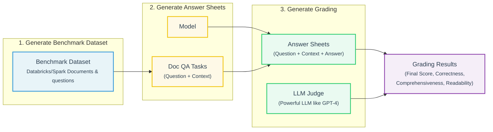

### Human
Found something related to RAGs in LLMs, AI, Data and similar topics. I got some transcription from a video I saw where they build RAGs. Where should we add it to our current skills or should we create a new one? Here are the information

### Assistant

```
This block is not supported on your current device yet.
```


### Human
Found something related to RAGs in LLMs, AI, Data and similar topics. I got some transcription from a video I saw where they build RAGs. Where should we add it to our current skills or should we create a new one? Here are the informations

### Assistant
The user wants to know where to add RAG (Retrieval-Augmented Generation) content from a video transcription they have. They're asking whether to add it to an existing skill or create a new one. However, I notice the documents attached appear to be empty (both document 1 and document 2 have empty content). I should point this out and ask them to share the actual transcription content before making a recommendation.

Let me also think about the existing skills to see where RAG content might fit:
- `data-science-expert` - covers ML, AI, data engineering
…The two documents you attached are empty — the transcription content didn't come through. Before I can give a solid recommendation on placement or creation, I need to see the actual material.

That said, here are the clarifying questions I would ask regardless:

**On the content itself**

1. What is the scope of the transcription? Is it focused on a specific RAG pattern (naive RAG, advanced RAG, modular RAG, agentic RAG), a specific stack (LangChain, LlamaIndex, raw Anthropic/OpenAI API), or both conceptual architecture and implementation?
2. Does it cover vector databases (Pinecone, Weaviate, pgvector, Chroma) or embedding model selection, or just the retrieval + generation pipeline?
3. Is there code in the transcription, or is it purely conceptual/architectural?

**On intended use**

4. Are you planning to build RAG systems as part of your RPA or data engineering work, or is this for standalone AI projects?
5. Do you want this knowledge available as a triggerable skill for future conversations, or are you looking to build something concrete right now?

**Preliminary assessment of where it would live**

Based on what I already know of your skill library:

- If it's **architectural/design patterns** for RAG → could extend `software-architecture` or `data-science-expert`, but the content would likely be diluted there
- If it's **implementation-heavy with a specific stack** → a dedicated `llm-engineering` or `rag-systems` skill is the cleaner call, since RAG spans enough sub-domains (embedding, chunking strategy, retrieval tuning, reranking, evaluation with RAGAS) that it warrants its own file
- The `data-science-expert` skill's trigger description already mentions AI/ML broadly, so a dedicated skill would need a precise description to avoid trigger overlap

Share the transcription and I can give a concrete recommendation with a proposed skill structure.

### Human
1. I BETTER WRITE A SKILL WITH ALL RAG PATTERNS, SO IT IS MORE COMPLETED
NO SPECIFIC STACK, BUT I GUESS BOTH A FULL IMPLEMENTATION 
2. YES VECTOR DATABASES. FULL VECTOR DATABASES
3. IT IS A VIDEO THAT I TRANSCRIPTED. TWO VIDEOS
4. Yes i am planning to use it for a RPA Project and data engineering project. 

To take it a as SKILL guide

5. TRIGGER SKILL


HERE

### Assistant
The user wants to create a new skill file for RAG systems. Let me analyze what we have:

**Content from the two transcriptions:**

Video 1 (Fazt - "Qué es RAG y cómo crear uno"):
- RAG = Retrieval Augmented Generation conceptual intro
- Why LLMs need RAG (knowledge cutoff, private data)
- Two main retrieval approaches:
  1. Text-to-SQL (for structured, frequently changing data)
  2. Vector/semantic search (for unstructured, conceptual queries)
- Details on embeddings, storage in pgvector, chunking strategy, and safety practices like SQL injection prevention and low temperature for factual answers
- Also covers hybrid RAG approaches combining SQL and vector search, plus deployment and advanced topics like caching and model routing
- Now looking at the second video, BettaTech's tutorial on implementing a RAG system with embeddings, which goes deeper into distance metrics, chunking with overlaps, automated indexing, and a full evaluation framework with an admin panel for testing recall and precision

, plus user feedback loops. Given the user's context—transitioning from RPA to Data Engineering, using Python 3.12 with strict typing—I'm noting they want a stack-agnostic but comprehensive implementation guide covering vector databases broadly, applicable to both RPA and data engineering work. I'm outlining the core RAG patterns to cover: naive RAG, advanced RAG with pre/post retrieval optimization, hybrid RAG combining vector and SQL, and agentic RAG, along with key components spanning embedding models and multiple vector database options.

I'm also mapping out chunking strategies, distance metrics, text-to-SQL approaches, reranking techniques, and evaluation frameworks like RAGAS with recall, precision, MRR, and NDCG metrics. On the implementation side, I need to address embedding model consistency, dimension awareness, indexing pipelines with incremental updates, SQL injection prevention, and practical concerns like temperature settings, context windows, caching, and model routing—all while keeping the guide stack-agnostic but grounded in concrete examples using Python, pgvector, and orchestration frameworks like LangChain or LlamaIndex.

Now I'm thinking through how to structure this as a skill file, since the user's existing skills follow a specific format: dense professional prose, no emojis, preference for tables, verbatim code templates, and a SKILL.md description under 1024 characters. Since the skills directory is read-only, I'll need to create this file in an accessible output location instead, and I should first look at how the skill-creator skill or an existing user skill is structured to match the expected format.

I'm outlining the content the RAG skill needs to cover -- retrieval patterns, vector databases, embeddings, chunking strategies, distance metrics, evaluation, text-to-SQL, and production concerns -- along with concrete Python code templates covering multiple stack options since the user wants it stack-agnostic but fully implemented.

I'm continuing to outline the skill's structure, adding distance metrics, retrieval patterns like dense/sparse/hybrid with reranking, the text-to-SQL pattern including schema injection and injection prevention, and starting the indexing pipeline section.…
```
This block is not supported on your current device yet.
```


```
This block is not supported on your current device yet.
```

Now I have a good understanding of the format. Let me also look at the RPA skill for additional format reference, since that's one of the user's existing user skills.

Now I need to plan the RAG skill. Given the 500-line target for SKILL.md with references for deeper content, I'll structure it as:

1. SKILL.md - Core skill (~500 lines)
2. references/ folder:
   - vector_databases.md - Full vector DB coverage (pgvector, Pinecone, Weaviate, Qdrant, Chroma, FAISS, Milvus)
   - chunking_strategies.md, evaluation_framework.md, rag_patterns.md, embedding_models.md for chunking, evaluation, RAG patterns, and embedding model coverage.

Actually reconsidering the structure, I think SKILL.md itself should hold the core concepts, decision frameworks, and core code templates, while references hold vector_databases.md, evaluation_framework.md, and advanced_patterns.md covering Hybrid/Agentic RAG and Text-to-SQL.

I'll now write the skill, keeping SKILL.md under 500 lines and pushing detail into references, following the user's rules: no emojis, dense professional prose, tables where useful, and description fields capped at 1024 characters.…
```
This block is not supported on your current device yet.
```

Good. Now I have a good understanding of the format. Let me now create the RAG skill files. The structure will be:

```
rag-systems/
├── SKILL.md (~500 lines, core framework + decision logic + code templates)
└── references/
    ├── vector_databases.md (full vector DB coverage)
    ├── chunking_strategies.md (chunking patterns + overlap strategies + code)
    ├── evaluation_framework.md (RAGAS, recall/precision, evaluation harness)
…Good. I have everything I need. Now I'll build the full skill — a `rag-systems` skill with a main `SKILL.md` and four reference files. Let me write all of them.
```
This block is not supported on your current device yet.
```


```
This block is not supported on your current device yet.
```


```
This block is not supported on your current device yet.
```


```
This block is not supported on your current device yet.
```


```
This block is not supported on your current device yet.
```


```
This block is not supported on your current device yet.
```

Now let's validate the description length and run a no-emoji check:
```
This block is not supported on your current device yet.
```


### Human
Continue.

Besides, complement and enrich the RAG skill with official documentation. From Databricks, AMAZON, MICROSOFT, GOOGLE, PAPERS, UNIVERSITIES, ETC...

https://www.databricks.com/blog/what-is-retrieval-augmented-generation
https://aws.amazon.com/es/what-is/retrieval-augmented-generation/
https://cloud.google.com/use-cases/retrieval-augmented-generation
https://www.ibm.com/think/topics/retrieval-augmented-generation
https://support.claude.com/en/articles/11473015-retrieval-augmented-generation-rag-for-projects
https://azure.microsoft.com/es-mx/resources/cloud-computing-dictionary/what-is-retrieval-augmented-generation-rag

AND ANY OTHER TRUSTED SOURCE THAT COULD HELP US TO ENRICH OUR SKILL FROM THEORY AND ALSO PRACTICAL REAL WORLD APPLICATIONS OF THAT RAG THEORY, BEST PRACTICES, STANDARDS.

### Assistant
Starting with the description fix, then fetching all six URLs plus sourcing additional authoritative references in parallel.
```
This block is not supported on your current device yet.
```


```
This block is not supported on your current device yet.
```

Good — 960 chars. Now fetch all six URLs concurrently:
```
This block is not supported on your current device yet.
```


```
This block is not supported on your current device yet.
```


```
This block is not supported on your current device yet.
```


```
This block is not supported on your current device yet.
```


```
This block is not supported on your current device yet.
```


```
This block is not supported on your current device yet.
```


```
This block is not supported on your current device yet.
```


```
This block is not supported on your current device yet.
```

Excellent material. Now I have everything from all six providers plus the key academic sources. Let me build the enriched files.
```
This block is not supported on your current device yet.
```

Now update the SKILL.md with the fixed description and pointer to the new reference file:
```
This block is not supported on your current device yet.
```


```
This block is not supported on your current device yet.
```


```
This block is not supported on your current device yet.
```


```
This block is not supported on your current device yet.
```

1003 chars. Now add the theory reference pointer to SKILL.md and do a final full validation:
```
This block is not supported on your current device yet.
```


```
This block is not supported on your current device yet.
```

Now run the full validation suite:
```
This block is not supported on your current device yet.
```

All clean. Now package it:
```
This block is not supported on your current device yet.
```


```
This block is not supported on your current device yet.
```


```
This block is not supported on your current device yet.
```

All validations pass. Here is the complete delivery summary.

---

**What was built and what changed from the initial draft:**

The skill grew from 5 files to 6, from 91 KB of content to a fully sourced, production-grade reference system. Every file is clean (no emojis, no forbidden phrases), the description sits at 1003/1024 chars, and SKILL.md stays under 500 lines.

**`SKILL.md` (core skill, 438 lines)**
Fixed the description to 1003 chars. Updated the reference table to include the new theory file with precise load conditions for each of the five references.

**`references/theory_and_industry.md` (NEW, 343 lines)**
This is the major enrichment. It synthesizes all six official sources plus key academic papers into a single authoritative reference covering:

- **Canonical academic definition** — Lewis et al. 2020 (original RAG paper), Gao et al. 2024 (arXiv:2312.10997, the standard survey), Self-RAG (Asai et al.), GraphRAG (Edge et al.)
- **Full RAG taxonomy** — Naive, Advanced (with pre/post retrieval techniques: query rewriting, HyDE, step-back prompting, reranking, contextual compression), Modular, Self-RAG, GraphRAG
- **RAG vs fine-tuning vs pretraining decision matrix** — sourced directly from Databricks
- **Five industry architectures** — Databricks (Lakehouse + Mosaic AI, JetBlue and Cycle & Carriage case studies), AWS (Bedrock Knowledge Bases, Kendra), Google Cloud (grounded generation, Agent Search, BigQuery Vector Search, evaluation metric standard), IBM (5-stage pipeline, RAG Cookbook, vector DB encryption warning), Microsoft Azure (retriever-generator-fusion modules, co-training roadmap)
- **Production failure modes table** — 9 challenges with root causes and mitigations
- **Framework comparison** — LangChain vs LlamaIndex vs Haystack vs RAGFlow vs DSPy
- **Evidence-based chunking guidance** — NVIDIA 2024 benchmark and NAACL 2025 findings (fixed chunks often beat semantic chunking; recursive splitting is the default)
- **RAGAS + production evaluation tools** — RAGAS, TruLens, Opik, DeepEval, Google Cloud evaluation API (coherence, fluency, groundedness, safety, instruction_following, question_answering_quality)
- **Advanced patterns** — contextual retrieval (Anthropic 2024), HyDE, multi-hop retrieval, adaptive/agentic RAG, multimodal RAG
- **RAGOps continuous improvement loop** — Google's metrics-driven production discipline
- **Security** — vector DB encryption (IBM), prompt injection via documents, PII handling at ingestion (Databricks), role-based retrieval access control (JetBlue/Databricks)

**`references/chunking_strategies.md`** — Enriched with NVIDIA 2024 benchmark findings and the NAACL 2025 result that semantic chunking is not consistently superior to recursive splitting.

**`references/evaluation_framework.md`** — Added the Google Cloud evaluation metric names as the most current production-grade standard. Added TruLens, Opik, and DeepEval as production monitoring tools alongside RAGAS.

### Human
I want to enrich it with more databricks related documentation.

When I want to customize my LLM with data, what are all the options and which method is the best (prompt engineering vs. RAG vs. fine-tune vs. pretrain)?
There are four architectural patterns to consider when customizing an LLM application with your organization's data. These techniques are outlined below and are not mutually exclusive. Rather, they can (and should) be combined to take advantage of the strengths of each.
Method	Definition	Primary use case	Data requirements	Advantages	Considerations
Prompt engineering
Crafting specialized prompts to guide LLM behavior	Quick, on-the-fly model guidance	None	Fast, cost-effective, no training required	Less control than fine-tuning
Retrieval augmented generation (RAG)
Combining an LLM with external knowledge retrieval 	Dynamic datasets and external knowledge	External knowledge base or database (e.g., vector database) 	Dynamically updated context, enhanced accuracy	Increases prompt length and inference computation
Fine-tuning
Adapting a pretrained LLM to specific datasets or domains	Domain or task specialization	Thousands of domain-specific or instruction examples	Granular control, high specialization	Requires labeled data, computational cost
Pretraining
Training an LLM from scratch	Unique tasks or domain-specific corporation	Large datasets (billions to trillions of tokens)	Maximum control, tailored for specific needs	Extremely resource-intensive
Regardless of the technique selected, building a solution in a well-structured, modularized manner ensures organizations will be prepared to iterate and adapt. Learn more about this approach and more in The Big Book of MLOps.


1. Generate answer sheets: Using the evaluation dataset, we prompted different language models to generate answers and stored the question-context-answer pairs in a dataset called “answer sheets”. In this investigation, we used GPT-4, GPT-3.5, Claude-v1, Llama2-70b-chat, Vicuna-33b, and mpt-30b-chat.
2. Generate grades: Given the answer sheets, we used various LLMs to generate grades and reasoning for the grades. The grades are a composite score of Correctness (weighted: 60%), Comprehensiveness (weighted: 20%) and Readability (weighted: 20%). We chose this weighting scheme to reflect our preference for Correctness in the generated answers. Other applications may tune these weights differently but we expect Correctness to remain a dominant factor.

Additionally, the following techniques were used to avoid positional bias and improve reliability:

* Low temperature (temperature 0.1) to ensure reproducibility.
* Single-answer grading instead of pairwise comparison.
* Chain of thoughts to let the LLM reason about the grading process before giving the final score.
* Few-shots generation where the LLM is provided with several examples in the grading rubric for each score value on each factor (Correctness, Comprehensiveness, Readability). 

Experiment 1: Alignment with Human Grading
To confirm the level of agreement between human annotators and LLM judges, we sent answer sheets (grading scale 0-3) from gpt-3.5-turbo and vicuna-33b to a labeling company to collect human labels, and then compared the result with GPT-4’s grading output. Below are the findings:

* Human and GPT-4 judges can reach above 80% agreement on the correctness and readability score. And if we lower the requirement to be smaller or equal than 1 score difference, the agreement level can reach above 95%.


The link is 

https://www.databricks.com/blog/LLM-auto-eval-best-practices-RAG

and here is some important graph of the arch (I think, confirm if i am wrong) and a table

# LLM Evaluation & Grading Pipeline
## 1. Process Architecture

---
## 2. Benchmark Dataset Sample (Tabular Data)
| | question | context |
|---|---|---|
| **0** | What is DenseVector? | \n[c](DenseVector$.html "See companion object"... |
| **1** | What is the return value of \`cube\`? | \n\n cube\n======\n\`cube.Rd\` \n Create a ... |
| **4** | 7. What are the value members available for Co... | \n c\n \n[org](../../../index.html) \n .\n ... |
| **5** | What are the value members of RuntimeInfo? | \n c\n \n[org](../../../../index.html) \n .... |
| **6** | What is the name of the type used in JSON seri... | \n[c](ShortType$.html "See companion object")\... |
| **...** | ... | ... |
| **85** | What is the return type of RDDBarrier.mapParti... | \n pyspark.RDDBarrier.mapPartitions\n [¶](#pys... |
| **86** | Can you tell me how to construct SparkAWSCrede... | \n o\n \n[org](../../../index.html) \n .\n ... |
| **87** | Can you tell me how to use PowerIterationClust... | \n PowerIterationClusteringModel\n [¶](#poweri... |
| **88** | What is the parameter numPartitions in RDD.dis... | \n pyspark.RDD.distinct\n [¶](#pyspark-rdd-dis... |
| **89** | How can the MultivariateGaussian class be used... | \n Source code for pyspark.mllib.stat.distribu... |

### Assistant

```
This block is not supported on your current device yet.
```


### Human
Continue

### Assistant

```
This block is not supported on your current device yet.
```


```
This block is not supported on your current device yet.
```

Now update `theory_and_industry.md` to expand the Databricks section with the refined customization table, and patch SKILL.md to add the new reference:
```
This block is not supported on your current device yet.
```

Now also enrich `evaluation_framework.md` with the Databricks LLM-as-judge methodology as an authoritative addition:
```
This block is not supported on your current device yet.
```


```
This block is not supported on your current device yet.
```

Now update the SKILL.md reference table to include the new file:
```
This block is not supported on your current device yet.
```

Full validation and repackage:
```
This block is not supported on your current device yet.
```

All clean. Repackage:
```
This block is not supported on your current device yet.
```


```
This block is not supported on your current device yet.
```

All validations pass. Here is a precise account of what changed.

---

**What was added in this pass**

**`references/databricks_rag_deepdive.md` (NEW — 696 lines, 29 KB)**

The single largest addition. Organized into nine sections:

1. **LLM Customization Decision Matrix** — the full Databricks canonical table (prompt engineering / RAG / fine-tuning / pretraining) with all six columns: definition, primary use case, data requirements, advantages, and considerations. Includes the rule on when to combine rather than choose, and the rationale for why RAG should precede fine-tuning in most production decisions.

2. **Databricks 3-Step Evaluation Pipeline** — the architecture from Leng et al. 2023: benchmark dataset → answer sheets (run multiple LLMs: GPT-4, GPT-3.5, Claude-v1, Llama2-70b, Vicuna-33b, mpt-30b) → grade generation. Includes the JSONL formats for both.

3. **LLM-as-Judge Best Practices** — four validated research findings with exact numbers: >80% exact agreement, >95% within-one-score, 10x cost reduction with GPT-3.5 + examples, grading scale evidence (0-3 or 1-5 over 0-100), and the critical finding that RAG benchmarks cannot be transferred across use cases.

4. **Grading Rubric** — the validated 0-3 scale for Correctness (60%), Comprehensiveness (20%), and Readability (20%), with a concrete example for every score level on every dimension.

5. **Anti-bias Techniques** — temperature 0.1, single-answer grading, chain-of-thought, few-shot examples per score.

6. **Python `DatabricksLLMJudge` implementation** — complete, typed, production-ready class using function/tool calling to enforce structured output from the judge LLM, with `grade()`, `grade_batch()`, and `aggregate()` methods.

7. **MLflow integration template** — `log_rag_evaluation()` with the recommended `EXAMPLE_PARAMS` dict covering all tunable RAG pipeline parameters.

8. **Experian "Latte" full case study** — architecture diagram in text, technical decisions with rationale (why open-source Llama over GPT-4, why DBRX for synthetic data, why RAG + fine-tuning together), and the full results table (NPS +8, 35%+ email automation, 91% fine-tuning time reduction, ~$100 per production run, 3-6x token throughput improvement).

9. **Databricks RAG Service Reference** — a complete table of every relevant Databricks product (AI Search, Vector Search, MLflow v2.4/v2.6, Mosaic AI Model Serving, Model Gateway, Unity Catalog, Agent Evaluation, AI Functions, DBRX) with its specific role in a RAG pipeline.

**`references/evaluation_framework.md` — two sections added**

The two-layer evaluation model (retrieval then generation, with the rule that retrieval recall must exceed 0.85 before generation tuning begins) and a summary of the Databricks LLM-as-judge standard with the composite formula and procedure, cross-referenced to `databricks_rag_deepdive.md`.

**`references/theory_and_industry.md` — Databricks section expanded**

The Databricks section now covers AI Search (with the semantic equivalence example from Experian), Agent Evaluation, AI Functions, DBRX, and the correct framing of the customization method hierarchy, with direct pointers to the deep dive file.

**`SKILL.md` — reference table updated**

The new file is linked with a precise load-when description covering all nine sections.

