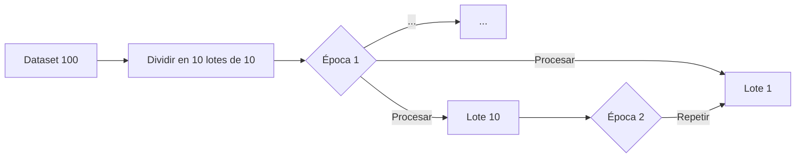

---
tags:
  - DeepLearning
  - Master
  - Maestria
  - Semestre2
Created: 2025-04-02
---

tags: #DeepLearning #Master #Maestria #Semestre2 


# Entrenamiento de Redes Neuronales: Batch Size y Épocas 🧠🔄

## 📊 Datos de Entrenamiento
- **Tamaño total del dataset**: 100 ejemplos  
  `[50 entrenamiento + 50 validación]`
- **Configuración propuesta**:  
  ```yaml
  batch_size: 10  # Lotes de 5 + 5
  epochs: 10       # 10 pasadas completas
```

## 🔑 Conceptos Clave

### 1. Batch Size (Tamaño de Lote) 📦

- **Definición**: Cantidad de muestras procesadas antes de actualizar parámetros
    
- **Fórmula**:
    
    Actualizaciones/Eˊpoca=ndatasetbatch_sizeActualizaciones/Eˊpoca=batch_sizendataset​​
- **Analogía**:
    
    > "Aprender 10 multiplicaciones/sesión vs 100 de una vez previene saturación cognitiva"
    

### 2. Época (Epoch) ⏳

- **Definición**: Pasada completa por todo el dataset
- **Relación matemática**:
1 Época=∑k=1nbatchesActualizacioˊn(θ(k))1 Eˊpoca=k=1∑nbatches​​Actualizacioˊn(θ(k))

---

## 🧮 Explicación Matemática

### Cálculo de Iteraciones por Época

Iteraciones/Eˊpoca=ndatasetbatch_size=10010=10Iteraciones/Eˊpoca=batch_sizendataset​​=10100​=10

**Donde**:

- ndataset=100ndataset​=100 (Total de ejemplos)
- batch_size=10batch_size=10 (Ejemplos por lote)

### Proceso Completo (10 épocas)



## ⚖️ Batch Size vs Full Batch (Comparación Matemática)

| Característica      | Batch Size Pequeño (bs≪ nbs≪ n) | Full Batch (bs=nbs=n) |
| ------------------- | ------------------------------- | --------------------- |
| **Actualizaciones** | nbsbsn​ por época               | 11 por época          |
| **Memoria**         |                                 |                       |
| **Convergencia**    |                                 | ∝1∝1                  |
| **Generalización**  | Mejor (→ )                      | Riesgo de sobreajuste |

---

## 💡 Mejores Prácticas (Formalizado)

1. **Tamaño de lote óptimo**:
    
    16≤batch_size∗≤512 (GPU-dependent)16≤batch_size∗≤512 (GPU-dependent)
2. **Early Stopping**:
    
    ∃ tpatience∈N ∣ Lval∃ tpatience​∈N ∣ Lval​
3. **Monitorización**:
```python
model.fit(X_train, y_train,
          validation_data=(X_val, y_val),
          batch_size=10,  # → \( \text{bs} = 10 \)
          epochs=10)      # → \( n_{\text{epochs}} = 10 \)
```

Accuracy=m1​i=1∑m​I(y^​i​=yi​)×100%​

