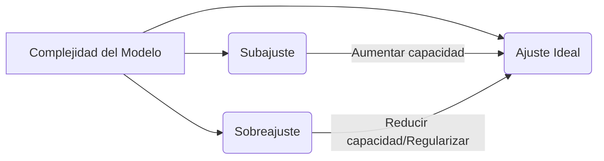
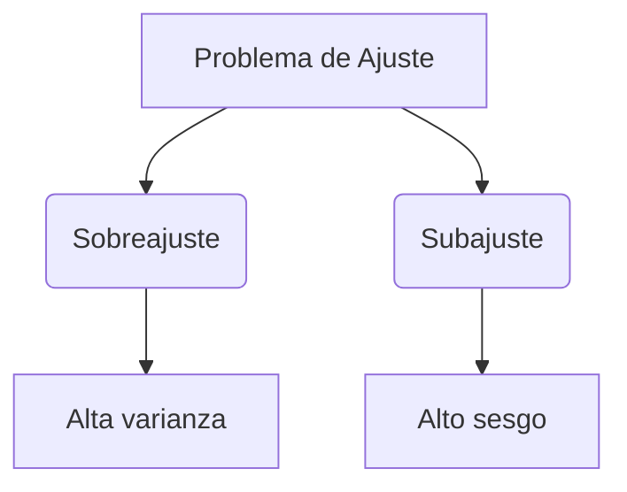
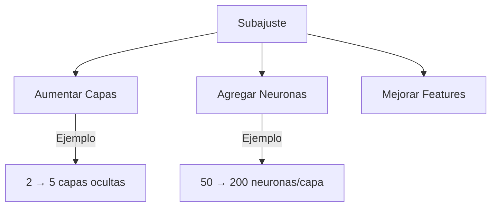
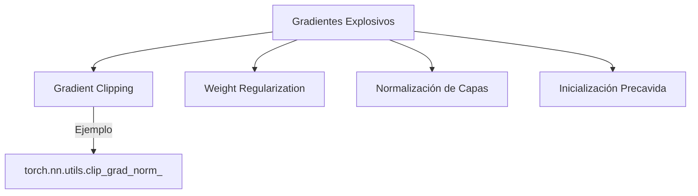
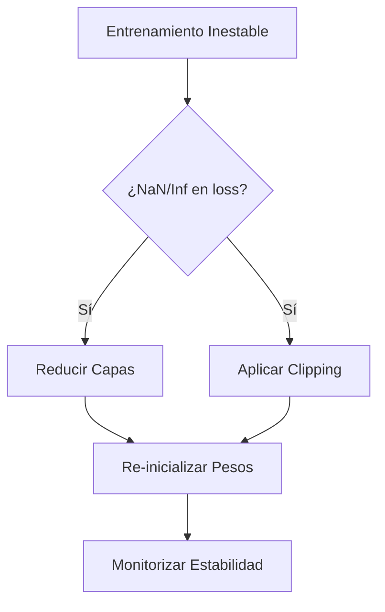

# Introducción
Una de las características particulares de las redes neuronales es que su funcionamiento depende en gran medida del correcto ajuste de sus componentes; así, es necesario estudiar prácticas que permitan ajustar dichas componentes de forma adecuada. Al finalizar esta unidad estaremos en la capacidad de **implementar metodologías que les permitan a las redes neuronales obtener resultados favorables de forma sistemática.**

## Objetivo
Comprender los procesos que potencian el funcionamiento de las redes neuronales profundas a través del ajuste de sus componentes para obtener resultados favorables de forma sistemática.

# 🧠 Dificultad de las redes neuronales

Hasta este momento, hemos aprendido los conceptos básicos de una red neuronal profunda y hemos podido percibir que existen diversos componentes que deben ser ajustados con el fin de garantizar que el modelo funcione de forma correcta.  
  
Una incorrecta sintonización de dichas componentes puede conllevar a problemas como, el sobreajuste **(overfitting)**, el subajuste **(underfitting)**, los gradientes explosivos **(exploiding gradients)** y los gradientes que se desvanecen **(vanishing gradients)**. 

Observemos la siguiente presentación interactiva en el cual se explican los principales problemas relacionados con las redes neuronales:


---


## Sobreajuste vs Subajuste

### 🔍 Ajuste Adecuado (Ideal)

<div align="center" style="padding: 20px; background: #f8f9fa; border-radius: 12px; margin: 25px 0; box-shadow: 0 2px 8px rgba(0,0,0,0.1);">
  
  <br>
  <small style="display: block; margin-top: 15px; color: #4a5568; font-size: 0.9em;">
    🖼 <b>Fig. 1</b> - Modelo de regresión lineal con ajuste óptimo
  </small>
</div>

<div align="center" style="padding: 20px; background: #fff; border-radius: 12px; margin: 25px 0; border: 1px solid #e2e8f0;">
  
  <br>
  <div style="margin-top: 15px; padding: 12px; background: #f7fafc; border-radius: 6px; display: inline-block;">
    <small style="color: #2d3748; font-size: 0.85em;">
      📈 <b>Fig. 2</b> - Evolución de pérdida durante el entrenamiento<br>
      <span style="color: #718096;">(Línea continua: entrenamiento | Línea discontinua: validación)</span>
    </small>
  </div>
</div>


- **Definición clave**:  
  _"Modelo que generaliza bien capturando patrones esenciales sin memorizar ruido"_

- **Características**:
  - ✅ Balance entre complejidad y simplicidad
  - ✅ Rendimiento consistente (entrenamiento + test)
  - ✅ Error de entrenamiento ≈ Error de validación

- **Indicadores**:
```python
  # Pseudocódigo de evaluación
  if (test_loss < threshold) and (abs(train_loss - test_loss) < epsilon):
  print("¡Modelo bien ajustado!")
```

### ⚠️ Problemas Comunes

|Concepto|🎯 Definición|🚩 Señales de Alerta|📉 Consecuencias|
|---|---|---|---|
|**Sobreajuste**|Modelo memoriza datos de entrenamiento|- Error entrenamiento ≪ test  <br>- Alta varianza|Pobre generalización|
|**Subajuste**|Modelo no captura patrones esenciales|- Error alto en ambos sets  <br>- Alto sesgo|Capacidad predictiva limitada|

### 📊 Visualización Comparativa



### 🛠 Técnicas de Mitigación

**Para Sobreajuste**:
- 🛡 Regularización (L1/L2)
- 🌳 Dropout
- 🎯 Early Stopping

**Para Subajuste**
- 🧠 Aumentar capacidad modelo
- 🔍 Ingeniería de características
- ⏳ Entrenar por más epochs


### 📌 Definiciones Clave




### 🚨 Sobreajuste en Redes Neuronales: Análisis Visual

<div align="center" style="padding: 20px; background: #fff5f5; border-radius: 12px; margin: 25px 0; border: 2px solid #fed7d7;">
  
  
  <div style="margin-top: 20px; display: grid; grid-template-columns: repeat(2, 1fr); gap: 15px;">
    <div style="padding: 10px; background: #fff; border-radius: 6px; border-left: 4px solid #f56565;">
    </div>
  </div>
</div>

- El sobre-ajuste es el fenómeno donde **el modelo intenta capturar toda la información de los datos de entrenamiento**.
- En general, **los datos pueden presentan ruido**. En el sobre-ajuste, el modelo identifica patrones ruidosos que pueden afectar su rendimiento en los conjuntos de validación.
- El sobre-ajuste **se caracteriza por un rendimiento alto en la etapa de entrenamiento (Costo bajo, Accuracy alto) y un rendimiento bajo en el conjunto de validación (Costo alto, Accuracy bajo)**.
- Existen **estrategias que disminuyen** el impacto del sobre-ajuste. Entre estas se reconocen: ***La regularización, el dropout y la parada temprana  (Early stopping)***.
- Otra alternativa es **reducir la complejidad de la red**. Por ejemplo, **quitando capas ocultas o la cantidad de neuronas por capa**. 
- Los modelos más simples son menos propensos a sufrir de sobre-ajuste.


### 🚧 Subajuste en Redes Neuronales: Diagnóstico y Soluciones

<div align="center" style="padding: 20px; background: #f0f4ff; border-radius: 12px; margin: 25px 0; border: 2px solid #c3dafe;">
  
  
  <div style="margin-top: 20px; display: grid; grid-template-columns: repeat(2, 1fr); gap: 15px; text-align: left;">
    <div style="padding: 15px; background: #ebf8ff; border-radius: 6px;">
    </div>
  </div>
</div>


- El sub-ajuste es el fenómeno en el cual **el modelo no es lo suficientemente robusto para capturar la estructura de los datos.** 
- En general, el sub-ajuste **se identifica cuando el modelo no alcanza el rendimiento esperado**.
- El **rendimiento esperado es un aspecto subjetivo que debe definirse de acuerdo con la aplicación** y/o con base en el consejo de un experto.
- El sub-ajuste **puede minimizarse al utilizar modelos más complejos**. En el caso de las redes neuronales, una solución al sub-ajuste corresponde a **agregar más capas o más neuronas por capa**.



#### 💻 Implementación Práctica
```python
# Ejemplo de aumento de capacidad en Keras
model = Sequential([
    Dense(256, activation='relu', input_shape=(input_dim,)),
    Dense(256, activation='relu'),  # Capa adicional
    Dense(output_dim, activation='sigmoid')
])

model.compile(optimizer='adam', 
             loss='binary_crossentropy',
             metrics=['accuracy'])
```


---


## 💥 Gradientes Explosivos: Análisis y Soluciones

### 🔍 Definición Clave
Problema en redes profundas donde los gradientes crecen exponencialmente durante el backpropagation, causando inestabilidad numérica.


$$
\mathbf{w}^{(t+1)} = \mathbf{w}^{(t)} - \eta \cancel{\frac{\partial \mathcal{L}(\mathbf{w})}{\partial \mathbf{w}}}^{\infty} \\
\mathbf{w}^{(t+1)} \to \infty
$$


### 📈 Análisis Matemático

**Cadena de derivadas en redes profundas**:

$$
\frac{\partial \mathcal{L}}{\partial w_{\text{capal}}} = \prod_{k=1}^{K} \frac{\partial h_k}{\partial h_{k-1}} \cdot \frac{\partial \mathcal{L}}{\partial h_{\text{output}}}
$$

| Condición          | Efecto en Gradiente     | Consecuencia         |
| ------------------ | ----------------------- | -------------------- |
| $\prod \gamma > 1$ | Crecimiento exponencial | Explosión numérica   |
| $\prod \gamma = 1$ | Estabilidad ideal       | Convergencia estable |
| $\prod \gamma < 1$ | Desvanecimiento         | Aprendizaje lento    |

### 🚨 Consecuencias Prácticas

1. **Inestabilidad numérica**: Valores NaN en cálculos
2. **Actualizaciones de parámetros catastróficas**
3. **Imposibilidad de convergencia**
4. **Saturación de funciones de activación**

## 🛠 Técnicas de Mitigación



## 💻 Implementación de Gradient Clipping

```python
# Ejemplo en PyTorch
optimizer = torch.optim.Adam(model.parameters(), lr=0.001)
torch.nn.utils.clip_grad_norm_(model.parameters(), max_norm=1.0)
optimizer.step()
```

### 📉 Ejemplo Numérico


$$
\begin{align}
\gamma &= 1.5 \quad (\text{Factor por capa}) \\
\text{Después de 10 capas:} \quad \prod \gamma &= 1.5^{10} \approx 57.66 \\
\text{Después de 20 capas:} \quad \prod \gamma &= 1.5^{20} \approx 3325.26
\end{align}
$$


<div style="background: #fff5f5; padding: 15px; border-radius: 8px; margin: 20px 0; border-left: 4px solid #fc8181;">
  <div style="display: grid; grid-template-columns: 30px 1fr; gap: 10px; align-items: center;">
    <div style="font-size: 1.5em;">🔴</div>
    <div>
      <strong>Inestabilidad numérica:</strong><br>
      <code>loss = [0.5, 12.7, NaN, 1e+15, -inf]</code>
    </div>
  </div>
  
  <ul style="margin-top: 10px; color: #2d3748;">
    <li>Variaciones > 100% entre epochs consecutivos</li>
    <li>Valores extremos en parámetros: ‖W‖ > 1e6</li>
  </ul>
</div>

## 🛠 Estrategias de Mitigación

### 🔧 Técnicas Fundamentales
| Método                  | Mecanismo                     | Implementación Ejemplo          |
|-------------------------|-------------------------------|----------------------------------|
| **Reducción de Capas**  | Limita profundidad computacional | `model = Sequential([Dense(64), Dense(1)])` |
| **Inicialización Adecuada** | Controla magnitud inicial | `keras.initializers.GlorotNormal()` |
### 📐 Ecuación Clave

Actualización de parámetros con control:

$$
w^{(t+1)} = \text{clip}\left(w^{(t)} - \eta \nabla_w \mathcal{L},\; \theta_{\text{max}}\right)
$$




$$
\text{NaN} = \infty - \infty \quad
$$


---

# 🔵 Gradientes que se **desvanecen**

## 🧠 Concepto

- En redes neuronales profundas, el cálculo del gradiente involucra la multiplicación sucesiva de derivadas a través de las capas.
- Si los factores multiplicativos son **menores que uno**, el valor del gradiente puede tender a **cero** conforme retropropaga.
- Como resultado, las actualizaciones de los pesos se vuelven insignificantes:

$$
\mathbf{w}^{(t+1)} = \mathbf{w}^{(t)} - \eta \cdot \frac{\partial \mathcal{L}(\mathbf{w})}{\partial \mathbf{w}} \approx \mathbf{w}^{(t)} \quad \text{cuando } \frac{\partial \mathcal{L}}{\partial \mathbf{w}} \to 0
$$

## ▶ Explicación de cada componente:

| Parte                                                          | Código                                                         | Significado                                                         |
| -------------------------------------------------------------- | -------------------------------------------------------------- | ------------------------------------------------------------------- |
| $\mathbf{w}^{(t)}$                                             | `\mathbf{w}^{(t)}`                                             | Vector de pesos en el tiempo `t`.                                   |
| $\eta$                                                         | $\eta$                                                         | Tasa de aprendizaje.                                                |
| $\frac{\partial \mathcal{L}(\mathbf{w})}{\partial \mathbf{w}}$ | `\frac{\partial \mathcal{L}(\mathbf{w})}{\partial \mathbf{w}}` | Derivada parcial de la función de pérdida con respecto a los pesos. |
| $\to 0$                                                        | `\to 0`                                                        | Indica que la derivada se aproxima a cero.                          |


- Es decir, los **pesos no cambian significativamente**, lo cual impide el aprendizaje.

## 🧩 Causas principales

- Multiplicación repetida de números < 1 en la retropropagación.
- Uso de funciones de activación **sigmoidales** o **tangente hiperbólica** en capas ocultas, ya que su derivada es pequeña en la mayoría de su dominio:
    - `sigmoid(x) → (0,1)`, su derivada máxima es 0.25.
    - `tanh(x) → (-1,1)`, su derivada máxima es 1, pero también tiende a 0 en los extremos.
        

---

# 🔵 Gradientes que se **desvanecen II**

## ⚠️ ¿Cómo reconocer el fenómeno?

- El modelo **no mejora** durante el entrenamiento.
- La **función de pérdida se mantiene constante** tras varias iteraciones.
- El modelo **no capta la información** de los datos, presentando bajo rendimiento.
    

## 🛠️ ¿Cómo mitigar el problema?

1. **Replantear el modelo**:
    - Usar **menos capas** para evitar el colapso de los gradientes.
        
2. **Inicialización adecuada de pesos**:
    - Aplicar métodos como _Xavier_ o _He initialization_ para mantener la escala de los gradientes.
        
3. **Evitar funciones sigmoides/tanh** en capas ocultas:
    - Sustituir por funciones como `ReLU`, que **no saturan** para valores positivos y mantienen gradientes útiles.
        

> ⚠️ Nota: La función sigmoide aún es adecuada para la **capa de salida** en tareas de clasificación binaria.


