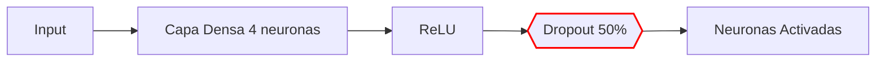

Ya tuvimos un primer acercamiento a los principales problemas que afectan el rendimiento de las redes neuronales. 

Ahora es necesario estudiar las metodologías existentes para minimizar el impacto de dichos problemas y así lograr buenos resultados de forma sistemática. 

**En primera instancia, estudiaremos algunas técnicas para minimizar el impacto del sobre y sub-ajuste.** 


Observemos el siguiente video que profundiza sobre estos temas particulares.

<iframe width="1000" height="500" src="https://www.youtube.com/embed/crlpgt03Mxs" title="M1U2 - Regularizacion" frameborder="0" allow="accelerometer; autoplay; clipboard-write; encrypted-media; gyroscope; picture-in-picture; web-share" referrerpolicy="strict-origin-when-cross-origin" allowfullscreen></iframe>
Estudiaremos las técnicas de:
1. Regularización
2. Dropout
3. Early Stopping (Parada anticipada)


# Sobre-ajuste
- Fenómeno donde el modelo tiene un rendimiento alto sobre el conjunto de entrenamiento
- Sin embargo, dicho rendimiento cae considerablemente sobre el conjunto de validación
- Los **pesos de la red tienden a ser de gran magnitud**
- Soluciones:
	- **Modificar la función de costo**, agregando un término de **regularización** que garantice que los **parámetros del modelo tengan una magnitud controlada**

$$\mathcal{L}(w) + \lambda \, \|w\|$$

### Explicación de cada término:

| Símbolo          | Significado                                                                                                                                   |
| ---------------- | --------------------------------------------------------------------------------------------------------------------------------------------- |
| $\mathcal{L}(w)$ | Función de pérdida (loss function) original del modelo                                                                                        |
| $\lambda$        | Hiperparámetro del nivel de regularización del modelo                                                                                         |
| $\|w\|$          | Norma de los pesos \( $w$ \): puede ser \( $\ell_1$ \) (Lasso) o \( $\ell_2$ \) (Ridge). **Controla la magnitud de los parámetros de la red** |

### Si $\lambda = 0$

- No se tiene en cuenta la regularización
- La optimización solo minimizará la función de costo
- **Conlleva a que el modelo sea propenso al sobre-ajusto**

### Si $\lambda >> 1$

- La regularización tiene mucho mayor peso que la función de costo
- La **optimización se enfoca** principalmente en **garantizar que los parámetros del modelo** tengan una **magnitud pequeña**
- Sin importar la función de costo
- Reduce el riesgo del sobre-ajuste
- Pero **puede que el modelo no capture bien los datos** y se presente el fenómeno del **sub-ajuste**

### En Keras $\lambda = 0.01$

# 1. Regularización

Existen dos tipos de regularización:

## 1. Regularización $L_1$

$$
\|w\| = \sum_{\forall l} |w_l|
$$

- $\|w\|$ representa la **norma** de los pesos `w`.
- $\sum_{\forall l}$ indica una **sumatoria sobre todos los índices $l$** (todos los pesos).
- $|w_l|$ es el valor absoluto del peso correspondiente al índice $l$.
- Genera soluciones **"Rallas"** o **"Sparks"**, haciendo que los parámetros de varias unidades tiendan a cero

## 2. Regularización $L_2$

Con raiz
$$
\|w\| = \sqrt{\sum_{\forall l} w_l^2}
$$

Sin raiz
$$
\|w\| = \sum_{\forall l} w_l^2
$$

### ✅ Explicación:

- $\|w\|$ es la norma de los pesos $w$.
- $\sum_{\forall l}$ es la sumatoria sobre todos los pesos.
- $w_l^2$ es el cuadrado del peso del índice $l$.
- Se toma la **raíz cuadrada** del resultado total, lo que define la norma $L_2$.


- Esto representa la **norma euclidiana** de los pesos
- Utilizada en la **regularización Ridge**, la cual **penaliza los pesos grandes**
- Tiende a **mantener todos los pesos pequeños (Que tiendan a cero)** pero no necesariamente en cero (a diferencia de $L_1$).
- Esto de tender a cero, **genera que el modelo sea menos flexible** y por lo tanto, **menos propenso al sobre-ajuste**

---

# 2. Dropout

Otra técnica que reduce el riesgo del sobre-ajuste

**Dropout** es una técnica de regularización que **desactiva aleatoriamente neuronas** durante el entrenamiento para prevenir sobreajuste (*overfitting*).  


![[Pasted image 20250601180433.png]]

- Consiste en **fijar una probabilidad $p$ para cada unidad-neurona de una capa específica**, menos en la de salida
- $P$: hiperparámetro que se denomina **Razón del Dropout - Dropout Rate**
- En cada iteración del entrenamiento, cada unidad-neurona desaparecen (se apagan) temporalmente con una probabilidad $p$
- Es decir, que en cada iteración, se **modifica la Arquitectura de la Red**
- Reduce el riesgo de sobre-ajuste, porque se reduce la complejidad de la Red en forma aleatoria

### Ejemplo concreto:  
```python
model.add(Dense(4, activation='relu'))  # Capa densa con 4 neuronas y activación ReLU
model.add(Dropout(0.5))                 # Capa Dropout con probabilidad del 50%
```

##### **🔍 Comportamiento Clave**



|Iteración|Neurona 1|Neurona 2|Neurona 3|Neurona 4|
|---|---|---|---|---|
|1|✅|❌|✅|❌|
|2|❌|✅|❌|✅|
|3|✅|❌|❌|✅|

- **`p = 0.5`**: Cada neurona tiene **50% de probabilidad** de ser temporalmente eliminada en cada iteración de entrenamiento
- **Efecto**: Obliga a la red a aprender características redundantes → Mejor generalización

#### ✨ **Consejo práctico**:
Usar $p = 0.2$,  $p= 0.5$ en capas ocultas y `p=0` en capa de salida para mejores resultados.


# 3. Early stopping

Se aplica a escenarios como el siguiente:

![[Pasted image 20250601181408.png]]

- Aquí notamos que en este caso, **se tiene un buen aprendizaje inicial**
- Esto es debido a que la **Función de Costo**, para el entrenamiento y la validación, **empiezan a decrecer**
- Pero luego de ciertas iteraciones, **la Función de Costo del Conjunto de Validación, empieza a aumentar**, dando lugar a un **Modelo Sobre-ajustado**
- En estos casos es conveniente **modificar al Algoritmo de Entrenamiento**
- Esto es para **interrumpirlo en el momento justo** que la **Función de Costo del Conjunto de Validación llega a su mínimo**

