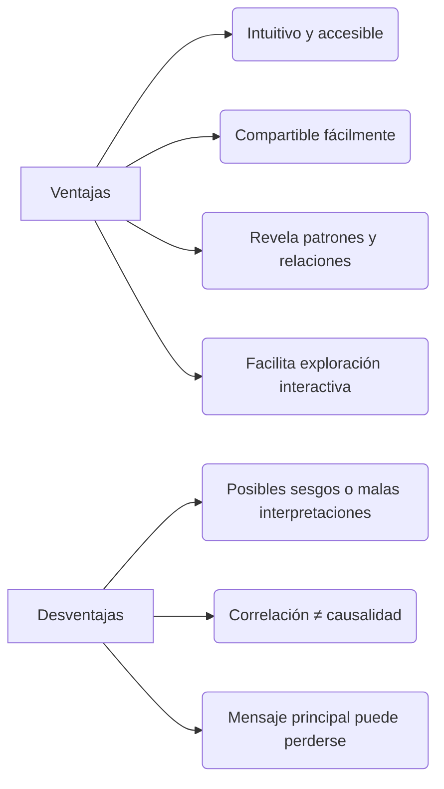
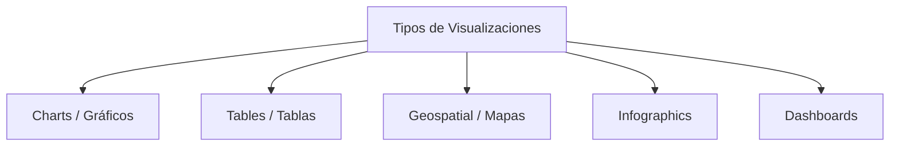

# 📌 Data Visualization – Definición y Relevancia (Tableau)

[Fuente - What Is Data Visualization? Definition, Examples, And Learning Resources”, Tableau  ](https://www.tableau.com/visualization/what-is-data-visualization)
 

![[Pasted image 20250731172416.png|500]]

## 1. ¿Qué es la _Visualización de Datos_?
Representación gráfica de información y datos mediante elementos visuales (gráficos, mapas, dashboards) para facilitar la detección de patrones, tendencias y valores atípicos.

![[Pasted image 20250731172431.png|550]]

## 2. ¿Por qué es importante?
- **Accesibilidad:** Permite a audiencias técnicas y no técnicas entender resultados complejos.
- **Comunicación:** Fomenta una cultura data-driven al difundir hallazgos de forma clara.
- **Exploración:** Facilita la interacción y el descubrimiento de oportunidades ocultas.

## 3. 🟢 Ventajas y ⚠️ Desventajas

- **Ventajas**
    1. Atrae la atención y acelera la comprensión.
    2. Simplifica la colaboración y el intercambio de insights.
    3. Destaca tendencias, relaciones y valores atípicos al instante.
    4. Ofrece exploración interactiva (filtros, drill-down, tooltips).

- **Desventajas**
    - Riesgo de malas interpretaciones si se elige mal el tipo de gráfico.
    - Correlación visual no garantiza causalidad.
    - Visualizaciones sobrecargadas pueden ocultar el mensaje principal.

## 4. Visualización en _Big Data_
- Indispensable para sintetizar trillones de registros en insights accionables.
- “Contar historias” reduciendo ruido y enfatizando lo relevante.
- Equilibrio entre **forma** (estética) y **función** (claridad).

## 5. Tipos comunes de visualizaciones

![[Pasted image 20250731172547.png]]

- **Charts / Gráficos**: barras, líneas, dispersión, etc.
- **Tables / Tablas**: ideal para comparaciones precisas o datos tabulares.
- **Geospatial / Mapas**: choropleth, isopléticas, mapas de calor georreferenciados.
- **Infographics**: mezcla de gráficos y texto para storytelling.
- **Dashboards**: conjuntos de visualizaciones interactivas en un solo panel.

_Otros ejemplos:_ box-plot, treemap, bullet graph, histograma, gantt chart, heatmap, cluster chart…

![[Pasted image 20250731172624.png]]

## 6. Mejores prácticas y principios
1. **Data-ink ratio:** maximizar la proporción de tinta dedicada a los datos.
2. **Simplicidad:** eliminar elementos decorativos innecesarios.
3. **Comparaciones claras:** agrupar datos comparables juntos.
4. **Dirección visual:** usar color y tamaño para priorizar información.
5. **Interactividad:** filtros, drill-downs y tooltips para exploración.

## 7. Herramientas y recursos

- **Tableau:** dashboards sin código, conectividad amplia (SQL, Excel, servicios cloud).
- **Power BI:** integración con Microsoft 365 y Azure.
- **Plotly / Dash / Streamlit:** visualizaciones interactivas en Python.
- **Matplotlib / Seaborn / Altair:** librerías de Python para análisis reproducible.
- **D3.js:** visualizaciones web altamente personalizables.

## 8. 📚 Recursos recomendados
- **Libros**
    - _Information Dashboard Design_ – Stephen Few
    - _Storytelling With Data_ – Cole N. Knaflic
    - _Fundamentals of Data Visualization_ – Claus O. Wilke

- **Blogs y galerías**
    - Tableau Public Gallery
    - Viz of the Day
    - Data Visualization Society

- **Cursos**
    - Tableau Training (oficial)
    - MOOCs en Coursera / edX sobre visualización y UX de datos

