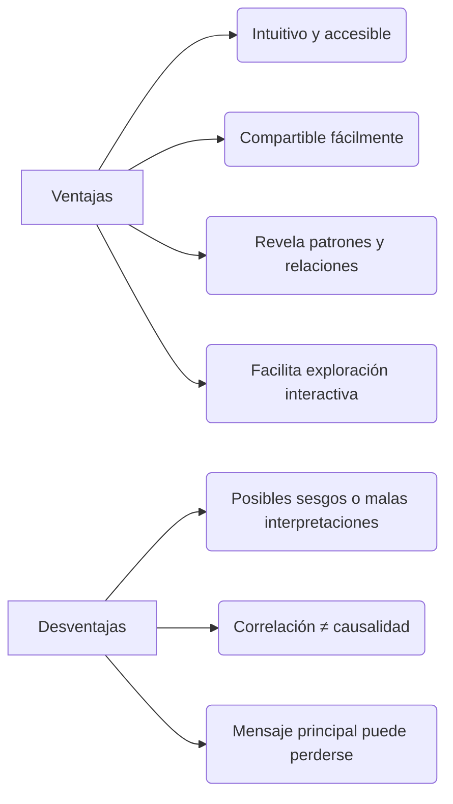

# 📌 Data Visualization – Definición y Relevancia (Tableau)

## 1. ¿Qué es la _Visualización de Datos_?

> Representación gráfica de información y datos mediante elementos visuales (gráficos, mapas, dashboards) para facilitar la detección de patrones, tendencias y valores atípicos. ([turn0search1]/_adaptado_/[coursera.org+2tableau.com+2guides.lib.uh.edu+2](https://www.tableau.com/data-insights/data-visualization/advantages-disadvantages?utm_source=chatgpt.com))

---

## 2. ¿Por qué es importante?

- Facilita la comprensión rápida de datos complejos para audiencia _técnica y no técnica_ ([turn0search1]turn0search24).
- Promueve una cultura más _data-driven_ en organizaciones al comunicar hallazgos masivamente ([turn0search24]turn0search12).
- Permite explorar información de forma visual, intuitiva y efectiva, fomentando la toma de decisiones informada ([turn0search0]turn0search24).
---

## 3. 🟢 Ventajas y ⚠️ Desventajas

### Ventajas
1. Intuitivo incluso para personas sin formación matemática o técnica. ([turn0search1]turn0search0)
2. Facilita comunicación efectiva y colaborativa. ([turn0search1]turn0search2turn0search24)
3. Permite identificar tendencias, relaciones y excepciones visualmente. ([turn0search0]turn0search24)
4. Soporta una exploración más interactiva y unificada de los datos. ([turn0search0]turn0search24)

### Desventajas
1. Riesgo de representaciones sesgadas o confusas si no se elige bien el enfoque visual.
2. La correlación no implica causalidad: se pueden inferir conclusiones erróneas.
3. Se puede perder el mensaje central si hay demasiada información visual. ([turn0search1]turn0search0)

---