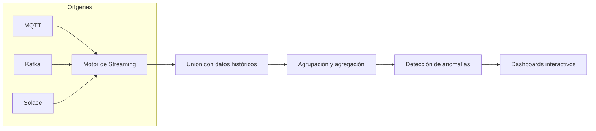

# 🛰️ Visualización de Datos y Procesamiento en Streaming – Altair
[Fuente - Altair Data Visualization Solutions, Stream Processing](https://altair.com/data-visualization/?ref=rapidminer)

![[Pasted image 20250731173317.png]]

## 1. Visión General

Altair ofrece una suite integral de software de visualización de datos y análisis en streaming, pensada para despliegues empresariales on‑premises o en la nube. Permite a usuarios de negocio, ingenieros y analistas conectarse a **cualquier** origen de datos y construir aplicaciones de monitoreo, análisis e informes **sin escribir código**.

## 2. Beneficios Clave

### 2.1 Tomar Decisiones Rápidamente

- **Minimiza retrasos**: responde en tiempo real para capturar oportunidades y mitigar amenazas.
- **Interfaz visual inmediata**: destaca indicadores de rendimiento y métricas críticas al instante.

### 2.2 Enfoque en Outliers

- Resalta valores atípicos y anomalías contra umbrales definidos por el usuario.
- Permite filtrar y hacer zoom en la línea de tiempo para descartar falsos positivos.

### 2.3 Integración de Todas las Fuentes de Datos
- Conectores nativos a:
    - Repositorios de Big Data y **streaming** (MQTT, Kafka, Solace, etc.)
    - Bases de datos SQL y NoSQL
    - Ficheros planos (CSV, JSON, Excel)

- Combina datos históricos y en tiempo real en un único entorno de análisis.

## 3. Arquitectura de Streaming

- **Motor de Streaming**: procesa eventos en tiempo real y métricas históricas.
- **Funciones Analíticas**: cálculo estadístico y matemático en vuelo.
- **Anomalías y Excepciones**: detección automática basada en umbrales.

## 4. Despliegue Empresarial

- Instalación en **días**, no meses.
- Escalable en entornos públicos, privados o híbridos.
- Invita usuarios rápidamente para que construyan sus propios dashboards y aplicaciones de streaming en horas.

## 5. Optimización de Operaciones

- **Altair® Panopticon™** está optimizado para datos críticos de tiempo:
    - Identifica tendencias, clusters y outliers en segundos.
    - Filtrado interactivo reversa falsos positivos.
    - Navegación temporal: zoom in/out en la línea de tiempo.

- Resuelve problemas complejos con unos pocos clics y facilita la investigación rápida de incidentes.

## 6. Consejos para tus Notas en Obsidian

- Crea un archivo separado llamado `streaming-visualization-altair.md`.
- Incluye el diagrama Mermaid anterior para ilustrar la arquitectura.
- Añade ejemplos concretos de conexiones (p. ej., configuración de Kafka, tópicos MQTT).
- Incorpora capturas de pantalla de Panopticon™ si dispones de acceso.
- Finaliza con un mini tutorial de 3 pasos: conexión → análisis → despliegue.

