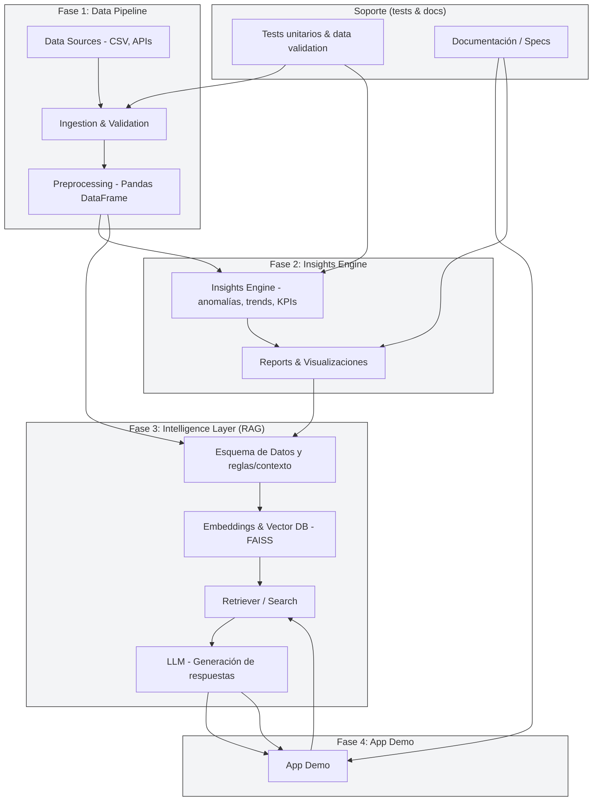

## 🧠 Validación técnica final

|Fase|Propósito|Qué demuestras ante el jurado / equipo técnico|
|---|---|---|
|**Fase 1: Data Pipeline**|Estructura y limpieza inicial.|Demuestras conocimientos de **Data Engineering** (ingesta, validación, schema control). Muestra tu dominio de pandas y aseguramiento de calidad.|
|**Fase 2: Insights Engine**|Generación de KPIs, anomalías, tendencias.|Exhibes **pensamiento analítico** y capacidad de traducir datos en decisiones. Aquí puedes mostrar gráficos, outliers, correlaciones.|
|**Fase 3: Intelligence Layer (RAG)**|Integración semántica de datos + contexto para LLM.|Muestra tu dominio en **IA aplicada**, RAG, embeddings, vector DB (FAISS) y prompting estructurado.|
|**Fase 4: App Demo**|Interfaz conversacional y visual.|Demuestras **capacidad de implementación de producto**: UX funcional, comunicación con modelo, y visualización de resultados.|
|**Soporte (tests & docs)**|Validación y reproducibilidad.|Refuerza tu perfil de **ingeniero completo**: control de calidad, documentación, mantenibilidad.|

---

## 🎯 Por qué este flujo es perfecto para tu defensa

1. **Narrativa clara (4 fases)** → facilita explicar paso a paso.
    
2. **Soporte lateral** → refleja buenas prácticas y profesionalismo.
    
3. **Embeddings y Vector DB nombrados (FAISS)** → responde preventivamente a la pregunta “¿cómo almacenas y recuperas contexto?”.
    
4. **Bucles explícitos (App ↔ Retriever)** → demuestra comprensión de retroalimentación en RAG.
    
5. **Terminología mixta (es/en)** → balance profesional: entendible tanto para evaluadores hispanos como técnicos angloparlantes.
    

---

## 💬 Cómo presentar este diagrama en 60–90 segundos

> “Esta es la arquitectura general del sistema.  
> En la **Fase 1**, realizo ingesta y validación de los datos CSV de Rappi; los transformo en DataFrames limpios y normalizados.  
> En la **Fase 2**, el motor de _Insights Engine_ analiza tendencias y anomalías clave para generar reportes accionables.  
> En la **Fase 3**, integro un _RAG Layer_ con embeddings precomputados en FAISS; esto permite que el modelo LLM responda consultas basadas en hechos, evitando hallucinations.  
> Finalmente, la **Fase 4** es una aplicación en Streamlit que permite al usuario conversar con los datos y visualizar insights.  
> Todo está respaldado por módulos de _testing_ y _documentación_ para garantizar trazabilidad y calidad técnica.”

(→ Esa versión es excelente para memorizar y defender tu diagrama con naturalidad).