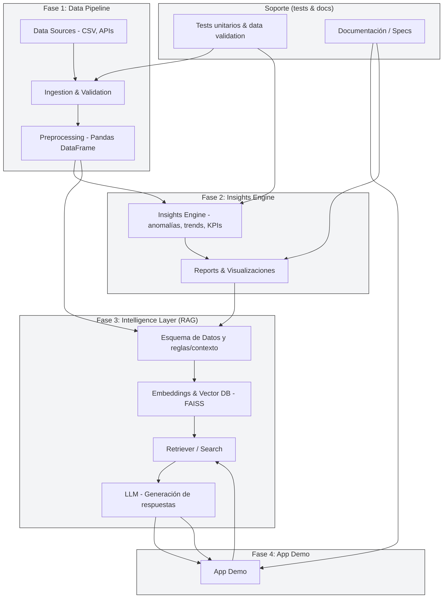

```mermaid
flowchart TD

  %% --- Fase 1: Data Pipeline ---

  subgraph Fase1["Fase 1: Data Pipeline"]

    A[Data Sources - CSV, APIs]

    B[Ingestion & Validation]

    C[Preprocessing - Pandas DataFrame]

  end

  A --> B

  B --> C

  

  %% --- Fase 2: Insights Engine ---

  subgraph Fase2["Fase 2: Insights Engine"]

    D[Insights Engine - anomalías, trends, KPIs]

    E[Reports & Visualizaciones]

  end

  C --> D

  D --> E

  

  %% --- Fase 3: Intelligence / RAG ---

  subgraph Fase3["Fase 3: Intelligence Layer (RAG)"]

    F[Esquema de Datos y reglas/contexto]

    V[Embeddings & Vector DB - FAISS]

    G[Retriever / Search]

    H[LLM - Generación de respuestas]

  end

  E --> F

  C --> F

  F --> V

  V --> G

  G --> H

  H --> I

  

  %% --- Fase 4: App & Feedback ---

  subgraph Fase4["Fase 4: App Demo"]

    I[App Demo]

  end

  H --> I

  I --> G

  

  %% --- Soporte lateral ---

  subgraph Soporte["Soporte (tests & docs)"]

    T[Tests unitarios & data validation]

    Doc[Documentación / Specs]

  end

  T --> B

  T --> D

  Doc --> I

  Doc --> E

  

  %% --- Estilo visual ---

  classDef stage fill:#f3f4f6,stroke:#333,stroke-width:1px;

  class Fase1,Fase2,Fase3,Fase4,Soporte stage;
```

