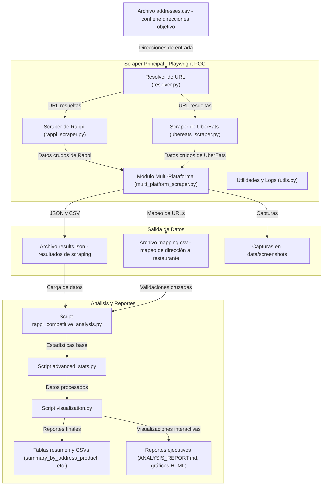

# 1) Entradas (A1, A2)

**A1 — `data/addresses.csv`**
- Qué es: CSV con las direcciones/queries que vas a muestrear (cada fila: `addressLabel`, `searchQuery`, `restaurantUrl` opcional).
    
- Uso: el runner (`scrapers/playwright_poc.py`) carga este CSV con `load_addresses()` y por cada entrada construye la `heuristic_query` o usa `restaurantUrl` override.

>Las direcciones son la unidad de muestreo. El scraper itera por ellas para simular usuarios desde diferentes ubicaciones

# 2) Pipeline principal (S1 — Playwright POC y submódulos)

1. **Scraper Principal — `scrapers/playwright_poc.py`**

- Rol: Orquestador. Lee `addresses.csv`, abre Playwright, mantiene una única `page` por contexto, instala el listener `page.on("response", _on_response)` para capturar XHR/responses, invoca `resolver` y luego el scraper de la plataforma.
    
- Puntos clave:
    - Crea `responses_captured` por dirección (lista de objetos Response) y lo pasa a `scrapeRappi(...)`.
    - Genera `selector_hash` (hash de la configuración actual — en este repo es un JSON `{}`) y lo añade a cada registro para trazabilidad.
    - Guarda screenshots y hace dumps debug.

- Archivos/funciones: `main()`, `load_addresses()`, `page.on("response", _on_response)`.

> Es la capa de control. Gestiona la sesión de  navegador y agrupa el resultado por dirección.

2. **Resolver de URL — `scrapers/resolver.py` (R1 en el diagrama)**

- Rol: Dado un `search_query` construye la URL de búsqueda `https://www.rappi.com.mx/buscar?query=...`, navega y selecciona enlaces `a[href*='/restaurantes/']`.
    
- Lógica principal:
    - Extrae anchors, filtra cruft (login, redirs), puntúa candidatos (heurística que da peso a 'mcdonald' y coincidencia textual).
    - Devuelve `chosen_href` + `resolution_meta` (candidates, chosen_score, confidence).

> Intenta resolver automáticamente el restaurante más probable para la ubicación — es heurístico, por eso guardamos metadata para auditar decisiones.

3. **Scraper de Rappi — `scrapers/rappi_scraper.py` (SR1)**

- Rol: Extrae precios, fees (delivery/service), ETA, disponibilidad y captura productos objetivo.
- Mecanismos de extracción (en orden de prioridad):
    1. `window.__NEXT_DATA__` (JSON in-page) — parseo heurístico.
    2. XHR responses capturadas por `page.on("response")` — parseo de JSONs para claves como `delivery`, `service`, `fee`.
    3. Análisis de texto en el DOM (`page.inner_text("body")`) — buscar patrones `envío`, `servicio`.
    4. Simular add-to-cart — intentar agregar un item, leer el drawer/cart y extraer fees (si está disponible sin login).

- Productos: ejecuta una evaluación JS para listar bloques de producto (`BLOCK_QUERY`) y aplica heurísticas/sinónimos para encontrar `Big Mac`, `Combo Mediano`, `Coca-Cola 500ml`.
    
- Output: una lista de registros por producto con campos: `precios`, `flags de oferta`, `deliveryFeeValue`, `serviceFeeValue`, `finalPriceValue`, `feeSource`, captura de screenshot.
    
> El scraper aplica múltiples mecanismos en cascada para maximizar la probabilidad de extraer fees y precios; además intenta detectar ofertas y computar precios finales.

4. **Scraper de UberEats / DiDi (SR2, otros)**
- Hay`ubereats_scraper.py` y `didi_scraper.py`. Su papel es equivalente a `rappi_scraper.py` pero con selectores y heurísticas adaptadas a cada plataforma (buscar `__NEXT_DATA__`, XHR JSON, DOM, simulación de carrito).

> Cada plataforma requiere adaptaciones puntuales — el orquestador mantiene la misma interfaz para normalizar outputs.

6. **Utilidades y Logs — `scrapers/utils.py` (U1)**

- Contiene funciones reutilizables: `sanitize_number`, `dump_json_to`, `retry`, `random_delay`, `now_utc_iso`, constantes como `MAX_REASONABLE_FEE`.
    
 > Funciones comunes y límites heurísticos (ej. máximo plausible del fee).
 
