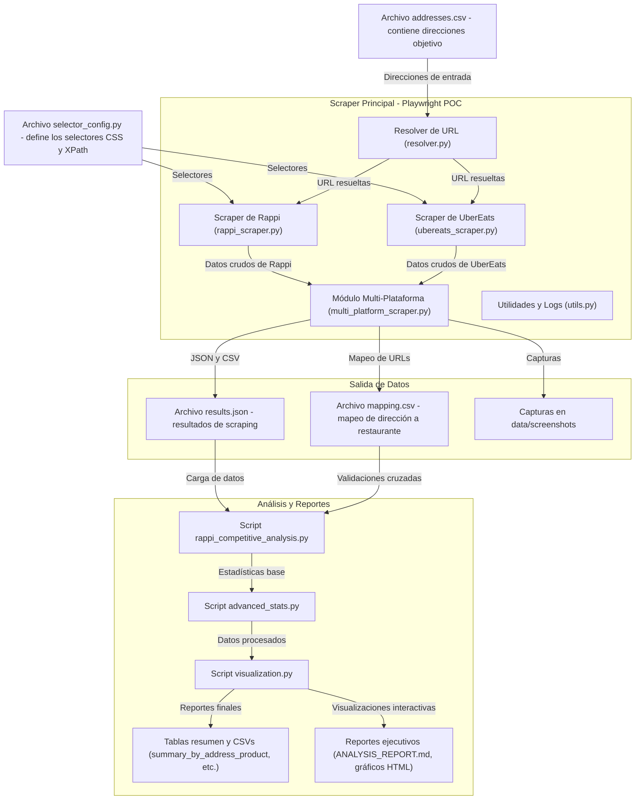

```mermaid

flowchart TD

    %% === ENTRADA DE DATOS ===

    A1["Archivo addresses.csv - contiene direcciones objetivo"]

    A2["Archivo selector_config.py - define los selectores CSS y XPath"]

  

    %% === PIPELINE PRINCIPAL ===

    subgraph S1["Scraper Principal - Playwright POC"]

        R1["Resolver de URL (resolver.py)"]

        SR1["Scraper de Rappi (rappi_scraper.py)"]

        SR2["Scraper de UberEats (ubereats_scraper.py)"]

        M1["Módulo Multi-Plataforma (multi_platform_scraper.py)"]

        U1["Utilidades y Logs (utils.py)"]

    end

  

    %% === SALIDAS DE DATOS ===

    subgraph S2["Salida de Datos"]

        D1["Archivo results.json - resultados de scraping"]

        D2["Archivo mapping.csv - mapeo de dirección a restaurante"]

        D3["Capturas en data/screenshots"]

    end

  

    %% === ANÁLISIS DE RESULTADOS ===

    subgraph S3["Análisis y Reportes"]

        A3["Script rappi_competitive_analysis.py"]

        A4["Script advanced_stats.py"]

        A5["Script visualization.py"]

        O1["Tablas resumen y CSVs (summary_by_address_product, etc.)"]

        O2["Reportes ejecutivos (ANALYSIS_REPORT.md, gráficos HTML)"]

    end

  

    %% === FLUJO DE DATOS ===

    A1 -->|Direcciones de entrada| R1

    A2 -->|Selectores| SR1

    A2 -->|Selectores| SR2

    R1 -->|URL resueltas| SR1

    R1 -->|URL resueltas| SR2

    SR1 -->|Datos crudos de Rappi| M1

    SR2 -->|Datos crudos de UberEats| M1

    M1 -->|JSON y CSV| D1

    M1 -->|Mapeo de URLs| D2

    M1 -->|Capturas| D3

    D1 -->|Carga de datos| A3

    D2 -->|Validaciones cruzadas| A3

    A3 -->|Estadísticas base| A4

    A4 -->|Datos procesados| A5

    A5 -->|Reportes finales| O1

    A5 -->|Visualizaciones interactivas| O2

```