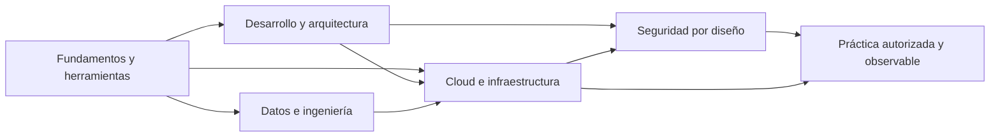

# MOC — Self Study

Índice maestro de aprendizaje técnico. Cada dominio combina fundamentos, laboratorios y decisiones de producción; las rutas existentes se conservan como fuente primaria de los apuntes.

## Cloud & Infrastructure

Infraestructura declarativa, contenedores, plataformas cloud y operación reproducible.

- [[Docker/0.Introduccion|Docker: fundamentos, imágenes y contenedores]] · [[Docker/1. Imágenes y Contenedores|ciclo de vida de imágenes y contenedores]] · [[Docker/2.Ports y Volúmenes|puertos y persistencia]].
- [[Terraform/1. Qué es Terraform|Terraform e infraestructura como código]] · [[Terraform/3. Hola Mundo|primer flujo de Terraform]] · [[Terraform/4. Comandos|comandos operativos]].
- [[AWS/Introducción al Cómputo/1. Qué es el Cloud|AWS]] · [[0. Fundamentos de Cloud Computing y Responsabilidad Compartida|Fundamentos Cloud & Responsabilidad Compartida]] · [[1. Introducción a Azure|Azure Intro]] · [[3. Azure Functions|Azure Functions (Serverless)]] · [[Oracle/Oracle OCI Foundations Associate/1. Introduction to OCI|Oracle Cloud Infrastructure]].
- Puente de orquestación: [[Pinguino Mario - Hacking/Docker/Kubernetes/1 - Despliegue de contenedores con Kubernetes|Kubernetes]] y [[Pinguino Mario - Hacking/Linux/Ansible/PlayBooks|Ansible Playbooks]].

## Development & Architecture

Diseño de sistemas, backend, programación orientada a objetos y colaboración de ingeniería.

- [[NodeJs/Clase 1/1. Qué es Node Js|Node.js y el runtime de JavaScript]] · [[NodeJs/Clase 2/1. Protocolo HTTP|HTTP]] · [[NodeJs/Clase 3/1. Rest API con Express|API REST con Express]] · [[NodeJs/Clase 4/2. MVC|MVC]].
- [[Django/0. Que es Django|Django]] · [[Backend Project 2026/Paso 2 — Roadmap de Implementación|roadmap de backend]] · [[POO - LUISA RINCON 2025/2.DiseñoOrientadoObjetos|diseño orientado a objetos]].
- [[Microsoft/GitHub/Introduction to GitHub|GitHub]] · [[Microsoft/GitHub/Code with GitHub Codespaces|Codespaces]] · [[Harvard CS50/Lecture 1|CS50]].

## Data Science & Engineering

Arquitecturas de datos, modelado, almacenamiento analítico y experimentación reproducible.

- [[World Cup 2026 Project⚽🏆/REDESGINED/SETUP/OBJETIVO DEL PROYECTO|Proyecto World Cup 2026]] · [[World Cup 2026 Project⚽🏆/REDESGINED/SETUP/ARQUITECTURA (SIMPLIFICADA)|arquitectura de datos]] · [[World Cup 2026 Project⚽🏆/REDESGINED/FASE 4/1. MODELO|modelo]].
- [[Data Engineering/Tools 2026|Data Engineering]] · [[Dbt vs PySpark/Dbt vs PySpark|dbt frente a PySpark]] · [[SQL/MySQL/2. Crear DB y Tablas|SQL]] · [[F1/Prediciton Project 2026/app password email sender|proyecto F1]].
- [[Deep Learning Geometrico y Topologico/Untitled|Deep Learning geométrico y topológico]] · [[IBM/IBM Badges/IBM Badges|IBM]].

## Security & Penetration Testing

Fundamentos de redes, hardening, desarrollo seguro y prácticas ofensivas exclusivamente en entornos autorizados.

- [[Pinguino Mario - Hacking/Redes/Modelo TCP-IP|Modelo TCP/IP]] · [[Pinguino Mario - Hacking/Redes/Modelo OSI|Modelo OSI]] · [[Pinguino Mario - Hacking/Redes/Protocolo HTTP-HTTPS + Wireshark|HTTP/HTTPS y análisis de tráfico]].
- [[Pinguino Mario - Hacking/Linux/Hardening/0 - IPTABLES - Configurar Firewall de Linux|hardening de Linux]] · [[Pinguino Mario - Hacking/Linux/Hardening/3 - Firewall/NFtables/0 - Introducción a NFtables|nftables]] · [[Pinguino Mario - Hacking/Linux/Hardening/4 - IDS en LINUX/0 - Instalación de SNORT|detección de intrusiones]].
- [[Pinguino Mario - Hacking/Hacking/Hacking Generico/0 - Consideraciones Previas|preparación de laboratorios]] · [[Pinguino Mario - Hacking/Hacking/Hacking Generico/Nmap/Nmap|inventario y Nmap]] · [[Pinguino Mario - Hacking/Hacking/Hacking Generico/Hacking Web/SQL Injection|seguridad web e inyección]].
- [[Pinguino Mario - Hacking/Coding/Python/Generico/Librerías/Librería Requests|Python para automatización]] · [[Pinguino Mario - Hacking/Docker/Laboratorios Docker Pentesting|laboratorios Docker]] · [[Pinguino Mario - Hacking/Linux/Ansible/PlayBooks|automatización con Ansible]].

> [!warning] Práctica responsable
> Los apuntes de seguridad son para formación, defensa y laboratorios controlados. No se deben ejecutar contra infraestructura ajena ni fuera de un alcance autorizado, documentado y reversible.

## General Programming & Tools

Herramientas transversales, cursos, idiomas técnicos y fundamentos complementarios.

- [[Coursera/Coursera|Coursera]] · [[Codigo Facilito/Bootcamp AWS Agents con Kiro/0. Introduccion y presentacion|Código Fácil]] · [[⬛🟥🟨 B1/B1|Alemán B1]].
- [[🛩️ 🧠 ERNESTO KNOWLEDGE ERNESTO KNOWLEDGE/1. MOC (Mapa de Contenido Principal)|Ernesto Knowledge]] · [[POO - LUISA RINCON 2025/Notas libro|fundamentos POO]].

## Ruta de estudio sugerida

1. Consolidar protocolos, Git, Linux y programación.
2. Diseñar servicios con contratos, pruebas y observabilidad.
3. Desplegar con infraestructura como código, imágenes reproducibles y secretos fuera del repositorio.
4. Integrar calidad, linaje y versionado de datos antes del modelado.
5. Validar seguridad, resiliencia, coste y rendimiento como trade-offs explícitos.

## Referencias de verificación técnica

- [Docker: arquitectura y objetos](https://docs.docker.com/get-started/docker-overview/) y [Compose](https://docs.docker.com/get-started/docker-concepts/the-basics/what-is-docker-compose/).
- [Terraform: estado](https://developer.hashicorp.com/terraform/language/state) y [módulos](https://developer.hashicorp.com/terraform/language/modules).
- [Kubernetes: conceptos](https://kubernetes.io/docs/concepts/) y [Pods](https://kubernetes.io/docs/concepts/workloads/pods/).
- [AWS Well-Architected Framework](https://docs.aws.amazon.com/wellarchitected/latest/migration-lens/well-architected-framework-pillars.html) y [Azure Well-Architected Framework](https://learn.microsoft.com/en-us/azure/well-architected/pillars).
- [OWASP Top 10:2025](https://owasp.org/Top10/).

## Dominios Especializados y Sub-MOCs

- [[Qubika/MOC - Qubika|MOC — Qubika & Qversity Data Engineering]]
- [[Ing Electronica/MOC - Ingenieria Electronica|MOC — Ingeniería Electrónica]]
- [[Job Search/MOC - Job Search|MOC — Job Search & Technical Cases]]
- [[Context/MOC - AI Memory & Context|MOC — AI Memory & Context Base]]
- [[Templates/MOC - Templates & AI Skills|MOC — Templates & Portable AI Skills]]
- [[04_Resources/Automation_RPA/UiPath/MOC-UiPath|MOC — UiPath RPA Architecture]]
- [[Master Data Science/MOC - Master Data Science|MOC — Master Data Science]]
- [[databricks 2026|Databricks 2026 Roadmap & Lakehouse Standards]]
- [[Microsoft Build 2026|Microsoft Build 2026 Notes]]
- [[Excalidraw/EC2|Diagrama AWS EC2 Architecture]] · [[Excalidraw/EC2 2|Diagrama AWS EC2 VPC Architecture]]

## Enlaces de retorno

Las notas estandarizadas incorporan un bloque **Contexto de estudio** que enlaza de vuelta a su dominio en este MOC.
