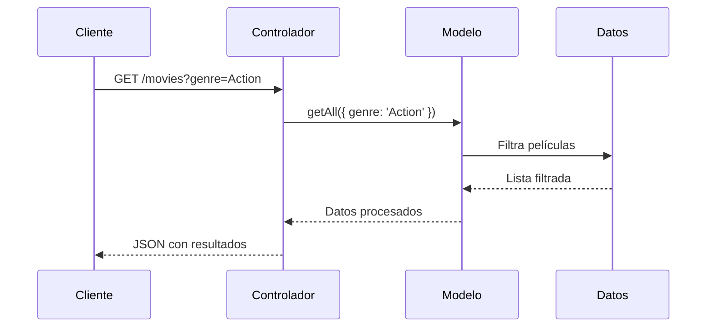

---
tags:
  - MVC
  - web
  - web-dev
  - NodeJs
fecha: 2025-03-30
---

tags: #NodeJs #MVC #web 

# ¿Qué es MVC?


![[Excalidraw/MVC|MVC|1200|centered]]


#### **MVC:  Modelo-Vista-Controlador**
---
Es un ***patrón de arquitectura*** que se utiliza muchísimo, en desarrollo de software, especialmente en ***aplicaciones web y móviles.***
Se separa una aplicación en tres componentes principales:
1. **Modelo (Model)**  
2. **Vista (View)**  
3. **Controlador (Controller)**

---
## 🔍 Componentes Clave

### 1. Modelo 🗃️

- **Responsabilidad**: Gestiona los datos y la lógica de negocio.
- **Características**:
	- Interactúa con la base de datos    
    - Contiene reglas de validación
    - Independiente de la UI
- **Ejemplo**:
```javascript
// models/User.js
export class User {
  constructor(name, email) {
    this.name = name;
    this.email = email;
  }

  save() {
    // Lógica para guardar en DB
  }
}
```
---
### 2. Vista 👁️

- **Responsabilidad**: Presentación de datos al usuario
- **Características**:
    - Templates visuales (HTML, EJS, Pug)
    - No contiene lógica de negocio
    - Recibe datos del Controlador
- **Ejemplo**:
```ejs
<!-- views/users.ejs -->
<ul>
  <% users.forEach(user => { %>
    <li><%= user.name %> - <%= user.email %></li>
  <% }) %>
</ul>
```
### 3. Controlador 🎮

- **Responsabilidad**: Intermediario entre Modelo y Vista
- **Características**:
    - Maneja peticiones HTTP
    - Llama al Modelo para datos
    - Envía datos a la Vista
- **Ejemplo**:
```javascript
// controllers/userController.js
export const getUsers = async (req, res) => {
  const users = await User.findAll();
  res.render('users', { users });
};
```

## 🚀 Implementación en Node.js/Express

### Estructura de proyecto recomendada:

```plaintext
project/
├── models/       # 🗃️ Modelos de datos
├── views/        # 👁️ Plantillas visuales
├── controllers/  # 🎮 Lógica de rutas
├── routes/       # 🗺️ Definición de endpoints
└── app.js        # ⚙️ Configuración principal
```
---
### Flujo típico:

1. Usuario hace petición ➔
2. **Ruta** dirige al **Controlador** ➔
3. **Controlador** usa el **Modelo** ➔
4. **Modelo** interactúa con DB ➔
5. **Controlador** pasa datos a la **Vista** ➔
6. **Vista** renderiza respuesta

---
## ✅ Ventajas de MVC
- **Separación de preocupaciones**: Cada componente tiene responsabilidad única
- **Reutilización de código**: Modelos independientes de la interfaz
- **Mantenibilidad**: Facilita actualizaciones y debugging
- **Escalabilidad**: Componentes pueden evolucionar por separado

---

## 🛠️ Casos de Uso Comunes

1. Aplicaciones web con interfaces dinámicas
2. APIs RESTful + cliente frontend separado
3. Sistemas con múltiples tipos de clientes (web, móvil, desktop

---

# 🎥 Implementación MVC para Sistema de Películas

## 🧩 Componentes MVC en el Código

### 1. **Modelo (`MovieModel`)**: Capa de datos
```javascript
// models/movie.js
export class MovieModel {
  static getAll = async ({ genre }) => { /* Lógica de filtrado */ };
  
  static getById = async ({ id }) => { /* Buscar por ID */ };
  
  static create = async ({ input }) => { /* Crear nueva película */ };
  
  static delete = async ({ id }) => { /* Eliminar película */ };
  
  static update = async ({ id, input }) => { /* Actualizar datos */ };
}
```
**Responsabilidad**:
- Gestiona el acceso a datos (CRUD)
- Contiene reglas de negocio (filtrado por género)
- Independiente de HTTP/Express
---

### 2. **Controlador (`moviesRouter`)**: Capa de lógica de aplicación
```javascript
// controllers/movies.js
moviesRouter.get('/', async (req, res) => {
  const movies = await MovieModel.getAll(req.query);
  res.json(movies); // Vista (JSON)
});

moviesRouter.post('/', async (req, res) => {
  const result = validateMovie(req.body);
  const newMovie = await MovieModel.create(result.data);
  res.status(201).json(newMovie);
});
```
**Responsabilidad**:
- Maneja peticiones HTTP
- Valida datos de entrada
- Coordina con el Modelo
- Decide formato de respuesta
---

### 3. **Vista**: Representación de datos
```javascript
// En los controladores:
res.json(movies); // Vista como JSON

// Alternativa para HTML:
res.render('movies', { movies }); // Plantilla EJS/Pug
```
**Responsabilidad**
- Formatea la respuesta al cliente
- No contiene lógica de negocio
- Puede ser JSON/HTML/XML

---

## 🔄 Flujo MVC Completo



## Nota:
- ***Las validaciones del Modelo y el Controlador***, deben ser ***obligatorias y requeridas***, porque hay que ***asegurarse que los datos*** que se están introduciendo por el usuario, ***no son maliciosos***
- El ***Modelo garantiza la integridad y coherencia de los datos***


# Siguiente

|                                🔙 Volver a                                |                             ⏭️ Seguir a                              |
| :-----------------------------------------------------------------------: | :------------------------------------------------------------------: |
| [[1. Pasando de commonJS a ESModules\|Clase 4 - De commonJS a ESModules]] | [[3. Intro a MongoDB Atlas\|Clase 4 - Introducción a MongoDB Atlas]] |


