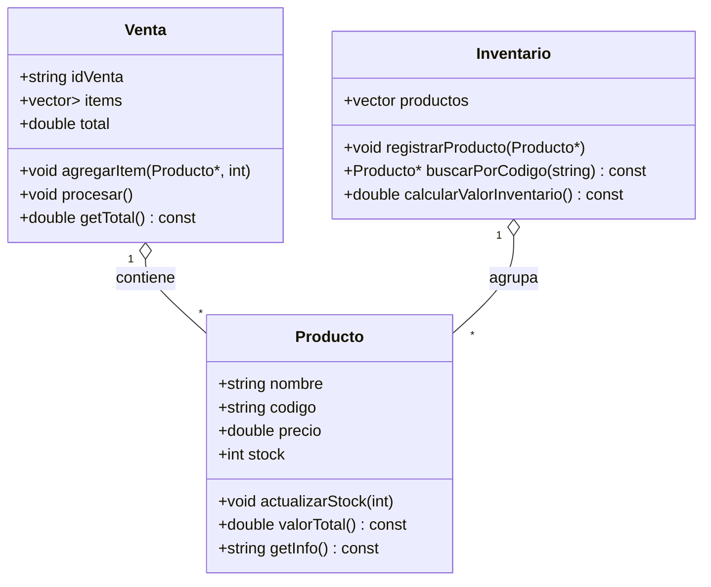

# 1. Clases y relaciones

## 1. Producto
### Atributos
- `string nombre`
- `string codigo` // único
- `double precio`
- `int stock`
### Métodos
- `void actualizarStock(int cantidad)` // suma o resta
- `double valorTotal()` // `precio * stock`
- `string getInfo()` // imprime todos sus datos

---
## 2. Venta

### Atributos
- `string idVenta`
- `vector <pair<Producto*,int>> items`  // puntero al producto + cantidad vendida
- `double total`
### Métodos
- `void agregarItem(Producto* p, int cantidad)`
- `void procesar()` // descuenta stock y calcula `total`
- `double getTotal()`

## 3. Inventario (para agrupar productos)
### Atributos
- `vector<Producto*> productos`
### Métodos
- `void registrarProducto(Producto*)`
- `Producto* buscarPorCodigo(string& código)`
- `double calcularValorInventario()`

## Cardinalidades
- Una **Venta** contiene  `₀..*` **Productos** (a través de items)
- Un **Producto** puede participar en `₀..*` **Ventas**
- El **Inventario** agrupa `₀..*` **Productos**

# 2️⃣ Diagrama UML (Mermaid)

