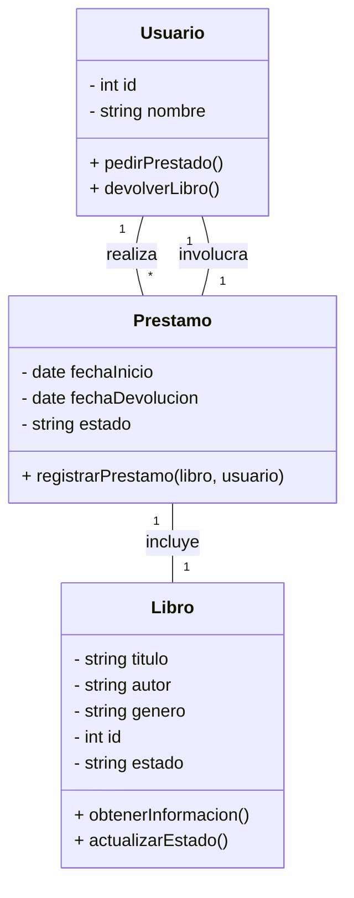

A continuación, resolveremos el ejercicio de gestión de biblioteca identificando clases, atributos, métodos y relaciones, y finalmente representándolo en un diagrama UML.

## Paso 1: Identificación de Clases que forman parte del sistema.

Para definir las clases, analizamos los sustantivos clave en la descripción del problema. En este caso, podemos identificar las siguientes clases:

- Libro
- Usuario
- Prestamo

## Paso 2:  Definir Atributos.

Cada clase debe contener atributos que representen sus características esenciales:

- `Libro`: titulo, autor, genero, id, estado
- `Usuario`: id, nombre
- `Prestamo`: fechaInicio, fechaDevolucion, estado, libro, usuario

## Paso 3: Definir Metodos

Los métodos representan acciones que las clases pueden realizar:
- **Libro:** obtenerInformacion(), actualizarEstado()
- **Usuario:** pedirPrestado(), devolverLibro()
- **Prestamo:** registrarPrestamo(libro, usuario)

## Paso 4: Definir Relaciones:

- Un **Usuario** puede pedir prestados varios **Libros**
- Un **Libro** solo puede estar en posesión de un único **Usuario**
- Un **Prestamo** conecta un **Usuario** con un **Libro** y almacena la información sobre la fecha de préstamo y devolución

## Paso 5: Diagrama UML

📌 **Diagrama UML del sistema:**

### Símbolos Relaciones BBDD & EDR

[[2. EDR RELACIONES]]

![[Pasted image 20250702173124.png]]

![[EDR Symbols.png]]