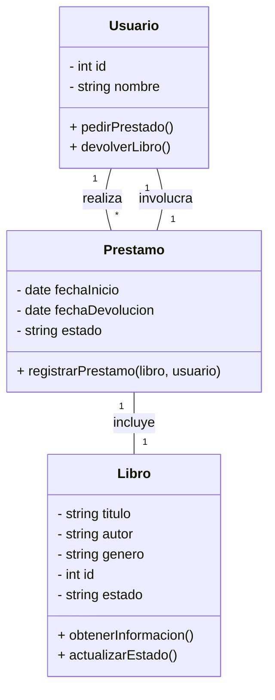
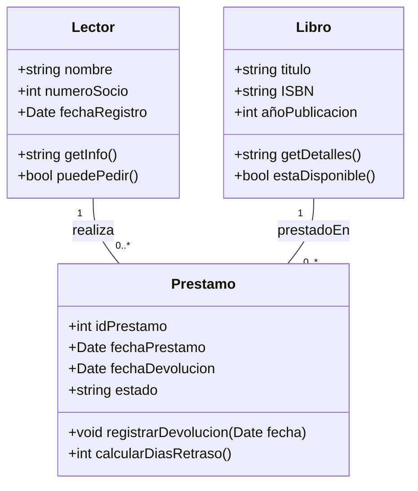

# Ejercicio 1: Biblioteca
A continuación, resolveremos el ejercicio de gestión de biblioteca identificando clases, atributos, métodos y relaciones, y finalmente representándolo en un diagrama UML.

## Paso 1: Identificación de Clases que forman parte del sistema.

Para definir las clases, analizamos los sustantivos clave en la descripción del problema. En este caso, podemos identificar las siguientes clases:

- Libro
- Usuario
- Prestamo

## Paso 2:  Definir Atributos.

Cada clase debe contener atributos que representen sus características esenciales:

- `Libro`: titulo, autor, genero, id, estado
- `Usuario`: id, nombre
- `Prestamo`: fechaInicio, fechaDevolucion, estado, libro, usuario

## Paso 3: Definir Metodos

Los métodos representan acciones que las clases pueden realizar:
- **Libro:** obtenerInformacion(), actualizarEstado()
- **Usuario:** pedirPrestado(), devolverLibro()
- **Prestamo:** registrarPrestamo(libro, usuario)

## Paso 4: Definir Relaciones:

- Un **Usuario** puede pedir prestados varios **Libros**
- Un **Libro** solo puede estar en posesión de un único **Usuario**
- Un **Prestamo** conecta un **Usuario** con un **Libro** y almacena la información sobre la fecha de préstamo y devolución

## Paso 5: Diagrama UML

📌 **Diagrama UML del sistema:**

---
# Ejercicio 2: Pedidos Restaurante

Desarrollar un **Sistema de Gestión de Pedidos** para un restaurante que permita registrar clientes, generar y controlar el estado de sus pedidos, y detallar los platos incluidos en cada pedido con su precio. El sistema debe facilitar:

1. **Registrar Clientes** con su nombre y teléfono.
2. **Crear Pedidos**, asignarles un número único y un estado (p. ej. “Pendiente”, “En preparación”, “Servido”).
3. **Asociar cada Pedido** a un Cliente existente.
4. **Detallar los Platos** de cada Pedido, indicando nombre y precio de cada uno.
5. **Visualizar el Total** del pedido (sumando precios de platos) y actualizar el estado conforme avanza su preparación.

---
# Ejercicio 3: 

### Símbolos Relaciones BBDD & EDR

[[2. EDR RELACIONES]]

![[Pasted image 20250702173124.png]]

![[EDR Symbols.png]]

---

# Tarea

## 1. Biblioteca
Enunciado: [[2.DiseñoOrientadoObjetos#1. Caso Biblioteca]]

**Clases principales**
1. `Libro`
2. `Lector`
3. `Prestamo`

Clase `Libro`
- **Atributos**
    - `string titulo`    // título único
    - `string ISBN`    // identifica la obra
    - `int añoPublicacion`
- **Métodos sugeridos**
    - `string getDetalles()`   // devuelve “Título (ISBN) – Año”
    - `bool estaDisponible()`   // indica si puede prestarse (a implementar según estado)

 Clase `Lector`
- **Atributos**
    - `string nombre`
    - `int numeroSocio`   // clave única
    - `Date fechaRegistro`
- **Métodos sugeridos**
    - `string getInfo()`  // nombre + número de socio
    - `bool puedePedir()` // por ejemplo, si no supera límite de préstamos

Clase `Prestamo`
- **Atributos**
    - `int idPrestamo`  // identificador único
    - `Date fechaPrestamo`
    - `Date fechaDevolucion` // `null` si aún no se devolvió
    - `string estado`   // (“Activo”, “Devuelto”, “Retrasado”)
        
- **Relaciones (atributos referenciales)**
    - `Libro libro`
    - `Lector lector`
        
- **Métodos sugeridos**
    - `void registrarDevolucion(Date fecha)`
    - `int calcularDiasRetraso()`

| Origen   | Tipo de Relación       | Destino  | Cardinalidad              | Descripción                                                                            |
| -------- | ---------------------- | -------- | ------------------------- | -------------------------------------------------------------------------------------- |
| Lector   | 1 — _realiza_ — *      | Préstamo | 1 Lector ↔ 0..* Préstamos | Un lector puede tener varios préstamos a lo largo del tiempo.                          |
| Libro    | 1 — _esPrestadoEn_ — * | Préstamo | 1 Libro ↔ 0..* Préstamos  | Un libro puede prestarse múltiples veces (no simultáneamente en este modelo sencillo). |
| Préstamo | _asocia_               | Lector   | * Préstamo ↔ 1 Lector     | Cada préstamo corresponde a un único lector.                                           |
| Préstamo | _asocia_               | Libro    | * Préstamo ↔ 1 Libro      | Cada préstamo corresponde a un único libro.                                            |

#### Diagrama de Clases – Sistema de Biblioteca

## 2. Hotel

**Clases principales**

1. `Habitación`
2. `Huésped`
3. `Reserva`
## 3. Clínica veterinaria (mascotas)
    
## 4. Tienda de música
    
## 5. Escuela de música
    
## 6. Galería de arte