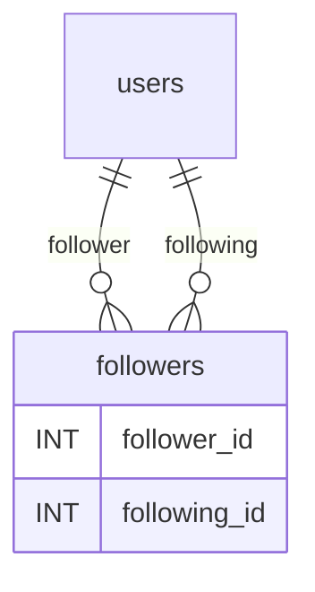

---
tags:
  - SQL
  - DataBases
  - MySQL
Created: 2025-04-22
---

```MySQL
DROP TABLE IF EXISTS followers;

CREATE TABLE followers(
	follower_id INT NOT NULL,
    following_id INT NOT NULL,
    PRIMARY KEY(follower_id, following_id),
    FOREIGN KEY(follower_id) REFERENCES users(user_id),
    FOREIGN KEY(following_id) REFERENCES users(user_id),
);
```

## Concepto Clave: Relación Muchos-a-Muchos

Esta tabla `followers` permite registrar **quién sigue a quién** en una red social, implementando una relación de muchos-a-muchos entre usuarios.

---

## 🔍 Análisis del Código SQL

### 1. Eliminar Tabla Existente

```MySQL
DROP TABLE IF EXISTS followers;
```

- **`DROP TABLE`**: Borra la tabla completamente (estructura + datos)
- **`IF EXISTS`**: Evita errores si la tabla no existe
- **Por qué es útil**: Permite recrear la tabla desde cero en desarrollo

---

### 2. Creación de la Tabla `followers`

```MySQL
CREATE TABLE followers(
    follower_id INT NOT NULL,
    following_id INT NOT NULL,
    PRIMARY KEY(follower_id, following_id),
    FOREIGN KEY(follower_id) REFERENCES users(user_id),
    FOREIGN KEY(following_id) REFERENCES users(user_id)
);
```

#### 2.1 Columnas Principales

|Columna|Tipo|Restricciones|Descripción|
|---|---|---|---|
|`follower_id`|INT|`NOT NULL`|ID del usuario que sigue (seguidor)|
|`following_id`|INT|`NOT NULL`|ID del usuario seguido|

---

#### 2.2 Clave Primaria Compuesta

```MySQL
PRIMARY KEY(follower_id, following_id)
```

- **Qué hace**:
    - Crea una **clave primaria compuesta** usando ambas columnas
    - Garantiza combinaciones únicas de (seguidor, seguido)
- **Ejemplo**:
    - (1, 2) → usuario 1 sigue al usuario 2
    - (1, 3) → válido (mismo seguidor, diferente seguido)
    - (2, 1) → válido (relación inversa)
    
---
#### 2.3 Foreign Keys (Claves Foráneas)

```MySQL
FOREIGN KEY(follower_id) REFERENCES users(user_id),
FOREIGN KEY(following_id) REFERENCES users(user_id)
```

|Componente|Explicación|
|---|---|
|`FOREIGN KEY`|Crea relación con otra tabla|
|`REFERENCES`|Especifica tabla (`users`) y columna referenciada (`user_id`)|
|**Integridad**|Garantiza que:|
||- `follower_id` y `following_id` existan en `users.user_id`|
||- No se puede eliminar un usuario si tiene seguidores/seguidos activos|

---

## 🛠️ Diagrama de Relaciones



