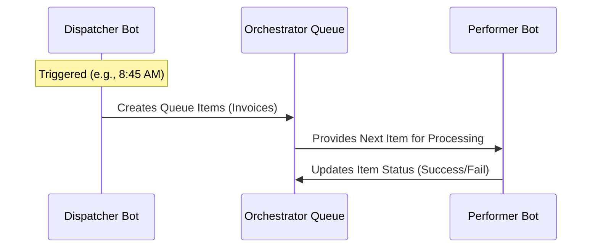
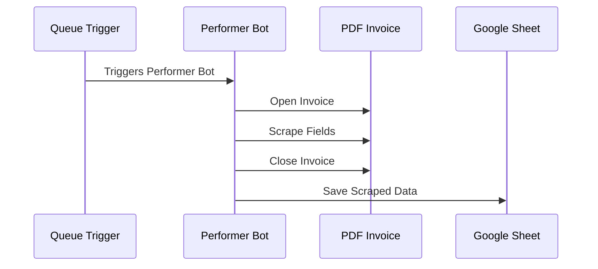

### PDF Invoice Scraper Demo

- **Bot Workflow**
    - Loops through a folder containing multiple PDF invoices
    - Opens each invoice individually to scrape specific fields:
        - Invoice number
        - Date
        - Total amount
    - Captures extracted data into a Google Sheet titled `scraped invoice data`
    - Logs the outcome of each process:
        - **Success**: Logs as successful
        - **Failure**: Logs the failure along with the specific error message
- **Development Framework**
    - Built using the **Robotic Enterprise Framework (REFramework)** template

### REFramework and Orchestrator Queues

- **REFramework Benefits**
    - Developed by UiPath to build robust automations
    - Specifically designed to handle exceptions effectively
    - Ideal for high-volume, transactional processes (e.g., processing large batches of invoices)
- **Dispatcher-Performer Architecture**
    - Uses a **Dispatcher Bot** to create work items
    - Work is managed via **UiPath Orchestrator Queues**
        - A queue is a collection of work to be done
        - In this workflow, each queue item represents a single invoice to be processed
- **Automation Triggers**
    - Triggers are used to run queue items automatically
    - **Time Triggers** can schedule a dispatcher bot to run at specific times
        - Example: Scheduling the dispatcher to run every day at 8:45 AM

### Performer Bot Execution

- **Triggering the Performer**
    - Once the dispatcher creates the queue items, a queue trigger initiates the performer bot
    - The performer bot is responsible for the actual scraping of the invoices
- **Operational Workflow Demo**
    - **Job Initiation**: A job can be started manually in Orchestrator (e.g., clicking "Start") rather than waiting for a scheduled trigger
    - **Queue Item Creation**: The logs show the system creating queue items based on the files found in the designated input folder
    - **Scraping Process**:

        1. Bot opens an individual invoice (e.g., `Invoice 1.pdf`)
        2. Bot scrapes specific fields from the PDF
        3. Bot closes the file
        4. Bot moves on to the next invoice in the queue

### Data Capture and Verification

- **Scraping Completion**
    - The bot iterates through all invoices (e.g., 10 invoices total)
    - For each invoice, it scrapes the required fields and captures the data into the destination
- **Output Data Structure**
    - The scraped data is consolidated into a spreadsheet (e.g., Google Sheets) with the following columns:

| Invoice Name | Timestamp | Invoice ID | Invoice Date | Invoice Amount | Status |
| --- | --- | --- | --- | --- | --- |
| Invoice 1.pdf | 12/04/2025 09:53:18 | 19070 | 12/28/2025 | 2210 | Successful |
| Invoice 2.pdf | 12/04/2025 09:53:31 | 15231 | 10/30/2025 | 2909 | Successful |
| Invoice 4.pdf | 12/04/2025 09:53:41 | 14150 | 01/11/2023 | 7054 | Successful |
| Invoice 5.pdf | 12/04/2025 09:54:00 | 15036 | 03/06/2023 | 2012 | Successful |

- **Job Status Verification**
    - After the process finishes, the job status in UiPath Orchestrator can be refreshed to confirm success
    - The Orchestrator logs show the status for each specific process:

| Name | Type | Status | Started | Ended | Duration | Runtime type |
| --- | --- | --- | --- | --- | --- | --- |
| PDF Invoice Scraper Performer | RPA (Unattended) | Successful | 2 minutes ago | 9 seconds ago | 2m 16s | Production (Unattended) |
| PDF Invoice Scraper Dispatcher | RPA (Unattended) | Successful | 2 minutes ago | 2 minutes ago | 2m 13s | Production (Unattended) |

### Project Learning Objectives

- **Unattended Robot Setup**
    - Learning how to configure robots in UiPath Orchestrator to run remotely without physical human intervention
- **Process Scheduling**
    - Using time triggers to automate the execution of processes at specific intervals
- **REFramework Mastery**
    - Deep dive into the Robotic Enterprise Framework template to build robust, scalable automations
- **Data Integration**
    - Capturing and managing scraped data within external tools like Google Sheets

### Post-Processing File Management

- Once an invoice is successfully processed, the bot moves the file from the input folder to a designated output folder (e.g., a `Successful` folder) to maintain an organized workspace.

### Transactional Business Processes

- RPA is used for handling transactional business processes
    - A single transaction is defined as an individual unit of work
    - **[Example]** In this scraping process, each individual PDF that needs to be scraped and captured counts as one single transaction