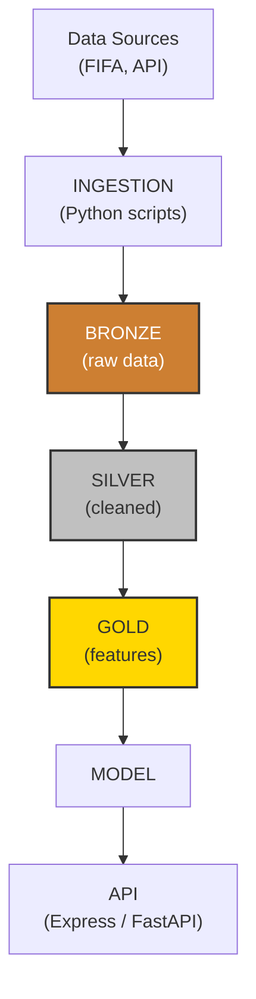

```mermaid
graph TD
    A["Data Sources<br/>(FIFA, API)"] --> B["INGESTION<br/>(Python scripts)"]
    B --> C["BRONZE<br/>(raw data)"]
    C --> D["SILVER<br/>(cleaned)"]
    D --> E["GOLD<br/>(features)"]
    E --> F["MODEL"]
    F --> G["API<br/>(Express / FastAPI)"]

    %% Estilos de las capas
    style C fill:#cd7f32,stroke:#333,stroke-width:2px,color:#fff
    style D fill:#c0c0c0,stroke:#333,stroke-width:2px,color:#333
    style E fill:#ffd700,stroke:#333,stroke-width:2px,color:#333
```

