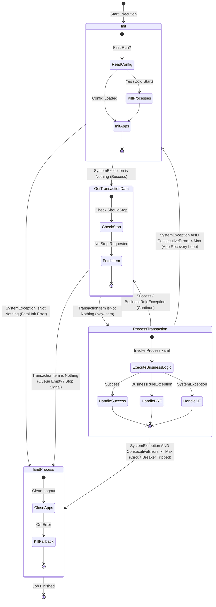
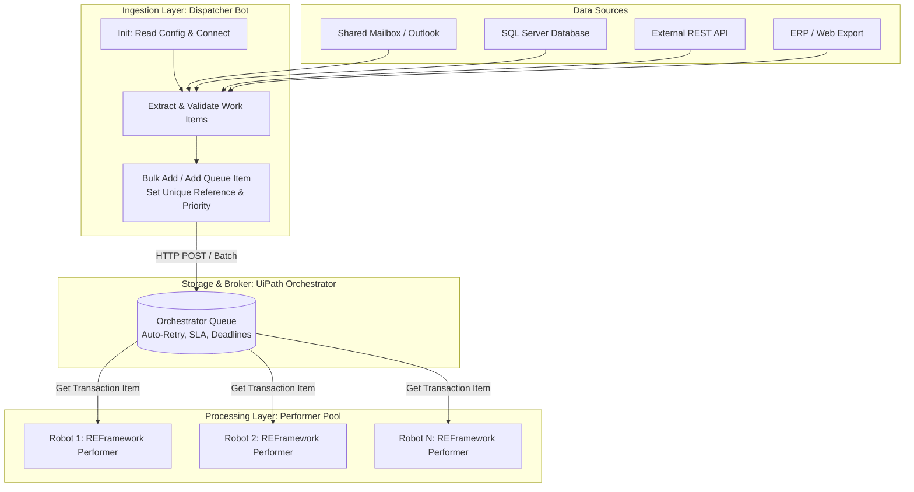
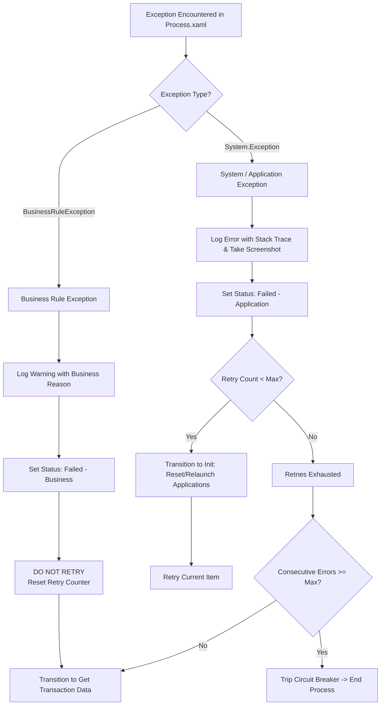

# UiPath REFramework — Architectural Theory, Coding Mechanics, and Enterprise Standards

> Refreshed and verified against current UiPath enterprise standards and production deployments, September 2026.
> This guide is the authoritative deep-dive reference for the **Robotic Enterprise Framework (REFramework)** within the `rpa-development` skill. It complements `references/uipath-standards.md` by providing comprehensive coverage of finite state machine theory, core architectural patterns (Dispatcher/Performer, Tabular/DataTable, File batching, Action Center), component-level XAML coding anatomy, multi-tier retry models, circuit breakers, and enterprise production-hardening standards.

---

## 1. Executive Summary & Core Paradigm

The **Robotic Enterprise Framework (REFramework)** is an enterprise-grade architectural template built on top of **Microsoft Windows Workflow Foundation (WF) Finite State Machines**. It is the industry standard skeleton for developing robust, scalable, unattended software robots in UiPath.

### Why REFramework Is Non-Negotiable for Enterprise Automation

In production environments, unhandled exceptions, network latency, application freezes, and database timeouts are inevitable. Naive procedural automations (linear sequences or unstructured flowcharts) fail catastrophically when encountering unexpected states: they terminate abruptly, leave applications in orphaned locks, corrupt data midway through execution, and lack systematic recovery mechanisms.

REFramework solves these challenges by providing:

1. **State-Driven Determinism**: Clear boundaries between initialization, transaction retrieval, business execution, and process termination.
2. **Transaction Isolation**: Every transaction is an atomic unit of work. The failure or crash of Transaction $N$ does not compromise or prevent the processing of Transaction $N+1$.
3. **Automated Fault Recovery & Self-Healing**: Built-in recovery loops that catch transient infrastructure failures (`SystemException`), capture diagnostic screenshots, kill stuck processes, relaunch applications to a known clean state, and retry the failed item.
4. **Separation of Concerns (SoC)**: Complete decoupling of environmental orchestration (launching apps, reading configuration, setting transaction statuses) from transactional business logic (`Process.xaml`).
5. **Config-Driven Architecture**: Externalization of all URLs, paths, timeouts, queue names, and Orchestrator assets into `Config.xlsx` and Orchestrator, enabling seamless promotion across Dev, Test, and Production environments without code modifications.
6. **Out-of-the-Box Observability**: Integrated structured logging, transaction tracking, performance counters, and exception capture designed for enterprise log aggregators (UiPath Insights, Elasticsearch, Splunk, Datadog).

---

## 2. Theoretical Foundations: Automata & Transaction Processing

### 2.1 Finite State Machine (FSM) Formalism in RPA

From a computer science perspective, REFramework implements a **Deterministic Finite State Machine (DFSM)**. Formally, it can be expressed as a 5-tuple:

$$M = (S, S_0, \Sigma, \delta, F)$$

Where:
- $S = \{\text{Init}, \text{GetTransactionData}, \text{ProcessTransaction}, \text{EndProcess}\}$ is the finite set of valid states.
- $S_0 = \text{Init}$ is the unique initial state.
- $\Sigma$ is the set of inputs and event triggers (e.g., `Success`, `SystemException`, `BusinessRuleException`, `NoData`, `StopSignal`).
- $\delta: S \times \Sigma \rightarrow S$ is the state transition function governing deterministic movements between states based on guard conditions.
- $F = \{\text{EndProcess}\}$ is the set of terminal/accepting states.

#### Architectural Comparison of Control Paradigms

| Dimension | Linear Sequence | Unstructured Flowchart | REFramework (State Machine) |
| :--- | :--- | :--- | :--- |
| **Control Flow** | Rigid, top-to-bottom procedural execution. | Visual branching with arbitrary goto jumps. | Event-driven, state-bounded transitions with guard conditions. |
| **Cyclomatic Complexity** | $O(1)$ nominally, but nesting creates $O(2^N)$ conditional branches. | Unbounded; high risk of "spaghetti" loops and dead code paths. | $O(S \times T)$ strictly bounded by the number of states and transitions. |
| **Exception Blast Radius** | Global: any unhandled failure terminates the entire process immediately. | Variable: localized try/catch blocks often leave applications in indeterminate states. | Bounded: caught at the transaction boundary; application recovery is automatic. |
| **Re-entrancy & Self-Healing** | None; requires manual re-triggering from step 1. | Difficult to construct cleanly without infinite loop hazards. | Native; warm restarts allow the bot to recover its environment and resume work. |
| **Maintainability** | Degrades exponentially as process requirements expand. | Difficult for secondary developers to trace or modify safely. | High; standardized industry architecture recognized by all senior RPA developers. |

### 2.2 Transaction Processing & ACID Guarantees in RPA

While traditional ACID guarantees apply to relational database engines, enterprise RPA must uphold analogous transactional guarantees at the business presentation and UI layer:

- **Atomicity**: A transaction either completes its entire sequence of business mutations (e.g., updating SAP, creating an order, sending a confirmation email) or rolls back/fails cleanly. If a failure occurs midway, the framework flags the item as failed, records the exact failure step, and prevents partial duplicate writes.
- **Consistency**: Applications must be left in a consistent state. If an exception aborts processing in `Process.xaml`, REFramework guarantees that applications are either reset to their home screen or forcibly killed and re-initialized before the next transaction begins.
- **Isolation**: Each transaction item is processed independently. Transient memory allocations, clipboard contents, and application UI views from Transaction $N$ must never leak into Transaction $N+1$.
- **Durability**: The outcome of every transaction (Success, Business Exception, System Exception) is durably committed to an immutable record (Orchestrator Queue, database, audit log) before the robot requests the next work item.

### 2.3 Mathematical Idempotency ($f(f(x)) = f(x)$)

In unattended automation, transactions subject to System Exceptions will be retried either by the framework or by the Orchestrator Queue. Therefore, **business logic executed in REFramework must be idempotent**:

$$\text{Apply}(x) \equiv \text{Apply}(\text{Apply}(x))$$

If a robot crashes after entering data into an ERP system but before clicking "Submit", a subsequent retry will re-execute `Process.xaml`. If `Process.xaml` blindly performs an "Insert", it will generate duplicate records. 

**Industry Standard Practice**: Always perform a **Pre-Execution State Check** (e.g., query by unique business key such as Invoice Number or PO Number) to determine if the work was already partially or fully completed before issuing write operations.

---

## 3. Structural Anatomy & The 4 Core States

REFramework organizes the entire automation lifecycle into four discrete states, managed from the root workflow `Main.xaml`.



### 3.1 State 1: Initialization (`Init`)

The `Init` state prepares the runtime environment. It handles two distinct lifecycle events:
1. **Cold Start (Initial Run)**: Executed once when the process begins. Reads `Config.xlsx`, queries Orchestrator for Assets and Credentials, cleans up rogue desktop processes, and initializes target applications.
2. **Warm Start (Post-System Exception Recovery)**: Executed when a transaction fails due to an unexpected application crash or environmental failure. The robot bypasses re-reading configuration, closes/kills crashed applications, and re-launches them to return the environment to a pristine state.

#### Internal Workflow Execution Sequence

```
Init State
│
├── [Condition: Config is Nothing] (Cold Start Only)
│   ├── Framework/InitAllSettings.xaml (Loads Config.xlsx & Orchestrator Assets)
│   └── Framework/KillAllProcesses.xaml (Forcibly terminates target applications)
│
└── Framework/InitAllApplications.xaml (Launches applications, logs in, sets base UI)
```

#### Guard Transitions Out of `Init`:
- **Success (`SystemException is Nothing`)**: Transitions to **Get Transaction Data**.
- **System Error (`SystemException isNot Nothing`)**: If initialization fails (e.g., ERP is completely down or database credentials rejected), the robot transitions directly to **End Process**.

### 3.2 State 2: Get Transaction Data (`Get Transaction Data`)

The `Get Transaction Data` state acts as the gatekeeper and scheduler. Its sole responsibility is retrieving the next discrete work item or signaling that work is complete.

#### Operational Responsibilities:
1. **Check for Stop Signals**: Invokes the `ShouldStop` activity to verify if an Orchestrator administrator requested a graceful stop, or evaluates business cut-off times.
2. **Fetch Next Item**: Invokes `Framework/GetTransactionData.xaml`. In standard implementations, this calls `Get Transaction Item` against an Orchestrator Queue.
3. **Queue Draining & State Transition**:
   - If a valid item is returned: assigns `out_TransactionItem`, increments `io_TransactionNumber`, and transitions to **Process Transaction**.
   - If no items remain (or stop signal received): sets `out_TransactionItem = Nothing` and transitions to **End Process**.

### 3.3 State 3: Process Transaction (`Process Transaction`)

The `Process Transaction` state is the execution sandbox. It isolates business actions and guarantees that any exception thrown during processing is captured, classified, and handled cleanly.

#### Execution Architecture:
1. **Invocation**: Invokes `Framework/Process.xaml`, passing `in_TransactionItem` and `in_Config`.
2. **Exception Boundary**: Wrapped in a comprehensive `Try Catch` activity:
   - **`Try` Block**: Executes transactional business steps.
   - **`Catch BusinessRuleException`**: Captures intentional functional rejections (e.g., negative invoice balance, missing mandatory field, unapproved vendor).
   - **`Catch Exception` (System/Application)**: Captures unexpected technical failures (e.g., null reference, selector not found, database timeout, application freeze).
3. **Status Commitment**: The `Finally` block executes `Framework/SetTransactionStatus.xaml`, updating the item status in Orchestrator, recording execution metrics, capturing screenshots on failure, and setting transition variables.

#### Guard Transitions Out of `Process Transaction`:
- **Success**: Transitions to **Get Transaction Data**.
- **Business Rule Exception**: Transitions to **Get Transaction Data** (the item is marked `Failed (Business)`, and the robot immediately proceeds to the next item without restarting applications).
- **System Exception (Under Limit)**: Transitions to **Init** to reset applications and retry.
- **System Exception (Limit Exceeded / Circuit Breaker)**: Transitions to **End Process** if consecutive failure thresholds are breached.

### 3.4 State 4: End Process (`End Process`)

The `End Process` state executes the teardown sequence, ensuring that robot sessions terminate cleanly and leave no lingering resources on the host machine.

#### Execution Sequence:
1. **Graceful Teardown**: Invokes `Framework/CloseAllApplications.xaml` (clicks logout buttons, closes browser windows, closes database connections).
2. **Fallback Teardown**: If `CloseAllApplications.xaml` fails or times out, a `Catch` block invokes `Framework/KillAllProcesses.xaml` to guarantee that applications are not left open.
3. **Audit & Notifications**: Dispatches execution summary emails, updates central monitoring tables, and flushes local logs.

---

## 4. Coding & Implementation Mechanics (Deep XAML Anatomy)

Enterprise-grade REFramework solutions enforce a modular directory hierarchy that separates framework plumbing from business logic.

### 4.1 Project Directory Hierarchy

```
<Project_Root>/
├── .entities/
├── .local/
├── .settings/
├── .tm/
├── Data/
│   ├── Config.xlsx               # Central configuration matrix
│   ├── Input/                    # Local input drop zone (tabular/file processing)
│   ├── Output/                   # Generated reports and exports
│   └── Temp/                     # Transient scratchpad storage
├── Framework/                    # Core REFramework engine files
│   ├── CloseAllApplications.xaml
│   ├── GetTransactionData.xaml
│   ├── InitAllApplications.xaml
│   ├── InitAllSettings.xaml
│   ├── KillAllProcesses.xaml
│   ├── Process.xaml
│   ├── RetryCurrentTransaction.xaml
│   ├── SetTransactionStatus.xaml
│   └── TakeScreenshot.xaml
├── Tests/                        # Automated unit and mock test workflows
│   ├── InitAllApplicationsTestCase.xaml
│   ├── InitAllSettingsTestCase.xaml
│   ├── MainTestCase.xaml
│   ├── ProcessTestCase.xaml
│   └── WorkflowTestCaseTemplate.xaml
├── Workflows/                    # Discrete, encapsulated business modules
│   ├── CRM/
│   │   ├── CRM_CreateLead.xaml
│   │   └── CRM_SearchCustomer.xaml
│   ├── Excel/
│   │   └── Excel_ParseInputBatch.xaml
│   └── SAP/
│       ├── SAP_EnterInvoiceDetails.xaml
│       └── SAP_NavigateToTransaction.xaml
├── Main.xaml                     # Top-level State Machine orchestrator
└── project.json                  # UiPath project definition and package dependencies
```

### 4.2 Detailed Component Responsibilities & Argument Contracts

The integrity of REFramework depends on strict argument contracts between `Main.xaml` and child workflows.

#### Component Breakdown Table

| Component | File Path | In Arguments | Out Arguments | IO Arguments | Core Responsibility |
| :--- | :--- | :--- | :--- | :--- | :--- |
| **Main** | `Main.xaml` | N/A | N/A | N/A | State Machine orchestrator; manages global variables and transitions. |
| **InitSettings** | `Framework/InitAllSettings.xaml` | `in_ConfigFile` (String)<br>`in_ConfigSheets` (String[]) | `out_Config` (Dictionary<String, Object>) | N/A | Reads `Config.xlsx` sheets and fetches Orchestrator Assets; builds global config dictionary. |
| **KillProcesses** | `Framework/KillAllProcesses.xaml` | N/A | N/A | N/A | Forcibly kills target application processes before launch or on emergency exit. |
| **InitApplications** | `Framework/InitAllApplications.xaml` | `in_Config` (Dictionary<String, Object>) | N/A | N/A | Launches target apps, navigates to base URLs, performs login handshakes, verifies landing pages. |
| **GetTransaction** | `Framework/GetTransactionData.xaml` | `in_TransactionNumber` (Int32)<br>`in_Config` (Dictionary<String, Object>) | `out_TransactionItem` (QueueItem / DataRow)<br>`out_TransactionField1` (String)<br>`out_TransactionField2` (String)<br>`out_TransactionID` (String) | `io_dt_TransactionData` (DataTable) | Fetches next transaction item; evaluates `ShouldStop`; returns `Nothing` when work is done. |
| **Process** | `Framework/Process.xaml` | `in_TransactionItem` (QueueItem / DataRow)<br>`in_Config` (Dictionary<String, Object>) | N/A | N/A | Contains purely transactional business logic. Coordinates modular sub-workflows. |
| **SetStatus** | `Framework/SetTransactionStatus.xaml` | `in_Config` (Dictionary<String, Object>)<br>`in_TransactionItem` (QueueItem / DataRow)<br>`in_SystemException` (Exception)<br>`in_BusinessException` (BusinessRuleException) | N/A | `io_RetryNumber` (Int32)<br>`io_TransactionNumber` (Int32)<br>`io_ConsecutiveSystemExceptions` (Int32) | Updates transaction status in Orchestrator/Data source; manages retry counters and screenshots. |
| **TakeScreenshot** | `Framework/TakeScreenshot.xaml` | `in_Folder` (String) | `out_FilePath` (String) | `io_FilePath` (String) | Captures desktop visual state upon exception; saves timestamped PNG to configured directory. |
| **CloseApplications** | `Framework/CloseAllApplications.xaml` | N/A | N/A | N/A | Gracefully closes all applications (clicks Log Out, closes windows, disposes open handles). |

---

## 5. Architectural Applications & Patterns in Industry

REFramework is not limited to simple Orchestrator Queues. In enterprise deployments, it adapts to diverse operational patterns.

### 5.1 Pattern A: Standard Orchestrator Queue-Driven (Dispatcher / Performer)

The industry benchmark architecture for high-volume, enterprise unattended automation is the **Dispatcher / Performer** model (also known as Producer-Consumer).



#### Why Decouple Dispatcher and Performer?
1. **Independent Elastic Scaling**: A Dispatcher runs in 2 minutes to extract 5,000 records from SAP and push them to an Orchestrator Queue. Ten Performer robots can then spin up dynamically to process the queue in parallel, meeting tight business SLAs.
2. **Fault Isolation**: If an external API or database is temporarily unavailable during ingestion, only the Dispatcher fails. The Performer pool remains unaffected.
3. **Queue Item References**: The Dispatcher must set a **Unique Reference** (e.g., `Invoice_2026_09_00123`) on every item. Orchestrator enforces reference uniqueness, automatically rejecting duplicate submissions.

### 5.2 Pattern B: Tabular Data (DataRow / DataTable / Excel / Database)

When compliance policies, network isolation, or architecture constraints prohibit Orchestrator Queues, REFramework can be refactored to consume a `System.Data.DataTable`.

#### Step-by-Step Refactoring Checklist:

1. **Global Variable Mutation in `Main.xaml`**:
   - Change `TransactionItem` datatype from `UiPath.Core.QueueItem` to `System.Data.DataRow`.
   - Ensure `TransactionData` datatype is configured as `System.Data.DataTable`.
2. **Data Extraction in `InitAllSettings.xaml` or `InitAllApplications.xaml`**:
   - Extract the entire dataset once during Initialization (e.g., via `Read Range` or `Execute Query`).
   - Assign the result to `io_dt_TransactionData`.
3. **Refactor `Framework/GetTransactionData.xaml`**:
   - Update argument types (`out_TransactionItem` as `DataRow`, `io_dt_TransactionData` as `DataTable`).
   - Implement the row index check:
     ```vb
     If in_TransactionNumber <= io_dt_TransactionData.Rows.Count Then
         out_TransactionItem = io_dt_TransactionData.Rows(in_TransactionNumber - 1)
     Else
         out_TransactionItem = Nothing
     End If
     ```
4. **Refactor `Framework/SetTransactionStatus.xaml`**:
   - **Disable or Remove** the `Set Transaction Status` activity (it only works for `QueueItem`).
   - Implement local status tracking: update a status column in `in_TransactionItem` (e.g., `in_TransactionItem("Status") = "Success"`, or write directly back to Excel/Database).
5. **Manage In-Memory Retry Counter**:
   - For `SystemException`: If `io_RetryNumber < Convert.ToInt32(in_Config("MaxRetryNumber"))`, increment `io_RetryNumber` and **do not** increment `io_TransactionNumber`. The robot will re-process the exact same row.
   - For `Success` or `BusinessRuleException`: Increment `io_TransactionNumber` and reset `io_RetryNumber = 0`.

### 5.3 Pattern C: File & Event / Directory Batching

When automating processes triggered by incoming files (e.g., PDF claims, XML orders, CSV statements):

- **Data Type**: Set `TransactionItem` to `System.IO.FileInfo` or `System.String` (full file path).
- **Extraction**: In `Init`, execute `Directory.GetFiles(in_Config("InputFolder").ToString, "*.pdf")` and store as `String[]`.
- **Concurrency & File Locking**: In `GetTransactionData`, verify the file is not locked by another process before assigning:
  ```csharp
  // C# Snippet for File Lock Verification
  private static bool IsFileLocked(string filePath) {
      try {
          using (FileStream stream = File.Open(filePath, FileMode.Open, FileAccess.ReadWrite, FileShare.None)) {
              stream.Close();
          }
      } catch (IOException) {
          return true;
      }
      return false;
  }
  ```
- **Post-Processing**: Upon completion in `SetTransactionStatus.xaml`, move the file from `Input/` to `Archive/` (on Success) or `Error/` (on Failure).

### 5.4 Pattern D: Long-Running Workflows & Action Center Integration

For processes requiring human validation (e.g., high-value invoice approvals, ambiguous document classification), standard REFramework can be paired with **UiPath Persistence Activities**:

1. **Prerequisite**: Set project property `Supports Persistence: True` in Studio.
2. **Execution Flow**:
   - In `Process.xaml`, the robot creates an approval task via `Create Form Task`.
   - The robot invokes `Wait for Form Task and Resume`.
   - **Engine Suspend**: UiPath Robot frees its license and CPU execution context, persisting its state in Orchestrator.
   - **Human Interaction**: A business user completes the form in Action Center.
   - **Engine Resume**: Orchestrator triggers an available unattended robot to resume execution from the exact point of suspension.

---

## 6. Exception Handling, Retries & Fault Tolerance

Enterprise automations must differentiate between functional rejections and environmental breakdowns.



### 6.1 Exception Taxonomy

| Attribute | `BusinessRuleException` (BRE) | `System.Exception` (System/App) |
| :--- | :--- | :--- |
| **Root Cause** | Input data invalidity; business policy violation; unfulfilled business prerequisites. | Application freeze; selector drift; network drop; database connection timeout. |
| **Examples** | "Customer credit limit exceeded", "Invoice total != line item sum", "Vendor not active". | `ElementNotFoundException`, `TimeoutException`, `NullReferenceException`, `SqlException`. |
| **Retry Suitability** | **Never retried**. Retrying identical business inputs will always yield identical rejections. | **Eligible for retry**. Environmental glitches often resolve after restart or backoff. |
| **Framework Action** | Log as `Warn`/`Info`; set queue status to `Failed (Business)`; advance to next transaction. | Log as `Error`; take screenshot; set queue status to `Failed (Application)`; restart applications via `Init`. |
| **Escalation** | Routed to business operational teams for review. | Routed to RPA engineering / IT infrastructure teams for resolution. |

### 6.2 The Three-Tier Retry Model

A common architectural flaw in RPA projects is the uncontrolled compounding of retries. Enterprise architects recognize three distinct retry layers:

```
┌─────────────────────────────────────────────────────────────┐
│ Tier 3: Queue-Level Auto-Retry (UiPath Orchestrator)        │
│ Re-enqueues item as 'New' with exponential/linear backoff.   │
│ ┌─────────────────────────────────────────────────────────┐ │
│ │ Tier 2: Framework-Level Retry (RetryCurrentTransaction) │ │
│ │ In-memory loop; used ONLY when queues are absent.       │ │
│ │ ┌─────────────────────────────────────────────────────┐ │ │
│ │ │ Tier 1: Activity-Level Retry (Retry Scope)          │ │ │
│ │ │ Local micro-retries for transient UI rendering.     │ │ │
│ │ └─────────────────────────────────────────────────────┘ │ │
│ └─────────────────────────────────────────────────────────┘ │
└─────────────────────────────────────────────────────────────┘
```

1. **Tier 1 (Activity-Level `Retry Scope`)**:
   - Scope: Localized to a single UI interaction (e.g., waiting for a slow button to become clickable).
   - Parameters: Number of retries: `3`, Retry Interval: `00:00:02`.
   - Purpose: Absorbs micro-glitches without failing the entire transaction.
2. **Tier 2 (Framework-Level In-Memory Retry)**:
   - Scope: Managed by `Framework/RetryCurrentTransaction.xaml`.
   - Usage: Dedicated strictly to **non-queue processes** (Tabular, File batching).
3. **Tier 3 (Queue-Level Auto-Retry)**:
   - Scope: Configured in the Orchestrator Queue settings (`Max # of retries = 2`).
   - Usage: When an Application Exception occurs, Orchestrator clones the transaction into a new item with status `New`.

#### The Double-Retry Anti-Pattern (Critical Warning)
> [!CAUTION]
> Never configure `MaxRetryNumber > 0` in `Config.xlsx` while simultaneously enabling auto-retries on an Orchestrator Queue. Doing so results in an $N \times M$ retry explosion: if the queue retry is 2 and the config retry is 2, a single bad transaction can be retried up to 6 times, wasting robot capacity and spamming target applications.
>
> **Golden Rule**: If using Orchestrator Queues, set `MaxRetryNumber = 0` in `Config.xlsx`. Let Orchestrator govern transactional retries.

### 6.3 The Circuit Breaker Pattern (`ConsecutiveSystemExceptions`)

If a core enterprise application crashes completely (e.g., SAP central server goes offline during scheduled maintenance), every subsequent transaction will fail with a `SystemException`. 

Without a circuit breaker, a robot will:
1. Attempt Transaction 1 $\rightarrow$ Fail $\rightarrow$ Restart SAP $\rightarrow$ Fail Init.
2. If Init succeeds, attempt Transaction 2 $\rightarrow$ Fail $\rightarrow$ Restart $\dots$
3. Burn through hundreds of queue items, marking them all as `Failed (Application)`.

**REFramework Circuit Breaker Implementation**:
- REFramework tracks `io_ConsecutiveSystemExceptions` across transactions.
- Every `SystemException` increments this counter.
- Any `Success` resets this counter back to `0`.
- In `Config.xlsx`, define `MaxConsecutiveSystemExceptions` (standard default: `3`).
- In `SetTransactionStatus.xaml`, if `io_ConsecutiveSystemExceptions >= Convert.ToInt32(in_Config("MaxConsecutiveSystemExceptions"))`, the robot overrides the next state transition and forces an immediate exit to **End Process**, dispatching a high-priority alert to the support team.

---

## 7. Enterprise Best Practices & Production Hardening

### 7.1 Session & Process Hygiene (24/7 Unattended Robots)

Unattended robots operating continuously across multi-day shifts are vulnerable to memory leaks, lingering GDI handles, and orphaned background processes.

1. **Strict Process Slaughter**:
   - In `KillAllProcesses.xaml`, target only the processes associated with the automation (e.g., `chrome`, `excel`, `iexplore`, `saplogon`).
   - Never use blanket process kills that affect other user sessions in multi-session environments. Use session-scoped killing:
     ```vb
     Process.GetProcessesByName("chrome").Where(Function(p) p.SessionId = Process.GetCurrentProcess().SessionId).ToList().ForEach(Sub(p) p.Kill())
     ```
2. **Preventing Browser Zombie Tabs**:
   - Always open browsers with clean profiles or explicitly pass the argument `--incognito` / `--inprivate` for session isolation.
   - Close tabs explicitly in `CloseAllApplications.xaml` rather than relying on window close buttons.
3. **DataTable Disposal**:
   - When processing massive tabular datasets, call `dt_LargeTable.Clear()` and `dt_LargeTable.Dispose()` before transitioning to `End Process` to release managed memory back to the CLR garbage collector.

### 7.2 Configuration Management Across Environments

Enterprise delivery pipelines span Development, Test/UAT, and Production tenants. **Zero code changes must occur during deployment.**

#### Standard `Config.xlsx` Architecture:
- **`Settings` Sheet**: Environmental switches, local time thresholds, file paths.
- **`Constants` Sheet**: Static application constants, regex patterns, internal error messages.
- **`Assets` Sheet**: Orchestrator Asset names (String, Boolean, Integer). The robot dynamically fetches the value from the Orchestrator folder it is running within.
- **Environment Parity**: Store environment-specific URLs and credentials in Orchestrator Assets with identical names across tenants/folders. In `Config.xlsx`, reference only the asset name:

| Asset Name in Config.xlsx | Dev Folder Value | UAT Folder Value | Prod Folder Value |
| :--- | :--- | :--- | :--- |
| `SAP_Endpoint_URL` | `https://sap-dev.internal/` | `https://sap-uat.internal/` | `https://sap.corp.net/` |
| `BillingService_Credentials` | Dev Credential Asset | UAT Credential Asset | CyberArk Vault Asset |

### 7.3 Structured Logging & Observability

Standardize on structured logging fields to enable real-time dashboard analytics in Elasticsearch or Splunk.

#### Logging Checklist:
- **Add Log Fields**: In `GetTransactionData.xaml`, immediately after acquiring an item, execute `Add Log Fields` to append:
  - `TransactionID`: Business identifier (e.g., Invoice Number).
  - `QueueName`: Source queue.
  - `ExecutionID`: `Guid.NewGuid().ToString()` representing the specific run.
- **Log Levels**:
  - `Trace`: Element search, selector tuning, detailed flow path entry/exit (stripped in production).
  - `Info`: Transaction start, transaction completion, major milestones.
  - `Warn`: Handled business rule exceptions, non-critical retry events.
  - `Error`: System exceptions, application crashes, selector failures.
  - `Fatal`: Initialization failure, circuit breaker tripped, license revocation.
- **No Sensitive Data**: Never log passwords, API bearer tokens, Social Security numbers, or raw credit card data. Audit log fields for GDPR/HIPAA compliance.

### 7.4 Workflow Analyzer Rules for REFramework Projects

Prior to pushing code to repository feature branches, enforce Workflow Analyzer rules via `uipcli` or Studio:

| Rule Code | Rule Description | Enforced Standard in REFramework |
| :--- | :--- | :--- |
| **ST-NMG-001** | Variable Naming Convention | Strict type prefixes (`str`, `int`, `dt`, `dict`). |
| **ST-NMG-002** | Argument Naming Convention | Strict direction prefixes (`in_`, `out_`, `io_`). |
| **ST-MRG-008** | Activity Naming | Default activity names (`Assign`, `Click`, `If`) forbidden; must describe intent. |
| **ST-USG-001** | Unused Variables | Must be cleaned up; zero orphaned variables permitted. |
| **ST-SEC-001** | SecureString Log Check | Forbids logging variables of type `SecureString` or plaintext passwords. |
| **ST-EXP-001** | Empty Catch Blocks | Catch blocks must contain explicit handling; swallowing errors is blocked. |

---

## 8. Troubleshooting & Anti-Patterns Catalog

| Anti-Pattern | Root Cause | Production Impact | Architecturally Correct Remedy |
| :--- | :--- | :--- | :--- |
| **1. Business Logic in `Main.xaml`** | Developers drag-and-drop activities directly into the State Machine states. | High cyclomatic complexity; breaks modular testing; violates Single Responsibility. | Keep `Main.xaml` strictly as an orchestrator. All business steps belong in `Process.xaml` and child modules. |
| **2. Swallowing Exceptions in `Process.xaml`** | Developer places a blanket `Try Catch` inside `Process.xaml` with an empty `Catch`. | REFramework assumes the transaction succeeded. Item is marked `Success` despite missing data. | Never swallow errors. Catch specific errors only if actionable recovery is possible; otherwise, re-throw or throw a `BusinessRuleException`. |
| **3. Hardcoding in XAML** | URLs, email recipients, and file paths typed directly into activity properties. | Code breaks when deployed to UAT/Production; requires full code recompilation. | Route every variable parameter through `Config.xlsx` or Orchestrator Assets. |
| **4. Ignoring Stop Signals** | Omitting `ShouldStop` evaluation in `GetTransactionData.xaml`. | Orchestrator "Stop" commands are ignored until the entire queue of 10,000 items drains. | Evaluate `ShouldStop` on every transaction cycle; if `True`, set `out_TransactionItem = Nothing` to exit gracefully. |
| **5. Application Launch in `Process.xaml`** | Launching SAP or Chrome inside `Process.xaml`. | 1,000 transactions result in 1,000 application launches and crashes, exhausting OS memory. | Applications must be launched **once** in `InitAllApplications.xaml` and reused across transactions. |
| **6. Non-Idempotent Database Writes** | Direct `INSERT` query executed in `Process.xaml` without pre-checking existence. | When a transient network error triggers a transaction retry, duplicate records are created. | Implement pre-checks: `SELECT COUNT(*) WHERE Key = @Key` before executing `INSERT` or use `UPSERT` / `MERGE`. |
| **7. Changing Item Type Incompletely** | Converting to Tabular `DataRow` without updating argument types across all files. | Compilation errors in `SetTransactionStatus.xaml`, `Main.xaml`, and `GetTransactionData.xaml`. | Follow the systematic 5-step refactoring checklist in Section 5.2. Update all dependent signatures simultaneously. |

---

## 9. Production Sign-Off Checklist

Before any REFramework automation is promoted to Production (UAT sign-off), the Lead RPA Architect must verify the following:

- [ ] **State Machine Integrity**: `Main.xaml` contains no raw business logic; all transitions and guards adhere to the standard REFramework template.
- [ ] **Config Externalization**: Zero hardcoded environment URLs, file system paths, or recipient emails exist in workflows.
- [ ] **Credential Security**: All credentials are stored as Orchestrator Credential Assets (or CyberArk/Azure Key Vault); no passwords exist in plaintext or config sheets.
- [ ] **Exception Classification**: Business Rule Exceptions are thrown intentionally with human-readable explanations; System Exceptions preserve native stack traces.
- [ ] **Retry Configuration**: The double-retry anti-pattern has been verified and eliminated (`MaxRetryNumber = 0` in `Config.xlsx` when using Orchestrator Queues).
- [ ] **Circuit Breaker Active**: `MaxConsecutiveSystemExceptions` is configured (default: 3) to prevent queue exhaustion during outages.
- [ ] **Session Hygiene**: `KillAllProcesses.xaml` cleans up rogue processes on startup and failure without affecting external user sessions.
- [ ] **Graceful Teardown**: `CloseAllApplications.xaml` executes clean UI logouts and disconnects database sessions.
- [ ] **Diagnostic Artifacts**: `TakeScreenshot.xaml` saves failure screenshots to the designated network share or storage bucket.
- [ ] **Workflow Analyzer Passed**: 0 Errors, 0 unapproved Warnings when evaluated against the enterprise rule profile.
- [ ] **Unit Tests Passed**: Individual sub-workflows in `Workflows/` validate successfully against mock test cases in `Tests/`.
